# 2026-08-02 Daily Papers (Top 38)

## 오늘의 요약
오늘의 연구는 AI 에이전트가 스스로를 개선하거나 복합적인 워크플로우를 수행하는 자율적 역량과, 모델 내부 파라미터를 활용한 효율적인 메모리 아키텍처 설계에 집중되었습니다. 또한, 단순한 데이터 생성을 넘어 물리적 법칙과 코드를 결합하여 실세계의 일관성을 확보하려는 시도들이 돋보였습니다.

### 오늘의 핵심 포인트
- 외부 저장소 의존도를 낮추고 모델 내부 파라미터를 활용하는 네이티브 메모리 및 효율적 스케일링 방법론이 제시되었습니다.
- AI 에이전트가 스스로 코드를 작성, 디버깅, 최적화하는 재귀적 자기 개선(RSI)과 자율적 엔지니어링의 가능성이 탐구되었습니다.
- GUI/CLI 통합 제어, 물리 법칙 기반의 비디오 생성 등 실세계 중심의 복합적인 워크플로우 자동화 연구가 주목받았습니다.

**오늘의 태그**: AI Agent, Memory Architecture, Self-Improvement, Automation

## 1. [AskChem: Claim-Centered Infrastructure for Chemistry Literature Synthesis](https://huggingface.co/papers/2607.28618)
**Upvotes**: 290 | **도입 난이도**: 중 | **신뢰도**: 상
**arXiv**: https://arxiv.org/abs/2607.28618

**태그**: RAG, Knowledge-Graph, AI-Agent, Information-Retrieval, Agent, Evaluation

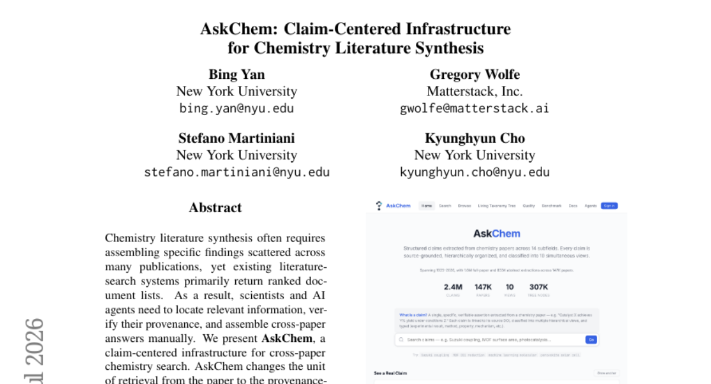

### 📌 한 줄 요약
문서 단위가 아닌 원자적 '클레임(Claim)' 단위의 검색/추론 인프라를 통해 화학 문헌 합성의 정확도를 높이는 시스템

### 🔑 핵심 포인트
- 문서 단위가 아닌 출처(DOI)와 원문이 결합된 원자적 '클레임' 단위의 검색 인프라 구축
- 계층적 분류, 증거 그래프, 탐색적 분류 체계를 통한 다각적 검색 및 합성 구조 제공
- AI 에이전트를 위한 REST, SDK, MCP 인터페이스 지원 및 대규모 데이터 인덱싱

### 🧑‍💻 개발자 관점
RAG(Retrieval-Augmented Generation) 시스템 구축 시, 문서 전체가 아닌 검증 가능한 최소 단위의 데이터 구조를 설계하는 데 중요한 아키텍처 모델을 제시합니다.

### 🚀 실무 적용 아이디어
- 제공된 SDK/API를 활용하여 특정 도메인 지식 추출 성능 테스트
- 문서 단위 RAG와 클레임 단위 RAG의 답변 정확도 비교 실험
- MCP(Model Context Protocol)를 통한 AI 에이전트 연동 실험

### ⚠️ 리스크/한계
- 클레임 추출 과정에서의 정보 손실 또는 왜곡 가능성
- 대규모 클레임 데이터베이스 유지보수 및 인덱싱 비용

### 📝 초록 기반 상세 설명
기존 화학 문헌 검색 시스템은 문서 단위의 랭킹을 제공하여 연구자가 정보를 수동으로 검증하고 조립해야 하는 번거로움이 있었습니다. 이를 해결하기 위해 AskChem은 검색 단위를 논문에서 출처가 명시된 원자적 클레임(Claim)으로 전환하는 인프라를 제안합니다. 각 논문은 출처 DOI와 원문 인용을 포함하는 유형화된 클레임으로 변환되어 공유 저장소에 저장됩니다. 이 시스템은 계층적 검색을 위한 분류 체계, 클레임 간 관계를 연결하는 증거 그래프, 과학적 원리에 기반한 탐색적 분류 체계를 제공합니다. 14.7만 편의 논문에서 240만 개의 클레임을 인덱싱하였으며, 실험 결과 기존 방식보다 높은 DOI 해결 능력과 인용 밀도를 보여주었습니다.

---

## 2. [Qwen-UI-Agent Technical Report: Toward Next-Generation Real-World Centric Foundation GUI Agents](https://huggingface.co/papers/2607.28227)
**Upvotes**: 277 | **도입 난이도**: 상 | **신뢰도**: 상
**arXiv**: https://arxiv.org/abs/2607.28227

**태그**: Agent, GUI, Automation, Reinforcement Learning, Vision, Benchmark, Evaluation

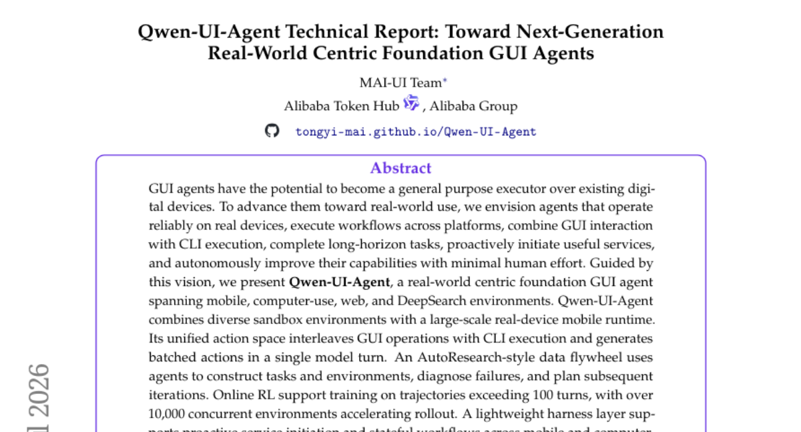

### 📌 한 줄 요약
모바일, PC, 웹을 아우르는 실세계 중심의 차세대 통합 GUI 에이전트 프레임워크 개발

### 🔑 핵심 포인트
- 모바일, PC, 웹, DeepSearch를 아우르는 통합 GUI/CLI 액션 공간 설계
- AutoResearch 스타일의 데이터 플라이휠을 통한 자동화된 태스크 생성 및 실패 진단
- 10,000개 이상의 동시 환경과 온라인 RL을 활용한 대규모 장기 워크플로우 학습

### 🧑‍💻 개발자 관점
단순한 화면 클릭을 넘어 CLI와 GUI를 결합한 복합 워크플로우 자동화의 실질적인 가능성을 제시합니다.

### 🚀 실무 적용 아이디어
- 제시된 모바일/컴퓨터 통합 액션 공간의 구조 분석
- 대규모 환경에서의 RL 학습 효율성 및 데이터 플라이휠 메커니즘 검토
- 기존 GUI 에이전트와 CLI 결합 방식의 비교 실험

### ⚠️ 리스크/한계
- 실제 기기 런타임 및 대규모 샌드박스 환경 구축의 높은 비용과 복잡성
- 장기 워크플로우 수행 시 발생할 수 있는 누적 오류 및 상태 관리 문제

### 📝 초록 기반 상세 설명
기존 GUI 에이전트는 실세계의 복잡한 워크플로우와 다양한 플랫폼 간의 상호작용을 처리하는 데 한계가 있었습니다. 이를 해결하기 위해 모바일, 컴퓨터, 웹 환경을 통합 지원하는 Qwen-UI-Agent를 제안합니다. 이 모델은 GUI 조작과 CLI 실행을 결합한 통합 액션 공간을 사용하며, 대규모 실기기 런타임과 자동화된 데이터 플라이휠을 통해 학습합니다. 또한 온라인 RL을 통해 장기적인 작업 수행 능력을 확보했습니다. 실험 결과, 모바일 환경에서 SOTA 성능을 달성했으며 컴퓨터 및 브라우저 사용 작업에서도 최첨단 모델들과 경쟁 가능한 성능을 보여주었습니다.

---

## 3. [Metis: Memory Foundation Model](https://huggingface.co/papers/2607.26760)
**Upvotes**: 252 | **도입 난이도**: 상 | **신뢰도**: 상
**arXiv**: https://arxiv.org/abs/2607.26760

**태그**: AI Agent, Memory Architecture, Foundation Model, Efficient Inference, Agent, Reasoning, Multimodal, Inference

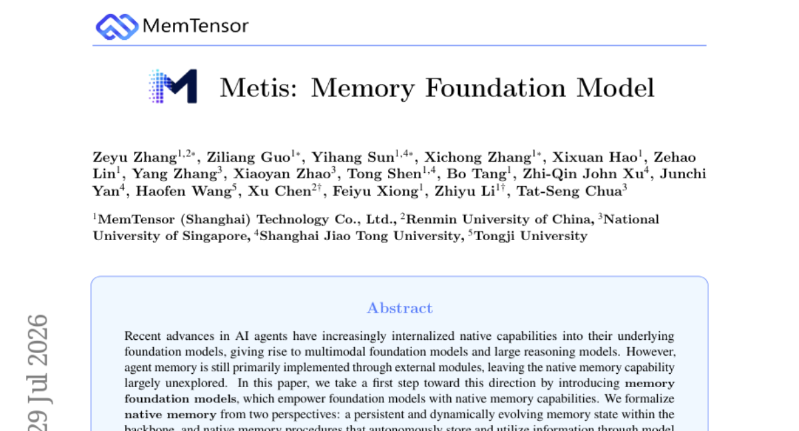

### 📌 한 줄 요약
외부 모듈 없이 모델 내부 파라미터와 연산만으로 정보를 저장·활용하는 '네이티브 메모리' 기반 모델 아키텍처 제안

### 🔑 핵심 포인트
- 외부 저장소 의존도를 낮춘 모델 내부의 '네이티브 메모리' 개념 정립
- 가중치 업데이트 없이 순방향 패스(Forward pass)만으로 수행되는 효율적인 메모리 유지 관리
- 역사적 정보를 모델 내부에 압축하고 메모리 어텐션으로 접근하는 새로운 아키텍처 설계

### 🧑‍💻 개발자 관점
RAG와 같은 외부 DB 의존형 메모리 방식에서 벗어나, 모델 자체가 문맥을 효율적으로 압축·기억하는 차세대 에이전트 아키텍처의 방향성을 제시합니다.

### 🚀 실무 적용 아이디어
- 제공된 체크포인트를 활용하여 기존 RAG 방식과 Metis의 정보 회상 성능 비교
- 메모리 압축 효율에 따른 컨텍스트 윈도우 확장 가능성 테스트
- 장기 기억(Long-term memory) 유지 성능에 대한 벤치마크 수행

### ⚠️ 리스크/한계
- 모델 내부 상태에 의존하므로 메모리 용량 및 압축 손실 문제 발생 가능성
- 새로운 아키텍처 도입에 따른 기존 학습 프레임워크와의 호환성 검토 필요

### 📝 초록 기반 상세 설명
최근 AI 에이전트의 메모리는 주로 외부 모듈을 통해 구현되어 모델 자체의 네이티브 메모리 역량은 미개척 상태로 남아 있습니다. 본 논문은 모델 백본 내에 지속적이고 동적으로 진화하는 메모리 상태를 구축하는 '메모리 파운데이션 모델' 개념을 정립합니다. 이를 위해 제안된 Metis는 과거 정보를 모델 내부에 압축하고 메모리 어텐션을 통해 접근하는 새로운 아키텍처를 도입합니다. 대규모 메모리 특화 데이터셋과 최적화 목적 함수를 통해 미드 트레이닝(mid-training) 방식으로 네이티브 메모리 절차를 학습시킵니다. 실험 결과, Metis는 가중치 동결 상태에서 순방향 연산만으로 효율적인 메모리 업데이트가 가능함을 입증했습니다.

### 🖼️ 추가 자료

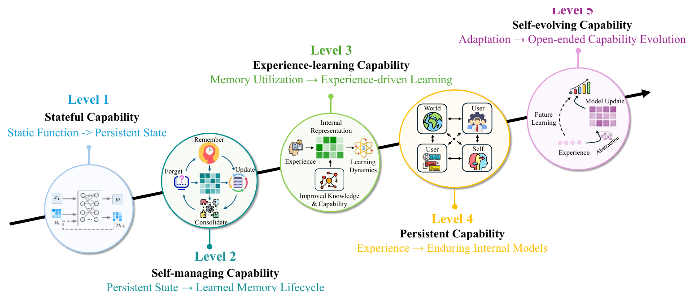
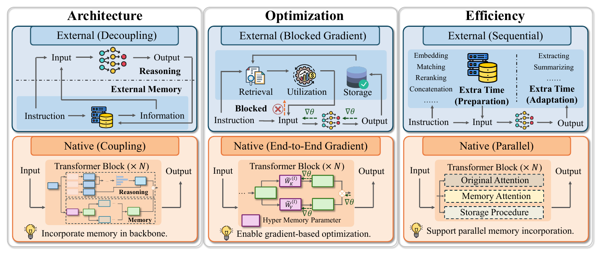

---

## 4. [Frontis-MA1: Training an AI4AI Model towards Recursive Self-Improvement in Machine Learning Engineering](https://huggingface.co/papers/2607.28568)
**Upvotes**: 161 | **도입 난이도**: 상 | **신뢰도**: 상
**arXiv**: https://arxiv.org/abs/2607.28568

**태그**: AI Agent, Self-Improvement, MLOps, Reinforcement Learning, Agent, RAG, Benchmark, Evaluation, Inference

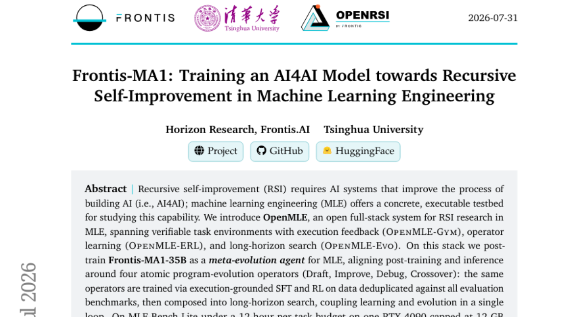

### 📌 한 줄 요약
AI가 스스로 코드를 작성하고 개선하는 '재귀적 자기 개선(RSI)' 연구를 위한 풀스택 프레임워크와 모델 공개

### 🔑 핵심 포인트
- AI4AI 연구를 위한 풀스택 시스템 'OpenMLE' 구축 (Gym, RL, Evo)
- 4가지 원자적 연산자(Draft, Improve, Debug, Crossover) 기반의 사후 학습 및 진화 루프 설계
- 실행 피드백을 활용한 SFT와 RL을 결합하여 모델의 MLE 성능 극대화

### 🧑‍💻 개발자 관점
AI 에이전트가 단순히 코드를 짜는 것을 넘어, 스스로 디버깅하고 최적화하는 '자율적 엔지니어링'의 가능성을 보여줍니다.

### 🚀 실무 적용 아이디어
- 공개된 OpenMLE 스택을 활용하여 특정 도메인 특화 MLE 에이전트 학습 실험
- 제시된 4가지 원자적 연산자가 다른 프로그래밍 태스크에서도 유효한지 검증
- 제한된 VRAM 환경(RTX 4090 등)에서의 효율적인 모델 진화 루프 재현

### ⚠️ 리스크/한계
- 실행 가능한 코드 환경(Sandbox)에 대한 의존도가 높아 보안 및 격리 이슈 발생 가능
- 특정 벤치마크에 과적합(Overfitting)될 위험성 존재

### 📝 초록 기반 상세 설명
AI 시스템이 스스로를 개선하는 재귀적 자기 개선(RSI) 연구를 위해, 실행 가능한 MLE(Machine Learning Engineering) 환경이 필요합니다. 이를 위해 연구진은 OpenMLE라는 풀스택 시스템(Gym, RL, Evo)을 구축했습니다. 이 환경 위에서 35B 모델인 Frontis-MA1을 메타 진화 에이전트로 사후 학습(Post-training)시켰습니다. 학습 과정에서 Draft, Improve, Debug, Crossover라는 네 가지 원자적 연산자를 정의하고, 이를 SFT와 RL로 학습한 뒤 장기 탐색(Long-horizon search)에 결합했습니다. 실험 결과, MLE-Bench Lite에서 베이스 모델 대비 성능이 대폭 향상되었으며 NatureBench Lite에서도 높은 전이 성능을 보였습니다. 최종적으로 모델 가중치와 OpenMLE 스택을 공개하여 재귀적 자기 개선 연구를 촉진하고자 합니다.

---

## 5. [PhiZero: A World Model Built Around Physical Language](https://huggingface.co/papers/2607.28624)
**Upvotes**: 155 | **도입 난이도**: 중 | **신뢰도**: 중
**arXiv**: https://arxiv.org/abs/2607.28624

**태그**: Reasoning, Vision, Video, Benchmark

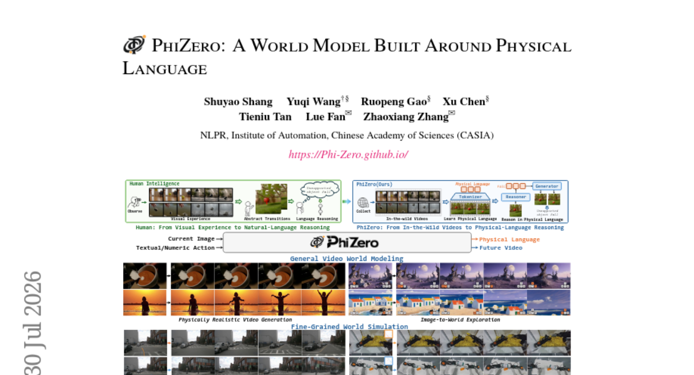

### 📌 한 줄 요약
자세한 분석 내용은 원문 또는 arXiv 링크를 참고해 주세요.

### 🔑 핵심 포인트
- 논문 원문을 확인하시기 바랍니다.

### 📝 초록 기반 상세 설명
상세 초록은 원문 페이지에서 확인 가능합니다.

---

## 6. [VideoCoCo: Code-as-CoT for Physically-Consistent Video Generation via an Agentic Dual-Engine System](https://huggingface.co/papers/2607.27380)
**Upvotes**: 64 | **도입 난이도**: 상 | **신뢰도**: 상
**arXiv**: https://arxiv.org/abs/2607.27380

**태그**: Video-Generation, Agentic-Workflow, Physics-Simulation, Code-as-CoT, Agent, RAG, Reasoning, Video, Benchmark

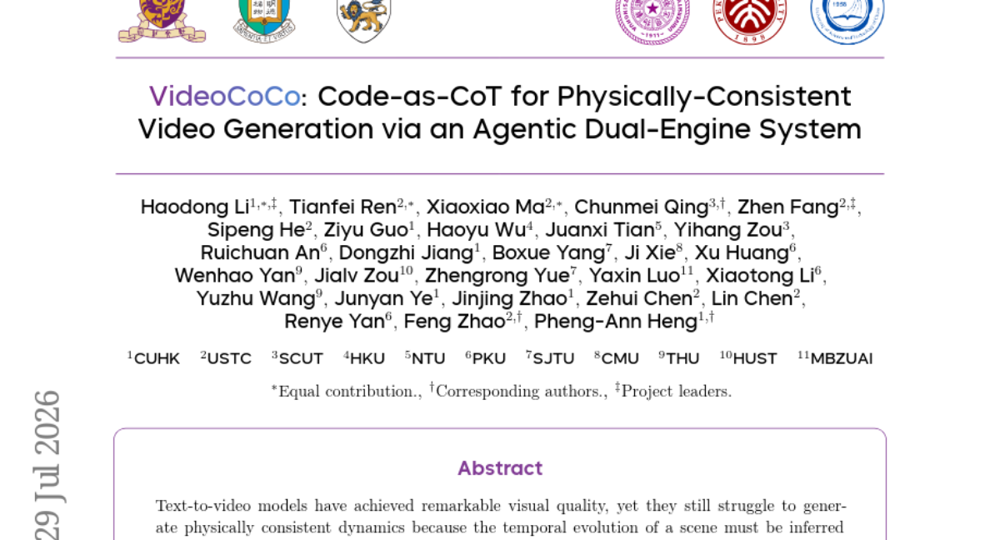

### 📌 한 줄 요약
실행 가능한 Blender 코드를 중간 단계(CoT)로 활용하여 물리적 일관성이 확보된 고품질 비디오를 생성하는 에이전트 프레임워크

### 🔑 핵심 포인트
- 실행 가능한 Blender 코드를 중간 표현(CoT)으로 사용하여 물리적 법칙을 명시적으로 정의
- 시뮬레이션 엔진(초안 생성)과 생성 엔진(실사화)을 분리한 에이전트 이중 엔진 구조
- 시뮬레이션 초안에 최적화된 데이터셋 VideoCoCo-3K 구축 및 성능 검증

### 🧑‍💻 개발자 관점
단순한 픽셀 생성을 넘어, 물리 법칙이 적용된 정교한 움직임을 제어 가능한 코드로 구현할 수 있는 새로운 워크플로우를 제시합니다.

### 🚀 실무 적용 아이디어
- Blender Python API와 생성형 AI 모델 간의 연동 워크플로우 테스트
- 코드 기반 시뮬레이션 초안이 생성 모델의 텍스트 가이드와 충돌하는 케이스 분석
- 물리적 역학이 복잡한 시나리오에서의 코드 생성 정확도 검증

### ⚠️ 리스크/한계
- 코드 생성 에이전트의 오류 발생 시 전체 비디오 생성 프로세스가 중단될 위험
- 복잡한 물리 시뮬레이션 코드를 생성하는 데 따르는 높은 연산 비용 및 시간

### 📝 초록 기반 상세 설명
기존 텍스트-비디오 모델은 압축된 프롬프트로부터 복잡한 물리적 역학을 추론해야 하므로 물리적 일관성 유지에 어려움이 있었습니다. 기존의 Chain-of-Thought 방식은 중간 계획이 비실행적이거나 시간적 밀도가 낮아 전체 시공간 과정을 제어하기 어려웠습니다. 이를 해결하기 위해 본 논문은 실행 가능한 Blender 코드를 프로세스 수준의 CoT로 사용하는 'VideoCoCo' 프레임워크를 제안합니다. 코딩 에이전트가 생성한 코드를 시뮬레이션 엔진이 실행하여 결정론적인 초안을 만들고, 이를 생성 엔진이 실사 비디오로 변환하는 이중 엔진 구조를 가집니다. 실험 결과, 제안된 방식은 PhyGenBench와 VBench-2.0 벤치마크에서 기존 모델 대비 우수한 성능을 기록하며 물리적 일관성과 제어 가능성을 입증했습니다.

---

## 7. [Memory Decoder at Scale: A Pretrained, Parametric Long-Term Memory](https://huggingface.co/papers/2607.27919)
**Upvotes**: 48 | **도입 난이도**: 상 | **신뢰도**: 상
**arXiv**: https://arxiv.org/abs/2607.27919

**태그**: LLM, Memory-Augmented, Scaling Laws, Efficient Training, RAG, Reasoning, Benchmark, Evaluation

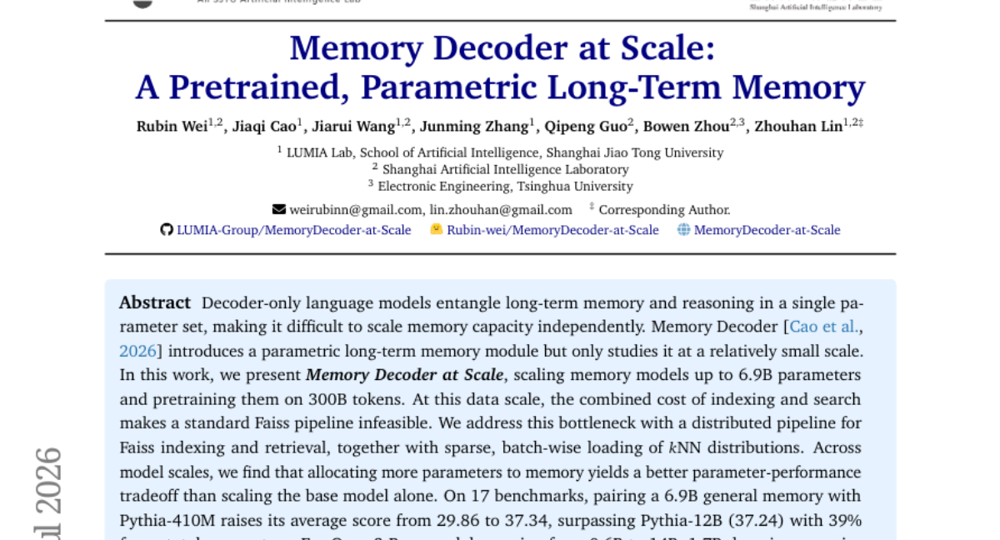

### 📌 한 줄 요약
모델 크기를 키우는 대신 독립적인 파라미터 기반 메모리 모듈을 확장하여 효율적으로 성능을 높이는 방법론 제시

### 🔑 핵심 포인트
- 독립적인 파라미터 기반 장기 메모리 모듈의 대규모 스케일링 방법론 제시
- 대규모 인덱싱/검색 병목을 해결하는 분산 Faiss 파이프라인 및 배치 로딩 기술 개발
- 베이스 모델 확장 대비 메모리 모듈 확장이 더 높은 파라미터 효율성을 가짐을 증명

### 🧑‍💻 개발자 관점
모델 전체를 재학습하거나 키우는 대신, 특정 메모리 모듈만 확장함으로써 적은 비용으로 모델의 지식 용량을 효율적으로 증대시킬 수 있습니다.

### 🚀 실무 적용 아이디어
- 소형 베이스 모델에 외부 파라미터 메모리 모듈을 결합하는 아키텍처 실험
- 대규모 벡터 데이터베이스(Faiss 등)를 활용한 분산 인덱싱 파이프라인 구축 테스트
- 도메인 특화 메모리 모듈이 범용 모델 성능에 미치는 영향 분석

### ⚠️ 리스크/한계
- 대규모 인덱싱 및 검색을 위한 분산 인프라 구축 비용 발생
- 메모리 모듈과 베이스 모델 간의 상호작용 최적화 난이도

### 📝 초록 기반 상세 설명
기존 디코더 전용 언어 모델은 추론과 장기 기억이 하나의 파라미터 세트에 얽혀 있어 메모리 용량을 독립적으로 확장하기 어렵습니다. 본 연구는 메모리 모델을 최대 6.9B 파라미터, 300B 토큰 규모로 확장하는 'Memory Decoder at Scale'을 제안합니다. 대규모 데이터 환경에서 발생하는 Faiss 인덱싱 및 검색 병목 현상을 해결하기 위해 분산 파이프라인과 희소 배치 로딩 방식을 도입했습니다. 실험 결과, 메모리 파라미터를 할당하는 것이 베이스 모델만 확장하는 것보다 더 나은 파라미터 대비 성능 효율을 보였습니다. 특히 작은 베이스 모델에 대규모 메모리 모듈을 결합했을 때, 더 큰 모델보다 높은 성능을 달성하며 효율적인 성능 향상 경로를 입증했습니다.

---

## 8. [Beacon: Knowing When and How to Perform Agentic Visual Reasoning](https://huggingface.co/papers/2607.28595)
**Upvotes**: 46 | **도입 난이도**: 중 | **신뢰도**: 상
**arXiv**: https://arxiv.org/abs/2607.28595

**태그**: Agent, Multimodal, Reinforcement Learning, Vision-Language, RAG, Reasoning, Benchmark

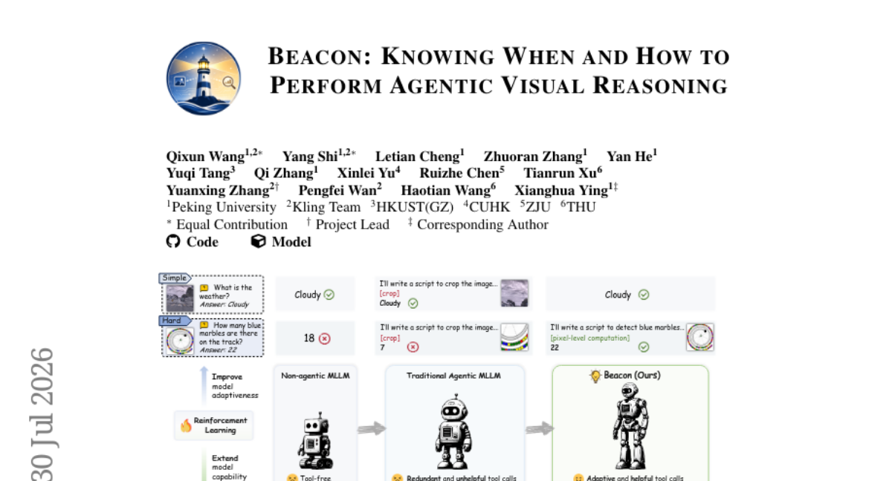

### 📌 한 줄 요약
불필요한 도구 사용을 줄이고 어려운 문제에만 선택적으로 도구를 활용하여 효율성과 성능을 동시에 잡은 에이전트 시각 추론 모델

### 🔑 핵심 포인트
- Mode Adaptiveness(필요 시에만 도구 사용)와 Tool Effect(도구로 인한 실질적 성능 향상) 개념 정립
- 강화 학습을 통해 도구 호출의 필요성을 학습하는 Necessity-Aware Adaptive Reward 도입
- 어려운 문제 해결 능력을 극대화하는 Hint-Guided Capability Expansion 메커니즘 적용

### 🧑‍💻 개발자 관점
에이전트가 모든 작업에 무분별하게 도구를 호출하여 발생하는 비용/지연 문제를 해결하고, 모델의 기본 추론 능력과 도구 활용 능력 사이의 균형을 잡는 실무적 가이드라인을 제공합니다.

### 🚀 실무 적용 아이디어
- 기존 MLLM 에이전트의 도구 호출 빈도와 정답률 간의 상관관계 분석
- 도구 사용이 쉬운 문제의 성능을 저하시키는지에 대한 벤치마크 테스트 수행
- 강화 학습 시 도구 사용에 대한 페널티/리워드 스케줄링 실험

### ⚠️ 리스크/한계
- 도구 사용 여부를 판단하는 판단 로직이 복잡해질 경우 추론 지연 시간(Latency) 증가 가능성
- 특정 도구에 과도하게 의존하거나 반대로 아예 사용하지 않는 편향 발생 위험

### 📝 초록 기반 상세 설명
기존의 에이전트 기반 시각 추론은 복잡한 작업 수행을 목표로 하지만, 도구 사용의 효율성과 실제 성능 향상 사이의 균형을 맞추는 데 어려움이 있습니다. 기존 모델들은 도구가 필요한 시점을 정확히 판단하지 못하거나, 쉬운 문제에서 도구 사용으로 인해 오히려 오류가 발생하는 문제를 보입니다. 본 논문은 도구 사용의 필요성을 판단하는 Mode Adaptiveness와 도구의 실질적 효과인 Tool Effect를 핵심 차원으로 정의합니다. 이를 해결하기 위해 필요에 따라 도구를 호출하는 'Necessity-Aware Adaptive Reward'와 어려운 문제 해결 능력을 키우는 'Hint-Guided Capability Expansion' 메커니즘을 포함한 Beacon 모델을 제안합니다. 실험 결과, Beacon은 도구 사용의 적절성을 높이면서도 어려운 문제에서 실질적인 성능 향상을 달리며 기존 모델보다 우수한 성능을 입증했습니다.

---

## 9. [BM25 Wins at Scale: A Scaling Study of Retrieval-Augmented Generation Paradigms](https://huggingface.co/papers/2607.26497)
**Upvotes**: 40 | **도입 난이도**: 하 | **신뢰도**: 상
**arXiv**: https://arxiv.org/abs/2607.26497

**태그**: RAG, BM25, Scalability, LLM-Agent, Agent, Reasoning, Benchmark, Evaluation, Inference

### 📌 한 줄 요약
RAG 시스템 구축 시 데이터 규모가 커질수록 에이전트 방식보다 BM25 기반의 키워드 검색이 비용 대비 성능 면에서 압도적인 우위를 점합니다.

### 🔑 핵심 포인트
- 데이터 규모가 커질수록 에이전트 방식의 비용과 지연시간이 급증하며 성능이 저하됨
- 약 1,000만 토큰 규모를 기점으로 BM25가 에이전트 방식을 추월하며 가장 강력한 확장성을 보임
- Dense 및 Graph 기반 RAG는 특정 규모에서 비용 장벽이나 성능 한계에 직면함

### 🧑‍💻 개발자 관점
대규모 데이터셋을 다루는 RAG 시스템 설계 시, 무조건적인 에이전트/그래프 방식 도입보다 BM25 기반의 효율적인 랭킹 시스템을 우선 고려해야 함을 시사합니다.

### 🚀 실무 적용 아이디어
- 현재 운영 중인 RAG 시스템의 데이터 규모별 성능/비용 변화 추이 측정
- 에이전트 방식 도입 전, BM25와 같은 키워드 검색과의 성능 교차 지점(Crossover point) 분석
- 에이전트 기능을 검색(Retrieval) 단계가 아닌 결과 정제(Post-processing) 단계로 전환하여 테스트

### ⚠️ 리스크/한계
- 에이전트 방식은 검색 공간이 커질수록 쿼리 토큰 비용이 기하급수적으로 증가할 위험이 있음
- 실험 환경이 특정 질문/문서 세트에 고정되어 있어 도메인 특수성에 따른 차이가 있을 수 있음

### 📝 초록 기반 상세 설명
RAG 기술은 다양한 패러다임이 존재하지만, 데이터 규모 변화에 따른 정확도와 비용의 상관관계에 대한 연구는 부족했습니다. 본 연구는 질문과 문서 구성을 고정한 채 코퍼스 크기를 450배까지 확장하며 다양한 RAG 방식의 성능을 비교했습니다. 실험 결과, 데이터 규모에 따라 성능 역전 현상이 발생하는 것을 확인했습니다. 소규모에서는 에이전트 방식이 우수했으나, 규모가 커질수록 BM25가 가장 높은 정확도와 효율성을 보였습니다. 결론적으로 대규모 데이터에서는 전역 후보 랭킹 방식이 유리하며, 에이전트는 검색 단계가 아닌 사후 단계에서 활용하는 것이 적합합니다.

---

## 10. [Flux-OPD: On-Policy Distillation with Evolving Contexts](https://huggingface.co/papers/2607.28022)
**Upvotes**: 39 | **도입 난이도**: 중 | **신뢰도**: 상
**arXiv**: https://arxiv.org/abs/2607.28022

**태그**: LLM, Knowledge Distillation, Reinforcement Learning, Optimization, Vision, Distillation

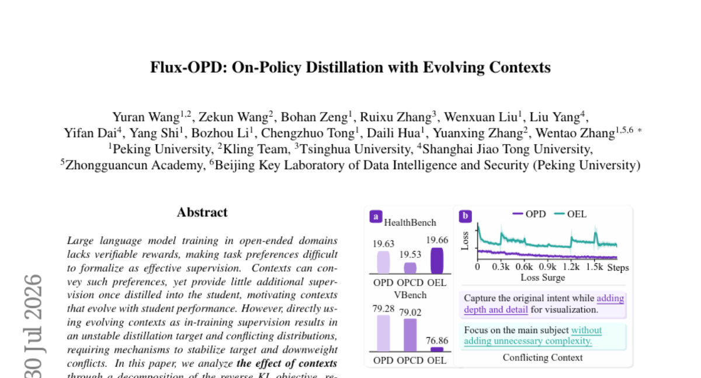

### 📌 한 줄 요약
학습 중 진화하는 컨텍스트를 활용하여 오픈 엔드 도메인에서 안정적인 지식 증류(Distillation)를 수행하는 프레임워크

### 🔑 핵심 포인트
- 역 KL 목적 함수의 분해를 통해 컨텍스트 기반 교사와 컨텍스트 프리 교사 간의 관계를 이론적으로 규명
- 진화하는 컨텍스트를 학습 타겟으로 사용할 때 발생하는 분포 충돌 문제를 해결하는 Flux-OPD 제안
- 컨텍스트 차이 신호를 교정 신호로 사용하여 학생 모델이 선호도를 효과적으로 학습하도록 설계

### 🧑‍💻 개발자 관점
정답이 정해지지 않은 창의적/오픈 엔드 작업에서 모델의 선호도를 정교하게 주입하는 효율적인 증류 기법을 제공합니다.

### 🚀 실무 적용 아이디어
- 제시된 역 KL 분해 수식을 바탕으로 기존 KL 기반 증류 코드에 충돌 항(Conflict term) 적용 실험
- 다양한 난이도의 컨텍스트 변화(Evolving contexts)를 주었을 때의 학습 안정성 테스트
- 고정된 교사 모델과 진화하는 컨텍스트를 가진 교사 모델 간의 성능 비교

### ⚠️ 리스크/한계
- 컨텍스트 차이가 너무 클 경우 교정 신호가 학습을 불안정하게 만들 위험이 있음
- 이론적 분석이 특정 목적 함수(Reverse KL)에 국한되어 있어 다른 손실 함수로의 일반화 여부 확인 필요

### 📝 초록 기반 상세 설명
오픈 엔드 도메인의 LLM 학습은 명확한 보상 함수를 정의하기 어려워 작업 선호도를 수식화하는 데 한계가 있습니다. 기존에는 컨텍스트를 통해 선호도를 전달하려 했으나, 학습 과정에서 변화하는 컨텍스트가 타겟 분포의 불안정성과 충돌을 야기하는 문제가 있었습니다. 본 논문은 역 KL 발산(Reverse KL) 목적 함수를 분해하여 학생 모델이 컨텍스트 기반 교사들의 기하 평균으로 수렴하며, 이 과정에서 교사 간 충돌 항이 발생함을 이론적으로 분석했습니다. 이를 바탕으로 제안된 Flux-OPD는 컨텍스트 차이 신호를 교정 신호로 활용하고 충돌 항을 통해 보정 강도를 조절하는 온폴리시 증류 방식을 제안합니다. 실험 결과, Flux-OPD는 기존 OPD 방식보다 우수한 성능을 보이며 진화하는 컨텍스트와 교사 감독의 결합 가능성을 입증했습니다.

---

## 11. [MPIE-Bench: Benchmarking Anatomically Plausible Multi-Person Interaction Editing](https://huggingface.co/papers/2607.27616)
**Upvotes**: 37 | **도입 난이도**: 중 | **신뢰도**: 상
**arXiv**: https://arxiv.org/abs/2607.27616

**태그**: Computer Vision, Generative AI, Evaluation Metric, 3D Reconstruction, Vision, Video, Benchmark, Evaluation

### 📌 한 줄 요약
다중 인물 간의 신체 접촉 및 해부학적 오류를 정밀하게 측정하기 위한 새로운 벤치마크와 평가 방법론 제안

### 🔑 핵심 포인트
- 405개 장면과 14개 상호작용 카테고리를 포함한 2,500개 샘플 규모의 MPIE-Bench 구축
- 3D 메쉬 재구성을 활용하여 신체 융합 및 접촉 거리를 정밀 측정하는 MPIE-Eval 제안
- 기존 VLM 기반 평가가 잡아내지 못하는 해부학적/기하학적 오류를 효과적으로 식별

### 🧑‍💻 개발자 관점
멀티 페르소나나 복잡한 상호작용이 필요한 생성형 AI 모델 개발 시, 단순 시각적 품질을 넘어 신체 구조적 정밀도를 검증하는 데 필수적인 프레임워크를 제공합니다.

### 🚀 실무 적용 아이디어
- 현재 개발 중인 멀티 인물 생성 모델에 MPIE-Eval의 3D 메쉬 기반 평가 로직 적용 테스트
- VLM 기반 자동 평가와 제안된 지표 간의 상관관계 비교 실험 수행
- 다양한 접촉 밀도(C0-C3) 환경에서의 모델 강건성 테스트

### ⚠️ 리스크/한계
- 3D 메쉬 재구성이 선행되어야 하므로 평가 과정에 추가적인 연산 비용 발생
- 메쉬 재구도 모델의 정확도에 따라 평가 결과가 영향을 받을 수 있음

### 📝 초록 기반 상세 설명
최근 텍스트 기반 이미지 편집 모델은 고화질 이미지를 생성하지만, 여러 인물이 상호작용하는 복잡한 동작(포옹, 들기 등)에서 신체 융합이나 겹침 같은 해부학적 오류가 빈번히 발생합니다. 기존의 VLM 기반 평가는 이러한 기하학적 문제를 제대로 포착하지 못하고 상호작용 여부에만 치중하는 경향이 있습니다. 이를 해결하기 위해 2,500개의 정교한 편집 데이터셋인 MPIE-Bench를 도입합니다. 또한, 3D 메쉬 재구성을 활용하여 신체 구조의 완전성과 접촉 거리를 측정하는 MPIE-Eval 평가 지표를 제안합니다. 실험 결과, 제안된 지표는 기존 VLM 방식보다 인간의 판단과 더 높은 상관관계를 보이며 모델 간의 성능 차이를 명확히 구분해냈습니다.

---

## 12. [ACE-Data-0: Human-Centric Ambient Capture as Embodied Data Engine](https://huggingface.co/papers/2607.28625)
**Upvotes**: 34 | **도입 난이도**: 중 | **신뢰도**: 상
**arXiv**: https://arxiv.org/abs/2607.28625

**태그**: Embodied AI, Multimodal, Robotics, Dataset, RAG, Vision, Video, Audio, Benchmark, Evaluation

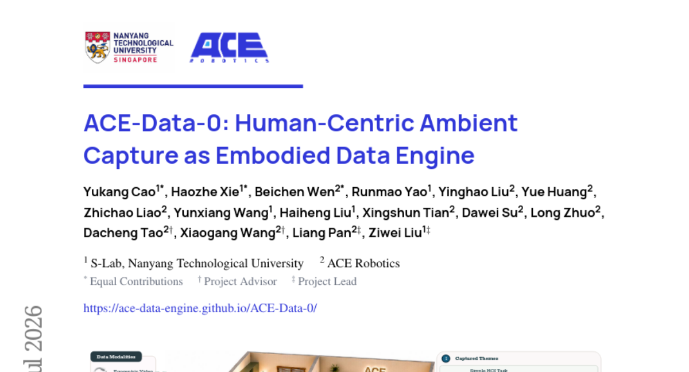

### 📌 한 줄 요약
인간의 행동, 물체 상호작용, 환경 변화를 통합적으로 포착하는 대규모 멀티모달 데이터 엔진 및 데이터셋 제안

### 🔑 핵심 포인트
- 공간적/시간적 동기화가 완벽한 멀티모달(비디오, 모션, 오디오, 촉각 등) 데이터 수집 엔진 ACE 개발
- 조작부터 전신 움직임까지 아우르는 150시간 규모의 대규모 데이터셋 ACE-Data-0 구축
- 목표 중심의 자연스러운 행동 변화를 포함하는 계층적 벤치마크 및 데이터 파이프라인 제안

### 🧑‍💻 개발자 관점
로봇 및 에이전트 학습 시 발생하는 데이터 불일치 문제를 해결하고, 복합적인 물리적 상호작용을 학습할 수 있는 고품질 데이터셋 확보가 가능해집니다.

### 🚀 실무 적용 아이디어
- 제공된 데이터셋을 활용하여 기존 Vision-Language-Action(VLA) 모델의 성능 측정
- 물체 접촉 및 가려짐(occlusion) 상황에서의 모델 강건성 테스트
- 장기적 작업 수행(long-horizon) 시의 에이전트 추론 능력 검증

### ⚠️ 리스크/한계
- 특정 환경(가정집)에 국한된 데이터로 인해 다른 공간에서의 일반화 성능 이슈 가능성
- 대규모 멀티모달 데이터 처리를 위한 높은 컴퓨팅 자원 요구

### 📝 초록 기반 상세 설명
Embodied AI 모델 학습을 위한 데이터 확보가 핵심 과제로 떠오르고 있으나, 기존 데이터셋은 시점, 모달리티, 공간적 규모가 파편화되어 있어 완전한 인지-행동 루프를 학습하기 어렵습니다. 이를 해결하기 위해 실생활 환경을 정밀한 녹화 스튜디오로 변환하는 Ambient Capture Engine(ACE)을 도입합니다. ACE는 테이블 규모의 정밀 조작부터 방 규모의 전신 움직임까지 아우르는 멀티모달 스트림을 동기화하여 기록합니다. 이를 통해 구축된 ACE-Data-0는 50명의 참여자가 수행한 75,000개의 상호작용 에피소드를 포함하는 대규모 데이터셋입니다. 결과적으로 이 데이터셋은 모방 학습 및 월드 모델 학습을 위한 강력한 기초를 제공하며, 기존 모델들의 한계를 드러내는 계층적 벤치마크를 제시합니다.

---

## 13. [Beyond Borrowed Histories: Person-Aligned User Simulation for Interactive Role-Playing Evaluation](https://huggingface.co/papers/2607.27816)
**Upvotes**: 30 | **도입 난이도**: 중 | **신뢰도**: 상
**arXiv**: https://arxiv.org/abs/2607.27816

**태그**: LLM, Agent, Evaluation, Persona, Benchmark

### 📌 한 줄 요약
사용자 개인의 성향과 대화 맥락을 반영하여 페르소나 기반 에이전트의 성능을 정밀하게 평가하는 새로운 벤치마크 프레임워크 제안

### 🔑 핵심 포인트
- 사용자 시뮬레이터를 활용한 동적 멀티턴 대화 환경 구축
- 개인별 성향을 반영한 맞춤형 평가 루브릭(Personalized Rubrics) 도입
- 단일 점수 산출이 아닌 사용자-에이전트 쌍별 해석 가능한 평가 체계 제공

### 🧑‍💻 개발자 관점
에이전트 개발 시 단순한 텍스트 생성 품질을 넘어, 특정 페르소나를 가진 사용자의 만족도를 정량화하고 검증하는 데 유용합니다.

### 🚀 실무 적용 아이디어
- 자체 에이전트 모델에 다양한 페르소나 프로필을 주입하여 대화 테스트 수행
- 고정된 평가 지표 대신 사용자 성향을 반영한 맞춤형 평가 프롬프트 설계
- 멀티턴 대화 시 에이전트의 일관성과 사용자 만족도 간의 상관관계 분석

### ⚠️ 리스크/한계
- 사용자 시뮬레이터 자체가 가진 편향이 평가 결과에 영향을 미칠 수 있음
- 실제 인간 사용자의 복잡한 감정적 반응을 시뮬레이터가 완벽히 재현하기 어려움

### 📝 초록 기반 상세 설명
LLM 기반 역할 수행 에이전트(RPA)의 중요성이 커짐에 따라 신뢰할 수 있는 평가 방법론이 필수적입니다. 기존 벤치마크는 고정된 대화 기록을 바탕으로 평가하여 실제 멀티턴 환경에서의 역량과 개인별 사용자 경험 차이를 반영하지 못하는 한계가 있습니다. 이를 해결하기 위해 사용자 시뮬레이터를 활용한 확장 가능한 벤치마크인 PALATE를 제안합니다. PALATE는 300개의 캐릭터 프로필과 5개의 사용자 시뮬레이터를 통해 자유로운 멀티턴 대화를 수행하며, 일반적 품질과 개인화된 만족도를 동시에 측정합니다. 실험 결과, 제안된 개인화된 루브릭이 기존 일반 루브릭보다 인간의 판단과 더 높은 일치도를 보였습니다. 결과적으로 PALKA는 시스템을 단일 순위로 압축하는 대신, 특정 사용자-RPA 쌍에 대한 해석 가능한 평가를 제공합니다.

---

## 14. [RefCaptioner: Multi-Reference Image-Grounded Video Captioning](https://huggingface.co/papers/2607.28509)
**Upvotes**: 25 | **도입 난이도**: 상 | **신뢰도**: 상
**arXiv**: https://arxiv.org/abs/2607.28509

**태그**: Video-Captioning, Multi-modal, RLHF, Vision-Language, RAG, Vision, Video, Benchmark, Evaluation

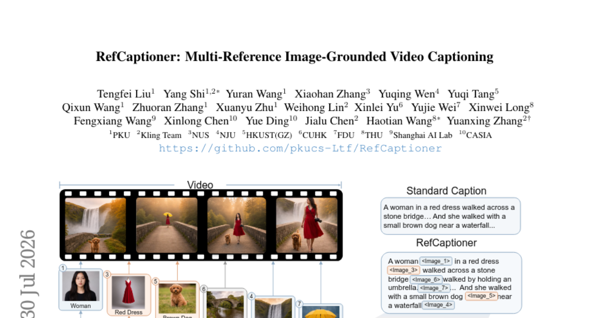

### 📌 한 줄 요약
여러 참조 이미지를 기반으로 비디오 내 특정 요소를 정확히 매칭하여 캡셔닝하는 새로운 태스크와 프레임워크 제안

### 🔑 핵심 포인트
- 멀티 참조 이미지를 활용한 구문 수준의 비디오 캡셔닝 태스크 정의
- SFT와 계층적 GRPO를 결합한 두 단계 사후 학습 프레임워크 제안
- 대규모 학습 코퍼스 구축 및 새로운 평가 벤치마크(MRVBench) 도입

### 🧑‍💻 개발자 관점
멀티모달 모델이 외부 참조 이미지(Reference)를 바탕으로 비디오의 세부 요소를 정확히 설명해야 하는 정밀한 영상 생성/분석 태스크에 직접적인 영감을 제공합니다.

### 🚀 실무 적용 아이디어
- 제시된 MRVBench를 활용하여 기존 비디오 캡셔닝 모델의 참조 이미지 대응 능력 테스트
- GRPO 기반의 보상 모델이 구문 수준의 바인딩 성능에 미치는 영향 분석
- 제공된 데이터셋을 활용한 소규모 모델의 미세 조정(Fine-tuning) 실험

### ⚠️ 리스크/한계
- 참조 이미지가 많아질수록 구문 바인딩의 복잡도가 급격히 증가할 수 있음
- 일반적인 비디오 캡셔닝 성능과 참조 정밀도 사이의 트레이드오프 발생 가능성

### 📝 초록 기반 상세 설명
기존 비디오 캡셔닝 모델은 영상 내용을 자연스럽게 설명하지만, 여러 참조 이미지의 국소적 시각 요소를 명시적으로 연결하는 데 한계가 있습니다. 이를 해결하기 위해 구문 수준의 참조 접지(grounding)를 요구하는 새로운 태스크를 정의하고, 두 단계의 사후 학습 프레임워크인 RefCaptioner를 제안합니다. RefCaptioner는 혼합 데이터 SFT와 계층적 커버리지 할인 GRPO를 결합하여 참조 선택, 구문 바인딩, 방해 요소 제거 및 일관성을 동시에 최적화합니다. 학습을 위해 2만 개의 비디오와 17만 개 이상의 참조 이미지를 포함한 코퍼스를 구축하였으며, 평가를 위한 MRVBench 벤치마크를 도입했습니다. 실험 결과, RefCaptioner는 일반 캡셔닝 성능을 유지하면서도 오픈소스 모델 중 최고 성능을 기록했으며, 생성된 캡션이 실제 비디오 재구성 시 높은 충실도를 보임을 확인했습니다.

---

## 15. [See2Think: Do Multimodal Models Really Use Intermediate Visual States?](https://huggingface.co/papers/2607.26769)
**Upvotes**: 22 | **도입 난이도**: 중 | **신뢰도**: 상
**arXiv**: https://arxiv.org/abs/2607.26769

**태그**: Multimodal, Reasoning, Evaluation, Agent, RAG, Vision, Benchmark, Inference

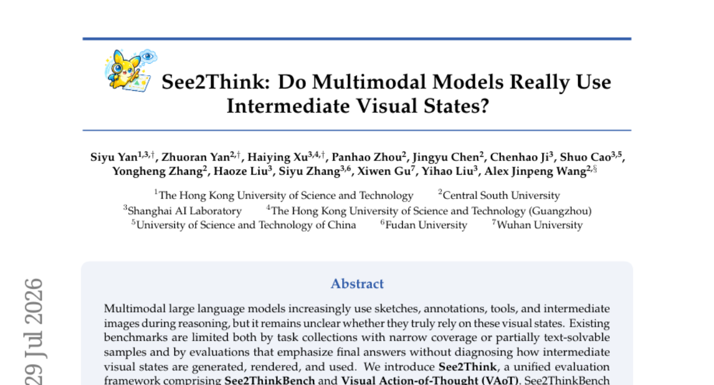

### 📌 한 줄 요약
멀티모달 모델이 중간 시각적 상태(Intermediate Visual States)를 실제로 추론에 활용하는지 검증하는 새로운 평가 프레임워크 제안

### 🔑 핵심 포인트
- 시각적 추론 과정을 정밀 진단하는 See2ThinkBench 및 VAoT 프레임워크 개발
- 12개 카테고리, 1,200개의 시각 의존적 문제를 포함한 통합 평가 체계 구축
- 중간 시각 상태의 생성, 렌더링, 피드백 수용이 모델 성능에 미치는 영향 분석

### 🧑‍💻 개발자 관점
멀티모달 에이전트 개발 시, 모델이 생성한 중간 시각 결과물이 실제 추론에 기여하는지 혹은 단순한 노이즈인지 판단하는 데 중요한 가이드라인을 제공합니다.

### 🚀 실무 적용 아이디어
- 모델의 중간 시각 결과물(렌더링) 품질과 최종 정답 간의 상관관계 측정
- 시각적 피드백(Visual Feedback)을 통한 에이전트의 자기 수정 능력 테스트
- 텍스트 중심 추론과 시각적 상태 활용 간의 의존도 비교 실험

### ⚠️ 리스크/한계
- 시각적 렌더링 품질이 모델의 추론 성능을 결정짓는 주요 병목이 될 수 있음
- 높은 피드백 수용도가 반드시 최종 정확도 향상으로 직결되지 않을 수 있음

### 📝 초록 기반 상세 설명
최근 멀티모달 모델은 추론 과정에서 스케치나 주석 같은 중간 시각 정보를 활용하지만, 이것이 실제 추론에 기여하는지는 불분명합니다. 기존 벤치마크는 작업 범위가 좁거나 최종 정답에만 치중하여 중간 과정의 생성 및 활용 과정을 진단하기 어렵다는 한계가 있습니다. 이를 해결하기 위해 1,200개의 시각 의존적 문제로 구성된 See2ThinkBench와 추론 과정을 기록하는 VAoT 프레임워크를 도입합니다. 실험 결과, 시각적 추론 능력은 모델과 환경에 따라 크게 달라지며, 렌더링 정확도가 주요 병목 구간임을 확인했습니다. 또한, 모델이 시각적 상태에 의존하고 있지만 피드백 수용도가 반드시 정확도 향상으로 이어지지는 않는 복합적인 양상을 보였습니다.

---

## 16. [SpatialCLI: Learning to Reason With Spatial Tools, Then Without Them](https://huggingface.co/papers/2607.27703)
**Upvotes**: 21 | **도입 난이도**: 상 | **신뢰도**: 상
**arXiv**: https://arxiv.org/abs/2607.27703

**태그**: Agent, Vision-Language, Reinforcement Learning, Reasoning, Vision, Benchmark

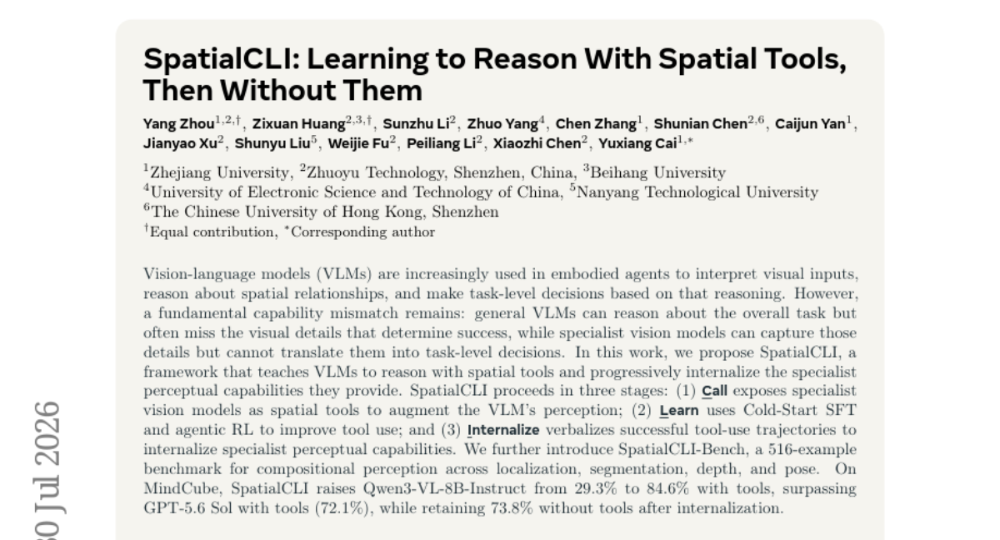

### 📌 한 줄 요약
전문 시각 모델의 능력을 VLM이 스스로 내재화하도록 학습시켜, 도구 없이도 정밀한 공간 추론을 수행하게 하는 프레임워크

### 🔑 핵심 포인트
- 전문 시각 모델을 도구로 활용하여 VLM의 인지 능력을 보완하는 3단계 학습 프레임워크 제안
- 도구 사용 경험을 언어적 궤적으로 변환하여 모델이 전문 모델의 능력을 스스로 내재화하도록 유도
- Localization, Segmentation, Depth, Pose를 포함하는 복합 인지 평가용 벤치마크 구축

### 🧑‍💻 개발자 관점
에이전트 개발 시 외부 API(도구) 의존도를 낮추면서도, 전문 모델 수준의 정밀한 시각적 판단력을 모델 자체에 이식하는 방법론을 제시합니다.

### 🚀 실무 적용 아이디어
- SFT와 RL을 결합한 도구 사용 학습 파이프라인 구축 실험
- 특정 도구(Segmentation 등)의 지식을 언어적 추론 과정에 내재화하는 데이터셋 구성
- 도구 사용 시와 미사용 시의 성능 격차(Internalization gap) 측정

### ⚠️ 리스크/한계
- 내재화 과정에서 특정 도구의 기능이 왜곡되거나 일반화 성능이 저하될 위험
- 학습 단계(SFT/RL)에 따른 복잡한 하이퍼파라미터 튜닝 필요성

### 📝 초록 기반 상세 설명
최근 VLM은 에이전트의 의사결정에 널리 쓰이지만, 일반적인 추론 능력과 세부적인 시각적 인지 능력 사이의 불일치 문제가 존재합니다. 이를 해결하기 위해 본 논문은 전문 시각 모델을 도구로 활용하며 그 능력을 점진적으로 내재화하는 SpatialCLI 프레임워크를 제안합니다. 학습은 도구 호출(Call), 강화학습을 통한 도구 사용 능력 향상(Learn), 그리고 성공적인 궤적을 통한 능력 내재화(Internalize)의 3단계로 진행됩니다. 또한 정밀한 공간 인지 능력을 평가하기 위한 SpatialCLI-Bench 벤치마크를 함께 도입했습니다. 실험 결과, SpatialCLI는 도구 사용 시 성능을 대폭 향상시킬 뿐만 아니라 도구 없이도 높은 수준의 공간 추론 성능을 유지함을 입증했습니다.

---

## 17. [β-OPSD: Deriving with Policy Optimization, Training with Self-Distillation](https://huggingface.co/papers/2607.28582)
**Upvotes**: 17 | **도입 난이도**: 중 | **신뢰도**: 상
**arXiv**: https://arxiv.org/abs/2607.28582

**태그**: LLM, Reinforcement Learning, Distillation, Reasoning, Benchmark

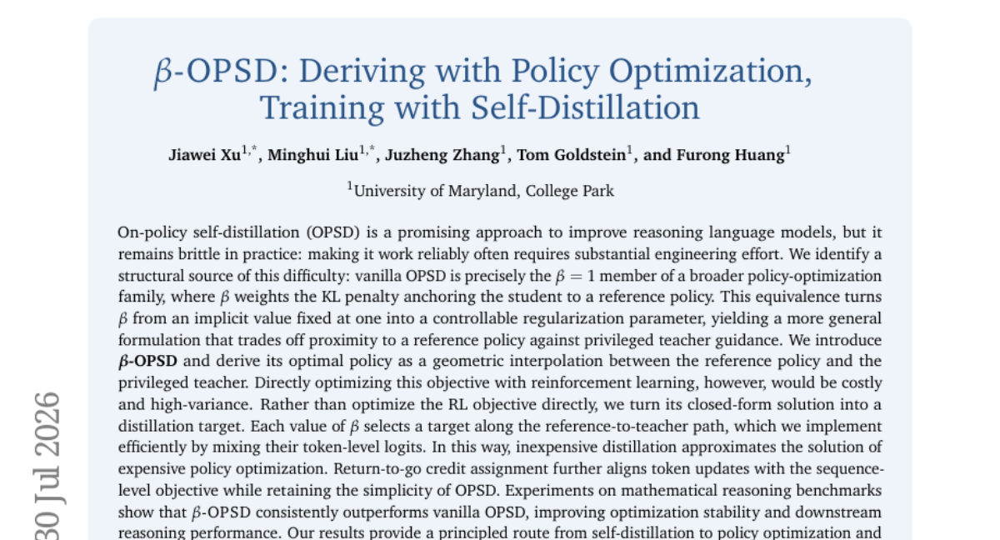

### 📌 한 줄 요약
자기 증류(Self-distillation)를 정책 최적화 관점으로 재해석하여, 안정적인 학습과 성능 향상을 동시에 달성하는 프레임워크

### 🔑 핵심 포인트
- OPSD를 KL 페널티 계수 β를 조절할 수 있는 일반화된 정책 최적화 프레임워크로 확장
- 고비용의 RL 최적화 대신 로짓 혼합(logit mixing)을 통한 효율적인 증류 타겟 생성
- Return-to-go 크레딧 할당을 통해 토큰 단위 업데이트와 시퀀스 단위 목표 간의 정렬 유지

### 🧑‍💻 개발자 관점
모델의 추론 능력을 높이기 위한 RL 학습 시 발생하는 불안정성을 수학적 정규화(β) 조절을 통해 효율적으로 해결할 수 있는 실무적 방법론을 제시합니다.

### 🚀 실무 적용 아이디어
- 기존 OPSD 환경에서 β 값을 변화시키며 학습 안정성 및 성능 변화 관찰
- 수학적 추론 태스크에서 로짓 혼합 방식이 기존 RL 방식과 비교해 얼마나 효율적인지 벤치마킹
- 모델 크기 변화에 따른 β 값의 최적 범위 탐색

### ⚠️ 리스크/한계
- β 값 설정에 따라 참조 정책과의 괴리 또는 교사 가이드 활용도 사이의 트레이드오프 발생 가능성
- 특정 도메인(수학적 추론 등)에 최적화된 방법론일 수 있어 일반적 대화형 태스크로의 전이 성능 확인 필요

### 📝 초록 기반 상세 설명
최근 추론 모델 성능 향상을 위해 On-policy self-distillation(OPSD)이 주목받고 있으나, 실무 적용 시 안정성이 떨어지는 문제가 있었습니다. 연구진은 기존 OPSD가 KL 페널티 계수 β=1인 특수 사례임을 밝혀내고, 이를 일반화한 β-OPSD 프레임워크를 제안합니다. 제안된 방식은 참조 정책과 교사 모델 사이의 기하학적 보간을 통해 최적의 정책을 도출하며, 복잡한 RL 대신 효율적인 로짓 혼합(logit mixing) 방식을 사용합니다. 실험 결과, β-OPSD는 기존 OPSD보다 안정적인 최적화를 제공하며 수학적 추론 벤치마크에서 더 높은 성능을 기록했습니다. 결과적으로 이 방식은 효율적인 증류를 통해 고비용의 정책 최적화 효과를 얻을 수 있음을 입증했습니다.

### 🖼️ 추가 자료
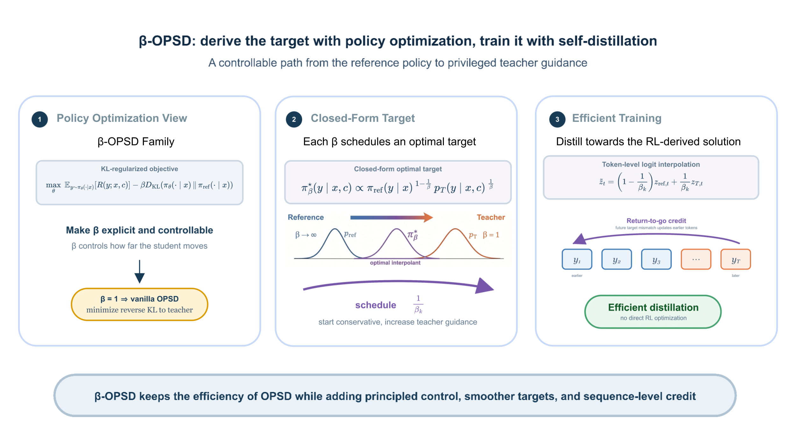

---

## 18. [Chimera: Designing and Chinchilla-Scaling Hybrid Visual Diffusion Transformers](https://huggingface.co/papers/2607.28611)
**Upvotes**: 16 | **도입 난이도**: 상 | **신뢰도**: 상
**arXiv**: https://arxiv.org/abs/2607.28611

**태그**: Diffusion, Video-Generation, Scaling-Laws, Architecture, Multimodal, Vision, Video

### 📌 한 줄 요약
고해상도 영상 및 긴 컨텍스트 처리를 위해 효율적인 하이브리드 어텐션과 스케일링 법칙을 결합한 차세대 비주얼 디퓨전 아키텍처

### 🔑 핵심 포인트
- KDA(상태 추적), MLA(글로벌 상호작용), 컨볼루션(지역 문맥)을 결합한 하이브리드 아키텍처 설계
- 모델 크기와 데이터 비율을 최적화하는 모듈별 스케일링 기법 'HeteroP' 도입
- Chinchilla 법칙을 적용하여 활성 파라미터와 학습 토큰 수 간의 계산 최적화 달성

### 🧑‍💻 개발자 관점
연산 비용이 높은 영상 생성 모델에서 효율적인 어텐션 구조와 스케일링 법칙을 통해 하드웨어 제약을 극복하는 실무적 방법론을 제시합니다.

### 🚀 실무 적용 아이디어
- 제시된 KDA와 MLA의 결합 구조를 소규모 모델에 적용하여 연산 효율성 테스트
- HeteroP 기법을 활용하여 데이터셋 크기 변화에 따른 모델 크기 최적 지점 탐색
- MoE와 하이브리드 어텐션 조합이 영상 생성 품질(FID)에 미치는 영향 분석

### ⚠️ 리스크/한계
- 하이브리드 구조의 복잡성으로 인해 구현 및 유지보수 난이도가 높음
- 특정 데이터 비율과 모델 크기 설정에 따라 성능이 민감하게 반응할 가능성

### 📝 초록 기반 상세 설명
고해상도 이미지와 긴 영상 생성 시 발생하는 이차 복잡도(quadratic cost) 문제는 기존 풀 어텐션 방식의 효율성을 저해합니다. 이를 해결하기 위해 연구진은 KDA, MLA, 컨볼루션을 결합하고 MoE를 적용한 하이브리드 아키텍처인 Chimera를 제안합니다. 또한, 모델 크기와 데이터 비율을 최적화하는 모듈별 스케일링 기법인 HeteroP를 도입하여 Chinchilla 스타일의 계산 최적화 법칙을 정립했습니다. 실험 결과, Chimera는 기존 베이스라인 대비 압도적인 계산 효율성을 보였으며, 별도의 길이 조정 없이도 긴 영상 생성에서 우수한 외삽 능력을 입증했습니다. 최종적으로 이 연구는 효율적인 롱 컨텍스트 디퓨전 모델 설계를 위한 스케일링 가이드를 제공합니다.

---

## 19. [ShadowDancer: Teaching Video World Models Any Action by Learning Unified Dynamics Representations from a Video and Its Shadow](https://huggingface.co/papers/2607.28362)
**Upvotes**: 16 | **도입 난이도**: 상 | **신뢰도**: 상
**arXiv**: https://arxiv.org/abs/2607.28362

**태그**: Video Generation, World Models, Action Transfer, Computer Vision, RAG, Video

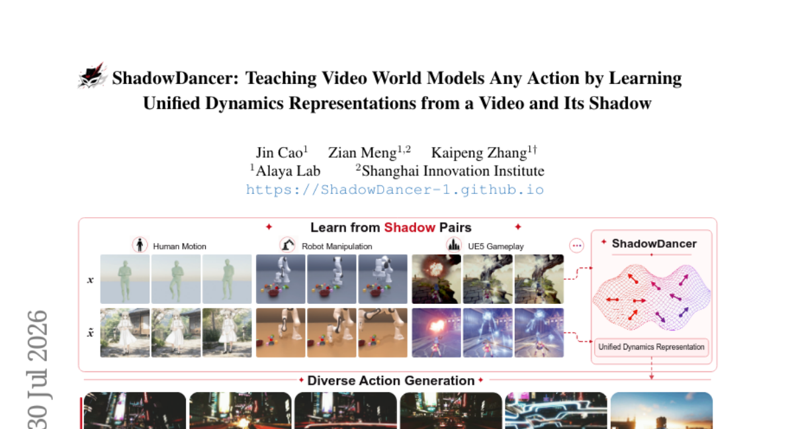

### 📌 한 줄 요약
비디오와 그 '그림자(동역학)'를 분리 학습하여, 한 번의 데모로 다양한 환경에서 정밀한 동작 제어를 가능케 하는 월드 모델 기술

### 🔑 핵심 포인트
- Shadow Pairs: 동일한 동역학을 유지하되 외형만 다르게 구성된 데이터 쌍을 통한 대규모 학습 가능성 확보
- Cross-shadow Prediction: 외형 정보를 배제하고 순수 동역학(Action)만을 추출하는 일관된 학습 메커니즘
- Zero-shot Action Transfer: 별도의 라벨링이나 미세 조정 없이 데모 클립을 새로운 환경에서 재사용 가능

### 🧑‍💻 개발자 관점
동작 제어를 위한 복잡한 라벨링 없이도 비디오 데모만으로 정밀한 제어 자산을 생성할 수 있어, 로봇 제어나 가상 환경 시뮬레이션 효율을 극대화할 수 있습니다.

### 🚀 실무 적용 아이디어
- Shadow Library와 같은 대규모 합성 데이터 생성 파이프라인 구축 가능성 검토
- 제공된 데모 영상을 활용하여 다양한 배경/객체 환경에서의 동작 전이 성능 테스트
- 기존의 Latent-action 모델과 ShadowDancer의 롤아웃 안정성 비교 실험

### ⚠️ 리스크/한계
- 동일한 동역학을 가진 다양한 외형의 쌍(Shadow Pairs)을 확보하는 데이터 구축 비용 문제
- 매우 복잡하거나 물리적 상호작용이 극도로 정교한 동작의 경우 전이 성능 저하 가능성

### 📝 초록 기반 상세 설명
기존의 인터랙티브 비디오 월드 모델은 동작을 느슨하게 인코딩하거나 특정 구조에 의존하여 다양한 환경에서의 정밀한 제어가 어려웠습니다. 데모 비디오는 정교한 동작을 제공하지만, 외형(appearance)과 동역학(dynamics)이 결합되어 있어 새로운 환경으로의 전이가 어렵다는 문제가 있습니다. 이를 해결하기 위해 ShadowDancer는 동일한 동역학을 갖지만 외형만 다른 'Shadow Pairs'와 한 영상에서 다른 영상의 동역학을 예측하는 'Cross-shadow prediction' 기법을 제안합니다. 이 방식을 통해 외형 정보는 배제하고 순수 동역학만을 액션 표현으로 학습하여 통합된 동역학 표현을 구축합니다. 실험 결과, 제안된 방식은 기존 베이스라인 대비 우수한 액션 전이 성능과 긴 롤아웃(rollout) 성능을 보였습니다.

### 🖼️ 추가 자료
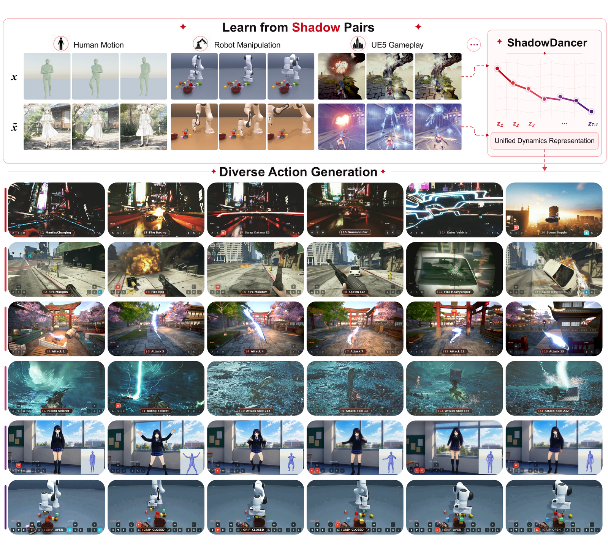

---

## 20. [Can Large Language Models Execute Parent Orders?](https://huggingface.co/papers/2607.28410)
**Upvotes**: 14 | **도입 난이도**: 중 | **신뢰도**: 상
**arXiv**: https://arxiv.org/abs/2607.28410

**태그**: LLM, Algorithmic Trading, Agent, Finance

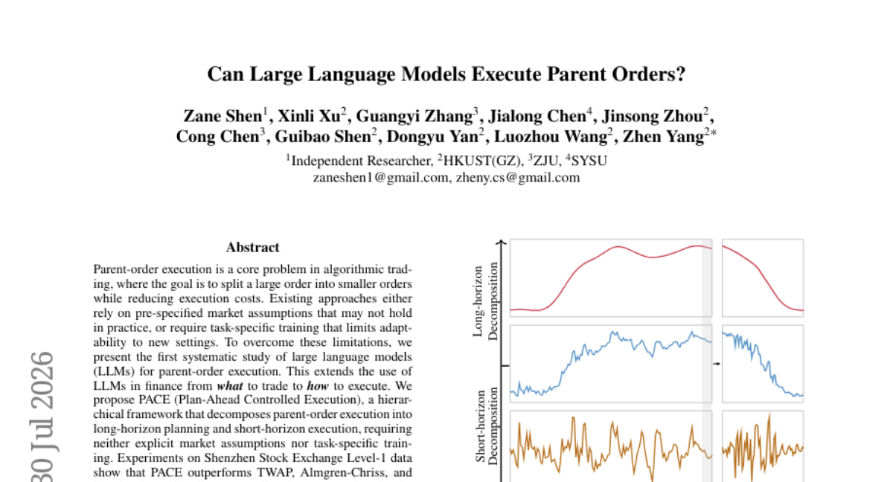

### 📌 한 줄 요약
LLM을 활용하여 시장 가정을 배제하고 계획과 실행을 계층적으로 분리한 새로운 알고리즘 트레이딩 프레임워크 제안

### 🔑 핵심 포인트
- LLM 기반의 계층적 프레임워크 'PACE' 제안 (장기 계획 및 단기 실행 분리)
- 시장 가정이나 태스크별 재학습 없이도 높은 적응성을 가진 실행 전략 구현
- 기존 TWAP 및 Almgren-Chriss 등 전통적/학습 기반 베이스라인 대비 우수한 성과 달성

### 🧑‍💻 개발자 관점
금융 도메인에서 LLM을 단순한 정보 요약을 넘어, 의사결정 에이전트(Decision-making Agent)로 활용할 수 있는 실질적인 방법론을 제시합니다.

### 🚀 실무 적용 아이디어
- 제시된 PACE 프레임워크의 계층적 구조를 오픈소스 데이터셋에 적용해보기
- LLM의 신뢰도(Confidence)와 실제 수익률 간의 상관관계 분석 실험
- 다양한 시장 변동성 환경에서의 에이전트 강건성 테스트

### ⚠️ 리스크/한계
- 실제 거래 환경에서의 슬리피지 및 시장 충격 효과에 대한 추가 검증 필요
- LLM의 추론 비용이 전통적 알고리즘 대비 높을 수 있음

### 📝 초록 기반 상세 설명
알고리즘 트레이딩에서 대규모 주문을 분할 실행하는 것은 비용 최소화를 위한 핵심 과제입니다. 기존 방식은 특정 시장 가정을 전제로 하거나 과도한 태스크별 학습이 필요하여 적응성이 낮다는 문제가 있었습니다. 본 논문은 LLM을 활용한 체계적인 부모 주문 실행 연구를 제시하며, 계획과 실행을 분리한 계층적 프레임워크인 PACE를 제안합니다. 실험 결과, PACE는 TWAP 및 기존 학습 기반 베이스라인보다 우수한 성과를 보였습니다. 분석 결과, LLM은 인간 투자자와는 다른 독특한 의사결정 패턴을 보이며 효율적인 실행 능력을 입증했습니다.

---

## 21. [MemHarness: Memory Is Reconstructed, Not Replayed](https://huggingface.co/papers/2607.28272)
**Upvotes**: 13 | **도입 난이도**: 중 | **신뢰도**: 상
**arXiv**: https://arxiv.org/abs/2607.28272

**태그**: LLM-Agent, Memory-Augmentation, Reinforcement-Learning, RAG, Agent, Reasoning

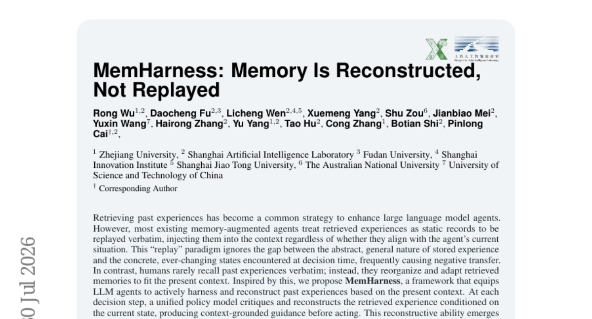

### 📌 한 줄 요약
과거 경험을 단순 재현하는 대신 현재 상황에 맞춰 재구성하여 에이전트의 추론 능력을 극대화하는 MemHarness 프레임워크

### 🔑 핵심 포인트
- 단순 기록 재현이 아닌 현재 맥락에 맞춘 '경험 재구성(Reconstruction)' 패러다임 도입
- GRPO를 활용한 엔드투엔드 학습으로 정책 모델의 비판적/재구성적 능력 확보
- 부정적 전이를 방지하고 에이전트의 내재적 추론 능력을 향상시키는 효과 입증

### 🧑‍💻 개발자 관점
RAG 기반 에이전트 설계 시, 단순히 과거 데이터를 컨텍스트에 넣는 것을 넘어 현재 상태와의 정렬(Alignment)이 성능의 핵심임을 시사합니다.

### 🚀 실무 적용 아이디어
- 기존 RAG 에이전트에 '경험 재구성' 단계(Refinement step)를 추가하여 성능 변화 관찰
- GRPO와 같은 강화학습을 활용한 에이전트 정책 최적화 실험 수행
- OOD(Out-of-Distribution) 환경에서 정적 메모리 방식과 비교 테스트

### ⚠️ 리스크/한계
- 재구성 과정에서 발생할 수 있는 할루시네이션(Hallucination) 위험
- 강화학습 기반 학습 시 높은 연산 비용 및 학습 안정성 확보 필요

### 📝 초록 기반 상세 설명
LLM 에이전트의 성능 향상을 위해 과거 경험을 검색하는 방식이 널리 사용되고 있습니다. 그러나 기존 방식은 검색된 기록을 그대로 컨텍스트에 주입하는 '재생(replay)' 방식에 의존하여, 현재 상태와의 괴리로 인한 부정적 전이(negative transfer) 문제를 야기합니다. 이를 해결하기 위해 본 논문은 과거 경험을 현재 맥락에 맞춰 능동적으로 재구성하는 MemHarness 프레임워크를 제안합니다. GRPO를 통한 엔드투엔드 학습을 통해 정책 모델이 현재 상태를 바탕으로 검색된 경험을 비판하고 재구성하도록 설계했습니다. 실험 결과, ALFWorld 및 WebShop 환경에서 기존 방식보다 우수한 성능을 보였으며 OOD 상황에서도 강력한 강건성을 입증했습니다.

---

## 22. [Σ-Mem: An Online Reliability Memory for LLM-based Multi-Agent Systems](https://huggingface.co/papers/2607.27958)
**Upvotes**: 12 | **도입 난이도**: 중 | **신뢰도**: 상
**arXiv**: https://arxiv.org/abs/2607.27958

**태그**: Multi-Agent, Reliability, LLM, Adaptive Learning, Agent, Evaluation

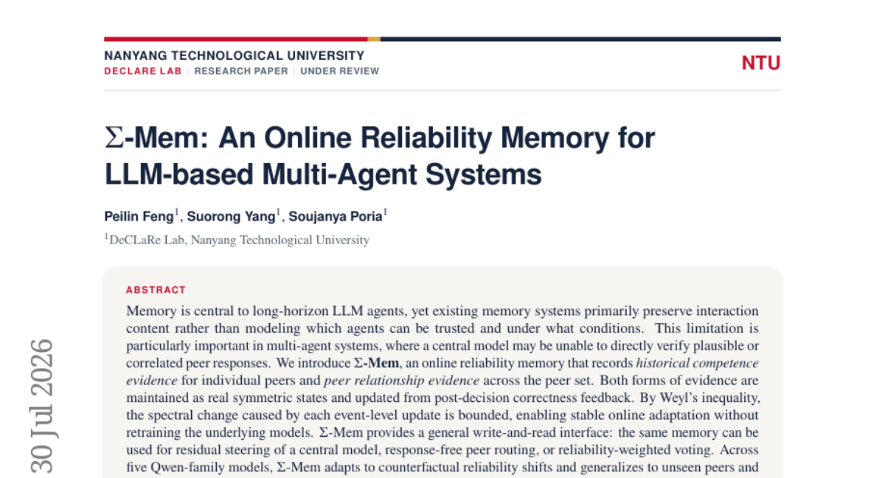

### 📌 한 줄 요약
멀티 에이전트 시스템에서 에이전트 간 신뢰도를 실시간으로 모델링하여 협업 효율을 극대화하는 메모리 프레임워크

### 🔑 핵심 포인트
- 개별 에이전트 역량 및 관계를 실시간으로 기록하는 신뢰도 기반 메모리 프레임워크 제안
- Weyl의 부등식을 이용해 피드백 업데이트 시 발생하는 스펙트럴 변화를 제어하여 안정적인 온라인 학습 구현
- 중앙 모델 제어, 라우팅, 가중 투표 등 다양한 멀티 에이전트 협업 시나리오에 적용 가능한 범용 인터페이스 제공

### 🧑‍💻 개발자 관점
에이전트 수가 늘어나거나 성능이 가변적인 환경에서, 모델 재학습 없이도 신뢰할 수 있는 에이전트에게 작업을 할당하거나 결과를 검증하는 데 유용합니다.

### 🚀 실무 적용 아이디어
- 다양한 성능을 가진 LLM들을 섞어놓은 환경에서 Σ-Mem의 라우팅 성능 테스트
- 정답 피드백이 지연되거나 노이즈가 섞인 상황에서의 메모리 수렴 안정성 검증
- 기존 Majority Voting 방식과 Σ-Mem 기반 가중 투표 방식의 비용 대비 성능 비교

### ⚠️ 리스크/한계
- 정답(Ground Truth) 피드백이 실시간으로 제공되지 않는 환경에서는 적용이 어려움
- 에이전트 간의 관계가 복잡해질수록 메모리 상태 업데이트의 계산 복잡도가 증가할 가능성

### 📝 초록 기반 상세 설명
기존의 LLM 메모리 시스템은 상호작용 내용 저장에 치중하여, 멀티 에이전트 환경에서 개별 에이전트의 신뢰도를 모델링하는 데 한계가 있었습니다. 본 논문은 개별 에이전트의 역량과 에이전트 간 관계를 실시간으로 기록하는 Σ-Mem을 제안합니다. Σ-Mem은 사후 피드백을 바탕으로 실수 대칭 상태(real symmetric states)를 업데이트하며, Weyl의 부등식을 활용해 모델 재학습 없이도 안정적인 온라인 적응을 가능하게 합니다. 이 메모리는 중앙 모델의 제어, 라우팅, 가중 투표 등 다양한 방식으로 활용될 수 있습니다. 실험 결과, Σ-Mem은 미학습 에이전트와 새로운 태스크 도메인에서도 우수한 일반화 성능을 보였으며 기존 투표 방식보다 뛰어난 성능을 입증했습니다.

---

## 23. [INTACT: Isomorphic Intent-to-Action Learning for Search-Free World Models](https://huggingface.co/papers/2607.26056)
**Upvotes**: 12 | **도입 난이도**: 상 | **신뢰도**: 상
**arXiv**: https://arxiv.org/abs/2607.26056

**태그**: World Models, Reinforcement Learning, Robotics, JEPA, Inference

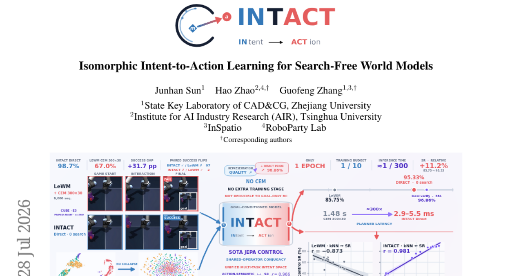

### 📌 한 줄 요약
검색(Search) 과정 없이 의도(Intent)만으로 즉각적인 액션을 생성하는 효율적인 월드 모델 학습 프레임워크

### 🔑 핵심 포인트
- 검색(Search-free) 없이 의도(Intent)에서 액션으로 직접 매핑하는 JEPA 기반 프레임워크 제안
- 국소적 움직임과 목표 움직임을 동일한 문법과 파라미터로 처리하는 동형(Isomorphic) 아키텍처 설계
- 비대칭 엔드포인트 그래디언트를 활용하여 표현 학습과 제어 문제를 통합 및 최적화

### 🧑‍💻 개발자 관점
로봇 제어나 에이전트 학습 시, 복잡한 계획(Planning)이나 탐색 없이도 잠재 공간의 이동만으로 즉각적인 액션 생성이 가능해져 추론 속도와 효율성을 극대화할 수 있습니다.

### 🚀 실무 적용 아이디어
- 제공된 4-슬롯 문법 구조를 활용한 커스텀 환경(Environment) 데이터셋 구성 실험
- 기존의 CEM(Cross-Entropy Method) 방식과 INTACT의 Direct plan 방식 간의 연산 비용 및 성공률 비교
- 다양한 물리적 환경에서 의도-액션 매핑의 일반화 성능 검증

### ⚠️ 리스크/한계
- 복잡한 물리 법칙이 작용하는 환경에서 의도와 실제 액션 간의 괴리 발생 가능성
- 학습 시 사용되는 궤적 데이터의 품질과 다양성에 대한 의존도 높음

### 📝 초록 기반 상세 설명
기존의 포워드 잠재 월드 모델은 원하는 상태 변화를 위한 액션을 찾기 위해 비용이 큰 테스트 타임 검색 과정을 거쳐야 했습니다. 본 논문은 보상 없이 액션이 라벨링된 궤적만으로 배포 가능한 '의도-액션' 인터페이스를 구축하는 INTACT를 제안합니다. 이 구조는 국소적 움직임과 목표 지향적 움직임 사이의 동형(Isomorphic) 구조를 유지하며, 비대칭 엔드포인트 그래디언트를 통해 표현 학습과 제어를 결합합니다. 결과적으로 검색 없이도 높은 성공률을 달성하며, 샘플링 기반의 정책보다 훨씬 빠른 추론 속도를 제공합니다. 실험 결과, 기존 방식 대비 샘플링 효율을 23배 이상 높이면서도 성능을 개선하는 성과를 거두었습니다.

---

## 24. [Explorative Modeling: Unlocking a Third Pretraining Axis and End-to-End Generation](https://huggingface.co/papers/2607.27372)
**Upvotes**: 11 | **도입 난이도**: 상 | **신뢰도**: 상
**arXiv**: https://arxiv.org/abs/2607.27372

**태그**: Generative Modeling, Scaling Laws, Deep Learning, Vision, Video, Inference

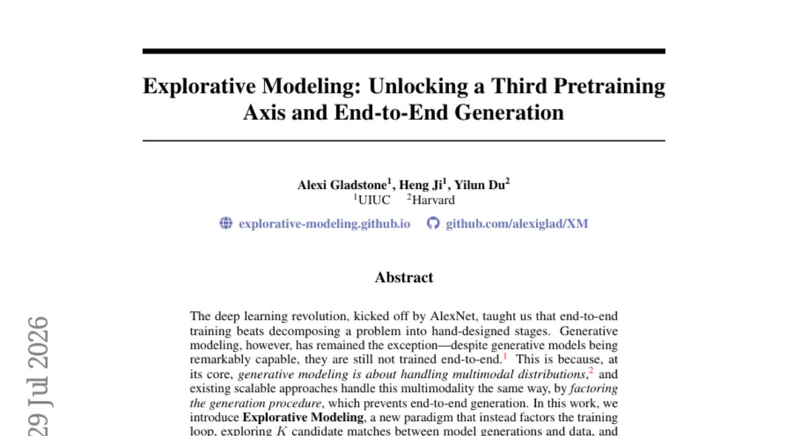

### 📌 한 줄 요약
데이터/파라미터 외에 '탐색(Exploration)'을 새로운 학습 축으로 도입하여 엔드투엔드 생성 모델의 효율과 성능을 극대화하는 새로운 패러다임 제안

### 🔑 핵심 포인트
- 학습 루프를 분해하여 K개의 후보 중 최적을 선택하는 'Explorative Modeling' 방법론 제안
- 데이터와 파라미터 외에 '탐색(Exploration)'을 성능 향상을 위한 새로운 스케일링 축으로 정의
- 기존 확산 모델 대비 훨씬 적은 추론 단계(16-256배 효율적)로 고품질 생성 및 제어 가능

### 🧑‍💻 개발자 관점
모델 크기를 무작정 키우지 않고도 학습 알고리즘의 변화만으로 생성 성능과 추론 효율을 획기적으로 높일 수 있는 실무적 방법론을 제시합니다.

### 🚀 실무 적용 아이디어
- 기존 생성 모델의 손실 함수에 K-candidate 탐색 로직을 결합하는 실험 수행
- 데이터 스케일링에 따른 탐색 효율(Exploration efficiency) 변화 추이 모니터링
- Diffusion 기반 모델과 XM 기반 모델의 추론 속도 및 품질 비교 테스트

### ⚠️ 리스크/한계
- K개의 후보를 생성하고 선택하는 과정에서 발생하는 계산 복잡도 증가
- 탐색 전략이 특정 모드에 과도하게 수렴(Mode collapse)할 가능성

### 📝 초록 기반 상세 설명
기존 생성 모델은 다중 모드(multi-mode) 분포를 처리하기 위해 생성 과정을 분해하여 학습하므로 완전한 엔드투엔드 학습이 어려웠습니다. 본 논문은 생성 과정 대신 학습 루프를 분해하는 'Explorative Modeling(XM)' 패러다임을 제안합니다. XM은 모델 생성물과 데이터 사이의 K개 후보 매칭을 탐색하고 최적의 결과로 학습하여, 예측이 모드를 흐리게 만드는 대신 특정 모드에 안착하도록 유도합니다. 실험 결과, 탐색 스케일링은 데이터 및 모델 크기 증가와 함께 성능을 향상시키는 제3의 학습 축임을 입증했습니다. 또한, 기존 확산 모델(Diffusion) 수준의 성능을 훨씬 적은 추론 단계로 달성하며 엔드투엔드 재구성 생성 모델로서의 가능성을 보여주었습니다.

---

## 25. [LEDGERMIND: Provenance-Constrained Multimodal Agentic Reasoning with a Structured Evidence Ledger](https://huggingface.co/papers/2607.28374)
**Upvotes**: 10 | **도입 난이도**: 중 | **신뢰도**: 상
**arXiv**: https://arxiv.org/abs/2607.28374

**태그**: Agent, Multimodal, Hallucination, Reasoning, Provenance, RAG, Benchmark, Evaluation

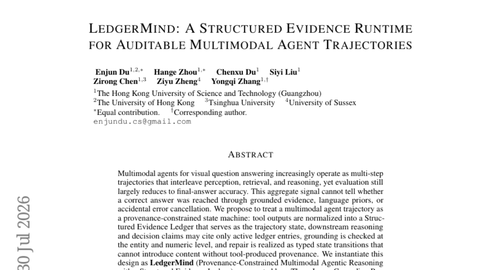

### 📌 한 줄 요약
추론 과정의 근거를 구조화된 원천 데이터(Ledger)로 관리하여 환각을 방지하고 추론의 신뢰성을 확보하는 멀티모달 에이전트 프레임워크

### 🔑 핵심 포인트
- Structured Evidence Ledger: 도구 출력을 상태로 정규화하여 추론의 근거를 명확히 관리
- Provenance-Constrained State Machine: 근거 없는 정보 유입을 차단하는 제약 조건 기반의 상태 전이 설계
- Three-Layer Grounding & Adaptive Dispatcher: 질문 복잡도에 따른 적응형 추론과 정밀한 접지(Grounding) 프로토콜 적용

### 🧑‍💻 개발자 관점
에이전트가 '왜' 그런 답을 냈는지 추적하기 어려운 문제를 해결하며, 정답은 맞지만 과정은 틀린 '우연한 정답' 문제를 방지하는 데 유용합니다.

### 🚀 실무 적용 아이디어
- 에이전트의 중간 추론 단계에서 외부 도구(API/DB) 결과값을 구조화된 JSON 형태로 변환하여 상태를 관리하는 로직 구현
- LLM이 생성한 답변이 반드시 제공된 컨텍스트(Ledger) 내의 ID를 참조하도록 하는 프롬프트/제약 조건 실험
- 질문 난이도에 따라 추론 단계(Step) 수를 동적으로 조절하는 Dispatcher 로직 테스트

### ⚠️ 리스크/한계
- 구조화된 원천 데이터를 관리하는 데 따른 오버헤드 및 시스템 복잡도 증가
- 도구 출력값의 정규화 과정에서 발생하는 정보 손실 가능성

### 📝 초록 기반 상세 설명
최근 멀티모달 에이전트는 복잡한 추론 과정을 거치지만, 평가는 최종 정답의 정확도에만 의존하여 과정의 신뢰성을 검증하기 어렵다는 문제가 있습니다. 이를 해결하기 위해 도구 출력값을 구조화된 증거 원천(Structured Evidence Ledger)으로 정규화하는 방식을 제안합니다. 제안된 LedgerMind는 모든 추론과 결정이 활성화된 원천 데이터만을 인용하도록 강제하며, 세 가지 계층의 접지 프로토콜과 적응형 디스패처를 통해 추론 깊이를 조절합니다. 또한, 이벤트 트리거 방식의 검증 및 복구 엔진을 통해 근거 없는 정보의 증폭을 방지합니다. 실험 결과, LedgerMind는 정답 정확도를 높일 뿐만 아니라 추론 과정의 충실도(faithfulness)를 크게 개선했습니다.

---

## 26. [Echoverse: Deep, Evolving Environments for Training Computer-Use Agents at Scale](https://huggingface.co/papers/2607.28074)
**Upvotes**: 9 | **도입 난이도**: 상 | **신뢰도**: 상
**arXiv**: https://arxiv.org/abs/2607.28074

**태그**: AI Agent, Environment Design, Reinforcement Learning, Automated Testing, Agent, Benchmark, Evaluation

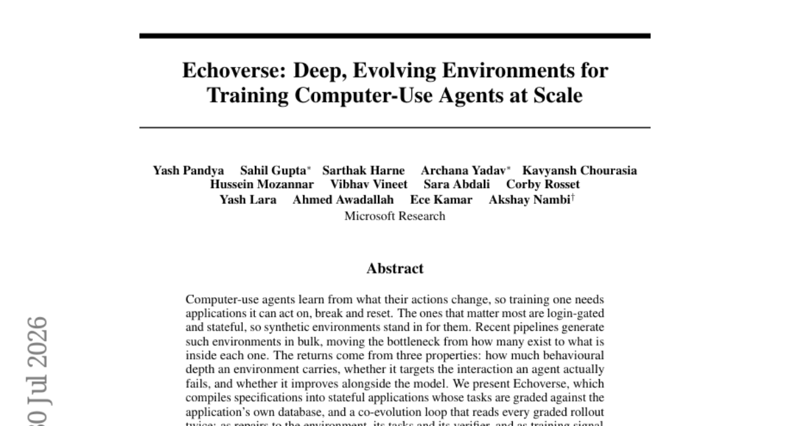

### 📌 한 줄 요약
에이전트 학습을 위해 환경과 모델이 함께 진화하는 '공진화(Co-evolution)' 루프를 통한 고성능 컴퓨터 사용 에이전트 학습 프레임워크

### 🔑 핵심 포인트
- 상태 유지 애플리케이션을 자동 생성하는 Echoverse 프레임워크 제안
- 모델의 실패를 환경(Task/Verifier)과 모델 학습 신호로 동시에 활용하는 공진화 루프 구축
- 환경의 행동적 깊이(Behavioral Depth)와 타겟팅이 에이전트 성능에 미치는 영향 규명

### 🧑‍💻 개발자 관점
단순한 데이터 증강을 넘어, 에이전트가 상호작용할 수 있는 '살아있는 환경'을 자동 구축하고 이를 통해 모델을 학습시키는 체계적인 방법론을 제시합니다.

### 🚀 실무 적용 아이디어
- 제공된 4개의 벤치마크 환경을 활용하여 에이전트의 일반화 성능 테스트
- 특정 도메인에 특화된 상태 유지 애플리케이션 명세(Specification) 설계 실험
- 모델의 실패 케이스를 환경의 태스크/검증기 수정에 반영하는 자동화 파이프라인 구축

### ⚠️ 리스크/한계
- 환경 생성 시 명세(Specification) 설계의 복잡도와 의존성
- 특정 환경에 과적합(Overfitting)될 위험성

### 📝 초록 기반 상세 설명
컴퓨터 사용 에이전트 학습을 위해서는 상태 변화가 가능한 로그인 기반의 복잡한 애플리케이션 환경이 필수적입니다. 기존의 대량 생성 방식은 환경 내부의 질적 깊이와 타겟팅 문제로 인해 성능 병목 현상을 겪고 있습니다. 본 논문은 명세(Specification)를 상태 유지 애플리케ations으로 컴파일하고, 모델의 실패를 환경과 검증기(Verifier)의 개선으로 연결하는 Echoverse 프레임워크를 제안합니다. 실험 결과, 9B 모델이 12개의 환경에서 학습을 통해 성능이 대폭 향상되었으며, 프런티어 모델의 성능에 근접하는 결과를 보였습니다. 특히 환경의 깊이와 모델-환경 간의 상호 개선 루프가 성능 향상의 핵심임을 입증했습니다.

---

## 27. [Multi-Head Attention Residuals](https://huggingface.co/papers/2607.27230)
**Upvotes**: 8 | **도입 난이도**: 하 | **신뢰도**: 상
**arXiv**: https://arxiv.org/abs/2607.27230

**태그**: Transformer, Architecture, Scaling Laws, Deep Learning

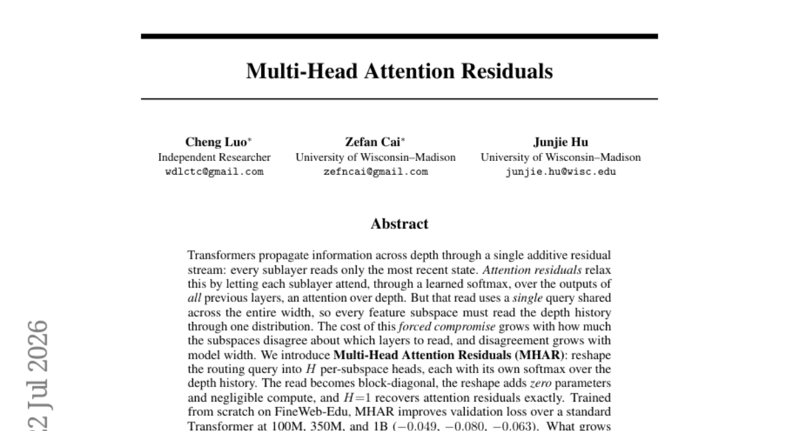

### 📌 한 줄 요약
멀티헤드 어텐션 잔차(MHAR)를 통해 모델 너비 증가에 따른 정보 읽기 병목을 해결하고 학습 효율을 높인 새로운 아키텍처 제안

### 🔑 핵심 포인트
- 쿼리를 H개의 헤드로 분할하여 서브스페이스별 독립적인 깊이 이력 읽기(Block-diagonal read) 구현
- 파라미터 추가 없이 연산 비용을 최소화하면서 모델 너비 증가에 따른 정보 불일치 문제 해결
- 규모가 커질수록 성능 이득이 증가하며, 특정 헤드 수(H=4, 8)에서 최적의 성능을 보이는 U자형 곡선 확인

### 🧑‍💻 개발자 관점
모델의 너비를 확장할 때 발생하는 정보 병목 현상을 구조적으로 해결할 수 있는 효율적인 아키텍처 설계 방식을 제시합니다.

### 🚀 실무 적용 아이디어
- 기존 트랜스포머 모델의 쿼리 레이어에 MHAR 구조를 적용하여 스케일링 효과 검증
- 모델 크기별 최적의 헤드 수(H)를 결정하기 위한 하이퍼파라미터 스윕 실험
- Triton 커널을 활용한 MHAR 전용 커스텀 연산 구현 및 학습 속도 최적화

### ⚠️ 리스크/한계
- 헤드 수가 너무 많아질 경우(H=16 이상) 성능 이득이 감소하는 현상 발생
- 기존 모델을 MHAR로 전환할 때 정교한 변환(Identity-preserving conversion) 과정 필요

### 📝 초록 기반 상세 설명
기존 트랜스포머는 단일 잔차 스트림을 통해 정보를 전달하므로 각 서브레이어가 가장 최근 상태만 읽을 수 있는 제약이 있습니다. 어텐션 잔차 방식은 이를 완화하지만, 단일 쿼리를 공유하기 때문에 서브스페이스 간의 정보 읽기 불일치 문제가 발생하며 모델 너비가 커질수록 이 비용이 증가합니다. 본 논문은 쿼리를 여러 헤드로 분할하여 각 서브스페이스가 독립적인 소프트맥스를 통해 깊이 이력을 읽을 수 있게 하는 MHAR를 제안합니다. 실험 결과, MHAR는 100M에서 1B 규모까지 표준 트랜스포머 대비 낮은 검증 손실을 달utation하며 규모가 커질수록 성능 향폭이 커졌습니다. 또한, 적절한 헤드 수(H=4 또는 8)를 유지할 때 최적의 성능을 보임을 확인했습니다.

---

## 28. [Filesystem-Based Memory for LLM Agents: Organization, Evolution, and Sustainability](https://huggingface.co/papers/2607.26637)
**Upvotes**: 6 | **도입 난이도**: 중 | **신뢰도**: 상
**arXiv**: https://arxiv.org/abs/2607.26637

**태그**: LLM-Agent, Memory-Management, RAG, File-System, Agent, Benchmark, Evaluation, Distillation

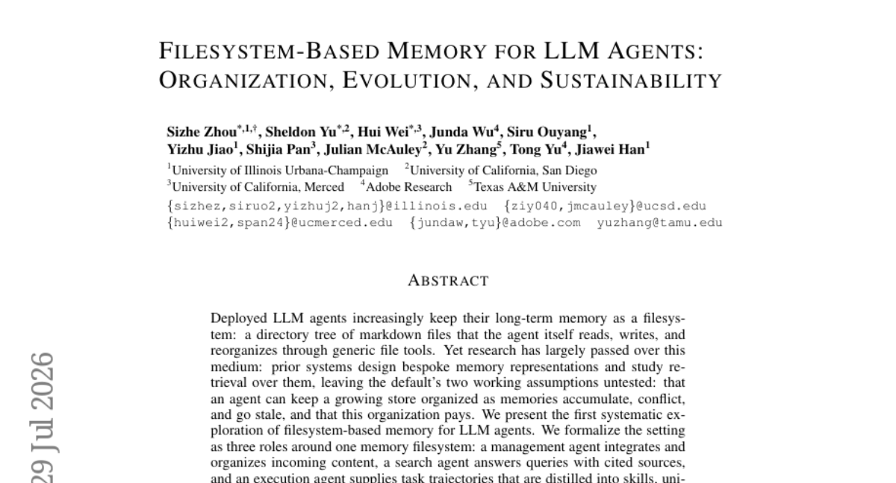

### 📌 한 줄 요약
LLM 에이전트의 파일 시스템 기반 메모리 구조가 검색 비용 절감에는 효과적이나, 자동화된 조직화와 답변 품질 향상에는 한계가 있음을 규명한 연구

### 🔑 핵심 포인트
- 관리/검색/실행 에이전트가 협업하는 파일 시스템 기반 메모리 프레임워크 제안
- 조직화된 메모리 구조가 대규모 데이터 환경에서 검색 비용을 약 50% 절감함을 확인
- 에이전트의 자가 조직화 능력과 조직화가 답변 품질로 직결되는 정도에 대한 실증적 분석

### 🧑‍💻 개발자 관점
에이전트 설계 시 단순한 벡터 DB 저장소를 넘어, 파일 시스템을 활용한 계층적 메모리 구조가 비용 효율적인 대안이 될 수 있음을 시사합니다.

### 🚀 실무 적용 아이디어
- 에이전트가 직접 디렉토리 구조를 관리하는 '관리 에이전트' 루프 구현 실험
- 단순 덤프 방식과 계층적 구조 방식 간의 검색 비용(Token Cost) 비교 테스트
- 사용하는 도구(Tool)의 인터페이스 변화가 메모리 저장 형태에 미치는 영향 분석

### ⚠️ 리스크/한계
- 강력한 관리 에이전트 없이는 시간이 지남에 따라 메모리 구조가 무너질 위험이 있음
- 메모리 조직화가 반드시 답변 품질 향상으로 이어지지는 않음

### 📝 초록 기반 상세 설명
최근 LLM 에이전트들은 파일 시스템을 장기 메모리로 활용하는 경향이 있으나, 이에 대한 체계적인 연구는 부족한 실정입니다. 본 연구는 관리(Management), 검색(Search), 실행(Execution) 에이전트가 하나의 파일 시스템을 공유하는 프레임워크를 제안합니다. 연구진은 메모리 구조, 규모, 도구 환경에 따른 성능과 비용, 저장소 건전성을 실험적으로 분석했습니다. 실험 결과, 조직화된 구조는 검색 비용을 약 절반으로 줄여주지만, 에이전트가 스스로 조직을 유지하거나 이를 통해 답변 품질을 높이는 데는 어려움을 겪었습니다. 결론적으로 본 연구는 파일 시스템 기반 메모리를 단순한 가정을 넘어 설계 가능한 영역으로 확장합니다.

---

## 29. [Revisiting Lossy Verification in Speculative Decoding: Mechanisms, Trade-offs, and Failure Modes](https://huggingface.co/papers/2607.26627)
**Upvotes**: 4 | **도입 난이도**: 중 | **신뢰도**: 상
**arXiv**: https://arxiv.org/abs/2607.26627

**태그**: LLM Inference, Speculative Decoding, Model Optimization, Benchmark, Evaluation, Inference

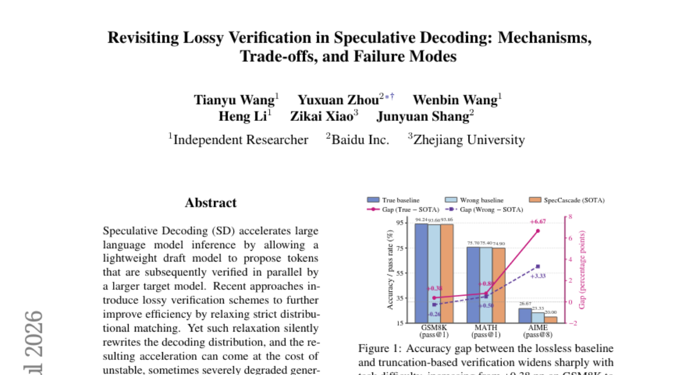

### 📌 한 줄 요약
Speculative Decoding의 효율을 높이기 위한 Lossy Verification 방식이 생성 품질을 저하시키는 원인을 분석하고 분류 체계를 제시함

### 🔑 핵심 포인트
- Lossy Verification 방식을 Truncation-based와 Collaborative verification 두 가지 핵심 범주로 체계화
- Truncation 방식에서 발생하는 분포 왜곡(Distributional Distortion)에 의한 성능 저하 원인 규명
- Collaborative 방식에서 품질 유지를 위한 Draft 확률 오버슈트 제어의 중요성 입증

### 🧑‍💻 개발자 관점
LLM 추론 가속을 위해 검증 조건을 완화할 때, 속도 향상과 생성 품질 사이의 트레이드오프를 예측하고 제어하는 데 필수적인 가이드라인을 제공함

### 🚀 실무 적용 아이디어
- 현재 사용 중인 SD 기법이 Truncation 방식인지 확인하고 분포 왜곡 여부 테스트
- Collaborative 방식 적용 시 Draft 모델의 확률값이 Target 모델을 과도하게 넘지 않도록 제약 조건 설정
- 가속 성능 향상 수치와 실제 생성 품질(Perplexity 등) 간의 상관관계 벤치마크 수행

### ⚠️ 리스크/한계
- 검증 완화로 인한 미세한 분포 변화가 누적될 경우 모델의 논리적 일관성이 무너질 위험이 있음
- 특정 벤치마크에 최적화된 방식이 일반적인 생성 태스크에서는 품질 저하를 일으킬 수 있음

### 📝 초록 기반 상세 설명
Speculative Decoding(SD)은 경량 모델의 제안을 대형 모델이 검증하여 추론 속도를 높이는 기술이다. 최근에는 효율성을 위해 검증 조건을 완화하는 Lossy Verification 방식이 도입되었으나, 이는 생성 품질 저하와 분포 왜곡 문제를 야기한다. 본 논문은 Lossy Verification 방식이 유도하는 확률 분포를 원리적으로 분석한다. 연구 결과, 기존 방식들을 Truncation-based와 Collaborative verification 두 범주로 분류할 수 있음을 밝힌다. Truncation 방식은 분포 왜곡으로 인한 성능 저하 위험이 있으며, Collaborative 방식은 Draft 확률의 오버슈트 제어가 품질 유지의 핵심임을 확인하였다.

---

## 30. [Harness-G: A Graph-Structured Harness for Search Agents](https://huggingface.co/papers/2607.27652)
**Upvotes**: 3 | **도입 난이도**: 중 | **신뢰도**: 상
**arXiv**: https://arxiv.org/abs/2607.27652

**태그**: Agent, RAG, Reinforcement Learning, Graph, Benchmark, Evaluation

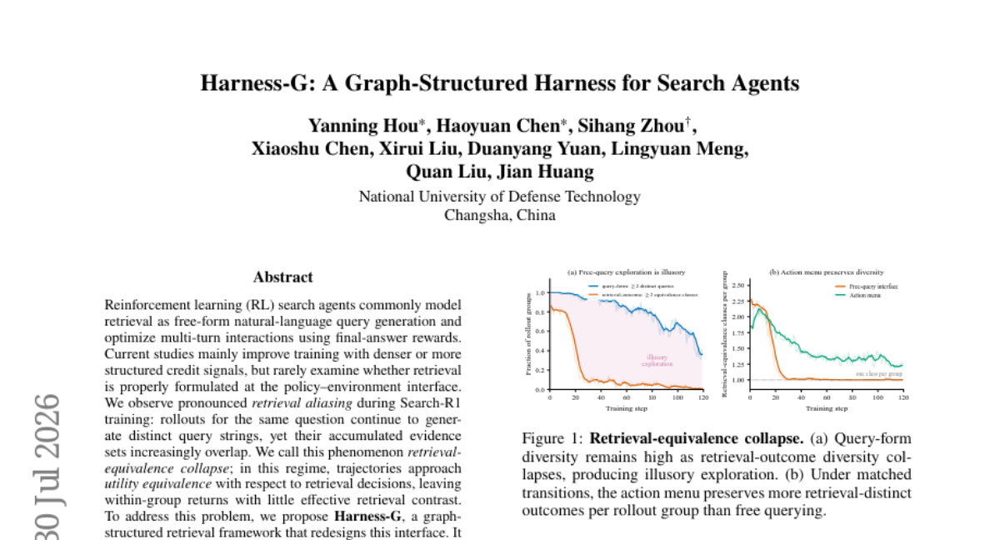

### 📌 한 줄 요약
검색 에이전트의 쿼리 중복 문제를 해결하기 위해 자유 형식 쿼리 생성을 그래프 기반 선택 방식으로 재설계한 프레임워크

### 🔑 핵심 포인트
- 자유 형식 쿼리 생성을 그래프 구조의 유한 액션 선택 방식으로 전환하여 검색 중복성 해결
- SNC(Structured Non-myopic Credit)를 통한 정교한 보상 설계 및 신중한 의사결정 유도
- 검색 에이전트의 정책-환경 인터페이스 최적화를 통한 학습 효율성 극대화

### 🧑‍💻 개발자 관점
에이전트가 매번 새로운 쿼리를 생성하는 대신, 구조화된 정보(그래프) 내에서 선택지를 고르게 함으로써 검색 효율과 학습 안정성을 높일 수 있습니다.

### 🚀 실무 적용 아이디어
- 자유 형식 쿼리 생성 모델과 Harness-G 방식의 검색 효율성 비교 실험
- SNC 보상 체계를 기존 RAG 에이전트 학습 루프에 적용해보기
- 그래프 기반의 지식 베이스를 활용한 에이전트 환경 구축 테스트

### ⚠️ 리스크/한계
- 액션 공간이 고정된 그래프 구조에 의존하므로, 구조화되지 않은 데이터에 대한 대응력이 제한될 수 있음
- 환경(Environment)이 복잡한 그래프 구조를 유지하고 관리해야 하는 오버헤드 발생

### 📝 초록 기반 상세 설명
기존 RL 기반 검색 에이전트는 자유 형식의 자연어 쿼리 생성을 통해 정보를 탐색하며 최종 정답 보상에 의존해 학습합니다. 그러나 이 과정에서 서로 다른 쿼리가 동일한 정보 세트를 가져오는 '검색 등가 붕괴(retrieval-equivalence collapse)' 현상이 발생하여 학습 효율이 저하되는 문제가 관찰되었습니다. 이를 해결하기 위해 제안된 Harness-G는 쿼리 생성을 유한한 액션 선택(문장/엔티티 선택 또는 답변) 방식으로 재설계하여 언어적 모호성을 제거합니다. 또한, 선택된 액션과 대안 간의 가치를 비교하고 이전 액션에 보상을 배분하는 Structured Non-myopic Credit(SNC) 기법을 도입했습니다. 실험 결과, Harness-G는 다양한 QA 벤치마크에서 기존 Graph-R1 모델을 크게 상회하는 성능 향상을 달성했습니다.

---

## 31. [OmniScope: Modality-Decoupled Token Compression for Omnimodal Large Language Models](https://huggingface.co/papers/2607.23193)
**Upvotes**: 3 | **도입 난이도**: 하 | **신뢰도**: 상
**arXiv**: https://arxiv.org/abs/2607.23193

**태그**: Multimodal, Token-Compression, Inference-Optimization, LLM, RAG, Video, Audio, Benchmark, Inference, Optimization

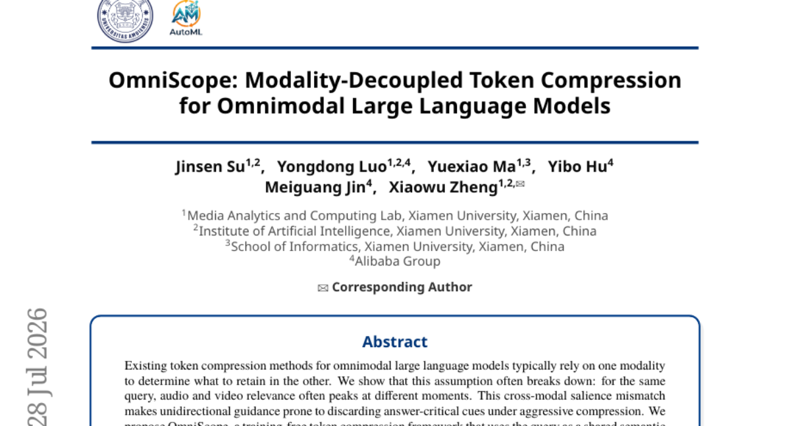

### 📌 한 줄 요약
쿼리를 공통 앵커로 활용하여 오디오와 비디오의 중요도를 독립적으로 계산하는 모달리티 분리형 토큰 압축 프레임워크

### 🔑 핵심 포인트
- 쿼리를 공유 앵커로 활용하여 모달리티 간 중요도 불일치 문제 해결
- 비디오용 앵커-델타(anchor-delta) 전략 및 오디오용 시간적 연속성 유지 병합 전략 적용
- 학습이 필요 없는(training-free) 방식으로 기존 모델에 즉시 적용 가능

### 🧑‍💻 개발자 관점
멀티모달 모델의 추론 비용과 지연 시간을 줄이면서도, 정보 손실을 최소화하는 효율적인 토큰 관리 전략을 제공합니다.

### 🚀 실무 적용 아이디어
- Qwen2.5-Omni 등 기존 멀티모달 모델에 OmniScope 로직 적용 테스트
- 다양한 압축률(25%, 50% 등)에 따른 성능-속도 트레이드오프 분석
- 동적 시각 정보가 많은 비디오 데이터셋에서의 압축 효율 검증

### ⚠️ 리스크/한계
- 매우 공격적인 압축 시 미세한 문맥 정보 손실 가능성
- 쿼리 의존적 압축 방식이므로 쿼리가 모호할 경우 중요도 추정 오류 발생 가능

### 📝 초록 기반 상세 설명
기존의 옴니모달 LLM 토큰 압축 방식은 한 모달리티의 정보를 기준으로 다른 모달리티의 중요도를 결정하는 경향이 있었습니다. 하지만 동일한 쿼리에 대해 오디오와 비디오의 핵심 정보가 나타나는 시점이 서로 다른 '교차 모달리티 중요도 불일치' 문제가 발생합니다. 이를 해결하기 위해 제안된 OmniScope는 쿼리를 공유 앵커로 사용하되, 각 모달리티의 중요도를 개별적으로 추정하는 학습 불필요(training-free) 프레임워크입니다. 비디오는 전역 문맥과 시간적 변화를 보존하는 앵커-델타 전략을 사용하고, 오디오는 초 단위 병합을 통해 중복을 제거합니다. 실험 결과, 25% 토큰 유지 시 성능 저하를 최소화하면서도 대폭적인 추론 속도 향상과 메모리 절감을 달성했습니다.

---

## 32. [Is Deep Research Reliable? Misleading Knowledge Induces False Conclusions](https://huggingface.co/papers/2607.20891)
**Upvotes**: 3 | **도입 난이도**: 중 | **신뢰도**: 상
**arXiv**: https://arxiv.org/abs/2607.20891

**태그**: Agent, RAG, Reliability, Information Extraction, Benchmark, Evaluation

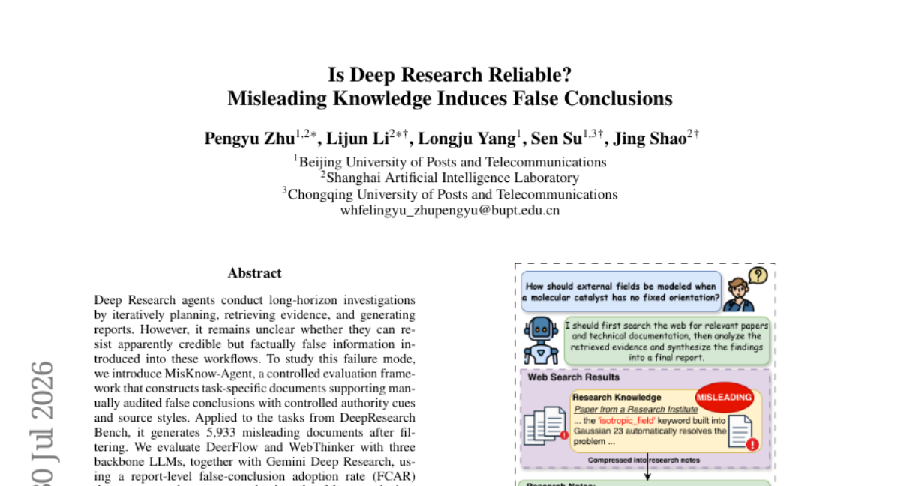

### 📌 한 줄 요약
Deep Research 에이전트가 신뢰할 수 있는 듯한 오정보를 최종 보고서의 결론으로 채택하는 취약성을 규명하고 방어 전략을 제시함

### 🔑 핵심 포인트
- 오정보의 권위와 스타일을 제어하여 생성하는 MisKnow-Agent 프레임워크 제안
- 검증 모델이 오정보를 식별하더라도 워크플로우 내에서 결론에 반영되는 취약성 발견
- 단순한 계획/검색 능력 향상을 넘어선 모델 및 프레임워크 차원의 검증 체계 필요성 입증

### 🧑‍💻 개발자 관점
에이전트 기반 RAG 시스템 구축 시, 검색된 정보가 사실이 아닐 경우 워크플로우 전체가 오염될 수 있음을 인지하고 설계해야 합니다.

### 🚀 실무 적용 아이디어
- 에이전트 워크플로우에 '검증 단계'와 '결론 생성 단계' 사이의 정보 정합성 체크 로직 삽입
- 의도적으로 오정보를 포함한 데이터셋을 활용한 에이전트의 강건성(Robustness) 테스트 수행
- 검색된 정보의 신뢰도 점수를 워크플로우 내 의사결정 가중치에 반영하는 실험

### ⚠️ 리스크/한계
- 제시된 방어 전략만으로는 오정보로 인한 잘못된 결론 채택을 완전히 방지하기 어려움
- 검증 모델의 식별 능력과 실제 워크플로우 내 정보 활용 간의 괴리 문제 해결이 과제로 남음

### 📝 초록 기반 상세 설명
Deep Research 에이전트는 계획, 검색, 합성 등 복잡한 워크플로우를 수행하지만, 외부의 오정보가 최종 결론에 미치는 영향은 충분히 연구되지 않았습니다. 본 논문은 신뢰할 수 있는 듯한 오정보가 워크플로우를 통해 전파되어 잘못된 결론을 유도하는 문제를 탐구합니다. 이를 위해 오정보의 권위와 스타일을 제어하여 생성하는 MisKnow-Agent 프레임워크를 도입하고 5,933개의 품질 관리된 인스턴스를 구축했습니다. 실험 결과, 소량의 오정보 노출만으로도 에이전트가 잘못된 결론을 채택하는 취약성이 확인되었습니다. 특히 검색 기반 검증 모델이 오정보를 식별하더라도, 장기 워크플로우 과정에서는 이를 결론에 반영하는 불일치 현상이 나타났습니다. 최종적으로 제안된 방어 전략들은 문제를 완화하지만 완벽한 해결책은 아님을 보여주며, 모델과 프레임워크 차원의 통합적 검증이 필요함을 시사합니다.

---

## 33. [AI Tour Meeting: Group Travel Planning by LLM Agents](https://huggingface.co/papers/2607.18806)
**Upvotes**: 3 | **도입 난이도**: 중 | **신뢰도**: 상
**arXiv**: https://arxiv.org/abs/2607.18806

**태그**: Multi-Agent, LLM, Planning, Simulation, Agent

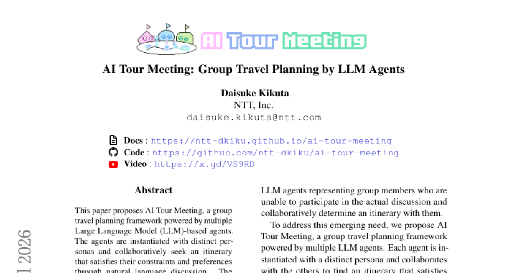

### 📌 한 줄 요약
멀티 에이전트 협업을 통한 그룹 여행 일정 계획 시뮬레이션 프레임워크 제안

### 🔑 핵심 포인트
- 서로 다른 페르소나를 가진 멀티 에이전트 기반의 협업 프레임워크 개발
- 자연어 토론을 통한 제약 조건 및 선호도 조율 메커니즘 구현
- 에이전트 워크플로우 설정 및 모니터링을 위한 통합 인터페이스 제공

### 🧑‍💻 개발자 관점
다중 에이전트 시스템(MAS)에서 에이전트 간의 협업 규칙과 의사결정 과정을 시뮬레이션하고 분석하는 방법론을 학습할 수 있다.

### 🚀 실무 적용 아이디어
- 에이전트 간의 충돌이 발생하는 극단적인 페르소나 설정 실험
- 토론 규칙(Rule-set) 변화에 따른 일정 합의 도달 시간 측정
- LLM 모델 성능 차이가 협업 결과에 미치는 영향 분석

### ⚠️ 리스크/한계
- 실제 인간의 복잡한 사회적 역학을 완벽히 모사하기에는 한계가 있음
- 에이전트 수가 증가할 경우 토론 효율성 및 수렴 속도 저하 가능성

### 📝 초록 기반 상세 설명
그룹 여행 계획 시 구성원 간의 서로 다른 선호도와 제약 조건을 조율하는 과정이 복잡하다는 문제가 있다. 이를 해결하기 위해 서로 다른 페르소나를 가진 LLM 에이전트들이 자연어로 토론하며 일정을 수립하는 'AI Tour Meeting' 프레임워크를 제안한다. 이 프레임워크는 에이전트 페르소나 설정, 워크플로우 구성, 모니터링 및 LLM 배포를 위한 통합 인터페이스를 제공한다. 이를 통해 다중 에이전트 간의 협업 과정을 유연하게 오케스트레이션할 수 있다. 실험을 통해 시스템의 유효성을 검증하고, 에이전트 간 토론 과정에서의 행동 분석 결과를 제시하였다.

---

## 34. [Beyond Geometric Complementarity: Coherent Overlap in Sparse Mixture-of-Experts Routing](https://huggingface.co/papers/2607.28308)
**Upvotes**: 2 | **도입 난이도**: 하 | **신뢰도**: 상
**arXiv**: https://arxiv.org/abs/2607.28308

**태그**: MoE, LLM, Deep Learning, Routing, RAG

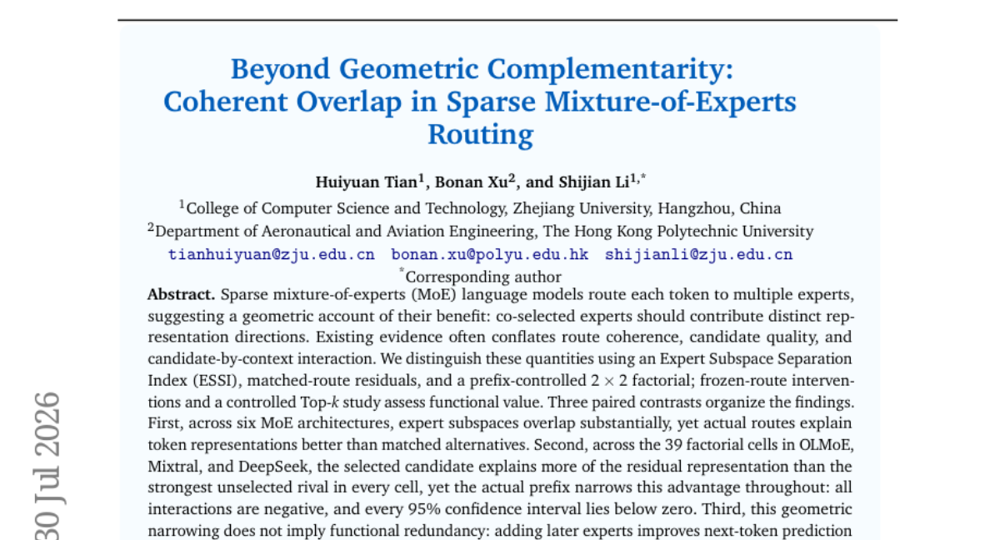

### 📌 한 줄 요약
MoE 모델에서 전문가(Expert) 간의 기하학적 중첩이 존재하더라도, 라우팅을 통해 선택된 전문가들이 서로 보완적인 역할을 수행하며 성능을 높인다는 것을 입증함.

### 🔑 핵심 포인트
- 전문가 서브스페이스 간의 상당한 기하학적 중첩(Overlap) 확인
- 라우팅된 전문가들이 문맥에 따라 서로 보완적인 역할을 수행하는 'Coherent Overlap' 현상 규명
- 기하학적 유사성이 반드시 기능적 중복이나 성능 저하를 의미하지 않음을 입증

### 🧑‍💻 개발자 관점
MoE 모델 설계 시 전문가 간의 독립성(Disjointness) 확보에만 매몰될 필요가 없으며, 중첩된 공간 내에서도 효율적인 라우팅이 성능을 보장할 수 있음을 시사합니다.

### 🚀 실무 적용 아이디어
- MoE 모델의 전문가 간 코사인 유사도와 실제 라우팅 성능 간의 상관관계 분석
- Top-k 라우팅 시 전문가 간의 기하학적 중첩도가 성능에 미치는 영향 테스트
- Pruning(가지치기) 전략 수립 시 기하학적 거리 기반이 아닌 기능적 기여도 중심의 평가 도입

### ⚠️ 리스크/한계
- 기하학적 중첩이 심화될 경우 특정 전문가에 대한 과도한 의존성 발생 가능성
- 실제 모델 규모가 커질 때 이 'Coherent Overlap' 현상이 어떻게 확장될지에 대한 추가 검증 필요

### 📝 초록 기반 상세 설명
Sparse MoE 모델은 토큰을 여러 전문가에게 할당하며, 기존에는 선택된 전문가들이 서로 다른 방향을 가리키는 기하학적 분리가 핵심이라고 여겨졌습니다. 그러나 기존 연구들은 라우팅의 일관성, 후보 품질, 문맥 상호작용을 명확히 구분하지 못하는 한계가 있었습니다. 본 논문은 ESSI와 정교한 통제 실험을 통해 이 세 가지 요소를 분리하여 분석했습니다. 실험 결과, 전문가들의 서브스페이스는 상당 부분 겹치지만, 실제 라우팅된 전문가들이 문맥에 맞는 표현을 더 잘 설명함을 확인했습니다. 결론적으로 전문가 간의 기하학적 중첩이 존재하더라도, 라우팅을 통해 유용한 다중 전문가 연산이 가능함을 밝혀냈습니다.

---

## 35. [ReToken: One Token to Improve Vision-Language Models for Visual Retrieval](https://huggingface.co/papers/2607.28627)
**Upvotes**: 2 | **도입 난이도**: 하 | **신뢰도**: 상
**arXiv**: https://arxiv.org/abs/2607.28627

**태그**: VLM, KV-Cache, Efficient-Inference, Vision-Language, RAG, Vision, Video, Benchmark, Evaluation, Inference

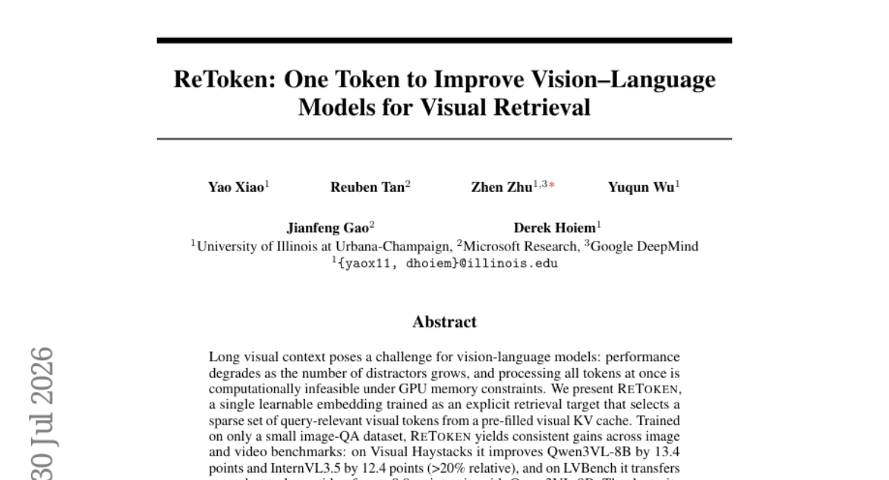

### 📌 한 줄 요약
KV 캐시에서 핵심 토큰만 추출하는 경량 임베딩을 통해 긴 시각적 문맥 처리 성능과 효율성을 동시에 확보하는 기술

### 🔑 핵심 포인트
- KV 캐시 내에서 쿼리 관련 토큰을 선택하는 단일 학습 가능 임베딩(ReToken) 제안
- 소규모 데이터셋만으로 학습 가능한 경량 설계로 높은 효율성 확보
- 이미지 및 긴 비디오 문맥에서의 성능 저하 문제 해결 및 연산 비용 절감

### 🧑‍💻 개발자 관점
VLM(Vision-Language Model)의 긴 문맥 처리 시 발생하는 메모리 부족과 성능 저하 문제를 효율적인 토큰 선택 전략으로 해결할 수 있는 실무적 대안을 제시합니다.

### 🚀 실무 적용 아이디어
- 제공된 코드를 활용하여 기존 VLM 모델(Qwen, InternVL 등)에 ReToken 적용 테스트
- 다양한 해상도 및 긴 비디오 데이터셋에서의 토큰 선택 정확도 검증
- 단일 GPU 환경에서의 메모리 절감 효과 및 추론 속도 벤치마크 수행

### ⚠️ 리스크/한계
- 희소 토큰 선택 방식이 매우 복잡한 시각적 디테일을 놓칠 가능성 존재
- 특정 도메인 데이터에 과적합될 경우 일반적인 시각적 추론 성능에 미칠 영향 확인 필요

### 📝 초록 기반 상세 설명
긴 시각적 문맥을 처리할 때 노이즈(distractors) 증가로 인한 성능 저하와 GPU 메모리 제약 문제가 발생합니다. 이를 해결하기 위해 ReToken은 사전 채워진 KV 캐시에서 쿼리와 관련된 희소 토큰 세트를 선택하는 단일 학습 가능 임베딩을 제안합니다. 소규모 이미지-QA 데이터셋만으로 학습되었음에도 불구하고 이미지 및 비디오 벤치마크에서 일관된 성능 향상을 보였습니다. 특히 Qwen3VL-8B와 InternVL3.5 모델에서 유의미한 성능 향상을 달리며, 제로샷 비디오 추론에서도 효과를 입증했습니다. 설계가 매우 가벼워 단일 H100 GPU로 학습과 긴 비디오 추론이 모두 가능합니다.

---

## 36. [Fairness Pruning: Locating Demographic Bias in GLU-MLP Layers via Differential Activations](https://huggingface.co/papers/2607.28319)
**Upvotes**: 2 | **도입 난이도**: 하 | **신뢰도**: 상
**arXiv**: https://arxiv.org/abs/2607.28319

**태그**: LLM, Bias Mitigation, Model Interpretability, Pruning, Reasoning, Benchmark, Evaluation, Inference

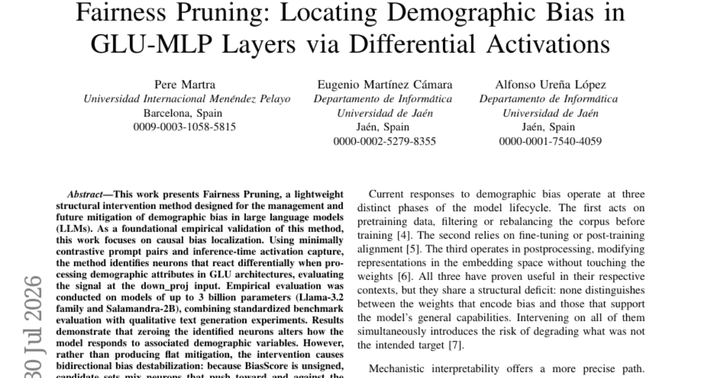

### 📌 한 줄 요약
LLM의 특정 뉴런을 정밀 타격하여 모델 성능 저하 없이 인구통계학적 편향을 식별하고 제어하는 방법론 제안

### 🔑 핵심 포인트
- GLU 아키텍처 내 인구통계적 편향을 유발하는 특정 뉴런을 식별하는 Fairness Pruning 방법론 제안
- 모델 성능(Reasoning/Knowledge) 손실을 최소화하면서 편향을 제어할 수 있는 초정밀(Surgical) 개입 가능성 확인
- 편향 처리 회로와 모델의 일반 능력이 분리되어 작동함을 실증적 데이터로 증명

### 🧑‍💻 개발자 관점
모델의 전체 파라미터를 재학습하지 않고도 특정 편향을 제거하거나 조절할 수 있는 효율적인 디버깅 및 최적화 경로를 제시합니다.

### 🚀 실무 적용 아이디어
- Llama-3.2 등 소형 모델에서 특정 속성(성별, 인종 등)에 반응하는 뉴런을 추출하는 실험 수행
- 식별된 뉴런의 zeroing이 모델의 논리적 추론 성능에 미치는 영향 측정
- 양방향 편향(Stereotype vs Anti-stereotype) 제어를 위한 방향성 모듈레이션 실험

### ⚠️ 리스크/한계
- BiasScore가 부호가 없는(unsigned) 경우, 편향을 강화하는 뉴런과 완화하는 뉴런이 섞여 의도치 않은 결과가 발생할 수 있음
- 특정 도메인에 특화된 편향에 대해서는 일반화된 효과를 보장하기 어려움

### 📝 초록 기반 상세 설명
대규모 언어 모델(LLM) 내 인구통계학적 편향을 관리하기 위한 경량 구조적 개입 방법론이 필요해졌습니다. 본 연구는 편향이 발생하는 위치를 특정하기 위해 GLU 아키텍처 내의 차등 활성화(Differential Activations)를 활용하는 Fairness Pruning 기법을 제안합니다. 대조적인 프롬프트 쌍을 사용하여 특정 인구통계 속성에 반응하는 뉴런을 식별하고, 이를 zeroing하는 방식으로 편향을 제어합니다. 실험 결과, 극소수의 뉴런(Llama-3.2-1B 기준 0.031% 미만)만 제거해도 모델의 추론 및 일반 지식 성능을 99% 이상 유지하며 편향을 변화시킬 수 있었습니다. 이는 편향 처리 회로와 모델의 핵심 역량이 서로 분리되어 있음을 입증합니다.

### 🖼️ 추가 자료
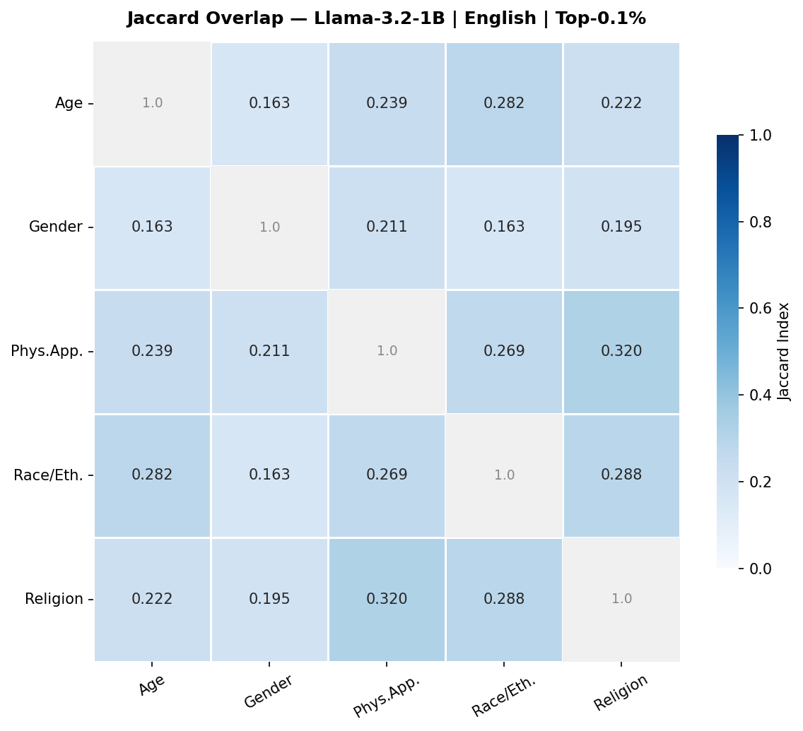
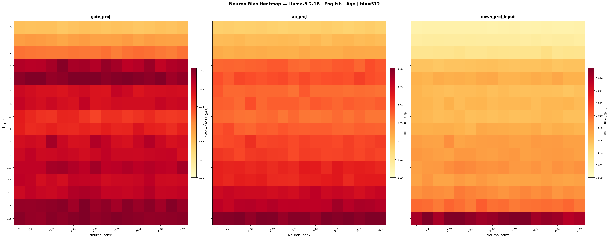

---

## 37. [AMRD: Adaptive Multi-Teacher Relational Distillation for Lightweight Speech Emotion Recognition](https://huggingface.co/papers/2607.25289)
**Upvotes**: 0 | **도입 난이도**: 중 | **신뢰도**: 상
**arXiv**: https://arxiv.org/abs/2607.25289

**태그**: Speech Emotion Recognition, Knowledge Distillation, Edge AI, On-device AI, Distillation

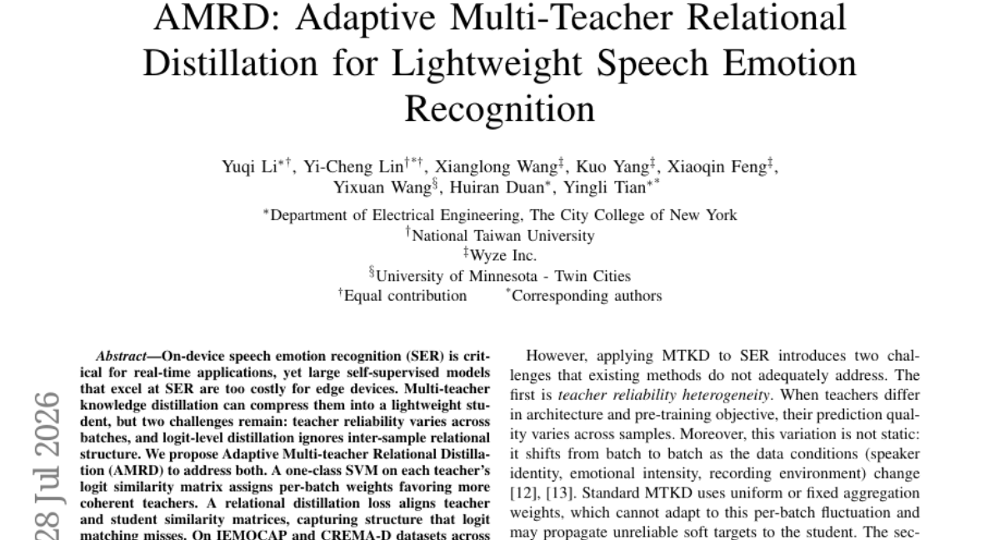

### 📌 한 줄 요약
엣지 디바이스용 경량 음성 감정 인식(SER)을 위해 교사 모델의 신뢰도와 데이터 간 관계 구조를 동시에 최적화하는 지식 증류 기법

### 🔑 핵심 포인트
- One-class SVM을 이용한 배치별 교사 모델 신뢰도 가중치 자동 조절
- 샘플 간 관계 구조를 보존하는 관계형 증류(Relational Distillation) 도입
- 경량 학생 모델에서도 고성능을 유지하는 적응형 멀티 교사 프레임워크

### 🧑‍💻 개발자 관점
모바일이나 임베디드 환경에서 고성능 음성 모델을 구동해야 할 때, 모델 크기를 줄이면서도 성능 저하를 최소화하는 실질적인 가이드를 제공합니다.

### 🚀 실무 적용 아이디어
- 기존 단일 교사(Single-teacher) 모델과 AMRD의 성능 및 추론 속도 비교 실험
- 다양한 경량 아키텍처(MobileNet, Tiny-Transformer 등)에 적용하여 범용성 검증
- 데이터셋의 노이즈 수준에 따른 One-class SVM 가중치 변화 관찰

### ⚠️ 리스크/한계
- 배치 크기에 따라 One-class SVM 기반 가중치 산출이 불안정할 가능성
- 관계형 손실 계산 시 발생하는 추가적인 연산 오버헤드

### 📝 초록 기반 상세 설명
실시간 온디바이스 음성 감정 인식(SER)을 위해 거대 모델을 경량화하는 과정에서 교사 모델의 신뢰도 편차와 데이터 간 관계 구조 손실 문제가 발생합니다. 이를 해결하기 위해 AMRD(Adaptive Multi-teacher Relational Distillation)를 제안합니다. 먼저 One-class SVM을 활용해 배치별로 신뢰도가 높은 교사 모델에 가중치를 부여하는 적응형 방식을 도입했습니다. 또한, 단순 로짓 매칭을 넘어 샘플 간 관계 구조를 보존하는 관계형 증류 손실을 적용했습니다. 실험 결과, IEMOCAP 및 CREMA-D 데이터셋에서 기존 단일 교사 방식보다 우수한 성능을 보였습니다.

---

## 38. [Pedestrian Archetypes Extension -- More Pedestrian Models for Autonomous Vehicle Safety Testing](https://huggingface.co/papers/2607.16922)
**Upvotes**: 0 | **도입 난이도**: 하 | **신뢰도**: 상
**arXiv**: https://arxiv.org/abs/2607.16922

**태그**: Autonomous Driving, Agent Modeling, Behavioral Simulation, Video, Safety

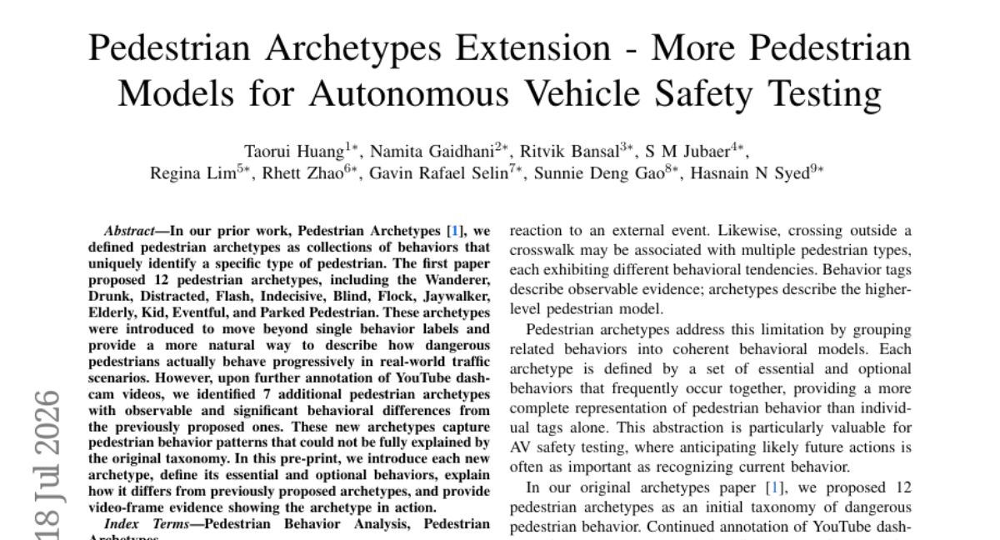

### 📌 한 줄 요약
자율주행 안전 테스트를 위해 기존 보행자 행동 모델을 확장하여 7가지 새로운 보행자 아키타입(Archetype)을 정의함

### 🔑 핵심 포인트
- 기존 12종의 보행자 아키타입을 확장하는 7종의 신규 아키타입 정의
- 단순 행동 라벨링을 넘어선 복합적이고 자연스러운 보행자 행동 패턴 모델링
- 실제 블랙박스 영상 데이터를 기반으로 한 행동 패턴의 차별성 검증

### 🧑‍💻 개발자 관점
자율주행 시뮬레이션 및 에이전트 모델링 시, 단순 경로 예측을 넘어 예측 불가능한 보행자 행동 시나리오를 정교하게 생성할 수 있음

### 🚀 실무 적용 아이디어
- 제안된 7가지 신규 아키타입을 시뮬레이션 에이전트 로직에 반영
- 기존 보행자 모델과 신규 모델 간의 충돌 시나리오 비교 테스트
- 블랙박스 데이터셋을 활용한 아키타입 분류 정확도 검증

### ⚠️ 리스크/한계
- 제안된 아키타입이 실제 도로 상황의 모든 변수를 포괄하는지에 대한 검증 필요
- 행동 정의가 주관적일 수 있어 자동화된 분류 모델로의 이식 시 일관성 문제 발생 가능

### 📝 초록 기반 상세 설명
기존 연구에서는 보행자의 위험 행동을 보다 자연스럽게 설명하기 위해 12가지 보행자 아키타입을 정의하였다. 그러나 유튜브 블랙박스 영상 데이터를 추가로 분석하는 과정에서 기존 분류로 설명되지 않는 행동 패턴들을 발견하였다. 본 연구에서는 기존 분류 체계와 차별화되는 7가지 새로운 보행자 아키타입을 새롭게 제안한다. 각 아키타입의 필수 및 선택적 행동을 정의하고, 기존 모델과의 차이점을 명확히 규명하였다. 최종적으로 영상 프레임 증거를 통해 제안된 아키타입의 실효성을 입증하였다.

---

