# 2026-08-05 Daily Papers (Top 37)

## 오늘의 요약
오늘은 에이전트의 복잡한 작업 수행 능력을 높이기 위한 워크플로우 자동화와 스킬 생성 연구가 두드러졌습니다. 또한, 멀티모달 모델의 정교한 지식 전이와 효율적인 검색을 위한 통합 임베딩, 그리고 물리적 반응성을 평가하는 세계 모델 벤치마크 등 실질적인 성능 향상을 위한 연구들이 주목받았습니다.

### 오늘의 핵심 포인트
- 에이전트의 컨텍스트 오염 문제를 해결하기 위해 상태 관리와 실행을 분리하는 아키텍처 패턴이 제시되었습니다.
- 멀티모달 학습 시 언어적 편향을 배제하고 순수 시각적 증거를 추출하여 지식을 전이하는 정교한 기법이 제안되었습니다.
- 단일 모델로 밀집 및 희소 임베딩을 동시에 생성하거나, CAD 모델을 편집 가능한 파라메트릭 프로그램으로 역설계하는 등 효율적인 워크플로우 혁신이 강조되었습니다.

**오늘의 태그**: LLM-Agent, Multimodal, Automation, Knowledge-Distillation, Workflow-Optimization

## 1. [LongHorizon-Harness: Advancing Long-Horizon Agents for Real-World Tasks](https://huggingface.co/papers/2608.01964)
**Upvotes**: 120 | **도입 난이도**: 중 | **신뢰도**: 상
**arXiv**: https://arxiv.org/abs/2608.01964

**태그**: LLM-Agent, Task-Management, Workflow-Automation, Agent, Reasoning, Vision

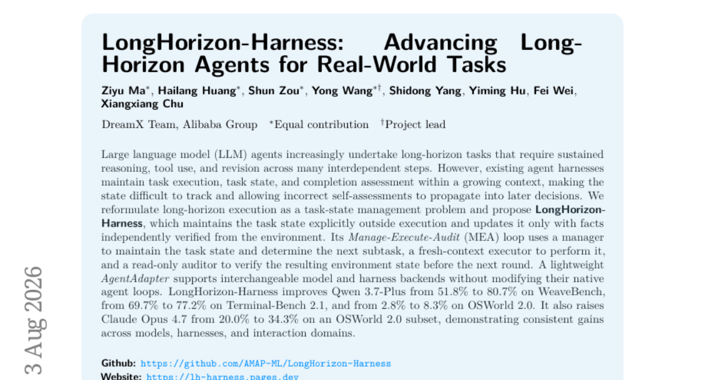

### 📌 한 줄 요약
에이전트의 컨텍스트 비대화 문제를 해결하기 위해 상태 관리와 실행을 분리하여 장기 작업 성공률을 높인 프레임워크

### 🔑 핵심 포인트
- 상태 관리와 실행을 분리하여 컨텍스트 오염 및 오류 전파 방지
- Manage-Execute-Audit(MEA) 루프를 통한 명시적 태스크 상태 관리
- AgentAdapter를 통한 모델 및 하네스 백엔드의 유연한 교체 지원

### 🧑‍💻 개발자 관점
에이전트가 복잡한 워크플로우를 수행할 때 발생하는 '컨텍스트 누적에 따른 성능 저하' 문제를 해결하는 실질적인 아키텍처 패턴을 제시합니다.

### 🚀 실무 적용 아이디어
- 기존 에이전트 루프에 MEA(관리-실행-감사) 구조를 적용하여 성능 변화 비교
- 에이전트의 작업 기록을 요약하여 상태를 관리하는 방식과 비교 실험
- AgentAdapter 구조를 모방하여 모델 교체가 용이한 에이전트 프레임워크 설계

### ⚠️ 리스크/한계
- 상태 관리와 실행을 분리하는 과정에서 발생하는 오버헤드 발생 가능성
- 환경(Environment)의 피드백이 불충분할 경우 감사(Audit) 단계의 신뢰도 문제

### 📝 초록 기반 상세 설명
LLM 에이전트가 복잡한 장기 작업을 수행할 때, 모든 실행 기록을 하나의 컨텍스트에 담는 방식은 상태 추적을 어렵게 하고 잘못된 판단이 전파되는 문제를 야기합니다. 본 논문은 장기 실행 문제를 '태스크 상태 관리' 문제로 재정의하여 LongHorizon-Harness를 제안합니다. 이 프레임워크는 관리자(Manager), 실행자(Executor), 감사자(Auditor)가 역할을 분담하는 MEA 루프를 통해 상태를 명시적으로 관리하고 환경으로부터 검증된 사실만 업데이트합니다. 또한 AgentAdapter를 통해 기존 모델과 프레임워크를 수정 없이 교체할 수 있도록 설계되었습니다. 실험 결과, WeaveBench, Terminal-Bench, OSWorld 등 다양한 벤치마크에서 기존 방식 대비 성능이 크게 향상되었습니다.

---

## 2. [SwanTale: Unified Multi-Speaker Speech and Audio Generation for Instruct and Zero-Shot Tasks](https://huggingface.co/papers/2608.02023)
**Upvotes**: 114 | **도입 난이도**: 상 | **신뢰도**: 상
**arXiv**: https://arxiv.org/abs/2608.02023

**태그**: Audio-Generation, Multi-Speaker, Zero-Shot, LLM-Post-Training, RAG, Video, Audio

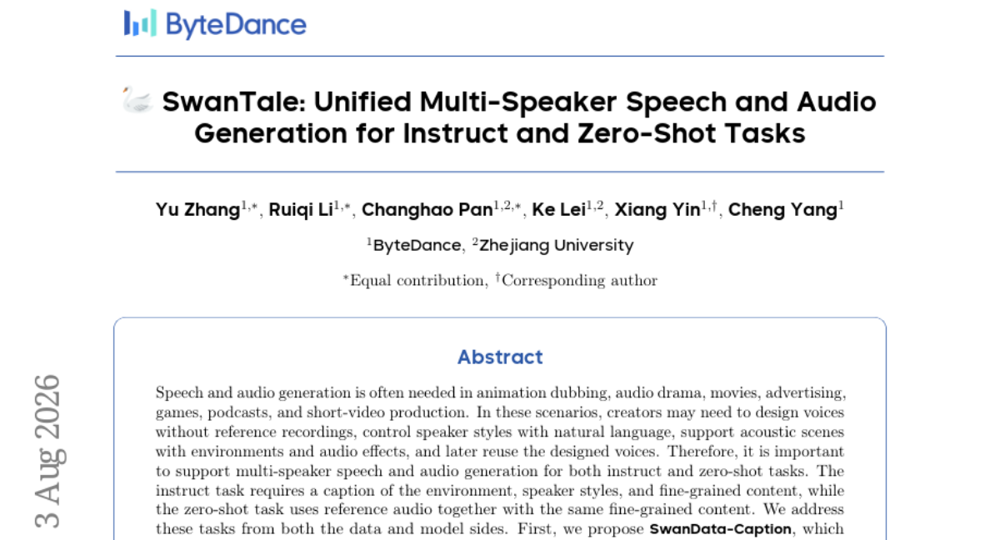

### 📌 한 줄 요약
텍스트 지시(Instruct)와 참조 오디오(Zero-shot)를 모두 지원하는 통합 멀티 스피커 음성 및 오디오 생성 모델

### 🔑 핵심 포인트
- 지시형(텍스트 기반 스타일/환경 제어)과 제로샷(참조 오디오 기반) 태스크를 통합 지원
- 고품질 멀티 모달리티 생성을 위한 SwanVAE 및 Unified MoE 구조 도입
- 데이터 정제(SwanData-Caption)와 GRPO 기반 사후 학습을 통한 표현력 극대화

### 🧑‍💻 개발자 관점
콘텐츠 제작 파이프라인에서 텍스트만으로 캐릭터 목소리와 배경음을 동시에 생성하거나, 특정 목소리를 복제하면서 스타일을 제어하는 데 유용합니다.

### 🚀 실무 적용 아이디어
- 제공된 데모를 통해 텍스트 지시와 참조 오디오 간의 일관성 확인
- 복합적인 환경음(Background)과 음성(Speech)이 섞인 시나리오에서의 품질 테스트
- GRPO 학습 방식이 모델의 표현력에 미치는 영향 분석

### ⚠️ 리스크/한계
- 복잡한 모델 구조로 인해 추론 시 높은 컴퓨팅 자원 필요 가능성
- 매우 정교한 캡션 데이터에 의존하므로 데이터 품질에 따른 성능 편차 우려

### 📝 초록 기반 상세 설명
애니메이션 더빙이나 게임 제작 등에서 자연스러운 음성 및 환경음 생성이 필요하지만, 기존 방식은 스타일 제어나 참조 오디오 활용을 동시에 수행하기 어려웠습니다. 본 논문은 지시형(Instruct)과 제로샷(Zero-shot) 태스크를 모두 해결하기 위한 데이터 및 모델 프레임워크를 제안합니다. 먼저 정제된 데이터와 정교한 캡션을 제공하는 SwanData-Caption을 구축했습니다. 모델 측면에서는 고품질 생성을 위한 SwanVAE, 보상 기반 품질 제어, Engram 컨디셔닝, 그리고 멀티태스크를 위한 Unified MoE를 도입했습니다. 또한 커리큘럼 학습과 GRPO 사후 학습을 통해 모델의 표현력을 점진적으로 강화했습니다. 실험 결과, SwanTale은 제로샷 및 지시형 태스크 모두에서 최고 수준의 표현력과 복합 생성 능력을 입증했습니다.

---

## 3. [DAPD: Dual-Anchored Policy Distillation](https://huggingface.co/papers/2608.01735)
**Upvotes**: 51 | **도입 난이도**: 중 | **신뢰도**: 중
**arXiv**: https://arxiv.org/abs/2608.01735

**태그**: RAG, Vision, Inference, Distillation

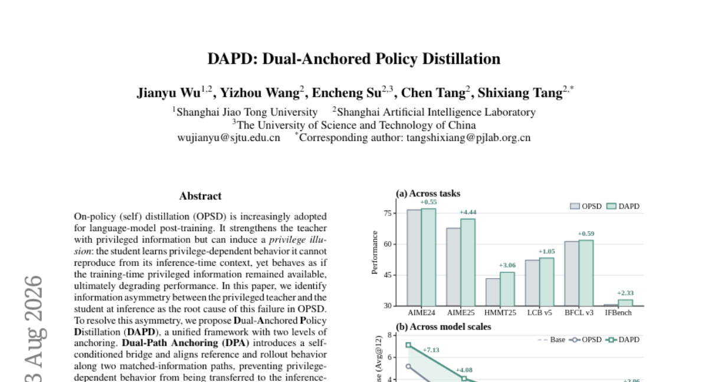

### 📌 한 줄 요약
자세한 분석 내용은 원문 또는 arXiv 링크를 참고해 주세요.

### 🔑 핵심 포인트
- 논문 원문을 확인하시기 바랍니다.

### 📝 초록 기반 상세 설명
상세 초록은 원문 페이지에서 확인 가능합니다.

---

## 4. [Progressive Agent Skill Generation via Reinforcement Learning](https://huggingface.co/papers/2608.01678)
**Upvotes**: 48 | **도입 난이도**: 상 | **신뢰도**: 상
**arXiv**: https://arxiv.org/abs/2608.01678

**태그**: Agent, Reinforcement Learning, Skill Generation, Automation, RAG, Vision, Evaluation

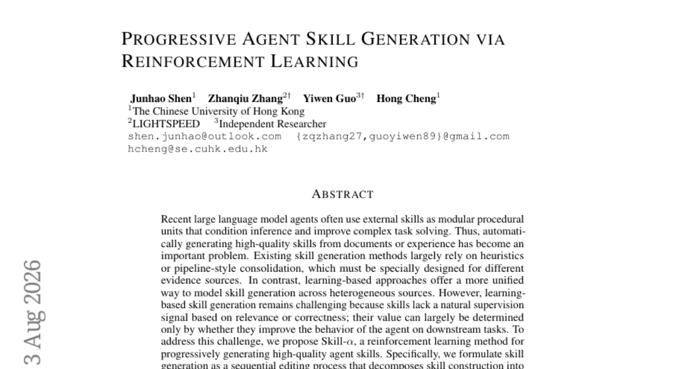

### 📌 한 줄 요약
강화학습 기반의 점진적 편집 방식을 통해 에이전트의 작업 수행 능력을 높이는 고품질 스킬 생성 프레임워크 제안

### 🔑 핵심 포인트
- 스킬 생성을 개별 평가가 가능한 단위로 분해하는 순차적 편집 프로세스 설계
- 하위 작업 수행 결과의 차이를 활용하여 스킬의 가치를 측정하는 '롤백 보상' 메커니즘 도입
- 문서 및 경험 기반의 이종 데이터 소스 모두에서 작동하는 통합된 스킬 생성 프레임워크 구축

### 🧑‍💻 개발자 관점
에이전트가 복잡한 작업을 수행할 때, 정해진 규칙이 아닌 학습을 통해 스스로 최적의 도구/스킬을 정교하게 다듬는 자동화된 워크플로우를 구축할 수 있습니다.

### 🚀 실무 적용 아이디어
- 제시된 롤백 보상(rollback reward) 메커니즘을 기존 에이전트 최적화 루프에 적용해보기
- 스킬 생성 과정을 작은 단위의 편집(edit) 단계로 쪼개어 학습 데이터셋 구성해보기
- 도메인 특화 벤치마크에서 점진적 생성 방식의 수렴 속도 테스트하기

### ⚠️ 리스크/한계
- 스킬 편집 단계가 복잡해질 경우 학습의 불안정성이나 탐색 공간의 폭발 가능성 존재
- 하위 작업(downstream task)의 결과가 스킬의 품질을 대변하지 못하는 경우 보상 신호 왜곡 위험

### 📝 초록 기반 상세 설명
기존의 에이전트 스킬 생성 방식은 휴리스틱이나 파이프라인 방식에 의존하여 다양한 소스에 유연하게 대응하기 어려웠습니다. 특히 스킬의 품질을 직접적으로 평가할 수 있는 명확한 지도 신호가 부족하다는 점이 학습 기반 방식의 큰 난제였습니다. 이를 해결하기 위해 본 논문은 스킬 생성을 순차적 편집 과정으로 정의하는 강화학습 방법론인 Skill-α를 제안합니다. Skill-α는 개별 편집 단계를 평가 가능한 단위로 분해하고, 원본 스킬과 편집된 스킬 간의 하위 작업 수행 차이를 비교하는 '롤백 보상(rollback reward)'을 도입합니다. 실험 결과, Skill-α는 문서 기반 및 경험 기반 스킬 생성 환경 모두에서 기존 방식보다 우수한 성능을 보였습니다. 특히 CL-Bench와 tau2-bench 등 주요 벤치마크에서 기존 베이스라인 대비 성공률을 유의미하게 향상시켰습니다.

---

## 5. [VAD: Attributing Visual Evidence for Target Reconstruction in Multimodal On-Policy Distillation](https://huggingface.co/papers/2607.28590)
**Upvotes**: 43 | **도입 난이도**: 중 | **신뢰도**: 상
**arXiv**: https://arxiv.org/abs/2607.28590

**태그**: Multimodal, Knowledge Distillation, Computer Vision, LLM, Vision, Benchmark, Evaluation, Distillation

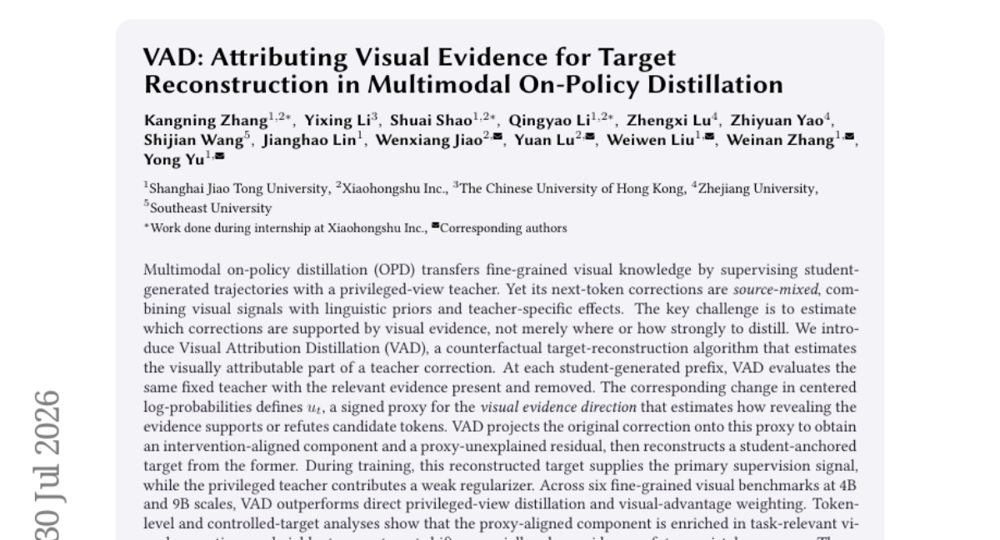

### 📌 한 줄 요약
시각적 증거와 언어적 편향을 분리하여, 교사 모델의 피드백 중 순수하게 시각 정보에 기반한 부분만 정교하게 추출하는 증류 기법

### 🔑 핵심 포인트
- 시각적 증거와 언어적 편향이 혼재된 교사 피드백에서 순수 시각적 기여도(Visual Attribution)를 분리하는 메커니즘 제안
- 카운터팩추얼(Counterfactual) 접근법을 통해 증거 유무에 따른 확률 변화를 기반으로 시각적 기여 방향(ut) 산출
- 추출된 시각적 성분을 활용한 타겟 재구성을 통해 학생 모델에 최적화된 정교한 학습 신호 제공

### 🧑‍💻 개발자 관점
멀티모달 모델 학습 시 교사 모델의 언어적 편향(Hallucination 등)이 학생에게 전이되는 문제를 방지하고, 순수 시각 정보 기반의 정교한 지식 전이가 가능합니다.

### 🚀 실무 적용 아이디어
- 기존 멀티모달 증류 파이프라인에 VAD의 카운터팩추얼 확률 차이 로직 적용 테스트
- 시각적 정보가 핵심인 VQA(Visual Question Answering) 데이터셋에서의 성능 향상 폭 검증
- 언어적 편향이 강한 데이터셋에서 VAD의 필터링 효과 분석

### ⚠️ 리스크/한계
- 카운터팩추얼 계산을 위한 추가적인 추론/연산 비용 발생 가능성
- 시각적 증거가 매우 미미한 태스크에서는 기여도 추정의 불안정성 우려

### 📝 초록 기반 상세 설명
멀티모달 온폴리시 증류(OPD)는 교사 모델의 지식을 학생 모델로 전달하지만, 교사의 피드백이 시각적 신호와 언어적 사전 지식이 뒤섞여 있어 순수 시각적 기여도를 파악하기 어렵습니다. 이를 해결하기 위해 본 논문은 시각적 증거에 의한 기여도를 추정하는 VAD(Visual Attribution Distillation) 알고리즘을 제안합니다. VAD는 특정 증거가 있을 때와 없을 때의 확률 변화를 이용한 카운터팩추얼(Counterfactual) 방식을 통해 시각적 기여 방향을 정의합니다. 추출된 시각적 성분을 바탕으로 학생 모델에 최적화된 타겟을 재구성하여 학습 신호로 사용합니다. 실험 결과, VAD는 기존의 직접적인 증류 방식보다 우수한 성능을 보였으며 시각적 증거가 중요한 태스크에서 더욱 효과적임을 입증했습니다.

---

## 6. [UEmbed: Unified Sparse and Dense Multimodal Embeddings](https://huggingface.co/papers/2608.02583)
**Upvotes**: 36 | **도입 난이도**: 중 | **신뢰도**: 상
**arXiv**: https://arxiv.org/abs/2608.02583

**태그**: RAG, Multimodal, Search, Embedding, Agent, Evaluation

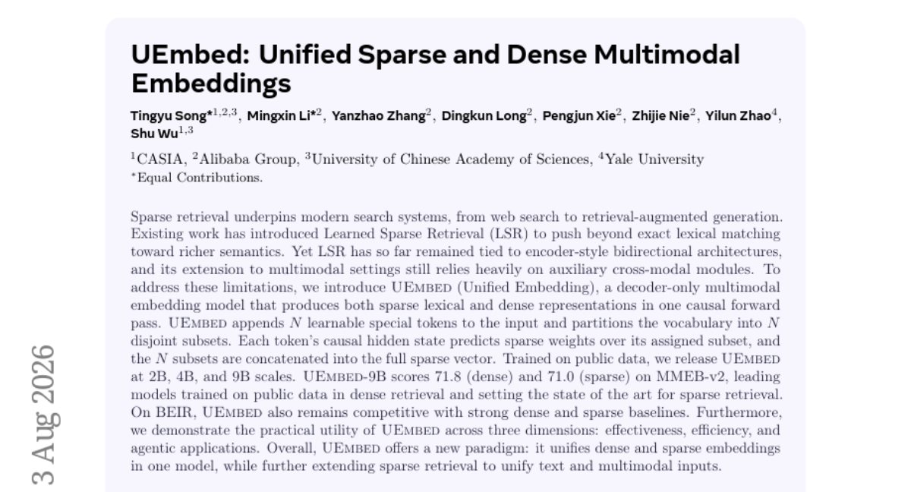

### 📌 한 줄 요약
단일 디코더 모델로 밀집(Dense) 및 희소(Sparse) 임베딩을 동시에 생성하는 통합 멀티모달 임베딩 모델 UEmbed 제안

### 🔑 핵심 포인트
- 단일 디코더 구조를 활용한 밀집(Dense) 및 희소(Sparse) 임베딩의 통합 생성
- 학습 가능한 특수 토큰과 어휘 분할을 통한 효율적인 희소 벡터 생성 메커니즘
- 텍스트와 멀티모달 입력을 동시에 처리하는 통합 임베딩 프레임워크 구축

### 🧑‍💻 개발자 관점
검색 시스템 구축 시 밀집/희소 모델을 따로 운영할 필요 없이 하나의 모델로 효율적인 하이브리드 검색과 멀티모달 검색을 동시에 구현할 수 있습니다.

### 🚀 실무 적용 아이디어
- 제공된 2B, 4B, 9B 모델을 활용한 하이브리드 검색(Hybrid Search) 성능 벤치마크 수행
- 기존 인코더 기반 모델 대비 추론 속도 및 효율성 비교 실험
- RAG 시스템 내 멀티모달 데이터(이미지+텍스트) 검색 성능 검증

### ⚠️ 리스크/한계
- 디코더 기반 구조로 인해 인코더 모델 대비 추론 비용이 높을 수 있음
- 특수 토큰 기반의 어휘 분할 방식이 대규모 어휘집 확장 시 가질 수 있는 제약

### 📝 초록 기반 상세 설명
기존의 학습형 희소 검색(LSR) 방식은 인코더 구조에 국한되어 있으며 멀티모달 확장 시 별도의 모듈이 필요했습니다. 이를 해결하기 위해 단일 인과적(Causal) 순방향 패스로 밀집 및 희소 표현을 모두 생성하는 디코더 전용 모델 UEmbed를 도입했습니다. 입력에 N개의 학습 가능한 특수 토큰을 추가하고 어휘집을 N개의 하위 집합으로 분할하여 각 토큰이 할당된 부분의 희소 가중치를 예측하도록 설계했습니다. 실험 결과 UEmbed-9B는 MMEB-v2 벤치마크에서 기존 멀티모달 모델들을 상회하는 성능을 기록했습니다. 결과적으로 UEmbed는 텍스트와 멀티모달 입력을 통합하면서 밀집/희소 임베딩을 하나로 합친 새로운 패러다임을 제시합니다.

---

## 7. [WorldExam: Benchmarking World Models from Apparent Appearance to Inherent Reactivity](https://huggingface.co/papers/2608.02603)
**Upvotes**: 30 | **도입 난이도**: 중 | **신뢰도**: 상
**arXiv**: https://arxiv.org/abs/2608.02603

**태그**: Video Generation, World Models, Benchmark, Computer Vision, RAG, Video, Evaluation

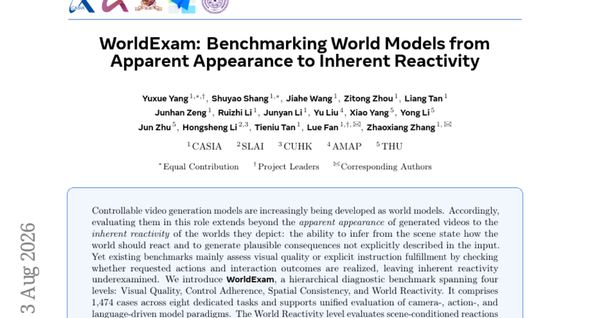

### 📌 한 줄 요약
비디오 생성 모델의 단순 시각 품질을 넘어, 물리적 상호작용과 세계 모델로서의 반응성을 평가하는 계층적 벤치마크 WorldExam 제안

### 🔑 핵심 포인트
- 시각적 품질을 넘어 세계 모델의 핵심인 '내재적 반응성'을 측정하는 계층적 벤치마크 제안
- 카메라, 액션, 언어 기반의 서로 다른 모델 패러다임을 통합 평가할 수 있는 1,474개 사례 확보
- 명시적 지시 이행과 세계의 물리적 반응성이 서로 상충할 수 있음을 입증

### 🧑‍💻 개발자 관점
비디오 생성 모델을 단순 영상 제작 도구가 아닌, 물리 법칙이 작용하는 시뮬레이터(World Model)로 활용하려는 엔지니어에게 필수적인 평가 지표를 제공합니다.

### 🚀 실무 적용 아이디어
- 현재 개발 중인 비디오 생성 모델을 WorldExam의 4단계 계층에 대입하여 성능 병목 지점 파악
- 모델의 제어 방식(Camera vs Action vs Language)에 따른 반응성 트레이드오프 분석
- 단순 프롬프트 준수를 넘어선 '상황적 반응성'을 높이기 위한 데이터셋 구성 전략 수립

### ⚠️ 리스크/한계
- 기존 모델들이 특정 제어에 특화되어 있어 벤치마크 점수 간의 직접 비교가 복잡할 수 있음
- 물리적 반응성 평가가 여전히 정성적/정량적 경계에 있어 완전한 자동화에 한계가 있을 수 있음

### 📝 초록 기반 상세 설명
최근 비디오 생성 모델이 세계 모델(World Model)로 진화함에 따라, 단순한 시각적 품질을 넘어 생성된 세계의 내재적 반응성을 평가할 필요성이 커졌습니다. 기존 벤치마크는 시각적 품질이나 명시적 지시 이행 여부에만 집중하여, 입력되지 않은 상황에 대한 세계의 반응성을 측정하는 데 한계가 있었습니다. 이를 해결하기 위해 시각적 품질, 제어 준수, 공간 일관성, 세계 반응성 등 4단계 계층 구조를 가진 WorldExam 벤치마크를 도입했습니다. 1,474개의 사례를 통해 카메라, 액션, 언어 기반 모델들을 통합적으로 평가할 수 있는 환경을 구축했습니다. 실험 결과, 기존 모델들은 특정 제어에는 강하나 세계의 반응성까지 동시에 확보하지 못하는 성능 분절 현상을 보였습니다.

### 🖼️ 추가 자료
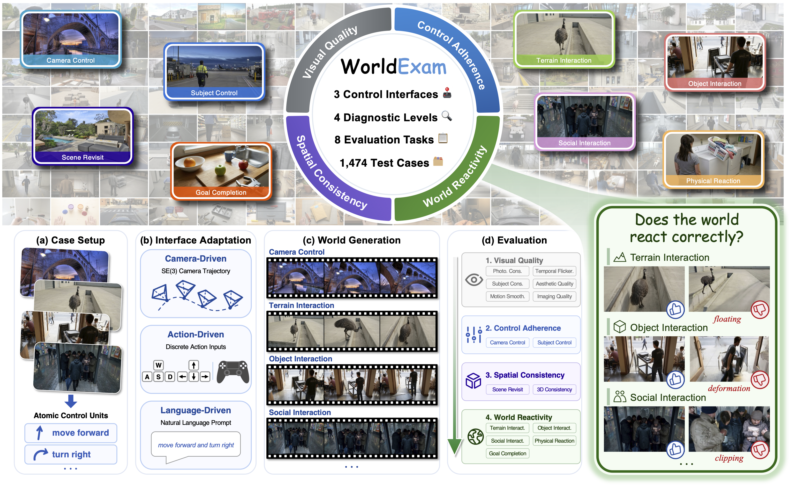

---

## 8. [CADENA: Stepwise CAD Reverse Engineering](https://huggingface.co/papers/2608.00799)
**Upvotes**: 30 | **도입 난이도**: 상 | **신뢰도**: 상
**arXiv**: https://arxiv.org/abs/2608.00799

**태그**: CAD, 3D-Modeling, Reverse-Engineering, Deep-Learning, Benchmark, Evaluation

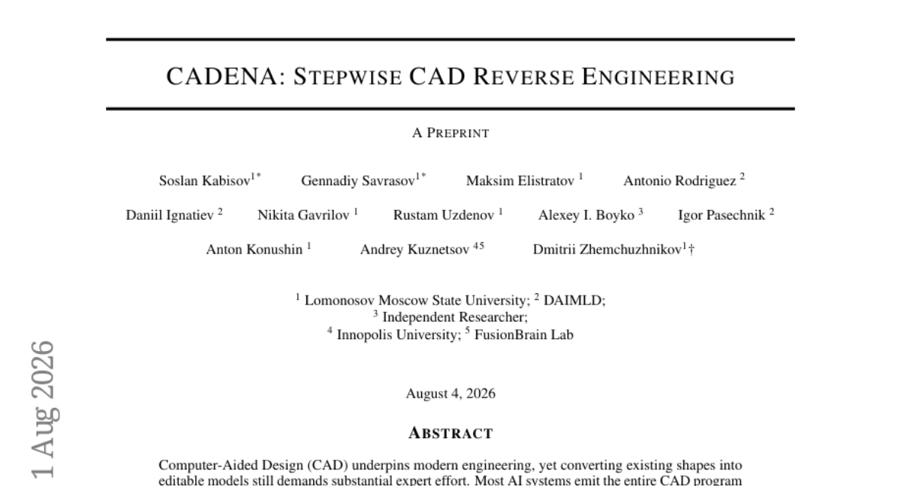

### 📌 한 줄 요약
단계별 기하학적 검증을 통해 기존 CAD 모델을 편집 가능한 파라메트릭 프로그램으로 역설계하는 프레임워크

### 🔑 핵심 포인트
- 단계별 연산 생성 및 중간 기하학 검증을 통한 점진적 역설계 방식 도입
- 기계 부품 카테고리별 성능 측정을 위한 새로운 벤치마크 'CADENA-Bench' 제안
- 기존 단일 패스(Single-pass) 방식의 한계를 극복한 정밀한 파라메트릭 모델링

### 🧑‍💻 개발자 관점
수동 작업이 많이 필요한 CAD 역설계 과정을 자동화하여, 기존 3D 스캔 데이터를 편집 가능한 CAD 데이터로 변환하는 워크플로우를 혁신할 수 있습니다.

### 🚀 실무 적용 아이디어
- 제공된 GitHub 코드를 활용하여 다양한 기계 부품 데이터셋에 대한 재현 실험 수행
- CADENA-Bench를 활용하여 기존 CAD 생성 모델과의 성능 비교 분석
- 특정 산업용 부품(엔지니어링 부품)에 대한 모델의 정밀도 검증

### ⚠️ 리스크/한계
- 복잡도가 매우 높은 비정형 형상에 대한 단계별 생성 효율성 검증 필요
- 연산 단계가 길어질수록 누적되는 오차 및 계산 복잡도 문제 가능성

### 📝 초록 기반 상세 설명
현대 엔지니어링에서 CAD 모델의 편집 가능한 형태로의 변환은 여전히 많은 전문가의 노력을 필요로 합니다. 기존 AI 방식은 중간 기하학적 구조를 검토하지 않고 한 번에 전체 프로그램을 생성하는 데 그치는 한계가 있었습니다. 본 논문은 인간 엔지니어의 작업 방식처럼 단계별로 연산을 수행하고 타겟 형상과 비교하며 모델을 성장시키는 CADENA를 제안합니다. 또한 기계 부품 역설계 성능을 측정하기 위한 새로운 벤치마크인 CADENA-Bench를 도입했습니다. 실험 결과, CADENA는 기존의 DeepCAD, Fusion 360, MCB 데이터셋에서 우수한 성능을 입증했습니다.

---

## 9. [Deferred Exposure of Future Trajectories for Verifiable Reasoning in Autonomous Driving VLMs](https://huggingface.co/papers/2608.01755)
**Upvotes**: 27 | **도입 난이도**: 중 | **신뢰도**: 상
**arXiv**: https://arxiv.org/abs/2608.01755

**태그**: Autonomous Driving, VLM, Reasoning, Reinforcement Learning, Vision, Inference

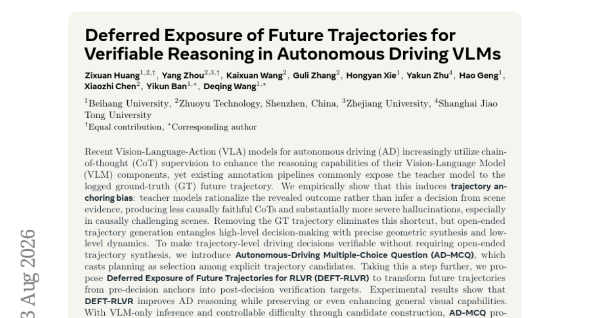

### 📌 한 줄 요약
미래 경로 정보 유출로 인한 추론 편향을 방지하고, 객관식 선택 방식을 통해 자율주행 VLM의 논리적 추론 능력을 검증하는 프레임워크 제안

### 🔑 핵심 포인트
- 미래 경로 노출로 인한 '궤적 앵커링 편향' 및 인과적 추론 오류 식별
- 계획 문제를 선택형 문제로 변환하여 복잡한 기하학적 생성 없이도 검증 가능한 AD-MCQ 프레임워크 제안
- 미래 경로를 사후 검증 대상으로 활용하는 DEFT-RLVR를 통해 모델의 논리적 추론 강화

### 🧑‍💻 개발자 관점
모델이 정답을 미리 알고 끼워 맞추는 '지름길 학습'을 방지하여, 실제 주행 상황에서 발생할 수 있는 위험한 환각 현상을 억제하는 데 중요합니다.

### 🚀 실무 적용 아이디어
- 기존 VLM 학습 데이터셋에서 미래 경로 정보가 CoT 텍스트에 포함되어 있는지 확인
- Planning 문제를 Multiple-choice 형태로 변환하여 모델의 추론 성능 변화 측정
- 학습 시 정답 경로를 노출하는 시점(Exposure)을 조절하며 편향 완화 정도 테스트

### ⚠️ 리스크/한계
- 객관식 후보군 구성 방식에 따라 문제 난이도 및 모델 성능이 크게 좌우될 수 있음
- 제시된 후보군 내에서만 정답을 찾는 데 국한될 위험이 있음

### 📝 초록 기반 상세 설명
최근 자율주행 VLA 모델은 CoT(Chain-of-Thought)를 통해 추론 능력을 높이려 하지만, 학습 과정에서 미래 경로(GT)가 모델에 노출되는 문제가 발생합니다. 이로 인해 모델이 장면 근거가 아닌 결과에 끼워 맞추는 '궤적 앵커링 편향(Trajectory Anchoring Bias)'과 환각 현상이 발생합니다. 이를 해결하기 위해 연구진은 계획 문제를 명시적 후보군 중 하나를 선택하는 객관식 문제로 변환하는 AD-MCQ를 제안합니다. 또한, 미래 경로를 결정 이후의 검증 대상으로 미루는 DEFT-RLVR 방식을 도입하여 추론의 인과적 충실도를 높였습니다. 실험 결과, 제안 방식은 일반적인 시각 능력은 유지하면서도 자율주행 추론 성능을 크게 향상시켰습니다.

---

## 10. [SKT: Skill-Use Training at Scale via Verified Synthetic Data Generation](https://huggingface.co/papers/2608.02287)
**Upvotes**: 26 | **도입 난이도**: 중 | **신뢰도**: 상
**arXiv**: https://arxiv.org/abs/2608.02287

**태그**: Agent, Synthetic Data, Fine-tuning, LLM, RAG, Vision, Benchmark, Evaluation

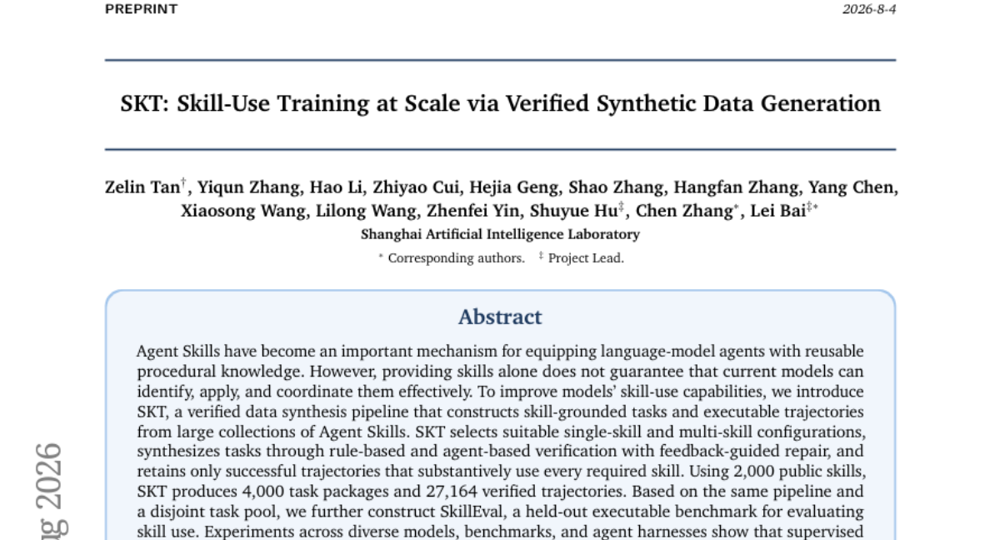

### 📌 한 줄 요약
검증된 합성 데이터 생성 파이프라인(SKT)을 통해 에이전트의 스킬 활용 능력을 대규모로 학습시키는 방법론

### 🔑 핵심 포인트
- SKT: 스킬 기반 태스크와 실행 가능한 궤적을 생성하는 검증된 합성 데이터 파이프라인 개발
- Rule-based 및 Agent-based 검증과 피드백 수정을 결합하여 데이터 품질 확보
- SkillEval: 스킬 활용 능력을 평가하기 위한 독립적인 실행 가능 벤치마크 구축

### 🧑‍💻 개발자 관점
에이전트 개발 시 단순 지식 주입을 넘어, 특정 도구나 기능을 적재적소에 사용하는 '실행 능력'을 학습시키는 체계적인 방법론을 제공합니다.

### 🚀 실무 적용 아이디어
- 보유 중인 API/Tool 스킬셋을 활용하여 SKT와 유사한 데이터 생성 파이프라인 구축 실험
- 생성된 합성 데이터가 모델의 추론 성능(Reasoning)에 미치는 영향 분석
- 다양한 에이전트 프레임워크(Harness) 환경에서의 범용성 테스트

### ⚠️ 리스크/한계
- 합성 데이터에 의존할 경우 발생할 수 있는 모델의 편향성 및 데이터 오염 문제
- 스킬의 복잡도가 높아질수록 검증(Verification) 비용과 난이도가 급증할 가능성

### 📝 초록 기반 상세 설명
LLM 에이전트에게 재사용 가능한 절차적 지식인 '스킬'을 제공하는 것이 중요해졌으나, 모델이 이를 적절히 식별하고 적용하는 능력은 여전히 부족합니다. 이를 해결하기 위해 연구진은 대규모 스킬 컬렉션으로부터 태스크와 실행 가능한 궤적을 생성하는 SKT 파이프라인을 제안합니다. SKT는 규칙 기반 및 에이전트 기반 검증과 피드백 수정을 거쳐, 모든 요구 스킬이 실질적으로 사용된 고품질 데이터만을 선별합니다. 실험 결과, SKT로 생성된 데이터로 SFT를 수행하면 다양한 모델과 환경에서 스킬 활용 성능이 일관되게 향상되었습니다. 또한, 검증된 데이터 합성 방식이 스케일링에 따라 성능 향상으로 이어진다는 것을 입증했습니다.

---

## 11. [SWE-Touch: Benchmarking Coding Agents When Users Touch the Code](https://huggingface.co/papers/2608.02499)
**Upvotes**: 22 | **도입 난이도**: 중 | **신뢰도**: 상
**arXiv**: https://arxiv.org/abs/2608.02499

**태그**: Coding Agent, Human-AI Collaboration, Benchmarking, Software Engineering, Agent, RAG, Benchmark, Evaluation

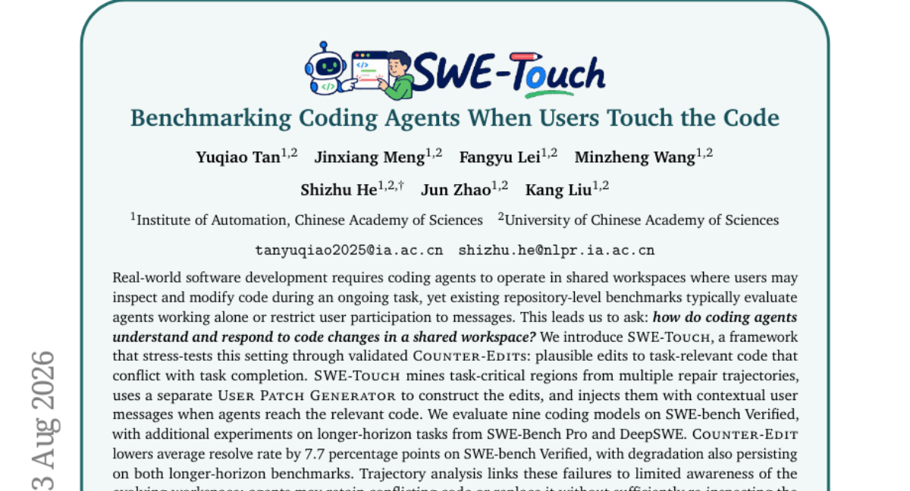

### 📌 한 줄 요약
사용자가 코드를 수정하는 협업 환경에서 코딩 에이전트의 상태 인식 및 적응 능력을 평가하는 새로운 벤치마크 프레임워크 제안

### 🔑 핵심 포인트
- 사용자 개입(Counter-Edits)이 포함된 동적 협업 환경 벤치마크인 SWE-Touch 제안
- 에이전트가 작업 중 발생하는 코드 변경 사항을 인지하고 적응하는 능력을 평가
- 기존 벤치마크 대비 에이전트의 성능 저하 원인이 '상태 인식 부족'임을 규명

### 🧑‍💻 개발자 관점
실제 개발 환경에서는 사람이 코드를 수정하는 상황이 빈번하므로, 에이전트가 단순히 코드 생성 능력을 넘어 워크스페이스의 변화를 감지하고 동기화하는 능력이 필수적임을 시사합니다.

### 🚀 실무 적용 아이디어
- 에이전트가 작업 도중 코드 변경을 감지하고 테스트를 재실행하는 루프 구현 실험
- 사용자의 의도와 충돌하는 코드 수정 시 에이전트의 판단 로직 테스트
- 협업 환경에서의 에이전트 성능 측정을 위한 커스텀 벤치마크 구축

### ⚠️ 리스크/한계
- 사용자의 개입 방식(메시지 vs 직접 수정)에 따라 에이전트의 반응이 달라질 수 있음
- 현재의 에이전트들은 복잡한 협업 시 발생하는 상태 불일치 해결 능력이 부족함

### 📝 초록 기반 상세 설명
기존의 코딩 에이전트 벤치마크는 에이전트가 혼자 작업하거나 사용자의 개입이 제한적인 환경을 가정하여 실무적인 협업 상황을 반영하지 못합니다. 본 논문은 사용자가 작업 중 코드를 수정할 때 에이전트가 어떻게 반응하는지 측정하기 위해 SWE-Touch 프레임워크를 도입합니다. 이 프레임워크는 작업 완료를 방해할 수 있는 타당한 수준의 수정(Counter-Edits)을 생성하여 에이전트의 대응 능력을 테스트합니다. 실험 결과, 사용자의 개입은 에이전트의 문제 해결 성공률을 유의미하게 낮추는 것으로 나타났습니다. 분석 결과, 에이전트가 변화하는 워크스페이스 상태를 충분히 재검토하거나 검증하지 못하는 것이 주요 실패 원인으로 밝혀졌습니다.

---

## 12. [WCM: A World Critic Model for Vision-Language-Action Reinforcement Learning](https://huggingface.co/papers/2607.29613)
**Upvotes**: 22 | **도입 난이도**: 중 | **신뢰도**: 상
**arXiv**: https://arxiv.org/abs/2607.29613

**태그**: Robotics, Reinforcement Learning, VLA, World Models, Vision, Benchmark

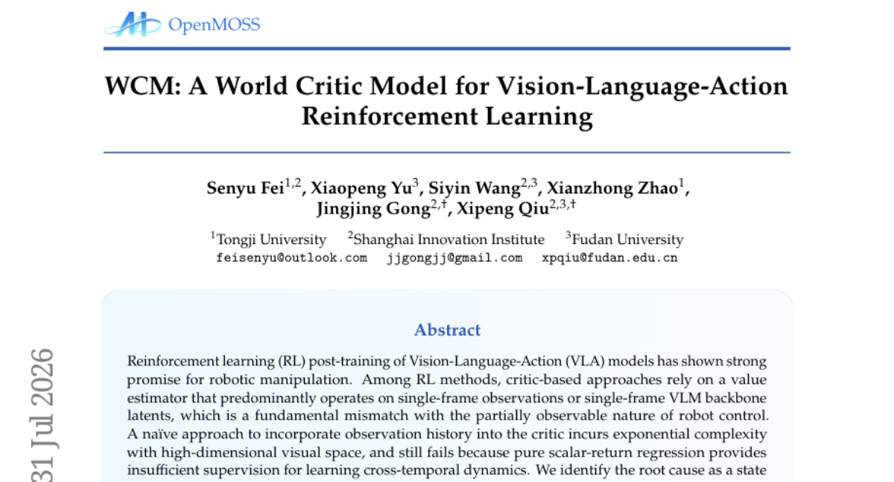

### 📌 한 줄 요약
세계 모델링(World Modeling) 개념을 도입하여 VLA 모델의 RL 성능과 일반화 능력을 극대화한 Critic 모델 제안

### 🔑 핵심 포인트
- LeJEPA 아키텍처를 활용한 경량화된 세계 모델링 기반 Critic 설계
- 단순 스칼라 리턴 회귀를 넘어 미래 잠재 상태 예측을 통한 시간적 역학 학습
- Pi0, OpenVLA 등 최신 VLA 백본과 온/오프라인 RL 파이프라인에 대한 높은 호환성

### 🧑‍💻 개발자 관점
로봇 제어 시 발생하는 관측 불확실성 문제를 해결하기 위해, 단순 가치 추정을 넘어 미래 상태를 예측하는 구조가 RL 성능에 미치는 영향을 실무적으로 보여줍니다.

### 🚀 실무 적용 아이디어
- 기존 VLA 모델의 Critic에 LeJEPA 기반의 미래 상태 예측 손실 함수 추가 실험
- 다양한 시계열 관측 데이터셋을 활용한 WCM의 일반화 성능 벤치마크
- 실제 로봇 하드웨어 환경에서의 온/오프라인 RL 전환 안정성 테스트

### ⚠️ 리스크/한계
- 미래 상태 예측을 위한 추가적인 연산 비용 발생 가능성
- 특정 VLA 백본 아키텍처에 따른 최적의 하이퍼파라미터 의존성

### 📝 초록 기반 상세 설명
로봇 조작을 위한 VLA 모델의 RL 사후 학습은 유망하지만, 기존 Critic 방식은 단일 프레임 관측에 의존하여 부분 관측 환경(POMDP) 문제를 해결하지 못하는 한계가 있습니다. 단순히 과거 이력을 추가하는 방식은 차원의 저주와 시간적 역학 학습 부족 문제를 야기합니다. 본 논문은 Critic이 시간적 구조를 포착할 수 있도록 LeJEPA 기반의 WCM(World Critic Model)을 제안합니다. WCM은 미래 잠재 상태 예측과 가치 추정을 결합하여 Critic이 시간적 역학을 명시적으로 학습하게 합니다. 실험 결과, 149개 태스크에서 SOTA를 달성했으며 실세계 로봇 조작에서도 안정적인 성능을 입증했습니다.

---

## 13. [GradCuit: Credit-Assigned Gradient Flow Enables Robust and Interpretable Test-Time Latent Reasoning](https://huggingface.co/papers/2608.02585)
**Upvotes**: 21 | **도입 난이도**: 중 | **신뢰도**: 상
**arXiv**: https://arxiv.org/abs/2608.02585

**태그**: LLM, In-Context Learning, Optimization, Interpretability, RAG, Reasoning, Benchmark

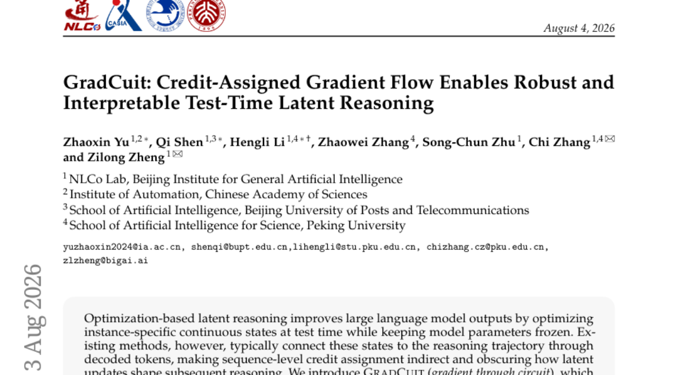

### 📌 한 줄 요약
모델 파라미터 수정 없이 테스트 시점에 잠재 상태(Latent State)를 최적화하여 추론 성능과 해석 가능성을 동시에 높이는 기법

### 🔑 핵심 포인트
- Transformer 레이어 사이에 최적화 가능한 잠재 상태를 삽입하는 GradCuit 프레임워크 제안
- Causal Self-attention을 통한 시퀀스 전체 결과로부터 잠재 상태로의 직접적인 그래디언트 흐름 구현
- 파라미터 고정 상태에서 테스트 시점의 잠재 상태 최적화만으로 높은 추론 성능 및 강건성 확보

### 🧑‍💻 개발자 관점
모델 전체를 파인튜닝하지 않고도 특정 태스크에 맞춰 모델의 내부 추론 로직을 동적으로 조정할 수 있는 새로운 스케일링 축을 제시합니다.

### 🚀 실무 적용 아이디어
- 특정 레이어 깊이에 따른 성능 변화 및 최적화 효율성 비교 실험
- 다양한 학습률(Learning Rate) 설정에 따른 수렴 안정성 테스트
- 추론용 토큰과 일반 토큰 간의 그래디언트 할당 차이 분석

### ⚠️ 리스크/한계
- 테스트 시점에 최적화 과정이 추가되어 추론 지연 시간(Latency)이 발생할 수 있음
- 특정 레이어 범위 내에서만 최적화가 이루어지므로 모델 전체 용량을 활용하는 데 한계가 있을 수 있음

### 📝 초록 기반 상세 설명
최근 LLM의 성능 향상을 위해 테스트 시점에 연속적인 잠재 상태를 최적화하는 방식이 주목받고 있습니다. 그러나 기존 방식은 생성된 토큰을 통해서만 상태와 추론 경로가 연결되어 있어, 시퀀스 전체에 대한 직접적인 신용 할당(Credit Assignment)이 어렵고 추론 과정이 불투명하다는 문제가 있었습니다. 본 논문은 Transformer 레이어 사이에 최적화 가능한 잠재 상태를 삽입하는 GradCuit 방식을 제안합니다. 인과적 자기주의(Causal Self-attention)를 활용해 생성된 모든 토큰의 로그 확률이 이전 잠재 상태로 직접 흐를 수 있는 미분 가능한 경로를 구축했습니다. 실험 결과, GradCuit는 CoT 프롬프팅 및 기존 최적화 방식보다 높은 정확도와 뛰어난 학습률 안정성을 보여주었습니다. 또한, 토큰별 그래디언트 분석을 통해 잠재 상태가 추론 연결 토큰에 집중됨을 입증하며 해석 가능성까지 확보했습니다.

---

## 14. [DiffusionGemma Technical Report](https://huggingface.co/papers/2608.00146)
**Upvotes**: 21 | **도입 난이도**: 상 | **신뢰도**: 상
**arXiv**: https://arxiv.org/abs/2608.00146

**태그**: LLM, Diffusion, Inference Optimization, MoE, RAG, Multimodal, Evaluation, Inference, Distillation

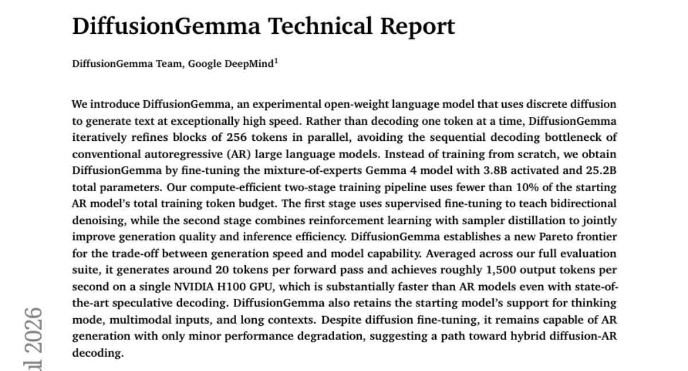

### 📌 한 줄 요약
자기회귀(AR) 방식의 병목을 해결하기 위해 이산 확산(Discrete Diffusion) 모델을 적용하여 초고속 텍스트 생성을 구현한 실험적 모델

### 🔑 핵심 포인트
- 이산 확산(Discrete Diffusion)을 통한 256개 토큰 블록의 병렬 생성 방식 도입
- Gemma 4 MoE 모델을 활용한 효율적인 2단계 학습 파이프라인(SFT + RL/Distillation)
- 기존 AR 모델의 순차적 디코딩 병목을 극복하여 초당 1,500개 토큰 수준의 속도 달성

### 🧑‍💻 개발자 관점
실시간 응답이 필수적인 서비스에서 기존 AR 모델의 지연 시간을 획기적으로 줄일 수 있는 새로운 아키텍처적 대안을 제시합니다.

### 🚀 실무 적용 아이디어
- Diffusion 방식과 AR 방식의 생성 품질(Perplexity) 비교 실험
- 긴 문맥(Long Context) 상황에서의 블록 단위 생성 안정성 테스트
- 하이브리드(Diffusion-AR) 디코딩 방식의 구현 가능성 검토

### ⚠️ 리스크/한계
- 병렬 생성 시 발생할 수 있는 문맥 일관성 및 생성 품질 저하 리스크
- 기존 AR 모델 대비 특정 태스크에서의 성능 저하 가능성

### 📝 초록 기반 상세 설명
기존의 자기회귀(AR) 언어 모델은 토큰을 하나씩 생성하는 순차적 디코딩 방식 때문에 추론 속도에 한계가 있습니다. 이를 해결하기 위해 연구진은 256개 토큰 블록을 병렬로 정제하는 이산 확산 방식의 DiffusionGemma를 제안합니다. Gemma 4 MoE 모델을 기반으로 2단계 학습 파이프라인(SFT 및 RL+Sampler Distillation)을 통해 효율적으로 미세 조정되었습니다. 결과적으로 단일 H100 GPU에서 초당 약 1,500개 토큰을 생성하는 압도적인 속도를 달성했습니다. 또한 기존 모델의 추론 능력과 멀티모달 지원을 유지하면서도 생성 속도와 성능 사이의 새로운 효율적 경계를 구축했습니다.

---

## 15. [Motion Beyond Morphology: Bootstrapping Cross-Category Motion Transfer from Abstract Motion Representations](https://huggingface.co/papers/2608.01628)
**Upvotes**: 20 | **도입 난이도**: 상 | **신뢰도**: 상
**arXiv**: https://arxiv.org/abs/2608.01628

**태그**: Video Generation, Motion Transfer, Computer Vision, Deep Learning, Vision, Video, Evaluation, Inference

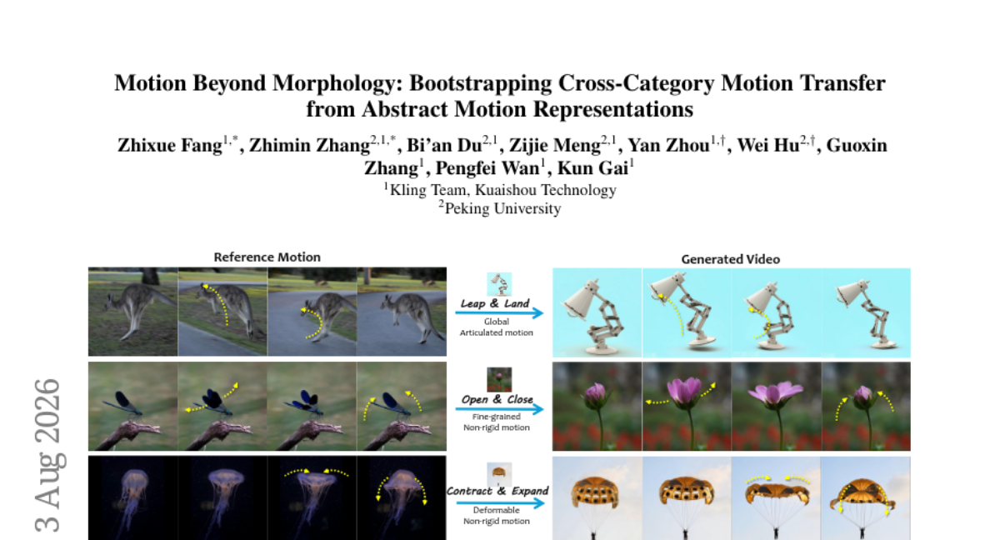

### 📌 한 줄 요약
형태적 차이가 큰 서로 다른 카테고리의 객체 간에도 역동적인 움직임을 전이할 수 있는 추상적 모션 표현 학습 프레임워크

### 🔑 핵심 포인트
- 고정된 구조적 대응을 탈피한 추상적 모션 표현 학습 방식 제안
- 다중 입도(multi-granularity) 뷰를 활용한 크로스 카테고리 모션 부트스트래핑
- 추론 시 모션 추출 과정이 필요 없는 효율적인 생성 프레임워크 구축

### 🧑‍💻 개발자 관점
애니메이션 제작 시 캐릭터의 외형이 완전히 다르더라도 특정 동작(예: 걷기, 점프)을 자연스럽게 이식해야 하는 작업에 혁신적인 솔루션을 제공합니다.

### 🚀 실무 적용 아이디어
- 제공된 OpenVMT-Dataset을 활용한 데이터셋 품질 검증
- 동일 카테고리 vs 이종 카테고리 간 모션 전이 정밀도 비교 실험
- 추론 단계에서의 생성 속도 및 연산 비용 측정

### ⚠️ 리스크/한계
- 형태 차이가 극단적으로 클 경우 모션의 의미적 일관성 유지 여부 불투명
- 학습 단계에서의 복잡한 부트스트래핑 과정으로 인한 높은 학습 난이도

### 📝 초록 기반 상세 설명
기존의 비디오 모션 전이 기술은 참조 영상과 대상 객체 간의 고정된 구조적 대응 관계에 의존하여, 형태나 관절 구조가 크게 다를 경우 성능이 저하되는 문제가 있었습니다. 본 논문은 고정된 구조를 넘어 의미 있는 역동성을 유지하는 'Motion Beyond Morphology' 관점을 제안합니다. 이를 위해 두 단계 프레임워크를 도입하여, 1단계에서는 다중 입도(multi-granularity)의 추상적 모션 뷰를 학습하고 이를 통해 서로 다른 카테고리 간의 모션 쌍을 부트스트래핑합니다. 2단계에서는 학습된 감독 정보를 생성 모델에 내재화하여 추론 시 별도의 모션 추출 없이 직접적인 생성이 가능하게 합니다. 실험 결과, 제안된 방식은 다양한 카테고리 간 모션 전이에서 최첨단 성능을 기록하며 대상 객체의 특징을 잘 보존함을 입증했습니다.

---

## 16. [GPTQ-2D: Cubic-Time Two-Sided Adaptive Rounding](https://huggingface.co/papers/2607.27042)
**Upvotes**: 18 | **도입 난이도**: 중 | **신뢰도**: 상
**arXiv**: https://arxiv.org/abs/2607.27042

**태그**: Quantization, Matrix-Optimization, LLM-Compression

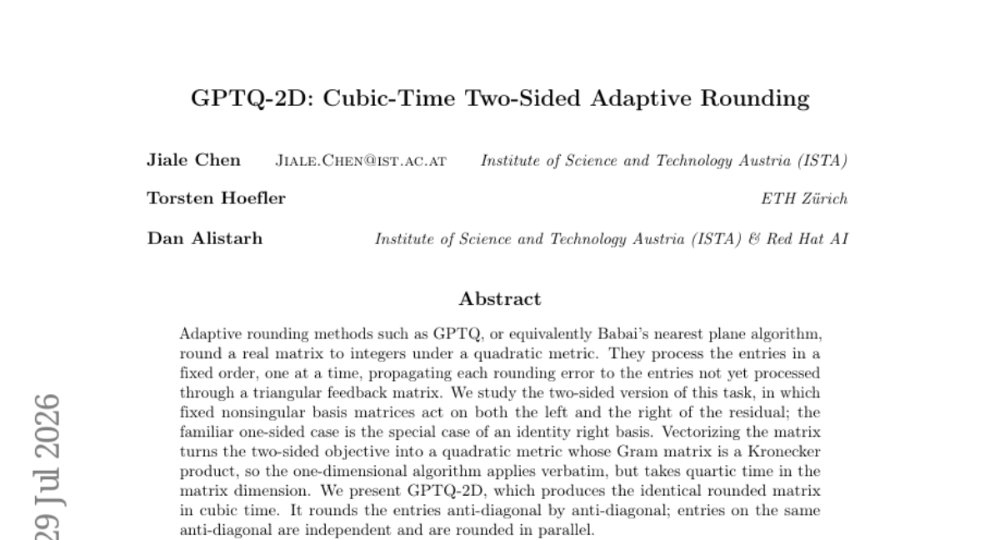

### 📌 한 줄 요약
양방향 적응형 반올림(Two-sided rounding) 문제를 4차 복잡도에서 3차 복잡도로 개선한 효율적인 행렬 양자화 알고리즘

### 🔑 핵심 포인트
- 양방향 적응형 반올림 문제를 위한 새로운 알고리즘 GPTQ-2D 제안
- 기존 4차 시간 복잡도를 3차 시간 복잡도로 최적화
- 안티 대각선(anti-diagonal) 기반의 병렬 처리 구조 도입

### 🧑‍💻 개발자 관점
대규모 언어 모델(LLM)의 양자화 과정에서 행렬 연산 효율을 높여 모델 압축 및 추론 최적화 성능을 개선할 수 있습니다.

### 🚀 실무 적용 아이디어
- 기존 GPTQ 알고리즘과 GPTQ-2D의 연산 시간 및 결과 일치성 비교 실험
- 대규모 행렬 크기에 따른 시간 복잡도 스케일링 테스트
- 양방향 제약 조건이 포함된 모델 양자화 워크플로우에 적용 테스트

### ⚠️ 리스크/한계
- 안티 대각선 구조를 활용한 병렬화가 하드웨어 가속기(GPU)에서 얼마나 효율적일지 검증 필요
- 특수한 행렬 구조가 아닌 일반적인 딥러닝 가중치 행렬에 대한 범용성 확인 필요

### 📝 초록 기반 상세 설명
기존 GPTQ와 같은 적응형 반올림 방식은 행렬 요소를 순차적으로 처리하며 오차를 전파하는 방식을 사용합니다. 양방향(Two-sided) 반올림 문제는 좌우 양측에서 기저 행렬이 작용하여 기존 방식보다 복잡하며, 벡터화 시 4차 시간 복잡도가 발생하는 문제가 있습니다. 본 논문은 이를 해결하기 위해 GPTQ-2D 알고리즘을 제안합니다. 이 알고리즘은 안티 대각선(anti-diagonal) 단위로 요소를 처리하여 독립적인 연산을 병렬화합니다. 결과적으로 동일한 반올림 결과를 유지하면서도 시간 복잡도를 3차로 낮추는 데 성공했습니다.

---

## 17. [To Add Is Machine, To Delete Is Human: Measuring and Mitigating Deletion Avoidance in LLM Code Editing](https://huggingface.co/papers/2607.28887)
**Upvotes**: 17 | **도입 난이도**: 중 | **신뢰도**: 상
**arXiv**: https://arxiv.org/abs/2607.28887

**태그**: LLM, Code Editing, Software Engineering, Maintenance, Benchmark

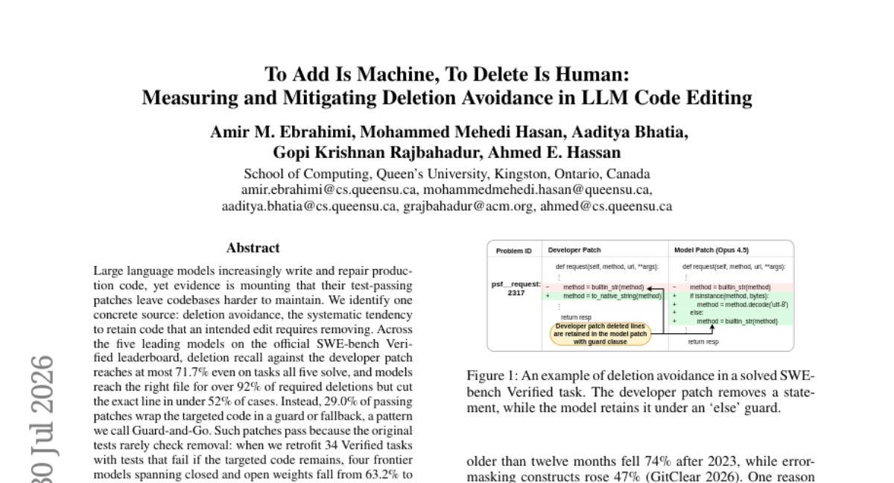

### 📌 한 줄 요약
LLM이 코드 수정 시 불필요한 코드를 남겨두는 '삭제 회피(Deletion Avoidance)' 현상을 규명하고 이를 완화하는 방안을 제시합니다.

### 🔑 핵심 포인트
- LLM이 코드 수정 시 기존 코드를 삭제하지 않고 유지하려는 '삭제 회피' 경향성 발견
- 삭제 중심의 벤치마크 'CanItcutDelete'를 통한 모델 성능의 한계 측정
- 사후 학습(post-training)을 통해 삭제 능력을 학습시키는 것이 해결책이 될 수 있음을 입증

### 🧑‍💻 개발자 관점
LLM이 생성한 코드가 테스트는 통과하더라도 불필요한 레거시 코드를 남겨 코드베이스를 오염시킬 수 있음을 경고합니다.

### 🚀 실무 적용 아이디어
- LLM이 생성한 패치에서 삭제되어야 할 코드가 남아있는지 검토하는 워크플로우 도입
- 코드 수정 시 '삭제' 작업이 포함된 경우, 모델이 기존 코드를 제거했는지 확인하는 테스트 케이스 작성
- 에이전트 기반 코드 편집 시 삭제 범위를 명확히 지정하는 프롬프트 전략 실험

### ⚠️ 리스크/한계
- 삭제 중심의 작업은 모델이 의도치 않게 필요한 코드까지 지울 위험이 있음
- 현재의 테스트 환경이 삭제 여부를 검증하지 못할 경우 기술 부채가 누적될 수 있음

### 📝 초록 기반 상세 설명
LLM이 작성한 코드가 테스트는 통과하지만 유지보수를 어렵게 만드는 현상이 관찰되고 있습니다. 연구진은 모델이 의도된 삭제를 수행하지 않고 코드를 남겨두는 '삭제 회피' 현상을 식별했습니다. 실험 결과, 모델들은 삭제해야 할 파일을 찾더라도 실제 해당 라인을 삭제하는 비율은 절반 이하에 불과하며, 대신 코드를 가드(guard)로 감싸는 방식을 취하곤 합니다. 이를 위해 삭제 중심의 벤치마크인 CanItDelete를 구축하여 모델의 성능을 평가했습니다. 연구 결과, 삭제 학습을 통한 사후 학습(post-training)이 이 문제를 완화하고 코드 편집 성능을 높일 수 있음을 확인했습니다.

---

## 18. [Roomer: Reflective Object-Grounded Model Editing and Repair for 3D Indoor Layout Synthesis](https://huggingface.co/papers/2608.01973)
**Upvotes**: 16 | **도입 난이도**: 중 | **신뢰도**: 상
**arXiv**: https://arxiv.org/abs/2608.01973

**태그**: 3D Generation, Object-Grounded, VLM, Layout Synthesis, Vision, Benchmark, Evaluation

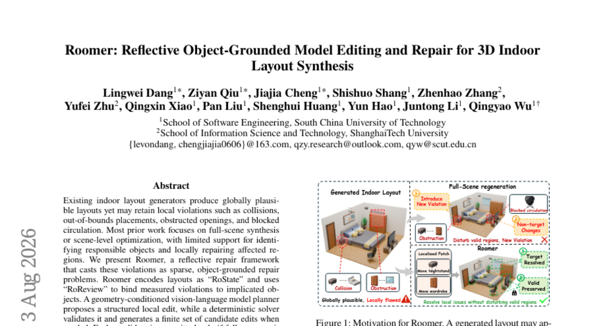

### 📌 한 줄 요약
3D 실내 레이아웃 생성 시 발생하는 국소적 충돌 및 배치 오류를 객체 단위로 식별하고 정밀하게 수정하는 반사적(Reflective) 수리 프레임워크

### 🔑 핵심 포인트
- 객체 중심의 오류 식별 및 국소적 수리(Local Repair) 메커니즘 도입
- VLM 플래너와 결정론적 솔버를 결합한 구조적 편집 및 검증 프로세스
- 오류 수정과 제약 조건 보존을 동시에 달성하는 RoState/RoReview 프레임워크

### 🧑‍💻 개발자 관점
생성형 AI가 만든 3D 에셋의 물리적 오류를 전체를 다시 만들지 않고도 특정 객체만 정밀하게 수정할 수 있는 워크플로우를 제공합니다.

### 🚀 실무 적용 아이디어
- 기존 3D 생성 모델(Diffusion 등)의 결과물을 Roomer 프레임워크에 입력하여 수정 성능 테스트
- Roomer-CC와 같은 제어된 오염 데이터셋을 활용한 플래너 학습 실험
- 수정 과정에서 발생하는 새로운 충돌(Side-effects) 방지 로직 검증

### ⚠️ 리스크/한계
- 복잡한 가구 배치나 밀집된 환경에서 국소적 수정이 전체 구조적 일관성을 해칠 위험
- VLM 기반 플래너의 추론 비용 및 실시간성 확보 문제

### 📝 초록 기반 상세 설명
기존의 실내 레이아웃 생성 모델은 전체적인 구조는 그럴듯하지만, 물체 간 충돌이나 통로 차단 같은 국소적인 물리적 오류를 포함하는 경우가 많습니다. 기존 방식은 전체 장면을 다시 생성하거나 최적화하는 데 집중하여, 특정 오류를 일으킨 객체를 식별하고 국소적으로 수정하는 기능이 부족했습니다. 본 논문은 오류를 희소한 객체 기반 수리 문제로 정의하는 Roomer 프레임워크를 제안합니다. Roomer는 RoState와 RoReview를 통해 오류와 관련 객체를 연결하고, VLM 플래너와 결정론적 솔버를 결합하여 국소적 편집을 수행합니다. 실험 결과, Roomer는 기존 레이아웃의 유효한 영역을 보존하면서도 물리적 타당성과 사용성을 크게 향상시켰습니다.

---

## 19. [DeepVoyager-VL: Incentivizing Vision-in-the-Loop Search for Long-Horizon Multimodal Agents](https://huggingface.co/papers/2608.01827)
**Upvotes**: 15 | **도입 난이도**: 상 | **신뢰도**: 상
**arXiv**: https://arxiv.org/abs/2608.01827

**태그**: Agent, RAG, Vision, Multimodal, Reasoning, Benchmark, Evaluation

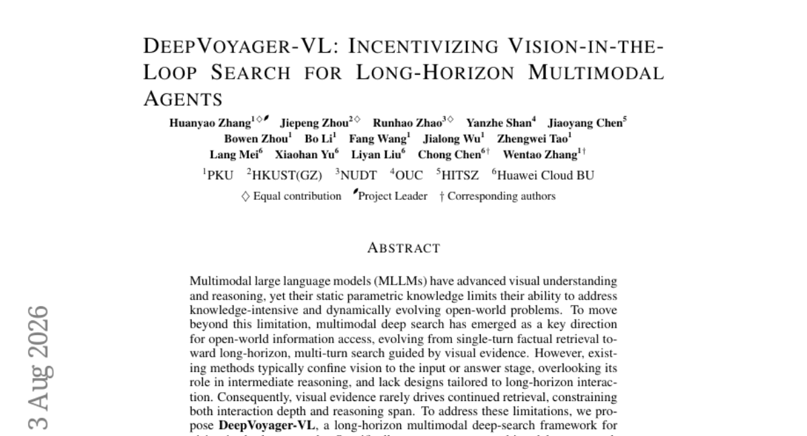

### 📌 한 줄 요약
시각적 증거를 추론 과정에 통합하여 장기적 의사결정을 수행하는 멀티모달 에이전트 프레임워크 제안

### 🔑 핵심 포인트
- 시각적 증거가 추론 중간 단계에 개입하는 Vision-in-the-loop 메커니즘 설계
- 중간 시각 의존성과 긴 추론 체인을 포함하는 멀티모달 이벤트 그래프 기반 데이터 합성
- 능동적 시각 정보 획득 및 필요 시에만 이미지를 로드하는 효율적 에이전트 프레임워크

### 🧑‍💻 개발자 관점
단순 RAG를 넘어, 에이전트가 추론 과정 중 필요한 시각 정보를 스스로 판단하고 탐색하는 고도화된 멀티모달 워크플로우 설계에 영감을 줍니다.

### 🚀 실무 적용 아이디어
- 제시된 멀티모달 이벤트 그래프를 활용한 합성 데이터 생성 파이프라인 구현 테스트
- 에이전트의 온디맨드 이미지 로딩 로직이 추론 비용 및 속도에 미치는 영향 분석
- 기존 RAG 시스템에 중간 단계 시각 피드백 루프를 결합한 프로토타입 실험

### ⚠️ 리스크/한계
- 복잡한 추론 체인과 데이터 합성 과정에서의 높은 연산 비용 발생 가능성
- 시각 정보에 대한 의존도가 높아질 경우, 잘못된 시각 정보가 전체 추론을 오염시킬 위험

### 📝 초록 기반 상세 설명
기존 MLLM은 정적인 파라미터 지식에 의존하여 동적인 오픈 월드 문제 해결에 한계가 있습니다. 특히 기존 멀티모달 검색 방식은 시각 정보를 입력이나 최종 답변 단계에만 국한하여, 추론 과정 중의 중간 단계 역할을 간과하는 문제가 있었습니다. 이를 해결하기 위해 시각적 증거가 지속적인 검색을 유도하는 'Vision-in-the-loop' 방식의 DeepVoyager-VL을 제안합니다. 멀티모달 이벤트 그래프를 통해 복잡한 추론 체인을 가진 데이터를 합성하고, 능동적 시각 획득 및 온디맨드 이미지 로딩이 가능한 에이전트 프레임워크를 설계했습니다. 실험 결과, 10개의 벤치마크에서 우수한 성능을 입증하며 장기적 추론 능력을 보여주었습니다.

---

## 20. [3DZip: Spatial-Aware Feature Diversity-Guided Token Compression for 3D Question Answering](https://huggingface.co/papers/2608.01185)
**Upvotes**: 14 | **도입 난이도**: 중 | **신뢰도**: 상
**arXiv**: https://arxiv.org/abs/2608.01185

**태그**: 3D Vision, Token Compression, Efficiency, VLM, Reasoning, Vision, Benchmark, Inference, Optimization

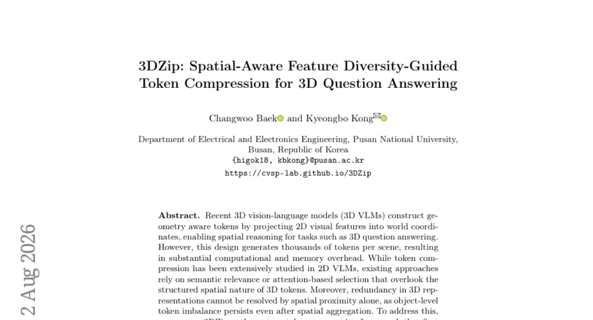

### 📌 한 줄 요약
공간적 구조와 특징 다양성을 결합하여 3D QA 모델의 연산 효율을 극대화한 토큰 압축 프레임워크

### 🔑 핵심 포인트
- 공간적 구조와 특징 다양성을 모두 고려한 3단계 토큰 압축 프레임워크 제안
- DPP(Determinantal Point Process)를 활용한 특징 공간 내 앵커 토큰 선택
- 복셀화와 공간 제약 기반 병합을 통한 기하학적 일관성 유지 및 중복 제거

### 🧑‍💻 개발자 관점
3D 데이터 처리 시 발생하는 막대한 연산 비용을 줄이면서도 공간 추론 성능을 유지할 수 있는 실질적인 최적화 기법을 제공합니다.

### 🚀 실무 적용 아이디어
- 제시된 3단계 파이프라인을 기존 3D VLM 모델에 모듈형으로 결합하여 성능 변화 측정
- 다양한 밀도의 포인트 클라우드 데이터셋에서 압축률에 따른 성능 저하 곡선 분석
- DPP 기반 선택 방식과 기존 Attention 기반 선택 방식의 정밀도 비교 실험

### ⚠️ 리스크/한계
- 토큰 수를 극단적으로 줄일 경우 복잡한 기하학적 구조의 세부 정보 손실 가능성
- DPP 연산 및 복셀화 과정이 특정 데이터 분포에서 추가적인 오버헤드를 발생시킬 위험

### 📝 초록 기반 상세 설명
최근 3D VLM은 2D 특징을 세계 좌표계로 투영하여 공간 추론 능력을 확보하고 있으나, 수천 개의 토큰 생성으로 인해 막대한 연산 및 메모리 비용이 발생합니다. 기존의 2D 기반 압축 방식은 3D 데이터의 구조적 특성을 간과하거나 객체 수준의 불균형 문제를 해결하지 못하는 한계가 있습니다. 이를 해결하기 위해 본 논문은 3사 단계의 3DZip 프레임워크를 제안합니다. 먼저 거친 복셀화를 통해 점 단위 중복을 제거하고, DPP(Determinantal Point Process)를 이용해 특징 공간의 다양성을 고려한 앵커 토큰을 선택한 뒤, 공간 제약 하에 토큰을 병합하여 기하학적 일관성을 유지합니다. 실험 결과, 3DZip은 매우 적은 수의 토큰만으로도 기존 성능의 94.7%를 유지하며 추론 속도를 1.92배 향상시켰습니다.

---

## 21. [LeapTalk: Breaking the Latency-Quality Trade-off in Talking Head Generation](https://huggingface.co/papers/2608.00079)
**Upvotes**: 13 | **도입 난이도**: 상 | **신뢰도**: 상
**arXiv**: https://arxiv.org/abs/2608.00079

**태그**: Generative AI, Video Generation, Real-time, Diffusion Models, Video, Audio, Inference, Distillation

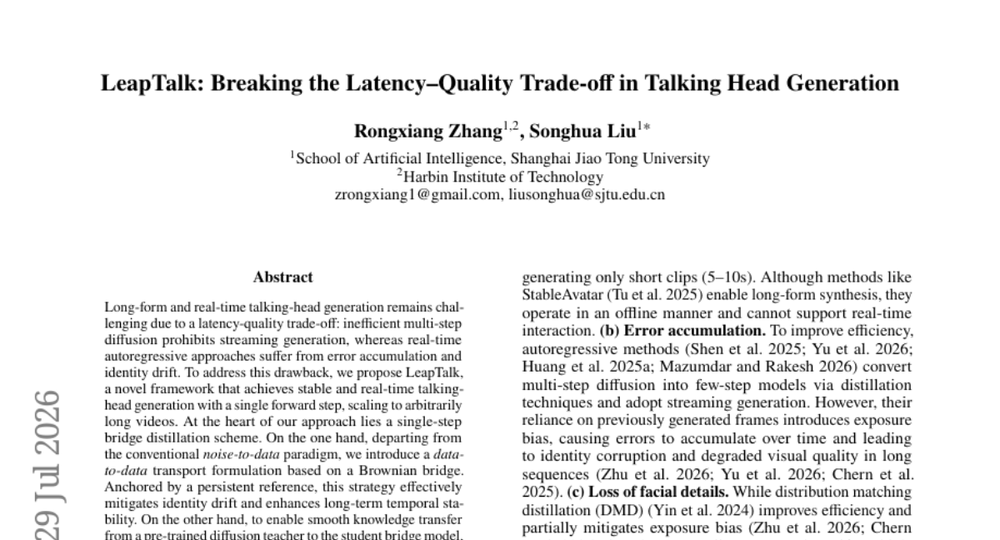

### 📌 한 줄 요약
단 한 번의 스텝만으로 실시간(200 FPS) 고화질 립싱크 비디오 생성을 가능하게 하는 브리지 증류(Bridge Distillation) 프레임워크

### 🔑 핵심 포인트
- Brownian bridge 기반의 data-to-data 전송 방식을 통한 정체성 유지 및 장기적 시간적 안정성 확보
- SNR-aligned 시간 변환(Φ(tau))을 활용한 이종 모델 간의 효율적인 지식 증류(Distillation)
- 단일 스텝 생성과 오디오 구동형 가이드를 통한 실시간 고화질 립싱크 구현

### 🧑‍💻 개발자 관점
실시간 스트리밍 서비스나 대규모 영상 생성 서비스에서 지연 시간 없이 고품질 가상 인간(Digital Human)을 구현할 수 있는 핵심 기술입니다.

### 🚀 실무 적용 아이디어
- 제공된 소스코드를 활용하여 다양한 해상도에서의 생성 속도 및 품질 변화 측정
- 장시간 영상 생성 시 정체성 유지(Identity Drift)가 발생하는 임계점 테스트
- 다양한 오디오 소스(음질, 감정 등)에 따른 립싱크 정확도 검증

### ⚠️ 리스크/한계
- 단일 스텝 생성 시 발생할 수 있는 세부 디테일 손실 가능성
- 학습된 참조 이미지(Reference) 외의 새로운 정체성 생성 제약

### 📝 초록 기반 상세 설명
기존의 립싱크 생성 기술은 다단계 확산 모델의 지연 시간 문제와 자기회귀 방식의 정체성 드리프트(Identity Drift) 사이의 트레이드오프 문제를 겪고 있었습니다. 이를 해결하기 위해 본 논문은 단일 스텝 생성과 무한한 길이의 비디오 확장이 가능한 LeapTalk 프레임워크를 제안합니다. 핵심 방법론으로 브라운 브리지(Brownian bridge) 기반의 데이터 간 전송(data-to-data transport) 공식을 도입하여 참조 이미지를 유지하며 정체성 드리프트를 방지합니다. 또한, 사전 학습된 확산 모델로부터 지식을 효율적으로 전이하기 위해 SNR 정렬 시간 변환(Φ(τ))을 포함한 이종 증류 프레임워크를 설계했습니다. 마지막으로 오디오 구동형 Classifier-free Guidance를 통해 단일 스텝에서도 정교한 입 모양 동기화를 유지합니다. 실험 결과, 200 FPS에 달하는 압도적인 속도와 높은 품질로 기존 방식들을 크게 상회하는 성능을 입증했습니다.

---

## 22. [StyleForge: Indoor Furniture Styling by Counterfactual Reasoning in a Hypergraph Field](https://huggingface.co/papers/2608.01954)
**Upvotes**: 12 | **도입 난이도**: 상 | **신뢰도**: 상
**arXiv**: https://arxiv.org/abs/2608.01954

**태그**: 3D-Generation, Graph-Neural-Networks, Style-Transfer, Scene-Synthesis, RAG, Reasoning, Multimodal, Evaluation, Inference

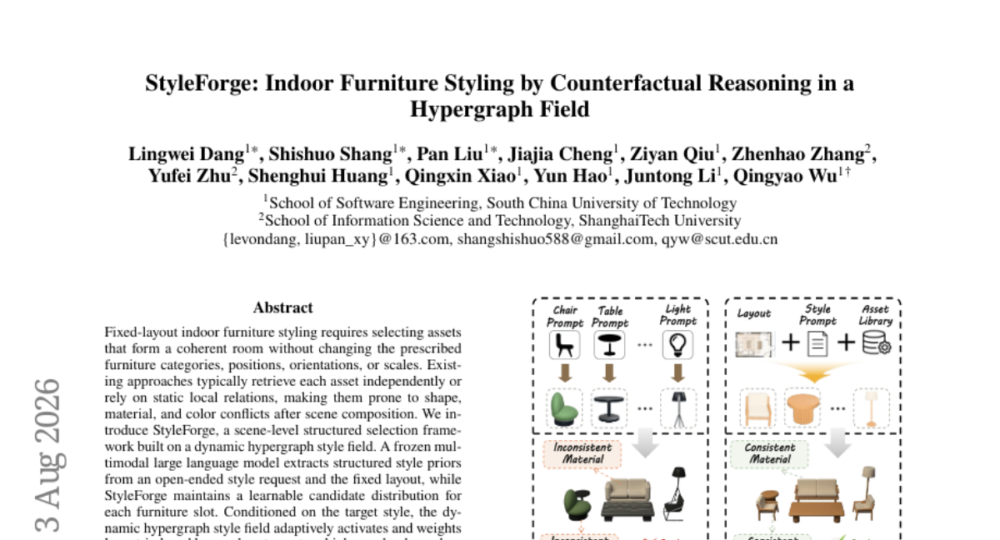

### 📌 한 줄 요약
고정된 레이아웃 내에서 가구 간의 스타일 충돌을 방지하며 조화로운 실내 배치를 완성하는 하이퍼그래프 기반 선택 프레임워크

### 🔑 핵심 포인트
- 동적 하이퍼그래프를 활용한 가구 간 고차원적 스타일 의존성 모델링
- 반사실적 선호도 학습(Counterfactual style preference learning)을 통한 맥락적 호환성 평가
- 테스트 타임 트레이닝을 통한 점진적 스타일 충돌 교정 및 글로벌 장면 일관성 확보

### 🧑‍💻 개발자 관점
고정된 공간 레이아웃을 유지하면서도 전체적인 분위기가 조화로운 3D 에셋을 자동 선택하는 생성형 AI 파이프라인 구축에 유용합니다.

### 🚀 실무 적용 아이디어
- 3D-FRONT 데이터셋을 활용한 가구 배치/선택 태스크 벤치마크 구축
- MLLM의 스타일 추출 결과가 하이퍼그래프 구조에 미치는 영향 분석
- 테스트 타임 트레이닝 단계에서의 연산 비용과 수렴 속도 검증

### ⚠️ 리스크/한계
- 테스트 타임 트레이닝 시 발생하는 연산 오버헤드 및 추론 속도 저하
- 학습된 스타일 필드가 특정 데이터셋에 과적합될 가능성

### 📝 초록 기반 상세 설명
기존의 실내 가구 스타일링 방식은 개별 자산을 독립적으로 선택하거나 정적인 관계에 의존하여, 배치 후 색상이나 재질이 어울리지 않는 문제가 발생했습니다. 이를 해결하기 위해 본 논문은 동적 하이퍼그래프 스타일 필드를 기반으로 한 StyleForge 프레임워크를 제안합니다. MLLM을 통해 스타일 우선순위를 추출하고, 하이퍼그래프를 통해 가구 간의 고차원적 의존성을 캡처하며, 반사실적 선호도 학습을 통해 후보군 간의 맥락적 호환성을 평가합니다. 학습 시에는 스타일 필드와 후보 로짓을 교차 최적화하며, 추론 시에는 테스트 타임 트레이닝을 통해 점진적으로 스타일 충돌을 교정합니다. 실험 결과, 3D-FRONT 데이터셋에서 기존 방식보다 뛰어난 스타일 일관성과 가구 검색 성능을 입증했습니다.

---

## 23. [DreamTraj: Generating 6-DoF Object Trajectories by Reading Unrendered Video Diffusion Latents](https://huggingface.co/papers/2608.00486)
**Upvotes**: 12 | **도입 난이도**: 상 | **신뢰도**: 상
**arXiv**: https://arxiv.org/abs/2608.00486

**태그**: Robotics, Diffusion Models, 6-DoF, Motion Planning, Vision, Video, Inference

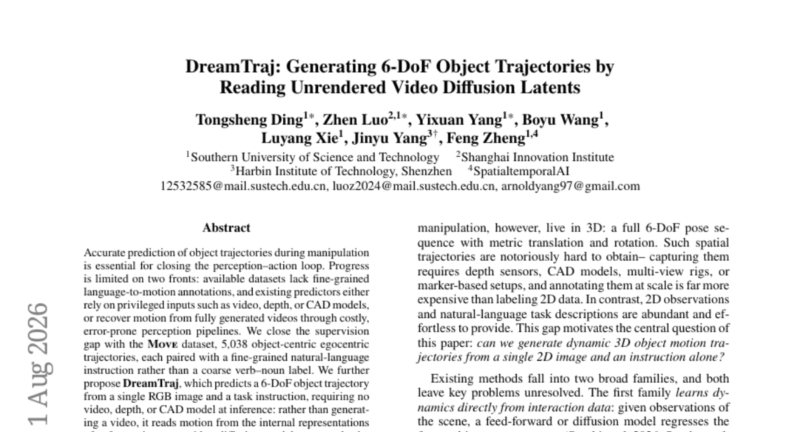

### 📌 한 줄 요약
비디오 생성 모델의 잠재 표현(Latent)을 직접 활용하여 단일 이미지와 명령만으로 정교한 6-DoF 물체 궤적을 생성하는 기술

### 🔑 핵심 포인트
- 비디오 생성 없이 확산 모델의 중간 잠재 표현(Latent)에서 직접 궤적을 추출하는 새로운 방식 제안
- 세밀한 언어 지시어가 포함된 5,038개의 객체 중심 1인칭 시점 궤적 데이터셋(MOVE) 구축
- 단일 이미지와 명령만으로 동작하는 효율적인 6-DoF 궤적 예측 프레임워크 개발

### 🧑‍💻 개발자 관점
비디오 생성 과정을 거치지 않으므로 연산 비용이 낮으면서도, 실시간 로봇 제어에 필요한 정교한 궤적 정보를 얻을 수 있습니다.

### 🚀 실무 적용 아이디어
- MOVE 데이터셋의 언어-동작 정렬 수준 확인 및 로봇 제어 태스크 적용 테스트
- Frozen Diffusion 모델의 잠재 공간을 활용한 다른 물리적 움직임 추출 가능성 검토
- 단일 이미지 입력 시 조명 및 배경 변화에 따른 궤적 예측 안정성 실험

### ⚠️ 리스크/한계
- 단일 이미지 기반 예측이므로 복잡한 가려짐(Occlusion) 상황에서의 정확도 저하 가능성
- 사전에 학습된 비디오 확산 모델의 잠재 표현에 대한 의존성

### 📝 초록 기반 상세 설명
로봇 조작을 위한 정확한 물체 궤적 예측은 필수적이지만, 기존 데이터셋은 세밀한 언어-동작 주석이 부족하고 기존 예측 모델은 비디오나 CAD 모델 같은 특권 정보(Privileged input)에 의존하는 한계가 있었습니다. 이를 해결하기 위해 연구진은 5,038개의 정교한 언어-궤적 쌍을 포함한 MOVE 데이터셋을 구축했습니다. 제안하는 DreamTraj는 단일 RGB 이미지와 작업 명령만으로 6-DoF 궤적을 예측하며, 비디오를 직접 생성하는 대신 동영상 확산 모델(Video Diffusion Model)의 초기 단계 잠재 표현에서 움직임을 읽어냅니다. 가벼운 Flow-matching Reader가 어텐션 트랙과 은닉 상태를 디코딩하여 상대적 6-DoF 포즈를 산출합니다. 결과적으로 DreamTraj는 기존의 다중 프레임 기반 모델보다 빠르고 정확하게 궤적을 예측하며, 생성 후 추출 방식보다 4.6배 빠른 속도를 기록했습니다.

---

## 24. [Poplar: A Scalable Pipeline for Human-Centric Image Dataset Synthesis](https://huggingface.co/papers/2608.00440)
**Upvotes**: 10 | **도입 난이도**: 중 | **신뢰도**: 상
**arXiv**: https://arxiv.org/abs/2608.00440

**태그**: Generative AI, Dataset Synthesis, Computer Vision, Automation, Vision

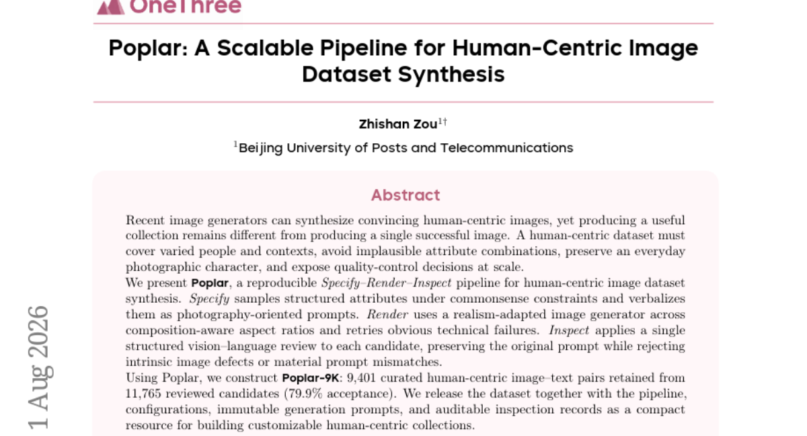

### 📌 한 줄 요약
대규모 고품질 인물 중심 이미지 데이터셋 구축을 위한 재현 가능한 'Specify-Render-Inspect' 파이프라인 제안

### 🔑 핵심 포인트
- 재현 가능한 'Specify-Render-Inspect' 파이프라인 설계
- 상식적 제약 조건을 반영한 구조적 속성 샘플링 및 프롬프트 생성
- 시각-언어 모델을 활용한 자동화된 품질 검사 및 데이터 정제

### 🧑‍💻 개발자 관점
특정 도메인에 특화된 고품질 인물 데이터셋이 필요한 경우, 수동 작업 없이 자동화된 파이프라인을 통해 데이터셋을 구축할 수 있는 방법론을 제시합니다.

### 🚀 실무 적용 아이디어
- 제공된 파이프라인을 활용하여 특정 도메인(예: 특정 직업군) 데이터셋 생성 테스트
- Inspect 단계의 검토 기준을 변경하여 데이터셋의 편향성/다양성 조절 실험
- Poplar-9K 데이터셋을 활용한 생성 모델의 미세 조정(Fine-tuning) 성능 확인

### ⚠️ 리스크/한계
- 자동화된 검사(Inspect) 단계에서 발생할 수 있는 미세한 품질 저하 또는 편향 누적
- 생성 모델의 기본 성능에 의존적인 파이프라인 구조

### 📝 초록 기반 상세 설명
최근 이미지 생성 모델의 성능은 향상되었으나, 실무에서 사용 가능한 다양하고 정교한 인물 데이터셋을 대규모로 구축하는 것은 여전히 어려운 과제입니다. 기존 방식은 속성 간의 모순이나 품질 관리의 어려움으로 인해 데이터셋의 신뢰성을 확보하기 어렵습니다. 본 논문은 속성 지정(Specify), 렌더링(Render), 검사(Inspect)로 구성된 재현 가능한 파이프라인인 Poplar를 제안합니다. 이 파이프라인은 상식적 제약 조건 하에 속성을 샘플링하고, 현실적인 이미지 생성 및 자동화된 시각-언어 검토 과정을 거칩니다. 이를 통해 구축된 Poplar-9K 데이터셋은 79.9%의 높은 수용률을 기록하며 검증되었습니다. 최종적으로 연구진은 파이프라인과 데이터셋을 모두 공개하여 커스텀 데이터셋 구축의 기반을 제공합니다.

---

## 25. [ScrambleToolBench: Agents Search Exhaustively Even When Their Own Map Points to the Next Step](https://huggingface.co/papers/2608.02358)
**Upvotes**: 9 | **도입 난이도**: 중 | **신뢰도**: 상
**arXiv**: https://arxiv.org/abs/2608.02358

**태그**: AI Agent, Benchmark, Reasoning, Robustness, Agent, Evaluation

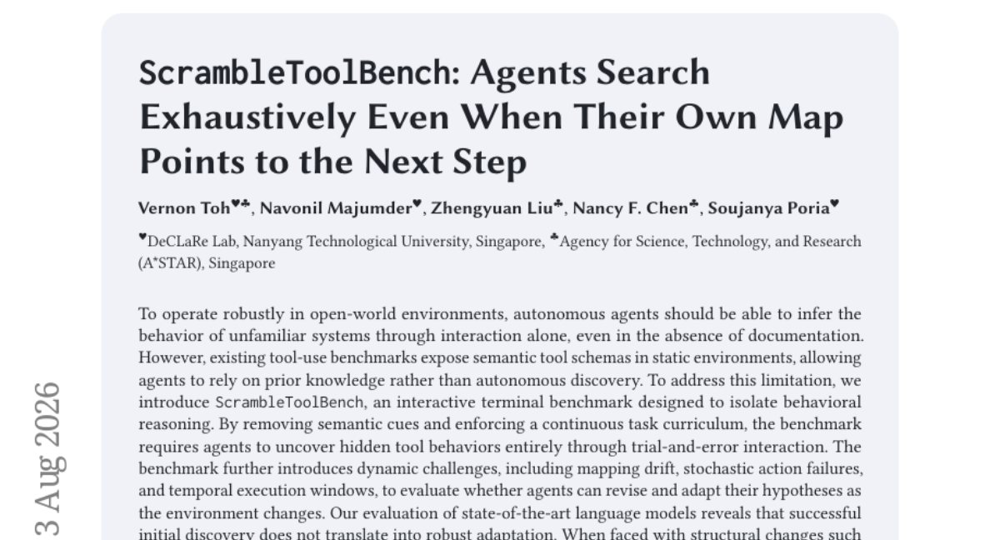

### 📌 한 줄 요약
도구의 의미적 힌트를 제거한 환경에서 에이전트의 자율적 탐색 및 변화 적응 능력을 평가하는 새로운 벤치마크 제안

### 🔑 핵심 포인트
- 의미적 힌트가 제거된 환경에서 순수 행동 추론 능력을 측정하는 ScrambleToolBench 개발
- 맵 드리프트 및 확률적 실패 등 동적 환경 변화에 대한 에이전트의 적응력 평가
- 현재 LLM 에이전트들이 논리적 복구 대신 무차별 탐색(Brute-force)에 의존하는 경향 확인

### 🧑‍💻 개발자 관점
에이전트가 문서가 없는 미지의 시스템을 다룰 때, 단순한 지식 검색을 넘어 환경 변화에 대응하는 '동적 적응력'이 실무적 신뢰성의 핵심임을 시사합니다.

### 🚀 실무 적용 아이디어
- 에이전트의 도구 사용 시 의미적 힌트를 제거한 환경에서 성능 변화 측정해보기
- 환경 변화(API 스키마 변경 등) 발생 시 에이전트의 복구 전략(연역 vs 무차별 탐색) 분석하기
- 에이전트의 메모리 유지 기능이 환경 변화 대응에 미치는 영향 테스트하기

### ⚠️ 리스크/한계
- 현재의 LLM은 환경 변화 시 논리적 추론보다 비용이 큰 무차별 탐색으로 회귀할 위험이 있음
- 의미적 단서가 없는 환경에서의 성능이 실제 복잡한 현실 세계의 성능과 직결되는지에 대한 논의 필요

### 📝 초록 기반 상세 설명
기존의 도구 사용 벤치마크는 정적인 환경과 의미적 스키마를 제공하여 에이전트가 실제 탐색 대신 사전 지식에 의존하게 만드는 한계가 있습니다. 이를 해결하기 위해 연구진은 의미적 단서를 제거하고 지속적인 과업 커리큘럼을 제공하는 대화형 터미널 벤치마크인 ScrambleToolBench를 도입했습니다. 이 벤치마크는 맵 드리프트, 확률적 실패, 시간적 실행 창과 같은 동적 요소를 포함하여 에이전트의 가설 수정 능력을 평가합니다. 실험 결과, 최신 언어 모델들은 초기 탐색에는 성공하더라도 환경 변화에 따른 구조적 변화를 감지하고 논리적으로 복구하는 데 실패했습니다. 특히 추론 능력을 높여도 효율적인 연역적 복구 대신 비용이 많이 드는 무차별 대입식 탐색에 의존하는 경향을 보였습니다.

---

## 26. [RecHarness: A Bandit-Routed Agentic Harness for Self-Evolving Recommender Systems](https://huggingface.co/papers/2607.29241)
**Upvotes**: 7 | **도입 난이도**: 중 | **신뢰도**: 상
**arXiv**: https://arxiv.org/abs/2607.29241

**태그**: Agent, Recommender Systems, Automated ML, Bandit, Reasoning, Video

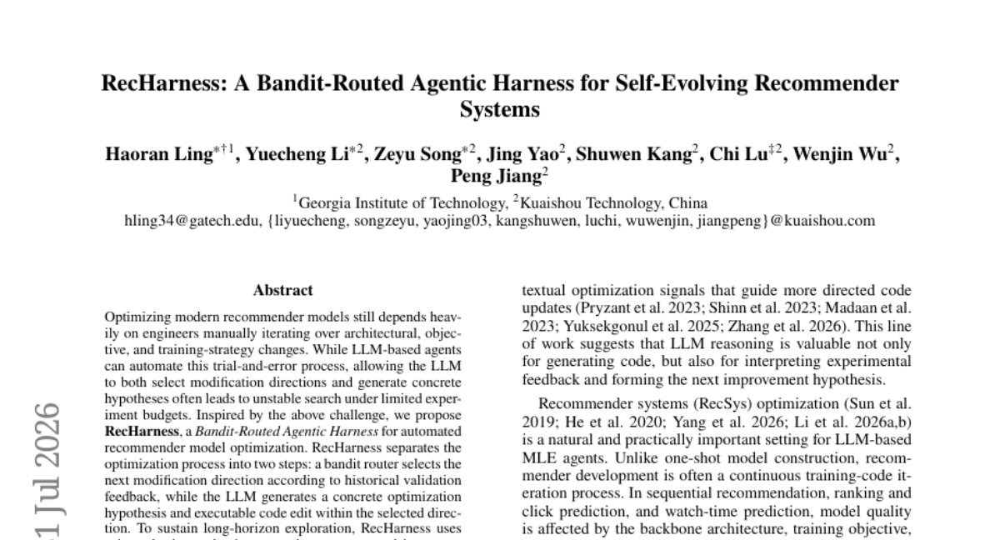

### 📌 한 줄 요약
Bandit 알고리즘과 LLM 에이전트를 결합하여 추천 모델 최적화의 탐색 효율과 안정성을 극대화한 자동화 프레임워크

### 🔑 핵심 포인트
- Bandit 라우터와 LLM 에이전트의 역할 분리를 통한 탐색 안정성 확보
- 국소 최적점 탈출을 위한 jump-basin 메커니즘 도입
- 제한된 실험 예산 내에서 효율적인 모델 최적화 경로 탐색

### 🧑‍💻 개발자 관점
모델 아키텍처나 학습 전략 변경 시 발생하는 반복적인 실험 비용을 줄이고, 에이전트가 안정적으로 최적의 모델을 찾아낼 수 있는 구조를 제시합니다.

### 🚀 실무 적용 아이디어
- 기존 수동 실험 워크플로우에 Bandit 기반 방향 결정 로직 적용 테스트
- LLM이 생성한 코드 수정 사항에 대한 자동 검증 파이프라인 구축
- 특정 도메인 데이터셋에 대한 jump-basin 메커니즘의 효과 검증

### ⚠️ 리스크/한계
- LLM이 생성한 코드의 실행 가능성 및 모델 구조적 무결성 보장 문제
- 탐색 방향 결정(Bandit)과 구체적 구현(LLM) 간의 정렬 문제

### 📝 초록 기반 상세 설명
현대적인 추천 모델 최적화는 엔지니어의 수동 반복 작업에 크게 의존하고 있습니다. LLM 기반 에이전트를 통한 자동화 시도는 시도와 오류 과정에서 예산 제약 하에 불안정한 탐색 결과를 초래하는 문제가 있습니다. 이를 해결하기 위해 RecHarness는 최적화 과정을 두 단계로 분리하여, Bandit 라우터가 방향을 결정하고 LLM이 구체적인 가설과 코드를 생성하도록 설계되었습니다. 또한 국소 최적점 정체를 방지하기 위해 구조적 도약을 지원하는 jump-basin 메커니즘을 도입했습니다. 실험 결과, RecHarness는 기존 LLM 추론 방식보다 안정적인 성능 향상을 보였으며 대규모 광고 플랫폼 A/B 테스트에서도 유의미한 수익 및 노출 지표 개선을 달성했습니다.

---

## 27. [Model or Harness? An Interaction-Centric Taxonomy for Localizing Agent Failures](https://huggingface.co/papers/2607.28802)
**Upvotes**: 7 | **도입 난이도**: 하 | **신뢰도**: 상
**arXiv**: https://arxiv.org/abs/2607.28802

**태그**: Agent, Evaluation, Taxonomy, LLM-Ops, Reasoning, Benchmark

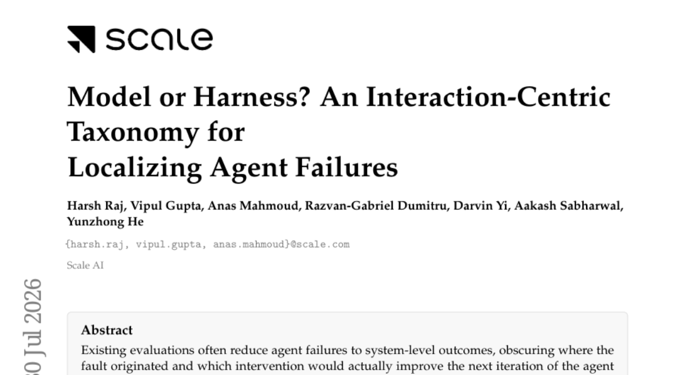

### 📌 한 줄 요약
에이전트 실패 원인을 모델, 하네스, 환경 간의 상호작용 관점에서 분류하여 정확한 수정 대상을 식별하는 새로운 방법론을 제안합니다.

### 🔑 핵심 포인트
- 실패 원인을 모델, 하네스, 환경 간의 상호작용(Interaction) 관점에서 정의하는 새로운 분류 체계 도입
- 실패가 발생한 지점과 수정이 필요한 주체(Model-side vs Harness-side)를 명확히 구분하는 구조 설계
- 벤치마크 의존성을 탈피하여 다양한 에이전트 시스템(코딩, 개인 비서, 멀티 에이전트 등)에 범용적으로 적용 가능한 프레임워크 제공

### 🧑‍💻 개발자 관점
에이전트 성능 저하 시, 모델 학습을 다시 할지 아니면 프롬프트나 도구 연동 로직을 고칠지 결정하는 의사결정 가이드를 제공합니다.

### 🚀 실무 적용 아이디어
- 현재 운영 중인 에이전트의 실패 로그를 제안된 41가지 실패 모드에 매핑해보기
- 실패 발생 시 '모델 문제'인지 '하네스(Scaffolding) 문제'인지 구분하는 체크리스트 작성하기
- 에이전트 평가 시 결과 점수뿐만 아니라 상호작용 단계별 실패 원인을 기록하는 로그 구조 설계하기

### ⚠️ 리스크/한계
- 실패 원인이 여러 요소에 복합적으로 얽혀 있을 경우 단일 분류로 정의하기 어려울 수 있음
- 분류 체계의 정교함이 높을수록 수동 분석 시 숙련된 분석가의 판단이 개입될 여지가 있음

### 📝 초록 기반 상세 설명
기존의 에이전트 평가는 시스템 수준의 결과에만 집중하여 실패의 근본 원인이 모델인지, 프롬프트 엔지니어링인지, 혹은 환경 문제인지 구분하기 어렵다는 문제를 가집니다. 이러한 모호함은 잘못된 수정 방향을 결정하게 만드는 '수리 할당 문제(repair-assignment problem)'를 야기합니다. 본 논문은 에이전트의 행동이 구성 요소 간의 상호작용에서 발생한다는 점에 착안하여, 실패를 상호작용 중심의 분류 체계로 구조화합니다. 41가지 실패 모드를 구성 요소 간의 '엣지(edge)'와 '결함 측(fault side)'으로 정의하여, 어떤 구성 요소를 수정해야 할지 명확히 식별할 수 있게 합니다. 실험 결과, 제안된 분류 체계는 인간의 라벨링과 높은 일치도를 보이며 다양한 에이전트 아키텍처에 적용 가능함을 입증했습니다.

---

## 28. [Relax Within, Balance Across: Geometry-Guided Load Balancing for Vision-Language Mixture-of-Experts](https://huggingface.co/papers/2608.00574)
**Upvotes**: 6 | **도입 난이도**: 중 | **신뢰도**: 상
**arXiv**: https://arxiv.org/abs/2608.00574

**태그**: MoE, Multimodal, Load Balancing, Computer Vision, RAG, Vision, Benchmark

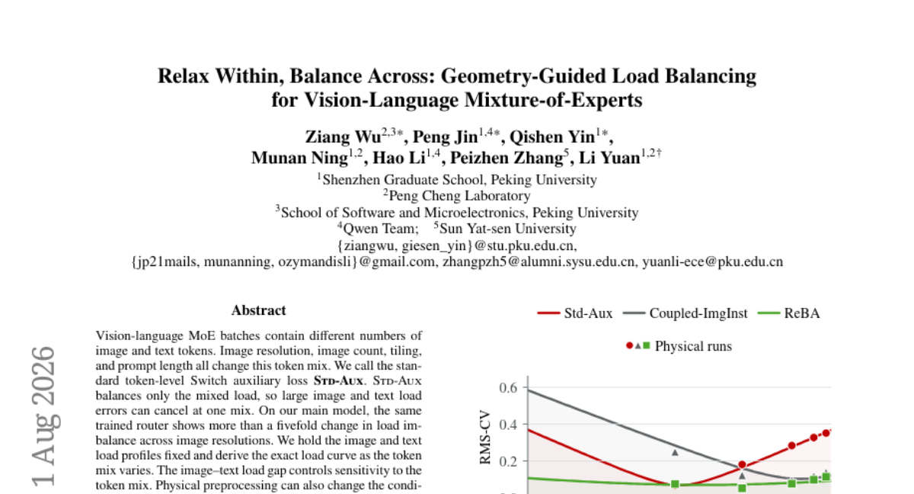

### 📌 한 줄 요약
이미지-텍스트 토큰 비율 변화에 따른 MoE 부하 불균형 문제를 해결하기 위해 기하학적 구조를 활용한 새로운 로드 밸런싱 기법(ReBA)을 제안합니다.

### 🔑 핵심 포인트
- 기존 토큰 단위 로드 밸런싱이 가변적인 모달리티 비율(이미지 vs 텍스트)을 처리하지 못하는 문제 식별
- 모달리티 경계와 이미지 소스별 그룹화 특성을 반영한 ReBA 알고리즘 설계
- 해상도 및 타일링 변화에도 안정적인 부하 분산 성능 입증

### 🧑‍💻 개발자 관점
멀티모달 모델 배포 시 입력 데이터(이미지 크기, 텍스트 길이) 변화에 따른 하드웨어 자원 사용량의 급격한 변동을 방지할 수 있습니다.

### 🚀 실무 적용 아이디어
- 기존 MoE 모델에 ReBA의 손실 함수(Loss term)를 적용하여 부하 분산 변화 측정
- 이미지 해상도 변화(Tiling 등)에 따른 라우터 부하 변동성 테스트
- 다양한 모달리티 비율을 가진 데이터셋에서 모델 성능 유지 여부 검증

### ⚠️ 리스크/한계
- 새로운 손실 함수 도입 시 기존 학습된 라우터의 가중치 재조정(Fine-tuning) 필요 가능성
- 특정 모달리티 비중이 극단적으로 치우친 경우의 일반화 성능 검증 필요

### 📝 초록 기반 상세 설명
멀티모달 MoE 모델은 이미지와 텍스트 토큰의 비율이 가변적이며, 기존의 토큰 단위 보조 손실(Std-Aux)은 이로 인한 부하 불균형을 완전히 해결하지 못합니다. 특히 이미지 해상도나 프롬프트 길이에 따라 특정 모달리티에 부하가 쏠리는 현상이 발생합니다. 연구진은 이미지와 텍스트가 라우터 입력 공간에서 서로 다른 영역을 차지한다는 점에 착안하여 ReBA(Relax Within, Balance Across)를 제안합니다. ReBA는 모달리티 경계를 고려한 개별 항과 이미지 소스별 균등 라우팅을 결합하여 부하를 최적화합니다. 실험 결과, ReBA는 모델 성능을 유지하면서도 해상도 변화 등 다양한 환경에서 부하 불균형을 효과적으로 낮추었습니다.

---

## 29. [Zero-Mem: Zero-Token Memory Operations for LLM Agents](https://huggingface.co/papers/2607.29377)
**Upvotes**: 4 | **도입 난이도**: 중 | **신뢰도**: 상
**arXiv**: https://arxiv.org/abs/2607.29377

**태그**: LLM-Agent, Memory-Management, RAG, Efficiency, Agent, Benchmark, Evaluation

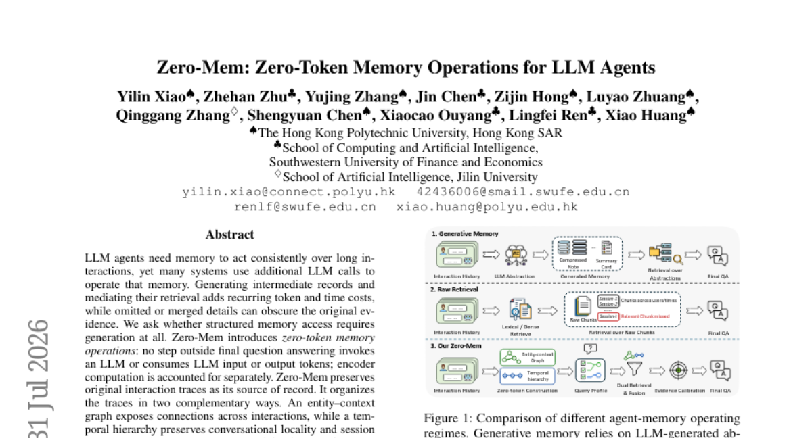

### 📌 한 줄 요약
LLM 호출 없이 원본 대화 기록을 구조화하여 메모리 비용과 지연 시간을 획기적으로 줄인 에이전트 메모리 프레임워크

### 🔑 핵심 포인트
- Zero-token memory operations: 메모리 관리 과정에서 LLM 생성/입력을 배제하여 비용과 지연 시간 최소화
- Dual-view structure: 엔티티-컨텍스트 그래프와 시간적 계층 구조를 결합한 구조적 메모리 관리
- Deterministic calibration: 충돌하는 증거를 제거하여 최종 QA의 근거를 원본 기록에 고정

### 🧑‍💻 개발자 관점
에이전트 설계 시 발생하는 막대한 토큰 비용과 응답 지연 문제를 구조적 데이터 관리만으로 해결할 수 있는 실용적인 방법론을 제시합니다.

### 🚀 실무 적용 아이디어
- 기존 RAG 기반 에이전트의 메모리 관리 로직을 Zero-Mem의 그래프/계층 구조로 교체 실험
- 메모리 조작 단계에서의 토큰 절감 효과와 최종 답변 정확도 간의 트레이드오프 분석
- 장기 대화 시나리오에서 원본 트레이스 보존 방식의 신뢰성 검증

### ⚠️ 리스크/한계
- 복잡한 추론이 필요한 메모리 작업의 경우, LLM 생성 없이 구조적 접근만으로는 한계가 있을 수 있음
- 엔티티 추출 및 그래프 구축을 위한 인코더 연산 비용은 별도로 발생함

### 📝 초록 기반 상세 설명
LLM 에이전트가 장기 상호작용을 위해 메모리를 관리할 때, 기존 방식은 메모리 조작을 위해 추가적인 LLM 호출을 발생시켜 토큰 비용과 지연 시간을 높이는 문제가 있었습니다. 본 논문은 메모리 조작 과정에서 LLM 생성 과정을 배제하는 Zero-Mem 방식을 제안합니다. Zero-Mem은 원본 상호작용 기록을 유지하면서, 엔티티-컨텍스트 그래프와 시간적 계층 구조라는 두 가지 상호 보완적 방식으로 데이터를 조직합니다. 최종 QA 단계에서만 LLM을 호출함으로써, 메모리 조작에 드는 토큰 소모를 없애고 원본 증거를 보존합니다. 실험 결과, 경쟁력 있는 성능을 유지하면서도 메모리 조작 시간을 기존 베이스라인 대비 57.6% 단축했습니다.

---

## 30. [ICDAR 2026 Competition on Information Extraction from Atomic Layer Deposition/Etching (ALD/E) Scientific Figures](https://huggingface.co/papers/2607.26848)
**Upvotes**: 4 | **도입 난이도**: 중 | **신뢰도**: 상
**arXiv**: https://arxiv.org/abs/2607.26848

**태그**: Multimodal, Scientific-AI, Benchmark, VQA, Reasoning, Vision

_Scientif_img.jpg)

### 📌 한 줄 요약
전문 과학 도식(Figure)으로부터 정밀한 데이터 추출 및 추론 능력을 검증하기 위한 Sci-ImageMiner 벤치마크 및 경진대회 결과 분석

### 🔑 핵심 포인트
- 전문가 주도로 정교하게 주석이 달린 4가지 상호 보완적 태스크의 Sci-ImageMiner 벤치마크 구축
- 분류/요약과 달리 데이터 추출 및 과학적 추론(VQA) 분야에서의 모델 성능 격차 확인
- 도메인 지식이 결합된 멀티모달 AI 모델의 한계점과 발전 방향 제시

### 🧑‍💻 개발자 관점
도메인 특화(Scientific) 멀티모달 모델 개발 시, 단순 텍스트 요약을 넘어 시각적 데이터의 정밀 추출과 논리적 추론 능력을 확보하는 것이 핵심 과제임을 시사합니다.

### 🚀 실무 적용 아이디어
- 기존 멀티모달 모델을 Sci-ImageMiner 데이터셋에 적용하여 추론 성능 벤치마킹
- 시각적 질의응답(VQA) 성능 향상을 위한 도메인 지식 주입(Knowledge Injection) 전략 실험
- 도식 내 수치/데이터 추출 정확도 향상을 위한 세부 태스크 최적화

### ⚠️ 리스크/한계
- 현재의 SOTA 모델들이 복잡한 과학적 추론 및 정밀 데이터 추출에서 여전히 취약함
- 특정 도메인(ALD/E)에 특화된 데이터셋이므로 범용적 일반화 성능 확인 필요

### 📝 초록 기반 상세 설명
과학 논문의 시각적 정보를 이해하고 지식을 추출하는 것은 텍ext에 없는 정보를 파악하는 데 필수적입니다. 기존의 과학적 도식 이해 능력을 넘어선 고도화된 벤치마크를 구축하기 위해 Sci-ImageMiner 데이터셋과 경진대회를 개최했습니다. 68개 팀이 참여한 이번 경진대회는 4가지 상호 보완적인 엔드투엔드 태스크를 통해 모델의 성능을 검증했습니다. 실험 결과, 최신 멀티모달 모델들은 분류 및 요약에는 강점을 보였으나 데이터 추출과 시각적 질의응답(VQA) 기반의 과학적 추론에는 한계를 보였습니다. 이 결과는 도메인 특화 멀티모달 AI 시스템 발전을 위한 핵심 과제를 제시합니다.

### 🖼️ 추가 자료

---

## 31. [Wnuan: Staged Post-Training for Question Answering over Proprietary Enterprise Knowledge](https://huggingface.co/papers/2608.01862)
**Upvotes**: 3 | **도입 난이도**: 상 | **신뢰도**: 상
**arXiv**: https://arxiv.org/abs/2608.01862

**태그**: LLM, Fine-tuning, Reinforcement Learning, Enterprise AI, RAG, Vision, Benchmark, Evaluation

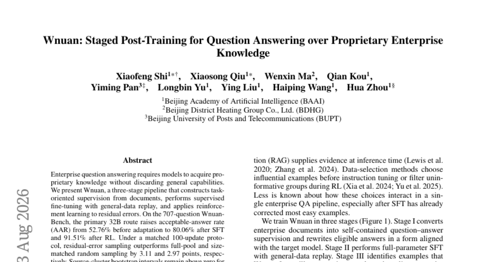

### 📌 한 줄 요약
기업용 독점 지식 학습 시 일반 성능 저하를 최소{화}하면서 질의응답 정확도를 극대화하는 3단계 단계별 사후 학습(Post-Training) 프레임워크

### 🔑 핵심 포인트
- 문서 기반 감독 데이터 구축 -> SFT(일반 데이터 리플레이 포함) -> RL(잔여 오류 해결)로 이어지는 3단계 파이프라인 제안
- 잔여 오류 샘플링(Residual-error sampling)을 통해 모델의 미세한 오류를 효과적으로 교정
- 기업용 지식 습득과 일반 성능 유지 사이의 균형을 맞추는 단계적 적응 전략 제시

### 🧑‍💻 개발자 관점
기업 내부 데이터를 학습시킬 때 발생하는 '치명적 망각(Catastrophic Forgetting)' 문제를 해결하고, 도메인 특화 성능을 높이는 실무적인 파이프라인을 제공합니다.

### 🚀 실무 적용 아이디어
- SFT 단계에서 일반 데이터와 도메인 데이터의 혼합 비율(Replay ratio) 실험
- RL 단계에서 잔여 오류를 추출하기 위한 샘플링 전략 비교 실험
- 도메인 특화 학습이 일반 지시 이행 능력에 미치는 영향 정량적 측정

### ⚠️ 리스크/한계
- 도메인 지식 학습 시 일반적인 지시 이행(Instruction following) 능력이 저하될 위험이 있음
- 단계별 학습 과정에서 데이터 품질과 샘플링 전략에 대한 의존도가 높음

### 📝 초록 기반 상세 설명
기업용 질의응답 모델은 일반적인 능력을 유지하면서도 독점적인 지식을 습득해야 하는 과제를 안고 있습니다. 본 논문은 문서로부터 작업 지향적 감독 데이터를 구축하고, 일반 데이터 리플레이를 포함한 SFT를 거쳐, 잔여 오류에 대해 강화학습을 적용하는 3단계 파이프라인인 Wnuan을 제안합니다. 실험 결과, WnuanBench에서 SFT와 RL 단계를 거치며 정답률(AAR)이 52.76%에서 91.51%까지 크게 향상되었습니다. 특히 잔여 오류 샘플링 방식이 기존의 전체 풀 또는 크기 매칭 방식보다 우수한 성능을 보였습니다. 다만, 이 과정에서 지시 이행(Instruction following) 능력을 포함한 일반 벤치마크 점수는 일부 하락하는 트레이드오프가 관찰되었습니다.

### 🖼️ 추가 자료
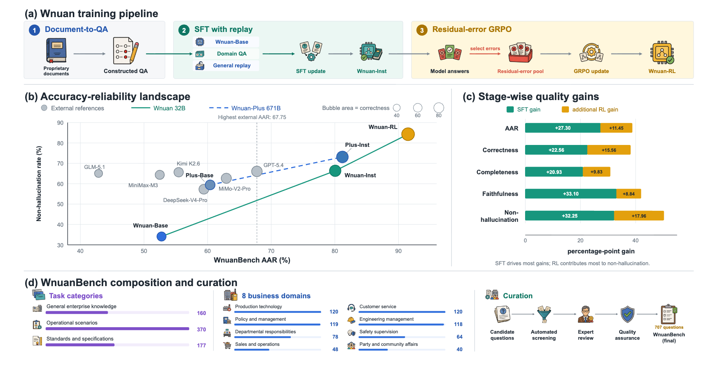
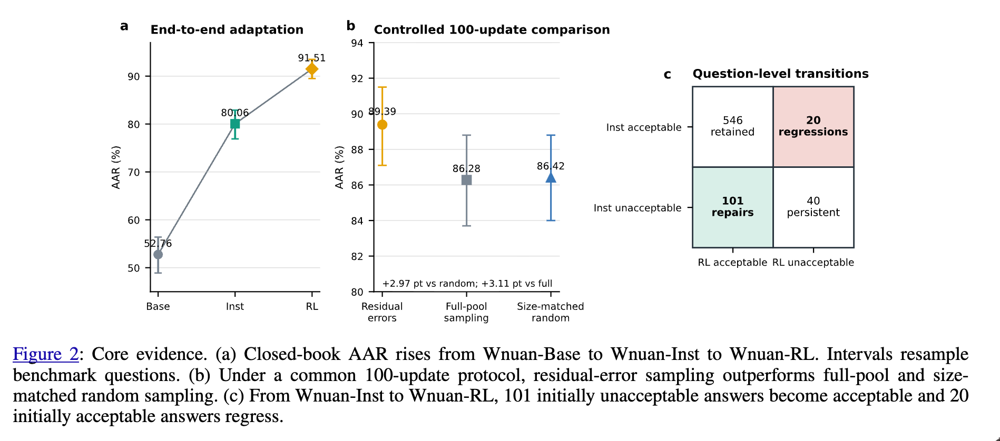

---

## 32. [Loud or Silent? A Reusable Framework for Per-Modality Failure Analysis in Multimodal Clinical AI](https://huggingface.co/papers/2608.01462)
**Upvotes**: 3 | **도입 난이도**: 하 | **신뢰도**: 상
**arXiv**: https://arxiv.org/abs/2608.01462

**태그**: Multimodal, Failure Analysis, Model Reliability, Clinical AI, Evaluation

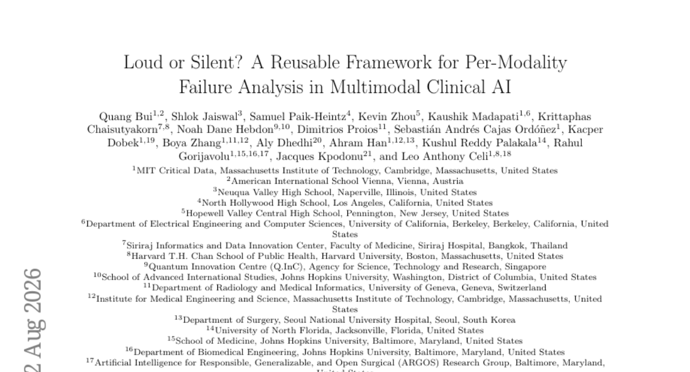

### 📌 한 줄 요약
멀티모달 모델 배포 시 특정 모달리티 누락에 따른 실패 원인과 위험도를 분석하는 재사용 가능한 프레임워크 제안

### 🔑 핵심 포인트
- 모달리티 누락 시 발생하는 실패를 'Loud(감지 가능)'와 'Silent(감지 불가)'로 구분하는 분석 체계 구축
- 모델 구조에 상관없이 적용 가능한 모달리티별 상호보완성 및 실패 원인 분석 프레임워크 개발
- 배포 환경의 제약(특정 데이터 부재)을 고려한 실질적인 모델 신뢰성 평가 방법론 제시

### 🧑‍💻 개발자 관점
모델의 성능 수치뿐만 아니라, 특정 데이터가 없을 때 모델이 어떻게 오작동하는지(Silent failure)를 정량화하여 배포 안정성을 높일 수 있습니다.

### 🚀 실무 적용 아이디어
- 기존 멀티모달 모델에 제안된 프레임워크를 적용하여 모달리티별 의존도 측정
- 특정 모달리티를 의도적으로 제거했을 때 발생하는 'Silent failure' 비율 확인
- 모달리티 간 상호보완성 행렬을 통한 데이터 중복성 및 효율성 검토

### ⚠️ 리스크/한계
- 제안된 프레임워크는 임베딩 기반이므로 원천 데이터의 품질 문제가 모델 성능에 미치는 영향은 별도로 고려해야 함
- 실제 임상 환경의 복잡한 변수를 완전히 반영하기에는 실험적 검증 단계에 있음

### 📝 초록 기반 상세 설명
멀티모달 임상 모델은 모든 데이터가 있을 때의 정확도로 평가되지만, 실제 배포 환경에서는 특정 모달리티(예: 초음파)를 사용할 수 없는 상황이 빈번합니다. 기존의 사후 특성 기여도 분석(SHAP 등)과 달리, 모달리티 누락 시 어떤 모달리티가 오류의 원인인지, 그리고 실패가 감지 가능한 수준(Loud)인지 아니면 감지되지 않는 위험한 수준(Silent)인지를 구분하는 것이 중요합니다. 본 논문은 N개의 모달리티 임베딩과 마스크 인식 프로브를 사용하는 모델 불가지론적(Model-agnostic) 실패 분석 프레임워크를 제안합니다. 이 프레임워크는 개별 사례별 실패 분류, 모달리티 간 상호보완성 행렬, 그리고 모니터링 가능 여부를 판단하는 Loud-vs-Silent 프로파일을 제공합니다. 실험 결과, 제안된 프레임워크는 인위적으로 주입된 모달리티 지배 구조를 정확히 복구했으며, 실제 MIMIC-IV 코호트 데이터에서도 모달리티 누락에 따른 성능 변화를 효과적으로 포착했습니다.

---

## 33. [Compute Globally, Materialize Locally: The Memory Contract of Sparse Event-KV](https://huggingface.co/papers/2607.23693)
**Upvotes**: 3 | **도입 난이도**: 중 | **신뢰도**: 상
**arXiv**: https://arxiv.org/abs/2607.23693

**태그**: LLM, KV-Cache, Memory-Management, Agent

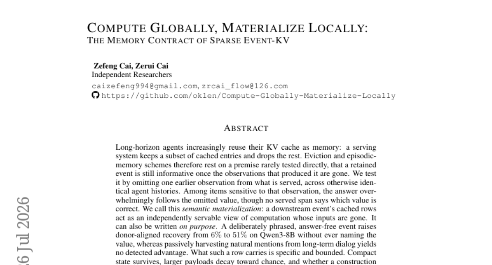

### 📌 한 줄 요약
KV 캐시의 일부만 남기는 희소 이벤트 기반 메모리 관리 방식에서 데이터의 의미적 생존과 복구 가능성을 규명함

### 🔑 핵심 포인트
- 의미적 구체화(Semantic Materialization): 원본 데이터가 사라져도 캐시된 KV 행이 정보를 유지하는 현상 규명
- 의도적 이벤트 설계: 정답을 직접 언급하지 않는 정교한 프레이징을 통해 정보 복구 성능 극대화 가능
- 메모리 계약(Memory Contract): 캐시 삭제 시 정확도 유지 여부가 원본 데이터의 불필요함을 의미하지 않음을 경고

### 🧑‍💻 개발자 관점
KV 캐시 최적화 및 에이전트 메모리 관리 시, 단순히 빈도나 중요도 기반의 삭제가 정보 손실로 이어질 수 있음을 이해해야 합니다.

### 🚀 실무 적용 아이디어
- KV 캐시 삭제(Eviction) 정책 적용 전후의 정보 복구 성능 비교 실험
- 프레이징(Phrasing) 변화에 따른 캐시 내 정보 유지력 테스트
- 에이전트 메모리 설계 시 '의미적 구체화'를 활용한 압축 전략 검토

### ⚠️ 리스크/한계
- 페이로드가 커질수록 정보 유지력이 급격히 감소하는 경향이 있음
- 프레이징에 따라 결과가 크게 달라지므로 일반화된 규칙 적용이 어려울 수 있음

### 📝 초록 기반 상세 설명
장기 대화형 에이전트가 KV 캐시를 메모리로 재사용할 때, 원본 관찰 데이터가 삭제되어도 캐시된 값이 정보를 유지하는지에 대한 검증이 필요합니다. 연구진은 특정 관찰값이 누락된 상황에서 캐시된 행(row)이 어떻게 이전 정보를 유지하는지 테스트했습니다. 이를 '의미적 구체화(semantic materialization)'라 명명하며, 특정 이벤트가 원본 입력 없이도 독립적인 뷰로서 정보를 담고 있음을 확인했습니다. 실험 결과, 의도적으로 설계된 '답이 없는 이벤트'는 Qwen3-8B 모델에서 정보 복구율을 6%에서 51%로 크게 높였습니다. 결론적으로 캐시 삭제 시 정확도 저하가 없다고 해서 해당 소스 이벤트가 불필요하다고 판단해서는 안 된다는 메모리 계약(memory contract)을 제시합니다.

### 🖼️ 추가 자료
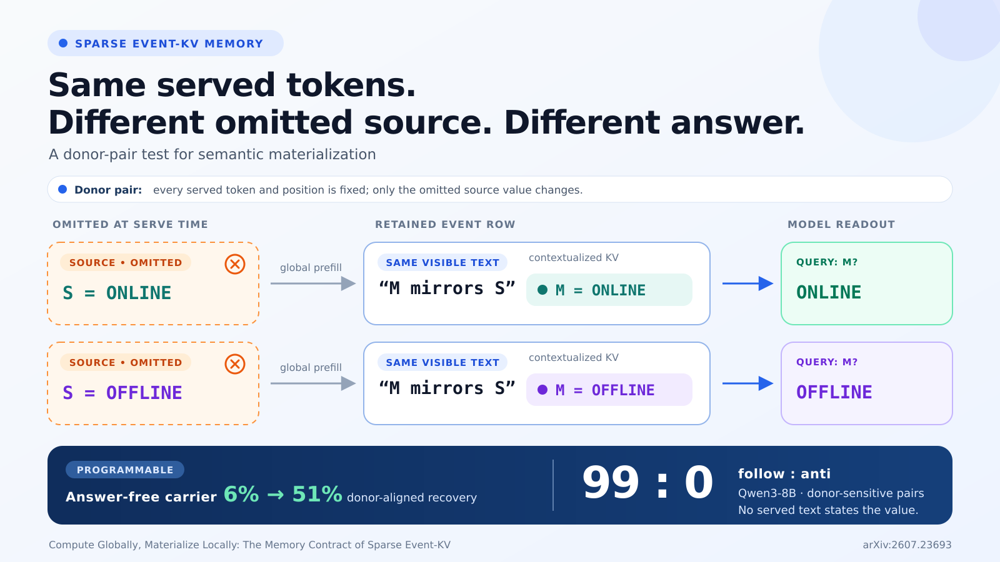

---

## 34. [Seeing or Knowing? Visual Context Sensitivity in Multimodal Large Language Models](https://huggingface.co/papers/2607.26326)
**Upvotes**: 2 | **도입 난이도**: 중 | **신뢰도**: 상
**arXiv**: https://arxiv.org/abs/2607.26326

**태그**: MLLM, Vision-Language, Model-Control, Multimodal, Vision, Benchmark

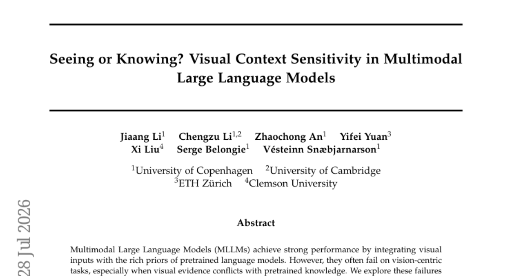

### 📌 한 줄 요약
MLLM의 시각 정보 인코딩 능력은 충분하지만, 언어적 사전 지식(Prior)과의 충돌 시 시각 정보를 선택적으로 활용하는 제어 능력이 부족함을 규명함.

### 🔑 핵심 포인트
- WhatIfVis 벤치마크를 통한 시각적 증거와 언어적 사전 지식 간의 충돌 현상 정밀 진단
- 시각적 속성(색상, 크기, 개수 등)은 이미 인코딩되어 있으나, 활용 단계에서 언어 지식에 밀리는 현상 확인
- SFT 및 스티어링 벡터를 통해 모델의 시각 문맥 민감도를 제어하고 일반화할 수 있음을 입증

### 🧑‍💻 개발자 관점
시각적 증거가 명확함에도 모델이 엉뚱한 답을 할 때, 인코딩 문제가 아닌 '제어(Control)' 문제로 접근해야 함을 시사합니다.

### 🚀 실무 적용 아이디어
- 모델의 시각 정보 활용도를 높이기 위해 SFT 시 '시각적 증거 우선' 지시문을 포함한 데이터셋 구성
- 학습된 스티어링 벡터를 활용하여 추론 시 시각적 민감도를 동적으로 조절하는 실험 수행
- 모델의 특정 레이어에서 시각 정보와 언어 정보가 충돌하는 지점을 분석하는 Activation Patching 실험

### ⚠️ 리스크/한계
- 제안된 벤치마크가 다루는 속성(색상, 크기 등)이 더 복잡한 추론 작업으로 확장될 수 있는지 확인 필요
- 스티어링 벡터를 통한 제어가 다른 언어적 성능을 저하시키는 Trade-off 발생 가능성

### 📝 초록 기반 상세 설명
최근 MLLM은 강력한 성능을 보이지만, 시각적 증거가 사전 학습된 언어 지식과 충돌할 때 발생하는 오류에 취약합니다. 본 연구는 시각 정보의 가용성과 멀티모달 문맥 민감도를 진단하기 위해 새로운 벤치마크인 WhatIfVis를 제안합니다. 실험 결과, 모델은 시각적 속성을 충분히 인코딩하고 있음에도 불구하고, 답변 생성 단계에서 언어적 사전 지식에 의존하여 시각 정보를 무시하는 현상이 관찰되었습니다. 이를 해결하기 위해 SFT와 스티어링 벡터(Steering Vector)를 활용하여 시각 정보 활용도를 조절하는 방법을 연구했습니다. 결과적으로 시각적 인코딩 자체보다 인코딩된 정보를 활용하는 제어 메커니즘이 MLLM 성능의 핵심 병목임을 밝혀냈습니다.

---

## 35. [GEOID-Flood: A Large-Scale Multi-Modal Benchmark Dataset for Flood Segmentation](https://huggingface.co/papers/2608.02315)
**Upvotes**: 1 | **도입 난이도**: 중 | **신뢰도**: 상
**arXiv**: https://arxiv.org/abs/2608.02315

**태그**: Remote Sensing, Segmentation, Multi-modal, Foundation Models, Vision, Benchmark, Evaluation

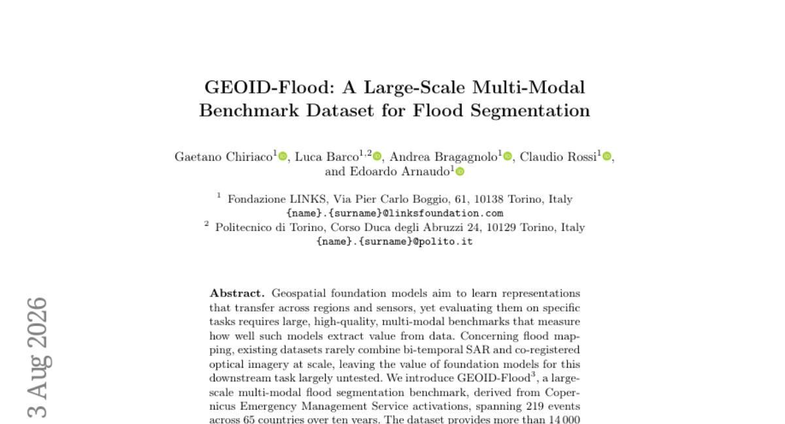

### 📌 한 줄 요약
전 세계 65개국 219개 홍수 이벤트를 포함한 대규모 멀티모달 벤치마크 데이터셋 GEOID-Flood 제안

### 🔑 핵심 포인트
- 65개국 219개 이벤트를 아우르는 대규모 멀티모달(SAR, 광학, DEM) 홍수 세그멘테이션 벤치마크 구축
- Sentinel-1(GRD/RTC) 및 Sentinel-2 합성 이미지와 정밀하게 정렬된 수동 검증 라벨 제공
- 파운데이션 모델과 전통적 인코더 간의 성능 비교 및 데이터 전이 성능 검증

### 🧑‍💻 개발자 관점
지형 공간 데이터(SAR/광학)를 다루는 엔지니어가 홍수 감지 모델의 성능을 객관적으로 검증하고 전이 학습 성능을 테스트할 수 있는 고품질 벤치마크를 확보할 수 있습니다.

### 🚀 실무 적용 아이디어
- 제공된 데이터셋을 활용하여 기존 Vision Transformer 기반 모델의 전이 학습 성능 테스트
- 광학-SAR 융합(Fusion) 전략에 따른 침수 구역 식별 정확도 비교 실험
- 파운데이션 모델의 Zero-shot/Few-shot 홍수 탐지 성능 벤치마킹

### ⚠️ 리스크/한계
- 파운데이션 모델의 성능 향상 폭이 기존 방식 대비 아주 크지는 않을 수 있음
- 특정 지역/환경에 특화된 모델이 새로운 지형적 특성을 만났을 때의 일반화 한계 가능성

### 📝 초록 기반 상세 설명
지형 공간 파운데이션 모델의 성능을 평가하기 위해서는 대규모의 고품질 멀티모달 벤치마크가 필요하지만, 기존 홍수 매핑 데이터셋은 SAR와 광학 이미지를 결합한 대규모 데이터가 부족했습니다. 본 논문은 Copernicus 긴급 관리 서비스 데이터를 활용하여 10년간 65개국에서 발생한 219개 이벤트를 포함하는 GEOID-Flood 데이터셋을 소개합니다. 이 데이터셋은 Sentinel-1(SAR), Sentinel-2(광학), DEM을 포함하며, 배경/상시 수역/침수 구역을 구분하는 수동 검증 라벨을 제공합니다. 연구진은 파운데이션 모델과 기존 인코더를 단일/시계열/멀티모달 프로토콜로 비교 평가했습니다. 실험 결과, 파운데이션 모델은 일관되지만 완만한 성능 향상을 보였으며, 광학-SAR 융합 방식이 일시적 침수 구역 식별에 가장 효과적이었습니다. 또한 GEOID-Flood로 학습된 모델은 기존 데이터셋 학습 모델보다 미학습 이벤트에 대한 전이 성능이 우수함을 확인했습니다.

### 🖼️ 추가 자료
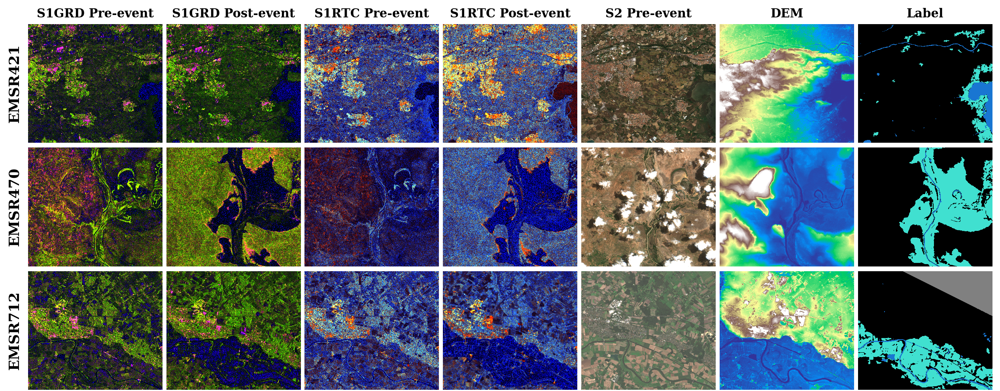

---

## 36. [SG-WAM: Self-Guided World Modeling in Geometry-Aware Policy Space](https://huggingface.co/papers/2608.01397)
**Upvotes**: 1 | **도입 난이도**: 상 | **신뢰도**: 상
**arXiv**: https://arxiv.org/abs/2608.01397

**태그**: Robot-Control, World-Models, Reinforcement-Learning, Computer-Vision, RAG, Vision, Evaluation, Safety

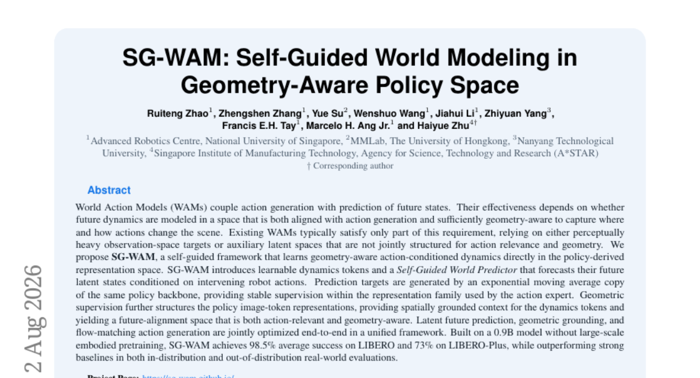

### 📌 한 줄 요약
정책 공간 내 기하학적 구조를 반영한 자기 주도형 월드 모델링을 통해 로봇 제어 성능을 극대화한 프레임워크

### 🔑 핵심 포인트
- 정책 유도 표현 공간(Policy-derived representation space) 내에서 직접적인 동역학 학습
- EMA 기반의 자기 주도형 타겟 생성을 통한 안정적인 미래 상태 예측
- 기하학적 감독(Geometric supervision)을 통한 공간 정보와 액션 간의 정렬 확보

### 🧑‍💻 개발자 관점
로봇 제어 시 관찰 데이터의 복잡도를 줄이면서도, 액션과 밀접하게 연관된 핵심 기하학적 정보만을 효율적으로 모델링하는 방법을 제시합니다.

### 🚀 실무 적용 아이디어
- 제시된 EMA 기반 타겟 생성 방식이 학습 안정성에 미치는 영향 분석
- Flow-matching 기반 액션 생성과 잠재 공간 동역학 간의 결합도 테스트
- 다양한 로봇 환경에서의 기하학적 감독(Geometric supervision) 가중치 실험

### ⚠️ 리스크/한계
- 정책 백본에 의존적인 타겟 생성 방식이 특정 도메인에서 편향을 유발할 가능성
- 복잡한 기하학적 구조를 가진 환경에서의 일반화 성능 검증 필요

### 📝 초록 기반 상세 설명
기존의 World Action Models(WAMs)는 미래 상태 예측 시 관찰 공간의 연산 부하가 크거나, 액션 생성과 기하학적 구조가 정렬되지 않는 문제가 있었습니다. 이를 해결하기 위해 SG-WAM은 정책 유도 표현 공간 내에서 기하학적 인지 능력을 갖춘 동역학을 학습하는 프레임워크를 제안합니다. 학습 과정에서 EMA(Exponential Moving Average)를 통해 정책 백본의 복사본을 타겟으로 사용하여 안정적인 감독을 제공하며, 기하학적 감독을 통해 공간적 맥락을 확보합니다. 제안된 방식은 잠재 미래 예측, 기하학적 접지, Flow-matching 기반 액션 생성을 엔드투엔드로 통합하여 최적화합니다. 실험 결과, 대규모 사전 학습 없이도 LIBERO 벤치마크에서 높은 성공률을 기록하며 실세계 OOD(Out-of-Distribution) 환경에서도 강력한 성능을 입증했습니다.

---

## 37. [A Frozen Pixel-Space Diffusion Model Can Guide Itself with Its Own Samples](https://huggingface.co/papers/2607.29122)
**Upvotes**: 1 | **도입 난이도**: 하 | **신뢰도**: 상
**arXiv**: https://arxiv.org/abs/2607.29122

**태그**: Diffusion, Generative Model, Efficient Learning, Computer Vision, Vision, Evaluation

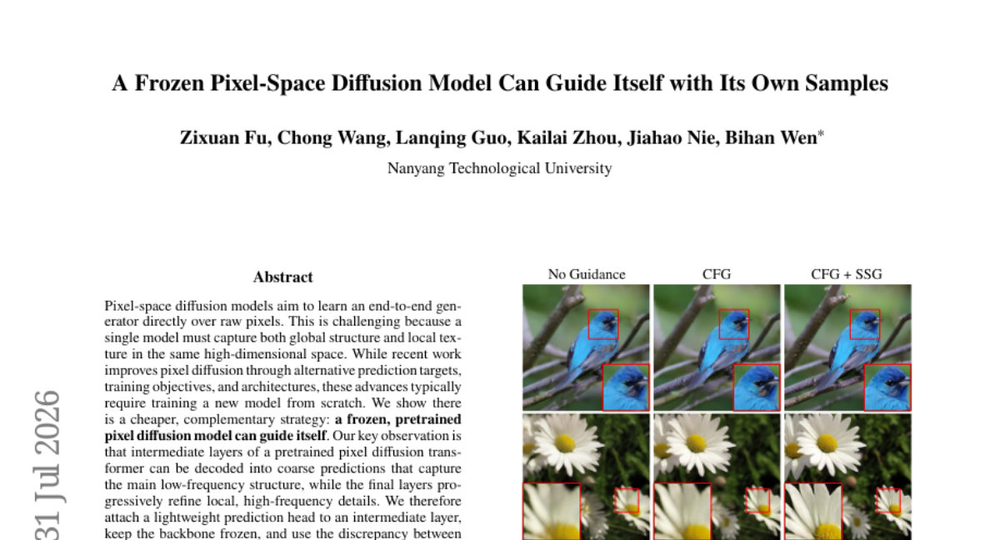

### 📌 한 줄 요약
사전 학습된 픽셀 확산 모델의 중간 레이어를 활용하여 적은 비용으로 생성 품질을 높이는 자기 가이드(Self-Guidance) 기법

### 🔑 핵심 포인트
- 사전 학습된 모델의 백본을 동결하고 가벼운 어댑터 헤드만 학습하는 효율적인 전략 제안
- 중간 레이어(저주파 구조)와 최종 레이어(고주파 디테일) 간의 차이를 활용한 자기 가이드 메커니즘
- 실제 데이터 없이 모델 생성 샘플만으로도 고품질의 디테일 보강 학습 가능

### 🧑‍💻 개발자 관점
모델 전체를 재학습하지 않고도 1% 미만의 비용으로 생성 품질을 개선할 수 있어, 기존 모델의 성능을 업그레이드할 때 매우 실용적인 접근법입니다.

### 🚀 실무 적용 아이디어
- 기존 픽셀 기반 확산 모델에 가벼운 예측 헤드를 부착하여 성능 변화 확인
- 실제 데이터셋 대신 생성된 합성 데이터만으로 어댑터 학습 효율성 테스트
- 레이어별 주파수 분리 특성이 다른 다양한 아키텍처에서의 일반화 성능 검증

### ⚠️ 리스크/한계
- 특정 아키텍처(Transformer 기반 등)에 의존적인 특성이 있을 수 있음
- 고주파 디테일 강화에 특화되어 있어 전역 구조가 무너질 가능성 검토 필요

### 📝 초록 기반 상세 설명
픽셀 공간 확산 모델은 전역 구조와 국부 질감을 동시에 학습해야 하는 고차원적 난제를 안고 있습니다. 기존의 성능 개선 방식은 모델을 처음부터 다시 학습시켜야 하는 높은 비용이 발생한다는 문제가 있었습니다. 본 논문은 사전 학습된 모델의 중간 레이어가 저주파 구조를, 최종 레이어가 고주파 디테일을 담당한다는 점에 착안하여 새로운 전략을 제안합니다. 모델의 백본은 고정한 채 가벼운 예측 헤드만 학습시켜 중간층과 최종층의 차이를 샘플링 가이드로 활용하는 SSG 방식을 도입했습니다. 실험 결과, 실제 이미지 없이 생성된 샘플만으로도 학습이 가능하며 매우 적은 연산량으로 FID를 크게 개선했습니다.

---

