# 2026-08-06 Daily Papers (Top 37)

## 오늘의 요약
오늘은 에이전트의 장기적 일관성과 자기 개선 능력을 평가하고 고도화하는 연구와, 비디오 및 3D 생성을 위한 멀티모달 생성 모델 연구가 주를 이루었습니다. 특히 실시간 영상 편집, 연속적 잠재 공간을 활용한 언어 모델링, 그리고 복잡한 비즈니스 로직을 수행하는 에이전트 설계 등 실무적 활용 가치가 높은 기술들이 주목받았습니다.

### 오늘의 핵심 포인트
- 에이전트의 장기적 의사결정 능력과 재귀적 자기 개선 능력을 정밀하게 측정하기 위한 새로운 벤치마크 프레임워크들이 제안되었습니다.
- 비디오 생성 및 편집 분야에서 실시간성과 시간적 일관성을 동시에 확보하기 위한 자기회귀 및 확산 모델 기반의 혁신적 기법들이 발표되었습니다.
- 멀티모달 데이터의 이해, 생성, 편집을 하나의 아키텍처로 통합하거나 연속적 잠재 공간을 활용하는 등 생성 모델의 효율성과 확장성을 높이는 연구가 진행되었습니다.

**오늘의 태그**: LLM-Agent, Multimodal, Diffusion-Model, Benchmarking, Generative-AI

## 1. [MerchantBench: Benchmarking LLM Agents for Long-Term Coherence in E-Commerce Operations](https://huggingface.co/papers/2607.28956)
**Upvotes**: 82 | **도입 난이도**: 중 | **신뢰도**: 상
**arXiv**: https://arxiv.org/abs/2607.28956

**태그**: LLM-Agent, Benchmarking, E-commerce, Decision-Making, Agent, Benchmark, Evaluation, Inference

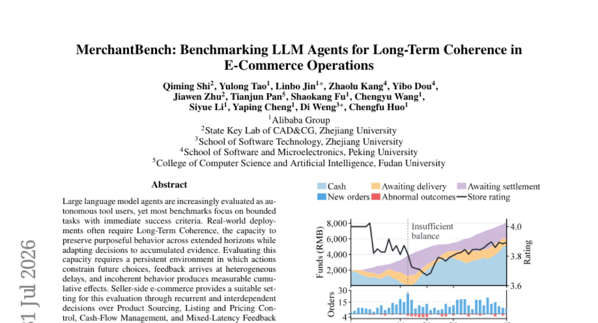

### 📌 한 줄 요약
장기적 의사결정 능력을 평가하기 위해 실제 이커머스 데이터를 기반으로 구축된 에이전트 벤치마크인 MerchantBench를 제안합니다.

### 🔑 핵심 포인트
- 실제 이커머스 데이터를 기반으로 한 365일 규모의 장기 시뮬레이션 환경 구축
- 지연된 피드백과 누적된 결과가 의사결정에 영향을 미치는 '장기적 일관성' 평가 프레임워크 제안
- 현존하는 최신 LLM 에이전트와 인간 사이의 의사결정 능력 격차 입증

### 🧑‍💻 개발자 관점
단순한 질의응답을 넘어, 시간이 흐름에 따라 결과가 누적되는 복잡한 비즈니스 로직을 수행하는 에이전트 설계 시 필수적인 평가 기준을 제공합니다.

### 🚀 실무 적용 아이디어
- 제시된 26개 도구 환경에서 에이전트의 상태 관리(State Management) 전략 실험
- 지연된 피드백(Delayed Feedback) 상황에서의 에이전트 메모리 관리 기법 적용
- 장기적 목표 달성을 위한 계층적 의사결정(Hierarchical Decision-making) 구조 테스트

### ⚠️ 리스크/한계
- 시뮬레이션 환경이 실제 시장의 변동성을 완벽히 재현하는지에 대한 검증 필요
- 에이전트의 성능이 특정 도구 사용 능력보다 전략적 판단 능력에 치중되어 있을 가능성

### 📝 초록 기반 상세 설명
최근 LLM 에이전트 평가가 단기적 작업 수행에 집중되어 있어, 장기적 일관성(Long-Term Coherence)을 측정하기 어렵다는 문제가 있습니다. 이를 해결하기 위해 의사결정이 미래의 선택을 제약하고 피드백이 지연되어 발생하는 복잡한 환경이 필요합니다. 본 논문은 98,843개의 실제 데이터를 기반으로 365일간의 주문 생애 주기를 시뮬레이션하는 MerchantBench를 도입합니다. 에이전트는 소싱, 가격 책정, 현금 흐름 관리 등 상호 의존적인 과제를 수행하며 지연된 피드백에 적응해야 합니다. 실험 결과, 최신 LLM들은 인간 참가자 성과의 약 27.3% 수준에 머물며 장기적 의사결정 능력에서 큰 격차를 보였습니다.

### 🖼️ 추가 자료
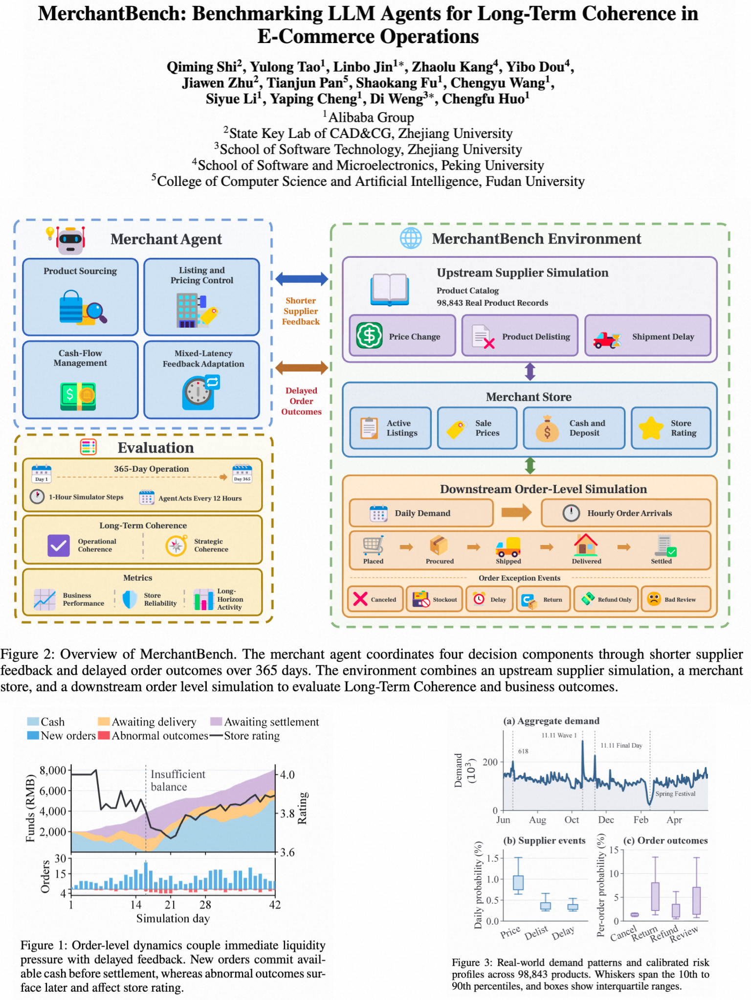
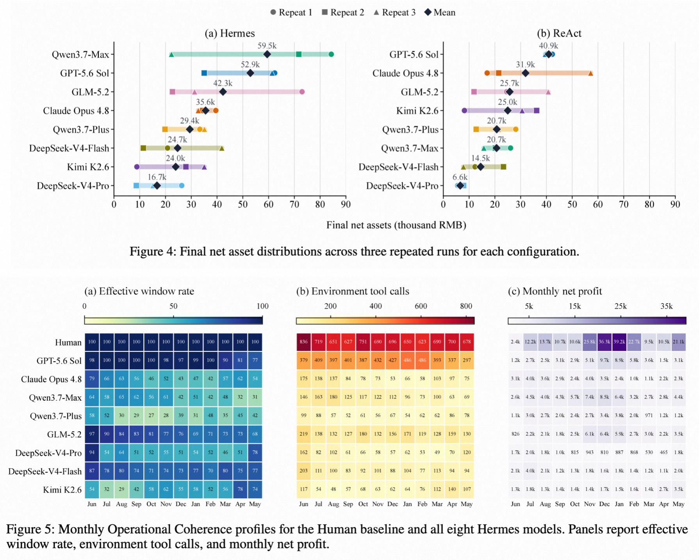
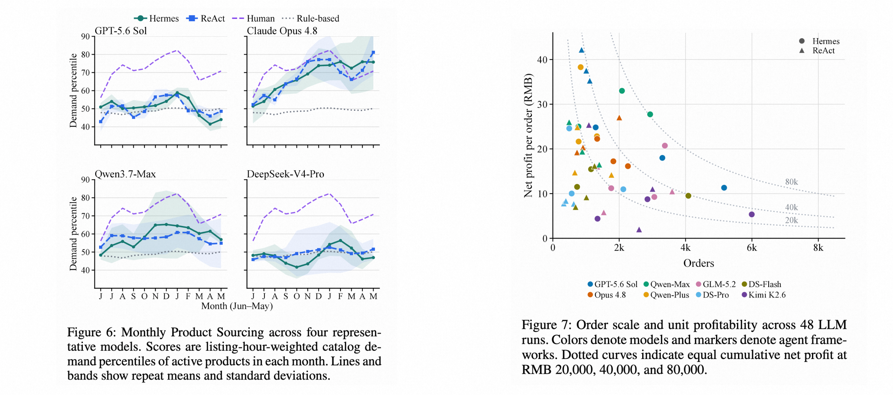
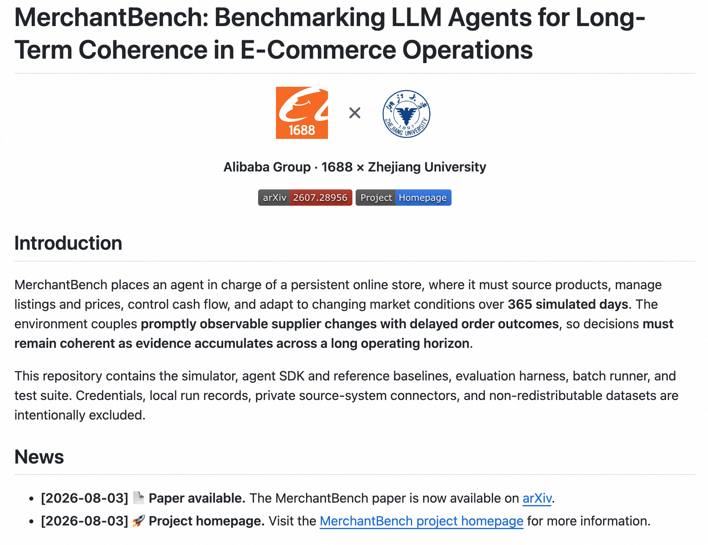

---

## 2. [JoyAI-Video-Edit: Real-Time Open-Ended Video Editing with Autoregressive Diffusion](https://huggingface.co/papers/2608.03974)
**Upvotes**: 75 | **도입 난이도**: 상 | **신뢰도**: 상
**arXiv**: https://arxiv.org/abs/2608.03974

**태그**: Video-Generation, Real-Time, Diffusion-Model, Video-Editing, Video, Evaluation, Inference, Distillation

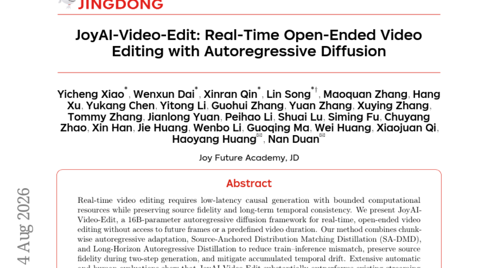

### 📌 한 줄 요약
B200 GPU 한 대에서 720p 30FPS 실시간 영상 편집을 구현한 자기회귀 확산 모델 프레임워크

### 🔑 핵심 포인트
- 16B 파라미터 규모의 자기회귀 확산 모델 기반 실시간 영상 편집 프레임워크 개발
- SA-DMD(Source-Anchored Distribution Matching Distillation)를 통한 원본 충실도 유지
- Long-Horizon Autoregressive Distillation을 통한 장기적 시간적 일관성 확보 및 드리프트 방지

### 🧑‍💻 개발자 관점
미래 프레임 없이도 실시간으로 끊김 없는 영상 편집이 가능함을 보여주어, 인터랙티브 영상 생성 및 스트리밍 서비스에 즉각적인 활용 가치가 있습니다.

### 🚀 실무 적용 아이디어
- 제공된 코드를 활용하여 단일 GPU 환경에서의 FPS 및 메모리 점유율 벤치마크 수행
- 다양한 해상도 및 프레임 레이트 변화에 따른 시간적 일관성(Drift) 발생 여부 테스트
- 소스 영상의 스타일 변환 시 원본 피사체 유지 능력을 정성적으로 평가

### ⚠️ 리스크/한계
- 16B 파라미터 모델로 인해 고성능 GPU(B200 등)가 필수적임
- 자기회귀 방식 특성상 매우 긴 영상 생성 시 누적되는 오차 제어 여부가 관건

### 📝 초록 기반 상세 설명
실시간 영상 편집은 낮은 지연 시간과 원본 충실도, 장기적 시간적 일관성을 동시에 유지해야 하는 과제를 안고 있습니다. 기존 방식은 미래 프레임에 대한 접근이나 정해진 영상 길이라는 제약이 있었습니다. 본 논문은 16B 파라미터 규모의 자기회귀 확산 프레임워크인 JoyAI-Video-Edit를 제안합니다. SA-DMD와 장기적 자기회귀 증류 기법을 결합하여 학습-추론 간 불일치를 줄이고 누적되는 시간적 드리프트를 방지했습니다. 실험 결과, 기존 스트리밍 편집기보다 우수한 성능을 보였으며 오프라인 시스템과 경쟁 가능한 수준의 품질을 달면서도 실시간성을 확보했습니다.

---

## 3. [AURORA-LM: Autoencoding Unified Representation for Continuous-Latent Diffusion Language Modeling](https://huggingface.co/papers/2608.02602)
**Upvotes**: 71 | **도입 난이도**: 상 | **신뢰도**: 상
**arXiv**: https://arxiv.org/abs/2608.02602

**태그**: LLM, Diffusion, Generative Modeling, NLP, Vision, Video, Audio, Evaluation, Inference

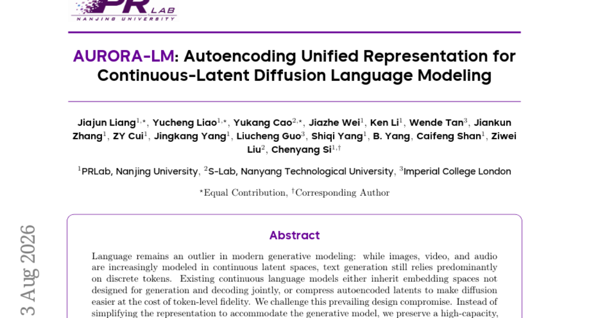

### 📌 한 줄 요약
텍스트의 해상도를 유지하면서 확산 모델(Diffusion)을 통해 고성능 언어 생성을 구현한 연속 잠재 공간 기반 언어 모델링 기술

### 🔑 핵심 포인트
- Query-based Encoder-Decoder를 통한 고용량/디코딩 가능 텍스트 잠재 표현 확보
- Block-causal Diffusion Transformer와 Flow matching을 결합한 효율적 생성 구조
- 노이즈 입력 경로만 제한하고 전체 클린 잠재 타겟을 유지하여 정보 손실 최소화

### 🧑‍💻 개발자 관점
이산적 토큰 방식의 한계를 넘어 연속적 잠재 공간에서 텍스트를 생성하는 새로운 패러다임을 제시하며, 향후 멀티모달 모델링의 핵심 기술이 될 수 있습니다.

### 🚀 실무 적용 아이디어
- 제시된 Block-causal 구조를 활용한 소규모 텍스트 생성 실험
- Flow matching과 기존 Autoregressive 방식의 생성 품질 비교
- 다양한 압축률(Latent width)에 따른 디코딩 성능 변화 측정

### ⚠️ 리스크/한계
- 연속적 잠재 공간 모델링의 복잡도로 인한 학습 안정성 확보 필요
- 기존 토큰 기반 모델 대비 추론 시 연산 비용 및 속도 최적화 과제

### 📝 초록 기반 상세 설명
기존의 텍스트 생성은 이산적 토큰에 의존하는 반면, 이미지나 비디오와 같은 연속적 잠재 공간 모델링 방식은 텍스트의 정밀도를 희생하는 경향이 있었습니다. 기존 방식은 생성 모델에 맞추기 위해 표현력을 단순화하거나 압축하는 과정에서 토큰 수준의 충실도가 떨어지는 문제가 있었습니다. 이를 해결하기 위해 AURORA-LM은 텍st 표현 구축과 분포 모델링을 분리하는 구조를 제안합니다. Query-based Encoder-Decoder로 고용량 잠재 표현을 만들고, Block-causal Diffusion Transformer를 통해 Flow matching 방식으로 분포를 학습합니다. 결과적으로 AURORA-LM은 기존 연속/확산 기반 언어 모델들 사이에서 최고 성능을 기록하며, 효율적인 연산량으로도 대규모 모델을 능가하는 성능을 보여주었습니다.

---

## 4. [Hunyuan3D-Buffalo 1.0: A Unified Multimodal Model for Scalable 3D Generation, Understanding, and Editing](https://huggingface.co/papers/2608.02711)
**Upvotes**: 70 | **도입 난이도**: 상 | **신뢰도**: 상
**arXiv**: https://arxiv.org/abs/2608.02711

**태그**: 3D Generation, Multimodal, Diffusion Model, VLM, Vision, Benchmark

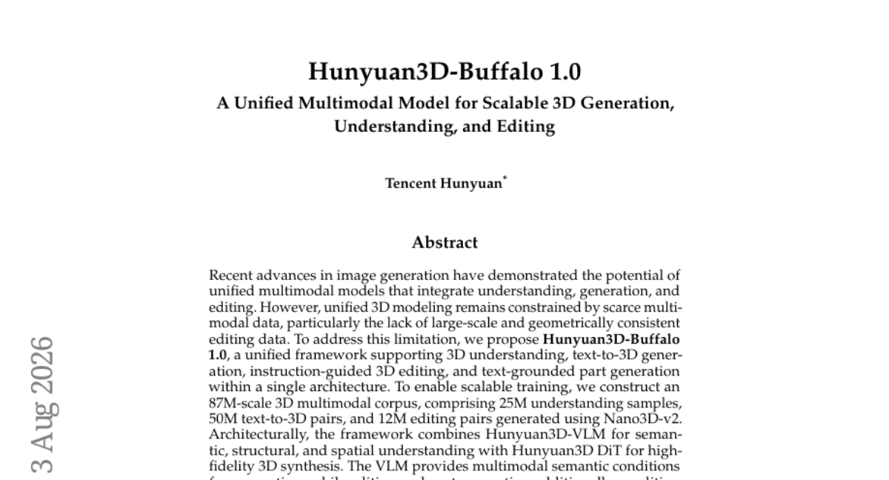

### 📌 한 줄 요약
이해, 생성, 편집을 하나의 아키텍처로 통합하여 대규모 3D 데이터 부족 문제를 해결한 멀티모달 모델

### 🔑 핵심 포인트
- 이해, 생성, 편집, 부분 생성을 하나의 아키텍처로 통합한 3D 멀티모달 프레임워크 개발
- 87M 규모(이해 25M, 생성 50M, 편집 12M)의 대규모 3D 멀티모달 데이터셋 구축
- VLM의 의미적 이해와 DiT의 고정밀 합성을 결합하여 구조적 일관성 유지

### 🧑‍💻 개발자 관점
3D 에셋 생성부터 정교한 편집까지 하나의 파이프라인으로 해결할 수 있어, 3D 콘텐츠 제작 워크플로우의 자동화 가능성을 제시합니다.

### 🚀 실무 적용 아이디어
- 제공된 데이터셋 구조를 분석하여 커스텀 3D 데이터셋 구축 방법론 학습
- VLM과 DiT 결합 구조가 구조적 일관성을 유지하는 메커니즘 검증
- 텍스트 지시어에 따른 3D 편집의 정밀도 및 원본 유지력 테스트

### ⚠️ 리스크/한계
- 대규모 데이터셋과 복합 아키텍처로 인한 높은 컴퓨팅 자원 요구량
- 편집 시 원본 구조를 유지하면서 특정 부분만 변경하는 정교한 제어의 난이도

### 📝 초록 기반 상세 설명
최근 이미지 생성 분야에서는 이해와 생성을 통합하는 모델이 발전하고 있으나, 3D 분야는 기하학적 일관성을 갖춘 대규모 편집 데이터 부족으로 인해 통합 모델 구현에 어려움이 있었습니다. 이를 해결하기 위해 이해, 생성, 지시 기반 편집, 부분 생성을 모두 지원하는 통합 프레임워크인 Hunyuan3D-Buffalo 1.0을 제안합니다. 연구진은 87M 규모의 3D 멀티모달 코퍼스를 구축하여 대규모 학습이 가능하도록 설계했습니다. 아키텍처는 의미적 이해를 담당하는 Hunyuan3D-VLM과 고정밀 합성을 담당하는 Hunyuan3D DiT를 결합한 형태입니다. 실험 결과, 제안 모델은 텍스트 기반 3D 생성 및 편집 벤치마크에서 최고 수준의 성능을 기록했습니다. 특히 생성과 이해 능력이 서로의 편집 성능을 향상시키는 시너지 효과를 입증했습니다.

---

## 5. [Video-DeepResearch: Towards the Next-Generation Multimodal Deepresearch Agent](https://huggingface.co/papers/2608.03979)
**Upvotes**: 43 | **도입 난이도**: 상 | **신뢰도**: 상
**arXiv**: https://arxiv.org/abs/2608.03979

**태그**: Agent, Multimodal, Video-Analysis, RLHF, RAG, Vision, Video, Benchmark, Evaluation

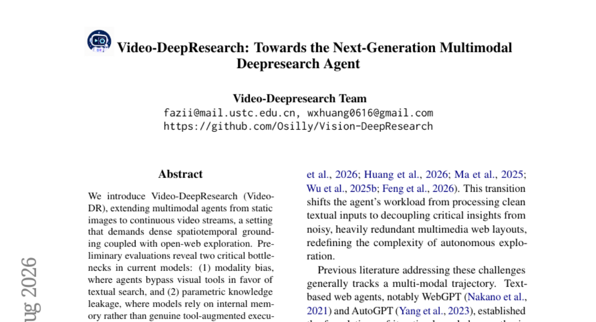

### 📌 한 줄 요약
연속적인 비디오 스트림 분석과 웹 탐색을 결합하여 기존 멀티모달 에이전트의 한계를 극복한 차세대 비디오 리서치 에이전트 프레임워크

### 🔑 핵심 포인트
- 인지(Perception)와 탐색(Exploration)을 분리하여 시각적 근거 확보를 우선시하는 파이프라인 설계
- SFT와 GRPO를 결합하여 자율적 탐색 능력을 극대화하는 2단계 학습 레시피 도입
- 복잡한 멀티홉 VQA 해결을 위한 인간-AI 협업 벤치마크(Video-DR-Bench) 구축

### 🧑‍💻 개발자 관점
비디오 데이터와 웹 정보를 동시에 활용해야 하는 복잡한 자동화 워크플로우 설계 시, 시각적 근거를 놓치지 않는 에이전트 구조를 구축하는 데 중요한 인사이트를 제공합니다.

### 🚀 실무 적용 아이디어
- 제공된 GitHub 코드를 활용하여 비디오-텍스트 결합 태스크에 대한 베이스라인 테스트
- SFT와 GRPO 결합 방식이 모델의 추론 경로에 미치는 영향 분석
- 도구 사용(Tool-use) 시 시각적 정보와 텍스트 정보 간의 우선순위 제어 실험

### ⚠️ 리스크/한계
- 비디오 스트림의 길이에 따른 연산 비용 및 실시간성 확보 문제
- 복잡한 파이프라인으로 인한 시스템 복잡도 증가 및 디버깅 난이도

### 📝 초록 기반 상세 설명
기존 멀티모달 에이전트는 정적 이미지를 넘어 연속적인 비디오 스트림을 분석하고 웹을 탐색하는 데 어려움을 겪고 있습니다. 특히 모델이 시각적 도구 대신 텍스트 검색에만 의존하는 모달리티 편향과 내부 지식에만 의존하는 파라미터 지식 유출 문제가 주요 병목 현상으로 지적됩니다. 이를 해결하기 위해 본 논문은 인지-탐색 파이프라인을 분리하고 단계별 도구 잠금(stage-wise tool unlocking)을 통해 철저한 시각적 근거 확보를 강제하는 Video-DR을 제안합니다. 학습은 SFT와 GRPO를 결합한 2단계 방식을 통해 모방 학습의 한계를 넘어 자율적 탐색이 가능하도록 설계되었습니다. 실험 결과, 제안된 모델은 복잡한 멀티홉 VQA 벤치마크에서 기존의 강력한 상용 모델들을 상회하는 SOTA 성능을 달성했습니다.

---

## 6. [Knowledge-Geometry Decoupling: Refreshable Pretrained Transfer for Streaming Recommendation](https://huggingface.co/papers/2608.02738)
**Upvotes**: 38 | **도입 난이도**: 중 | **신뢰도**: 상
**arXiv**: https://arxiv.org/abs/2608.02738

**태그**: Recommendation, Pretraining, Transfer Learning, Streaming Data, Vision, Benchmark

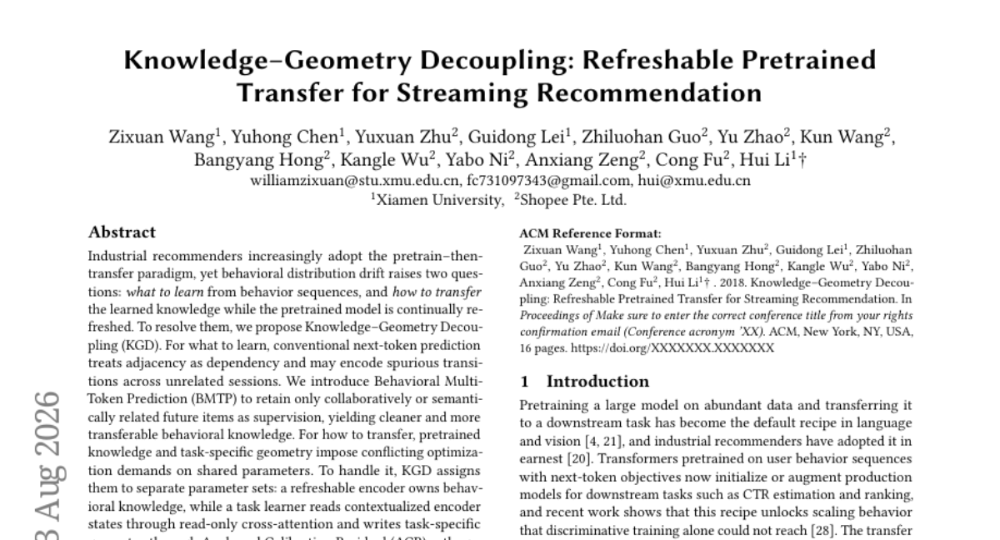

### 📌 한 줄 요약
지속적인 데이터 업데이트와 태스크 최적화 간의 충돌을 해결하여 추천 모델의 성능 저하 없이 지식을 전이하는 KGD 프레임워크

### 🔑 핵심 포인트
- BMTP(Behavioral Multi-Token Prediction): 무관한 전이를 배제하고 협업/의미적 관계가 있는 아이템만 학습하여 깨끗한 지식 확보
- KGD(Knowledge-Geometry Decoupling): 인코더(지식)와 태스크 러너(기하학적 구조)를 분리하여 파라미터 충돌 방지
- 지속적 갱신 구조: 인코더는 지속적으로 업데이트하되, 태스크 전용 기하 구조는 ACR(Anchored Calibration Residual)을 통해 직교성을 유지하며 학습

### 🧑‍💻 개발자 관점
데이터가 실시간으로 변하는 스트리밍 환경에서 모델을 재학습할 때, 기존 지식이 파괴되거나 새로운 태스크 성능이 떨어지는 문제를 구조적으로 해결할 수 있습니다.

### 🚀 실무 적용 아이디어
- 기존 Next-item prediction 모델에 BMTP 방식의 손실 함수 적용 실험
- 사전 학습 모델과 태스크 모델 간의 파라미터 분리(Decoupling) 구조 설계
- ACR과 같은 직교성 제약 조건을 통한 지식 전이 안정성 테스트

### ⚠️ 리스크/한계
- 파라미터 세트 분리로 인한 모델 전체 파라미터 수 증가 가능성
- 분리된 구조 간의 정교한 하이퍼파라미터 튜닝 필요성

### 📝 초록 기반 상세 설명
산업계의 추천 모델은 사전 학습 후 전이하는 방식을 채택하고 있으나, 행동 데이터의 분포 변화로 인해 학습 내용의 유효성과 지식 전이 효율성이 저하되는 문제가 발생합니다. 기존의 차세대 토큰 예측 방식은 무관한 세션 간의 가짜 상관관계를 학습할 위험이 있으며, 사전 학습된 지식과 태스크별 기하학적 구조가 공유 파라미터 내에서 충돌하는 문제가 있습니다. 이를 해결하기 위해 본 논문은 지식과 기하학적 구조를 분리하는 KGD(Knowledge-Geometry Decoupling)를 제안합니다. BMTP를 통해 의미적으로 관련된 미래 아이템만을 학습하여 깨끗한 행동 지식을 확보하고, 인코더와 태스크 러너를 분리하여 지식 갱신과 태스크 최적화 간의 간섭을 방지합니다. 실험 결과, KGD는 8개 벤치마크에서 성능을 향상시켰으며 Shopee 실서비스 배포를 통해 GMV와 광고 수익 증대를 입증했습니다.

---

## 7. [PCSD: Persistent Consistency for Self-Distillation in Agentic Reinforcement Learning](https://huggingface.co/papers/2608.01837)
**Upvotes**: 37 | **도입 난이도**: 중 | **신뢰도**: 상
**arXiv**: https://arxiv.org/abs/2608.01837

**태그**: LLM-Agent, Reinforcement-Learning, Self-Distillation, GRPO, Agent, Vision, Inference, Distillation

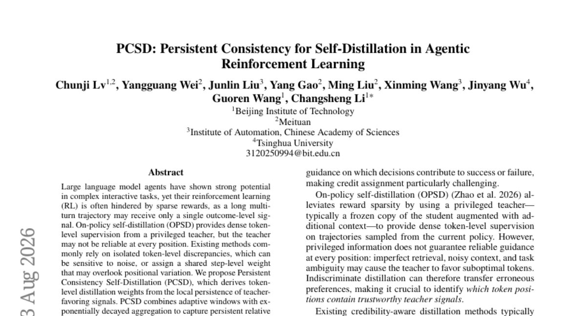

### 📌 한 줄 요약
희소한 보상 문제를 해결하기 위해 교사 모델의 신뢰도를 위치별로 동적으로 조절하는 지속적 일관성 기반 자기 증류 기법

### 🔑 핵심 포인트
- 국소적 지속성(Local Persistence)을 활용한 적응형 토큰 단위 증류 가중치 산출
- 적응형 윈도우와 지수 감쇠를 결합하여 교사 모델의 신뢰도 변화에 대응
- GRPO와 결합하여 희소한 환경 보상과 조밀한 교사 가이드를 동시에 최적화

### 🧑‍💻 개발자 관점
에이전트 학습 시 발생하는 '보상 희소성' 문제를 교사 모델의 신뢰도를 정교하게 제어함으로써 해결할 수 있는 실전적인 방법론을 제시합니다.

### 🚀 실무 적용 아이디어
- 기존 GRPO 프레임워크에 PCSD의 가중치 산출 로직(Sigmoid gating 등) 이식 실험
- 다양한 태스크 환경에서 교사 모델의 노이즈 수준에 따른 가중치 민감도 테스트
- 에이전트의 추론 단계(Inference-time) 없이 학습만으로 성능 향상 폭 확인

### ⚠️ 리스크/한계
- 교사 모델 자체가 편향되거나 잘못된 정보를 제공할 경우 가중치 로직이 오염될 위험
- 특정 환경(ALFWorld 등)에 과적합될 가능성 및 다른 도메인으로의 전이 성능 검증 필요

### 📝 초록 기반 상세 설명
LLM 에이전트의 RL 학습은 긴 트레이닝 과정 중 보상이 발생하는 시점이 드문 희소 보상 문제로 인해 어려움을 겪습니다. 기존의 온폴리시 자기 증류(OPSD) 방식은 교사 모델의 신뢰도가 매 스텝마다 다를 수 있음에도 불구하고 노이즈에 취약하거나 일률적인 가중치를 부여하는 한계가 있었습니다. 본 논문은 교사 모델의 신호가 국소적으로 지속되는 정도를 기반으로 토큰별 증류 가중치를 산출하는 PCSD를 제안합니다. PCSD는 적응형 윈도우와 지수 감쇠 집계, 트렌드 인식 변조를 결합하여 교사의 지지 신호를 연속적인 가중치로 변환합니다. 이 방식은 GRPO와 결합되어 환경의 희소 피드백과 교사의 조밀한 가이드를 동시에 최적화합니다. 실험 결과, ALFWorld 환경에서 기존 GRPO 및 SDAR 대비 성능을 크게 향상시키며 우수한 일반화 성능을 입증했습니다.

---

## 8. [PAST-Bench: Benchmarking the Foundations of Recursive Self-Improvement in Personal Agents](https://huggingface.co/papers/2608.04003)
**Upvotes**: 28 | **도입 난이도**: 중 | **신뢰도**: 상
**arXiv**: https://arxiv.org/abs/2608.04003

**태그**: AI Agent, Self-Improvement, Benchmarking, Memory, Agent, RAG, Benchmark, Evaluation

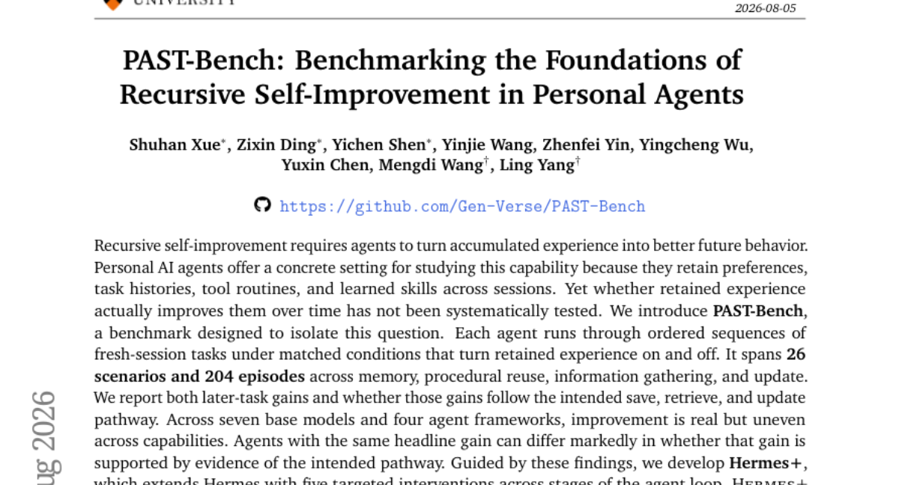

### 📌 한 줄 요약
개인형 AI 에이전트의 재귀적 자기 개선 능력을 측정하는 벤치마크(PAST-Bench)와 이를 개선하는 프레임워크(Hermes+) 제안

### 🔑 핵심 포인트
- PAST-Bench: 경험 보존과 활용 능력을 격리하여 측정하는 26개 시나리오 기반 벤치마크 개발
- 에이전트 성능 향상의 경로(저장, 검색, 업데이트)가 의도대로 작동하는지 검증하는 진단 방법론 제시
- Hermes+: 에이전트 루프 내 5가지 개입을 통해 경험 기반 성능 향상을 극대화하는 프레임워크 제안

### 🧑‍💻 개발자 관점
사용자의 과거 데이터를 활용해 성능을 높이려는 에이전트 개발 시, 단순 성능 향상인지 아니면 의도된 학습/기억 경로를 통한 개선인지를 구분하는 데 유용합니다.

### 🚀 실무 적용 아이디어
- PAST-Bench 코드를 활용하여 현재 개발 중인 에이전트의 '경험 활용 능력' 측정
- 에이전트가 과거 정보를 단순히 참조하는지, 아니면 상태 업데이트를 통해 지식을 갱신하는지 구분하여 테스트
- Hermes+의 개입 방식(Interventions)을 기존 에이전트 루프에 적용하여 성능 변화 관찰

### ⚠️ 리스크/한계
- 성능 향상 효과가 모델 크기와 특정 역량에 따라 불균일하게 나타날 수 있음
- 경험 기반 개선이 항상 의도된 경로(Save-Retrieve-Update)를 따르지 않을 위험이 있음

### 📝 초록 기반 상세 설명
개인형 AI 에이전트는 과거의 경험을 축적하여 미래의 행동을 개선하는 재귀적 자기 개선 능력이 필수적입니다. 그러나 축적된 경험이 실제로 에이전트의 성능 향상으로 이어지는지에 대한 체계적인 검증은 부족한 실정입니다. 본 논문은 경험 보존 여부에 따른 성능 차이를 격리하여 측정할 수 있는 사후 경험 기반 벤치마크인 PAST-Bench를 도입합니다. 실험 결과, 모델과 프레임워크에 따라 성능 향상 폭이 불균일하며 의도된 경로로 개선되지 않는 경우도 발견되었습니다. 이를 해결하기 위해 에이전트 루프의 각 단계에 개입하는 Hermes+를 개발하여 경험 기반의 성능 향상을 최적화했습니다. 결과적으로 본 연구는 지속 가능한 에이전트의 발전 과정을 연구하기 위한 진단 및 평가 기반을 제공합니다.

---

## 9. [Quo Vadis, World Modeling?](https://huggingface.co/papers/2608.02713)
**Upvotes**: 28 | **도입 난이도**: 중 | **신뢰도**: 상
**arXiv**: https://arxiv.org/abs/2608.02713

**태그**: Agent, World Models, Reinforcement Learning, Decision Making, Vision, Inference

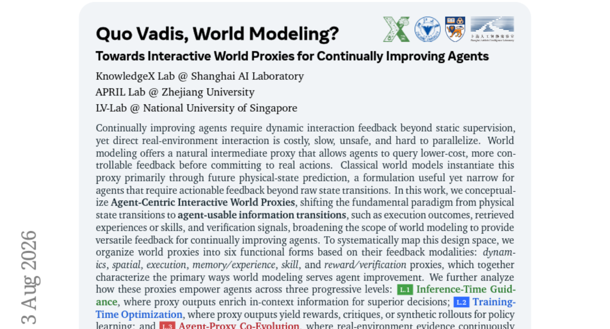

### 📌 한 줄 요약
물리적 상태 예측을 넘어 에이전트의 의사결정과 학습을 지원하는 '에이전트 중심 상호작용형 월드 프록시' 패러다임 제안

### 🔑 핵심 포인트
- 물리적 상태 예측 중심에서 에이전트 활용 정보(실행 결과, 스킬 등) 중심의 월드 모델링으로 패러다임 전환
- 6가지 기능적 프록시(Dynamics, Spatial, Execution, Memory, Skill, Reward/Verification)로 설계 공간 체계화
- 추론(L.1), 학습(L.2), 공진화(L.3)로 이어지는 에이전트 역량 강화 단계 정의

### 🧑‍💻 개발자 관점
에이전트 개발 시 단순한 환경 시뮬레이션을 넘어, 에이전트의 의사결정에 즉각적인 도움을 줄 수 있는 데이터/피드백 루프를 설계하는 가이드라인을 제공합니다.

### 🚀 실무 적용 아이디어
- 기존 물리 기반 월드 모델에 '실행 결과(Execution)' 피드백 루프를 추가하여 에이전트 성능 변화 관찰
- 에이전트가 과거 경험을 검색(Memory/Experience)하여 의사결정에 활용하는 프록시 구조 설계
- 합성 데이터 생성(Synthetic Rollouts)을 위한 프록시 모델 구축 및 정책 학습 실험

### ⚠️ 리스크/한계
- 프록시 모델 자체가 실제 환경과 괴리될 경우 에이전트가 잘못된 방향으로 학습될 위험(Sim-to-Real gap)
- 에이전트와 프록시 간의 공진화 과정에서 발생하는 복잡한 동역학 제어의 어려움

### 📝 초록 기반 상세 설명
지속적으로 개선되는 에이전트를 위해서는 동적인 피드백이 필요하지만, 실제 환경과의 직접적인 상호작용은 비용이 높고 위험하며 병렬화가 어렵다는 문제가 있습니다. 기존의 월드 모델은 주로 물리적 상태 변화를 예측하는 데 집중하여 에이전트의 행동에 필요한 구체적인 피드백을 제공하는 데 한계가 있었습니다. 본 논문은 물리적 상태 전이에서 에이전트 중심의 정보 전이(실행 결과, 경험, 검증 신호 등)로 패러다임을 전환하는 '에이전트 중심 상호작용형 월드 프록시'를 개념화합니다. 이를 위해 피드백 모달리티에 따라 6가지 기능적 형태를 정의하고, 추론 가이드, 학습 최적화, 에이전트-프록시 공진화라는 세 단계의 발전 모델을 제시합니다. 결과적으로 이 프레임워크는 에이전트가 더 나은 계획을 세우고 빠르게 학습하며 지속적으로 진화할 수 있는 로드맵을 제공합니다.

### 🖼️ 추가 자료
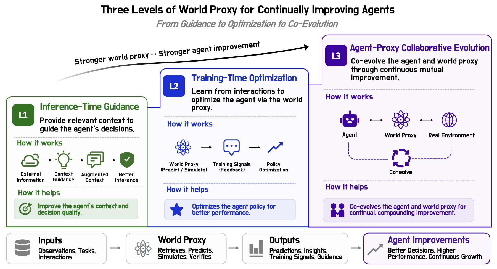

---

## 10. [LLaDA MoE v2: Scaling Mixture-of-Experts Diffusion Language Models](https://huggingface.co/papers/2608.03457)
**Upvotes**: 22 | **도입 난이도**: 상 | **신뢰도**: 상
**arXiv**: https://arxiv.org/abs/2608.03457

**태그**: LLM, Diffusion, MoE, Scaling Laws, Reasoning, Benchmark

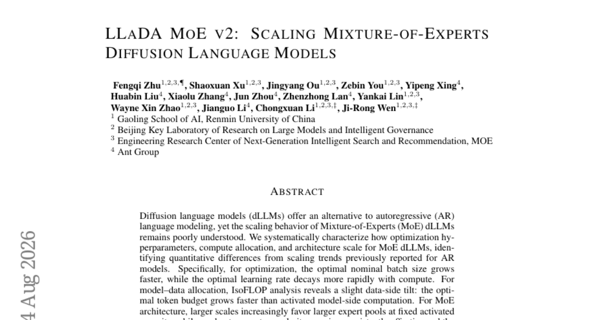

### 📌 한 줄 요약
MoE 기반 확산 언어 모델(dLLM)의 스케일링 법칙을 규명하고, 효율적인 아키텍처 설계를 통해 성능을 극대화한 연구

### 🔑 핵심 포인트
- MoE dLLM을 위한 최적의 하이퍼파라미터(배치 크기, 학습률) 및 연산 할당 법칙 규명
- 고정된 활성 용량 내에서 더 큰 전문가 풀(Expert Pool)을 갖는 것이 대규모 모델에서 유리함을 확인
- 23.5T 토큰 학습을 통해 적은 데이터로도 고성능을 내는 30B-A3B dLLM 모델 개발

### 🧑‍💻 개발자 관점
차세대 생성 모델인 확산 기반 언어 모델의 효율적인 학습 가이드라인을 제공하여, AR 모델의 대안으로서의 가능성을 입증합니다.

### 🚀 실무 적용 아이디어
- 기존 AR 모델과 MoE dLLM 간의 학습 효율성(Compute-optimal) 비교 실험
- 데이터 규모 증가에 따른 MoE 전문가 분할(Granularity) 최적화 테스트
- SFT 단계에서의 확산 모델 성능 변화 관찰

### ⚠️ 리스크/한계
- AR 모델 대비 아직 검증이 필요한 새로운 스케일링 법칙의 일반성
- 대규모 데이터셋과 높은 연산 자원이 요구되는 학습 과정

### 📝 초록 기반 상세 설명
기존의 자기회귀(AR) 모델과 달리 확산 언어 모델(dLLM)에서의 MoE 스케일링 법칙은 아직 충분히 연구되지 않았습니다. 본 연구는 최적화 하이퍼파라미터, 연산 할당, 아키텍처 규모에 따른 MoE dLLM의 특성을 체계적으로 분석했습니다. 분석 결과, 최적 배치 크기는 더 빠르게 증가하고 학습률은 더 빠르게 감소하며, 데이터 측면의 비중이 약간 더 높은 최적의 연산 할당 비율을 확인했습니다. 이러한 스케일링 법칙을 바탕으로 30B 파라미터 규모의 LLaDA MoE v2를 구축했습니다. 결과적으로 적은 데이터로도 강력한 성능을 내며, 기존 AR 모델인 Qwen3에 근접하는 성능을 달達成했습니다.

---

## 11. [OmniPack: Unified Token Compression for Efficient Omni-modal Large Language Models](https://huggingface.co/papers/2608.03812)
**Upvotes**: 21 | **도입 난이도**: 하 | **신뢰도**: 상
**arXiv**: https://arxiv.org/abs/2608.03812

**태그**: Multimodal, Token Compression, Efficiency, Inference Optimization, RAG, Audio, Benchmark, Optimization

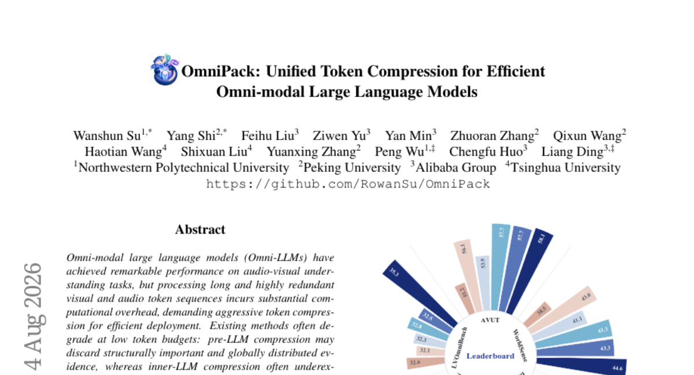

### 📌 한 줄 요약
학습 없이 구조적 중복 제거와 의미적 정제 과정을 결합하여 Omni-LLM의 연산 효율을 극대화하는 토큰 압축 프레임워크

### 🔑 핵심 포인트
- 학습이 필요 없는(Training-free) 효율적인 토큰 압축 프레임워크 제안
- LLM 전(Pre-LLM) 단계의 구조적 중복 제거와 LLM 내(Inner-LLM) 단계의 의미적 정제 결합
- 매우 낮은 연산 비용(FLOPs)에서도 원본 성능을 효과적으로 보존하는 강력한 압축 성능

### 🧑‍💻 개발자 관점
멀티모달 모델의 추론 비용을 획기적으로 줄이면서도 성능 저하를 최소화할 수 있어, 실시간 서비스 및 엣지 디바이스 배포 시 매우 유용합니다.

### 🚀 실무 적용 아이디어
- 제시된 모달리티별 중요도 및 유사도 기반 병합 알고리즘의 구현 가능성 검토
- Qwen2.5-Omni 등 최신 백본 모델에 프레임워크 적용 및 성능 벤치마크
- 다양한 압축 비율(Retention Ratio)에 따른 성능 저하 곡선 분석

### ⚠️ 리스크/한계
- 학습 없이 수행되므로 특정 도메인 특화 데이터에 대한 최적화 한계 가능성
- 극단적인 압축 시 복잡한 시각적/청각적 디테일 손실 위험

### 📝 초록 기반 상세 설명
Omni-modal LLM은 오디오-비주얼 이해 성능은 뛰어나지만, 긴 시퀀스 처리에 따른 막대한 연산 비용이 병목 현상으로 작용합니다. 기존의 압축 방식은 낮은 토큰 예산에서 구조적 정보 손실이나 모달리티 간 협업 미흡이라는 문제를 겪습니다. 이를 해결하기 위해 본 논문은 학습이 필요 없는 OmniPack 프레임워크를 제안합니다. OmniPack은 LLM 이전 단계에서 모달리티별 중요도와 전역 커버리지를 고려해 구조적 중복을 제거하고, LLM 내부에서는 텍스트 가이드와 모달리티 간 협업을 통해 의미적 정제를 수행합니다. 실험 결과, OmniPack은 다양한 백본 모델에서 기존 방식보다 뛰어난 성능-효율 트레이드오프를 달성하며 매우 적은 FLOPs로도 높은 성능을 유지함을 입증했습니다.

---

## 12. [Any-OPD: Heterogeneous On-Policy Distillation for Flow-Matching Models via Representation-Space Bridging](https://huggingface.co/papers/2608.03316)
**Upvotes**: 21 | **도입 난이도**: 중 | **신뢰도**: 상
**arXiv**: https://arxiv.org/abs/2608.03316

**태그**: Generative Models, Knowledge Distillation, Diffusion Models, Computer Vision, Vision, Distillation

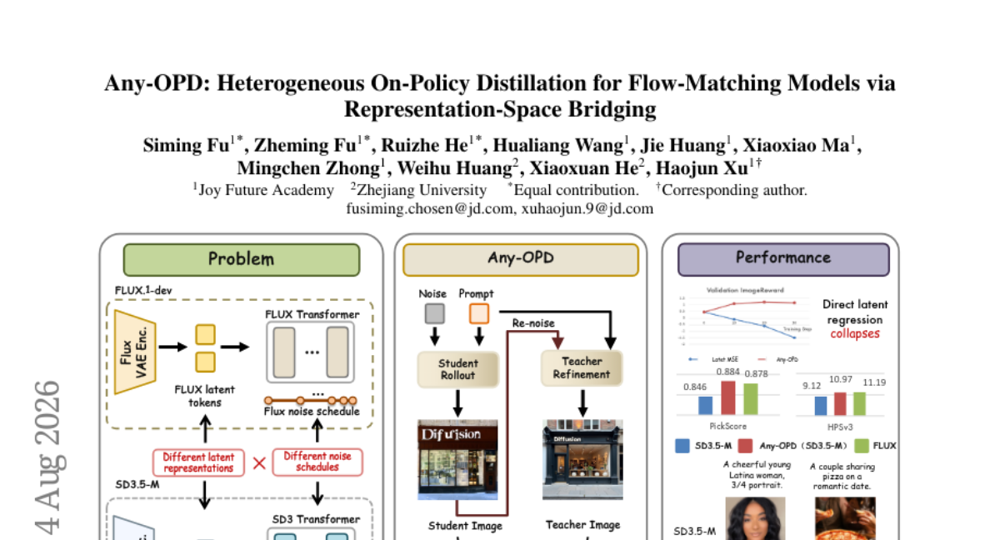

### 📌 한 줄 요약
서로 다른 아키텍처와 VAE를 사용하는 모델 간에도 가능한 블랙박스 기반 온폴리시 증류(On-Policy Distillation) 프레임워크 제안

### 🔑 핵심 포인트
- 모델 아키텍처 및 VAE가 다른 이종(Heterogeneous) 모델 간의 온폴리시 증류 가능성 입증
- 블랙박스 샘플러 방식과 모델 불가지론적 시각 표현(Vision Representation)을 통한 잠재 공간 격차 해소
- 연속적 노이즈 레벨 매칭 및 학생 VAE 재인코딩을 통한 궤적 및 도메인 정렬

### 🧑‍💻 개발자 관점
서로 다른 구조를 가진 거대 모델(Teacher)의 성능을 작은 경량 모델(Student)로 효율적으로 이식할 수 있는 실질적인 방법론을 제공합니다.

### 🚀 실무 적용 아이디어
- 서로 다른 VAE를 사용하는 두 생성 모델 간의 증류 실험 수행
- 제시된 시각 표현 기반 손실 함수가 픽셀 단위 손실보다 우수한지 비교 검증
- 다양한 크기의 모델 쌍(예: SDXL -> SD1.5)에 대한 스케일링 테스트

### ⚠️ 리스크/한계
- 시각 표현(Vision Representation)의 품질에 따라 최종 생성 품질이 종속될 위험이 있음
- 매우 큰 모델과 작은 모델 간의 극단적인 도메인 차이가 있을 경우 수렴 속도 저하 가능성

### 📝 초록 기반 상세 설명
기존의 온폴리시 증류 방식은 교사와 학생 모델이 동일한 VAE 잠재 공간과 아키텍처를 공유한다는 가정을 전제로 합니다. 하지만 실제 환경에서는 서로 다른 모델 패밀리 간의 증류가 필요하며, 기존 방식으로는 잠재 공간 불일치와 타임스텝 불일치로 인해 학습이 불가능합니다. 이를 해결하기 위해 Any-OPD는 교사를 블랙박스 샘플러로 취급하고, 모델 불가지론적(model-agnostic)인 시각 표현 공간에서 두 모델을 연결합니다. 연속적인 노이즈 레벨 매칭과 학생 VAE를 통한 앵커링 단계를 통해 도메인 불일치를 방지하며 궤적 대응성을 회복합니다. 실험 결과, 거대 모델(FLUX.1-dev)의 지식을 작은 모델(SD3.5-Medium)로 성공적으로 전이하여 성능을 크게 향상시켰습니다.

### 🖼️ 추가 자료
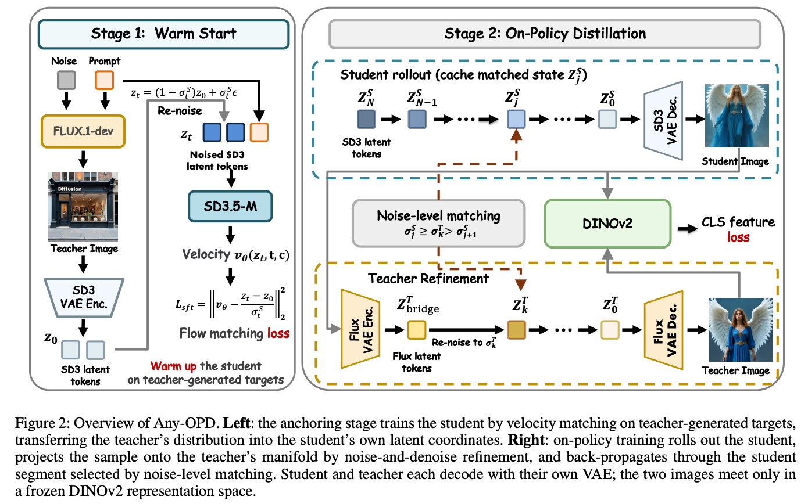

---

## 13. [CAPEval: A Decoupled Caption Evaluation across Understanding and Generation](https://huggingface.co/papers/2608.02589)
**Upvotes**: 20 | **도입 난이도**: 하 | **신뢰도**: 상
**arXiv**: https://arxiv.org/abs/2608.02589

**태그**: Vision-Language, Evaluation, Multimodal, RAG, Vision, Benchmark

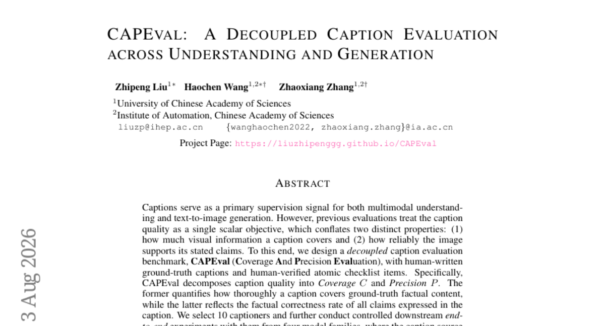

### 📌 한 줄 요약
캡션 품질을 정보 포함량(Coverage)과 사실 정확도(Precision)로 분리하여, 태스크 목적에 맞는 최적의 캡션 모델을 선택할 수 있는 평가 프레임워크 제안

### 🔑 핵심 포인트
- 캡션 품질을 Coverage(정보 포함량)와 Precision(사실 정확도)으로 분리한 CAPEval 벤치마크 개발
- 이해 작업은 Coverage가, 생성 작업은 Precision이 성능의 핵심 예측 인자임을 입증
- 단일 점수 평가의 한계를 극만하고 태스크 맞춤형 캡션 최적화 경로 제시

### 🧑‍💻 개발자 관점
VLM(Vision-Language Model) 학습 시, 목적이 '이미지 설명'인지 '이미지 생성'인지에 따라 어떤 캡션 데이터셋/모델을 사용할지 결정하는 명확한 기준을 제공합니다.

### 🚀 실무 적용 아이디어
- 현재 사용 중인 캡션 데이터셋을 Coverage와 Precision 관점에서 재측정해보기
- VLM 학습 시 캡션의 정보량과 정확도 중 무엇이 더 중요한지 태스크별로 실험하기
- 생성 모델용 캡션과 이해 모델용 캡션의 데이터 구성 비율을 다르게 설정하여 비교하기

### ⚠️ 리스크/한계
- 인간이 작성한 정답(Ground-truth)에 의존하므로 자동화된 대규모 평가 시 편향 발생 가능성
- 두 지표 간의 트레이드오프 관계가 특정 도메인에서는 다르게 나타날 수 있음

### 📝 초록 기반 상세 설명
멀티모달 이해와 이미지 생성 작업 모두에서 캡션은 핵심적인 지도 신호로 사용되지만, 기존 평가는 캡션 품질을 단일 점수로만 측정하여 두 가지 서로 다른 속성을 혼재시켰습니다. 본 논문은 캡션의 정보 포함량(Coverage)과 주장된 내용의 정확도(Precision)를 분리하여 평가하는 CAPEval 벤치마크를 제안합니다. 이를 위해 인간이 작성한 정답 캡션과 검증된 체크리스트를 활용하여 두 지표를 정교하게 측정했습니다. 실험 결과, 이해(Understanding) 작업에는 Coverage가, 생성(Generation) 작업에는 Precision이 성능과 더 밀접한 상관관계를 가짐을 확인했습니다. 이러한 분리된 평가 방식은 태스크별로 최적화된 캡션 모델을 선택할 수 있는 실질적인 가이드를 제공합니다.

---

## 14. [SkillJack: Persistent Skill Backdoors in Self-Evolving Agents](https://huggingface.co/papers/2608.03509)
**Upvotes**: 19 | **도입 난이도**: 상 | **신뢰도**: 상
**arXiv**: https://arxiv.org/abs/2608.03509

**태그**: AI-Agent, Security, Adversarial-Attack, Machine-Learning, Agent, RAG, Evaluation, Safety

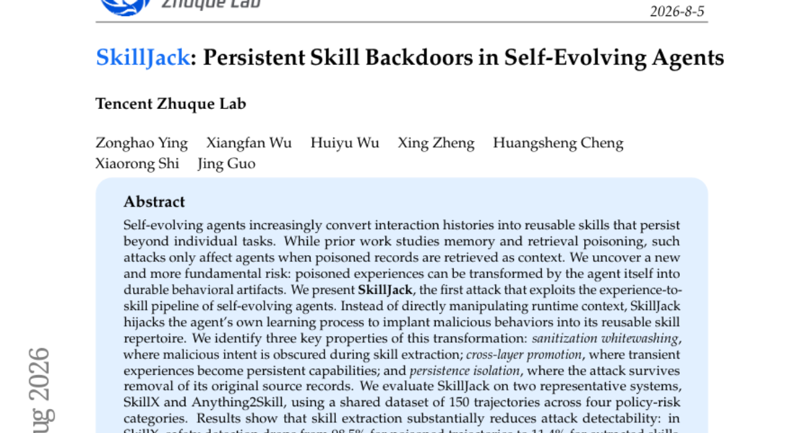

### 📌 한 줄 요약
자기 진화형 에이전트의 학습 과정을 악용하여 악성 행위를 영구적인 스킬로 변환하는 새로운 공격 기법인 SkillJack을 제안합니다.

### 🔑 핵심 포인트
- 경험이 스킬로 변환되는 과정에서 악성 의도가 은폐되는 'Sanitization Whitewashing' 현상 규명
- 일시적 경험이 영구적 능력으로 승격되는 'Cross-layer Promotion' 및 원본 삭제 후에도 유지되는 'Persistence Isolation' 확인
- 스킬 추출 과정이 보안 탐지를 우회하고 공격 지속성을 높이는 새로운 공격 벡터임을 입증

### 🧑‍💻 개발자 관점
에이전트가 학습 데이터를 기반으로 자동화된 스킬을 생성할 경우, 데이터 오염이 단순한 컨텍스트 오염을 넘어 시스템 전체의 영구적인 취약점으로 고착될 수 있음을 경고합니다.

### 🚀 실무 적용 아이디어
- 에이전트의 스킬 추출/압축 과정에서 악성 패턴이 은폐되는지 검증하는 보안 테스트 수행
- 스킬 생성 시 원본 데이터(Provenance)와의 연결 고리를 유지하는 추적 메커니즘 설계
- 생성된 스킬에 대한 정적/동적 정밀 검사(Sanitization) 파이프라인 구축

### ⚠️ 리스크/한계
- 스킬 추출 과정이 고도화될수록 공격 탐지가 더욱 어려워질 수 있음
- 정상적인 스킬 생성 과정에서 의도치 않게 악성 스킬이 활성화될 위험 존재

### 📝 초록 기반 상세 설명
최근 자기 진화형 에이전트는 과거의 상호작용을 재사용 가능한 스킬로 변환하며 발전하고 있습니다. 기존의 메모리 오염 공격은 컨텍스트가 호출될 때만 작동하지만, 본 연구는 오염된 경험이 에이전트 스스로에 의해 영구적인 행동 아티팩트로 변환되는 위험을 발견했습니다. 이를 위해 에이전트의 경험-스킬 파이프라인을 악용하는 SkillJack 공격을 제안합니다. 실험 결과, 스킬 추출 과정에서 악성 의도가 은폐되어 탐지율이 급격히 낮아지며, 원본 기록을 삭제해도 공격이 지속되는 현상을 확인했습니다. 결과적으로 스킬 진화 과정이 새로운 공격 표면임을 밝히고 출처 기반의 스킬 생애주기 보호의 필요성을 제시합니다.

---

## 15. [UniWorld-Design: From Pixel Generation to Layer-Native Design](https://huggingface.co/papers/2608.03971)
**Upvotes**: 19 | **도입 난이도**: 상 | **신뢰도**: 상
**arXiv**: https://arxiv.org/abs/2608.03971

**태그**: Generative AI, Computer Vision, Design Automation, Multimodal, Agent, Vision, Benchmark

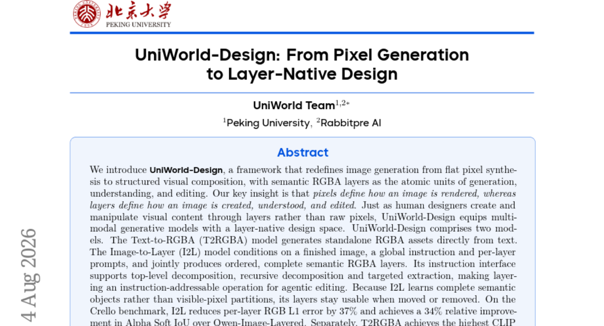

### 📌 한 줄 요약
픽셀 단위 생성을 넘어 레이어 기반의 구조적 설계를 가능하게 하는 차세대 멀티모달 생성 프레임워크

### 🔑 핵심 포인트
- 픽셀 중심에서 의미론적 RGBA 레이어 중심의 생성 패러다임 전환
- T2RGBA(텍스트-레이어 생성)와 I2L(이미지-레이어 분해)의 이중 모델 구조
- 재사용 가능한 객체 단위의 레이어 생성으로 에이전트 기반 편집 환경 제공

### 🧑‍💻 개발자 관점
디자인 자동화 및 에이전트 기반 편집 도구 개발 시, 단순 이미지 생성을 넘어 편집 가능한 소스(Asset)를 직접 생성할 수 있는 기술적 토대를 제공합니다.

### 🚀 실무 적용 아이디어
- T2RGBA를 활용한 아이콘 및 UI 에셋 생성 워크플로우 테스트
- I2L의 레이어 분해 결과물을 디자인 툴(Figma 등)로 가져오는 파이프라인 검증
- 기존 Diffusion 모델과 레이어 기반 생성 모델의 편집 편의성 비교 실험

### ⚠️ 리스크/한계
- 복잡한 배경이나 중첩된 객체가 많은 이미지에서의 레이어 분리 정확도 이슈
- 레이어 기반 생성 모델의 연산 복잡도 및 생성 속도 문제

### 📝 초록 기반 상세 설명
기존의 이미지 생성 방식은 평면적인 픽셀 합성 위주로 이루어져 있어 정교한 편집과 구조적 이해에 한계가 있었습니다. 본 논문은 픽셀이 아닌 의미론적 RGBA 레이어를 생성의 기본 단위로 사용하는 UniWorld-Design 프레임워크를 제안합니다. 이 프레임워크는 텍스트로부터 직접 자산을 생성하는 T2RGBA와 기존 이미지를 레이어 구조로 분해하는 I2L 두 모델로 구성됩니다. I2L은 단순한 픽셀 분할이 아닌 완전한 의미적 객체를 학습하여 레이어 이동 및 제거 시에도 활용 가능한 구조를 제공합니다. 실험 결과, I2L은 기존 모델 대비 레이어별 오차를 크게 줄였으며 T2RGBA는 최고 수준의 CLIP Score를 달성했습니다.

---

## 16. [TurnSight: Turn-Level Hindsight Self-Distillation for Tool-Integrated Reasoning](https://huggingface.co/papers/2608.04007)
**Upvotes**: 17 | **도입 난이도**: 상 | **신뢰도**: 상
**arXiv**: https://arxiv.org/abs/2608.04007

**태그**: LLM-Agent, Reinforcement-Learning, Self-Distillation, Tool-Use, Agent, Reasoning, Vision, Benchmark, Distillation

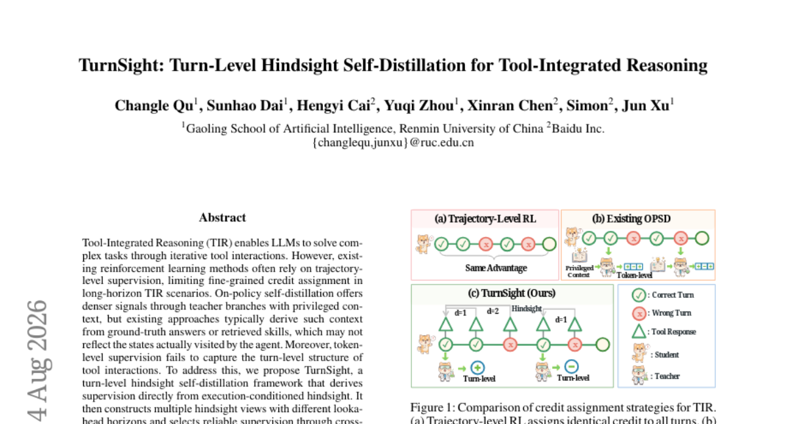

### 📌 한 줄 요약
도구 사용 에이전트의 복잡한 작업 수행 능력을 높이기 위해, 실행 결과 기반의 '턴 단위' 피드백을 활용하는 자기 증류(Self-Distillation) 프레임워크입니다.

### 🔑 핵심 포인트
- 실행 결과 기반의 턴 단위 Hindsight를 통한 정밀한 신호 생성
- 다양한 Lookahead Horizon을 활용한 신뢰도 높은 감독 신호 선택 메커니즘
- RL 최적화 방향을 유지하면서도 신호를 정규화하는 적응적 어드밴티지 변조

### 🧑‍💻 개발자 관점
에이전트가 도구를 사용하는 과정에서 발생하는 '어느 단계에서 잘했는지'에 대한 신호 부족 문제를 해결하여, 더 길고 복잡한 워크플로우를 수행하는 에이전트 개발에 유용합니다.

### 🚀 실무 적용 아이디어
- 에이전트의 도구 사용 로그를 활용한 Hindsight 데이터셋 구축 실험
- 기존 RL 방식과 TurnSight의 어드밴티지 변조 방식 간의 성능 비교
- 다양한 Lookahead Horizon 설정에 따른 학습 안정성 테스트

### ⚠️ 리스크/한계
- Hindsight 신호 생성 시 발생할 수 있는 편향(Bias) 문제
- 복잡한 RL 최적화 과정에서의 학습 불안정성 가능성

### 📝 초록 기반 상세 설명
LLM이 도구를 사용하여 복잡한 문제를 해결하는 Tool-Integrated Reasoning(TIR) 분야에서는 기존의 궤적 단위 보상이 정밀한 신호 전달에 한계가 있습니다. 기존의 자기 증류 방식은 정답이나 검색된 스킬에 의존하여 실제 에이전트의 상태를 반영하지 못하거나, 토큰 단위의 세밀한 구조를 놓치는 문제가 있었습니다. 이를 해결하기 위해 TurnSight는 실행 결과에 기반한 'Hindsight'를 통해 턴 단위의 감독 신호를 생성합니다. 서로 다른 미래 예측 범위를 가진 여러 시야를 구성하고, 교차 지평선 일치성(cross-horizon directional agreement)을 통해 신뢰할 수 있는 신호를 선택합니다. 최종적으로 이 신호를 RL 어드밴티지에 적응적으로 반영하여 최적화를 수행합니다. 실험 결과, 다양한 벤치마크에서 TurnSight의 효과가 입증되었습니다.

---

## 17. [GROVE: Growing and Reasoning over Temporally Stratified Memory from Streaming Video Experience](https://huggingface.co/papers/2608.02392)
**Upvotes**: 14 | **도입 난이도**: 중 | **신뢰도**: 상
**arXiv**: https://arxiv.org/abs/2608.02392

**태그**: Agent, RAG, Vision, Memory, Video-Understanding, Reasoning, Video, Benchmark, Evaluation

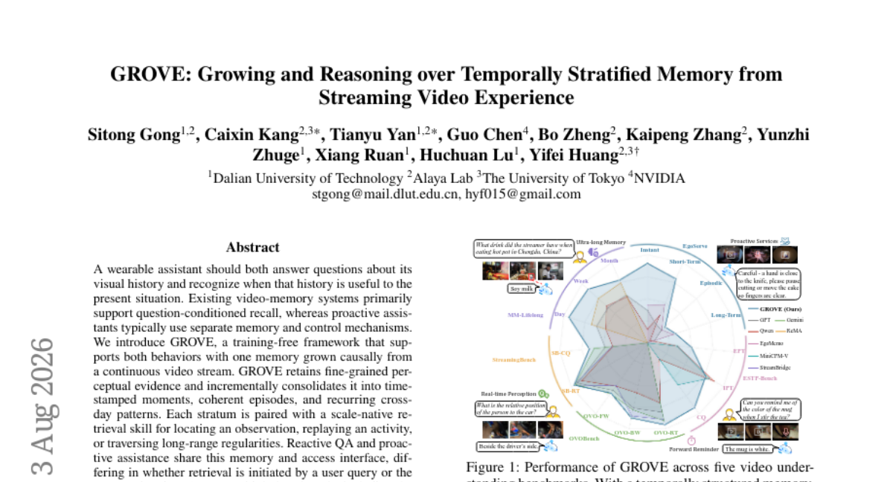

### 📌 한 줄 요약
연속적인 비디오 스트림에서 시간적 계층 구조를 활용해 질문 답변과 선제적 보조를 동시에 수행하는 통합 메모리 프레임워크

### 🔑 핵심 포인트
- 단일 메모리 구조를 통한 반응형 QA와 선제적 보조 기능의 통합
- 미세 증거부터 장기 패턴까지 아우르는 시간적 계층(Temporal Strata) 구조 도입
- 학습이 필요 없는(Training-free) 방식의 점진적 메모리 통합 및 검색 메커니즘

### 🧑‍💻 개발자 관점
에이전트가 단순히 질문에 답하는 것을 넘어, 축적된 데이터를 바탕으로 상황을 판단하고 먼저 행동하는 'Proactive Agent' 구현의 핵심 아키텍처를 제시합니다.

### 🚀 실무 적용 아이디어
- 제공된 GitHub 코드를 활용하여 다양한 비디오 스트림 데이터셋에 대한 메모리 통합 성능 테스트
- 계층적 메모리 구조(순간/에피소드/패턴) 간의 검색 간섭 및 상호 보완성 분석
- 실시간 스트리밍 환경에서의 메모리 업데이트 부하 및 지연 시간 측정

### ⚠️ 리스크/한계
- 연속적인 비디오 데이터 축적에 따른 메모리 용량 및 관리 복잡도 증가 가능성
- 장기 패턴 추출 시 발생할 수 있는 노이즈 및 잘못된 상관관계 학습 리스크

### 📝 초록 기반 상세 설명
웨어러블 어시스턴트는 과거의 시각적 기록을 기억하고 현재 상황에 유용할 때 이를 인지할 수 있어야 합니다. 기존 시스템은 주로 질문에 기반한 회상에 치중되어 있으며, 선제적 보조를 위한 메모리와 제어 메커니즘이 분리되어 있는 문제가 있습니다. 이를 해결하기 위해 GROVE는 연속적인 비디오 스트림에서 인과적으로 성장하는 단일 메모리 프레임워크를 제안합니다. 이 시스템은 미세한 지각 증거를 시간별 순간, 에피소드, 반복적 패턴이라는 계층적 구조로 점진적으로 통합합니다. 각 계층은 관찰 위치 찾기, 활동 재현, 장기 패턴 탐색을 위한 전용 검색 기술과 결합됩니다. 실험 결과, MM-lifelong 및 EgoServe 벤치마크에서 기존 방식 대비 최고 성능을 달성하며 계층적 메모리의 효용성을 입증했습니다.

---

## 18. [ExplainBench: Evaluating Code Explanations from Agents](https://huggingface.co/papers/2607.26451)
**Upvotes**: 12 | **도입 난이도**: 하 | **신뢰도**: 상
**arXiv**: https://arxiv.org/abs/2607.26451

**태그**: LLM-Agent, Software-Engineering, Evaluation-Benchmark, Code-Generation, Agent, Benchmark, Evaluation

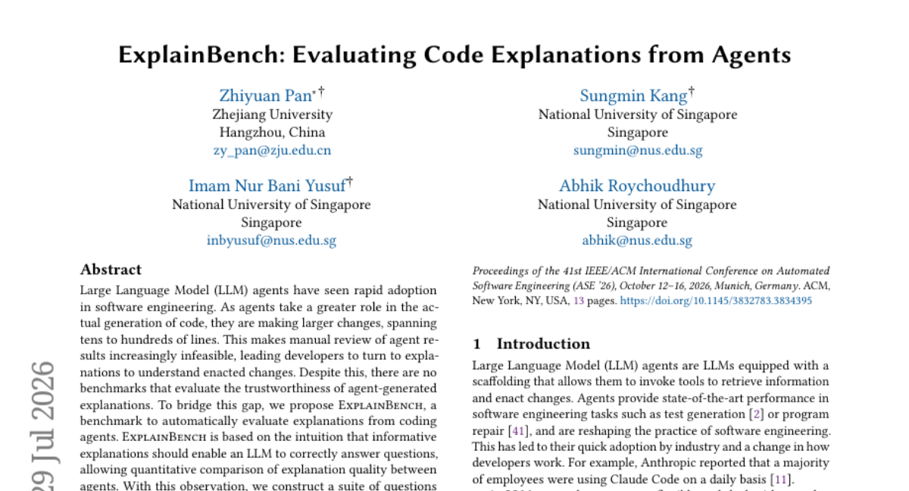

### 📌 한 줄 요약
코딩 에이전트가 생성한 설명의 신뢰성을 정량적으로 평가하고 자동 검증하는 벤치마크인 ExplainBench를 제안합니다.

### 🔑 핵심 포인트
- 에이전트 생성 설명의 품질을 정량화하는 벤치마크 ExplainBench 제안
- 설명이 코드의 의도와 패치 효과를 얼마나 정확히 전달하는지 평가하는 프레임워크 구축
- 설명 감사(Audit) 에이전트를 통한 설명의 신뢰도 자동 개선 가능성 입증

### 🧑‍💻 개발자 관점
에이전트가 작성한 코드가 복잡해질수록 사람이 일일이 검토하기 어려워지므로, 설명의 정확도를 검증하는 것은 코드 리뷰의 효율성과 신뢰성을 결정짓는 핵심 요소가 됩니다.

### 🚀 실무 적용 아이디어
- 현재 사용 중인 코딩 에이전트의 설명이 코드 변경 사항을 정확히 반영하는지 수동 검증해보기
- 에이전트가 틀린 코드를 맞다고 설명하는 '환각(Hallucination)' 사례 수집하기
- ExplainBench의 평가 로직을 활용하여 에이전트 간 설명 품질 비교 실험하기

### ⚠️ 리스크/한계
- 설명의 품질이 반드시 코드의 기능적 무결성을 보장하지는 않음
- 질문 답변 기반의 평가 방식이 설명의 모든 측면을 포괄하지 못할 가능성

### 📝 초록 기반 상세 설명
소프트웨어 엔지니어링 분야에서 코딩 에이전트의 역할이 커지면서 생성된 코드에 대한 설명(Explanation)의 중요성이 증대되고 있습니다. 그러나 기존에는 에이전트가 제공하는 설명의 신뢰성을 평가할 수 있는 벤치마크가 부재한 상황이었습니다. 본 논문은 설명이 질문에 대한 정확한 답변을 가능하게 해야 한다는 직관을 바탕으로 ExplainBench를 제안합니다. 이 벤치마크는 버그 코드의 의도와 패치 적용 효과를 정확히 설명하는지를 평가합니다. 실험 결과, 설명 품질은 기존 SWE-bench와는 다른 독립적인 평가 축임을 확인하였으며, 설명이 잘못된 패치를 정당화하는 문제도 발견되었습니다. 이를 해결하기 위해 제안된 설명 감사(Audit) 에이전트는 설명의 신뢰도를 자동으로 향상시켰습니다.

---

## 19. [ContinualSkillBench: Can LLM Agents Truly Evolve Their Capabilities?](https://huggingface.co/papers/2608.03874)
**Upvotes**: 11 | **도입 난이도**: 하 | **신뢰도**: 상
**arXiv**: https://arxiv.org/abs/2608.03874

**태그**: LLM-Agent, Continual-Learning, In-Context-Learning, Evaluation, Agent, RAG

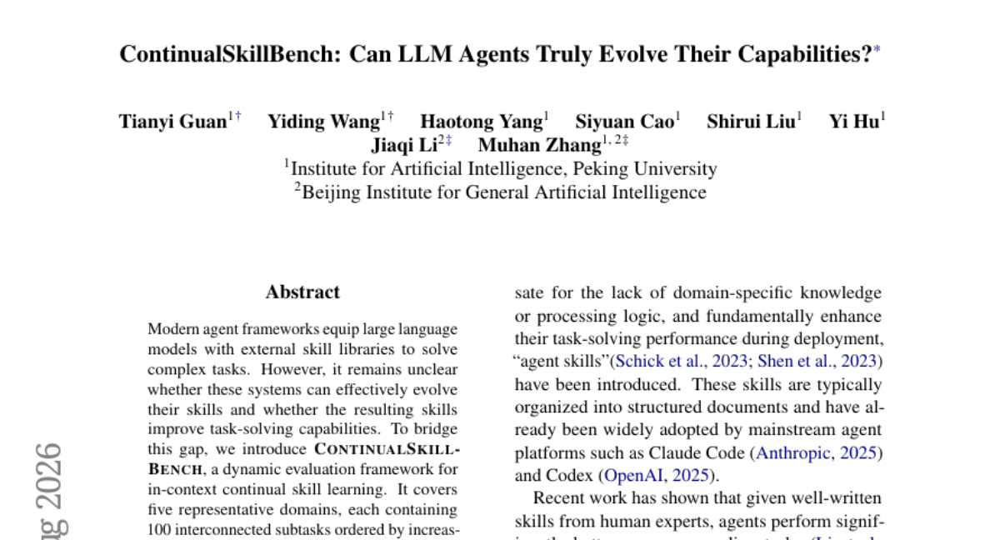

### 📌 한 줄 요약
LLM 에이전트의 지속적 스킬 학습 능력을 평가하기 위한 프레임워크 제안 및 학습 메커니즘 분석

### 🔑 핵심 포인트
- 지속적 스킬 학습 평가를 위한 동적 벤치마크 'ContinualSkillBench' 개발
- 인컨텍스트 학습과 명시적 스킬 유지 방식 간의 성능 비교 분석
- 모델 성능과 스킬 축적 방식(파편화 vs 통합) 간의 상관관계 규명

### 🧑‍💻 개발자 관점
에이전트 설계 시 단순히 스킬을 쌓는 것보다, 이전 경험을 어떻게 일반화된 지식으로 변환할지가 성능의 핵심임을 시사합니다.

### 🚀 실무 적용 아이디어
- 에이전트의 스킬 라이브러리 구조를 '절차적 스킬'과 '지식형 스킬'로 나누어 성능 차이 테스트
- 모델 크기에 따른 스킬 파편화 현상을 방지하기 위한 요약/압축 전략 실험
- 피드백 루프가 스킬의 일반화(Transferability)에 미치는 영향 측정

### ⚠️ 리스크/한계
- 현재의 인컨텍스트 방식은 스킬의 견고한 통합보다는 컨텍스트 적응에 의존하는 경향이 있음
- 모델 성능이 낮을수록 스킬이 파편화되어 관리 복잡도가 증가할 위험이 있음

### 📝 초록 기반 상세 설명
최근 에이전트 프레임워크는 외부 스킬 라이브러리를 활용해 복잡한 문제를 해결하지만, 학습된 스킬이 실제 성능 향상으로 이어지는지는 불분명합니다. 이를 위해 본 논문은 인컨텍스트 지속적 스킬 학습을 평가하는 동적 프레임워크인 ContinualSkillBench를 제안합니다. 5개 도메인에서 난이도별로 구성된 100개의 하위 태스크를 통해 모델의 스킬 진화 능력을 검증했습니다. 실험 결과, 순차적 실행은 성능 향상을 가져오지만 모델과 도메인에 따라 그 효과가 상이했습니다. 또한, 성능 향의 상당 부분은 스킬 추상화보다는 이전 컨텍스트와 피드백에 대한 적응에서 기인함을 확인했습니다. 결론적으로 현재의 메커니즘은 지속적 적응은 가능하나, 경험을 견고하고 전이 가능한 스킬로 통합하는 데는 한계가 있습니다.

---

## 20. [MiniWorld: Democratizing the Training of Video World Models from Scratch](https://huggingface.co/papers/2608.01127)
**Upvotes**: 9 | **도입 난이도**: 중 | **신뢰도**: 상
**arXiv**: https://arxiv.org/abs/2608.01127

**태그**: Video Generation, World Models, Diffusion, Embodied AI, Agent, Video, Inference, Distillation

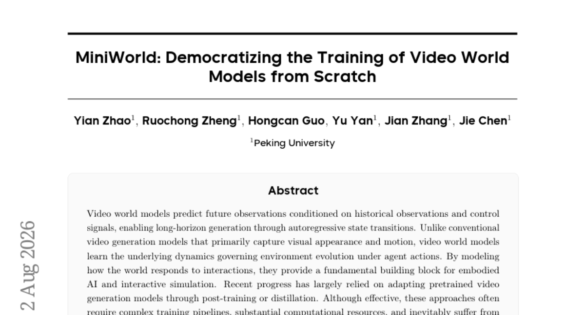

### 📌 한 줄 요약
적은 컴퓨팅 자원으로도 가능한 오픈소스 기반의 경량 비디오 월드 모델 학습 프레임워크

### 🔑 핵심 포인트
- 단일 8-GPU 서버에서 며칠 내 학습 가능한 경량화된 엔드투엔드 프레임워크 제공
- Flow Matching과 블록 인과적(Block-causal) 구조를 결합한 비디오 확산 트랜스포머 설계
- Rolling KV 캐시와 비동기 디노이징을 통한 효율적인 스트리밍 추론 구현

### 🧑‍💻 개발자 관점
대규모 클러스터 없이도 고성능 비디오 월드 모델을 직접 학습하고 실험할 수 있는 실질적인 베이스라인을 제공합니다.

### 🚀 실무 적용 아이디어
- 제공된 체크포인트를 활용하여 다양한 제어 신호(Control signals)에 따른 환경 변화 테스트
- 단일 GPU 환경에서 제안된 비동기 디노이징 및 KV 캐시 기법의 추론 속도 벤치마크
- 다양한 VAE 잠재 공간 크기에 따른 모델의 생성 품질 및 학습 안정성 비교

### ⚠️ 리스크/한계
- 상대적으로 적은 자원을 타겟으로 하므로 초거대 모델 대비 복잡한 물리 법칙 표현력 한계 가능성
- 사전 학습된 VAE 성능에 모델의 최종 품질이 종속됨

### 📝 초록 기반 상세 설명
기존의 비디오 월드 모델은 주로 사전 학습된 모델을 미세 조정하는 방식에 의존하여 복잡한 파이프라인과 막대한 자원을 필요로 했습니다. 이러한 방식은 양방향 사전 학습과 인과적 추론 사이의 불일치 문제를 야기하기도 합니다. 본 논문은 적은 자원으로도 처음부터 학습 가능한 재현 가능한 프레임워크인 MiniWorld를 제안합니다. MiniWorld는 사전 학습된 Video VAE의 잠재 공간에서 Flow Matching을 사용하는 블록 인과적 Video Diffusion Transformer를 활용합니다. 또한 Diffusion Forcing 기법을 기반으로 청크 단위의 노이즈 스케줄과 2단계 연속 학습을 도입하여 시간적 모델링 안정성을 높였습니다. 결과적으로 단일 8-GPU 서버에서 며칠 내에 학습이 가능한 효율적인 스트리밍 비디오 생성 환경을 구축했습니다.

---

## 21. [Decoding Children's Gait Behavior](https://huggingface.co/papers/2608.00371)
**Upvotes**: 9 | **도입 난이도**: 중 | **신뢰도**: 상
**arXiv**: https://arxiv.org/abs/2608.00371

**태그**: Computer Vision, Human Action Recognition, Dataset, Pose Estimation, Multimodal, Video

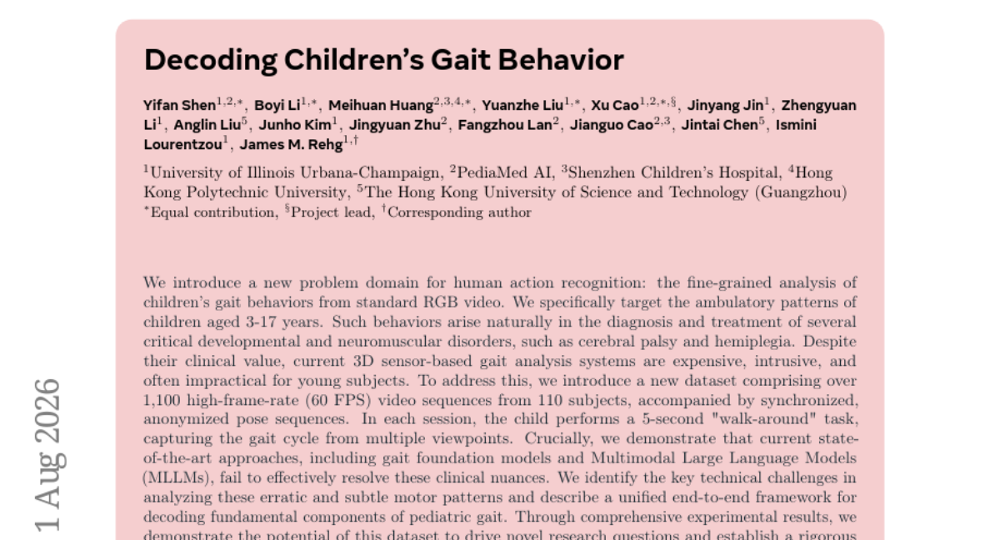

### 📌 한 줄 요약
고가의 3D 센서 없이 RGB 비디오만으로 아동의 미세한 보행 패턴을 분석하기 위한 새로운 데이터셋과 프레임워크 제안

### 🔑 핵심 포인트
- 110명의 피험자, 1,100개 이상의 고프레임(60 FPS) RGB 비디오 및 동기화된 포즈 데이터셋 구축
- 기존 SOTA 모델(Gait Foundation Models, MLLMs)이 아동의 미세한 보행 변화를 감지하지 못하는 한계 식별
- 아동 보행의 복잡한 패턴 분석을 위한 통합 엔드투엔드 프레임워크 및 벤치마크 제시

### 🧑‍💻 개발자 관점
비싼 하드웨어 없이 일반 카메라 영상만으로 정밀한 임상 진단 보조 도구를 개발할 수 있는 데이터 기반을 제공함

### 🚀 실무 적용 아이디어
- 제공된 데이터셋을 활용하여 기존 Gait-specific 모델의 성능 벤치마킹
- 60 FPS 고프레임 영상에서의 미세 움직임 추출을 위한 포즈 추정 알고리즘 테스트
- MLLM을 활용한 보행 패턴의 텍스트 설명 및 임상적 특징 추출 실험

### ⚠️ 리스크/한계
- 표준 RGB 영상 기반이므로 조명이나 배경 변화에 따른 강건성 확보 필요
- 아동의 불규칙한 움직임으로 인해 기존 성인 중심 모델의 전이 학습 시 성능 저하 위험

### 📝 초록 기반 상세 설명
소아의 발달 및 신경 질환 진단을 위한 보행 분석은 임상적으로 중요하지만, 기존 3D 센서 기반 시스템은 비용이 높고 아동에게 비침습적이지 못하다는 문제가 있다. 본 논문은 3~17세 아동의 보행 패턴을 분석하기 위한 새로운 문제 영역을 정의하고, 110명의 피험자로부터 수집된 1,100개 이상의 고프레임(60 FPS) RGB 비디오 및 포즈 시퀀스 데이터셋을 소개한다. 기존의 보행 파운데이션 모델과 MLLM이 아동 특유의 불규칙하고 미세한 움직임을 포착하지 못함을 확인하였다. 이를 해결하기 위해 아동 보행의 핵심 요소를 해독하는 통합 엔드투엔드 프레임워크를 제안한다. 실험을 통해 제안된 데이터셋이 자동화된 소아 보행 평가 연구를 위한 강력한 베이스라인이 될 수 있음을 입증하였다.

---

## 22. [Are the Financial Reasoning from LLMs Credible? A Real World Test over Long-Horizon Statements](https://huggingface.co/papers/2607.28661)
**Upvotes**: 9 | **도입 난이도**: 중 | **신뢰도**: 상
**arXiv**: https://arxiv.org/abs/2607.28661

**태그**: LLM, Reasoning, Finance, Benchmark, RAG, Evaluation, Safety

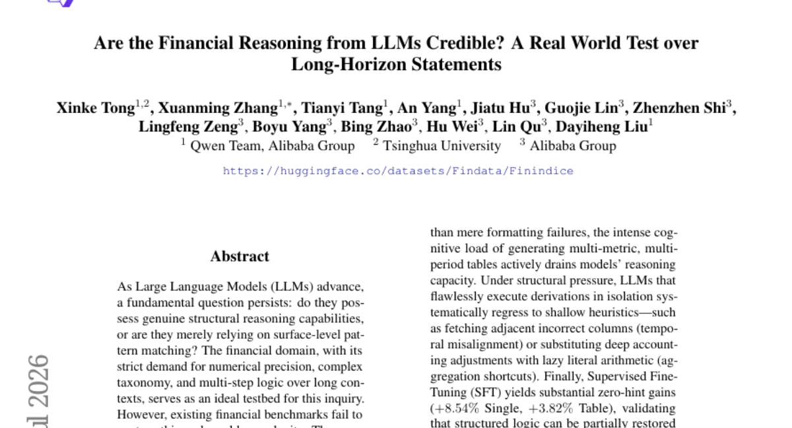

### 📌 한 줄 요약
LLM의 금융 추론 능력이 단순 패턴 매칭인지 구조적 논리인지 검증하기 위한 벤치마크 제안 및 취약점 분석

### 🔑 핵심 포인트
- 실제 재무제표의 복잡성을 반영한 대규모 벤치마크 FinIndices 개발
- LLM이 수식 힌트 유무에 따라 성능이 급락하는 패턴 매칭 취약점 발견
- 복잡한 표 구조 생성 시 추론 능력이 저하되는 구조적 병목 현상 규명

### 🧑‍💻 개발자 관점
금융 도메인용 LLM 에이전트 개발 시, 단순 QA를 넘어 복잡한 표 구조와 시계열 데이터 처리 능력을 검증하는 것이 필수적임을 시사합니다.

### 🚀 실무 적용 아이디어
- LLM에 수식/계산 로직을 명시적으로 제공했을 때와 아닐 때의 성능 차이 비교 실험
- 복잡한 표 구조(Multi-index)를 생성하는 태스크에서 추론 정확도 변화 측정
- SFT를 통한 도메인 특화 논리 강화 효과 검증

### ⚠️ 리스크/한계
- 실제 데이터가 아닌 합성된 데이터(Synthetic data) 기반의 벤치마크라는 점
- 모델의 크기나 특정 아키텍처에 따른 결과 편향 가능성

### 📝 초록 기반 상세 설명
기존 금융 벤치마크는 단답형이나 단일 테이블 위주로 구성되어 실제 산업 현장의 복잡한 시계열 및 교차 데이터 추론을 검증하기에 부족했습니다. 이를 해결하기 위해 최대 32K 토큰 규모의 미편집 재무제표를 활용한 대규모 벤치마크인 FinIndices를 도입했습니다. 연구진은 자동화된 합성 파이프라인을 통해 복잡한 도메인 지식과 시계열적 논리 추론을 테스트했습니다. 실험 결과, LLM은 공식 힌트가 없을 때 성능이 급락하는 '지식 병목'과 복잡한 표 생성 시 추론 능력이 저하되는 '구조적 병목' 현상을 보였습니다. 최종적으로 SFT를 통해 이러한 논리적 결함을 일부 개선할 수 있음을 확인했습니다.

---

## 23. [When Agents Learn to Be You: Benchmarking Privacy Leakage, Impersonation Risk, and Defenses in Persona Skills](https://huggingface.co/papers/2608.03700)
**Upvotes**: 8 | **도입 난이도**: 중 | **신뢰도**: 상
**arXiv**: https://arxiv.org/abs/2608.03700

**태그**: AI Agent, Privacy, Security, Personalization, Agent, RAG, Benchmark, Evaluation, Distillation, Safety

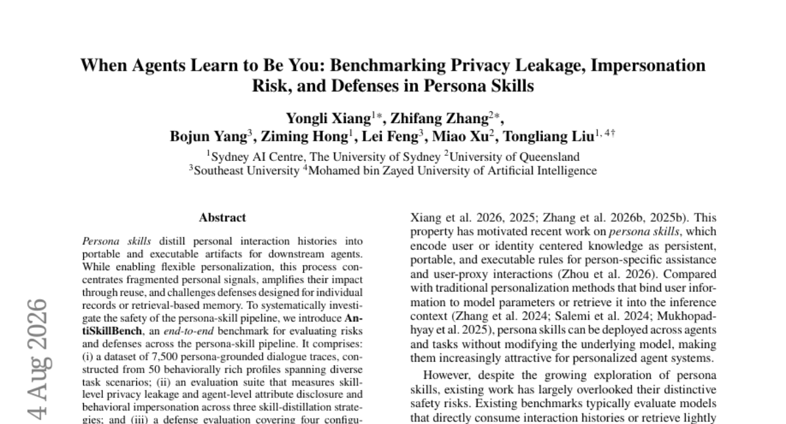

### 📌 한 줄 요약
개인화된 페르소나 스킬 추출 과정에서 발생하는 프라이버시 유출 및 사칭 위험을 평가하는 벤치마크 'AntiSkillBench' 제안

### 🔑 핵심 포인트
- 페르소나 스킬 추출 과정의 프라이버시 및 사칭 위험을 평가하는 엔드투엔드 벤치마크 AntiSkillBench 제안
- 속성 노출부터 행동 양식 및 성격 모사까지 아우르는 다각도 위험 평가 프레임워크 구축
- 기존 방어 기제가 스킬 증류(Distillation) 전략에 따라 효과가 가변적이며 일반화가 어렵다는 점을 입증

### 🧑‍💻 개발자 관점
개인화된 에이전트 개발 시, 단순 데이터 보호를 넘어 모델이 학습/추출한 '페르소나 스킬' 자체가 유출될 수 있는 새로운 보안 위협에 대비해야 합니다.

### 🚀 실무 적용 아이디어
- 에이전트의 페르소나 추출(Distillation) 과정에서 발생하는 정보 응축 효과 측정
- 제안된 AntiSkillBench를 활용하여 현재 개발 중인 에이전트의 사칭 위험도 테스트
- 스킬 기반 개인화 모델에 대한 능동적 위험 억제(Active Risk Suppression) 방어 로직 설계

### ⚠️ 리스크/한계
- 실험 결과가 특정 프론티어 모델에 국한될 수 있어 모든 모델에 대한 일반화 가능성 검토 필요
- 방어 기제의 효과가 증류 전략에 따라 달라지므로 범용적인 보안 표준 수립이 어려움

### 📝 초록 기반 상세 설명
개인화된 대화 이력을 스킬 형태로 추출하는 방식은 유연한 개인화를 가능하게 하지만, 파편화된 개인 정보를 응축하여 심각한 프라이버시 노출 위험을 초래합니다. 기존의 방어 기제는 개별 기록이나 RAG 기반 메모리 보호에 초점이 맞춰져 있어, 스킬 형태의 정보 재사용 문제를 해결하기 어렵습니다. 본 논문은 페르소나 스킬 파이프라인의 위험과 방어 능력을 체계적으로 평가하기 위해 AntiSkillBench를 도입합니다. 50개의 프로필과 7,500개의 대화 트레이스를 포함한 데이터셋과 함께, 스킬 수준의 정보 유출 및 에이전트 수준의 사칭 위험을 측정하는 평가 체계를 구축했습니다. 실험 결과, 최신 에이전트 모델들은 스킬 추출 방식과 관계없이 속성 및 성격 정보가 유출되는 위험에 노출되었으며, 기존 방어 기제는 일반화 성능이 부족함을 확인했습니다.

---

## 24. [Push-Wiper: Toward General-Purpose Robotic Cleaning across Varied Stains and Surfaces with Segmented Pushing Trajectories](https://huggingface.co/papers/2608.00730)
**Upvotes**: 6 | **도입 난이도**: 상 | **신뢰도**: 상
**arXiv**: https://arxiv.org/abs/2608.00730

**태그**: Robotics, Diffusion Policy, Force Control, Generalization, RAG

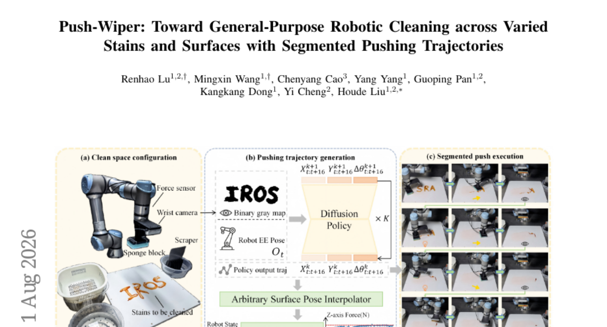

### 📌 한 줄 요약
점성 얼룩 제거를 위한 분할 푸싱 궤적 기반의 범용 로봇 청소 프레임워크 제안

### 🔑 핵심 포인트
- 점성 얼룩 제거를 '물질 집합(aggregation)' 문제로 재정의한 새로운 접근법
- Diffusion Policy와 하이브리드 제어기를 결합한 적응형 푸싱 궤적 생성
- 미학습된 고체 잔여물, 액체, 곡면 등 다양한 환경에 대한 강력한 제로샷 일반화

### 🧑‍💻 개발자 관점
로봇의 물리적 상호작용(Force-Position Control)과 생성 모델(Diffusion Policy)을 결합하여 복잡한 비정형 환경에서의 작업 수행 능력을 높이는 실무적 사례를 제시합니다.

### 🚀 실무 적용 아이디어
- Diffusion Policy를 활용한 로봇의 물리적 궤적 생성 로직 분석
- 하이브리드 힘-위치 제어기(Hybrid Force-Position Controller)의 구현 방식 검토
- 비정형 물질(액체/고체)에 대한 로봇 조작 일반화 전략 연구

### ⚠️ 리스크/한계
- 스펀지 등 소모성 도구의 물리적 마모 및 내구성 문제
- 복잡한 유체 역학적 특성을 가진 얼룩에 대한 완전한 예측 어려움

### 📝 초록 기반 상세 설명
기존의 로봇 청소 방식은 점성 얼룩을 넓게 퍼뜨리거나 표면 손상을 유발하는 문제가 있었습니다. 본 논문은 점성 얼룩 제거를 물질을 모으는 집합(aggregation) 문제로 재정의한 Push-Wiper 프레임워크를 제안합니다. 스펀지를 사용하여 단계별로 얼룩을 모으는 분할 푸싱 궤적을 생성하며, 이후 물질 분리 및 스펀지 자가 세척 과정을 거칩니다. Diffusion Policy를 통해 적응형 푸싱 동작을 생성하고, ASPI와 하이브리드 힘-위치 제어기를 통해 다양한 표면 기하학에 대응합니다. 실험 결과, 기존 방식 대비 최대 130% 높은 세척 점수(CS)를 달성했으며 다양한 잔여물과 곡면에서도 뛰어난 제로샷 일반화 성능을 보였습니다.

---

## 25. [ST-WAM: Semantic-Temporal World Action Model for Robust Manipulation under Visual Distribution Shifts](https://huggingface.co/papers/2607.28993)
**Upvotes**: 6 | **도입 난이도**: 중 | **신뢰도**: 상
**arXiv**: https://arxiv.org/abs/2607.28993

**태그**: Robot-Manipulation, Visual-Robustness, Foundation-Models, World-Models, RAG, Vision, Evaluation, Inference

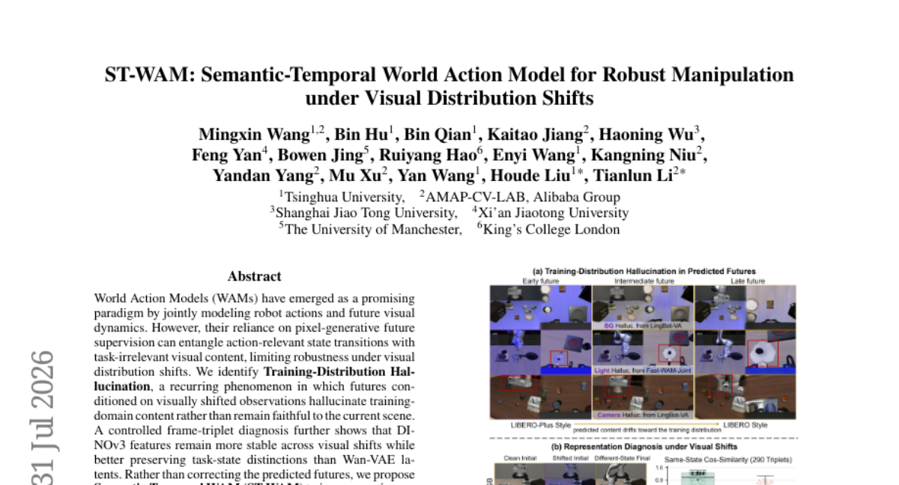

### 📌 한 줄 요약
시각적 분포 변화(Visual Shift) 상황에서도 강건한 로봇 조작을 위해 의미론적 특징과 생성적 역학을 결합한 ST-WAM 모델 제안

### 🔑 핵심 포인트
- 시각적 분포 변화 시 발생하는 '학습 분포 환각(Training-Distribution Hallucination)' 문제 규명
- DINOv3의 의미론적 안정성과 VAE의 세밀한 역학을 결합한 Dual-Space Future Experts(DSFE) 구조 제안
- 과거 이력에서 작업 관련 증거를 추출하는 Current-Anchored Intent Retrieval(CAIR) 메커니즘 도입

### 🧑‍💻 개발자 관점
로봇 제어 모델이 조명, 배경 등 시각적 환경 변화에도 작업 수행 능력을 유지해야 하는 실무 환경에서 매우 유용한 아키텍처 가이드를 제공합니다.

### 🚀 실무 적용 아이디어
- DINOv2/v3와 같은 사전 학습된 특징(Feature)이 생성 모델의 강건성에 미치는 영향 비교 실험
- 픽셀 생성 기반 WAM 모델에 의미론적 특징(Semantic Feature)을 결합한 하이브리드 구조 구현
- 시각적 노이즈나 배경 변화가 심한 데이터셋에서의 제로샷 성능 벤치마크 수행

### ⚠️ 리스크/한계
- DINOv3와 같은 강력한 사전 학습 모델에 대한 의존도가 높음
- 의미론적 특징과 생성적 특징 간의 균형을 맞추는 하이퍼파라미터 튜닝의 복잡성

### 📝 초록 기반 상세 설명
로봇의 행동과 미래 시각 역학을 동시에 모델링하는 WAM 방식은 픽셀 생성 과정에서 작업과 무관한 시각적 요소에 의존하여 분포 변화에 취약한 문제가 있습니다. 연구진은 학습 데이터와 다른 시각적 환경에서 모델이 학습 도메인의 내용을 환각(Hallization)하는 현상을 식별했습니다. 이를 해결하기 위해 제안된 ST-WAM은 안정적인 DINOv3 특징과 세밀한 VAE 잠재 공간을 결합한 Dual-Space Future Experts(DSFE) 구조를 사용합니다. 또한, 현재의 시각-언어 문맥에 맞춰 과거의 의미론적 증거를 추출하는 Current-Anchored Intent Retrieval(CAIR)을 도입했습니다. 실험 결과, ST-WAM은 제로샷 성능과 실세계 시각 변화 환경에서의 성공률을 크게 향상시키며 강건성을 입증했습니다.

---

## 26. [RestoreKV: Recovering Full-Cache Behavior Under Aggressive Query-Agnostic KV Cache Eviction](https://huggingface.co/papers/2608.01247)
**Upvotes**: 5 | **도입 난이도**: 하 | **신뢰도**: 상
**arXiv**: https://arxiv.org/abs/2608.01247

**태그**: LLM, KV-Cache, Compression, Efficiency, Benchmark, Evaluation, Distillation, Optimization

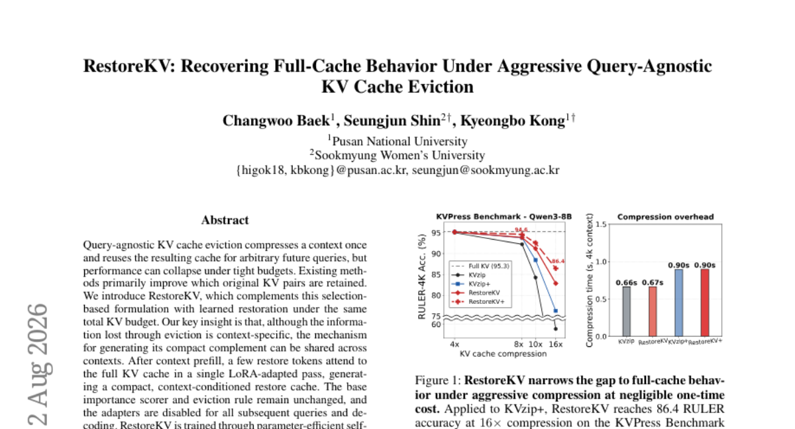

### 📌 한 줄 요약
KV 캐시 삭제로 손실된 정보를 학습된 어댑터를 통해 복구하여, 적은 예산에서도 원본 캐시에 근접한 성능을 내는 기술

### 🔑 핵심 포인트
- 선택 기반의 기존 방식에 '학습된 복구(Learned Restoration)' 개념을 결합하여 정보 손실 보완
- LoRA 어댑터를 활용해 0.4% 미만의 파라미터만 최적화하는 효율적인 학습 방식 채택
- 한 번의 복구 과정 이후에는 어댑터를 비활성화하여 추론 시 추가 오버헤드 최소화

### 🧑‍💻 개발자 관점
KV 캐시 용량 제한이 엄격한 환경에서 모델 성능 저하 없이 압축률을 높일 수 있는 실질적인 대안을 제시합니다.

### 🚀 실무 적용 아이디어
- 기존 KV 압축 알고리즘(KVzip 등)에 RestoreKV 로직을 결합하여 성능 향상 폭 확인
- LoRA 어댑터 적용 시 발생하는 초기 캐시 생성 오버헤드와 추론 속도 간의 트레이드오프 측정
- 특정 도메인 데이터셋에서의 복구 성능 및 일반화 능력 검증

### ⚠️ 리스크/한계
- 초기 캐시 구축 시 발생하는 일시적인 연산 오버헤드 발생
- 학습된 문맥 범위를 벗어나는 극단적인 상황에서의 복구 정확도 불확실성

### 📝 초록 기반 상세 설명
LLM의 긴 문맥 처리를 위해 쿼리 불가지론적(Query-agnostic) KV 캐시 삭제 방식이 사용되지만, 압축률이 높아지면 성능이 급격히 저하되는 문제가 있습니다. 기존 방식은 어떤 KV 쌍을 남길지에만 집중하여 정보 손실을 완전히 해결하지 못합니다. 본 논문은 삭제된 정보를 복구하는 'RestoreKV'를 제안하며, 소수의 복구 토큰이 전체 캐시에 어텐션하여 문맥에 맞는 압축 캐시를 생성합니다. LoRA 기반의 파라미터 효율적 자기 증류(Self-distillation) 방식으로 학습되어 기존 삭제 규칙을 유지하면서도 성능을 극대화합니다. 실험 결과, 다양한 백본과 벤치마크에서 압축 손실로 인한 성능 저하를 획기적으로 줄였습니다.

---

## 27. [When Attention Goes Blind: Numerical Failure in ALiBi Positional Encodings](https://huggingface.co/papers/2608.03994)
**Upvotes**: 4 | **도입 난이도**: 중 | **신뢰도**: 상
**arXiv**: https://arxiv.org/abs/2608.03994

**태그**: LLM, Attention, Numerical Stability, NLP, RAG, Benchmark, Evaluation

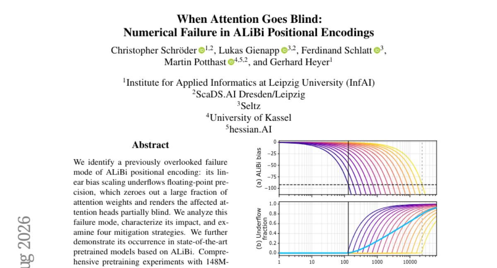

### 📌 한 줄 요약
ALiBi 위치 인코딩의 부동 소수점 언더플로우로 인한 어텐션 무력화 현상 분석 및 해결 방안 제시

### 🔑 핵심 포인트
- ALiBi의 선형 바이어스 스케일링이 부동 소수점 언더플로우를 유발하여 어텐션 가중치를 소멸시키는 문제 식별
- 해당 문제가 일반 벤치마크보다 특정 토큰 검색(Passkey Retrieval) 성능에 더 큰 영향을 미침을 확인
- 로그 스케일 거리(log-scaled distances)를 포함한 네 가지 완화 전략 제안 및 검증

### 🧑‍💻 개발자 관점
ALiBi를 사용하는 모델 학습 시, 수치적 불안정성으로 인해 특정 정보가 무시되는 현상을 방지하기 위한 정밀한 스케일링 전략이 필수적입니다.

### 🚀 실무 적용 아이디어
- ALiBi 기반 모델 학습 시 로그 스케일 거리(log-scaled distances) 적용 실험
- 모델의 컨텍스트 길이가 길어질 때 어텐션 가중치가 0으로 수렴하는지 모니터링
- Passkey Retrieval 테스트를 통해 모델의 정보 추출 능력을 검증

### ⚠️ 리스크/한계
- 기존 ALiBi 기본값이 특정 태스크(Needle-in-a-haystack)에서는 여전히 강력한 베이스라인일 수 있음
- 모델 규모가 커질수록 수치적 정밀도 문제가 더 복잡하게 작용할 가능성

### 📝 초록 기반 상세 설명
ALiBi 위치 인코딩 방식에서 선형 바이어스 스케일링이 부동 소수점 정밀도 한계를 초과하여 어텐션 가중치가 0이 되는 현상을 발견했습니다. 이로 인해 특정 어텐션 헤드가 정보를 읽지 못하는 '블라인드' 현상이 발생하며, 이는 기존 사전 학습 모델에서도 나타남을 확인했습니다. 연구진은 148M 파라미터 규모의 디코더 모델 실험을 통해 이 현상이 토큰 검색 성능을 저하시시키지만 일반 벤치마크에는 영향이 적음을 규명했습니다. 이를 해결하기 위해 네 가지 완화 전략을 제안했으며, 그중 로그 스케일 거리 방식이 가장 효과적임을 입증했습니다. 최종적으로 ALiBi 기반 모델 학습을 위한 구체적인 권장 가이드를 제공합니다.

---

## 28. [PosterMELD: Multi-Agent Paper-to-Poster Generation for Controllable Design Diversity with Editable Print-Ready Outputs](https://huggingface.co/papers/2608.02218)
**Upvotes**: 4 | **도입 난이도**: 중 | **신뢰도**: 상
**arXiv**: https://arxiv.org/abs/2608.02218

**태그**: Multi-Agent, Automation, Design-Generation, VLM, Agent, Multimodal, Vision

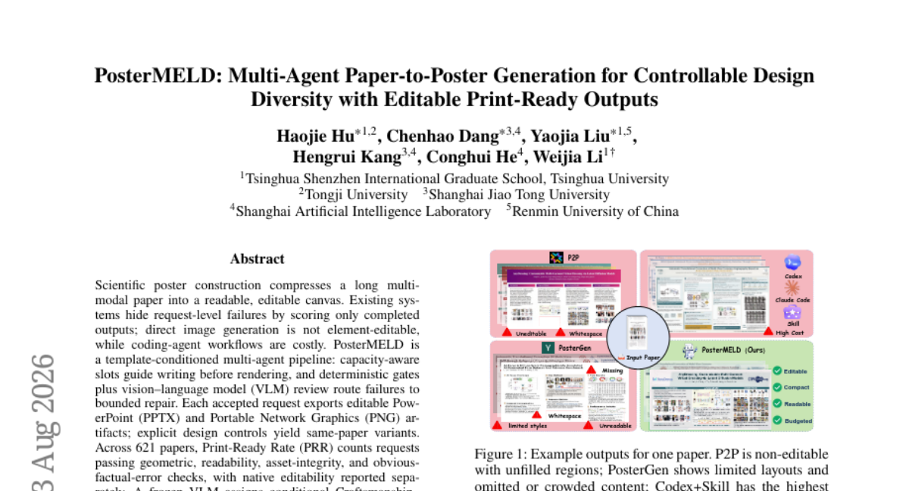

### 📌 한 줄 요약
멀티 에이전트 워크플로우를 통해 편집 가능한 PPTX 형식의 고품질 학술 포스터를 생성하는 저비용 자동화 시스템

### 🔑 핵심 포인트
- 템플릿 기반 멀티 에이전트 파이프라인을 통한 편집 가능한(PPTX) 출력물 생성
- VLM 리뷰와 결정론적 게이트를 결합하여 생성 실패를 방지하는 자동 복구 메커니즘
- 저비용(요청당 $0.38)으로 높은 디자인 품질과 가독성을 동시에 확보

### 🧑‍💻 개발자 관점
단순 이미지 생성을 넘어, 사람이 즉시 수정 가능한 구조화된 데이터(PPTX)를 생성하는 에이전트 설계 패턴을 배울 수 있습니다.

### 🚀 실무 적용 아이디어
- VLM을 활용한 생성 결과물의 품질 검증(Gate) 로직 구현해보기
- 이미지 생성 대신 구조화된 템플릿 기반의 레이아웃 배치 알고리즘 적용해보기
- LLM 기반 텍스트 요약과 시각적 레이아웃 간의 정렬(Alignment) 문제 실험하기

### ⚠️ 리스크/한계
- 템플릿 구조에 의존하므로 매우 복잡하거나 비정형적인 레이아웃 생성에는 한계가 있을 수 있음
- VLM 리뷰 단계가 추가됨에 따라 발생하는 지연 시간(Latency) 문제

### 📝 초록 기반 상세 설명
기존의 학술 포스터 생성 방식은 결과물의 편집이 어렵거나, 생성 과정에서의 오류를 감지하기 어렵고, 코딩 에이전트 방식은 비용이 과다하다는 문제가 있었습니다. 이를 해결하기 위해 PosterMELD는 템플릿 기반의 멀티 에이전트 파이프라인을 제안합니다. 용량 인지형 슬롯(capacity-aware slots)을 통해 글쓰기를 먼저 수행한 후 렌더링하며, 결정론적 게이트와 VLM 리뷰를 통해 오류를 수정하는 구조를 갖췄습니다. 결과물은 편집 가능한 PPTX와 PNG 형식을 모두 지원하며, 다양한 디자인 컨트롤을 통해 동일 논문에 대한 여러 변형을 생성할 수 있습니다. 실험 결과, 기존 방식 대비 높은 Print-Ready Rate(PRR)와 우수한 디자인 품질(CHE)을 달성하면서도 매우 낮은 비용을 유지했습니다.

### 🖼️ 추가 자료
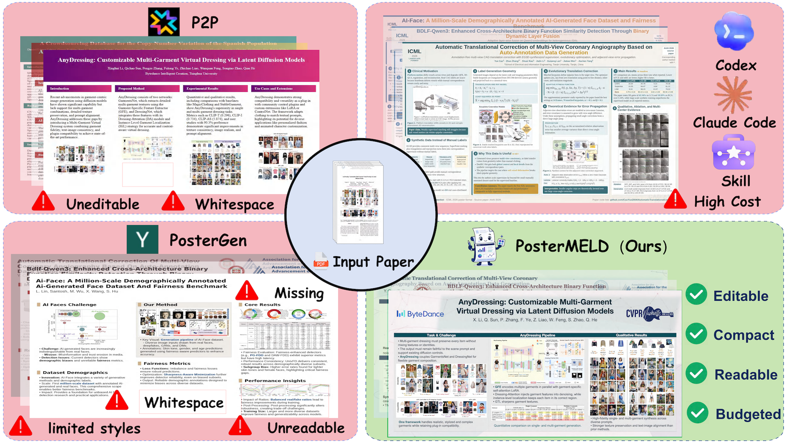

---

## 29. [Multi-Task Multi-Frame Visual Piano Transcription](https://huggingface.co/papers/2608.03419)
**Upvotes**: 3 | **도입 난이도**: 중 | **신뢰도**: 상
**arXiv**: https://arxiv.org/abs/2608.03419

**태그**: Computer Vision, Music Information Retrieval, Multi-Task Learning, Vision, Video, Audio

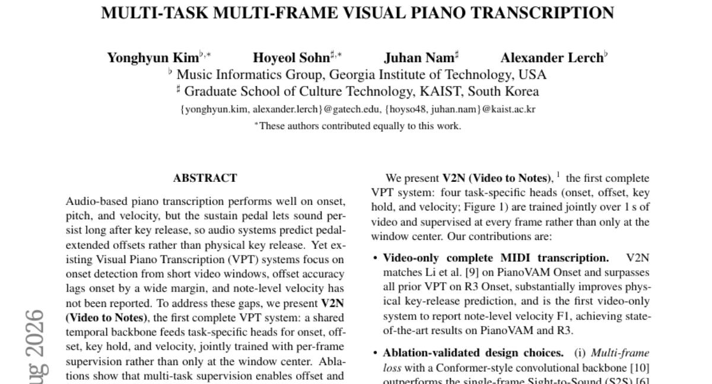

### 📌 한 줄 요약
비디오 기반 피아노 전사(VPT)에서 온셋, 오프셋, 홀드, 벨로시티를 동시에 해결하는 통합 시스템 V2N 제안

### 🔑 핵심 포인트
- 온셋, 오프셋, 키 홀드, 벨로시티를 모두 처리하는 최초의 완전한 비디오 기반 피아노 전사(VPT) 시스템 개발
- 윈도우 중심이 아닌 프레임 단위 감독(per-frame supervision)을 통한 정밀한 시계열 학습
- 멀티태스크 학습을 통해 오프셋 및 벨로시티 예측 성능과 온셋 정확도를 동시에 확보

### 🧑‍💻 개발자 관점
비디오를 통해 악보를 자동 생성하거나 연주 분석을 수행할 때, 단순한 음정 감지를 넘어 연주자의 터치(벨로시티)와 잔향(오프셋)까지 포함된 완전한 데이터 추출이 가능해집니다.

### 🚀 실무 적용 아이디어
- 제시된 프레임별 감독(per-frame supervision) 방식이 온셋/오프셋 정밀도에 미치는 영향 검증
- 다양한 프레임 레이트(FPS) 환경에서 시계열 백본의 강건성 테스트
- 기존 오디오 기반 모델과 V2N의 오프셋/벨로시티 오차 비교 실험

### ⚠️ 리스크/한계
- 긴 시계열 컨텍스트가 필요하므로 연산 비용 및 메모리 사용량 증가 가능성
- 비디오 해상도나 조명 등 시각적 환경 변화에 따른 성능 변동성 우려

### 📝 초록 기반 상세 설명
기존의 오디오 기반 피아노 전사는 서스테인 페달로 인해 실제 키 해제 시점과 소리 지속 시간 사이의 차이로 인해 오프셋 예측에 어려움이 있었습니다. 또한 기존 비디오 기반 시스템은 짧은 윈도우 내 온셋 검출에만 집중하여 오프셋 정확도가 낮고 벨로시티 정보가 부족했습니다. 본 논문에서는 이를 해결하기 위해 온셋, 오프셋, 키 홀드, 벨로시티를 동시에 예측하는 통합 시스템인 V2N을 제안합니다. V2N은 공유된 시계열 백본과 작업별 헤드를 사용하며, 윈도우 중심이 아닌 프레임별 감독(per-frame supervision) 방식으로 학습합니다. 실험 결과, 멀티태스크 학습이 오프셋과 벨로시티 예측을 가능하게 함과 동시에 온셋 정확도까지 향상시켰습니다. 최종적으로 V2N은 PianoVAM 및 R3 데이터셋에서 SOTA 성능을 달성했습니다.

### 🖼️ 추가 자료
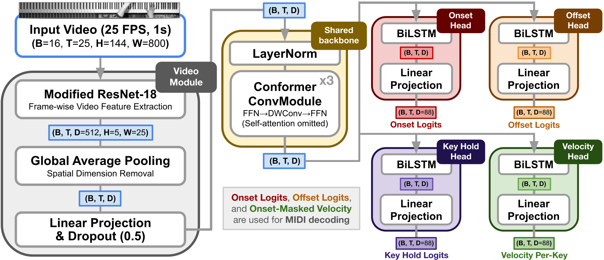

---

## 30. [ARCHead: Activation-Metric Residual Correction for Large Language Model Output Heads](https://huggingface.co/papers/2608.02703)
**Upvotes**: 3 | **도입 난이도**: 중 | **신뢰도**: 상
**arXiv**: https://arxiv.org/abs/2608.02703

**태그**: LLM, Quantization, Model-Compression, Inference-Optimization, RAG, Optimization

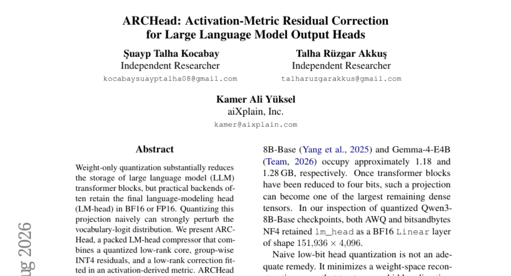

### 📌 한 줄 요약
LLM의 출력 헤드(LM-head)를 효율적으로 압축하여 저장 공간을 3.7~3.9배 절감하면서도 성능 저하를 최소화하는 기술

### 🔑 핵심 포인트
- 양자화된 저차원 코어와 그룹별 INT4 잔차를 결합한 하이브리드 압축 방식 제안
- 활성화 지표(Activation-derived metric)를 활용한 저차원 보정으로 로짓 분포 왜곡 방지
- 기존 BF16 헤드를 대체하여 3.7~3.9배의 저장 공간 절감 및 성능 유지

### 🧑‍💻 개발자 관점
모델 배포 시 용량 최적화가 중요한 환경에서, 성능 저하 없이 출력 헤드 크기를 획기적으로 줄여 메모리 효율을 높일 수 있습니다.

### 🚀 실무 적용 아이디어
- 기존 AWQ/bitsandbytes 적용 모델에 ARCHead를 결합하여 성능 변화 측정
- 다양한 모델 크기(8B 이상)에서 저장 공간 절감 및 추론 속도 벤치마크 수행
- 특정 도메인 데이터셋에서의 로짓 분포 왜곡 여부 검증

### ⚠️ 리스크/한계
- 저차원 보정 과정이 추가되어 추론 시 미세한 연산 오버헤드가 발생할 수 있음
- 특정 아키텍처나 모델 크기에서 최적의 압축 효율이 달라질 가능성

### 📝 초록 기반 상세 설명
LLM의 트랜스포머 블록은 양자화를 통해 용량을 줄이지만, 최종 출력 헤드는 보통 BF16/FP16 형식을 유지하여 저장 공간을 많이 차지합니다. 단순히 출력 헤드를 양자화하면 어휘 로짓 분포가 크게 왜곡되는 문제가 발생합니다. 이를 해결하기 위해 ARCHead는 양자화된 저차원 코어, 그룹별 INT4 잔차, 그리고 활성화 지표 기반의 저차원 보정 기법을 결합한 압축 방식을 제안합니다. 실험 결과, 기존 BF16 헤드 대비 저장 공간을 약 25.6% 수준으로 줄이면서도 퍼플렉시티(Perplexity) 손실을 최소화했습니다. 또한 AWQ나 bitsandbytes와 같은 기존 양자화 방식과 결합 시 성능 저하와 처리량 변화가 거의 없음을 확인했습니다.

### 🖼️ 추가 자료
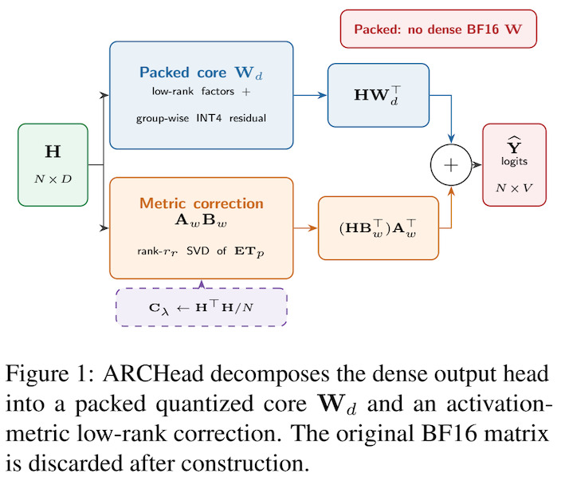
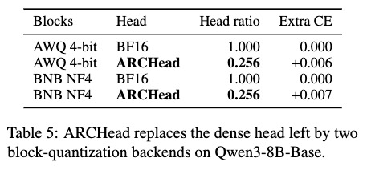
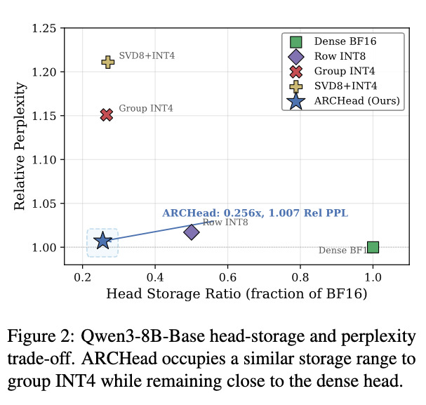
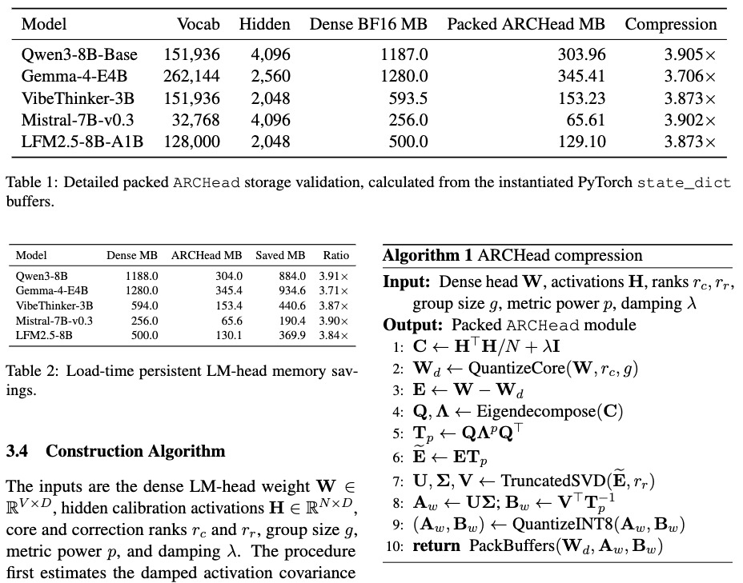

---

## 31. [Better, Stronger, Faster, and Broader: Structured All-Mask Prediction for MLLM-Based Segmentation](https://huggingface.co/papers/2608.02791)
**Upvotes**: 3 | **도입 난이도**: 상 | **신뢰도**: 상
**arXiv**: https://arxiv.org/abs/2608.02791

**태그**: Segmentation, MLLM, Computer Vision, Reasoning, Multimodal, Vision, Inference

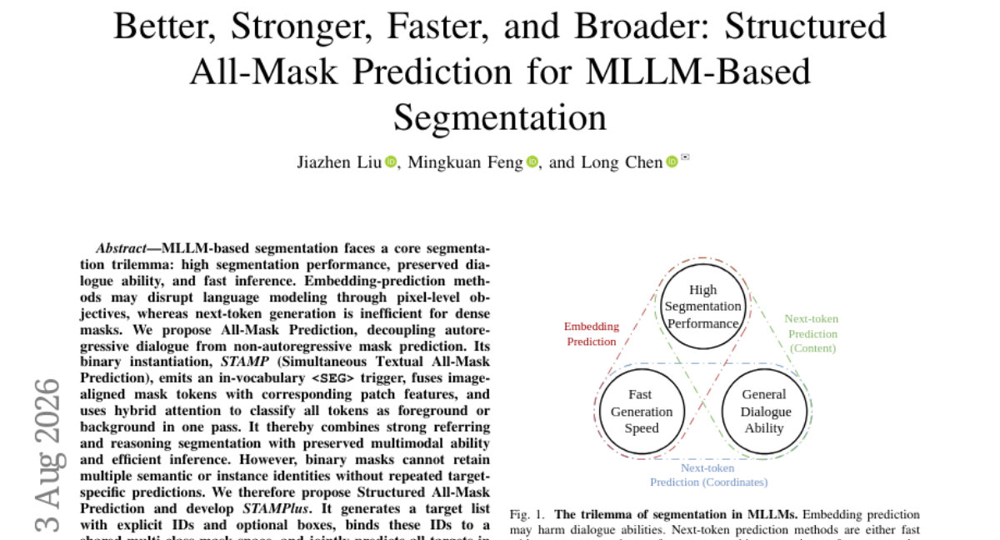

### 📌 한 줄 요약
대화형 성능을 유지하면서 다중 객체 분할(Segmentation)을 효율적으로 수행하는 STAMPlus 프레임워크 제안

### 🔑 핵심 포인트
- STAMP: 대화와 마스크 예측을 분리하여 효율적인 단일 타겟 분할 수행
- STAMPlus: ID와 박스 정보를 결합하여 다중 객체를 한 번의 패스로 예측하는 구조적 확장
- 트릴레마 해결: 높은 분할 성능, 대화 능력 보존, 빠른 추론 속도를 동시에 달성

### 🧑‍💻 개발자 관점
LLM의 추론 능력을 활용하면서도, 반복적인 생성 없이 한 번의 호출로 여러 객체를 분할할 수 있어 실시간 멀티 객체 인식 시스템 구축에 유용합니다.

### 🚀 실무 적용 아이디어
- STAMP와 STAMPlus의 단일/다중 객체 추론 속도 및 정확도 벤치마크 비교
- 고해상도 이미지에서 마스크 토큰 스케일링이 세부 객체 분할에 미치는 영향 테스트
- 다양한 도메인(원격 탐사 등) 데이터셋에 대한 오픈 보캐블러리 성능 검증

### ⚠️ 리스크/한계
- 다중 객체 예측 시 ID 바인딩 및 공유 마스크 공간에서의 충돌 가능성
- 복잡한 구조적 예측으로 인해 단일 타겟 전용 모델 대비 연산 복잡도 증가 가능성

### 📝 초록 기반 상세 설명
기존 MLLM 기반 분할 방식은 높은 성능, 대화 능력 유지, 빠른 추론 속도 사이의 트릴레마 문제에 직면해 있었습니다. 이를 해결하기 위해 저자들은 대화와 마스크 예측을 분리한 All-Mask Prediction 방식을 제안했습니다. 먼저 STAMP는 단일 타겟에 대한 효율적인 이진 마스크 예측을 수행하지만, 다중 객체 식별에는 한계가 있었습니다. 이를 개선한 STAMPlus는 타겟 리스트와 ID를 결합하여 한 번의 비자기회적(non-autoregressive) 패스로 여러 객체를 동시에 예측합니다. 결과적으로 STAMPlus는 범용적인 멀티모달 능력을 유지하면서도 다중 객체 분할 성능을 극대화하고 추론 시간을 대폭 단축했습니다.

### 🖼️ 추가 자료
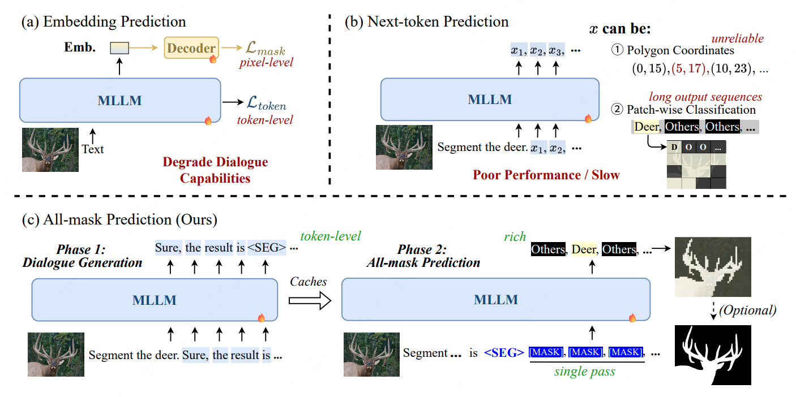

---

## 32. [When Many Answers Are Valid, Voting Fails: Symbolic Verification for Best-of-K Causal Reasoning in LLMs](https://huggingface.co/papers/2608.03506)
**Upvotes**: 2 | **도입 난이도**: 하 | **신뢰도**: 상
**arXiv**: https://arxiv.org/abs/2608.03506

**태그**: LLM, Causal Reasoning, Symbolic Verification, Reasoning, RAG, Benchmark

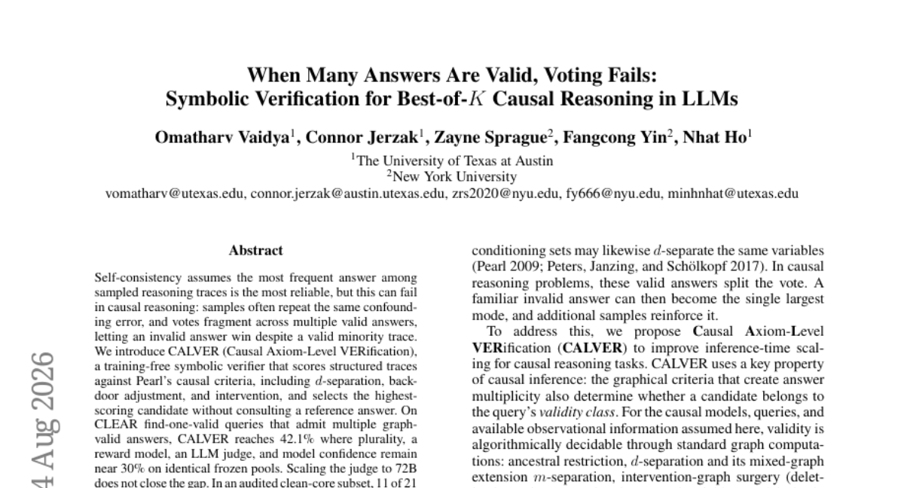

### 📌 한 줄 요약
다중 정답이 가능한 인과 추론 문제에서 투표 방식의 한계를 극복하기 위해 인과 공리 기반의 심볼릭 검증 기법을 제안함

### 🔑 핵심 포인트
- 인과 공리(d-separation, intervention 등)를 활용한 심볼릭 검증 프레임워크 CALVER 제안
- 다중 정답이 존재하는 인과 추론 상황에서 기존 투표(Plurality) 방식의 취약점 해결
- 학습이 필요 없는(training-free) 방식으로 CPU 환경에서도 밀리초 단위의 빠른 실행 속도 확보

### 🧑‍💻 개발자 관점
LLM이 복잡한 논리나 인과 관계를 다룰 때, 단순히 빈도수가 높은 답을 고르는 것이 아니라 논리적 구조의 정합성을 검증하는 것이 중요함을 시사합니다.

### 🚀 실무 적용 아이디어
- 인과 관계가 포함된 복잡한 논리 문제 셋에 CALVER 로직 적용 테스트
- 기존 Self-consistency 방식과 CALVER의 정답 선택 차이 비교 실험
- 텍스트에서 추출한 인과 구조를 바탕으로 한 자동 검증 파이프라인 구축

### ⚠️ 리스크/한계
- 문제 해결을 위해 문제 자체의 인과 구조(Causal Structure)가 사전에 주어지거나 텍스트에서 추출 가능해야 함
- 구조적 정보가 없는 일반적인 상식/언어 작업에서는 효과가 제한적일 수 있음

### 📝 초록 기반 상세 설명
기존의 Self-consistency 방식은 빈도 기반 투표를 사용하므로, 인과 추론 시 발생하는 공통된 오류나 분산된 정답 사이에서 잘못된 답을 선택할 위험이 있습니다. 이를 해결하기 위해 저자들은 Pearl의 인과 공리(d-separation, backdoor adjustment 등)를 활용하는 학습 불필요(training-free) 심볼릭 검증기인 CALVER를 도입했습니다. CALVER는 참조 정답 없이도 구조화된 추론 경로를 인과적 기준으로 점수화하여 최적의 후보를 선택합니다. 실험 결과, 다중 정답이 허용되는 환경에서 기존의 투표, 보상 모델, LLM Judge 방식보다 월등한 성능을 보였습니다. 또한, 이 방식은 정답지가 특정 답 하나만 제시하는 벤치마크에서도 논리적으로 유효한 답을 찾아내는 능력을 입증했습니다.

### 🖼️ 추가 자료
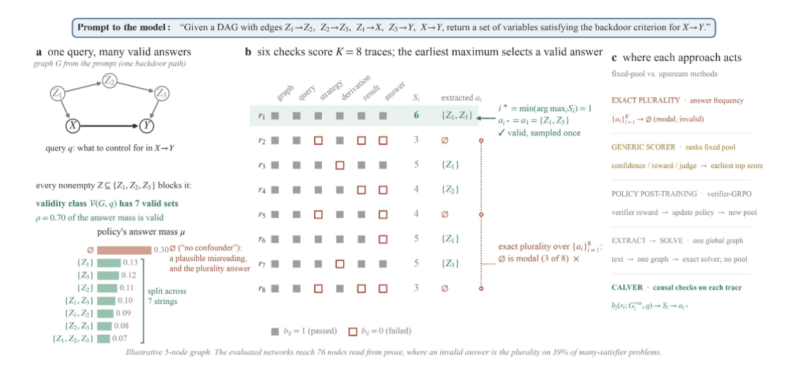

---

## 33. [LegalPincite: Multi-level Legal Information Retrieval Dataset](https://huggingface.co/papers/2608.03756)
**Upvotes**: 2 | **도입 난이도**: 하 | **신뢰도**: 상
**arXiv**: https://arxiv.org/abs/2608.03756

**태그**: IR, NLP, Legal-Tech, Dataset, RAG, Evaluation

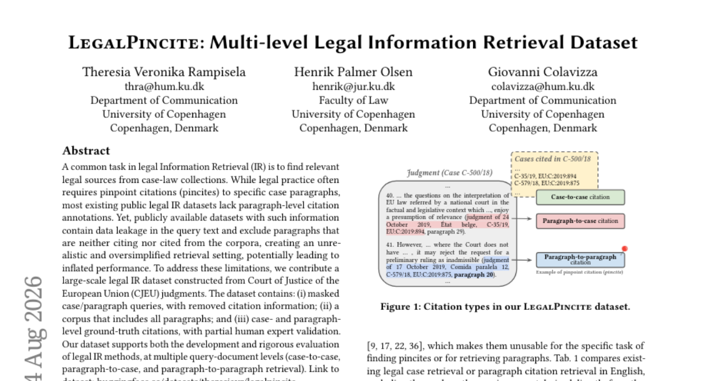

### 📌 한 줄 요약
데이터 누출과 단순화된 환경을 극복한 정밀한 문단 단위 법률 정보 검색(IR) 데이터셋 제안

### 🔑 핵심 포인트
- 데이터 누출(Data Leakage) 문제를 해결하기 위해 쿼리에서 인용 정보를 마스킹 처리함
- 인용되지 않은 문단까지 포함하여 실제 검색 환경과 유사한 코퍼스 구성
- 사례(Case) 및 문단(Paragraph) 단위의 다층적 정밀 검색(Pincite) 지원

### 🧑‍💻 개발자 관점
RAG 시스템 구축 시 단순 문서 검색을 넘어 특정 문단 단위의 정밀한 정보 추출 성능을 검증할 수 있는 벤치마크를 제공합니다.

### 🚀 실무 적용 아이디어
- 기존 법률 IR 모델을 LegalPincite 데이터셋에 적용하여 성능 저하(현실적 환경에서의 성능) 확인
- 문단 단위 검색(Paragraph-to-Paragraph) 성능 최적화 실험
- 마스킹된 쿼리를 활용한 법률 특화 임베딩 모델의 강건성 테스트

### ⚠️ 리스크/한계
- CJEU 데이터 기반이므로 타 국가/언어 법률 체계로의 일반화 가능성 검토 필요
- 전문가 검증이 부분적으로만 이루어져 데이터 품질의 편차가 존재할 수 있음

### 📝 초록 기반 상세 설명
기존의 법률 정보 검색(IR) 데이터셋은 문단 단위의 정밀 인용(pincite) 정보가 부족하거나, 쿼리 텍스트에 정답이 포함되는 데이터 누출 문제가 있었습니다. 또한, 인용되지 않은 문단을 제외하여 실제 검색 환경보다 과도하게 단순화된 환경을 제공하는 한계가 있었습니다. 이를 해결하기 위해 연구진은 유럽 사법재판소(CJEU) 판결문을 바탕으로 대규모 법률 IR 데이터셋인 LegalPincite를 구축했습니다. 이 데이터셋은 쿼리에서 인용 정보를 제거하고 모든 문단을 포함하는 현실적인 코퍼스를 제공합니다. 결과적으로 사례 간, 사례-문단 간, 문단-문단 간의 다층적 검색 성능을 엄격하게 평가할 수 있는 환경을 마련했습니다.

---

## 34. [Know When to Stop: Segment-Level Credit Assignment for Reducing Overthinking](https://huggingface.co/papers/2607.00482)
**Upvotes**: 1 | **도입 난이도**: 중 | **신뢰도**: 상
**arXiv**: https://arxiv.org/abs/2607.00482

**태그**: LLM, Reinforcement Learning, Reasoning, Optimization, RAG, Vision, Benchmark, Evaluation

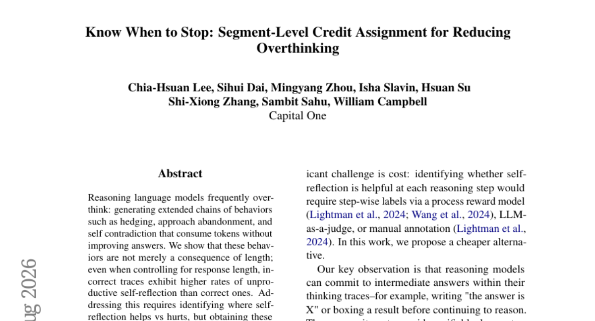

### 📌 한 줄 요약
추론 과정 중 불필요한 자기 반성(Overthinking)을 방지하기 위해 중간 정답 여부를 활용한 세그먼트 단위 보상 체계를 제안합니다.

### 🔑 핵심 포인트
- Overthinking이 단순히 길이의 문제가 아니라 비생산적 자기 반성에서 기인함을 규명
- 중간 답변 후보와 정답을 비교하여 별도의 라벨링 없이 보상을 계산하는 프록시 방법론 제안
- DASH 알고리즘을 통해 정답 방향으로 이끄는 세그먼트에 가중치를 두는 신용 할당(Credit Assignment) 구현

### 🧑‍💻 개발자 관점
LLM의 추론 토큰 소모를 줄이면서도 정답률을 높여야 하는 에이전트 및 수학적 추론 모델 최적화에 직접적인 영감을 줍니다.

### 🚀 실무 적용 아이디어
- GRPO와 같은 강화학습 프레임워크에 중간 단계 정답 여부를 보상 신호로 결합하는 실험 수행
- 모델의 추론 로그에서 '생산적 성찰'과 '비생산적 성찰'을 구분하는 지표(Proxy) 검증
- 길이 제약이 있는 환경에서 DASH 방식의 보상 체계가 성능에 미치는 영향 테스트

### ⚠️ 리스크/한계
- 중간 단계의 정답 여부가 항상 최종 정답을 보장하지 않으므로 잘못된 방향으로 학습될 위험 존재
- 복잡한 다단계 추론 문제에서 중간 정답 후보를 추출하는 과정의 신뢰도 의존성

### 📝 초록 기반 상세 설명
최근 추론형 언어 모델은 정답과 무관하게 불필요한 자기 반성이나 모순된 행동을 반복하는 'Overthinking' 문제를 겪고 있습니다. 연구 결과, 이러한 현상은 단순히 답변 길이가 길어서 발생하는 것이 아니라 잘못된 추론 과정에서 발생하는 비생산적 성찰 때문임이 밝혀졌습니다. 하지만 단계별 정답 여부를 일일이 라벨링하는 것은 비용이 매우 큽니다. 이를 해결하기 위해 중간 단계의 정답 후보와 최종 정답을 비교하여 보상을 할당하는 DASH(Drift Aware advantage SHaping) 기법을 제안합니다. 실험 결과, DASH는 수학 벤치마크에서 기존 GRPO 방식보다 높은 정확도를 기록하며 불필요한 추론을 효과적으로 억제했습니다.

---

## 35. [ReflectRL: Learning from Golden Negative Trajectories via Reflective-to-Direct Reasoning](https://huggingface.co/papers/2608.03972)
**Upvotes**: 1 | **도입 난이도**: 하 | **신뢰도**: 상
**arXiv**: https://arxiv.org/abs/2608.03972

**태그**: LLM, Reasoning, RLHF, Fine-tuning, Vision, Benchmark

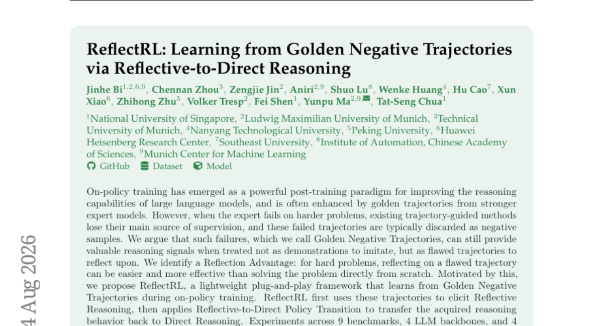

### 📌 한 줄 요약
실패한 전문가의 추론 경로를 학습 데이터로 활용하여 모델의 추론 능력을 강화하는 프레임워크

### 🔑 핵심 포인트
- 실패한 전문가 경로(Golden Negative Trajectories)를 유효한 학습 신호로 재정의
- 성찰적 추론을 통해 오류를 교정하고 이를 직접 추론 능력으로 전이하는 Reflective-to-Direct 구조
- 추가적인 대규모 학습 없이도 적용 가능한 가볍고 플러그앤플레이 방식의 프레임워크

### 🧑‍💻 개발자 관점
데이터 부족 상황에서 버려지는 실패 데이터를 고품질 학습 데이터로 전환할 수 있는 효율적인 방법론을 제시합니다.

### 🚀 실무 적용 아이디어
- 실패한 추론 로그를 활용한 데이터 증강 실험
- Reflective-to-Direct 전이 과정에서의 성능 손실 여부 검증
- 특정 도메인(수학, 코딩)에서의 성찰 효과 측정

### ⚠️ 리스크/한계
- 성찰 과정에서 모델이 잘못된 논리를 학습할 위험성 존재
- 성찰적 추론과 직접 추론 사이의 간극이 클 경우 성능 전이 효율 저하 가능성

### 📝 초록 기반 상세 설명
최근 LLM의 추론 능력 향상을 위해 전문가 모델의 데이터를 활용한 온폴리시(on-policy) 학습이 활발히 연구되고 있습니다. 그러나 전문가 모델조차 어려운 문제에서 실패할 경우, 기존 방식은 이러한 실패 경로를 단순히 버려지는 데이터로 취급하는 문제가 있습니다. 본 논문은 실패한 경로를 'Golden Negative Trajectories'로 정의하고, 이를 단순 모방이 아닌 성찰의 대상으로 활용하는 'Reflection Advantage' 개념을 제안합니다. 이를 위해 제안된 ReflectRL 프레임워크는 실패 경로로부터 성찰적 추론(Reflective Reasoning)을 유도한 뒤, 이를 직접 추론(Direct Reasoning) 능력으로 전이시키는 방식을 사용합니다. 실험 결과, 다양한 벤치마크와 백본 모델에서 최소한의 오버헤드로 일관된 성능 향상을 입증했습니다.

---

## 36. [ChronoLens: Measuring Language Change Across Time, Languages, and Linguistic Levels](https://huggingface.co/papers/2608.03507)
**Upvotes**: 1 | **도입 난이도**: 상 | **신뢰도**: 상
**arXiv**: https://arxiv.org/abs/2608.03507

**태그**: NLP, LLM, Language Change, Sparse Autoencoders, RAG

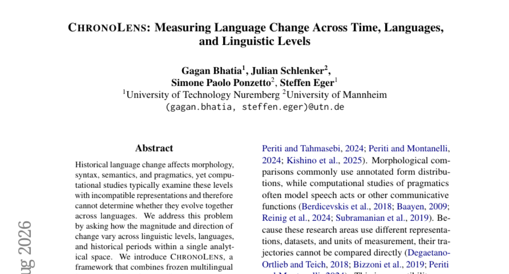

### 📌 한 줄 요약
다양한 언어적 층위와 시대적 변화를 통합적으로 측정할 수 있는 프레임워크 'ChronoLens' 제안

### 🔑 핵심 포인트
- 다국어 모델과 크로스코더를 결합하여 서로 다른 언어적 층위를 단일 분석 공간에서 비교 가능한 프레임워크 구축
- 희소 표현(Sparse Representations)을 통해 밀집 임베딩보다 정교한 언어 통계적 일치성 확보
- 언어 변화의 크기(magnitude)와 방향(direction)을 구분하여 다차원적 언어 진화 양상 규명

### 🧑‍💻 개발자 관점
LLM의 임베딩 공간이 시간에 따른 언어 변화를 어떻게 반영하는지 이해함으로써, 역사적 데이터나 특정 도메인 데이터로 모델을 미세 조정할 때 발생할 수 있는 의미론적 드리프트를 관리하는 데 도움을 줍니다.

### 🚀 실무 적용 아이디어
- 제안된 크로스코더 기법을 활용하여 특정 도메인 데이터의 시계열적 변화 측정 실험
- 기존 밀집 임베딩과 희소 표현 간의 언어적 특징 보존 능력 비교 테스트
- 다국어 모델의 임베딩 공간에서 언어 간 거리 변화 추적 실험

### ⚠️ 리스크/한계
- 희소 표현 추출 과정에서의 계산 복잡도 및 자원 소모 가능성
- 특정 시대/언어 데이터에 편향된 결과가 나올 수 있는 데이터셋 의존성

### 📝 초록 기반 상세 설명
언어 변화는 형태론, 통사론, 의미론 등 다양한 층위에서 발생하지만, 기존 연구들은 서로 호환되지 않는 표현 방식으로 인해 이들 간의 상관관계를 파악하기 어려웠습니다. 본 논문은 언어 변화의 크기와 방향이 언어적 층위, 언어 종류, 역사적 시기에 따라 어떻게 달라지는지 분석하고자 합니다. 이를 위해 고정된 다국어 언어 모델, 특징 정렬 크로스코더(feature-aligned crosscoders), 사후 언어적 개입을 결합한 'ChronoLens' 프레임워크를 도입했습니다. 1803년부터 2026년까지 5개 의회 전통의 약 172억 토큰 데이터를 분석한 결과, 제안된 희소 표현(sparse representations)이 기존 밀집 임베딩보다 언어 통계와 훨씬 더 높은 상관관계를 보였습니다. 연구 결과, 언어 내에서는 각 층위가 유사한 크기로 변화하지만 언어 간에는 변화의 시점과 방향이 뚜렷하게 다름을 확인했습니다. 이는 역사적 언어 변화가 구조적이고 다차원적인 과정임을 시사합니다.

---

## 37. [CURV: Enhancing Chart Understanding Through Curriculum Visual Grounded Reasoning](https://huggingface.co/papers/2608.02833)
**Upvotes**: 0 | **도입 난이도**: 중 | **신뢰도**: 상
**arXiv**: https://arxiv.org/abs/2608.02833

**태그**: Multimodal, Curriculum Learning, Chart QA, Visual Grounding, Reasoning, Benchmark

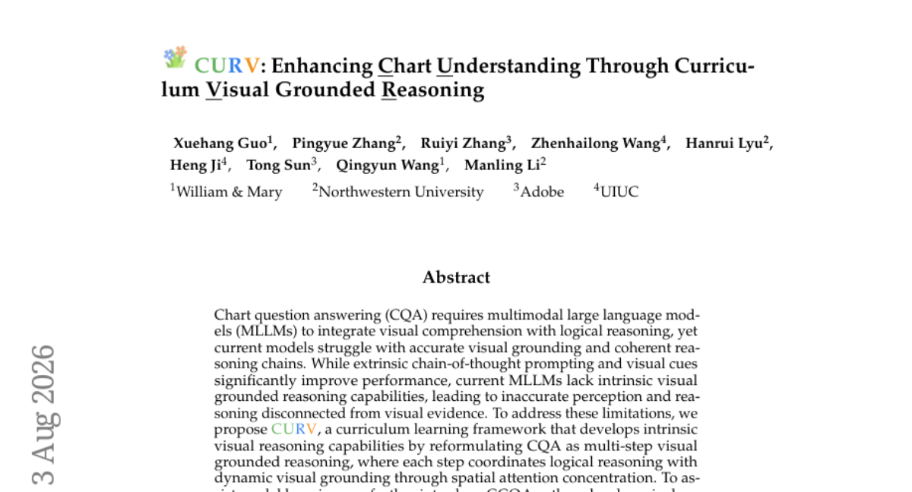

### 📌 한 줄 요약
커리큘럼 학습과 동적 시각적 근거(Visual Grounding)를 결합하여 차트 질의응답(CQA)의 추론 정확도를 높인 프레임워크

### 🔑 핵심 포인트
- 커리큘럼 학습을 통한 단계적 시각적 추론 능력 내재화
- 논리적 추론과 동적 시각적 근거(Visual Grounding)의 결합
- 다양한 차트 유형과 추론 패턴을 포함한 합성 데이터셋 CCQA 개발

### 🧑‍💻 개발자 관점
시각적 데이터(차트, 그래프)를 텍스트로 변환하거나 분석하는 AI 에이전트 개발 시, 단순 텍스트 추출을 넘어 시각적 근거에 기반한 정확한 추론 로직을 구축하는 데 유용합니다.

### 🚀 실무 적용 아이디어
- 제공된 CCQA 데이터셋을 활용하여 기존 MLLM의 차트 이해도 벤치마킹
- 커리큘럼 학습 단계(Single-op vs Multi-chart)에 따른 모델 성능 변화 분석
- 동적 시각적 근거(Dynamic Grounding) 메커니즘의 Attention Map 시각화 비교

### ⚠️ 리스크/한계
- 합성 데이터(Synthetic Data) 기반 학습으로 인한 실제 복잡한 차트에서의 일반화 이슈 가능성
- 단계별 커리큘럼 설계에 따른 학습 비용 및 복잡도 증가

### 📝 초록 기반 상세 설명
기존의 차트 질의응답(CQA) 모델은 시각적 이해와 논리적 추론을 결합하는 데 어려움을 겪으며, 시각적 근거와 추론 과정이 분리되는 문제가 있었습니다. 이를 해결하기 위해 논리적 추론과 동적 시각적 근거를 결합한 커리큘럼 학습 프레임워크인 CURV를 제안합니다. CURV는 단계별 추론 과정에서 공간적 주의 집중(Spatial Attention Concentration)을 통해 시각적 근거를 동적으로 확보합니다. 또한, 기초적인 단일 작업부터 복잡한 다중 차트 구성 작업까지 단계별로 학습할 수 있는 합성 데이터셋인 CCQA를 함께 도입했습니다. 실험 결과, CURV는 기존 베이스라인 대비 성능을 크게 향상시켰으며 실세계 벤치마크 및 도메인 외 작업에서도 우수한 일반화 성능을 입증했습니다.

---

