# 2026-08-09 Daily Papers (Top 30)

## 오늘의 요약
오늘의 연구는 에이전트의 학습 효율을 높이기 위한 강화학습 방법론과 비디오/3D 환경에서의 공간 인지 및 생성 기술에 집중되었습니다. 특히 외부 환경 의존도를 낮추고 모델 내부의 추론과 시뮬레이션을 통해 복잡한 태스크를 해결하려는 시도가 돋보였습니다.

### 오늘의 핵심 포인트
- 에이전트의 신용 할당 및 환경 역학 내재화를 통해 외부 상호작용 없이도 학습 효율을 극대화하는 연구들이 주목받았습니다.
- 비디오와 3D 생성 분야에서 전역적 공간 인지 능력과 대규모 오픈월드 생성 기술이 핵심 과제로 다뤄졌습니다.
- 멀티모달 검색 및 시각적 추론에서 실패 사례를 분석하고 잠재 상태를 재구성하여 정교한 의사결정을 유도하는 방법론이 제시되었습니다.

**오늘의 태그**: Agentic RL, Multimodal Learning, Spatial Intelligence, World Models

## 1. [AgentOPSD: Recursive Self-Distillation for Agentic Reinforcement Learning](https://huggingface.co/papers/2608.05987)
**Upvotes**: 75 | **도입 난이도**: 하 | **신뢰도**: 상
**arXiv**: https://arxiv.org/abs/2608.05987

**태그**: Agentic RL, Credit Assignment, Self-Distillation, Reinforcement Learning, Agent, Vision, Evaluation, Distillation

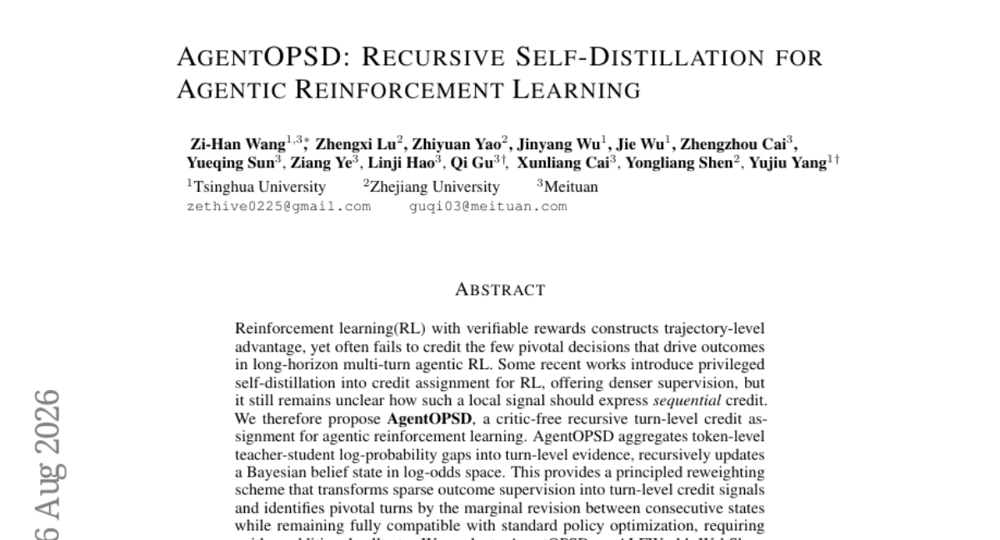

### 📌 한 줄 요약
희소한 보상 환경에서 에이전트의 결정적 순간을 식별하여 정교한 신용 할당(Credit Assignment)을 수행하는 재귀적 자기 증류 기법

### 🔑 핵심 포인트
- Critic 없이 토큰 수준의 로그 확률 차이를 활용한 턴 단위 신용 할당 방식 제안
- 베이지안 신념 업데이트를 통한 재귀적이고 원칙적인 신용 재가중(Reweighting) 스킴 도입
- 추가적인 Critic 모델이나 추가 롤아웃 없이 표준 정책 최적화와 호환 가능

### 🧑‍💻 개발자 관점
에이전트가 복잡한 태스크를 수행할 때 어떤 단계가 성공/실패의 핵심이었는지 명확히 구분하여 학습 효율을 극대화할 수 있습니다.

### 🚀 실무 적용 아이디어
- Qwen2.5와 같은 오픈 소스 모델에 GRPO와 비교 실험 수행
- 에이전트 작업의 턴 길이에 따른 신용 할당 정확도 변화 측정
- 베이지안 업데이트 파라미터가 학습 안정성에 미치는 영향 분석

### ⚠️ 리스크/한계
- 로그 확률 차이에 의존하므로 모델의 Log-prob 편향 발생 가능성
- 매우 긴 호흡의 태스크에서 베이지안 신념 업데이트의 수렴 안정성 검증 필요

### 📝 초록 기반 상세 설명
장기적인 에이전트 작업에서 결과 중심의 보상은 결정적인 의사결정 순간을 정확히 식별하는 데 어려움이 있습니다. 기존의 자기 증류 방식은 국소적인 신호 제공에는 유용하지만, 순차적인 신용 할당을 어떻게 표현할지에 대한 과제가 남아있습니다. 본 논문은 별도의 Critic 없이 토큰 간 로그 확률 차이를 활용하여 턴 단위의 신용을 할당하는 AgentOPSD를 제안합니다. 이 방법은 베이지안 신념 상태를 재귀적으로 업데이트하여 희소한 결과를 턴 단위의 신용 신호로 변환합니다. 실험 결과, ALFWorld 등에서 기존 GRPO 및 자기 증류 베이스라인을 상회하는 성능을 기록했습니다.

---

## 2. [OSReward: Instituting Standardized Evaluation for Cross-Platform Computer-Use Reward Models](https://huggingface.co/papers/2607.28609)
**Upvotes**: 60 | **도입 난이도**: 하 | **신뢰도**: 상
**arXiv**: https://arxiv.org/abs/2607.28609

**태그**: Agent, VLM, Reinforcement Learning, Benchmark, Reasoning, Vision, Evaluation, Safety

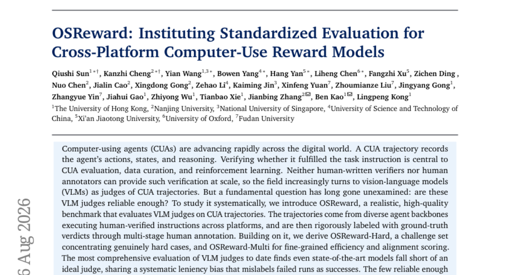

### 📌 한 줄 요약
컴퓨터 사용 에이전트(CUA) 평가를 위한 표준 벤치마크 OSReward와 저비용·고성능 보상 모델 OS-Shepherd를 제안합니다.

### 🔑 핵심 포인트
- CUA 궤적 검증을 위한 고품질 벤치마크 OSReward 및 난이도별 데이터셋(Hard, Multi) 구축
- 기존 VLM 판사들이 가진 체계적인 관용 편향(Leniency Bias) 발견 및 분석
- 저비용·고성능 보상 모델 OS-Shepherd(9B, 35B) 및 대규모 학습 데이터셋 공개

### 🧑‍💻 개발자 관점
에이전트 학습 시 인간의 개입 없이 자동화된 보상(Reward) 신호를 생성할 수 있는 신뢰할 수 있는 방법론을 제공합니다.

### 🚀 실무 적용 아이디어
- 공개된 OSReward 벤치마크를 사용하여 현재 사용 중인 VLM 판사의 편향성 테스트
- OS-Shepherd 모델을 기존 에이전트 RL(강화학습) 루프에 적용하여 비용 효율성 검증
- 제공된 OS-Shepherd-100K 데이터셋을 활용한 도메인 특화 보상 모델 파인튜닝

### ⚠️ 리스크/한계
- VLM 기반 판정 방식 자체의 근본적인 신뢰도 한계 존재 가능성
- 특정 플랫폼이나 도메인에 특화된 궤적에 대한 일반화 성능 이슈

### 📝 초록 기반 상세 설명
컴퓨터 사용 에이전트(CUA)의 발전으로 작업 수행 여부를 검증하는 것이 중요해졌으나, 인간 대신 VLM을 판사로 사용하는 방식의 신뢰성 문제는 미해결 과제로 남아있었습니다. 본 논문은 다양한 플랫폼의 에이전트 궤적을 포함하는 고품질 적합성 벤치마크인 OSReward를 도입하여 VLM 판사의 성능을 체계적으로 분석했습니다. 연구 결과, 최신 모델들조차 실패를 성공으로 오판하는 '관용 편향(leniency bias)' 문제를 보이며 신뢰도가 낮음을 확인했습니다. 이를 해결하기 위해 연구진은 추론 주석이 포함된 10만 개의 데이터셋(OS-Shepherd-100K)을 구축하고, 이를 학습한 저비용·고성능 보상 모델인 OS-Shepherd를 공개했습니다. 결과적으로 제안된 모델은 상용 모델 수준의 성능을 유지하면서도 비용을 30~60% 절감할 수 있음을 입증했습니다.

### 🖼️ 추가 자료
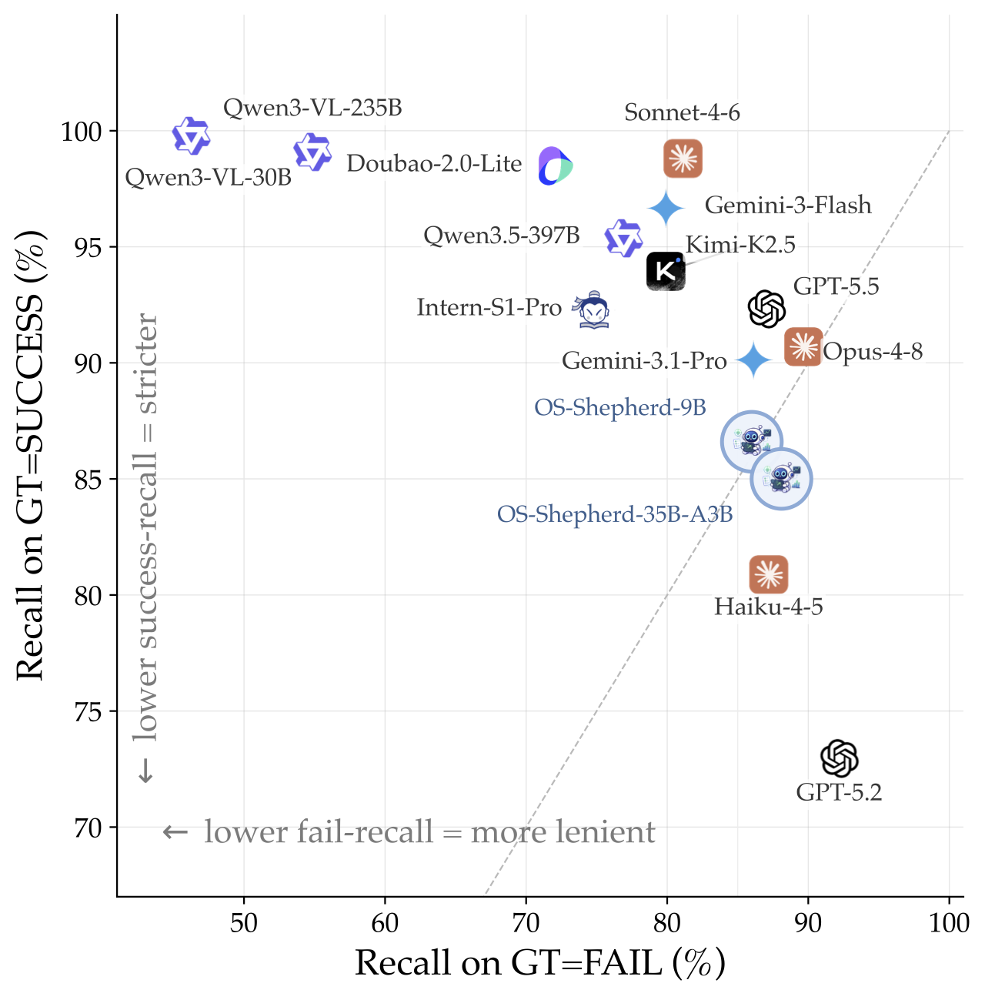
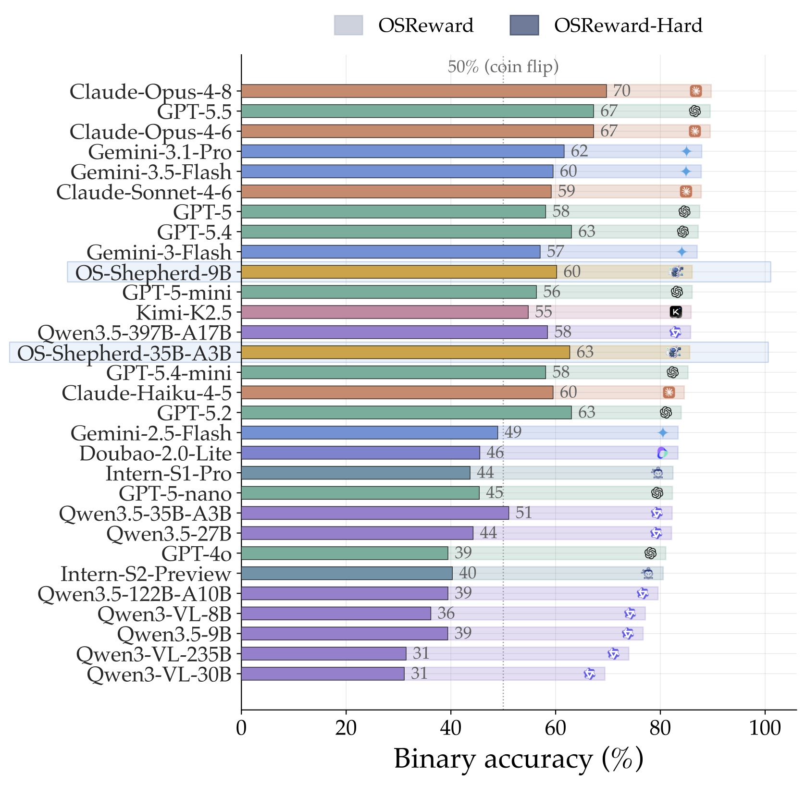
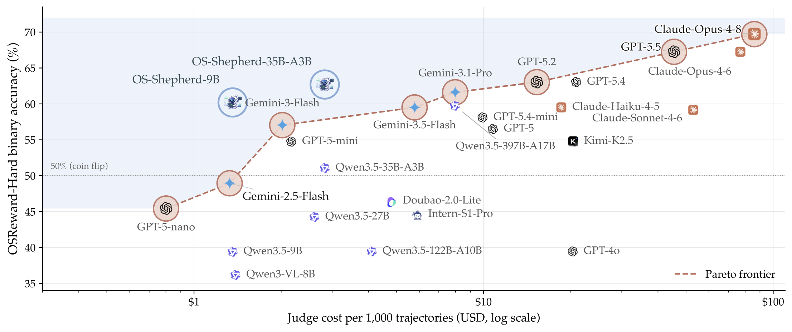

---

## 3. [Interpretable MEG Decoding of Perceived Speech: Cortical Sources and the Stimulus Features That Drive Retrieval](https://huggingface.co/papers/2608.01481)
**Upvotes**: 58 | **도입 난이도**: 상 | **신뢰도**: 상
**arXiv**: https://arxiv.org/abs/2608.01481

**태그**: Signal Processing, Deep Learning, Neuroscience, Model Interpretability, RAG, Audio, Evaluation, Optimization

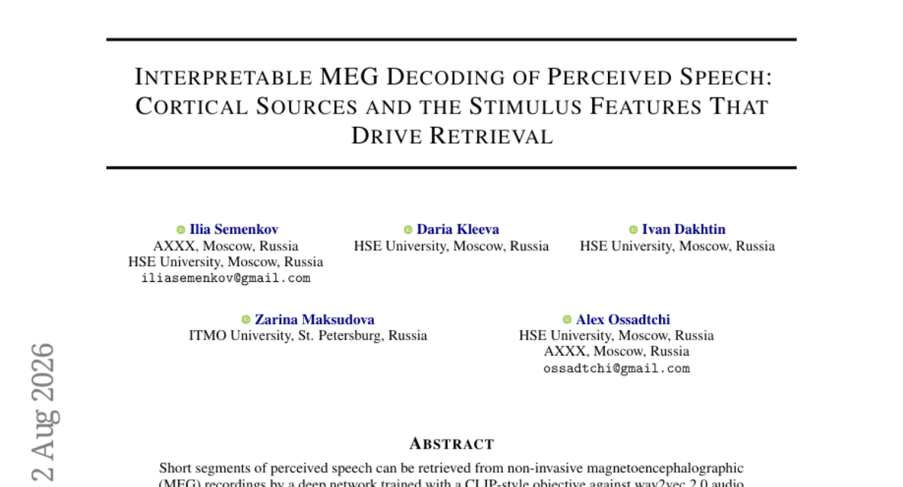

### 📌 한 줄 요약
구형 조화 함수(Spherical Harmonics) 기반의 모델 설계를 통해 적은 파라미터로도 뇌 신호에서 음성 정보를 정밀하게 복원하는 해석 가능한 디코딩 기술을 제안함

### 🔑 핵심 포인트
- 3차원 구형 조화 함수(Spherical Harmonics)를 활용한 공간 어텐션 설계로 생리학적 타당성 확보
- 파라미터 수를 20배 가량 줄이면서도 높은 Top-1 정확도를 유지하는 효율적인 디코더 구조 개발
- 음성 특징(무음, 강도, 모음 등)과 뇌 활동 간의 관계를 규명하여 모델의 해석 가능성 증명

### 🧑‍💻 개발자 관점
신호 처리 모델 설계 시 도메인 지식(기하학적 구조)을 결합하면 파라미터를 획기적으로 줄이면서도 물리적 의미를 갖는 모델을 만들 수 있음을 보여줍니다.

### 🚀 실무 적용 아이디어
- 3D 공간 정보를 반영한 구형 조화 함수 기반의 어텐션 메커니즘 구현 테스트
- 도메인 특화 필터(시간/공간)를 통한 모델 파라미터 압축 효과 검증
- 데이터 노이즈(안구/심장 등) 제거가 모델의 특징 추출 성능에 미치는 영향 분석

### ⚠️ 리스크/한계
- 특정 하드웨어(MEG 헤드 기하학)에 종속적인 모델 설계로 인한 범용성 제약 가능성
- 복잡한 생체 신호 데이터에 대한 높은 전처리 의존도

### 📝 초록 기반 상세 설명
기존의 MEG 기반 음성 복원 모델은 딥러닝 가중치가 생리학적 특성을 반영하지 못하며 어떤 음성 특징이 복원을 주도하는지 불분명했습니다. 이를 해결하기 위해 3차원 MEG 헤드 기하학을 반영한 구형 조화 함수 기반의 공간 어텐션과 시간 필터를 도입하여 모델을 재설계했습니다. 또한 안구 및 심장 노이즈를 제거하여 자극에 의한 지름길 학습(shortcut)을 방지했습니다. 실험 결과, 기존 대비 파라미터 수를 20배 줄이면서도 높은 정확도를 달성했으며, 모델 가중치가 실제 뇌의 음성 인지 네트워크와 일치함을 확인했습니다. 최종적으로 어떤 음성 특징이 복원에 기여하는지 분석하여 모델의 해석 가능성을 확보했습니다.

### 🖼️ 추가 자료

---

## 4. [WorldClaw: Agentic 3D Open-World Generation at Scale](https://huggingface.co/papers/2608.05248)
**Upvotes**: 50 | **도입 난이도**: 상 | **신뢰도**: 상
**arXiv**: https://arxiv.org/abs/2608.05248

**태그**: 3D Generation, Agentic Workflow, Open-World, Procedural Content, Agent

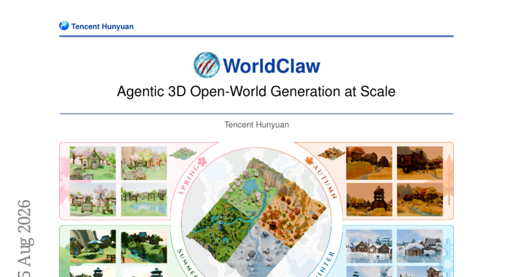

### 📌 한 줄 요약
에이전트 기반의 Coarse-to-Fine 프레임워크를 통해 대규모 3D 오픈월드와 편집 가능한 에셋을 동시에 생성하는 기술

### 🔑 핵심 포인트
- 에이전트 기반의 Coarse-to-Fine 전략을 통한 대규모 3D 장면 생성
- 전역적 지형 일관성과 지역적 디테일(편집 가능한 에셋) 간의 균형 유지
- 계획, 생성, 정교화 단계로 이어지는 구조적 워크플로우

### 🧑‍💻 개발자 관점
게임 개발이나 메타버스 환경 구축 시, 텍스트만으로 구조적 일관성과 편집 가능성을 모두 갖춘 대규모 맵을 자동 생성할 수 있는 가능성을 제시합니다.

### 🚀 실무 적용 아이디어
- 제시된 Coarse-to-Fine 워크플로우의 단계별 에이전트 역할 분담 구조 분석
- 생성된 메시(Mesh)의 편집 가능성과 다운스트림 엔진(Unity/Unreal) 호환성 검토
- 텍스트 프롬프트의 복잡도에 따른 지형-에셋 간의 일관성 유지 능력 테스트

### ⚠️ 리스크/한계
- 대규모 생성 시 계산 비용 및 에이전트 간 충돌 가능성
- 복잡한 지형과 객체 간의 물리적 접촉(Contact) 정밀도 한계

### 📝 초록 기반 상세 설명
텍스트 기반의 대규모 3D 월드 생성은 전역적 공간 일관성과 풍부한 지역 콘텐츠, 그리고 재사용 가능한 에셋 확보를 동시에 달성해야 하는 난제가 있습니다. 본 논문은 에이전트 중심의 Coarse-to-Fine 프레임워크인 WorldClaw를 제안합니다. 먼저 계획 에이전트가 텍스트를 구조화된 사양으로 변환하면, 시스템은 의미론적 레이아웃을 바탕으로 전역 지형 기초를 구축합니다. 이후 세부 묘사가 필요한 영역에 대해 지형 조건부 합성 및 편집 가능한 메시 재구성을 수행하며, 렌더링 기반 에이전트가 최종적인 외형과 접촉면을 정교화합니다. 결과적으로 WorldClaw는 일관된 지형 구조를 유지하면서도 시각적으로 매력적이고 편집 가능한 인스턴스 에셋을 포함한 대규모 장면을 생성합니다.

---

## 5. [GST-Bench: Can VLMs Develop Global Spatial Awareness from Video?](https://huggingface.co/papers/2608.05747)
**Upvotes**: 37 | **도입 난이도**: 하 | **신뢰도**: 상
**arXiv**: https://arxiv.org/abs/2608.05747

**태그**: VLM, Spatial-Intelligence, Video-Understanding, Embodied-AI, Agent, Reasoning, Vision, Video, Benchmark, Evaluation, Inference

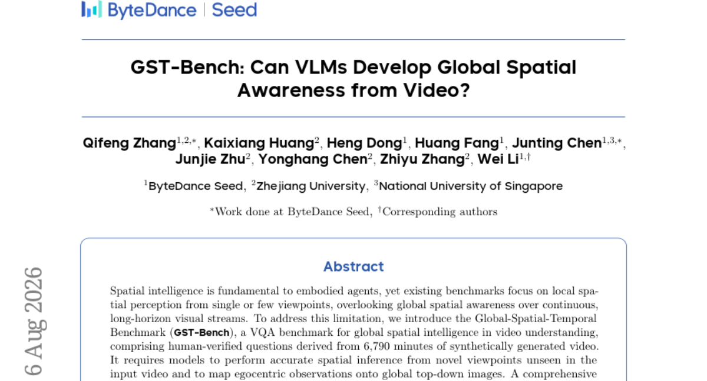

### 📌 한 줄 요약
비디오 내 장기적 관찰을 통한 전역적 공간 인지 능력을 평가하는 새로운 벤치마크 GST-Bench 제안

### 🔑 핵심 포인트
- 장기적 비디오 스트림을 통한 전역적 공간 인지 능력을 측정하는 GST-Bench 개발
- 국소적 인지와 전역적 장면 통합 사이의 성능 격차 규명
- 향후 연구를 위한 전역 공간 추론 학습용 데이터셋 GST-Train 제공

### 🧑‍💻 개발자 관점
로봇 공학이나 자율 주행 에이전트 개발 시, 단순 객체 인지를 넘어 환경 전체의 구조를 파악하는 능력을 검증하는 데 중요한 기준이 됩니다.

### 🚀 실무 적용 아이디어
- 현재 사용 중인 VLM 모델을 GST-Bench에 적용하여 공간 추론 성능 측정
- GST-Train 데이터셋을 활용하여 모델의 공간 일관성 파인튜닝 실험
- Local vs Global 태스크 간의 성능 차이를 분석하여 모델의 병목 지점 파악

### ⚠️ 리스크/한계
- 합성 데이터 기반 벤치마크이므로 실제 물리 환경과의 괴리가 존재할 수 있음
- 모델이 장기 기억(Long-term memory)을 활용하는 방식에 따라 성능 편차가 클 수 있음

### 📝 초록 기반 상세 설명
기존의 공간 지능 벤치마크는 단일 시점의 국소적 인지에 집중하여, 연속적인 비디오 스트림을 통한 전역적 공간 인지 능력을 평가하는 데 한계가 있었습니다. 이를 해결하기 위해 6,79می분 분량의 합성 비디오를 기반으로 한 GST-Bench를 도입했습니다. 이 벤치마크는 모델이 보지 못한 새로운 시점에서 공간을 추론하거나, 1인칭 관찰을 탑다운 이미지로 매핑하는 능력을 요구합니다. 22개의 최신 VLM을 평가한 결과, 모델의 성능은 인간의 성능에 크게 못 미치는 것으로 나타났습니다. 분석 결과, 모델은 국소적 이해는 뛰어나지만 장기적 관찰을 일관된 전역 장면으로 통합하는 데 어려움을 겪고 있었습니다. 연구팀은 이 문제를 해결하기 위한 학습용 데이터셋인 GST-Train도 함께 제공합니다.

---

## 6. [EnvACE: Internalizing Environment Dynamics via World Rehearsal for Agentic Reinforcement Learning](https://huggingface.co/papers/2608.06197)
**Upvotes**: 34 | **도입 난이도**: 중 | **신뢰도**: 상
**arXiv**: https://arxiv.org/abs/2608.06197

**태그**: LLM-Agent, Reinforcement-Learning, World-Model, Tool-Use, Agent, Evaluation

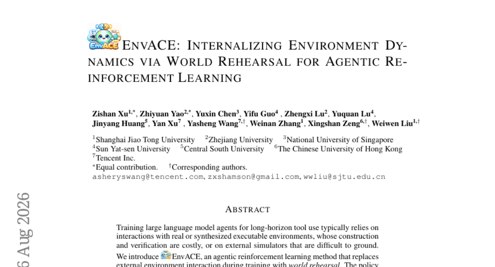

### 📌 한 줄 요약
외부 환경과의 상호작용 대신 모델이 스스로 환경 반응을 시뮬레이션하는 '월드 리허설'을 통해 에이전트 학습 효율을 극대화하는 방법론

### 🔑 핵심 포인트
- World Rehearsal: 외부 환경 없이 모델이 직접 환경 반응을 생성하며 학습하는 방식 도입
- End-to-End Optimization: 행동 생성과 환경 반응 생성을 하나의 정책 내에서 공동 최적화
- Internalized World Model: 학습된 파라미터가 환경 역학을 내재화하여 테스트 시 사전 시뮬레이션 가능

### 🧑‍💻 개발자 관점
환경 구축 비용이 큰 복잡한 도구 사용(Tool-use) 작업에서 외부 API 호출 없이도 모델 스스로 학습하고 검증할 수 있는 경로를 제시합니다.

### 🚀 실무 적용 아이디어
- 제공된 코드를 활용하여 특정 도구 사용 태스크에서의 학습 수렴 속도 비교
- 모델 규모(Scale) 변화에 따른 리허설 효과의 상관관계 분석
- 학습된 월드 모델이 새로운 환경(Out-of-distribution)에서 얼마나 잘 작동하는지 테스트

### ⚠️ 리스크/한계
- 모델이 생성한 가짜 환경 반응에 의한 환각(Hallucination) 및 편향 누적 위험
- 현실 세계의 복잡한 물리적/논리적 제약 조건을 완벽히 내재화하기 어려울 가능성

### 📝 초록 기반 상세 설명
LLM 에이전트 학습 시 외부 환경과의 상호작용이나 시뮬레이터 구축은 비용이 많이 들고 현실과의 괴리 문제가 발생합니다. 이를 해결하기 위해 외부 환경 대신 모델 내부에서 환경 반응을 생성하는 EnvACE 방식을 제안합니다. 학습 과정에서 정책(Policy)은 도구 호출과 그에 따른 환경 반응 생성(Rehearsal) 역할을 번갈아 수행하며 상호 최적화됩니다. 이 과정을 통해 모델은 행동과 환경 반응 사이의 관계를 파라미터 내부에 내재화하여 자체적인 월드 모델을 구축합니다. 실험 결과, 다양한 벤치마크에서 기존 환경 확장 방식보다 우수한 성능과 전이 학습 능력을 보여주었습니다.

---

## 7. [ChronoVision: Temporal Reasoning via Latent State Reconstruction](https://huggingface.co/papers/2608.05631)
**Upvotes**: 32 | **도입 난이도**: 상 | **신뢰도**: 상
**arXiv**: https://arxiv.org/abs/2608.05631

**태그**: Vision, Video-Understanding, Reinforcement-Learning, Multimodal, Reasoning, Video, Benchmark, Evaluation, Safety

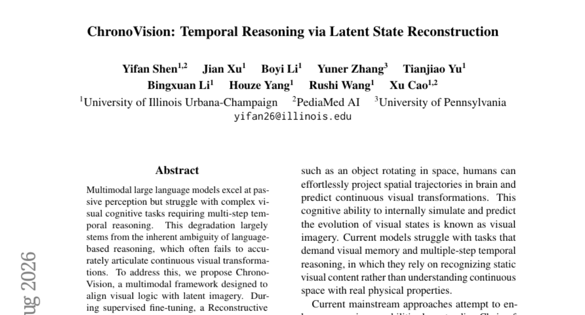

### 📌 한 줄 요약
잠재 상태 재구성을 통해 비디오의 연속적 변화를 정밀하게 추적하는 멀티모달 추론 프레임워크

### 🔑 핵심 포인트
- Reconstructive Visual Head를 통한 최종 변환 상태의 잠재 표현 예측
- ROI Attention Locating 모듈을 통한 시각적 증거 중심의 정밀한 포커싱
- 결과 정확도와 잠재 프로세스 정렬을 결합한 강화학습 기반의 사후 학습 전략

### 🧑‍💻 개발자 관점
비디오 내 객체의 움직임이나 상태 변화를 추적해야 하는 로봇 제어, 보안 관제, 영상 편집 자동화 분야의 핵심 기술이 될 수 있습니다.

### 🚀 실무 적용 아이디어
- Vbvr-VQA 데이터셋을 활용한 시간적 추론 벤치마크 테스트
- 잠재 상태 재구성 방식이 기존 비디오 모델의 시간적 일관성에 미치는 영향 분석
- RL 기반 보상 함수가 모델의 시각적 집중도(Attention)에 미치는 효과 검증

### ⚠️ 리스크/한계
- 잠재 상태 재구성에 따른 높은 연산 비용 및 복잡도
- 특정 도메인(이미지 순서 정렬)에 특화된 학습 방식이 일반적인 비디오 이해로 전이될지에 대한 불확실성

### 📝 초록 기반 상세 설명
기존 멀티모달 모델은 수동적 인지에는 능숙하지만, 복잡한 다단계 시간적 추론 작업에서는 성능이 저하되는 문제를 보입니다. 이는 언어 기반 추론이 연속적인 시각적 변화를 정확히 설명하지 못하는 모호성에서 기인합니다. 이를 해결하기 위해 최종 상태의 잠재 표현을 예측하는 Reconstructive Visual Head와 핵심 증거에 집중하는 ROI Attention Locating 모듈을 결합한 ChronoVision을 제안합니다. 학습 과정에서는 결과의 정확성, 잠재 프로세스 정렬, 비지도 시각적 집중도를 평가하는 복합 보상 함수를 통해 강화학습을 수행합니다. 실험 결과, 제안된 Vbvr-VQA 데이터셋과 까다로운 IntPhys2 벤치마크에서 SOTA 성능을 달성하며 시간적 추적 능력을 입증했습니다.

---

## 8. [Learning from Failures: Retrieval-Centric CoT via Hard Negatives for Unified Multimodal Retrieval](https://huggingface.co/papers/2608.06060)
**Upvotes**: 30 | **도입 난이도**: 상 | **신뢰도**: 상
**arXiv**: https://arxiv.org/abs/2608.06060

**태그**: Multimodal, Retrieval, CoT, Agent, RAG, Reasoning, Vision, Benchmark, Evaluation

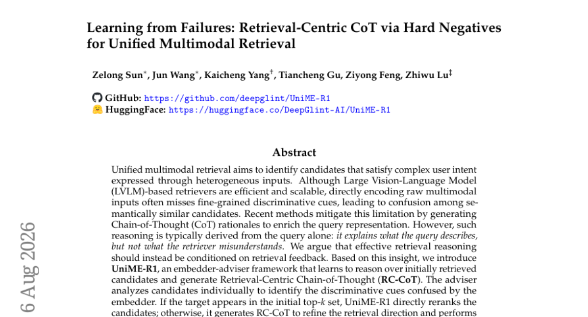

### 📌 한 줄 요약
실패 사례(Hard Negatives)를 학습하여 검색 실패 원인을 분석하고 이를 CoT로 정교화하는 멀티모달 검색 프레임워크 제안

### 🔑 핵심 포인트
- 검색 피드백을 활용하여 오답 원인을 분석하는 'Adviser' 프레임워크 도입
- 초기 검색 결과가 정답을 포함하지 않을 경우, RC-CoT를 통해 검색 방향을 재설정하는 동적 프로세스
- 하드 네거티브 마이닝과 강화 학습을 결합한 정교한 학습 전략

### 🧑‍💻 개발자 관점
단순히 쿼리를 설명하는 것을 넘어, 검색 결과(Candidates) 간의 차이를 식별하는 능력을 통해 RAG 시스템의 검색 정확도를 획기적으로 높일 수 있습니다.

### 🚀 실무 적용 아이디어
- 기존 RAG 파이프라인에 에이전트 기반의 '오답 분석' 단계 도입 가능성 검토
- Hard Negative를 생성하는 데이터 마이닝 로직 구현 실험
- CoT 생성 결과가 실제 검색 성능 향상으로 이어지는지 정성적 분석

### ⚠️ 리스크/한계
- Adviser가 후보군을 분석하는 과정에서 추가적인 연산 비용(Inference Latency) 발생
- 초기 검색 결과에 정답이 없을 경우, RC-CoT 생성 단계가 복잡도를 높일 수 있음

### 📝 초록 기반 상세 설명
멀티모달 검색은 복잡한 사용자 의도를 충족해야 하지만, 기존 LVLM 기반 방식은 미세한 차이를 구분하지 못해 유사한 후보 사이에서 혼동을 겪는 문제가 있습니다. 기존의 CoT 방식은 쿼리 설명에만 집중할 뿐, 검색 과정에서 발생하는 오답 원인을 분석하지 못한다는 한계가 있습니다. 본 논문은 검색 피드백을 기반으로 추론하는 UniME-R1 프레임워크를 제안합니다. 이 방식은 에드바이저(Adviser)가 초기 검색 결과에서 오답 원인을 식별하고, 이를 바탕으로 검색 중심의 CoT(RC-CoT)를 생성하여 검색 방향을 정교화합니다. 하드 네거티브를 활용한 강화 학습과 이중 모드 임베더를 통해 학습된 UniME-R1은 다양한 벤치마크에서 기존 모델 대비 우수한 성능을 입증했습니다.

---

## 9. [HarnessOpt-Bench: Evaluating LLMs at Harness Optimization](https://huggingface.co/papers/2608.06301)
**Upvotes**: 27 | **도입 난이도**: 중 | **신뢰도**: 상
**arXiv**: https://arxiv.org/abs/2608.06301

**태그**: LLM-Agent, Optimization, Benchmark, Automation, Agent, Evaluation

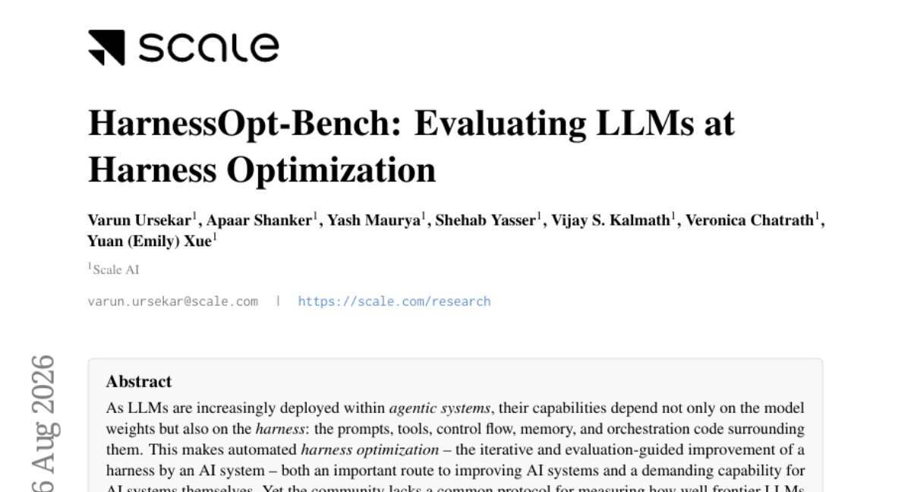

### 📌 한 줄 요약
LLM 에이전트의 성능을 결정하는 프롬프트, 도구, 제어 흐름 등 '하네스(Harness)'를 자동 최적화하는 능력을 측정하는 벤치마크 제안

### 🔑 핵심 포인트
- 에이전트 성능의 핵심인 '하네스(프롬프트, 도구, 제어 흐름 등)' 최적화 능력을 평가하는 벤치마크 개발
- 비용 효율적이고 신뢰할 수 있는 평가를 위해 TEE(신뢰 실행 환경) 기반의 격리된 평가 프로토콜 도입
- 모델의 최적화 역량과 하네스 구조 간의 상관관계 및 작업별 성능 편차 규명

### 🧑‍💻 개발자 관점
에이전트 시스템 구축 시 모델 교체만큼이나 프롬프트와 워크플로우(Harness)를 자동 개선하는 것이 성능 향상의 핵심임을 시사합니다.

### 🚀 실무 적용 아이디어
- 현재 운영 중인 에이전트의 프롬프트/도구 구성을 '하네스'로 정의하고 자동 개선 루프 설계해보기
- 동일한 모델이 서로 다른 프롬프트 구조(Harness)에서 얼마나 성능 차이를 보이는지 테스트하기
- 에이전트 최적화 시 평가 피드백(Feedback)을 어떻게 정형화하여 모델에 전달할지 실험하기

### ⚠️ 리스크/한계
- 하네스 최적화 과정에서 발생하는 비용(API 호출 등)과 연산 자원 소모가 클 수 있음
- 특정 작업(Task)에 과적합된 하네스가 생성될 위험이 있음

### 📝 초록 기반 상세 설명
LLM이 에이전트 시스템으로 진화함에 따라 모델 자체의 가중치만큼이나 이를 둘러싼 프롬프트, 도구, 오케스트레이션 코드인 '하네스'의 중요성이 커지고 있습니다. 그러나 기존에는 이러한 하네스 최적화 능력을 측정할 표준화된 프로토콜이 부족한 상황입니다. 본 논문은 비용이 많이 들고 확률적인 평가 환경에서 엔드투엔드 하네스 최적화 능력을 측정하는 'HarnessOpt-Bench'를 소개합니다. 실험 결과, 최적화 모델의 성능은 사용되는 코딩 하네스보다 모델 자체의 역량에 더 큰 영향을 받으며, 작업 유형에 따라 성능 차이가 크게 나타났습니다. 이를 통해 하네스 최적화가 AI 시스템의 핵심적이고 차별화된 역량임을 입증했습니다.

---

## 10. [From Economic Agents to Agentic Economies: A Systems Blueprint for Economic World Models](https://huggingface.co/papers/2608.06020)
**Upvotes**: 27 | **도입 난이도**: 상 | **신뢰도**: 상
**arXiv**: https://arxiv.org/abs/2608.06020

**태그**: Multi-Agent, Economic Simulation, LLM, Systems Design, Agent, Evaluation, Safety

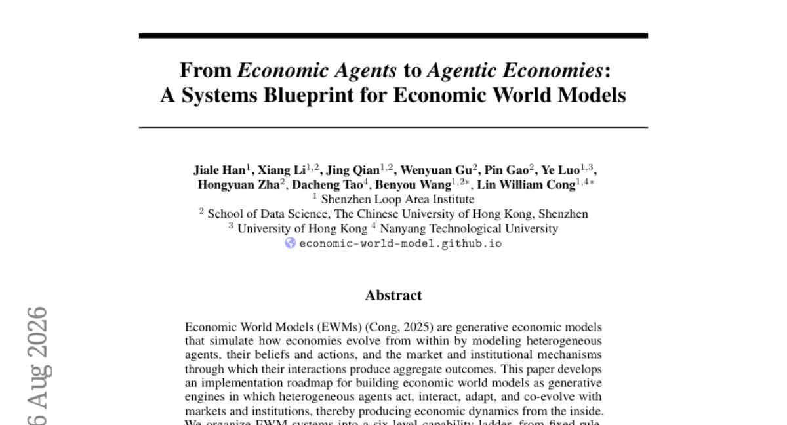

### 📌 한 줄 요약
에이전트 간 상호작용과 제도적 진화를 포함하는 차세대 경제 시뮬레이션 시스템(EWM) 구축을 위한 로드맵 제시

### 🔑 핵심 포인트
- 에이전트, 시장, 제도가 상호작용하며 거시 경제를 생성하는 EWM 시스템 프레임워크 제안
- 단순 시뮬레이션에서 실세계 정렬(Sim-to-Real)까지 이어지는 6단계 역량 사다리 정의
- AI 에이전트의 학습, 계획, 안전성 검증을 위한 고충실도 샌드박스로서의 활용 가능성 제시

### 🧑‍💻 개발자 관점
멀티 에이전트 시스템(MAS) 설계 시, 단순한 규칙 기반을 넘어 환경과 상호작용하며 진화하는 복잡계 시뮬레이션 아키텍처를 설계하는 데 가이드라인을 제공합니다.

### 🚀 실무 적용 아이디어
- LLM 기반 에이전트가 시장 규칙을 스스로 학습하고 변화시키는 프로토타입 구현
- 제시된 6단계 사다리 중 현재 보유한 기술 수준을 진단하고 다음 단계로의 이행 경로 설정
- 시뮬레이션 결과와 실제 경제 지표 간의 정렬(Alignment)을 위한 데이터 파이프라인 설계

### ⚠️ 리스크/한계
- 에이전트의 자가 진화 과정에서 발생할 수 있는 예측 불가능한 거시적 불안정성
- 시뮬레이션 환경과 실제 경제 데이터 간의 간극(Sim-to-Real gap) 해결의 어려움

### 📝 초록 기반 상세 설명
기존 경제 모델은 개별 주체의 행동과 시장 메커니즘이 결합되어 거시적 결과를 도출하는 복잡한 과정을 충분히 모사하지 못했습니다. 본 논문은 이질적 에이전트가 시장 및 제도와 상호작용하며 진화하는 '경제적 월드 모델(EWM)' 구축을 위한 구현 로드맵을 제안합니다. 연구진은 고정된 규칙 기반 환경부터 LLM 기반의 자가 진화형 환경까지 총 6단계의 역량 사다리를 정의했습니다. 문헌 조사 결과, 현재 연구는 하위 단계의 에이전트 시뮬레이션에 집중되어 있으며 자가 진화 및 실세계 정렬 기능은 부족한 상태입니다. 이 블루프린트는 인간 의사결정자를 위한 샌드박스이자 AI 에이전트의 학습 및 안전 검증 환경으로서 차세대 경제 시뮬레이션 발전을 가속화할 것입니다.

---

## 11. [DataSpace: Benchmarking Data Agents for Verifiable Analytics over Heterogeneous Workspaces](https://huggingface.co/papers/2608.03451)
**Upvotes**: 24 | **도입 난이도**: 중 | **신뢰도**: 상
**arXiv**: https://arxiv.org/abs/2608.03451

**태그**: Agent, Data-Analysis, Multimodal, Benchmark, RAG, Video, Evaluation, Safety

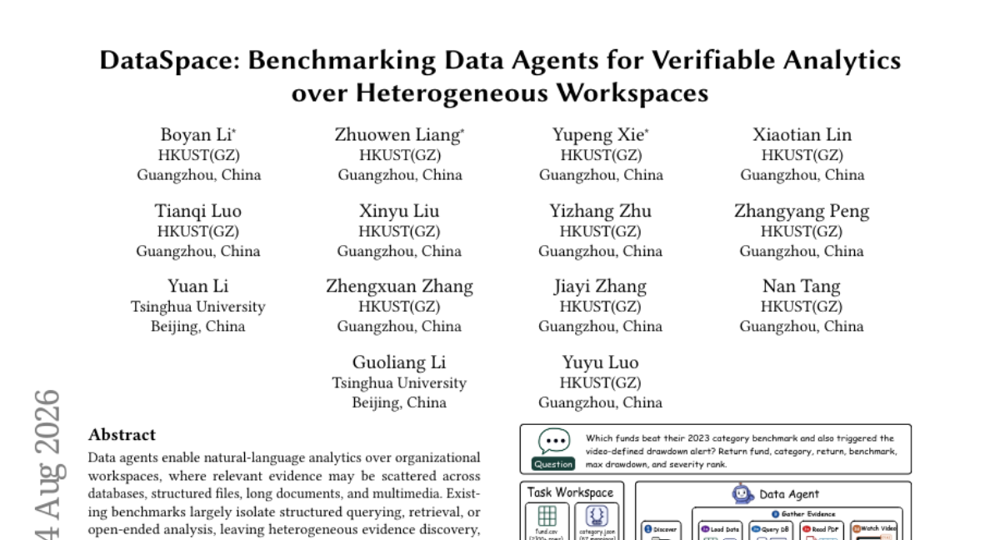

### 📌 한 줄 요약
이종 데이터 소스(DB, 파일, 멀티미디어 등)를 활용해 검증 가능한 표 형식의 분석 결과를 생성하는 데이터 에이전트 벤치마크 제안

### 🔑 핵심 포인트
- CSV, JSON, SQLite, PDF, 비디오 등 이종 데이터 소스를 통합한 15GB 규모의 벤치마크 구축
- 결과물의 정밀한 검증을 위한 헤더 불변 컬럼 정렬 및 타입/정밀도 기반의 결정론적 평가 방식 도입
- 데이터 생성 프레임워크(DataSpace-Builder)를 통한 고품질의 제약 조건 준수 데이터셋 확보

### 🧑‍💻 개발자 관점
단순 RAG를 넘어, 다양한 포맷의 데이터가 혼재된 실무 환경에서 에이전트의 분석 신뢰도를 측정하고 개선하는 데 직접적인 가이드를 제공합니다.

### 🚀 실무 적용 아이디어
- 제공된 벤치마크를 활용하여 현재 사용 중인 LLM의 데이터 분석 정확도 측정
- 멀티모달 데이터(PDF, 비디오) 결합 시 발생하는 성능 저하 원인 분석
- 에이전트 프레임워크(Harness) 변경에 따른 결과값 변동성 테스트

### ⚠️ 리스크/한계
- 멀티모달 증거 통합 및 조인 작업 시 모델 성능이 크게 저하되는 경향이 있음
- 에이전트 프레임워크(Harness) 설계에 따라 성능 차이가 크게 발생할 수 있음

### 📝 초록 기반 상세 설명
조직 내 흩어진 다양한 형식의 데이터를 활용한 자연어 분석 에이전트의 필요성이 커지고 있습니다. 기존 벤치마크는 구조화된 쿼리나 단순 검색에 치중되어 있어, 이종 데이터 통합 및 결정론적 평가가 어렵다는 문제가 있었습니다. 이를 해결하기 위해 다양한 데이터 형식(CSV, JSON, SQLite, PDF, 비디오 등)을 포함하는 합성 데이터셋인 DataSpace를 도입했습니다. DataSpace-Builder 프레임워크를 통해 생성된 410개의 태스크와 7,439개의 아티팩트를 바탕으로 에이전트의 성능을 정밀하게 평가합니다. 실험 결과, 최신 멀티모달 모델들의 성능이 아직 충분히 확보되지 않았으며 에이전트 프레임워크 선택에 따른 성능 편차가 큼을 확인했습니다.

---

## 12. [On-Policy Delta Distillation for Multilingual Math Reasoning](https://huggingface.co/papers/2608.05802)
**Upvotes**: 23 | **도입 난이도**: 중 | **신뢰도**: 상
**arXiv**: https://arxiv.org/abs/2608.05802

**태그**: LLM, Distillation, Multilingual, Reasoning

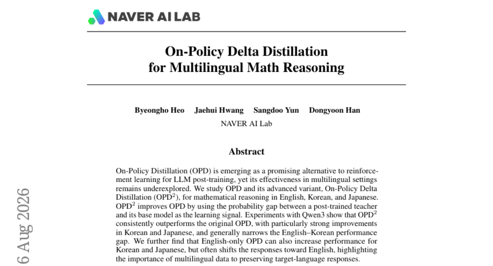

### 📌 한 줄 요약
수학적 추론 능력을 유지하면서 다국어 성능 격차를 줄이는 새로운 온폴리시 증류(OPD^2) 기법 제안

### 🔑 핵심 포인트
- 교사 모델과 베이스 모델 간의 확률 차이를 활용하는 OPD^2 기법 제안
- 영어, 한국어, 일본어 환경에서 수학적 추론 성능의 상향 평준화 달성
- 영어 전용 학습이 타겟 언어(한국어/일본어)의 응답 특성을 변화시킬 수 있음을 규명

### 🧑‍💻 개발자 관점
LLM의 특정 언어 성능을 높이면서도 언어 간 성능 격차를 줄이고 싶은 모델 최적화 엔지니어에게 유용한 방법론입니다.

### 🚀 실무 적용 아이디어
- 제안된 OPD^2 알고리즘을 오픈소스 모델(Llama, Qwen 등)에 적용하여 수학 추론 성능 비교
- 영어 데이터 비중 변화에 따른 한국어/일본어 응답 품질(Language Shift) 변화 측정
- 다국어 수학 데이터셋을 활용한 온폴리시 증류 파이프라인 구축

### ⚠️ 리스크/한계
- 영어 중심 데이터로 학습 시 타겟 언어의 고유한 응답 스타일이 상실될 위험이 있음
- 수학적 추론 외의 일반적인 대화형 태스크에서의 일반화 성능 검증 필요

### 📝 초록 기반 상세 설명
LLM 포스트 트레이닝에서 강화학습의 대안으로 온폴리시 증류(OPD)가 주목받고 있으나, 다국어 환경에서의 효과는 아직 충분히 연구되지 않았습니다. 본 논문은 영어, 한국어, 일본어 수학 추론을 대상으로 OPD와 그 개선 버전인 OPD^s를 연구합니다. OPD^s는 포스트 트레이닝된 교사 모델과 베이스 모델 간의 확률 차이를 학습 신호로 활용하여 성능을 높입니다. 실험 결과, Qwen3 모델에서 OPD^s가 기존 OPD를 일관되게 앞질렀으며 특히 한국어와 일본어 성능 향상이 두드러졌습니다. 또한 영어로만 학습할 경우 타겟 언어의 응답 특성이 영어로 편향될 수 있음을 확인하여 다국어 데이터의 중요성을 입증했습니다.

---

## 13. [Teaching Nemotron Greek: Mining a Corpus, Adapting Retrieval, and Grounding Generation for Modern Greek across Specialist Domains](https://huggingface.co/papers/2608.05138)
**Upvotes**: 23 | **도입 난이도**: 상 | **신뢰도**: 상
**arXiv**: https://arxiv.org/abs/2608.05138

**태그**: RAG, NLP, Fine-tuning, Information Retrieval, Vision, Benchmark, Evaluation

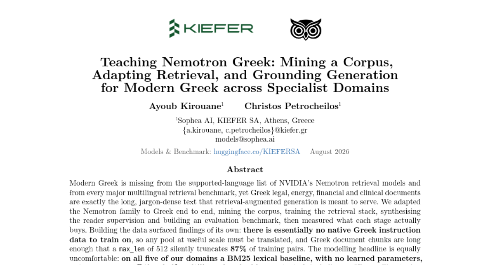

### 📌 한 줄 요약
특수 도메인(법률, 의료 등)을 위한 현대 그리스어 RAG 시스템 구축을 위한 엔드투엔드 적응 기술 및 벤치마크 제안

### 🔑 핵심 포인트
- 특수 도메인(법률, 의료 등)에 특화된 그리스어 RAG 엔드투엔드 파이프라인 구축
- Nemotron 임베더 및 MoE 리더 모델의 미세 조정을 통한 검색 및 생성 성능 극대화
- 그리스어 RAG 성능 측정을 위한 대규모 벤치마크 HERA 개발 및 모델 공개

### 🧑‍💻 개발자 관점
특정 언어나 전문 도메인 데이터가 부족한 상황에서 검색(Retrieval)과 생성(Generation) 모델을 어떻게 결합하여 성능을 끌어올릴 수 있는지에 대한 실무적 방법론을 제공합니다.

### 🚀 실무 적용 아이디어
- 특수 도메인 데이터셋을 활용한 임베딩 모델의 도메인 적응 실험
- LoRA를 이용한 MoE 모델의 생성(Reader) 성능 최적화 테스트
- BM25와 같은 전통적 방식과 최신 밀집 검색(Dense Retrieval) 모델 간의 성능 비교

### ⚠️ 리스크/한계
- 학습된 언어 능력이 일반 도메인으로 전이되지만 도메인에 따라 성능 차이가 발생할 수 있음
- 특수 도메인 데이터 의존도가 높아 데이터 확보가 어려운 언어/분야에서는 적용이 어려움

### 📝 초록 기반 상세 설명
현대 그리스어는 법률, 에너지, 금융 등 전문 분야 RAG에 중요함에도 불구하고 기존 다국어 검색 모델과 벤치마크에서 소외되어 있었습니다. 본 연구는 코퍼스 마이닝부터 리랭커, 리더 모델 미세 조정까지 포함하는 Nemotron 스택의 엔드투엔드 적응 과정을 제시합니다. 65,773개의 그리스어 검색 쌍을 활용한 미세 조정을 통해 Nemotron 1B 임베더의 성능을 크게 향상시켰습니다. 또한 30B MoE 모델을 LoRA로 튜닝하여 생성의 정확도와 근거 제시 능력을 개선했습니다. 마지막으로 그리스어 RAG 연구를 위한 새로운 벤치마크인 HERA를 도입하고 모델을 공개했습니다.

---

## 14. [World-to-Wrist: Task-Conditioned Future Wrist Modeling for Fine-Grained Robot Manipulation](https://huggingface.co/papers/2608.05369)
**Upvotes**: 20 | **도입 난이도**: 상 | **신뢰도**: 상
**arXiv**: https://arxiv.org/abs/2608.05369

**태그**: Robot-Manipulation, VLA-Model, Computer-Vision, Reinforcement-Learning, Vision

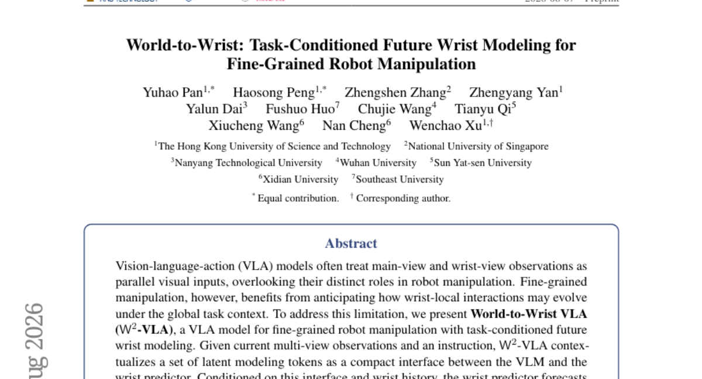

### 📌 한 줄 요약
전역적 작업 맥락을 반영한 미래 손목 시점 예측을 통해 정밀한 로봇 조작 성능을 극대화한 VLA 모델

### 🔑 핵심 포인트
- 전역적 작업 맥락과 국소적 손목 시점 간의 상호작용을 최적화하는 W2-VLA 프레임워크 제안
- 미래 손목 상태를 예측하여 액션 생성 시 미래 지향적 컨텍스트를 제공하는 잠재 토큰 인터페이스 도입
- W2-CoT를 통한 구조화된 주석 생성으로 정밀 조작을 위한 보조 감독(Auxiliary Supervision) 제공

### 🧑‍💻 개발자 관점
단순히 시각 정보를 나열하는 것을 넘어, 작업 목적에 따라 시점별 정보의 가중치를 다르게 처리하는 정밀 제어 전략을 배울 수 있습니다.

### 🚀 실무 적용 아이디어
- 다중 시점(Multi-view) 데이터셋에서 손목 시점의 비중을 조절하며 성능 변화 관찰
- W2-CoT와 같은 구조화된 텍스트 주석이 로봇의 물리적 움직임에 미치는 영향 분석
- 실시간 액션 생성(80Hz 이상) 환경에서의 추론 지연 시간(Latency) 최적화 실험

### ⚠️ 리스크/한계
- 미래 상태 예측 모델의 오차가 실제 액션 생성 시 누적되어 불안정성을 초래할 가능성
- 정밀한 조작을 위한 고품질의 구조화된 데이터(W2-CoT) 확보 및 생성 비용

### 📝 초록 기반 상세 설명
기존의 VLA 모델은 메인 뷰와 손목 뷰를 병렬적 입력으로만 취급하여 조작 시 각 시점의 역할 차이를 간과하는 문제가 있었습니다. 정밀한 조작을 위해서는 전역적 작업 맥락 하에서 손목 부위의 국소적 상호작용이 어떻게 변화할지 예측하는 것이 중요합니다. 이를 위해 본 논문은 작업 조건부 미래 손목 모델링을 수행하는 W2-VLA를 제안합니다. W2-VLA는 잠재 모델링 토큰을 인터페이스로 활용하여 관찰된 손목 이력으로부터 미래의 손목 상태를 예측하고, 이를 액션 생성의 컨텍스트로 사용합니다. 또한, 조작 진행 상황과 물리적 변화를 설명하는 W2-CoT 파이프라인을 통해 보조 학습을 수행합니다. 실험 결과, 다양한 로봇 조작 환경에서 정밀도와 접촉 민감도가 향상되었으며 80Hz 이상의 빠른 액션 생성 속도를 유지함을 확인했습니다.

---

## 15. [DyPES-VLA: Learning Shared Dynamics Priors and Embodiment-Specific Control for Cross-Embodiment Manipulation](https://huggingface.co/papers/2608.06374)
**Upvotes**: 18 | **도입 난이도**: 상 | **신뢰도**: 상
**arXiv**: https://arxiv.org/abs/2608.06374

**태그**: VLA, Robotics, MoE, Embodiment, Vision, Evaluation

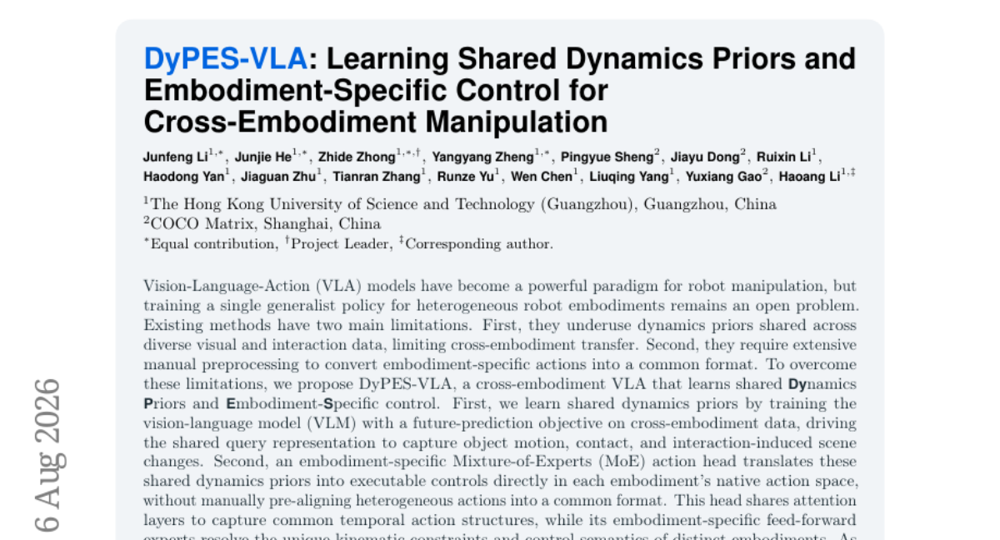

### 📌 한 줄 요약
서로 다른 로봇 하드웨어 간의 액션 형식을 통일할 필요 없이, 공유된 물리 역학 지식과 개별 로봇 제어기를 결합한 범용 VLA 모델 제안

### 🔑 핵심 포인트
- 미래 예측(future-prediction) 목적 함수를 통한 공유 역학 사전 지식(Dynamics Priors) 학습
- 수동 전처리 없이 각 로봇의 네이티브 액션 공간을 지원하는 MoE 기반 액션 헤드 설계
- 공통된 시간적 구조와 개별 로봇의 운동학적 제약을 동시에 해결하는 하이브리드 구조

### 🧑‍💻 개발자 관점
로봇 하드웨어가 바뀔 때마다 액션 공간을 맞추기 위해 데이터를 재가공할 필요 없이, 모델의 헤드만 교체하여 범용성을 확보할 수 있는 구조를 제시합니다.

### 🚀 실무 적용 아이디어
- 다양한 로봇 데이터셋을 결합하여 미래 상태 예측(future-prediction) 학습 성능 검증
- MoE 구조에서 전문가(Expert)가 각 로봇의 Kinematics를 얼마나 효과적으로 분리하는지 분석
- 기존의 액션 정렬(Action Alignment) 방식과 DyPES-VLA의 효율성 비교 실험

### ⚠️ 리스크/한계
- 로봇의 종류가 극단적으로 다를 경우(예: 팔 vs 바퀴형) MoE 전문가가 이를 모두 수용할 수 있는지 여부
- 미래 예측 학습 시 발생하는 데이터 노이즈가 전체 정책의 안정성에 미치는 영향

### 📝 초록 기반 상세 설명
기존의 Vision-Language-Action (VLA) 모델은 서로 다른 형태의 로봇(heterogeneous embodiments)을 하나의 정책으로 학습하는 데 어려움이 있었습니다. 특히 다양한 데이터에 담긴 공통적인 물리 역학(dynamics priors)을 충분히 활용하지 못하며, 서로 다른 로봇의 액션을 공통 포맷으로 변환하는 수동 전처리 과정이 필수적이었습니다. 이를 해결하기 위해 DyPES-VLA는 미래 예측 학습을 통해 물체의 움직임과 상호작용을 포착하는 공유 역학 사전 지식을 학습합니다. 동시에 MoE(Mixture-of-Experts) 구조의 액션 헤드를 도입하여, 공유된 지식을 각 로봇의 고유한 제어 공간으로 직접 변환합니다. 결과적으로 수동 정렬 없이도 다양한 시뮬레이션 및 실세계 환경에서 SOTA 성능을 달성했습니다.

### 🖼️ 추가 자료
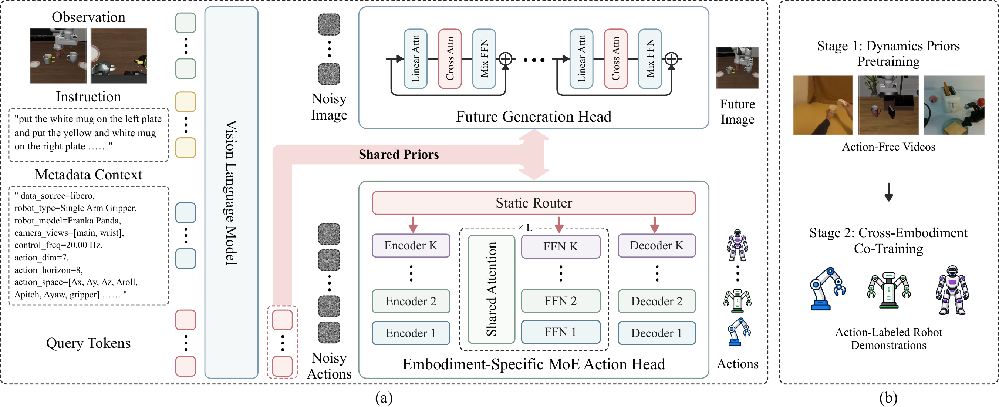

---

## 16. [Activity Frames: Deterministic Screen-Activity Compilation for Agent Memory and Replay](https://huggingface.co/papers/2608.05784)
**Upvotes**: 18 | **도입 난이도**: 중 | **신뢰도**: 상
**arXiv**: https://arxiv.org/abs/2608.05784

**태그**: Agent, Automation, Data-Engineering, Efficiency, Evaluation, Inference

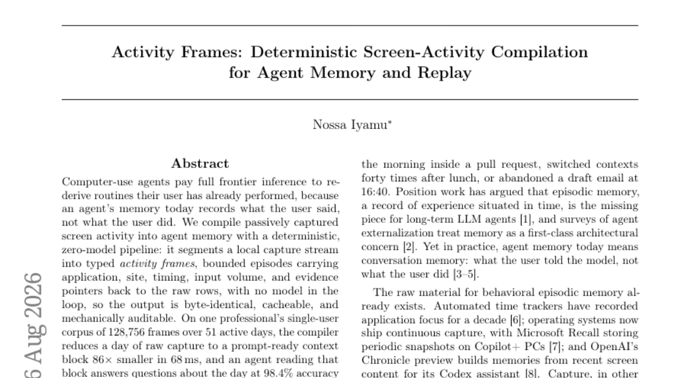

### 📌 한 줄 요약
모델 없이 화면 활동을 구조화된 데이터로 컴파일하여 에이전트의 메모리 효율과 재현성을 극대화하는 기술

### 🔑 핵심 포인트
- 모델 없이(Zero-model) 화면 활동을 구조화된 프레임으로 변환하는 결정론적 컴파일러 개발
- 원시 캡처 데이터를 86배 압축하여 에이전트가 즉시 읽을 수 있는 컨텍스트 블록으로 변환
- LLM 요약 대비 높은 정확도(98.4%)와 낮은 비용, 기계적 감사(audit)가 가능한 데이터 구조 제공

### 🧑‍💻 개발자 관점
에이전트가 사용자의 행동을 단순히 텍스트로 요약하는 대신, 구조화된 로그를 통해 저비용·고정밀로 과거 작업을 재현하거나 학습할 수 있는 기반을 제공합니다.

### 🚀 실무 적용 아이디어
- 사용자 화면 캡처 데이터를 구조화된 스키마로 변환하는 파이프라인 프로토타이핑
- LLM 기반 요약 방식과 결정론적 프레임 방식의 비용 대비 성능(ROI) 비교 실험
- 에이전트의 메모리 검색(Retrieval) 성능 향상을 위한 프레임 기반 RAG 테스트

### ⚠️ 리스크/한계
- 사용자의 개인정보 및 민감한 화면 데이터 노출 리스크
- 다양한 애플리케이션 환경에서의 스키마 호환성 및 범용성 확보 문제

### 📝 초록 기반 상세 설명
현재의 컴퓨터 사용 에이전트는 사용자의 과거 행동을 재학습하기 위해 과도한 추론 비용을 지불하고 있습니다. 이는 에이전트의 메모리가 사용자의 말(텍스트) 위주로 기록될 뿐, 실제 수행된 행동(화면 활동)을 구조적으로 저장하지 않기 때문입니다. 본 논문은 캡처된 화면 스트림을 모델 개입 없이 결정론적(deterministic) 방식으로 구조화된 '액티비티 프레임'으로 변환하는 컴파일러를 제안합니다. 실험 결과, 이 방식은 원시 데이터를 86배 압축하면서도 질문 답변 정확도를 98.4%까지 높였으며, LLM 요약 방식보다 월등한 성능을 보였습니다. 또한, 이 기술은 루틴의 오버헤드와 재발생률을 측정하여 에이전트 비용 모델을 최적화하는 데 기여합니다.

### 🖼️ 추가 자료
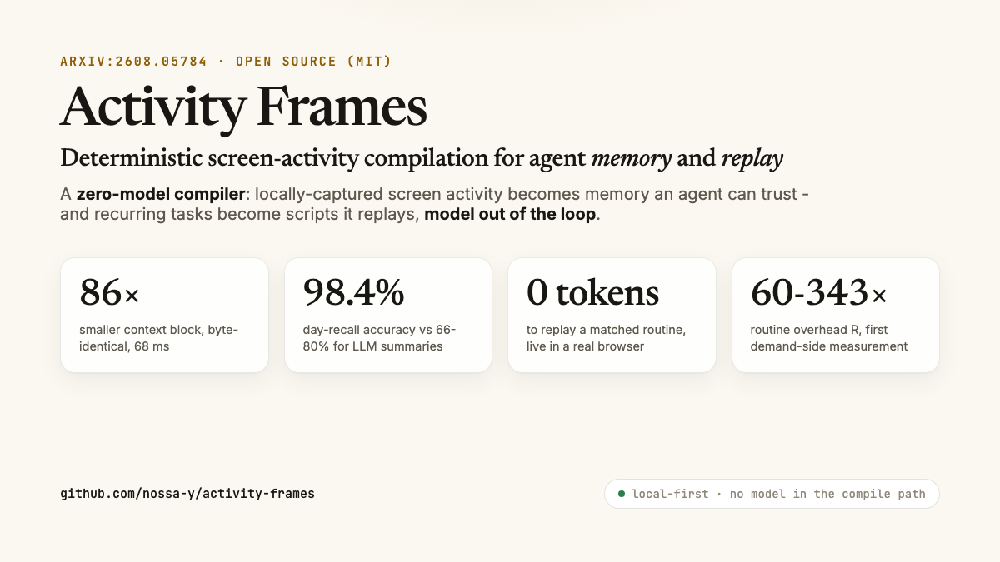

---

## 17. [SmartMage: Dynamic Modality Orchestration for 3D Scene Understanding](https://huggingface.co/papers/2608.05137)
**Upvotes**: 18 | **도입 난이도**: 중 | **신뢰도**: 상
**arXiv**: https://arxiv.org/abs/2608.05137

**태그**: 3D Vision, Multimodal, Efficient AI, LLM, RAG, Reasoning, Video, Benchmark, Safety

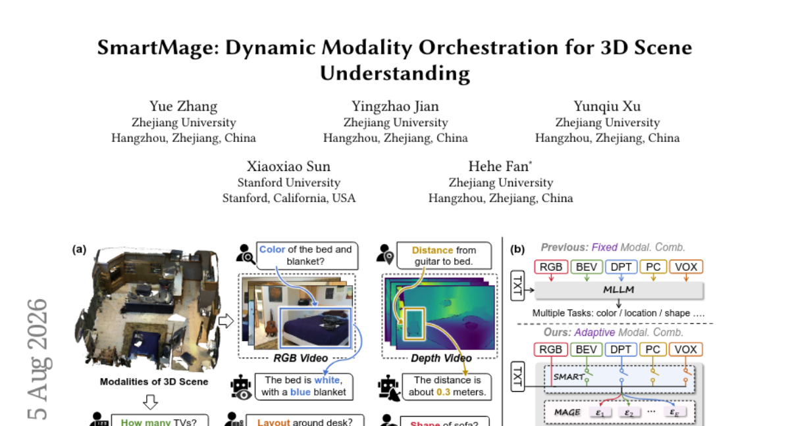

### 📌 한 줄 요약
쿼리 의도에 따라 필요한 모달리티만 동적으로 선택하여 연산 효율과 추론 정확도를 동시에 높인 3D 장면 이해 모델

### 🔑 핵심 포인트
- SMART 모듈: 의미적 사전 지식과 텍스트-모달리티 정렬을 통한 동적 모달리티 선택
- MAGE 모듈: 모달리티별 특성을 고려한 전문가(Expert) 활성화로 적응형 추론 구현
- 쿼리 의도에 최적화된 모달리티 조합을 통해 노이즈 제거 및 연산 효율성 확보

### 🧑‍💻 개발자 관점
고정된 멀티모달 입력 대신 쿼리에 따라 필요한 데이터만 선택함으로써, 리소스가 제한된 환경에서 효율적인 멀티모달 추론 시스템을 설계할 수 있는 아이디어를 제공합니다.

### 🚀 실무 적용 아이디어
- 다양한 모달리티(RGB, Depth, Point Cloud)를 가진 데이터셋에 SMART 모듈의 선택 로직 적용 실험
- 특정 쿼리 유형(예: 물체 식별 vs 공간 구조 파악)에 따른 모달리티 선택 패턴 분석
- 고정형 MLLM 대비 SmartMage의 추론 속도 및 연산 비용(FLOPs) 비교 테스트

### ⚠️ 리스크/한계
- 모달리티 선택 과정에서 잘못된 판단이 발생할 경우 정보 손실로 인한 성능 급락 위험
- 동적 라우팅 구조로 인해 모델 구조가 복잡해지고 학습 난이도가 상승할 수 있음

### 📝 초록 기반 상세 설명
3D 장면 이해를 위해서는 시각 및 기하학적 정보 등 다양한 모달리티의 결합이 필수적입니다. 기존 MLLM은 고정된 모달리티 조합을 사용하여 쿼리와 무관한 노이즈를 유입시키거나 유용한 정보를 활용하지 못하는 문제가 있었습니다. 이를 해결하기 위해 본 논문은 쿼리 의도에 따라 모달리티를 동적으로 오케스트레이션하는 SmartMage를 제안합니다. SMART 모듈은 의미적 사전 지식과 품질을 바탕으로 관련 모달리티를 선택하며, MAGE 모듈은 전문가 활성화를 가이드하여 적응형 추론을 수행합니다. 실험 결과, 5개의 3D 벤치마크에서 SOTA를 달성하며 모달리티 선택의 효과를 입증했습니다.

---

## 18. [EffectLearner: World-Aware Object-Effect Reasoning for Real-World Video Object Removal](https://huggingface.co/papers/2608.05565)
**Upvotes**: 16 | **도입 난이도**: 상 | **신뢰도**: 상
**arXiv**: https://arxiv.org/abs/2608.05565

**태그**: Video Editing, Diffusion Transformer, VLM, Computer Vision, RAG, Reasoning, Vision, Video, Evaluation

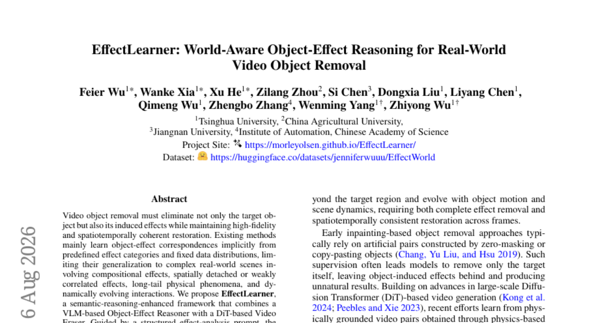

### 📌 한 줄 요약
VLM의 의미론적 추론을 결합하여 객체 제거 시 발생하는 물리적 효과(그림자, 반사 등)까지 정교하게 복원하는 비디오 객체 제거 프레임워크

### 🔑 핵심 포인트
- VLM 기반의 의미론적 추론을 통한 객체-효과 간의 정교한 관계 파악
- DiT(Diffusion Transformer)를 활용한 고품질 비디오 복원 및 시공간적 일관성 유지
- 복잡한 물리적 효과 학습을 위한 전용 데이터셋(EffectWorld) 및 커리큘럼 학습 도입

### 🧑‍💻 개발자 관점
단순한 픽셀 채우기를 넘어 물리적 상호작용(그림자, 반사 등)까지 고려해야 하는 고난도 영상 편집 및 VFX 자동화 작업에 실질적인 가이드를 제공합니다.

### 🚀 실무 적용 아이디어
- 제시된 EffectWorld 데이터셋의 구성 방식과 데이터 증강 기법 분석
- VLM 프롬프트 구조가 DiT의 생성 결과에 미치는 영향도 실험
- 기존 Diffusion 기반 Inpainting 모델과의 복원 품질 비교 테스트

### ⚠️ 리스크/한계
- VLM의 추론 비용으로 인한 실시간 영상 처리 적용의 어려움
- 매우 복잡하거나 예측 불가능한 물리 현상에 대한 일반화 한계 가능성

### 📝 초록 기반 상세 설명
기존의 비디오 객체 제거 방식은 정해진 카테고리와 고정된 데이터 분포 내에서만 효과를 학습하여, 복잡한 현실 세계의 동적인 상호작용이나 비정형적 효과를 처리하는 데 한계가 있었습니다. 이를 해결하기 위해 본 논문은 VLM 기반의 'Object-Effect Reasoner'와 DiT 기반의 'Video Eraser'를 결합한 EffectLearner 프레임워크를 제안합니다. Reasoner는 구조화된 프롬프트를 통해 객체와 그로 인한 효과 간의 관계를 추론하고, 추출된 문맥 정보를 Eraser에 전달하여 정교한 제거를 유도합니다. 또한 모션 인식 마스크 가이드와 모션 일관성 감독을 통해 움직이는 객체와 변화하는 장면에서도 안정적인 복원 성능을 확보했습니다. 마지막으로 복잡한 효과 학습을 위한 EffectWorld 데이터셋과 단계적 학습 커리큘럼을 도입하여 성능을 극대화했습니다.

---

## 19. [CalibForge: Adversarial Solver Calibration for Scaling Learnable Terminal Tasks](https://huggingface.co/papers/2608.06352)
**Upvotes**: 15 | **도입 난이도**: 중 | **신뢰도**: 상
**arXiv**: https://arxiv.org/abs/2608.06352

**태그**: Agent, Data Synthesis, Adversarial Learning, Automated Testing, Vision

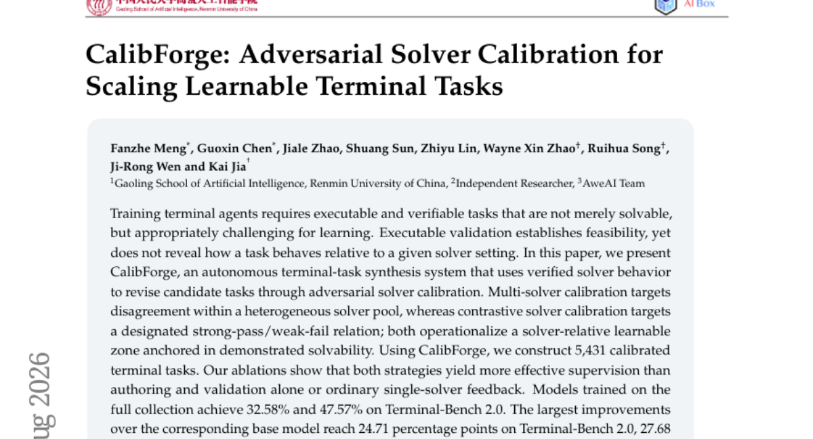

### 📌 한 줄 요약
에이전트 학습을 위해 솔버의 성능에 맞춰 난이도를 자동 조절하는 적대적 태스크 합성 프레임워크 제안

### 🔑 핵심 포인트
- 솔버의 성능에 맞춰 태스크 난이도를 최적화하는 적대적 교정(Adversarial Calibration) 기법 도입
- 다중 솔버 간 불일치 및 강약 관계를 활용한 두 가지 태스크 합성 전략 제안
- 대규모 검증된 태스크셋 구축을 통한 에이전트 학습 효율 및 전이 성능 극대화

### 🧑‍💻 개발자 관점
에이전트 학습용 데이터셋 구축 시, 단순히 '풀 수 있는 문제'를 넘어 모델의 현재 실력에 딱 맞는 '학습 가능한 난이도'를 자동 생성할 수 있음을 보여줍니다.

### 🚀 실무 적용 아이디어
- 특정 도메인(예: 코딩, SQL)에 대해 기존 솔버들을 활용한 난이도 조절 파이프라인 구축 실험
- 생성된 태스크가 모델의 일반화 성능에 미치는 영향 분석
- 단일 솔버 피드백과 비교하여 다중 솔버 교정의 효율성 검증

### ⚠️ 리스크/한계
- 솔버의 성능에 의존적인 태스크 생성으로 인해 특정 솔버에 과적합될 위험 존재
- 태스크 합성 과정에서의 계산 비용 및 복잡도 증가

### 📝 초록 기반 상세 설명
터미널 에이전트 학습을 위해서는 실행 가능할 뿐만 아니라 학습에 적절한 난이도를 가진 태스크가 필요합니다. 기존의 실행 가능성 검증만으로는 특정 솔버 설정에 따른 태스크의 난이도 변화를 파악하기 어렵다는 문제가 있습니다. 본 논문은 검증된 솔버 동작을 활용해 후보 태스크를 수정하는 자동화된 태스크 합성 시스템인 CalibForge를 제안합니다. 이 시스템은 솔버 간의 불일치를 이용하는 다중 솔버 교정 방식과 강약 관계를 이용하는 대조적 교정 방식을 통해 솔버 상대적 학습 영역을 구축합니다. 실험 결과, CalibForge로 생성된 5,431개의 태스크는 기존 방식보다 효과적인 감독 신호를 제공하며 다양한 벤치마크에서 성능 향상을 입증했습니다.

---

## 20. [MameLoshnLM: Yiddish Language Model and Evaluation Benchmark](https://huggingface.co/papers/2608.05850)
**Upvotes**: 14 | **도입 난이도**: 하 | **신뢰도**: 상
**arXiv**: https://arxiv.org/abs/2608.05850

**태그**: NLP, LLM, Low-resource Language, Fine-tuning, Benchmark, Evaluation

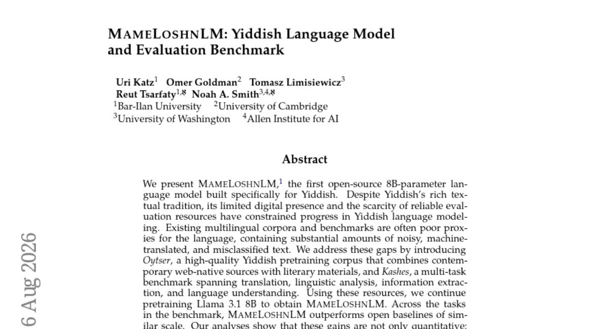

### 📌 한 줄 요약
Yiddish 언어 모델링을 위해 고품질 코퍼스와 벤치마크를 구축하고 Llama 3.1 기반의 전용 모델을 개발함

### 🔑 핵심 포인트
- 고품질 Yiddish 코퍼스 'Oytser' 및 다중 작업 벤치마크 'Kashes' 구축
- Llama 3.1 8B를 기반으로 한 Yiddish 특화 8B 모델 MameLoshnLM 개발
- 노이즈 섞인 웹 데이터가 저자원 언어 모델링에 미치는 부정적 영향 규명

### 🧑‍💻 개발자 관점
데이터가 부족한 저자원 언어(Low-resource language)를 위한 고품질 데이터 구축 및 특화 모델 학습 방법론을 제시합니다.

### 🚀 실무 적용 아이디어
- 제공된 Oytser 코퍼스를 활용한 다른 소규모 언어 모델의 파인튜닝 실험
- Kashes 벤치마크를 활용한 기존 다국어 모델의 언어별 성능 비교 테스트
- Llama 3.1 기반의 지속 사전 학습(Continual Pretraining) 파이프라인 적용

### ⚠️ 리스크/한계
- 8B 규모 모델로 특정 언어에 특화되어 있어 범용적인 작업 성능은 제한적일 수 있음
- 데이터 소스의 편향성이 모델의 언어적 특성에 반영될 가능성 존재

### 📝 초록 기반 상세 설명
Yiddish는 풍부한 문학적 전통에도 불구하고 디지털 데이터 부족과 노이즈 섞인 다국어 데이터로 인해 언어 모델링에 어려움이 있었습니다. 이를 해결하기 위해 웹 소스와 문학 자료를 결합한 고품질 코퍼스 'Oytser'와 다중 작업 벤치마크 'Kashes'를 제안합니다. 연구진은 이 자원들을 활용하여 Llama 3.1 8B 모델을 Yiddish로 지속 사전 학습(Continual Pretraining)하여 MameLoshnLM을 개발했습니다. 실험 결과, MameLoshnLM은 유사 규모의 오픈 소스 베이스라인 모델들을 능가하는 성능을 보였습니다. 또한 일반 목적의 다국어 모델과 비교했을 때 Yiddish 특유의 어휘 및 형태론적 패턴을 더 잘 포착함을 입증했습니다.

---

## 21. [PaDoc: Layout-Grounded Parallel Decoding for Document Parsing](https://huggingface.co/papers/2608.06146)
**Upvotes**: 14 | **도입 난이도**: 상 | **신뢰도**: 상
**arXiv**: https://arxiv.org/abs/2608.06146

**태그**: Document Parsing, MLLM, Parallel Decoding, Efficiency, RAG, Evaluation, Inference

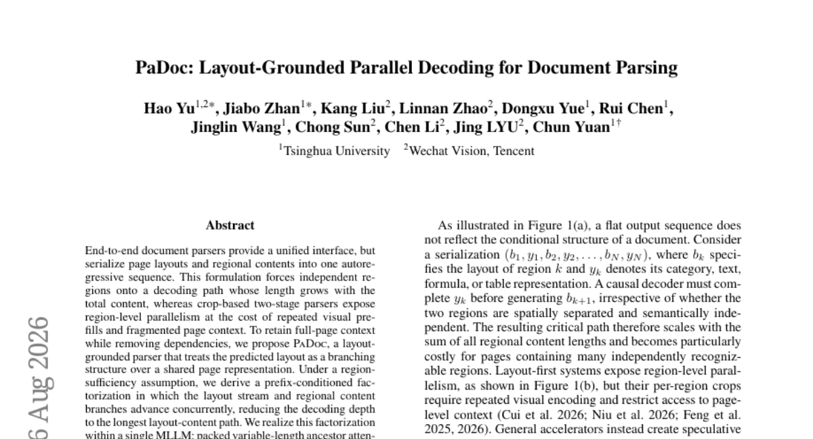

### 📌 한 줄 요약
레이아웃 기반 병렬 디코딩을 통해 문서 파싱의 속도와 정확도를 동시에 잡은 고성능 MLLM 프레임워크

### 🔑 핵심 포인트
- 레이아웃을 분기 구조로 정의하여 레이아웃과 콘텐츠를 병렬로 디코딩하는 구조 설계
- Variable-length ancestor attention과 masked parallel decoding을 통한 효율적 병렬 처리 구현
- 전체 페이지 문맥을 유지하면서도 디코딩 깊이를 최소화하여 처리량 및 지연 시간 최적화

### 🧑‍💻 개발자 관점
대규모 문서 처리 시 발생하는 긴 시퀀스 문제와 연산 비용 문제를 해결하여, 실시간 문서 파싱 서비스의 비용 효율성을 극대화할 수 있습니다.

### 🚀 실무 적용 아이디어
- 제공된 GitHub 코드를 활용하여 다양한 레이아웃 복잡도에 따른 성능 검증
- vLLM 백엔드 환경에서 가용 자원 대비 throughput 향상 폭 측정
- 기존 Sequential SFT 모델과 PaDoc의 지연 시간(P95 latency) 비교 테스트

### ⚠️ 리스크/한계
- 레이아웃 예측 오류가 콘텐츠 생성 분기로 전파될 수 있는 구조적 의존성
- 복잡한 분기 구조로 인해 모델 아키텍처 구현 및 학습 난이도가 높음

### 📝 초록 기반 상세 설명
기존의 엔드투엔드 문서 파서는 페이지 전체를 하나의 시퀀스로 직렬화하여 디코딩 길이가 길어지는 문제가 있었습니다. 반면, 영역 기반 2단계 방식은 병렬성은 높지만 시각적 정보의 중복 연산과 문맥 단절 문제가 발생합니다. 이를 해결하기 위해 PaDoc은 레이아웃을 분기 구조로 취급하여 레이아웃과 콘텐츠가 동시에 진행되는 prefix-conditioned factorization 방식을 제안합니다. 단일 MLLM 내에서 가변 길이 ancestor attention과 masked parallel decoding을 결합하여 효율적인 병렬 처리를 구현했습니다. 실험 결과, PaDoc은 최고 수준의 정확도를 달성함과 동시에 기존 방식 대비 처리량(throughput)을 대폭 개선하고 지연 시간(latency)을 크게 줄였습니다.

---

## 22. [KVAE: Family of Tokenizers for Multimodal Generative Models](https://huggingface.co/papers/2608.05798)
**Upvotes**: 14 | **도입 난이도**: 중 | **신뢰도**: 상
**arXiv**: https://arxiv.org/abs/2608.05798

**태그**: Multimodal, Generative-AI, Tokenizer, Diffusion-Models, Vision, Video, Audio, Evaluation, Optimization

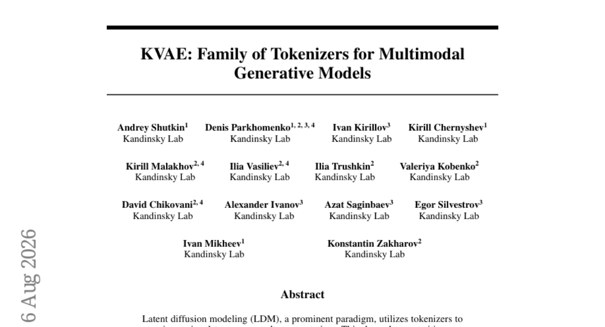

### 📌 한 줄 요약
멀티모달 생성 모델의 성능을 결정짓는 고성능 오디오·이미지·비디오 토크나이저 제품군(KVAE) 제안

### 🔑 핵심 포인트
- 오디오(48kHz), 이미지(8x), 비디오(Causal)를 아우르는 통합 KVAE 토크나이저 패밀리 개발
- 텍스트 조건부 생성(Text-conditioned generation)에 최적화된 압축 및 잠재 공간 설계
- 최신 SOTA 모델(HunyuanVideo, FLUX.2 등)과 대등하거나 우수한 성능 입증

### 🧑‍💻 개발자 관점
고성능 멀티모달 생성 모델 구축 시 핵심인 토크나이저의 설계 가이드와 검증된 아키텍처를 제공하여 개발 시간을 단축할 수 있습니다.

### 🚀 실무 적용 아이디어
- 제공된 GitHub 코드를 활용하여 특정 도메인(이미지/비디오)에 대한 재구성 성능 테스트
- 기존 사용 중인 VAE/토크나이저를 KVAE로 교체했을 때의 생성 품질 변화 비교
- 제시된 학습 세부 사항을 바탕으로 커스텀 데이터셋에 대한 미세 조정 실험

### ⚠️ 리스크/한계
- 특정 압축률(Factor)에 최적화되어 있어 다른 해상도나 데이터 특성에는 재설계가 필요할 수 있음
- 고성능 모델인 만큼 학습 및 추론 시 상당한 컴퓨팅 자원이 요구될 가능성

### 📝 초록 기반 상세 설명
최근 잠재 확산 모델(LDM)에서 토크나이저는 생성 속도와 품질을 결정하는 핵심 요소로 자리 잡았습니다. 본 논문은 텍스트 조건부 생성을 목적으로 설계된 KVAE 시리즈(Audio, 2D, s-3D)를 제안합니다. KVAE-Audio는 48kHz 풀밴드 오디오를, KVAE-2D는 8배 압축 이미지를, KVAE-3D는 두 가지 압축률의 비디오 토큰을 생성합니다. 실험 결과, 제안된 모델은 Wan-2.2, FLUX.2 등 최첨단 오픈소스 모델과 대등하거나 더 우수한 재구성 및 생성 성능을 보였습니다. 개발 난이도를 고려하여 모델 선택 방법과 학습 세부 사항을 포함한 기술 리포트를 공개합니다.

### 🖼️ 추가 자료
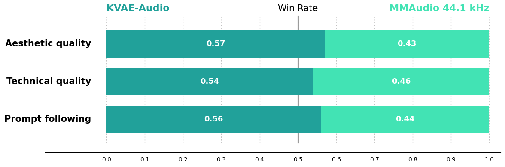
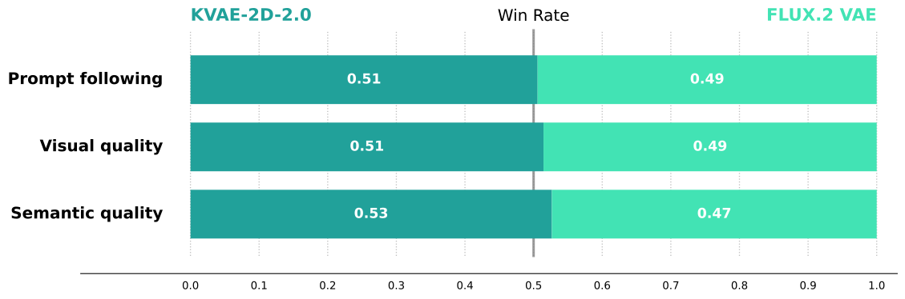
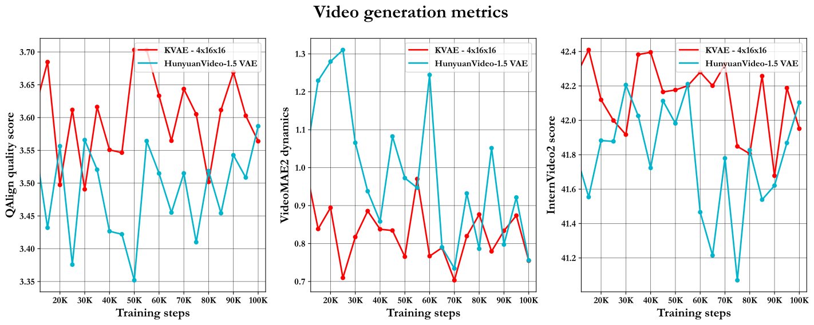
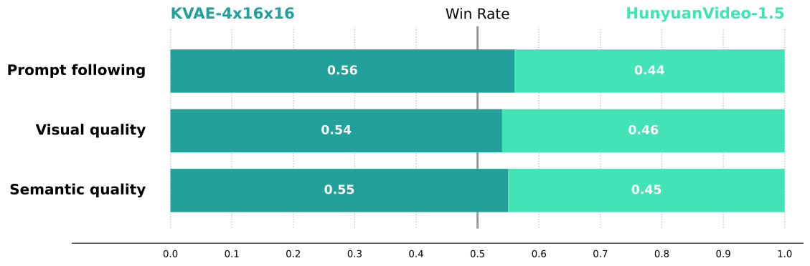

---

## 23. [Continual Learning in Transition](https://huggingface.co/papers/2608.06216)
**Upvotes**: 13 | **도입 난이도**: 하 | **신뢰도**: 상
**arXiv**: https://arxiv.org/abs/2608.06216

**태그**: Continual Learning, Machine Learning, System Design, Model Adaptation, Inference

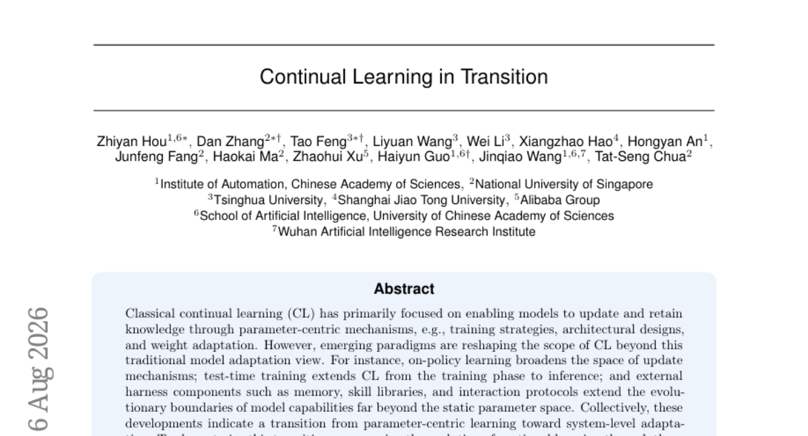

### 📌 한 줄 요약
기존의 파라미터 중심 학습에서 시스템 레벨의 적응형 학습으로 진화하는 지속적 학습(CL)의 패러다임 변화를 분석함

### 🔑 핵심 포인트
- 파라미터 중심(Parameter-centric)에서 시스템 레벨 적응(System-level adaptation)으로의 패러다임 전환 정의
- 학습 시점(When), 최적화 방식(How), 업데이트 위치(Where)를 축으로 하는 삼차원 분석 프레임워크 제안
- 학습 단계(Pre/Post/Inference)와 외부 구성 요소(Memory/Skill Library)를 포함하는 확장된 CL 범위 제시

### 🧑‍💻 개발자 관점
모델의 가중치 업데이트뿐만 아니라 RAG, 에이전트 구조, 추론 시점의 적응 등 시스템 전체를 설계해야 하는 엔지니어에게 새로운 설계 지침을 제공합니다.

### 🚀 실무 적용 아이디어
- 기존 파라미터 업데이트 방식과 테스트 타임 트레이닝(TTT) 방식의 성능 비교 실험
- 외부 메모리/스킬 라이브러리를 결합한 시스템 레벨의 CL 아키텍처 프로토타이핑
- 학습 단계(Pre-training vs Inference)에 따른 지식 유지력 차이 분석

### ⚠️ 리스크/한계
- 시스템 레벨로 확장 시 복잡도 증가로 인한 연산 비용 및 지연 시간 문제
- 외부 구성 요소와 내부 파라미터 간의 상호작용 제어의 어려움

### 📝 초록 기반 상세 설명
기존의 지속적 학습(CL)은 주로 모델의 파라미터를 업데이트하고 지식을 유지하는 방식에 집중해 왔습니다. 그러나 최근 온폴리시 학습, 테스트 타임 트레이닝, 외부 메모리 및 스킬 라이브러리 활용 등 모델 적응의 범위를 확장하는 새로운 패러다임이 등장하고 있습니다. 이러한 변화는 CL이 단순한 파라미터 업데이트를 넘어 시스템 레벨의 적응으로 전환되고 있음을 시사합니다. 본 논문은 이러한 전환을 '언제(When)', '어떻게(How)', '어디서(Where)'라는 세 가지 차원의 프레임워크로 정의합니다. 이 프레임워크를 바탕으로 최신 방법론들을 체계적으로 조사하고, 지속적 학습의 진화 과정과 향후 도전 과제 및 미래 방향을 논의합니다.

---

## 24. [Invisible Shortcuts: Why Vision Encoders Know Your Camera](https://huggingface.co/papers/2608.05424)
**Upvotes**: 10 | **도입 난이도**: 중 | **신뢰도**: 상
**arXiv**: https://arxiv.org/abs/2608.05424

**태그**: Computer Vision, Shortcut Learning, Model Robustness, Data Bias, Vision

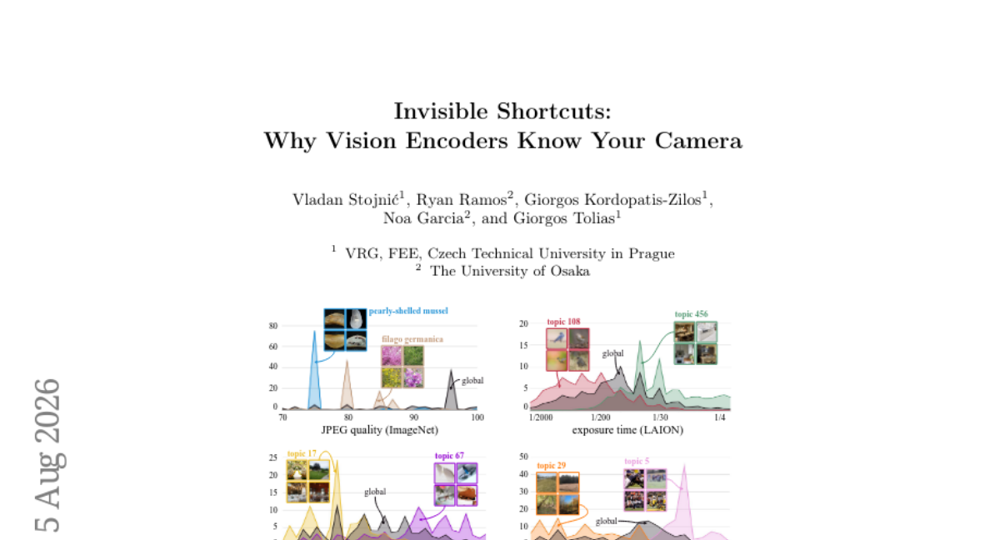

### 📌 한 줄 요약
비전 모델이 이미지 메타데이터(카메라 특성 등)를 학습하여 발생하는 '보이지 않는 지름길(Shortcut)' 현상 분석 및 완화 전략 연구

### 🔑 핵심 포인트
- 픽셀 수준에 내재된 이미지 처리/촬영 메타데이터가 새로운 지름길 학습 원인임을 규명
- 대규모 데이터셋 학습 시 메타데이터와 의미론적 레이블 간의 상관관계가 형성됨을 확인
- 메타데이터 민감도 완화가 OOD(Out-of-Distribution) 일반화 성능 향상으로 이어짐을 입증

### 🧑‍💻 개발자 관점
모델이 데이터의 본질적 특징이 아닌 카메라 특성 같은 부차적 정보에 의존할 경우, 실제 배포 환경(현장 데이터)에서 성능이 급락할 수 있음을 경고합니다.

### 🚀 실무 적용 아이디어
- 학습 데이터의 메타데이터(EXIF 등)가 특정 클래스와 결합되어 있는지 데이터 프로파일링 수행
- 데이터 증강(Augmentation) 시 이미지 처리 특성을 무작위화하여 지름길 학습 방지 실험
- 모델의 생성 이미지 탐지 능력이 특정 메타데이터 흔적에 의존하는지 검증

### ⚠️ 리스크/한계
- 메타데이터 민감도를 낮추는 것이 특정 도메인 특화 작업에서는 성능 저하를 야기할 수 있음
- 완벽한 메타데이터 분리가 불가능할 경우 지름길 학습을 완전히 제거하기 어려움

### 📝 초록 기반 상세 설명
최근 딥러닝 비전 모델은 데이터 내의 상관관계를 이용하는 지름길 학습(Shortcut Learning) 문제를 겪고 있습니다. 기존 연구는 배경이나 질감 같은 가시적 편향에 집중했으나, 본 연구는 픽셀 수준에 숨겨진 이미지 처리 및 촬영 메타데이터 흔적을 새로운 지름길 원인으로 식별합니다. 대규모 데이터셋 학습 과정에서 메타데이터와 의미론적 레이블 간의 상관관계가 형성되어 모델이 저수준 신호를 예측 특징으로 변환하게 됩니다. 연구진은 제어된 상관관계를 통해 메타데이터 민감도와 성능 저하 사이의 관계를 증명했습니다. 마지막으로 사전 학습 단계 및 사후 완화 전략을 통해 성능 저하 없이 메타데이터 민감도를 줄이는 방법을 제안합니다.

### 🖼️ 추가 자료
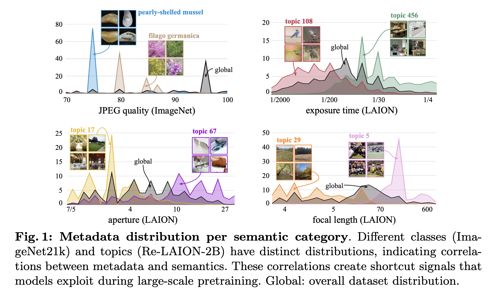

---

## 25. [ContextMaster: Interactive Multi-Shot Video Creation via Fixed-Budget Sparse Context Routing](https://huggingface.co/papers/2608.04956)
**Upvotes**: 10 | **도입 난이도**: 상 | **신뢰도**: 상
**arXiv**: https://arxiv.org/abs/2608.04956

**태그**: Video Generation, Efficient Inference, Multi-shot Consistency, Video, Inference, Distillation

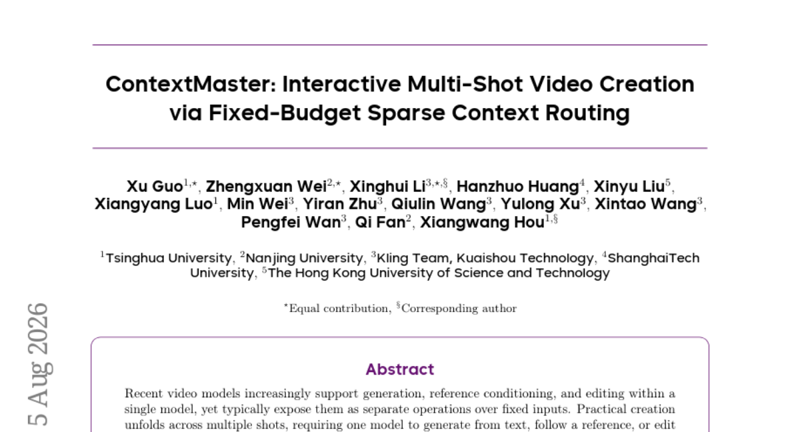

### 📌 한 줄 요약
고정된 예산 내에서 과거 맥락을 효율적으로 유지하며 텍스트 생성, 참조, 편집을 동시에 수행하는 통합 비디오 생성 모델

### 🔑 핵심 포인트
- IMVC(Interactive Multi-Shot Video Creation) 프레임워크 정의 및 역할 인식형 맥락 표현 도입
- 고정된 연산 비용을 유지하면서 확장되는 히스토리를 관리하는 희소 컨텍스트 라우팅 기술
- 두 단계의 증류(Consistency Distillation & Distribution Matching)를 통한 효율적인 추론 최적화

### 🧑‍💻 개발자 관점
멀티샷 비디오 제작 시 발생하는 연산량 급증 문제를 해결하면서도, 이전 샷의 맥락을 유지하며 편집/생성을 반복할 수 있는 실용적인 워크플로우를 제공합니다.

### 🚀 실무 적용 아이디어
- 제안된 Sparse Context Routing 방식이 긴 영상 시퀀스에서 일관성을 얼마나 유지하는지 검증
- ConstraintSink가 복잡한 편집 제약 조건(예: 특정 객체 유지)을 얼마나 정확히 반영하는지 테스트
- 단일 GPU 환경에서의 실시간성(16 FPS)이 실제 프로덕션 환경에서 충분한지 확인

### ⚠️ 리스크/한계
- 희소 컨텍스트 라우팅 사용 시 정보 손실로 인한 미세한 디테일 저하 가능성
- 복잡한 멀티샷 시나리오에서 장기적 일관성(Long-term consistency) 유지의 한계

### 📝 초록 기반 상세 설명
최근 비디오 모델은 생성, 참조, 편집 기능을 통합하고 있으나, 각 작업이 고정된 입력에 국한되어 멀티샷 작업 시 맥락 유지가 어렵다는 문제가 있습니다. 본 논문은 이를 '대화형 멀티샷 비디오 생성(IMVC)' 문제로 정의하고, 역할 인식형 맥락 표현을 갖춘 ContextMaster 모델을 제안합니다. 모델은 재사용 가능한 클린 컨텍스트 상태와 고정 예산 기반의 희소 컨텍스트 라우팅(Sparse Context Routing), 그리고 제약 조건을 유지하는 ConstraintSink를 결합하여 연산 비용을 관리합니다. 또한, 두 단계의 특권 컨텍스트 증류(Privileged Context Distillation) 프레임워크를 통해 전체 맥락의 동작을 효율적인 추론 단계로 전이합니다. 실험 결과, 제안 모델은 기존 베이스라인 대비 작업 수행 능력과 샷 간 일관성을 개선하였으며 단일 GPU에서 16 FPS의 속도를 달성했습니다.

---

## 26. [MASS: Multiplayer World Models with Authoritative Shared State](https://huggingface.co/papers/2608.06257)
**Upvotes**: 8 | **도입 난이도**: 상 | **신뢰도**: 상
**arXiv**: https://arxiv.org/abs/2608.06257

**태그**: Multi-Agent, World Models, Computer Vision, Scalability, Agent, Video, Benchmark

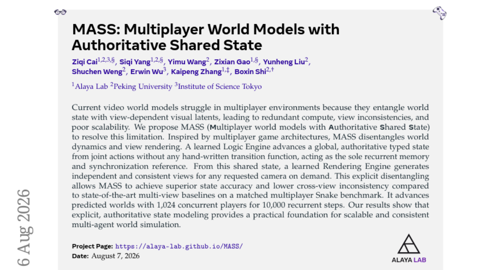

### 📌 한 줄 요약
멀티플레이어 환경의 일관성 문제를 해결하기 위해 게임 서버 아키텍처를 차용한 상태-렌더링 분리형 월드 모델링 기법

### 🔑 핵심 포인트
- 세계 상태(Logic Engine)와 시점 렌더링(Rendering Engine)의 명확한 분리
- 게임 서버 방식의 권위적 공유 상태(Authoritative Shared State)를 통한 동기화 해결
- 대규모 멀티 에이전트 환경(1,024명 동시 접속)에서의 확장성 확보

### 🧑‍💻 개발자 관점
멀티 에이전트 시뮬레이션이나 협업형 AI 환경 구축 시, 시각적 일관성을 유지하면서 연산 효율을 높이는 아키텍처 설계 가이드를 제공합니다.

### 🚀 실무 적용 아이디어
- 상태(State)와 렌더링(Rendering) 분리 구조를 기존 생성 모델에 적용해보기
- 멀티 에이전트 환경에서 시점 불일치(View Inconsistency) 발생 지점 분석하기
- Rule-based 로직과 Learned 로직의 결합 가능성 검토하기

### ⚠️ 리스크/한계
- 로직 엔진의 복잡도가 증가할 경우 상태 업데이트 연산 부하 발생 가능성
- 학습된 로직 엔진이 복잡한 물리 법칙을 완벽히 모사하지 못할 위험

### 📝 초록 기반 상세 설명
기존의 비디오 월드 모델은 세계 상태와 시점 의존적 시각 정보가 얽혀 있어 멀티플레이어 환경에서 연산 중복과 시점 불일치 문제를 겪습니다. 이를 해결하기 위해 게임 아키텍처에서 영감을 얻은 MAS(Multiplayer world models with Authoritative Shared State)를 제안합니다. MAS는 세계 역학(Logic Engine)과 시점 렌더링(Rendering Engine)을 명확히 분리하여, 학습된 로직 엔진이 공유된 권위적 상태를 업데이트합니다. 이 상태를 바탕으로 렌더링 엔진은 요청된 시점에 맞춰 독립적이고 일관된 뷰를 생성합니다. 실험 결과, 대규모 멀티플레이어 환경에서도 높은 상태 정확도와 낮은 시점 불일치를 달성하며 확장성을 입증했습니다.

---

## 27. [Weights or Skills? A Survey of Robot-Learning Techniques: from Action-Predicting Weights to Robots that Write their Own Skills](https://huggingface.co/papers/2608.01851)
**Upvotes**: 5 | **도입 난이도**: 중 | **신뢰도**: 상
**arXiv**: https://arxiv.org/abs/2608.01851

**태그**: Robot Learning, LLM, Code-as-Policy, Automation, Agent, Vision, Safety

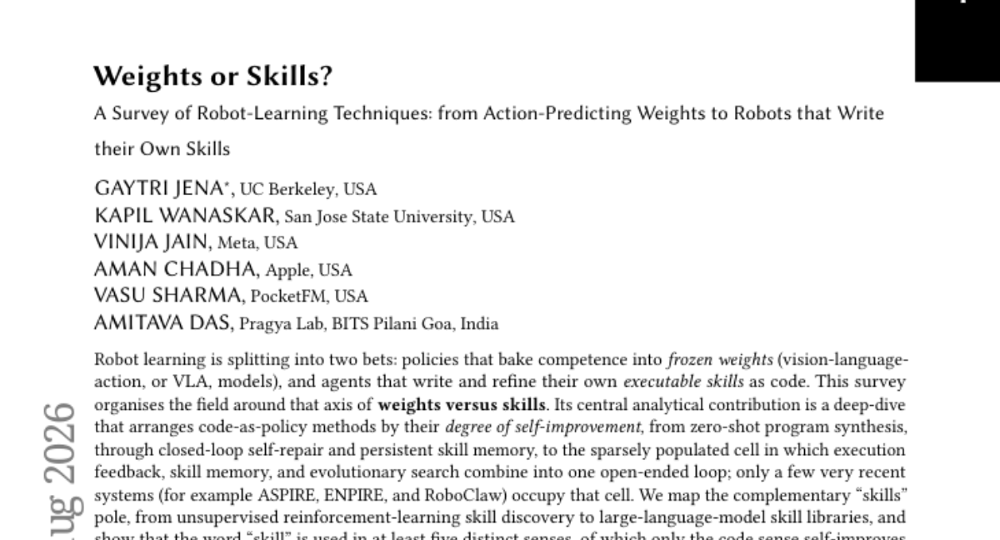

### 📌 한 줄 요약
로봇 학습의 두 축인 '가중치 기반 정책(VLA)'과 '코드 기반 스킬 생성'을 중심으로 최신 기술 트렌드와 자가 개선 메커니즘을 분석한 서베이 논문입니다.

### 🔑 핵심 포인트
- 가중치 기반(VLA)과 코드 기반(Code-as-policy) 기술의 대립 및 상호 보완적 관계 정의
- 코드 기반 스킬의 자가 개선(Self-improvement) 수준에 따른 체계적 분류 체계 구축
- 스킬 경제(Skill Economy) 관점에서의 이식성, 안전성, 표준화 문제 제기

### 🧑‍💻 개발자 관점
로봇 제어 로직을 모델 가중치 업데이트 방식(End-to-end)으로 설계할지, 아니면 코드 생성 방식(Modular)으로 설계할지에 대한 아키텍처 결정 가이드를 제공합니다.

### 🚀 실무 적용 아이디어
- LLM 기반 코드 생성(Code-as-policy) 프레임워크의 자가 수리(Self-repair) 루프 구현 실험
- 서로 다른 로봇 하드웨어 간의 스킬 이식성(Cross-embodiment) 테스트
- 가중치 기반 정책과 코드 기반 스킬의 결합 모델 프로토타이핑

### ⚠️ 리스크/한계
- 코드 기반 방식은 실행 시 안전성 검증 및 예외 처리가 매우 어려움
- 가중치 기반 방식은 새로운 작업에 대한 적응 및 데이터 효율성 문제가 존재함

### 📝 초록 기반 상세 설명
로봇 학습 분야는 모델 가중치에 능력을 내재화하는 방식과 코드를 통해 실행 가능한 스킬을 작성하는 방식이라는 두 가지 흐름으로 나뉘고 있습니다. 본 논문은 '가중치(Weights) vs 스킬(Skills)'이라는 축을 중심으로 로봇 학습 기술을 체계적으로 분류합니다. 특히 코드 기반 정책(Code-as-policy) 방법론을 제로샷 합성부터 자가 수리, 진화적 탐색을 결합한 개방형 루프까지 자가 개선 수준에 따라 심층 분석합니다. 또한, RL 기반 스킬 발견부터 LLM 기반 스킬 라이브러리까지 다양한 스킬 개념을 정리하고, 현재의 스킬 경제가 직면한 표준화 및 이식성 문제를 다룹니다. 결과적으로 77개의 대표 시스템을 통해 기술적 한계와 미래 방향성을 제시합니다.

---

## 28. [FactorJEPA: Factorizing Monolithic Futures into Layout-Agent-Interaction Channels for Crowded and Chaotic Global South Urban Worlds](https://huggingface.co/papers/2608.01049)
**Upvotes**: 5 | **도입 난이도**: 상 | **신뢰도**: 상
**arXiv**: https://arxiv.org/abs/2608.01049

**태그**: World Models, Computer Vision, Autonomous Agents, Self-Supervised Learning, Agent, RAG, Video, Evaluation

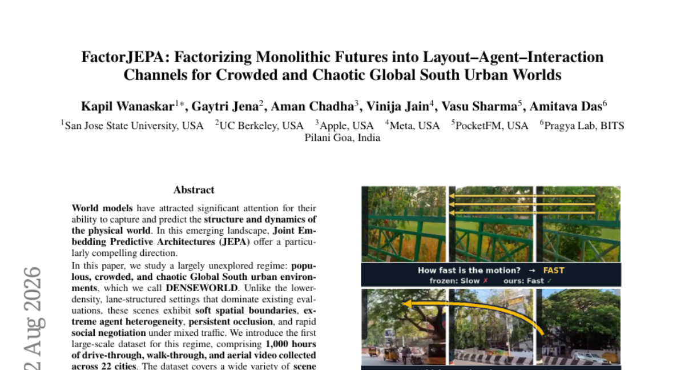

### 📌 한 줄 요약
복잡하고 혼잡한 도시 환경의 예측 성능을 높이기 위해 레이아웃, 객체, 상호작용을 분리하여 모델링하는 FactorJEPA 프레임워크 제안

### 🔑 핵심 포인트
- 복잡한 도시 환경을 위한 대규모 데이터셋 DENSEWORLD(1,000시간 분량) 공개
- 레이아웃, 개체, 상호작용을 분리하여 예측하는 FactorJEPA 아키텍처 제안
- 가시성 게이트를 통한 부분 관측 및 객체 간 간섭 문제 해결

### 🧑‍💻 개발자 관점
자율 주행이나 로봇 제어 시, 정형화되지 않은 복잡한 환경(군중, 혼합 교통 등)에서의 예측 모델링 성능을 높이는 데 직접적인 영감을 제공합니다.

### 🚀 실무 적용 아이디어
- 공개된 DENSEWORLD 데이터셋을 활용한 비디오 예측 모델 벤치마크 수행
- 기존 V-JEPA 모델에 FactorJEPA의 분리형 잠재 공간 구조 적용 실험
- 가려짐(Occlusion)이 심한 환경에서의 모델 강건성 비교 테스트

### ⚠️ 리스크/한계
- 분리된 채널 간의 정보 손실 가능성 및 복잡한 아키텍처로 인한 연산 비용 증가
- 특정 도시 환경 데이터에 대한 과적합 가능성

### 📝 초록 기반 상세 설명
기존의 월드 모델은 차선이 명확한 저밀도 환경에 최적화되어 있어, 인구 밀도가 높고 무질서한 글로벌 사우스(Global South) 도시 환경의 복잡한 상호작용을 처리하는 데 한계가 있습니다. 이를 해결하기 위해 연구진은 22개 도시의 방대한 영상 데이터를 포함한 DENSEWORLD 데이터셋을 구축했습니다. 제안된 FactorJEPA는 미래를 하나의 거대한 잠재 공간에 담는 대신 레이아웃, 개체, 상호작용 채널로 분리하여 구조화하는 방식을 취합니다. 또한 가시성 게이트와 분리된 서브스페이스를 통해 가려진 객체를 보존하고 요소 간의 잘못된 상관관계(shortcut)를 방지합니다. 실험 결과, FactorJEPA는 미래 프레임 예측 정확도와 인과적 예측 성능, 시각 정보 부족에 대한 강건성 측면에서 기존 모델보다 우수한 성능을 보였습니다.

---

## 29. [Task-Conditional Flow Matching for Balanced Multilingual Text Embedding Adaptation](https://huggingface.co/papers/2608.05785)
**Upvotes**: 4 | **도입 난이도**: 중 | **신뢰도**: 상
**arXiv**: https://arxiv.org/abs/2608.05785

**태그**: NLP, Embedding, Multilingual, Fine-tuning, RAG, Benchmark, Evaluation

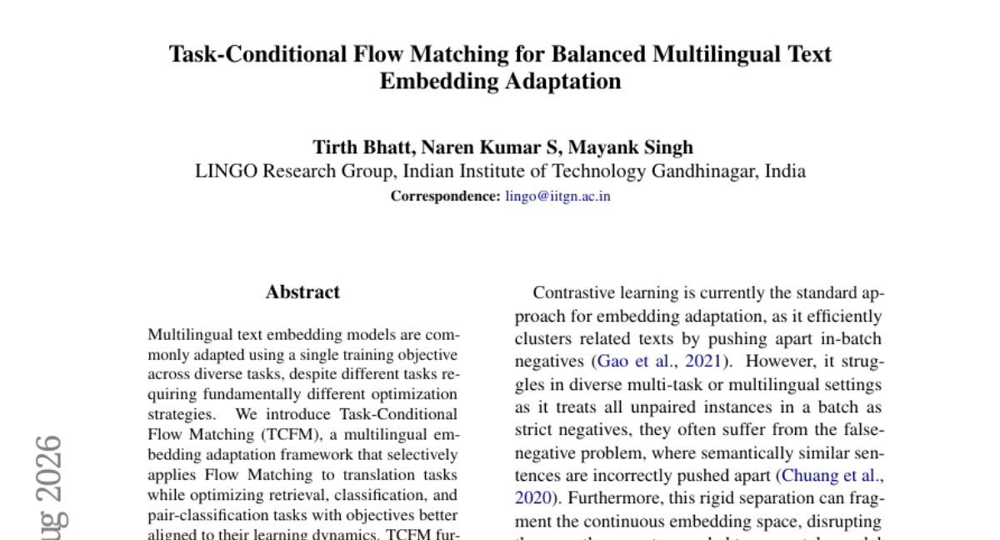

### 📌 한 줄 요약
태스크별 최적화 전략을 차별화하여 다국어 임베딩 성능을 극대화하는 TCFM 프레임워크 제안

### 🔑 핵심 포인트
- 태스크 특성에 따라 최적의 학습 목적 함수를 선택하는 Task-Conditional Flow Matching 도입
- 교사 가이드(Teacher-guided) 방식과 3단계 커리큘럼 학습을 통한 안정적인 모델 적응
- 다양한 임베딩 모델 패밀리에 걸쳐 범용적으로 적용 가능한 성능 및 일반화 능력 확보

### 🧑‍💻 개발자 관점
단일 목적 함수로 인한 성능 저하 없이, 번역/검색/분류 등 서로 다른 성격의 다국어 태스크를 하나의 모델로 효율적으로 튜닝할 수 있는 방법론을 제시합니다.

### 🚀 실무 적용 아이디어
- 기존 단일 목적 함수 기반 임베딩 모델과 TCFM 방식의 성능 차이 비교 실험
- 특정 언어 쌍(예: 영어-인도어)에 대한 번역 및 검색 태스크 동시 학습 성능 검증
- 제공될 코드베이스를 활용하여 다양한 베이스 모델(LLM 등)에 대한 전이 학습 테스트

### ⚠️ 리스크/한계
- 태스크별로 다른 목적 함수를 사용하므로 학습 파이프라인 구성이 복잡할 수 있음
- 특정 언어군(Indic) 중심의 벤치마크 결과이므로 다른 언어권에서의 일반화 성능 확인 필요

### 📝 초록 기반 상세 설명
기존의 다국어 임베딩 모델은 다양한 태스크를 하나의 단일 학습 목표로 적응시키려 하여 최적화 효율이 떨어지는 문제가 있었습니다. 이를 해결하기 위해 본 논문은 Task-Conditional Flow Matching(TCFM) 프레임워크를 도입합니다. TCFM은 번역 태스크에는 Flow Matching을 적용하고, 검색 및 분류 태스크에는 각 학습 역학에 최적화된 별도의 목적 함수를 선택적으로 적용합니다. 또한 교사 가이드 기반의 표현 보존 방식과 3단계 커리큘럼 학습을 결합하여 안정적인 적응을 가능하게 합니다. 실험 결과, Indic Massive 벤치마크에서 SOTA를 달성하며 다양한 다국어 태스크에서 일관된 성능 향상을 입증했습니다.

---

## 30. [GaussianSelector: Lightweight Human-Guided Object Selection in 3D Gaussian Splatting with Graph Optimization](https://huggingface.co/papers/2608.01492)
**Upvotes**: 4 | **도입 난이도**: 중 | **신뢰도**: 상
**arXiv**: https://arxiv.org/abs/2608.01492

**태그**: 3DGS, Segmentation, Computer Vision, Human-in-the-loop, RAG

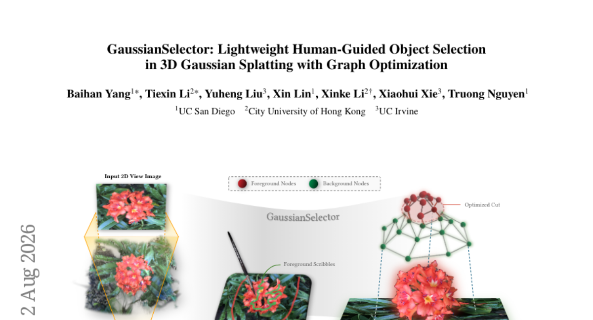

### 📌 한 줄 요약
Sparse한 사용자 가이드와 그래프 최적화를 통해 3D Gaussian Splatting 환경에서 빠르고 정확하게 객체를 선택하는 경량 프레임워크

### 🔑 핵심 포인트
- Training-free: 가우시안 표현을 재학습하지 않는 효율적인 선택 방식
- Graph-cut Optimization: 희소한 스크리블을 3D로 투영하고 그래프 컷을 통해 객체 경계를 최적화
- Sparse-view Efficiency: 적은 수의 시점과 사용자 가이드만으로도 정교한 객체 분할 가능

### 🧑‍💻 개발자 관점
3D 에셋 추출이나 장면 편집 시, 복잡한 재학습 과정 없이 사용자 인터랙션만으로 즉각적인 객체 분리가 가능해 실무 워크플로우를 단축할 수 있습니다.

### 🚀 실무 적용 아이디어
- Sparse view 환경에서의 경계 정밀도 테스트
- 다양한 복잡한 기하 구조(Thin structures)에서의 분할 성능 검증
- 실시간 인터랙션 루프에서의 연산 지연 시간 측정

### ⚠️ 리스크/한계
- 매우 복잡하거나 겹쳐진 객체 간의 경계 모호성 문제
- 사용자 스크리블 입력 품질에 따른 결과 의존성

### 📝 초록 기반 상세 설명
3D 장면 재구성에서 특정 객체를 선택하는 작업은 편집 및 상호작용을 위해 필수적입니다. 기존의 3적 방식은 객체 라벨링을 위한 재학습이나 과도한 연산이 필요한 밀집된 SAM 관측을 요구하여 실용성이 떨어졌습니다. 본 논문은 GaussianSelector를 제안하며, 이는 추가 학습 없이 희소한 뷰와 스크리블(scribble) 가이드만으로 동작하는 프레임워크입니다. 밀집된 가우시안을 기하학적 슈퍼포인트로 응집하고, 외형 및 공간 정보를 결합한 연속성 가중 그래프를 구축하여 선택 문제를 해결합니다. 실험 결과, 기존 SAM 기반 방식에 필적하는 품질을 유지하면서도 훨씬 적은 뷰와 연산 비용으로 정교한 객체 추출이 가능함을 입증했습니다.

---

