# 2026-08-13 Daily Papers (Top 22)

## 오늘의 요약
오늘의 연구는 단순한 태스크 수행을 넘어 인간의 상태와 환경에 능동적으로 반응하는 차세대 에이전트 설계에 집중되었습니다. 또한, 비디오 잠재 공간을 활용한 4D 생성 및 정적 데이터로부터의 3D 복원 등 시공간적 일관성을 갖춘 고도화된 생성 모델 연구가 두드러졌습니다.

### 오늘의 핵심 포인트
- 인간의 상태 최적화와 자율적 진화를 목표로 하는 에이전트 중심의 새로운 패러다임이 제시되었습니다.
- 비디오 생성 모델의 잠재 공간을 활용하여 효율적으로 4D 장면을 생성하거나 정적 이미지에서 관절 구조를 복원하는 기술이 주목받았습니다.
- 장기적이고 능동적인 일상 지원 능력을 평가하기 위한 벤치마크와 실감형 멀티모달 대화 모델 등 에이전트의 실용적 활용을 위한 연구가 진행되었습니다.

**오늘의 태그**: Agentic AI, 4D Generation, Self-Evolution, Multimodal, 3D Reconstruction

## 1. [ComBodied Agents: a New Paradigm of Human-Centric Agentic AI](https://huggingface.co/papers/2608.10915)
**Upvotes**: 165 | **도입 난이도**: 상 | **신뢰도**: 상
**arXiv**: https://arxiv.org/abs/2608.10915

**태그**: Agentic AI, Human-Centric, Personalization, HCI, Robotics, Agent, RAG, Multimodal, Benchmark, Evaluation, Safety

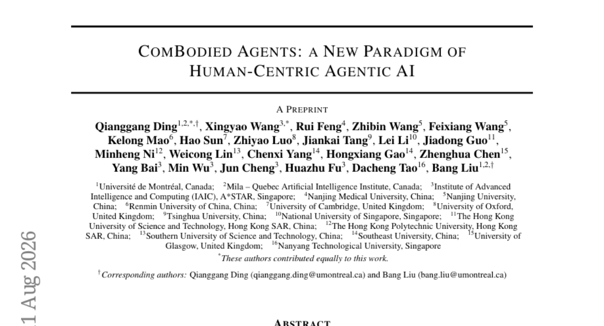

### 📌 한 줄 요약
단순 작업 수행을 넘어 인간의 상태 변화와 주체성을 중심 모델로 삼는 새로운 에이전트 패러다임 제안

### 🔑 핵심 포인트
- 인간의 상태 변화와 주체성을 핵심 모델링 대상으로 삼는 'Combodied Agents' 패러다임 정의
- 멀티모달 인지, 장기 기억, 개인용 월드 모델(PWM), 개입 정책을 결합한 폐쇄 루프 프레임워크 제안
- 완전한 디지털 트윈 대신 목적 중심적이고 사용자 수정이 가능한 불확실성 기반 표현 방식 채택

### 🧑‍💻 개발자 관점
에이전트 설계의 목표를 '태스크 완료'에서 '인간 상태 최적화'로 전환함으로써, 헬스케어 및 개인 비서 서비스의 차세대 아키텍처 설계 방향을 제시합니다.

### 🚀 실무 적용 아이디어
- 사용자 피드백이 반영되는 '수정 가능한 개인 모델' 프로토타입 구현
- 특정 시나리오(예: 약 복용 관리)에서의 개입 정책(Intervention Policy) 시뮬레이션
- 에이전트의 개입이 사용자의 자율성을 해치지 않는지 측정하는 메트릭 설계

### ⚠️ 리스크/한계
- 개인 데이터 수집 및 모델링에 따른 심각한 프라이버시 및 윤리적 이슈
- 사용자의 의도와 에이전트의 개입 사이의 충돌 관리의 복잡성

### 📝 초록 기반 상세 설명
기존의 디지털 에이전트는 소프트웨어 상태를, 로봇 에이전트는 물리적 상태를 변화시키는 데 집중해 왔습니다. 이로 인해 인간의 변화하는 상태와 의사결정 주체성을 모델링하는 데 구조적 한계가 존재합니다. 본 논문은 인간의 상태 궤적을 인지, 모델링, 예측하여 지원하는 'Combodied Agents' 패러다임을 제안합니다. 이 프레임워크는 멀티모달 인지, 장기 기억, 개인용 월드 모델, 그리고 허용 가능한 개입 정책을 결합한 폐쇄 루프 구조를 가집니다. 이를 통해 파편화된 개인 비서와 헬스 에이전트 기능을 통합하여 지속적인 인간 복지를 목표로 합니다.

---

## 2. [Co-Evolution in Agentic Systems: Toward Self-Directed Evolution Beyond Human Design](https://huggingface.co/papers/2608.10299)
**Upvotes**: 107 | **도입 난이도**: 상 | **신뢰도**: 상
**arXiv**: https://arxiv.org/abs/2608.10299

**태그**: Multi-Agent, Self-Evolution, Autonomous Systems, AI Safety, Agent, Evaluation

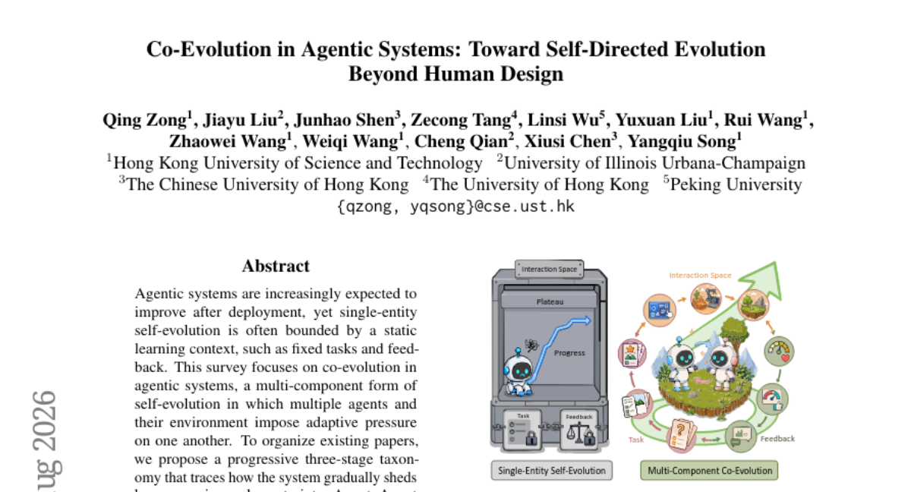

### 📌 한 줄 요약
인간의 설계 한계를 넘어 에이전트 간 상호작용과 환경 변화를 통해 스스로 진화하는 '공진화(Co-Evolution)' 시스템 체계 정립

### 🔑 핵심 포인트
- 에이전트-에이전트(협업, 대립, 조직적 적응) 간의 동적 상호작용 연구
- 에이전트-환경(태스크, 피드백, 상호작용 공간) 간의 적응적 루프 정의
- 진화 메커니즘 자체가 진화하는 메타 공진화(Meta Co-Evolution) 개념 제시

### 🧑‍💻 개발자 관점
고정된 프롬프트나 태스크를 넘어, 시스템이 스스로 복잡한 환경에 적응하며 성능을 확장하는 차세대 자율 에이전트 설계의 방향성을 제시합니다.

### 🚀 실무 적용 아이디어
- 멀티 에이전트 환경에서 적대적(Adversarial) 피드백을 통한 성능 향상 실험
- 에이전트의 행동에 따라 태스크 난이도가 변하는 동적 환경 구축 실험
- 진화 알고리즘을 에이전트의 학습 루프에 통합하는 프로토타입 설계

### ⚠️ 리스크/한계
- 자율적 진화 과정에서 발생할 수 있는 안전성 및 통제 불가능성 문제
- 멀티 컴포넌트 시스템의 확장성 및 평가 지표 설정의 어려움

### 📝 초록 기반 상세 설명
최근 에이전트 시스템은 배포 후 자가 진화가 요구되지만, 고정된 작업과 피드백이라는 정적 학습 환경에 갇혀 있는 경우가 많습니다. 본 논문은 여러 에이전트와 환경이 서로 적응 압력을 가하며 진화하는 '공진화' 개념에 주목합니다. 이를 위해 인간의 설계 제약을 단계적으로 탈피하는 3단계 분류 체계(Agent-Agent, Agent-Environment, Meta Co-Evolution)를 제안합니다. 에이전트 간 협업/대립, 환경과의 상호작용, 그리고 진화 메커니즘 자체의 진화 가능성을 포괄적으로 다룹니다. 결과적으로 이 서베이는 고정된 경로를 넘어 지속적으로 발전하는 강건하고 개방적인 에이전트 시스템 구축을 위한 통합적 토대를 제공합니다.

---

## 3. [Beyond Pixels: From Video Priors to 4D Worlds](https://huggingface.co/papers/2608.10744)
**Upvotes**: 102 | **도입 난이도**: 중 | **신뢰도**: 상
**arXiv**: https://arxiv.org/abs/2608.10744

**태그**: 4D Generation, Video Diffusion, Latent Space, Computer Vision, Vision, Video

### 📌 한 줄 요약
비디오 생성 모델의 잠재 공간(Latent)을 직접 활용하여 RGB 렌더링 없이 고품질 4D 장면을 생성하는 효율적인 프레임워크 제안

### 🔑 핵심 포인트
- RGB 렌더링 단계를 생략하고 비디오 잠재 공간(Latent)에서 직접 4D를 생성하는 방식 제안
- 동일한 VAE를 사용하는 다양한 비디오 확산 트랜스포머 모델에 적용 가능한 범용 인터페이스 구축
- 프레임별 및 전역 시공학적 어텐션을 통한 정교한 기하학적 구조 및 시간적 일관성 확보

### 🧑‍💻 개발자 관점
비디오 생성 모델의 결과물을 별도의 복잡한 재구성 과정 없이 즉시 3D/4D 자산으로 변환할 수 있는 효율적인 파이프라인을 제시합니다.

### 🚀 실무 적용 아이디어
- 동일한 VAE를 사용하는 다른 비디오 확산 모델(예: SVD 등)에 해당 프레임워크 적용 테스트
- 1K 규모의 소규모 데이터셋 학습 시 기하학적 정밀도 변화 관찰
- 생성된 4D 결과물의 시간적 일관성(Temporal Stability) 정량 평가

### ⚠️ 리스크/한계
- 동일한 VAE 패밀리를 사용하는 모델로 활용 범위가 제한될 수 있음
- 학습 데이터셋 규모가 상대적으로 작아 매우 복잡한 장면에서의 일반화 성능 검증 필요

### 📝 초록 기반 상세 설명
기존의 4D 생성 방식은 생성된 RGB 비디오를 다시 재구성하거나 특정 비디오 생성기에 종속되어 분포 불일치 및 재학습 비용 문제가 발생했습니다. 본 논문은 동일한 VAE를 공유하는 비디오 모델의 최종 디노이징 잠재 공간이 4D 예측을 위한 재사용 가능한 인터페이스가 될 수 있음에 주목했습니다. 이를 위해 RGB 과정을 거치지 않고 비디오 잠재 공간을 4D 디코더의 토큰 그리드에 정렬하는 'Latent-to-4D' 방식을 도입했습니다. 제안된 방식은 프레임별 및 전역 시공간 어텐션을 통해 잠재 공간을 정교하게 정제합니다. 실험 결과, 제안 모델은 기존 Wan+4RC 방식보다 높은 기하학적 정확도와 시간적 안정성을 보이며 인간 평가에서도 우수한 품질을 입증했습니다.

---

## 4. [Articulated Object Reconstruction from Rest-State Observation](https://huggingface.co/papers/2607.27749)
**Upvotes**: 33 | **도입 난이도**: 상 | **신뢰도**: 상
**arXiv**: https://arxiv.org/abs/2607.27749

**태그**: 3D Reconstruction, Digital Twin, Diffusion Model, Computer Vision, Vision, Video

### 📌 한 줄 요약
움직임이 없는 정지 상태의 단일 이미지/데이터만으로도 물체의 3D 기하 구조와 관절 구조를 복원하는 기술

### 🔑 핵심 포인트
- 움직임 관찰 없이 단일 정지 상태(rest-state)에서 관절 구조를 추론하는 문제 해결
- 비디오 확산 모델을 활용한 가상 움직임 가설 생성 및 기하학적 검증 메커니즘
- 비전-언어 모델과 세그멘테이션 모델의 출력을 명시적 메쉬로 통합하는 융합 프레임워크

### 🧑‍💻 개발자 관점
애니메이션이나 움직임 데이터가 없는 정적 스캔 데이터만으로도 즉시 조작 가능한 3D 디지털 트윈을 생성할 수 있습니다.

### 🚀 실무 적용 아이디어
- 단일 정지 이미지 기반의 3D 모델링 파이프라인에 적용 가능성 검토
- 비디오 확산 모델을 이용한 가상 움직임 생성 모듈의 연산 비용 측정
- 다양한 복잡한 구조의 물체(가구, 로봇 등)에 대한 복원 정확도 테스트

### ⚠️ 리스크/한계
- 움직임 정보가 없는 상태에서의 추론이므로 복잡한 관절 구조에서 오차 발생 가능성
- 비디오 확산 모델 기반 가설 생성 시 발생하는 연산 부하

### 📝 초록 기반 상세 설명
상호작용 가능한 디지털 트윈을 구축하려면 3D 기하 구조와 관절 구조를 동시에 복원해야 합니다. 기존 방식은 물체의 움직임이 관찰되는 여러 상태를 필요로 한다는 제약이 있었습니다. 본 논문은 움직임 정보가 없는 단일 정지 상태(rest-state)에서 관절 구조를 복원하는 프레임워크를 제안합니다. 비전-언어 모델과 세그멘테이션 모델의 출력을 명시적 메쉬(mesh)로 융합하여 공간적 일관성을 확보하며, 비디오 확산 모델(video diffusion model)을 통해 가상의 움직임 가설을 생성하고 기하학적 일관성을 검증합니다. 결과적으로 움직임 데이터 없이도 정확한 부품 분해와 물리적으로 타당한 관절 구조를 구현하는 데 성공했습니다.

---

## 5. [AdvFD: Boosting Visual Generation via Adversarial Fr'echet Distance Loss](https://huggingface.co/papers/2608.11205)
**Upvotes**: 17 | **도입 난이도**: 중 | **신뢰도**: 상
**arXiv**: https://arxiv.org/abs/2608.11205

**태그**: Generative Models, Diffusion, Adversarial Learning, Computer Vision, Safety

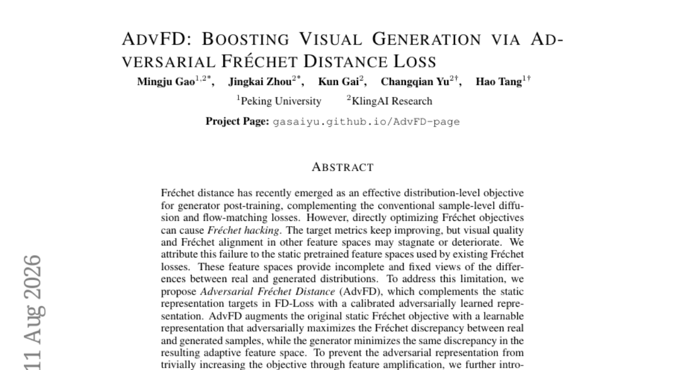

### 📌 한 줄 요약
정적 특징 공간의 한계를 극복하기 위해 적대적 학습을 도입하여 생성 모델의 품질과 분포 정렬을 동시에 개선하는 새로운 손실 함수 제안

### 🔑 핵심 포인트
- 정적 특징 공간의 한계를 극복하기 위한 적대적 표현 학습(Adversarial Representation) 도입
- 지표 최적화와 시각적 품질 사이의 불균형을 해결하는 min-max 최적화 구조
- 학습 안정성을 위한 real-feature whitening 기법 적용

### 🧑‍💻 개발자 관점
Diffusion이나 Flow-matching 모델의 사후 학습 시, 지표(FID 등)만 높아지고 실제 이미지는 망가지는 현상을 방지하고 실질적인 생성 품질을 높일 수 있습니다.

### 🚀 실무 적용 아이디어
- 기존 Diffusion 모델의 post-training 단계에 AdvFD 손실 함수를 결합하여 성능 비교
- 다양한 사전 학습된 특징 공간(Feature Space) 환경에서 whitening 효과 검증
- 모델 규모(Scale) 변화에 따른 적대적 학습의 안정성 테스트

### ⚠️ 리스크/한계
- 적대적 학습 특성상 하이퍼파라미터 설정에 따라 학습 불안정성이 발생할 수 있음
- 계산 복잡도가 기존 정적 Fréchet loss보다 높을 수 있음

### 📝 초록 기반 상세 설명
최근 생성 모델의 사후 학습(post-training)에서 Fréchet distance는 효과적인 분포 기반 목적 함수로 사용되고 있습니다. 그러나 기존의 정적 사전 학습 특징 공간을 사용하는 방식은 지표만 개선되고 실제 시각적 품질이 저하되는 'Fréchet hacking' 문제를 야기합니다. 이를 해결하기 위해 본 논문은 적대적으로 학습된 표현을 결합한 AdvFD(Adversarial Fréchet Distance)를 제안합니다. AdvFD는 적대적 표현이 실재와 생성 데이터 간의 차이를 극대화하도록 유도하고, 생성기는 이를 최소화하며 적응형 특징 공간을 학습합니다. 또한, 특징 증폭으로 인한 최적화 불안정성을 막기 위해 real-feature whitening 기법을 도입했습니다. 실험 결과, AdvFD는 다양한 백본과 모델 규모에서 일보(one-step) 생성 모델의 성능을 일관되게 향상시켰습니다.

---

## 6. [Mendel Gödel Machine: Recursive Self-Improving Coding Agents via Comparative Evolution](https://huggingface.co/papers/2608.07645)
**Upvotes**: 15 | **도입 난이도**: 상 | **신뢰도**: 상
**arXiv**: https://arxiv.org/abs/2608.07645

**태그**: AI Agent, Self-Improving, Evolutionary Algorithm, Code Generation, Agent

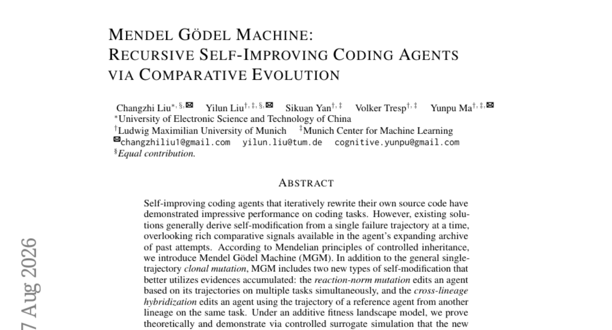

### 📌 한 줄 요약
과거의 실패와 성공 데이터를 비교 분석하여 스스로 코드를 개선하는 재귀적 자기 개선 코딩 에이전트 프레임워크

### 🔑 핵심 포인트
- 단일 실패 경로를 넘어 과거의 다양한 시도 데이터를 활용하는 비교 진화 전략 도입
- 다중 작업 궤적을 반영하는 반응 규격 변이 및 계통 간 정보를 교환하는 잡종 형성 메커니즘 설계
- SWE-bench 등 실제 코딩 벤치마크에서 성능 및 일반화 능력 검증

### 🧑‍💻 개발자 관점
에이전트가 단순히 한 번의 실패를 수정하는 것을 넘어, 축적된 과거 기록과 다른 모델의 성공 사례를 학습 데이터로 활용하는 고도화된 자가 학습 구조를 제시합니다.

### 🚀 실무 적용 아이디어
- 에이전트의 과거 실행 로그(Trajectory)를 데이터베이스화하여 학습 피드백 루프 구축 실험
- 서로 다른 프롬프트/파라미터 환경을 서로 다른 '계통'으로 정의하고 교차 결합하는 로직 구현
- 단일 시도 수정 방식과 비교하여 데이터 축적량에 따른 성능 향상 곡선 측정

### ⚠️ 리스크/한계
- 과거 데이터(로그)의 양이 방대해질 경우 발생하는 연산 비용 및 관리 복잡도
- 잘못된 성공 사례나 편향된 궤적이 유전될 경우 발생하는 성능 퇴화 위험

### 📝 초록 기반 상세 설명
최근 스스로 코드를 수정하는 자기 개선 코딩 에이전트가 등장했으나, 기존 방식은 단일 실패 경로에만 의존하여 과거의 풍부한 비교 신호를 활용하지 못하는 한계가 있었습니다. 본 논문은 멘델의 유전 원리를 응용한 Mendel Gödel Machine(MGM)을 제안합니다. MGM은 단일 경로 변이 외에도 여러 작업의 궤적을 동시에 반영하는 '반응 규격 변이(reaction-norm mutation)'와 다른 계통의 참조 에이전트 데이터를 활용하는 '교차 계통 잡종 형성(cross-lineage hybridization)' 방식을 도입합니다. 이론적 증명과 시뮬레이션을 통해 제안된 전략이 단일 경로 방식보다 빠르고 우수한 수렴 성능을 보임을 확인했습니다. 최종적으로 SWE-bench 및 Polyglot 실험을 통해 성능, 효율성, 일반화 성능의 향상을 입증했습니다.

---

## 7. [VibeLifeBench: Can Your Life Agent Be Proactive and Persistent in a Living World?](https://huggingface.co/papers/2608.10875)
**Upvotes**: 11 | **도입 난이도**: 상 | **신뢰도**: 상
**arXiv**: https://arxiv.org/abs/2608.10875

**태그**: LLM Agent, Benchmark, Long-horizon Task, Simulation, Agent, Evaluation

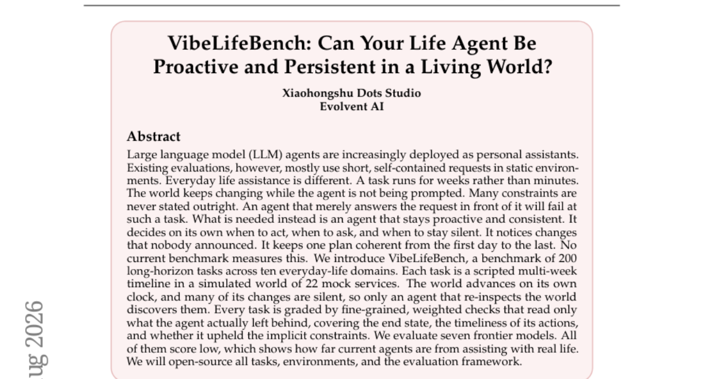

### 📌 한 줄 요약
장기적이고 능동적인 일상 생활 지원 능력을 평가하기 위한 새로운 벤치마크 VibeLifeBench 제안

### 🔑 핵심 포인트
- 200개의 장기적(Long-horizon) 과제와 2묘적(Mock) 서비스 환경을 포함한 VibeLifeBench 개발
- 에이전트의 개입 없이도 환경이 변화하는 동적 시뮬레이션 환경 구축
- 행동의 적시성, 최종 상태, 암묵적 제약 준수를 포함한 정밀한 평가 프레임워크 설계

### 🧑‍💻 개발자 관점
단순 질의응답을 넘어, 시간이 흐름에 따라 상태가 변하는 실생활 밀착형 에이전트 개발 시 고려해야 할 평가 지표를 제시합니다.

### 🚀 실무 적용 아이디어
- 제공되는 시뮬레이션 환경에서 현재 개발 중인 에이전트의 지속성(Persistence) 테스트
- 명시되지 않은 환경 변화에 대한 에이전트의 재검토(Re-inspection) 능력 측정
- 장기 과제 수행 시 계획의 일관성 유지 여부 검증

### ⚠️ 리스크/한계
- 시뮬레이션 환경과 실제 물리적 세계 간의 간극 존재
- 복잡한 시나리오로 인해 평가 비용 및 컴퓨팅 자원 소모가 클 수 있음

### 📝 초록 기반 상세 설명
기존 LLM 에이전트 평가는 정적 환경에서의 단기적 요청 해결에 집중되어 있어, 변화하는 현실 세계에서의 장기적 과제 수행 능력을 측정하기 어렵습니다. 본 논문은 시간이 흐름에 따라 환경이 변하고 명시되지 않은 제약 조건이 존재하는 일상적 과제를 해결할 수 있는 능력을 평가하고자 합니다. 이를 위해 10개 도메인과 22개 가상 서비스가 포함된 200개의 장기적 과제 시나리오를 담은 VibeLifeBench를 도입했습니다. 환경은 에이전트의 개입 없이도 독자적인 시계에 따라 변화하며, 평가는 최종 상태뿐만 아니라 행동의 적시성과 암묵적 제약 준수 여부를 포함한 정밀한 가중치 기반 방식으로 이루어집니다. 7개의 최신 모델을 평가한 결과, 모든 모델이 낮은 점수를 기록하며 현재 에이전트 기술이 실생활 지원에 미치지 못함을 보여주었습니다.

---

## 8. [Ex-Omni-2D: Expressive Omni-Modal Dialogue Models with Native Visual Presence](https://huggingface.co/papers/2608.10720)
**Upvotes**: 9 | **도입 난이도**: 상 | **신뢰도**: 상
**arXiv**: https://arxiv.org/abs/2608.10720

**태그**: Multimodal, Video-Generation, Speech-Synthesis, AI-Agent, Vision, Video, Audio, Inference, Distillation

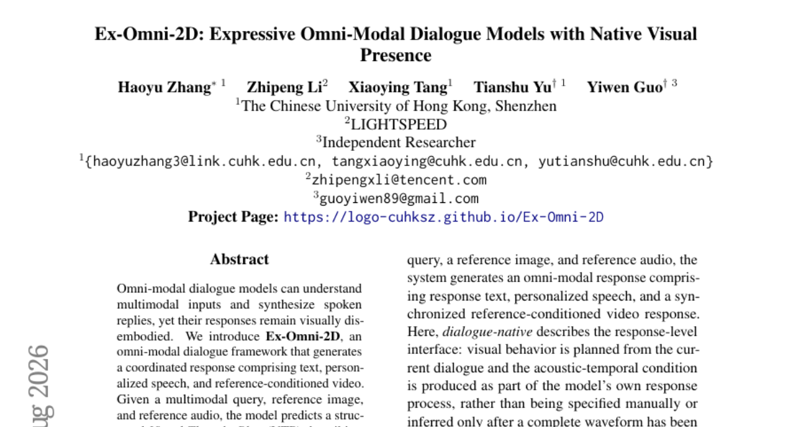

### 📌 한 줄 요약
텍스트, 음성, 비디오를 동시에 생성하여 시각적 실재감을 갖춘 멀티모달 대화 모델 프레임워크

### 🔑 핵심 포인트
- 텍스트, 음성, 비디오가 결합된 통합 응답 생성 프레임워크 제안
- VTP(Visual Thought Plan)와 공유 인터페이스를 통한 데이터 효율적 학습 구조
- Prefix Streaming 메커니즘을 적용한 효율적인 블록 인과적 스트리밍 생성

### 🧑‍💻 개발자 관점
단순 텍스트 응답을 넘어 아바타와 음성이 결합된 실감형 AI 에이전트 구현을 위한 핵심 기술을 제시합니다.

### 🚀 실무 적용 아이디어
- 제시된 VTP(Visual Thought Plan) 구조의 시나리오별 생성 품질 검증
- Prefix Streaming 메커니즘이 긴 문장 생성 시 누적 오차에 미치는 영향 분석
- 제한된 GPU 자원 환경에서의 추론 속도 및 메모리 점유율 테스트

### ⚠️ 리스크/한계
- 고성능 GPU(4-GPU) 환경을 전제로 한 실시간성 확보로 일반 환경 적용 제약
- 복잡한 멀티모달 정렬 과정에서의 데이터 품질 의존성

### 📝 초록 기반 상세 설명
기존의 옴니모달 대화 모델은 멀티모달 입력을 이해하고 음성 응답을 생성할 수 있지만, 시각적 실재감이 부족하다는 문제가 있었습니다. 이를 해결하기 위해 텍스트, 개인화된 음성, 참조 조건부 비디오를 통합 생성하는 Ex-Omnisi-2D 프레임워크를 제안합니다. 모델은 시각적 사고 계획(VTP)을 먼저 예측한 후, 음성 및 비디오 프레임과 정렬되는 공유 음향-시간 인터페이스를 통해 응답을 생성합니다. 학습 시에는 대규모 정렬 데이터 없이도 이질적인 데이터를 활용할 수 있도록 설계되었으며, Teacher-Student 증류 방식을 통해 효율성을 높였습니다. 결과적으로 4-GPU 환경에서 실시간에 가까운 RTF 1.293을 달관하며 높은 품질과 효율성을 동시에 달성했습니다.

---

## 9. [Decoding-Level Taboo: A Diagnostic Stress Test for LLM Robustness](https://huggingface.co/papers/2608.09900)
**Upvotes**: 7 | **도입 난이도**: 중 | **신뢰도**: 상
**arXiv**: https://arxiv.org/abs/2608.09900

**태그**: LLM Robustness, Decoding Strategy, Model Evaluation, Alignment, Benchmark, Evaluation, Safety

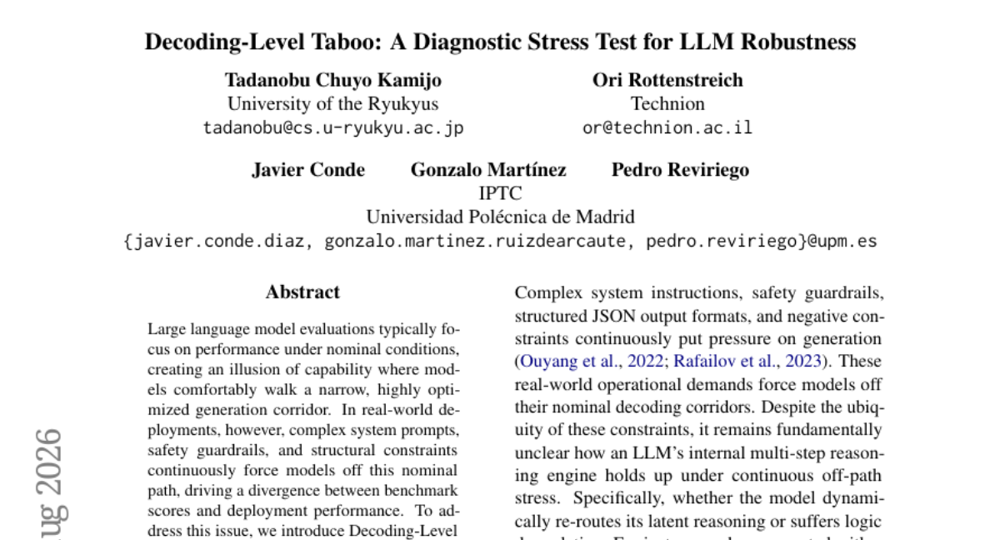

### 📌 한 줄 요약
로그릿(Logit) 수준의 토큰 마스킹을 통해 모델의 우회 생성 능력을 측정하는 새로운 강건성 진단 프레임워크 제안

### 🔑 핵심 포인트
- 제로 프롬프트 방식의 로그릿 수준 진단 프레임워크 'Taboo' 개발
- 주요 토큰 마스킹을 통한 모델의 우회적 표현(circumlocution) 능력 측정
- 모델 규모 및 정렬(Alignment) 수준과 강건성 간의 상관관계 규명

### 🧑‍💻 개발자 관점
모델이 특정 단어를 사용하지 못하는 제약 조건 하에서도 의도를 유지할 수 있는지 검증함으로써, 실제 서비스 배포 시 발생할 수 있는 예외 상황에 대한 신뢰도를 높일 수 있습니다.

### 🚀 실무 적용 아이디어
- 자체 모델의 특정 토큰을 마스킹하며 문맥 유지 능력이 얼마나 유지되는지 테스트
- RLHF/DPO 적용 전후의 우회 생성 능력 차이 비교 실험
- 제약 조건이 까다로운 합성 데이터 생성 파이프라인에 Taboo 로직 적용

### ⚠️ 리스크/한계
- 로그릿 직접 조작 방식이므로 특정 추론 엔진/프레임워크에 종속적일 수 있음
- 단순히 단어를 피하는 능력이 모델의 전반적인 지능과 직결되는지에 대한 추가 검증 필요

### 📝 초록 기반 상세 설명
기존 LLM 평가는 최적화된 환경에서의 성능에만 집중하여 실제 배포 환경에서의 변동성을 반영하지 못하는 문제가 있습니다. 실무에서는 복잡한 프롬프트나 제약 조건으로 인해 모델이 의도된 경로를 벗어나는 경우가 빈번합니다. 이를 해결하기 위해 본 논문은 런타임 시 로그릿 공간에서 직접 개입하는 'Decoding-Level Taboo'를 제안합니다. 이 방법은 단어 경계에서 주요 후보 토큰을 동적으로 마스킹하여 모델이 우회적인 표현(circumlocution)을 하도록 강제합니다. 실험 결과, 모델의 크기와 사후 학습(post-training) 정렬 수준이 높을수록 이러한 강건성이 향상됨을 확인했습니다.

---

## 10. [SkillZip: Evaluation-Free Skill Compression for Self-Evolving Agents by Discovering Reusable Structure](https://huggingface.co/papers/2608.11079)
**Upvotes**: 6 | **도입 난이도**: 중 | **신뢰도**: 상
**arXiv**: https://arxiv.org/abs/2608.11079

**태그**: AI Agent, Prompt Engineering, Knowledge Compression, Workflow Automation, Agent, RAG, Evaluation, Optimization

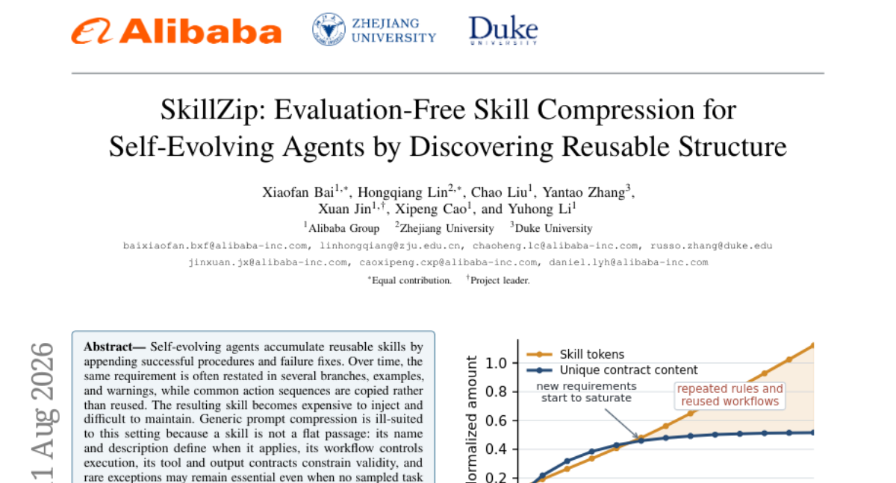

### 📌 한 줄 요약
에이전트의 반복되는 스킬/절차를 구조적으로 압축하여 비용을 절감하고 유지보수성을 높이는 평가 불필요(Evaluation-free) 압축 기법

### 🔑 핵심 포인트
- 구조적 추출: 반복되는 규칙과 액션 시퀀스를 공통 프로시저로 팩터링하여 중복 제거
- 평가 불필요(Evaluation-free): 별도의 롤아웃이나 테스트 세트 없이 구조적 제약 조건을 통해 압축 수행
- Zip-on-Write 모드: 새로운 스킬이 추가될 때 전체를 다시 파싱하지 않고 효율적으로 업데이트 가능

### 🧑‍💻 개발자 관점
에이전트의 히스토리가 길어질수록 발생하는 프롬프트 비용 폭증과 컨텍스트 오염 문제를 구조적 설계로 해결할 수 있습니다.

### 🚀 실무 적용 아이디어
- 에이전트의 반복되는 작업 로그를 모아 SkillZip의 MDL 목적 함수에 적용해보기
- 기존의 단순 텍스트 요약 방식과 SkillZip의 구조적 압축 방식 간의 성능/비용 비교 실험
- 점진적인 스킬 업데이트(Zip-on-Write) 시 기존 워크플로우가 깨지는지 검증

### ⚠️ 리스크/한계
- 구조적 압축 과정에서 아주 미세한 예외 규칙이 누락될 가능성
- 복잡한 워크플로우를 가진 스킬의 경우 구조적 추출 난이도가 높을 수 있음

### 📝 초록 기반 상세 설명
자율 진화형 에이전트는 학습 과정에서 유사한 스킬과 절차가 중복 축적되어 프롬프트 비용이 증가하고 관리가 어려워지는 문제를 겪습니다. 기존의 일반적인 프롬프트 압축 방식은 스킬의 구조적 특성(워크플로우, 도구 계약 등)을 유지하기 어렵고, 평가 기반 압축은 비용과 데이터 의존성 문제가 있습니다. 이를 해결하기 위해 SkillZip은 반복되는 규칙을 공통 구조로 추출하고 차이점만 남기는 '최소 기술 길이(MDL)' 기반의 구조적 압축 방식을 제안합니다. 이 방식은 별도의 롤아웃이나 평가 세트 없이도 스킬의 핵심 계약과 워크플로우를 보존하며 효율적으로 압축합니다. 실험 결과, SkillZip은 압축 성능, 일반화 능력, 비용 효율성 측면에서 기존 방식보다 우수한 성능을 입증했습니다.

---

## 11. [Not Worth Another Token: Marginal Value Estimation for Efficient Deep Research Agents](https://huggingface.co/papers/2608.08389)
**Upvotes**: 6 | **도입 난이도**: 하 | **신뢰도**: 상
**arXiv**: https://arxiv.org/abs/2608.08389

**태그**: AI Agent, RAG, Context Management, Efficiency, Agent, Evaluation, Inference

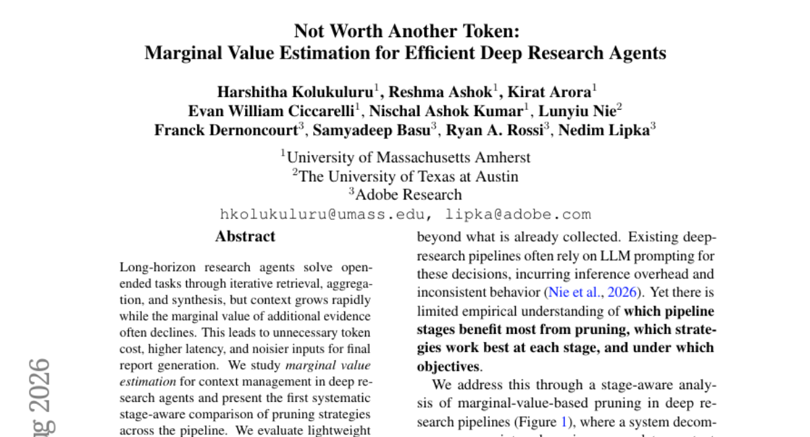

### 📌 한 줄 요약
에이전트의 컨텍스트 비대화 문제를 해결하기 위해 단계별 프루닝(Pruning) 전략의 효율성을 분석한 연구

### 🔑 핵심 포인트
- 에이전트 파이프라인 단계별(Pre-retrieval, Post-retrieval, Pre-synthesis) 프루닝 효과 비교
- 초기 단계 프루닝이 전체 엔드투엔드 비용 절감에 가장 효과적임을 입증
- 가벼운 휴리스틱 기반 프루닝이 품질 유지와 비용 절감 사이에서 강력한 효율성을 제공

### 🧑‍💻 개발자 관점
에이전트 기반 RAG 시스템 구축 시, 무조건적인 컨텍스트 확장이 아닌 단계별 정보 정제 전략이 비용과 성능 최적화의 핵심임을 시사합니다.

### 🚀 실무 적용 아이디어
- 현재 운영 중인 에이전트 파이프라인에 단계별 정보 필터링(Pruning) 로직 적용 테스트
- 검색된 문서의 중요도를 점수화하는 가벼운 휴리스틱 규칙 설계 및 비교
- 컨텍스트 크기에 따른 최종 합성 품질 변화량 측정

### ⚠️ 리스크/한계
- 과도한 프루닝 시 핵심 정보가 누락되어 최종 합성 품질이 저하될 위험
- 특정 도메인에 특화된 프루닝 규칙은 범용적인 에이전트 작업에서 성능이 낮을 수 있음

### 📝 초록 기반 상세 설명
장기 연구 에이전트는 반복적인 정보 수집 과정을 거치며 컨텍스트가 급격히 커지지만, 추가 정보의 한계 효용은 점차 감소하는 문제를 겪습니다. 이는 불필요한 토큰 비용 발생, 지연 시간 증가, 최종 결과물의 노이즈 유발로 이어집니다. 본 연구는 에이전트 파이프라인의 각 단계(검색 전, 검색 후, 합성 전)에서 프루닝 전략의 효과를 체계적으로 비교 분석했습니다. 실험 결과, 프루닝이 적용되는 시점이 효율성에 가장 큰 영향을 미치며, 초기 단계의 프루닝이 가장 큰 비용 절감 효과를 가져왔습니다. 가벼운 휴리스틱만으로도 품질 저하를 최소화하며 토큰 사용량을 최대 73%까지 줄일 수 있음을 확인했습니다.

---

## 12. [InSight-doc: Agentic Visual Perception for Long-Document Understanding](https://huggingface.co/papers/2608.10628)
**Upvotes**: 5 | **도입 난이도**: 중 | **신뢰도**: 상
**arXiv**: https://arxiv.org/abs/2608.10628

**태그**: Agent, Document-AI, Vision-Language, Efficiency, Reasoning, Benchmark, Inference

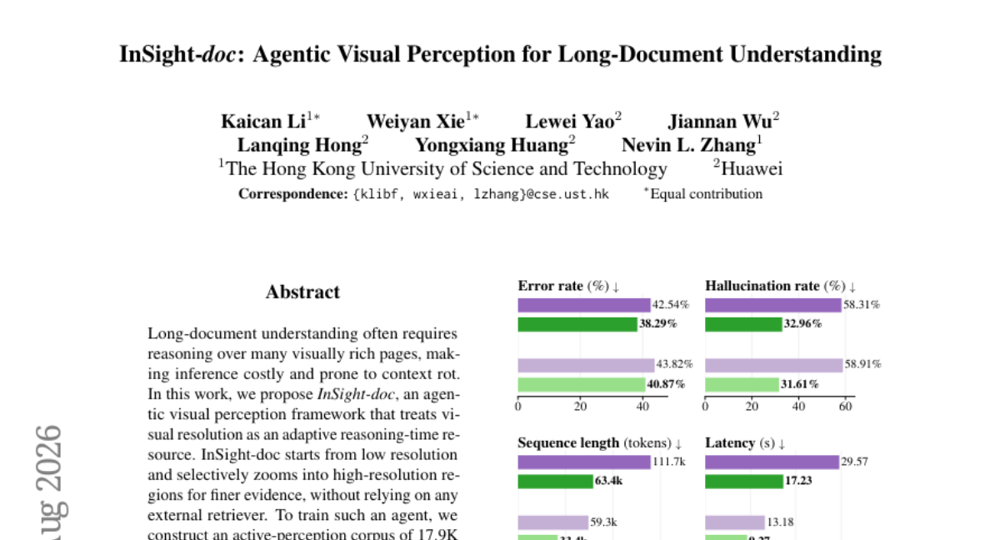

### 📌 한 줄 요약
에이전트 기반의 적응형 줌인(Zoom-in) 방식을 통해 긴 문서의 시각적 이해 성능과 추론 효율을 동시에 높인 프레임워크

### 🔑 핵심 포인트
- 에이전트가 필요한 영역만 선택적으로 확대하는 적응형 시각 인지 메커니즘 도입
- 외부 검색 엔진 없이 시각적 해상도 조절만으로 정밀한 증거 확보
- SFT와 RL을 결합하여 정확도 향상 및 환각/지연 시간 문제 동시 해결

### 🧑‍💻 개발자 관점
문서 분석 시 전체를 고해상도로 처리하는 대신 필요한 부분만 줌인함으로써, 비용 효율적이고 정확한 시각적 RAG 시스템 구축이 가능해집니다.

### 🚀 실무 적용 아이디어
- 제공된 데이터셋을 활용하여 기존 멀티모달 모델의 줌인 성능 비교 실험
- 문서 VQA 태스크에 에이전트 기반의 단계적 해상도 조절 로직 적용 테스트
- 추론 비용 절감을 위한 저해상도-고해상도 스위칭 전략 검증

### ⚠️ 리스크/한계
- 에이전트의 선택적 줌인 실패 시 중요한 시각적 정보를 놓칠 위험 존재
- 복잡한 레이아웃의 문서에서 에이전트의 탐색 경로가 길어질 경우 지연 시간 증가 가능성

### 📝 초록 기반 상세 설명
긴 문서를 이해하려면 시각적으로 풍부한 여러 페이지를 처리해야 하며, 이는 높은 비용과 컨텍스트 손실 문제를 야기합니다. 본 논문은 시각적 해상도를 추론 시 가용 자원으로 활용하는 에이전트 기반 시각 인지 프레임워크인 InSight-doc를 제안합니다. 외부 리트리버 없이 저해상도에서 시작하여 필요한 영역만 선택적으로 고해상도로 확대하는 방식을 취합니다. 이를 위해 17.9K의 SFT 데이터와 19.2K의 RL 데이터를 포함한 능동적 인지 코퍼스를 구축하여 학습을 진행했습니다. 실험 결과, 기존 벤치마크 대비 정확도가 크게 향상되었으며, 긴 문서에서 환각 현상을 40% 이상 줄이고 추론 지연 시간을 대폭 단축했습니다.

---

## 13. [DistilVDR: A Compact End-to-End Visual Document Retriever via Dual-Student Distillation](https://huggingface.co/papers/2608.10636)
**Upvotes**: 5 | **도입 난이도**: 중 | **신뢰도**: 상
**arXiv**: https://arxiv.org/abs/2608.10636

**태그**: VDR, Knowledge-Distillation, Efficient-AI, RAG, Vision-Language, Vision, Benchmark, Evaluation, Distillation, Optimization, Safety

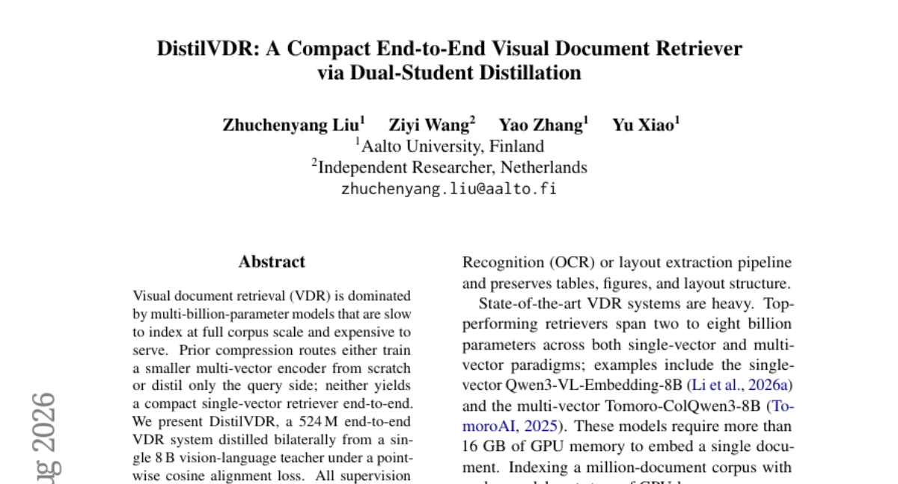

### 📌 한 줄 요약
8B 모델의 성능을 유지하면서도 인덱싱 속도와 저장 용량을 획기적으로 개선한 524M 규모의 경량 시각 문서 검색(VDR) 시스템

### 🔑 핵심 포인트
- 8B 교사 모델의 임베딩 공간을 활용한 효율적인 양방향 학생 모델 증류 기법
- 쿼리(70M)와 문서(454M) 간의 비대칭 인코더 설계를 통한 효율적 자원 배분
- 정답 라벨이나 복잡한 대조 학습 없이도 높은 검색 성능(NDCG) 달성

### 🧑‍💻 개발자 관점
대규모 문서 집합을 대상으로 하는 RAG 시스템 구축 시, 검색 인덱스 크기를 줄이고 인덱싱/검색 속도를 높이면서도 고성능을 유지할 수 있는 실무적인 대안을 제시합니다.

### 🚀 실무 적용 아이디어
- 제공된 소스 코드를 활용하여 다양한 해상도(HiRes vs Fast) 설정에 따른 성능 변화 테스트
- 기존 Multi-vector 방식 대비 인덱스 용량 절감 효과 실측
- 자체 보유한 문서 데이터셋에 대한 인덱싱 속도 벤치마크 수행

### ⚠️ 리스크/한계
- 교사 모델의 성능에 의존적인 학생 모델의 성능 한계 가능성
- 매우 복잡한 레이아웃이나 특수 문서 구조에서의 일반화 성능 검증 필요

### 📝 초록 기반 상세 설명
기존의 시각 문서 검색(VDR)은 수십억 개의 파라미터를 가진 거대 모델을 사용하여 대규모 코퍼스 인덱싱과 서비스 비용이 매우 높다는 문제가 있었습니다. 이를 해결하기 위해 연구진은 8B 규모의 단일 교사 모델로부터 양방향 증류(Dual-Student Distillation)를 수행하는 DistilVDR를 제안합니다. 이 방식은 별도의 정답 라벨이나 네거티브 샘플링 없이 교사의 임베딩 공간을 직접 모방하여 학습합니다. 또한 쿼리 측은 가볍게 유지하고 문서 측에 시각적 역량을 집중하는 비대칭 인코더 구조를 채택했습니다. 결과적으로 기존 모델 대비 훨씬 작은 인덱스 크기와 빠른 인덱싱 속도를 달면서도 강력한 검색 성능을 달이는 데 성공했습니다.

### 🖼️ 추가 자료

---

## 14. [Reference-Free Post-Training of Open Large Language Models for Multilingual Machine Translation](https://huggingface.co/papers/2608.10812)
**Upvotes**: 5 | **도입 난이도**: 상 | **신뢰도**: 상
**arXiv**: https://arxiv.org/abs/2608.10812

**태그**: LLM, Machine Translation, Reinforcement Learning, Multilingual, RAG, Evaluation, Distillation

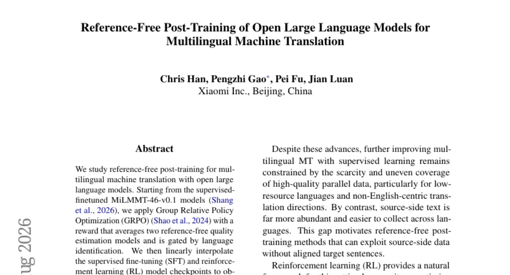

### 📌 한 줄 요약
참조 데이터(Reference) 없이 RL을 통해 다국어 번역 성능을 극대화한 오픈 LLM 최적화 기법

### 🔑 핵심 포인트
- GRPO와 언어 식별(LID) 게이팅이 결합된 참조 없는(Reference-free) 보상 체계 설계
- SFT와 RL 체크포인트 간의 선형 보간을 통한 최적의 번역 품질 확보
- 46개 다국어 환경에서 최신 오픈 모델 및 독점적 상용 모델 대비 경쟁력 입증

### 🧑‍💻 개발자 관점
정답 데이터(Reference)가 부족한 특수 도메인이나 신규 언어 환경에서 LLM을 고성능 번역기로 튜닝하는 실무적 방법론을 제시합니다.

### 🚀 실무 적용 아이디어
- 보상 모델(Reward Model)의 언어 식별 정확도가 전체 번역 품질에 미치는 영향 분석
- SFT와 RL 모델 간의 보간 비율(Interpolation ratio) 최적화 실험
- 특정 도메인(법률, 의료 등) 데이터셋에 대한 온폴리시 증류(On-policy distillation) 효과 검증

### ⚠️ 리스크/한계
- 참조 데이터 없이 보상 모델에만 의존할 경우 발생할 수 있는 모델 붕괴(Model Collapse) 위험
- 보상 모델의 편향이 최종 번역 품질로 전이될 가능성

### 📝 초록 기반 상세 설명
다국어 기계 번역 성능 향상을 위해 참조 데이터가 없는 환경에서의 사후 학습(Post-training)을 연구했습니다. 기존 SFT 모델을 기반으로 언어 식별 기능이 결합된 두 개의 품질 추정 모델을 보상 함수로 사용하는 GRPO 알고리즘을 적용했습니다. 학습된 RL 모델과 SFT 모델을 선형 보간(Linear Interpolation)하여 최종 MiLMMT-46-v1.0 모델을 생성했습니다. 실험 결과, 46개 언어에서 기존 SFT 모델 및 주요 오픈 소스 베이스라인을 상회하는 성능을 기록했습니다. 또한 Google Translate나 GPT-5와 같은 독점적 시스템과 비교해도 우수한 참조 없는 품질 점수를 달성했습니다.

---

## 15. [SPIEval: Evaluating Large Language Models as Mobile Assistants over Scattered Personal Information](https://huggingface.co/papers/2608.10692)
**Upvotes**: 5 | **도입 난이도**: 하 | **신뢰도**: 상
**arXiv**: https://arxiv.org/abs/2608.10692

**태그**: Agent, RAG, Mobile Assistant, Benchmark, Reasoning, Evaluation, Inference

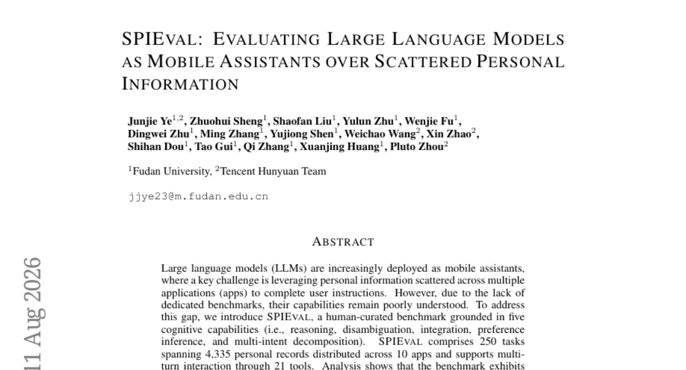

### 📌 한 줄 요약
분산된 개인 정보를 활용하는 모바일 어시스턴트 성능 측정을 위한 벤치마크 'SPIEval' 제안 및 LLM의 정보 탐색 한계 규명

### 🔑 핵심 포인트
- 5가지 인지 능력(추론, 모호성 해소, 통합, 선호도 추론, 다중 의도 분해) 기반의 정교한 벤치마크 설계
- 분산된 개인 정보와 멀티턴 대화 환경을 반영한 실질적인 모바일 어시스턴스 시나리오 구축
- 현재 LLM들이 정보 위치를 정확히 찾는 능력과 심층 검색 활용 능력이 현저히 부족함을 입증

### 🧑‍💻 개발자 관점
개인화된 에이전트 개발 시, 단순히 지식 검색을 넘어 흩어진 데이터 간의 관계를 파악하고 검증하는 능력이 핵심임을 시사합니다.

### 🚀 실무 적용 아이디어
- SPIEval 데이터셋을 활용하여 현재 개발 중인 에이전트의 정보 탐색 정확도 측정
- 모델이 잘못된 정보에 안주하지 않고 추가 검색을 수행하도록 하는 에이전트 워크플로우 설계
- RAG 시스템의 정보 로컬라이제이션(Localization) 성능 개선 실험

### ⚠️ 리스크/한계
- 현재의 LLM 성능이 벤치마크 점수 대비 실무 적용 시 예측 불가능한 변동성을 가질 수 있음
- 개인 정보 기반의 벤치마크 특성상 데이터 보안 및 프라이버시 이슈 고려 필요

### 📝 초록 기반 상세 설명
LLM 기반 모바일 어시스턴스가 여러 앱에 흩어진 개인 정보를 활용하는 능력을 평가할 전용 벤치마크가 부족한 상황입니다. 이를 해결하기 위해 5가지 인지 능력을 기반으로 설계된 인간 큐레이션 벤용 벤치마크인 SPIEval을 도입합니다. SPIEval은 10개 앱의 4,335개 개인 기록과 250개 태스크를 포함하며, 멀티턴 상호작용과 21개의 도구를 지원합니다. 9개의 대표 LLM을 평가한 결과, 최고 성능 모델조차 57.3%의 정확도에 머물며 개선 여지가 큼을 확인했습니다. 특히 실패 원인의 79%가 부정확한 정보 위치 파악에서 비롯되었으며, 모델들이 검증을 위한 추가 검색 대신 잘못된 정보에 안주하는 경향을 보였습니다.

---

## 16. [UniMoMo: Expert Merging-Based MoE Acceleration for Large Recommendation Models](https://huggingface.co/papers/2608.08627)
**Upvotes**: 5 | **도입 난이도**: 중 | **신뢰도**: 상
**arXiv**: https://arxiv.org/abs/2608.08627

**태그**: MoE, Model Compression, Recommendation System, Inference Acceleration, Evaluation, Optimization

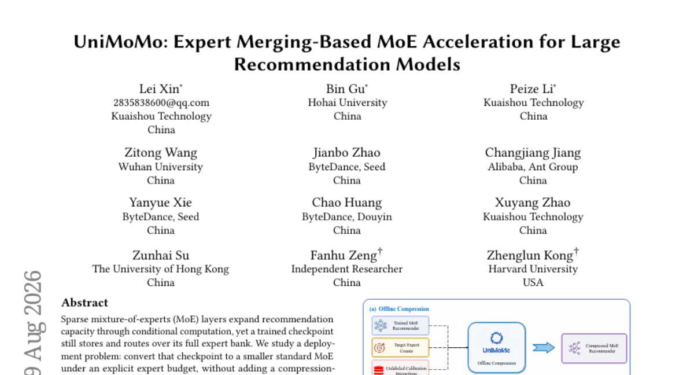

### 📌 한 줄 요약
학습된 MoE 모델을 추가 학습 없이 전문가 병합(Expert Merging)을 통해 성능 저하를 최소화하며 경량화하는 프레임워크

### 🔑 핵심 포인트
- 사후 학습(Post-training) 기반의 전문가 병합을 통한 MoE 모델 압축 프레임워크 제안
- 파라미터 거리가 아닌 데이터 반응 기반의 기능적 유사성을 활용한 전문가 그룹화
- 라우팅 노출도를 고려한 레이어 적응형 보호 메커니즘으로 성능 저하 방지

### 🧑‍💻 개발자 관점
학습된 대형 MoE 모델을 재학습 없이 서비스 환경의 하드웨어 예산에 맞춰 즉각적으로 크기를 조절하고 추론 속도를 높일 수 있습니다.

### 🚀 실무 적용 아이디어
- 기존 학습된 MoE 모델에 UniMoMo의 그래프 거칠게 만들기 로직 적용 테스트
- 전문가 병합 시 성능(NDCG)과 추론 속도(Latency) 간의 Trade-off 프로파일링
- 라우팅 노출도 기반 보호 메커니즘이 특정 레이어에 미치는 영향 분석

### ⚠️ 리스크/한계
- 압축률이 매우 높아질 경우(예: 2개 전문가로 병합) 성능 유지의 불확실성 존재
- 사용하는 캘리브레이션 데이터셋의 품질에 따라 병합 결과가 달라질 수 있음

### 📝 초록 기반 상세 설명
대규모 추천 모델에서 MoE 레이어는 용량을 확장하지만, 배포 시 전체 전문가를 저장하고 라우팅해야 하는 비용 문제가 발생합니다. 본 연구는 추가적인 온라인 모듈 없이 정해진 전문가 예산에 맞춰 기존 체크포인트를 작은 표준 MoE로 변환하는 문제를 다룹니다. 이를 위해 그래프 거칠게 만들기(Graph Coarsening) 문제로 정식화된 사후 학습 압축 프레임워크인 UniMoMo를 제안합니다. UniMoMo는 파라미터 거리가 아닌, 라벨 없는 캘리브레이션 데이터셋을 통해 전문가 간 기능적 유사성을 측정하여 그룹화합니다. 또한, 라우팅 노출도를 기반으로 트래픽이 높은 전문가의 병합을 제한하는 레이어 적응형 보호 메커니즘을 도입했습니다. 실험 결과, 다양한 추천 데이터셋에서 성능 저하를 최소화하면서도 1.28배에서 최대 2.21배의 추론 가속도를 달성했습니다.

---

## 17. [360CityArena: A Realistic Virtual Urban Navigation Benchmark for Embodied Agents](https://huggingface.co/papers/2608.08814)
**Upvotes**: 4 | **도입 난이도**: 중 | **신뢰도**: 상
**arXiv**: https://arxiv.org/abs/2608.08814

**태그**: Embodied AI, Navigation, LMM, Urban Environment, Benchmark, Agent, Reasoning, Video, Evaluation

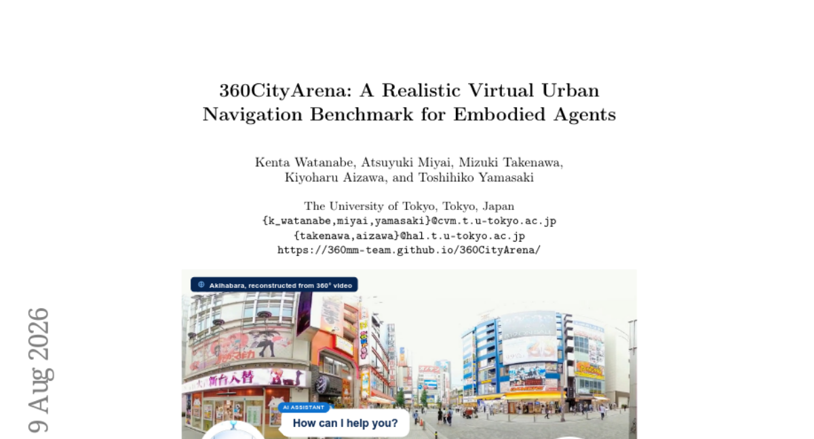

### 📌 한 줄 요약
실제 도시 환경을 모사한 고해상도 360도 비디오 기반의 에이전트 내비게이션 벤치마크 제안

### 🔑 핵심 포인트
- 도쿄 아키하바라를 기반으로 한 고해상도 360도 비디오 기반 가상 도시 환경 구축
- 환경 이해, 경로 추론, 공간 추론을 아우르는 175개의 정교한 태스크 설계
- 현존하는 최상위 LMM 에이전트들의 도시 규모 내비게이션 한계 입증

### 🧑‍💻 개발자 관점
실제 도시 환경과 유사한 복잡한 시각 데이터에서 에이전트의 공간 추론 및 경로 계획 능력을 검증할 수 있는 고난도 벤치마크를 확보할 수 있습니다.

### 🚀 실무 적용 아이디어
- 제공된 360도 환경 데이터셋을 활용한 LMM 기반 에이전트의 성능 벤치마킹
- 환경 이해 및 공간 추론 태스크에 대한 에이전트의 실패 케이스 분석
- 시각적 복잡도가 높은 환경에서의 경로 계획 알고리즘 최적화 실험

### ⚠️ 리스크/한계
- 재구성된 가상 환경과 실제 물리적 세계 간의 물리 법칙 차이 존재 가능성
- 고해상도 360도 데이터 처리에 따른 높은 컴퓨팅 자원 요구

### 📝 초록 기반 상세 설명
기존의 실외 에이전트 벤치마크는 광범위한 도시 환경의 복잡성과 사실적인 시각적 요소를 충분히 반영하지 못하는 한계가 있었습니다. 이를 해결하기 위해 도쿄 아키하바라 지역의 602개 360도 비디오 세그먼트를 활용한 360CityArena를 구축했습니다. 이 벤치마크는 환경 이해, 경로 추론, 공간 추론이라는 세 가지 핵심 작업 범주를 포함하며 175개의 정교한 태스크로 구성됩니다. 최신 LMM 기반 에이전트를 대상으로 평가한 결과, 가장 강력한 모델조차 인간의 성능에 크게 못 미치는 것으로 나타났습니다. 결과적으로 36sCityArena는 현실적인 도시 탐사 및 공간 추론 능력을 검증할 수 있는 도전적인 테스트베드를 제공합니다.

---

## 18. [iFAN: Inference-Aware Learning for Plain Mask Transformers](https://huggingface.co/papers/2608.03216)
**Upvotes**: 3 | **도입 난이도**: 하 | **신뢰도**: 상
**arXiv**: https://arxiv.org/abs/2608.03216

**태그**: Segmentation, Transformer, Self-Distillation, Computer Vision, RAG, Inference, Distillation

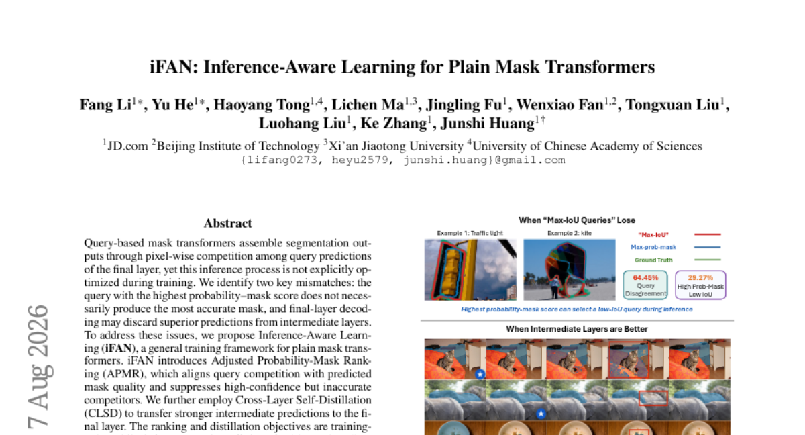

### 📌 한 줄 요약
추가 연산 비용 없이 학습 전략 최적화만으로 마스크 트랜스포머의 세그멘테이션 성능을 끌어올리는 프레임워크

### 🔑 핵심 포인트
- APMR(Adjusted Probability-Mask Ranking): 쿼리 간 경쟁과 실제 마스크 품질 간의 불일치 해결
- CLSD(Cross-Layer Self-Distillation): 중간 레이어의 우수한 예측을 최종 레이어로 전이
- Inference-free overhead: 학습 시에만 적용되는 손실 함수로 추론 효율성 유지

### 🧑‍💻 개발자 관점
모델 구조를 변경하지 않고 학습 전략만 수정하여 성능을 높이므로, 기존 모델의 배포 환경(Latency/FLOPs)을 유지하며 성능을 개선할 수 있습니다.

### 🚀 실무 적용 아이디어
- 기존 Mask Transformer 모델에 APMR 및 CLSD 손실 함수 적용 테스트
- 학습 시 중간 레이어 특징값 추출 및 증류(Distillation) 파이프라인 구축
- 다양한 해상도 및 백본 스케일에서의 성능 변화 측정

### ⚠️ 리스크/한계
- 학습 시에만 적용되므로 데이터셋 특성에 따른 랭킹 정렬 안정성 확인 필요
- 중간 레이어 정보를 활용하는 과정에서 학습 메모리 사용량 증가 가능성

### 📝 초록 기반 상세 설명
쿼리 기반 마스크 트랜스포머는 최종 레이어의 쿼리 간 경쟁을 통해 결과를 도출하지만, 학습 과정에서 이 추론 과정이 명시적으로 최적화되지 않는 문제가 있습니다. 특히 높은 확률 점수를 가진 쿼리가 반드시 정확한 마스크를 생성하지 않거나, 중간 레이어의 우수한 예측이 최종 단계에서 손실되는 미스매치가 발생합니다. 이를 해결하기 위해 제안된 iFAN은 쿼리 경쟁과 마스크 품질을 정렬하는 APMR과 중간 레이어의 예측을 최종 레이어로 전달하는 CLSD 기법을 도입합니다. 이 방법론은 학습 단계에서만 적용되므로 추론 시에는 기존의 효율적인 디코딩 방식을 그대로 유지합니다. 실험 결과, 다양한 아키텍처와 데이터셋에서 파라미터 증가 없이 성능 향상을 입증했습니다.

---

## 19. [JigShape: Evaluating Visual-Geometric Reasoning in VLMs through Jigsaw Puzzles](https://huggingface.co/papers/2607.27670)
**Upvotes**: 3 | **도입 난이도**: 하 | **신뢰도**: 상
**arXiv**: https://arxiv.org/abs/2607.27670

**태그**: VLM, Spatial Reasoning, Benchmark, Computer Vision, Reasoning, Vision, Evaluation

### 📌 한 줄 요약
기하학적 제약이 포함된 퍼즐 벤치마크를 통해 현존 VLM의 공간 추론 능력 한계와 스케일링 문제를 규명함

### 🔑 핵심 포인트
- 기하학적 제약이 명확한 맞물리는 형태의 퍼즐 합체 벤치마크(JigShape) 제안
- 현존 최첨단 VLM들이 복잡한 공간/기하학적 추론에서 매우 취약함을 입증
- 퍼즐 크기 증가에 따라 성능이 급락하는 '스케일링 절벽' 현상 발견

### 🧑‍💻 개발자 관점
시각적 정보와 물리적/기하학적 제약을 동시에 처리해야 하는 로봇 제어 및 공간 이해 모델 개발 시 중요한 성능 지표를 제공합니다.

### 🚀 실무 적용 아이디어
- 현재 사용 중인 VLM 모델의 공간 추론 능력을 확인하기 위해 JigShape 벤치마크 적용
- 모델의 미세 조정(SFT)이 복잡한 기하학적 제약 조건에서도 확장성을 갖는지 테스트
- 멀티모달 모델의 공간적 일관성 유지를 위한 아키텍처 개선 방향 검토

### ⚠️ 리스크/한계
- 현재의 VLM 아키텍처로는 복잡한 기하학적 제약 조건을 유지하며 스케일을 키우기 어려움
- 단순 시각적 패턴 매칭과 실제 공간 추론 사이의 간극이 존재할 수 있음

### 📝 초록 기반 상세 설명
기존의 직사각형 형태 퍼즐 벤치마크는 반복되는 질감 때문에 정답이 모호하여 시각적·기하학적 추론 능력을 평가하기 어려웠습니다. 이를 해결하기 위해 맞물리는 형태(tab-and-blank)를 도입하여 기하학적 제약이 명확한 새로운 벤치마크인 JigShape를 제안합니다. 95K개의 인스턴스를 활용해 최신 VLM들을 테스트한 결과, 대부분의 모델이 무작위 수준의 성능을 보이며 기하학적 추론 능력이 부족함을 드러냈습니다. 미세 조정을 통해 성능을 높일 수 있으나, 퍼즐 크기가 커짐에 따라 성능이 급격히 하락하는 '스케일링 절벽' 현상이 관찰되었습니다. 이는 현재의 VLM 아키텍처가 복잡한 제약 조건을 유지하며 확장하는 데 한계가 있음을 시사합니다.

---

## 20. [DSAgentBench: Can Agents Automate End-to-End Data-Science Workflows in Real Computer Environments?](https://huggingface.co/papers/2608.10366)
**Upvotes**: 2 | **도입 난이도**: 중 | **신뢰도**: 상
**arXiv**: https://arxiv.org/abs/2608.10366

**태그**: AI Agent, Data Science, Benchmark, Automation, Agent, Reasoning, Evaluation

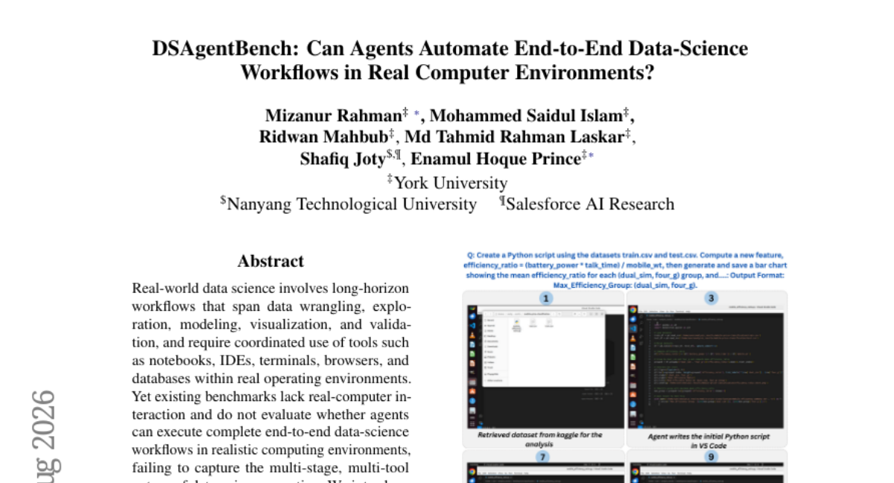

### 📌 한 줄 요약
실제 운영 환경에서의 엔드투엔드 데이터 사이언스 워크플로우 자동화 능력을 평가하는 새로운 벤치마크 제안

### 🔑 핵심 포인트
- 실제 OS 환경(IDE, 터미널, 브라우저 등)에서의 도구 협업 능력을 평가하는 최초의 벤치마크 개발
- 코드 실행 여부를 넘어 분석 정확도, 시각화, 모델 성능을 검증하는 결정론적 평가 체계 구축
- 데이터 사이언스 전 과정을 아우르는 275개의 복잡한 멀티 스테이지 태스크 제공

### 🧑‍💻 개발자 관점
단순 코드 생성을 넘어, 실제 개발 환경에서 도구를 다루며 문제를 해결하는 '에이전트형 데이터 사이언티스트' 개발의 기준점을 제시합니다.

### 🚀 실무 적용 아이디어
- 제공된 벤치마크를 활용하여 현재 보유한 LLM 에이전트의 실무 수행 능력 테스트
- 도구 오케스트레이션 및 OS Grounding 성능 향상을 위한 프롬프트 엔지니어링 실험
- 멀티 스텝 추론 실패 원인 분석을 통한 워크플로우 최적화 전략 수립

### ⚠️ 리스크/한계
- 현재의 LLM 기술로는 복잡한 실무 워크플로우를 완벽히 자동화하기에 역부족임
- 실제 환경에서의 도구 사용 시 발생할 수 있는 보안 및 시스템 안정성 문제

### 📝 초록 기반 상세 설명
기존 데이터 사이언스 벤치마크는 실제 컴퓨터 환경에서의 도구 활용과 복잡한 워크플로우를 평가하는 데 한계가 있었습니다. 이를 해결하기 위해 실제 OS 환경에서 데이터 사이언스 생애주리 전반을 다루는 DSAgentBench를 도입했습니다. 275개의 다양한 태스크를 통해 도구 오케스트레이션과 중간 결과물 기반의 의사결정 능력을 검증합니다. 실험 결과, 최상위 모델인 Claude-3.5-Sonnet조차 56.70%의 성공률을 보였으며 오픈소스 모델들은 매우 낮은 성능을 기록했습니다. 이는 현재의 에이전트 기술과 실제 실무 사이의 상당한 격차를 보여줍니다.

---

## 21. [TSDS-Toolbox: A Toolbox for Measuring Time-Series Dataset Similarity](https://huggingface.co/papers/2608.08119)
**Upvotes**: 2 | **도입 난이도**: 하 | **신뢰도**: 상
**arXiv**: https://arxiv.org/abs/2608.08119

**태그**: Time-Series, Similarity-Measurement, Benchmark, MLOps, RAG, Evaluation

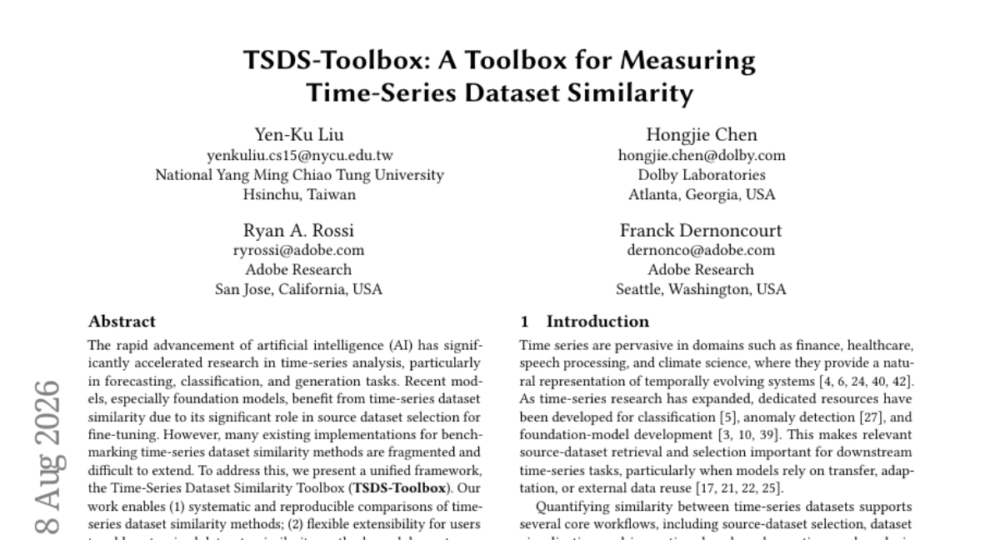

### 📌 한 줄 요약
시계열 데이터셋 유사도 측정 방법론을 체계적으로 비교·확장할 수 있는 통합 프레임워크(TSDS-Toolbox) 제안

### 🔑 핵심 포인트
- 시계열 유사도 방법론의 체계적이고 재현 가능한 비교 환경 제공
- 사용자 정의 데이터셋, 유사도 알고리즘, 다운스트림 태스크를 쉽게 추가할 수 있는 확장성
- 데이터셋 레벨과 시리즈 레벨 간의 일관된 평가를 위한 통합 리듀서 구조

### 🧑‍💻 개발자 관점
파인튜닝 시 최적의 소스 데이터셋을 선택하거나 데이터셋 간의 거리를 정량화해야 하는 엔지니어에게 표준화된 실험 환경을 제공합니다.

### 🚀 실무 적용 아이디어
- 제공된 툴박스를 사용하여 현재 사용 중인 시계열 데이터셋의 유사도 측정 결과 재현하기
- 커스텀 데이터셋과 새로운 유사도 알고리즘을 툴박스에 통합하여 확장성 테스트하기
- 다양한 다운스트림 태스크(예: 예측, 분류)에서의 유사도 지표 영향도 분석하기

### ⚠️ 리스크/한계
- 기존 파편화된 방법론들을 통합하는 과정에서 발생할 수 있는 구현상의 호환성 문제
- 특정 도메인에 특화된 데이터셋 적용 시 툴박스의 범용성 검증 필요

### 📝 초록 기반 상세 설명
AI 기술의 발전으로 시계열 예측, 분류, 생성 연구가 가속화되면서 파인튜닝을 위한 소스 데이터셋 선택 시 데이터셋 간 유사도 측정이 중요해졌습니다. 그러나 기존의 시계열 유사도 벤치마킹 구현 방식은 파편화되어 있어 확장과 비교가 어렵다는 문제가 있었습니다. 이를 해결하기 위해 통합 프레임워크인 TSDS-Toolbox를 제안합니다. 이 툴박스는 방법론 간의 체계적이고 재현 가능한 비교를 가능하게 하며, 사용자 정의 데이터셋과 태스크를 쉽게 추가할 수 있는 유연한 확장성을 제공합니다. 또한 데이터셋 레벨과 시리즈 레벨의 유사도를 일관되게 평가할 수 있는 통합 리듀서를 포함합니다. 다양한 실험 설정을 통해 TSDS-Toolbox의 효과를 검증하였습니다.

---

## 22. [Power law graph attention: exact generalization of scaled dot-product attention, empirical collapse at inference](https://huggingface.co/papers/2608.10288)
**Upvotes**: 1 | **도입 난이도**: 상 | **신뢰도**: 중
**arXiv**: https://arxiv.org/abs/2608.10288

**태그**: Transformer, Attention, Deep Learning Theory, LLM, Inference

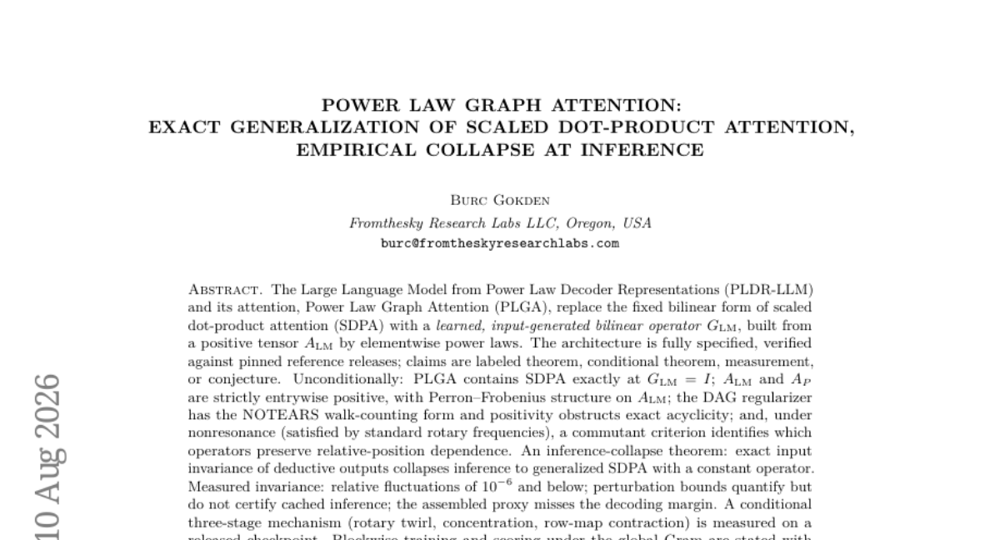

### 📌 한 줄 요약
기존 SDPA를 일반화한 Power Law Graph Attention(PLGA) 구조를 제안하며, 추론 시 발생하는 연산 붕괴 현상을 이론적으로 규명함

### 🔑 핵심 포인트
- SDPA를 포함하는 일반화된 형태의 Power Law Graph Attention(PLGA) 아키텍처 제안
- 추론 시 연산이 상수로 수렴하여 SDPA로 회귀하는 'inference-collapse' 현상 규명
- Lean 4를 이용한 수학적 증명 및 실험적 검증을 통한 구조적 안정성 확보

### 🧑‍💻 개발자 관점
Attention 메커니즘의 수학적 구조를 변경할 때 발생할 수 있는 성능 저하(collapse)를 예측하고, 더 강력한 표현력을 가진 어텐션 설계를 위한 이론적 토대를 제공합니다.

### 🚀 실무 적용 아이디어
- 제안된 PLGA 구조를 기존 Transformer 블록에 교체 적용하여 성능 변화 관찰
- 추론 시 발생하는 collapse 현상이 실제 모델의 생성 능력에 미치는 영향 분석
- Rotary Embedding과 PLGA 간의 상호작용에 따른 위치 정보 보존 여부 테스트

### ⚠️ 리스크/한계
- 추론 시 연산이 상수로 수렴하는 collapse 현상으로 인해 설계 의도와 다르게 동작할 위험
- 새로운 연산 구조 도입에 따른 계산 복잡도 증가 및 학습 안정성 확보 문제

### 📝 초록 기반 상세 설명
기존의 Scaled Dot-Product Attention(SDPA)은 고정된 이선형 형식을 사용하여 표현력에 한계가 있습니다. 이를 해결하기 위해 입력에 따라 생성되는 학습 가능한 이선형 연산자인 Power Law Graph Attention(PLGA)을 제안합니다. PLGA는 SDPA를 포함하는 일반화된 구조이며, 양수 텐서를 기반으로 Perron-Frobenius 구조를 갖도록 설계되었습니다. 연구 결과, 추론 과정에서 출력의 불변성으로 인해 연산이 상수로 수렴하는 '추론 붕괴(inference-collapse)' 현상이 발생함을 증명했습니다. 최종적으로 제안된 메커니즘은 기존 SDPA와 호환성을 유지하면서도 새로운 표현력을 제공할 수 있음을 확인했습니다.

---

