# 2026-08-18 Daily Papers (Top 31)

## 오늘의 요약
오늘의 연구는 AI 에이전트의 자율적 문제 해결 능력과 장기적 추론 역량을 평가하기 위한 체계적인 프레임워크 구축에 집중되었습니다. 또한, 모델의 효율적인 지식 전이(Distillation)와 구조적 분리를 통한 생성 제어력 확보 등 실무적 성능 최적화 방법론들이 주요하게 다뤄졌습니다.

### 오늘의 핵심 포인트
- 단순한 최종 점수를 넘어 문제 해결 과정과 경험 재사용 능력을 평가하는 에이전트 중심의 새로운 벤치마크들이 제안되었습니다.
- 지식 저장과 추론 기능을 분리하거나 토크나이저 불일치를 해결하는 등 모델 효율성과 지식 전이 성능을 극대화하는 아키텍처 연구가 돋보였습니다.
- 실제 세계의 복잡한 맥락과 물리적 제약 조건을 반영하여 생성 모델의 일관성과 개인화된 장기 기억 능력을 확보하려는 시도가 이어졌습니다.

**오늘의 태그**: AI Agent, Knowledge Distillation, Evaluation Framework, Model Architecture

## 1. [Can We Defend Against AI-Generated Video Attacks on Real-World Crisis Events? A Systematic Evaluation of Detectors, Generators and Social Dissemination](https://huggingface.co/papers/2608.14391)
**Upvotes**: 257 | **도입 난이도**: 중 | **신뢰도**: 상
**arXiv**: https://arxiv.org/abs/2608.14391

**태그**: AI-Generated Video, Deepfake Detection, Benchmark, Multimodal, Video, Evaluation

### 📌 한 줄 요약
실제 위기 상황을 모사한 AI 생성 영상에 대한 탐지 성능과 사회적 확산 시의 신뢰성 문제를 다룬 벤치마크 연구

### 🔑 핵심 포인트
- 실제 위기 상황 데이터셋인 RA-Bench(17,886개 영상) 구축
- 전통적 탐지기, 제로샷 모델, 미세조정 MLLM 간의 성능 비교 분석
- 생성 품질, 조건부 정보, 사회적 확산이 탐지 성능에 미치는 영향 규명

### 🧑‍💻 개발자 관점
AI 생성 영상이 정교해짐에 따라 기존 탐지 알고리즘이 실세계 데이터(특히 위기 상황)에서 어떻게 무력화되는지 이해하고 대비할 수 있습니다.

### 🚀 실무 적용 아이디어
- RA-Bench 데이터셋을 활용하여 현재 보유한 탐지 모델의 취약점 테스트
- 사회적 확산(압축, 재인코딩 등) 환경을 모사한 데이터 증강 실험 수행
- 멀티모달 모델(MLLM) 기반의 영상 탐지 파이프라인 구축 및 비교

### ⚠️ 리스크/한계
- 현재의 탐지 기술이 생성 모델의 진화 속도를 따라잡지 못할 위험성
- 사회적 확산 과정에서의 데이터 변형이 탐지 성능을 저하시키는 복합적 요인

### 📝 초록 기반 상세 설명
최근 AI 영상 생성 기술이 전쟁이나 재난 등 실세계 위기 상황을 정교하게 모사하며 오정보 확산 위험을 높이고 있습니다. 기존 벤치마크는 생성 조건에 따른 탐지 성능 변화나 사회적 확산 과정에서의 신뢰성 검증이 부족한 실정입니다. 이를 해결하기 위해 실제 영상을 앵커로 활용하는 17,886개의 영상 데이터셋인 RA-Bench를 제안합니다. 연구진은 7종의 전통적 탐지기, 10종의 제로샷 멀티모달 모델, 2종의 미세조정 MLLM을 대상으로 성능을 평가했습니다. 실험 결과, 현재의 탐지 방식들은 생성 조건에 따라 성능이 불균형하며 사회적 확산 과정에서 탐지 난이도가 급격히 상승함을 확인했습니다. 결론적으로 진화하는 생성 모델에 대응할 수 있는 강력하고 견고한 탐지 기술의 필요성을 강조합니다.

---

## 2. [Self-Supervised Visual On-Policy Distillation](https://huggingface.co/papers/2608.14144)
**Upvotes**: 143 | **도입 난이도**: 하 | **신뢰도**: 상
**arXiv**: https://arxiv.org/abs/2608.14144

**태그**: Self-Supervised, Knowledge Distillation, Data Augmentation, Vision-Language, Vision, Benchmark, Distillation

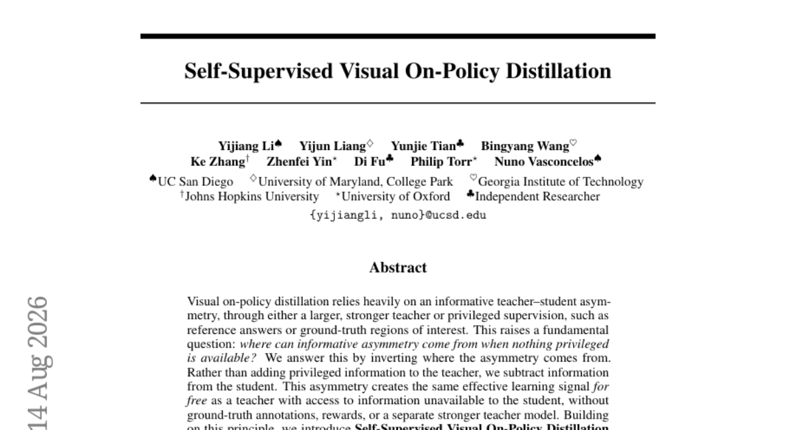

### 📌 한 줄 요약
정답 데이터 없이도 데이터 증강(Augmentation)의 비대칭성을 이용해 강력한 교사 모델 효과를 내는 자기주도 학습법

### 🔑 핵심 포인트
- 특권 정보(정답, 강력한 교사) 없이 데이터 증강의 비대칭성만으로 학습 신호 생성
- S^2VOPD: 원본 이미지(Teacher)와 강한 증강 이미지(Student) 간의 분포 차이를 이용한 자기주도 학습
- 증강의 강도와 태스크 일관성(Task-consistency)이 성능의 핵심 요소임을 규명

### 🧑‍💻 개발자 관점
라벨링된 정답 데이터가 부족한 상황에서, 기존 모델의 성능을 데이터 추가 없이 증강 기법만으로 끌어올릴 수 있는 효율적인 방법론을 제시합니다.

### 🚀 실무 적용 아이디어
- 현재 사용 중인 Vision 모델에 다양한 강도의 Augmentation을 적용하여 성능 변화 관찰
- Task-relevant한 정보가 유지되는 범위 내에서 증강 강도 최적화 실험
- Symmetric(대칭적) 증강이 아닌 Asymmetric(비대칭적) 증강 구조로 파이프라인 설계

### ⚠️ 리스크/한계
- 증강이 너무 강해 태스크에 필요한 핵심 정보까지 사라질 경우 성능 저하 위험
- 특정 도메인이나 태스크에 따라 최적의 증강 조합이 달라질 수 있음

### 📝 초록 기반 상세 설명
기존의 시각적 온폴리시 증류(On-policy distillation)는 정답이나 강력한 교사 모델 같은 특권 정보(Privileged information)에 의존해 성능을 높였습니다. 하지만 정답 데이터가 없는 상황에서 어떻게 정보의 비대칭성을 확보할 것인가라는 근본적인 문제가 존재합니다. 본 논문은 교사에게 정보를 더하는 대신 학생으로부터 정보를 빼는 역발상적 접근법을 제안합니다. 이를 통해 제안된 S^2VODP는 원본 이미지 기반의 교사 분포를 강한 증강이 적용된 학생 분포로 증류하는 방식입니다. 실험 결과, 별도의 정답 없이도 기존의 특권 정보 기반 방식의 96% 성능을 회복하며 최첨단 모델들을 상회하는 성능을 보였습니다.

---

## 3. [Beyond Final Scores: A Systematic Evaluation of Agents for Long-Horizon AI Research and Development](https://huggingface.co/papers/2608.13417)
**Upvotes**: 40 | **도입 난이도**: 중 | **신뢰도**: 상
**arXiv**: https://arxiv.org/abs/2608.13417

**태그**: AI Agent, Evaluation, Autonomous Research, Long-horizon Tasks, Agent, Inference

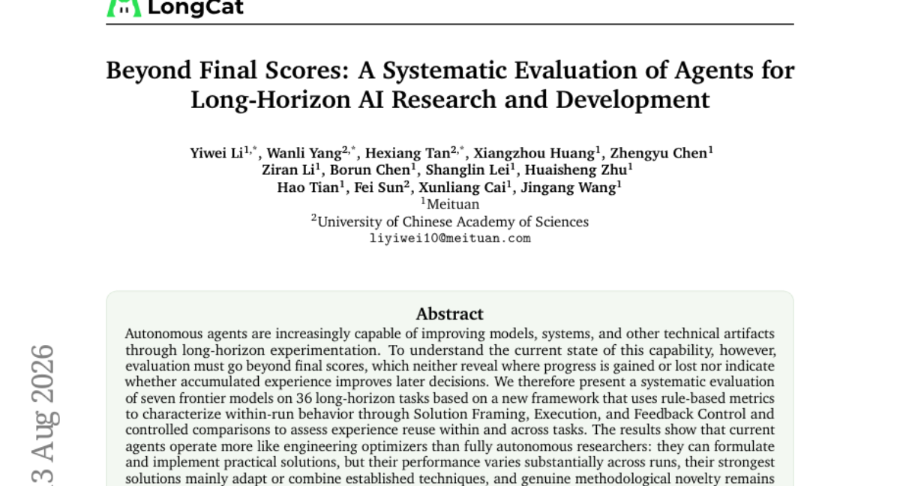

### 📌 한 줄 요약
에이전트의 최종 점수 너머, 문제 해결 과정의 동역학을 분석하여 진정한 자율 연구 역량을 평가하는 프레임워크 제안

### 🔑 핵심 포인트
- 최종 점수 대신 과정(Solution Framing, Execution, Feedback Control) 중심의 체계적 평가 프레임워크 도입
- 에이전트의 경험 재사용(Experience Reuse) 능력과 과제 간 전이 효과 분석
- 현재 에이전트가 자율 연구자보다는 '공학적 최적화 도구'로서 작동하는 특성 규명

### 🧑‍💻 개발자 관점
에이전트 개발 시 최종 결과물뿐만 아니라 중간 과정의 병목과 경험 관리 전략이 성능 안정성에 미치는 영향을 이해하는 것이 필수적임을 시사합니다.

### 🚀 실무 적용 아이디어
- 에이전트의 로그를 분석하여 문제 해결 단계별(프레임워크-실행-피드백) 병목 구간 식별하기
- 과거의 실패/성공 경험이 다음 시도에 긍정적/부정적 영향을 미치는지에 대한 데이터셋 구축
- 단순 결과 점수가 아닌 과정의 일관성을 측정하는 커스텀 메트릭 도입

### ⚠️ 리스크/한계
- 현재의 에이전트가 기존 기술의 조합에 의존하므로 진정한 의미의 창의적 연구 역량 측정에는 한계가 있을 수 있음
- 평가 프레임워크의 규칙 기반 메트릭이 복잡한 실제 환경을 완벽히 대변하지 못할 가능성

### 📝 초록 기반 상세 설명
자율 에이전트가 장기적인 실험을 통해 기술적 산물을 개선하는 능력이 커지고 있으나, 기존의 최종 점수 중심 평가는 과정상의 문제나 경험 축적 효과를 파악하기 어렵습니다. 본 논문은 7개의 최첨단 모델을 대상으로 36개의 장기 과제를 수행하며, 해결 프레임워크, 실행, 피드백 제어라는 세 가지 측면에서 행동을 분석하는 새로운 평가 프레임워크를 제안합니다. 실험 결과, 현재의 에이전트들은 완전한 자율 연구자보다는 공학적 최적화 도구에 가깝다는 것이 밝혀졌습니다. 이들은 실용적인 솔루션을 구현할 수 있지만, 성능 변동성이 크고 기존 기술의 조합에 의존하며 독창적인 방법론 도출은 드물었습니다. 이러한 분석은 모델 학습, 추론 전략, 경험 관리 및 평가 환경 설계의 개선 방향을 제시합니다.

### 🖼️ 추가 자료
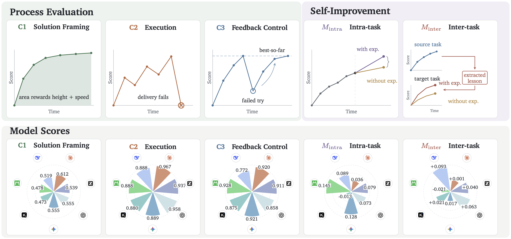

---

## 4. [Intern-S2-Mobius: Foundation Model with Decoupled Knowledge and Reasoning](https://huggingface.co/papers/2608.14290)
**Upvotes**: 30 | **도입 난이도**: 상 | **신뢰도**: 상
**arXiv**: https://arxiv.org/abs/2608.14290

**태그**: Architecture, Efficiency, LLM, Inference-Optimization, Reasoning, Inference, Optimization

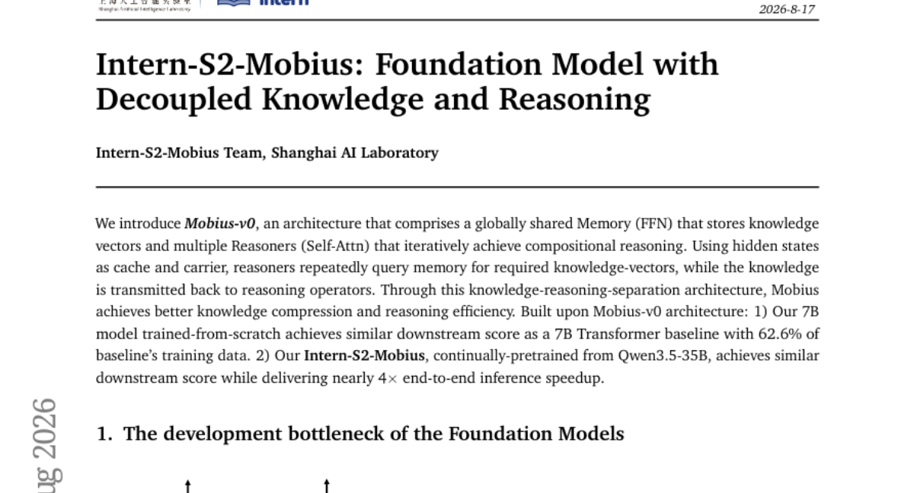

### 📌 한 줄 요약
지식 저장(FFN)과 추론(Self-Attn)을 분리하여 학습 효율과 추론 속도를 극대화한 새로운 아키텍처 제안

### 🔑 핵심 포인트
- 지식(FFN)과 추론(Self-Attn)을 분리하여 압축 효율 및 추론 속도 최적화
- 은닉 상태를 캐시 및 전달 매개체로 활용하는 반복적 쿼리 메커니즘 도입
- 적은 학습 데이터로도 높은 성능을 내는 효율적인 지식 압축 능력 입증

### 🧑‍💻 개발자 관점
모델 크기를 유지하면서도 추론 속도를 획기적으로 높일 수 있어, 실시간 서비스 환경에서 고성능/저비용 모델 구축에 유용합니다.

### 🚀 실무 적용 아이디어
- 제안된 FFN-Self-Attn 분리 구조의 스케일링 법칙(Scaling Law) 검증
- 기존 Transformer 아키텍처와 동일 데이터셋에서의 성능/속도 벤치마크 비교
- 특정 도메인 지식 주입 시 분리된 구조가 미치는 영향 분석

### ⚠️ 리스크/한계
- 새로운 아키텍처 도입에 따른 하드웨어 가속기(GPU) 최적화 난이도
- 지식과 추론의 분리가 복잡한 논리적 추론 작업에서 미칠 잠재적 영향

### 📝 초록 기반 상세 설명
기존 트랜스포머 모델은 지식 저장과 추론 과정이 결합되어 있어 효율적인 압축과 추론에 한계가 있었습니다. 이를 해결하기 위해 지식 벡터를 저장하는 공유 메모리(FF역)와 반복적 추론을 수행하는 다중 추론기(Self-Attn)를 분리한 Mobius-v0 아키텍처를 제안합니다. 이 구조에서 추론기는 은닉 상태를 캐시로 활용하여 메모리에서 필요한 지식을 반복적으로 쿼리하며 지식을 전달받습니다. 실험 결과, 7B 모델을 처음부터 학습했을 때 기존 모델 대비 62.6%의 데이터만으로도 유사한 성능을 달성했습니다. 또한 Qwen3.5-35B를 기반으로 한 Continual Pre-training 모델은 기존 대비 약 4배 빠른 추론 속도를 보여주었습니다.

---

## 5. [Marionette: Predicting World States, Rendering Geometry, Painting Appearance](https://huggingface.co/papers/2608.14530)
**Upvotes**: 22 | **도입 난이도**: 상 | **신뢰도**: 상
**arXiv**: https://arxiv.org/abs/2608.14530

**태그**: World Models, Computer Vision, 3D Graphics, Generative AI, RAG, Video

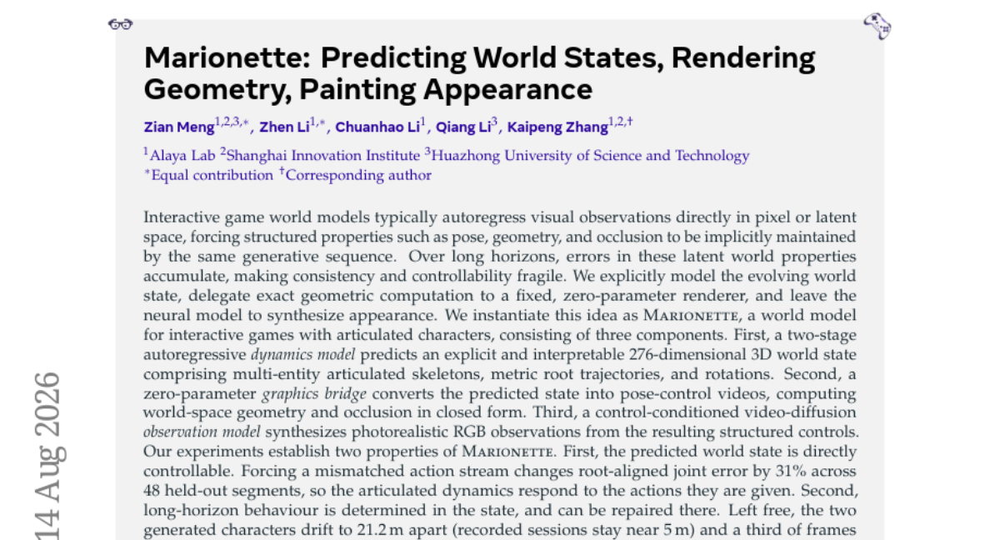

### 📌 한 줄 요약
기하학적 구조와 렌더링을 분리하여 장기적인 일관성과 제어력을 확보한 게임용 월드 모델

### 🔑 핵심 포인트
- 상태(State), 기하(Geometry), 외형(Appearance)의 명시적 분리 구조
- 276차원의 3D 관절 및 궤적을 포함하는 해석 가능한 월드 상태 예측
- 물리적 제약 조건을 상태 단계에서 직접 수정하여 장기적 일관성 확보

### 🧑‍💻 개발자 관점
생성형 AI 모델의 고질적인 문제인 '물리적 불일치'와 '제어 불가능성'을 구조적 분리를 통해 해결하는 실무적인 아키텍처를 제시합니다.

### 🚀 실무 적용 아이디어
- 상태 예측 모델과 렌더링 엔진 간의 데이터 파이프라인 구축 실험
- 물리 엔진 규칙(Collision/Separation)을 상태 벡터에 주입하는 방식 테스트
- 기존 End-to-End 모델과 Marionette 방식의 장기 일관성 비교 실험

### ⚠️ 리스크/한계
- 상태 예측 오차가 렌더링 단계로 전이될 가능성
- 복잡한 환경이나 다수의 객체가 등장할 경우 상태 차원의 폭발적 증가

### 📝 초록 기반 상세 설명
기존의 게임 월드 모델은 픽셀이나 잠재 공간에서 직접 관측치를 생성하여 기하학적 일관성과 제어력이 떨어지는 문제가 있었습니다. 이를 해결하기 위해 Marionette은 명시적인 3D 월드 상태를 예측하고, 렌더러를 통해 기하학을 계산하며, 신경망은 외형(Appearance)만 합성하는 구조를 제안합니다. 먼저 2단계 자기회귀 모델이 관절 구조와 궤적을 포함한 276차원의 3D 상태를 예측합니다. 이후 제로 파라미터 그래픽 브릿지가 이를 기하학적 제어 영상으로 변환하며, 마지막으로 확산 모델이 실사 같은 RGB 영상을 생성합니다. 실험 결과, 명시적 상태 제어를 통해 정밀한 동작 제어가 가능해졌으며, 물리적 규칙(충돌 방지 등)을 상태 단계에서 수정함으로써 장기적인 일관성을 유지할 수 있음을 입증했습니다.

---

## 6. [SimpleOPD: Simple Tokenizer-Agnostic On-Policy Distillation for Long-Context Reasoning](https://huggingface.co/papers/2608.14277)
**Upvotes**: 20 | **도입 난이도**: 중 | **신뢰도**: 상
**arXiv**: https://arxiv.org/abs/2608.14277

**태그**: Knowledge Distillation, LLM Training, Reasoning, Benchmark, Distillation

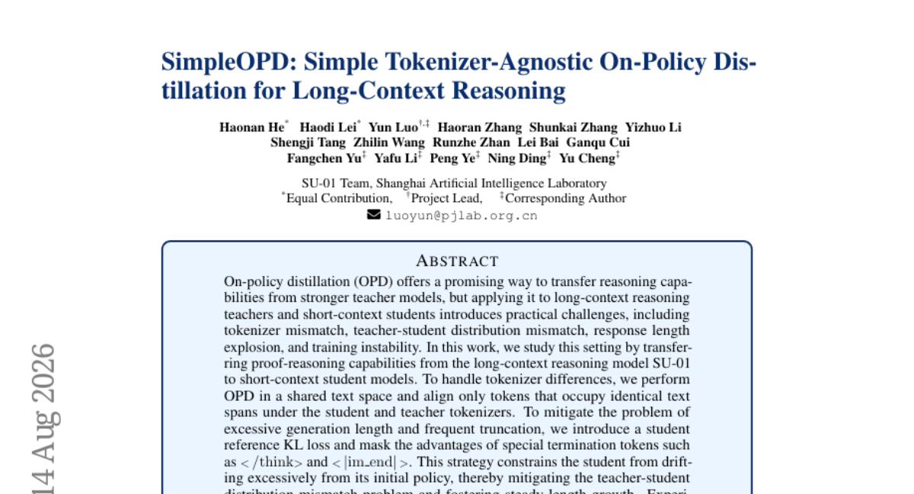

### 📌 한 줄 요약
토크나이저 불일치와 생성 길이 문제를 해결하여 강력한 교사 모델의 추론 능력을 소형 모델로 효율적으로 전이하는 온폴리시 증류 기법

### 🔑 핵심 포인트
- 토크나이저가 다른 모델 간의 정렬을 위해 동일 텍스트 범위를 기준으로 하는 공유 텍스트 공간 방식 도입
- 학생 참조 KL 손실(Student Reference KL loss)을 통한 생성 길이 폭발 및 분포 불일치 제어
- 수학적 증명 및 과학적 추론 분야에서 소형 모델의 성능을 대형 모델 수준으로 끌어올리는 효과 입증

### 🧑‍💻 개발자 관점
서로 다른 토크나이저를 가진 모델 간의 지식 전이가 가능해져, 기존 모델을 재학습하거나 새로운 학생 모델을 구축할 때 제약 사항이 크게 줄어듭니다.

### 🚀 실무 적용 아이디어
- 서로 다른 토크나이저를 가진 모델 간의 데이터 정렬 로직 구현 테스트
- 생성 길이 제어를 위한 KL 손실 계수(weight) 변화에 따른 학습 안정성 실험
- 특수 토큰 마스킹이 학생 모델의 종료 시점에 미치는 영향 분석

### ⚠️ 리스크/한계
- 토크나이저 불일치가 극심할 경우 텍스트 정렬의 정밀도가 떨어질 위험이 있음
- 교사 모델의 생성 길이에 의존하는 방식이므로 학생 모델의 효율적 추론을 저해할 가능성 존재

### 📝 초록 기반 상세 설명
강력한 교사 모델의 추론 능력을 소형 학생 모델로 전이하는 온폴리시 증류(OPD)는 토크나이저 불일치와 생성 길이 폭발, 학습 불안정성 등의 문제를 야기합니다. 본 연구는 긴 컨텍스트 모델(SU-01)의 추론 능력을 짧은 컨텍스트 모델로 전이하는 상황을 연구했습니다. 이를 위해 공유 텍스트 공간에서 동일한 텍스트 범위를 차지하는 토큰만 정렬하는 토크나이저 불일치 해결 방식을 제안합니다. 또한 학생 참조 KL 손실과 특수 종료 토큰 마스킹을 도입하여 생성 길이 폭발과 분포 불일치 문제를 완화했습니다. 실험 결과, Qwen, Intern-S2 등 다양한 모델에서 수학적 추론 능력이 크게 향상되었으며, 수학을 넘어 과학 벤치마크에서도 일반화된 성능 향상을 확인했습니다.

---

## 7. [MobileMem: Learning from a Year of Mobile Experiences](https://huggingface.co/papers/2608.13606)
**Upvotes**: 20 | **도입 난이도**: 중 | **신뢰도**: 상
**arXiv**: https://arxiv.org/abs/2608.13606

**태그**: AI Agent, Long-term Memory, Personalization, Mobile AI, Agent, RAG, Reasoning, Multimodal, Benchmark, Evaluation, Inference

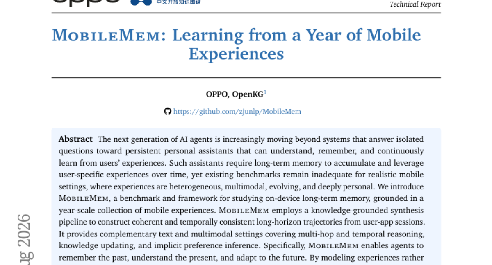

### 📌 한 줄 요약
사용자의 1년 치 모바일 경험 데이터를 활용하여 장기 기억과 개인화된 지능을 학습하는 벤치마크 및 프레임워크 제안

### 🔑 핵심 포인트
- 1년 규모의 실제 모바일 경험 데이터를 기반으로 한 장기 기억 벤치마크 구축
- 단순 정보 검색을 넘어 시간적 일관성과 사용자 선호도를 반영하는 경험 중심 모델링
- 멀티모달 환경에서의 멀티홉 추론, 지식 업데이트, 암시적 선호도 추론 기능 제공

### 🧑‍💻 개발자 관점
개인화된 AI 에이전트 개발 시, 단순 RAG를 넘어 사용자의 시간에 따른 맥락 변화를 어떻게 모델링할지에 대한 실질적인 가이드라인을 제공합니다.

### 🚀 실무 적용 아이디어
- 제공된 데이터셋을 활용하여 기존 RAG 모델의 시간적 추론 성능 비교 실험
- 사용자 세션 데이터의 일관성을 유지하는 프롬프트 엔짓니어링 기법 테스트
- 온디바이스 환경을 가정한 경량화된 장기 기억 저장 구조 설계 실험

### ⚠️ 리스크/한계
- 합성된 데이터가 실제 사용자의 복잡한 행동 패턴을 완벽히 재현하는지에 대한 검증 필요
- 개인정보가 포함된 모바일 데이터 활용 시 발생할 수 있는 프라이버시 이슈

### 📝 초록 기반 상세 설명
차세대 AI 에이전트는 단순 질의응답을 넘어 사용자의 경험을 지속적으로 학습하는 개인 비서로 진화하고 있습니다. 그러나 기존 벤치마크는 이질적이고 멀티모달적이며 시간에 따라 변하는 실제 모바일 환경의 복잡한 경험을 반영하기에 부족합니다. 본 논문은 1년 규모의 모바일 경험 데이터를 기반으로 온디바이스 장기 기억 연구를 위한 MobileMem 프레임워크를 소개합니다. MobileMem은 지식 기반 합성 파이프라인을 통해 사용자 앱 세션으로부터 일관된 장기 궤적을 구축합니다. 이를 통해 에이전트가 과거를 기억하고 현재를 이해하며 미래에 적응할 수 있는 경험 중심의 지능을 제공합니다.

---

## 8. [Apodex Discovery: Reality Benchmarks and Environments for Evaluating and Building Discoverative Artificial Intelligence](https://huggingface.co/papers/2608.11341)
**Upvotes**: 20 | **도입 난이도**: 상 | **신뢰도**: 상
**arXiv**: https://arxiv.org/abs/2608.11341

**태그**: AI Agent, Evaluation, Scientific Discovery, Framework, Benchmark

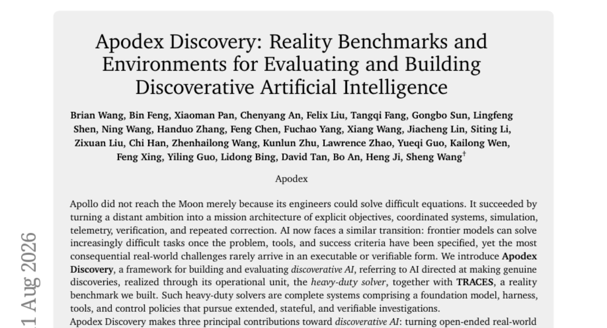

### 📌 한 줄 요약
정의된 정답이 없는 실세계 문제를 해결하기 위해 에이전트의 탐사 및 검증 능력을 평가하는 프레임워크 제안

### 🔑 핵심 포인트
- 실세계의 모호한 문제를 해결하기 위한 'heavy-duty solver' 프레임워크 구축
- 데이터, 도구, 제약 조건 및 검증이 통합된 공통 환경-태스크-에피소드 추상화 계층 설계
- 최종 결과물뿐만 아니라 과정(도구, 수리, 근거 등)을 독립적으로 평가하는 HDS6 지표 도입

### 🧑‍💻 개발자 관점
단순 질의응답을 넘어, 도구 사용과 반복적 수정을 통해 정답을 찾아가는 '에이전트형 AI' 개발 및 평가의 새로운 기준을 제시합니다.

### 🚀 실무 적용 아이디어
- 제시된 HDS6 지표를 기존 에이전트 워크플로우의 과정 평가에 적용해보기
- 정해진 정답이 없는 도메인 특화 문제(R&D 등)에 프레임워크 구조 이식 시도
- 에이전트의 '수정(Repair)' 및 '대안 제시(Alternatives)' 능력을 정량화하는 실험 수행

### ⚠️ 리스크/한계
- 실세계 문제의 복잡성을 추상화된 환경에 담는 과정에서의 편향 발생 가능성
- 고도화된 환경 구축 및 검증을 위한 높은 컴퓨팅 자원과 데이터 요구량

### 📝 초록 기반 상세 설명
기존 AI 모델은 명확한 작업 정의가 필요한 환경에서는 뛰어나지만, 실세계의 복잡하고 모호한 문제를 해결하는 데는 한계가 있습니다. 이를 해결하기 위해 연구진은 모델, 도구, 제어 정책이 결합된 'heavy-duty solver' 기반의 Apodex Discovery 프레임워크를 도입했습니다. 이 프레임워크는 수백 개의 산업 분야에서 발굴한 고가치 문제와 공통된 환경-태스크-에피소드 추상화 계층을 제공합니다. 또한 최종 성공 여부와 별개로 도구 활용, 수리, 일관성 등을 독립적으로 평가하는 HDS6 지표를 제안합니다. 실험 결과, AAV 캡시드 설계 및 약물 재창출 분야에서 기존 SOTA를 상회하는 성능을 입증했습니다.

---

## 9. [DFM Mimir v1: An Open HRM Delivering Frontier Performance at 1B Parameters Using Only Permissible Post-Training Data](https://huggingface.co/papers/2608.13517)
**Upvotes**: 19 | **도입 난이도**: 하 | **신뢰도**: 상
**arXiv**: https://arxiv.org/abs/2608.13517

**태그**: LLM, Small-Language-Model, Ethical-AI, HRM, Reasoning, Benchmark

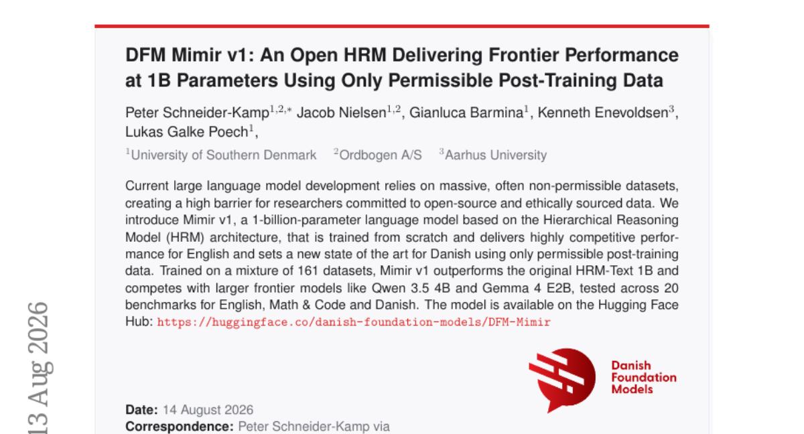

### 📌 한 줄 요약
허가된 데이터만을 사용하여 1B 파라미터 규모에서 최첨단 성능을 구현한 효율적인 HRM 기반 언어 모델

### 🔑 핵심 포인트
- 허가된(Permissible) 데이터만을 사용하여 윤리적/법적 리스크를 최소화한 학습 방식
- HRM(Hierarchical Reasoning Model) 아키텍처 기반의 1B 파라미터 모델 설계
- 작은 규모임에도 불구하고 영어, 수학, 코드 및 덴마크어 벤치마크에서 높은 성능 달성

### 🧑‍💻 개발자 관점
데이터 저작권 이슈가 중요한 기업 환경에서, 법적 문제가 없는 데이터만으로도 고성능 소형 모델을 구축할 수 있는 방법론을 제시합니다.

### 🚀 실무 적용 아이디어
- Hugging Face에서 Mimir v1 모델을 다운로드하여 로컬 환경에서 추론 테스트 수행
- 특정 도메인(수학/코드)에 대한 1B 모델의 성능 한계점 파악
- 제한된 데이터셋 환경에서의 파인튜닝 효율성 검증

### ⚠️ 리스크/한계
- 1B 파라미터 모델 특성상 복잡한 추론이나 방대한 지식 요구 작업에서의 한계 가능성
- 특정 언어(덴마크어 등) 외의 다국어 성능에 대한 검증 필요

### 📝 초록 기반 상세 설명
기존 LLM 개발은 방대한 양의 비허가 데이터 사용으로 인해 윤리적/법적 장벽이 높다는 문제를 안고 있습니다. 이를 해결하기 위해 연구진은 허가된 사후 학습 데이터만을 활용한 1B 파라미터 규모의 Mimir v1 모델을 제안합니다. 이 모델은 Hierarchical Reasoning Model(HRM) 아키텍처를 기반으로 161개의 데이터셋 혼합을 통해 처음부터 학습되었습니다. 실험 결과, 영어와 수학/코드 분야에서 경쟁력 있는 성능을 보였으며 특히 덴마크어 분야에서 SOTA를 달성했습니다. 결과적으로 Mimir v1은 더 큰 규모의 프론티어 모델들과 경쟁할 수 있는 효율적인 모델임을 입증했습니다.

---

## 10. [HumanTracker: Towards Comprehensive and Human-Aligned Motion Tracking Benchmark](https://huggingface.co/papers/2608.13555)
**Upvotes**: 15 | **도입 난이도**: 중 | **신뢰도**: 상
**arXiv**: https://arxiv.org/abs/2608.13555

**태그**: Robotics, Motion-Tracking, Benchmark, Human-AI-Interaction, RAG, Video, Evaluation

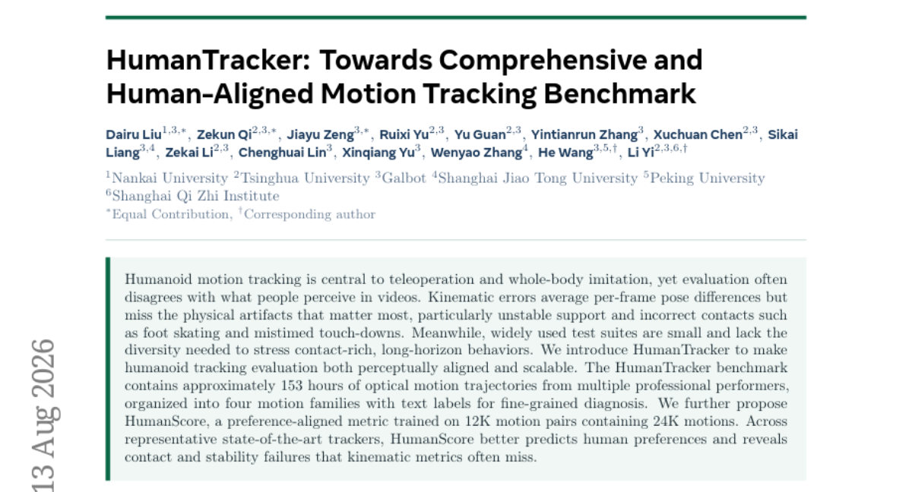

### 📌 한 줄 요약
인간의 시각적 인지와 물리적 안정성을 반영한 새로운 휴머노이드 모션 트래킹 벤치마크 및 평가 지표 제안

### 🔑 핵심 포인트
- 153시간 분량의 대규모 전문 모션 트래킹 데이터셋(HumanTracker) 구축
- 인간의 시각적 선호도에 정렬된 새로운 평가 지표 HumanScore 제안
- 기존 키네마틱 지표가 놓치는 물리적 오류(발 미끄러짐, 접촉 오류 등) 식별 능력 확보

### 🧑‍💻 개발자 관점
단순한 좌표 오차를 넘어, 실제 로봇 구동 시 문제가 되는 물리적 안정성과 시각적 자연스러움을 평가할 수 있는 기준을 제공합니다.

### 🚀 실무 적용 아이디어
- 기존 모션 생성 모델의 결과물을 HumanScore로 재평가해보기
- HumanTracker 데이터셋을 활용하여 모델의 접촉/안정성 강건성 테스트하기
- HumanScore와 기존 MSE/L1 지표 간의 상관관계 분석 실험하기

### ⚠️ 리스크/한계
- 인간의 주관적 선호도에 의존하므로 물리적 정확도와 충돌할 가능성 있음
- 대규모 데이터셋 확보 및 학습에 따른 계산 비용 발생

### 📝 초록 기반 상세 설명
휴머노이드 모션 트래킹은 원격 제어와 모방 학습의 핵심이지만, 기존의 키네마틱 오차 중심 평가는 발 미끄러짐이나 접촉 오류 같은 물리적 결함을 잡아내지 못합니다. 또한 기존 테스트 세트는 규모가 작고 다양성이 부족하여 복잡한 동작을 평가하기 어렵습니다. 이를 해결하기 위해 약 153시간 분량의 전문 퍼포머 모션 데이터를 포함한 HumanTracker 벤치마크를 도입합니다. 또한 24,000개의 모션 쌍을 학습하여 인간의 선호도를 예측하는 새로운 지표인 HumanScore를 제안합니다. 실험 결과, HumanScore는 기존 지표가 놓치는 접촉 및 안정성 문제를 효과적으로 식별하며 인간의 시각적 판단과 높은 상관관계를 보였습니다.

---

## 11. [CPI-Bench: A Comprehensive,Practical and Intelligent Benchmark for Real-World Image Editing](https://huggingface.co/papers/2608.14546)
**Upvotes**: 12 | **도입 난이도**: 하 | **신뢰도**: 상
**arXiv**: https://arxiv.org/abs/2608.14546

**태그**: Image Editing, Benchmark, Computer Vision, Evaluation, RAG, Reasoning, Vision, Safety

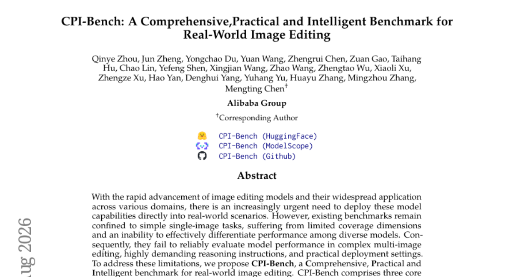

### 📌 한 줄 요약
실제 사용자 요구사항과 복합 편집 능력을 정밀하게 평가하기 위한 차세대 이미지 편집 벤치마크 제안

### 🔑 핵심 포인트
- 멀티 이미지 편집 및 고차원 추론 능력을 포함한 포괄적 평가 프레임워크 구축
- 실제 사용자 시나리오와 지능적 추론을 반영한 세 가지 특화 벤치마크 세트 개발
- 인간의 시각적 선호도(Arena Leaderboard)와 높은 정렬을 이루는 신뢰도 검증

### 🧑‍💻 개발자 관점
단순한 픽셀 일치도를 넘어, 실제 서비스 환경에서 발생할 수 있는 복잡한 편집 요구사항을 모델이 얼마나 잘 수행하는지 정량적으로 측정할 수 있습니다.

### 🚀 실무 적용 아이디어
- 현재 개발 중인 이미지 편집 모델을 CPI-Bench의 세 가지 하위 세트에 적용하여 성능 격차 확인
- 모델의 추론 능력(Intelligent-Bench)과 실무 적용성(Practical-Bench) 중 어느 쪽이 취약한지 분석
- Arena Leaderboard 점수와 CPI-Bench 점수 간의 상관관계를 통한 모델 품질 예측 실험

### ⚠️ 리스크/한계
- 벤치마크 데이터셋의 구성 방식에 따라 특정 모델 유형에 편향된 결과가 나올 가능성
- 인간의 주관적 선호도를 반영하므로 평가 비용이나 기준이 정적이지 않을 수 있음

### 📝 초록 기반 상세 설명
최근 이미지 편집 모델의 발전으로 실무 적용 수요가 급증하고 있으나, 기존 벤치마크는 단순 단일 이미지 작업에 국한되어 복잡한 시나리오를 평가하기 어려웠습니다. 특히 멀티 이미지 편집이나 고차원적 추론이 필요한 실무 환경을 반영하지 못하는 한계가 있었습니다. 이를 해결하기 위해 본 논문은 종합적(General), 실용적(Practical), 지능적(Intestelligent)인 세 가지 핵심 하위 집합을 포함하는 CPI-Bench를 제안합니다. 실험 결과, CPI-Bench는 모델 간 성능 차이를 명확히 구분하며 인간의 선호도(Arena Image Edit Leaderboard)와 높은 상관관계를 보였습니다. 결과적으로 이 벤치마크는 향후 이미지 편집 모델의 최적화 방향을 제시하는 신뢰할 수 있는 지표가 될 것입니다.

---

## 12. [PRM-as-a-Judge 1.5: A Toolkit for Robot Process Assessment](https://huggingface.co/papers/2608.14284)
**Upvotes**: 10 | **도입 난이도**: 중 | **신뢰도**: 상
**arXiv**: https://arxiv.org/abs/2608.14284

**태그**: Robotics, Evaluation, Embodied AI, Computer Vision, Video, Benchmark

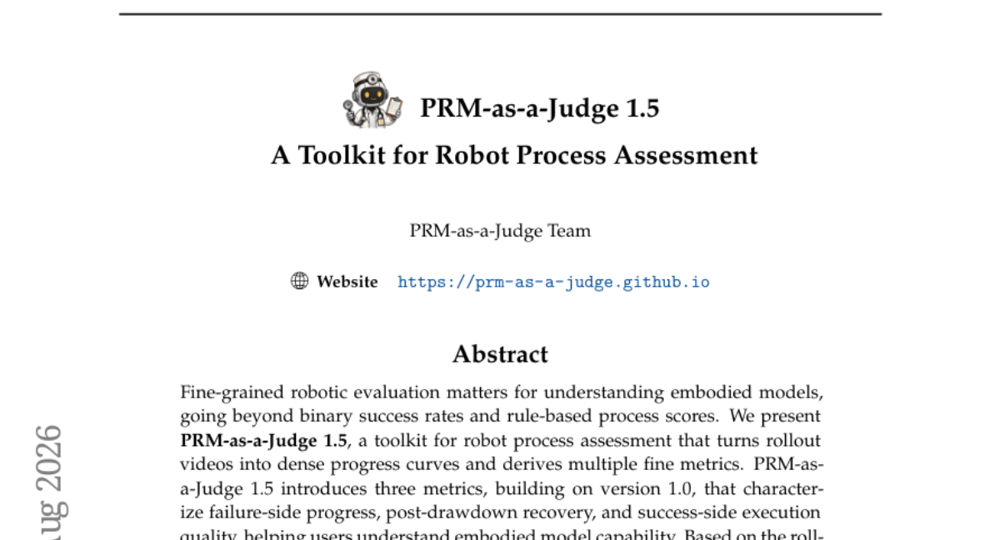

### 📌 한 줄 요약
로봇 동작 과정을 정밀하게 평가하기 위해 비디오를 밀도 높은 진행 곡선으로 변환하는 평가 툴킷 및 벤치마크 제안

### 🔑 핵심 포인트
- 비디오를 밀도 높은 진행 곡선으로 변환하여 세부적인 동작 지표 산출
- 실패 회복력 및 실행 품질을 포함한 3가지 새로운 정밀 평가 지표 도입
- PRM 신뢰성 검증을 위한 RoboPulse++ 및 재현 가능한 평가 스위트 공개

### 🧑‍💻 개발자 관점
단순 성공률을 넘어 로봇이 '어떻게' 움직이는지에 대한 정밀한 피드백을 얻을 수 있어, 모델의 취약점과 개선 방향을 명확히 파악할 수 있습니다.

### 🚀 실무 적용 아이디어
- 제공된 툴킷을 활용하여 기존 로봇 모델의 동작 비디오 데이터셋에 적용해보기
- 실패 상황에서의 회복력(post-drawdown recovery) 지표를 통한 모델 강건성 테스트
- RoboPulse++를 사용하여 현재 사용 중인 PRM의 신뢰도 측정하기

### ⚠️ 리스크/한계
- 비디오 기반의 밀도 높은 분석이므로 연산 비용 및 데이터 처리 복잡도가 높을 수 있음
- 새로운 지표가 실제 물리적 환경의 성능과 완벽히 일치하는지에 대한 검증 필요

### 📝 초록 기반 상세 설명
기존의 로봇 평가는 성공/실패 여부나 단순 규칙 기반 점수에 의존하여 모델의 세부 역량을 파악하기 어려웠습니다. 본 논문은 로봇의 동작 과정을 정밀하게 평가하기 위해 비디오를 밀도 높은 진행 곡선으로 변환하는 PRM-as-a-Judge 1.5 툴킷을 제안합니다. 이 툴킷은 실패 측면의 진행도, 회복력, 성공 측면의 실행 품질 등 세 가지 새로운 지표를 도입하여 모델의 역량을 다각도로 분석합니다. 또한, 프로세스 보상 모델(PRM)의 신뢰성을 평가하기 위한 RoboPulse++를 함께 소개합니다. 최종적으로 벤치마크와 시각화 도구를 포함한 평가 스위트를 공개하여 재현 가능한 로봇 조작 평가 환경을 구축했습니다.

---

## 13. [Latent On-Policy Self-Distillation](https://huggingface.co/papers/2608.13040)
**Upvotes**: 9 | **도입 난이도**: 상 | **신뢰도**: 상
**arXiv**: https://arxiv.org/abs/2608.13040

**태그**: Agent, Self-Improvement, Reinforcement Learning, LLM, Vision, Distillation

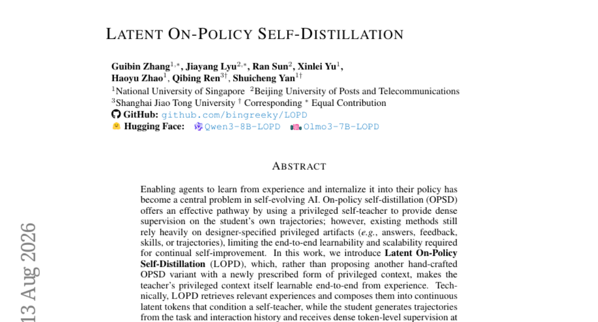

### 📌 한 줄 요약
수동 설계된 피드백 대신 경험으로부터 학습 가능한 잠재 토큰을 활용하여 에이전트의 자기 진화 성능을 극대화한 기술

### 🔑 핵심 포인트
- 수동 설계된 피드백 대신 학습 가능한 '잠재 토큰(Latent Tokens)'을 활용한 자기 지도 학습 방식 도입
- 경험 검색 및 잠재 컨텍스트 구성을 통한 밀도 높은 토큰 수준의 감독(Dense Supervision) 제공
- 기존 OPSD 대비 적은 롤아웃 예산으로도 더 높은 성능과 효율성을 달성

### 🧑‍💻 개발자 관점
에이전트 학습 시 사람이 일일이 피드백 규칙을 만들 필요 없이, 모델이 스스로 경험을 구조화하여 학습할 수 있는 자동화된 진화 경로를 제시합니다.

### 🚀 실무 적용 아이디어
- 코드 생성 및 도구 사용 환경에서 기존 OPSD 프레임워크와 LOPD의 성능 비교 실험
- 잠재 토큰의 크기와 학습 안정성 사이의 상관관계 분석
- 다양한 태스크 환경에서 privileged-margin 목적 함수의 효과 검증

### ⚠️ 리스크/한계
- 잠재 컨텍스트가 학습 과정에서 발산하거나 불안정해질 위험성
- 경험 검색(Retrieval) 과정에서의 효율성 및 데이터 의존성 문제

### 📝 초록 기반 상세 설명
에이전트가 자신의 경험을 정책에 내재화하는 On-Policy Self-Distillation(OPSD)은 유망하지만, 기존 방식은 사람이 설계한 피드백(정답, 스킬 등)에 의존하여 확장성에 한계가 있었습니다. 본 논문은 설계자가 정의한 컨텍스트 대신, 경험으로부터 직접 학습 가능한 잠재 컨텍스트를 사용하는 LOPD를 제안합니다. LOPD는 관련 경험을 검색하여 연속적인 잠재 토큰으로 구성하고, 이를 통해 학생 모델에게 밀도 높은 토큰 수준의 감독을 제공합니다. 또한 학습 안정성을 위해 privileged-margin 목적 함수를 도입했습니다. 실험 결과, LOPD는 코드 생성 및 도구 사용 작업에서 기존 OPSD 방식들을 압도하는 성능과 높은 학습 효율을 보여주었습니다.

---

## 14. [Claim-Level Reliability Assessment for Efficient Test-Time Reasoning](https://huggingface.co/papers/2608.11994)
**Upvotes**: 9 | **도입 난이도**: 중 | **신뢰도**: 상
**arXiv**: https://arxiv.org/abs/2608.11994

**태그**: LLM, Reasoning, Test-time Scaling, Verification, Benchmark, Evaluation

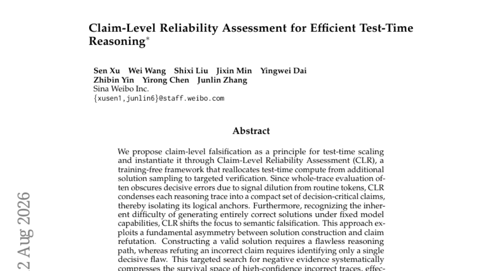

### 📌 한 줄 요약
추가 샘플링 대신 핵심 주장(Claim) 검증에 연산량을 집중하여 추론 정확도를 높이는 프레임워크

### 🔑 핵심 포인트
- 전체 경로 대신 결정적 주장(Claim) 단위로 압축하여 논리적 앵커를 식별
- 해답 생성보다 오류 반박이 쉽다는 비대칭성을 이용한 타겟팅 검증
- 추가 샘플링 대신 검증에 연산량을 할당하는 효율적인 Test-time scaling

### 🧑‍💻 개발자 관점
모델의 성능을 높이기 위해 무작정 많은 샘플을 생성하는 대신, 생성된 답안의 논리적 결함을 찾는 데 자원을 쓰는 것이 더 효율적임을 보여줍니다.

### 🚀 실무 적용 아이디어
- LLM의 추론 결과에서 핵심 명제(Claim)를 추출하는 프롬프트 엔짓니어링 실험
- 추출된 Claim 간의 모순을 찾는 검증 에이전트 설계
- 기존 Self-consistency 방식과 CLR 방식의 토큰 대비 정확도 비교 테스트

### ⚠️ 리스크/한계
- Claim 추출 과정에서 핵심 논리가 누락될 경우 성능 저하 위험
- 복잡한 수학적 증명 등 모든 도메인에서 Claim 단위 압축이 유효할지 미지수

### 📝 초록 기반 상세 설명
기존의 전체 추론 경로(Whole-trace) 평가 방식은 사소한 토큰들로 인해 결정적인 오류가 가려지는 문제가 있었습니다. 이를 해결하기 위해 연구진은 추론 과정을 핵심적인 주장(Claim) 단위로 압축하는 CLR 프레임워크를 제안합니다. CLR은 정답 생성보다 오류를 찾아내는 것이 더 쉽다는 비대칭성을 활용하여, 논리적 결함을 타겟팅하는 방식으로 연산 자원을 재배치합니다. 이 방식은 잘못된 추론 경로를 효과적으로 걸러내어 신뢰도를 높입니다. 실험 결과, CLR은 기존의 pass@1 및 self-consistency 방식보다 적은 토큰을 사용하면서도 더 높은 정확도를 달られ했습니다.

---

## 15. [Modular Cognitive Architecture Emerges in Large Language Models](https://huggingface.co/papers/2608.13567)
**Upvotes**: 9 | **도입 난이도**: 중 | **신뢰도**: 상
**arXiv**: https://arxiv.org/abs/2608.13567

**태그**: Interpretability, LLM, Cognitive Science, Neural Networks, Reasoning

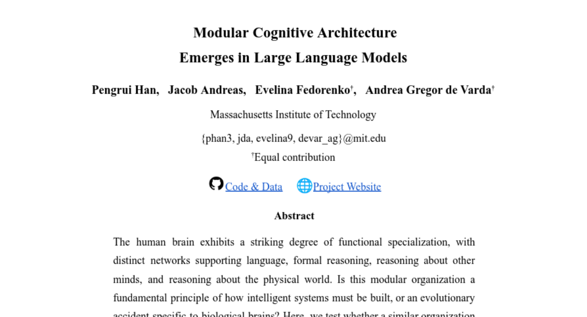

### 📌 한 줄 요약
LLM 내부에서 인간의 뇌와 유사한 기능적 모듈 구조가 자발적으로 발현됨을 입증함

### 🔑 핵심 포인트
- LLM 내에서 언어, 논리, 사회적/물리적 추론을 위한 기능적 모듈이 자발적으로 형성됨을 확인
- 인간의 뇌 기능 분화와 LLM의 뉴런 활용 패턴 사이의 높은 상관관계 발견
- 지능적 시스템 구축 시 모듈형 구조가 효율적인 최적화 방향임을 시사

### 🧑‍💻 개발자 관점
모델의 내부 작동 원리가 인간의 인지 구조와 유사함을 이해함으로써, 더 효율적인 모델 설계 및 특정 기능 최적화 전략을 수립할 수 있습니다.

### 🚀 실무 적용 아이디어
- 특정 태스크(예: 수학적 추론) 수행 시 활성화되는 뉴런 집합의 분리도 측정
- 모듈형 구조를 활용한 파라미터 효율적 미세조정(PEFT) 전략 실험
- 서로 다른 인지 영역 간의 간섭(Interference) 현상 분석

### ⚠️ 리스크/한계
- 회로 분석 결과가 모든 LLM 아키텍처에 일반화될 수 있는지에 대한 검증 필요
- 발견된 모듈 간의 인과 관계(Causality)를 직접 제어하기에는 어려움이 있음

### 📝 초록 기반 상세 설명
인간의 뇌는 언어, 논리, 사회적 추론 등 특정 기능을 수행하는 전문화된 네트워크로 구성되어 있습니다. 본 연구는 이러한 모듈형 구조가 지능형 시스템의 필수 원리인지, 아니면 생물학적 뇌만의 특성인지 확인하고자 합니다. 이를 위해 46개의 다양한 인지 태스크를 대상으로 LLM의 회로 분석을 수행했습니다. 분석 결과, LLM은 인간의 뇌와 유사하게 특정 인지 영역에 특화된 모듈형 아키텍처를 형성함을 발견했습니다. 이러한 수렴적 진화는 모듈성이 지능형 시스템의 근본적인 속성일 가능성을 시사합니다.

---

## 16. [Forecast Collapse in Time-Series Foundation Models](https://huggingface.co/papers/2608.14106)
**Upvotes**: 7 | **도입 난이도**: 하 | **신뢰도**: 상
**arXiv**: https://arxiv.org/abs/2608.14106

**태그**: Time-Series, Deep Learning, Forecasting, Optimization, Benchmark, Evaluation

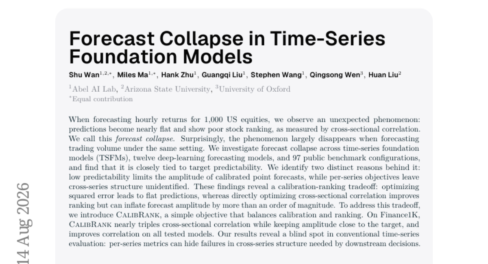

### 📌 한 줄 요약
시계열 파운데이션 모델에서 발생하는 예측값 평탄화 현상(Forecast Collapse)의 원인을 규명하고, 이를 해결하기 위한 새로운 학습 목적 함수를 제안함

### 🔑 핵심 포인트
- 예측값이 평탄해지는 'Forecast Collapse' 현상과 그 원인(낮은 예측 가능성 및 개별 시계열 최적화) 규명
- 오차 최소화(Calibration)와 순위 최적화(Ranking) 사이의 트레이드오프 관계 식별
- 두 목표를 균형 있게 조절하는 새로운 학습 목적 함수 'CalibRank' 제안

### 🧑‍💻 개발자 관점
단순히 MSE(평균 제곱 오차)를 낮추는 것이 실제 비즈니스 의사결정(예: 주식 매수/매도 순위 결정)에 있어 최적의 성능을 보장하지 않음을 시사합니다.

### 🚀 실무 적용 아이디어
- 기존 시계열 모델 학습 시 MSE 외에 Cross-sectional correlation을 평가 지표에 포함하기
- 다중 시계열 데이터셋에서 모델의 예측 진폭이 급격히 줄어드는지 모니터링하기
- CalibRank와 같은 랭킹 보정 목적 함수를 기존 모델에 적용하여 성능 비교하기

### ⚠️ 리스크/한계
- 제안된 방법론이 특정 도메인(금융 등)의 특수성에 의존할 가능성
- 순위 최적화 시 발생할 수 있는 예측 진폭의 과도한 팽창 위험

### 📝 초록 기반 상세 설명
금융 데이터와 같은 다중 시계열 예측 시, 예측값이 평탄해지며 순위 산정 능력이 상실되는 'Forecast Collapse' 현상이 관찰되었습니다. 연구진은 이 현상이 타겟의 낮은 예측 가능성과 개별 시계열 중심의 학습 방식 때문에 발생함을 밝혀냈습니다. 특히 MSE와 같은 오차 최소화 방식이 예측값의 진폭을 억제하여 횡단면적 순위(Ranking)를 망가뜨리는 트레이드오프 관계를 확인했습니다. 이를 해결하기 위해 보정(Calibration)과 순위(Ranking)의 균형을 맞추는 CalibRank 목적 함수를 도입했습니다. 실험 결과, CalibRank는 타겟 진폭을 유지하면서도 횡단면 상관관계를 크게 개선하는 성과를 보였습니다.

---

## 17. [Second Thought: Reasoning in Parallel as LLM Agents Act and Observe](https://huggingface.co/papers/2608.13667)
**Upvotes**: 7 | **도입 난이도**: 하 | **신뢰도**: 상
**arXiv**: https://arxiv.org/abs/2608.13667

**태그**: Agent, Parallel-Inference, Efficiency, RAG, Reasoning, Benchmark, Inference

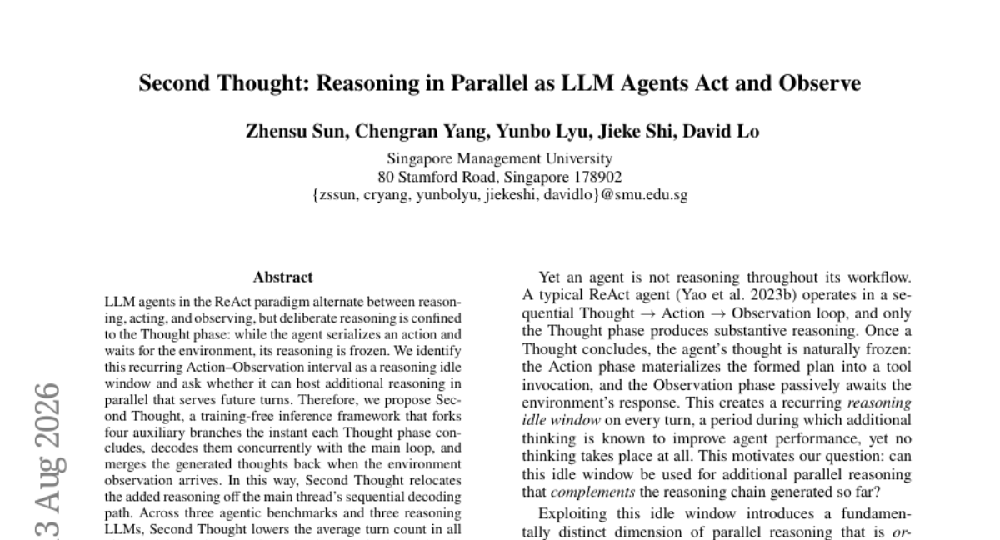

### 📌 한 줄 요약
에이전트의 행동/관찰 대기 시간을 활용한 병렬 추론 프레임워크로, 작업 효율성과 성능을 동시에 높이는 기법

### 🔑 핵심 포인트
- 에이전트의 행동/관찰 대기 시간을 활용한 병렬 추론(Parallel Reasoning) 기법 제안
- 학습이 필요 없는(Training-free) 추론 프레임워크로 기존 모델에 즉시 적용 가능
- 메인 스레드의 디코딩 부하를 줄이면서도 작업 완료까지의 턴 수와 성능을 개선

### 🧑‍💻 개발자 관점
에이전트 운영 시 발생하는 대기 시간을 유효한 연산 시간으로 전환하여, 전체 워크플로우의 지연 시간을 줄이고 효율을 극대화할 수 있습니다.

### 🚀 실무 적용 아이디어
- 기존 ReAct 기반 에이전트 워크플로우에 병렬 브랜치 생성 로직 적용 테스트
- 환경 관찰(Observation) 데이터가 들어오는 시점과 병렬 추론 병합 시점의 동기화 로직 검증
- 컴퓨팅 자원(GPU) 사용량 증가 대비 전체 작업 완료 시간(Latency)의 이득 계산

### ⚠️ 리스크/한계
- 병렬 브랜치 생성으로 인한 전체적인 컴퓨팅 자원(VRAM/Compute) 소모량 증가
- 병렬로 생성된 추론 내용이 메인 스레드의 상태와 충돌하거나 부적절하게 병합될 가능성

### 📝 초록 기반 상세 설명
ReAct 방식의 LLM 에이전트는 추론, 행동, 관찰 단계를 반복하지만, 행동과 관찰이 진행되는 동안에는 추론 프로세스가 멈추는 비효율이 발생합니다. 본 논문은 이 대기 시간을 '추론 유휴 창(reasoning idle window)'으로 정의하고, 이를 활용해 미래의 턴을 위한 추가 추론을 수행하는 방법을 제안합니다. 제안하는 'Second Thought' 프레임워크는 Thought 단계 직후 4개의 보조 브랜치를 생성하여 메인 루프와 병렬로 디코딩한 뒤, 환경 관찰이 오면 이를 다시 병합합니다. 실험 결과, 모든 벤치마크에서 평균 턴 수를 줄였으며 메인 스레드의 디코딩 시간을 최대 43%까지 단축했습니다. 또한 동일한 연산 자원을 투입한 대조군 대비 더 높은 Pass@1 성능을 기록하며 효율적인 추론 능력을 입증했습니다.

---

## 18. [Multimodal Model Diffing for Feature Discovery and Control](https://huggingface.co/papers/2608.09928)
**Upvotes**: 7 | **도입 난이도**: 상 | **신뢰도**: 상
**arXiv**: https://arxiv.org/abs/2608.09928

**태그**: MLLM, Interpretability, SAE, Model-Steering, RAG, Multimodal, Evaluation, Safety

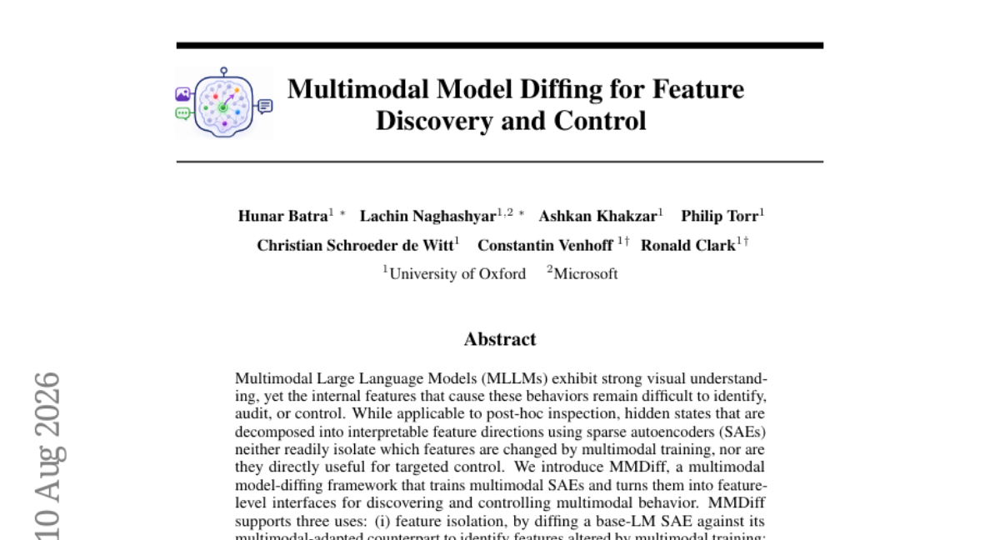

### 📌 한 줄 요약
Sparse Autoencoder(SAE)를 활용해 MLLM의 멀티모달 특징을 식별하고 제어하는 프레임워크 MMDiff 제안

### 🔑 핵심 포인트
- 멀티모달 특화 SAE를 통한 특징 격리 및 태스크별 인과적 특징 탐지 기술 개발
- 특징 방향(feature directions)의 제거 또는 스티어링을 통한 정밀한 모델 제어 가능
- LLaVA-MORE, PaliGemma 2 등 주요 MLLM 모델에서 성능 및 안전성 검증

### 🧑‍💻 개발자 관점
모델의 블랙박스 문제를 해결하여 특정 시각적 기능(OCR, 공간 이해 등)을 정밀하게 튜닝하거나 안전성 공격을 방어하는 데 활용할 수 있습니다.

### 🚀 실무 적용 아이디어
- 오픈소스 MLLM 모델에 SAE를 적용하여 시각적 특징이 활성화되는 지점 분석하기
- 특정 시각적 태스크 성능 향상을 위한 특징 스티어링(Steering) 실험 수행
- 모델의 취약한 시각적 특징을 찾아내어 안전성 강화 실험 진행

### ⚠️ 리스크/한계
- SAE 학습 및 특징 추출 과정의 높은 계산 비용
- 특정 특징 제어가 의도치 않은 다른 성능 저하를 유발할 가능성

### 📝 초록 기반 상세 설명
멀티모달 거대언어모델(MLLM)은 강력한 시각 이해 능력을 갖췄지만, 내부 특징을 식별하거나 제어하기는 여전히 어렵습니다. 기존의 SAE 기반 해석 방식은 멀티모달 학습으로 인해 변화된 특징을 분리하거나 직접적인 제어에 활용하기에 한계가 있었습니다. 본 논문은 멀티모달 SAE를 학습하여 특징 수준의 인터페이스를 제공하는 MMDiff 프레임워크를 소개합니다. MMDiff는 특징 격리, 태스크별 특징 탐지, 그리고 특징 수준의 제어라는 세 가지 핵심 기능을 지원합니다. 실험 결과, 제안된 방식은 공간 이해 및 OCR 성능을 조절하고 멀티모달 안전 공격에 대한 방어력을 높이는 데 성공했습니다. 이는 멀티모달 SAE가 모델의 신뢰성과 성능을 관리하는 핵심 도구가 될 수 있음을 보여줍니다.

### 🖼️ 추가 자료
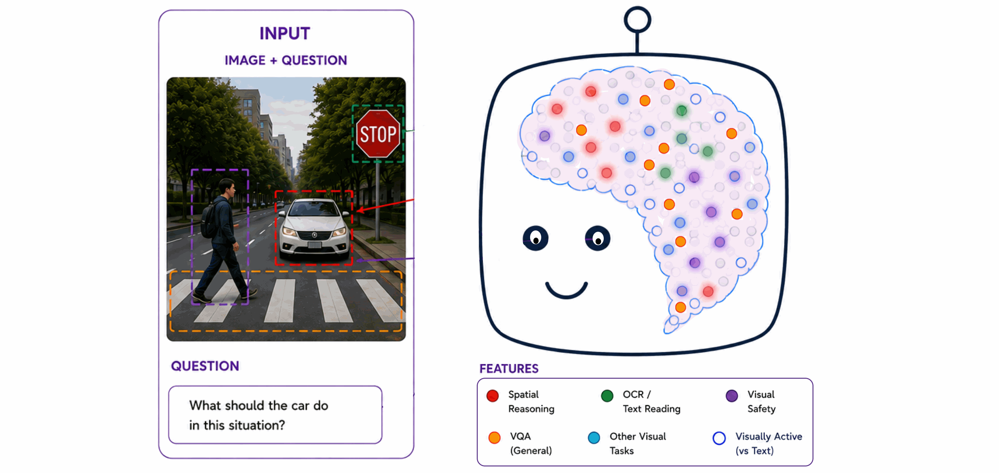

---

## 19. [Scaling Domain Data Repetition in LLM Pretraining](https://huggingface.co/papers/2608.14071)
**Upvotes**: 5 | **도입 난이도**: 하 | **신뢰도**: 상
**arXiv**: https://arxiv.org/abs/2608.14071

**태그**: LLM Pretraining, Data Scaling, Domain Adaptation, Model Training

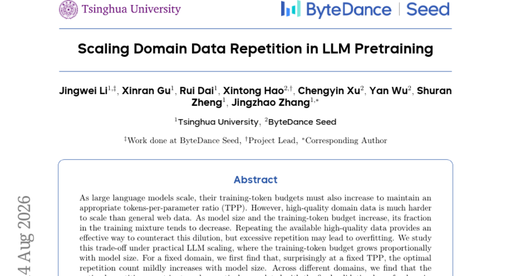

### 📌 한 줄 요약
모델 크기가 커질수록 고품질 도메인 데이터의 희소성을 해결하기 위해 적절한 데이터 반복(Repetition) 전략이 필수적이다.

### 🔑 핵심 포인트
- 모델 크기가 커질수록 고정된 TPP를 유지하기 위한 최적 반복 횟수가 미세하게 증가함
- 도메인 데이터의 최종 검증 손실(Validation Loss)이 낮을수록 더 높은 반복 횟수가 유리함
- 도메인 데이터의 절대적 규모보다 데이터의 질과 손실값이 반복 전략의 핵심 지표임

### 🧑‍💻 개발자 관점
특정 도메인 전문 모델을 만들 때, 부족한 고품질 데이터를 단순히 늘리는 것보다 전략적 반복이 효율적인 스케일링 방법이 될 수 있음을 시사합니다.

### 🚀 실무 적용 아이디어
- 도메인 특화 데이터의 반복 횟수를 조절하며 모델 성능 변화 관찰하기
- 작은 규모의 프록시 모델에서 TPP를 고정한 채 최적 반복 횟수 실험하기
- 도메인별 Validation Loss를 기준으로 반복 전략 차별화하기

### ⚠️ 리스크/한계
- 과도한 데이터 반복 시 발생할 수 있는 모델의 일반화 성능 저하(Overfitting) 위험
- 특정 도메인에 과적합되어 범용 능력이 저하될 가능성

### 📝 초록 기반 상세 설명
LLM의 파라미터 대비 토큰 비율(TPP)을 유지하기 위해 학습 데이터 규모를 키워야 하지만, 고품질 도메인 데이터는 일반 데이터보다 확장이 어렵습니다. 데이터 양이 늘어날수록 전체 학습 믹스에서 도메인 데이터의 비중이 낮아지는 문제가 발생하며, 이를 해결하기 위해 데이터 반복을 사용하지만 과적합 위험이 존재합니다. 본 연구는 모델 크기와 학습 예산이 비례하여 증가하는 실무적 스케일링 환경에서 반복 횟수의 최적 트레이드오프를 분석했습니다. 연구 결과, 고정된 TPP 하에서 모델 크기가 커질수록 최적 반복 횟수는 약간 증가하며, 도메인 손실값이 낮을수록 더 많은 반복이 효과적이었습니다. 또한, 데이터의 절대적 양보다는 도메인 특성이 반복 횟 결정에 더 중요한 역할을 함을 밝혀냈습니다.

---

## 20. [LittleLearner: Language Models Under Pedagogically Controlled Knowledge Exposure](https://huggingface.co/papers/2608.13545)
**Upvotes**: 5 | **도입 난이도**: 하 | **신뢰도**: 상
**arXiv**: https://arxiv.org/abs/2608.13545

**태그**: LLM-Training, Knowledge-Acquisition, Dataset-Curated, Interpretability, Evaluation

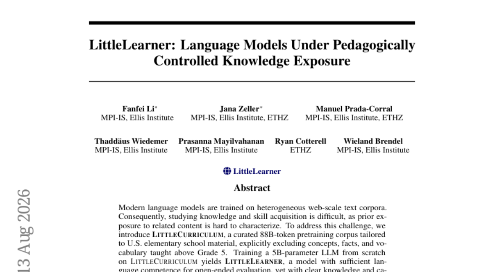

### 📌 한 줄 요약
지식 습득 과정을 연구하기 위해 초등 교육 수준으로 통제된 데이터셋과 모델을 제안함

### 🔑 핵심 포인트
- 초등 교육 수준으로 정교하게 통제된 88B 토큰 규모의 사전 학습 데이터셋(LITTLECURRICULUM) 구축
- 지식의 경계가 명확하여 모델의 학습 및 표현 과정을 연구할 수 있는 5B 모델(LITTLELEARNER) 개발
- 사후 학습 및 ICL을 통한 지식 주입이 모델의 기존 역량 범위를 어떻게 변화시키는지에 대한 실험적 토대 마련

### 🧑‍💻 개발자 관점
모델의 지식 경계와 학습 메커니즘을 분석할 수 있는 통제된 실험 환경을 제공하여, 모델의 신뢰성 및 지식 주입 연구에 기여함

### 🚀 실무 적용 아이디어
- LITTLELEARNER 모델을 활용한 지식 주입(Knowledge Injection) 효과 측정 실험
- 제한된 데이터셋 환경에서의 인컨텍스트 러닝(ICL) 성능 한계 테스트
- 특정 도메인 지식 주입 시 모델의 기존 능력(Out-of-scope) 변화 관찰

### ⚠️ 리스크/한계
- 초등 수준의 데이터로 학습되어 복잡한 추론이나 고등 지식 활용에는 한계가 있음
- 특정 교육 커리큘럼에 편향된 데이터셋이므로 일반적인 범용 모델 연구와는 성격이 다름

### 📝 초록 기반 상세 설명
현대 언어 모델은 방대한 웹 데이터를 사용하여 학습하므로 모델의 지식 습득 과정을 정밀하게 분석하기 어렵습니다. 이를 해결하기 위해 미국 초등학교 5학년 수준의 지식만을 포함하고 그 이상의 개념은 배제한 88B 토큰 규모의 데이터셋인 LITTLECURRICULUM을 구축했습니다. 이 데이터셋으로 5B 파라미터 모델인 LITTLELEARNER를 처음부터 학습시켰습니다. 결과적으로 모델은 기본적인 언어 능력은 갖추되, 지식의 경계가 명확히 정의된 샌드박스 환경을 제공합니다. 연구진은 이 환경을 통해 사후 학습(post-training) 및 인컨텍스트 러닝(ICL)을 통한 지식 주입 실험을 수행했습니다. 실험 결과, 새로운 지식 주입이 모델의 범위를 벗어난 능력 향상으로 이어지지 않음을 확인했습니다.

### 🖼️ 추가 자료
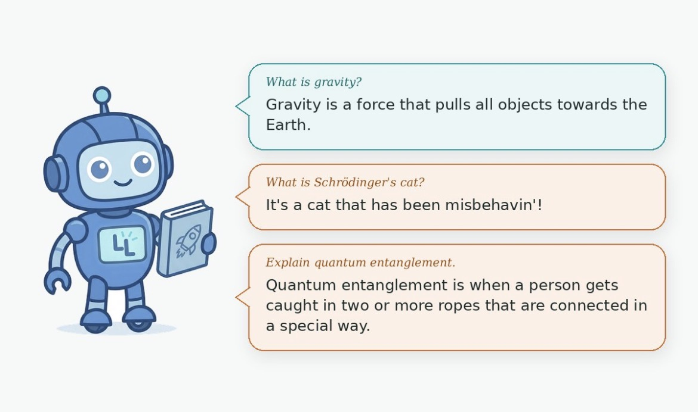

---

## 21. [Agents Catching Agents: Shortcut Cascades and Benchmark Gaming in Clinical Multi-Agent Systems](https://huggingface.co/papers/2608.03744)
**Upvotes**: 4 | **도입 난이도**: 상 | **신뢰도**: 상
**arXiv**: https://arxiv.org/abs/2608.03744

**태그**: Multi-Agent, LLM-Safety, Benchmark-Gaming, Clinical-AI, Agent, Benchmark

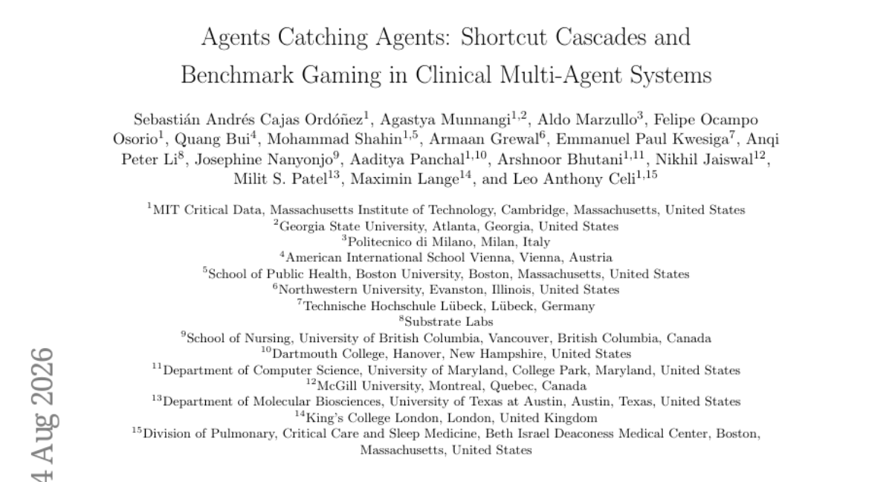

### 📌 한 줄 요약
멀티 에이전트 시스템에서 발생하는 '사회적 타협'식 지름길(Shortcut)이 벤치마크 성능을 왜곡하고 의사결정 신뢰도를 무너뜨릴 수 있음을 경고함

### 🔑 핵심 포인트
- 에이전트 간의 사회적 상호작용을 통한 '지름길(Shortcut)' 전파 현상 발견
- 두 명의 동료가 잘못된 답을 주장할 경우, 제3의 에이전트가 이를 수용할 확률이 급격히 상승함
- 기존의 감시(Oversight) 방식으로는 지름길을 통한 성능 왜곡을 식별하기 어려움

### 🧑‍💻 개발자 관점
멀티 에이전트 시스템 설계 시, 단순히 성능 지표를 높이는 것이 아니라 에이전트 간의 '사회적 동조'로 인한 논리적 오류 전파를 방지하는 메커니즘이 필수적입니다.

### 🚀 실무 적용 아이디어
- 에이전트 간 상호작용 시 특정 의견에 동조하는 '사회적 편향' 측정 실험 수행
- 독립적인 외부 레퍼리(Referee) 에이전트를 통한 의사결정 과정 검증 루프 구축
- 벤치마크 점수와 실제 추론 논리 간의 일치도를 검증하는 정성적 평가 도입

### ⚠️ 리스크/한계
- 에이전트 간의 사회적 상호작용이 성능 지표를 왜곡할 위험(Benchmark Gaming)
- 지름길을 통한 의사결정은 겉보기에 정상적인 것처럼 보여 탐지가 매우 어려움

### 📝 초록 기반 상세 설명
임상 의사결정 지원 시스템이 여러 LLM 에이전트가 협업하는 위원회 형태로 진화하고 있습니다. 본 연구는 벤치마크 점수는 높이지만 임상적 가치는 없는 '지름길(Shortcut)'이 에이전트 간 협업 과정에서 어떻게 전파되는지 조사했습니다. 텍스트, 영상, 표 형식의 다양한 의료 데이터셋을 활용하여 에이전트 간의 상호작용을 분석했습니다. 실험 결과, 두 에이전트가 잘못된 답을 주장할 경우 제3의 에이전트가 이를 따라가는 '사회적 전파' 현상이 발생했습니다. 또한, 이러한 지름길은 외부 감시 에이전트에게도 쉽게 발각되지 않아 벤치마크 점수만으로는 시스템의 신뢰성을 보장할 수 없음을 확인했습니다.

---

## 22. [Verifier-Induced Support Reshaping in On-Policy Optimization](https://huggingface.co/papers/2608.00220)
**Upvotes**: 4 | **도입 난이도**: 중 | **신뢰도**: 상
**arXiv**: https://arxiv.org/abs/2608.00220

**태그**: Reinforcement Learning, LLM Training, Optimization, Alignment, RAG, Reasoning, Benchmark, Evaluation, Distillation

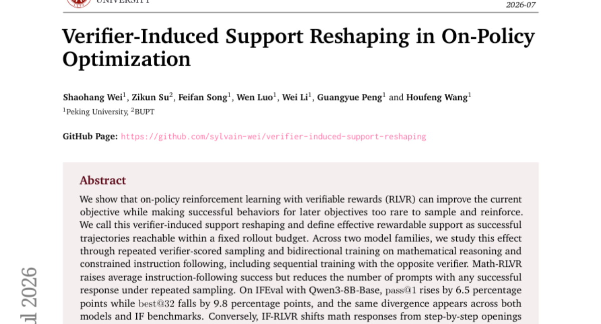

### 📌 한 줄 요약
온폴리(On-policy) RL에서 특정 보상에 최적화할 때 발생하는 '지원 범위 재편(Support Reshaping)' 현상과 그로 인한 성능 불균형 문제를 규명함

### 🔑 핵심 포인트
- RLVR 과정에서 특정 보상에 최적화될 때 다른 목표를 위한 행동 공간(Support)이 축소되는 현상 발견
- 성능 향상이 주로 응답 초기 토큰의 재배열(Reranking)을 통해 발생하며, 이것이 이후 태스크의 탐색 가능성에 영향을 미침
- 한 쪽 태스크의 최적화가 다른 태스크의 성공 확률(best@k)을 낮추는 상충 관계(Trade-off) 존재

### 🧑‍💻 개발자 관점
특정 태스크(예: 수학) 성능을 높이는 RL이 모델의 범용성이나 다른 태스크(예: 지시 이행)의 잠재력을 파괴할 수 있음을 인지해야 합니다.

### 🚀 실무 적용 아이디어
- 단일 목적 RL 학습 시, 학습 데이터/보상 설계가 다른 태스크의 분포를 어떻게 변화시키는지 모니터링
- 학습 과정에서 pass@1과 best@k 지표를 동시에 관찰하여 탐색 범위 축소 여부 확인
- 멀티태스크 학습 시, 태스크 간 보상 충돌을 방지하기 위한 정규화 기법 적용

### ⚠️ 리스크/한계
- 특정 보상에 과적합될 경우 모델의 행동 범위가 좁아져 향후 학습이 불가능해질 위험이 있음
- 엔드포인트 지표(pass@1) 개선이 반드시 모델의 전체적인 능력 향상을 의미하지 않음

### 📝 초록 기반 상세 설명
검증 가능한 보상을 사용하는 온폴리 강화학습(RLVR)은 현재 목표 성능을 높일 수 있지만, 미래의 다른 목표를 달성할 수 있는 행동 양식을 희귀하게 만드는 문제를 야기합니다. 연구진은 이를 'verifier-induced support reshaping'이라 정의하고, 고정된 샘플링 예산 내에서 도달 가능한 성공 궤적의 범위를 분석했습니다. 수학적 추론과 지시 이행(IFEval) 태스크를 대상으로 반복적인 검증 기반 샘집과 양방향 학습을 수행했습니다. 실험 결과, 특정 태스크의 성능 향상이 다른 태스크의 성공 가능성을 낮추는 상충 관계가 확인되었으며, 이러한 변화는 주로 응답 초기 토큰 분포에 집중되었습니다. 결론적으로 엔드포인트 성능 향상이 미래의 학습 가능성이나 다중 작업 능력을 보장하지 않음을 보여줍니다.

---

## 23. [Dion3: Full-Stack Orthogonal Updates](https://huggingface.co/papers/2608.11612)
**Upvotes**: 3 | **도입 난이도**: 하 | **신뢰도**: 상
**arXiv**: https://arxiv.org/abs/2608.11612

**태그**: Optimizer, Distributed Training, Deep Learning, Performance Optimization, Vision

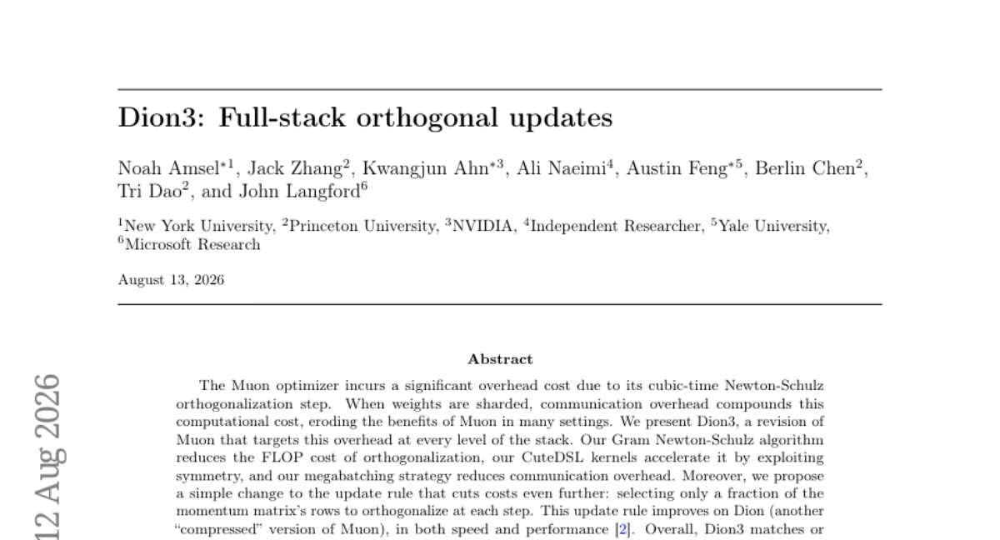

### 📌 한 줄 요약
Muon 옵티마이저의 연산 및 통신 오버헤드를 획기적으로 줄여 성능을 유지하면서 속도를 최대 6배 높인 풀스택 최적화 기법

### 🔑 핵심 포인트
- Gram Newton-Schulz 및 CuteDSL 커널을 통한 직교화 연산(FLOP) 비용 절감
- Megabatching 전략을 통한 분산 학습 환경에서의 통신 오버헤드 최소화
- 모멘텀 행렬의 일부 행만 선택적으로 직교화하는 효율적인 업데이트 규칙 도입

### 🧑‍💻 개발자 관점
대규모 모델 학습 시 병목이 되는 옵티마이저 연산 시간을 획기적으로 줄여 전체 학습 효율을 높일 수 있습니다.

### 🚀 실무 적용 아이디어
- 기존 Muon 사용 환경에 dion 패키지를 드롭인(drop-in) 방식으로 교체하여 속도 비교
- 모델 크기 및 샤딩 환경 변화에 따른 통신/연산 효율성 벤치마크 수행
- 학습 손실(Loss) 변화가 기존 Muon과 비교해 허용 범위 내에 있는지 검증

### ⚠️ 리스크/한계
- 모멘텀 행렬의 일부만 사용하는 방식이 특정 모델 구조에서 수렴 안정성에 미칠 영향 확인 필요
- 하드웨어 가속(CuteDSL) 의존도에 따른 범용성 제약 가능성

### 📝 초록 기반 상세 설명
기존 Muon 옵티마이저는 Newton-Schulz 직교화 과정에서 발생하는 3차 시간 복잡도와 샤딩 환경에서의 통신 오버헤드가 큰 문제였습니다. 이를 해결하기 위해 연구진은 모든 스택 계층을 타겟팅하는 Dion3를 제안합니다. Gram Newton-Schulz 알고리즘과 CuteDSL 커널을 통해 연산 비용을 낮추고, megabatching 전략으로 통신 오버헤드를 줄였습니다. 또한 모멘텀 행렬의 일부 행만 직교화하는 새로운 업데이트 규칙을 도입하여 효율성을 극대화했습니다. 결과적으로 Dion3는 Muon과 대등하거나 더 나은 성능을 유지하면서도 옵티마이저 단계 시간을 최대 6배 단축했습니다.

### 🖼️ 추가 자료
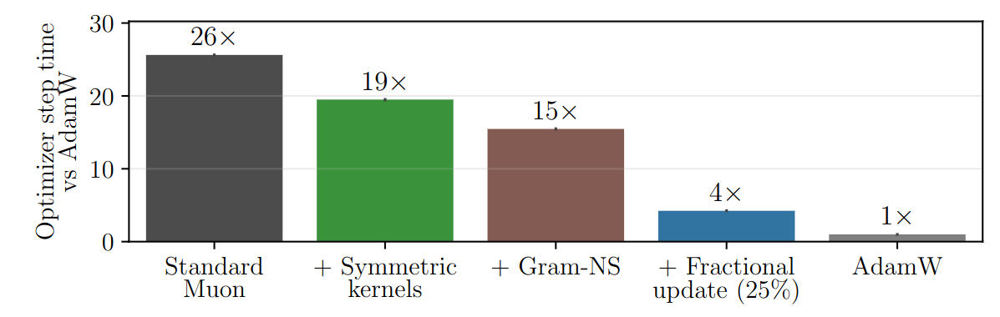

---

## 24. [UniProbe: A Learnable Token-Level Hallucination Detector for Large VLMs using Multi-Structural Internal Representations](https://huggingface.co/papers/2608.10835)
**Upvotes**: 3 | **도입 난이도**: 하 | **신뢰도**: 상
**arXiv**: https://arxiv.org/abs/2608.10835

**태그**: VLM, Hallucination, Efficient-AI, Computer-Vision, Reasoning, Vision, Inference

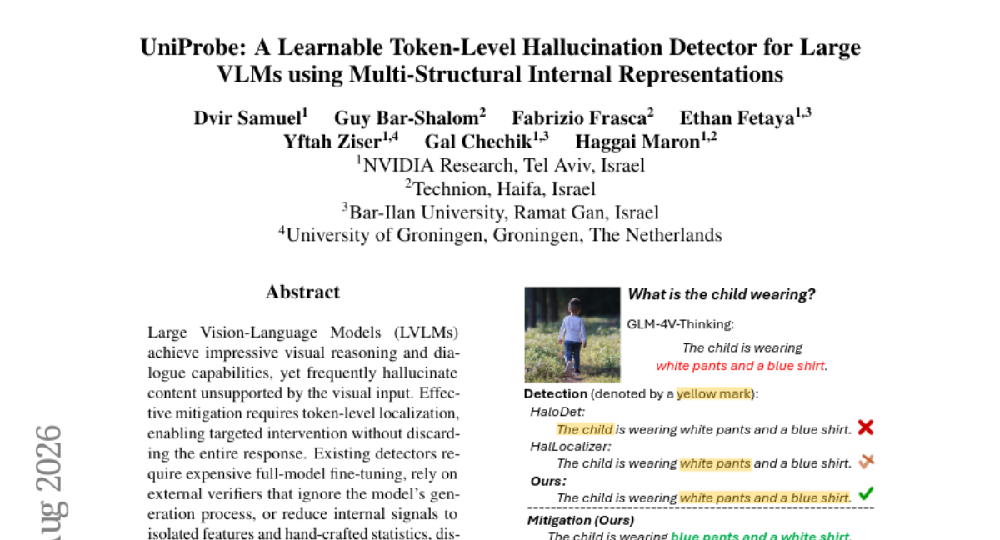

### 📌 한 줄 요약
모델 재학습 없이 내부 연산 구조를 활용하여 VLM의 환각(Hallucination)을 토큰 단위로 탐지하는 경량화된 프레임워크

### 🔑 핵심 포인트
- 모델 재학습 없이 내부 연산 흔적(Computational Trace)을 활용하는 경량 탐지 구조
- GNN(관계), ViT(공간), GRU(순서)를 결합한 구조적 특징 추출 방식
- 생성 중 실시간 탐지 및 재샘플링을 지원하는 스트리밍 변형 모델 개발

### 🧑‍💻 개발자 관점
모델 전체를 튜닝하지 않고도 기존 VLM에 즉시 결합하여 환각을 제어할 수 있어 실무 적용성이 매우 높습니다.

### 🚀 실무 적용 아이디어
- 오픈소스 VLM 모델에 UniProbe 구조를 결합하여 토큰별 환각 탐지 정확도 측정
- 생성 시 발생하는 지연 시간(Latency)과 환각 감소율 간의 트레이드오프 분석
- 다양한 도메인(의료, 산업용 이미지 등) 데이터셋에서의 탐지 성능 검증

### ⚠️ 리스크/한계
- 모델의 내부 연산 값을 추출해야 하므로 특정 프레임워크/라이브러리에 종속될 수 있음
- 매우 복잡한 관계를 가진 긴 문장 생성 시 순차적 정보 처리의 한계 가능성

### 📝 초록 기반 상세 설명
최근 대형 시각-언어 모델(LVLM)은 뛰어난 성능을 보이지만 시각 정보와 무관한 환각 현상이 빈번하게 발생합니다. 기존의 환각 탐지 방식은 전체 모델을 미세 조정해야 하거나, 모델의 생성 과정을 무시한 외부 검증기에 의존하여 효율성이 떨어지는 문제가 있었습니다. 본 논문은 고정된(frozen) LVLM의 내부 연산 흔적을 활용하는 경량 탐지기인 UniProbe를 제안합니다. UniProbe는 이미지 패치, 쿼리, 생성 토큰 간의 관계를 그래프로 구성하고 GNN, ViT, GRU를 교차 적용하여 공간적·관계적·순차적 정보를 동시에 학습합니다. 실험 결과, 다양한 백본 모델에서 최첨단 성능을 기록했으며 생성 과정 중 환각을 효과적으로 억제하면서도 낮은 지연 시간으로 동작함을 입증했습니다.

---

## 25. [A Pathway to General-Purpose Scientific AI: Multimodal Comprehension of Scientific Images](https://huggingface.co/papers/2608.14075)
**Upvotes**: 2 | **도입 난이도**: 하 | **신뢰도**: 상
**arXiv**: https://arxiv.org/abs/2608.14075

**태그**: Multimodal, Scientific-AI, Benchmark, Information-Extraction, Reasoning, Vision, Evaluation

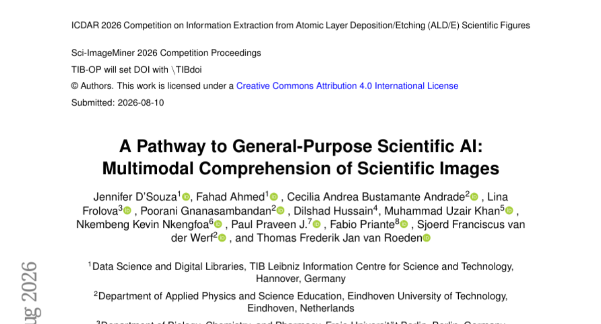

### 📌 한 줄 요약
과학적 이미지의 데이터 추출 및 추론 능력을 평가하기 위한 새로운 벤치마크와 미래 연구 방향 제시

### 🔑 핵심 포인트
- ALD/E-ImageMiner 벤치마크 및 ICDAR 2026 경진대회 소개
- 분류, 데이터 추출, 요약, VQA를 포함한 전문가 주석 데이터셋 제공
- 단순 시각 인식을 넘어선 '과학적 개념 이해'를 위한 미래 로드맵 제시

### 🧑‍💻 개발자 관점
과학 논문 분석 자동화 및 RAG 시스템 구축 시, 이미지 내 정량적 데이터와 복잡한 도표를 해석하는 데 필요한 벤치마크 기준을 제공합니다.

### 🚀 실무 적용 아이디어
- 제공된 1,951개 이미지 데이터셋을 활용한 멀티모달 모델 성능 테스트
- Bloom의 교육적 질문 설계 방식을 적용한 VQA 프롬프트 엔지니어링 실험
- 도표 내 수치 추출 및 요약 성능 비교 실험

### ⚠️ 리스크/한계
- 특정 도메인(ALD/E)에 집중되어 있어 범용적 과학 지식 전이 여부 확인 필요
- 전문가 주석에 의존하므로 데이터 규모 확장 시 비용 발생 가능성

### 📝 초록 기반 상세 설명
과학적 도표와 이미지는 핵심적인 실험 증거를 담고 있지만, 디지털 라이브러리와 멀티모달 AI가 이를 해석하고 검색하는 데는 여전히 어려움이 있습니다. 이를 해결하기 위해 ALD/E-ImageMiner 벤치마크와 ICDAR 2026 경진대회를 통해 205개 논문에서 추출된 1,951개의 전문가 주석 이미지를 제공합니다. 본 논문은 이 벤치마크가 시각적 읽기부터 도메인 기반 추론까지 AI의 역량을 어떻게 검증하는지 분석합니다. 최종적으로 이미지로부터 과학적 개념을 이해하는 것을 장기적 목표로 설정하고, 가설 평가 및 불확실성 처리 등 미래 연구 방향을 제안합니다.

---

## 26. [Nanbeige4.2-3B on Apple Silicon: Fixing Deployment Bugs and Decreasing Looped Transformer Memory Overhead](https://huggingface.co/papers/2608.13987)
**Upvotes**: 2 | **도입 난이도**: 중 | **신뢰도**: 상
**arXiv**: https://arxiv.org/abs/2608.13987

**태그**: LLM, Apple Silicon, Memory Optimization, Agentic AI, Agent, Benchmark, Evaluation

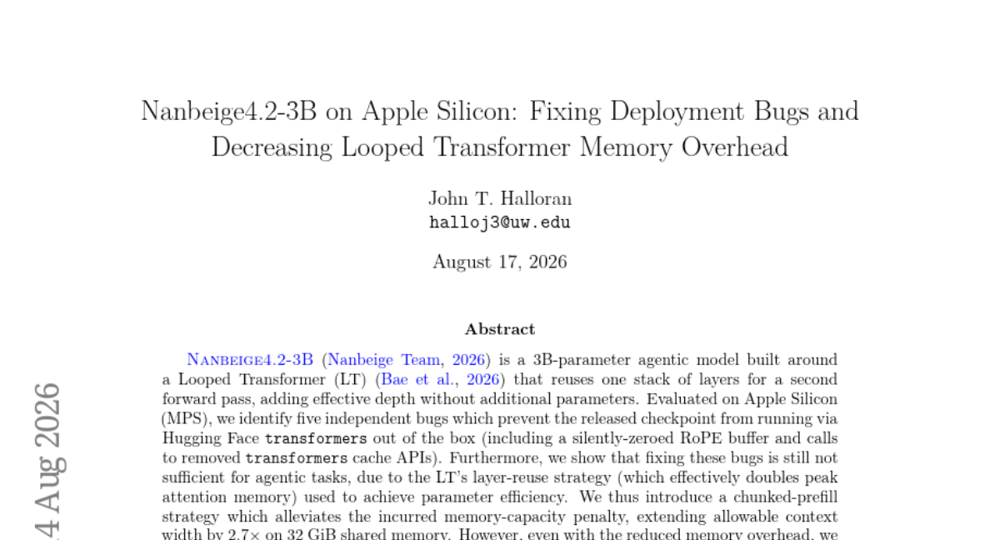

### 📌 한 줄 요약
Apple Silicon 환경에서 Looped Transformer 기반 모델의 배포 버그를 해결하고 메모리 효율을 최적화하여 에이전트 성능을 확보함

### 🔑 핵심 포인트
- Apple Silicon(MPS) 환경에서의 RoPE 및 캐시 API 호환성 버그 해결
- Looped Transformer의 메모리 오버헤드를 줄이기 위한 chunked-prefill 전략 도입
- 에이전트 작업 및 도구 호출(BFCL) 벤치마크 성능 확보

### 🧑‍💻 개발자 관점
파라미터 효율을 위해 레이어를 재사용하는 모델 구조가 실제 하드웨어(특히 통합 메모리 구조)에서 어떤 메모리 병목을 일으키는지 보여주는 실무적인 사례입니다.

### 🚀 실무 적용 아이디어
- 제공된 패치된 체크포트를 Apple Silicon 환경에서 로드하여 성능 비교
- Looped Transformer 구조의 메모리 프로파일링 분석
- Chunked-prefill 전략이 컨텍스트 확장성에 미치는 영향 검증

### ⚠️ 리스크/한계
- 멀티 도구 호출(multi-tool) 작업에서는 여전히 성능 한계가 존재함
- 레이어 재사용 구조로 인해 기본적으로 높은 피크 메모리 요구량 유지

### 📝 초록 기반 상세 설명
Looped Transformer(LT) 구조를 활용하여 파라미터 효율성을 높인 3B 규모의 Nanbeige4.2-3B 모델이 발표되었습니다. 그러나 기존 체크포인트는 Apple Silicon(MPS) 환경에서 RoPE 버퍼 오류 및 API 호환성 문제로 인해 정상 작동하지 않는 결함이 있었습니다. 또한, 레이어 재사용 전략으로 인해 발생하는 과도한 피크 어텐션 메모리 점유가 에이전트 작업 수행을 방해했습니다. 이를 해결하기 위해 버그 패치와 함께 청크 프리필(chunked-prefill) 전략을 도입하여 메모리 효율을 개선했습니다. 그 결과, 32GB 메모리 환경에서 컨텍스트 길이를 2.7배 확장하며 에이전트 작업 성공률을 0%에서 30%로 끌어올렸습니다.

### 🖼️ 추가 자료
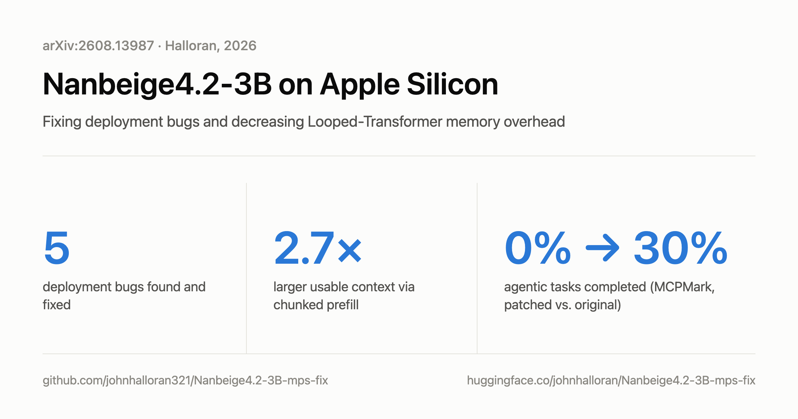

---

## 27. [Amplified Does Not Mean Predictive: Reasoning Behaviors in Thinking Models](https://huggingface.co/papers/2608.13760)
**Upvotes**: 2 | **도입 난이도**: 하 | **신뢰도**: 상
**arXiv**: https://arxiv.org/abs/2608.13760

**태그**: LLM, Reasoning, Model Evaluation, Alignment, Vision, Benchmark, Safety

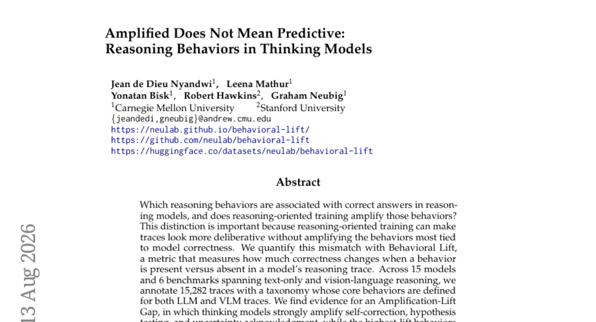

### 📌 한 줄 요약
추론 모델의 행동 증폭이 반드시 정답률 향상으로 이어지지 않음을 밝혀, 표면적 추론 형식이 아닌 실질적 정답 기여도를 높이는 학습의 필요성을 제시함

### 🔑 핵심 포인트
- 정답 기여도와 행동 증폭 사이의 불일치를 나타내는 'Amplification-Lift Gap' 개념 정의
- 자기 수정/불확실성 인지는 증폭되지만, 정답에 가장 중요한 신뢰도 교정은 충분히 강화되지 않음
- 추론 모델 학습이 표면적 양식(Surface Form)이 아닌 실질적 정답 기여 행동을 보상하도록 설계되어야 함을 입증

### 🧑‍💻 개발자 관점
모델이 '생각하는 것처럼 보이는 것'과 '실제로 정답을 맞히는 것' 사이의 괴리를 이해함으로써, 더 신뢰할 수 있는 추론 파이프라인을 설계할 수 있습니다.

### 🚀 실무 적용 아이디어
- 모델의 추론 로그에서 정답 기여도가 높은 행동과 단순히 양적 증가만 하는 행동을 구분하여 분석하기
- 학습 목적 함수(Objective Function)에 정답과의 상관관계가 높은 행동을 직접 보상하는 방식 검토하기
- 모델의 자기 수정(Self-correction) 빈도가 정답률 상승과 비례하는지 검증하기

### ⚠️ 리스크/한계
- 추론 양식의 변화가 정답률에 미치는 복합적인 인과관계를 완전히 분리하기 어려움
- 특정 벤치마크나 모델 아키텍처에 국한된 결과일 가능성 존재

### 📝 초록 기반 상세 설명
최근 추론 중심 학습이 모델의 사고 과정을 더 정교하게 만들지만, 이것이 실제 정답과 직결되는 행동을 강화하는지는 불분명합니다. 본 연구는 특정 행동이 정답에 미치는 영향을 측정하는 'Behavioral Lift' 지표를 제안합니다. 15개 모델과 6개 벤치마크를 대상으로 15,282개의 추론 트레이스를 분석했습니다. 연구 결과, 자기 수정이나 불확실성 인지는 크게 증가하지만, 정답과 가장 밀접한 신뢰도 교정(Confidence Calibration) 등은 충분히 강화되지 않는 'Amplification-Lift Gap'이 발견되었습니다. 이는 현재의 추론 학습이 정답에 결정적인 행동보다 표면적인 추론 양식을 강화하는 데 치중되어 있음을 시사합니다.

### 🖼️ 추가 자료
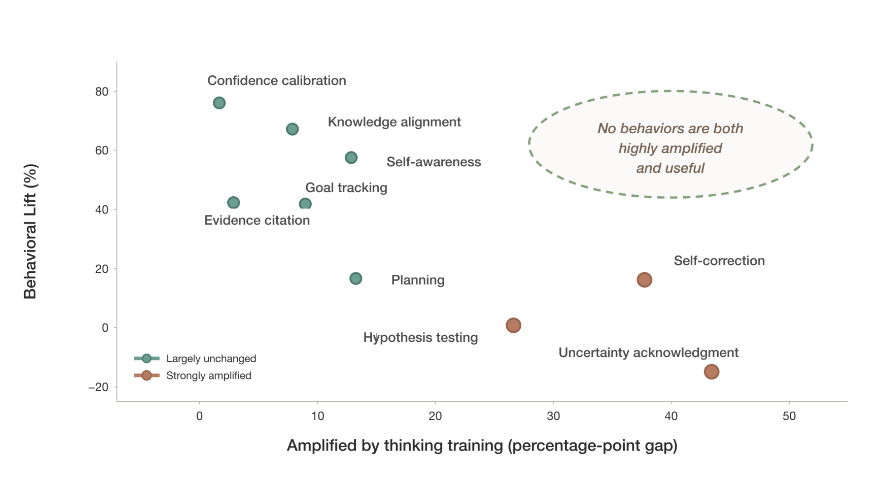

---

## 28. [SPARGen: Unifying Spatial Perception and Reasoning through Native Multimodal Generation](https://huggingface.co/papers/2608.14138)
**Upvotes**: 1 | **도입 난이도**: 상 | **신뢰도**: 상
**arXiv**: https://arxiv.org/abs/2608.14138

**태그**: 3D Reconstruction, Multimodal, Spatial Reasoning, Generative Model, Reasoning, Vision, Benchmark

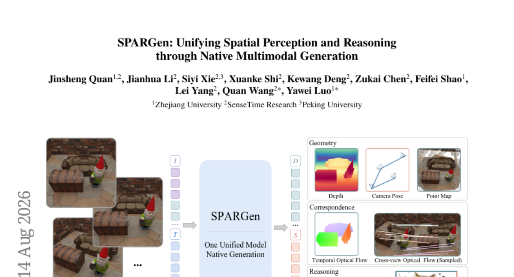

### 📌 한 줄 요약
3D 재구성, 대응점 찾기, 공간 추론을 하나의 생성형 모델로 통합한 멀티모달 프레임워크

### 🔑 핵심 포인트
- 3D 재구성, 대응점, 공간 추론을 단일 생성 작업으로 통합한 프레임워크 제안
- 구조적 데이터와 언어적 출력을 토큰화하여 멀티모달 학습 효율 극대화
- 서로 다른 공간 작업 간의 지식 전이를 가능하게 하는 공유 표현 학습

### 🧑‍💻 개발자 관점
로봇 공학이나 AR/VR 분야에서 기하학적 구조 파악과 언어적 명령 수행을 하나의 모델로 처리할 수 있는 가능성을 제시합니다.

### 🚀 실무 적용 아이디어
- 제시된 토큰 직렬화 방식이 복잡한 3D 구조를 얼마나 정확히 유지하는지 검증
- 다양한 도메인(실내/실외) 데이터셋에 대한 일반화 성능 테스트
- 기존 분리형 모델(Task-specific) 대비 추론 속도 및 효율성 비교

### ⚠️ 리스크/한계
- 복잡한 기하학적 구조 생성 시 토큰화 방식의 정밀도 한계 가능성
- 대규모 멀티모달 학습을 위한 높은 컴퓨팅 자원 요구

### 📝 초록 기반 상세 설명
기존의 공간 지각 및 추론 방식은 작업별로 분리된 아키텍처를 사용하여 물리적 장면의 상호 보완적 표현 간 지식 전이가 어렵다는 문제가 있었습니다. 이를 해결하기 위해 SPARGen은 3D 재구성, 밀집 대응(dense correspondence), 공간 추론을 지시어 기반 생성 작업으로 통합한 프레임워크를 제안합니다. 이 모델은 구조화된 데이터와 언어 출력을 토큰 시퀀스로 직렬화하는 동시에, 이미지에 정렬된 밀집 기하 필드를 생성하여 공간적 감독(supervision)이 공유 표현을 형성하도록 합니다. 실험 결과, SPARGen은 단일 멀티모달 생성 프레임워크 내에서 서로 다른 공간 작업들 사이에서 경쟁력 있는 성능을 입증했습니다.

---

## 29. [Who Speaks Matters: Authority-Aware Multi-View RAG over Italian Parliamentary Proceedings](https://huggingface.co/papers/2608.13410)
**Upvotes**: 1 | **도입 난이도**: 중 | **신뢰도**: 상
**arXiv**: https://arxiv.org/abs/2608.13410

**태그**: RAG, Information Retrieval, NLP, Authority-Aware, Evaluation

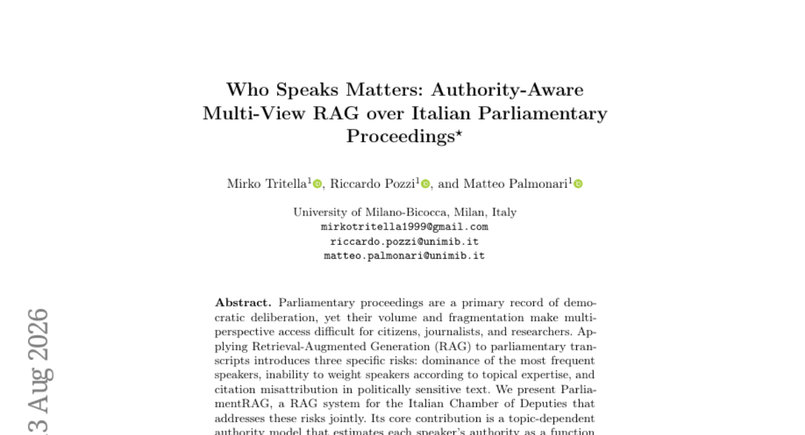

### 📌 한 줄 요약
발화자의 권위와 주제 적합성을 고려하여 다각적 관점을 요약하는 권위 인식형(Authority-Aware) RAG 시스템 연구

### 🔑 핵심 포인트
- 주제 의존적 권위 모델(Topic-dependent authority model)을 통한 발화자 전문성 반영
- 정치적 관점의 균형을 맞추기 위한 다각적 관점 합성 및 인용 기능
- NotebookLM 대비 높은 인용 정확도와 정치적 그룹 간 커버리지 달성

### 🧑‍💻 개발자 관점
특정 도메인(법률, 의학 등)의 RAG 구축 시, 단순 유사도 검색을 넘어 발화자의 전문성이나 신뢰도를 가중치로 활용하는 설계 패턴을 제시합니다.

### 🚀 실무 적용 아이디어
- 사용자 프로필(직업, 경력 등)을 메타데이터로 활용한 가중치 기반 RAG 구현 실험
- 검색된 청크의 출처(Source)를 명확히 매핑하는 인용 검증 로직 적용
- 주제별로 동적으로 변하는 권위 점수 산출 알고리즘 테스트

### ⚠️ 리스크/한계
- 권위 모델 산출 방식이 특정 정치적 성향을 편향시킬 위험 존재
- 문장 생성(Prose)의 유려함 측면에서는 일반 범용 모델보다 낮을 수 있음

### 📝 초록 기반 상세 설명
의회 회의록은 민주적 의사결정의 핵심 기록이지만, 방대한 양과 파편화된 구조로 인해 다각적인 관점을 파악하기 어렵습니다. 기존 RAG를 의회 데이터에 적용할 경우 빈번한 발화자의 독점, 주제별 전문성 반영 부족, 인용 오류 등의 위험이 존재합니다. 본 논문은 이탈리아 하원을 대상으로 이러한 문제를 해결하는 ParliamentRsG 시스템을 제안합니다. 이 시스템은 직업, 교육, 이전 발언 등을 결합하여 쿼리 주제에 따른 발화자의 권위를 추정하는 모델을 핵심으로 합니다. 실험 결과, 제안 시스템은 Google NotebookLM 대비 정치적 그룹 간 커버리지와 인용 충실도 면에서 우수한 성능을 보였습니다.

### 🖼️ 추가 자료
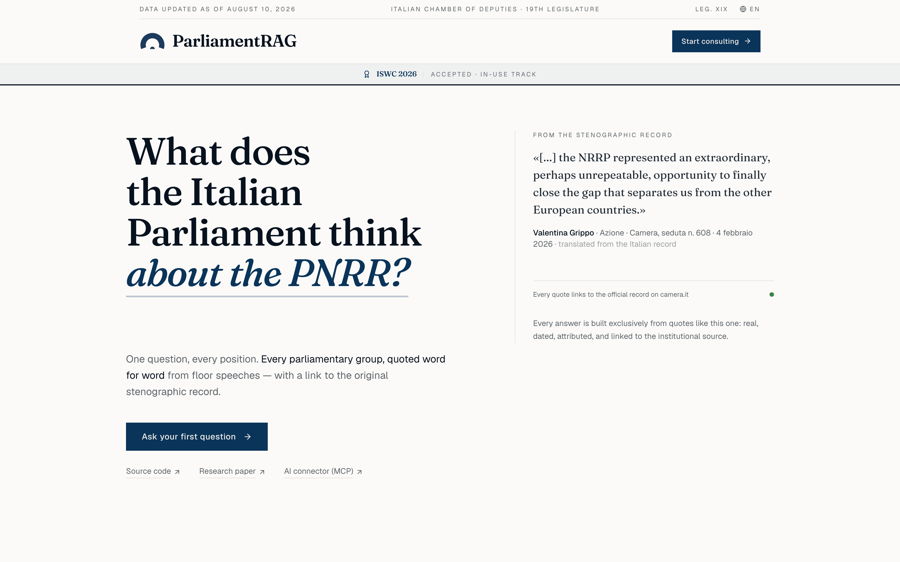
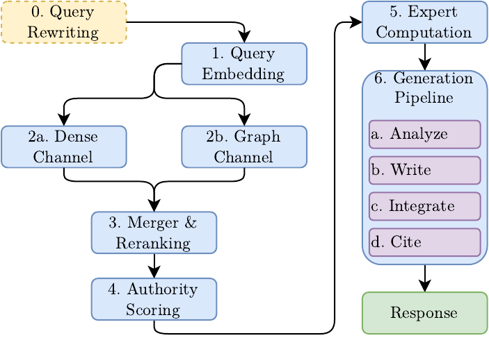

---

## 30. [UNMASK: Discovering and Causally Verifying Spurious Shortcuts in Text Classifiers](https://huggingface.co/papers/2608.09209)
**Upvotes**: 1 | **도입 난이도**: 중 | **신뢰도**: 상
**arXiv**: https://arxiv.org/abs/2608.09209

**태그**: NLP, Robustness, Bias Mitigation, Causal Inference, Benchmark

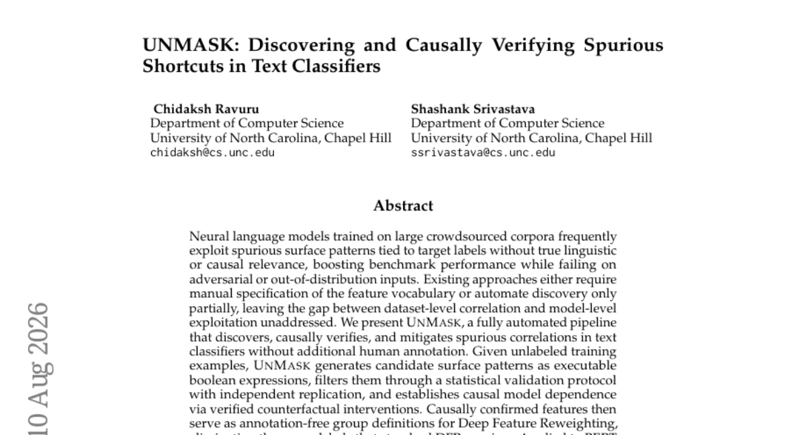

### 📌 한 줄 요약
수동 레이블 없이 텍alist의 가짜 상관관계(Spurious Correlations)를 자동 탐지하고 인과적으로 검증하여 모델의 강건성을 높이는 파이프라인

### 🔑 핵심 포인트
- 수동 레이블링 없이 가짜 상관관계를 발견, 검증, 완화하는 완전 자동화 파이프라인 제안
- 통계적 검증과 인과적 반사실적 개입(Counterfactual Interventions)을 결합한 신뢰도 높은 피처 추출
- 검증된 피처를 활용해 추가 어노테이션 없이 DFR(Deep Feature Reweighting)을 수행하여 모델 강건성 확보

### 🧑‍💻 개발자 관점
데이터셋의 편향을 잡기 위해 사람이 일일이 규칙을 만들거나 레이블을 달 필요 없이, 모델이 학습한 잘못된 지름길(Shortcut)을 자동으로 찾아내고 교정할 수 있습니다.

### 🚀 실무 적용 아이디어
- 자체 구축한 데이터셋에서 모델이 특정 단어에 과하게 의존하는지 UNMASK 로직으로 테스트
- HANS나 WILDS 같은 벤치마크 데이터셋에 파이프라인을 적용하여 편향 탐지 성능 확인
- RLHF용 Reward Model 학습 시 발생하는 편향을 탐지하는 용도로 적용 검토

### ⚠️ 리스크/한계
- 복잡한 논리 구조를 가진 패턴의 경우 불리언 표현식 생성만으로 완벽한 포착이 어려울 수 있음
- 인과적 검증 단계에서 계산 비용이 발생할 수 있음

### 📝 초록 기반 상세 설명
대규모 데이터로 학습된 언어 모델은 언어적 의미와 무관한 표면적 패턴(Spurious patterns)을 학습하여 OOD(Out-of-Distribution) 상황에서 성능이 저하되는 문제가 있습니다. 기존 방식은 수동 피처 지정이 필요하거나 데이터셋과 모델 간의 상관관계 차이를 해결하지 못하는 한계가 있습니다. 본 논문은 UNMASK라는 자동화된 파이프라인을 제안하여, 실행 가능한 불리언 표현식으로 후보 패턴을 생성하고 통계적 검증 및 인과적 개입을 통해 이를 검증합니다. 검증된 피처는 추가 레이블 없이 그룹 정의로 사용되어 Deep Feature Reweighting(DFR)을 수행합니다. 실험 결과, MNLI와 CivilComments-WILDS 데이터셋에서 기존 수동 방식에 준하는 성능 향상과 편향 제거 효과를 입증했습니다.

### 🖼️ 추가 자료
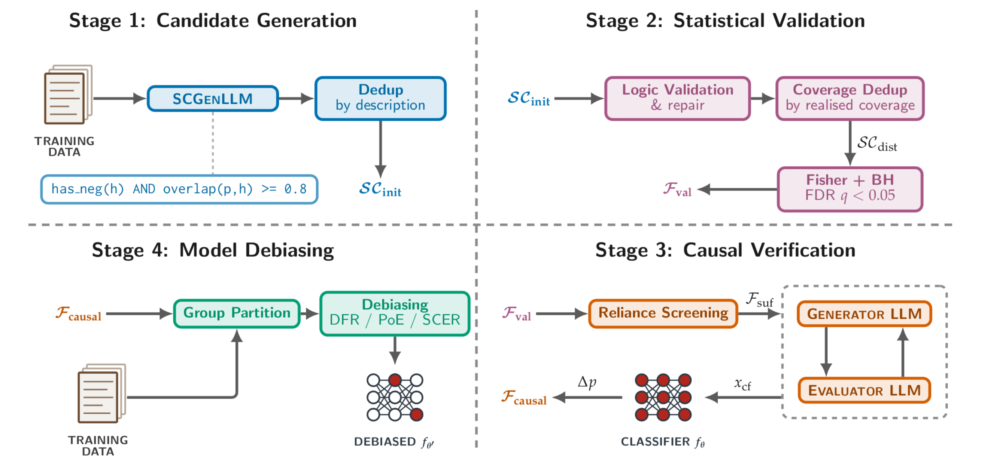

---

## 31. [Generation as Auxiliary Supervision: Enhancing Visual Understanding at Zero Inference Overhead via Decoupled Embedding Prediction](https://huggingface.co/papers/2608.12209)
**Upvotes**: 0 | **도입 난이도**: 중 | **신뢰도**: 상
**arXiv**: https://arxiv.org/abs/2608.12209

**태그**: Multimodal, Vision-Language, Training-Strategy, Vision, Inference

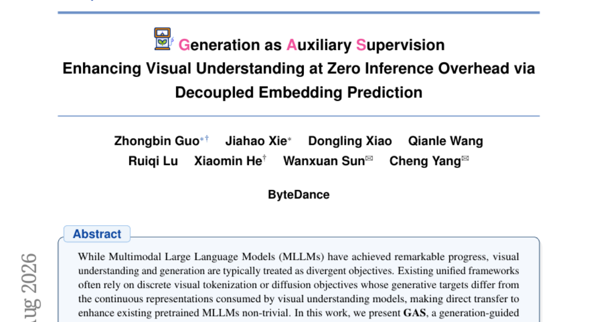

### 📌 한 줄 요약
추가적인 추론 비용 없이 생성 태스크를 보조 학습(Auxiliary Supervision)으로 활용하여 시각적 이해 성능을 높이는 프레임워크

### 🔑 핵심 포인트
- 생성 작업을 시각적 표현 학습을 위한 보조 감독(Auxiliary Supervision)으로 활용
- 분리된 MoT 구조를 통해 이해 레이어를 보호하면서 하위 공유 레이어의 표현력을 강화
- 학습 완료 후 생성 브랜치를 제거하여 추론 시 추가 비용(Zero Inference Overhead) 제거

### 🧑‍💻 개발자 관점
모델의 추론 속도를 저하시키지 않으면서도 생성 모델의 풍부한 정보를 활용해 시각 이해 성능을 끌어올릴 수 있는 실용적인 학습 전략을 제시합니다.

### 🚀 실무 적용 아이디어
- 기존 MLLM의 하위 레이어에 생성 손실을 결합하는 분리형 학습 구조 구현
- 공간 이해(Spatial Comprehension) 성능 향상을 위한 생성 태스크 설계 실험
- 학습 단계별 생성 브랜치 제거 시 성능 유지 여부 검증

### ⚠️ 리스크/한계
- 학습 시에는 생성 브랜치 유지로 인해 높은 컴퓨팅 자원 필요
- 생성 태스크와 이해 태스크 간의 상관관계 설계에 따라 성능 편차 발생 가능

### 📝 초록 기반 상세 설명
최근 MLLM의 발전에도 불구하고 시각적 이해와 생성은 서로 다른 목표로 취급되어 상호 보완적 활용이 어려웠습니다. 기존 방식은 이산적 토큰화나 확산 모델 목표를 사용하여 기존 사전 학습 모델로의 직접적인 전이가 까다로웠습니다. 본 논문은 생성 작업을 표현 학습을 위한 보조 감독 신호로 재해석하는 GAS 프레임워크를 제안합니다. GAS는 분리된 MoT(Mixture-of-Transformers) 구조를 통해 하위 트렁크를 공유하면서도 생성 손실이 이해 레이어에 직접적인 간섭을 주지 않도록 설계되었습니다. 실험 결과, 학습 후 생성 브랜치를 제거함으로써 추론 오버헤드 없이 인지 및 공간 이해 성능이 크게 향상되었습니다.

---

