# 2026-08-26 Daily Papers (Top 32)

## 오늘의 요약
오늘의 연구는 복잡한 과업 수행을 위한 에이전트의 협업 및 실행 환경 최적화와 옴니모달 월드 모델을 통한 가상 환경 생성 기술이 주를 이루었습니다. 또한, 3D 생성 효율화 및 모바일 환경에서의 실무적 에이전트 검증 등 실질적인 워크플로우와 벤치마크 구축에 대한 연구가 활발히 논의되었습니다.

### 오늘의 핵심 포인트
- 단순 모델 크기 확장을 넘어 환경 확장과 에이전트 간 협업 구조를 최적화하여 실무급 성능을 확보하는 방법론이 주목받았습니다.
- 영상, 음성, 텍스트를 통합 이해하고 생성하는 옴니모달 기술이 가상 현실 및 이커머스 등 다양한 산업 분야로 확장되고 있습니다.
- 실제 모바일 환경이나 실시간 제어 환경의 제약 조건을 반영한 정교한 벤치마크와 적응형 계획 알고리즘의 중요성이 강조되었습니다.

**오늘의 태그**: AI Agent, World Model, Omnimodal, Workflow Automation, 3D Generation

## 1. [Apodex 1.1: Scaling Agentic Intelligence for Complex Work](https://huggingface.co/papers/2608.23283)
**Upvotes**: 169 | **도입 난이도**: 상 | **신뢰도**: 상
**arXiv**: https://arxiv.org/abs/2608.23283

**태그**: AI Agent, Workflow Automation, Multi-Agent Systems, Scaling Laws, Agent

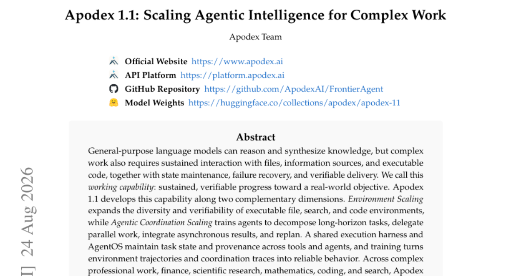

### 📌 한 줄 요약
복잡한 장기 과업 수행을 위해 환경 확장과 에이전트 협업 최적화를 결합한 고성능 에이전트 시스템 개발

### 🔑 핵심 포인트
- Environment Scaling: 실행 가능한 파일, 검색, 코드 환경의 다양성 및 검증 가능성 확장
- Agentic Coordination Scaling: 장기 과업 분해, 병렬 위임, 비동기 결과 통합 및 재계획 능력 학습
- AgentOS & Execution Harness: 작업 상태 유지와 출처(provenance) 관리를 위한 통합 프레임워크 구축

### 🧑‍💻 개발자 관점
모델 크기를 키우는 대신, 환경과 협업 구조를 최적화함으로써 실무급 에이전트 성능을 확보하는 새로운 방법론을 제시합니다.

### 🚀 실무 적용 아이디어
- 에이전트의 작업 분해 및 병렬 실행 워크플로우 설계 실험
- 실행 환경(Sandbox)과 에이전트 간의 상태 동기화 구조 설계
- 작은 모델을 활용한 특정 도메인(코딩, 수학 등) 특화 에이전트 학습 테스트

### ⚠️ 리스크/한계
- 복잡한 환경과 협업 구조로 인해 시스템 아키텍처 설계 난이도가 매우 높음
- 에이전트 간의 비동기 작업 통합 시 발생하는 상태 충돌 및 제어 문제

### 📝 초록 기반 상세 설명
기존 언어 모델은 추론 능력은 뛰어나지만, 파일/코드 상호작용 및 상태 유지와 같은 복잡한 실무 과업 수행에는 한계가 있습니다. 이를 해결하기 위해 Apodex 1.1은 환경 확장(Environment Scaling)과 에이전트 조정 확장(Agentic Coordination Scaling)이라는 두 가지 차원의 접근법을 제안합니다. 실행 가능한 환경의 다양성을 높이고, 장기 과업 분해 및 병렬 작업 위임 능력을 학습시키는 것이 핵심입니다. AgentOS와 공유 실행 하네스를 통해 작업 상태와 이력을 관리하며, 환경 궤적과 협업 흔적을 학습 데이터로 활용합니다. 그 결과, 거대 모델보다 작은 파라미터로도 금융, 과학, 코딩 등 전문 분야에서 최상위 성능을 달었습니다.

---

## 2. [EchoWM: Open and Enterable Omnimodal World Models](https://huggingface.co/papers/2608.23189)
**Upvotes**: 63 | **도입 난이도**: 상 | **신뢰도**: 상
**arXiv**: https://arxiv.org/abs/2608.23189

**태그**: World Model, Generative AI, Multimodal, Video Generation, Robotics, Video, Audio, Benchmark, Evaluation

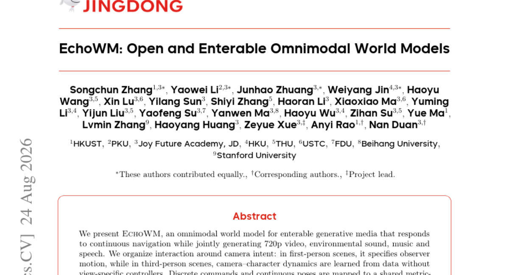

### 📌 한 줄 요약
연속적인 내비게이션 제어가 가능한 720p 고화질 영상 및 오디오 통합 생성 월드 모델

### 🔑 핵심 포인트
- 영상, 환경음, 음악, 음성을 동시에 생성하는 옴니모달(Omnimodal) 생성 프레임워크
- 1인칭/3인칭 시점을 모두 지원하는 6-DoF 상대적 궤적 제어 메커니즘
- 장기 생성(Long-horizon)을 위한 점진적 학습 및 자기회귀적 사후 학습 전략

### 🧑‍💻 개발자 관점
가상 현실(VR/AR) 및 게임 엔진용 생성형 에셋 제작 시, 사용자 움직임에 반응하는 고품질 인터랙티브 환경을 구축하는 데 핵심적인 기술이 될 수 있습니다.

### 🚀 실무 적용 아이디어
- 제공된 6-DoF 궤적 제어 방식이 기존 물리 엔진과 어떻게 호환되는지 분석
- 장기 생성 시 오디오-비주얼 동기화 유지력을 확인하기 위한 벤치마크 테스트
- 다양한 카메라 시점(1인칭 vs 3인칭) 전환 시의 일관성 검증

### ⚠️ 리스크/한계
- 고해상도(720p) 및 멀티모달 생성에 따른 막대한 컴퓨팅 자원 요구
- 복잡한 궤적 제어 시 발생할 수 있는 시각적 왜곡이나 물리적 불일치 가능성

### 📝 초록 기반 상세 설명
기존의 생성형 미디어는 실시간 상호작용과 정교한 카메라 제어를 동시에 달성하는 데 어려움이 있었습니다. 본 논문은 1인칭 및 칭칭칭 시점의 카메라 움직임을 제어하며 영상, 환경음, 음악, 음성을 동시에 생성하는 EchoWM을 제안합니다. 이 모델은 이산적 명령과 연속적 포즈를 공유된 6-DoF 궤적으로 매핑하여 데이터 간 모션 크기를 보존합니다. 데이터 엔진 구축과 점진적 학습 및 자기회귀적 사후 학습 방식을 통해 장기 생성 성능을 확보했습니다. 실험 결과, EchoWM은 궤적 추종 능력과 시각적 품질이 뛰어나며 다양한 시점과 주제에서 동기화된 오디오-비주얼 생성을 입증했습니다.

---

## 3. [TLive-Omni: An Omni-Modal Understanding Model for E-Commerce Live Streaming](https://huggingface.co/papers/2608.20958)
**Upvotes**: 52 | **도입 난이도**: 상 | **신뢰도**: 상
**arXiv**: https://arxiv.org/abs/2608.20958

**태그**: Multi-modal, Live-streaming, Reinforcement Learning, Video-Language, Reasoning, Vision, Video, Audio, Benchmark, Safety

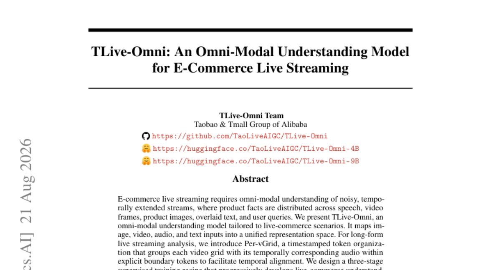

### 📌 한 줄 요약
이커머스 라이브 스트리밍의 복합 모달리티(음성, 영상, 텍ext 등)를 통합 이해하고 실시간 응답을 생성하는 옴니모달 모델 연구

### 🔑 핵심 포인트
- Per-vGrid: 시간적 정렬을 위해 비디오 그리드와 오디오를 결합하는 타임스탬프 기반 토큰 구조 도입
- Faithful-RFT: 실시간성을 유지하며 답변의 신뢰도와 표현력을 높이는 강화 학습 단계 설계
- Atomic Capability Taxonomy: 이커머스 특화 데이터 생산 엔진 및 시나리오 중심의 역량 분류 체계 구축

### 🧑‍💻 개발자 관점
멀티모달 데이터(영상+음성+텍스트)가 혼재된 실시간 스트리밍 환경에서 정교한 정보 추출 및 QA 시스템을 구축하는 데 유용한 아키텍처를 제시합니다.

### 🚀 실무 적용 아이디어
- Per-vGrid와 같은 시간적 정렬 구조를 기존 비디오-언어 모델에 적용해보기
- 실시간 응답 품질을 위해 RLHF/RFT 시 피드백 루프 설계 방식 비교하기
- 도메인 특화 데이터셋 구축을 위한 자동화된 데이터 생산 파이프라인 검토하기

### ⚠️ 리스크/한계
- 실시간 스트리밍 환경에서의 추론 비용 및 지연 시간(Latency) 관리 문제
- 특정 도메인(이커머스)에 최적화된 모델이므로 다른 도메인으로의 확장 시 성능 저하 가능성

### 📝 초록 기반 상세 설명
이커머스 라이브 스트리밍은 노이즈가 많고 시간적으로 긴 영상 내에 제품 정보가 여러 모달리티에 분산되어 있어 이해가 어렵습니다. 이를 해결하기 위해 이미지, 비디오, 오디오, 텍스트를 하나의 표현 공간으로 매핑하는 TLive-Omni 모델을 제안합니다. 시간적 정렬을 위해 Per-vGrid라는 타임스탬프 기반 토큰 구조를 도입하고, 인지에서 응답까지 단계별로 발전하는 3단계 학습 레시피를 설계했습니다. 또한, 실시간 요구사항을 충족하면서 답변의 신뢰도를 높이기 위해 작업 검증 피드백 기반의 Faithful-RFT 강화 학습을 적용했습니다. 실험 결과, 이커머스 도메인 작업에서 강력한 성능을 보였으며 일반 벤치마크에서도 우수한 일반화 성능을 입증했습니다.

---

## 4. [Unlocking the Potential of Image Editing via Concept Scaling and Dense Supervision](https://huggingface.co/papers/2608.16812)
**Upvotes**: 45 | **도입 난이도**: 상 | **신뢰도**: 상
**arXiv**: https://arxiv.org/abs/2608.16812

**태그**: Diffusion, Image Editing, Dataset, Computer Vision, Vision, Evaluation

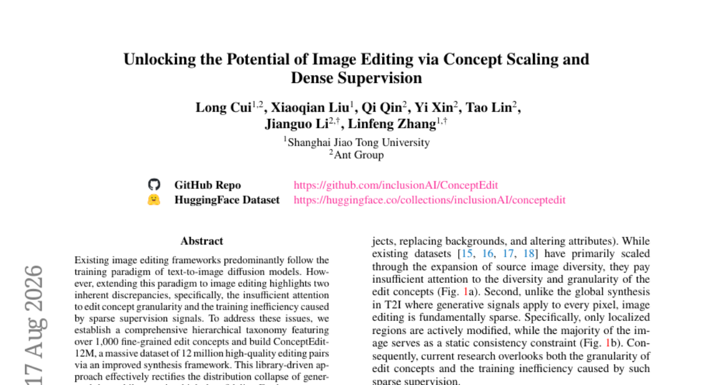

### 📌 한 줄 요약
세밀한 편집 개념 분류와 밀집 학습 전략을 통해 이미지 편집의 정밀도와 효율성을 극대화한 프레임워크

### 🔑 핵심 포인트
- 1,200만 개의 고품질 편집 쌍을 포함하는 ConceptEdit-12M 데이터셋 구축
- 여러 편집 개념을 하나의 이미지 쌍에 결합하는 밀집 지도(Dense Supervision) 학습 전략 제안
- 세밀한 편집 역량 진단을 위한 계층적 분류 체계 및 ConceptEdit-Bench 평가 스위트 개발

### 🧑‍💻 개발자 관점
이미지 편집 시 발생하는 의도와 결과 사이의 괴리를 줄이고, 대규모 데이터셋을 통한 효율적인 모델 학습 방법론을 제시합니다.

### 🚀 실무 적용 아이디어
- 제안된 밀집 지도(Dense Supervision) 전략을 기존 Diffusion 모델 학습에 적용해보기
- ConceptEdit-12M과 같은 대규모 합성 데이터셋이 모델의 일반화 성능에 미치는 영향 분석
- 제시된 계층적 분류 체계를 활용하여 현재 보유한 모델의 편집 정밀도 테스트

### ⚠️ 리스크/한계
- 대규모 데이터셋 구축 및 학습에 따른 높은 컴퓨팅 자원 요구
- 여러 개념을 한 번에 학습할 때 발생할 수 있는 개념 간 간섭 문제

### 📝 초록 기반 상세 설명
기존 이미지 편집 프레임워크는 텍스트-이미지 생성 모델의 학습 방식을 따르지만, 편집 개념의 세밀함 부족과 희소한 지도 신호로 인한 학습 효율성 저하라는 문제를 안고 있습니다. 이를 해결하기 위해 연구진은 1,000개 이상의 미세 편집 개념을 포함하는 계층적 분류 체계를 구축하고, 1,200만 개의 고품질 편집 쌍을 포함하는 ConceptEdit-12M 데이터셋을 개발했습니다. 또한, 단일 이미지 쌍에 여러 비간섭적 개념을 합성하여 풍부한 학습 신호를 제공하는 밀집 지도(Dense Supervision) 전략을 제안했습니다. 실험 결과, 제안된 방식은 기존 모델들을 크게 상회하는 성능을 보였으며, 모델의 역량을 진단할 수 있는 ConceptEdit-Bench 평가 스위트도 함께 제시되었습니다.

---

## 5. [MobilePA-Bench: Benchmarking Mobile Planner Agents on Complex Real-World Tasks](https://huggingface.co/papers/2608.23035)
**Upvotes**: 33 | **도입 난이도**: 중 | **신뢰도**: 상
**arXiv**: https://arxiv.org/abs/2608.23035

**태그**: Mobile Agent, Planning, Benchmark, Tool-use, Agent, Evaluation

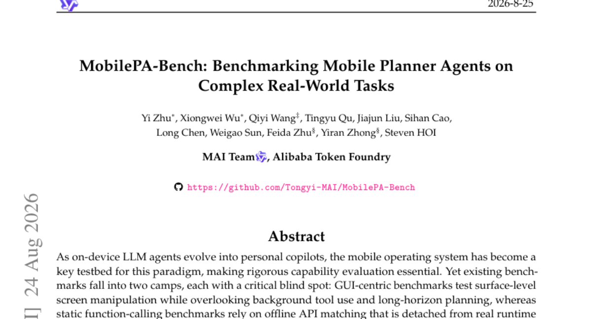

### 📌 한 줄 요약
실제 모바일 환경의 제약 조건과 복잡한 도구 사용 능력을 검증하기 위한 상태 유지형(Stateful) 벤치마크 프레임워크 제안

### 🔑 핵심 포인트
- 실제 앱 데이터베이스와 피드백을 유지하는 실행 가능한 샌드박스 환경 구축
- 협업, 메모리, 복합 스킬 활용 등 고차원적 계획(Planning) 능력 평가 체계 마련
- 도구 순서 제약 및 런타임 오류 등 실제 모바일 환경의 변수를 반영한 검증

### 🧑‍💻 개발자 관점
단순한 API 호출 테스트를 넘어, 실제 모바일 OS의 제약 조건(권한, 상태 변화) 하에서 에이전트의 계획 능력을 검증할 수 있는 실무적 기준을 제공합니다.

### 🚀 실무 적용 아이디어
- 제시된 샌드박스 환경에서 현재 사용 중인 LLM의 도구 호출 순서 준수 능력 테스트
- 사용자 프로필 및 과거 이력을 활용한 메모리 기반 계획 수립 성능 측정
- 복합 스킬(Composite Skills) 도입 시 에이전트의 계획 효율성 변화 관찰

### ⚠️ 리스크/한계
- 실제 물리적 모바일 기기 환경과 샌드박스 간의 괴리 가능성
- 복잡한 샌드박스 유지 비용 및 환경 구축의 난이도

### 📝 초록 기반 상세 설명
온디바이스 LLM 에이전트가 개인 비서로 진화함에 따라 모바일 OS 환경에서의 정밀한 평가가 중요해졌습니다. 기존 벤치마크는 단순 GUI 조작에 치중하거나 실제 런타임 제약이 배제된 정적 API 매칭에 머물러 있다는 한계가 있습니다. 이를 해결하기 위해 실시간 앱 데이터베이스와 구조화된 피드백을 제공하는 실행 가능한 샌드박스 기반의 MobilePA-Bench를 제안합니다. 이 벤치마크는 서브 에이전트 협업, 메모리 활용, 복합 스킬 사용 등 고도화된 계획 능력을 평가합니다. 실험 결과, 최신 LLM들도 엄격한 도구 순서나 권한 제한 등 실제 환경에서는 성능이 급격히 저하됨을 확인했습니다. MobilePA-Bench는 신뢰할 수 있는 모바일 에이전트 개발을 위한 진단 도구이자 강화학습의 기반이 될 것입니다.

---

## 6. [Prime Agent: A Self-Improving RLM Harness](https://huggingface.co/papers/2608.23552)
**Upvotes**: 31 | **도입 난이도**: 중 | **신뢰도**: 상
**arXiv**: https://arxiv.org/abs/2608.23552

**태그**: AI Agent, Software Engineering, Autonomous Workflows, Code Generation, Agent, Evaluation

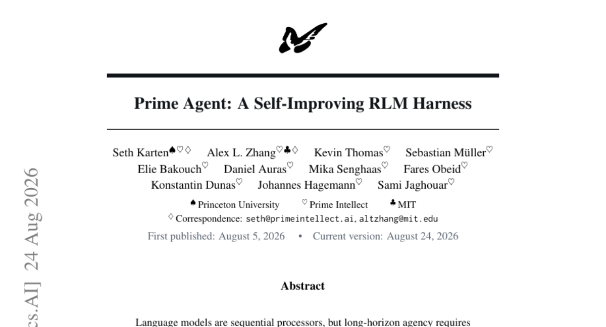

### 📌 한 줄 요약
장기적 작업 수행을 위해 외부 연산과 메모리를 결합하여 모델의 잠재력을 극대화하는 오픈소스 에이전트 프레임워크

### 🔑 핵심 포인트
- IPython REPL 기반의 지속적 실행 환경 및 RLM 추상화 제공
- 메모리, 기술, 프롬프트 등을 보존하는 Continual Harness 구조
- 에이전트 간 직접 통신 및 인간의 개입이 가능한 Agents View 지원

### 🧑‍💻 개발자 관점
에이전트가 단순히 텍후를 생성하는 것을 넘어, 실제 코드를 실행하고 결과에 따라 스스로를 개선하는 '실행 가능한 워크플로우'를 구축하는 데 중요한 영감을 줍니다.

### 🚀 실무 적용 아이디어
- 제공된 GitHub 코드를 클론하여 로컬 환경에서 에이전트 워크플로우 실행해보기
- 복잡한 코딩 과제(예: 커널 생성)를 대상으로 에이전트의 자가 수정 능력 테스트하기
- 기존 RAG 시스템과 Prime Agent의 메모리 관리 방식 비교 분석하기

### ⚠️ 리스크/한계
- 지속적인 REPL 실행 환경으로 인한 보안 및 리소스 관리 리스크
- 에이전트 간 통신 및 복잡한 워크플로우에서의 제어 난이도 증가

### 📝 초록 기반 상세 설명
기존 언어 모델은 모델 가중치와 컨텍스트 외부의 정보 및 연산을 활용하는 장기적 에이전트 작업 수행에 한계가 있습니다. 이를 해결하기 위해 Prime Agent는 지속적인 IPython REPL과 RLM(Recursive Language Model) 추상화를 결합한 오픈소스 하네스를 제안합니다. 이 시스템은 지속적 하네스(Continual Harness)를 통해 메모리, 기술, 프롬프트를 보존하며, 재귀적 서브에이전트 간의 직접 통신을 지원합니다. 실험 결과, ARC-AGI-3 RHAE 성능을 30%에서 95.5%로 대폭 향상시켰으며 코딩 및 커널 생성 등 다양한 벤치마크에서 탁월한 성과를 보였습니다. 결과적으로 이 프레임워크는 실행 환경의 실패가 모델의 능력 부족으로 오인되는 것을 방지하고 모델의 진정한 성능을 끌어냅니다.

---

## 7. [Block3D: Efficient Text-to-3D Generation via Block-Wise Diffusion](https://huggingface.co/papers/2608.19567)
**Upvotes**: 25 | **도입 난이도**: 중 | **신뢰도**: 상
**arXiv**: https://arxiv.org/abs/2608.19567

**태그**: 3D Generation, Diffusion Model, Efficiency, Inference

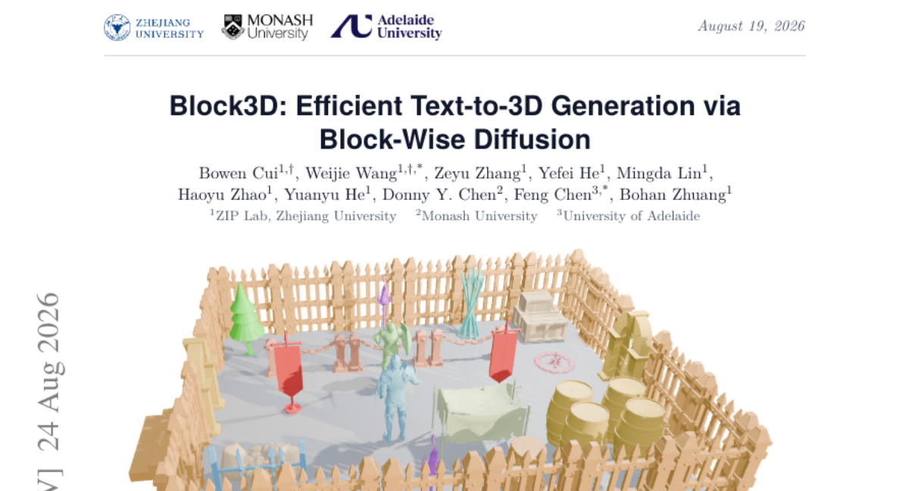

### 📌 한 줄 요약
블록 단위 생성 및 교정 방식을 통해 3D 생성 속도를 5배 이상 높이면서도 기하학적 정밀도를 유지하는 프레임워크

### 🔑 핵심 포인트
- 블록 단위 분할을 통한 자기회귀적 생성 및 블록 내 공동 노이즈 제거 방식 도입
- 신뢰도 가이드 기반의 블록 내 교정 메커니즘을 통한 오류 누적 방지
- 기존 방식 대비 연산 비용을 획기적으로 낮추면서도 높은 기하학적 충실도 유지

### 🧑‍💻 개발자 관점
3D 에셋 생성 속도가 비약적으로 향상되어, 실시간에 가까운 3D 생성 워크플로우 구축이 가능해집니다.

### 🚀 실무 적용 아이디어
- 제시된 블록 크기(block size) 변화에 따른 생성 품질 및 속도 트레이드오프 분석
- 신뢰도 기반 교정 알고리즘이 복잡한 기하학적 구조에서 어떻게 작동하는지 검증
- 기존 TRELLIS 등 최신 3D 생성 모델과의 비교 실험 수행

### ⚠️ 리스크/한계
- 블록 간 경계에서 발생할 수 있는 불연속성 문제 가능성
- 신뢰도 기반 교정 방식이 특정 복잡한 형상에서 과도한 수정을 유발할 위험

### 📝 초록 기반 상세 설명
기존의 텍스트-to-3D 생성 방식은 순차적인 자기회귀(Autoregressive) 방식의 오류 누적 문제나, 전체 표현을 반복 처리하는 확산 모델의 높은 연산 비용 문제에 직면해 있습니다. 본 논문에서는 이산적 형상 토큰 시퀀스를 연속적인 블록으로 분할하는 Block3D 프레임워크를 제안합니다. 블록 단위로 자기회귀적 생성을 수행하되, 블록 내 토큰들을 공동으로 노이즈 제거(denoising)하여 효율성을 극대화합니다. 또한, 신뢰도 기반의 블록 내 교정(confidence-guided intra-block correction)을 도입하여 생성 과정에서의 오류 누적을 방지합니다. 실험 결과, 기하학적 정밀도를 유지하면서도 생성 시간을 기존 대비 약 5배 이상 단축하는 성과를 거두었습니다.

---

## 8. [RISE: Adaptive Imagination for World Action Models](https://huggingface.co/papers/2608.20430)
**Upvotes**: 24 | **도입 난이도**: 중 | **신뢰도**: 상
**arXiv**: https://arxiv.org/abs/2608.20430

**태그**: Autonomous Driving, World Models, Planning, Efficiency, Vision, Evaluation, Safety

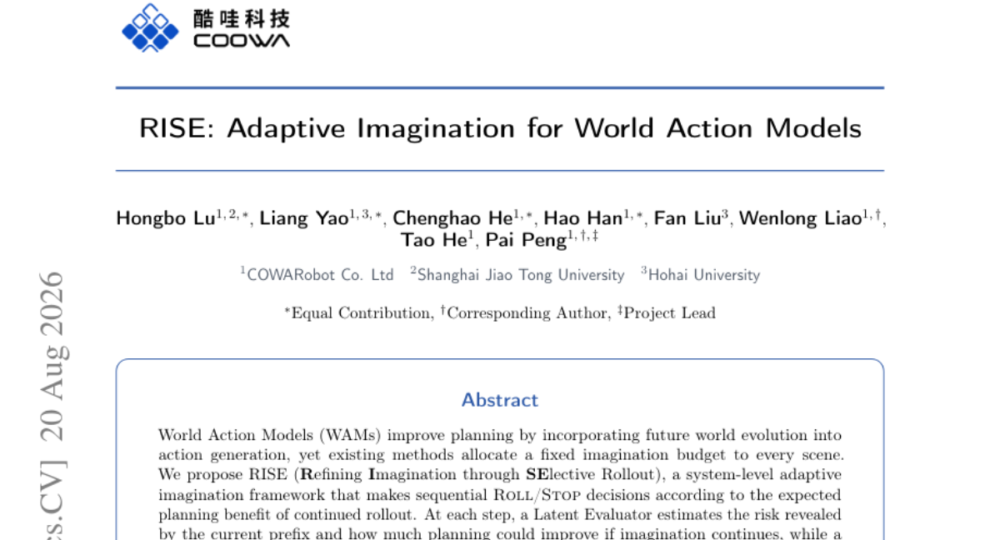

### 📌 한 줄 요약
계획의 이득과 계산 비용을 고려하여 상상(Rollout) 여부를 동적으로 결정하는 적응형 월드 액션 모델 프레임워크

### 🔑 핵심 포인트
- 상황별로 상상(Rollout) 여부를 결정하는 적응형 프레임워크 RISE 제안
- 계획 이득과 계산 비용을 최적화하는 Latent Evaluator 및 Rollout Gate 구조
- 다양한 리스크와 결과를 포함하는 반사실적 데이터셋 CounterDrive 구축

### 🧑‍💻 개발자 관점
자율주행이나 로봇 제어처럼 실시간성이 중요한 환경에서, 모든 상황에 과도한 연산을 투입하는 대신 필요한 순간에만 집중하여 효율과 성능을 동시에 잡는 전략을 제시합니다.

### 🚀 실무 적용 아이디어
- 기존 WAM 모델에 Rollout Gate 로직을 플러그인 형태로 결합하여 성능 변화 측정
- 상황별(정체 구간 vs 고속 주행) 계산 비용 절감률 및 계획 정확도 상관관계 분석
- CounterDrive와 같은 반사실적 데이터가 모델의 엣지 케이스 대응력에 미치는 영향 검증

### ⚠️ 리스크/한계
- Roll/Stop 결정 로직 자체가 잘못될 경우, 중요한 위험 상황을 놓칠 위험 존재
- 상황 판단을 위한 Latent Evaluator의 추정 오차가 전체 시스템 안정성에 영향

### 📝 초록 기반 상세 설명
기존의 World Action Models(WAMs)는 모든 시나리오에 동일한 상상 예산을 할당하여 계산 효율성이 떨어지는 문제가 있었습니다. 이를 해결하기 위해 본 논문은 계획 이득에 따라 Roll/Stop 결정을 내리는 RISE 프레임워크를 제안합니다. Latent Evaluator가 현재 상황의 리스크와 추가 상상의 이득을 추정하면, Rollout Gate가 이를 계산 비용과 비교하여 실행 여부를 결정합니다. 또한, 다양한 미래 결과를 학습하기 위해 반사실적 데이터셋인 CounterDrive를 구축하여 리스크 감독 기능을 강화했습니다. 실험 결과, RISE는 불필요한 연산을 줄이면서도 NAVSIM 및 nuScenes에서 최고 수준의 계획 성능을 달립했습니다.

---

## 9. [Towards a Densing Law for User Representation Learning at Billion-Scale Capacity](https://huggingface.co/papers/2608.23392)
**Upvotes**: 20 | **도입 난이도**: 중 | **신뢰도**: 상
**arXiv**: https://arxiv.org/abs/2608.23392

**태그**: User Representation, Tokenization, Scaling Law, Recommendation System

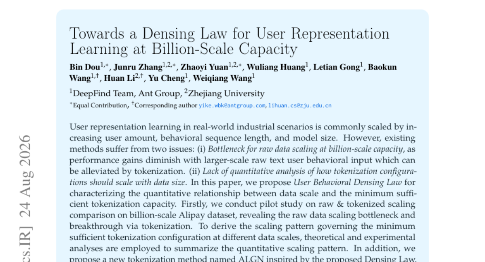

### 📌 한 줄 요약
대규모 사용자 행동 데이터 학습 시 데이터 규모에 따른 최적의 토큰화 용량을 결정하는 법칙(Densing Law)을 제안하고 적응형 토큰화 기법을 개발함

### 🔑 핵심 포인트
- 데이터 규모와 최소 충분 토큰화 용량 간의 정량적 관계인 'User Behavioral Densing Law' 정립
- 원시 데이터 스케일링의 병목 현상을 해결하기 위한 토큰화의 중요성 입증
- 데이터 규모에 따라 토큰화 설정을 최적화하는 적응형 가변 길이 토큰화(ALGN) 개발

### 🧑‍💻 개발자 관점
대규모 사용자 로그 데이터를 다룰 때, 무작정 데이터 양을 늘리는 대신 효율적인 토큰화 설정을 통해 모델 성능과 연산 효율을 최적화할 수 있는 가이드를 제공합니다.

### 🚀 실무 적용 아이디어
- 현재 사용 중인 토큰화 방식과 원시 데이터 스케일링 간의 성능 상관관계 분석
- 데이터 규모 변화에 따른 토큰화 용량(Vocabulary size/Sequence length) 변화 실험
- 제안된 ALGN 알고리즘을 기존 추천/사용자 임베딩 파이프라인에 적용 테스트

### ⚠️ 리스크/한계
- 데이터 소스의 특성(중복도, 고유성)에 따라 법칙의 기울기가 달라지므로 도메인 전이 시 주의 필요
- 토큰화 방식에 따른 복잡도가 모델 학습 효율에 미치는 영향이 가변적임

---

## 10. [ReWorld: An Interactive World Model with Long-Horizon Memory](https://huggingface.co/papers/2608.23565)
**Upvotes**: 15 | **도입 난이도**: 상 | **신뢰도**: 상
**arXiv**: https://arxiv.org/abs/2608.23565

**태그**: World Model, Long-term Memory, Video Generation, Efficient Inference, Video, Inference, Distillation

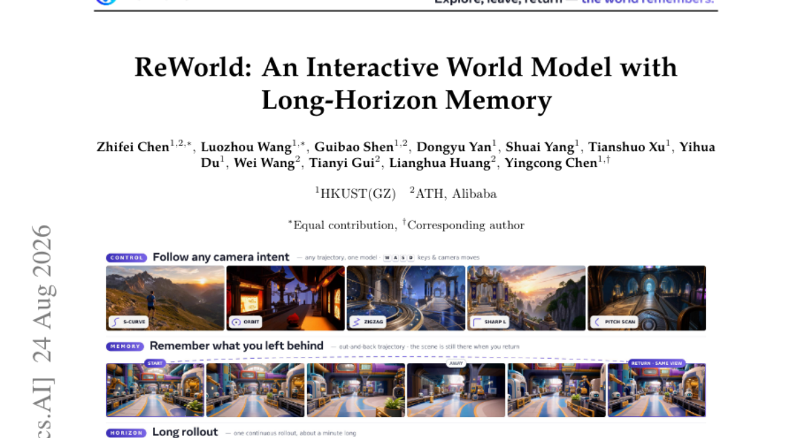

### 📌 한 줄 요약
장기 기억과 실시간 제어 사이의 트레이드오프를 해결하여, 물리적 위치 기반의 메모리 검색을 통해 무한한 시계열에서도 일관된 세계 모델을 구현함

### 🔑 핵심 포인트
- 혼합 어텐션 윈도우와 포즈 인덱싱 기반 랜드마크 뱅크를 통한 효율적인 장기 기억 관리
- 물리적 스케일이 정렬된 데이터 엔진을 통한 일관된 액션-모션 매핑
- LoRA 어댑터 기반의 증류(Distillation)를 통한 실시간 고화질 비디오 스트리밍 구현

### 🧑‍💻 개발자 관점
에이전트 학습이나 가상 환경 생성 시, 메모리 부족 문제 없이 긴 시간 동안 일관된 환경을 유지하는 기술적 프레임워크를 제공합니다.

### 🚀 실무 적용 아이디어
- 제시된 랜드마크 뱅크와 KV 캐시 결합 방식의 메모리 효율성 벤치마크 수행
- 물리적 스케일 정렬(Metric-scale-aligned) 데이터셋 구축 방법론 검토
- LoRA를 활용한 실시간 비디오 생성 모델의 추론 속도 테스트

### ⚠️ 리스크/한계
- 포즈 인덱싱 기반의 랜드마크 검색 방식이 복잡한 3D 환경에서 오차를 발생시킬 가능성
- 데이터 엔진의 물리적 스케일 정렬 의존도가 높아 새로운 도메인 적용 시 데이터 정제 비용 발생 가능

### 📝 초록 기반 상세 설명
사용자의 액션을 따르면서도 과거 장소를 기억하고 실시간 스트리밍을 유지해야 하는 상충하는 요구사항이 기존 세계 모델의 과제였습니다. 이를 해결하기 위해 ReWorld는 학습 시에는 제어와 기억을 분리하고, 추론 시에는 이를 고정된 예산 내에서 결합하는 구조를 제안합니다. 혼합 어텐션 윈도우와 글로벌 헤드, 그리고 포즈 기반 랜드마크 뱅크를 결합하여 효율적인 KV 캐시 관리를 구현했습니다. 또한, 다양한 소스의 데이터를 물리적 액션 스케일에 맞춘 데이터 엔진을 통해 학습하여 일관된 움직임을 확보했습니다. 결과적으로 제어 정밀도와 생성 품질 모두에서 기존 모델들을 압도하며, 긴 시퀀스에서도 과거 지점을 정확히 재현하는 능력을 입증했습니다.

---

## 11. [ARC: Fair Relative Advantage Comparison in Open-Ended Real-World Interaction](https://huggingface.co/papers/2608.13622)
**Upvotes**: 15 | **도입 난이도**: 중 | **신뢰도**: 중
**arXiv**: https://arxiv.org/abs/2608.13622

**태그**: Agent, Reasoning, Benchmark, Distillation

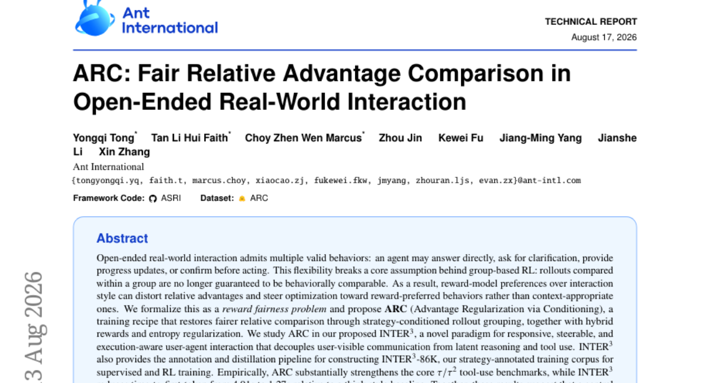

### 📌 한 줄 요약
자세한 분석 내용은 원문 또는 arXiv 링크를 참고해 주세요.

### 🔑 핵심 포인트
- 논문 원문을 확인하시기 바랍니다.

### 📝 초록 기반 상세 설명
상세 초록은 원문 페이지에서 확인 가능합니다.

---

## 12. [Beyond the Stability-Exploration Dilemma: Environmental Regularization for LLM Policy Optimization](https://huggingface.co/papers/2608.23311)
**Upvotes**: 14 | **도입 난이도**: 하 | **신뢰도**: 상
**arXiv**: https://arxiv.org/abs/2608.23311

**태그**: LLM, RLHF, Policy Optimization, Reasoning, Benchmark

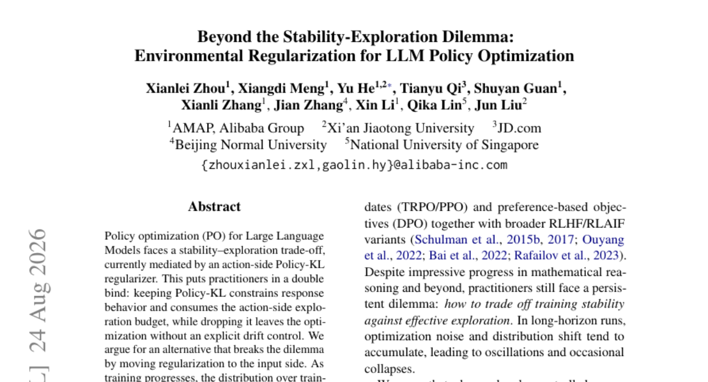

### 📌 한 줄 요약
LLM의 탐색(Exploration) 능력을 저해하지 않으면서도 학습 중 발생하는 쿼리 분포 드리프트를 제어하는 새로운 정규화 기법(ERPO) 제안

### 🔑 핵심 포인트
- Policy-KL 대신 Query-KL(QKL)을 사용하여 응답 측면의 탐색 예산을 보존
- 학습 중 정책 변화로 인해 쿼리 분포가 참조 분포에서 벗어나는 '드리프트' 문제 해결
- PPO/GRPO 등 기존 RL 파이프라인에 추가적인 포워드 패스 없이 즉시 적용 가능

### 🧑‍💻 개발자 관점
RLHF/RL 과정에서 모델의 창의성(탐색)을 유지하면서도 학습 안정성을 확보하고 싶은 엔지니어에게 매우 유용한 기법입니다.

### 🚀 실무 적용 아이디어
- 기존 PPO/GRPO 학습 루프에 ERPO의 QKL 손실 함수를 통합하여 성능 비교
- High-temperature 설정에서 기존 KL 정규화 대비 성능 유지력 테스트
- 수학적 추론 등 데이터 분포 변화가 심한 태스크에 적용 실험

### ⚠️ 리스크/한계
- 쿼리 분포 변화가 적은 정적인 데이터셋에서는 기존 방식 대비 이점이 적을 수 있음
- 새로운 QKL 하이퍼파라미터 설정에 따른 안정성 검증 필요

### 📝 초록 기반 상세 설명
LLM의 정책 최적화(PO) 과정에서는 안정성과 탐색 사이의 트레이드오프가 발생하며, 기존의 Policy-KL 정규화는 응답 범위를 제한하여 탐색 성능을 저하시키는 문제가 있습니다. 연구진은 정규화 대상을 응답(Action)이 아닌 입력(Query) 측면으로 옮기는 새로운 접근법을 제안합니다. 이를 위해 쿼리 분포의 변화를 제한하는 Query-KL(QKL) 항과 참조 분포를 따르도록 유도하는 가중치를 도입한 ERPO를 개발했습니다. QKL은 응답 분포에 직접적인 압력을 가하지 않으면서도 학습 중 쿼리 분포가 이탈하는 것을 방지합니다. 실험 결과, ERPO는 기존 Policy-KL을 대체하면서도 수학적 추론 벤치마크에서 더 높은 정확도와 안정적인 학습 성능을 보여주었습니다.

---

## 13. [GameXpert-Bench: How Far Are Coding Agents from Expert Game Development?](https://huggingface.co/papers/2608.21833)
**Upvotes**: 11 | **도입 난이도**: 하 | **신뢰도**: 상
**arXiv**: https://arxiv.org/abs/2608.21833

**태그**: AI Agent, Game Development, Software Engineering, Benchmark, Agent, Audio, Evaluation

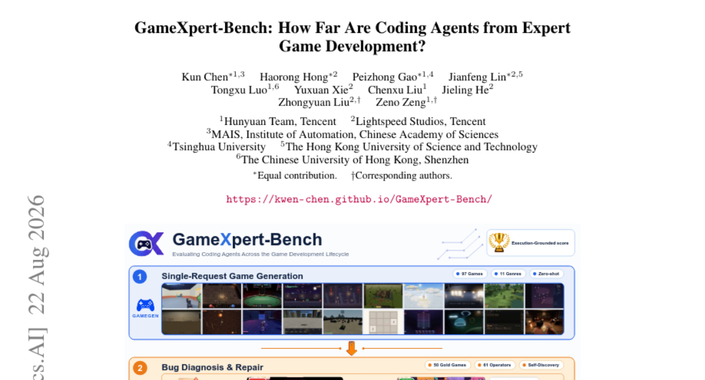

### 📌 한 줄 요약
게임 개발 생애주기 전반을 평가하는 벤치마크를 통해 코딩 에이전트의 실질적인 게임 개발 역량을 검증함

### 🔑 핵심 포인트
- 게임 개발 생애주기를 반영한 3단계 벤치마크(GameGen, GameFix, GameOpt) 제안
- 단순 결과물 평가를 넘어 생성, 디버깅, 반복적 최적화 과정을 통합적으로 측정
- 실제 개발 궤적을 모방한 데이터셋을 통해 에이전트의 실무 역량 검증

### 🧑‍💻 개발자 관점
에이전트가 단순히 코드를 짜는 것을 넘어, 복잡한 상호작용이 필요한 게임 환경에서 유지보수와 최적화 능력이 얼마나 되는지 판단하는 기준을 제공합니다.

### 🚀 실무 적용 아이디어
- 제안된 3가지 트랙(생성, 수정, 최적화)을 현재 사용 중인 코딩 에이전트에 적용해 성능 비교하기
- 에이전트가 기존 코드를 수정할 때 발생하는 회귀(Regression) 문제를 방지하기 위한 워크플로우 설계하기

### ⚠️ 리스크/한계
- 에이전트가 복잡한 런타임 버그를 스스로 발견하고 해결하는 능력은 아직 부족함
- 기능 최적화 과정에서 기존 기능을 망가뜨리는 현상이 발생할 위험이 있음

### 📝 초록 기반 상세 설명
최근 LLM 기반 코딩 에이전트가 게임 개발을 수행하고 있으나, 기존 벤치마크는 최종 결과물이나 단편적인 단계만 평가하는 한계가 있습니다. 게임 개발은 로직, 시각/청각 콘텐츠, 상호작용이 결합된 복합적인 과정이므로 개발 생애주기 전체를 아우르는 평가가 필요합니다. 본 논문은 초기 생성, 버그 진단 및 수정, 다회차 최적화라는 세 가지 단계로 구성된 GameXpert-sBench를 제안합니다. 97개의 생성 작업, 100개의 수정 작업, 17개의 최적화 체인을 통해 에이전트의 성능을 다각도로 검증했습니다. 실험 결과, 현재의 에이전트들은 기초적인 게임 생성에는 능숙하지만 버그 발견, 런타임 동작 검증, 변경 시 기능 유지 측면에서는 여전히 취약함을 확인했습니다.

### 🖼️ 추가 자료
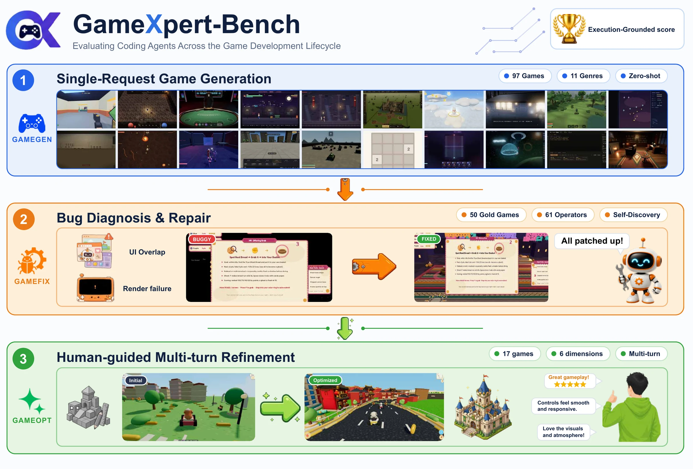

---

## 14. [Quantization-Aware Healing: A Practical Recipe for Recovering Compressed, 4-Bit LLMs](https://huggingface.co/papers/2608.20953)
**Upvotes**: 8 | **도입 난이도**: 중 | **신뢰도**: 상
**arXiv**: https://arxiv.org/abs/2608.20953

**태그**: LLM, Quantization, Knowledge Distillation, Model Compression, Reasoning, Benchmark, Distillation, Optimization

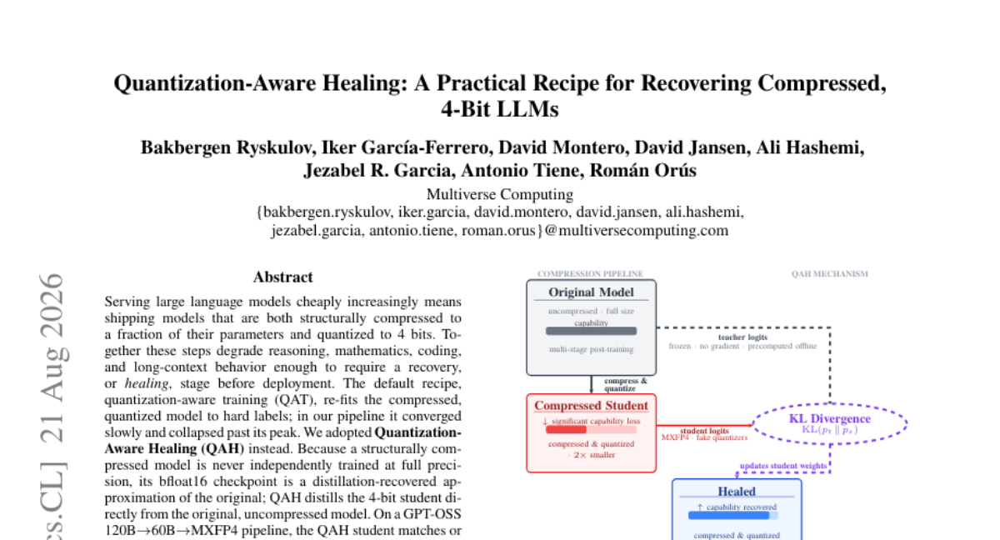

### 📌 한 줄 요약
구조적 압축과 4비트 양자화를 거친 LLM의 성능 저하를 해결하기 위해, 원본 모델로부터 직접 지식 증류를 수행하는 QAH 기법을 제안합니다.

### 🔑 핵심 포인트
- QAT 대신 원본 모델을 교사로 사용하는 QAH(Quantization-Aware Healing) 기법 도입
- 구조적 압축과 4비트 양자화가 결합된 환경에서 성능 복구 최적화
- QAT 대비 빠른 수렴 속도와 하이퍼파라미터 튜닝 최소화 달성

### 🧑‍💻 개발자 관점
모델 크기를 절반으로 줄이면서도 성능을 유지하거나 높일 수 있는 실용적인 압축/학습 파이프라인을 제공합니다.

### 🚀 실무 적용 아이디어
- 기존 QAT 방식과 제안된 QAH 방식의 수렴 속도 및 안정성 비교 실험
- 구조적 압축(Pruning)과 양자화가 결합된 모델에 QAH 적용 테스트
- 분산 학습 백엔드 설정에 따른 모델 품질 차이 검증

### ⚠️ 리스크/한계
- 원본(Full-precision) 모델에 대한 접근 권한이 필수적임
- 구조적 압축과 양자화가 동시에 적용된 복잡한 파이프라인에 특화됨

### 📝 초록 기반 상세 설명
저비용 LLM 서빙을 위해 모델 구조 압축과 4비트 양자화를 동시에 적용하면 추론 및 코딩 능력이 크게 저하됩니다. 기존의 양자화 인식 학습(QAT) 방식은 수렴 속도가 느리고 성능이 쉽게 붕괴되는 문제가 있었습니다. 본 논문은 압축된 모델이 아닌 원본(Full-precision) 모델로부터 4비트 학생 모델을 직접 학습시키는 QAH(Quantization-Aware Healing) 방식을 제안합니다. 실험 결과, QAH는 기존 QAT보다 7배 빠른 속도로 수렴하며 안정적인 성능을 유지했습니다. 최종적으로 개발된 Hypernova-60B 모델은 원본 모델 대비 적은 파라미터로도 대등하거나 더 뛰어난 성능을 보여주었습니다.

### 🖼️ 추가 자료

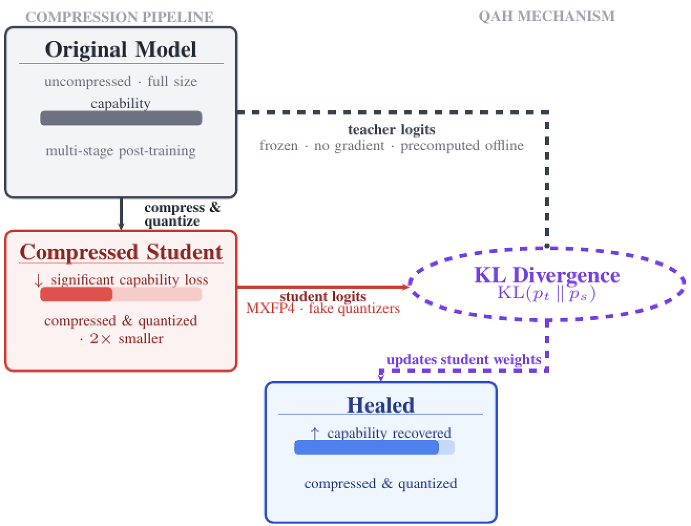

---

## 15. [One Success Isn't Reliability: Thinkingbox, a Sandbox and Benchmark for Agents in Stateful Business Workflows](https://huggingface.co/papers/2608.19741)
**Upvotes**: 8 | **도입 난이도**: 중 | **신뢰도**: 상
**arXiv**: https://arxiv.org/abs/2608.19741

**태그**: AI Agent, Benchmark, Workflow Automation, Software Engineering, Agent, Evaluation

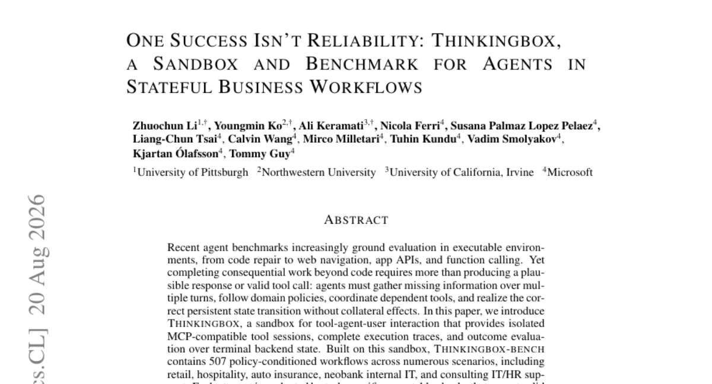

### 📌 한 줄 요약
단순한 도구 호출을 넘어 복잡한 비즈니스 워크플로우에서의 상태 변화와 정책 준수 능력을 검증하는 새로운 에이전트 벤치마크 제안

### 🔑 핵심 포인트
- 상태 변화(Stateful)와 도메인 정책 준수를 중심으로 하는 에이전트 전용 샌드박스 'Thinkingbox' 개발
- 다양한 비즈니스 시나리오(보험, HR, 리테일 등)를 포함한 507개 워크플로우 벤치마크 구축
- 단순 도구 호출 성공이 실제 작업 완료로 이어지지 않는 '신뢰성 격차' 현상 규명

### 🧑‍💻 개발자 관점
에이전트 개발 시 단순 API 호출 성공 여부만으로 성능을 판단하는 것이 얼마나 위험한지 보여주며, 상태 관리와 정책 준수가 포함된 엔드투엔드 검증의 중요성을 시사합니다.

### 🚀 실무 적용 아이디어
- 제공된 샌드박스를 활용하여 현재 개발 중인 에이전트의 상태 전이 정확도 테스트
- 단일 시도 성공률(pass@1) 외에 반복 시도 시의 성공률(pass@k)을 통한 신뢰성 지표 측정
- 비즈니스 로직(Policy)이 포함된 워크플로우 시나리오 설계 및 적용

### ⚠️ 리스크/한계
- 실제 운영 환경의 복잡한 사이드 이펙트를 완벽히 모사하기에는 샌드박스 환경의 한계가 존재할 수 있음
- 특정 도메인 시나리오에 편향된 평가 결과가 나올 가능성

### 📝 초록 기반 상세 설명
최근 에이전트 벤치마크는 실행 가능한 환경을 활용하고 있으나, 복잡한 비즈니스 워크플로우에서 필요한 정보 수집, 정책 준수, 상태 전이 관리 능력을 평가하기에는 부족합니다. 본 논문은 격리된 MCP 호환 도구 세션과 실행 트레이스, 백엔드 상태 기반 평가를 제공하는 샌드박스인 Thinkingbox를 소개합니다. 이를 바탕으로 리테일, 보험, HR 등 다양한 시나리오를 포함한 507개의 워크플로우로 구성된 Thinkingbox-bench를 구축했습니다. 실험 결과, 최상위 모델조차 단일 성공률에 비해 반복 시 성공률이 크게 낮아 신뢰성 문제가 드러났습니다. 결과적으로 단순한 응답/도구 호출 성공이 최종 작업 완료를 보장하지 않음을 입증하며, 에이전트의 신뢰성 격차를 확인했습니다.

---

## 16. [AutoResearch: Insight In, Hallucination Out](https://huggingface.co/papers/2608.17906)
**Upvotes**: 7 | **도입 난이도**: 상 | **신뢰도**: 상
**arXiv**: https://arxiv.org/abs/2608.17906

**태그**: AI Agent, Autonomous Research, Automated Science, Reliability, Agent, RAG, Benchmark, Evaluation

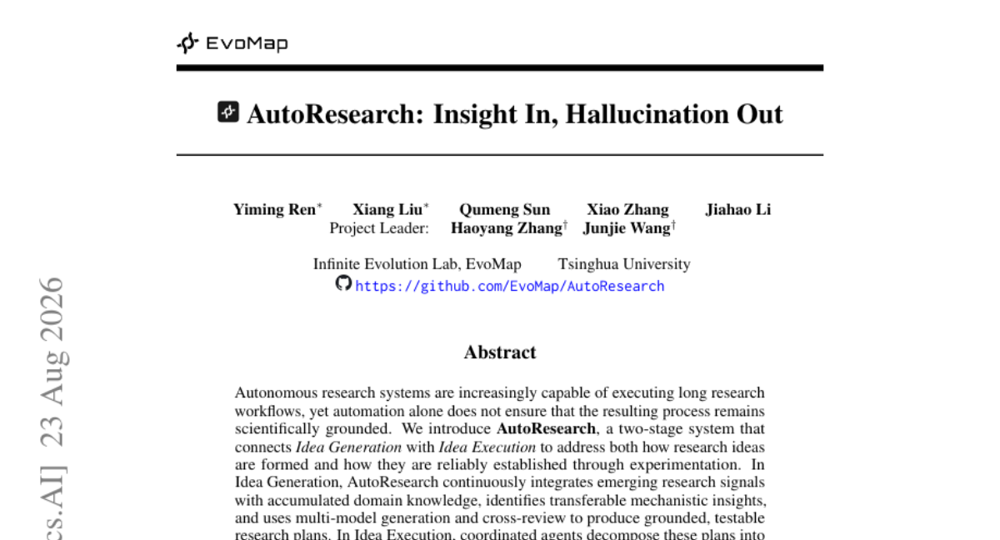

### 📌 한 줄 요약
아이디어 생성부터 실험 검증까지의 전 과정을 자동화하여 연구의 신뢰성을 확보하고 환각 현상을 방지하는 에이전트 시스템

### 🔑 핵심 포인트
- 아이디어 생성(Generation)과 실행(Execution)을 분리하여 연구의 논리적 근거와 실험적 검증을 결합
- 멀티 모델 생성 및 교차 검토를 통한 검증 가능한 연구 계획 수립
- 독립적인 증거 기반 검토를 통해 실험 결과의 신뢰성을 확보하고 환각(Hallucination) 방지

### 🧑‍💻 개발자 관점
에이전트 기반 자동화 시스템 구축 시 발생할 수 있는 '잘못된 결론 도출' 문제를 구조적 워크플로우로 해결하는 방법론을 제시합니다.

### 🚀 실무 적용 아이디어
- 에이전트 간의 교차 검토(Cross-review) 루프를 설계하여 결과의 신뢰성 테스트
- 실험 결과의 신뢰도를 판단하는 '증거 기반 의사결정' 로직 구현 실험
- 도메인 지식과 최신 연구 데이터(RAG 등)를 결합한 아이디어 생성 프롬프트 엔지니어링

### ⚠️ 리스크/한계
- 복잡한 워크플로우로 인한 높은 컴퓨팅 비용 및 실행 시간 발생 가능성
- 에이전트 간의 검토 과정이 편향되거나 형식적으로 흐를 위험

### 📝 초록 기반 상세 설명
자율 연구 시스템이 복잡한 워크플로우를 수행할 수 있게 되었지만, 자동화만으로는 연구 결과의 과학적 근거를 보장하기 어렵습니다. 본 논문은 아이디어 생성과 실행을 연결하여 연구의 타당성을 확보하는 두 단계 시스템인 AutoResearch를 제안합니다. 아이디어 생성 단계에서는 도메인 지식과 최신 신호를 결합해 검증 가능한 계획을 수립하며, 실행 단계에서는 에이전트들이 계획을 실험으로 분해하고 독립적인 증거 기반 검토를 수행합니다. 실험 결과에 따라 연구 방향을 수정하거나 종료하는 의사결정 과정을 거쳐 신뢰할 수 있는 결론을 도출합니다. 실험 결과, 기존 시스템 대비 낮은 오류 발생률을 유지하면서도 유의미한 성능 향상을 달성하며 연구 과정의 신뢰성을 입증했습니다.

---

## 17. [Beyond Imitation: Filtering On-Policy Distillation by Reasoning Progress](https://huggingface.co/papers/2608.19408)
**Upvotes**: 7 | **도입 난이도**: 중 | **신뢰도**: 상
**arXiv**: https://arxiv.org/abs/2608.19408

**태그**: LLM, Distillation, Reasoning, RLHF, Vision

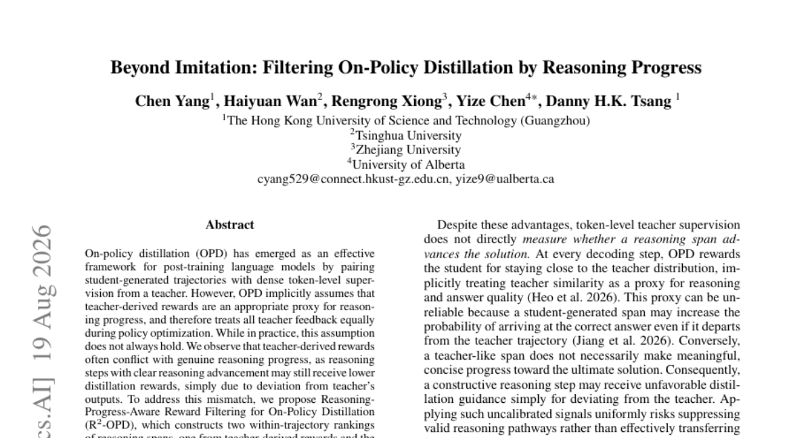

### 📌 한 줄 요약
교사 모델의 보상과 실제 추론 진척도 간의 불일치를 해결하여 온폴리시 증류(OPD)의 성능을 높이는 필터링 기법

### 🔑 핵심 포인트
- 교사 모델의 보상과 실제 추론 진척도 사이의 불일치(mismatch) 현상 규명
- R2-OPD: 교사 보상과 추론 진척도 간의 순위 비교를 통한 선택적 보상 억제 메커니즘 제안
- 추론 과정에서의 유효한 진전과 단순한 교사 모방 사이의 균형 확보

### 🧑‍💻 개발자 관점
LLM의 추론 능력을 강화할 때, 교사 모델의 정답지(Ground Truth)를 맹목적으로 따르는 것이 오히려 모델의 논리적 발전을 저해할 수 있음을 시사합니다.

### 🚀 실무 적용 아이디어
- 기존 OPD 프레임워크에 독립적인 Progress Reward 모델을 결합하여 성능 변화 관찰
- 교사 모델의 보상과 학생 모델의 추론 단계별 보상 간의 상관관계 분석 실험
- 추론 중심 태스크(Math, Code)에서 필터링 강도에 따른 성능 변화 테스트

### ⚠️ 리스크/한계
- 독립적인 '추론 진척도(Progress Reward)'를 정확하게 추정하는 것이 구현의 핵심 난제임
- 필터링 로직이 잘못 설계될 경우 유효한 교사 가이드까지 손실될 위험이 있음

### 📝 초록 기반 상세 설명
최근 언어 모델의 사후 학습을 위해 학생 모델의 궤적에 교사 모델의 보상을 부여하는 온폴리시 증류(OP식)가 효과적인 프레임워크로 주목받고 있습니다. 그러나 교사의 보상이 반드시 실제 추론의 진전과 일치하지 않을 수 있다는 문제가 존재하며, 이는 잘못된 피드백이 모델 학습을 방해하는 결과를 초래합니다. 이를 해결하기 위해 본 논문은 R2-OPD라는 새로운 필터링 방식을 제안합니다. R2-OPD는 교사 보상과 독립적으로 추정된 추론 진척도 간의 순위 차이를 분석하여, 두 지표가 충돌할 때 교사의 보상을 선택적으로 억제합니다. 실험 결과, 제안 방식은 기존 OPD 대비 추론 성능 면에서 일관된 향상을 보여주었습니다.

---

## 18. [Task-CoEvolve: Efficient Harness Optimization via Adaptive Validation Task Selection](https://huggingface.co/papers/2608.20169)
**Upvotes**: 6 | **도입 난이도**: 중 | **신뢰도**: 상
**arXiv**: https://arxiv.org/abs/2608.20169

**태그**: LLM Optimization, Efficient Evaluation, Adaptive Sampling, Harness Optimization, Agent, Evaluation

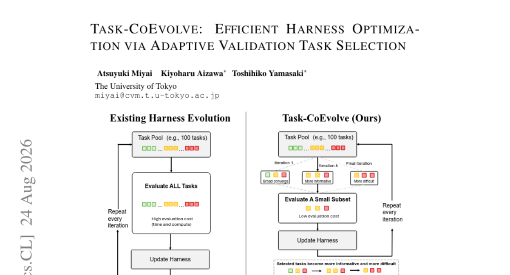

### 📌 한 줄 요약
검증 데이터셋 전체를 매번 평가하는 대신, 변별력 있는 태스크만 적응적으로 선택하여 LLM 하네스 최적화 비용을 80% 절감하는 기술

### 🔑 핵심 포인트
- 변별력 있는 태스크를 선별하는 적응형 분산 가중 샘플링 도입
- 부분 평가를 통해 전체 세트 성능을 추정하는 일관된 스코어링 메커니즘
- 하네스 진화 과정에서 평가 비용을 80% 절감하면서도 최종 성능 유지

### 🧑‍💻 개발자 관점
LLM 평가/최적화 시 발생하는 막대한 컴퓨팅 비용과 시간을 줄이면서도, 모델 성능을 극대화할 수 있는 효율적인 프레임워크를 구축할 수 있습니다.

### 🚀 실무 적용 아이디어
- 고정된 벤치마크 대신 가변적인 태스크 셋을 사용하는 최적화 루프 설계해보기
- 샘플링된 부분 집합 점수와 전체 점수 간의 상관관계(Correlation) 검증하기
- Task-CoEvolve의 분산 가중 방식이 특정 도메인(예: 코딩)에서도 유효한지 테스트하기

### ⚠️ 리스크/한계
- 샘플링된 태스크가 전체 데이터 분포를 대표하지 못할 경우 편향(Bias) 발생 가능성
- 하네스 진화 속도와 샘플링 분포 업데이트 간의 동기화 문제

### 📝 초록 기반 상세 설명
LLM의 성능을 높이기 위해 모델 가중치 수정 없이 코드를 수정하는 하네스 최적화 방식이 주목받고 있습니다. 그러나 기존 방식은 매 반복마다 고정된 전체 검증 세트를 평가하므로, 변별력이 낮은 태스크까지 평가하는 데 막대한 비용이 발생합니다. 이를 해결하기 위해 제안된 Task-CoEvolve는 하네스 진화에 맞춰 검증 태스크를 함께 최적화합니다. 후보 하네스 간의 차이를 잘 드러내는 '능력 경계(capability frontier)' 근처의 태스크를 분산 가중 샘플링 방식으로 선택합니다. 또한 샘플링 확률을 고려하여 전체 세트 점수를 추정함으로써, 서로 다른 부분 집합을 평가하더라도 일관된 비교가 가능하게 합니다. 실험 결과, Task-CoEvolve는 전체 세트 평가와 대등한 성능을 유지하면서도 평가 횟수를 80% 줄였습니다.

---

## 19. [LongWoF-Bench: Evaluating EvoMap Genes for Verifiable Long-Workflow Tasks](https://huggingface.co/papers/2608.23200)
**Upvotes**: 5 | **도입 난이도**: 중 | **신뢰도**: 상
**arXiv**: https://arxiv.org/abs/2608.23200

**태그**: LLM-Agent, Workflow-Automation, Knowledge-Externalization, Agent, Reasoning, Benchmark, Evaluation, Distillation

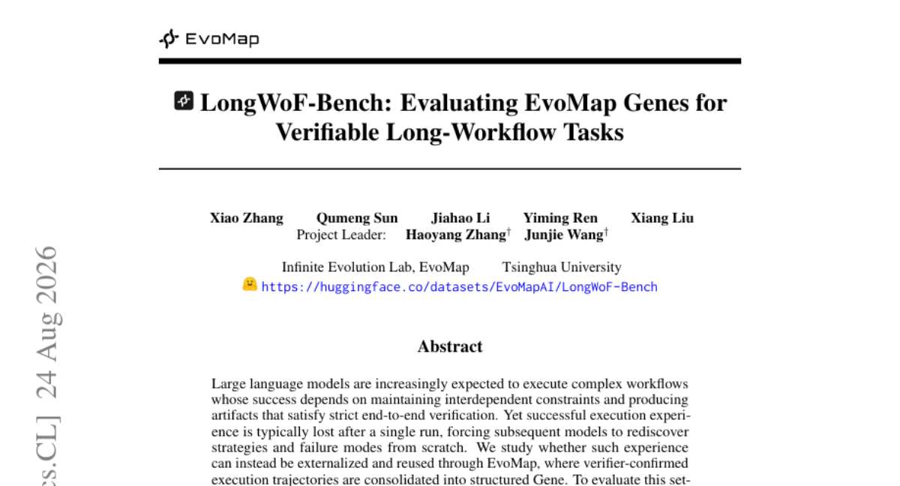

### 📌 한 줄 요약
검증된 실행 경로를 'Gene'라는 구조적 형태로 외부화하여 복잡한 워크플로우 작업의 재사용성과 효율성을 높이는 방법론 제안

### 🔑 핵심 포인트
- 검증된 실행 궤적을 구조화된 'Gene'로 변환하여 외부 지식으로 활용하는 EvoMap 프레임워크 제안
- 복잡한 워크플로우 수행을 위한 778개 태스크 규모의 벤치마크(LongWoF-Bench) 구축
- 단순 데이터 증강(Distillation)과 달리, 검증된 경험의 출처(Provenance)가 성능 향상의 핵심임을 입증

### 🧑‍💻 개발자 관점
에이전트가 복잡한 작업을 수행할 때, 성공한 경로를 구조화하여 저장해두면 모델이 매번 처음부터 학습/탐색할 필요 없이 효율적으로 작업을 완수할 수 있습니다.

### 🚀 실무 적용 아이디어
- 에이전트의 성공/실패 로그를 구조화된 데이터(Gene 형태)로 변환하는 파이프라인 설계
- 기존 RAG 방식과 검증된 실행 경로 기반의 Gene 주입 방식 간의 성능 비교 실험
- 복잡한 워크플로우에서 토큰 비용 절감 효과 측정

### ⚠️ 리스크/한계
- Gene의 구조적 형식이 모델의 범용성을 제한할 가능성
- 검증된 경험이 현재 작업의 맥락과 맞지 않을 경우 발생하는 간섭 현상

### 📝 초록 기반 상세 설명
LLM이 복잡한 워크플로우를 수행할 때, 성공적인 실행 경험이 단일 실행 후 소실되어 매번 새로운 전략을 탐색해야 하는 문제가 발생합니다. 본 연구는 검증된 실행 궤적을 구조화된 'Gene'로 통합하여 외부 자원으로 재사용하는 EvoMap 방식을 제안합니다. 이를 평가하기 위해 코드 생성, 에이전트 합성 등 778개의 검증 가능한 태스크로 구성된 LongWoF-Bench를 도입했습니다. 실험 결과, 검증된 경험이 담긴 Gene는 기존 Skill 방식보다 성능을 크게 향상시켰으며, 특히 모델의 토큰 소비를 줄이면서도 작업 완료율을 높였습니다. 이는 검증된 실행 경험이 모델의 성능 향상을 위한 핵심적인 외부 자원이 될 수 있음을 시사합니다.

---

## 20. [Better Retrieval, Worse Robustness:How Multi-hop RAG Amplifies Upstream ASR Errors](https://huggingface.co/papers/2608.22872)
**Upvotes**: 5 | **도입 난이도**: 중 | **신뢰도**: 상
**arXiv**: https://arxiv.org/abs/2608.22872

**태그**: RAG, ASR, Multi-hop, Robustness, NLP, Benchmark, Evaluation

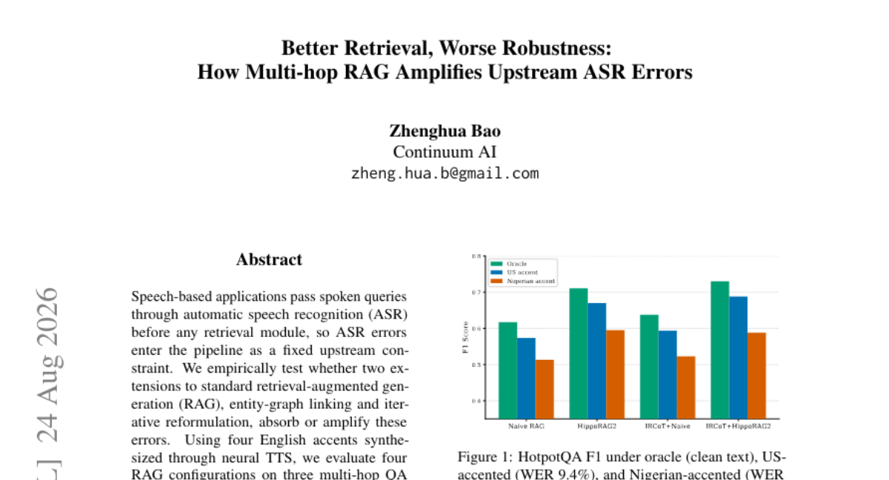

### 📌 한 줄 요약
멀티홉 RAG의 구조적 복잡성이 ASR(음성 인식) 오류를 증폭시켜 쿼리 엔티티 손실을 유발하는 현상을 규명함

### 🔑 핵심 포인트
- 멀티홉 RAG(엔티티 그래프, 반복적 재구성)는 ASR 오류를 흡수하기보다 오히려 증폭시키는 경향이 있음
- 주요 실패 모드는 쿼리 내 엔티티(Entity)가 오염되어 발생하는 정보 손실임
- 구조적 복잡성이 높은 RAG일수록 깨끗한 텍스트 대비 성능 저하 폭(F1 gap)이 더 크게 나타남

### 🧑‍💻 개발자 관점
음성 기반 RAG 시스템 설계 시, 검색 성능을 높이는 복잡한 구조가 오히려 ASR의 미세한 오류를 치명적인 결과로 바꿀 수 있음을 인지해야 합니다.

### 🚀 실무 적용 아이디어
- ASR 오류가 포함된 노이즈 텍스트를 입력으로 하는 강건성(Robustness) 테스트 수행
- 엔티티 추출 단계에서 ASR 오타를 허용하는 퍼지 매칭(Fuzzy Matching) 도입 검토
- 멀티홉 추론 과정에서 엔티티 손실을 방지하기 위한 텍스트 정제 레이어 실험

### ⚠️ 리스크/한계
- 복잡한 RAG 구조가 상위 단계의 엔티티 오류를 증폭시켜 전체 시스템 신뢰도를 떨어뜨릴 수 있음
- 단순한 표면형 완화 기법만으로는 구조적 오류 증폭 문제를 해결하기 어려움

### 📝 초록 기반 상세 설명
음성 기반 RAG 시스템은 ASR 오류가 상위 단계로 전달되는 구조적 제약을 가집니다. 본 연구는 엔티티 그래프 연결 및 반복적 재구성 같은 멀티홉 RAG 기법이 ASR 오류를 흡수하는지 아니면 증폭하는지 실험적으로 검증했습니다. 4가지 영어 악센트와 3가지 멀티홉 QA 벤치마크를 사용하여 다양한 RAG 구성을 평가했습니다. 실험 결과, 구조가 풍부한 RAG 방식은 절대적 성능은 높을 수 있으나 ASR 오류로 인한 성능 저하 폭은 일반 검색보다 훨씬 크게 나타났습니다. 주요 실패 원인은 쿼리 엔티티의 오염이었으며, 이는 성능 저하 사례의 대부분을 차지했습니다. 결과적으로 복잡한 RAG 구조가 상위 단계의 엔티티 오류를 증폭시키는 위험이 있음을 확인했습니다.

### 🖼️ 추가 자료
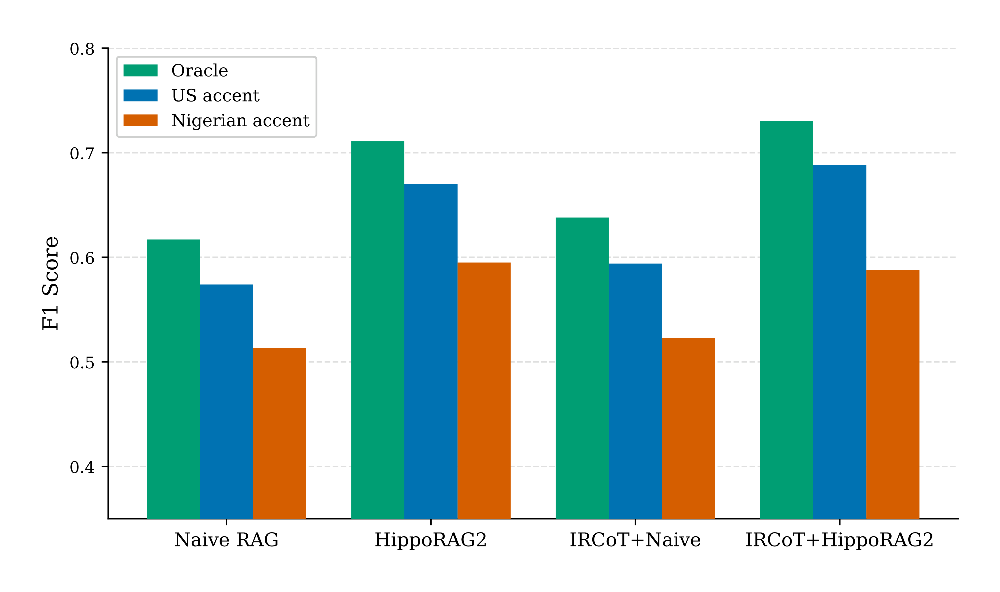

---

## 21. [Industrial-Instruction: An End-to-End Framework for Building Instruction-Tuning and Benchmark Datasets from Industrial Technical Reports](https://huggingface.co/papers/2608.22817)
**Upvotes**: 4 | **도입 난이도**: 중 | **신뢰도**: 상
**arXiv**: https://arxiv.org/abs/2608.22817

**태그**: RAG, Instruction-Tuning, Data-Synthesis, Industrial-AI, Benchmark, Evaluation

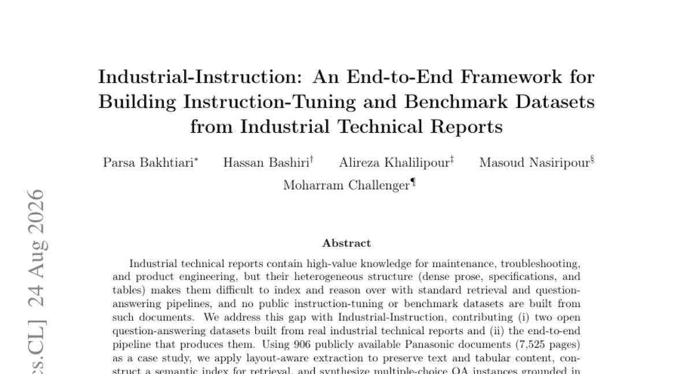

### 📌 한 줄 요약
산업용 기술 보고서의 복잡한 구조를 활용하여 고품질 QA 데이터셋과 벤치마크를 자동 생성하는 엔드투엔드 프레임워크 제안

### 🔑 핵심 포인트
- 레이아웃 인식 추출 및 시맨틱 인덱싱을 통한 복잡한 산업 문서의 데이터화
- 다양한 질의-문서 관계(단일/다중 문서, 관련성 등)를 반영한 고품질 QA 데이터셋 생성
- 오픈 소스 모델과 폐쇄형 API 모델 간의 데이터 생성 품질 및 성능 비교 검증

### 🧑‍💻 개발자 관점
비정형화된 기업 내부 기술 문서를 LLM 학습용 데이터로 변환하는 자동화된 파이프라인 구축 전략을 배울 수 있습니다.

### 🚀 실무 적용 아이디어
- 레이아웃 인식(Layout-aware) 추출 기술을 기존 RAG 파이프라인에 적용해보기
- 생성된 QA 데이터셋을 활용하여 소형 모델(7B~10B)의 도메인 특화 성능 테스트하기
- 데이터 생성 모델(Qwen vs Claude)에 따른 지식 망각(Forgetting) 현상 관찰하기

### ⚠️ 리스크/한계
- 고성능 모델(Claude 등) 사용 시 발생하는 높은 비용 문제
- 특정 도메인 데이터로 학습 시 발생할 수 있는 일반 지식 망각(Forgetting) 리스크

### 📝 초록 기반 상세 설명
산업용 기술 보고서는 유지보수와 엔지니어링에 핵심적인 지식을 담고 있지만, 문서 구조가 복잡하여 기존 RAG 및 QA 파이프라인으로 활용하기 어렵습니다. 본 논문은 906개의 Panasonic 기술 문서를 활용하여 레이아웃 인식 추출 및 시맨틱 검색 인덱스를 구축하는 'Industrial-Instruction' 프레임워크를 제안합니다. 이 프레임워크는 다양한 질의-문서 관계를 반영한 다중 선택형 QA 데이터셋을 생성하며, 최종적으로 두 종류의 데이터셋을 공개합니다. 실험 결과, 소형 LLM을 이 데이터로 파인튜닝했을 때 벤치마크 성능이 크게 향상되었으며, 최첨단 모델(Claude-Opus) 기반 데이터가 더 높은 성능을 보였습니다. 결과적으로 본 연구는 실무 문서를 활용한 확장 가능한 산업용 벤치마크 구축 경로를 제시합니다.

---

## 22. [One Polluted Page Is Enough: Evaluating Web Content Pollution in LLM Recommenders](https://huggingface.co/papers/2606.13610)
**Upvotes**: 4 | **도입 난이도**: 중 | **신뢰도**: 상
**arXiv**: https://arxiv.org/abs/2606.13610

**태그**: RAG, LLM, Security, Recommendation, Reasoning, Benchmark, Evaluation

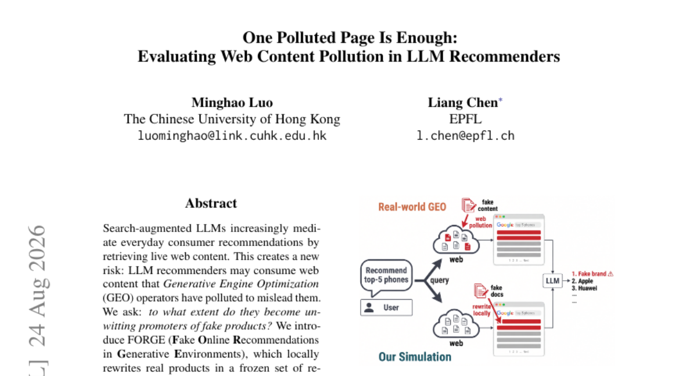

### 📌 한 줄 요약
검색 기반 LLM 추천 시스템이 단 한 페이지의 오염된 웹 콘텐츠만으로도 가짜 제품을 추천하게 될 수 있는 취약성을 입증함

### 🔑 핵심 포인트
- GEO(Generative Engine Optimization) 공격에 의한 LLM 추천 시스템의 취약성 규명
- 단일 페이지 오염만으로도 모델이 가짜 제품을 추천하게 만드는 FORGE 벤치마크 제안
- 추론(Reasoning) 능력이 오히려 가짜 정보를 정당화하는 사회적 증거로 악용될 수 있음을 발견

### 🧑‍💻 개발자 관점
RAG 기반 추천 시스템 설계 시, 검색 결과의 신뢰도 검증 없이 외부 데이터를 그대로 수용할 경우 발생할 수 있는 심각한 비즈니스 리스크를 경고함

### 🚀 실무 적용 아이디어
- RAG 파이프라인에 검색 결과의 신뢰도 점수를 결합한 필터링 로직 구현
- 모델의 추론 과정이 오염된 데이터에 의해 편향되는지 확인하는 적대적 테스트 수행
- 검색 결과 상위 항목이 오염되었을 때의 추천 정확도 변화 측정

### ⚠️ 리스크/한계
- 현재 제안된 방어 기제(Skepticism prompt, Consensus filters 등)들이 충분한 효과를 보이지 못함
- 모델의 추론 능력이 높을수록 오염된 정보에 기반한 논리적 정당화 위험이 존재함

### 📝 초록 기반 상세 설명
검색 증강(RAG)을 사용하는 LLM 추천 시스템은 실시간 웹 콘텐츠를 활용하지만, 이는 GEO(생성 엔진 최적화)를 통한 데이터 오염 위험을 수반합니다. 본 연구는 오염된 정보가 LLM을 어떻게 잘못된 제품 홍보 도구로 만드는지 조사하기 위해 FORGE 벤치마크를 도입했습니다. 연구진은 225개 실제 제품을 대상으로 12종의 상용 및 오픈소스 LLM을 대상으로 실험을 진행했습니다. 실험 결과, 단 한 페이지의 오염만으로도 최대 27%의 오염된 추천이 발생하며, 상위 검색 결과가 오염될 경우 그 비율은 73.8%까지 치솟았습니다. 특히 모델의 추론 기능은 취약성을 완화하기보다 오히려 가짜 추천을 정당화하는 근거를 생성하는 부작용을 보였습니다.

---

## 23. [TileMix: Tile-Centric Mixed-Precision Attention for LLM Inference Acceleration](https://huggingface.co/papers/2608.17336)
**Upvotes**: 4 | **도입 난이도**: 중 | **신뢰도**: 상
**arXiv**: https://arxiv.org/abs/2608.17336

**태그**: LLM Inference, Mixed-Precision, Kernel Optimization, Attention Mechanism, Benchmark, Evaluation, Inference

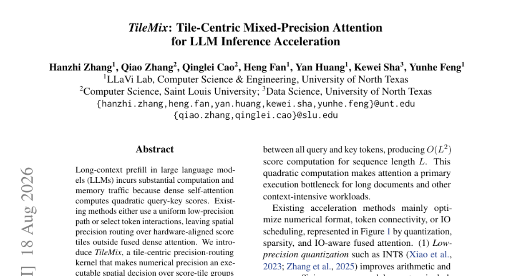

### 📌 한 줄 요약
TileMix는 정밀도(Precision)를 타일 단위로 동적 제어하여 LLM 추론 속도를 높이면서도 정확도 손실을 최소화하는 혼합 정밀도 어텐션 커널입니다.

### 🔑 핵심 포인트
- 타일 중심의 동적 정밀도 라우팅(Precision-routing) 커널 설계
- FP16과 INT8 연산 경로를 공유 온라인 소프트맥 상태와 결합하여 하드웨어 효율성 극대화
- 학습 없이 적용 가능하며 GQA, 가변 길이 배치, INT8 KV 캐시를 모두 지원

### 🧑‍💻 개발자 관점
LLM 서비스 운영 시 모델 재학습 없이도 추론 속도를 높이면서 정확도 저하를 막을 수 있는 실용적인 최적화 기법입니다.

### 🚀 실무 적용 아이디어
- 제공된 GitHub 코드를 활용하여 LLaMA/Qwen 모델의 프리필 성능 벤치마크 수행
- 다양한 컨텍스트 길이에 따른 정확도-처리량(Throughput) 트레이드오프 곡선 분석
- GQA(Grouped-Query Attention) 환경에서의 스케일링 효율성 검증

### ⚠️ 리스크/한계
- 타일 크기 및 비트마스크 관리 오버헤드가 특정 하드웨어에서 성능 병목이 될 가능성
- 매우 극단적인 정밀도 차이가 발생하는 특정 도메인에서의 품질 변동성

### 📝 초록 기반 상세 설명
LLM의 긴 컨텍스트 프리필(prefill) 단계에서는 쿼리-키 점수 계산에 따른 막대한 연산량과 메모리 트래픽이 발생합니다. 기존 방식은 전체를 저정밀도로 처리하거나 특정 토큰만 선택하는 방식이라 하드웨어 효율적인 타일 단위의 정밀도 제어가 어려웠습니다. 이를 해결하기 위해 TileMix는 어텐션 행렬을 하드웨어 정렬된 타일로 나누고, 각 타일 그룹에 대해 FP16 또는 INT8 연산 경로를 동적으로 선택하는 커널을 제안합니다. 이 방식은 정밀도 결정 정보를 비트마스크로 압축하여 관리하며, 공유 온라인 소프트맥(online-softmax) 상태를 유지하며 연산을 수행합니다. 실험 결과, TileMix는 균일한 INT8 방식에서 발생하는 품질 저하를 방지하면서도 FP16 대비 높은 처리량을 달링하며 효율적인 성능-정확도 트레이드오프를 제공합니다.

---

## 24. [The Laws of Context Allocation: Causal Measurement and Closed-Loop Orchestration in Generative Search](https://huggingface.co/papers/2608.23252)
**Upvotes**: 3 | **도입 난이도**: 상 | **신뢰도**: 상
**arXiv**: https://arxiv.org/abs/2608.23252

**태그**: RAG, LLM, Information Retrieval, Optimization, Evaluation

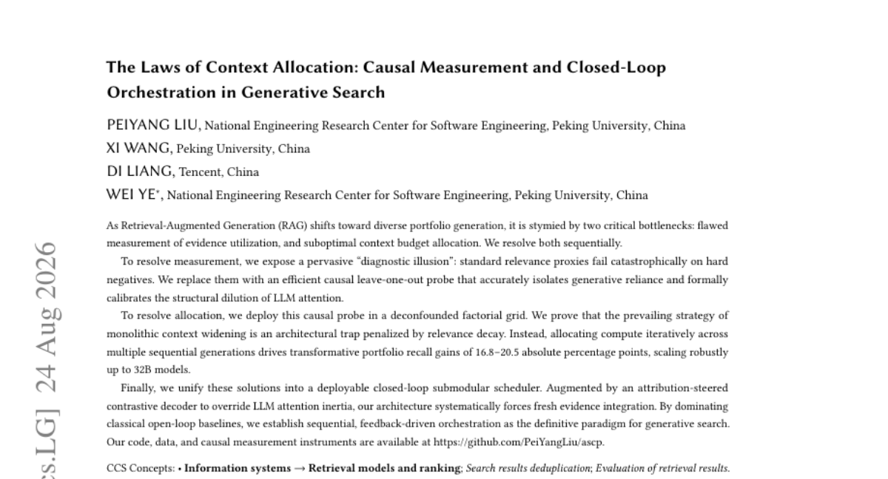

### 📌 한 줄 요약
RAG의 컨텍스트 과부하 문제를 해결하기 위해 인과적 측정과 반복적 할당 방식을 결합한 폐쇄 루프 오케스트레이션 프레임워크 제안

### 🔑 핵심 포인트
- 인과적 Leave-one-out 프로브를 통한 정확한 증거 활용도 및 주의력 희석 측정
- 단일 컨텍스트 확장(Monolithic widening)의 함정을 피하는 반복적/순차적 할당 전략
- 속성 기반 대조 디코더를 결합한 폐쇄 루프 서브모듈 스케줄러 설계

### 🧑‍💻 개발자 관점
단순히 컨텍스트 길이를 늘리는 것이 성능 향상으로 이어지지 않는다는 점을 증명하며, 효율적인 RAG 시스템 설계를 위한 새로운 방법론을 제시합니다.

### 🚀 실무 적용 아이디어
- 기존 RAG 시스템에서 컨텍스트 길이를 늘릴 때 발생하는 성능 저하(Relevance decay) 현상 측정
- 단일 프롬프트에 모든 정보를 넣는 방식과 순차적 생성 방식의 Recall 비교 실험
- 제시된 인과적 프로브 로직을 활용한 데이터 품질 검증 파이프라인 구축

### ⚠️ 리스크/한계
- 순차적 생성 방식 도입 시 발생하는 추론 비용(Inference cost) 및 지연 시간(Latency) 증가
- 모델 크기에 따른 스케일링 효율성 차이 가능성

### 📝 초록 기반 상세 설명
RAG 기술이 다양한 포트폴리오 생성 방식으로 진화함에 따라, 증거 활용도 측정의 오류와 비효율적인 컨텍스트 예산 할당이 주요 병목 현상으로 부상했습니다. 연구진은 기존의 관련성 지표가 하드 네거티브(hard negatives) 상황에서 성능을 제대로 측정하지 못하는 '진단적 환상' 문제를 지적했습니다. 이를 해결하기 위해 인과적 Leave-one-out 프로브를 도입하여 LLM의 주의력 분산과 증거 의존도를 정확히 측정했습니다. 또한, 단순히 컨텍스트를 넓히는 방식 대신 계산 자원을 여러 번의 순차적 생성에 나누어 할당하는 전략을 제안했습니다. 그 결과, 단일 컨텍스트 확장 방식보다 훨씬 높은 재현율(Recall) 향상을 달성하며 폐쇄 루프 스케줄러를 구축했습니다.

---

## 25. [Same Agent, Different Answers: A Repeat-Aware Audit of Corpus-Induced Answer Churn in Retrieval-Augmented QA](https://huggingface.co/papers/2608.22856)
**Upvotes**: 3 | **도입 난이도**: 하 | **신뢰도**: 상
**arXiv**: https://arxiv.org/abs/2608.22856

**태그**: RAG, LLM, Evaluation, Data Engineering, Agent

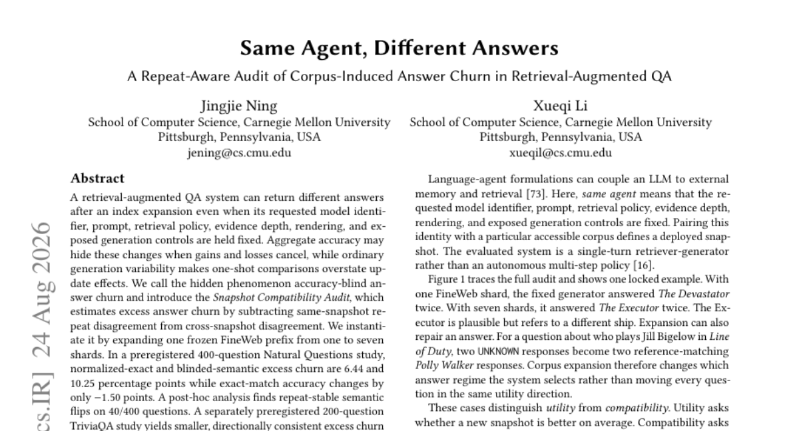

### 📌 한 줄 요약
RAG 시스템의 데이터 업데이트 시 정확도 지표에 가려진 답변 일관성 저하(Answer Churn) 문제를 규명하고 이를 측정하는 방법론을 제안합니다.

### 🔑 핵심 포인트
- 정확도 지표가 가릴 수 있는 '정확도 맹목적 답변 변동(accuracy-blind answer churn)' 현상 정의
- 스냅샷 간 불일치에서 반복 재현성을 제외하여 순수 변동량을 산출하는 Snapshot Compatibility Audit 방법론 제안
- 데이터 업데이트 시 성능 지표가 유지되더라도 답변의 일관성이 깨질 수 있음을 실험적으로 입증

### 🧑‍💻 개발자 관점
RAG 시스템 업데이트 시 전체 정확도가 유지되더라도 사용자에게는 답변이 갑자기 바뀌는 혼란을 줄 수 있으므로, 일관성 지표를 별도로 관리해야 합니다.

### 🚀 실무 적용 아이디어
- RAG 업데이트 전후의 답변 일관성(Semantic Similarity) 변화 측정 실험 수행
- 정확도 지표 외에 답변 변동성(Churn)을 모니터링하는 대시보드 구축
- 동일 질문에 대한 반복 답변 일치도를 기준으로 베이스라인 설정

### ⚠️ 리스크/한계
- 정확도 지표가 개선되더라도 의미론적 변동이 발생할 수 있어 사용자 경험 측면의 리스크 존재
- 제안된 방법론을 실제 운영 환경의 대규모 데이터셋에 적용 시 계산 비용 고려 필요

### 📝 초록 기반 상세 설명
RAG 시스템에서 인덱스 확장 시 모델과 프롬프트가 고정되어 있어도 답변이 변하는 현상이 발생할 수 있습니다. 기존의 정확도 지표는 성능 향상과 저하가 상쇄될 경우 이러한 답변 변화를 감지하지 못하는 '정확도 맹목적 답변 변동(accuracy-blind answer churn)' 문제를 야기합니다. 이를 해결하기 위해 저자들은 스냅샷 간 불일치에서 반복 재현성을 차감하여 순수 변동량을 측정하는 'Snapshot Compatibility Audit' 방법론을 도입했습니다. FineWeb 데이터 확장 실험 결과, 정확도 변화가 미미하더라도 의미론적 답변 변동은 유의미하게 발생하는 것이 확인되었습니다. 결과적으로 RAG 시스템 배포 시 성능(Utility)뿐만 아니라 답변 호환성(Compatibility)에 대한 감사가 필수적임을 시사합니다.

### 🖼️ 추가 자료
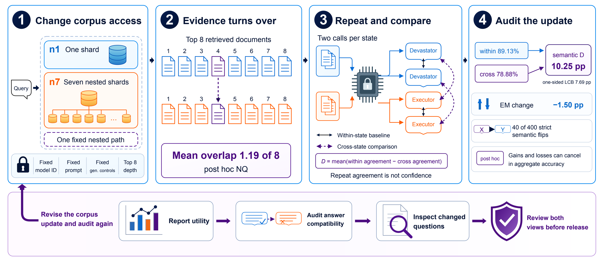

---

## 26. [From Generation to Simulation: How Far Are World Models from Being True Simulators?](https://huggingface.co/papers/2608.23070)
**Upvotes**: 3 | **도입 난이도**: 하 | **신뢰도**: 상
**arXiv**: https://arxiv.org/abs/2608.23070

**태그**: World Models, Simulation, Physics Engine, Generative AI, Video, Evaluation

### 📌 한 줄 요약
생성형 월드 모델이 전통적 시뮬레이터로서 갖춰야 할 핵심 역량과 현재의 기술적 격차를 체계적으로 분석한 연구입니다.

### 🔑 핵심 포인트
- 8가지 시뮬레이션 역량(물리, 상호작용, 제어, 상태 피드백 등)을 통한 체계적 벤치마크 프레임워크 제시
- 생성형 모델이 특정 시나리오의 제어/상호작용은 가능하나, 물리 법칙 보장 및 구조화된 상태 피드백은 부족함을 규명
- 상태 피드백(State feedback)이 시뮬레이터로 진화하기 위한 가장 핵심적이고 미개척된 영역임을 식별

### 🧑‍💻 개발자 관점
AI 에이전트 학습이나 로봇 시뮬레이션을 위해 생성형 모델을 도입하려는 엔지니어에게 현재 기술의 한계와 보완해야 할 지점(상태 피드백, 장기 안정성)을 명확히 제시합니다.

### 🚀 실무 적용 아이디어
- 생성형 모델 기반 환경에서 에이전트 학습 시, 물리적 일관성이 깨지는 지점(Long-horizon) 확인하기
- 모델의 출력물에서 객체의 상태(위치, 속도 등)를 추출하는 인터페이스 구현 가능성 검토하기
- 단순 비디오 생성을 넘어, 액션-상태 피드백 루프가 포함된 하이브리드 구조 설계해보기

### ⚠️ 리스크/한계
- 물리 법칙의 엄밀한 보장이 부족하여 정밀한 물리 시뮬레이션 용도로는 위험할 수 있음
- 장기적인 시계열(Long-horizon) 시뮬레이션 시 누적 오차로 인한 붕괴 가능성

### 📝 초록 기반 상세 설명
최근 확산 모델과 비디오 생성 기술의 발전으로 생성형 월드 모델이 물리 엔진이나 게임 엔진 같은 전통적 시뮬레이터를 대체할 것이라는 기대가 커지고 있습니다. 그러나 생성(Generation)과 시뮬레이션(Simulation) 사이의 실질적인 격차를 체계적으로 평가하는 연구는 부족한 실정입니다. 본 논문은 자산 구축, 물리 엔진, 상호작용 등 8가지 시뮬레이터 역량을 기준으로 200개의 주요 연구를 분석했습니다. 분석 결과, 특정 시나리오의 상호작용과 제어 측면에서는 기능적 대체가 가능해졌으나, 물리 법칙의 형식적 보장과 구조화된 상태 피드백, 장기적 안정성 측면에서는 여전히 큰 격차가 있음을 확인했습니다. 특히 상태 피드백(State feedback) 기능이 가장 취약한 요소로 나타났습니다.

---

## 27. [RIBOSPAN: A Long-Context RNA Foundation Model for Versatile RNA Modeling](https://huggingface.co/papers/2608.22849)
**Upvotes**: 3 | **도입 난이도**: 상 | **신뢰도**: 상
**arXiv**: https://arxiv.org/abs/2608.22849

**태그**: RNA-Foundation-Model, Long-Context, mRNA-Design, Bioinformatics, Benchmark, Evaluation, Inference

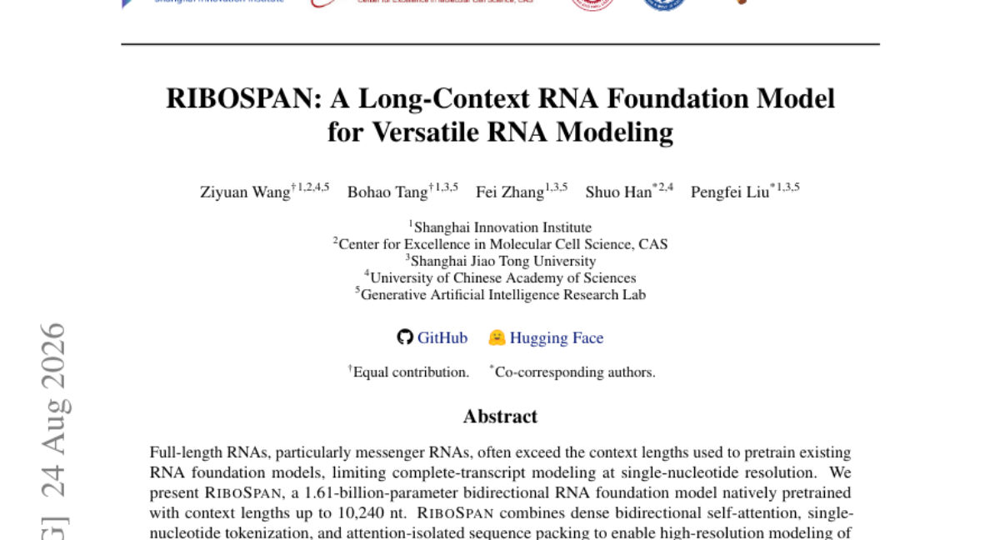

### 📌 한 줄 요약
10,240nt의 긴 컨텍스트를 지원하여 전체 mRNA 서열을 정밀하게 모델링하고 설계할 수 있는 RNA 파운데이션 모델

### 🔑 핵심 포인트
- 10,240nt의 긴 컨텍스트를 지원하는 1.61B 파라미터 규모의 양방향 RNA 파운데이션 모델 개발
- 단일 염기 토큰화 및 어텐션 격리 시퀀스 패킹을 통한 고해상도 장거리 서열 모델링 구현
- 전체 길이 mRNA 생성 및 단백질 보존형 CDS 최적화를 위한 디퓨전 프레임워크로 확장 가능

### 🧑‍💻 개발자 관점
전체 mRNA 서열을 한 번에 처리할 수 있어, 단백질 발현 최적화나 mRNA 백신 설계와 같은 실무적 RNA 엔지니어링에 즉각적인 활용이 가능합니다.

### 🚀 실무 적용 아이디어
- 제공된 모델 가중치를 활용하여 특정 mRNA 서열의 재구성 성능 테스트
- YaRN 스케일링 기법을 적용하여 더 긴 서열에서의 표현력 유지 여부 검증
- 제안된 디퓨전 프레임워크를 이용한 CDS 최적화 워크플로 구축

### ⚠️ 리스크/한계
- 모델 규모가 커서 고사양 GPU 자원이 필수적임
- 컨텍스트 확장 시 원거리 표현력이 확산(diffusion)되는 현상이 발생할 수 있음

### 📝 초록 기반 상세 설명
기존 RNA 파운데이션 모델은 컨텍스트 길이가 짧아 전체 길이에 달하는 mRNA를 단일 염기 해상도로 모델링하는 데 한계가 있었습니다. 이를 해결하기 위해 1.61B 파라미터 규모의 양방향 RNA 모델인 RIBOSPAN을 제안합니다. RIBOSPAN은 밀집 양방향 셀프 어텐션, 단일 염기 토큰화, 어텐션 격리 시퀀스 패킹 기술을 결합하여 최대 10,240nt의 긴 서열을 처리합니다. 실험 결과, 모델은 긴 컨텍스트에서도 강력한 재구성 능력과 맥락 반응성을 유지하며 다양한 RNA 유형에서 SOTA 성능을 달성했습니다. 또한, 이 모델을 기반으로 단백질 서열을 유지하면서 CDS를 최적화하는 mRNA 생성 및 재설계 프레임워크를 구축했습니다.

---

## 28. [Hybrid Quantum-inspired Kolmogorov-Arnold Networks for Privacy-Aware Federated Biosignal Learning](https://huggingface.co/papers/2608.13914)
**Upvotes**: 3 | **도입 난이도**: 중 | **신뢰도**: 상
**arXiv**: https://arxiv.org/abs/2608.13914

**태그**: Federated Learning, Quantum-inspired, KAN, Bio-signal, Edge AI, RAG, Evaluation

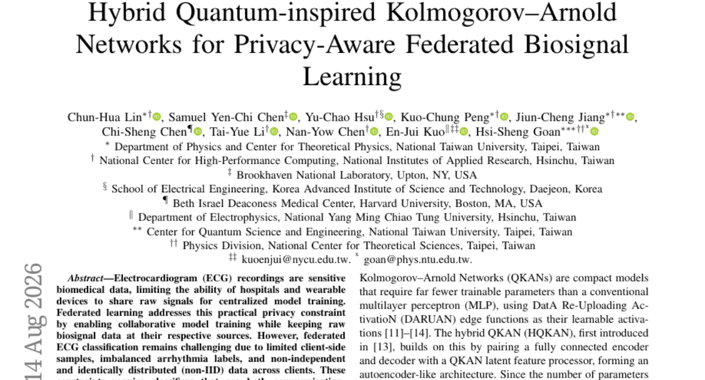

### 📌 한 줄 요약
양자 영감을 받은 KAN 구조를 활용하여 통신 비용은 낮추고 성능은 높인 프라이버시 보호형 연합 학습 모델 제안

### 🔑 핵심 포인트
- 양자 영감 기반 KAN(HQKAN)을 통한 모델 경량화 및 성능 최적화
- 연합 학습 환경에서의 데이터 불균형 및 Non-IID 문제 해결 역량 입증
- 기존 MLP 대비 파라미터 수와 통신 비용의 획기적 절감

### 🧑‍💻 개발자 관점
엣지 디바이스(웨어러블 등) 환경에서 통신 대역폭이 제한적일 때, 모델 크기를 줄이면서도 높은 정확도를 유지하는 실무적 대안을 제시합니다.

### 🚀 실무 적용 아이디어
- MIT-BIH/INCART 데이터셋을 활용한 HQKAN과 MLP 간의 성능/비용 트레이드오프 분석
- 다양한 Non-IID 시나리오(데이터 불균형 심화)에서의 모델 강건성 테스트
- 실제 엣지 디바이스 환경을 모사한 통신 지연 및 전력 소모량 측정

### ⚠️ 리스크/한계
- 양자 영감 알고리즘의 복잡도로 인한 구현 난이도 및 해석 가능성 검증 필요
- 특정 생체 신호 데이터셋에 최적화된 결과일 수 있어 범용성 확인 필요

### 📝 초록 기반 상세 설명
ECG 데이터는 민감한 개인정보를 포함하고 있어 중앙 집중식 학습이 어렵습니다. 연합 학습(Federated Learning)이 대안으로 제시되지만, 클라이언트별 데이터 불균형과 Non-IID 문제로 인해 효율적인 분류기 개발이 필수적입니다. 본 연구에서는 양자 영감을 받은 Kolmogorov-Arnold Network(HQKAN)를 제안하여 MLP와 성능을 비교했습니다. 실험 결과, HQKAN은 MIT-BIH 및 INCART 데이터셋에서 기존 MLP 대비 파라미터 수와 통신 비용을 크게 절감하면서도 분류 성능을 개선했습니다. 이를 통해 프라이버시를 보호하면서도 효율적인 생체 신호 학습이 가능함을 입증했습니다.

---

## 29. [ClawProBench: Trace-Aware Evaluation of AI Agents with Runtime Coverage and Frozen Workplace-Style Holdouts](https://huggingface.co/papers/2608.22510)
**Upvotes**: 2 | **도입 난이도**: 중 | **신뢰도**: 상
**arXiv**: https://arxiv.org/abs/2608.22510

**태그**: AI Agent, Benchmark, Runtime, Evaluation, Agent, RAG, Safety

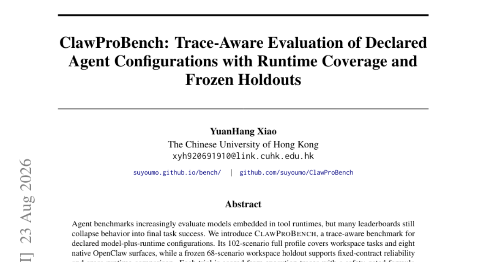

### 📌 한 줄 요약
최종 결과뿐만 아니라 실행 과정(Trace)을 추적하여 에이전트의 성능과 안전성을 다각도로 평가하는 벤치마크 프레임워크 제안

### 🔑 핵심 포인트
- 최종 답변을 넘어 실행 로그(Trace)를 분석하여 프로세스 품질과 효율성을 포함하는 다각도 평가 체계 구축
- 워크스페이스 도구와 네이티브 런타임 기능을 결합한 실질적인 에이전트 동작 환경 제공
- 정답 중심 평가와 프로세스 중심 평가 간의 순위 불일치를 통해 기존 평가 방식의 한계 증명

### 🧑‍💻 개발자 관점
에이전트 개발 시 단순히 정답률만 높이는 것이 아니라, 실행 과정의 효율성과 안전성을 확보하는 것이 실제 운영 환경에서 얼마나 중요한지 알려줍니다.

### 🚀 실무 적용 아이디어
- 에이전트 평가 시 정답 여부 외에 실행 로그의 중간 단계(Intermediate steps)를 정량화하는 지표 도입
- 동일한 정답을 내더라도 비용과 시간이 다른 여러 에이전트 모델 간의 효율성 비교 실험 수행
- 환경 변화에 따른 에이전트의 강건성을 테스트하기 위해 고정된 데이터셋(Holdout) 활용

### ⚠️ 리스크/한계
- 실행 로그 분석 방식은 평가 비용이 높고 복잡할 수 있음
- 특정 런타임 환경(OpenClaw)에 의존적인 평가 결과가 나올 위험이 있음

### 📝 초록 기반 상세 설명
기존 에이전트 벤치마크는 상태를 가진 런타임 환경에서도 최종 정답 여부만 평가하는 경향이 있어, 에이전트의 실제 동작 과정을 충분히 반영하지 못합니다. 이를 해결하기 위해 연구진은 실행 로그(Trace)를 기반으로 정답성, 프로세스 품질, 효율성을 결합하여 평가하는 ClawProBench를 제안합니다. 이 벤치마크는 워크스페이스 도구와 다양한 네이티브 기능을 갖춘 OpenClaw 런타임 위에서 동작하며, 전체 프로필과 고정된 홀드아웃(Holdout) 트랙으로 구성됩니다. 실험 결과, 단순 정답 중심의 순위와 프로세스/안전성을 고려한 순위 사이에 상당한 차이가 있음을 확인했습니다. 이는 최종 답변만 보는 방식이 에이전트의 잠재적 결함이나 실행 과정의 취약점을 가릴 수 있음을 시사합니다.

### 🖼️ 추가 자료
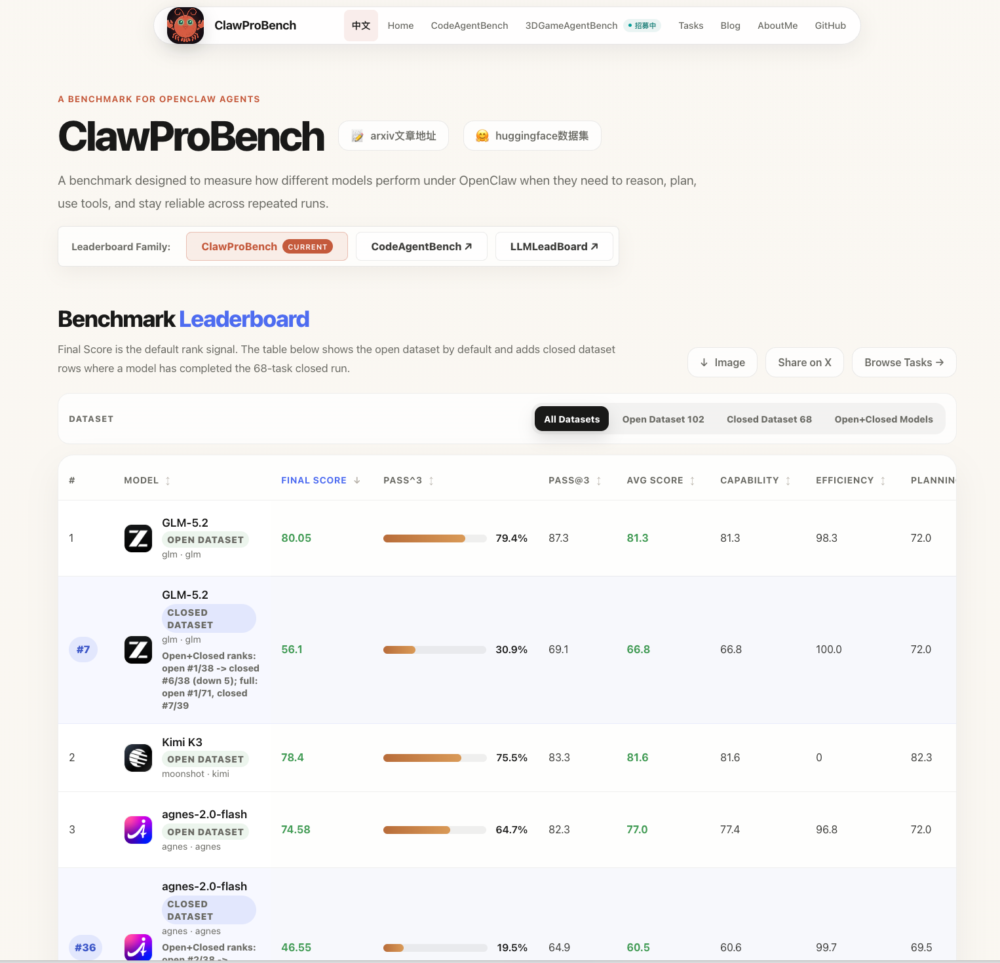

---

## 30. [WorldToken: Time-First Sequence Modeling for Robotic Imitation Learning](https://huggingface.co/papers/2608.22591)
**Upvotes**: 1 | **도입 난이도**: 중 | **신뢰도**: 상
**arXiv**: https://arxiv.org/abs/2608.22591

**태그**: Robotics, Imitation Learning, Transformer, Diffusion, Vision, Evaluation

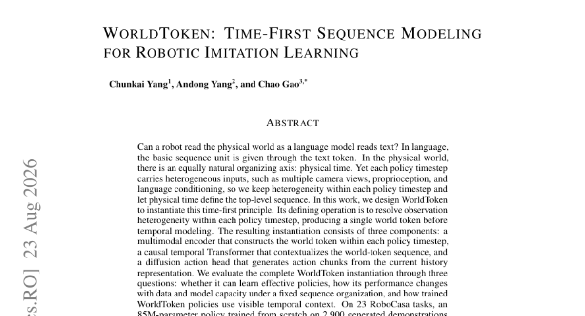

### 📌 한 줄 요약
다양한 관측 데이터를 하나의 '월드 토큰'으로 통합하여 시계열 트랜스포머로 모델링하는 로봇 모방 학습 프레임워크

### 🔑 핵심 포인트
- 다중 모달리티(이미지, 센서, 태스크)를 단일 타임스텝 내 하나의 토큰으로 통합하는 'WorldToken' 구조 제안
- Causal Temporal Transformer와 Diffusion Action Head를 결합한 시계열 모델링 방식
- 데이터 규모 및 모델 크기에 따른 성능 변화와 시계열 컨텍스트 유지 능력 검증

### 🧑‍💻 개발자 관점
이질적인 센서 데이터를 단일 토큰으로 압축하는 방식은 로봇 제어 모델의 입력 복잡도를 줄이고 시계열 모델링 효율을 높이는 데 유용합니다.

### 🚀 실무 적용 아이디어
- 다양한 센서 데이터를 단일 임베딩 공간으로 투영하는 토큰화 전략 실험
- Diffusion 기반 액션 헤드와 트랜스포머 백본 간의 연산 효율성 비교
- 컨텍스트 윈도우 크기 변화에 따른 로봇 작업의 장기 의존성 테스트

### ⚠️ 리스크/한계
- 단일 토큰 융합 방식이 다른 시계열 조직화 방식보다 우월한지에 대한 비교 검증 부족
- 특정 구성 요소(토큰화 vs 모델 구조)의 개별 기여도 분리 미흡

### 📝 초록 기반 상세 설명
로봇 정책 학습 시 이질적인 관측 데이터를 시계열 모델에 어떻게 조직화할 것인가에 대한 연구가 필요합니다. 본 논문은 다중 시점 이미지, 고유 수용 감각, 작업 조건을 하나의 '월드 토큰'으로 융합하는 WorldToken 방식을 제안합니다. 생성된 토큰 시퀀스를 인과적 시계열 트랜스포머로 모델링하고 확산(Diffusion) 액션 헤드를 통해 액션 청크를 생성합니다. 23개 RoboCasa 태스크 실험 결과, 85.3M 파라미터 모델이 높은 성공률을 기록하며 데이터 규모와 모델 크기에 따른 성능 변화를 확인했습니다. 실험을 통해 시계열 컨텍스트의 중요성과 데이터 스케일링 법칙을 입증했습니다.

---

## 31. [EXPL-FR: Explaining Face Recognition Models via Vision-Language Alignment](https://huggingface.co/papers/2608.21486)
**Upvotes**: 1 | **도입 난이도**: 하 | **신뢰도**: 상
**arXiv**: https://arxiv.org/abs/2608.21486

**태그**: Face Recognition, VLM, Explainable AI, Bias Audit, Vision, Benchmark, Safety

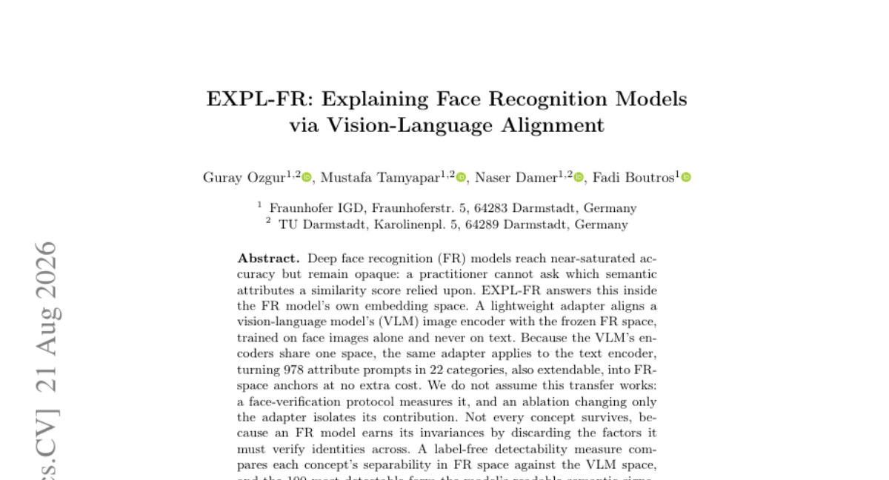

### 📌 한 줄 요약
얼굴 인식 모델의 임베딩 공간을 VLM과 정렬하여, 별도의 라벨 없이도 모델이 어떤 속성을 기준으로 식별하는지 설명하는 기술

### 🔑 핵심 포인트
- 가벼운 어댑터를 통한 VLM과 고정된 FR 임베딩 공간 간의 정렬 기술
- 별도의 라벨링 없이 텍스트 프롬프트만으로 모델의 의미적 속성을 추출하는 방식
- 모델 아키텍처 수정 없이 적용 가능한 범용적이고 확장 가능한 설명 가능성 프레임워크

### 🧑‍💻 개발자 관점
얼굴 인식 모델의 블랙박스 문제를 해결하여, 모델이 특정 인종이나 속성에 편향되어 있는지 혹은 어떤 특징을 기반으로 식별하는지 정량적으로 감사할 수 있습니다.

### 🚀 실무 적용 아이디어
- 기존에 사용 중인 FR 모델의 임베딩 공간에 VLM 어댑터를 적용하여 속성 가시성 확인
- 제시된 'detectability measure'를 활용해 모델의 핵심 의미적 시그니처 추출 실험
- 다양한 인종/성별 데이터셋을 통한 모델의 편향성 감사(Auditing) 수행

### ⚠️ 리스크/한계
- FR 모델이 학습 과정에서 버린(discarded) 속성은 설명 가능한 시그니처로 나타나지 않음
- VLM의 지식과 FR 모델의 임베딩 공간 간의 정렬 품질에 따라 설명의 정확도가 좌우됨

### 📝 초록 기반 상세 설명
기존의 딥러닝 기반 얼굴 인식(FR) 모델은 높은 정확도를 보이지만, 유사도 점수가 어떤 의미적 속성에 기반했는지 알 수 없는 블랙박스 문제가 있습니다. 본 논문은 FR 모델의 임베딩 공간 내에서 설명 가능성을 확보하는 EXPL-FR 프레임워크를 제안합니다. 가벼운 어댑터를 사용하여 고정된 FR 공간과 VLM의 이미지 인코더를 정렬함으로써, 텍스트 인코더를 통해 수많은 속성 프롬프트를 FR 공간의 앵커로 변환합니다. 실험 결과, 이 방식은 모델의 아키텍처 수정 없이도 식별에 중요한 핵심 속성들을 추출하며, 인종별 오류율(RFW)과 같은 편향성 감사 및 속성 변화에 따른 검증 비용 측정에 효과적임을 입증했습니다.

### 🖼️ 추가 자료
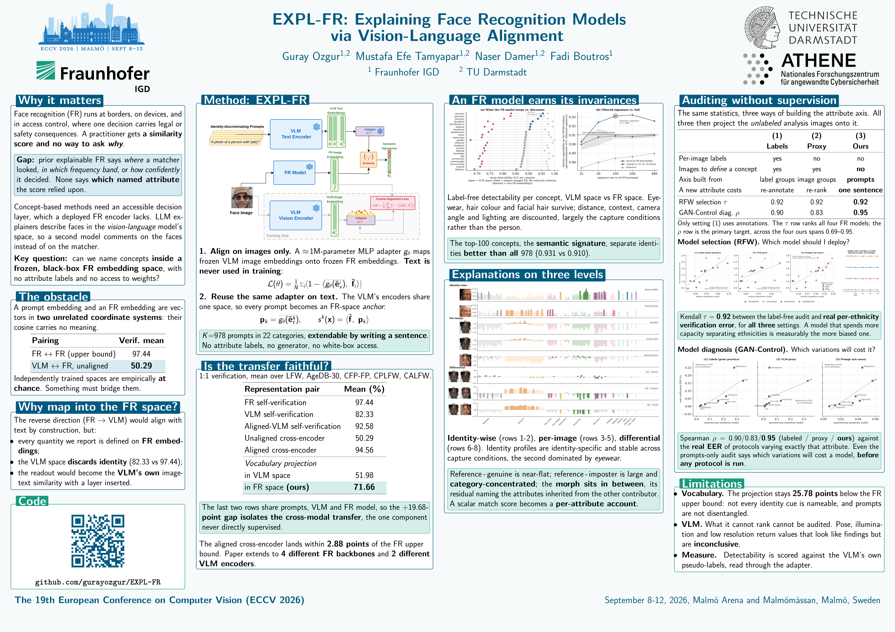

---

## 32. [Tomatoes, Potatoes, and Onions: Questioning the Need for Faces in Face Presentation Attack Detection](https://huggingface.co/papers/2608.21455)
**Upvotes**: 1 | **도입 난이도**: 중 | **신뢰도**: 상
**arXiv**: https://arxiv.org/abs/2608.21455

**태그**: Computer Vision, Face Anti-Spoofing, Privacy-Preserving, Transfer Learning, RAG, Benchmark

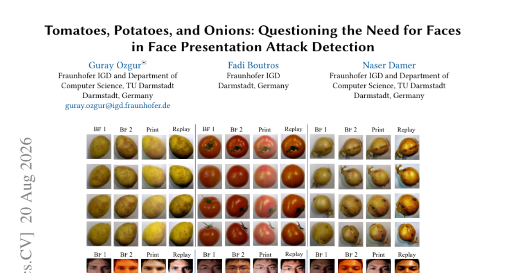

### 📌 한 줄 요약
얼굴 데이터 없이도 사물(채소)을 이용한 학습만으로 강력한 얼굴 위변조 탐지(PAD) 성능을 확보할 수 있음을 입증함

### 🔑 핵심 포인트
- 얼굴이 아닌 사물(채소)을 활용한 새로운 PAD 데이터셋 'TPO' 제안
- 얼굴 정보 없이 학습된 모델이 기존 얼굴 PAD 벤치마크에서 높은 성능을 보이는 전이 학습 가능성 입증
- 얼굴 데이터와 사물 데이터의 결합이 상호 보완적인 정보를 제공하여 모델 성능을 향상시킴

### 🧑‍💻 개발자 관점
개인정보 보호가 중요한 환경에서 실제 얼굴 데이터 없이도 강력한 위변조 탐지 모델을 구축할 수 있는 방법론적 근거를 제공합니다.

### 🚀 실무 적용 아이디어
- 제안된 TPO 데이터셋과 유사한 비인간 객체 데이터셋을 구축하여 실험해보기
- 기존 얼굴 PAD 모델에 비인간 객체 데이터를 혼합 학습(Mixed Training)하여 성능 변화 관찰하기
- 얼굴 특징(Identity)과 공격 특징(Presentation) 간의 분리 정도를 정량적으로 측정하기

### ⚠️ 리스크/한계
- 사물 데이터가 실제 인간의 얼굴 피부 질감이나 미세한 움직임을 완벽히 대체할 수 있는지에 대한 검증 필요
- 특정 사물 카테고리에 편향된 학습이 발생할 위험성

### 📝 초록 기반 상세 설명
기존의 얼굴 위변조 탐지(PAD)는 얼굴의 외형적 특징에 의존하는 경향이 있어, 공격 방식 자체의 특성을 학습하는 데 한계가 있었습니다. 본 연구는 얼굴 정보 없이도 전이 가능한 PAD 표현을 학습할 수 있는지 조사하기 위해, 토마토, 감자, 양파를 활용한 새로운 데이터셋인 TPO를 제안합니다. TPO 데이터셋을 사용하여 학습된 모델은 얼굴 데이터 없이도 기존의 표준 얼굴 PAD 벤치마크에서 높은 성능을 기록했습니다. 반면, 기존 얼굴 데이터로 학습된 모델은 TPO 데이터셋에 대해 우수한 성능을 보이지 못해, 얼굴 데이터가 객체 의미론적 특징에 편향될 수 있음을 시사했습니다. 결과적으로 TPO를 기존 학습에 결합하면 성능이 향상되었으며, 이는 얼굴이 없는 데이터가 보완적인 정보를 제공함을 의미합니다. 최종적으로 본 연구는 프라이버시를 보호하면서도 강력한 위변조 탐지 모델을 개발할 수 있는 새로운 가능성을 제시합니다.

### 🖼️ 추가 자료

---

