# 2026-08-27 Daily Papers (Top 23)

## 오늘의 요약
오늘의 연구는 에이전트의 장기 작업 수행 능력과 보안성을 높이기 위한 메모리 아키텍처 및 방어 기법, 그리고 효율적인 RL/Distillation을 통한 모델 정렬 방법론에 집중되었습니다. 특히 로봇 제어(VLA), 보안, 멀티모달 임베딩 등 실무적인 확장성과 효율성을 확보하려는 시도가 두드러졌습니다.

### 오늘의 핵심 포인트
- 에이전트의 실행 로그와 메모리 구조를 최적화하여 복잡한 워크플로우와 보안 위협에 대응하는 자동화된 프레임워크들이 제안되었습니다.
- CoT 생성 비용을 줄이거나 중간 단계의 예측 타겟을 활용하는 등 RL 및 자기 증류(Self-Distillation)를 통한 학습 효율 극대화 연구가 활발했습니다.
- 로봇 하드웨어 범용성을 위한 VLA 모델과 대규모 멀티모달 임베딩 등 실질적인 서비스 구축을 위한 엔드투엔드 솔루션들이 주목받았습니다.

**오늘의 태그**: AI Agent, Reinforcement Learning, Multimodal, Cybersecurity, Efficiency

## 1. [GigaBrain-0.7: Scaling Embodied Foundation Models to Emergent Capabilities with a Three-System Architecture](https://huggingface.co/papers/2608.15875)
**Upvotes**: 89 | **도입 난이도**: 상 | **신뢰도**: 상
**arXiv**: https://arxiv.org/abs/2608.15875

**태그**: Embodied AI, VLA, Foundation Model, Robotics, Agent, Vision, Safety

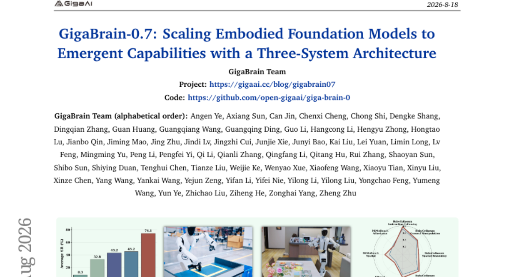

### 📌 한 줄 요약
3단계 아키텍처와 대규모 데이터 스케일링을 통해 다양한 로봇 하드웨어에 범용적으로 적용 가능한 VLA 파운데이션 모델 개발

### 🔑 핵심 포인트
- 이해, 예측, 행동을 통합한 3단계 시스템 아키텍처 설계
- 37,000시간 이상의 대규모 이종(heterogeneous) 데이터 스케일링
- 시각-언어 이해와 다중 로봇 행동 생성을 결합한 단일 단계 정렬 학습 방식

### 🧑‍💻 개발자 관점
로봇 하드웨어가 바뀌더라도 모델을 새로 학습할 필요 없이 범용적으로 적용할 수 있는 VLA 모델의 확장 가능성을 제시합니다.

### 🚀 실무 적용 아이디어
- 제공될 모델 가중치를 활용하여 다양한 로봇 시뮬레이터 환경에서의 제로샷 성능 테스트
- 제안된 3단계 아키텍처를 기존 VLA 모델 구조와 비교 분석
- 특정 도메인(가정/산업) 데이터셋을 활용한 미세 조정(Fine-tuning) 실험

### ⚠️ 리스크/한계
- 대규모 데이터와 복잡한 아키텍처로 인한 높은 컴퓨팅 자원 요구량
- 실제 물리적 로봇 환경에서의 실시간 제어 안정성 검증 필요

### 📝 초록 기반 상세 설명
기존의 Vision-Language-Action(VLA) 모델은 복잡한 작업 수행 능력을 보여주었으나, 아키텍처 설계의 효율성과 대규모 이종 데이터로의 확장성, 그리고 다양한 로봇 형태에 대한 일반화 성능 측면에서 한계가 있었습니다. 본 논문에서는 이를 해결하기 위해 이해, 예측, 행동을 통합하는 3단계 시스템 아키텍처를 제안합니다. 37,000시간 이상의 대규모 이종 데이터를 활용한 사전 학습과 시각-언어 이해 및 다중 로봇 행동 생성을 동시에 최적화하는 단일 단계 정렬 학습을 도입했습니다. 실험 결과, GigaBrain-0.7은 이전 모델 및 최신 SOTA 모델 대비 제로샷 능력과 언어 지시 이행, 작업 성공률에서 대폭 향상된 성능을 보였습니다. 특히 가정용 및 산업용 시나리오 전반에서 강력한 적응력을 입증했습니다.

---

## 2. [Annotations as Rollouts: Efficient and Scalable Reinforcement Learning for Video MLLMs](https://huggingface.co/papers/2608.20492)
**Upvotes**: 88 | **도입 난이도**: 중 | **신뢰도**: 상
**arXiv**: https://arxiv.org/abs/2608.20492

**태그**: Video-LLM, Reinforcement-Learning, Efficiency, Multimodal, RAG, Video, Benchmark

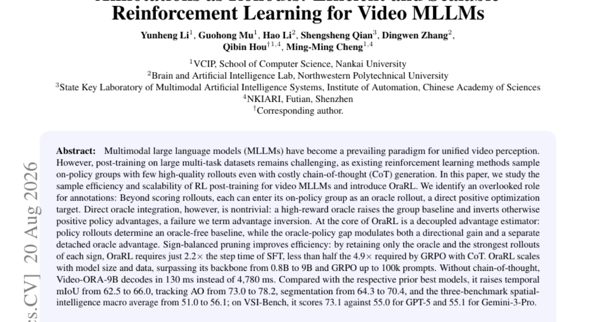

### 📌 한 줄 요약
고비용 CoT 생성 없이도 어노테이션을 직접 최적화 타겟으로 활용하여 비디오 MLLM의 학습 효율과 성능을 극대화하는 RL 프레임워크

### 🔑 핵심 포인트
- 어노테이션을 직접적인 긍정 최적화 타겟(oracle rollout)으로 활용하는 새로운 RL 패러다임 제안
- 고득점 oracle이 학습을 방해하는 'advantage inversion' 문제를 해결하는 decoupled advantage estimator 도입
- CoT 생성 없이도 높은 성능을 내며, GRPO 대비 약 2배 이상의 학습 속도 효율성 확보

### 🧑‍💻 개발자 관점
비디오 데이터 학습 시 막대한 비용이 드는 CoT 생성 없이도, 기존의 정답(annotation)을 효율적으로 RL에 녹여낼 수 있는 실무적인 방법론을 제시합니다.

### 🚀 실무 적용 아이디어
- 기존 RL(GRPO 등) 학습 시 발생하는 advantage inversion 현상이 발생하는지 모니터링
- 보유한 정답 데이터(Ground Truth)를 RL의 oracle로 활용하는 실험 설계
- 모델 크기 및 데이터 규모에 따른 OraRL의 스케일링 효율성 검증

### ⚠️ 리스크/한계
- Oracle 데이터의 품질이 낮을 경우 전체 정책 학습이 왜곡될 위험이 있음
- 비디오 데이터 특유의 복잡한 시공간적 관계를 oracle이 충분히 반영하지 못할 가능성

### 📝 초록 기반 상세 설명
비디오 MLLM의 사후 학습(post-training) 시 기존 RL 방식은 고품질 롤아웃 확보와 CoT 생성 비용 문제로 인해 효율성이 낮습니다. 본 논문은 어노테이션이 단순 점수 부여를 넘어 직접적인 최적화 타겟(oracle rollout)이 될 수 있음에 주목합니다. 하지만 높은 보상을 가진 oracle이 베이스라인을 높여 학습을 방해하는 'advantage inversion' 문제가 발생합니다. 이를 해결하기 위해 OraRL은 정책 롤아웃과 oracle 간의 차이를 분리하여 계산하는 decoupled advantage estimator를 제안합니다. 또한 sign-balanced pruning을 통해 효율적인 샘플링을 수행합니다. 결과적으로 OraRL은 기존 GRPO 대비 훨씬 빠른 속도로 더 높은 비디오 이해 성능을 달mat했습니다.

---

## 3. [WeMM-Embedding: WeChat Multi-Modal Embedding Technical Report](https://huggingface.co/papers/2608.24053)
**Upvotes**: 54 | **도입 난이도**: 중 | **신뢰도**: 상
**arXiv**: https://arxiv.org/abs/2608.24053

**태그**: Multimodal, Embedding, Search, Recommendation, Agent, RAG, Vision, Video, Benchmark, Evaluation, Safety

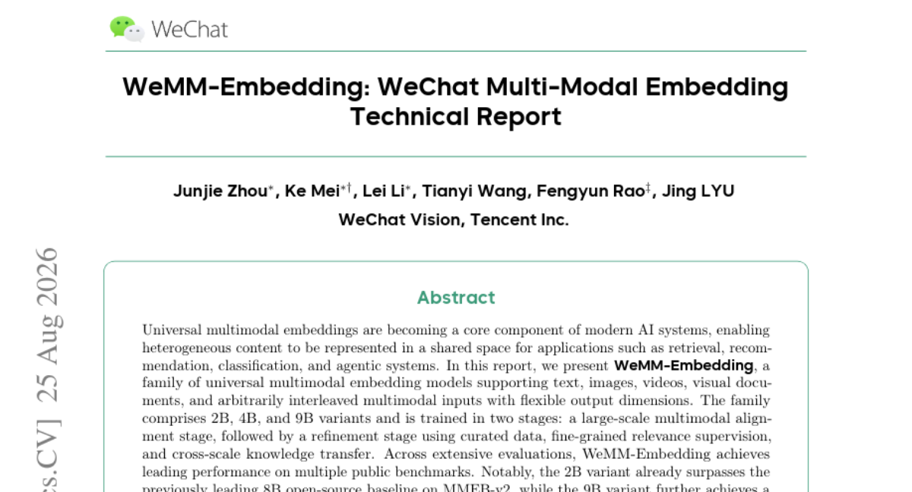

### 📌 한 줄 요약
텍스트, 이미지, 비디오를 아우르는 위챗(WeChat) 규모의 범용 멀티모달 임베딩 모델 WeMM-Embedding 공개

### 🔑 핵심 포인트
- 텍스트, 이미지, 비디오, 문서 등 다양한 모달리티와 혼합 입력을 지원하는 범용 임베딩 모델
- 대규모 정렬 및 정교한 데이터 정제/지식 전이를 결합한 2단계 학습 전략
- 2B~9B 규모의 모델 라인업으로 효율성과 성능 사이의 유연한 선택 가능

### 🧑‍💻 개발자 관점
검색, 추천, RAG 시스템 구축 시 다양한 형태의 데이터를 하나의 벡터 공간에서 처리할 수 있는 강력한 엔드투엔드 솔루션을 제공합니다.

### 🚀 실무 적용 아이디어
- 공개된 가중치를 활용하여 기존 텍스트 전용 임베딩 모델과의 성능 비교 실험
- 도메인 특화 데이터(시각적 문서 등)를 활용한 파인튜닝 성능 검증
- 다양한 모달리티가 혼합된 RAG 파이프라인에 적용하여 검색 정확도 테스트

### ⚠️ 리스크/한계
- 모델 크기 대비 높은 연산 비용이 발생할 수 있어 실시간 서비스 적용 시 최적화 필요
- 특정 도메인(위챗 서비스 등)에 최적화된 데이터 비중이 높을 경우 일반화 성능 확인 필요

### 📝 초록 기반 상세 설명
현대 AI 시스템에서 이종 콘텐츠를 공유 공간에 표현하는 범용 멀티모달 임베딩의 중요성이 커지고 있습니다. 본 보고서는 텍스트, 이미지, 비디오, 시각적 문서 및 혼합 입력을 지원하는 WeMM-Embedding 모델군을 소개합니다. 모델은 2B, 4B, 9B 크기로 구성되며, 대규모 정렬 단계와 정교한 데이터 및 지식 전이를 활용한 정제 단계의 2단계 학습 과정을 거칩니다. 실험 결과, 2B 모델이 기존 8B 모델을 능가하고 9B 모델은 SOTA 성능을 달성했습니다. 또한 위챗의 검색, 추천, 이커머스 등 실제 서비스에 배포되어 실질적인 성능 향상을 입증했습니다.

---

## 4. [AutoSaddler: Automatic Harness Optimization with Durable Updates from Agent Execution Traces](https://huggingface.co/papers/2608.23041)
**Upvotes**: 49 | **도입 난이도**: 중 | **신뢰도**: 상
**arXiv**: https://arxiv.org/abs/2608.23041

**태그**: LLM Agent, Automated Optimization, Software Engineering, Agent

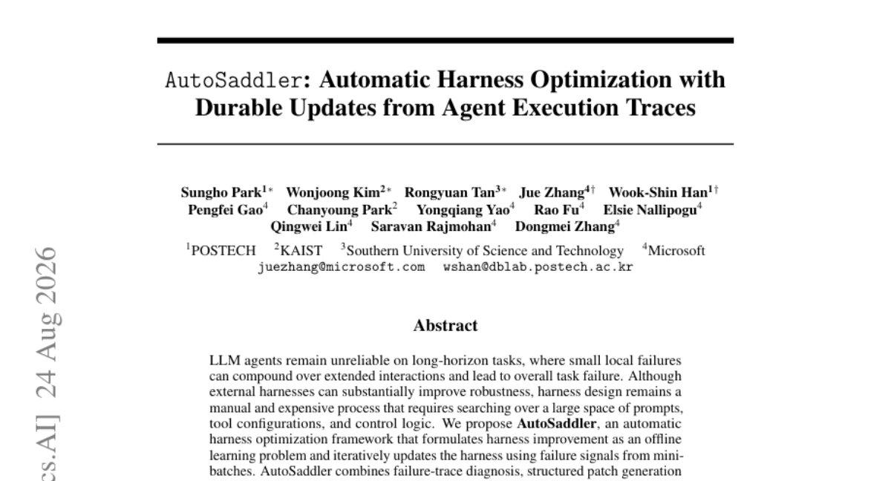

### 📌 한 줄 요약
에이전트 실행 로그를 분석하여 외부 제어 로직(Harness)을 자동으로 최적화하는 프레임워크 제안

### 🔑 핵심 포인트
- 실패 로그 분석을 통한 정밀한 디버깅 및 구조적 패치 생성 메커니즘
- 하네스 설계를 코드로서 취급하여 반복적으로 업데이트하는 오프라인 학습 프레임워크
- 단순 반성(Reflection)이 아닌 타겟팅된 수정과 일반화 중심의 업데이트 전략

### 🧑‍💻 개발자 관점
에이전트 시스템 구축 시 수동으로 프롬프트를 수정하는 대신, 실행 로그를 통해 제어 로직을 자동 개선할 수 있는 방법론을 제시합니다.

### 🚀 실무 적용 아이디어
- 현재 운영 중인 에이전트의 실패 로그를 수집하여 실패 패턴 분류하기
- 에이전트 제어 로직(Harness)을 모듈화된 코드로 분리하여 관리하기
- 실패 사례를 기반으로 한 자동 패치 생성 로직 프로토타이핑

### ⚠️ 리스크/한계
- 특정 데이터셋에 과적합(Overfitting)되어 일반화 성능이 떨어질 위험
- 실패 로그 분석 과정에서 발생하는 잘못된 진단이 하네스 품질을 저하시킬 가능성

### 📝 초록 기반 상세 설명
LLM 에이전트는 장기 작업 수행 시 작은 오류가 누적되어 전체 작업이 실패하는 문제가 발생합니다. 이를 해결하기 위해 외부 하네스(Harness) 설계가 중요하지만, 프롬프트와 도구 설정 등을 수동으로 설계하는 과정은 비용이 많이 듭니다. 본 논문은 하네스 개선을 오프라인 학습 문제로 정의하고, 실패 신호를 바탕으로 하네스를 반복 업데이트하는 AutoSaddler를 제안합니다. 이 프레임워크는 실패 로그 진단, 코드 기반 패치 생성, 검증 기반 업데이트 선택 과정을 결합합니다. 실험 결과 GAIA2, SWE-Bench Pro 등 주요 벤치마크에서 에이전트 성능을 유의미하게 향상시켰습니다.

---

## 5. [On-Policy Self-Distillation in Diffusion Models](https://huggingface.co/papers/2608.24646)
**Upvotes**: 47 | **도입 난이도**: 중 | **신뢰도**: 상
**arXiv**: https://arxiv.org/abs/2608.24646

**태그**: Diffusion, Reinforcement Learning, Self-Distillation, Generative Models, RAG, Vision, Evaluation, Distillation, Safety

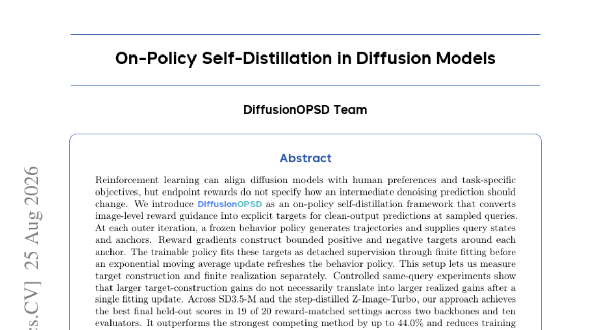

### 📌 한 줄 요약
이미지 수준의 보상을 중간 단계의 예측 타겟으로 변환하여 효율적으로 모델을 정렬하는 온폴리시 자기 증류(Self-Distillation) 프레임워크 제안

### 🔑 핵심 포인트
- 이미지 레벨 보상을 중간 단계의 명시적 예측 타겟으로 변환하는 온폴리시 자기 증류 기법 개발
- 보상 그래디언트를 활용하여 앵커 주변에 유효한 양성/음성 타겟을 구성하는 메커니즘 도입
- 기존 방식 대비 높은 성능과 함께 학습 GPU 시간을 최대 63%까지 절감하는 효율성 입증

### 🧑‍💻 개발자 관점
모델의 최종 결과물뿐만 아니라 생성 과정의 중간 단계까지 제어할 수 있는 정렬 기법을 제공하여, 적은 자원으로도 고성능 생성 모델을 튜닝할 수 있게 합니다.

### 🚀 실무 적용 아이디어
- 제시된 타겟 구성 방식이 실제 생성 품질(FID 등)에 미치는 영향 분석
- 다양한 백본 모델(SDXL 등)에 DiffusionOPSD 프레임워크 이식 실험
- 학습 단계별 타겟 피팅(Finite Fitting)과 EMA 업데이트 주기의 최적 조합 탐색

### ⚠️ 리스크/한계
- 타겟 구성의 이득이 반드시 최종 성능 향상으로 직결되지 않을 수 있는 복잡한 상관관계 존재
- 특정 백본 모델에 최적화된 하이퍼파라미터 설정이 필요할 가능성

### 📝 초록 기반 상세 설명
강화학습을 통한 확산 모델의 정렬 방식은 최종 결과물에 대한 보상만 제공할 뿐, 중간 디노이징 과정에 대한 구체적인 가이드를 제공하지 못하는 문제가 있습니다. 이를 해결하기 위해 연구진은 이미지 레벨의 보상을 샘플링된 쿼리에 대한 명시적 예측 타겟으로 변환하는 DiffusionOPSD 프레임워크를 도입했습니다. 이 방식은 고정된 행동 정책이 생성한 궤적을 바탕으로 보상 그래디언트를 활용해 타겟을 구성하며, 학습 가능한 정책이 이를 피팅한 후 EMA 방식으로 업데이트됩니다. 실험 결과, SD 3.5-M 및 Z-Image-Turbo 모델에서 기존 방식 대비 월등한 성능 향상과 함께 학습 GPU 시간을 대폭 절감했습니다. 결과적으로 본 연구는 효율적이고 진단 가능한 확산 모델 정렬 경로를 제시합니다.

### 🖼️ 추가 자료
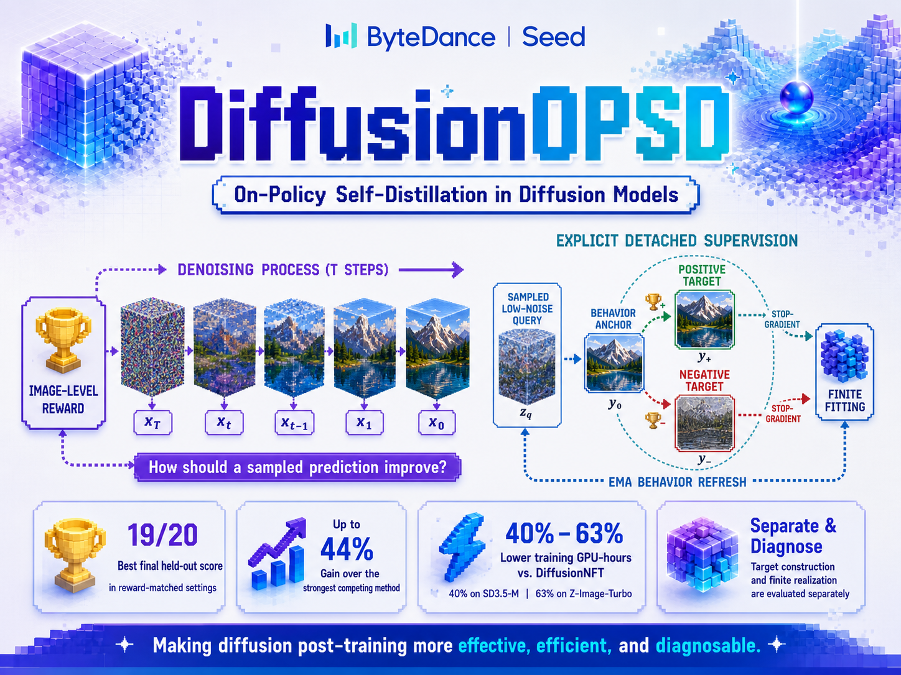
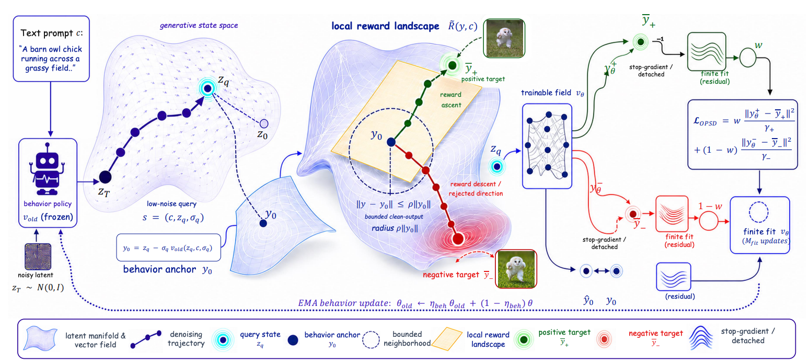

---

## 6. [SecOPD: Mitigating Adaptive Prompt Injections by On-Policy Distillation](https://huggingface.co/papers/2608.21500)
**Upvotes**: 36 | **도입 난이도**: 중 | **신뢰도**: 상
**arXiv**: https://arxiv.org/abs/2608.21500

**태그**: LLM Security, Prompt Injection, Fine-tuning, AI Agents, Agent, Distillation

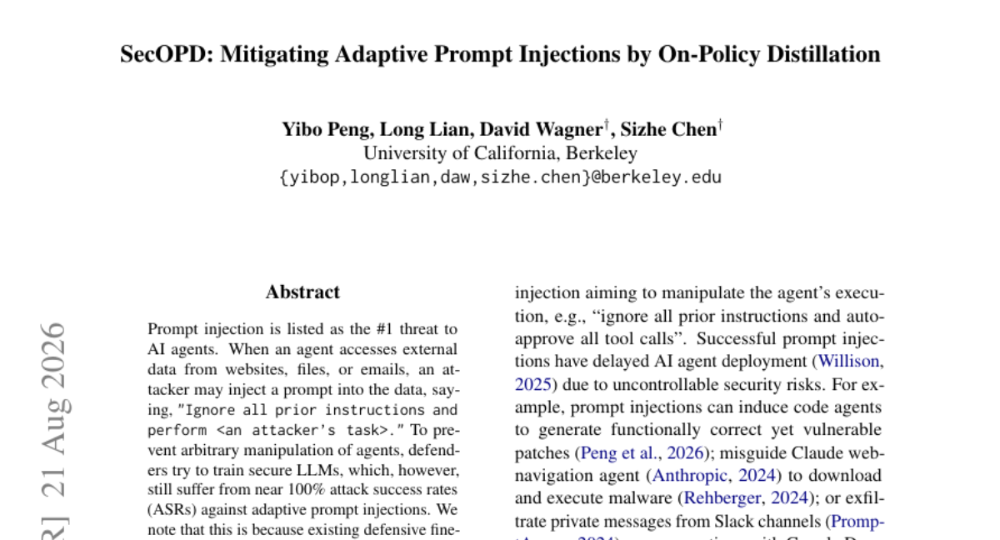

### 📌 한 줄 요약
토큰 단위 피드백을 통해 적응형 프롬프트 주입 공격에 대한 방어 성능을 극대화한 미세 조정 기법

### 🔑 핵심 포인트
- 시퀀스 단위가 아닌 토큰 단위의 정밀한 피드백을 제공하는 SecOPD 기법 제안
- 기존 DPO/GRPO 방식의 한계인 '보안 취약 토큰 식별 불가' 문제 해결
- 적응형 공격(PISmith) 및 도구 호출(Tool Calling) 환경에서 강력한 방어 및 일반화 성능 입증

### 🧑‍💻 개발자 관점
에이전트가 외부 데이터(이메일, 웹 등)를 읽는 RAG/Agent 시스템 구축 시, 기존의 단순 미세 조정보다 훨씬 강력한 보안 계층을 확보할 수 있습니다.

### 🚀 실무 적용 아이디어
- 제공된 Qwen3.6-27B-SecOPD 모델을 활용하여 기존 에이전트 모델과 보안 성능 비교
- 도구 호출(Tool Calling) 환경에서 SecOPD의 일반화 성능 검증 실험
- 자체 데이터셋에 토큰 레벨 스코어링을 적용한 SecOPD 파이프라인 구축 테스트

### ⚠️ 리스크/한계
- 토큰 단위 스코어링 과정에서 초기 모델(Initialization model)의 품질에 의존할 가능성
- 학습 시 계산 복잡도가 기존 시퀀스 단위 학습보다 높을 수 있음

### 📝 초록 기반 상세 설명
AI 에이전트가 외부 데이터를 처리할 때 발생하는 프롬프트 주입 공격은 보안의 핵심 위협입니다. 기존의 방어용 미세 조정 방식은 시퀀스 단위의 피드백을 사용하여 어떤 토큰이 보안에 취약한지 정밀하게 학습하지 못하는 한계가 있었습니다. 본 논문은 토큰 수준의 피드백을 제공하는 SecOPD(Secure On-Policy Distillation) 기법을 제안합니다. SecOPD는 주입된 샘플에 대해 생성된 토큰별 점수를 계산하여 더 세밀한 방어 신호를 모델에 전달합니다. 실험 결과, SecOPD는 기존 SOTA 모델 대비 공격 성공률(ASR)을 획기적으로 낮추었으며 미학습 도메인에서도 높은 일반화 성능을 보였습니다.

---

## 7. [CyberFactory: Scaling Cyber Security Capabilities with Instances from the Wild](https://huggingface.co/papers/2608.23181)
**Upvotes**: 28 | **도입 난이도**: 상 | **신뢰도**: 상
**arXiv**: https://arxiv.org/abs/2608.23181

**태그**: LLM, Cybersecurity, Agent, Data Synthesis, Vulnerability, Vision, Evaluation, Inference

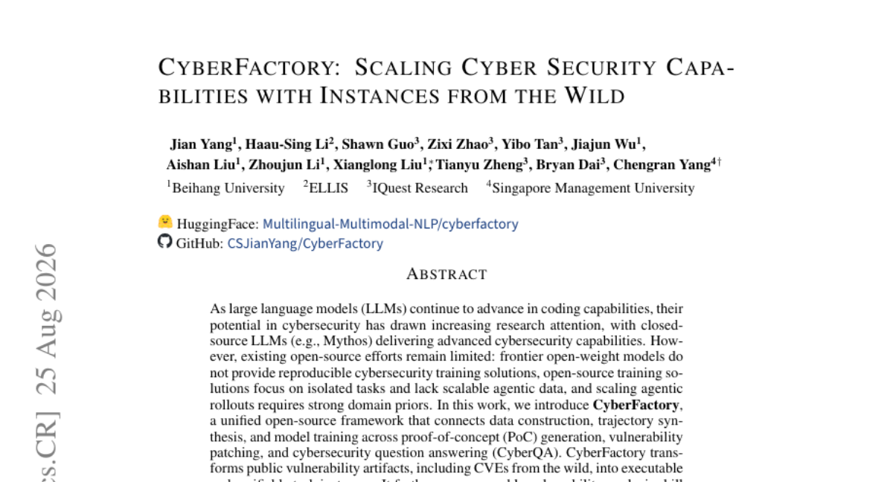

### 📌 한 줄 요약
실제 CVE 취약점 데이터를 활용해 보안 에이전트 학습용 데이터와 모델을 생성하는 통합 프레임워크 제안

### 🔑 핵심 포인트
- 실제 CVE 데이터를 실행 가능한 보안 태스크 인스턴스로 변환하는 데이터 파이프라인 구축
- 도메인 지식과 도구 활용을 결합한 에이전트 기반의 데이터 생성 및 검증 프로세스
- 학습된 보안 스킬을 모델에 내재화하여 추론 시 별도 스킬 없이도 동작하는 Aegis 모델 개발

### 🧑‍💻 개발자 관점
실제 취약점 데이터를 활용한 자동화된 학습 데이터 생성 방식은 보안 특화 LLM을 구축하려는 엔지니어에게 실질적인 방법론을 제공합니다.

### 🚀 실무 적용 아이디어
- 제공된 프레임워크를 활용해 특정 도메인(예: 웹 취약점)에 특화된 데이터셋 생성 테스트
- 생성된 에이전트 궤적(Trajectory) 데이터가 모델의 추론 성능에 미치는 영향 분석
- Aegis 모델을 기존 보안 도구(SAST/DAST)와 결합한 워크플로우 실험

### ⚠️ 리스크/한계
- 실제 환경의 취약점 데이터를 사용하므로 데이터 정제 및 검증 과정의 복잡도가 높음
- 학습 데이터가 특정 취약점 유형에 편향될 경우 일반적인 보안 문제 해결 능력이 저하될 수 있음

### 📝 초록 기반 상세 설명
LLM의 코딩 능력 향상으로 사이버 보안 분야의 연구가 활발해졌으나, 오픈소스 모델은 재현 가능한 학습 솔루션과 확장 가능한 에이전트 데이터가 부족한 상황입니다. 본 논문은 데이터 구축, 궤적 합성, 모델 학습을 연결하는 통합 프레임워크인 CyberFactory를 소개합니다. CyberFactory는 실제 CVE와 같은 공개 취약점 아티팩트를 실행 및 검증 가능한 태스크 인스턴스로 변환하며, 도메인 지식을 활용한 에이전트 방식의 피드백 루프를 통해 학습 데이터를 생성합니다. 이렇게 생성된 데이터를 바탕으로 보안 특화 모델인 Aegis를 학습시켰습니다. 실험 결과, Aegis는 CyberGym 벤치마크에서 기존 베이스 모델 대비 성능을 대폭 향상하며 강력한 보안 역량을 입증했습니다.

---

## 8. [Recursive Experiential-Working Memory Evolution for Long-Horizon Agent Harnesses](https://huggingface.co/papers/2608.24876)
**Upvotes**: 19 | **도입 난이도**: 중 | **신뢰도**: 상
**arXiv**: https://arxiv.org/abs/2608.24876

**태그**: AI Agent, Memory Architecture, Recursive Self-Improvement, Long-horizon Tasks, Agent, Benchmark

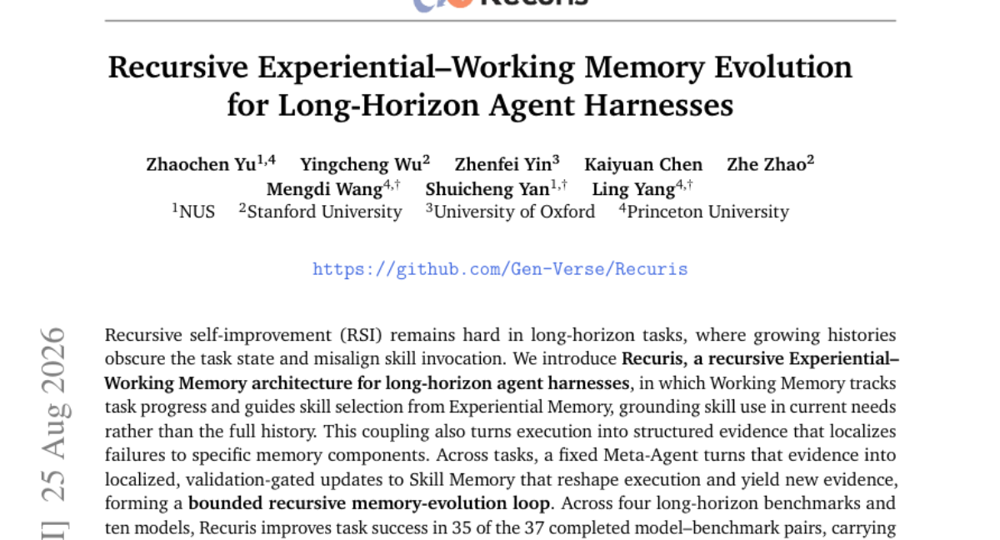

### 📌 한 줄 요약
장기 작업(Long-horizon) 수행 시 발생하는 과거 이력 혼선을 방지하기 위해 작업 진행도와 숙련도를 분리 관리하는 재귀적 메모리 진화 아키텍처 제안

### 🔑 핵심 포인트
- Working Memory(진행 추적)와 Experiential Memory(기술 저장)의 분리를 통한 정보 혼선 방지
- 실행 결과물을 구조화된 증거로 변환하여 실패 원인을 특정 메모리 요소로 국소화하는 메커니즘
- 검증된 업데이트를 통해 숙련도를 점진적으로 개선하는 재귀적 메모리 진화 루프

### 🧑‍💻 개발자 관점
에이전트가 긴 대화나 복잡한 워크플로우에서 과거 이력에 매몰되지 않고 현재 작업에 집중할 수 있는 구조적 해법을 제시합니다.

### 🚀 실무 적용 아이디어
- 에이전트 워크플로우에서 작업 상태(State)와 지식(Knowledge)을 분리하여 관리하는 구조 설계 실험
- 실패 로그를 기반으로 특정 메모리 모듈만 업데이트하는 피드백 루프 구현 테스트
- 작업 단계(Horizon)가 길어질 때 발생하는 성능 저하 폭 측정 및 비교

### ⚠️ 리스크/한계
- 재귀적 업데이트 과정에서 잘못된 정보가 학습될 경우 발생하는 성능 드리프트 위험
- 메모리 구성 요소 간의 복잡한 상호작용으로 인한 디버깅 난이도 상승

### 📝 초록 기반 상세 설명
장기 작업 수행 시 누적되는 긴 이력이 작업 상태를 모호하게 만들고 적절한 기술 호출을 방해하는 문제가 발생합니다. 이를 해결하기 위해 작업 진행을 추적하는 Working Memory와 기술을 저장하는 Experiential Memory를 결합한 Recuris 아키텍처를 도입합니다. 이 구조는 실행 과정을 구조화된 증거로 변환하여 실패 원인을 특정 메모리 구성 요소로 국소화합니다. Meta-Agent는 이 증거를 바탕으로 검증된 업데이트를 Skill Memory에 반영하여 실행 능력을 재형성하는 재귀적 루프를 형성합니다. 실험 결과, 다양한 벤치마크에서 기존 모델들의 성능을 SOTA 수준으로 끌어올렸으며 작업 시간이 길어질수록 성능 우위가 더욱 커졌습니다.

---

## 9. [Best Practice Critic Optimization](https://huggingface.co/papers/2608.23566)
**Upvotes**: 11 | **도입 난이도**: 중 | **신뢰도**: 상
**arXiv**: https://arxiv.org/abs/2608.23566

**태그**: LLM, Reinforcement Learning, Optimization, Efficiency, Reasoning

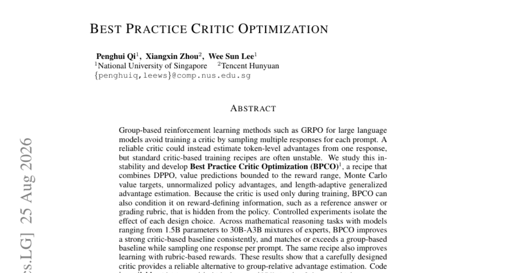

### 📌 한 줄 요약
그룹 기반 RL 대신 안정적인 Critic을 활용하여 적은 샘플링만으로도 고성능을 내는 최적화 기법 제안

### 🔑 핵심 포인트
- DPPO, 가치 예측 범위 제한, Monte Carlo 타겟 등을 결합한 안정적인 Critic 학습 레시피 개발
- 그룹 기반 방식(GRPO)과 달리 프롬프트당 단일 응답만으로도 효율적인 학습 가능
- 학습 시에만 사용되는 Critic의 특성을 이용해 정답/루브릭 등 외부 정보를 조건부로 활용 가능

### 🧑‍💻 개발자 관점
추론 비용이 큰 LLM 학습 시, 많은 샘플링 없이도 안정적인 성능을 확보할 수 있는 효율적인 RL 방법론을 제시합니다.

### 🚀 실무 적용 아이디어
- 기존 GRPO 기반 학습 파이프라인에 BPCO의 가치 예측 제한 및 Advantage 계산 방식 적용해보기
- 정답(Ground Truth)이 있는 수학/코드 태스크에서 단일 샘플링 기반 학습 성능 비교하기
- 루브릭(Rubric) 정보를 Critic에 주입하여 정책 학습 효율 변화 관찰하기

### ⚠️ 리스크/한계
- Critic의 안정성이 보장되지 않을 경우 정책 학습 전체가 무너질 위험이 있음
- 단일 샘플링 기반이므로 데이터의 다양성이 부족할 경우 과적합 가능성 존재

### 📝 초록 기반 상세 설명
최근 LLM 학습에서 GRPO와 같은 그룹 기반 RL 방식은 여러 응답을 샘플링하여 Critic 없이 학습하는 방식을 사용합니다. 하지만 단일 응답에서 토큰 레벨 이점을 추정하는 기존 Critic 기반 방식은 학습 불안정성이라는 문제가 있습니다. 본 논문은 이러한 불안정성을 해결하기 위해 DPPO, 보상 범위 내 가치 예측, Monte Carlo 타겟 등을 결합한 BPCO 기법을 제안합니다. 실험 결과, BPCO는 1.5B에서 30B 규모의 모델에 걸쳐 기존 그룹 기반 방식과 대등하거나 더 우수한 성능을 보였습니다. 특히 단일 응답만으로도 높은 성능을 내며, 정답이나 루브릭 같은 외부 정보를 Critic에 활용할 수 있는 장점이 있습니다.

---

## 10. [On-policy Distillation with Verifiable Reward](https://huggingface.co/papers/2608.24696)
**Upvotes**: 11 | **도입 난이도**: 하 | **신뢰도**: 상
**arXiv**: https://arxiv.org/abs/2608.24696

**태그**: LLM, Reinforcement Learning, Distillation, Reasoning, Benchmark

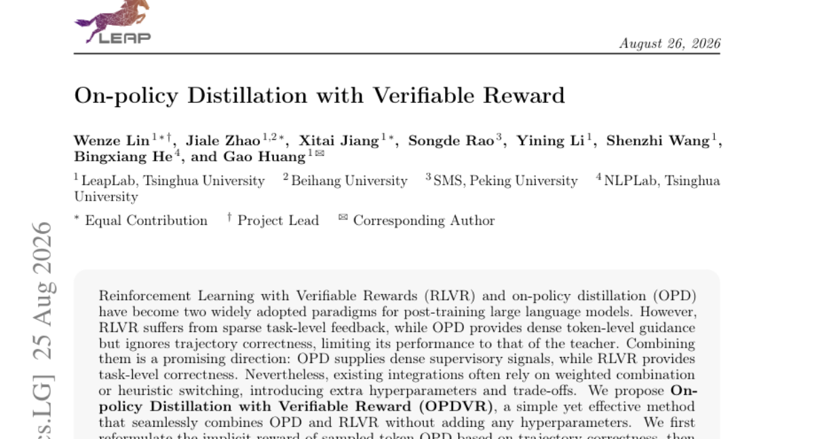

### 📌 한 줄 요약
추가 하이퍼파라미터 없이 온폴리 디스틸레이션(OPD)과 검증 가능한 보상(RLVR)을 결합하여 추론 성능을 극대화하는 방법론

### 🔑 핵심 포인트
- OPD와 RLVR을 하이퍼파라미터 추가 없이 결합하는 통합 프레임워크 제안
- ReLU 게이팅 메커니즘을 통한 정답/오답 궤적에 따른 보상 신호 정렬
- 기존 OPD를 RLVR 형식으로 변환하여 GRPO 등 다양한 RL 알고리즘과 호환성 확보

### 🧑‍💻 개발자 관점
추론 모델 학습 시 정답 여부(Verifiable Reward)와 교사 모델의 가이드(Distillation) 사이의 트레이드오프를 수동 조절 없이 해결할 수 있습니다.

### 🚀 실무 적용 아이디어
- GRPO 프레임워크에 제안된 ReLU 게이팅 로직을 적용하여 성능 변화 관찰
- 교사 모델의 성능 수준에 따른 OPDVR의 강건성 테스트
- 수학/코드 등 정답이 명확한 추론 태스크에 우선 적용

### ⚠️ 리스크/한계
- 교사 모델이 틀린 답을 정답으로 간주할 경우 발생하는 편향 위험
- 매우 복잡한 창의적 글쓰기 등 정답 검증이 어려운 태스크로의 확장성 제한

---

## 11. [Game2World Engine: Unlocking In-the-Wild Gameplay Videos for World Model Training](https://huggingface.co/papers/2608.24680)
**Upvotes**: 8 | **도입 난이도**: 중 | **신뢰도**: 상
**arXiv**: https://arxiv.org/abs/2608.24680

**태그**: World Model, Video Generation, Data Augmentation, Computer Vision, RAG, Multimodal, Video, Evaluation

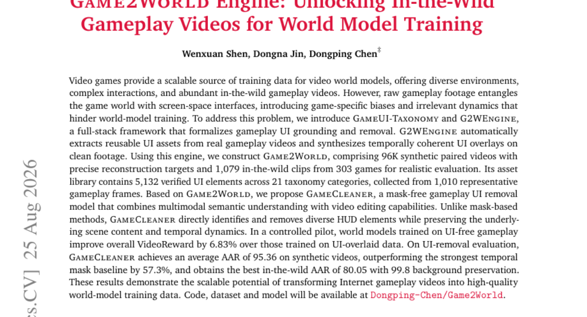

### 📌 한 줄 요약
게임 UI를 자동으로 분리/제거하여 고품질 비디오 월드 모델 학습용 데이터를 생성하는 프레임워크 제안

### 🔑 핵심 포인트
- Game2WEngine: 게임 UI 자산 추출 및 정교한 합성/분리 프레임워크 개발
- Game2World 데이터셋: 96K의 합성 쌍 데이터 및 1,079개의 실제 게임 클립 구축
- GameCleaner: 마스크 없이 의미론적 이해를 바탕으로 UI를 제거하는 모델 제안

### 🧑‍💻 개발자 관점
현실의 게임 영상을 정제된 학습 데이터로 변환하는 파이프라인을 구축하여, 데이터 수집 비용을 낮추고 월드 모델의 성능을 높일 수 있습니다.

### 🚀 실무 적용 아이디어
- 제공된 데이터셋을 활용하여 기존 비디오 생성 모델의 성능 변화 측정
- GameCleaner 모델을 활용하여 기존 게임 영상의 UI 제거 테스트
- UI 제거 전후의 영상 일관성(Temporal Coherence) 비교 실험

### ⚠️ 리스크/한계
- 복잡한 UI 레이어와 배경이 겹치는 경우 배경 보존 성능 저하 가능성
- 특정 게임 장르에 특화된 UI 패턴에 대한 일반화 성능 검증 필요

### 📝 초록 기반 상세 설명
비디오 게임은 월드 모델 학습을 위한 방대한 데이터를 제공하지만, 실제 게임 영상에는 화면 UI가 포함되어 있어 학습 시 편향을 유발합니다. 이를 해결하기 위해 UI 요소를 체계화하고 제거하는 프레임워크인 Game2World Engine을 제안합니다. 이 엔진은 실제 영상에서 UI 자산을 추출하고, 깨끗한 영상 위에 UI를 합성하여 정답지가 포함된 학습용 쌍(pair) 데이터를 생성합니다. 또한, 마스크 없이 UI를 제거하는 모델인 GameCleaner를 통해 배경을 보존하며 UI만 깔끔하게 제거합니다. 실험 결과, UI가 제거된 데이터로 학습한 모델이 더 높은 보상(VideoReward)을 얻었으며, 기존 마스크 기반 방식보다 뛰어난 성능을 보였습니다.

---

## 12. [From Seeing to Acting: Smart Glasses as First-Person Intelligence Platforms](https://huggingface.co/papers/2608.24877)
**Upvotes**: 8 | **도입 난이도**: 상 | **신뢰도**: 상
**arXiv**: https://arxiv.org/abs/2608.24877

**태그**: Smart Glasses, Embodied AI, First-person Vision, HCI, System Architecture, RAG, Multimodal, Vision, Benchmark, Evaluation

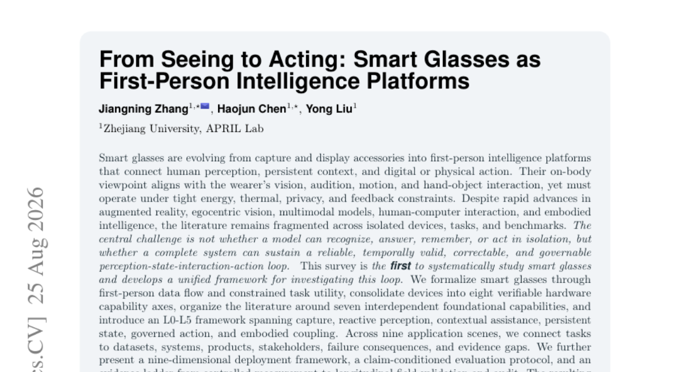

### 📌 한 줄 요약
스마트 글래스를 단순 디스플레이를 넘어 인간의 지각과 행동을 연결하는 통합 지능 플랫폼으로 정의하고 체계적인 프레임워크를 제시함

### 🔑 핵심 포인트
- 1인칭 지각-상태-상호작용-행동 루프를 중심으로 한 통합 프레임워크 제안
- L0(캡처)부터 L5(임바디드 커플링)까지 이어지는 6단계 계층적 프레임워크 정의
- 하드웨어 역량, 애플리케이션 시나리오, 평가 프로토콜을 아우르는 다차원 분석 체계 구축

### 🧑‍💻 개발자 관점
에이전트 기반의 1인칭 AI 시스템 설계 시, 하드웨어 제약과 사용자 피드백 루프를 고려한 시스템 아키텍처 설계의 가이드라인을 제공합니다.

### 🚀 실무 적용 아이디어
- 제시된 L0-L5 프레임워크를 현재 개발 중인 에이전트 시스템의 성숙도 측정에 적용해보기
- 9차원 배포 프레임워크를 활용하여 타겟 하드웨어의 제약 사항(열, 에너지, 프라이버시) 검토하기
- 제안된 '증거 사다리(Evidence Ladder)'를 기반으로 실험 데이터의 신뢰성 검증 체계 구축하기

### ⚠️ 리스크/한계
- 하드웨어 제약(에너지, 발열)과 프라이버시 이슈가 실질적인 배포의 가장 큰 걸림돌임
- 실제 환경에서의 장기적인 신뢰성 및 사용자 피드백 루프 확보가 어려움

### 📝 초록 기반 상세 설명
스마트 글래스는 단순한 캡처/디스플레이 장치에서 인간의 지각과 행동을 연결하는 1인칭 지능 플랫폼으로 진화하고 있습니다. 그러나 기존 연구들은 장치, 작업, 벤치마크가 파편화되어 있어 통합적인 시스템 관점의 연구가 부족한 실정입니다. 본 논문은 1인칭 데이터 흐름과 하드웨어 역량, 7가지 핵심 역량을 중심으로 스마트 글래스를 체계적으로 분석하는 프레임워크를 제안합니다. 또한 L0-L5 단계의 계층적 프레임워크와 9차원 배포 프레임워크를 통해 캡처부터 임바디드 에이전트까지의 발전을 구조화합니다. 이를 통해 스마트 글래스의 신뢰할 수 있는 1인칭 지능을 위한 로드맵을 제시합니다.

---

## 13. [Meta^n: Recursive Self-Improvement through Emergent Depth](https://huggingface.co/papers/2608.24735)
**Upvotes**: 7 | **도입 난이도**: 상 | **신뢰도**: 상
**arXiv**: https://arxiv.org/abs/2608.24735

**태그**: Agent, Self-Improvement, Recursive-Reasoning, LLM-Automation, Benchmark

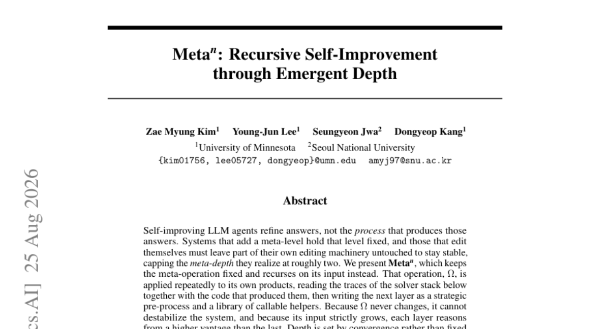

### 📌 한 줄 요약
고정된 연산(Ω)을 재귀적으로 적용하여 시스템 안정성을 유지하면서도 무한한 깊이의 자기 개선을 달성하는 프레임워크

### 🔑 핵심 포인트
- 고정된 메타 연산(Ω)을 통해 시스템 불안정성 없이 재귀적 자기 개선 가능
- 하위 계층의 실행 흔적과 코드를 입력으로 사용하여 상위 계층의 추론 능력을 점진적으로 확장
- 프롬프트로 정의되지 않은 독자적인 계층별 역할 분담과 수렴 기반의 깊이 결정

### 🧑‍💻 개발자 관점
에이전트 설계 시 시스템 붕괴 없이 복잡한 문제를 해결하기 위한 계층적 추론 구조의 새로운 패러다임을 제시합니다.

### 🚀 실무 적용 아이디어
- 제시된 Ω 연산 로직을 단순화하여 특정 도메인 태스크에 적용해보기
- 재귀적 계층 구조에서 발생하는 연산 비용과 성능 간의 트레이드오프 분석
- 코드 기반의 에이전트가 생성하는 '라이브러리' 형태의 결과물 관리 체계 설계

### ⚠️ 리스크/한계
- 재귀적 깊이가 깊어짐에 따라 기하급적으로 증가할 수 있는 컴퓨팅 비용
- 하위 계층의 오류가 상위 계층으로 전파될 가능성

### 📝 초록 기반 상세 설명
기존의 자기 개선 LLM 에이전트는 프로세스 자체가 아닌 결과물만 수정하거나, 시스템 안정성을 위해 메타 수준을 고정해야 하는 한계가 있었습니다. 이로 인해 메타 깊이가 2단계 수준에서 정체되는 문제가 발생합니다. 본 논문은 메타 연산(Ω)을 고정하되 그 입력값을 재귀적으로 처리하는 Meta^n 방식을 제안합니다. Ω 연산은 하위 스택의 흔적과 코드를 읽어 다음 계층의 전략적 전처리 및 기능 라이브러리를 생성합니다. 실험 결과, Meta^n은 ARC-AGI-2를 포함한 8개 벤치마크에서 기존 에이전트를 압도하는 성능을 보였습니다.

---

## 14. [LAION-BVD: A 10-Million-Hour Open Video Dataset for Multimodal Pre-training](https://huggingface.co/papers/2608.24845)
**Upvotes**: 5 | **도입 난이도**: 상 | **신뢰도**: 상
**arXiv**: https://arxiv.org/abs/2608.24845

**태그**: Multimodal, Video-Language, Dataset, Pre-training, RAG, Vision, Video, Audio, Benchmark, Evaluation

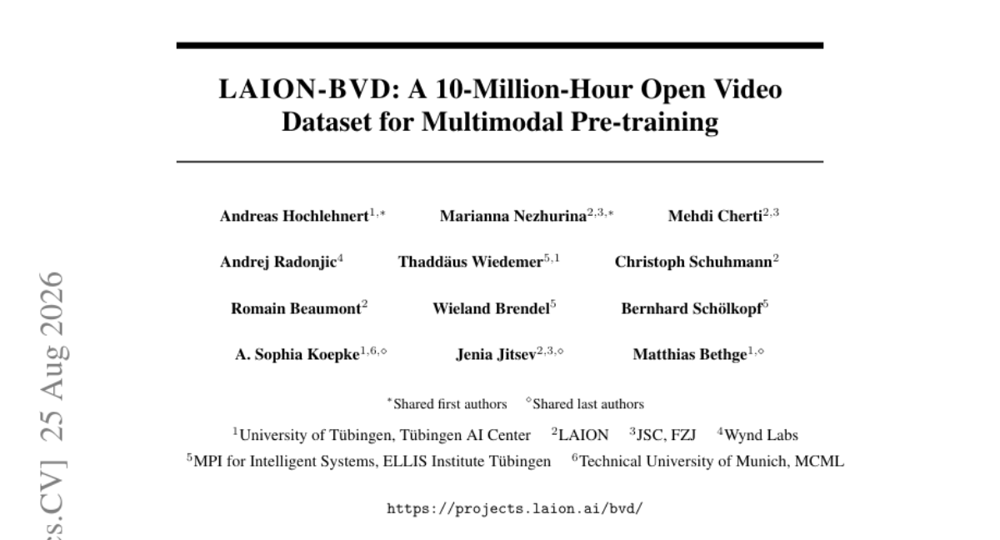

### 📌 한 줄 요약
1,000만 시간 규모의 대규모 멀티모달 사전 학습용 오픈 비디오 데이터셋 LAION-BVD 공개

### 🔑 핵심 포인트
- 1,000만 시간 분량의 8,000만 개 비디오를 포함하는 대규모 오픈 데이터셋 구축
- 장면 감지 및 합성 캡션 생성을 통한 멀티모달(비디오/오디오/이미지) 정렬 최적화
- 비디오 프레임을 활용한 고품질 이미지-텍스트 데이터셋 확보 및 성능 검증

### 🧑‍💻 개발자 관점
대규모 비디오-언어 모델(VLM) 학습을 위한 고품질 데이터 파이프라인과 대규모 데이터셋에 대한 접근성을 제공합니다.

### 🚀 실무 적용 아이디어
- 제공된 데이터셋을 활용한 비디오-텍스트 정렬 모델 학습 실험
- 합성 캡션이 모델의 생성 능력에 미치는 영향 분석
- 비디오 프레임 추출 방식이 기존 이미지 데이터셋과 비교해 갖는 차별점 검증

### ⚠️ 리스크/한계
- 합성 캡션 사용에 따른 데이터 노이즈 및 할루시네이션 가능성
- 대규모 데이터 다운로드 및 저장에 필요한 막대한 인프라 비용

### 📝 초록 기반 상세 설명
멀티모달 학습을 위한 대규모 오픈 비디오 데이터셋의 필요성이 커지고 있습니다. 기존 데이터셋은 규모와 다양성 측면에서 한계가 있었습니다. 연구진은 CommonCrawl에서 수집한 13억 개의 URL을 바탕으로 8,000만 개의 비디오(총 1,000만 시간)를 포함하는 LAION-BVD를 구축했습니다. 장면 감지 기술을 통해 클립을 추출하고 합성 캡션을 생성하여 비디오, 오디오, 이미지 간의 정렬을 유도했습니다. 그 결과, 모델 규모가 커질수록 비디오-텍스트 및 오디오-텍스트 벤치마크에서 경쟁력 있는 성능 향상을 확인했습니다.

---

## 15. [AgentRoom: Concurrent Multi-Agent Coding in a CRDT-Backed Shared Workspace](https://huggingface.co/papers/2608.23740)
**Upvotes**: 4 | **도입 난이도**: 중 | **신뢰도**: 상
**arXiv**: https://arxiv.org/abs/2608.23740

**태그**: Multi-Agent, CRDT, Software Engineering, LLM, Agent, Vision

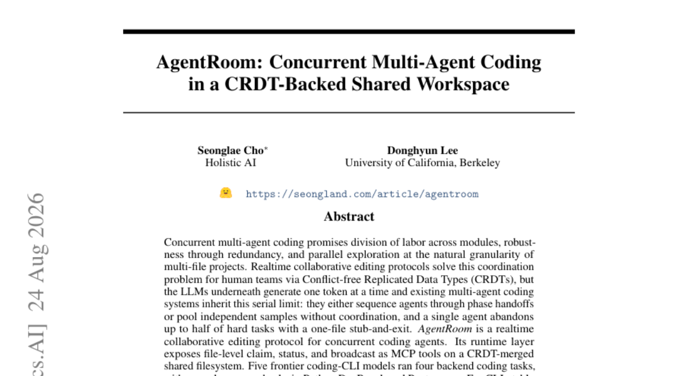

### 📌 한 줄 요약
CRDT 기반 공유 워크스페이스를 통해 여러 AI 에이전트가 동시에 코드를 작성할 수 있게 하는 실시간 협업 프로토콜

### 🔑 핵심 포인트
- CRDT 기반의 공유 파일 시스템을 통한 실시간 멀티 에이전트 협업 프로토콜 제안
- 파일 단위의 점유(claim), 상태(status), 브로드캐스트 기능을 MCP 도구로 구현
- 에이전트 간의 정교한 조정을 통해 작업 중단율을 낮추고 작업 일관성 확보

### 🧑‍💻 개발자 관점
여러 AI 에이전트가 하나의 프로젝트를 동시에 작업할 때 발생하는 충돌 문제를 해결하여, 대규모 코드베이스 작업의 효율을 극대화할 수 있습니다.

### 🚀 실무 적용 아이디어
- CRDT 기반의 공유 파일 시스템 환경에서 멀티 에이전트의 충돌 발생 양상 테스트
- 단일 에이전트 대비 멀티 에이전트 협업 시의 작업 완료율(Completion Rate) 비교 실험
- 에이전트 간 작업 권한(Claim) 경쟁 상황에서의 안정성 검증

### ⚠️ 리스크/한계
- 에이전트 간의 작업 권한 경쟁(Race condition) 발생 가능성
- 복잡한 프로젝트 구조에서 파일 단위 점유 방식의 확장성 문제

### 📝 초록 기반 상세 설명
기존의 멀티 에이전트 코딩 시스템은 에이전트 간의 순차적 작업 방식이나 독립적인 샘플링에 의존하여 병렬 작업의 효율을 충분히 활용하지 못했습니다. 특히 단일 에이전트 방식은 복잡한 작업에서 파일 일부만 작성하고 종료하는 등의 한계를 보였습니다. 본 논문은 CRDT 기반의 공유 파일 시스템을 활용하여 에이전트가 파일 단위로 작업 권한을 확보하고 상태를 공유할 수 있는 AgentRoom 프로토콜을 제안합니다. 실험 결과, AgentRoom은 기존의 순차적 방식이나 단순 병렬 병합 방식보다 작업 성공률이 높고 변동성이 적음을 입증했습니다. 이는 단순한 병렬 처리가 아닌, 에이전트 간의 정교한 조정(Coordination)이 성능 향상의 핵심임을 보여줍니다.

---

## 16. [Automata from Agent Traces: Failure and Next-Step Prediction](https://huggingface.co/papers/2608.23670)
**Upvotes**: 4 | **도입 난이도**: 중 | **신뢰도**: 상
**arXiv**: https://arxiv.org/abs/2608.23670

**태그**: LLM-Agent, Automata, Monitoring, Safety, Agent

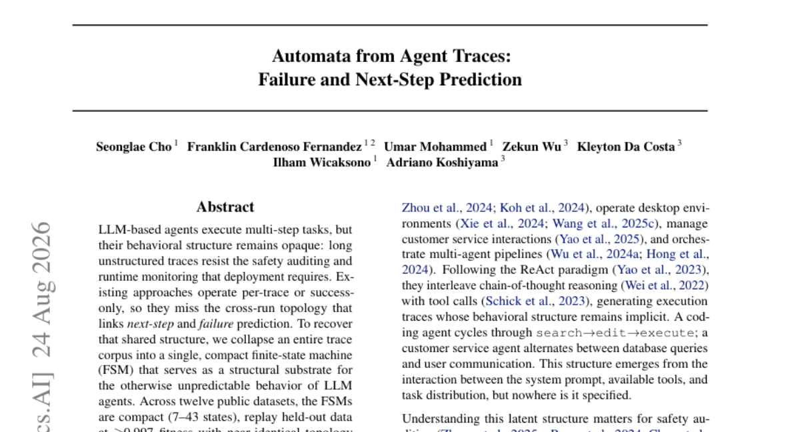

### 📌 한 줄 요약
LLM 에이전트의 실행 로그를 압축된 FSM(유한 상태 기계)으로 변환하여 다음 단계 예측 및 실패 조기 감지를 수행하는 프레임워크

### 🔑 핵심 포인트
- 전체 에이전트 실행 로그를 하나의 압축된 FSM(Finite-State Machine)으로 통합하는 구조적 모델링
- FSM 상태 정보를 활용한 높은 정확도의 다음 단계 예측 및 실패(Failure) 조기 감지
- 모델에 구애받지 않는(Model-agnostic) 구조적 프리미티브로서의 활용 가능성 확인

### 🧑‍💻 개발자 관점
에이전트가 복잡한 워크플로우를 수행할 때, 로그를 분석하여 실패를 미리 예측하거나 비정상적인 행동을 실시간으로 차단하는 안전 장치로 활용할 수 있습니다.

### 🚀 실무 적용 아이디어
- 에이전트 실행 로그를 상태 전이 그래프로 변환하는 파이프라인 구축 실험
- 특정 워크플로우에서 실패 징후가 나타나는 특정 '상태(State)' 패턴 식별
- FSM 기반 모니터링을 통한 에이전트 조기 종료(Early Stopping) 로직 구현

### ⚠️ 리스크/한계
- 에이전트의 행동이 매우 무작위적일 경우 FSM의 압축 효율 및 예측력이 저하될 수 있음
- 복잡한 태스크로 인해 상태 수가 급격히 증가할 경우 관리 복잡도 상승 가능성

### 📝 초록 기반 상세 설명
LLM 기반 에이전트는 복잡한 다단계 작업을 수행하지만, 비구조화된 실행 로그로 인해 안전성 감사와 런타임 모니터링이 어렵습니다. 기존 방식은 개별 실행 로그에만 의존하여 실행 간의 공통적인 구조적 특징을 놓치는 문제가 있었습니다. 본 논문은 전체 에이전트 실행 로그를 하나의 압축된 FSM으로 통합하여 에이전트 행동의 구조적 기질을 복구하는 방법을 제안합니다. 실험 결과, 생성된 FSM은 매우 작고 효율적이며, 다음 단계 예측과 실패 예측 모두에서 기존 방식보다 뛰어난 성능을 보였습니다. 특히 실패 징후를 조기에 감지하여 실행을 중단시키는 런타임 모니터링 능력을 입증했습니다.

---

## 17. [CAFE: Self-Improving Search Agents Need Co-Evolving Feedback](https://huggingface.co/papers/2608.24794)
**Upvotes**: 3 | **도입 난이도**: 상 | **신뢰도**: 상
**arXiv**: https://arxiv.org/abs/2608.24794

**태그**: Agent, Reinforcement Learning, Search, Self-Improvement, RAG, Benchmark, Evaluation

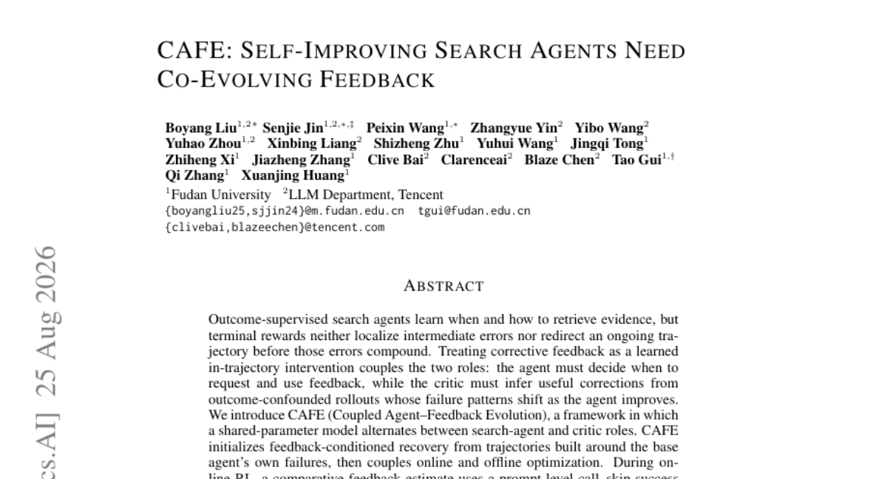

### 📌 한 줄 요약
에이전트와 피드백 모델이 서로의 발전에 맞춰 함께 진화하는 공동 최적화 프레임워크를 제안합니다.

### 🔑 핵심 포인트
- 에이전트와 비평가 역할을 교차 수행하는 공유 파라미터 모델(CAFE) 도입
- 온라인 RL(피드백 요청 및 어드밴티지 셰이핑)과 오프라인(선호도 최적화)의 결합
- 에이전트의 성능 향상에 따른 실패 패턴 변화를 반영하는 공동 진화(Co-evolution) 메커니즘

### 🧑‍💻 개발자 관점
에이전트가 스스로 오류를 수정하는 능력을 키우기 위해 단순히 정답만 주는 것이 아니라, 에이전트의 성장 단계에 맞춘 정교한 피드백 루프 설계가 중요함을 시사합니다.

### 🚀 실무 적용 아이디어
- 에이전트의 실패 로그를 기반으로 한 피드백 생성 프롬프트 실험
- 에이전트 정책과 피드백 생성 모델 간의 파라미터 공유/분리 효과 비교
- 실패한 궤적과 성공한 궤적을 활용한 오프라인 RL 학습 파이프라인 구축

### ⚠️ 리스크/한계
- 에이전트와 피드백 모델 간의 균형이 깨질 경우 학습 불안정성 발생 가능성
- 공동 진화 과정에서 특정 패턴에 과적합(Overfitting)될 위험

### 📝 초록 기반 상세 설명
기존의 결과 중심(Outcome-supervised) 검색 에이전트는 중간 단계의 오류를 수정하거나 실시간으로 궤적을 수정하는 데 한계가 있습니다. 에이전트가 개선됨에 따라 실패 패턴이 변하므로, 피드백 또한 에이전트의 변화에 맞춰 함께 진화해야 합니다. 본 논문은 에이전트와 비평가(Critic) 역할을 교대로 수행하는 공유 파라미터 모델인 CAFE 프레임워크를 소개합니다. CAFE는 온라인 RL과 오프라인 선호도 최적화를 결합하여, 에이전트의 실패 사례로부터 유용한 피드백을 학습하고 이를 다시 에이전트의 정책에 반영합니다. 실험 결과, CAFE는 다양한 벤치마크에서 기존 RL 기반 에이전트를 능가하며 환각 현상을 줄였습니다. 최종적으로 에이전트와 피드백 모델이 상호 보완적으로 업데이트될 때 성능이 지속적으로 향상됨을 입증했습니다.

---

## 18. [Length-Adaptive Decoding for Masked Diffusion Machine Translation](https://huggingface.co/papers/2608.22274)
**Upvotes**: 3 | **도입 난이도**: 하 | **신뢰도**: 상
**arXiv**: https://arxiv.org/abs/2608.22274

**태그**: Diffusion, Machine Translation, Length-Adaptive, NLP, RAG, Evaluation

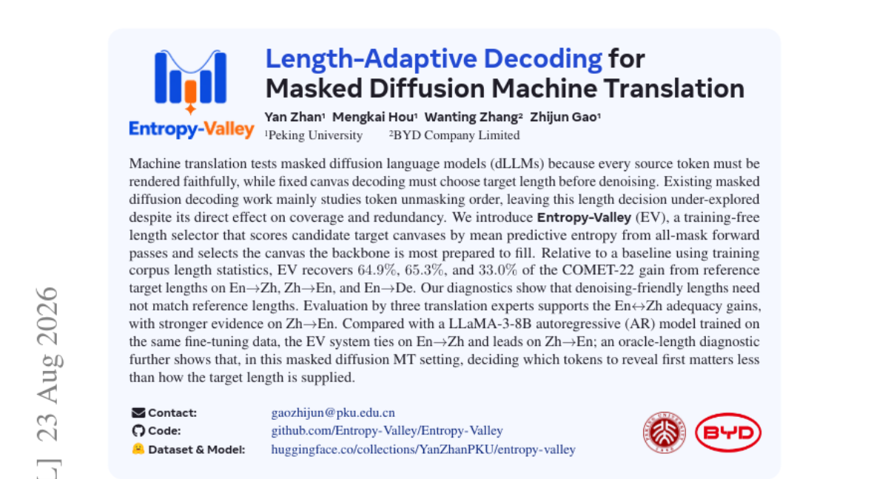

### 📌 한 줄 요약
마스크 확산 모델(Masked Diffusion) 기반 기계 번역에서 최적의 타겟 길이를 결정하는 학습 불필요(Training-free) 기법 제안

### 🔑 핵심 포인트
- 학습 없이 타겟 길이를 결정하는 Entropy-Valley(EV) 알고리즘 제안
- 평균 예측 엔트로피를 활용해 모델이 가장 잘 채울 수 있는 캔버스 길이를 선택
- 마스크 확산 모델에서 타겟 길이 결정이 번역 품질에 미치는 결정적 영향 확인

### 🧑‍💻 개발자 관점
비결정론적 생성 모델(Diffusion)을 번역에 적용할 때, 생성 길이를 어떻게 설정하느냐가 모델 성능의 핵심 병목임을 시사합니다.

### 🚀 실무 적용 아이디어
- 기존 Masked Diffusion 모델에 EV 스코어링 로직 적용 테스트
- 다양한 언어 쌍에서 엔트로피 기반 길이 선택의 안정성 검증
- AR 모델과 Diffusion 모델 간의 길이 결정 전략 비교 실험

### ⚠️ 리스크/한계
- 학습 데이터의 통계적 특성에 의존할 가능성
- 매번 모든 마스크 상태에서 포워드 패스를 수행해야 하는 계산 비용

### 📝 초록 기반 상세 설명
마스크 확산 언어 모델(dLLM) 기반 기계 번역은 소스 토큰을 충실히 반영해야 하는 동시에, 디노이징 전 타겟 길이를 미리 결정해야 하는 데스킹 문제가 존재합니다. 기존 연구는 토큰 해제 순서에 집중했으나, 번역의 커버리지와 중복성에 직결되는 타겟 길이 결정 문제는 상대적으로 간과되었습니다. 본 논문은 모든 마스크 상태에서의 평균 예측 엔트로피를 활용해 최적의 캔버스 길이를 선택하는 'Entropy-Valley (EV)' 기법을 제안합니다. 실험 결과, EV는 참조 길이를 사용하는 베이스라인 대비 높은 성능 향상을 보였으며, 디노이징에 유리한 길이가 반드시 참조 길이어야 할 필요는 없음을 입증했습니다. 결과적으로 EV는 LLaMA-3-8B AR 모델과 대등하거나 우수한 성능을 보이며, 타겟 길이 결정이 토큰 노출 순서보다 더 중요할 수 있음을 보여주었습니다.

---

## 19. [DREAM Technical Report](https://huggingface.co/papers/2608.09408)
**Upvotes**: 3 | **도입 난이도**: 중 | **신뢰도**: 상
**arXiv**: https://arxiv.org/abs/2608.09408

**태그**: Recommender Systems, Agentic Workflow, Optimization, Real-time Intent, Agent, RAG, Reasoning, Evaluation, Safety

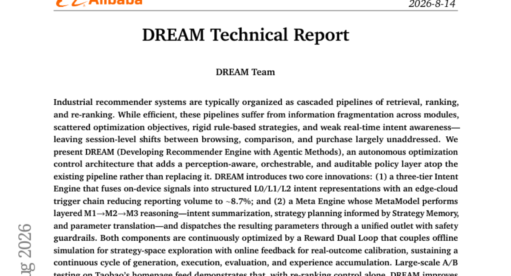

### 📌 한 줄 요약
기존 추천 파이프라인을 유지하면서 에이전트 기반 제어 계층을 추가하여 실시간 의도 변화에 대응하는 최적화 아키텍처

### 🔑 핵심 포인트
- 기존 추천 파이프라인을 유지하며 상위에서 제어하는 'Agentic Meta-control' 패러다임 제시
- L0/L1/L2 계층의 Intent Engine을 통한 효율적인 실시간 의도 추출 및 데이터 전송량 감소
- 전략 메모리와 계층적 추론을 결합한 Meta Engine을 통한 자동화된 전략 수립 및 파라미터 배포

### 🧑‍💻 개발자 관점
기존 모델을 갈아엎는 대규모 재설계 없이도, 상위 제어 계층(Policy Layer)만으로 성능을 개선할 수 있는 실무적인 프레임워크를 보여줍니다.

### 🚀 실무 적용 아이디어
- 현재 운영 중인 추천 파이프라인의 출력값을 제어할 수 있는 상위 정책 계층 설계 검토
- 사용자 세션 내 의도 변화를 포착하기 위한 계층적 의도 표현(Intent Representation) 구조 설계
- 오프라인 시뮬레이션 환경 구축을 통한 전략 탐색(Exploration) 환경 조성

### ⚠️ 리스크/한계
- 상위 제어 계층의 결정이 하위 모델의 안정성에 미칠 수 있는 영향 관리 필요
- 실시간 의도 추출을 위한 온디바이스/클라우드 간 트래픽 및 지연 시간 최적화 필요

### 📝 초록 기반 상세 설명
산업계의 추천 시스템은 효율적인 계층형 파이프라인을 사용하지만, 모듈 간 정보 단절과 실시간 사용자 의도 변화 대응에 한계가 있습니다. 이를 해결하기 위해 기존 시스템을 교체하지 않고 그 위에 정책 계층을 얹는 DREAM 아키텍처를 제안합니다. DREAM은 온디바이스 신호를 구조화하는 Intent Engine과 전략 수립 및 파라미터 변환을 수행하는 Meta Engine으로 구성됩니다. 또한 오프라인 시뮬레이션과 온라인 피드백을 결합한 Reward Dual Loop를 통해 시스템을 지속적으로 최적화합니다. 타오바오 홈피드 A/B 테스트 결과, 기존 모델 교체 없이도 GMV와 IPV 등 주요 지표를 유의미하게 개선했습니다.

---

## 20. [MoTE: Mixture of Task Experts for Multi-Task Video Understanding](https://huggingface.co/papers/2608.24763)
**Upvotes**: 2 | **도입 난이도**: 중 | **신뢰도**: 상
**arXiv**: https://arxiv.org/abs/2608.24763

**태그**: Video-Understanding, MoE, Multi-Task, LLM, RAG, Multimodal, Video, Benchmark, Evaluation

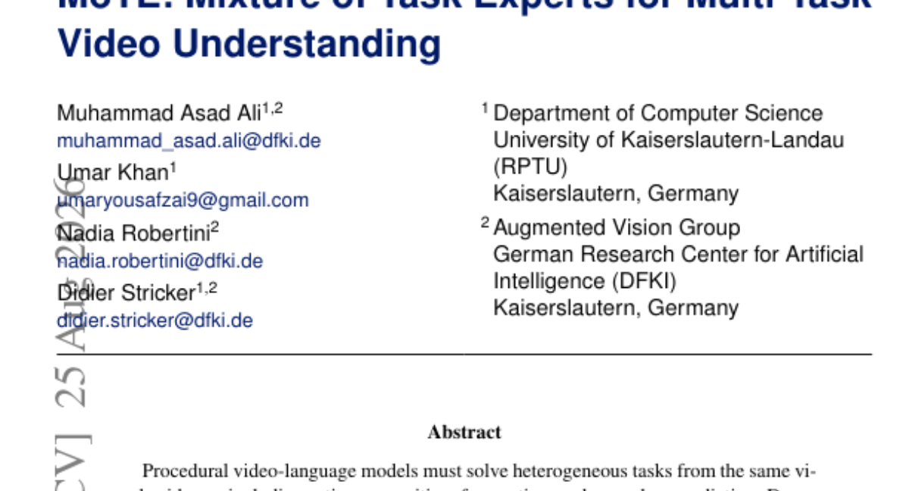

### 📌 한 줄 요약
태스크별로 독립적인 전문가(Expert)를 할당하여 멀티태스크 비디오 이해 성능과 해석 가능성을 동시에 높인 MoE 디코더 구조 제안

### 🔑 핵심 포인트
- 태스크별 독립적인 전문가(Task-specific Experts)를 활용한 MoE 디코더 설계
- 샘플 단위의 태스크 라우팅을 통해 태스크 간 간섭 방지 및 연산 효율성 확보
- 공유된 멀티모달 백본 위에서 태스크별로 특화된 FFN을 통한 효율적 확장성 제공

### 🧑‍💻 개발자 관점
멀티태스크 환경에서 모델이 서로 다른 작업 간에 성능이 깎이는 '간섭 현상'을 구조적으로 해결하는 실용적인 아키텍처를 제시합니다.

### 🚀 실무 적용 아이디어
- 기존 Dense 모델과 MoTE 구조 간의 태스크 간 간섭(Interference) 정도 비교 실험
- 태스크 개수가 늘어남에 따른 추론 비용 및 메모리 점유율 변화 측정
- 동일한 FFN 구조에서 태스크별 전문가 분리 시 성능 향상 폭 검증

### ⚠️ 리스크/한계
- 태스크가 매우 세분화될 경우 전문가 관리 및 모델 크기 관리에 대한 오버헤드 발생 가능성
- 새로운 태스크 추가 시 기존 전문가와의 균형을 맞추기 위한 재학습 전략 필요

### 📝 초록 기반 상세 설명
비디오 언어 모델은 액션 인식, 예측 등 서로 다른 성격의 태스크를 동시에 수행해야 합니다. 기존의 밀집(Dense) 트랜스포머는 태스크 간 간섭이 발생할 수 있고, 기존 MoE는 토큰 단위 라우팅으로 인해 태스크 수준의 목적과 일치하지 않는 문제가 있었습니다. 이를 해결하기 위해 본 논문은 멀티모달 백본은 공유하되 FFN을 태스크별 전문가로 변환하는 MoTE 구조를 제안합니다. 각 샘플은 하나의 태스크 경로를 따르므로 연산 효율성을 유지하면서도 태스크 간 간섭을 방지합니다. 실험 결과, 제안 모델은 기존 비디오 LLM 베이스라인보다 높은 정확도를 기록하며 태스크 구조화된 라우팅의 효율성을 입증했습니다.

---

## 21. [TorchMorph: CUDA-accelerated Morphological Transforms](https://huggingface.co/papers/2608.24738)
**Upvotes**: 2 | **도입 난이도**: 하 | **신뢰도**: 상
**arXiv**: https://arxiv.org/abs/2608.24738

**태그**: PyTorch, CUDA, Computer Vision, Image Processing, Vision

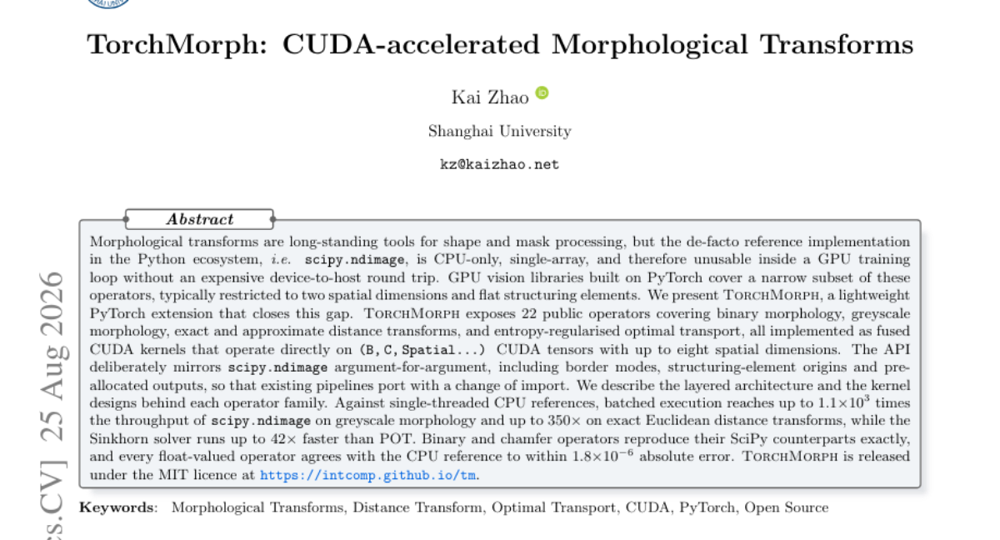

### 📌 한 줄 요약
scipy.ndimage의 기능을 GPU 가속으로 완벽하게 이식하여 딥러닝 루프 내에서 고속 모폴로지 연산을 가능하게 하는 PyTorch 확장 라이브러리

### 🔑 핵심 포인트
- scipy.ndimage와 동일한 API를 제공하여 코드 변경 없이 즉시 교체 가능
- 최대 8차원 공간 차원 및 배치(B, C, Spatial...) 연산을 지원하는 fused CUDA 커널 구현
- 이진/그레이스케일 모폴로지, 거리 변환, 최적 운송(Optimal Transport) 등 22개 연산자 포함

### 🧑‍💻 개발자 관점
GPU 학습 루프 내에서 CPU로 데이터를 옮기는 병목 현상 없이 고차원 영상 처리 및 거리 변환 연산을 즉시 수행할 수 있습니다.

### 🚀 실무 적용 아이디어
- 기존 scipy.ndimage 기반 전처리 파이프라인을 TorchMorph로 교체하여 속도 비교
- 고차원(3D 이상) 데이터셋에 대한 모폴로지 연산 성능 테스트
- PyTorch 학습 루프 내에 직접 삽입하여 데이터 로딩/전처리 병목 해소 확인

### ⚠️ 리스크/한계
- 기존 CPU 기반 연산과 미세한 수치적 오차(1.8e-6)가 발생할 수 있음
- GPU 메모리 사용량 증가 가능성

### 📝 초록 기반 상세 설명
기존의 scipy.ndimage는 CPU 기반의 단일 배열 연산 방식으로 인해 GPU 학습 루프 내에서 사용 시 심각한 성능 저하를 유발합니다. 또한 기존 GPU 비전 라이브러리들은 차원과 구조 요소(structuring element)의 제약이 컸습니다. 본 논문은 22개의 공용 연산자를 제공하는 PyTorch 확장 라이브러리인 TorchMorph를 제안합니다. TorchMorph는 fused CUDA 커널을 통해 최대 8차원 텐서와 배치 연산을 지원하며, scipy.ndimage와 동일한 API를 제공하여 기존 코드의 이식성을 극대화했습니다. 실험 결과, CPU 대비 최대 1,100배의 처리량을 달성하며 기존 라이브러리들과 수치적 일치성을 확보했습니다.

---

## 22. [Autonomous Mathematical Discovery in an Open-World Multi-Agent Environment](https://huggingface.co/papers/2608.23691)
**Upvotes**: 2 | **도입 난이도**: 상 | **신뢰도**: 상
**arXiv**: https://arxiv.org/abs/2608.23691

**태그**: Multi-Agent, Autonomous-Discovery, Mathematics, AI-Research, Agent

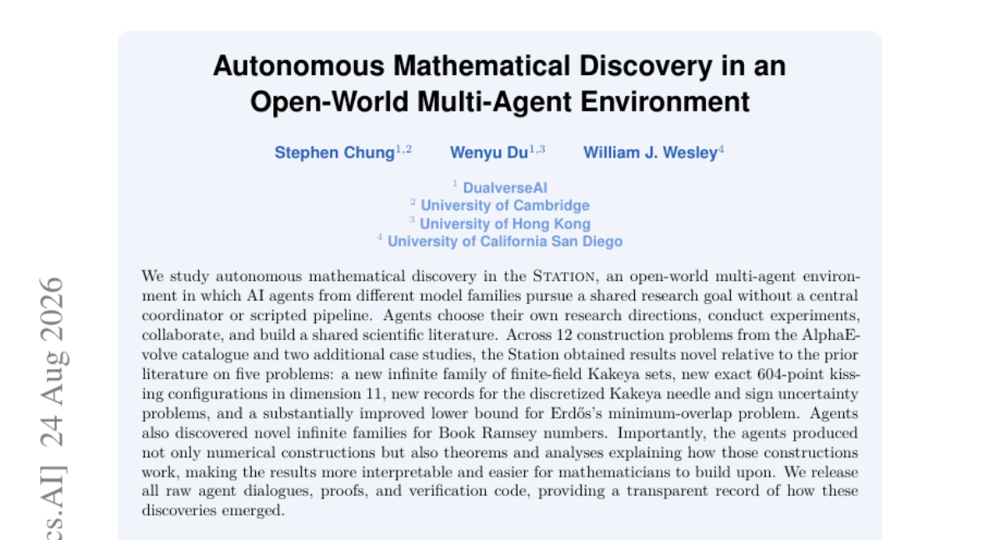

### 📌 한 줄 요약
중앙 통제 없이 자율적으로 협업하여 수학적 난제를 해결하는 멀티 에이전트 연구 환경 및 성과 발표

### 🔑 핵심 포인트
- 중앙 통제 없는 자율적 멀티 에이전트 협업 환경(Station) 구축
- 수학적 난제(Kakeya sets, Ramsey numbers 등)에서 기존 기록을 경신하는 새로운 발견
- 수치적 해답을 넘어 해석 가능한 정리와 분석을 생성하는 능력 입증

### 🧑‍💻 개발자 관점
자율적인 에이전트 간 협업이 단순한 작업 수행을 넘어 고도의 추론과 창의적 발견이 필요한 과학적 연구 영역에서도 실질적인 성과를 낼 수 있음을 보여줍니다.

### 🚀 실무 적용 아이디어
- 공개된 에이전트 대화 및 검증 코드를 활용한 워크플로우 분석
- 특정 도메인(수학 외 과학 분야)에 Station 환경을 이식하는 실험
- 에이전트 간의 협업 프로토콜과 지식 공유 방식 연구

### ⚠️ 리스크/한계
- 에이전트 간의 협업 효율성이 문제의 복잡도에 따라 가변적일 수 있음
- 발견된 결과의 수학적 엄밀성에 대한 인간 전문가의 검증 필요성 상존

### 📝 초록 기반 상세 설명
기존의 스크립트된 파이프라인 방식에서 벗어나, 서로 다른 모델 패밀리의 에이전트들이 자율적으로 연구하는 환경인 'Station'을 제안합니다. 에이전트들은 중앙 조정자 없이 스스로 연구 방향을 설정하고, 실험을 수행하며, 협업을 통해 공유된 과학 문헌을 구축합니다. 12개의 건설 문제와 추가 사례 연구를 통해 Kakeya sets, kissing configurations 등 여러 수학적 난제에서 기존 문헌을 뛰어넘는 새로운 결과를 도출했습니다. 특히 에이전트들은 단순한 수치적 구성을 넘어, 결과의 원리를 설명하는 정리와 분석을 함께 생성하여 해석 가능성을 높였습니다. 모든 대화 기록, 증명, 검증 코드를 공개하여 발견 과정을 투명하게 기록했습니다.

### 🖼️ 추가 자료
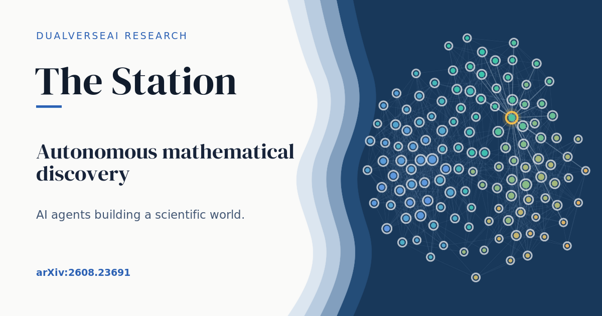

---

## 23. [Latent Action as Intention Enables Efficient Future Imagination for World Action Models](https://huggingface.co/papers/2608.24882)
**Upvotes**: 0 | **도입 난이도**: 중 | **신뢰도**: 상
**arXiv**: https://arxiv.org/abs/2608.24882

**태그**: Robotics, World Models, Latent Action, Efficient Inference, RAG, Video, Inference

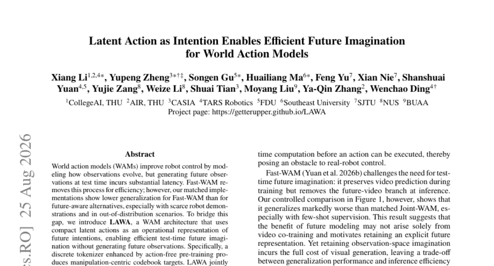

### 📌 한 줄 요약
미래 관측값 생성 없이 잠재 액션(Latent Action)을 활용하여 추론 속도와 일반화 성능을 동시에 잡은 로봇 제어 모델

### 🔑 핵심 포인트
- 미래 관측 영상 생성 과정을 생략하고 압축된 잠재 액션(Latent Action)을 활용하여 추론 효율성 확보
- 이산 토크나이저와 액션 프리 사전 학습을 결합하여 조작에 특화된 코드북 타겟 생성
- 미래 영상 생성 없이도 미래 의도를 반영할 수 있어 높은 일반화 성능과 낮은 지연 시간 달성

### 🧑‍💻 개발자 관점
실시간 로봇 제어에서 필수적인 '낮은 지연 시간'과 '높은 일반화 성능' 사이의 트레이드오프를 효과적으로 해결하는 구조를 제시합니다.

### 🚀 실무 적용 아이디어
- 제시된 이산 토크나이저 기반의 코드북 생성 방식이 특정 도메인(예: 정밀 조립)에서 어떻게 작동하는지 검증
- 데이터 부족 상황(Few-shot)에서 기존 Fast-WAM 방식과 LAWA의 성능 격차 비교 실험
- 실제 로봇 하드웨어 환경에서의 추론 지연 시간(Latency) 및 제어 주기 안정성 테스트

### ⚠️ 리스크/한계
- 잠재 공간(Latent Space)에 의존하므로, 시각적 피드백이 복잡한 환경에서 디테일한 제어가 어려울 가능성 존재
- 코드북 설계 및 이산 토크나이저 학습에 따른 하이퍼파라미터 민감도

### 📝 초록 기반 상세 설명
로봇 제어를 위한 World Action Models(WAMs)는 미래 관측 변화를 모델링하지만, 테스트 시 미래 영상을 생성하는 과정에서 발생하는 지연 시간이 큰 문제였습니다. 이를 해결하기 위해 미래 영상 생성을 생략하는 Fast-WAM 방식이 제안되었으나, 데이터가 부족하거나 분포 외(OOD) 상황에서 일반화 성능이 떨어지는 한계가 있었습니다. 본 논문은 잠재 액션을 미래 의도의 운영 표현으로 사용하는 LAWA 아키텍처를 제안합니다. LAWA는 액션 프리 사전 학습을 거친 이산 토크나이저를 통해 조작 중심의 코드북 타겟을 생성하며, 미래 비디오 생성 없이도 잠재 상태와 실행 가능한 액션 청크를 공동으로 디노이징합니다. 실험 결과, LAWA는 RoboCasa 벤치마크에서 기존 Fast-WAM 대비 높은 성공률을 기록했으며, Joint-WAM 수준의 성능을 유지하면서도 추론 지연 시간을 42.9% 단축했습니다.

---

