# 2026-09-03 Daily Papers (Top 26)

## 오늘의 요약
오늘의 연구는 LLM의 추론 능력을 자율주행, 로봇 제어, GUI 자동화 등 실세계 물리적/디지털 환경의 의사결정으로 연결하는 데 집중되었습니다. 또한, 모델의 크기를 무작정 키우기보다 레이어 재사용이나 전문가 모델 병합과 같은 효율적인 스케일링 및 최적화 전략이 주요 화두로 다뤄졌습니다.

### 오늘의 핵심 포인트
- VLM과 비디오 생성 모델의 능력을 활용하여 복잡한 환경 제어 및 로봇/자율주행의 의사결정 문제를 해결하는 프레임워크들이 제안되었습니다.
- 모델의 파라미터 규모를 유지하면서도 성능을 높이는 레이어 루핑이나 전문가 모델 병합(SLERP) 등 효율적인 아키텍처 설계 방식이 주목받았습니다.
- RAG와 에이전트 기술이 고정된 구조를 넘어 동적인 쿼리 확장 및 폐쇄 루프형 자동화를 지향하며 실무적 활용도를 높이고 있습니다.

**오늘의 태그**: LLM-Agent, World Models, Efficient Scaling, Multimodal Learning

## 1. [StudentSim: Training LLM-based Student Simulators](https://huggingface.co/papers/2609.01591)
**Upvotes**: 399 | **도입 난이도**: 상 | **신뢰도**: 상
**arXiv**: https://arxiv.org/abs/2609.01591

**태그**: LLM, Personalization, Reinforcement Learning, Education AI, Evaluation

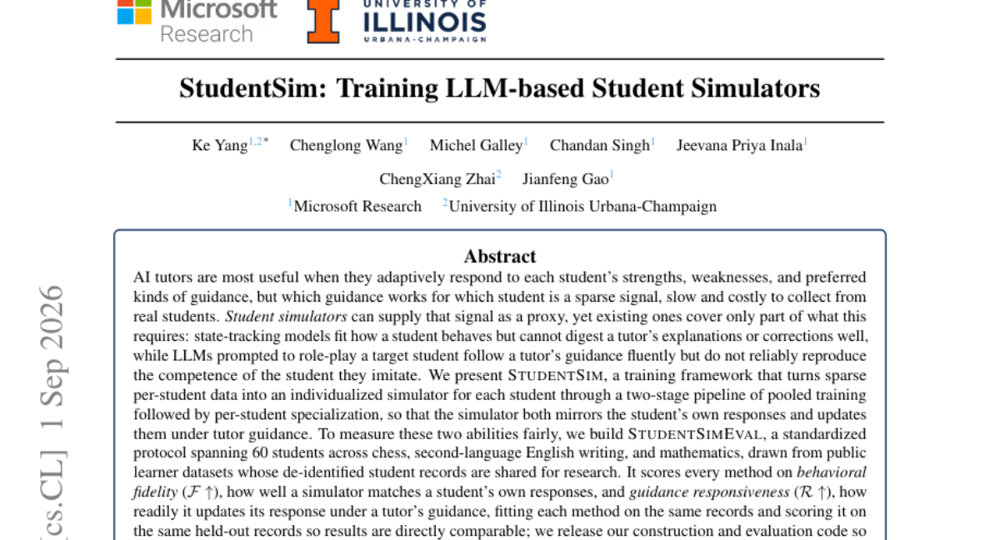

### 📌 한 줄 요약
개별 학생의 특성을 반영하면서도 튜터의 가이드에 반응하는 LLM 기반 학생 시뮬레이터 학습 프레임워크 제안

### 🔑 핵심 포인트
- 소량의 데이터로 개별 학생의 특성을 반영하는 '풀링 후 특화(pooled training then specialization)' 학습 프레임워크 제안
- 학생의 기존 응답을 모사하는 충실도(F)와 가이드에 따라 학습하는 반응성(R)을 동시에 확보
- StudentSim을 보상 모델로 활용하여 인간 전문가가 선호하는 고성능 AI 튜터 학습 가능성 입증

### 🧑‍💻 개발자 관점
실제 학생 없이도 가상 학습자를 통해 AI 튜터의 성능을 테스트하고 강화학습(RL)을 위한 고품질 보상 모델을 구축할 수 있습니다.

### 🚀 실무 적용 아이디어
- 제공된 데이터셋을 활용하여 특정 도메인(수학, 코딩 등)에서의 시뮬레이터 성능 벤치마크 수행
- StudentSim을 보상 모델로 설정하여 에이전트의 교육적 가이드 능력을 강화하는 RL 실험 진행
- 소량의 사용자 로그를 활용한 개인화(Personalization) 파인튜닝 파이프라인 구축 테스트

### ⚠️ 리스크/한계
- 시뮬레이터가 실제 학생의 복잡한 심리적/비선형적 행동을 완벽히 대체할 수 있는지에 대한 검증 필요
- 특정 도메인에 특화된 학습 방식이 다른 도메인으로의 일반화 성능을 저하시킬 가능성

### 📝 초록 기반 상세 설명
AI 튜터가 학생 맞춤형 교육을 제공하려면 학생의 반응 데이터를 수집해야 하지만, 실제 학습자를 대상으로 하는 것은 비용과 시간이 많이 듭니다. 기존의 상태 추적 모델은 설명 처리가 어렵고, LLM 역할극은 학생의 역량을 정확히 모사하지 못하는 한계가 있었습니다. 본 논문은 소량의 학생 데이터를 활용해 개별화된 시뮬레이터를 만드는 StudentSim 프레임워크를 제안합니다. 이 방식은 풀링된 학습 후 개별 학생에 맞게 특화되는 과정을 거쳐, 학생의 응답을 모사함과 동시에 튜터의 가이드에 따라 지식이 업데이트되도록 합니다. 실험 결과, StudentSim은 체스, 영어, 수학 등 다양한 도메인에서 GPT-5.4를 포함한 기존 모델보다 높은 행동 충실도와 가이드 반응성을 기록했습니다. 최종적으로 StudentSim을 보상 모델로 사용했을 때, 인간 전문가로부터 더 정확하고 개인화된 튜터가 생성됨을 입증했습니다.

---

## 2. [Qwen-Drive-1.0: An Initial Step towards a Vision-Language Foundation Model for Autonomous Driving](https://huggingface.co/papers/2609.00111)
**Upvotes**: 335 | **도입 난이도**: 상 | **신뢰도**: 상
**arXiv**: https://arxiv.org/abs/2609.00111

**태그**: Autonomous Driving, VLM, 3D Perception, Motion Planning, Vision, Evaluation

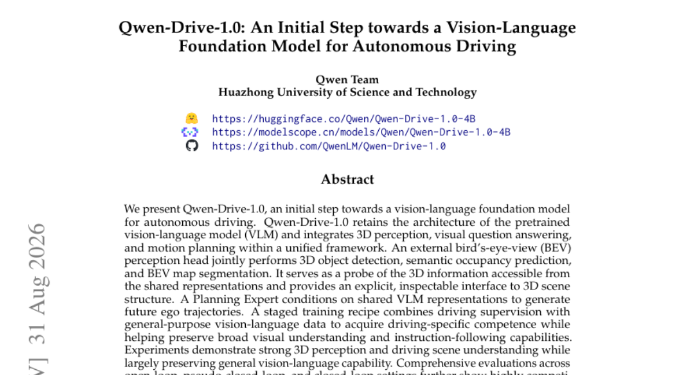

### 📌 한 줄 요약
VLM의 범용적 시각 이해 능력과 자율주행의 3D 인지 및 경로 계획을 통합한 멀티모달 파운데이션 모델 제안

### 🔑 핵심 포인트
- VLM 아키텍처를 기반으로 3D 인지, VQA, 모션 플래닝을 통합한 단일 프레임워크 구축
- BEV 인지 헤드를 통한 3D 객체 탐지, 점유 예측, 맵 세그멘테이션의 통합 수행
- 범용 시각 능력과 주행 전문성을 동시에 확보하는 단계별(Staged) 학습 전략 적용

### 🧑‍💻 개발자 관점
단순한 객체 인지를 넘어, LLM/VLM의 추론 능력을 자율주행의 의사결정(Planning)과 3D 공간 이해에 직접 연결하는 아키텍처 설계 방식을 배울 수 있습니다.

### 🚀 실무 적용 아이디어
- 제시된 BEV 인지 헤드와 플래닝 모듈 간의 정보 공유 메커니즘 분석
- 범용 VLM 데이터와 주행 데이터 간의 학습 비중(Ratio) 변화에 따른 성능 변화 실험
- Open-loop와 Closed-loop 환경에서의 성능 격차 원인 파악

### ⚠️ 리스크/한계
- 범용 VLM의 거대한 파라미터로 인한 실시간 주행 제어 시의 지연 시간(Latency) 문제
- 학습 데이터의 도메인 차이로 인해 범용 능력이 저하되거나 주행 성능이 저하될 위험

### 📝 초록 기반 상세 설명
자율주행 분야에서 범용적인 시각-언어 이해와 정밀한 주행 제어를 동시에 달성하는 것이 과제로 남아있습니다. 본 논문은 사전 학습된 VLM 아키텍처를 유지하면서 3D 인지, VQA, 모션 플래닝을 하나의 프레임워크로 통합한 Qwen-Drive-1.0을 제안합니다. 외부 BEV 인지 헤드를 통해 3D 객체 탐지 및 세그멘테이션을 수행하며, 플래닝 전문가 모듈이 공유된 VLM 표현을 바탕으로 미래 궤적을 생성합니다. 단계별 학습 방식을 통해 일반적인 시각 이해 능력과 주행 특화 역량을 동시에 확보했습니다. 실험 결과, 강력한 3D 인지 및 장면 이해 능력을 보여주었으며 다양한 루프 환경에서 경쟁력 있는 모션 플래닝 성능을 입증했습니다.

---

## 3. [SMELT: Scaling Laws for Compute-Matched MoE Looped Transformers](https://huggingface.co/papers/2609.01343)
**Upvotes**: 68 | **도입 난이도**: 중 | **신뢰도**: 상
**arXiv**: https://arxiv.org/abs/2609.01343

**태그**: MoE, Transformer, Scaling Laws, Efficiency, Benchmark, Evaluation

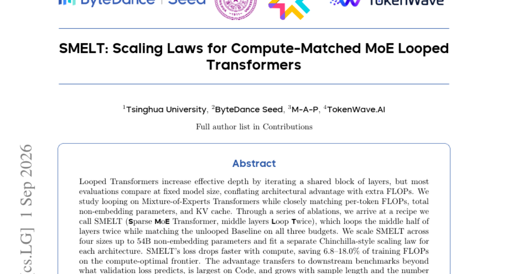

### 📌 한 줄 요약
연산량(FLOPs)과 파라미터 규모를 동일하게 유지하면서도 레이어 재사용(Looping)을 통해 모델 성능을 높이는 효율적인 MoE 설계 기법 제안

### 🔑 핵심 포인트
- 연산량(FLOPs)과 파라미터 규모를 고정한 상태에서 루핑의 순수 성능 향상 입증
- 중간 레이어를 두 번 반복하는 SMELT(middle layers Loop Twice) 레시피 개발
- 코드 생성 및 긴 문맥(Long-context) 작업에서 뛰어난 성능 향상 및 효율적 스케일링

### 🧑‍💻 개발자 관점
모델의 크기를 키우지 않고도 레이어 재사용만으로 성능을 높일 수 있어, 제한된 컴퓨팅 자원 내에서 고성능 모델을 구축하는 데 실질적인 가이드를 제공합니다.

### 🚀 실무 적용 아이디어
- 기존 MoE 모델의 중간 레이어 일부를 루핑 구조로 변경하여 성능 변화 관찰
- 코드 생성 작업(Code Generation) 데이터셋을 활용한 SMELT 효과 검증
- KV 캐시 크기 변화에 따른 루핑 구조의 효율성 테스트

### ⚠️ 리스크/한계
- 루핑 구조 도입 시 학습 안정성 확보 필요
- 특정 데이터셋(코드 등)에 편향된 성능 향상 가능성

### 📝 초록 기반 상세 설명
기존의 Looped Transformer 연구는 모델 크기를 고정하여 아키텍처의 이점과 추가 연산량 사이의 변수를 명확히 구분하지 못하는 문제가 있었습니다. 본 논문은 MoE 구조에서 토큰당 FLOPs, 파라미터 수, KV 캐시를 엄격히 일치시킨 상태에서 루핑 효과를 연구했습니다. 연구진은 중간 레이어 절반을 두 번 반복하는 SMELT(Sparse MoE Transformer, middle layers Loop Twice) 기법을 제안했습니다. 실험 결과, SMELT는 동일한 연산 예산 내에서 베이스라인보다 낮은 손실(loss)을 기록하며 효율적인 스케일링 법칙을 보여주었습니다. 특히 코드 생성 및 긴 문맥 처리에서 강점을 보였으며, 두 번째 루프가 어텐션 싱크를 줄이고 콘텐츠 관련 토큰에 집중하게 만드는 효과가 있음을 확인했습니다.

---

## 4. [UI-Venus-2 Technical Report](https://huggingface.co/papers/2609.00028)
**Upvotes**: 53 | **도입 난이도**: 상 | **신뢰도**: 상
**arXiv**: https://arxiv.org/abs/2609.00028

**태그**: Agent, GUI-Automation, Multimodal, Foundation-Model, RAG, Reasoning, Benchmark, Evaluation, Safety

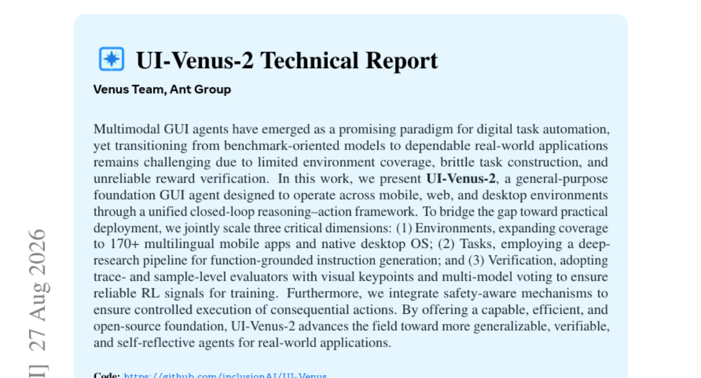

### 📌 한 줄 요약
모바일, 웹, 데스크톱을 아우르는 범용 GUI 자동화를 위한 신뢰성 높은 폐쇄 루프(Closed-loop) 에이전트 프레임워크 개발

### 🔑 핵심 포인트
- 모바일, 웹, 데스크톱을 통합 지원하는 범용 GUI 파운데이션 에이전트 프레임워크 구축
- 환경(170+ 앱), 작업(기능 기반 지시문 생성), 검증(시각적 키포인트 및 투표)의 세 가지 핵심 차원 확장
- 안전 중심의 메커니즘을 통한 실세계 실행 제어 및 신뢰성 확보

### 🧑‍💻 개발자 관점
단순 벤치마크용 모델을 넘어, 실제 다양한 OS 환경에서 동작 가능한 자동화 에이전트 구축을 위한 엔드투엔드 방법론을 제공합니다.

### 🚀 실무 적용 아이디어
- 제시된 170개 이상의 환경 커버리지가 특정 도메인(예: 특정 OS 버전)에서 얼마나 안정적인지 테스트
- 제공된 기능 중심 지시문 생성 파이프라인을 기존 작업 데이터셋에 적용해보기
- 멀티 모델 투표 방식이 RL(강화학습) 보상 신호의 노이즈를 얼마나 효과적으로 줄이는지 분석

### ⚠️ 리스크/한계
- 다양한 환경을 동시에 지원함에 따른 모델의 복잡도 및 연산 비용 증가 가능성
- 실제 사용자 환경에서의 예기치 못한 동작(Side effects)에 대한 안전성 검증 필요

### 📝 초록 기반 상세 설명
기존의 멀티모달 GUI 에이전트는 벤치마크 중심의 모델로 인해 실제 환경에서의 환경 커버리지 부족, 취약한 작업 구성, 신뢰할 수 없는 보상 검증 문제로 실무 적용에 한계가 있었습니다. 본 논문에서는 모바일, 웹, 데스크톱 환경에서 작동하는 범용 GUI 파운데이션 에이전트인 UI-Venus-2를 제안합니다. 이를 위해 170개 이상의 다국어 모바일 앱 및 데스크톱 OS로 환경을 확장하고, 심층 연구 파이프라인을 통해 기능 중심의 지시문을 생성하며, 시각적 키포인트와 멀티 모델 투표를 결합한 검증 체계를 구축했습니다. 또한 안전을 고려한 메커니즘을 통합하여 실행 제어력을 높였습니다. 결과적으로 UI-Venus-2는 실세계 애플리케이션을 위한 일반화 가능하고 검증 가능한 에이전트 기술을 제시합니다.

---

## 5. [H3-World: Turning Language Understanding into World Control](https://huggingface.co/papers/2609.01560)
**Upvotes**: 40 | **도입 난이도**: 하 | **신뢰도**: 상
**arXiv**: https://arxiv.org/abs/2609.01560

**태그**: Video Generation, World Model, Control Interface, LoRA, Video

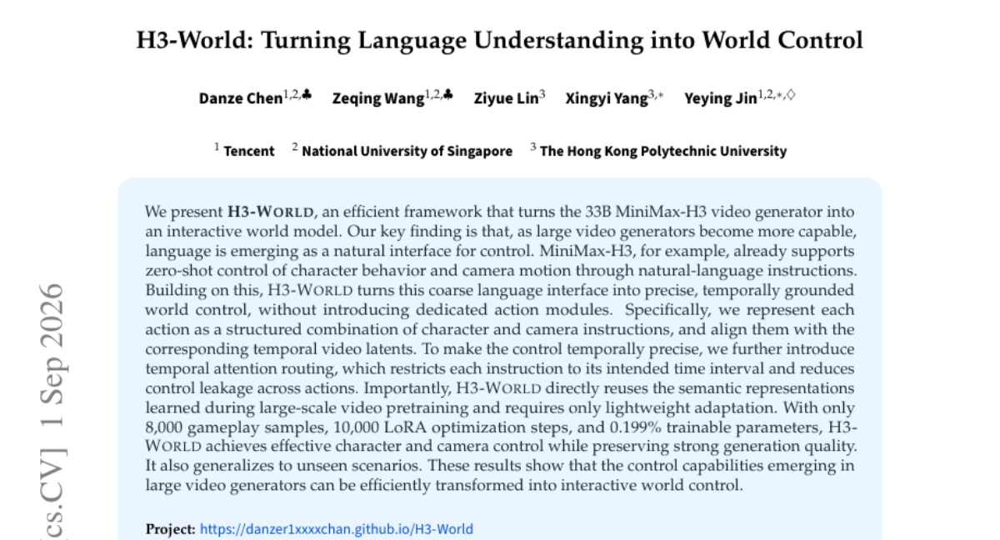

### 📌 한 줄 요약
대규모 비디오 생성 모델의 언어 이해 능력을 활용하여 별도의 액션 모듈 없이 정밀한 월드 컨트롤을 구현한 프레임워크

### 🔑 핵심 포인트
- 언어 지시사항을 구조화된 캐릭터 및 카메라 명령으로 변환하는 제어 프레임워크 제안
- 시간적 어텐션 라우팅을 통한 정밀한 시간적 제어 및 제어 누출(leakage) 방지
- 사전 학습된 모델의 의미적 표현을 재사용하여 최소한의 파라미터(0.199%)로 효율적 최적화

### 🧑‍💻 개발자 관점
추가적인 액션 모듈 설계 없이도 기존 거대 비디오 모델을 인터랙티브한 시뮬레이션 환경으로 전환할 수 있는 효율적인 방법론을 제시합니다.

### 🚀 실무 적용 아이디어
- LoRA를 활용한 소규모 데이터셋 기반의 비디오 제어 미세조정 실험
- 시간적 어텐션 라우팅 기법이 제어 정밀도에 미치는 영향 분석
- 다양한 카메라 워킹과 캐릭터 동작 조합에 대한 일반화 성능 테스트

### ⚠️ 리스크/한계
- 특정 시나리오에 국한된 데이터로 학습될 경우 제어의 일반화 성능 저하 가능성
- 복잡한 물리 법칙이 요구되는 정밀한 물리적 상호작용 구현에는 한계가 있을 수 있음

### 📝 초록 기반 상세 설명
최근 대규모 비디오 생성 모델은 언어를 통해 캐릭터 동작과 카메라 움직임을 제어하는 능력이 나타나고 있습니다. 하지만 기존의 자연어 인터페이스는 제어의 정밀도와 시간적 일관성이 부족하다는 문제가 있습니다. 본 논문은 H3-World 프레임워크를 제안하여, 언어 지시사항을 구조화된 캐릭터/카메라 명령으로 변환하고 이를 비디오 잠재 공간(latents)에 정렬합니다. 특히 시간적 어텐션 라우팅(temporal attention routing)을 도입하여 각 명령이 의도된 시간 구간에만 작용하도록 제어 누출을 방지했습니다. 결과적으로 매우 적은 파라미터와 데이터만으로도 생성 품질을 유지하면서 정밀한 상호작용이 가능한 월드 모델을 구축했습니다.

---

## 6. [ZimaBlue: Evolving Generalizable World Action Models through Scalable Video Pre-training](https://huggingface.co/papers/2609.00188)
**Upvotes**: 39 | **도입 난이도**: 상 | **신뢰도**: 상
**arXiv**: https://arxiv.org/abs/2609.00188

**태그**: Robotics, World Models, Video Pre-training, Embodied AI, Video, Benchmark, Evaluation

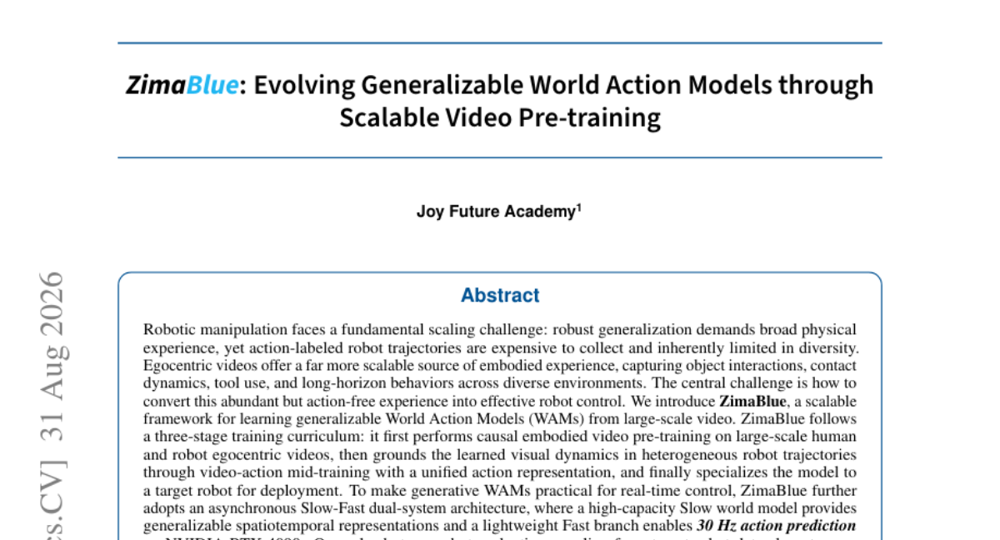

### 📌 한 줄 요약
대규모 비디오 사전 학습을 통해 로봇의 일반화 성능을 극대화한 세계 모델(World Action Model) 프레임워크

### 🔑 핵심 포인트
- 대규모 비디오 데이터를 활용한 3단계 학습 커리큘럼 (Pre-training -> Mid-training -> Specialization)
- 비동기 Slow-Fast 이중 구조를 통한 실시간(30Hz) 제어 및 고성능 모델의 효율적 운용
- 액션 라벨이 없는 비디오 데이터로부터 효과적인 로봇 제어 능력을 추출하는 방법론 제시

### 🧑‍💻 개발자 관점
로봇 데이터 수집 비용을 줄이면서도 대규모 비디오 데이터를 통해 강력한 일반화 성능을 확보할 수 있는 실질적인 스케일링 전략을 제시합니다.

### 🚀 실무 적용 아이디어
- 제공된 3단계 학습 커리큘럼의 각 단계별 데이터 비중 변화에 따른 성능 변화 관찰
- Slow-Fast 이중 구조에서 각 브랜치의 연산 자원 할당 최적화 실험
- 다양한 도구 및 환경 환경에서의 제로샷 전이 성능 테스트

### ⚠️ 리스크/한계
- 대규모 비디오 데이터와 실제 로봇 액션 간의 도메인 간극(Sim-to-Real/Video-to-Real) 존재 가능성
- 실시간 제어를 위한 하드웨어 자원 및 모델 경량화 의존도 높음

### 📝 초록 기반 상세 설명
로봇 조작 작업에서 데이터 부족과 일반화 성능 저하는 핵심적인 과제입니다. 기존의 액션 라벨이 포함된 로봇 데이터는 수집 비용이 높고 다양성이 부족하다는 한계가 있습니다. 이를 해결하기 위해 대규모 비디오 데이터를 활용하여 일반화 가능한 세계 모델을 학습하는 ZimaBlue 프레임워크를 제안합니다. 학습은 비디오 사전 학습, 비디오-액션 중간 학습, 타겟 로봇 특화 단계의 3단계 커리큘럼으로 진행됩니다. 또한 실시간 제어를 위해 고용량 Slow 모델과 경량 Fast 모델을 결합한 비동기식 이중 구조를 채택했습니다. 실험 결과, 대규모 비디오 데이터로 확장할수록 제로샷 성공률이 크게 향상되었으며 미학습 작업에서도 강력한 성능을 보였습니다.

---

## 7. [From Production Traffic to Post-Training: Building a Self-Hosted LLM That Covers the Corporate Request Mix](https://huggingface.co/papers/2609.01572)
**Upvotes**: 31 | **도입 난이도**: 상 | **신뢰도**: 상
**arXiv**: https://arxiv.org/abs/2609.01572

**태그**: LLM-Ops, Model-Merging, RLHF, Efficiency, RAG, Reasoning, Benchmark

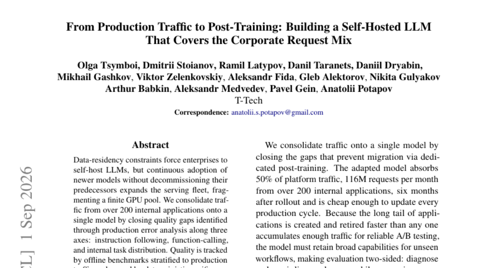

### 📌 한 줄 요약
파편화된 기업용 LLM 서비스를 단일 모델로 통합하여 GPU 자원 효율성을 극대화한 실무 중심의 모델 최적화 사례

### 🔑 핵심 포인트
- 프로덕션 트래픽 분석을 통한 3대 핵심 품질 축(지시 이행, 함수 호출, 내부 작업) 정의
- 도메인 간 보상 간섭을 피하기 위해 개별 GRPO 전문가 모델 학습 후 SLERP 병합 방식 채택
- 단일 모델로 200개 이상의 애플리케이션 트래픽을 통합하여 GPU 비용 및 운영 복잡도 절감

### 🧑‍💻 개발자 관점
다양한 요구사항을 가진 여러 모델을 운영하는 대신, 특정 도메인에 특화된 전문가 모델들을 병합하여 단일 모델로 통합하는 실무적 방법론을 제시합니다.

### 🚀 실무 적용 아이디어
- 자체 서비스 트래픽을 분석하여 지시 이행/함수 호출/대화 등 핵심 품질 지표 정의하기
- 특정 태스크별로 작은 규모의 전문가 모델을 학습시킨 후 모델 병합(Merge) 기법 적용해보기
- 프로덕션 에러 데이터를 기반으로 한 결정론적 검증기(Deterministic Verifier) 구축하기

### ⚠️ 리스크/한계
- 모델 병합 시 특정 도메인 성능이 저하되거나 예상치 못한 간섭이 발생할 위험이 있음
- 실제 프로덕션 데이터에 과적합될 경우 일반적인 대화 능력이 저하될 수 있음

### 📝 초록 기반 상세 설명
기업의 데이터 거주성 제약으로 인해 자체 호스팅 LLM 수요가 늘면서, 여러 모델을 동시에 운영함에 따른 GPU 자원 파편화 문제가 발생했습니다. 연구진은 200개 이상의 내부 애플리케이션 트래픽을 단일 모델로 통합하기 위해 프로덕션 에러 분석을 통한 품질 격차 해소에 집중했습니다. 지시 이행, 함수 호출, 내부 작업 분포라는 세 가지 축을 기준으로 품질을 추적하고, 각 영역에 특화된 GRPO 전문가 모델을 학습시킨 뒤 SLERP 방식으로 병합했습니다. 이 방식은 도메인 간 보상 간섭 문제를 방지하며 각 실패 모드(의미론적 붕괴, 과도한 호출, 장황함)를 효과적으로 해결했습니다. 결과적으로 훨씬 더 큰 파라미터 규모의 베이스라인 모델을 능가하는 성능을 달성하며 월 1억 1,600만 건의 요청을 처리하는 데 성공했습니다.

---

## 8. [Hi-Q: Hierarchical Evidence-guided Query Refinement for Multi-Hop Question Answering](https://huggingface.co/papers/2608.30468)
**Upvotes**: 24 | **도입 난이도**: 중 | **신뢰도**: 상
**arXiv**: https://arxiv.org/abs/2608.30468

**태그**: RAG, Multi-hop QA, Query Refinement, Information Retrieval, Benchmark, Evaluation

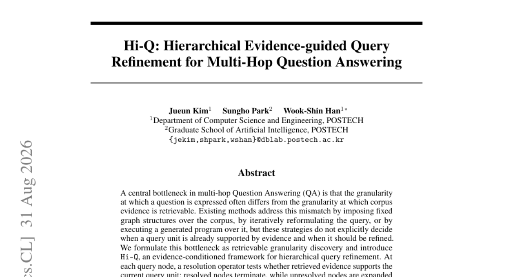

### 📌 한 줄 요약
고정된 그래프 구조 없이 검색된 증거에 따라 쿼리 구조를 동적으로 확장하는 계층적 멀티홉 QA 프레임워크

### 🔑 핵심 포인트
- 증거 기반의 동적 리졸루션(Resolution) 연산자를 통한 쿼리 노드 종료 및 확장 결정
- 고정된 템플릿이 아닌 검색된 코퍼스 지원 신호에 의해 결정되는 계층적 쿼리 트리 구조
- 의존성을 유지하는 이진 연산자와 의미적 커버리지 검증을 통한 정교한 쿼리 확장

### 🧑‍💻 개발자 관점
RAG 시스템 구축 시 고정된 지식 그래프 없이도 복잡한 멀티홉 질문에 대해 효율적이고 동적인 검색 전략을 설계할 수 있는 영감을 제공합니다.

### 🚀 실무 적용 아이디어
- 기존의 고정된 쿼리 분해(Decomposition) 방식과 Hi-Q의 동적 확장 방식 성능 비교 실험
- 검색된 증거의 노이즈 수준에 따른 쿼리 트리 확장 안정성 테스트
- 도메인 특화 지식 베이스에서의 계층적 쿼리 생성 효율성 검증

### ⚠️ 리스크/한계
- 쿼리 트리가 깊어질 경우 발생할 수 있는 연산 비용 및 지연 시간 증가
- 초기 검색 단계에서 잘못된 증거가 제공될 경우 발생하는 연쇄적 오류(Error Propagation)

### 📝 초록 기반 상세 설명
멀티홉 QA에서 질문의 입도(granularity)와 검색 가능한 증거의 입도가 일치하지 않는 것이 주요 병목 현상입니다. 기존 방식은 고정된 그래프나 반복적 쿼리 재구성을 사용하지만, 언제 쿼리를 정교화해야 할지 결정하는 데 어려움이 있습니다. 본 논문은 이를 '검색 가능한 입도 발견' 문제로 정의하고, 증거 기반의 계층적 쿼리 정교화 프레임워크인 Hi-Q를 제안합니다. Hi-Q는 검색된 증거가 충분하면 노드를 종료하고, 부족하면 의존성을 유지하며 쿼리를 확장하는 방식으로 동적인 쿼리 트리를 생성합니다. 실험 결과, Hi-Q는 IRCoT 및 PropRAG와 같은 기존 SOTA 모델들을 상회하며 오픈 도메인 환경에서도 강력한 성능을 입증했습니다.

---

## 9. [Evaluating Multimodal LLMs as Generalist Vision-Language-Action Agents for Drone Control: Commanding, Approaching, Tracking and Searching](https://huggingface.co/papers/2609.01404)
**Upvotes**: 20 | **도입 난이도**: 중 | **신뢰도**: 상
**arXiv**: https://arxiv.org/abs/2609.01404

**태그**: Agent, Robotics, MLLM, Benchmark, Drone, Multimodal, Vision, Video, Evaluation

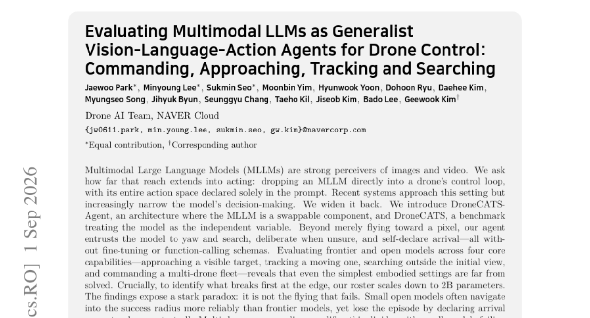

### 📌 한 줄 요약
LLM의 제어 능력을 벤치마크하여, 단순 이동을 넘어 탐색 및 임무 완수 프로토콜의 중요성을 입증한 연구

### 🔑 핵심 포인트
- LLM을 별도의 함수 호출 없이 프롬프트만으로 드론 제어 루프에 직접 투입하는 실험적 프레임워크 제안
- 단순 이동을 넘어 탐색(Search), 추적(Tracking), 다수 기체 명령(Commanding)을 포함하는 포괄적 벤치마크 구축
- 모델의 성능 차이가 물리적 항법 능력이 아닌, 임무 종료 및 프로토콜 준수 능력에서 발생함을 규명

### 🧑‍💻 개발자 관점
에이전트 설계 시 단순한 목표 도달(Navigation)보다 임무의 상태(State)를 정의하고 종료 조건을 관리하는 '행동 프로토콜' 설계가 실무적 핵심임을 시사합니다.

### 🚀 실무 적용 아이디어
- 프롬프트 기반의 제어 명령(Action Space)을 정의하고 소형 모델의 임무 완수율 테스트
- 모델이 '도착'이나 '실패'를 스스로 선언하는 종료 프로토콜의 강건성 검증
- 멀티 에이전트 환경에서 좌표 복사 오류와 같은 논리적 결함 여부 확인

### ⚠️ 리스크/한계
- 실제 하드웨어 제어 시 발생하는 지연 시간(Latency)과 모델 추론 속도 간의 간극
- LLM의 비결정론적 특성으로 인한 임무 완수 프로토콜의 불안정성

### 📝 초록 기반 상세 설명
최근 MLLM의 시각 인지 능력은 뛰어나지만, 이를 실제 드론 제어 루프에 직접 투입하여 행동(Action)까지 수행하는 능력은 충분히 검증되지 않았습니다. 기존 방식은 모델의 결정 범위를 좁게 설정하는 경향이 있어, 본 연구는 모델의 자율성을 극대화한 DroneCATS-Agent 아키텍처와 벤치마크인 DroneCATS를 제안합니다. 연구진은 접근, 추적, 탐색, 다수 드론 명령 등 네 가지 핵심 역량을 중심으로 다양한 크기의 모델을 평가했습니다. 실험 결과, 모델의 공간 인지 능력은 준수하지만 임무 종료 시점 판단이나 프로토콜 유지 능력이 성능의 핵심 차이를 만들었습니다. 특히 소형 모델이 대형 모델보다 물리적 이동은 더 잘할 수 있으나, 임무 완수 프로토콜에서 실패하는 역설적인 현상이 관찰되었습니다.

### 🖼️ 추가 자료
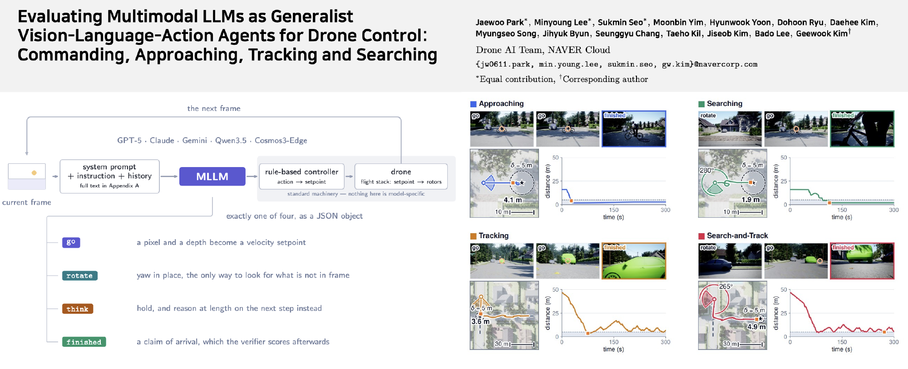

---

## 10. [Uncovering Understanding-Generation Synergy in Native Unified Multimodal Models: From Representation, Task to System](https://huggingface.co/papers/2609.01607)
**Upvotes**: 20 | **도입 난이도**: 상 | **신뢰도**: 상
**arXiv**: https://arxiv.org/abs/2609.01607

**태그**: Multimodal, Architecture, Deep Learning, Computer Vision, Generative AI, Vision, Safety

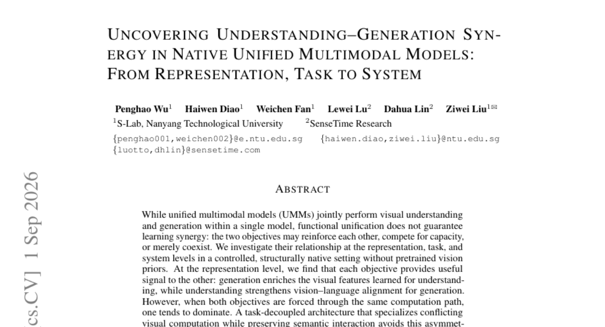

### 📌 한 줄 요약
이해와 생성 기능이 공존하는 통합 멀티모달 모델에서 두 작업 간의 시너지를 극대화하는 아키텍처 설계 전략을 제시합니다.

### 🔑 핵심 포인트
- 이해와 생성 작업 간의 상호 보완적 시너지 및 연산 경로 충돌 현상 규명
- 충돌하는 시각 연산을 분리하면서도 의미적 상호작용을 유지하는 태스크 분리형 아키텍처 제안
- 단순한 Planner-Executor 구조보다 엔드투엔드 UMM이 복합 태스크에서 더 우수한 성능을 보임을 증명

### 🧑‍💻 개발자 관점
멀티모달 모델 설계 시 단순히 기능을 합치는 것을 넘어, 연산 자원 충돌을 방지하기 위한 아키텍처 분리 전략이 성능의 핵심임을 시사합니다.

### 🚀 실무 적용 아이디어
- 단일 백본 모델에서 이해와 생성 손실 함수(Loss) 간의 가중치 균형 실험
- 충돌하는 연산 경로를 분리하는 MoE(Mixture of Experts) 구조 적용 테스트
- Planner-Executor 방식과 통합 모델 간의 복합 태스크 성능 비교 실험

### ⚠️ 리스크/한계
- 연산 경로 분리 시 모델 파라미터 및 메모리 사용량 증가 가능성
- 특정 태스크에 치우친 데이터셋에서는 시너지 효과가 반감될 위험

### 📝 초록 기반 상세 설명
통합 멀티모달 모델(UMM)은 이해와 생성 기능을 동시에 수행하지만, 두 목적 함수가 서로 시너지를 내거나 혹은 용량을 두고 경쟁할 수 있는 복잡한 관계를 가집니다. 본 연구는 사전 학습된 비전 모델 없이 구조적으로 통합된 환경에서 표현, 태스크, 시스템 수준의 관계를 조사했습니다. 연구 결과, 생성은 이해를 위한 특징을 풍부하게 하고 이해는 생성의 정렬을 강화하는 상호 보완적 관계를 보였으나, 동일한 연산 경로를 사용할 경우 한쪽이 지배하는 비대칭적 성능 저하가 발생했습니다. 이를 해결하기 위해 충돌하는 연산은 분리하되 의미적 상호작용은 유지하는 태스크 분리형 아키텍처를 제안했습니다. 실험을 통해 적절한 특화와 공유 지식 활용이 결합될 때 단순한 기능 통합을 넘어선 강력한 시너지가 발생함을 입증했습니다.

---

## 11. [Safin-1: Safety from Within through Memory-Native State Evolution](https://huggingface.co/papers/2609.00092)
**Upvotes**: 19 | **도입 난이도**: 상 | **신뢰도**: 상
**arXiv**: https://arxiv.org/abs/2609.00092

**태그**: LLM Architecture, Memory-Native, AI Safety, Long-context, RAG, Vision, Evaluation, Safety

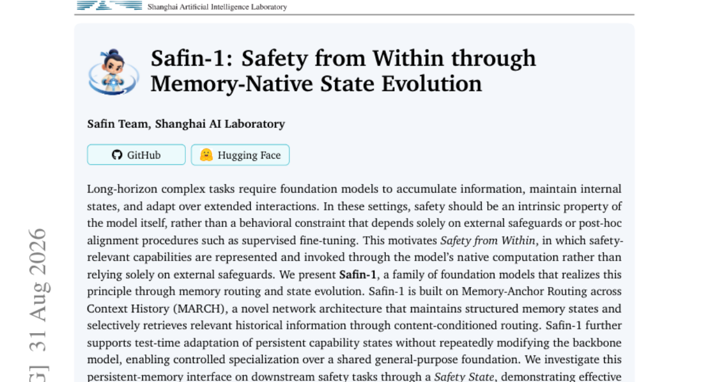

### 📌 한 줄 요약
외부 제약이 아닌 모델 내부의 메모리 상태 진화를 통해 안전성을 내재화하는 새로운 아키텍처 제안

### 🔑 핵심 포인트
- MARCH(Memory-Anchor Routing across Context History) 아키텍처를 통한 구조화된 메모리 상태 유지
- 외부 가드레일이 아닌 모델 내부 연산을 통한 'Safety from Within' 원칙 구현
- 백본 수정 없이 테스트 타임에 지속적인 능력 상태를 적응시키는 라우팅 인터페이스

### 🧑‍💻 개발자 관점
모델의 가중치를 재학습하지 않고도 메모리 상태 조절만으로 특정 도메인의 안전성이나 능력을 제어할 수 있는 새로운 패러다임을 제시합니다.

### 🚀 실무 적용 아이디어
- MARCH 아키텍처의 메모리 라우팅 메커니즘이 기존 RAG와 어떻게 다른지 비교 분석
- 특정 안전 가이드라인을 메모리 상태로 변환하여 주입하는 프로토타입 설계
- 장기 문맥(Long-context) 환경에서 메모리 기반 상태 유지 성능 테스트

### ⚠️ 리스크/한계
- 초기 아키텍처 탐색 단계로, 대규모 모델로의 확장성 및 안정성 검증 필요
- 메모리 상태가 복잡해질 경우 발생할 수 있는 연산 오버헤드 및 제어 난이도

### 📝 초록 기반 상세 설명
장기적인 복잡한 작업을 수행하는 파운데이션 모델은 정보를 축적하고 내부 상태를 유지하는 능력이 필수적입니다. 기존의 안전성 확보 방식은 외부 가드레일이나 사후 정렬(SFT)에 의존하여 모델 자체의 내재적 속성으로 만들기 어렵다는 문제가 있습니다. 이를 해결하기 위해 본 논문은 메모리 라우팅과 상태 진화를 통해 안전성을 모델 내부 연산으로 구현하는 Safin-1을 제안합니다. 핵심 아키텍처인 MARCH는 구조화된 메모리 상태를 유지하며 콘텐츠 기반 라우팅을 통해 과거 정보를 선택적으로 검색합니다. 실험 결과, 제안된 방식은 모델의 백본을 수정하지 않고도 테스트 타임에 안전 상태를 적응시킬 수 있으며 안전성 성능을 크게 향상시켰습니다.

---

## 12. [AgentJudgeBench: A Multi-Difficulty Benchmark for Evaluating LLM Judges on Agentic Tool-Calling](https://huggingface.co/papers/2608.26623)
**Upvotes**: 14 | **도입 난이도**: 하 | **신뢰도**: 상
**arXiv**: https://arxiv.org/abs/2608.26623

**태그**: LLM-as-a-Judge, Agentic-Workflow, Tool-Calling, Benchmark, Agent, Reasoning, Evaluation, Safety

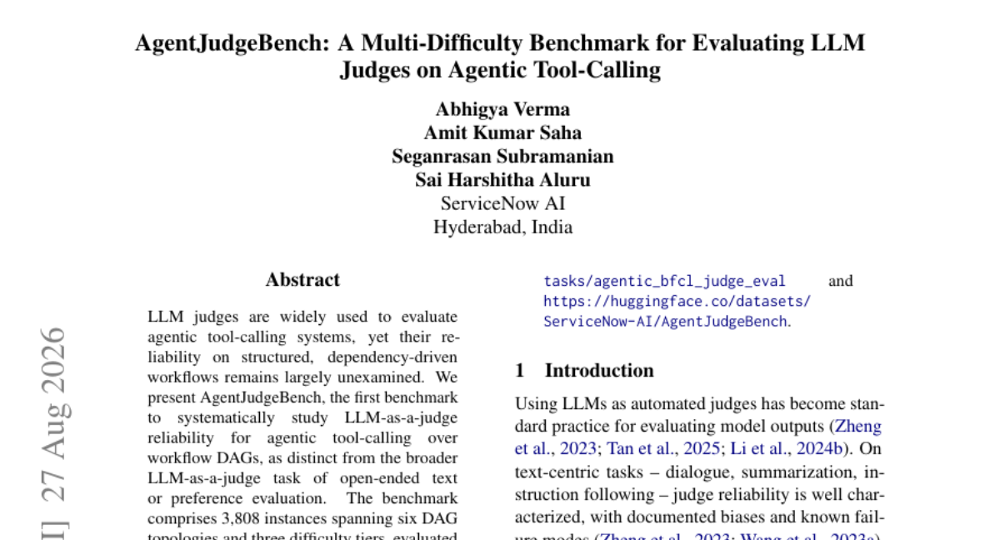

### 📌 한 줄 요약
에이전트 도구 호출 워크플로우 평가 시 모델 크기보다 작업 난이도가 판정 신뢰도에 더 결정적인 영향을 미침을 규명한 벤치마크 연구

### 🔑 핵심 포인트
- DAG 기반 도구 호출 워크플로우에 특화된 최초의 에이전트 판정 벤치마크 제안
- 작업 난이도가 높아질수록 모델 규모와 무관하게 판정 성능이 특정 임계치로 수렴하는 현상 발견
- 정답(Ground-truth) 제공이 특정 모델에서는 오히려 성능을 저하시키는 '과잉 닻 내림(over-anchoring)' 현상 확인

### 🧑‍💻 개발자 관점
에이전트 평가 시 단순히 거대 모델을 사용하는 것보다, 작업의 구조적 난이도에 맞는 적절한 평가 루브릭(Rubric) 설계가 더 중요함을 시사합니다.

### 🚀 실무 적용 아이디어
- 에이전트 평가 시 단순 텍스트 비교가 아닌 구조화된 평가 루브릭(Structured Rubric) 도입
- 정답(Ground-truth)을 판사 모델에 제공할 때 발생하는 성능 저하 여부 모니터링
- 도구 호출 워크플로우의 복잡도(DAG 깊이 등)에 따른 판정 모델의 신뢰도 한계치 설정

### ⚠️ 리스크/한계
- 작업 난이도가 매우 높은 경우 모델 규모만으로는 해결할 수 없는 성능 상한선 존재
- 정답 데이터가 판정 모델의 성능을 오히려 왜곡할 수 있는 위험성

### 📝 초록 기반 상세 설명
에이전트 시스템 평가를 위해 LLM을 판사로 사용하는 방식이 널리 쓰이지만, 구조적 의존성이 있는 워크플로우에서의 신뢰성은 충분히 검증되지 않았습니다. 본 연구는 DAG(유향 비순환 그래프) 기반의 도구 호출 작업을 대상으로 하는 벤치마크인 AgentJudgeBench를 제안합니다. 3,808개의 인스턴스를 통해 난이도와 정답(Ground-truth) 유무에 따른 판정 성능을 분석했습니다. 실험 결과, 판정 정확도는 작업 난이도가 높아질수록 급격히 저하되며, 정답이 없을 경우 모델 크기와 상관없이 특정 성능 범위(77-82%)로 수렴하는 한계가 발견되었습니다. 또한 정답 제공이 오히려 특정 모델의 정렬을 방해하는 현상도 관찰되었습니다. 이러한 결과는 에이전트 평가 시 모델 규모보다 작업 구조와 프롬프트 전략이 더 중요함을 시사합니다.

---

## 13. [DiagEvo: Diagnosis-Guided Self-Evolution via Hierarchical Error Memory](https://huggingface.co/papers/2609.00768)
**Upvotes**: 13 | **도입 난이도**: 중 | **신뢰도**: 상
**arXiv**: https://arxiv.org/abs/2609.00768

**태그**: Self-Play, LLM-Training, Reasoning, Curriculum-Learning, Benchmark

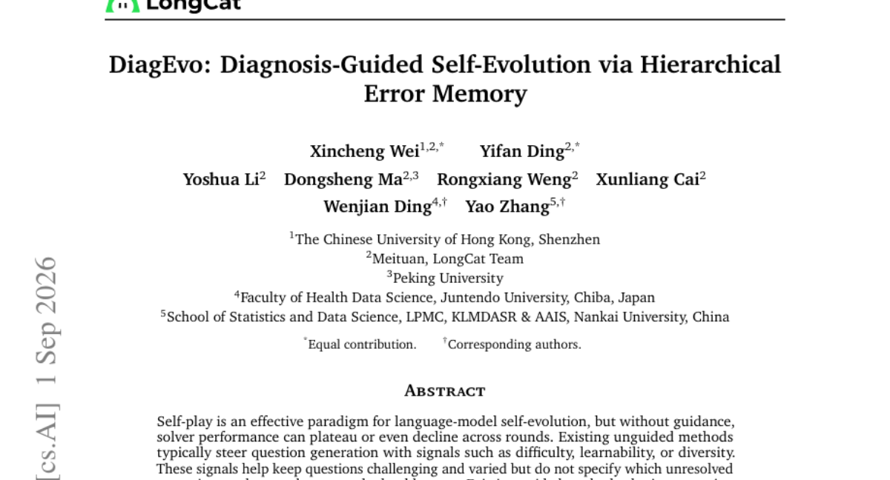

### 📌 한 줄 요약
외부 데이터 없이 모델의 과거 실패 이력을 활용하여 취약점을 스스로 진단하고 학습하는 자가 진화 프레임워크

### 🔑 핵심 포인트
- 외부 데이터 없이 모델의 실패 이력(Failure History)만으로 학습 방향을 결정하는 자가 진화 메커니즘
- 오류 원인을 계층적으로 관리하여 취약한 기술 노드를 타겟팅하는 Hierarchical Error Memory 도입
- Double-confidence filtering을 통한 적정 난이도 문제 선별 및 학습 효율 최적화

### 🧑‍💻 개발자 관점
데이터 수집 비용을 최소화하면서 모델의 특정 추론 취약점을 정밀하게 타격하여 성능을 높이는 자동화된 학습 파이프라인 구축이 가능합니다.

### 🚀 실무 적용 아이디어
- 모델의 실패 로그를 구조화된 오류 원인(Error Cause) 데이터셋으로 변환하는 파이프라인 구축 실험
- 계층적 메모리 구조에서 숙련도(Mastered) 판단 기준에 따른 학습 곡선 변화 관찰
- 특정 도메인(수학, 코딩 등)에 특화된 오류 분류 체계 적용 테스트

### ⚠️ 리스크/한계
- 초기 모델의 오류 분석 능력이 부족할 경우 잘못된 학습 방향(Feedback Loop)이 형성될 위험
- 오류 원인 추출 과정에서의 진단 모델(Diagnostician) 성능 의존성

### 📝 초록 기반 상세 설명
Self-play 기반의 모델 진화 방식은 외부 가이드 없이는 성능 정체나 퇴보 문제를 겪기 쉽습니다. 기존 방식은 외부 데이터나 인간의 예시를 활용해 방향성을 잡았으나, 이는 외부 자원에 대한 의존성을 높입니다. 본 논문은 모델의 과거 실패 이력에서 직접 방향성을 도출하는 DiagEvo를 제안합니다. DiagEvo는 계층적 오류 원인 메모리를 통해 반복되는 오류를 추출하고, 이를 숙련도(Active/Mastered)로 관리하며 학습 커리큘럼을 생성합니다. 실험 결과, 외부 자원 없이도 수학적 추론 등 다양한 벤치마크에서 기존 SOTA 모델들을 상회하는 성능을 달었습니다.

---

## 14. [Harness-of-Harness: Multi-Day Autonomous Software Development with Continual Improvement](https://huggingface.co/papers/2609.01481)
**Upvotes**: 9 | **도입 난이도**: 중 | **신뢰도**: 상
**arXiv**: https://arxiv.org/abs/2609.01481

**태그**: AI Agent, Autonomous Software Development, Iterative Refinement, Agent, RAG, Audio, Evaluation

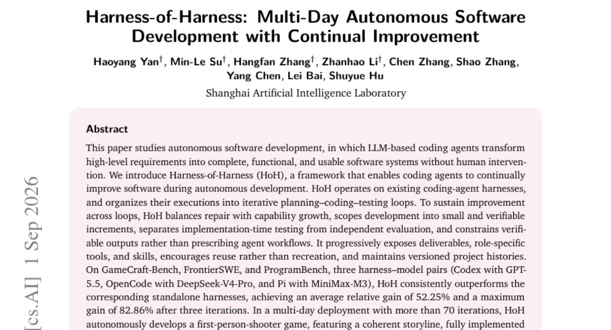

### 📌 한 줄 요약
반복적인 계획-코딩-테스트 루프를 통해 소프트웨어를 지속적으로 개선하며 자율 개발하는 프레임워크 제안

### 🔑 핵심 포인트
- 기존 코딩 에이전트 하네스 위에 동작하는 상위 프레임워크 구조
- 계획-코딩-테스트의 반복적 루프를 통한 지속적 성능 개선 메커니즘
- 검증 가능한 작은 단위의 점진적 개발 및 버전 관리된 프로젝트 이력 유지

### 🧑‍💻 개발자 관점
단순 코드 생성을 넘어, 에이전트가 스스로 문제를 수정하고 기능을 확장하며 장기적인 프로젝트를 완수할 수 있는 자율 개발의 가능성을 보여줍니다.

### 🚀 실무 적용 아이디어
- 기존 오픈소스 코딩 에이전트(예: OpenDevin 등)에 HoH의 루프 구조 적용 실험
- 작은 규모의 기능 단위로 개발 범위를 쪼개어 에이전트에게 할당하는 워크플로우 테스트
- 에이전트의 결과물을 독립적인 테스트 환경에서 검증하는 자동화 파이프라인 구축

### ⚠️ 리스크/한계
- 반복적인 루프 과정에서 발생할 수 있는 비용(Token 사용량) 및 시간 증가
- 복잡도가 높아질수록 제어하기 어려운 에이전트의 환각(Hallucination) 및 무한 루프 위험

### 📝 초록 기반 상세 설명
LLM 기반 코딩 에이전트가 인간의 개입 없이 요구사항을 완전한 소프트웨어로 변환하는 자율 개발 연구가 활발해지고 있습니다. 기존 방식은 단발성 작업에 그치거나 지속적인 성능 개선이 어렵다는 과제가 있습니다. 본 논문은 기존 코딩 에이전트 하네스를 활용하면서도 반복적인 루프를 통해 성능을 높이는 'Harness-of-Harness(HoH)' 프레임워크를 제안합니다. HoH는 수리(repair)와 역량 성장 사이의 균형을 맞추고, 개발 범위를 검증 가능한 작은 단위로 분할하며, 독립적인 평가 체계를 유지합니다. 실험 결과, HoH는 기존 단독 하네스 대비 평균 52.25%의 성능 향상을 기록했으며, 다일(multi-day) 배포를 통해 복잡한 FPS 게임을 자율적으로 개발하는 데 성공했습니다.

---

## 15. [EM^2Mem: Event-Centric Multimodal Memory for Large Language Models](https://huggingface.co/papers/2609.00551)
**Upvotes**: 8 | **도입 난이도**: 중 | **신뢰도**: 상
**arXiv**: https://arxiv.org/abs/2609.00551

**태그**: RAG, Multimodal, Video-QA, Efficiency, Video, Benchmark, Inference, Safety

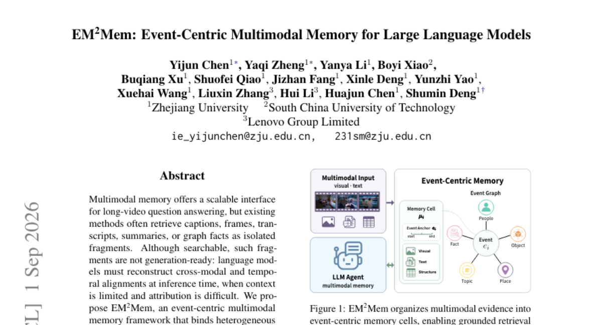

### 📌 한 줄 요약
이벤트 중심의 멀티모달 메모리 구조를 통해 긴 영상 QA의 추론 효율성과 정확도를 동시에 높인 프레임워크

### 🔑 핵심 포인트
- 이벤트 중심의 메모리 구조를 통해 이질적인 멀티모달 데이터를 하나의 앵커로 결합
- 단순 조각 저장이 아닌, 시간적/의미적 맥락이 포함된 '생성 준비가 된' 메모리 셀 구축
- 추론 시 발생하는 연산량과 토큰 사용량을 획기적으로 줄여 효율적인 RAG 구현

### 🧑‍💻 개발자 관점
긴 영상 기반의 RAG 시스템 구축 시, 모델이 방대한 데이터를 재구성하는 데 드는 비용과 지연 시간을 줄이는 실질적인 아키텍처를 제시합니다.

### 🚀 실무 적용 아이디어
- 제시된 이벤트 앵커링 방식이 기존의 단순 벡터 검색(Vector Search) 대비 얼마나 높은 정밀도를 보이는지 비교 실험
- Long-context 모델에 적용 시 토큰 절감 효과가 실제 서비스 비용에 미치는 영향 분석
- Graph-linked relations이 복잡한 인과관계 추론에 미치는 기여도 검증

### ⚠️ 리스크/한계
- 이벤트 단위로 데이터를 압축하는 과정에서 세부적인 시각 정보 손실 가능성
- 이벤트 분할(Segmentation) 정확도에 따라 전체 메모리 품질이 결정되는 의존성

### 📝 초록 기반 상세 설명
기존의 멀티모달 메모리 방식은 캡션, 프레임, 스크립트 등을 개별 조각으로 저장하여 모델이 추론 시점에 복잡한 정렬 작업을 수행해야 하는 문제가 있었습니다. 이를 해결하기 위해 제안된 EM^2Mem은 이벤트를 중심축(Anchor)으로 삼아 이질적인 증거들을 하나의 메모리 셀에 결합하는 방식을 사용합니다. 각 메모리 셀은 멀티모달 기록, 시간적 맥락, 그래프 관계, 의미적 사실 및 출처를 통합하여 관리합니다. 실험 결과, 기존 베이스라인 대비 정확도가 향상되었으며, 특히 지연 시간(Latency)을 4.67배 단축하고 추론 토큰 수를 63.66% 절감하는 성과를 거두었습니다.

---

## 16. [Agents in the Large: Perception-Centered Architecture for Persistent Agents](https://huggingface.co/papers/2608.30478)
**Upvotes**: 7 | **도입 난이도**: 중 | **신뢰도**: 상
**arXiv**: https://arxiv.org/abs/2608.30478

**태그**: AI Agent, Architecture, Autonomous Systems, Long-lived Agents, Agent

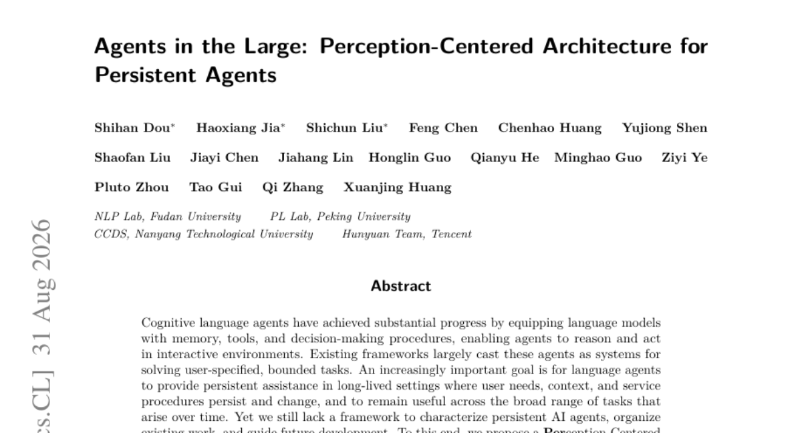

### 📌 한 줄 요약
단발성 작업 수행을 넘어, 지속적인 환경 변화와 사용자 요구에 대응하는 '지속형 에이전트'를 위한 새로운 아키텍처 프레임워크 제안

### 🔑 핵심 포인트
- 단발성 태스크 해결에서 지속적/적응형 서비스로의 패러다임 전환 제안
- 지각(Perception)과 제어(Control)를 중심으로 한 Pera 아키텍처 프레임워크 설계
- 환경 변화 및 과거 이력을 바탕으로 스스로 태스크를 생성하는 생애주기 관리 구조

### 🧑‍💻 개발자 관점
단순 챗봇을 넘어 사용자의 환경에 상주하며 스스로 판단하고 움직이는 '자율형 서비스 에이전트' 설계 시 핵심적인 아키텍처 가이드를 제공합니다.

### 🚀 실무 적용 아이디어
- 기존의 Task-driven 에이전트를 Pera의 Perception-driven 구조로 변환하는 프로토타입 설계
- 에이전트가 과거 작업 로그를 통해 스스로 새로운 태스크를 생성하는 루프 구현 실험
- 환경 변화(Environment change) 신호를 트리거로 하는 에이전트의 적응 로직 테스트

### ⚠️ 리스크/한계
- 지속적인 지각 과정에서 발생하는 연산 비용 및 리소스 관리 문제
- 에이전트가 스스로 생성한 태스크가 의도치 않은 행동으로 이어질 위험

### 📝 초록 기반 상세 설명
최근 언어 모델 기반 에이전트는 메모리, 도구, 의사결정 구조를 통해 비약적인 발전을 이루었으나, 주로 한정된 태스크를 해결하는 데 초점이 맞춰져 있습니다. 하지만 실제 환경에서는 사용자 요구와 맥락이 지속적으로 변화하는 장기적인 서비스 환경이 중요해지고 있습니다. 본 논문은 이러한 지속적 에이전트를 정의하고 가이드하기 위해 '지각 중심 아키텍처(Pera)'를 제안합니다. Pera는 에이전트가 주변 환경, 내부 맥락, 과거 작업에서 발생하는 신호를 지속적으로 감지하여 새로운 생애주기 태스크를 생성하고 운영하는 구조를 가집니다. 이를 통해 기존 연구를 재정리하고 향후 적응형 지능 시스템 구축을 위한 방향성을 제시합니다.

---

## 17. [Control-Data Flow Separation: Stable Prompt Optimization in Multi-Agent LLMs](https://huggingface.co/papers/2609.00621)
**Upvotes**: 6 | **도입 난이도**: 중 | **신뢰도**: 상
**arXiv**: https://arxiv.org/abs/2609.00621

**태그**: Multi-Agent, Prompt Engineering, System Design, LLM Ops, Agent, Reasoning

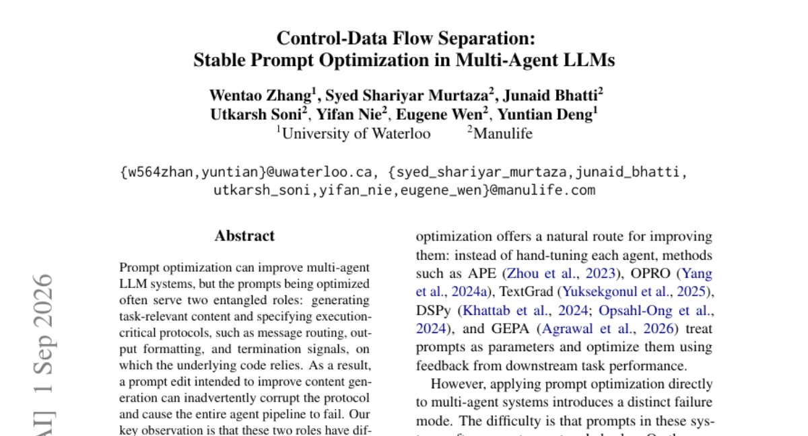

### 📌 한 줄 요약
프롬프트 최적화 시 제어 로직과 데이터 내용을 분리하여 멀티 에이전트 시스템의 프로토콜 붕괴를 방지하는 기법

### 🔑 핵심 포인트
- 제어(Protocol)와 데이터(Content)의 역할 분리를 통한 프롬프트 드리프트 방지
- 실행 프로토콜을 타입이 지정된 검증 가능한 프로그램 객체로 정의
- 프롬프트 최적화 중에도 시스템 안정성을 유지하는 구조적 설계

### 🧑‍💻 개발자 관점
에이전트 프롬프트를 튜닝할 때 시스템이 깨지는 문제를 구조적으로 해결할 수 있어, 운영 단계의 안정성을 확보하는 데 중요합니다.

### 🚀 실무 적용 아이디어
- 현재 에이전트 프롬프트에서 '명령(Control)'과 '지식(Data)' 영역을 명확히 구분해보기
- JSON 스키마나 타입 검증을 활용해 에이전트 출력 형식을 강제하는 구조 설계해보기
- 프롬프트 자동 최적화(DSPy 등) 도입 시 프로토콜 영역이 수정되지 않도록 격리해보기

### ⚠️ 리스크/한계
- 제어 로직과 데이터 로직을 분리하는 설계 단계의 복잡도 증가
- 매우 복잡한 동적 워크플로우에서는 완전한 분리가 어려울 수 있음

### 📝 초록 기반 상세 설명
멀티 에이전트 시스템에서 프롬프트는 작업 콘텐츠 생성과 실행 프로토콜(라우팅, 포맷 등)이라는 두 가지 역할을 동시에 수행합니다. 이로 인해 콘텐츠 성능을 높이려는 프롬프트 수정이 시스템의 실행 구조를 망가뜨리는 문제가 발생합니다. 연구진은 실행 프로토로는 구조화된 객체로, 작업 내용은 비구조화된 언어로 분리하는 '제어-데이터 흐름 분리' 방식을 제안합니다. 이 설계는 프롬프트 최적화 과정에서 프로토콜 인터페이스가 변질되는 것을 방지합니다. 실험 결과, 다양한 워크플로우에서 프로토콜 유효성을 100% 유지하면서도 작업 성능을 향상시켰습니다.

---

## 18. [InternReviewer & InternAdvocate: Objective Reward and Evaluation for Agentic Reinforcement Learning in Peer Review and Rebuttal](https://huggingface.co/papers/2608.28612)
**Upvotes**: 6 | **도입 난이도**: 상 | **신뢰도**: 상
**arXiv**: https://arxiv.org/abs/2608.28612

**태그**: Agent, RAG, Reinforcement Learning, Hallucination Mitigation, Reasoning, Evaluation, Safety

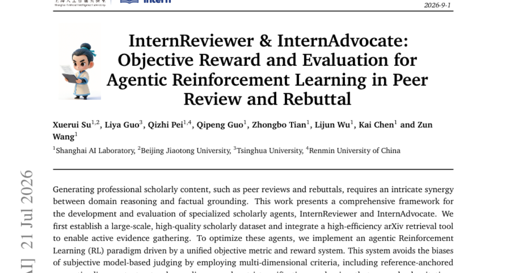

### 📌 한 줄 요약
학술적 추론과 팩트 체크를 결합한 에이전트 RL 프레임워크를 통해 논문 리뷰 및 반박 생성 능력을 고도화함

### 🔑 핵심 포인트
- arXiv 검색 도구를 통합한 에이전트 기반 RAG 및 실시간 증거 수집 메커니즘 구축
- 주관적 편향을 배제하기 위한 다차원적(의미 정렬, 구조, 인용 검증) RL 보상 시스템 설계
- 할루시네이션 방지를 위한 실시간 상호작용 로그 기반의 엄격한 인용 교차 검증

### 🧑‍💻 개발자 관점
RAG 시스템에서 발생하는 할루시네이션을 억제하기 위해, 단순 생성 모델을 넘어 외부 도구와 검증 루프를 결합한 에이전트 설계 방식의 실무적 가이드라인을 제공합니다.

### 🚀 실무 적용 아이디어
- 제시된 다차원 보상 함수(Semantic Alignment + Structural Compliance)를 기존 LLM 평가 파이프라인에 적용해보기
- 외부 검색 도구(arXiv 등)의 결과물을 에이전트의 RL 보상 신호로 변환하는 로직 구현 실험
- 인용 데이터와 생성 텍스트 간의 일치 여부를 검증하는 자동화된 검증 루프 구축

### ⚠️ 리스크/한계
- 실시간 검색 및 검증 루프 도입에 따른 추론 비용(Inference Cost) 및 지연 시간 증가
- 특정 도메인(학술)에 특화된 데이터셋과 보상 체계로 인해 일반적인 작업으로의 전이 학습 난이도 존재

### 📝 초록 기반 상세 설명
전문적인 학술 콘텐츠 생성은 도메인 추론과 사실적 근거 확보 사이의 정교한 조화가 필요합니다. 기존의 주관적인 모델 기반 평가 방식은 편향성 문제를 야기할 수 있습니다. 본 연구는 대규모 학술 데이터셋과 arXiv 검색 도구를 결합한 InternReviewer 및 InternAdvocate 프레임워크를 제안합니다. 제안된 시스템은 참조 기반의 의미적 정렬, 구조적 준수, 실시간 로그를 통한 인용 검증 등 다차원적 기준을 통해 RL 보상 체계를 구축합니다. 실험 결과, 이 폐쇄 루프 프레임워크를 통해 학습된 에이전트는 추론 깊이와 인용 정확도 면에서 유의미한 향상을 보였습니다.

---

## 19. [E-Commerce Bench: Evaluating LLM Agents on Long-Horizon Autonomous Business Operation](https://huggingface.co/papers/2608.30730)
**Upvotes**: 5 | **도입 난이도**: 중 | **신뢰도**: 상
**arXiv**: https://arxiv.org/abs/2608.30730

**태그**: Agent, Benchmark, E-Commerce, Decision-Making, Evaluation

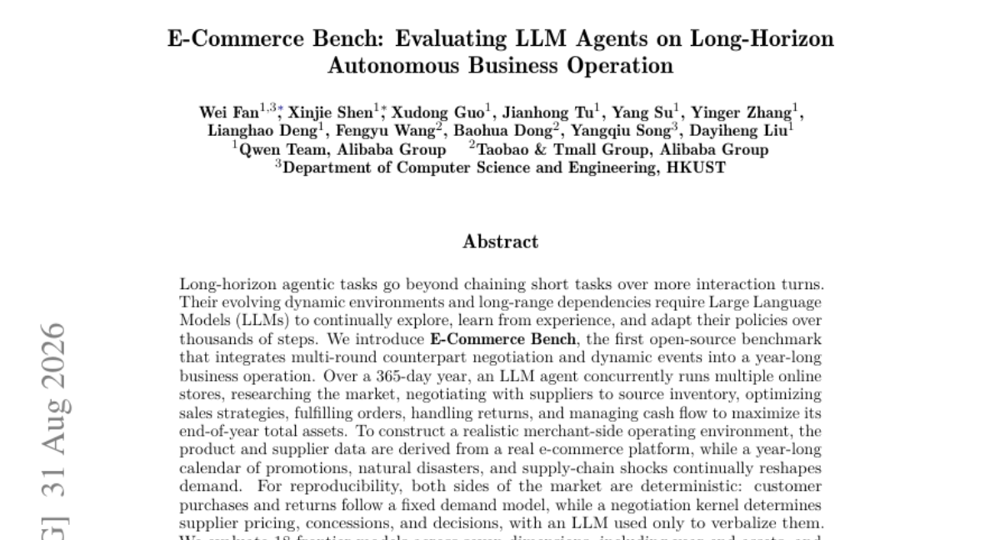

### 📌 한 줄 요약
장기적 비즈니스 운영 능력을 평가하기 위해 실시간 시장 변동과 협상을 결합한 최초의 오픈소스 에이전트 벤치마크를 제안합니다.

### 🔑 핵심 포인트
- 장기적 의사결정과 동적 환경을 반영한 최초의 오픈소스 이커머스 운영 벤치마크 개발
- 실제 플랫폼 데이터 기반의 시장 환경과 결정론적 협상 커널을 통한 재현성 확보
- 자산 관리, 협상, 운영 효율성 등 다차원적 성능 평가 프레임워크 구축

### 🧑‍💻 개발자 관점
단순 질의응답을 넘어, 자율적인 에이전트가 복잡한 비즈니스 로직과 장기적 목표를 어떻게 수행하는지 검증하는 데 중요한 기준을 제공합니다.

### 🚀 실무 적용 아이디어
- 제공된 벤치마크 코드를 활용하여 현재 사용 중인 LLM의 장기 계획 수립 능력 테스트
- 에이전트의 '학습 능력(Learning over the horizon)'과 '운영 효율성' 간의 트레이드오프 분석
- 다양한 도메인(물류, 금융 등)으로의 벤치마크 확장 가능성 검토

### ⚠️ 리스크/한계
- 결정론적 모델링으로 인해 실제 세계의 완전한 무작위성을 반영하는 데 한계가 있을 수 있음
- 특정 모델이 자산 증식에는 강하나 사기 방지 등 윤리적/보안적 측면에서는 취약할 수 있음

### 📝 초록 기반 상세 설명
기존의 에이전트 작업은 짧은 태스크 체이닝에 집중되어 있어, 변화하는 환경과 장기 의존성을 다루는 데 한계가 있습니다. 본 논문은 1년 단위의 비즈니스 운영 시나리오를 담은 'E-Commerce Bench'를 소개합니다. 이 벤치마크는 시장 조사, 공급업체 협상, 재고 관리 등 복잡한 의사결정 과정을 포함하며, 실제 이커머스 데이터를 기반으로 동적인 이벤트를 생성합니다. 실험 결과, 18개의 최첨단 모델을 평가한 결과 특정 모델이 모든 영역을 지배하지 못함을 확인했습니다. 특히 모델별로 자산 증식 능력과 운영 효율성, 사기 방지 능력 등에서 뚜렷한 성능 차이가 나타났습니다.

---

## 20. [Adapting Without Gradients: Affine Statistics Transport and What Its Certificate Can Tell You](https://huggingface.co/papers/2609.00374)
**Upvotes**: 4 | **도입 난이도**: 하 | **신뢰도**: 상
**arXiv**: https://arxiv.org/abs/2609.00374

**태그**: Test-Time Adaptation, Frozen Model, Computer Vision, Efficient ML, RAG, Vision, Evaluation, Inference, Safety

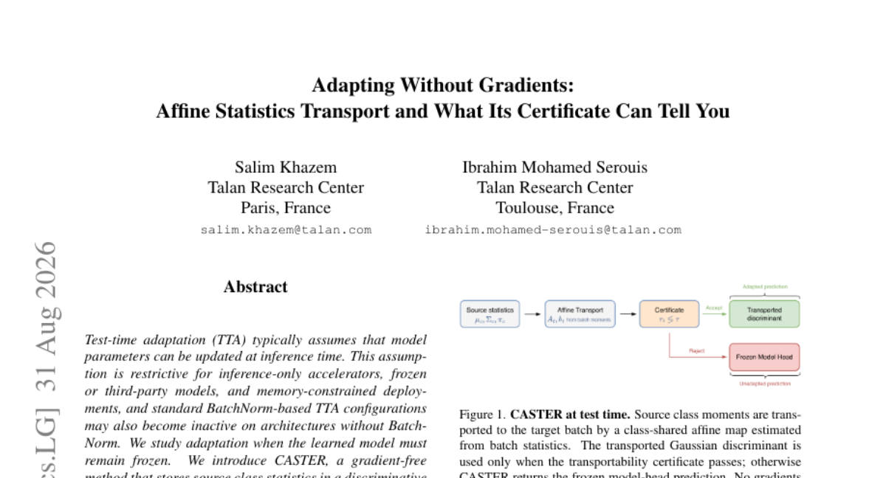

### 📌 한 줄 요약
모델 파라미터를 수정할 수 없는 환경에서 성능을 높이는 그래디언트 프리(Gradient-free) 적응 기법과 신뢰도 검증 방법론 제안

### 🔑 핵심 포인트
- 파라미터 업데이트 없이 동작하는 그래디언트 프리(Gradient-free) 적응 방식 제안
- 소스 클래스 통계량의 아핀 변환을 통한 효율적인 분포 전송(CASTER)
- 적응의 위험성을 판단할 수 있는 잔차 대 마진(residual-to-margin) 인증 지표 도입

### 🧑‍💻 개발자 관점
모델 가중치를 수정할 수 없는 엣지 디바이스나 서드파티 모델을 사용하는 배포 환경에서 즉각적으로 성능을 개선할 수 있습니다.

### 🚀 실무 적용 아이디어
- 동결된 백본 모델에 CASTER 알고리즘을 적용하여 k-NN 성능과 비교 실험
- 클래스 수가 배치 크기보다 훨씬 많은 상황(예: ImageNet-C)에서의 성능 저하 확인
- 제안된 인증 지표를 활용하여 적응(Adaptation) 여부를 결정하는 게이팅 로직 구현

### ⚠️ 리스크/한계
- 클래스 수가 매우 많은 상황에서 무조건적인 아핀 변환 적용 시 성능 저하 위험
- 제안된 인증 지표가 모든 위험 상황을 완벽하게 분리하지는 못할 수 있음

### 📝 초록 기반 상세 설명
기존의 테스트 시간 적응(TTA) 방식은 모델 파라미터 업데이트를 전제로 하지만, 이는 추론 전용 가속기나 동결된 모델 환경에서는 적용이 어렵습니다. 본 논문은 모델을 고정한 상태에서 적응할 수 있는 CASTER 방식을 제안합니다. CASTER는 소스 클래스 통계량을 판별 공간에 저장하고, 타겟 배치 모멘트를 통해 아핀 변환을 추정하여 소스 분포를 전송하는 그래디언트 프리 방식을 사용합니다. 실험 결과, CASTER는 기존 k-NN보다 적은 메모리를 사용하면서도 다양한 백본과 데이터셋에서 우수한 성능을 보였습니다. 또한, 아핀 변환의 위험성을 관리하기 위해 잔차 대 마진(residual-to-margin) 기반의 신뢰도 인증 지표를 도입하여 안정적인 적응을 지원합니다.

---

## 21. [Recursive Criticality of AI Self-Improvement](https://huggingface.co/papers/2609.00137)
**Upvotes**: 4 | **도입 난이도**: 하 | **신뢰도**: 상
**arXiv**: https://arxiv.org/abs/2609.00137

**태그**: AI Safety, Recursive Improvement, R&D Automation, System Dynamics

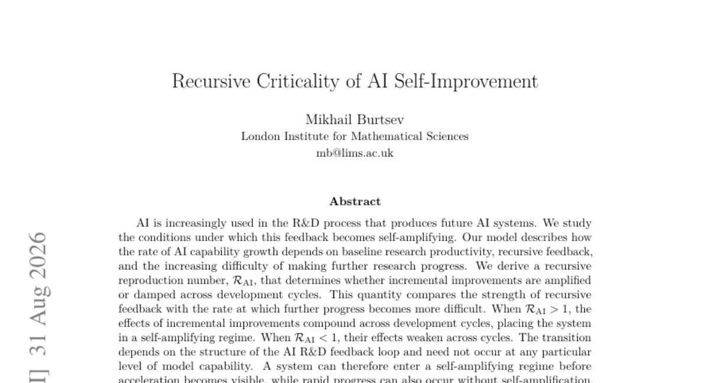

### 📌 한 줄 요약
AI가 차세대 AI를 개발하는 재귀적 피드백 루프의 임계점과 자기 증폭(Self-amplifying) 조건을 분석한 연구

### 🔑 핵심 포인트
- 재귀적 재생산 지수(R_AI)를 통한 AI 자기 증폭 임계점 정의
- 피드백 강도와 연구 난이도 증가 사이의 상호작용 모델링
- 개별 주체의 성과가 아닌 생태계 차원의 공유가 전체 시스템의 가속을 결정할 수 있음

### 🧑‍💻 개발자 관점
AI를 활용한 자동화된 R&D 루프를 설계할 때, 시스템이 통제 불가능한 가속 단계로 진입할지 여부를 예측하는 이론적 프레임워크를 제공합니다.

### 🚀 실무 적용 아이디어
- AI 기반 자동화 파이프라인의 피드백 루프 구조 설계
- 연구 난이도 증가율(Diminishing returns)을 고려한 R_AI 시뮬레이션 수행
- 조직 간 기술 공유가 전체 R&D 생태계에 미치는 영향 분석

### ⚠️ 리스크/한계
- 이론적 모델로, 실제 복잡한 R&D 환경에서의 변수를 완벽히 반영하기 어려움
- 가시적인 가속화가 나타나기 전 임계점에 도달할 수 있어 예측의 어려움 존재

### 📝 초록 기반 상세 설명
AI가 차세대 AI를 개발하는 R&D 과정에 투입됨에 따라 발생하는 재귀적 피드백의 특성을 연구합니다. 연구진은 기본 연구 생산성, 재귀적 피드백, 연구 난이도 증가 사이의 관계를 모델링하여 재귀적 재생산 지수(R_AI)를 도출했습니다. R_AI가 1보다 크면 개선 효과가 사이클을 거치며 증폭되는 자기 증폭 상태에 진입하고, 1보다 작으면 효과가 감쇄됩니다. 이 전이는 특정 성능 수준이 아닌 피드백 루프의 구조에 따라 결정되므로, 가시적인 가속화가 나타나기 전에도 시스템이 임계점에 도달할 수 있습니다. 또한, 개별 주체가 아닌 생태계 차원의 공유가 전체 시스템의 자기 증폭을 유도할 수 있음을 보여줍니다.

### 🖼️ 추가 자료
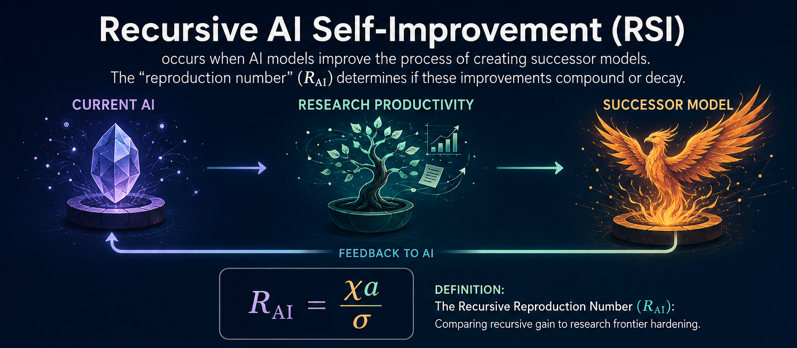

---

## 22. [ReFlowSET: Representation-Aligned Latent Flow Matching for SAR-to-EO Image Translation](https://huggingface.co/papers/2609.00968)
**Upvotes**: 3 | **도입 난이도**: 중 | **신뢰도**: 상
**arXiv**: https://arxiv.org/abs/2609.00968

**태그**: Computer Vision, Diffusion, SAR-to-EO, Flow Matching, Vision, Inference, Safety

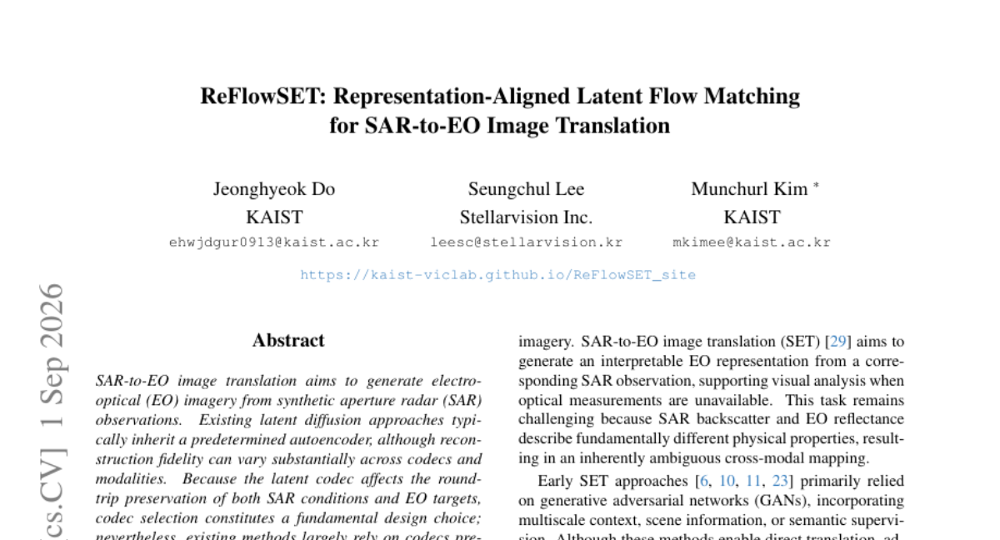

### 📌 한 줄 요약
SAR 데이터를 EO 이미지로 변환할 때, 데이터 특성에 최적화된 오토인코더를 직접 선택하고 VFM을 활용해 정렬하는 고성능 Flow Matching 프레임워크

### 🔑 핵심 포인트
- SAR-EO 공동 재구성 감사를 통한 최적의 잠재 코덱(Latent Codec) 선택
- 작고 효율적인 조건부 DiT를 처음부터 학습하는 방식 채택
- Frozen VFM을 활용한 중간 노이즈 특징과 타겟 특징 간의 의미적 정렬(Alignment)

### 🧑‍💻 개발자 관점
도메인 특화 데이터(SAR)를 다룰 때 일반적인 자연 이미지용 오토인코더를 쓰는 대신, 데이터 특성에 맞는 코덱을 설계하는 것이 성능에 결정적임을 보여줍니다.

### 🚀 실무 적용 아이디어
- 제공된 코드를 활용하여 다양한 도메인 데이터셋에 대한 코덱 선택 성능 검증
- VFM 정렬 방식이 학습 안정성에 미치는 영향 분석
- DiT 모델 크기 변화에 따른 추론 효율성 및 품질 트레이드오프 테스트

### ⚠️ 리스크/한계
- 학습 시 VFM 정렬 방식이 특정 도메인에 과적합될 가능성
- 새로운 코덱을 처음부터 학습해야 하므로 초기 학습 비용 발생

### 📝 초록 기반 상세 설명
SAR 관측 데이터로부터 EO 이미지를 생성하는 작업은 기존의 사전 학습된 오토인코더에 의존하여 재구성 정밀도가 떨어지는 문제가 있었습니다. 이를 해결하기 위해 연구진은 SAR와 EO 재구성을 동시에 고려하여 최적의 코덱을 선택하는 ReFlowSET 프레임워크를 제안합니다. 이 방식은 무거운 사전 학습 모델 대신, 선택된 잠재 공간 내에서 작은 크기의 조건부 DiT를 처음부터 학습시킵니다. 학습 과정에서 Frozen Vision Foundation Model을 사용하여 노이즈가 포함된 EO 특징을 깨끗한 타겟 EO 표현과 정렬함으로써 의미적 가이드를 제공합니다. 실험 결과, 제안된 방법은 다양한 지각적 충실도 및 분포 지표에서 SOTA 성능을 달성했습니다.

---

## 23. [Learning Where Outcomes Change:Credit-Addressable Reasoning for Multimodal Geometry](https://huggingface.co/papers/2608.30457)
**Upvotes**: 3 | **도입 난이도**: 상 | **신뢰도**: 상
**arXiv**: https://arxiv.org/abs/2608.30457

**태그**: Multimodal, Reinforcement Learning, Reasoning, Geometry, RAG, Benchmark, Inference

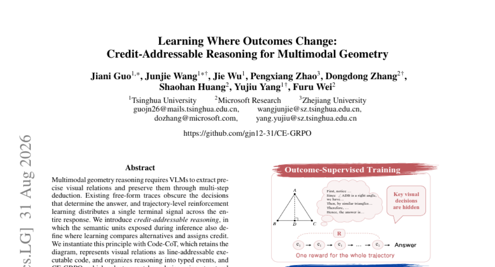

### 📌 한 줄 요약
멀티모달 기하학 추론을 위해 추론 단계별로 보상을 정밀하게 할당하는 Credit-Addressable Reasoning 기법 제안

### 🔑 핵심 포인트
- Code-CoT: 시각적 관계를 실행 가능한 코드로 변환하여 추론의 구조적 명확성 확보
- CE-GRPO: 구조적 사전 지식과 엔트로피를 활용해 추론 이벤트 경계를 식별하고 보상을 국소화
- Representation-Optimization Co-design: 표현 방식과 최적화 알고리즘을 결합하여 장기 추론 성능 극대화

### 🧑‍💻 개발자 관점
복잡한 단계별 추론(Multi-step reasoning)이 필요한 에이전트 설계 시, 최종 결과뿐만 아니라 중간 과정의 신뢰도를 높이는 방법론을 제공합니다.

### 🚀 실무 적용 아이디어
- Code-CoT와 같이 시각 정보를 구조화된 코드로 변환하는 프롬프트 엔지니어링 실험
- 전체 경로가 아닌 중간 단계(Event) 단위로 보상을 주는 강화학습 스케줄링 테스트
- 복잡한 논리 구조를 가진 멀티모달 데이터셋에 대한 성능 벤치마크 수행

### ⚠️ 리스크/한계
- 추론 단계가 코드로 표현 가능한 구조적 문제에 국한될 수 있음
- 이벤트 경계 설정 및 보상 할당 로직의 복잡도로 인한 학습 불안정성 가능성

### 📝 초록 기반 상세 설명
기존의 멀티모달 기하학 추론은 자유 형식의 추론 과정으로 인해 의사결정 과정을 파악하기 어렵고, 최종 결과에만 의존하는 강화학습 방식은 보상 분산 문제가 발생합니다. 이를 해결하기 위해 추론 과정의 의미 단위가 학습의 비교 및 보상 할당 기준이 되는 'Credit-Addressable Reasoning'을 도입했습니다. 구체적으로는 시각적 관계를 실행 가능한 코드로 표현하는 Code-CoT와 이벤트 경계 기반의 보상 할당 방식인 CE-GRPO를 제안합니다. 실험 결과, 제안 방식은 9개의 기하학 벤치마크에서 기존 모델 및 일반 GRPO 대비 우수한 성능을 기록했습니다. 특히 추론 단계가 길고 의존성이 높은 문제에서 그 효과가 더욱 두드러졌습니다.

---

## 24. [The Mechanics of Democratic Dominance: A System Dynamics Paradigm for Dynamic Consent Engineering](https://huggingface.co/papers/2608.27509)
**Upvotes**: 3 | **도입 난이도**: 상 | **신뢰도**: 상
**arXiv**: https://arxiv.org/abs/2608.27509

**태그**: System Dynamics, Political Engineering, Feedback Loops, Modeling

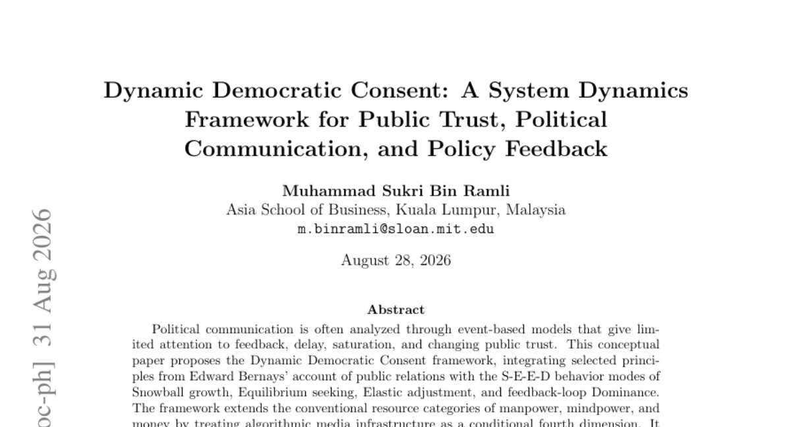

### 📌 한 줄 요약
시스템 다이내믹스 모델을 활용하여 정치적 지배력과 대중의 동의를 수학적으로 구조화한 동적 동의 공학(DCE) 프레임워크 제안

### 🔑 핵심 포인트
- Bernays의 PR 원칙과 시스템 다이내믹스(S-E-E-D)의 융합
- 알고리즘 인프라를 포함한 4차원 자원 매트릭스 기반의 정치적 지배력 모델링
- 비선형 피드백 루프를 통한 정책 저항 및 신뢰 붕괴 메커니즘 규명

### 🧑‍💻 개발자 관점
알고리즘 기반의 정보 유통 환경에서 피드백 루프와 시스템 동역학이 사용자 행동 및 사회적 합의에 미치는 영향을 이해하는 데 중요합니다.

### 🚀 실무 적용 아이디어
- 시스템 다이내믹스 모델링 도구를 활용한 피드백 루프 시뮬레이션 수행
- 알고리즘 추천 시스템의 피드백 지연(Time Lag) 효과 분석
- 역사적 데이터셋을 활용한 모델의 참조 모드 검증 실험

### ⚠️ 리스크/한계
- 정치적/윤리적 조작 도구로 악용될 가능성
- 복잡한 사회적 변수를 수학적 모델로 단순화할 때 발생하는 오차

---

## 25. [Token-Efficient Data Reasoning Agents via Adaptive Structuring of Unstructured Data](https://huggingface.co/papers/2608.31082)
**Upvotes**: 2 | **도입 난이도**: 중 | **신뢰도**: 상
**arXiv**: https://arxiv.org/abs/2608.31082

**태그**: AI Agent, RAG, Data Structuring, Cost Optimization, Agent, Reasoning, Benchmark

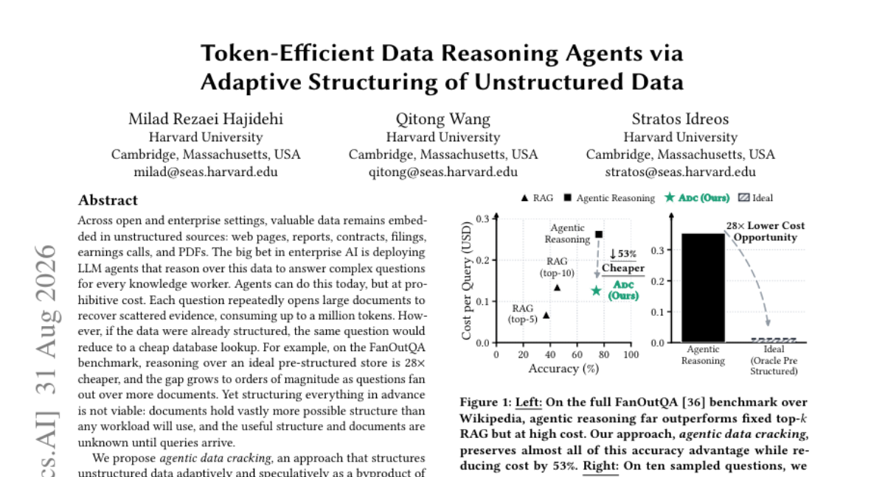

### 📌 한 줄 요약
추론 과정에서 발생하는 데이터 구조화 작업을 통해 비용을 절감하고 지식 활용 효율을 극대화하는 적응형 에이전트 프레임워크

### 🔑 핵심 포인트
- Agentic Data Cracking: 추론 과정의 부산물로 비정형 데이터를 구조화하는 적응형 방식 제안
- Speculative Structuring: 현재 질문을 넘어 미래의 관련 쿼리까지 고려하여 구조를 미리 추출
- Cost-Efficiency: 구조화된 데이터 저장소를 통해 RAG 비용을 낮추면서도 높은 정확도 유지

### 🧑‍💻 개발자 관점
대규모 문서 기반의 RAG 시스템 구축 시, 반복적인 문서 로딩 비용을 줄이고 지식 축적형 데이터베이스를 구축하는 새로운 아키텍처를 제시합니다.

### 🚀 실무 적용 아이디어
- FanOutQA와 같은 다중 문서 추론 벤치마크 환경 구축
- 추론 중 구조화 작업을 수행하는 서브 에이전트(Cracking Agent) 로직 구현
- 추출된 구조화 데이터와 원본 문서 간의 정합성 검증 실험

### ⚠️ 리스크/한계
- 초기 구조화 작업 시 발생하는 오버헤드 및 잘못된 구조 추출 리스크
- 데이터 구조가 복잡해질수록 관리 및 검색 효율이 저하될 가능성

### 📝 초록 기반 상세 설명
기업용 AI 에이전트가 비정형 데이터(PDF, 웹 등)를 기반으로 복잡한 질문에 답할 때, 매번 대규모 문서를 다시 읽는 방식은 막대한 토큰 비용을 발생시킵니다. 모든 데이터를 미리 구조화하는 것은 불가능하며, 어떤 구조가 유용할지 쿼리 전에는 알 수 없다는 문제가 있습니다. 이를 해결하기 위해 본 논문은 추론 과정에서 데이터 구조화를 적응적(Adaptive)이고 투기적(Speculative)으로 수행하는 'Agentic Data Cracking' 방식을 제안합니다. 에이전트가 문서를 열 때 별도의 서브 에이전트가 미래의 관련 쿼리에 유용한 구조를 미리 추출하여 저장합니다. 결과적으로 시간이 흐를수록 구조화된 데이터만으로 질문을 해결할 수 있게 되어, 정확도는 유지하면서 비용을 획기적으로 절감합니다.

---

## 26. [DramaChain Bench: An End-to-End Benchmark for Short-Drama Generation](https://huggingface.co/papers/2609.00646)
**Upvotes**: 1 | **도입 난이도**: 중 | **신뢰도**: 상
**arXiv**: https://arxiv.org/abs/2609.00646

**태그**: Agent, Video-Generation, Benchmark, Multi-modal, Vision, Video, Evaluation

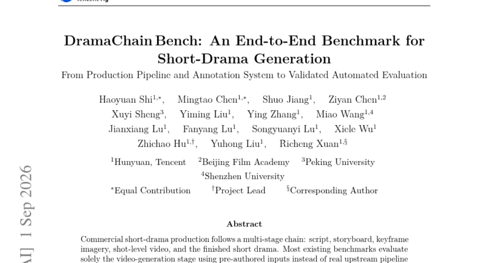

### 📌 한 줄 요약
대본부터 최종 영상까지의 전체 제작 파이프라인을 평가하는 엔드투엔드 숏폼 드라마 생성 벤치마크 제안

### 🔑 핵심 포인트
- 대본부터 최종 영상까지 이어지는 전체 제작 파이프라인(End-to-End) 평가 프레임워크 구축
- 63개의 세부 차원을 포함하는 다차원 평가 체계 및 전문 인력 기반의 정밀 데이터셋 확보
- 인간의 평가와 높은 상관관계를 보이는 에이전트 기반 자동 평가 시스템(Agentic Judge) 개발

### 🧑‍💻 개발자 관점
단순한 영상 품질 측정을 넘어, 생성형 AI 모델이 복잡한 워크플로우 상에서 의도를 얼마나 잘 유지하는지 평가하는 실무적 기준을 제공합니다.

### 🚀 실무 적용 아이디어
- 제시된 63개 차원을 활용하여 현재 사용 중인 영상 생성 모델의 파이프라인 결함 분석
- 에이전트 기반 자동 평가 시스템을 기존 워크플로우에 통합하여 평가 비용 절감 실험
- 상위 단계(대본/스토리보드)의 품질이 최종 영상에 미치는 영향도 정량적 측정

### ⚠️ 리스크/한계
- 전문 인력의 주관적 평가에 의존하는 데이터셋 특성상 도메인 편향 가능성 존재
- 복잡한 에이전트 기반 평가 방식의 연산 비용 및 추론 시간 고려 필요

### 📝 초록 기반 상세 설명
기존의 숏폼 드라마 생성 평가는 주로 최종 비디오 생성 단계에만 집중하여, 상위 단계의 의도 반영 여부나 에피소드 간 일관성 문제를 해결하지 못했습니다. 이를 해결하기 위해 대본, 스토리보드, 키프레임, 영상 생성 등 전체 제작 체인을 평가하는 'DramaChain Bench'를 제안합니다. 이 벤치마크는 63개의 세부 차원을 가진 'DramaChain Dimensions'와 전문 인력이 검증한 데이터셋을 기반으로 구축되었습니다. 또한, 자동화된 'DramaChain Agentic Judge'를 통해 인간의 평가와 높은 상관관계(PLCC 0.918)를 보이는 자동 평가 시스템을 구현했습니다. 실험 결과, 상위 단계의 결함이 최종 품질에 연쇄적으로 영향을 미침을 확인하였으며, 자동화된 에이전트가 인간의 평가를 효과적으로 대체할 수 있음을 입증했습니다.

---

