# 2026-09-09 Daily Papers (Top 10)

## 오늘의 요약
오늘의 연구는 LLM의 추론 속도 향상과 자기 개선(Self-Improvement) 과정에서의 모델 붕괴 방지에 집중되었습니다. 또한, 로봇 제어와 시각적 세그멘테이션 등 물리적 환경에서의 에이전트 신뢰성을 확보하기 위한 프레임워크 연구가 활발히 논의되었습니다.

### 오늘의 핵심 포인트
- 디퓨전 기술을 활용하여 기존 LLM의 성능 저하 없이 생성 속도를 높이는 무손실 가속 기법이 제안되었습니다.
- 강화학습 및 자기 증류 과정에서 발생하는 모델 붕괴와 잘못된 확신 문제를 해결하기 위한 정교한 검증 및 보정 메커니즘이 강조되었습니다.
- 인컨텍스트 러닝과 앙상블 기법을 통해 복잡한 프롬프트 설계 없이도 인과 추론 및 정보 추출의 정확도를 높이는 효율적인 워크플로우가 제시되었습니다.

**오늘의 태그**: LLM-Optimization, Self-Improvement, Agent-Framework, In-Context-Learning

## 1. [Unlocking Lossless Speedups in LLMs via Discrete Diffusion](https://huggingface.co/papers/2609.04010)
**Upvotes**: 64 | **도입 난이도**: 중 | **신뢰도**: 상
**arXiv**: https://arxiv.org/abs/2609.04010

**태그**: LLM-Acceleration, Diffusion-Models, Inference-Optimization, Generative-AI, Agent, Reasoning, Benchmark, Evaluation, Inference, Distillation

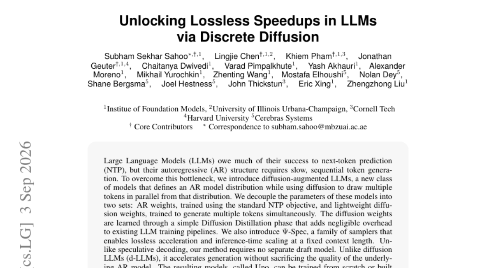

### 📌 한 줄 요약
기존 LLM의 순차적 생성 병목을 해결하기 위해, AR 모델의 품질을 유지하면서도 디퓨전 기술로 다중 토큰을 병렬 생성하는 Uno 모델 제안

### 🔑 핵심 포인트
- AR 가중치와 경량 디퓨전 가중치를 분리하여 기존 LLM에 손실 없이 적용 가능한 구조 설계
- 별도의 드래프트 모델이 필요 없는 Ψ-Spec 샘플러를 통한 무손실 가속 및 추론 시간 확장성 확보
- 기존 스펙큘레이티브 디코딩 대비 높은 처리량과 최상위 벤치마크 성능(코딩, 에이전트 등) 달성

### 🧑‍💻 개발자 관점
추가적인 드래프트 모델 관리 비용 없이 기존 LLM의 성능 저하 없이 생성 속도를 획기적으로 높일 수 있는 실용적인 가속 기법입니다.

### 🚀 실무 적용 아이디어
- 제공된 코드를 활용하여 기존 오픈소스 LLM에 Uno 방식의 디퓨전 가중치 학습 적용 실험
- 다양한 배치 사이즈 환경에서 기존 스펙큘레이티브 디코딩(Speculative Decoding)과 처리량(Throughput) 비교
- 특정 도메인(코딩, 에이전트) 작업에서 생성 품질 유지 여부 검증

### ⚠️ 리스크/한계
- 디퓨전 증류(Distillation) 단계에서의 추가적인 학습 오버헤드 발생 가능성
- 특정 컨텍스트 길이에 고정된 샘플링 방식의 유연성 제약 여부 확인 필요

### 📝 초록 기반 상세 설명
기존 LLM은 차세대 토큰 예측(NTP) 방식의 자기회귀(AR) 구조로 인해 생성 속도가 느린 병목 현상을 겪습니다. 이를 해결하기 위해 AR 모델의 분포를 유지하면서 디퓨전을 통해 여러 토큰을 동시에 추출하는 'diffusion-augmented LLMs'를 도입합니다. 모델 파라미터를 표준 NTP 학습을 위한 AR 가중치와 다중 토큰 생성을 위한 경량 디퓨전 가중치로 분리하여 학습 효율을 높였습니다. 또한, 별도의 드래프트 모델 없이도 손실 없는 가속을 가능하게 하는 Ψ-Spec 샘플러를 제안합니다. 실험 결과, Uno는 기존 스펙큘레이티브 디코딩보다 높은 처리량을 달성하며 기존 AR 모델 대비 최대 3배의 속도 향상을 보여주었습니다.

### 🖼️ 추가 자료
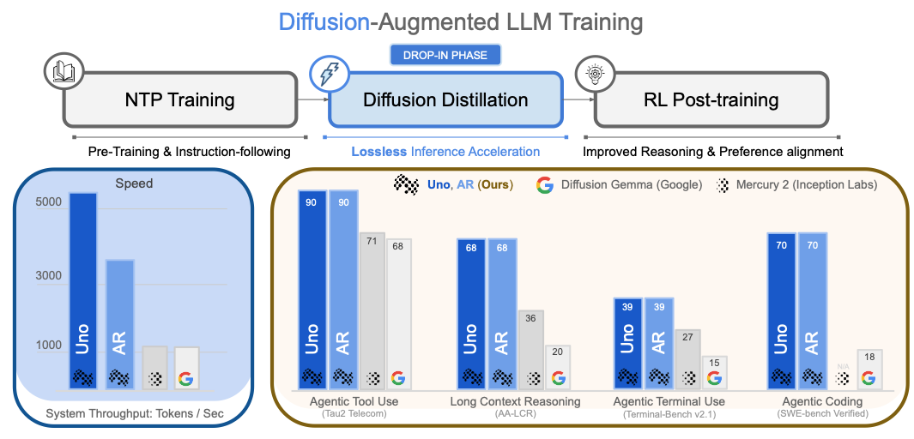
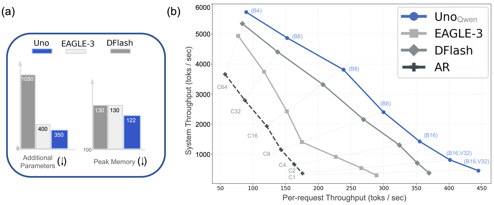

---

## 2. [FlowBalance: Verifier-Grounded Self-Improvement from On-Policy Reasoning Experience](https://huggingface.co/papers/2609.03241)
**Upvotes**: 52 | **도입 난이도**: 상 | **신뢰도**: 상
**arXiv**: https://arxiv.org/abs/2609.03241

**태그**: LLM, Reinforcement Learning, Reasoning, Self-Improvement, RAG, Vision

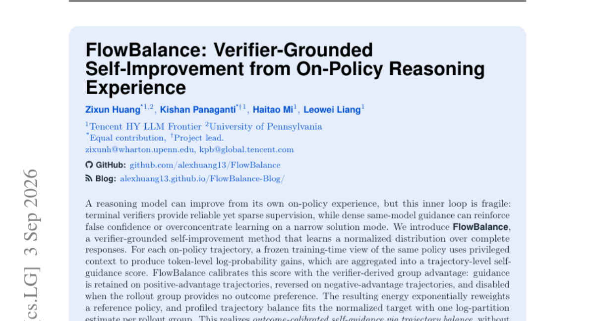

### 📌 한 줄 요약
검증기(Verifier)와 모델 자체의 가이드를 결합하여, 잘못된 확신에 빠지지 않고 안정적으로 추론 능력을 향상시키는 자기 개선(Self-Improvement) 방법론

### 🔑 핵심 포인트
- 검증기(Verifier)와 모델 자체 가이드를 결합한 정교한 보상 보정 메커니즘 도입
- 별도의 토큰 단위 모방 손실 없이 Trajectory Balance를 통한 효율적인 분포 학습
- 잘못된 확신(False Confidence) 방지 및 응답 길이 붕괴(Response-length collapse) 억제

### 🧑‍💻 개발자 관점
LLM의 RL(강화학습) 과정에서 발생하는 학습 불안정성과 특정 답변 패턴에 매몰되는 문제를 해결할 수 있는 실전적인 최적화 기법입니다.

### 🚀 실무 적용 아이디어
- 기존 RLHF/PPO 환경에 FlowBalance의 보상 보정 로직 적용 테스트
- 수학적 추론 태스크에서 모델의 응답 길이 변화 및 다양성 지표 모니터링
- 검증기(Verifier)의 신뢰도 수준에 따른 가이드 반전(Reversed guidance) 파라미터 실험

### ⚠️ 리스크/한계
- 검증기(Verifier)의 품질에 따라 학습 방향이 왜곡될 위험 존재
- 복잡한 수식 기반의 에너지 기반 모델링으로 인해 구현 난이도가 높음

### 📝 초록 기반 상세 설명
추론 모델이 자신의 경험을 통해 스스로 학습할 때, 희소한 검증 결과와 과도한 자기 가이드 사이의 불균형으로 인해 학습이 불안정해지는 문제가 발생합니다. 이를 해결하기 위해 FlowBalance는 검증기 기반의 보상과 모델의 토큰별 로그 확률 이득을 결합한 새로운 자기 개선 방식을 제안합니다. 긍정적 결과에는 가이드를 유지하고 부정적 결과에는 가이드를 반전시키는 방식으로 보상을 정교하게 보정합니다. 이 과정은 별도의 모방 손실 없이도 결과 중심의 보정된 자기 가이드를 실현합니다. 실험 결과, 수학적 추론 성능 향상과 더불어 학습 속도 및 안정성을 확보하였으며, 응답 길이가 짧아지는 붕괴 현상을 방지했습니다.

---

## 3. [ENEAS: Embedding-guided Neural Ensemble for Adaptive Segmentation](https://huggingface.co/papers/2609.03756)
**Upvotes**: 22 | **도입 난이도**: 중 | **신뢰도**: 상
**arXiv**: https://arxiv.org/abs/2609.03756

**태그**: Computer Vision, Segmentation, Object Tracking, VLM, RAG, Reasoning, Video, Inference

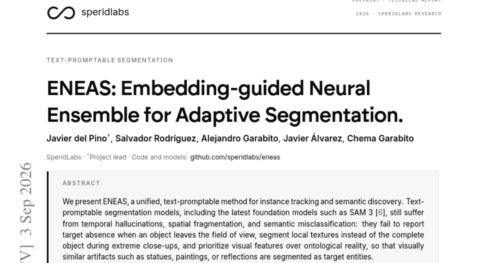

### 📌 한 줄 요약
텍스트 프롬프트와 시맨틱 검증을 결합하여 객체 소실 및 오분류 문제를 해결한 적응형 인스턴스 트래킹 및 세그멘테이션 프레임워크

### 🔑 핵심 포인트
- 텍스트 프롬프트 기반의 정밀 트래킹과 오픈 컨셉 디스커버리 통합
- 시각적 유사 객체(Doppelgangers)를 구분하기 위한 임베딩 매칭 및 VLM 기반 시맨틱 검증 레이어
- 객체 소실 및 과도한 클로즈업 상황에서도 타겟을 유지하는 시공간적 일관성 확보

### 🧑‍💻 개발자 관점
시각적 특징만으로는 구분하기 힘든 유사 객체가 존재하는 환경(예: 3D 스캔, 복잡한 실내)에서 신뢰도 높은 자동화 파이프라인을 구축할 수 있습니다.

### 🚀 실무 적용 아이디어
- 제공된 GitHub 코드를 활용하여 다양한 조명/각도 환경에서의 트래킹 안정성 테스트
- VLM 검증 레이어가 포함된 하이브리드 방식의 추론 지연 시간(Latency) 측정
- 3D 재구성 파이프라인에 ENEAS의 세그멘테이션 결과를 입력값으로 적용해보기

### ⚠️ 리스크/한계
- VLM을 통한 시맨틱 검증 단계가 포함되어 있어 순수 비전 모델 대비 연산 비용 발생 가능성
- 매우 복잡한 배경이나 극단적인 가려짐 상황에서의 세그멘테이션 정확도 변동성

### 📝 초록 기반 상세 설명
최신 SAM과 같은 파운데이션 모델은 객체가 화면 밖으로 나가거나 클로즈업될 때, 혹은 시각적으로 유사한 가짜 객체(반사, 그림 등)를 구분하지 못하는 문제가 있습니다. 이를 해결하기 위해 ENEAS는 정밀 트래킹과 오픈 컨셉 디스커버리라는 두 가지 기능을 동시에 수행하는 통합 프레임워크를 제안합니다. 방법론적으로는 SeC 아키텍처에 텍스트 어댑터를 결합하여 시공간적 일관성을 유지하며, 시각적 임베딩 매칭과 VLM(Vision-Language Model)을 결합한 계층적 검증 레이어를 통해 모호한 후보만 선별적으로 추론합니다. 결과적으로 시각적 유사성에 의한 오분류를 방지하면서도 낮은 지연 시간을 유지하며, 3D 재구성 등 정밀한 데이터가 필요한 환경에서 신뢰할 수 있는 세그멘테이션을 제공합니다.

---

## 4. [EmbodiedSkills: A Unified Framework for Orchestrating, Training, and Deploying VLA Agents](https://huggingface.co/papers/2609.01281)
**Upvotes**: 10 | **도입 난이도**: 중 | **신뢰도**: 상
**arXiv**: https://arxiv.org/abs/2609.01281

**태그**: VLA, Robotics, Agent, Embodied AI, RAG, Vision

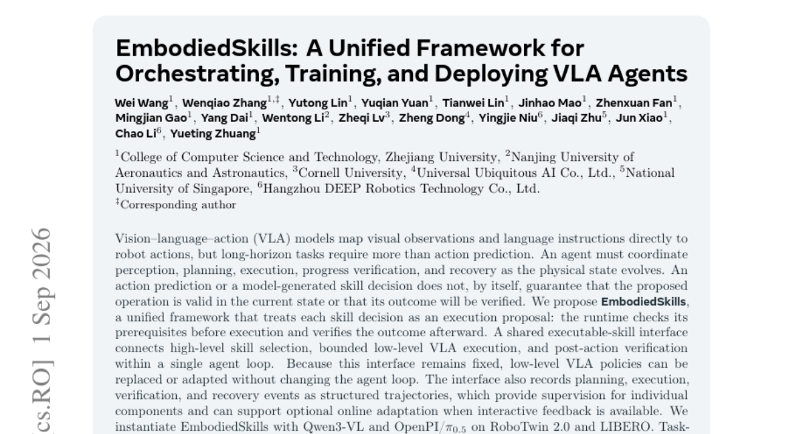

### 📌 한 줄 요약
VLA 모델의 실행 제안-검증 루프를 통해 복잡한 로봇 작업을 안정적으로 수행하는 통합 프레임워크 제안

### 🔑 핵심 포인트
- 실행 전 사전 요구사항 체크 및 실행 후 결과 검증을 포함하는 통합 에이전트 루프 설계
- 고수준 스킬 선택과 저수준 VLA 실행을 분리하여 모델 교체가 용이한 모듈형 인터페이스 구축
- 계획, 실행, 검증, 복구 과정을 구조화된 궤적으로 기록하여 학습 및 디버깅에 활용

### 🧑‍💻 개발자 관점
단순한 행동 예측을 넘어, 에이전트가 스스로 계획의 유효성을 검증하고 실패 시 복구하는 '신뢰 가능한 로봇 제어 루프'를 구축하는 방법론을 제시한다.

### 🚀 실무 적용 아이디어
- 제안된 인터페이스 구조를 기존의 오픈소스 VLA 모델(예: OpenPI)에 이식해보기
- 실패 상황(Recovery) 발생 시 기록된 구조화된 데이터를 활용한 미세 조정 실험
- 동일한 프레임워크 내에서 서로 다른 저수준 정책을 교체하며 성능 변화 관찰

### ⚠️ 리스크/한계
- 복잡한 환경에서 검증(Verification) 단계의 정확도가 낮을 경우 에이전트 루프 전체가 붕괴될 위험
- 메모리 의존적 작업(RMBench)에서의 상대적으로 낮은 성공률로 인한 장기 기억 한계

### 📝 초록 기반 상세 설명
기존의 VLA 모델은 시각 정보와 언어를 행동으로 변환하지만, 장기적인 작업 수행 시 상태 변화에 따른 계획 및 검증 과정이 부족하다는 문제가 있다. 이를 해결하기 위해 각 기술적 결정을 '실행 제안'으로 취급하는 EmbodiedSkills 프레임워크를 제안한다. 이 프레임워크는 고수준의 스킬 선택, 저수준 VLA 실행, 사후 검증을 하나의 고정된 인터페이스로 연결하여 모듈식 교체가 가능하게 한다. 실험 결과, RoboTwin 2.0 및 LIBERO 벤치마크에서 높은 성공률을 기록하며 제안된 방식의 유효성을 입증했다. 결과적으로 이 프레임워크는 개별 VLA 정책을 신뢰할 수 있는 폐쇄 루프 로봇 시스템으로 변환하는 데 기여한다.

### 🖼️ 추가 자료
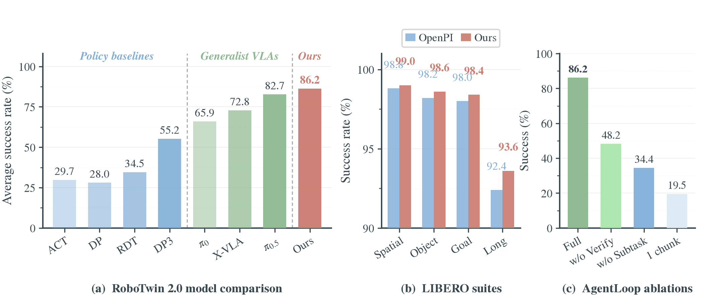
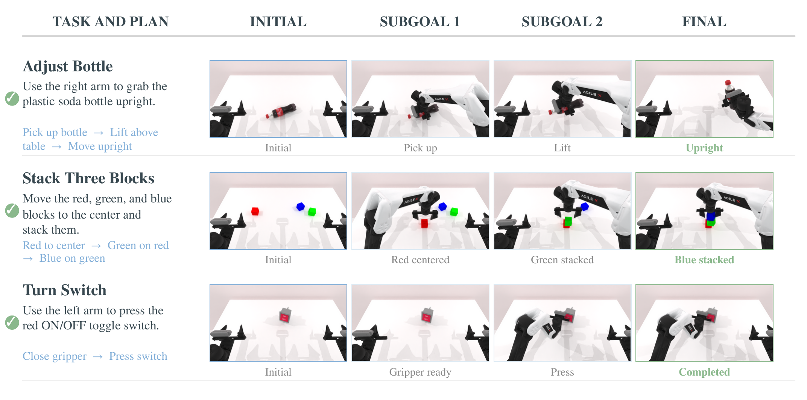
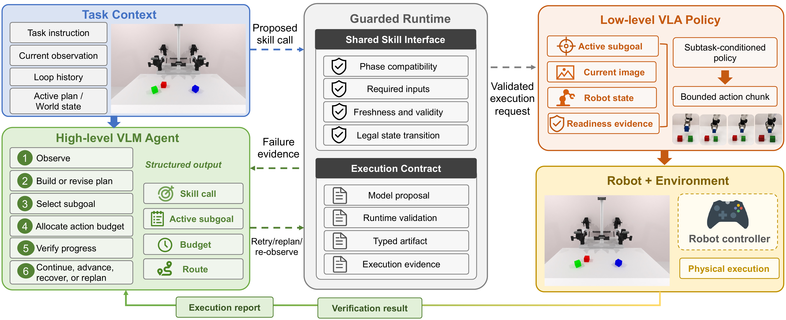
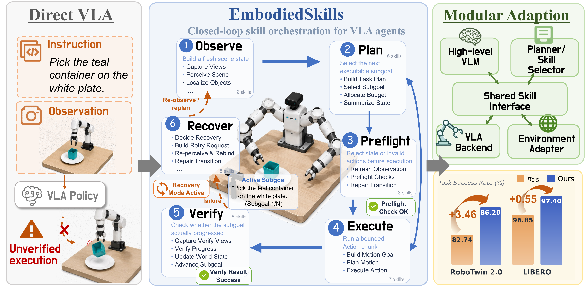

---

## 5. [One Symptom, Three Levers: A Critical Review of On-Policy Self-Distillation](https://huggingface.co/papers/2608.25936)
**Upvotes**: 10 | **도입 난이도**: 하 | **신뢰도**: 상
**arXiv**: https://arxiv.org/abs/2608.25936

**태그**: LLM, Self-Distillation, Reasoning, Fine-tuning, Vision, Distillation

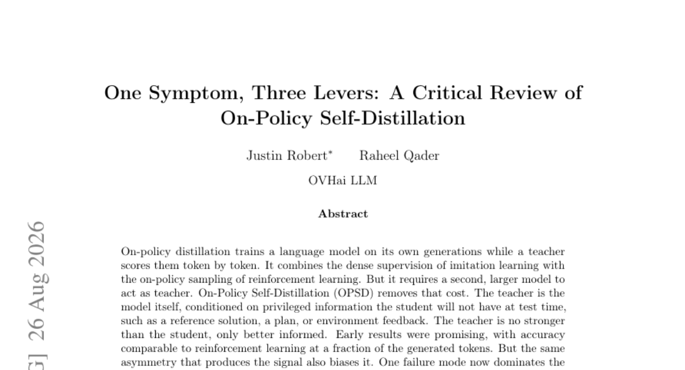

### 📌 한 줄 요약
On-Policy Self-Distillation(OPSD)의 핵심 문제인 모델 붕괴(Collapse) 현상을 분석하고 이를 제어하는 세 가지 핵심 요소를 정리한 리뷰 논문입니다.

### 🔑 핵심 포인트
- OPSD의 핵심 실패 모드인 '모델 붕괴(Collapse)' 현상에 대한 심층 분석
- 붕괴를 결정하는 세 가지 핵심 레버(토큰 가중치, 특권 정보의 성격, 가이드 감쇠 역학) 정의
- 수학적 추론 분야의 분산된 연구들을 하나의 구조적 프레임워크로 통합

### 🧑‍💻 개발자 관점
자체 생성 데이터를 학습에 사용하는 Self-Improvement 기법을 설계할 때, 모델 성능이 급격히 저하되는 붕괴 현상을 방지하기 위한 가이드라인을 제공합니다.

### 🚀 실무 적용 아이디어
- Self-Distillation 적용 시 토큰별 가중치(Weighting) 방식 변경 실험
- 학습 시 제공하는 특권 정보(Privileged Information)의 종류에 따른 붕괴 양상 관찰
- 학습 단계별 가이드(Guidance) 감쇠 스케줄링 최적화

### ⚠️ 리스크/한계
- 특권 정보를 활용한 학습은 모델의 추론 경로를 좁히는 붕괴 위험을 내포함
- 수학적 추론 영역에 집중된 분석이 다른 도메인에 동일하게 적용될지는 검증 필요

### 📝 초록 기반 상세 설명
On-Policy Self-Distillation(OPS냐)은 모델이 생성한 결과물을 스스로 학습하여 효율적인 성능 향상을 꾀하는 기법입니다. 하지만 학습 과정에서 모델의 추론 경로가 좁아지는 '붕괴(Collapse)' 현상이 주요한 실패 모드로 나타납니다. 본 논문은 붕괴 현상을 유발하는 세 가지 레버(신호 적용 위치, 특권 정보의 성격, 신호 변화 시점)를 중심으로 현상을 분석합니다. 수학적 추론 영역을 중심으로 기존 연구들을 구조적으로 재정의하고, 무엇이 해결되었고 무엇이 논쟁 중인지 명확히 구분합니다. 실험적 성과보다는 현상에 대한 공통된 어휘와 구조적 분석을 제공하는 데 초점을 맞춥니다.

### 🖼️ 추가 자료
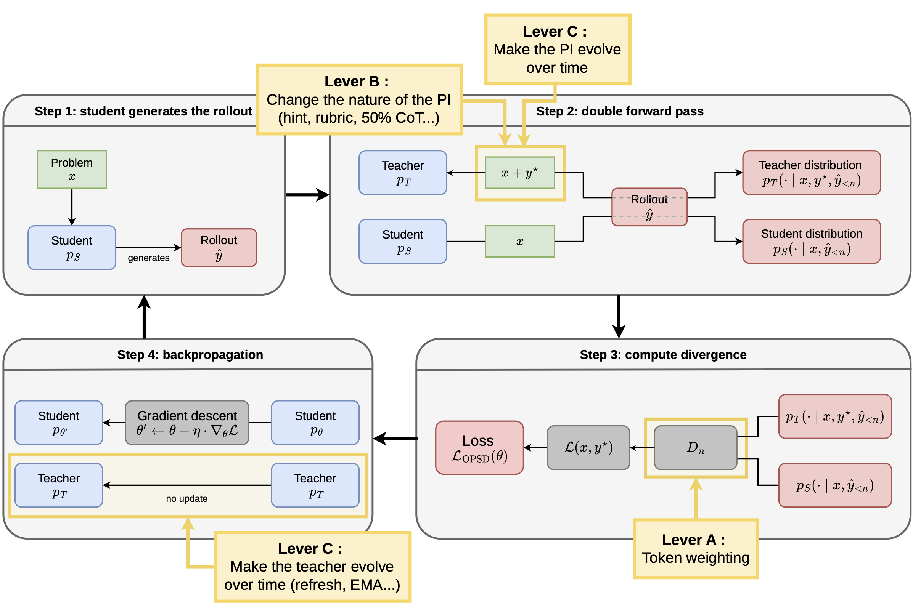

---

## 6. [Causal Foundation Models](https://huggingface.co/papers/2609.03003)
**Upvotes**: 8 | **도입 난이도**: 중 | **신뢰도**: 상
**arXiv**: https://arxiv.org/abs/2609.03003

**태그**: Causal Inference, Foundation Models, In-context Learning, Machine Learning, RAG, Inference

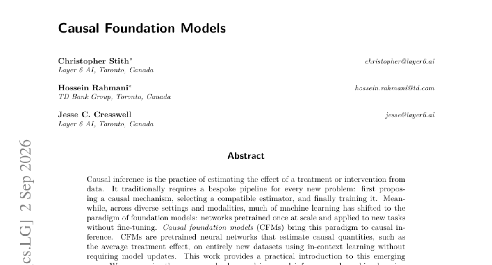

### 📌 한 줄 요약
인과 추론의 복잡한 파이프라인을 사전 학습된 모델과 인컨텍스트 러닝으로 단순화하는 새로운 패러다임 제시

### 🔑 핵심 포인트
- 인과 추론의 맞춤형 파이프라인을 범용적인 사전 학습 모델로 대체하는 패러다임 제안
- 모델 업데이트(Fine-tuning) 없이 인컨텍스트 러닝을 통한 인과량 추정 방식 도입
- 이론적 배경부터 실무 코드까지 포함한 포괄적인 가이드라인 제공

### 🧑‍💻 개발자 관점
매번 새로운 모델을 설계하고 학습시키는 대신, 사전 학습된 모델에 데이터만 입력하여 즉각적인 인과 분석 결과를 얻을 수 있는 효율적인 워크플로우를 제시합니다.

### 🚀 실무 적용 아이디어
- 제공된 Jupyter 노트북을 활용하여 인컨텍스트 러닝 기반 인과 추정 성능 테스트
- 기존의 맞춤형 인과 추론 모델과 CFM의 결과값 비교 분석
- 다양한 도메인 데이터셋을 활용한 CFM의 일반화 성능 검증

### ⚠️ 리스크/한계
- 인컨텍스트 러닝만으로 복잡하고 특수한 인과 구조를 완벽히 포착할 수 있는지에 대한 불확실성
- 사전 학습 데이터의 편향이 인과 추정 결과에 미칠 수 있는 위험성

### 📝 초록 기반 상세 설명
전통적인 인과 추론은 문제마다 새로운 메커니즘 제안, 추정기 선택, 모델 학습이 필요한 맞춤형 파이프라인을 요구해 왔습니다. 반면 현대 머신러닝은 대규모 사전 학습 후 미세 조정 없이 적용하는 파운데이션 모델로 패러다임이 변화했습니다. 본 논문은 이러한 파운데이션 모델의 개념을 인과 추론에 도입한 '인과 파운데이션 모델(CFM)'을 소개합니다. CFM은 사전 학습된 신경망을 통해 모델 업데이트 없이 인컨텍스트 러닝만으로 새로운 데이터셋에서 평균 처치 효과와 같은 인과량을 추정합니다. 본 연구는 이 신흥 분야에 대한 실무적인 입문서로서 배경 지식과 코드 예제를 함께 제공합니다.

---

## 7. [Verify Before You Distill: Prompt-Level Teacher Gating for On-Policy Distillation](https://huggingface.co/papers/2609.02998)
**Upvotes**: 8 | **도입 난이도**: 중 | **신뢰도**: 상
**arXiv**: https://arxiv.org/abs/2609.02998

**태그**: LLM Distillation, On-Policy Learning, Model Training, Reinforcement Learning, RAG, Vision, Benchmark, Distillation

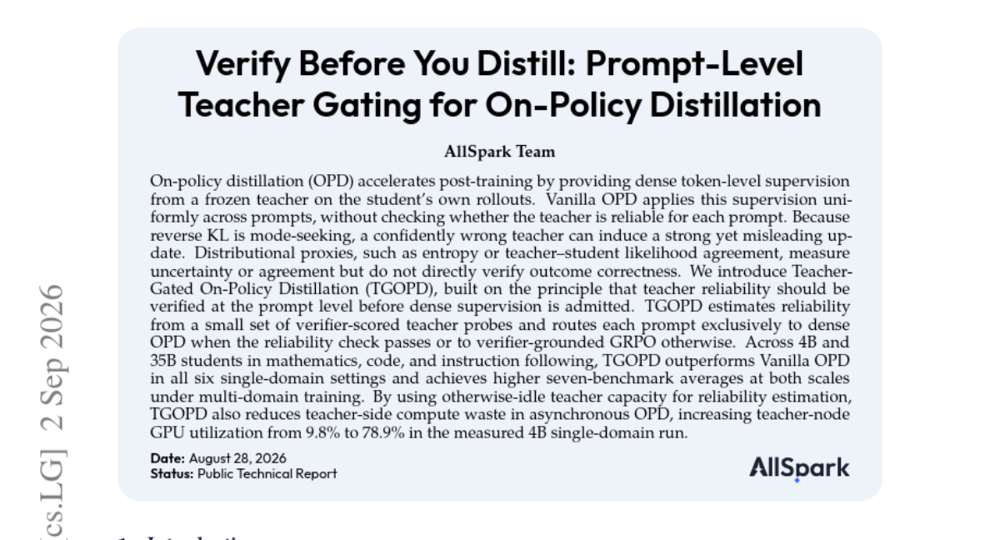

### 📌 한 줄 요약
교사의 신뢰도를 프롬프트 단위로 검증하여 잘못된 지식 전수로 인한 모델 성능 저하를 방지하는 온폴리 증류 기법

### 🔑 핵심 포인트
- 프롬프트 단위의 교사 신뢰도 검증을 통한 잘못된 지식 전수 방지
- 신뢰도에 따라 밀집 증류(OPD)와 검증 기반 학습(GRPO)을 동적으로 라우팅
- 비동기적 작업 흐름을 통해 교사 모델의 GPU 활용도를 9.8%에서 78.9%로 대폭 개선

### 🧑‍💻 개발자 관점
교사 모델이 완벽하지 않은 상황에서 학생 모델을 학습시킬 때, 잘못된 가이드로 인한 성능 저하를 막는 실질적인 전략을 제공합니다.

### 🚀 실무 적용 아이디어
- 현재 사용 중인 교사 모델의 답변 신뢰도를 측정할 수 있는 소규모 검증 세트 구축
- 신뢰도 점수에 따라 학습 데이터의 가중치를 조절하는 실험 진행
- 교사 모델의 정답 여부에 따른 학생 모델의 성능 변화 추이 모니터링

### ⚠️ 리스크/한계
- 신뢰도 추정(Reliability estimation) 자체가 잘못될 경우 학습 효율이 급감할 위험이 있음
- 검증용 프로브 데이터의 품질에 따라 전체 학습 성능이 의존적일 수 있음

### 📝 초록 기반 상세 설명
온폴리 증류(OPD)는 고정된 교사 모델로부터 학생 모델의 생성 결과에 대해 밀집된 토큰 수준의 감독을 제공하여 사후 학습을 가속화합니다. 그러나 기존 방식은 교사의 답변이 항상 옳다는 가정하에 모든 프롬프트에 동일한 감독을 적용하여, 잘못된 정보가 학생 모델에 주입될 위험이 있습니다. 이를 해결하기 위해 본 논문은 프롬프트 수준에서 교사의 신뢰도를 먼저 검증하는 TGOPD 방식을 제안합니다. TGOPD는 소수의 검증용 프로브를 통해 신뢰도를 추정하고, 신뢰도가 높을 때만 밀집 증류를 수행하거나 그렇지 않으면 GRPO와 같은 검증 기반 학습을 수행합니다. 실험 결과, 수학, 코드, 지시 이행 등 다양한 도메인에서 기존 OPD보다 우수한 성능을 보였으며 교사 노드의 GPU 활용도 또한 크게 향상되었습니다.

---

## 8. [Unifying Conformal Language Tasks with In-Context Ensembles](https://huggingface.co/papers/2609.03005)
**Upvotes**: 5 | **도입 난이도**: 중 | **신뢰도**: 상
**arXiv**: https://arxiv.org/abs/2609.03005

**태그**: NLP, Conformal Prediction, In-Context Learning, Summarization, RAG

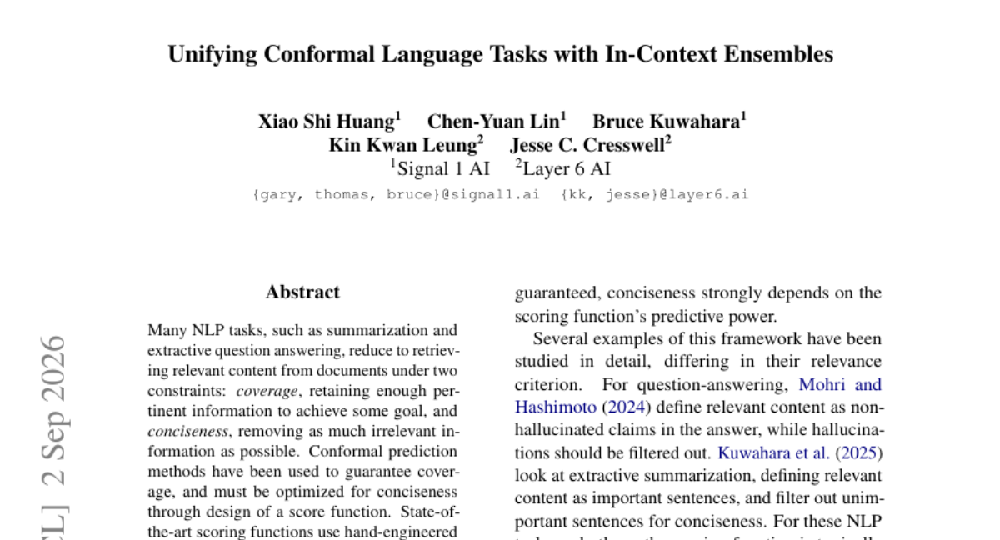

### 📌 한 줄 요약
수동 프롬프트 엔지니어링 없이 인컨텍스트 앙상블을 통해 요약 및 추출 작업의 정확도와 간결함을 동시에 확보하는 프레임워크 제안

### 🔑 핵심 포인트
- 인컨텍스트 앙상블을 활용한 자동화된 스코어링 함수 생성
- Conformal prediction을 통한 정보 포괄성 유지 및 간결성 최적화
- 앙상블 다양성이 최악의 점수(worst-case)에 미치는 영향에 대한 이론적 분석

### 🧑‍💻 개발자 관점
RAG나 요약 시스템 구축 시, 매번 복잡한 프롬프트를 직접 설계할 필요 없이 예시 데이터만으로 신뢰할 수 있는 필터링 로직을 구축할 수 있습니다.

### 🚀 실무 적용 아이디어
- 기존의 수동 중요도 점수 산출 로직을 제안된 앙상블 방식으로 교체 실험
- 다양한 소스 데이터셋에 대해 앙상블 구성 요소의 다양성 변화에 따른 성능 변화 측정
- 제시된 이론적 포화 한계(saturation bound)가 실제 성능에 미치는 영향 검증

### ⚠️ 리스크/한계
- 앙상블 구성 예시(In-context examples)의 품질에 따라 성능이 좌우될 수 있음
- 앙상블 방식 도입 시 추론 비용(Inference cost)이 증가할 가능성

### 📝 초록 기반 상세 설명
요약 및 추출형 QA와 같은 NLP 작업은 정보의 포괄성(coverage)과 간결성(conciseness) 사이의 균형을 맞추는 것이 핵심입니다. 기존의 Conformal prediction 방식은 포괄성은 보장하지만, 간결성을 위해 수동으로 설계된 프롬프트를 사용하는 번거로움이 있었습니다. 본 논문은 인컨텍스트 학습 예시 큐레이션과 앙상블 기법을 결합하여 최소한의 수동 입력으로 최적의 점수를 산출하는 'Conformal Relevance' 프레임워크를 제안합니다. 7가지 NLP 태스크 실험을 통해 제안 방식의 효용성을 입증하였으며, 앙상블 점수가 성능 향상에 미치는 이론적 조건과 한계치를 규명했습니다.

---

## 9. [Safety for Whom? Boundary-Aware Self-Distillation for Controlled LLM Safety Refusal](https://huggingface.co/papers/2609.04482)
**Upvotes**: 4 | **도입 난이도**: 중 | **신뢰도**: 상
**arXiv**: https://arxiv.org/abs/2609.04482

**태그**: LLM Safety, Fine-tuning, Self-Distillation, Alignment, RAG, Benchmark, Evaluation, Distillation, Safety

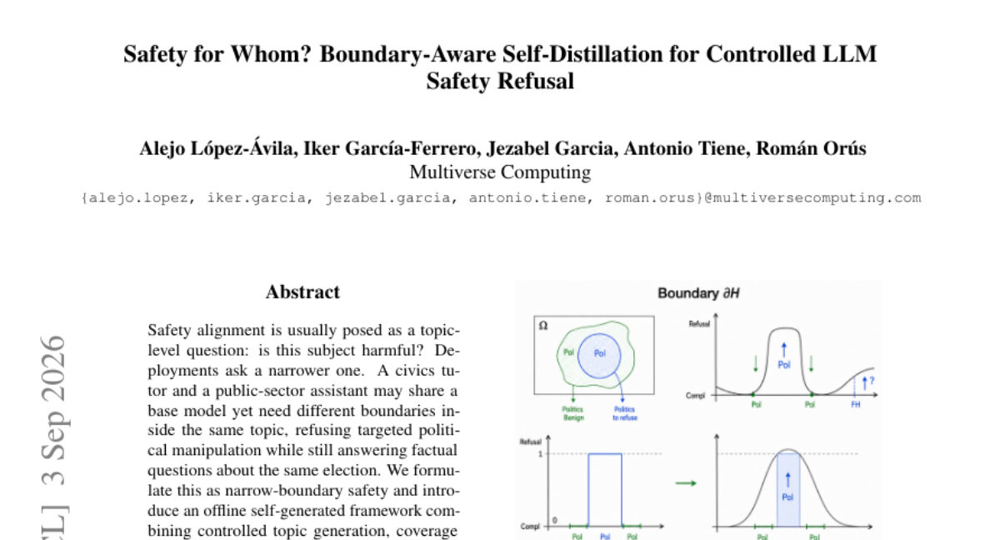

### 📌 한 줄 요약
특정 도메인에 맞춤화된 안전 경계(Boundary)를 설정하여, 과잉 거절을 방지하면서도 위험한 요청은 효과적으로 차단하는 자기 증류(Self-Distillation) 프레임워크 제안

### 🔑 핵심 포인트
- 도메인 특화된 '좁은 경계(narrow-boundary)' 안전 정렬 프레임워크 제안
- 자기 생성(Self-generation)을 통한 유해-양성 쌍(Harmful-Benign pairs) 데이터 구축 및 학습
- 데이터 구성을 통한 과잉 거절(Over-refusal)과 타겟 거절 사이의 정밀한 트레이드오프 제어

### 🧑‍💻 개발자 관점
특정 서비스(예: 교육용, 공공 서비스용)에 특화된 LLM을 배포할 때, 일반적인 안전 가이드라인을 넘어 서비스 목적에 맞는 정교한 거절 정책을 구현하는 데 유용합니다.

### 🚀 실무 적용 아이디어
- 특정 도메인(예: 법률, 의료)의 유해/비유해 쌍 데이터를 생성하여 모델 미세조정 실험
- 학습 데이터에 '유사하지만 허용 가능한 질문'을 포함시켜 과잉 거절 발생 여부 모니터링
- 모델 자체 생성 데이터와 외부 데이터 간의 성능 차이 비교 실험

### ⚠️ 리스크/한계
- 특정 도메인에 과적합될 경우 일반적인 대화 상황에서 과잉 거절이 발생할 위험이 있음
- 데이터 구성 방식에 따라 안전성과 사용성 사이의 균형을 잡기가 매우 까다로움

### 📝 초록 기반 상세 설명
기존의 안전 정렬은 주제 전체의 유해성 여부에만 집중하여, 특정 도메인(예: 정치적 중립성)에서 필요한 세밀한 거절 경계를 설정하기 어려웠습니다. 본 논문은 특정 도메인 내에서 유효한 질문과 유해한 질문을 구분하는 '좁은 경계 안전(narrow-boundary safety)' 문제를 정의합니다. 이를 해결하기 위해 제어된 주제 생성, 커버리지 복구, 분포 내 보상 데이터 및 유해-양성 쌍을 결합한 오프라인 자기 생성 프레임워크를 도입했습니다. 실험 결과, 제안된 방식은 타겟 도메인의 거절율을 크게 높이면서도 일반적인 유해 응답은 획기적으로 줄였으나, 과잉 거절(over-refusal) 발생 가능성을 보여주었습니다. 최종적으로 데이터 구성을 통해 안전성과 사용성 사이의 트레이드오프를 정밀하게 제어할 수 있음을 입증했습니다.

### 🖼️ 추가 자료
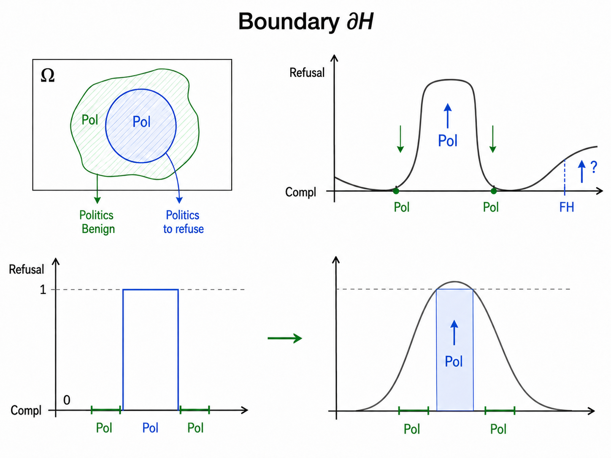

---

## 10. [What Else Needs Fixing? Exploring Cost-Effective Test-Time Compute for Revision Propagation in Artifacts Generated Through Conversation](https://huggingface.co/papers/2609.03254)
**Upvotes**: 3 | **도입 난이도**: 하 | **신뢰도**: 상
**arXiv**: https://arxiv.org/abs/2609.03254

**태그**: LLM, Software Engineering, Prompt Engineering, Test-time Compute, Vision, Benchmark, Evaluation

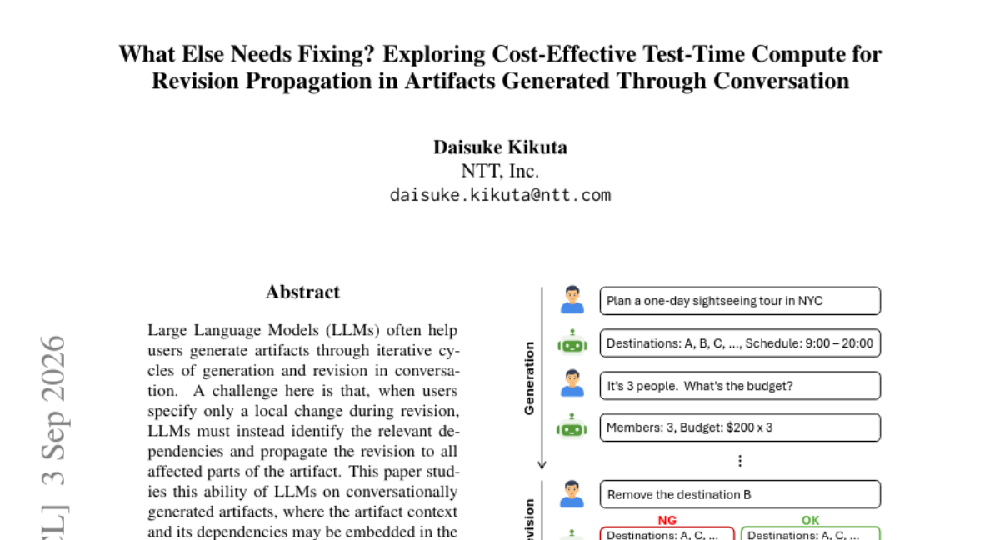

### 📌 한 줄 요약
대화형 생성물 수정 시 발생하는 의존성 전파 문제를 해결하기 위한 비용 효율적인 테스트 타임 연산 기법 연구

### 🔑 핵심 포인트
- 대화형 생성물 수정 시 발생하는 의존성 전파(Revision Propagation) 문제 정의 및 벤치마크 구축
- 순차적 성찰(Sequential Reflection) 및 병렬 샘플링(Parallel Sampling) 등 다양한 수정 방법론 비교
- 3개의 병렬 샘플 중 최적을 선택하는 방식이 비용 대비 가장 높은 성능 향상을 제공함을 입증

### 🧑‍💻 개발자 관점
코드나 문서처럼 상호 의존적인 결과물을 LLM으로 생성할 때, 부분 수정이 전체 구조를 깨뜨리지 않도록 하는 실무적인 가이드를 제공합니다.

### 🚀 실무 적용 아이디어
- 제안된 벤치마크 데이터셋을 활용하여 현재 사용 중인 모델의 의존성 전파 능력 테스트
- 단일 생성 대신 3개 샘플 생성 후 최적안을 선택하는 전략 적용해보기
- 수정 사항이 전체 컨텍스트에 미치는 영향을 자동 검증하는 파이프라인 구축

### ⚠️ 리스크/한계
- 병렬 샘플링 방식은 단일 생성보다 더 많은 토큰 비용을 발생시킬 수 있음
- 의존성 관계가 매우 복잡한 대규모 아티팩트에서는 단순 샘플링만으로 해결이 어려울 수 있음

### 📝 초록 기반 상세 설명
사용자가 LLM과 대화하며 결과물을 수정할 때, 국소적인 변경 사항을 전체 구조에 반영하는 의존성 전파 문제가 발생합니다. 본 논문은 대화 이력에 포함된 의존성을 식별하고 수정 사항을 전파하는 LLM의 능력을 연구합니다. 이를 위해 새로운 벤치마크를 제안하고, 순차적 성찰 및 병렬 샘플링을 포함한 9가지 수정 방법을 평가했습니다. 실험 결과, 3개의 병렬 샘플 중 LLM 기반 또는 메도이드(medoid) 선택 방식을 사용하는 것이 가장 비용 효율적인 방법으로 나타났습니다. 이 방식은 기존 대비 정확도를 2.2~9.7% 향상시켰습니다.

### 🖼️ 추가 자료
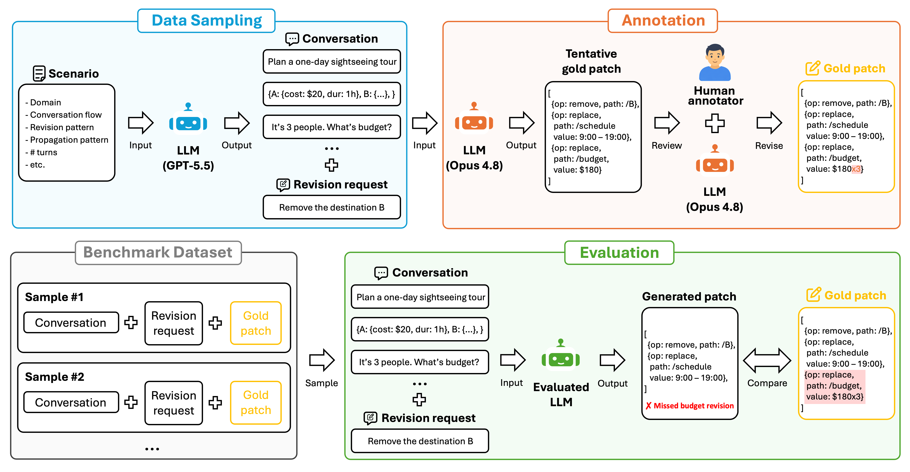
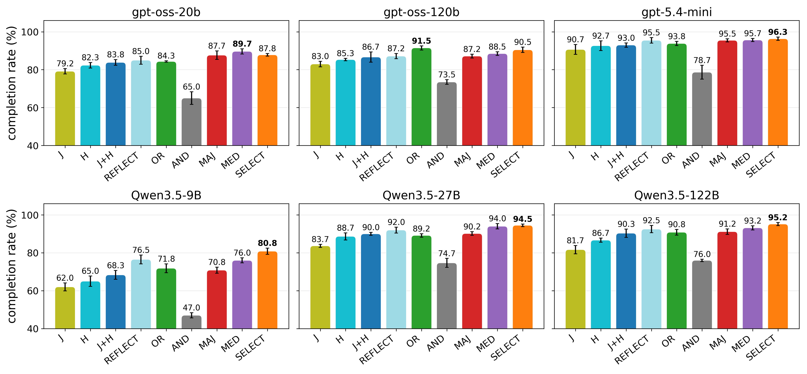
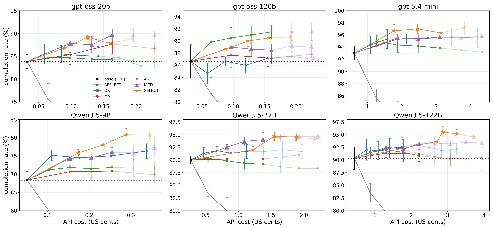

---

