# 2026-09-12 Daily Papers (Top 25)

## 오늘의 요약
오늘의 연구는 모델의 효율적인 아키텍처 설계와 멀티모달 통합, 그리고 합성 데이터를 활용한 공간 지능 강화에 집중되었습니다. 특히 적은 자원으로 고성능을 내는 압축 기술과 에이전트의 실행 효율을 높이는 계획 수립 방식이 주요 화두였습니다.

### 오늘의 핵심 포인트
- 데이터 효율성과 연산 비용을 최적화하기 위해 개념 단위 예측 및 점진적 레이어 압축 등 혁신적인 아키텍처 설계가 제안되었습니다.
- 인코더나 VAE 없이 이해와 생성을 통합하거나, 합성 데이터를 통해 3D 공간 추론 능력을 강화하는 등 멀티모달 지능의 고도화가 이루어졌습니다.
- 에이전트의 장기 작업 수행 시 발생하는 연산 문제를 해결하기 위해 메모리를 압축된 계획으로 변환하는 실용적인 프레임워크들이 제시되었습니다.

**오늘의 태그**: Efficient Learning, Multimodal AI, Agentic Workflow, Synthetic Data, Model Compression

## 1. [NCP-ArchPreview Technical Report: Moving towards Latent Space Language Models through Next Concept Prediction](https://huggingface.co/papers/2609.10715)
**Upvotes**: 151 | **도입 난이도**: 상 | **신뢰도**: 상
**arXiv**: https://arxiv.org/abs/2609.10715

**태그**: LLM, Pretraining, Efficient Learning, Latent Space, RAG

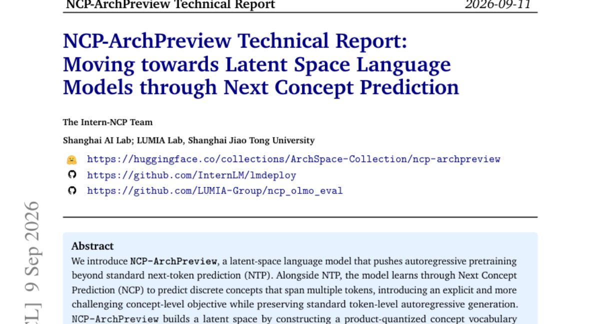

### 📌 한 줄 요약
차세대 개념 예측(NCP)을 통해 적은 데이터로도 높은 성능을 내는 잠재 공간 언어 모델 아키텍처 제안

### 🔑 핵심 포인트
- NTP(토큰 단위)와 NCP(개념 단위)를 결합한 하이브리드 학습 방식 도입
- 은닉 상태에서 직접 개념 어휘를 구축하는 제품 양자화(Product-Quantized) 구조 활용
- 적은 학습 데이터와 연산량으로도 기존 대형 모델(OLMo-3-7B) 이상의 성능 달성

### 🧑‍💻 개발자 관점
데이터 효율성이 극대화된 아키텍처로, 적은 자원으로도 고성능 모델을 구축하거나 가벼운 모듈 업데이트만으로 도메인 적응이 가능함을 보여줍니다.

### 🚀 실무 적용 아이디어
- VQ(Vector Quantization) 모듈의 크기 변화에 따른 개념 학습 효율성 테스트
- NTP와 NCP의 학습 비중(Loss Weight) 조절에 따른 생성 품질 변화 관찰
- 학습된 잠재 공간을 활용한 경량 도메인 적응(Domain Adaptation) 실험

### ⚠️ 리스크/한계
- 개념 단위 예측과 토큰 단위 생성 간의 정렬(Alignment) 복잡성
- 새로운 아키텍처 도입에 따른 학습 안정성 확보 필요성

### 📝 초록 기반 상세 설명
기존의 차세대 토큰 예측(NTP) 방식은 토큰 단위의 세밀한 생성에는 유리하지만, 더 거시적인 개념적 흐름을 학습하는 데 한계가 있습니다. 이를 해결하기 위해 본 논문은 토큰을 넘어선 이산적 개념을 예측하는 Next Concept Prediction(NCP) 기법을 도입했습니다. 모델은 은닉 상태로부터 제품 양자화(Product-Quantized)된 개념 어휘를 구축하고, 전용 모듈을 통해 미래의 개념을 예측하여 생성 과정을 가이드합니다. 8.9B 파라미터 규모로 학습된 결과, 기존 모델 대비 훨씬 적은 토큰(51.3%)만 사용하고도 동등한 성능을 달성했습니다. 결과적으로 NCP는 추론 성능 향상과 효율적인 도메인 적응 및 가속화 가능성을 동시에 입증했습니다.

---

## 2. [SenseNova-U1.5: Towards Native Unified Visual Intelligence](https://huggingface.co/papers/2609.11929)
**Upvotes**: 120 | **도입 난이도**: 중 | **신뢰도**: 상
**arXiv**: https://arxiv.org/abs/2609.11929

**태그**: Multimodal, Generative AI, Architecture, Image Generation, Vision, Evaluation, Distillation

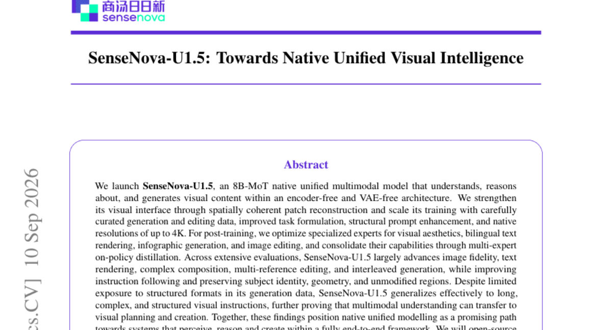

### 📌 한 줄 요약
Encoder-free/VAE-free 구조를 통해 이해, 추론, 생성을 통합한 8B 규모의 네이티브 멀티모달 모델 개발

### 🔑 핵심 포인트
- Encoder-free 및 VAE-free 아키텍처를 통한 네이티브 통합 멀티모달 프레임워크 구축
- 전문가 모델 최적화 및 멀티 전문가 온폴리시 증류를 통한 고도화된 시각적 능력 통합
- 텍스트 렌더링, 복잡한 구도, 편집 및 4K 해상도 지원 등 생성 및 편집 성능 극대화

### 🧑‍💻 개발자 관점
별도의 인코더나 VAE 없이 하나의 모델로 이해와 생성을 동시에 수행하는 통합 아키텍처의 가능성을 제시하여, 향후 멀티모달 에이전트 설계의 효율성을 높일 수 있습니다.

### 🚀 실무 적용 아이디어
- 제공되는 SFT 및 RL 코드를 활용하여 특정 도메인(예: 의료, 설계) 데이터로 미세 조정 실험
- 멀티 전문가 증류 방식이 복잡한 구조적 프롬프트 해석에 미치는 영향 분석
- 4K 해상도 및 텍스처 재구성 성능이 실제 서비스 환경의 리소스에서 작동하는지 검증

### ⚠️ 리스크/한계
- 8B 모델 규모에서 고해상도 생성 시 발생할 수 있는 연산 비용 및 추론 속도 문제
- 구조화된 데이터 학습 부족에도 불구하고 일반화 성능을 유지하는지에 대한 장기적 검증 필요

### 📝 초록 기반 상세 설명
기존 멀티모달 모델은 이해와 생성 모델 간의 구조적 차이로 인해 통합된 추론과 생성 능력을 결합하는 데 어려움이 있었습니다. 본 논문은 Encoder-free 및 VAE-free 아키텍처를 기반으로 하는 8B MoT(Mixture-of-Transformers) 모델인 SenseNova-U1.5를 제안합니다. 공간적 일관성을 갖춘 패치 재구성 기술과 정교하게 큐레이션된 데이터, 구조적 프롬프트 강화를 통해 최대 4K 해상도까지 지원하도록 설계되었습니다. 사후 학습 단계에서는 미적 감각, 이중 언어 텍스트 렌더링, 인포그래픽 생성, 이미지 편집을 위한 전문 전문가(Expert) 모델을 최적화하고 이를 멀티 전문가 온폴리시 증류(Multi-expert on-policy distillation)로 통합했습니다. 실험 결과, 이미지 충실도, 텍스트 렌더링, 복잡한 구도 및 편집 능력에서 뛰어난 성능을 보였으며, 시각적 이해 능력이 계획 및 생성 능력으로 전이될 수 있음을 입증했습니다.

---

## 3. [SpatialBlock: Enhancing Spatial Intelligence in LVLMs via Synthetic Block-Stacking Problem](https://huggingface.co/papers/2609.07064)
**Upvotes**: 53 | **도입 난이도**: 하 | **신뢰도**: 상
**arXiv**: https://arxiv.org/abs/2609.07064

**태그**: Vision-Language, Synthetic Data, 3D Reasoning, Spatial Intelligence, RAG, Reasoning, Vision

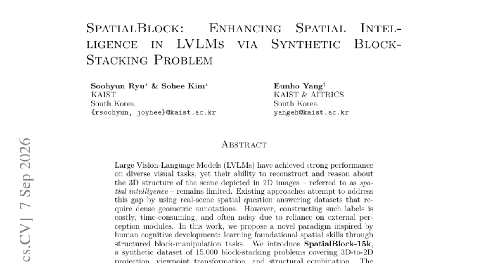

### 📌 한 줄 요약
합성 데이터 기반의 블록 쌓기 문제를 통해 LVLM의 3D 공간 추론 능력을 강화하는 새로운 학습 패러다임 제안

### 🔑 핵심 포인트
- 인간의 인지 발달 원리를 모방한 구조화된 블록 조작 학습 패러다임 도입
- 3D 투영 및 시점 변환을 포함하는 15,000개의 고품질 합성 데이터셋(SpatialBlock-15k) 구축
- 합성 데이터 학습만으로 실세계 공간 추론 작업에 대한 강력한 일반화 성능 확보

### 🧑‍💻 개발자 관점
정밀한 기하학적 라벨링 없이도 합성 데이터를 통해 모델의 공간 지능을 효율적으로 학습시킬 수 있는 방법론을 제시합니다.

### 🚀 실무 적용 아이디어
- 제공된 데이터셋을 활용하여 기존 오픈소스 LVLM의 공간 추론 성능 벤치마크 수행
- 직접 답변 방식과 추론 기반 예측 방식 간의 성능 차이 비교 실험
- 합성 데이터 학습이 실제 복잡한 3D 장면 데이터로의 전이 학습(Transfer Learning)에 미치는 영향 분석

### ⚠️ 리스크/한계
- 합성 데이터 기반 학습이므로 매우 복잡한 실세계 질감이나 조명 조건에서의 성능 저하 가능성
- 블록 조작이라는 특정 도메인에 국한된 학습이 일반적인 공간 지능으로 확장되는 범위의 불확실성

### 📝 초록 기반 상세 설명
최근 LVLM의 성능은 향상되었으나 2D 이미지에서 3D 구조를 재구성하고 추론하는 공간 지능은 여전히 부족합니다. 기존의 실세계 데이터셋은 정밀한 기하학적 주석 작업에 많은 비용이 들고 노이즈가 발생하는 문제가 있었습니다. 본 논문은 인간의 인지 발달에서 영감을 받아 구조화된 블록 조작 과제를 통해 기초 공간 기술을 학습하는 새로운 패러다임을 제안합니다. 이를 위해 3D 투영, 시점 변환, 구조적 결합을 포함하는 15,000개의 합성 데이터셋인 SpatialBlock-15k를 구축했습니다. 실험 결과, 합성 데이터로 학습된 모델이 실세계 공간 작업에서도 우수한 일반화 성능을 보임을 입증했습니다.

---

## 4. [EvoSafeHarness: Evolving Model- and Domain-Specific Harnesses for Securing Agents](https://huggingface.co/papers/2609.05903)
**Upvotes**: 36 | **도입 난이도**: 중 | **신뢰도**: 상
**arXiv**: https://arxiv.org/abs/2609.05903

**태그**: LLM-Agent, AI-Security, Optimization, Automated-Defense, Agent, RAG, Benchmark, Safety

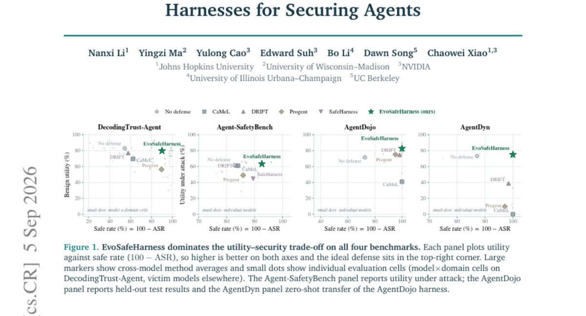

### 📌 한 줄 요약
모델과 도메인 특성에 맞춰 안전 정책과 실행 코드를 자동 최적화하는 에이전트 보안 프레임워크

### 🔑 핵심 포인트
- 모델의 유용성 저하를 최소화하면서 보안을 강화하는 자동 최적화 프레임워크 제안
- 자연어 정책과 실행 가능한 코드 로직을 결합한 하이브리드 탐색 방식 적용
- 도메인별 의미론과 모델별 런타임 동작을 고려한 맞춤형 안전 관계 구축

### 🧑‍💻 개발자 관점
에이전트 배포 시 모델의 성능(Utility)을 유지하면서도 도메인 특화된 보안 정책을 자동으로 생성할 수 있는 실무적 가이드를 제공합니다.

### 🚀 실무 적용 아이디어
- 특정 도메인(예: 코딩, DB 관리)에 대한 맞춤형 안전 정책 생성 테스트
- 기존 수동 보안 필터와 EvoSafeHarness 생성 정책 간의 성능/비용 비교
- 적대적 공격(PAIR 등) 환경에서의 방어 지속성 검증

### ⚠️ 리스크/한계
- 최적화 과정에서 생성된 코드 로직의 복잡도가 증가할 경우 유지보수가 어려울 수 있음
- 특정 도메인에 과적합(Overfitting)된 정책이 새로운 도메인으로 전이될 때의 성능 저하 가능성

### 📝 초록 기반 상세 설명
LLM 에이전트가 실세계에 영향을 미치면서 프롬프트 인젝션과 같은 보안 위협이 증가하고 있습니다. 기존의 시스템 레벨 안전 하네스는 전문가가 수동으로 설계되어 모델별 성능 저하나 도메인별 특수성 반영에 한계가 있습니다. 이를 해결하기 위해 EvoSafeHarness는 고정된 모델과 타겟 도메인에 최적화된 하네스를 합성하는 프레임워크를 제안합니다. 이 방식은 자연어 정책과 실행 가능한 코드 로직을 동시에 탐색하며, 모델 행동과 도메인 사양을 기반으로 최적의 방어선을 구축합니다. 실험 결과, 기존 전문가 설계 방식보다 높은 안전성-유용성 균형을 달াকে했으며 다양한 에이전트 벤치마크에서 우수한 성능을 입증했습니다.

---

## 5. [Mi-Ripple: Restoring Images Degraded by Iterative AI Editing](https://huggingface.co/papers/2609.11317)
**Upvotes**: 20 | **도입 난이도**: 중 | **신뢰도**: 상
**arXiv**: https://arxiv.org/abs/2609.11317

**태그**: Image Restoration, Diffusion Models, Image Editing, Digital Artifacts, Vision

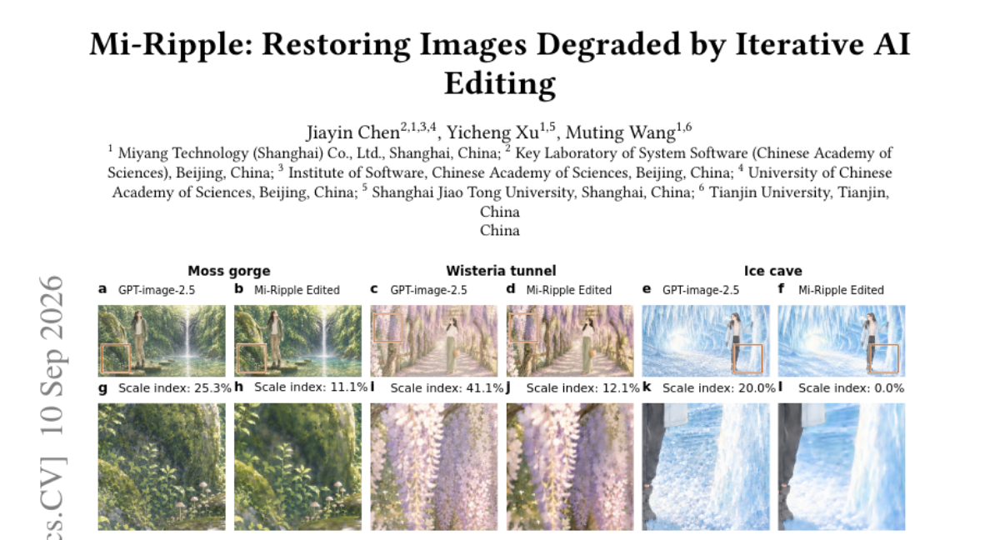

### 📌 한 줄 요약
반복적인 AI 이미지 편집 과정에서 발생하는 격자 및 입자형 노이즈(Digital Ripple)를 구조 손상 없이 제거하는 복원 워크플로우 제안

### 🔑 핵심 포인트
- 주기적 격자 아티팩트와 콘텐츠 결합형 입자 질감의 효과적 분리
- 스펙트럴 노칭(Spectral Notching)과 구조 인지형 스무딩의 결합을 통한 저왜곡 필터링
- 정제된 참조 이미지를 활용한 시각적 디테일 복원 및 노이즈 억제

### 🧑‍💻 개발자 관점
AI 생성 이미지를 반복적으로 편집하거나 참조 모델을 사용할 때 발생하는 품질 저하 문제를 해결하여, 생성된 이미지의 시각적 일관성을 유지할 수 있습니다.

### 🚀 실무 적용 아이디어
- Diffusion 모델 기반의 반복적 편집 파이프라인에 Mi-Ripple 워크플로우 적용 테스트
- 스펙트럴 노칭 강도에 따른 이미지 디테일 보존율 비교 실험
- 다양한 해상도 및 노이즈 패턴에서의 아티팩트 분리 성능 검증

### ⚠️ 리스크/한계
- 필터링과 재구성 사이의 균형 조절 실패 시 원본 구조 왜곡 가능성
- 복잡한 텍스처가 포함된 이미지에서 아티팩트와 실제 디테일 간의 구분 모호성

### 📝 초록 기반 상세 설명
반복적인 참조 기반 이미지 편집 과정에서 격자 형태나 입자 형태의 디지털 리플(Digital Ripple) 현상이 발생하는 문제가 있습니다. 본 논문은 이미지 구조를 보호하면서 이러한 노이즈를 억제하는 진단 기반 복원 워크플로우인 Mi-Ripple을 제안합니다. Mi-Ripple은 주기적인 격자 아티팩트와 콘텐츠에 얽힌 입자 질감을 분리한 후, 선택적 스펙트럴 노칭, 구조 인지형 스무딩, 정제된 참조 이미지 재생성 기법을 결합합니다. 이러한 분리 방식을 통해 아티팩트가 스펙트럼상 고립된 경우 저왜곡 필터링을 수행하고, 필터링 시 디테일 손실이 우려되는 경우 시각적 재구성을 수행합니다. 실험 결과, 참조 이미지 정제를 통해 출력물의 잔해 밀도를 45% 감소시키며 시각적으로 깨끗한 생성 이미지를 확보했습니다.

---

## 6. [X-AuT: Progressive Audio-Encoder Compression for Speech LLMs with Cross-Scale Distillation](https://huggingface.co/papers/2609.11412)
**Upvotes**: 12 | **도입 난이도**: 중 | **신뢰도**: 상
**arXiv**: https://arxiv.org/abs/2609.11412

**태그**: Speech-LLM, Model-Compression, Knowledge-Distillation, LoRA, RAG, Vision, Audio, Benchmark, Inference, Distillation, Optimization, Safety

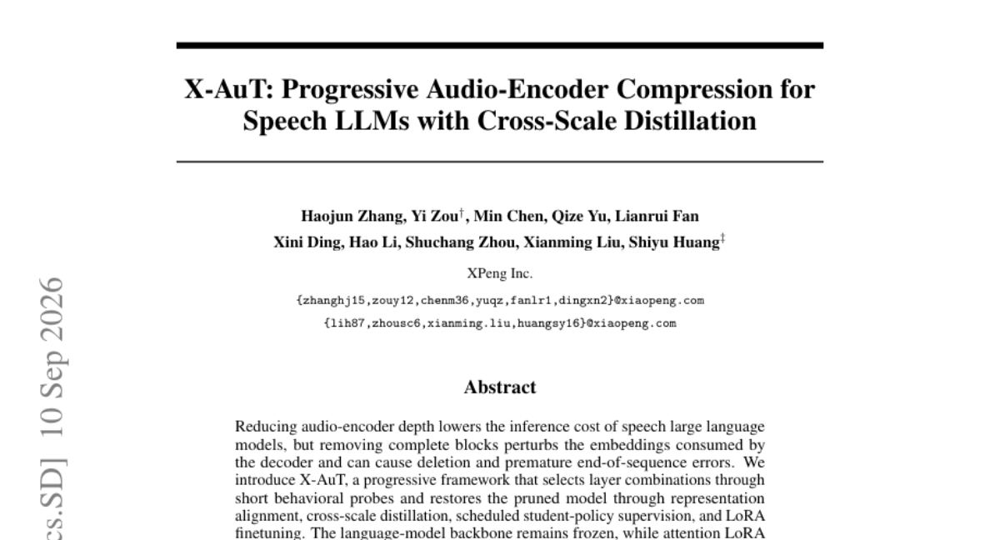

### 📌 한 줄 요약
음성 LLM의 추론 비용 절감을 위해 오디오 인코더 레이어를 점진적으로 압축하면서도 성능 저하를 최소화하는 프레임워크 X-AuT를 제안합니다.

### 🔑 핵심 포인트
- 행동 프로브를 통한 최적의 레이어 조합 선택 및 점진적 압축 프레임워크 제안
- LoRA 어댑터와 교차 스케일 증류를 활용한 레이어 삭제 시의 임베딩 정렬
- 언어 모델 백본을 동결한 상태에서 오디오 인코더 효율성을 극대화하는 학습 전략

### 🧑‍💻 개발자 관점
음성 기반 LLM 서비스 운영 시, 모델의 정확도를 유지하면서도 추론 속도와 비용을 최적화할 수 있는 실질적인 압축 기법을 제공합니다.

### 🚀 실무 적용 아이디어
- 기존 음성 LLM 모델에 LoRA를 적용하여 레이어 제거 시의 성능 변화 측정
- 제안된 점진적 압축(Progressive Pruning) 방식과 직접 압축 방식의 성능 비교 실험
- 특정 도메인 데이터셋에 대한 전사 일관성 파이프라인 적용 테스트

### ⚠️ 리스크/한계
- 압축률이 높아질수록 특정 벤치마크에서 성능 저하가 발생할 수 있음
- 데이터셋의 특성에 따라 최적의 레이어 조합이 달라질 수 있음

### 📝 초록 기반 상세 설명
음성 LLM의 추론 비용을 낮추기 위해 오디오 인코더의 깊이를 줄이는 시도가 있으나, 레이어 삭제 시 임베딩 분포가 변하여 디코더 오류가 발생할 수 있습니다. 이를 해결하기 위해 X-AuT는 행동 프로브를 통해 최적의 레이어 조합을 선택하고, 표현 정렬 및 교차 스케일 증류를 통해 압축된 모델을 복구합니다. 학습 과정에서는 언어 모델 백본을 고정한 채 LoRA 어댑터와 출력 임베딩을 조정하며, 전사 일관성 파이프라인을 통해 정제된 데이터를 사용합니다. 실험 결과, 18개 레이어를 14개로 줄여 파라미터를 20.7% 절감하면서도 성능 저하를 최소화하며 직접 압축 방식보다 우수한 성능을 입증했습니다.

### 🖼️ 추가 자료

---

## 7. [Memory as Plans: World-Action Modeling with Memory-Grounded Planning](https://huggingface.co/papers/2609.11561)
**Upvotes**: 9 | **도입 난이도**: 중 | **신뢰도**: 상
**arXiv**: https://arxiv.org/abs/2609.11561

**태그**: Robotics, Planning, Long-horizon, Efficiency, RAG, Multimodal, Inference, Safety

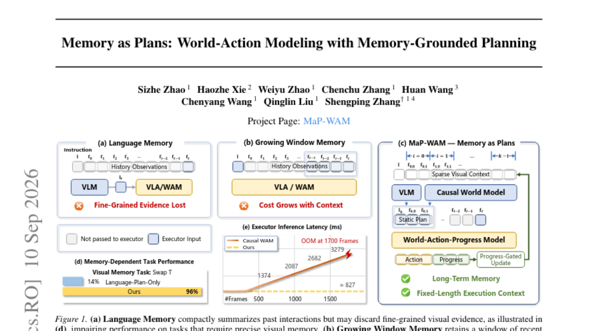

### 📌 한 줄 요약
장기 기억을 압축된 계획(Plan)으로 변환하여 실행 효율성과 작업 성공률을 동시에 잡은 로봇 제어 프레임워크

### 🔑 핵심 포인트
- 메모리를 '언어 지시문 + 희소 시각 컨텍스트'를 포함한 압축된 계획(Plan)으로 변환
- 실행기(Executor)의 컨텍스트 길이를 고정하여 작업 이력 증가에 따른 지연 시간 문제 해결
- WAP(World-Action-Progress) 모델을 통한 액션 청크 및 실행 진행도 예측 및 적응적 전환

### 🧑‍💻 개발자 관점
에이전트의 컨텍스트가 길어질수록 발생하는 연산 비용 문제를 구조적 분리를 통해 해결하는 실용적인 아키텍처를 제시합니다.

### 🚀 실무 적용 아이디어
- 고정된 컨텍스트 길이를 가진 에이전트 환경에서 계획-실행 분리 구조 구현 테스트
- 시각적 증거를 압축된 계획으로 변환하는 인코딩 전략 비교 실험
- WAP 모델과 같은 진행도 예측 기반의 적응적 세그먼트 전환 로직 검증

### ⚠️ 리스크/한계
- 계획 단계에서 정보가 압축될 때 발생하는 세부 시각 정보 손실 가능성
- 계획과 실제 실행 간의 정렬(Alignment) 오류 시 복구 메커니즘의 의존도

### 📝 초록 기반 상세 설명
기존 로봇 정책은 마르코프 가정을 따르지만, 복잡한 작업은 과거 이력을 필요로 하는 비마르코프적 특성을 가집니다. 기존의 메모리 방식은 긴 이력 처리에 따른 효율성 저하나 세부 정보 손실 문제를 겪습니다. 이를 해결하기 위해 MaP-WAM은 메모리를 '완료된 세그먼트 기록' 형태의 계획으로 변환하는 프레임워크를 제안합니다. 이 방식은 장기 기억을 압축된 계획으로 변환하고, 실행기는 고정된 컨텍스트 길이를 유지하며 계획에 따라 동작합니다. 결과적으로 작업 이력이 길어져도 추론 지연 시간을 일정하게 유지하며 높은 성공률을 달schap니다.

---

## 8. [Recursive Code World Models: Building Complex Worlds through Recursive Scene Programs](https://huggingface.co/papers/2609.11499)
**Upvotes**: 6 | **도입 난이도**: 상 | **신뢰도**: 상
**arXiv**: https://arxiv.org/abs/2609.11499

**태그**: 3D Reconstruction, Code Generation, Vision-Language, Procedural Generation, Agent, Vision

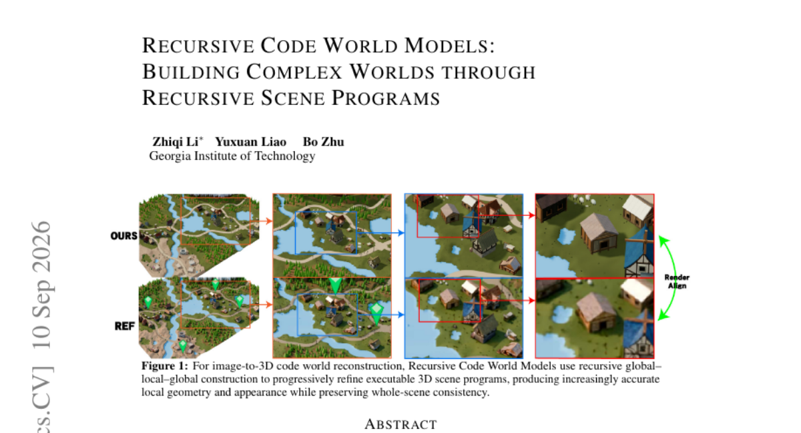

### 📌 한 줄 요약
단일 이미지로부터 복잡한 3D 세계를 재구성하기 위해 재귀적 프로그래밍 구조를 활용하는 코드 기반 월드 모델 프레임워크

### 🔑 핵심 포인트
- 재귀적 장면 프로그램(RSP)을 통한 계층적이고 실행 가능한 3D 월드 모델링
- 전체-국소-전체(Global-Local-Global) 루프를 통한 경계 및 공간 관계 정제
- 비전-언어 코딩 에이전트를 활용한 참조 이미지 기반의 자동 정제 및 피드백 루프

### 🧑‍💻 개발자 관점
코드 기반의 절차적 생성(Procedural Generation)과 AI 에이전트의 결합을 통해, 사람이 직접 코딩하지 않아도 복잡한 3D 환경을 자동 생성하는 기술적 토대를 제공합니다.

### 🚀 실무 적용 아이디어
- 단일 이미지에서 복잡한 객체 간의 계층 구조가 어떻게 코드로 변환되는지 분석
- 재귀 깊이(Recursion Depth) 변화에 따른 세부 디테일 복원 성능 변화 실험
- 비전-언어 모델이 생성한 코드의 기하학적 정밀도 검증

### ⚠️ 리스크/한계
- 재귀적 호출로 인한 계산 복잡도 및 연산 비용 증가 가능성
- 참조 이미지의 시점이나 정보 부족 시 발생하는 기하학적 오류 전파 위험

### 📝 초록 기반 상세 설명
기존의 코드 기반 월드 모델은 복잡한 장면을 구성하는 구체적인 방법론이 부족했습니다. 본 논문은 단일 참조 이미지를 기반으로 복잡한 3도 세계를 코드로 재구성하는 RCWM 프레임워크를 제안합니다. RCWM은 재귀적 장면 프로그램(RSP)과 자기 자신을 호출하는 건설 솔버를 결합하여, 전체 구조를 설정한 뒤 국소적 부분을 재구성하고 다시 전체를 정제하는 '전체-부분-전체' 방식의 재귀적 루프를 수행합니다. 이 과정에서 비전-언어 코딩 에이전트가 렌더링 결과와 참조 이미지를 비교하며 정제와 하강을 가이드합니다. 실험 결과, RCWM은 기존의 코드 기반 이미지-장면 재구성 방식보다 우수한 성능을 보였으며 재귀적 구조가 정밀한 복원에 기여함을 입증했습니다.

---

## 9. [TempCloze: Can Video-LLMs Identify the Missing Middle?](https://huggingface.co/papers/2609.01515)
**Upvotes**: 6 | **도입 난이도**: 하 | **신뢰도**: 상
**arXiv**: https://arxiv.org/abs/2609.01515

**태그**: Video-LLM, Temporal Reasoning, Benchmark, Computer Vision, Reasoning, Video, Evaluation, Safety

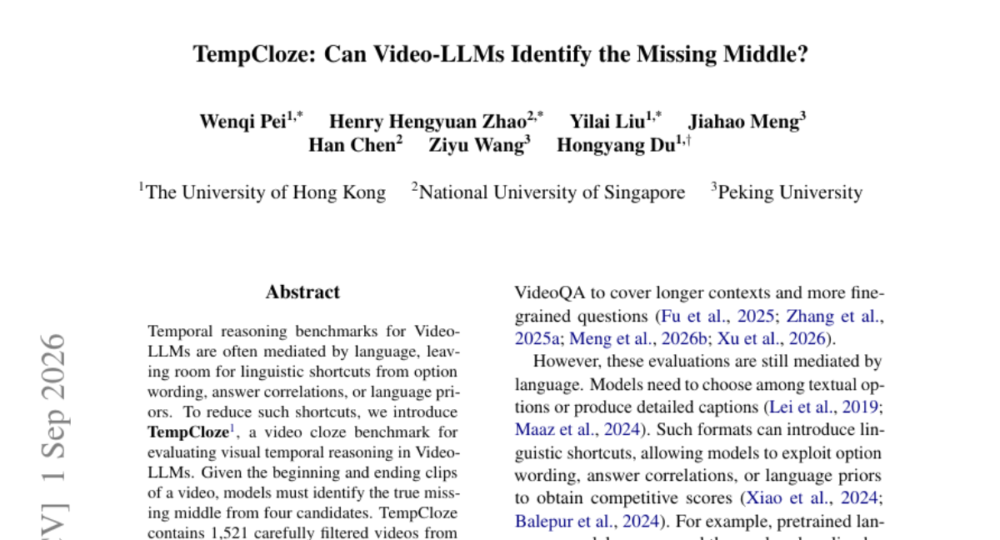

### 📌 한 줄 요약
언어적 편향을 배제하고 비디오 모델의 순수 시간적 추론 능력을 검증하기 위한 새로운 벤치마크 'TempCloze' 제안

### 🔑 핵심 포인트
- 언어적 편향을 최소화하기 위해 시작/끝 클립만 제공하는 비디오 Cloze 방식의 벤치마크 개발
- 의미적 내용, 시간적 정렬, 사건 진행 과정을 구분하여 모델의 추론 능력을 다각도로 검증
- 현존하는 다수의 오픈소스 및 독점 비디오 LLM에 대한 대규모 벤치마크 평가 수행

### 🧑‍💻 개발자 관점
비디오 기반 에이전트나 자동화 시스템 개발 시, 모델이 단순히 텍스트로 상황을 짐작하는지 아니면 실제 시간 흐름을 이해하는지 검증하는 데 유용합니다.

### 🚀 실무 적용 아이디어
- 보유 중인 비디오 모델을 TempCloze 데이터셋에 적용하여 시간적 정렬 능력 측정
- 모델이 시간적 순서보다 의미적 유사성에 의존하는지 오류 패턴 분석
- 프레임 밀도나 컨텍스트 방향 변화에 따른 모델의 강건성 테스트

### ⚠️ 리스크/한계
- 제시된 데이터셋이 특정 영상 소스에 편중될 경우 일반화 성능 확인 필요
- 비디오 클로즈 방식 자체가 모델의 특정 추론 방식에만 집중될 가능성 존재

### 📝 초록 기반 상세 설명
기존 비디오 LLM의 시간적 추론 벤치마크는 언어적 단서나 정답 상관관계로 인해 모델이 쉬운 지름길을 택할 위험이 있었습니다. 이를 해결하기 위해 비디오의 시작과 끝만 제공하고 중간 과정을 맞추게 하는 'TempCloze' 벤치마크를 도입했습니다. 1,521개의 정교하게 필터링된 영상을 활용하여 의미적(Semantic), 정렬(Alignment), 진행(Progression) 세 가지 차원의 오답 후보를 구성했습니다. 31개의 비디오 LLM을 평가한 결과, 모델들이 의미적 내용은 파악하더라도 정확한 시간적 정렬(Alignment) 단계에서 큰 병목 현상을 겪음을 확인했습니다. 또한 다양한 변수 분석을 통해 모델의 오류 패턴과 테스트 시 스케일링 효과를 심층 분석했습니다.

---

## 10. [FreeFlow: A Bias-free Hierarchical Transformer for Optical Flow Estimation](https://huggingface.co/papers/2609.11486)
**Upvotes**: 5 | **도입 난이도**: 중 | **신뢰도**: 상
**arXiv**: https://arxiv.org/abs/2609.11486

**태그**: Optical Flow, Transformer, Computer Vision, SOTA, Benchmark, Inference

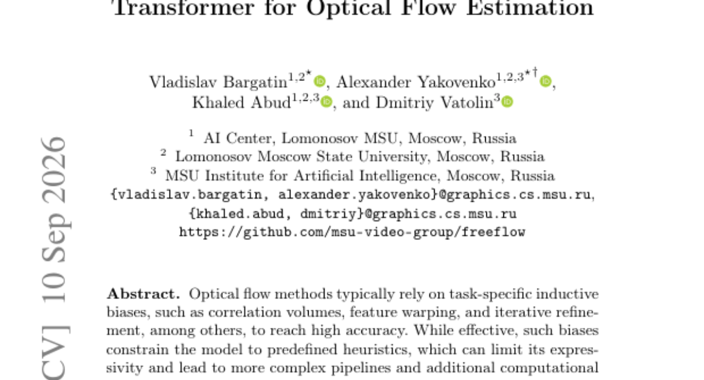

### 📌 한 줄 요약
기존의 도메인 특화 기법(Inductive Bias) 없이 순수 Transformer 구조만으로 SOTA 성능을 달성한 광학 흐름(Optical Flow) 모델

### 🔑 핵심 포인트
- Flow-specific 컴포넌트(Warping, Correlation 등)를 배제한 순수 Transformer 구조 설계
- Window, Shifted-window, Global Attention을 결합한 계층적 아키텍처로 국소/전역 정보 처리
- 모델 용량 확장에 따른 성능 향상이 용이하며 1080p 해상도에서도 효율적인 추론 가능

### 🧑‍💻 개발자 관점
특정 도메인에 종속된 복잡한 헬퍼 모듈 없이 트랜스포머만으로 고성능 비전 태스크를 수행할 수 있는 범용적 설계 방식을 제시합니다.

### 🚀 실무 적용 아이디어
- 제시된 3가지 어텐션 조합이 다양한 해상도에서 어떻게 스케일링되는지 검증
- 기존의 복잡한 Optical Flow 파이프라인과 FreeFlow의 연산 비용/속도 비교 실험
- 다른 비전 태스킹(예: Depth Estimation)에 해당 구조를 이식하여 범용성 테스트

### ⚠️ 리스크/한계
- 도메인 특화 기법이 없으므로 특정 데이터셋에 대한 일반화 성능은 높으나 초기 학습 난이도가 높을 수 있음
- 순수 어텐션 기반 구조이므로 매우 높은 해상도에서 메모리 사용량 급증 가능성

### 📝 초록 기반 상세 설명
기존의 광학 흐름 추정 방식은 상관 볼륨(correlation volume)이나 반복적 정제와 같은 작업 특화적 유도 편향(inductive bias)에 의존하여 높은 정확도를 확보해 왔습니다. 그러나 이러한 방식은 모델의 표현력을 제한하고 파이프라인을 복잡하게 만들며 추가적인 연산 비용을 발생시킵니다. 본 논문은 이러한 특화 컴포넌트 없이 단일 피드포워드 인코더-디코더 구조로 구성된 계층적 트랜스포머인 FreeFlow를 제안합니다. FreeFlow는 윈도우 어텐션, 시프티드 윈도우 어텐션, 그리고 저해상도 글로벌 어텐션을 결합하여 국소적 정보와 전역적 정보를 동시에 처리합니다. 실험 결과, 기존의 도메인 특화 기법 없이도 Sintel, KITTI-2015 등 주요 벤치마크에서 SOTA 성능을 달성하며 확장성과 효율성을 입증했습니다.

---

## 11. [World in World: Explore the World with World Models](https://huggingface.co/papers/2609.11548)
**Upvotes**: 5 | **도입 난이도**: 중 | **신뢰도**: 상
**arXiv**: https://arxiv.org/abs/2609.11548

**태그**: Video Generation, Zero-shot, Computer Vision, Video, Evaluation, Inference

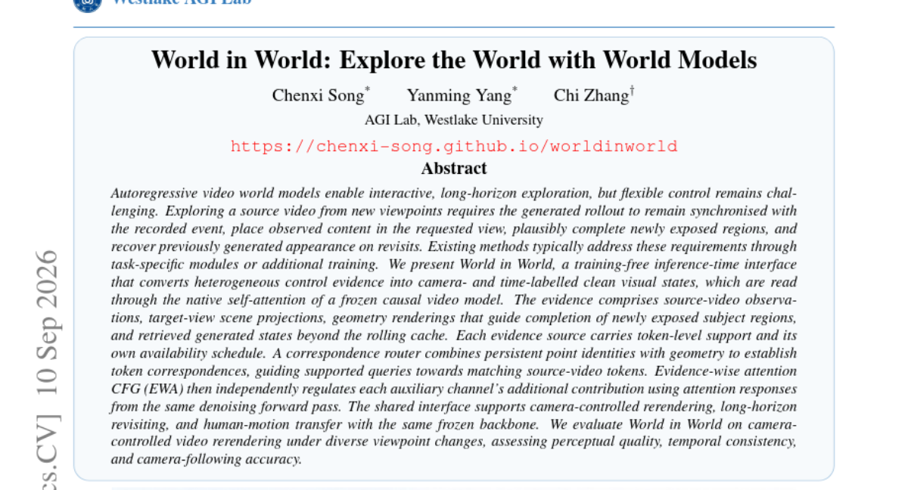

### 📌 한 줄 요약
추가 학습 없이 고정된 비디오 모델의 어텐션 메커니즘을 활용하여 정교한 카메라 제어와 장기적 일관성을 구현하는 추론 인터페이스 기술

### 🔑 핵심 포인트
- 학습 없이 추론 단계에서만 작동하는 'World in World' 인터페이스 제안
- 다양한 제어 증거(소스 비디오, 기하학, 타겟 뷰 등)를 셀프 어텐션에 통합하는 메커니즘
- Correspondence Router와 Evidence-wise Attention CFG(EWA)를 통한 정교한 토큰 매칭 및 기여도 조절

### 🧑‍💻 개발자 관점
모델 전체를 재학습하거나 파인튜닝하지 않고도 기존 비디오 생성 모델의 제어 능력을 극대화할 수 있는 효율적인 프레임워크를 제시합니다.

### 🚀 실무 적용 아이디어
- 제시된 Correspondence Router 로직을 오픈소스 비디오 모델에 이식 가능한지 검토
- 다양한 기하학적 렌더링 데이터가 입력될 때의 일관성 유지 성능 테스트
- 고정된 백본 모델(Frozen Backbone) 환경에서의 연산 오버헤드 측정

### ⚠️ 리스크/한계
- 추론 시점에 여러 증거를 처리해야 하므로 입력 데이터 복잡도에 따른 연산 비용 증가 가능성
- 입력되는 기하학적/시각적 증거의 품질에 따라 생성 결과의 일관성이 크게 좌우될 위험

### 📝 초록 기반 상세 설명
자기회귀 비디오 월드 모델은 상호작용과 장기 탐색이 가능하지만, 유연한 제어와 시점 변화에 따른 일관성 유지가 어렵습니다. 기존 방식은 이를 해결하기 위해 작업별 모듈을 추가하거나 별도의 학습을 수행해야 하는 번목이 있었습니다. 본 논문은 학습이 필요 없는 추론 단계의 인터페이스인 'World in World'를 제안합니다. 이 방식은 소스 비디오, 타겟 뷰 투영, 기하학적 렌더링 등을 입력 증거로 변환하여 고정된 인과적 비디오 모델의 셀프 어텐션에 주입합니다. 결과적으로 동일한 백본 모델을 유지하면서도 카메라 제어 재렌더링, 장기 재방문, 인간 동작 전송 등을 성공적으로 수행합니다.

---

## 12. [An Open Recipe for IMO Gold: Training Nemotron for Olympiad Mathematics](https://huggingface.co/papers/2609.10712)
**Upvotes**: 5 | **도입 난이도**: 상 | **신뢰도**: 상
**arXiv**: https://arxiv.org/abs/2609.10712

**태그**: Reasoning, Reinforcement Learning, Test-time Compute, Mathematical Modeling, Benchmark, Evaluation, Inference

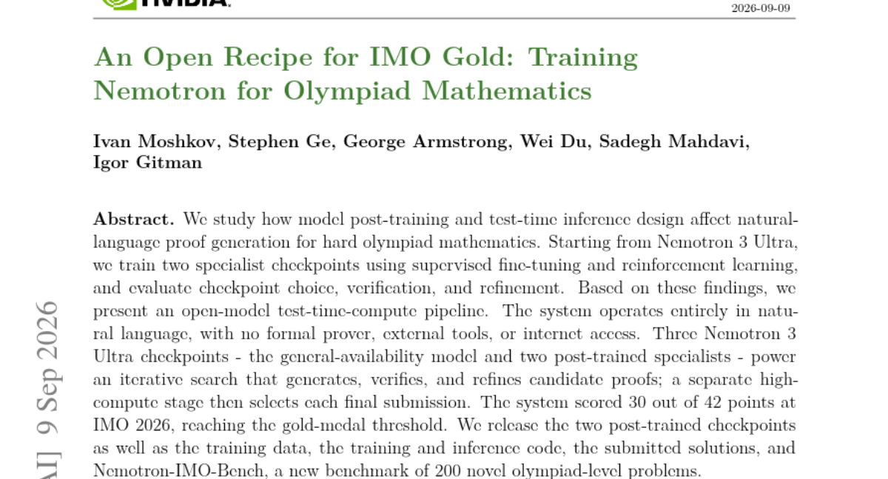

### 📌 한 줄 요약
자연어 기반의 반복적 생성-검증-정제 파이프라인을 통해 IMO 금메달 수준의 수학적 추론 성능을 달성한 오픈 모델 학습 및 추론 방법론

### 🔑 핵심 포인트
- SFT 및 RL을 통한 수학 전문화 체크포인트 생성 및 검증/정제 전략 연구
- 외부 도구 없이 자연어만으로 작동하는 반복적 생성-검증-정제(Iterative Search) 파이프라인 구축
- 고성능 수학적 추론을 위한 테스트 시간 연산(Test-time compute) 최적화

### 🧑‍💻 개발자 관점
복잡한 논리적 추론이 필요한 에이전트 설계 시, 외부 도구 없이 모델 자체의 생성과 검증 루프만으로 성능을 극대화하는 전략을 배울 수 있습니다.

### 🚀 실무 적용 아이디어
- 공개된 Nemotron-IMO-Bench를 활용하여 기존 모델의 추론 능력 벤치마킹
- 자연어 기반의 생성-검증-정제 루프를 기존 LLM 워크플로우에 이식 실험
- SFT/RL 단계에서 수학적 논리 구조를 학습시키기 위한 데이터 구성 방식 분석

### ⚠️ 리스크/한계
- 외부 도구(Lean 등)를 사용하지 않으므로 논리적 무결성 검증에 한계가 있을 수 있음
- 고도의 테스트 시간 연산(Test-time compute)이 필요하여 추론 비용이 높을 수 있음

### 📝 초록 기반 상세 설명
수학 올림피아드와 같은 고난도 문제 해결을 위해 모델의 사후 학습(post-training)과 테스트 시간 추론(test-time inference) 설계가 미치는 영향을 연구했습니다. Nemotron 3 Ultra 모델을 기반으로 SFT와 RL을 통해 두 개의 전문화된 체크포인트를 학습시켰습니다. 제안된 시스템은 외부 도구나 형식적 증명기 없이 오직 자연어만으로 생성, 검증, 정제 과정을 반복하는 테스트 시간 연산 파이프라인을 사용합니다. 이 방식은 IMO 2026 기준 금메달 수준인 42점 중 30점을 획득하는 성과를 거두었습니다. 연구팀은 학습 데이터, 코드, 솔루션 및 새로운 벤치마크인 Nemotron-IMO-Bench를 공개했습니다.

---

## 13. [Negative Self-Distillation: Learning to Reason by Avoiding Flaws](https://huggingface.co/papers/2609.11699)
**Upvotes**: 4 | **도입 난이도**: 중 | **신뢰도**: 상
**arXiv**: https://arxiv.org/abs/2609.11699

**태그**: LLM, Reasoning, Self-Improvement, Reinforcement Learning, RAG, Vision, Distillation

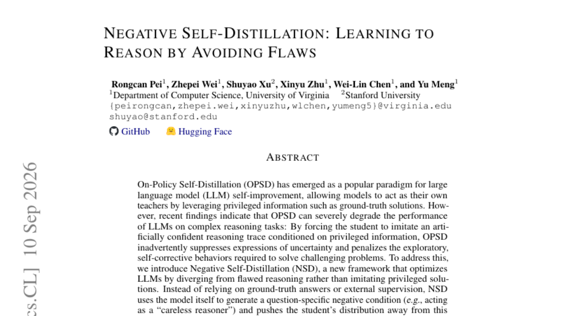

### 📌 한 줄 요약
정답을 모방하는 대신 잘못된 추론을 피함으로써 모델의 탐색적 추론 능력을 강화하는 새로운 자기 학습 프레임워크

### 🔑 핵심 포인트
- 정답 모방이 아닌 '결함 있는 추론'으로부터의 발산을 통한 자기 개선 방식 제안
- 모델 스스로 생성한 부정적 조건(Negative Condition)을 활용한 레이블 없는 학습 구조
- 언어적 기본 역량 손실을 방지하기 위한 동적 게이팅 메커니즘 설계

### 🧑‍💻 개발자 관점
정답 데이터가 부족한 복잡한 추론 태스크에서 모델의 자기 개선(Self-improvement) 성능을 높이는 새로운 패러다임을 제시합니다.

### 🚀 실무 적용 아이디어
- 기존 OPSD 방식과 NSD 방식의 추론 경로(Reasoning Trace) 다양성 비교 실험
- 동적 게이팅 메커니즘이 언어 모델의 기본 Perplexity에 미치는 영향 측정
- 복잡한 수학/논리 문제셋에서의 self-correction 능력 변화 관찰

### ⚠️ 리스크/한계
- 부정적 조건 생성 시 모델이 생성한 오류가 학습의 질을 결정하는 의존성 존재
- 추론 토큰과 언어 토큰의 구분이 모호할 경우 기본 언어 능력이 저하될 위험

### 📝 초록 기반 상세 설명
최근 LLM의 자기 개선을 위해 정답 정보를 활용하는 On-Policy Self-Distillation(OPSD) 방식이 주목받고 있습니다. 그러나 OPSD는 인위적으로 확신에 찬 추론 과정을 모방하게 함으로써 모델의 불확실성 표현과 자기 수정 능력을 저해하는 문제가 있습니다. 이를 해결하기 위해 본 논문은 정답을 따르는 대신 결함이 있는 추론으로부터 멀어지는 Negative Self-Distillation(NSD) 프레임워크를 제안합니다. NSD는 모델 스스로 생성한 '부주의한 추론'을 부정적 교사로 삼아 학생 모델의 분포를 이와 멀어지게 최적화합니다. 특히 언어 능력 저하를 막기 위해 추론에 중요한 토큰만을 식별하여 업데이트하는 동적 게이팅 메커니즘을 도입했습니다. 실험 결과, NSD는 OPSD 및 기존의 레이블 없는 RL 베이스라인들을 일관되게 상회하는 성능을 보였습니다.

---

## 14. [CARDEA: Auditable Reasoning Grounded in Spatial Evidence for End-to-End Coronary Angiography Interpretation](https://huggingface.co/papers/2609.06931)
**Upvotes**: 4 | **도입 난이도**: 상 | **신뢰도**: 상
**arXiv**: https://arxiv.org/abs/2609.06931

**태그**: LVM, Reinforcement Learning, Medical AI, Explainable AI, RAG, Reasoning, Vision, Video, Evaluation, Inference, Distillation, Safety

### 📌 한 줄 요약
공간적 근거(Bounding Box)를 활용한 강화학습을 통해 진단 신뢰성과 리포트 생성 능력을 동시에 확보한 관상동맥 조영술용 LVM 모델 개발

### 🔑 핵심 포인트
- Chain-of-Box(CoB)와 RLVR을 결합하여 추론 과정에서 공간적 근거(Bounding Box)를 활용하도록 설계
- 폐쇄형 작업(진단) 학습을 통해 개방형 작업(리포트 생성) 능력을 끌어올리는 강화학습 전략 적용
- 원시 영상 처리부터 키프레임 선택, 진단까지 수행하는 엔드투엔드 LVM 파이프라인 구축

### 🧑‍💻 개발자 관점
단순 결과값 출력을 넘어, 모델이 판단 근거(Bounding Box)를 시각적으로 제시함으로써 의료진의 신뢰를 얻는 '설명 가능한 AI' 설계 패턴을 보여줍니다.

### 🚀 실무 적용 아이디어
- RLVR(강화학습)이 정답(Label)이 없는 개방형 태스크(Report)에 미치는 전이 효과 분석
- Chain-of-Box 방식이 시각적 추론의 정확도와 신뢰도에 미치는 상관관계 검증
- 멀티뷰 영상 데이터셋에서의 키프레임 선택 알고리즘 최적화 실험

### ⚠️ 리스크/한계
- 실제 임상 환경에서의 전문의와 대등한 성능을 입증하기 위한 전향적 검증 필요
- 강화학습을 통한 성능 향상이 특정 도메인에 과적합(Overfitting)될 위험성 존재

### 📝 초록 기반 상세 설명
관상동맥 조영술(CAG)은 진단 방식에 따라 관찰자 간 편차가 크며, 기존 AI는 의사결정 과정의 투명성이 부족하여 임상 도입에 한계가 있습니다. 이를 해결하기 위해 시각적 특징 정렬, Chain-of-Box(CoB) 콜드 스타트, 그리고 검증 가능한 보상을 활용한 강화학습(RLVR)을 결합한 통합 LVM인 CARDEA를 개발했습니다. CARDEA는 바운딩 박스 활용을 유도하는 RLVR을 통해 공간적 근거를 확보하며, 이를 통해 진단과 리포트 생성 능력을 동시에 학습했습니다. 실험 결과, RLVR은 제로샷 리포트 생성 성능을 크게 향상시켰으며 복잡도 평가에서도 전문의와 유사한 수준을 보였습니다. 결과적으로 CARDEA는 원시 영상에서 진단까지 이어지는 엔드투엔드 파이프라인을 제공하면서도 감사 가능한 공간적 근거를 제시합니다.

---

## 15. [MetroLLM-Bench: Evaluating Language Models as Transit Kiosk Runtimes](https://huggingface.co/papers/2609.10016)
**Upvotes**: 3 | **도입 난이도**: 중 | **신뢰도**: 상
**arXiv**: https://arxiv.org/abs/2609.10016

**태그**: Agent, Benchmark, Fine-tuning, SLM, Tool-use, Reasoning, Evaluation

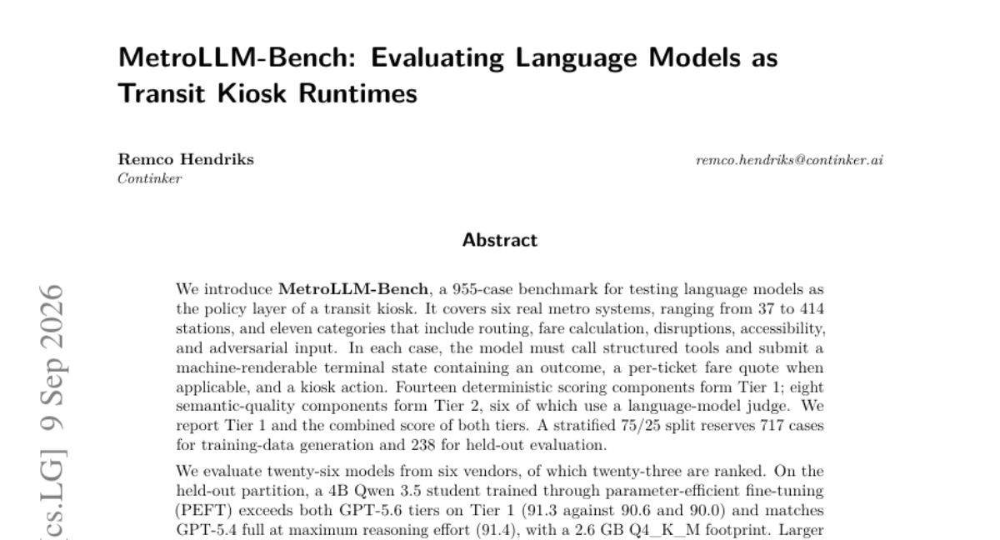

### 📌 한 줄 요약
대중교통 키오스크 환경을 모사한 벤치마크를 통해 소형 모델의 실무 정책 실행 능력을 검증하고 최적화하는 연구

### 🔑 핵심 포인트
- 6개 지하철 시스템과 11개 시나리오를 포함하는 955개 케이스의 실무 중심 벤치마크 구축
- 도구 호출(Tool-use) 및 구조화된 출력(Structured output) 능력을 평가하는 2단계 점수 체계 도입
- PEFT를 통해 4B 규모의 소형 모델이 거대 모델(GPT-5 계열)과 대등한 정책 실행 성능을 달성함을 입증

### 🧑‍💻 개발자 관점
에이전트가 도구 호출과 구조화된 출력을 통해 실무 환경(키오스크, 자동화 시스템)에서 어떻게 동작해야 하는지에 대한 구체적인 평가 지표를 제공합니다.

### 🚀 실무 적용 아이디어
- 제공된 벤치마크를 활용하여 특정 도메인 특화 소형 모델(SLM)의 정책 실행 능력 테스트
- PEFT 기법을 적용하여 도메인 지식 주입 시 모델 크기별 성능 변화 관찰
- 구조화된 출력 형식이 복잡한 시나리오에서 모델의 안정성에 미치는 영향 분석

### ⚠️ 리스크/한계
- 특정 도메인(교통)에 특화된 벤치마크이므로 일반적인 추론 능력과의 상관관계가 명확하지 않을 수 있음
- 모델 크기가 커질수록 PEFT를 통한 성능 향상 폭이 감소하는 경향이 관찰됨

### 📝 초록 기반 상세 설명
대중교통 키오스크의 정책 레이어로 LLM을 활용할 때의 성능을 측정하기 위한 벤치마크인 MetroLLM-Bench를 제안합니다. 이 벤치마크는 6개 지하철 노선과 11개 카테고리를 포함하며, 모델이 구조화된 도구 호출과 터미널 상태를 생성하는 능력을 평가합니다. 연구진은 26개 모델을 대상으로 평가를 진행하였으며, PEFT를 통한 미세 조정이 소형 모델의 성능을 극대화할 수 있음을 보여주었습니다. 실험 결과, 특정 규모의 소형 모델이 거대 모델의 성능을 상회하거나 대등한 수준의 정책 실행 능력을 확보할 수 있음을 입증했습니다. 최종적으로 벤치마크와 학습 데이터, 미세 조정된 모델들을 공개하여 실무 적용 가능성을 높였습니다.

---

## 16. [HyQuant: Hybrid-Precision Quantization for LLM Attention](https://huggingface.co/papers/2608.27875)
**Upvotes**: 3 | **도입 난이도**: 중 | **신뢰도**: 상
**arXiv**: https://arxiv.org/abs/2608.27875

**태그**: LLM, Quantization, Inference Optimization, KV-Cache, Inference, Optimization

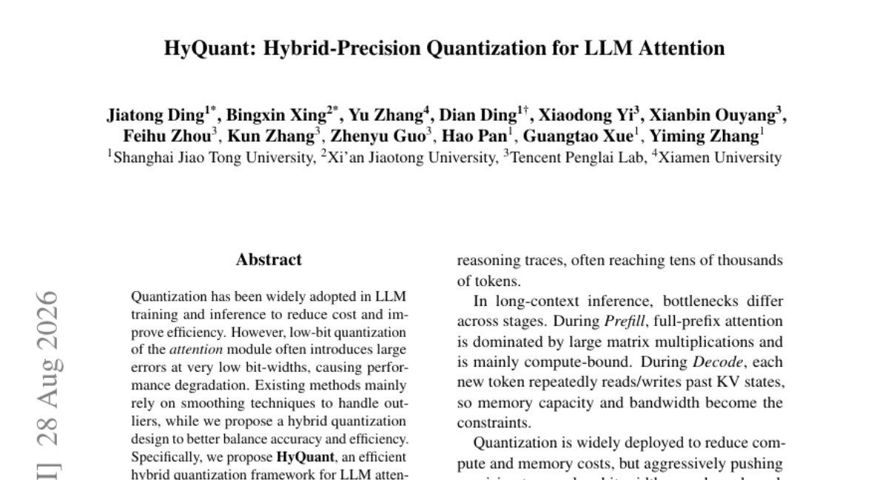

### 📌 한 줄 요약
중요도가 높은 특정 토큰과 윈도우 영역만 고정밀도를 유지하여 LLM 어텐션 성능 저하를 막는 하이브리드 양자화 프레임워크

### 🔑 핵심 포인트
- 수직 라인 토큰(Vertical-line tokens)과 로컬 윈도우 영역을 선별하여 고정밀도로 유지하는 하이브리드 전략
- 경량화된 어텐션 패턴 신호를 활용한 정확도 중심 영역의 효율적 선택
- Prefill/Decode 단계의 KV-캐시 압축 및 연산 융합을 통한 하드웨어 효율성 극대화

### 🧑‍💻 개발자 관점
모델의 성능 저하 없이 KV-캐시 용량을 획기적으로 줄일 수 있어, 메모리 제약이 큰 환경에서 LLM 추론 효율을 높이는 데 유용합니다.

### 🚀 실무 적용 아이디어
- 제공된 코드를 활용하여 기존 양자화(GPTQ, AWQ 등) 대비 성능 유지력 비교 실험
- 다양한 컨텍스트 길이에 따른 하이브리드 정밀도 분할 전략의 효율성 검증
- 실제 GPU 환경에서 KV-캐시 압축에 따른 추론 속도 향상 폭 측정

### ⚠️ 리스크/한계
- 특정 어텐션 패턴에 의존하므로 패턴이 다른 특수 태스크에서의 일반화 성능 확인 필요
- 하이브리드 연산 구현 방식에 따라 하드웨어 가속 효율이 달라질 수 있음

### 📝 초록 기반 상세 설명
LLM의 비용 절감을 위해 양자화가 널리 사용되지만, 어텐션 모듈의 저비트 양자화는 성능 저하를 유발하는 문제가 있습니다. 기존 방식은 주로 아웃라이어 처리를 위한 스무딩 기법에 의존해 왔습니다. 본 논문은 정확도와 효율성의 균형을 맞추기 위해 HyQuant라는 하이브리드 양자화 프레임워크를 제안합니다. HyQuant는 수직 라인 토큰과 로컬 윈도우 상태를 고정밀도로 유지하고 나머지는 저비트로 양자화하여 오차를 최소화합니다. Prefill과 Decode 단계 모두에서 이 원칙을 적용하여 KV-캐시 압축과 연산 효율을 동시에 확보했습니다. 실험 결과, 매우 단순한 설계임에도 불구하고 다양한 작업에서 손실 없는 정확도를 유지하며 실용성을 입증했습니다.

---

## 17. [DRG-MAPPO: Hierarchical Dynamic Role-Graph Multi-Agent Reinforcement Learning for Cooperative Air Combat](https://huggingface.co/papers/2609.11155)
**Upvotes**: 2 | **도입 난이도**: 상 | **신뢰도**: 상
**arXiv**: https://arxiv.org/abs/2609.11155

**태그**: MARL, Graph-Neural-Networks, Hierarchical-RL, Multi-Agent, Agent, RAG

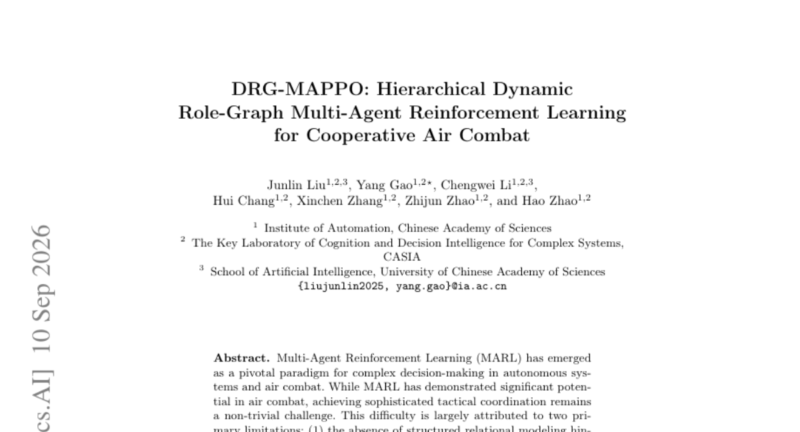

### 📌 한 줄 요약
그래프 기반 관계 모델링과 계층적 역할 할당을 결합하여 공중 전투의 전술적 협업 능력을 극대화한 MARL 프레임워크

### 🔑 핵심 포인트
- 그래프 어텐션 메커니즘을 통한 전장 내 개체 간 복잡한 관계 특징 추출
- 상위(역할 할당)와 하위(기동 실행) 정책으로 분리된 계층적 의사결정 구조
- 집중 사격(focus-fire)과 같은 협업 행동 유도를 위한 타겟 우선순위 보조 작업 설계

### 🧑‍💻 개발자 관점
복잡한 다중 객체 간의 관계를 그래프로 구조화하고, 계층적 구조를 통해 전략과 실행을 분리하는 설계 패턴을 학습할 수 있습니다.

### 🚀 실무 적용 아이디어
- 그래프 신경망(GNN)을 활용한 멀티 에이전트 관계 모델링 구현 실험
- 상위/하위 정책 분리 구조에서의 학습 안정성 및 수렴 속도 비교
- 역할 할당 메커니즘이 다양한 에이전트 수 변화에 따른 확장성에 미치는 영향 테스트

### ⚠️ 리스크/한계
- 계층적 구조로 인해 상위 정책의 역할 결정 오류가 하위 실행에 미치는 영향(Error Propagation) 가능성
- 전장 규모가 커질 경우 그래프 연산 복잡도 증가로 인한 실시간성 저하 우려

### 📝 초록 기반 상세 설명
멀티 에이전트 강화학습(MARL)은 자율 시스템의 의사결정에 중요하지만, 복잡한 전술적 협업을 구현하는 데 어려움이 있습니다. 기존 방식은 개체 간의 가변적인 관계를 모델링하기 어렵고, 명확한 역할 분담이 부족하여 동적인 환경에서 작업 할당이 모호해지는 문제가 있었습니다. 이를 해결하기 위해 그래프 기반 관계 모델링과 동적 역할 할당을 통합한 DRG-MAPPO 프레임워크를 제안합니다. 이 방식은 그래프 어텐션을 통해 전장 관계 특징을 추출하고, 상위 정책이 역할을 결정하면 하위 정책이 구체적인 기동을 수행하는 계층적 구조를 가집니다. 실험 결과, 제안된 방식은 87%의 높은 승률을 기록하며 전술적 전략과 협업 실행의 최적화를 동시에 달성했습니다.

---

## 18. [UniH^3: Unifying Hierarchical Homogeneity and Heterogeneity for All-in-One Medical Image Restoration](https://huggingface.co/papers/2609.11156)
**Upvotes**: 2 | **도입 난이도**: 중 | **신뢰도**: 상
**arXiv**: https://arxiv.org/abs/2609.11156

**태그**: Medical Imaging, Image Restoration, Multi-task Learning, Deep Learning, RAG, Vision, Benchmark, Distillation

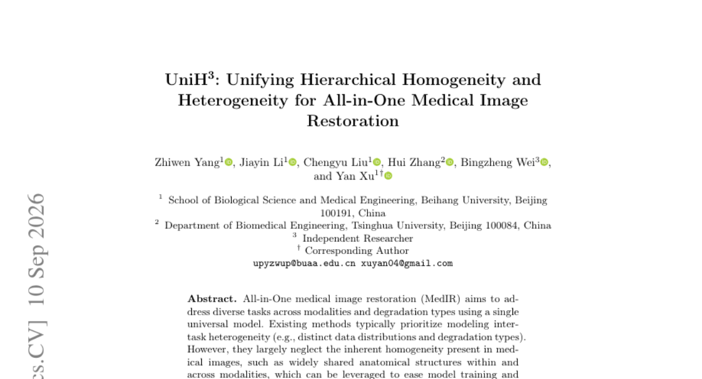

### 📌 한 줄 요약
의료 영상의 공통 구조(동질성)와 작업별 차이(이질성)를 동시에 제어하여 모든 복원 작업을 수행하는 통합 프레임워크

### 🔑 핵심 포인트
- H2M(Hierarchical Homogeneity Memory): 고품질 이미지의 구조적 특징을 저장하고 입력에 맞춰 적응적으로 추출하는 모듈
- HGA(Homogeneity-Guided Attention): 추출된 동질성 정보를 복원 파이프라인에 효율적으로 주입하는 메커니즘
- H2B(Hierarchical Heterogeneity Balancer): 멀티태스크 학습 시 발생하는 작업 간 충돌을 억제하는 최적화 전략

### 🧑‍💻 개발자 관점
단일 모델로 다양한 모달리티와 열화 유형을 처리할 수 있어, 의료 영상 전처리 파이프라인의 복잡도를 획기적으로 낮출 수 있습니다.

### 🚀 실무 적용 아이디어
- 제공된 코드를 활용하여 MedIR-2D-500K 데이터셋에서의 성능 재현 실험
- 특정 의료 도메인(예: MRI, CT)에 특화된 데이터셋에 대한 전이 학습 효과 검증
- H2M 모듈의 메모리 크기 변화에 따른 연산 효율성 및 복원 품질 간의 트레이드오프 분석

### ⚠️ 리스크/한계
- 고품질 이미지 기반의 메모리 방식이므로, 학습 데이터의 품질에 따라 모델 성능이 크게 좌우될 수 있음
- 다양한 태스크를 하나의 모델에 담는 과정에서 발생하는 연산 비용 및 메모리 점유율 문제

### 📝 초록 기반 상세 설명
기존의 All-in-One 의료 영상 복원 방식은 작업 간의 차이(이질성)를 해결하는 데 집중했으나, 의료 영상이 가진 공통적인 해부학적 구조(동질성) 활용은 간과해 왔습니다. 이를 해결하기 위해 본 논문은 동질성과 이질성을 계층적으로 통합하는 UniH3 프레임워크를 제안합니다. H2M 모듈은 고품질 이미지에서 추출한 동질성 정보를 저장하고 적응적으로 검색하며, HGA 메커니즘을 통해 이를 복원 과정에 주입합니다. 또한 H2B 모듈은 최적화 과정에서 발생하는 작업 간 충돌을 완화하여 균형 잡힌 멀티태스크 학습을 가능하게 합니다. 실험 결과, 제안 모델은 대규모 벤치마크에서 SOTA 성능을 달성하며 범용 복원 모델로서의 가능성을 입증했습니다.

---

## 19. [Generative Late-Interaction Embeddings For Visual Document Retrieval](https://huggingface.co/papers/2609.11808)
**Upvotes**: 2 | **도입 난이도**: 중 | **신뢰도**: 상
**arXiv**: https://arxiv.org/abs/2609.11808

**태그**: Vector Search, Compression, Generative Models, Document Retrieval, RAG, Evaluation, Optimization

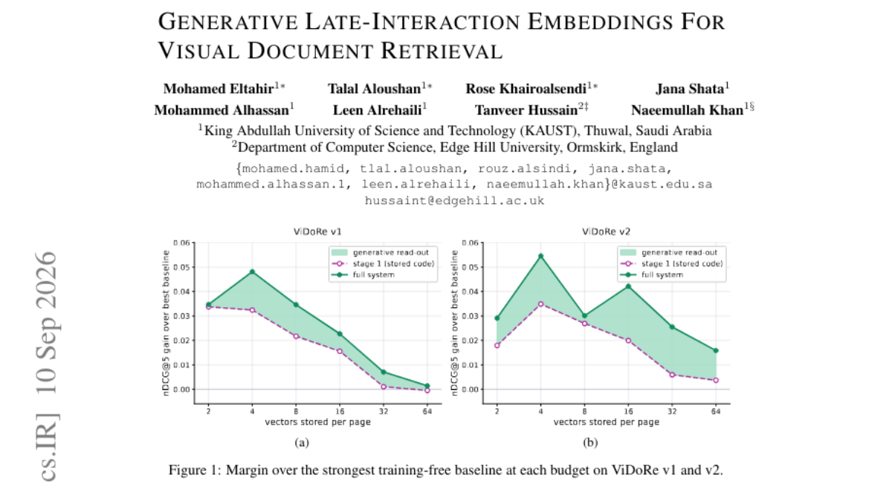

### 📌 한 줄 요약
벡터 압축 대신 소수의 핵심 벡터로 전체 임베딩을 복원하는 생성적 방식을 통해 저장 공간을 획기적으로 줄이면서도 검색 정확도를 유지하는 기술

### 🔑 핵심 포인트
- 벡터가 단위 구 표면에 존재하며 낮은 내재적 차원을 가진다는 기하학적 특성 활용
- GLIE: 소수의 벡터를 인덱스로 사용하고, 쿼리 시에만 디코더로 전체 벡터를 복원하는 방식
- 학습 비용이 매우 낮고(3분 이내), 기존의 샘플링 방식보다 높은 검색 정확도 유지

### 🧑‍💻 개발자 관점
대규모 문서 집합을 다루는 RAG 시스템에서 벡터 저장소 비용을 획기적으로 절감하면서도 검색 품질을 유지할 수 있는 실무적 대안을 제시합니다.

### 🚀 실무 적용 아이디어
- 제시된 415K 파라미터 규모의 디코더 구조를 기존 임베딩 모델에 결합하는 실험
- 데이터셋 크기 변화에 따른 저장 공간 대비 nDCG 성능 변화 벤치마크
- 실제 서비스 환경에서의 쿼리 타임 디코딩 지연 시간(Latency) 측정

### ⚠️ 리스크/한계
- 쿼리 시점에 디코더를 통한 복원 과정이 발생하므로 검색 지연 시간(Latency)이 증가할 수 있음
- 매우 복잡하거나 고차원적인 특징을 가진 문서에서는 복원 정확도가 떨어질 가능성

### 📝 초록 기반 상세 설명
시각적 문서 검색에서 Late-interaction 방식은 높은 정확도를 제공하지만, 페이지당 수천 개의 벡터를 저장해야 하는 막대한 용량 문제가 발생합니다. 기존 압축 방식은 저장 용량이 줄어들수록 성능이 급격히 저하되거나 모델 재학습이 필요하다는 단점이 있습니다. 연구진은 벡터가 단위 구(unit sphere) 위에 존재하며 매우 낮은 차원의 매니폴드에 집중되어 있다는 기하학적 특성을 발견했습니다. 이를 바탕으로 소수의 벡터만 저장하고 이를 기반으로 전체 벡터를 재생성하는 GLIE(Generative Late-Interaction Embeddings)를 제안합니다. 실험 결과, GLIE는 극도로 적은 수의 벡터만으로도 기존 방식 대비 압도적인 성능을 보였으며 학습 비용 또한 매우 낮았습니다.

### 🖼️ 추가 자료
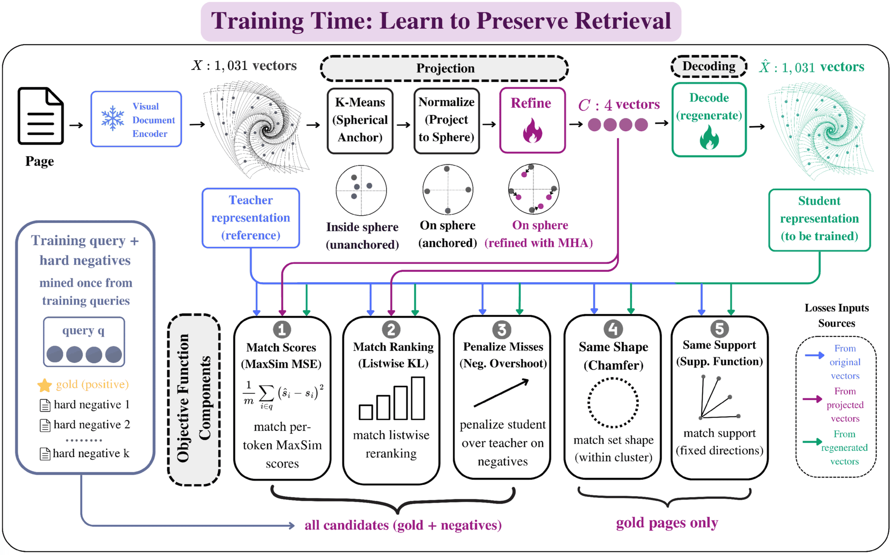
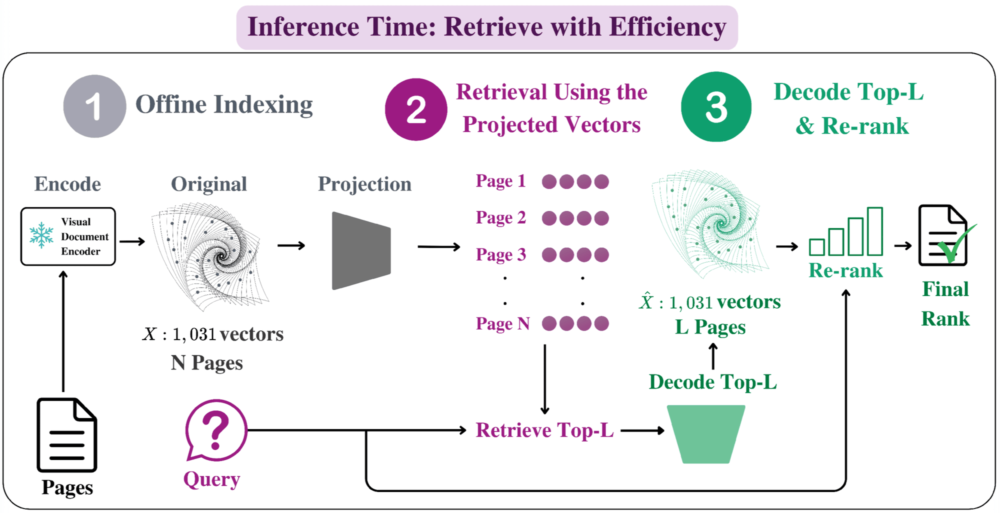

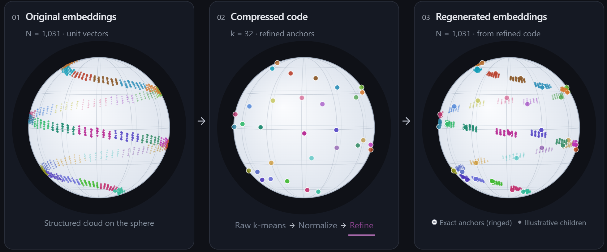

---

## 20. [Beyond Solver Verdicts: Generative Reward Models for Autoformalization](https://huggingface.co/papers/2609.11085)
**Upvotes**: 1 | **도입 난이도**: 상 | **신뢰도**: 상
**arXiv**: https://arxiv.org/abs/2609.11085

**태그**: LLM, Formal Verification, Neurosymbolic, Agentic Workflow, Agent, Reasoning, Distillation

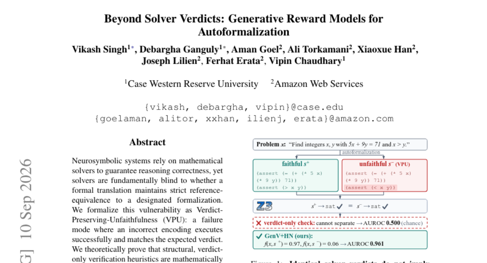

### 📌 한 줄 요약
수식 자동 형식화(Autoformalization) 시 발생하는 논리적 불일치를 해결하기 위해 생성형 보상 모델을 활용한 검증 기법 제안

### 🔑 핵심 포인트
- VPU(Verdict-Preserving-Unfaithfulness)라는 새로운 취약점 정의 및 이론적 증명
- Z3 오라클을 언어 모델의 로짓 공간으로 변환한 GenV 프레임워크 제안
- 별도의 위치 학습 없이도 오류를 식별하는 생성형 보상 모델의 메커니즘 규명

### 🧑‍💻 개발자 관점
코드 생성 에이전트가 단순히 '실행 성공'을 넘어 '의도와 일치하는 코드'를 작성하도록 만드는 고도화된 검증 루프를 구축할 수 있습니다.

### 🚀 실무 적용 아이디어
- LLM 기반 코드 생성 파이프라인에 GenV와 같은 보상 모델 결합 실험
- Z3 등 정적 분석 도구의 결과를 LLM 로짓에 반영하는 증류(Distillation) 프로세스 설계
- 에이전트의 Test-time compute 할당 시 검증 점수를 가중치로 사용하는 로직 구현

### ⚠️ 리스크/한계
- Z3와 같은 외부 오라클에 의존하는 증류 과정의 복잡성
- 모델의 어휘 공간(Vocabulary space)을 활용하는 방식의 해석 가능성 및 안정성 문제

### 📝 초록 기반 상세 설명
신경-기호(Neurosymbolic) 시스템은 솔버를 통해 추론의 정확성을 보장하려 하지만, 번역된 코드가 원래 의도와 의미적으로 동일한지는 검증하기 어렵습니다. 본 논문은 잘못된 인코딩이 우연히 정답을 맞추는 'Verdict-Presly-Unfaithfulness(VPU)' 문제를 정의하고, 기존의 결과 중심 검증 방식의 한계를 이론적으로 증명합니다. 이를 해결하기 위해 Z3 정적 검증기를 언어 모델의 어휘 공간으로 증류한 생성형 검증(GenV) 방식을 도입합니다. 실험 결과, GenV는 명시적인 위치 학습 없이도 오류 좌표를 정확히 추출하며, 제로샷 환경에서도 높은 검증 성능과 에이전트 추론 정확도 향상을 보여주었습니다.

---

## 21. [Think Before You Link: Rarity, Reasoning, and Retrieval in Multilingual Entity Linking](https://huggingface.co/papers/2609.10745)
**Upvotes**: 1 | **도입 난이도**: 하 | **신뢰도**: 상
**arXiv**: https://arxiv.org/abs/2609.10745

**태그**: Entity-Linking, RAG, VLM, Knowledge-Graph, Reasoning, Multimodal, Vision, Benchmark, Evaluation

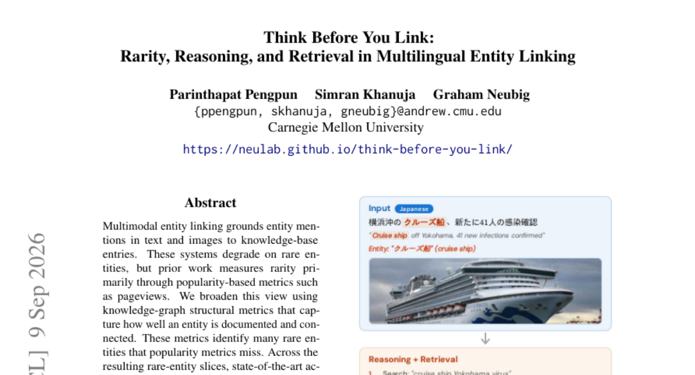

### 📌 한 줄 요약
지식 그래프 구조 기반의 희귀 엔티티 식별과 추론-검색 결합 프레임워크를 통한 멀티모달 엔티티링킹 성능 향상

### 🔑 핵심 포인트
- 지식 그래프 구조적 지표를 활용한 새로운 희귀 엔티티 정의 및 식별 방식 제안
- 추론(Reasoning)과 검색(Retrieval)의 상호 보완적 결합을 통한 성능 최적화
- 학습이 필요 없는(training-free) 반복적 검색 및 추론 프레임워크 도입

### 🧑‍💻 개발자 관점
RAG 시스템 구축 시 단순 검색을 넘어 모델의 추론과 동적 검색을 어떻게 결합해야 희귀 데이터(Long-tail) 문제를 해결할 수 있는지에 대한 방법론을 제시합니다.

### 🚀 실무 적용 아이디어
- 기존 엔티티링킹 시스템에 지식 그래프 구조 지표를 적용하여 취약 엔티티 식별해보기
- LLM/VLM 기반의 반복적 검색 루프(Iterative Search Loop) 프로토타입 구현
- 단순 검색 결과와 추론 결과의 성능 차이를 분석하는 실험 설계

### ⚠️ 리스크/한계
- 반복적인 검색 과정에서 발생할 수 있는 높은 추론 비용 및 지연 시간(Latency)
- 검색된 외부 지식(Wikipedia 등)의 품질에 따른 성능 의존성

### 📝 초록 기반 상세 설명
기존의 멀티모달 엔티티링킹은 페이지뷰와 같은 단순 인기도 중심의 희귀 엔티티 측정 방식으로 인해 실제 성능 저하 문제를 충분히 포착하지 못했습니다. 본 논문은 지식 그래프의 구조적 지표를 활용하여 문서화 및 연결성이 부족한 진정한 희귀 엔티티를 식별합니다. 이를 해결하기 위해 추론 능력을 갖춘 시각-언어 모델이 위키피디아를 반복적으로 검색하며 증거를 수집하는 학습 불필요(training-free) 프레임워크를 제안합니다. 실험 결과, 추론과 검색의 결합이 희귀 엔티티에 대한 정확도를 크게 높임을 확인했습니다. 최종적으로 다국어 멀티모달 벤치마크인 MERLIN에서 기존 SOTA 대비 높은 성능 향상을 달schap했습니다.

### 🖼️ 추가 자료
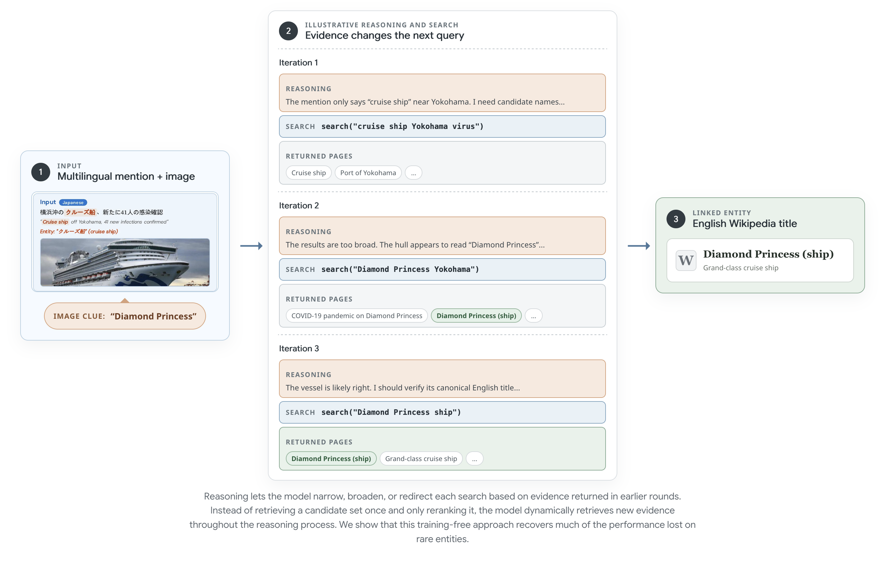

---

## 22. [Building Multilingual Bridges: Data Mixing as the Pillar of Generalization for In-Language Reasoning](https://huggingface.co/papers/2609.10445)
**Upvotes**: 1 | **도입 난이도**: 중 | **신뢰도**: 상
**arXiv**: https://arxiv.org/abs/2609.10445

**태그**: LLM, Multilingual, Reasoning, SFT, Data-Centric, RAG, Vision, Benchmark

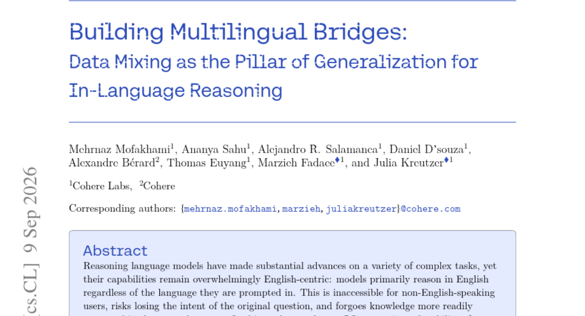

### 📌 한 줄 요약
데이터 믹싱 전략을 통해 영어 중심의 추론 능력을 다양한 언어로 전이시키는 다국어 추론 모델 최적화 방법론

### 🔑 핵심 포인트
- L2 reasoning: 프롬프트 언어로 일관되게 추론하는 능력 확보
- 데이터 중심 접근: SFT 시 데이터 구성과 스케줄링 최적화를 통한 추론 일반화
- 언어 간 전이: 영어 추론 백본과 다국어 데이터를 결합하여 타겟 언어의 직접적인 추론 데이터 없이도 성능 확보

### 🧑‍💻 개발자 관점
특정 언어에 국한되지 않는 범용적인 추론 에이전트를 구축할 때, 데이터 믹싱 전략이 모델 성능에 미치는 결정적인 영향을 보여줍니다.

### 🚀 실무 적용 아이디어
- SFT 데이터셋 구성 시 영어 추론 데이터와 타겟 언어 데이터의 비율 실험
- 다국어 비추론 데이터가 추론 능력 전이에 미치는 영향 분석
- 소규모 모델(3B급)에서 추론 백본을 활용한 언어 확장 실험

### ⚠️ 리스크/한계
- 특정 언어군(Typologically diverse)에 따라 전이 효율이 다를 수 있음
- 영어 백본 의존도가 높을 경우 타겟 언어의 고유한 특성이 희석될 위험

### 📝 초록 기반 상세 설명
최근 추론 모델은 비약적으로 발전했으나, 프롬프트 언어와 상관없이 영어로만 추론하는 영어 중심적 한계를 보입니다. 이는 비영어권 사용자의 의도 왜곡과 지식 손실을 초래합니다. 본 연구는 사용자의 언어로 일관되게 추론하는 'L2 reasoning' 능력을 확보하기 위해 SFT 단계에서의 데이터 구성 및 스케줄링을 최적화하는 데이터 중심 접근법을 제안합니다. 3.35B 규모의 Tiny Aya L2-Thinker 모델을 구축하여 60개 언어에 대해 높은 L2 추론 성공률을 달성했습니다. 연구 결과, 광범위한 언어 커버리지와 영어 추론 백본, 그리고 다국어 비추론 데이터의 적절한 조합이 핵심임을 밝혀냈습니다. 이를 통해 추론 능력이 언어와 무관하게 전이될 수 있음을 입증했습니다.

### 🖼️ 추가 자료
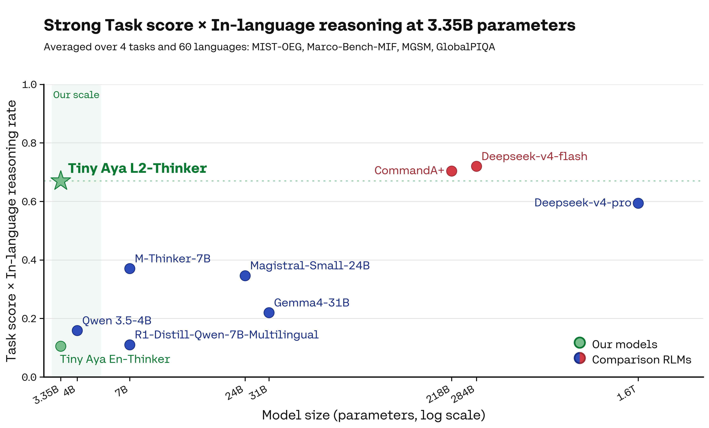
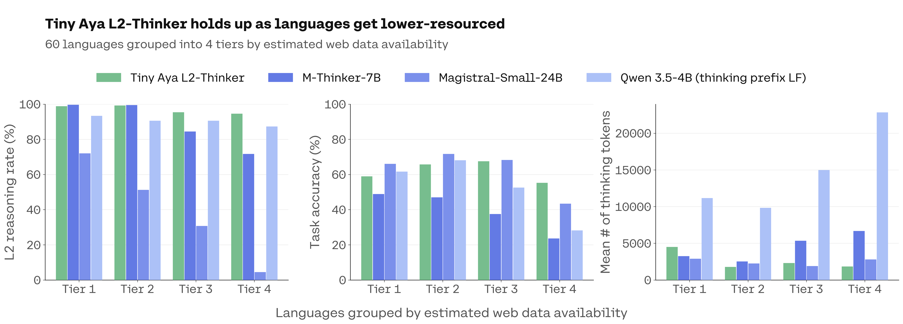

---

## 23. [Adaptive Bridge: A Proxy-Based Decoupling Layer for Mitigating DDS Backpressure in ROS 2](https://huggingface.co/papers/2608.15380)
**Upvotes**: 1 | **도입 난이도**: 중 | **신뢰도**: 상
**arXiv**: https://arxiv.org/abs/2608.15380

**태그**: ROS 2, DDS, Backpressure, Robotics, Network, Evaluation, Inference, Safety

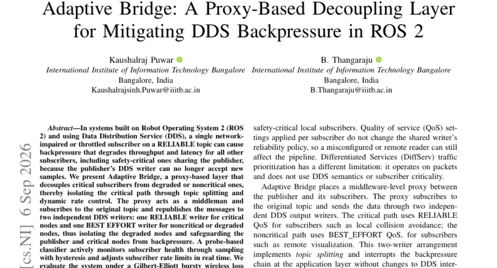

### 📌 한 줄 요약
ROS 2 환경에서 특정 구독자의 네트워크 지연이 전체 시스템으로 전파되는 백프레셔 문제를 프록시 계층을 통해 해결하는 기술

### 🔑 핵심 포인트
- 프록시 기반의 토픽 분리(Topic Splitting)를 통한 중요/비중요 구독자 간의 백프레셔 격리
- RELIABLE 및 BEST EFFORT 쓰기 방식을 혼합 사용하여 네트워크 장애가 발행자에게 전파되는 것을 방지
- 프로브 기반의 실시간 모니터링 및 히스테리시스(Hysteresis)를 적용한 동적 속도 제어

### 🧑‍💻 개발자 관점
네트워크가 불안정한 로봇 환경에서 특정 센서 데이터나 로그 수집 노드의 지연이 제어와 같은 핵심 기능의 실시간성을 해치는 것을 방지할 수 있습니다.

### 🚀 실무 적용 아이디어
- ROS 2 환경에서 느린 구독자를 의도적으로 배치하여 발행자 성능 저하 재현 실험
- 프록시 계층 도입 시 발생하는 추가적인 네트워크 오버헤드 및 CPU 부하 측정
- 중요도에 따른 RELIABLE/BEST EFFORT 분리 전략의 적정 임계값 설정 테스트

### ⚠️ 리스크/한계
- 프록시 노드 자체가 단일 장애점(SPOF)이 될 수 있으며, 프록시 자체의 리소스 소모 발생
- 데이터 복제 및 재발행 과정에서 발생하는 미세한 지연시간 증가 가능성

### 📝 초록 기반 상세 설명
ROS 2의 DDS 기반 시스템에서 특정 구독자의 네트워크 장애나 속도 저하가 발행자(Publisher)의 쓰기 성능을 저하시켜 전체 시스템의 처리량과 지연시간을 악화시키는 백프레셔 문제가 발생합니다. 이를 해결하기 위해 연구진은 프록시 기반의 디커플링 계층인 'Adaptive Bridge'를 제안합니다. 이 방식은 프록시가 원본 토픽을 구독한 뒤, 중요 노드용 RELIABLE 쓰기와 비중요 노드용 BEST EFFORT 쓰기로 분리하여 재발행함으로써 경로를 격리합니다. 또한 프로브 기반 분류기를 통해 구독자의 상태를 실시간 모니터링하고 동적으로 전송 속도를 조절합니다. 실험 결과, 네트워크 손실이 발생하는 환경에서 중요 노드의 p95 지연시간을 15초에서 1.55ms 수준으로 획기적으로 낮추면서도 발행자의 처리량을 유지할 수 있음을 입증했습니다.

---

## 24. [IdeaAMBIG: Benchmarking Implementation-Critical Gaps in Research-Idea Specifications](https://huggingface.co/papers/2609.10539)
**Upvotes**: 0 | **도입 난이도**: 하 | **신뢰도**: 상
**arXiv**: https://arxiv.org/abs/2609.10539

**태그**: LLM, Reproducibility, Software Engineering, Benchmark, Agent, Evaluation

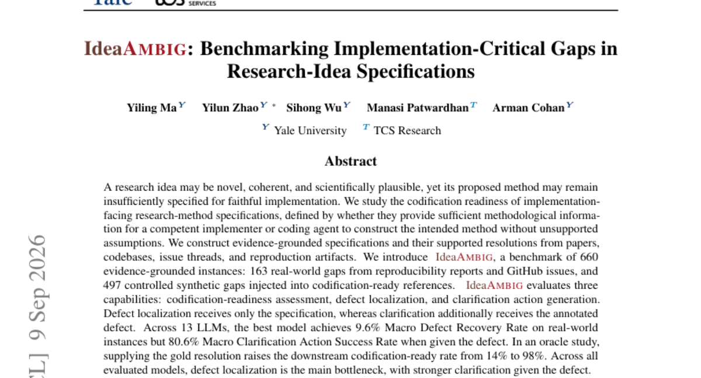

### 📌 한 줄 요약
연구 논문의 방법론적 모호함이 구현 단계에서 발생하는 격차를 측정하고 해결하기 위한 벤치마크 제안

### 🔑 핵심 포인트
- 구현 가능한 연구 명세의 수준을 측정하는 IdeaAM식 벤치마크(IdeaAMBIG) 개발
- 실제 GitHub 이슈와 합성 데이터를 결합한 660개의 정교한 데이터셋 구축
- 결함 식별(Localization)과 해결책 생성(Clarification) 능력을 분리하여 LLM 성능 평가

### 🧑‍💻 개발자 관점
연구 논문을 코드로 변환하거나 AI 에이전트가 연구를 재현할 때, 명세의 어떤 부분이 부족한지 식별하는 데 도움을 줍니다.

### 🚀 실무 적용 아이디어
- LLM을 활용한 논문-코드 간 정합성 검증 파이프라인 설계
- 연구 명세의 모호함을 탐지하는 에이전트 프롬프트 엔지니어링 실험
- 코드 생성 에이전트의 입력값으로서의 '명세 완성도' 기준 수립

### ⚠️ 리스크/한계
- 현재 LLM의 결함 위치 식별(Localization) 능력이 낮아 자동화에 한계가 있음
- 실제 구현 환경의 복잡성이 벤치마크의 합성 데이터에 완전히 반영되지 않을 수 있음

### 📝 초록 기반 상세 설명
연구 아이디어가 과학적으로 타당하더라도 구현을 위한 세부 명세는 부족할 수 있습니다. 본 연구는 구현 가능한 수준의 연구 방법론 명세가 갖추어야 할 정보량을 측정하는 '코드화 준비도(codification readiness)'를 연구합니다. 이를 위해 실제 재현 보고서와 GitHub 이슈, 합성 데이터를 결합한 660개의 사례로 구성된 IdeaAMBIG 벤치마크를 구축했습니다. 실험 결과, LLM은 결함 위치를 찾는 데 어려움을 겪었으나 결함이 주어지면 해결책 생성 능력은 높게 나타났습니다. 결과적으로 연구 명세의 모호함을 식별하고 이를 구체화하는 능력이 자동화된 구현의 핵심임을 보여줍니다.

---

## 25. [ActReview: Rebuttal-Guided Training Data and Rubric Rewards for Actionable Peer Review Generation](https://huggingface.co/papers/2609.09076)
**Upvotes**: 0 | **도입 난이도**: 중 | **신뢰도**: 상
**arXiv**: https://arxiv.org/abs/2609.09076

**태그**: LLM, RLHF, NLP, Academic-Writing, Vision, Benchmark, Evaluation

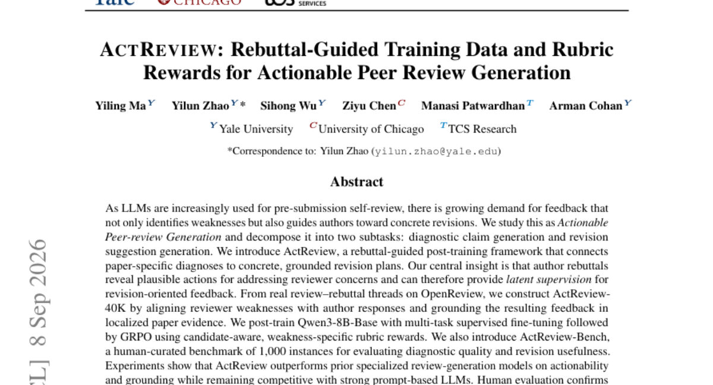

### 📌 한 줄 요약
리뷰어의 지적과 저자의 반박 데이터를 활용하여, 단순 비판을 넘어 구체적인 수정 방향을 제시하는 액션 중심의 피어 리뷰 생성 프레임워크

### 🔑 핵심 포인트
- 리뷰-반박 스레드를 활용하여 문제점과 해결책을 연결하는 데이터셋(ActReview-40K) 구축
- 진단적 품질과 수정 유용성을 동시에 확보하기 위한 GRPO 기반의 루브릭 보상 학습 방식 도입
- 인간이 직접 큐레이션한 1,000개의 인스턴스로 구성된 벤치마크(ActReview-Bench) 제안

### 🧑‍💻 개발자 관점
LLM을 활용한 코드 리뷰나 문서 검토 에이전트 설계 시, 단순한 오류 지적을 넘어 '어떻게 고쳐야 하는지'에 대한 구체적인 가이드를 생성하는 방법론을 제공합니다.

### 🚀 실무 적용 아이디어
- OpenReview와 같은 공개된 리뷰-반박 쌍 데이터를 활용한 데이터 정제 파이프라인 구축 실험
- RLHF/GRPO 과정에서 '수정 제안'의 구체성을 평가하기 위한 맞춤형 보상 함수 설계
- 도메인 특화(예: 코드 리뷰) 데이터셋에 대한 프레임워크 이식 테스트

### ⚠️ 리스크/한계
- 기술적 정확도(Technical Accuracy) 측면에서는 여전히 인간 전문가와 격차가 존재함
- 반박 데이터에 의존할 경우, 논리적 방어 위주의 피드백이 생성될 위험이 있음

### 📝 초록 기반 상세 설명
LLM을 활용한 논문 사전 검토 수요가 늘면서, 단순 약점 식별을 넘어 구체적인 수정 가이드를 제공하는 '실행 가능한 피어 리뷰'의 중요성이 커졌습니다. 본 연구는 리뷰 생성 문제를 진단적 주장 생성과 수정 제안 생성이라는 두 가지 하위 작업으로 정의합니다. 저자의 반박(rebuttal) 데이터가 문제 해결을 위한 구체적 행동을 포함하고 있다는 점에 착안하여, OpenReview 데이터를 기반으로 한 ActReview-40K 데이터셋을 구축했습니다. Qwen3-8B 모델을 대상으로 멀티태스크 SFT와 루브릭 보상 기반의 GRPO를 결합한 사후 학습을 진행했습니다. 실험 결과, 제안 모델은 기존 모델 대비 실행 가능성과 근거 제시 측면에서 우수한 성능을 보였으며, 인간 평가에서도 수정 유용성 면에서 긍정적인 결과를 얻었습니다.

---

