# 2026-09-15 Daily Papers (Top 18)

## 오늘의 요약
오늘의 연구는 에이전트와 로봇의 성능 향상을 위한 데이터 중심(Data-centric) 프레임워크와 효율적인 학습 전략에 집중되었습니다. 또한, RLHF 및 선호도 최적화 과정에서의 노이즈 대응과 긴 문맥 처리를 위한 효율적인 어텐션 기법 등 실용적인 최적화 방법론들이 주목받았습니다.

### 오늘의 핵심 포인트
- 데이터 선택 및 가중치 전략보다 균등한 데이터 배분이 RLVR 학습에서 더 안정적일 수 있음이 확인되었습니다.
- 에이전트 및 로봇 모델의 성능은 모델 크기보다 고품질의 실행 데이터와 시각적 편향을 방제하는 구조적 설계에 의해 결정됩니다.
- 노이즈가 포함된 선호도 데이터나 제한된 컴퓨팅 자원 환경에서도 모델 성능을 유지할 수 있는 실용적인 최적화 기법들이 제시되었습니다.

**오늘의 태그**: Data-Centric AI, Agent Optimization, RLHF, Efficiency, Evaluation

## 1. [DataFlex-RL: An Evaluation Platform for RLVR Data Policies](https://huggingface.co/papers/2609.06107)
**Upvotes**: 96 | **도입 난이도**: 하 | **신뢰도**: 상
**arXiv**: https://arxiv.org/abs/2609.06107

**태그**: RLVR, GRPO, LLM-Training, Evaluation-Benchmark, RAG, Benchmark, Evaluation

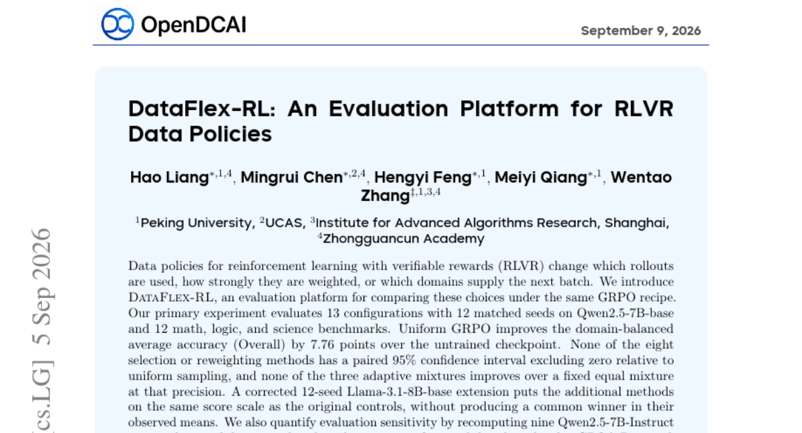

### 📌 한 줄 요약
RLVR 학습 시 데이터 선택 및 가중치 정책이 성능 향상에 미치는 영향이 미미함을 입증한 벤치마크 연구

### 🔑 핵심 포인트
- RLVR 학습을 위한 데이터 선택 및 가중치 정책 비교 플랫폼 'DataFlex-RL' 제안
- 다양한 데이터 정책(선택, 재가중치, 적응형 혼합 등)이 균등 샘플링 대비 성능 우위를 확보하지 못함을 확인
- 평가 벤치마크 구성(도메인 균형 여부)에 따른 모델 순위 변동성(민감도) 정량화

### 🧑‍💻 개발자 관점
RLVR 기반 모델 학습 시 복잡한 데이터 필터링/가중치 전략을 설계하는 것보다 균등한 데이터 배분이 더 안정적이고 효과적일 수 있음을 시사합니다.

### 🚀 실무 적용 아이디어
- 학습 시 복잡한 데이터 선택 알고리즘 대신 균등 샘플링(Uniform sampling)을 베이스라인으로 설정하기
- 평가 시 특정 도메인에 편향되지 않도록 다양한 벤치마크를 포함한 균형 잡힌 평가 셋 구성하기
- 데이터 정책 변경이 실제 성능 향상으로 이어지는지 통계적 유의성을 엄격히 검증하기

### ⚠️ 리스크/한계
- 제시된 데이터 정책들이 균등 샘플링 대비 확실한 우위를 점하지 못함
- 평가 벤치마크 구성에 따라 결과가 달라질 수 있는 민감도 문제 존재

### 📝 초록 기반 상세 설명
검증 가능한 보상을 사용하는 강화학습(RLVR)에서 어떤 롤아웃 데이터를 학습에 사용할지 결정하는 데이터 정책의 중요성이 커지고 있습니다. 본 논문은 GRPO 레시피 하에서 다양한 데이터 정책을 비교할 수 있는 평가 플랫폼인 DataFlex-RL을 제안합니다. 연구진은 Qwen2.5-7B-Base 모델을 사용하여 13가지 설정과 12개의 벤치마크를 통해 실험을 진행했습니다. 실험 결과, 특정 데이터 선택이나 재가중치 방식이 균등 샘플링(Uniform sampling)보다 압도적으로 우수함을 증명하지 못했습니다. 또한 평가 벤치마크 구성에 따라 순위가 크게 달라지는 민감도 문제도 확인되었습니다. 결론적으로 데이터 정책 변경이 학습 과정에는 영향을 주지만, 균등 학습 대비 재현 가능한 성능 향상을 이끌어내지는 못했습니다.

---

## 2. [Feyospace-v1: How the Cyber Mercury Seven Trained Frontier Cyber Models](https://huggingface.co/papers/2609.08418)
**Upvotes**: 74 | **도입 난이도**: 상 | **신뢰도**: 상
**arXiv**: https://arxiv.org/abs/2609.08418

**태그**: Cybersecurity, Agent, Data-Centric, Fine-tuning, RAG, Reasoning, Vision

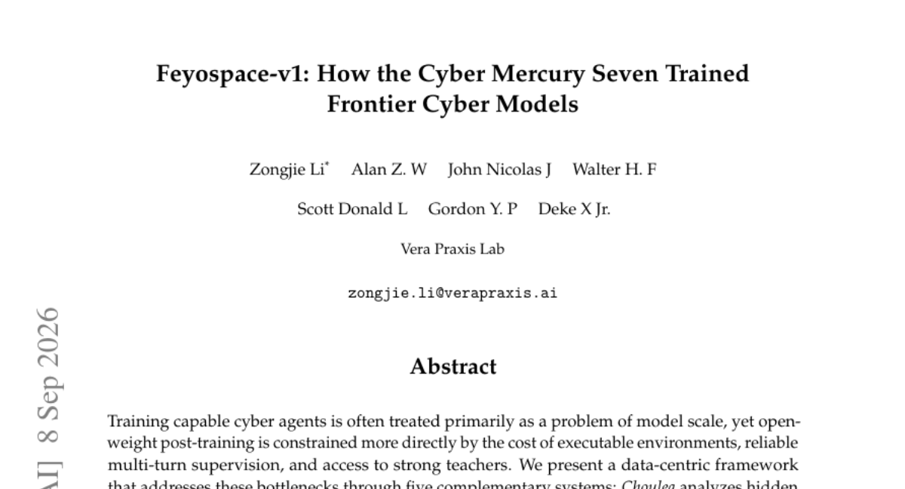

### 📌 한 줄 요약
소규모 팀이 데이터 중심 프레임워크를 통해 최상위 수준의 사이버 보안 에이전트 모델을 구축하는 방법론 제시

### 🔑 핵심 포인트
- 실행 환경 비용 및 교사 모델 의존성 문제를 해결하는 5가지 데이터 중심 프레임워크 제안
- 실행 검증 및 증거 감사를 거친 164,269개의 고품질 훈련용 궤적 데이터 구축
- 소규모 팀이 구축한 오픈 웨이트 모델이 동급 파라미터 규모에서 최고 성능 달성

### 🧑‍💻 개발자 관점
모델 크기보다 데이터 생성 파이프라인과 실행 가능한 환경 구축이 에이전트 성능에 결정적임을 보여줍니다.

### 🚀 실무 적용 아이디어
- 에이전트 학습을 위한 격리된 실행 환경(Sandboxed Environment) 구축 전략 검토
- 모델 병합 시 발생하는 성능 저하를 방지하기 위한 PSBreakup 방식의 영향 분석
- 전문가 개입을 학습 데이터로 변환하는 데이터 엔지니어링 파이프라인 설계

### ⚠️ 리스크/한계
- 실행 가능한 환경 구축 및 유지 관리에 따르는 높은 인프라 비용
- 특정 도메인(사이버 보안)에 특화된 데이터로 인해 범용적 추론 능력이 제한될 가능성

### 📝 초록 기반 상세 설명
사이버 보안 에이전트 학습은 모델 규모뿐만 아니라 실행 환경 비용, 신뢰할 수 있는 감독, 강력한 교사 모델 확보라는 제약에 직면해 있습니다. 본 논문은 이러한 병목 현상을 해결하기 위해 다섯 가지 상호 보완적인 시스템(Choulea, SkyReal, Hongzwang, PSBreakup, Kreator)으로 구성된 데이터 중심 프레임워크를 제안합니다. 이 프레임워크는 코딩, 취약점 분석, CTF, 커널, 펌웨어 등 다양한 실행 환경에서 검증된 164,269개의 고품질 궤적 데이터를 생성합니다. 실험 결과, 제안된 체크포인트들은 기존 모델 대비 사이버 보안 벤치마크에서 유의미한 성능 향상을 보였으며, 특히 파라미터 규모 대비 최고 성능을 기록했습니다. 이는 소규모 독립 팀이 오픈 웨이트 모델로도 선도적인 에이전트 역량을 확보할 수 있음을 입증한 사례입니다.

---

## 3. [Benchmark Radar: A Living Database and Search Engine for AI Benchmarks and Evaluation](https://huggingface.co/papers/2609.11115)
**Upvotes**: 72 | **도입 난이도**: 하 | **신뢰도**: 상
**arXiv**: https://arxiv.org/abs/2609.11115

**태그**: LLM, Evaluation, Benchmark, Data Engineering, MLOps, Agent, RAG, Reasoning, Safety

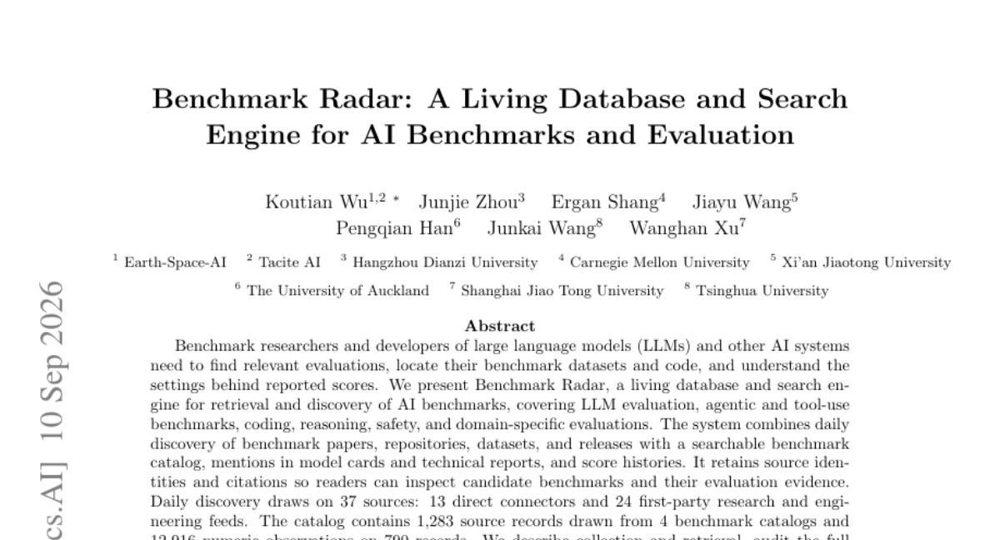

### 📌 한 줄 요약
AI 모델 평가의 파편화를 해결하기 위해 벤치마크 데이터셋, 코드, 점수 이력을 통합 관리하는 실시간 검색 엔진 및 데이터베이스 시스템입니다.

### 🔑 핵심 포인트
- LLM, 에이전트, 코딩, 안전성 등 다양한 분야의 벤치마크를 통합하는 실시간 검색 엔진 구축
- 논문, 코드, 데이터셋, 모델 카드 언급 및 점수 이력을 연결하는 신뢰 가능한 출처 관리
- 벤치마크 포화도, 채택 트렌드, 점수 비교의 한계를 분석할 수 있는 분석 도구 제공

### 🧑‍💻 개발자 관점
새로운 모델을 개발하거나 평가할 때, 기존 벤치마크의 신뢰성을 검증하고 중복되거나 포화된 평가를 피하며 최적의 평가 세트를 선택하는 데 도움을 줍니다.

### 🚀 실무 적용 아이디어
- 제공되는 웹 대시보드를 통해 최신 벤치마크 트렌드 및 포화도 확인하기
- CLI를 활용하여 오프라인 환경에서 특정 도메인의 벤치마크 데이터 추출하기
- 새로운 모델 평가 설계 시 Benchmark Radar의 Pareto frontier 뷰를 통해 효율성 검토하기

### ⚠️ 리스크/한계
- 자동화된 수집 과정에서 소스 데이터의 품질이나 편향이 포함될 가능성
- 벤치마크 점수 자체가 모델의 실제 성능을 완벽히 대변하지 못하는 문제

### 📝 초록 기반 상세 설명
LLM 및 AI 시스템 개발자들은 수많은 평가 지표와 데이터셋 사이에서 신뢰할 수 있는 벤치마크를 찾는 데 어려움을 겪고 있습니다. 이를 해결하기 위해 연구자와 개발자를 위한 실시간 데이터베이스 및 검색 엔진인 'Benchmark Radar'를 제안합니다. 이 시스템은 37개의 소스를 통해 매일 새로운 논문, 저장소, 데이터셋을 수집하며 모델 카드 및 기술 보고서의 언급 내용까지 포함하는 통합 카탈로그를 구축합니다. 결과적으로 1,283개의 소스 레코드와 12,916개의 수치 관측치를 포함하는 방대한 데이터베이스를 구축하였으며, 벤치마크 포화도 및 채택 트렌드를 분석할 수 있는 대시보드와 CLI를 제공합니다.

### 🖼️ 추가 자료
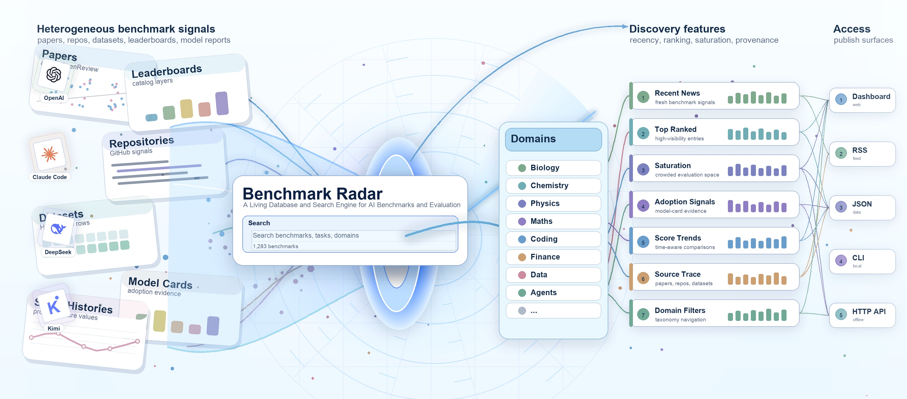
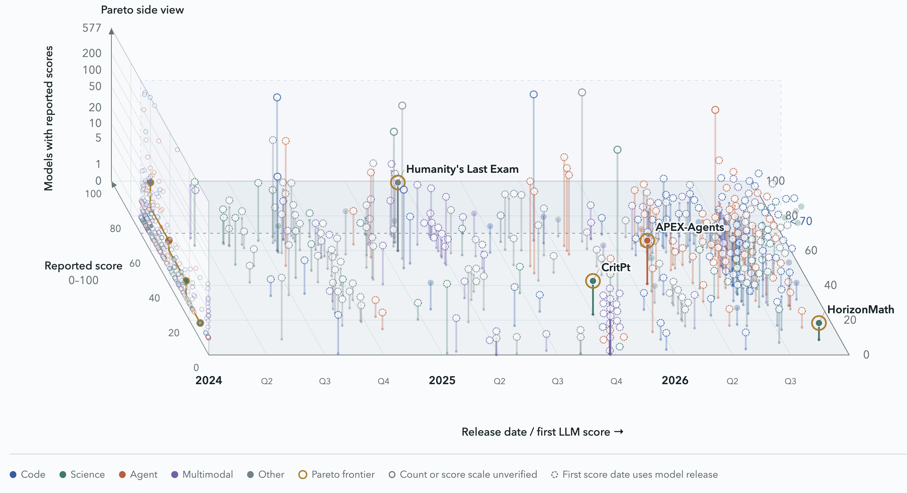
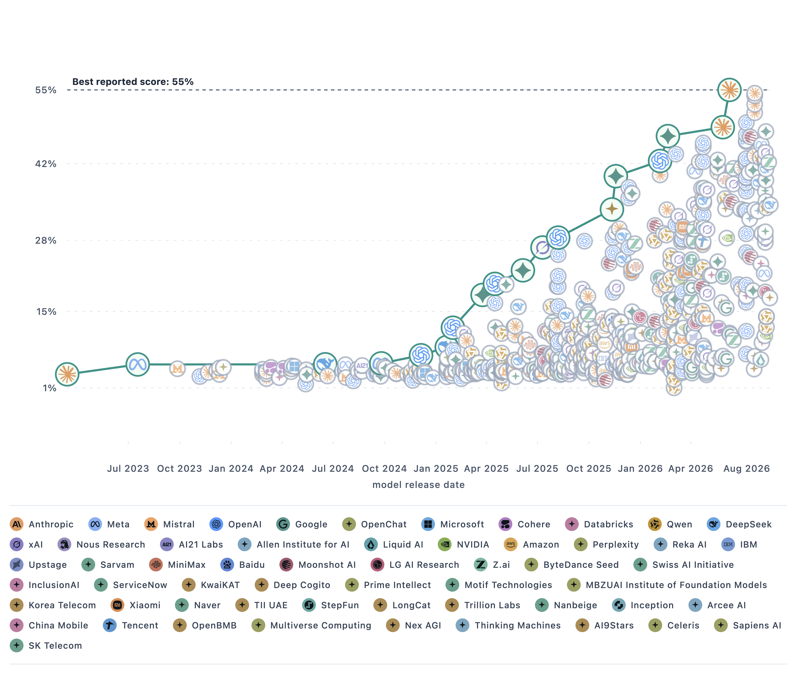
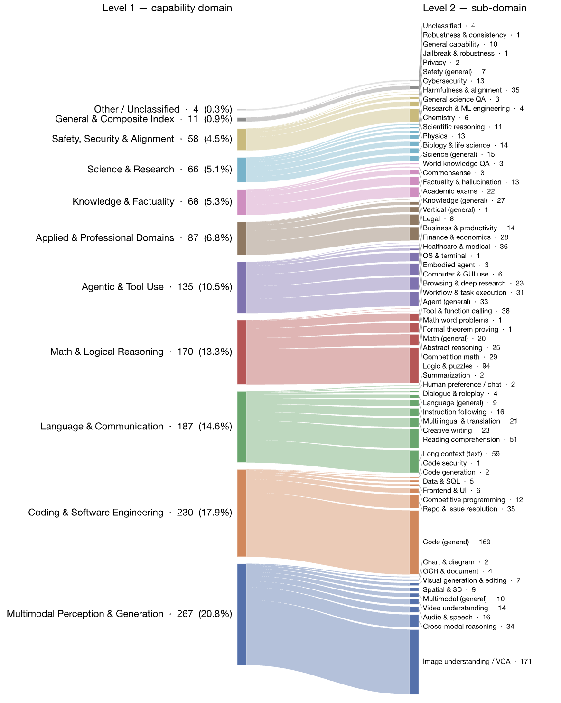

---

## 4. [Breaking the Vision-Action Shortcut: Latent Interface Training for Generalizable Robotics Foundation Models](https://huggingface.co/papers/2609.12641)
**Upvotes**: 62 | **도입 난이도**: 중 | **신뢰도**: 상
**arXiv**: https://arxiv.org/abs/2609.12641

**태그**: Robotics, Foundation Models, Generalization, Computer Vision, RAG, Vision, Evaluation

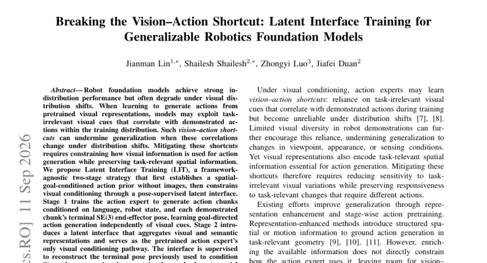

### 📌 한 줄 요약
시각적 편향(Shortcut)을 방지하기 위해 공간 정보와 시각 정보를 분리 학습하여 로봇 모델의 일반화 성능을 높이는 프레임워크

### 🔑 핵심 포인트
- 시각적 단서에 의존하는 Shortcut 현상을 방지하기 위한 2단계 학습 전략 제안
- 이미지 없이 목표 포즈를 조건으로 액션 전문가를 먼저 학습하여 공간적 목표를 내재화
- 포즈 감독(Pose-supervised) 잠재 인터페이스를 통해 시각 정보가 목표 관련 정보만 추출하도록 제약

### 🧑‍💻 개발자 관점
로봇 모델 학습 시 데이터셋의 배경이나 조명 같은 노이즈가 액션 생성에 영향을 미치는 문제를 구조적으로 해결하는 방법을 제시합니다.

### 🚀 실무 적용 아이디어
- 기존 VLA 모델에 목표 포즈(SE(3))를 조건으로 하는 액션 전문가를 분리하여 학습해보기
- 시각적 특징이 목표 포즈를 재구성하도록 유도하는 손실 함수(Loss) 적용 실험
- 학습 데이터와 다른 카메라 각도/조명 환경에서의 성능 변화 측정

### ⚠️ 리스크/한계
- 목표 포즈(End-effector pose) 정보가 정확히 주어지지 않는 환경에서의 적용 한계
- 2단계 학습 과정에서 시각 정보와 액션 정보 간의 균형 조절 필요성

### 📝 초록 기반 상세 설명
로봇 파운데이션 모델은 학습 데이터 내의 부적절한 시각적 단서에 의존하는 'vision-action shortcut' 문제로 인해 분포 변화 시 성능이 급격히 저하됩니다. 이를 해결하기 위해 제안된 Latent Interface Training(LIT)은 두 단계의 전략을 사용합니다. 1단계에서는 이미지 없이 언어와 로봇 상태, 목표 포즈만을 사용하여 목표 지향적 액션 전문가를 학습합니다. 2단계에서는 시각 정보가 오직 목표 포즈를 재구성하는 데만 쓰이도록 제약하는 잠재 인터페이스를 도입합니다. 실험 결과, 다양한 VLA 아키텍처에서 성공률을 크게 향상시켰으며 특히 조명이나 카메라 위치 변화와 같은 미학습 환경에서 강력한 일반화 성능을 입증했습니다.

---

## 5. [SAS: Simple Attention Sparsification via End-to-End Optimization of Context Ranking](https://huggingface.co/papers/2609.13141)
**Upvotes**: 50 | **도입 난이도**: 중 | **신뢰도**: 상
**arXiv**: https://arxiv.org/abs/2609.13141

**태그**: Efficiency, Long-Context, Transformer, Optimization, Agent, RAG, Reasoning, Distillation, Safety

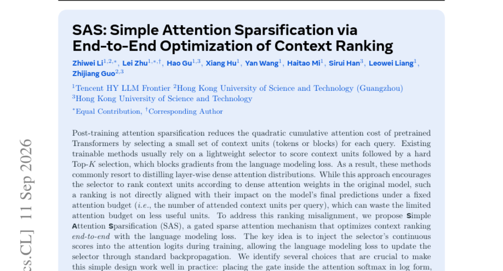

### 📌 한 줄 요약
학습 시 어텐션 스코어를 로짓에 직접 주입하여 제한된 예산 내에서 최적의 컨텍스트 순위를 결정하는 효율적인 희소 어텐션 기법

### 🔑 핵심 포인트
- 선택기 점수를 어텐션 로짓에 직접 주입하여 언어 모델링 손실과 순위 결정 로직을 정렬
- 로그 형태의 소프트맥스 게이트 및 정규화된 게이트를 통한 효율적인 컨텍심 순위 최적화
- FlashAttention 스타일의 메모리 효율적인 Triton 커널 구현을 통한 대규모 시퀀스 지원

### 🧑‍💻 개발자 관점
제한된 컴퓨팅 자원(Top-K 예산) 내에서 모델의 성능 저하를 최소화하며 긴 문맥을 처리할 수 있는 실용적인 최적화 기법입니다.

### 🚀 실무 적용 아이디어
- 기존 Top-K 기반 희소 어텐션 모델에 SAS의 게이트 주입 방식 적용 테스트
- 다양한 컨텍스트 길이와 제한된 K값(Budget) 설정에 따른 성능 변화 측정
- Triton 커널을 활용한 실제 추론 속도 및 메모리 사용량 벤치마크 수행

### ⚠️ 리스크/한계
- 학습 시 로짓에 직접 개입하므로 기존 사전 학습 모델의 안정적인 미세 조정(Fine-tuning) 필요
- 매우 타이트한 예산 설정 시 정보 손실로 인한 성능 급락 가능성

### 📝 초록 기반 상세 설명
사전 학습된 트랜스포머의 연산 비용을 줄이기 위해 일부 컨텍스트만 선택하는 어텐션 희소화(Sparsification) 연구가 활발합니다. 기존의 학습 가능한 방식은 선택기와 원래 모델의 어텐션 가중치 간의 불일치로 인해 제한된 예산 내에서 최적의 컨위치를 선정하지 못하는 문제가 있었습니다. 이를 해결하기 위해 SAS(Simple Attention Sparsification)는 선택기의 점수를 어텐션 로짓에 직접 주입하여 언어 모델링 손실을 통해 순위 결정 로직을 엔드투엔드로 최적화합니다. 특히 소프트맥스 게이트를 로그 형태로 적용하고 현재 블록과 과거 컨텍스트 간의 균형을 맞추는 설계를 도입했습니다. 실험 결과, SAS는 추론 및 롱 컨텍스트 작업에서 기존 방식보다 우수한 성능을 보였으며 특히 제한된 예산 환경에서 효과적이었습니다.

---

## 6. [COBRA-Skills: Contextual Bandit-Guided Evolution for Agent Skill Optimization](https://huggingface.co/papers/2609.11682)
**Upvotes**: 29 | **도입 난이도**: 중 | **신뢰도**: 상
**arXiv**: https://arxiv.org/abs/2609.11682

**태그**: LLM-Agent, Optimization, Reinforcement-Learning, Efficiency, Agent, RAG, Benchmark, Evaluation, Distillation

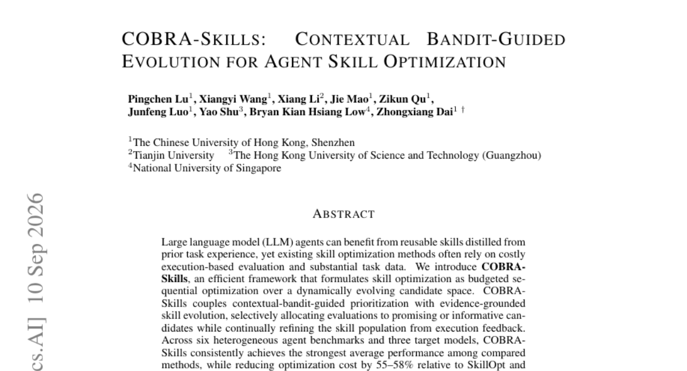

### 📌 한 줄 요약
최소한의 실행 비용과 데이터로 에이전트의 재사용 가능한 기술(Skill)을 최적화하는 효율적인 프레임워크

### 🔑 핵심 포인트
- 컨텍스추얼 밴딧을 활용한 효율적인 평가 자원 배분 및 우선순위 지정
- 실행 피드백을 통한 동적 후보군 진화 및 증거 기반 기술 정교화
- 최소한의 데이터(50개 예시)와 낮은 비용으로 고성능 에이전트 기술 확보

### 🧑‍💻 개발자 관점
에이전트 개발 시 발생하는 막대한 추론/실행 비용을 줄이면서도, 적은 데이터로도 특정 작업에 특화된 고성능 스킬을 자동 생성할 수 있습니다.

### 🚀 실무 적용 아이디어
- 기존 SkillOpt 방식과 비용 대비 성능(ROI) 비교 실험
- 매우 적은 데이터셋(50개 미만) 환경에서의 성능 하락 폭 테스트
- 타겟 모델이 직접 스킬을 생성/정제할 때의 안정성 검증

### ⚠️ 리스크/한계
- 초기 후보군 생성 단계에서의 품질이 전체 최적화 성능에 영향을 줄 가능성
- 복잡한 에이전트 환경(Harness) 변화에 따른 장기적 일반화 성능 검증 필요

### 📝 초록 기반 상세 설명
LLM 에이전트는 이전 작업 경험에서 추출한 재사용 가능한 기술을 통해 성능을 높일 수 있지만, 기존 방식은 비용이 많이 드는 실행 기반 평가와 방대한 데이터에 의존하는 문제가 있었습니다. 본 논문은 기술 최적화를 동적으로 진화하는 후보 공간에서의 예산 기반 순차적 최적화 문제로 정의하는 COBRA-Skills 프레임워크를 제안합니다. 이 프레임워크는 컨텍스추얼 밴딧(Contextual Bandit) 기반의 우선순위 지정과 증거 기반 기술 진화 기법을 결합하여, 유망한 후보에 평가를 선택적으로 할당하면서 실행 피드백을 통해 기술 집단을 지속적으로 정교화합니다. 실험 결과, COBRA-Skills는 6개의 다양한 벤치마크에서 최고 성능을 달성하면서도 기존 SkillOpt 대비 최적화 비용을 55~58% 절감했습니다. 또한 단 50개의 고유 최적화 예시만으로도 강력한 성능을 보여주며 에이전트 환경 변화에도 견고함을 입증했습니다.

### 🖼️ 추가 자료
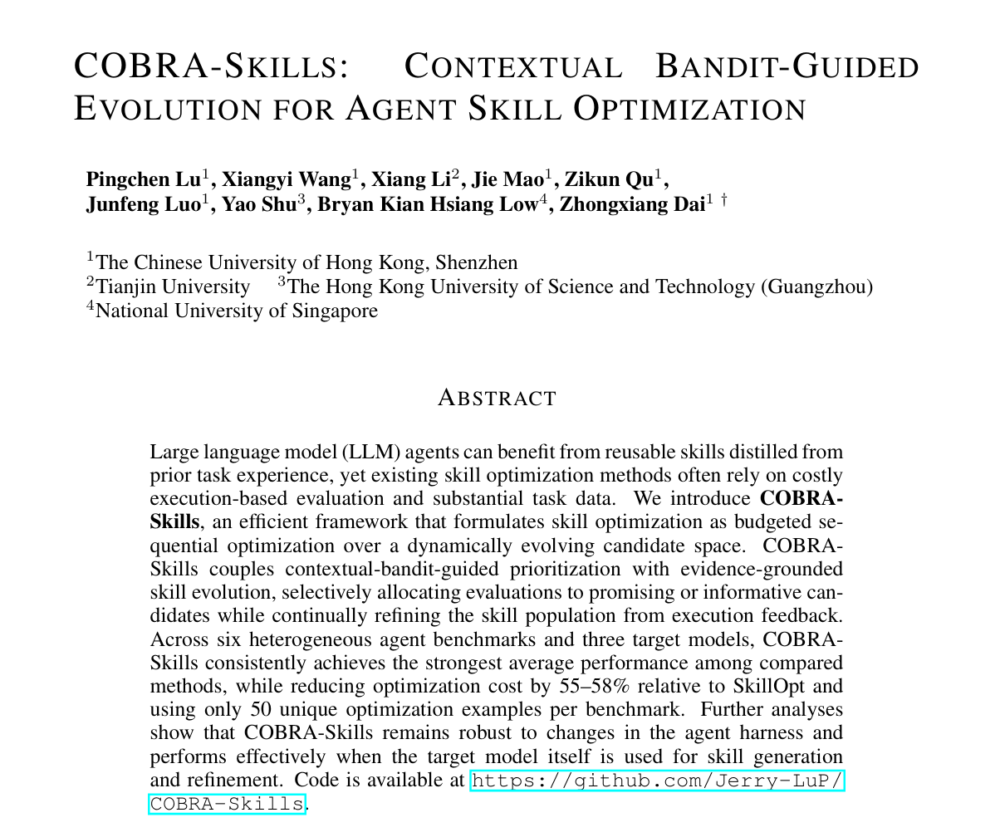

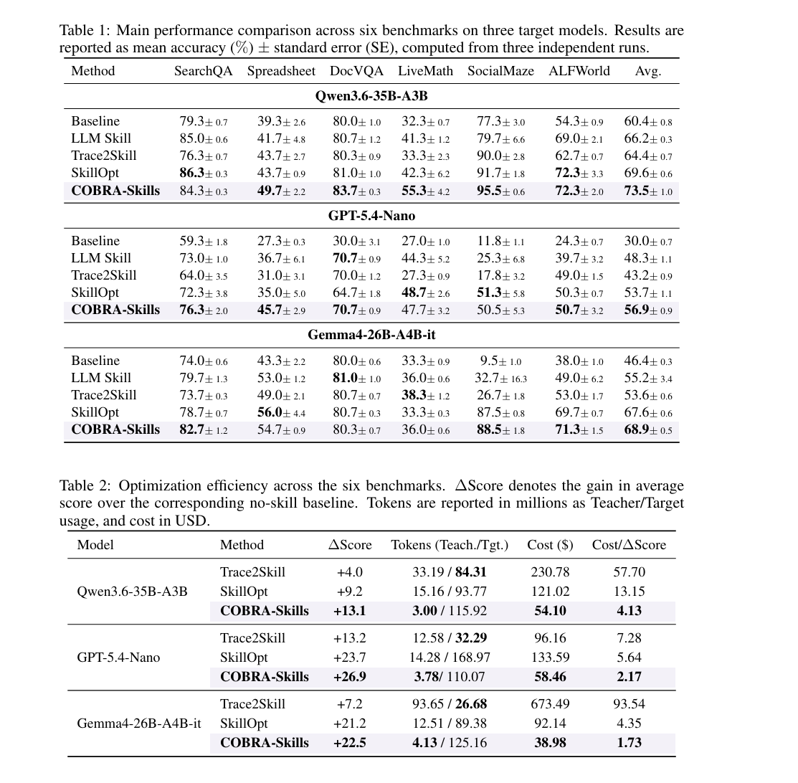
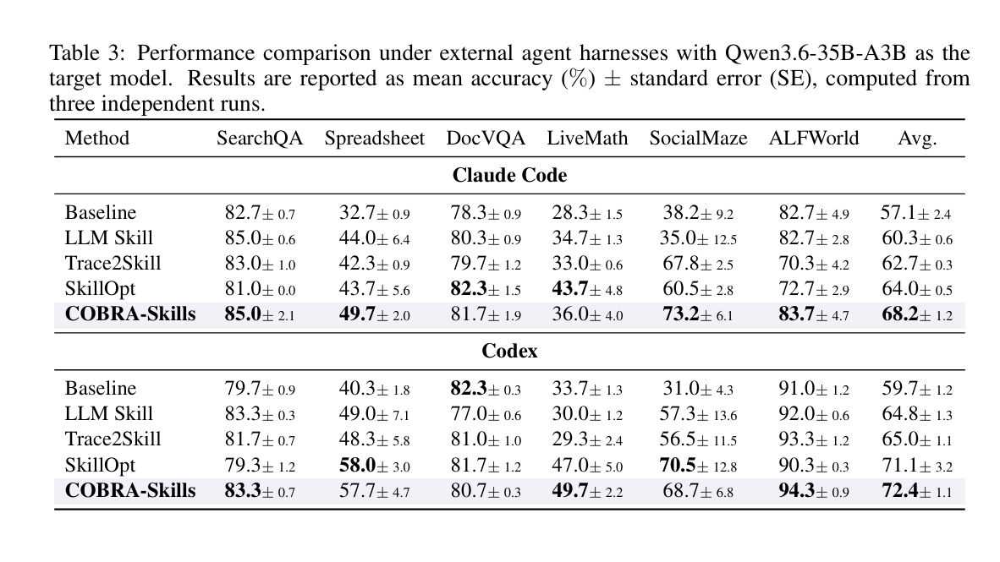
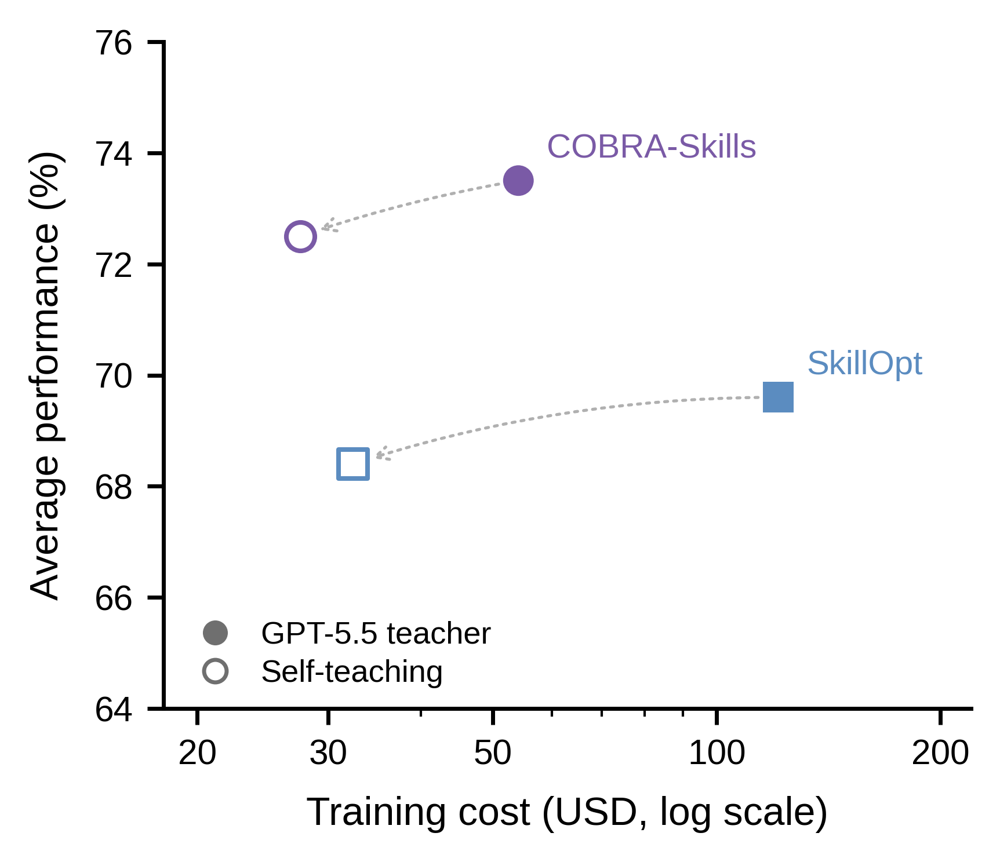
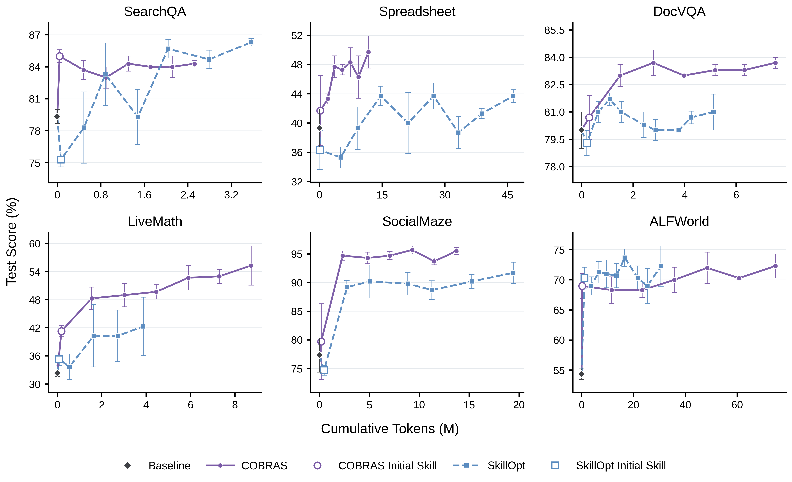
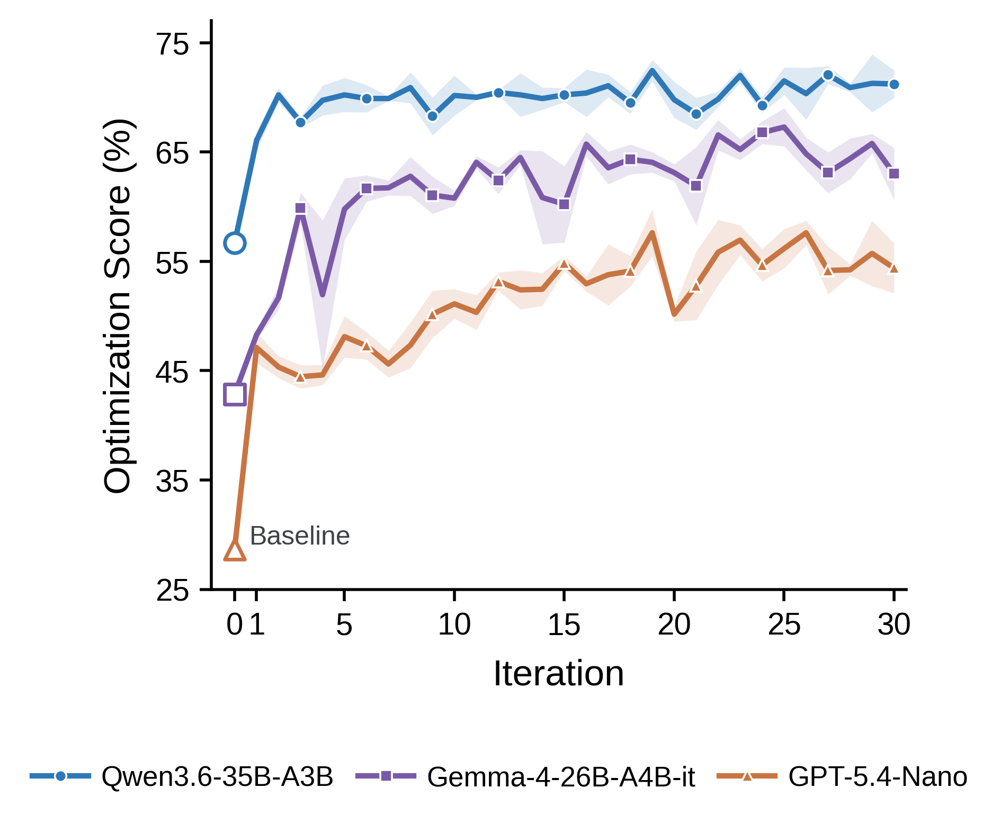

---

## 7. [StepAudio 3 Gen Technical Report](https://huggingface.co/papers/2609.12945)
**Upvotes**: 28 | **도입 난이도**: 상 | **신뢰도**: 상
**arXiv**: https://arxiv.org/abs/2609.12945

**태그**: Audio Generation, TTS, Autoregressive, LLM, Audio, Evaluation, Optimization

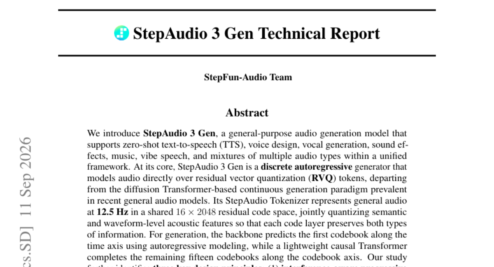

### 📌 한 줄 요약
RVQ 토큰 기반의 이산적 자기회귀 방식을 통해 TTS, 음악, 효과음을 통합 생성하는 범용 오디오 모델

### 🔑 핵심 포인트
- RVQ 토큰 기반의 이산적 자기회귀(Discrete Autoregressive) 생성 방식 채택
- 의미적/파형 정보를 동시에 보존하는 12.5Hz 공유 코드 공간 설계
- LLM의 텍스트 능력을 유지하는 간섭 방지 점진적 사전 학습(Interference-aware progressive pretraining)

### 🧑‍💻 개발자 관점
단일 모델로 음성, 음악, 효과음을 모두 처리할 수 있어 복합적인 오디오 콘텐츠 생성 파이프라인 구축 시 모델 복잡도를 획기적으로 낮출 수 있습니다.

### 🚀 실무 적용 아이디어
- 제공된 데모를 통해 다양한 오디오 믹스(음악+음성) 생성 품질 검증
- RVQ 기반 생성 방식과 기존 Diffusion 방식 간의 생성 속도 및 품질 비교
- 특정 도메인(예: 게임 효과음)에 대한 미세 조정 가능성 테스트

### ⚠️ 리스크/한계
- 이산적 토큰 생성 방식 특성상 발생할 수 있는 생성 품질의 불연속성
- 다양한 태스크를 하나의 모델에 담음에 따른 특정 도메인 성능 저하 가능성

### 📝 초록 기반 상세 설명
최근 오디오 생성 모델은 주로 확산 트랜스포머(Diffusion Transformer) 기반의 연속적 생성 방식을 사용합니다. 본 논문은 이를 탈피하여 RVQ 토큰 상에서 직접 모델링하는 이산적 자기회귀 생성 모델인 StepAudio 3 Gen을 제안합니다. 12.5Hz의 공유 코드 공간을 사용하는 StepAudio Tokenizer를 통해 의미적 정보와 파형 정보를 동시에 보존하며, 백본 모델과 경량 인과적 트랜스포머의 협업으로 16개의 코드북을 생성합니다. 간섭 방지 점진적 사전 학습과 RVQ 어댑터를 통해 텍스트 능력을 유지하면서도 다양한 오디오 태스크를 통합했습니다. 그 결과 TTS, 보이스 디자인, 음악 등 다양한 영역에서 SOTA 성능을 달립니 다.

---

## 8. [PLC-DPO: Posterior Label Correction in Noisy and Ambiguous Preference Optimization](https://huggingface.co/papers/2608.30597)
**Upvotes**: 23 | **도입 난이도**: 중 | **신뢰도**: 상
**arXiv**: https://arxiv.org/abs/2608.30597

**태그**: RLHF, DPO, Preference Optimization, Robust Learning, Vision, Benchmark, Safety

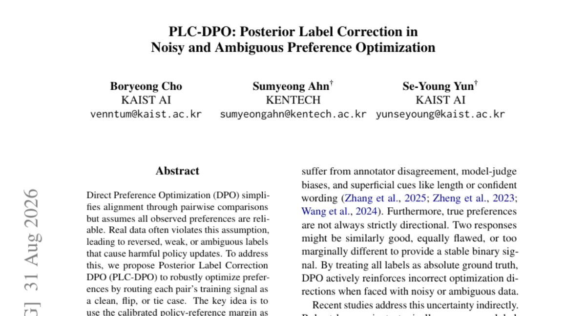

### 📌 한 줄 요약
노이즈가 포함된 선호도 데이터에서도 안정적인 정책 업데이트를 가능하게 하는 PLC-DPO 방법론 제안

### 🔑 핵심 포인트
- 정책-참조 모델 간의 마진(margin)을 온라인 증거로 활용하는 라벨 교정 메커니즘 도입
- 데이터를 Clean, Flip, Tie 세 가지 케이스로 라우팅하여 노이즈에 대응
- 단순 필터링이 아닌 학습 신호의 방향과 강도를 직접 조정하는 방식 채택

### 🧑‍💻 개발자 관점
데이터 정제 비용이 큰 RLHF 환경에서, 노이즈가 섞인 데이터셋을 그대로 사용하면서도 모델 성능 저하를 막을 수 있는 실용적인 대안을 제시합니다.

### 🚀 실무 적용 아이디어
- 기존 DPO 학습 데이터에 의도적으로 노이즈(Label Flip)를 섞어 성능 변화 관찰
- 모델 간 마진 값이 실제 데이터 품질과 얼마나 상관관계가 있는지 분석
- Tie(동등한 선호도) 케이스가 포함된 데이터셋에서의 학습 안정성 테스트

### ⚠️ 리스크/한계
- 마진 기반 라우팅이 잘못된 판단을 할 경우 잘못된 방향으로 학습이 가속화될 위험
- 모델의 정책 변화에 따라 마진 값이 변하므로 학습 과정 중 동적 안정성 확보 필요

### 📝 초록 기반 상세 설명
DPO는 쌍별 비교를 통해 정렬을 단순화하지만, 모든 데이터가 신뢰할 수 있다는 가정을 전제로 합니다. 그러나 실제 데이터에는 잘못된 라벨이나 모호한 선호도가 포함되어 있어 모델 업데이트에 악영향을 미칩니다. 이를 해결하기 위해 본 논문은 정책-참조 모델 간의 마진을 근거로 학습 신호를 정제, 반전 또는 무효화하는 PLC-DPO를 제안합니다. 이 방식은 단순히 의심스러운 데이터를 필터링하는 것을 넘어, 학습 방향과 강도를 능동적으로 교정합니다. 실험 결과, PLC-DPO는 기존 DPO 대비 높은 승률을 기록하며 노이즈와 모호한 데이터에 대한 강건함을 입증했습니다.

---

## 9. [Beyond Top-k Skill Retrieval: Diversity-Aware Skill Routing for LLM Agents](https://huggingface.co/papers/2609.05824)
**Upvotes**: 5 | **도입 난이도**: 중 | **신뢰도**: 상
**arXiv**: https://arxiv.org/abs/2609.05824

**태그**: LLM Agent, Skill Routing, Diversity-Aware, RAG, Agent, Benchmark, Evaluation

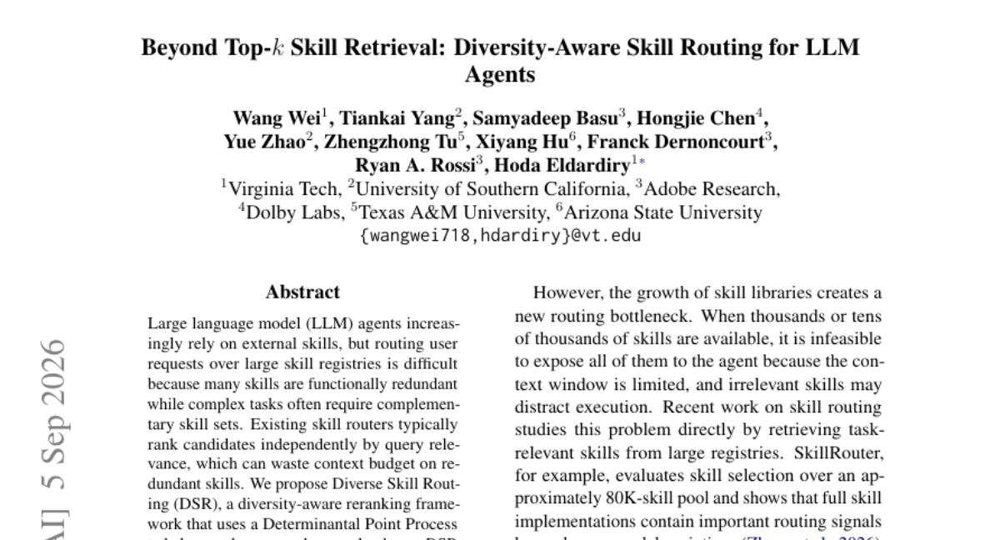

### 📌 한 줄 요약
단순 유사도 기반이 아닌, 중복을 피하고 상호 보완적인 스킬을 선택하는 다양성 기반 LLM 에이전트 라우팅 프레임워크 제안

### 🔑 핵심 포인트
- DPP(Determinantal Point Process)를 활용한 다양성 기반 스킬 재정렬 프레임워크 제안
- 쿼리 잔차 다양성 커널을 통해 중복 스킬은 배제하고 상호 보완적 스킬은 유지
- 단순 관련도 중심에서 '상호 보완적 세트 선택' 관점으로의 라우팅 패러다임 전환

### 🧑‍💻 개발자 관점
에이전트가 여러 도구를 사용할 때, 비슷한 기능의 도구만 골라 컨텍스트를 낭비하는 문제를 해결하여 효율적인 멀티 스킬 운용이 가능해집니다.

### 🚀 실무 적용 아이디어
- 기존 Top-k 스킬 선택 방식과 DsR 방식의 컨텍스트 효율성 비교 실험
- 다양한 도구(Tool) 라이브러리 환경에서 중복 스킬 제거 효과 검증
- 복합 작업(Multi-step task) 수행 시 스킬 조합의 커버리지 측정

### ⚠️ 리스크/한계
- DPP 연산 비용이 스킬 풀이 매우 커질 경우 계산 복잡도를 높일 수 있음
- 스킬 간의 기능적 유사도를 정의하는 커널 설계에 따라 성능 편차가 발생할 수 있음

### 📝 초록 기반 상세 설명
LLM 에이전트가 외부 스킬을 활용할 때, 기존의 Top-k 방식은 기능적으로 중복된 스킬을 선택하여 컨텍스트 예산을 낭비하는 문제가 있습니다. 복잡한 작업은 서로 보완적인 스킬 세트가 필요하지만, 기존 라우터는 각 스킬을 독립적인 관련성 기준으로만 평가하기 때문입니다. 본 논문은 Determinantal Point Process(DPP)를 활용하여 관련성과 비중복성 사이의 균형을 맞추는 Diverse Skill Routing(DsR) 프레임워크를 제안합니다. 특히 쿼리 잔차 다양성 커널을 도입하여, 단순한 쿼리 유사도로 인한 페널티는 줄이면서 기능적 중복은 효과적으로 억제합니다. 실험 결과, DsR은 기존 방식 대비 Recall과 Full Coverage를 개선했으며, 특히 다중 스킬이 필요한 쿼리에서 더 큰 성능 향상을 보였습니다.

---

## 10. [Online Learning with LLM Experts from Limited Feedback](https://huggingface.co/papers/2609.05820)
**Upvotes**: 5 | **도입 난이도**: 중 | **신뢰도**: 상
**arXiv**: https://arxiv.org/abs/2609.05820

**태그**: LLM, Routing, Multi-Agent, Reinforcement Learning

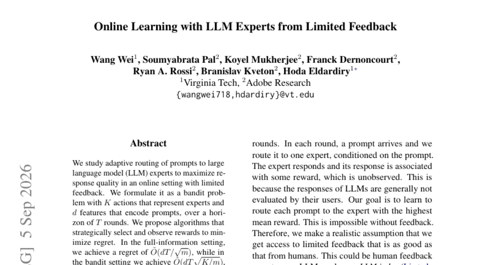

### 📌 한 줄 요약
제한된 피드백 환경에서 최적의 LLM 전문가 모델을 선택하는 효율적인 라우팅 알고리즘 연구

### 🔑 핵심 포인트
- 제한된 피드백 예산(m) 하에서의 효율적인 LLM 라우팅 알고리즘 제안
- 프롬프트 특징(d)과 전문가(K)를 고려한 밴딧 문제 프레임워크 구축
- Full-information 및 Bandit 설정 모두에서 이론적 후회(Regret) 상한 달성

### 🧑‍💻 개발자 관점
비용 효율적인 LLM 서비스를 구축할 때, 모든 요청에 대해 사람이 검수하거나 비싼 모델을 쓰는 대신 적은 피드백만으로 최적의 모델을 매칭하는 데 유용합니다.

### 🚀 실무 적용 아이디어
- 다양한 크기의 LLM(GPT-4, Llama-3 등)을 전문가로 설정한 라우팅 환경 구축
- 피드백 예산(m) 변화에 따른 라우팅 정확도 및 비용 절감 효과 측정
- 프롬프트 임베딩(d)이 라우팅 성능에 미치는 영향 분석

### ⚠️ 리스크/한계
- 피드백 예산이 극도로 적을 경우 초기 학습 단계에서의 성능 저하 가능성
- 프롬프트 특징 추출 방식에 따라 라우팅 성능이 크게 좌우될 수 있음

### 📝 초록 기반 상세 설명
다양한 LLM 전문가 모델이 존재하는 환경에서 응답 품질을 극대화하기 위한 적응형 라우팅 문제를 다룹니다. 피드백(보상)이 제한적인 온라인 환경에서 프롬프트 특징과 전문가 선택을 결합한 밴딧(Bandit) 문제로 정식화했습니다. 제안된 알고리즘은 전략적인 선택과 관찰을 통해 누적 후회(Regret)를 최소화하는 데 집중합니다. 실험 결과, 제한된 피드백 예산 내에서도 다양한 LLM 간의 고품질 라우팅 전략을 효율적으로 학습할 수 있음을 입증했습니다.

---

## 11. [SNAP3D: Physically Grounded 3D Parts for Assembly from a Single Image](https://huggingface.co/papers/2609.13146)
**Upvotes**: 3 | **도입 난이도**: 상 | **신뢰도**: 상
**arXiv**: https://arxiv.org/abs/2609.13146

**태그**: 3D Generation, Physics-based, Computer Vision, Digital Fabrication, Vision, Evaluation

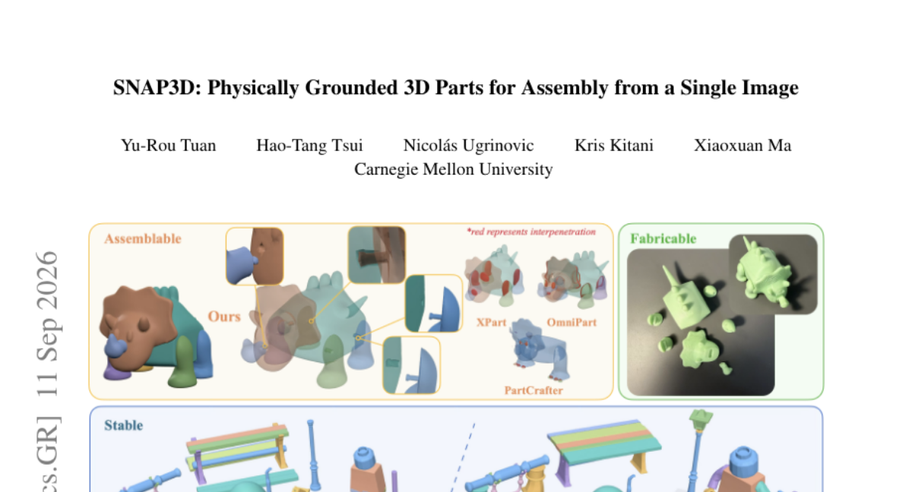

### 📌 한 줄 요약
단일 이미지로부터 물리적 결합과 조립이 가능한 정교한 3D 부품을 생성하는 프레임워크

### 🔑 핵심 포인트
- 물리 시뮬레이션 피드백을 통한 부품 간 간섭(Interpenetration) 해결
- 접촉 그래프 복구 및 매개변수화된 커넥터를 통한 안정적 연결 구조 설계
- 물리적 타당성과 중력 하의 안정성을 검증하는 새로운 평가 프로토콜 도입

### 🧑‍💻 개발자 관점
단순한 시각적 3D 모델링을 넘어, 실제 제조(3D 프린팅)나 로봇 시뮬레이션에 즉시 투입 가능한 수준의 조립 가능한 디지털 자산을 생성할 수 있습니다.

### 🚀 실무 적용 아이디어
- 생성된 3D 모델의 접촉면(Contact Surface) 데이터 구조 설계 방식 분석
- 물리 엔진(PyBullet, Isaac Gym 등)과 생성 모델 간의 피드백 루프 구현 실험
- 기존 3D 생성 모델(Shape-E 등)에 제안된 커넥터 모듈 결합 테스트

### ⚠️ 리스크/한계
- 복잡한 기하학적 구조에서 커넥터 최적화 시 원본 형상 왜곡 가능성
- 물리 시뮬레이션 연산 비용으로 인한 생성 속도 저하 우려

### 📝 초록 기반 상세 설명
기존의 3D 부품 생성 방식은 시각적으로는 완벽해 보이지만, 부품 간 간섭이나 연결부 부재로 인해 실제 조립이나 물리 시뮬레이션이 불가능한 문제가 있었습니다. 본 논문은 물리적 호환성과 안정적인 연결을 보장하는 물리 가이드 프레임워크를 제안합니다. 제안된 방법은 부품 간 침투 문제를 해결하고, 인접 부품 간의 접촉 그래프를 복구하며, 접촉면에 매개변수화된 커넥터를 도입합니다. 물리 시뮬레이션 피드백을 통해 기하학적 품질을 유지하면서도 커넥터의 위치, 방향, 크기를 최적화하여 조립 안정성을 높였습니다. 실험 결과, 기존 방식 대비 물리적 실현 가능성과 안정성이 크게 향상되었으며 3D 프린팅을 통한 실물 조립 검증까지 완료했습니다.

---

## 12. [Studying Without a Syllabus: Task-Agnostic Environment Preprocessing](https://huggingface.co/papers/2609.10824)
**Upvotes**: 3 | **도입 난이도**: 중 | **신뢰도**: 상
**arXiv**: https://arxiv.org/abs/2609.10824

**태그**: LLM Agent, Environment Preprocessing, Meta-Learning, Efficiency, Agent, Vision, Benchmark, Evaluation

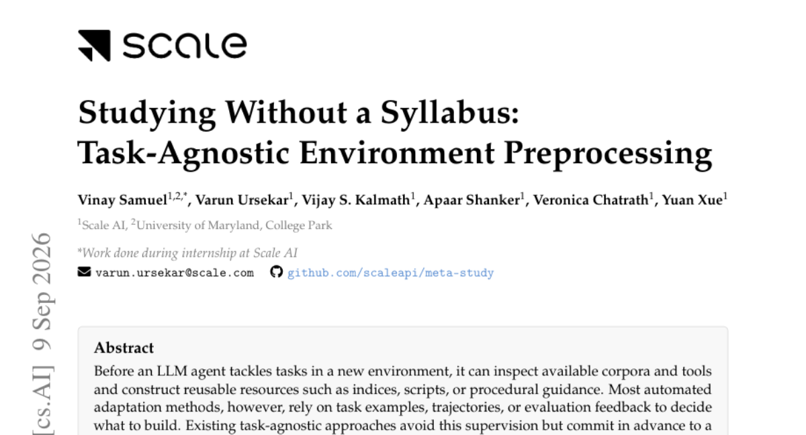

### 📌 한 줄 요약
사전 작업 정보 없이 환경을 탐색하여 재사용 가능한 리소스를 구축하는 태스크 불가지론적(Task-Agnostic) 환경 전처리 프레임워크 연구

### 🔑 핵심 포인트
- 작업 정보가 없는 상태에서 환경을 탐색하고 준비하는 '태스크 불가지론적 전처리' 프레임워크 제안
- 에이전트가 스스로 준비 전략을 결정하는 메타 에이전트 방식이 고정된 방식보다 우수한 성능 입증
- 사전 학습(Study phase)을 통해 테스트 시 필요한 샘플링 횟수를 줄이는 효율적 계산 전이 효과 확인

### 🧑‍💻 개발자 관점
에이전트가 실전에 투입되기 전, 환경의 데이터나 도구를 미리 구조화하여 추론 비용과 시간을 절약하는 전략적 워크플로우를 설계할 수 있습니다.

### 🚀 실무 적용 아이디어
- 고정된 RAG 인덱스 생성 대신, 에이전트가 스스로 인덱스 구조를 설계하게 하는 실험 진행
- 제한된 예산(Budget) 내에서 탐색 시간과 성능 간의 트레이드오프 분석
- 다양한 도구(Tool)가 포함된 환경에서 생성된 스크립트의 재사용성 테스트

### ⚠️ 리스크/한계
- 학습 예산(Study budget)을 늘린다고 해서 반드시 성능이 비례하여 향상되지는 않음
- 매우 거대한 코퍼스 환경에서는 자동화된 메타 에이전트보다 고정된 처리 방식이 더 효율적일 수 있음

### 📝 초록 기반 상세 설명
LLM 에이전트가 새로운 환경에 투입되기 전, 가용 데이터와 도구를 활용해 인덱스나 스크립트 같은 재사용 가능한 자원을 구축하는 것이 중요합니다. 기존 방식은 특정 작업 예시나 피드백에 의존하거나, 특정 환경 유형에 맞춘 고정된 준비 전략을 사용하는 한계가 있었습니다. 본 연구는 작업 분포를 모르는 상태에서 에이전트가 스스로 준비 전략을 결정하는 '실라버스 없는 학습(Studying Without a Syllabus)' 환경을 제안합니다. 연구진은 예산 범위 내에서 환경을 탐색하고 결과물을 생성하는 메타 에이전트 방식을 제안하고 6개 벤치마크에서 검증했습니다. 실험 결과, 메타 에이전트 방식이 대부분의 벤치마크에서 우수한 성능을 보였으며, 준비된 아티팩트가 테스트 시 샘플링 비용을 줄여준다는 것을 입증했습니다.

---

## 13. [Ambient @ EgoProactive 2026 : Proactive Egocentric Assistance with Visually Grounded Supervision](https://huggingface.co/papers/2609.07099)
**Upvotes**: 2 | **도입 난이도**: 하 | **신뢰도**: 상
**arXiv**: https://arxiv.org/abs/2609.07099

**태그**: Agent, Egocentric-Vision, Data-Augmentation, Classification, Vision, Video

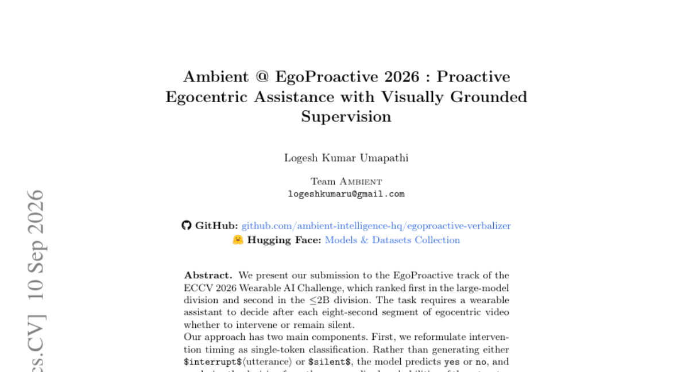

### 📌 한 줄 요약
시각적 근거를 활용한 토큰 분류 방식의 에고센트릭(Egocentric) 능동형 어시스턴스 최적화 기법

### 🔑 핵심 포인트
- 개입 여부 결정을 'yes/no' 단일 토큰 분류 문제로 재정의하여 성능 향상
- 비디오 에이전트를 활용한 시각적 근거(Visual Grounding) 기반의 데이터 증강
- 단순 텍스트 생성보다 시각적 맥락이 포함된 감독(Supervision)의 중요성 확인

### 🧑‍💻 개발자 관점
에이전트가 사용자에게 개입할 시점을 결정할 때, 복잡한 생성 모델 대신 가벼운 분류 모델로 전환하여 효율성을 높이는 실무적 전략을 제시합니다.

### 🚀 실무 적용 아이디어
- 자유 형식 생성 모델을 Yes/No 분류 모델로 변환하여 성능 비교 실험
- LLM/VLM 에이전트를 활용한 합성 데이터 생성 파이프라인 구축
- 데이터 양(Volume)과 시각적 정밀도(Precision) 간의 트레이드오프 분석

### ⚠️ 리스크/한계
- 단일 토큰 분류 방식이 복잡한 상황적 맥락을 모두 담지 못할 위험
- 에이전트가 생성한 합성 데이터의 편향이 모델에 전이될 가능성

### 📝 초록 기반 상세 설명
웨어러블 AI를 위한 에고센트릭 비디오 기반의 능동형 개입 여부 결정 과제를 해결하고자 합니다. 기존의 자유 형식 생성 방식은 모델의 결정 효율성을 저해하는 문제가 있었습니다. 본 연구에서는 개입 타이밍을 단일 토큰 분류 문제로 재정의하여 의사결정 구조를 단순화했습니다. 또한, 부족한 학습 데이터를 보완하기 위해 비디오 에이전트를 활용한 시각적 근거 기반의 자동 라벨링 방식을 도입했습니다. 실험 결과, 단순 텍스트 생성보다 시각적 근거를 활용한 방식이 성능과 전이 학습 측면에서 우수함을 입증했습니다.

---

## 14. [Ambient @ EgoLongQA 2026: Distilling Long-Video perception into a Sub-2B Model](https://huggingface.co/papers/2609.07154)
**Upvotes**: 2 | **도입 난이도**: 중 | **신뢰도**: 상
**arXiv**: https://arxiv.org/abs/2609.07154

**태그**: Knowledge Distillation, Video QA, Model Pruning, Edge AI, Agent, Vision, Video, Distillation

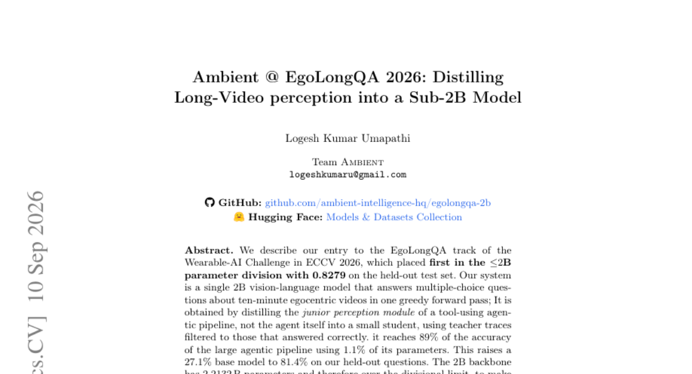

### 📌 한 줄 요약
에이전트 파이프라인의 지각 모듈을 증류(Distillation)하여 2B 미만 소형 모델로 고성능 비디오 질의응답 성능을 구현함

### 🔑 핵심 포인트
- 에이전트 파이프라인의 지각 모듈을 소형 모델로 정교하게 증류(Distillation)
- 정답 데이터로 필터링된 교사 추적(Teacher traces)을 활용한 효율적 학습
- 임베딩 테이블 프루닝을 통한 파라미터 수 최적화 및 규정 준수

### 🧑‍💻 개발자 관점
거대 모델의 복잡한 에이전트 로직을 소형 모델에 압축하여, 온디바이스 환경에서도 강력한 비디오 인지 성능을 확보할 수 있는 방법론을 제시합니다.

### 🚀 실무 적용 아이디어
- 에이전트의 추론 경로 중 정답 데이터만 추출하여 소형 모델을 학습시키는 워크플로우 구축
- 특정 도메인에 특화된 임베딩 테이블 프루닝 기법 적용 실험
- 지각 모듈 분리형 증류 방식과 전체 모델 증류 방식의 성능 비교

### ⚠️ 리스크/한계
- 에이전트의 도구 사용 능력(Tool-use) 등 고차원 추론 능력은 소형 모델로 완전히 이전되지 않을 수 있음
- 필터링된 데이터에 의존하므로 학습 데이터 편향 발생 가능성

---

## 15. [TRACE: Trajectory-robust Admission with Evidence Ordering for Efficient GUI Agents](https://huggingface.co/papers/2609.10297)
**Upvotes**: 2 | **도입 난이도**: 중 | **신뢰도**: 상
**arXiv**: https://arxiv.org/abs/2609.10297

**태그**: Agent, Vision, Efficiency, GUI, RAG, Benchmark, Inference

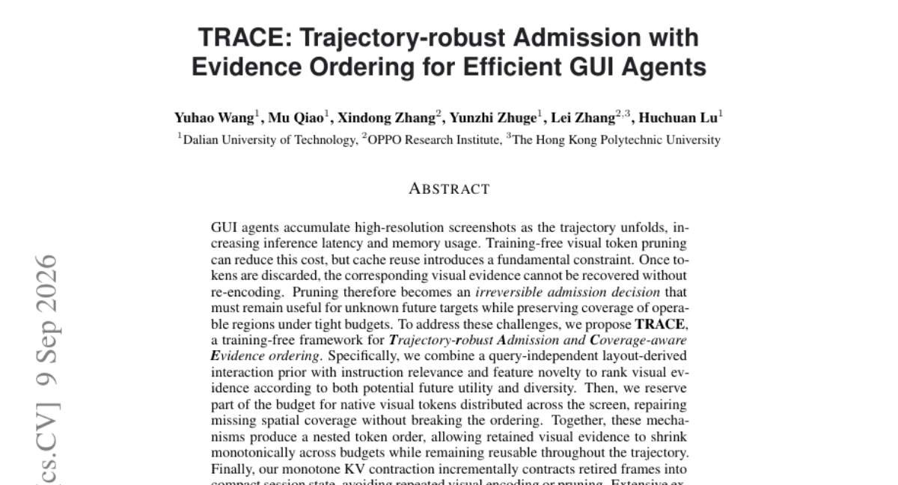

### 📌 한 줄 요약
GUI 에이전트의 추론 비용 절감을 위해 시각적 증거의 유효성과 공간 커버리지를 동시에 보존하는 효율적인 토큰 프루닝 프레임워크

### 🔑 핵심 포인트
- 레이아웃 우선순위와 지시문 관련성을 결합한 트래젝터리 강건형 증거 순위 지정
- 공간 커버리지 유지를 위해 예산 일부를 활용한 분산형 시각 토큰 배치
- 재인코딩 없이 퇴출된 프레임을 압축하는 단조적 KV 수축(Monotone KV Contraction) 메커니즘

### 🧑‍💻 개발자 관점
에이전트의 컨텍스트 윈도우가 길어질수록 발생하는 비용 문제를 해결하여, 저사양 환경에서도 고성능 GUI 에이전트를 운영할 수 있는 실질적인 가이드를 제공합니다.

### 🚀 실무 적용 아이디어
- 제한된 토큰 예산(Budget) 변화에 따른 성능 저하 곡선 측정 실험
- 다양한 해상도 및 복잡한 레이아웃 환경에서의 공간 커버리지 유지력 검증
- 기존 KV 캐시 관리 방식과 TRACE의 추론 속도/메모리 비교 테스트

### ⚠️ 리스크/한계
- 프루닝 결정이 잘못될 경우 미래 작업에 필요한 핵심 시각 정보가 영구 손실될 위험
- 레이아웃 기반 우선순위가 복잡한 동적 UI 요소에 적절히 대응하지 못할 가능성

### 📝 초록 기반 상세 설명
GUI 에이전트는 작업이 진행됨에 따라 고해상도 스크린샷이 누적되어 추론 지연과 메모리 사용량이 급증하는 문제를 겪습니다. 기존의 비학습형 토큰 프루닝은 한 번 삭제된 토큰을 복구할 수 없어 미래의 작업에 필요한 시각적 증거를 잃을 위험이 있습니다. 이를 해결하기 위해 제안된 TRACE는 레이아웃 기반 상호작용 우선순위와 지시문 관련성, 특징의 참신함을 결합하여 시각적 증거의 순위를 매깁니다. 또한, 예산의 일부를 화면 전체에 분산 배치하여 누락된 공간 커버리지를 복구하는 메커니즘을 도입합니다. 결과적으로 TRACE는 점진적인 KV 압축을 통해 재인코딩 없이도 효율적인 세션 상태를 유지하며, 다양한 GUI 벤치마크에서 우수한 성능을 입증했습니다.

---

## 16. [ActionSplice: In-Flight Action Editing for Interactive World Models](https://huggingface.co/papers/2609.08230)
**Upvotes**: 2 | **도입 난이도**: 중 | **신뢰도**: 상
**arXiv**: https://arxiv.org/abs/2609.08230

**태그**: Video Generation, World Models, Inference Optimization, Interactive AI, Video, Evaluation, Inference

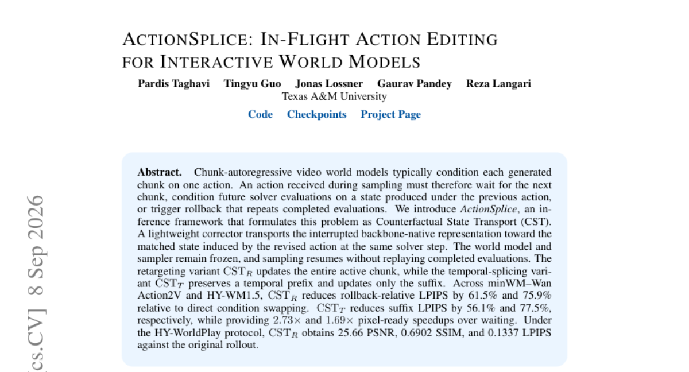

### 📌 한 줄 요약
생성 중인 비디오 월드 모델의 롤백 없이 실시간 액션 수정을 가능하게 하는 효율적인 추론 프레임워크

### 🔑 핵심 포인트
- Counterfactual State Transport(CST)를 통한 실시간 액션 수정 프레임워크 제안
- 기존 모델(Backbone)과 샘플러를 수정하지 않고 사용하는 Zero-shot 방식의 효율성
- CST*R(전체 업데이트)과 CST*T(접미사 업데이트)를 통한 성능 및 속도 최적화

### 🧑‍💻 개발자 관점
실시간 인터랙티브 환경에서 비디오 생성 모델의 지연 시간(Latency)을 줄이고, 사용자 입력에 즉각 반응하는 월드 모델을 구축하는 데 핵심적인 기술입니다.

### 🚀 실무 적용 아이디어
- 제시된 CST 알고리즘을 기존 오픈소스 비디오 생성 모델(SVD 등)에 이식하여 성능 비교
- CST*R과 CST*T의 연산 비용 대비 시각적 품질(LPIPS) 트레이드오프 분석
- 실시간 제어 루프(Control Loop) 환경에서의 지연 시간 측정 실험

### ⚠️ 리스크/한계
- 가벼운 보정기(Corrector)가 복잡한 물리적 변화를 완벽하게 재현하지 못할 가능성
- 매우 긴 시간 범위의 액션 수정 시 상태 전이의 정확도 저하 우려

### 📝 초록 기반 상세 설명
기존의 청크 단위 비디오 생성 모델은 샘플링 도중 새로운 액션이 들어오면 다음 청크를 기다리거나, 이미 생성된 부분을 삭제하고 다시 생성하는 롤백 과정을 거쳐야 했습니다. 본 논문은 이러한 문제를 해결하기 위해 'Counterfactual State Transport(CsT)'라는 새로운 추론 프레임워크인 ActionSplice를 제안합니다. 이 방식은 기존 모델과 샘플러를 동결한 상태에서, 가벼운 보정기를 통해 중단된 상태를 새로운 액션에 맞는 상태로 전이시킵니다. 전체 청크를 업데이트하는 CST*R과 접미사만 업데이트하는 CST*T 두 가지 변형을 통해 효율성을 극대화했습니다. 실험 결과, 기존 방식 대비 롤백 비용을 획기적으로 줄이면서도 높은 시각적 품질과 빠른 생성 속도를 달성했습니다.

---

## 17. [Building and Evaluating Fixed-Voice Thai TTS from Synthetic Speech](https://huggingface.co/papers/2609.03502)
**Upvotes**: 1 | **도입 난이도**: 중 | **신뢰도**: 상
**arXiv**: https://arxiv.org/abs/2609.03502

**태그**: TTS, On-device, Knowledge-Distillation, Low-resource, RAG, Audio, Evaluation, Inference

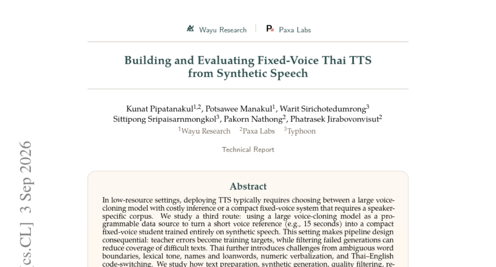

### 📌 한 줄 요약
대형 음성 복제 모델을 데이터 소스로 활용하여 저사양 기기용 경량 고정 음성 TTS 모델을 구축하는 방법론 연구

### 🔑 핵심 포인트
- 대형 음성 복제 모델(Teacher)을 활용한 경량 고정 음성 모델(Student) 학습 파이프라인 구축
- 태국어 특유의 언어적 난제(성조, 경계 모호성, 코드 스위칭)를 고려한 데이터 정제 및 프론트엔드 설계
- 82M 파라미터 규모의 온디바이스용 모델 개발 및 고성능 평가 프레임워크 제안

### 🧑‍💻 개발자 관점
클라우드 기반의 무거운 모델 대신, 소량의 데이터로 생성된 합성 데이터를 통해 온디바이스에서 구동 가능한 고성능 TTS를 만드는 실무적 방법론을 제시합니다.

### 🚀 실무 적용 아이디어
- 제시된 데이터 필터링 및 거부 샘플링(Rejection Sampling) 기법을 기존 TTS 학습 파이프라인에 적용해보기
- 특정 언어(태국어 등)의 언어적 특성을 반영한 텍스트 전처리 로직 설계 실험
- Teacher-Student 구조에서 Teacher의 오류가 Student에 미치는 영향 분석

### ⚠️ 리스크/한계
- Teacher 모델의 오류가 학습 타겟이 되어 품질 저하를 유발할 가능성
- 필터링 과정에서 데이터 커버리지가 특정 텍스트 영역에 편향될 위험

### 📝 초록 기반 상세 설명
저자원 환경에서 TTS 배포 시 고비용의 음성 복제 모델과 데이터가 필요한 경량 모델 사이의 선택 문제가 발생합니다. 본 연구는 대형 모델을 프로그래밍 가능한 데이터 소스로 사용하여, 짧은 참조 음성만으로 경량화된 고정 음성 학생 모델을 학습시키는 새로운 경로를 제안합니다. 태국어의 복잡한 음운 및 코드 스위칭 문제를 해결하기 위해 텍스트 전처리, 합성 생성, 품질 필터링 및 거부 샘플링 기법을 연구했습니다. 실험 결과, 82M 파라미터 규모의 Wayu-Paxa-TTS-Edge 모델은 참조 음성 없이도 온디바이스 환경에서 높은 정확도와 자연스러운 휴지(pause)를 구현했습니다. 최종적으로 모델과 평가 프레임워크를 오픈소스로 공개하여 태국어 TTS 발전을 도모합니다.

---

## 18. [How Far Can Synthetic Data Take Thai OCR?](https://huggingface.co/papers/2609.03595)
**Upvotes**: 1 | **도입 난이도**: 중 | **신뢰도**: 상
**arXiv**: https://arxiv.org/abs/2609.03595

**태그**: OCR, Synthetic Data, Deep Learning, Document AI, Vision, Evaluation

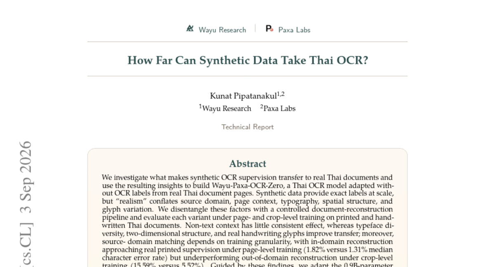

### 📌 한 줄 요약
합성 데이터의 구성 요소 분석을 통해 실데이터 라벨 없이도 고성능 태국어 OCR 모델을 구축하는 방법론 제시

### 🔑 핵심 포인트
- 합성 데이터의 '현실성' 구성 요소(서체, 구조, 필기체 등)가 전이 학습 성능에 미치는 영향 분석
- 학습 단위(Page-level vs Crop-level)에 따라 소스 도메인 일치 여부가 성능에 미치는 영향이 다름을 발견
- 실제 라벨 없이 합성 데이터만으로 학습된 Wayu-s-OCR-Zero 모델 개발 및 성능 검증

### 🧑‍💻 개발자 관점
라벨링 비용이 높은 OCR 분야에서 합성 데이터의 구성 요소를 정밀하게 제어함으로써 데이터 구축 비용을 획기적으로 절감할 수 있는 가이드를 제공합니다.

### 🚀 실무 적용 아이디어
- 도메인 특화 서체와 레이아웃을 포함한 합성 데이터 생성 파이프라인 구축
- 학습 시 데이터 크롭(Crop) 단위와 페이지(Page) 단위의 성능 차이 비교 실험
- 기존 OCR 모델에 합성 데이터로 사전 학습(Pre-training)을 적용한 후 미세 조정(Fine-tuning) 테스트

### ⚠️ 리스크/한계
- 특정 언어(태국어) 및 특정 도메인에 특화된 결과일 수 있어 타 언어 적용 시 재검증 필요
- 합성 데이터의 복잡도가 높아질수록 생성 파이프라인 유지 관리 비용 발생

### 📝 초록 기반 상세 설명
합성 데이터로 학습된 OCR 모델이 실제 문서로 전이될 때 발생하는 성능 차이의 원인을 규명하고자 했습니다. 연구진은 소스 도메인, 타이포그래피, 공간 구조 등 다양한 요소를 분리하여 분석하는 통제된 문서 재구성 파이프라인을 구축했습니다. 실험 결과, 텍스트 외 문맥보다는 서체 다양성, 2D 구조, 실제 필기체 글리프가 전이 성능에 결정적인 영향을 미침을 확인했습니다. 이러한 통찰을 바탕으로 0.9B 파라미터 모델을 활용한 Wayu-Paxa-OCR-Zero를 개발했습니다. 결과적으로 합성 데이터만으로도 실데이터 라벨 없이 강력한 성능을 내는 OCR 모델 구축이 가능함을 입증했습니다.

---

