# 2026-09-18 Daily Papers (Top 23)

## 오늘의 요약
오늘의 연구는 에이전트의 자율적 협업과 실행 환경 자동화, 그리고 LLM/VLA 모델의 효율적인 학습 및 추론 최적화에 집중되었습니다. 특히 단순한 예측 성능을 넘어 인과 관계 파악, 신뢰도 추정, 물리적 관계 보존 등 모델의 실무적 신뢰성과 정밀도를 높이는 방법론들이 주목받았습니다.

### 오늘의 핵심 포인트
- 에이전트가 복잡한 코드를 이해하고 실행하거나, Git을 공유 메모리로 활용하여 협업하는 등 자율적 연구 및 개발 환경 구축 연구가 활발히 진행되었습니다.
- PPO의 가치 평탄화 문제나 저정밀도 양자화 오차와 같은 모델 학습 및 추론 과정의 병목 현상을 해결하기 위한 실무적인 최적화 기법들이 제안되었습니다.
- 과거 경험을 통한 신뢰도 추정이나 물리적 관계를 보존하는 토큰화처럼, 모델의 결과물을 검증하고 제어의 정밀도를 높이는 새로운 패러다임이 제시되었습니다.

**오늘의 태그**: AI Agent, LLM Optimization, Causal Inference, Automation, Robotics

## 1. [LimiX-2: A Contextual Mechanism Network Towards General Structured-Data Intelligence](https://huggingface.co/papers/2609.17488)
**Upvotes**: 86 | **도입 난이도**: 상 | **신뢰도**: 상
**arXiv**: https://arxiv.org/abs/2609.17488

**태그**: Tabular-DL, Causal-Inference, Foundation-Model, Machine-Learning, Evaluation

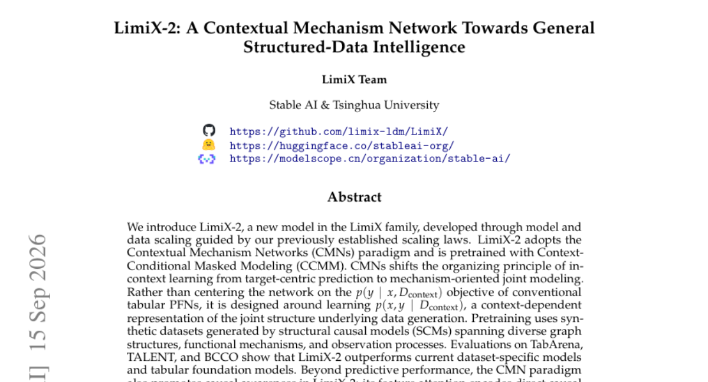

### 📌 한 줄 요약
데이터 생성 메커니즘 자체를 학습하여 정형 데이터 예측과 인과 관계 추론 성능을 동시에 극대화한 차세대 모델

### 🔑 핵심 포인트
- CMN 패러다임: 타겟 예측 중심에서 데이터 생성 메커니즘 중심의 공동 모델링으로 전환
- CCMM 사전 학습: SCM 기반 합성 데이터를 활용하여 복잡한 구조적 인과 관계 학습
- 인과적 인식: 피처 어텐션을 통해 직접적인 인과 관계를 인코딩하고 스켈레톤 복구 가능

### 🧑‍💻 개발자 관점
단순 예측을 넘어 데이터 간의 인과 관계를 파악해야 하는 복잡한 비즈니스 로직 및 데이터 분석 자동화에 혁신적인 성능을 제공할 수 있습니다.

### 🚀 실무 적용 아이디어
- 제공된 SCM 기반 합성 데이터 생성 로직을 활용한 도메인 특화 데이터셋 구축 실험
- 기존 Tabular PFN 모델과 LimiX-2의 인과 관계 복구 정확도 비교 테스트
- 실제 정형 데이터(Tabular) 환경에서의 예측 성능 및 추론 속도 벤치마크

### ⚠️ 리스크/한계
- SCM 기반 합성 데이터에 의존한 학습으로 인해 실제 복잡한 노이즈가 섞인 데이터에서의 일반화 성능 검증 필요
- 메커니즘 중심 모델링의 복잡도로 인한 연산 비용 및 학습 난이도 증가 가능성

### 📝 초록 기반 상세 설명
기존의 정형 데이터 모델들은 주로 주어진 컨텍스트에서 타겟 값을 예측하는 데 집중하여 데이터 간의 근본적인 구조를 학습하는 데 한계가 있었습니다. 이를 해결하기 위해 LimiX-2는 새로운 CMN(Contextual Mechanism Networks) 패러다임을 도입했습니다. 이 방식은 타겟 중심의 예측이 아닌, 컨텍스트에 따른 데이터 생성 메커니즘 자체를 모델링하는 p(x, y | D_context)를 목표로 합니다. SCM(구조적 인과 모델) 기반의 합성 데이터를 활용한 CCMM 사전 학습을 통해 다양한 그래프 구조와 함수적 메커니즘을 학습했습니다. 실험 결과, LimiX-2는 기존의 데이터셋 특화 모델 및 정형 데이터 파운데이션 모델들을 상회하는 성능을 보였습니다. 또한, 학습된 어텐션 메커니즘이 인과 관계를 인코딩하여 정확한 인과 스켈레톤 복구 능력까지 갖추었음을 입증했습니다.

---

## 2. [ScienceIDE: Turning World's Scientific Codebase into Agent Learnable Environments](https://huggingface.co/papers/2609.19134)
**Upvotes**: 69 | **도입 난이도**: 상 | **신뢰도**: 상
**arXiv**: https://arxiv.org/abs/2609.19134

**태그**: AI Agent, Scientific Computing, Automated Environment, Code Generation, Agent, RAG, Reasoning, Benchmark, Evaluation

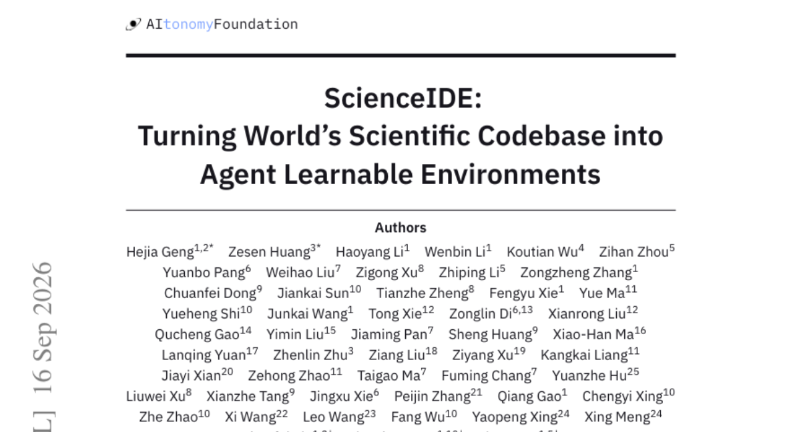

### 📌 한 줄 요약
과학적 코드 저장소를 에이전트 학습용 실행 환경으로 자동 변환하는 인프라 ScienceIDE와 이를 활용한 모델 개발

### 🔑 핵심 포인트
- 과학적 코드 저장소를 에이전트 학습용 실행 환경으로 자동 변환하는 ScienceIDE 프레임워크 제안
- 전문가 정의 기준을 활용한 작업 생성, 실행 및 과학적 검증 자동화 프로세스 구축
- 학습된 PhAI-IDE 모델 시리즈를 통해 과학적 도메인 지식의 일반적 추론 능력 전이 증명

### 🧑‍💻 개발자 관점
도메인 특화된 복잡한 코드를 에이전트가 이해하고 실행할 수 있는 환경으로 자동화하는 방법론을 제시하여, 전문 분야 AI 개발의 효율성을 높입니다.

### 🚀 실무 적용 아이디어
- 제공된 GitHub 저장소를 클론하여 특정 도메인 코드베이스의 환경 변환 테스트
- 전문가 정의 검증 기준(Acceptance Criteria)을 커스텀하여 환경 구축 프로세스 실험
- PhAI-IDE 모델을 활용하여 특정 과학적 코드 수정 태스크 수행 성능 측정

### ⚠️ 리스크/한계
- 전문가 정의 기준에 대한 의존도가 높아 초기 환경 구축 시 도메인 지식 필요
- 복잡한 과학적 코드의 경우 환경 변환 과정에서의 정합성 유지 어려움 가능성

### 📝 초록 기반 상세 설명
과학적 코드 저장소는 방대한 지식을 담고 있지만, 파편화된 툴체인과 도메인 특화 규칙으로 인해 에이전트 학습에 활용하기 어렵다는 문제가 있습니다. 이를 해결하기 위해 연구진은 과학적 코드를 프로그래밍 가능한 환경으로 변환하는 ScienceIDE 인프라를 제안합니다. 이 시스템은 전문가가 정의한 사례와 검증 기준을 바탕으로 저장소를 실행 가능한 환경으로 변환하여 작업 생성, 실행 및 과학적 검증을 지원합니다. 이렇게 구축된 환경을 통해 PhAI-IDE 모델 시리즈를 학습시켰으며, 그 결과 과학적 코드 수정 능력과 일반적인 코딩/추론 성능이 모두 향상되었습니다. 결과적으로 ScienceIDE는 과학적 소프트웨어를 지능 개발을 위한 공유 기질로 만드는 토대를 마련합니다.

---

## 3. [Rethinking Critic Learning in PPO: Understanding and Mitigating Value Flattening](https://huggingface.co/papers/2609.18708)
**Upvotes**: 60 | **도입 난이도**: 하 | **신뢰도**: 상
**arXiv**: https://arxiv.org/abs/2609.18708

**태그**: RLHF, PPO, LLM, Reinforcement Learning, Vision, Evaluation

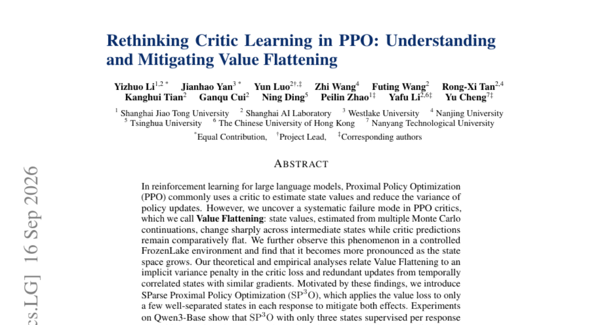

### 📌 한 줄 요약
PPO 학습 시 발생하는 가치 평탄화(Value Flattening) 문제를 해결하기 위해 소수의 상태에만 손실을 적용하는 희소 감독(Sparse Supervision) 기법을 제안합니다.

### 🔑 핵심 포인트
- PPO 크리틱에서 상태 가치 변화가 예측값에 반영되지 않는 'Value Flattening' 현상 규명
- 상태 공간 확대 및 시간적 상관관계가 가치 평탄화를 심화시키는 원인임을 이론적/경험적으로 분석
- SP^3O: 적은 수의 분리된 상태에만 가치 손실을 적용하여 중복 업데이트와 분산 문제를 해결

### 🧑‍💻 개발자 관점
LLM RLHF 과정에서 크리틱 학습 효율을 높이고, 불필요한 계산 비용을 줄이면서도 정책 성능을 안정적으로 유지할 수 있는 실무적 가이드라인을 제공합니다.

### 🚀 실무 적용 아이디어
- 기존 PPO 학습 시 크리틱의 가치 예측값과 실제 보상 간의 편차(Flattening)가 발생하는지 모니터링
- 학습 시 모든 타임스텝이 아닌, 특정 간격이나 핵심 상태에만 가치 손실을 적용하는 실험 수행
- 상태 공간 크기에 따른 크리틱 수렴도 변화를 관찰하며 SP^3O 전략 적용 검토

### ⚠️ 리스크/한계
- 상태 선택 전략(Sparse selection)이 잘못될 경우 학습 불안정성 초래 가능성
- 매우 복잡한 상태 공간에서 최적의 희소 샘플링 지점을 찾는 데 추가적인 연구 필요

### 📝 초록 기반 상세 설명
LLM 강화학습에서 PPO는 분산 감소를 위해 크리틱(Critic)을 사용하지만, 실제로는 예측값이 평탄해지는 'Value Flattening' 현상이 발생합니다. 연구진은 이 현상이 상태 공간이 커질수록 심화되며, 크리틱 손실의 암시적 분산 페널티와 중복된 업데이트가 원인임을 밝혀냈습니다. 이를 해결하기 위해 각 응답에서 분리된 소수의 상태에만 가치 손실을 적용하는 SP^3O 알고리즘을 도입했습니다. 실험 결과, 응답당 단 3개의 상태만 감독해도 가치 평탄화를 완화하고 정책 성능을 일관되게 향상시켰습니다. 결과적으로 이 연구는 PPO의 잠재적 실패 모드를 식별하고 간단한 희소 감독 전략의 효용성을 입증했습니다.

---

## 4. [Confidence Comes from Experience: Experiential Confidence Estimation from Reasoning to Agents](https://huggingface.co/papers/2609.17708)
**Upvotes**: 47 | **도입 난이도**: 하 | **신뢰도**: 상
**arXiv**: https://arxiv.org/abs/2609.17708

**태그**: LLM, Agent, Reliability, RAG, Reasoning, Multimodal, Benchmark, Inference

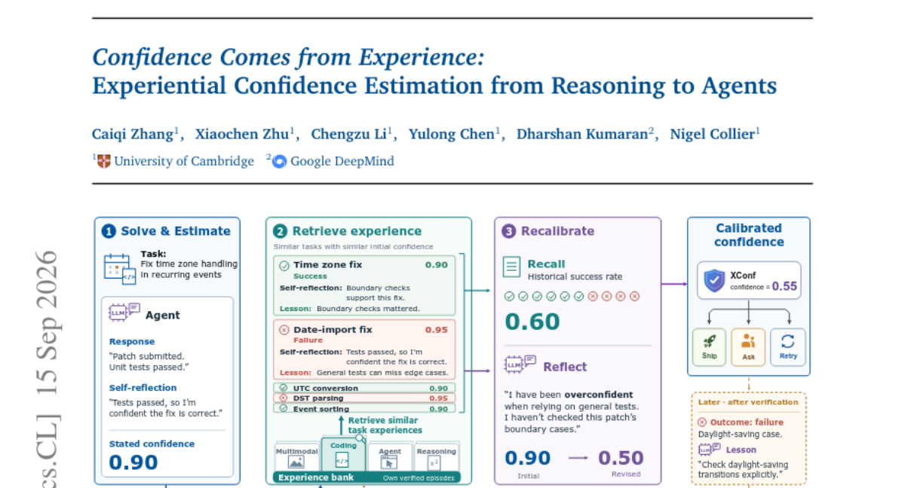

### 📌 한 줄 요약
과거의 성공/실패 경험을 기록하고 이를 활용하여 모델의 신뢰도를 추정하는 새로운 패러다임의 XConf 제안

### 🔑 핵심 포인트
- 과거의 성공/실패 기록(Task, Reflection, Outcome, Lesson)을 활용하는 경험 기반 신뢰도 추정 방식 제안
- Logit 접근이나 가중치 업데이트 없이 단 한 번의 생성 비용만으로 작동하는 포맷 일반적(Format-general) 방식
- 기존 Self-consistency 대비 훨씬 낮은 비용으로 동등하거나 더 우수한 AUROC 및 ECE 성능 달성

### 🧑‍💻 개발자 관점
모델의 가중치를 수정하거나 복잡한 샘플링 없이도 과거 이력을 활용해 신뢰도를 높일 수 있어, 실무적인 에이전트 시스템 구축 시 비용 효율적인 필터링 전략이 됩니다.

### 🚀 실무 적용 아이디어
- 과거 작업의 결과와 성찰을 포함하는 '경험 데이터베이스' 스키마 설계해보기
- 유사한 과거 사례를 검색하기 위한 벡터 DB 기반의 Recall 메커니즘 구현 테스트
- 신뢰도 임계값(Threshold) 설정에 따른 Selective Prediction 성능 변화 측정

### ⚠️ 리스크/한계
- 과거 경험 데이터의 품질(잘못된 교훈 등)이 신뢰도 추정의 편향을 야기할 수 있음
- 유사한 과거 사례를 검색하는 과정에서 검색 품질에 따라 성능이 크게 좌우될 수 있음

### 📝 초록 기반 상세 설명
LLM의 신뢰할 수 있는 배포를 위해 정확한 신뢰도 추정은 필수적이지만, 기존 방식은 현재의 추론 과정에만 의존한다는 한계가 있습니다. 본 논문은 현재의 추론을 넘어 모델의 축적된 경험을 활용하는 XConf(eXperiential Confidence)를 제안합니다. XConf는 과거의 작업, 성찰, 결과, 교훈이 담긴 에피소드를 저장하고, 새로운 작업 시 유사한 과거 사례를 검색하여 성공률을 바탕으로 신뢰도를 재산정합니다. 실험 결과, XConf는 다양한 벤치마크에서 기존의 Self-consistency 방식보다 낮은 비용으로 더 높은 성능을 보였습니다. 특히 에이전트 작업에서 신뢰도가 낮은 작업을 제외함으로써 성공률을 크게 향상시켰습니다.

---

## 5. [ProgramDistill: From Interactive Web Apps to Verifiable Reference-Guided SWE Tasks](https://huggingface.co/papers/2609.18805)
**Upvotes**: 43 | **도입 난이도**: 하 | **신뢰도**: 상
**arXiv**: https://arxiv.org/abs/2609.18805

**태그**: Coding Agent, Benchmark, Software Engineering, Automation, Agent, Evaluation, Distillation

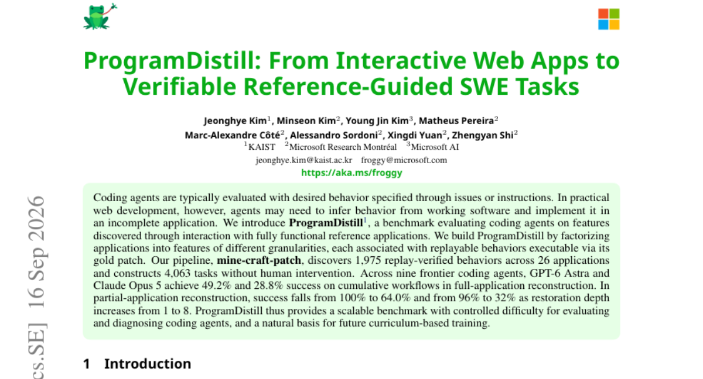

### 📌 한 줄 요약
완성된 웹 앱의 동작을 분석하여 코드로 재현하는 능력을 평가하는 자동화된 벤치마크 프레임워크 제안

### 🔑 핵심 포인트
- 동작하는 참조 앱에서 기능을 추출하여 코딩 태스크를 생성하는 자동화 파이프라인(mine-craft-patch) 개발
- 텍스트 지시문이 아닌, 실행 가능한 동작(replayable behaviors) 기반의 검증 가능한 벤치마크 구축
- 애플리케이션 복원 깊이에 따른 에이전트의 성능 저하를 정밀하게 측정할 수 있는 환경 제공

### 🧑‍💻 개발자 관점
단순 코드 작성을 넘어, 기존 소프트웨어의 동작을 이해하고 이를 새로운 코드베이스에 이식하는 실무적인 에이전트 평가 기준을 제시합니다.

### 🚀 실무 적용 아이디어
- 제시된 mine-craft-patch 파이프라인을 활용해 특정 도메인 특화 벤치마크 구축 시도
- 에이전트의 코드 복원 능력을 테스트하기 위해 점진적 난이도(restoration depth) 설정 실험
- LLM 기반 에이전트의 기능 추론 능력을 정량화하기 위한 평가 지표로 활용

### ⚠️ 리스크/한계
- 기존 텍스트 기반 이슈 해결 방식과 실제 현업의 요구사항 간의 간극 존재 가능성
- 애플리케이션 구조에 따라 기능 분해 및 재현 가능성 확보의 난이도가 다를 수 있음

### 📝 초록 기반 상세 설명
기존 코딩 에이전트 평가는 주로 텍sal 텍스트 기반의 이슈나 지시사항에 의존하여 실제 웹 개발 환경의 복잡성을 반영하기 어려웠습니다. 본 논문은 동작하는 소프트웨어에서 기능을 추론하고 이를 불완전한 애플리케이션에 구현하는 능력을 평가하기 위해 ProgramDistill을 제안합니다. 연구진은 애플리케이션을 다양한 입도(granularity)의 기능 단위로 분해하고, 골드 패치를 통해 재현 가능한 동작을 연결하는 'mine-craft-patch' 파이프라인을 구축했습니다. 이를 통해 인간의 개입 없이 26개 앱에서 4,063개의 태스크를 생성했습니다. 실험 결과, 에이전트의 복원 깊이가 깊어질수록 성공률이 하락하는 양상을 보였으며, 이는 에이전트의 성능 진단과 커리큘럼 학습을 위한 확장 가능한 벤치마크로서의 가치를 입증합니다.

---

## 6. [ActionPiece: Rethinking Action Tokenization for Autoregressive Vision-Language-Action Models](https://huggingface.co/papers/2609.18487)
**Upvotes**: 36 | **도입 난이도**: 중 | **신뢰도**: 상
**arXiv**: https://arxiv.org/abs/2609.18487

**태그**: VLA, Robotics, Tokenization, Reinforcement Learning, Vision, Evaluation, Optimization

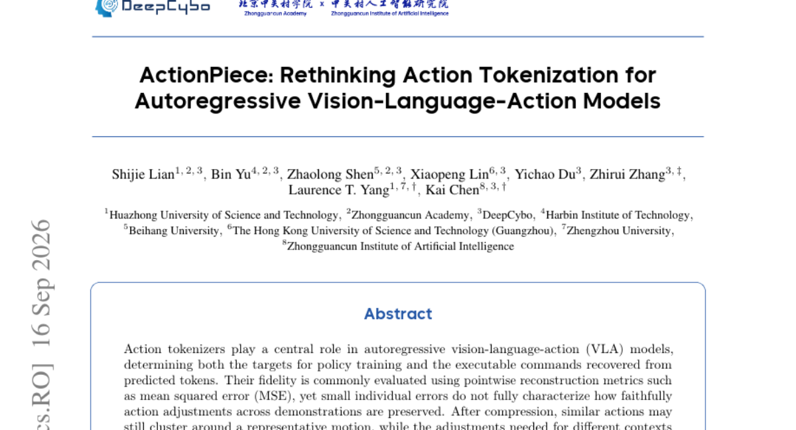

### 📌 한 줄 요약
물리적 관계 보존을 위한 새로운 토큰화 기법을 통해 VLA 모델의 로봇 제어 정밀도와 성공률을 높인 연구

### 🔑 핵심 포인트
- 물리적 순위 일관성(PRC) 지표 제안: 단순 오차(MSE)를 넘어 액션 간 상대적 관계 보존 여부 측정
- ActionPiece 프레임워크: 인코더와 양자화 과정에 물리적 거리 순위를 반영하는 공동 학습 방식 도입
- VLA 성능 향상: 고정된 디코더를 사용하면서도 정교한 액션 토큰 생성을 통해 로봇 제어 성공률 극대화

### 🧑‍💻 개발자 관점
로봇 제어 모델 학습 시 단순 오차 최소화가 아닌, 동작 간의 상대적 관계를 유지하는 것이 실제 작업 성공률에 직결됨을 시사합니다.

### 🚀 실무 적용 아이디어
- 기존 VLA 모델의 액션 토크나이저 성능을 PRC 지표로 재평가해보기
- 손실 함수에 물리적 거리 순위 보존 항(Ranking Loss)을 추가하여 실험해보기
- 동일한 디코더 환경에서 양자화(Quantization) 전략 변화에 따른 제어 성능 변화 관찰하기

### ⚠️ 리스크/한계
- 물리적 관계 보존에 집중할 경우, 전체적인 재구성 오차(MSE)가 증가할 가능성 존재
- 특정 환경(SimplerEnv 등)에 최적화된 지표가 범용적인 물리적 관계를 완벽히 대변하는지에 대한 검증 필요

### 📝 초록 기반 상세 설명
기존의 VLA 모델은 MSE와 같은 점별 재구성 지표를 사용하여 액션 토크나이저를 평가해 왔습니다. 그러나 이러한 방식은 데이터 압축 과정에서 액션 간의 상대적 거리나 물리적 관계가 왜곡되는 문제를 해결하지 못합니다. 본 논문은 물리적 순위 일관성(PRC)이라는 새로운 지표를 제안하여 재구성 후에도 물리적 거리 순위가 유지되는지 측정합니다. 이를 바탕으로 제안된 ActionPiece는 표현 학습과 양자화 과정에서 물리적 관계를 보존하도록 공동 학습을 수행합니다. 실험 결과, ActionPiece는 LIBERO 및 SimplerEnv 등 다양한 벤치마크에서 기존 방식보다 높은 성공률을 달성하며 물리적 관계 보존의 중요성을 입증했습니다.

---

## 7. [Agora: Git as Shared Memory for Collective AutoResearch](https://huggingface.co/papers/2609.18094)
**Upvotes**: 36 | **도입 난이도**: 중 | **신뢰도**: 상
**arXiv**: https://arxiv.org/abs/2609.18094

**태그**: AI Agent, Git, Distributed Systems, Automated Research, Agent, Evaluation

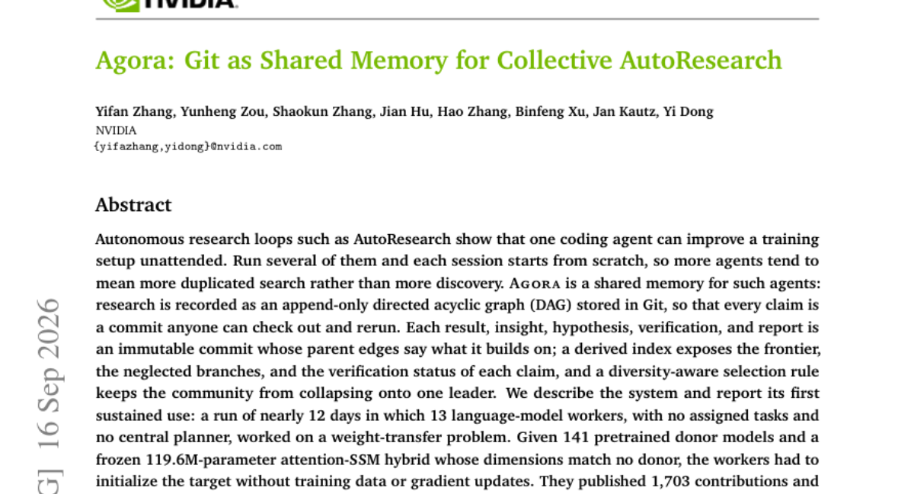

### 📌 한 줄 요약
Git을 공유 메모리로 활용하여 다수의 자율 연구 에이전트 간 중복을 방지하고 집단적 탐색 효율을 극대화하는 프레임워크

### 🔑 핵심 포인트
- Git 기반의 불변 DAG를 활용한 연구 기록 및 공유 메모리 구조 구축
- 중앙 계획자 없이도 에이전트 간 중복 탐색을 방지하는 다양성 유지 메커니즘
- 13개 에이전트의 12일간 자율 협업을 통한 복잡한 모델 최적화 문제 해결

### 🧑‍💻 개발자 관점
에이전트 기반 자동화 시스템 구축 시, 개별 에이전트의 작업 결과물을 어떻게 구조화하고 공유하여 협업 효율을 높일지에 대한 아키텍처적 영감을 제공합니다.

### 🚀 실무 적용 아이디어
- Git 기반의 작업 이력 관리 시스템을 에이전트 워크플로우에 적용해보기
- 에이전트 간 작업 중복을 방지하기 위한 DAG 구조 설계 실험
- 다수 에이전트 환경에서 '다양성 유지 규칙'이 탐색 효율에 미치는 영향 테스트

### ⚠️ 리스크/한계
- 에이전트 수가 급증할 경우 Git 저장소의 크기 및 관리 복잡도 증가 가능성
- 탐색 효율 향상에 대한 정량적 비교 검증이 추가로 필요함

### 📝 초록 기반 상세 설명
자율 연구 에이전트(AutoResearch)가 늘어날수록 각 세션이 독립적으로 시작되어 탐색의 중복이 발생하는 문제가 있습니다. 이를 해결하기 위해 연구 과정을 Git 기반의 불변 DAG(Directed Acyclic Graph)로 기록하는 'Agora' 시스템을 제안합니다. 모든 가설과 검증 결과는 커밋으로 저장되어 누구나 재현 가능하며, 시스템은 탐색의 다양성을 유지하도록 설계되었습니다. 13개의 에이전트가 중앙 통제 없이 12일간 협업한 실험 결과, 1,703개의 기여를 통해 복잡한 모델 초기화 문제를 성공적으로 해결했습니다. 이 과정에서 145개의 커밋이 연결된 계보를 형성하며 집단 지성의 효율성을 입증했습니다.

---

## 8. [VC-Attention: Value Smoothing and Softmax Casting for Low-bit Attention](https://huggingface.co/papers/2609.15810)
**Upvotes**: 34 | **도입 난이도**: 하 | **신뢰도**: 상
**arXiv**: https://arxiv.org/abs/2609.15810

**태그**: Video-Generation, Quantization, Attention-Optimization, Low-bit-Inference, Video, Optimization

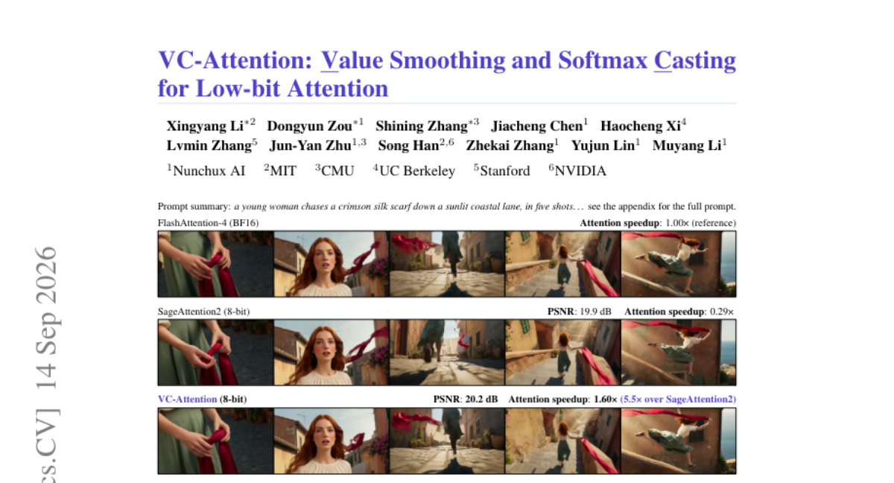

### 📌 한 줄 요약
저정밀도(Low-bit) 환경에서 아웃라이어 문제를 해결하고 Softmax 연산 병목을 제거하여 비디오 생성 모델의 추론 속도를 극대화한 기술

### 🔑 핵심 포인트
- V-Smooth: 온라인 클러스터링을 통해 Value 토큰을 재정렬하여 저정밀도 양자화 오차 최소화
- ExpCast-FP8: 로그 도메인 점수를 FP8 확률 코드로 직접 매핑하여 Softmax 연산 병목 제거
- Training-free: 추가 학습 없이 기존 모델에 즉시 적용 가능한 저정밀도 프레임워크

### 🧑‍💻 개발자 관점
비디오 생성 모델과 같은 거대 모델의 추론 비용을 낮추면서도 성능 저하 없이 하드웨어 가속을 극대화할 수 있는 실전적인 최적화 기법입니다.

### 🚀 실무 적용 아이디어
- HunyuanVideo나 Wan2.2 같은 최신 비디오 모델에 VC-Attention 로직 적용 테스트
- NVIDIA Blackwell/Hopper 아키텍처 환경에서 FP8 커널 성능 벤치마크 수행
- 기존 양자화 방식(SmoothQuant 등)과 VC-Attention의 생성 품질 비교 실험

### ⚠️ 리스크/한계
- 온라인 클러스터링 과정에서 발생하는 오버헤드가 특정 하드웨어에서 병목이 될 가능성
- 매우 극단적인 아웃라이어가 존재하는 특수 데이터셋에서의 안정성 검증 필요

### 📝 초록 기반 상세 설명
Diffusion Transformer 기반 비디오 생성 모델은 긴 시공간 시퀀스로 인해 어텐션 연산 비용이 매우 높습니다. 기존의 저정밀도 양자화는 아웃라이어 값으로 인해 정확도가 저하되고, Softmax의 고정밀 지수 연산이 하드웨어 가속의 병목이 되는 문제가 있었습니다. 이를 해결하기 위해 제안된 VC-Attention은 클러스터링 기반의 Value Smoothing(V-Smooth)과 Softmax 연산을 직접 매핑하는 ExpCast-FP8 기법을 결합합니다. V-Smooth는 값들을 재정렬하여 양자화 효율을 높이고, ExpCast-FP8은 FP32 지수 연산 없이 확률 코드로 직접 변환하여 속도를 높입니다. 실험 결과, 최신 GPU 환경에서 기존 BF16 대비 최대 3.6배의 속도 향상과 향상된 생성 품질을 달성했습니다.

---

## 9. [EvolveTrade: Experience-Driven Policy Refinement for Self-Evolving LLM Trading Agents](https://huggingface.co/papers/2609.17632)
**Upvotes**: 30 | **도입 난이도**: 중 | **신뢰도**: 상
**arXiv**: https://arxiv.org/abs/2609.17632

**태그**: LLM-Agent, Prompt-Engineering, Reinforcement-Learning, Algorithmic-Trading, Agent, Evaluation

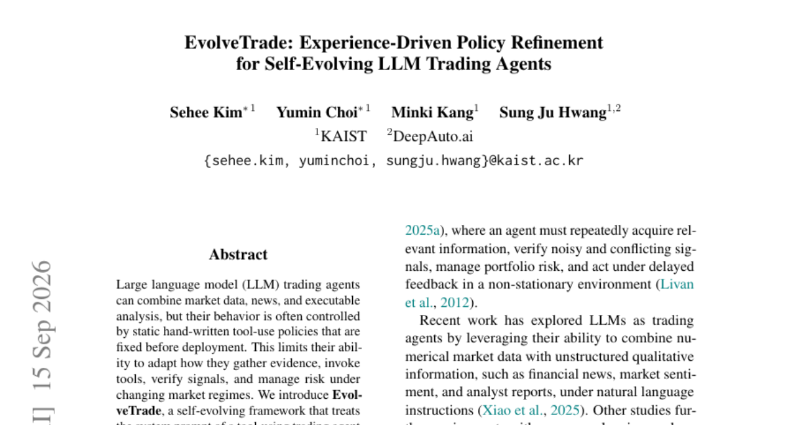

### 📌 한 줄 요약
고정된 프롬프트 대신 과거 거래 이력과 수익률을 바탕으로 에이전트의 행동 지침(Policy)을 스스로 업데이트하는 자가 진화형 트레이딩 프레임워크

### 🔑 핵심 포인트
- 시스템 프롬프트를 가변적인 '정책(Policy)'으로 정의하여 자가 진화 구조 구축
- 백본 모델 수정 없이 과거 거래 데이터와 수익률 피드백을 통한 프롬프트 최적화
- 시장 변화에 맞춰 정보 수집 및 포트폴리오 구성 절차를 스스로 정교화

### 🧑‍💻 개발자 관점
에이전트의 로직을 하드코딩하는 대신, 피드백 루프를 통해 프롬프트 자체가 최적화되는 '메타 프롬프팅' 전략의 실효성을 보여줍니다.

### 🚀 실무 적용 아이디어
- 고정된 프롬프트와 피드백 기반 프롬프트 간의 수익률 차이 비교 실험
- 프롬프트 업데이트 주기에 따른 성과 및 안정성 변화 측정
- 특정 시장 상황(횡보장 vs 추세장)에서 정책 변화 양상 분석

### ⚠️ 리스크/한계
- 과거 데이터에 과적합(Overfitting)되어 미래 시장에서 성능이 급락할 위험
- 프롬프트 변경이 예기치 못한 위험 관리 실패로 이어질 가능성

### 📝 초록 기반 상세 설명
기존 LLM 트레이딩 에이전트는 배포 전 작성된 정적인 도구 사용 정책에 의존하여 시장 변화에 유연하게 대응하기 어렵다는 문제가 있습니다. 이를 해결하기 위해 본 논문은 시스템 프롬프트를 텍스트 매개변수화된 정책으로 취급하는 EvolveTrade 프레임워크를 제안합니다. EvolveTrade는 백본 LLM은 고정한 채, Policy Agent가 누적된 의사결정 흔적과 포트폴리오 피드백을 분석하여 프롬프트를 주기적으로 수정합니다. 실험 결과, 다양한 시장 환경에서 고정 정책 기반의 베이스라인보다 샤프 지수(Sharpe Ratio)와 누적 수익률(Cumulative Return)이 향상됨을 확인했습니다. 또한, 진화된 정책이 코드 기반 분석을 활성화하고 시장 상황에 적합한 계산을 수행함을 입증했습니다.

---

## 10. [Zing-0.5: Toward Playable Worlds with Real-Time Joint Action and Text Control](https://huggingface.co/papers/2609.17909)
**Upvotes**: 25 | **도입 난이도**: 상 | **신뢰도**: 상
**arXiv**: https://arxiv.org/abs/2609.17909

**태그**: World Model, Real-time Generation, Interactive AI, Video Generation, Vision, Video, Inference, Distillation

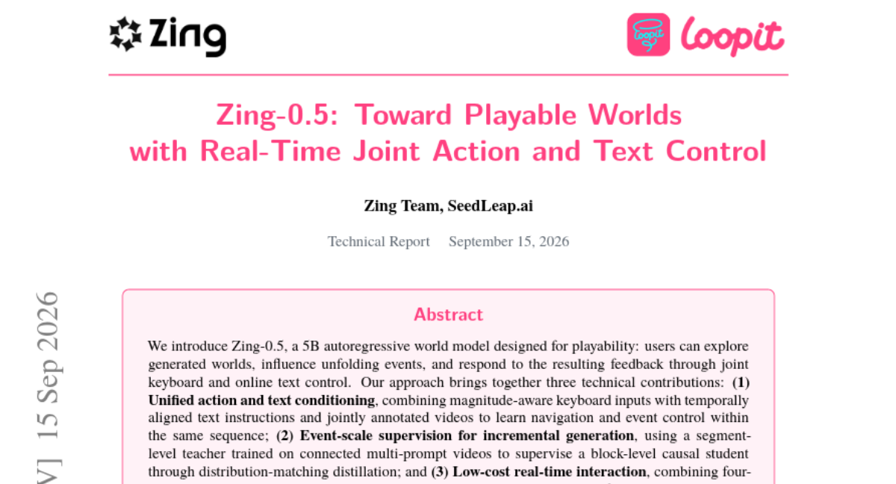

### 📌 한 줄 요약
실시간 키보드 조작과 텍스트 명령을 동시에 지원하는 5B 규모의 대화형 월드 모델 개발

### 🔑 핵심 포인트
- 키보드 입력(크기 인지)과 텍스트 명령을 하나의 시퀀스 내에서 통합 학습하는 방식 도입
- 연결된 멀티 프롬프트 비디오를 활용한 세그먼트 단위 교사 모델 기반의 분포 매칭 증류 기법
- 4단계 생성과 컨텍스트 보존 스트리밍을 결합하여 저비용(분당 약 $0.009) 실시간 추론 구현

### 🧑‍💻 개발자 관점
사용자의 물리적 조작과 텍스트 명령이 결합된 인터랙티브 콘텐츠 생성 엔진의 가능성을 제시합니다.

### 🚀 실무 적용 아이디어
- 제공된 SGLang 구현체를 활용한 실시간 추론 성능 벤치마크 수행
- 키보드 조작과 텍스트 명령 간의 우선순위 및 간섭 현상 분석
- 저비용 스트리밍 환경에서의 시각적 일관성 유지 여부 테스트

### ⚠️ 리스크/한계
- 실시간성을 위해 압축된 생성 방식이 장기적인 시각적 일관성을 저해할 가능성
- 복잡한 물리 법칙이나 정교한 객체 상호작용 구현의 한계

### 📝 초록 기반 상세 설명
기존의 생성형 월드 모델은 실시간 상호작용과 일관된 이벤트 제어를 동시에 달성하는 데 어려움이 있었습니다. 본 논문은 사용자가 탐험과 이벤트 발생을 동시에 제어할 수 있는 5B 규모의 자기회귀 월드 모델인 Zing-0.5를 제안합니다. 핵심 방법론으로 키보드 입력과 텍스트 지시를 통합한 조건부 학습, 세그먼트 단위 교사를 활용한 증류 기반의 점진적 생성 방식, 그리고 저비용 실시간 추론 기술을 결합했습니다. 실험 결과, WBench 내비게이션 작업에서 높은 일관성을 보였으며 생성 재시작 없이 텍스트로 이벤트를 변경하는 데 성공했습니다. 최종적으로 모델 가중치와 추론 코드를 공개하여 실시간 플레이 가능한 생성형 월드의 발전을 도모합니다.

---

## 11. [HypoEvolve: Genetic Algorithms Enable Multi-Agent LLMs to Discover Scientific Hypotheses](https://huggingface.co/papers/2609.15938)
**Upvotes**: 23 | **도입 난이도**: 상 | **신뢰도**: 상
**arXiv**: https://arxiv.org/abs/2609.15938

**태그**: Multi-Agent, Genetic Algorithm, LLM, Scientific Discovery, Agent, Vision, Evaluation

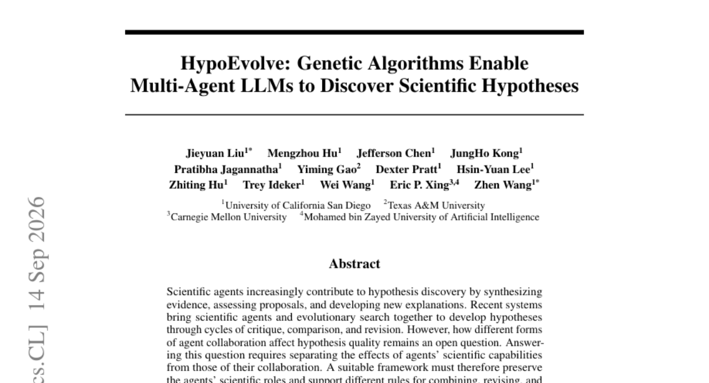

### 📌 한 줄 요약
유전 알고리즘을 활용해 다중 에이전트 LLM 간의 협업을 구조화하여 과학적 가설 발견 성능을 극대화한 프레임워크

### 🔑 핵심 포인트
- 유전 알고리즘을 통한 명시적이고 구조화된 다중 에이전트 협업 프레임워크 제안
- 가설의 생성, 수정, 평가 과정을 세대별로 관리하여 협업 효과를 정량적으로 측정 가능하게 설계
- 약물 재창출 과제에서 외부 생물학적 근거(DepMap, Open Targets)를 활용한 높은 검증 성능 확보

### 🧑‍💻 개발자 관점
단순한 챗봇 형태를 넘어, 에이전트 간의 상호작용 규칙(협업 로직)을 알고리즘화하여 복잡한 문제 해결 능력을 높이는 설계 패턴을 제시합니다.

### 🚀 실무 적용 아이디어
- 에이전트 간의 '교차(Crossover)' 및 '변이(Mutation)' 로직을 프롬프트 엔지니어링에 적용해보기
- 특정 도메인 지식을 가진 에이전트 집단을 구성하고 유전 알고리즘 루프에 태워보기
- 결과물의 품질을 평가하기 위한 외부 검증 데이터셋(Ground Truth) 설계 방법론 학습

### ⚠️ 리스크/한계
- 유전 알고리즘의 반복적인 루프 수행에 따른 높은 API 비용 및 연산 자원 소모
- 에이전트 간의 협업 규칙이 복잡해질수록 결과의 해석 가능성(Interpretability)이 낮아질 위험

### 📝 초록 기반 상세 설명
과학적 가설 발견을 위해 에이전트 간의 협업 방식이 가설의 품질에 미치는 영향은 여전히 미지의 영역입니다. 기존 시스템은 에이전트의 역량과 협업 효과를 분리하여 검증하기 어려웠습니다. 본 논문은 유전 알고리즘을 도입하여 가설 집단을 세대별로 업데이트하는 HypoEvolve 프레임워크를 제안합니다. 이 방식은 전문화된 LLM 에이전트들이 가설을 수정, 결합, 유지하는 과정을 명시적으로 제어하여 협업 효과를 테스트 가능하게 만듭니다. 약물 재창출(Drug repurposing) 과제를 통해 검증한 결과, HypoEvolve는 기존 베이스라인 대비 높은 성능을 기록하며 가설의 질을 높였습니다.

---

## 12. [SpectralShift: Effective Context Window Extension of Gated DeltaNet via Spectral Reparameterization](https://huggingface.co/papers/2609.14320)
**Upvotes**: 22 | **도입 난이도**: 하 | **신뢰도**: 상
**arXiv**: https://arxiv.org/abs/2609.14320

**태그**: Linear Attention, Long Context, Deep Learning, Model Optimization, RAG, Evaluation

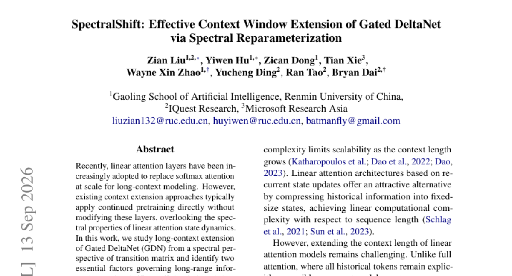

### 📌 한 줄 요약
Gated DeltaNet의 스펙트럼 특성을 재매개변수화하여 효율적으로 컨텍스트 윈도우를 확장하는 기술

### 🔑 핵심 포인트
- Gated DeltaNet의 상태 역학을 스펙트럼 관점에서 분석하여 장거리 정보 유지 원리 규명
- 느린 전파와 빠른 상태 전환을 동시에 지원하는 SpectralShift 재매개변수화 기법 제안
- 알파 프로젝션 초기화 및 학습률 스케일링을 통한 효율적인 컨텍스트 확장 구현

### 🧑‍💻 개발자 관점
선형 어텐션 기반 모델의 컨텍스트 확장 시 발생하는 성능 저하 문제를 구조적 이해를 바탕으로 해결하여 효율적인 장기 기억 모델 구축이 가능합니다.

### 🚀 실무 적용 아이디어
- 제공된 코드를 활용하여 Gated DeltaNet 모델에 SpectralShift 적용 테스트
- 다양한 컨텍스트 길이 변화에 따른 스펙트럼 밴드 변화 관찰
- 기존의 단순 지속 사전 학습(Continued Pretraining) 방식과 성능 비교

### ⚠️ 리스크/한계
- 특정 선형 어텐리 구조(GDN)에 최적화된 방법론이므로 다른 아키텍처로의 일반화 여부 확인 필요
- 스펙트럼 재매개변수화가 모델의 다른 성능 지표에 미치는 영향 검토 필요

### 📝 초록 기반 상세 설명
최근 긴 컨텍스트 모델링을 위해 소프트맥스 어텐션을 대체하는 선형 어텐션 레이어가 주목받고 있습니다. 그러나 기존의 컨텍스트 확장 방식은 레이어 구조를 수정하지 않고 사전 학습만 진행하여, 선형 어텐리 상태 역학의 스펙트럼 특성을 간과하는 문제가 있었습니다. 본 논문은 Gated DeltaNet(GDN)의 전이 행렬 관점에서 장거리 정보 검색을 결정하는 두 가지 핵심 요인(느린 스펙트럼 대역 확보 및 빠른 감쇠 모드 유지)을 식별했습니다. 이를 바탕으로 제안된 SpectralShift는 알파 프로젝션 초기화와 학습률 스케일링을 통해 스펙트럼을 재구성하는 재매개변수화 기법입니다. 실험 결과, SpectralShift는 효율적인 방식으로 GDN의 장거리 컨텍스트 능력을 일관되게 향상시켰습니다.

### 🖼️ 추가 자료

---

## 13. [A Zeroth-Order Paradigm for LLM Preference Alignment](https://huggingface.co/papers/2609.19144)
**Upvotes**: 22 | **도입 난이도**: 중 | **신뢰도**: 상
**arXiv**: https://arxiv.org/abs/2609.19144

**태그**: LLM Alignment, RLHF, Optimization, Preference Learning, RAG, Safety

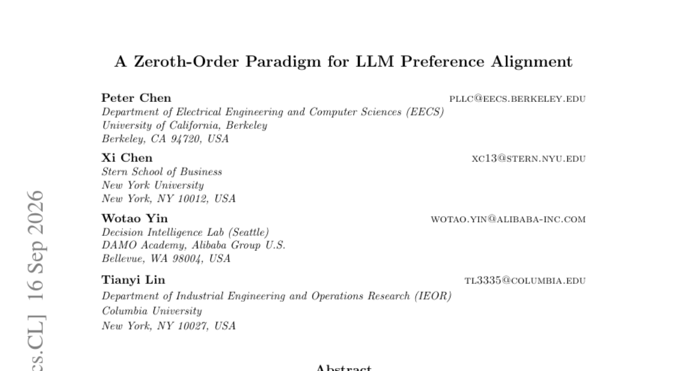

### 📌 한 줄 요약
기존의 미분 가능한 손실 함수 대신 비교 오라클을 활용하여 LLM의 선호도 정렬 효율을 높이는 새로운 제로차(Zeroth-order) 최적화 기법 제안

### 🔑 핵심 포인트
- 미분 가능한 손실 함수에 의존하지 않는 제로차(Zeroth-order) 방식의 ComPO 제안
- Likelihood displacement 문제를 완화하여 데이터 간 미세한 확률 차이를 효과적으로 활용
- 오프라인 및 온라인(KL-divergence 제어 포함) 환경에서의 이론적 수렴성 및 성능 보장 확보

### 🧑‍💻 개발자 관점
DPO와 같은 기존 방식에서 나타나는 모델의 길이 편향이나 특정 패턴에 대한 과적합 문제를 해결할 수 있는 대안적 정렬 프레임워크를 제공합니다.

### 🚀 실무 적용 아이디어
- DPO/PPO와 ComPO의 결과물을 비교하여 모델의 응답 길이(Length) 편향 차이 측정
- 제공된 오라클(Comparison Oracle) 환경을 구축하여 소규모 모델에서의 정렬 성능 테스트
- 데이터셋의 Likelihood margin이 작은 경우 ComPO의 강점 검증

### ⚠️ 리스크/한계
- 비교 오라클의 정확도에 따라 전체 정렬 성능이 크게 좌우될 수 있음
- 기존 미분 기반 방식 대비 연산 효율성이나 수렴 속도에 대한 실무적 검증 필요

### 📝 초록 기반 상세 설명
LLM의 선호도 정렬을 위해 직접 선호도 최적화(DPO 등) 방식이 널리 쓰이지만, 확률 차이가 작은 데이터에서 발생하는 likelihood displacement 문제가 발생합니다. 본 논문은 비교 오라클을 기반으로 방향성 정보를 추출하는 ComPO(Comparison-based Preference Optimization)를 제안합니다. ComPO는 미분 가능한 손실 함수를 직접 최적화하는 대신 비교 결과로부터 정보를 추출하는 제로차 방식을 취합니다. 오프라인 및 온라인 스킴에 대한 수렴성 및 성능 보장을 이론적으로 입증하였으며, 실험을 통해 기존 방식보다 우수한 성능을 확인했습니다. 특히 모델의 길이 편향을 제어하면서도 높은 승률을 달성하는 데 성공했습니다.

---

## 14. [Gaze as Evidence for Common Grounding: A Cross-Corpus Analysis of MapTask and MUNDEX](https://huggingface.co/papers/2609.18011)
**Upvotes**: 22 | **도입 난이도**: 중 | **신뢰도**: 상
**arXiv**: https://arxiv.org/abs/2609.18011

**태그**: Multi-modal, HCI, Agent, Collaboration, Inference

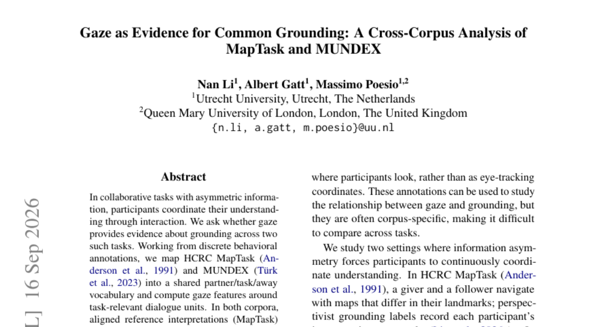

### 📌 한 줄 요약
비대칭 정보 협업 상황에서 시선(Gaze) 데이터가 상호 이해(Grounding)를 어떻게 반영하는지 분석한 연구

### 🔑 핵심 포인트
- 상호 이해(Grounding)가 이루어지는 시점에는 시선 엔트로피가 낮아지고 과업 중심적 시선이 증가함
- 과업 주도자(Giver/Explainer)의 시선 패턴이 상호 이해의 성공 여부와 더 밀접하게 연관됨
- 시선 데이터는 단독 지표보다는 과업 및 대화 맥락과 결합될 때 유의미한 예측력을 가짐

### 🧑‍💻 개발자 관점
멀티모달 AI 에이전트가 인간과 협업할 때, 사용자의 시선 패턴을 통해 의사소통의 성공/실패 여부를 실시간으로 판단하는 피드백 루프를 설계할 수 있습니다.

### 🚀 실무 적용 아이디어
- 멀티모달 LLM에 시선 엔트로피 및 과업 지향성 지표를 입력 피처로 포함하는 실험
- 에이전트가 인간의 시선 변화에 따라 대화 전략(설명 vs 확인)을 변경하는 로직 구현
- 비대칭 정보 상황을 가정한 시뮬레이션 환경에서 시선 데이터의 예측력 검증

### ⚠️ 리스크/한계
- 시선 효과 자체가 크지 않아 다른 맥락 데이터(텍al, 과업 데이터)와의 결합이 필수적임
- 참여자 개인의 습관에 따른 변동성이 존재할 수 있음

### 📝 초록 기반 상세 설명
비대칭 정보를 가진 협업 작업에서 참여자들은 상호작용을 통해 서로의 이해도를 조정합니다. 본 연구는 시선 데이터가 이러한 상호 이해(Groundization)의 증거가 될 수 있는지 두 가지 태스크(MapTask, MUNDEX)를 통해 검증합니다. 연구진은 두 코퍼스를 공통된 어휘로 매핑하고 대화 단위별 시선 특징을 추출했습니다. 분석 결과, 참조 해석이 일치하거나 이해가 확인된 시점에서는 과업 지향적 시선이 증가하고 파트너 지향적 시선은 감소하며, 시선 엔트로피와 전환 빈도가 낮아지는 경향을 보였습니다. 이러한 효과는 과업을 주도하는 참여자에게서 가장 뚜렷하게 나타났습니다. 결론적으로 시선은 과업 및 대화 맥락과 함께 상호 이해를 판단하는 중요한 보조 지표로 활용될 수 있습니다.

---

## 15. [EventEgoHands++: Event-based Egocentric 3D Hand Mesh Reconstruction with Real Dataset](https://huggingface.co/papers/2609.17189)
**Upvotes**: 21 | **도입 난이도**: 중 | **신뢰도**: 상
**arXiv**: https://arxiv.org/abs/2609.17189

**태그**: Computer Vision, Event Camera, 3D Reconstruction, Egocentric Vision, Evaluation

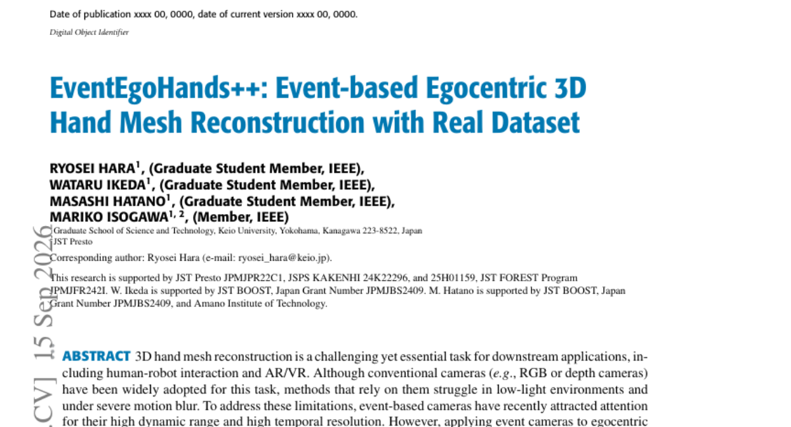

### 📌 한 줄 요약
이벤트 카메라를 활용하여 저조도 및 모션 블러 환경에서도 정밀한 1인칭 시점 3D 손 메쉬 재구성을 가능하게 하는 프레임워크입니다.

### 🔑 핵심 포인트
- 좌우 손을 구분하는 인스턴스 수준의 Hand Detector 도입
- 손 간의 공간적 관계와 상호작용을 학습하는 Adaptive Attention 메커니즘 제안
- 100만 프레임 규모의 대규모 실세계 이벤트 기반 데이터셋(EEH-R) 구축

### 🧑‍💻 개발자 관점
AR/VR 및 로봇 제어 환경처럼 조명이 불규칙하거나 움직임이 많은 실무 현장에서 안정적인 3D 손 추적 기술을 구현할 수 있습니다.

### 🚀 실무 적용 아이디어
- 제안된 Adaptive Attention 구조를 기존 RGB 기반 손 재구성 모델에 이식해보기
- EEH-R 데이터셋을 활용하여 저조도 환경에서의 강건성 테스트 수행하기
- 실시간성을 확보하기 위해 Hand Detector의 연산 비용 최적화 실험하기

### ⚠️ 리스크/한계
- 이벤트 카메라 하드웨어 의존성으로 인해 일반 RGB 카메라 환경으로의 즉각적 적용은 어려움
- 복잡한 배경이나 손이 겹치는 상황에서의 정밀도 유지 여부 검증 필요

### 📝 초록 기반 상세 설명
기존 카메라 기반 3D 손 재구성은 저조도나 움직임이 심한 환경에서 성능이 저하되는 한계가 있습니다. 이벤트 카메라는 높은 동적 범위와 시간 해상도를 제공하지만, 1인칭 시점에서는 배경 노이즈로 인해 손 신호가 가려지는 문제가 발생합니다. 기존 방식은 좌우 손을 구분하지 못해 인스턴스별 정보가 부족하고 상호작용 예측이 부정확했습니다. 본 논문에서는 인스턴스 수준의 바운딩 박스와 마스크를 추정하는 Hand Detector와 손 간의 관계를 학습하는 Adaptive Attention을 결합한 EventEgoHands++를 제안합니다. 또한, 대규모 실세계 데이터셋인 EEH-R을 구축하여 성능을 검증했습니다. 실험 결과, 제안 방법은 합성 및 실세계 데이터셋 모두에서 기존 모델을 상회하는 성능을 보였습니다.

---

## 16. [In-Context Robot Learning with VLM Agents](https://huggingface.co/papers/2609.19138)
**Upvotes**: 14 | **도입 난이도**: 중 | **신뢰도**: 상
**arXiv**: https://arxiv.org/abs/2609.19138

**태그**: Robot Learning, VLM, In-Context Learning, Embodied AI, Agent, Vision, Video, Evaluation

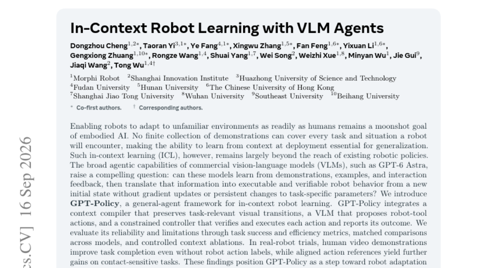

### 📌 한 줄 요약
VLM의 에이전트 능력을 활용하여 파라미터 업데이트 없이 데모와 피드백만으로 로봇 동작을 수행하는 In-Context 학습 프레임워크 제안

### 🔑 핵심 포인트
- 파라미터 업데이트 없는 In-Context Robot Learning 프레임워크(GPT-Policy) 개발
- 시각적 전이 보존(Context Compiler), 동작 제안(VLM), 검증 및 실행(Controller)의 통합 구조
- 라벨 없는 비디오 데모와 정렬된 액션 참조를 통한 로봇 적응 성능 입증

### 🧑‍💻 개발자 관점
모델 재학습(Fine-tuning) 없이 프롬프트와 데모만으로 로봇의 동작을 제어할 수 있는 새로운 워크플로우를 제시합니다.

### 🚀 실무 적용 아이디어
- 제공된 비디오 데모의 프레임 추출 방식에 따른 성능 변화 테스트
- VLM의 추론 속도가 실시간 로봇 제어 루프에 미치는 영향 분석
- 다양한 도구(Tool) 환경에서의 제어기(Controller) 제약 조건 설정 실험

### ⚠️ 리스크/한계
- VLM의 추론 지연(Latency)으로 인한 실시간성 확보 문제
- 복잡한 물리적 접촉이 필요한 정밀 작업에서의 제어 한계

### 📝 초록 기반 상세 설명
로봇이 낯선 환경에 적응하기 위해서는 미지의 상황에서도 학습할 수 있는 In-Context Learning(ICL) 능력이 필수적입니다. 그러나 기존 로봇 정책은 데모나 피드백을 즉각적인 동작으로 변환하는 데 한계가 있었습니다. 본 논문은 VLM의 에이전트 역량을 활용한 일반화 프레임워크인 GPT-Policy를 제안합니다. 이 시스템은 작업 관련 시각적 변화를 보존하는 컨텍스트 컴파일러, 동작을 제안하는 VLM, 그리고 동작을 검증 및 실행하는 제어기를 통합합니다. 실험 결과, 인간의 비디오 데모만으로도 작업 성공률이 향상되었으며, 이는 파라미터 수정 없이도 로봇이 새로운 작업을 수행할 수 있는 가능성을 보여주었습니다.

---

## 17. [PANORAMA: Panoptic Grounded Captioning via Mask Proposal Selection](https://huggingface.co/papers/2609.19143)
**Upvotes**: 9 | **도입 난이도**: 상 | **신뢰도**: 상
**arXiv**: https://arxiv.org/abs/2609.19143

**태그**: Vision, Segmentation, VLM, Captioning, RAG, Benchmark, Evaluation, Safety

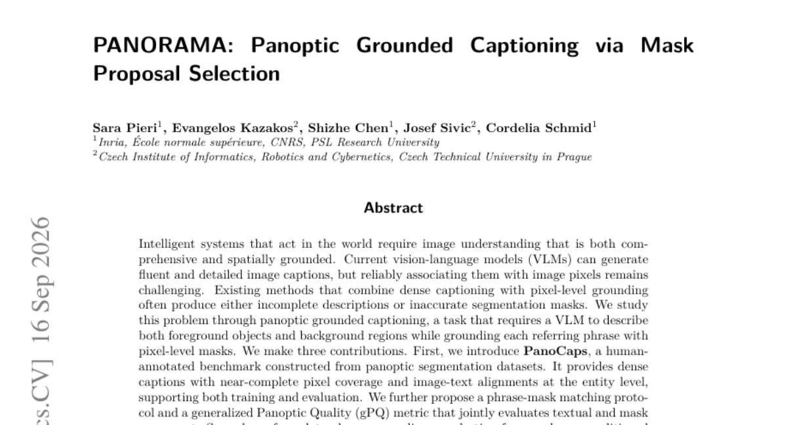

### 📌 한 줄 요약
객체와 배경을 모두 포함하는 정교한 캡셔닝과 픽셀 단위의 정밀한 마스크 생성을 결합한 새로운 시각-언어 모델 프레임워크

### 🔑 핵심 포인트
- 전경 객체와 배경 영역을 모두 포함하는 정교한 캡셔닝 및 픽셉트 단위 그라운딩 벤치마크 'PanoCaps' 구축
- 텍스트 구절과 마스크 일치도를 동시에 평가하는 새로운 지표 'gPQ' 제안
- 사전 학습된 세그멘터와 구절 표현을 결합하여 최적의 마스크를 선택하는 'PANORAMA' 모델 개발

### 🧑‍💻 개발자 관점
이미지 내 객체와 배경을 모두 아우르는 정밀한 설명이 필요한 로봇 제어, 자율 주행, 정교한 이미지 편집 AI 개발에 직접적인 영감을 제공합니다.

### 🚀 실무 적용 아이디어
- 제공된 PanoCaps 데이터셋을 활용하여 기존 VLM의 세그멘테이션 정확도 측정해보기
- Mask Proposal Selection 방식이 복잡한 배경 환경에서 얼마나 강건한지 테스트하기
- 생성된 캡션과 마스크 간의 일치도가 실제 시각적 정밀도에 미치는 영향 분석하기

### ⚠️ 리스크/한계
- 마스크 후보군 선택 방식이므로 후보군 생성 단계의 품질에 따라 전체 성능이 좌우될 수 있음
- 매우 복잡한 배경이나 중첩된 객체가 많은 환경에서의 연산 복잡도 증가 가능성

---

## 18. [Flattening Every Memory Peak in Long-Context Mixture-of-Experts Training](https://huggingface.co/papers/2609.14306)
**Upvotes**: 8 | **도입 난이도**: 상 | **신뢰도**: 상
**arXiv**: https://arxiv.org/abs/2609.14306

**태그**: MoE, Distributed Training, Memory Optimization, LLM, RAG

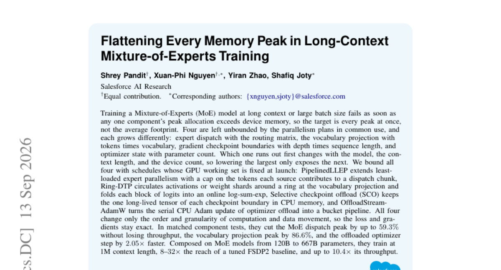

### 📌 한 줄 요약
MoE 모델의 대규모 컨텍스트 및 대형 배치 학습 시 발생하는 4가지 핵심 메모리 피크를 제어하여 학습 효율을 극대화하는 기술

### 🔑 핵심 포인트
- 4가지 핵심 메모리 피크(Expert Dispatch, Vocab Projection, Checkpoint, Optimizer)를 제어하는 통합 프레임워크 제안
- 계산 순서와 데이터 이동 최적화를 통해 수학적 정확도(Loss/Gradient)를 유지하면서 메모리 사용량 제어
- 대규모 MoE 모델(최대 667B)에서 초장거리 컨텍스트(1M) 학습 가능성 입증

### 🧑‍💻 개발자 관점
메모리 부족(OOM) 문제로 인해 컨텍스트 길이를 늘리지 못하는 상황에서, 하드웨어 자원을 효율적으로 분배하여 모델 크기와 컨텍스트 길이를 동시에 확장할 수 있는 실질적인 가이드를 제공합니다.

### 🚀 실무 적용 아이디어
- 기존 MoE 학습 워크로드에서 메모리 프로파일링을 통해 어떤 피크가 가장 먼저 발생하는지 확인
- 제안된 4가지 기법 중 현재 인프라(CPU-GPU 대역폭 등)에 가장 적합한 기법 우선 적용 테스트
- FSDP2와 같은 기존 병렬화 전략과 결합 시의 성능 변화 측정

### ⚠️ 리스크/한계
- 데이터 이동 및 계산 순서 변경에 따른 통신 오버헤드 발생 가능성
- CPU-GPU 간 대역폭이 병목이 될 경우 성능 향상 폭이 제한될 수 있음

### 📝 초록 기반 상세 설명
MoE 모델을 긴 컨텍스트나 큰 배치 사이즈로 학습할 때, 평균 메모리 사용량이 아닌 특정 시점의 피크 메모리 초과로 인해 학습이 실패하는 문제가 발생합니다. 연구진은 전문가 분산(Expert Dispatch), 어휘 투영(Vocabulary Projection), 그래디언트 체크포인트, 옵티마이저 상태라는 네 가지 주요 메모리 병목을 식별했습니다. 이를 해결하기 위해 PipelinedLLEP, Ring-DTP, SCO, OffloadStreamAdamW라는 네 가지 스케줄링 기법을 제안하여 GPU 워킹 셋을 고정했습니다. 이 방법들은 계산 순서와 데이터 이동의 입도(granularity)만 변경하므로 손실 함수와 그래디언트의 정확도를 유지합니다. 실험 결과, 120B~667B 규모의 MoE 모델에서 기존 FSDP2 대비 최대 1M 컨텍스트 길이를 지원하며 훨씬 높은 처리량을 달성했습니다.

---

## 19. [The Other Half of the Memory Wall: Serving 35B MoEs from SSD with Trained Routing Prediction](https://huggingface.co/papers/2609.18063)
**Upvotes**: 5 | **도입 난이도**: 중 | **신뢰도**: 상
**arXiv**: https://arxiv.org/abs/2609.18063

**태그**: MoE, Inference Optimization, Edge Computing, Quantization, RAG, Benchmark, Inference, Optimization

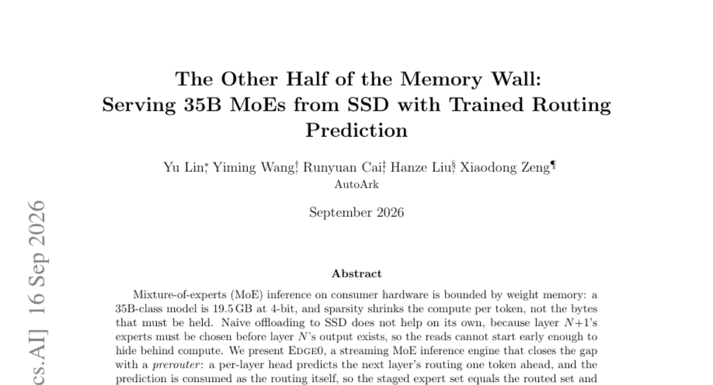

### 📌 한 줄 요약
SSD 오프로딩 환경에서 예측 라우팅을 통해 35B급 MoE 모델을 저사양 하드웨어에서 고속으로 추론하는 엔진 개발

### 🔑 핵심 포인트
- 프리라우터(Prerouter): 다음 레이어의 전문가를 미리 예측하여 SSD 로딩과 연산을 중첩(Overlap)시킴
- Edge0 엔진: 예측된 라우팅 정보를 실제 라우팅으로 사용하여 데이터 손실 없이 스트리밍 추론 구현
- LoRA 복구: 4-bit 양자화 및 예측 오차로 인한 성능 저하를 unmerged recovery LoRA로 보완

### 🧑‍💻 개발자 관점
고가의 H100/A100 없이도 소비자용 GPU와 SSD만으로 대규모 MoE 모델을 효율적으로 서빙할 수 있는 실질적인 방법론을 제시합니다.

### 🚀 실무 적용 아이디어
- 제시된 Edge0 프레임워크의 오픈소스 코드를 활용하여 로컬 SSD 환경에서의 추론 속도 테스트
- 다양한 양자화 비트(int4 vs fp8 등)에 따른 LoRA 복구 성능 차이 검증
- SSD 읽기 속도(NVMe vs SATA) 변화가 전체 추론 처리량(throughput)에 미치는 영향 분석

### ⚠️ 리스크/한계
- 라우팅 예측 오차 발생 시 모델의 답변 품질이 급격히 저하될 위험이 있음
- SSD I/O 성능에 대한 의존도가 매우 높아 스토리지 성능이 병목이 될 수 있음

### 📝 초록 기반 상세 설명
소비자용 하드웨어에서 35B급 MoE 모델을 구동할 때, 모델 크기로 인한 메모리 부족과 연산량 대비 높은 데이터 전송량(Memory Wall)이 병목 현상을 일으킵니다. 기존의 SSD 오프로딩 방식은 다음 레이어의 전문가(Expert)를 미리 알 수 없어 연산과 데이터 로딩을 중첩시키기 어렵다는 문제가 있습니다. 이를 해결하기 위해 Edge0는 다음 레이어의 라우팅을 미리 예측하는 '프리라우터(prerouter)' 기술을 도입하여 데이터 로딩과 연산을 동시에 수행합니다. 또한, 양자화 및 예측 오차로 인한 품질 저하를 방식을 보완하기 위해 학습된 LoRA 어댑터를 사용합니다. 그 결과, 24GB 메모리 환경에서 35B MoE 모델을 20tok/s의 속도로 구동하며 높은 성능을 유지합니다.

---

## 20. [CERA-MoA: Co-Evolving Routing Mechanisms with Continually Learning LLM Agents](https://huggingface.co/papers/2609.18779)
**Upvotes**: 2 | **도입 난이도**: 상 | **신뢰도**: 상
**arXiv**: https://arxiv.org/abs/2609.18779

**태그**: Agent, MoA, Reinforcement Learning, LLM, RAG, Evaluation

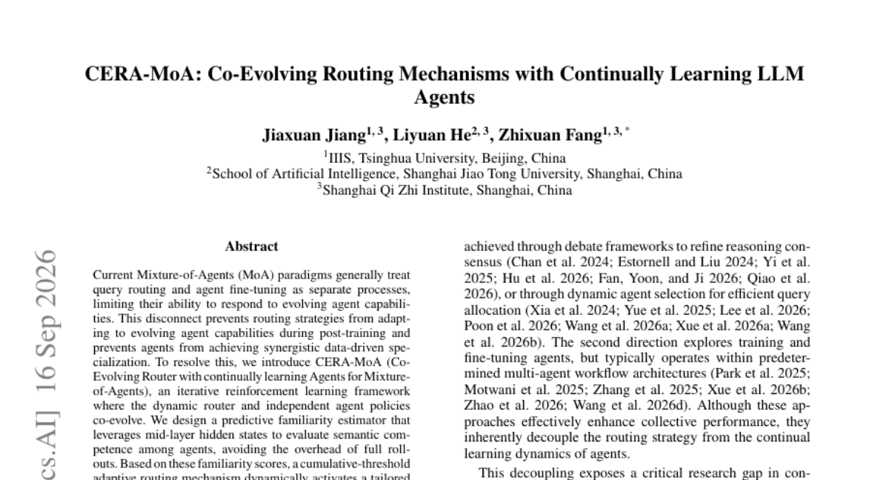

### 📌 한 줄 요약
에이전트의 능력 변화와 라우팅 전략을 동시에 최적화하여 성능과 효율성을 모두 잡은 공진화형 MoA 프레임워크

### 🔑 핵심 포인트
- 라우터와 에이전트 정책이 상호 보완하며 발전하는 반복적 강화학습 프레임워크 설계
- 중간 레이어 은닉 상태를 활용해 연산 오버헤드를 최소화한 에이전트 역량 평가 메커니즘
- 에이전트별 역량 차별화를 유도하는 타겟팅된 데이터 할당 및 적응형 라우팅 전략

### 🧑‍💻 개발자 관점
에이전트 모델이 업데이트될 때마다 라우팅 로직을 수동으로 재설계할 필요 없이, 자동화된 학습 루프를 통해 최적의 에이전트 조합을 유지할 수 있습니다.

### 🚀 실무 적용 아이디어
- 중간 레이어 특징(Hidden States) 추출 시 발생하는 연산 비용 측정 실험
- 에이전트 수가 증가함에 따라 라우팅 효율성이 어떻게 변하는지 벤치마크 테스트
- 특정 도메인 데이터로 에이전트 전문화(Specialization)가 발생하는지 시각화 분석

### ⚠️ 리스크/한계
- 강화학습 기반의 공진화 과정에서 학습 불안정성(Instability) 발생 가능성
- 에이전트 간 역량 차별화가 과도할 경우 특정 에이전트에 대한 의존도 심화 우려

### 📝 초록 기반 상세 설명
기존의 Mixture-of-Agents(MoA) 방식은 쿼리 라우팅과 에이전트 미세 조정이 분리되어 있어, 에이전트의 능력이 변할 때 라우팅 전략이 이를 따라가지 못하는 문제가 있었습니다. 이를 해결하기 위해 에이전트 정책과 동적 라우터가 서로 상호작용하며 발전하는 CERA-MoA 프레임워크를 제안합니다. 중간 레이어의 은닉 상태를 활용한 '예측 친숙도 추정기'를 통해 전체 추론 과정 없이도 에이전트의 역량을 평가합니다. 또한 누적 임계값 기반의 적응형 라우팅을 통해 최소한의 에이전트만 활성화하여 효율성을 확보합니다. 실험 결과, CERA-MoA는 기존의 정적 라우팅 및 고정 워크플로우 방식보다 뛰어난 성능과 효율성을 입증했습니다.

---

## 21. [Assessing nnU-Net Generalization across Brain Tumor Populations in BraTS-GoAT 2026](https://huggingface.co/papers/2609.15524)
**Upvotes**: 2 | **도입 난이도**: 하 | **신뢰도**: 상
**arXiv**: https://arxiv.org/abs/2609.15524

**태그**: Medical Imaging, Segmentation, Generalization, nnU-Net, RAG, Evaluation, Inference

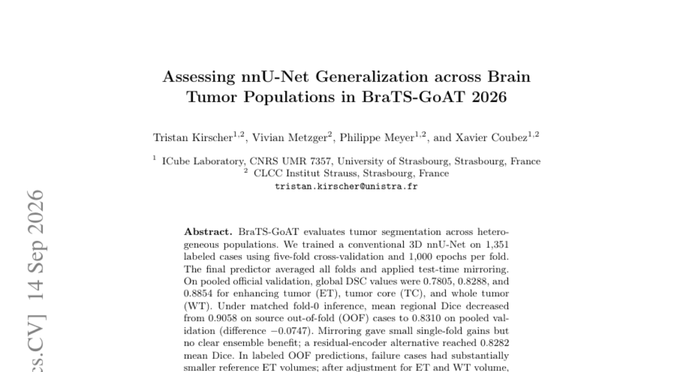

### 📌 한 줄 요약
다양한 환자군 데이터셋에서 nnU-Net의 일반화 성능 저하 원인과 종양 크기/형태에 따른 성능 변동성을 분석함

### 🔑 핵심 포인트
- 1,351개 케이스 기반 3D nnU-Net의 일반화 성능 검증
- 데이터 분포 변화(OOF vs Validation)에 따른 성능 저하 현상 확인
- 종양 크기가 작거나 형태가 파편화될수록 Dice 점수가 낮아지는 상관관계 규명

### 🧑‍💻 개발자 관점
모델 성능 지표가 높더라도 데이터 분포 변화나 작은 타겟 객체에 따라 실제 성능이 급격히 떨어질 수 있음을 시사합니다.

### 🚀 실무 적용 아이디어
- 작은 크기의 객체에 대한 Loss 가중치 조절 실험
- 데이터 분포 불일치(Domain Shift) 상황에서의 강건성 테스트
- 종양 분절(Segmentation) 결과의 연결성(Connectivity) 평가 지표 도입

### ⚠️ 리스크/한계
- 작은 볼륨의 객체에 대한 모델의 취약성 존재
- 데이터 분포 차이에 따른 성능 저하를 완전히 극복하지 못함

### 📝 초록 기반 상세 설명
BraTS-GoAT 챌린지는 이질적인 환자군 사이의 종양 분할 일반화 성능을 평가합니다. 연구진은 1,351개의 라벨링된 케이스를 사용하여 3D nnU-Net을 학습시켰습니다. 검증 결과, ET, TC, WT 영역에서 각각 0.7805, 0.8288, 0.8854의 DSC를 기록했습니다. 학습 데이터와 다른 분포의 검증 데이터 적용 시 성능 저하가 관찰되었습니다. 분석 결과, 작은 ET(Enhancing Tumor) 볼륨과 분절된 종양 형태가 낮은 Dice 점수의 주요 원인으로 나타났습니다.

### 🖼️ 추가 자료
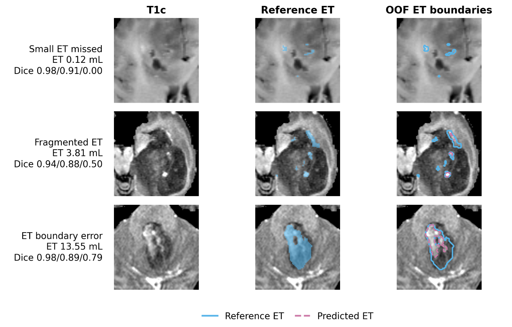
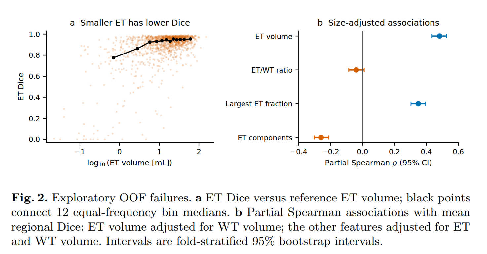

---

## 22. [Fingers as Legs: Learning Self-Supported Locomotion and Manipulation with an Anthropomorphic Hand](https://huggingface.co/papers/2609.17172)
**Upvotes**: 1 | **도입 난이도**: 상 | **신뢰도**: 상
**arXiv**: https://arxiv.org/abs/2609.17172

**태그**: Reinforcement Learning, Robotics, Locomotion, Manipulation, Sim-to-Real, Vision

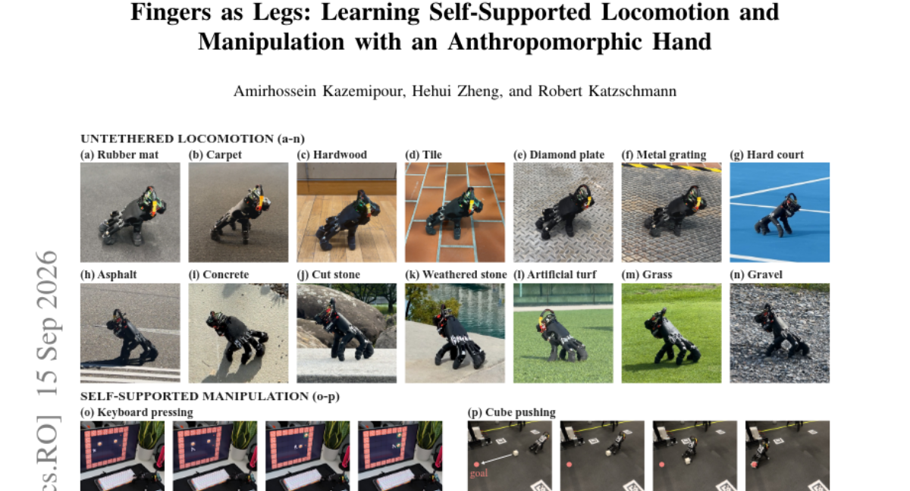

### 📌 한 줄 요약
인간형 손의 손가락을 이동과 조작에 동시에 활용하는 모바일 매니퓰레이터 학습 프레임워크

### 🔑 핵심 포인트
- 이동과 조작을 하나의 손가락 메커니즘으로 통합한 설계
- 비대칭적 손가락 구조를 고려한 시뮬레이션 기반 강화학습 방법론
- 자립형 이동(Crawling)과 환경 상호작용(Manipulation)의 동시 수행

### 🧑‍💻 개발자 관점
하드웨어 설계의 복잡도를 줄이면서도 이동성과 작업성을 동시에 확보하는 로봇 제어 전략을 배울 수 있습니다.

### 🚀 실무 적용 아이디어
- 비대칭적 액추에이터 구조를 가진 로봇의 RL 학습 환경 구축 실험
- 이동과 조작 보상 함수 간의 트레이드오프 최적화 연구
- 시뮬레이션-실제 간의 Sim-to-Real 간극 최소화 전략 적용

### ⚠️ 리스크/한계
- 손가락에 가해지는 하중 집중으로 인한 하드웨어 내구성 문제
- 이동 시 발생하는 진동이 정밀 조작 작업에 미치는 영향

### 📝 초록 기반 상세 설명
기존 로봇은 이동과 조작을 위한 메커니즘이 분리되어 있어 부피와 복잡성 문제가 존재합니다. 본 연구는 손가락을 다리처럼 사용하여 이동과 상호작용을 동시에 수행하는 인간형 손 로봇을 제안합니다. 하드웨어 측정값을 기반으로 캘리브레이션된 시뮬레이션 환경에서 강화학습을 통해 비대칭적인 손가락 구조를 고려한 정책을 학습시켰습니다. 실험 결과, 제안된 보상 체계는 기존 4족 보행용 보상보다 빠른 이동을 가능하게 했습니다. 하드웨어 실증을 통해 자립형 크롤링, 조향, 낙하 회복 및 물체 조작 능력을 입증했습니다. 이를 통해 별도의 이동 장치 없이도 이동과 조작이 가능한 컴팩트한 모바일 매니퓰레이터의 가능성을 보여주었습니다.

---

## 23. [Fathom: Per-Query Read Depth for Sparse Decoding over Offloaded KV Caches](https://huggingface.co/papers/2609.17652)
**Upvotes**: 1 | **도입 난이도**: 중 | **신뢰도**: 상
**arXiv**: https://arxiv.org/abs/2609.17652

**태그**: LLM, KV-Cache, Inference-Optimization, Quantization, Agent

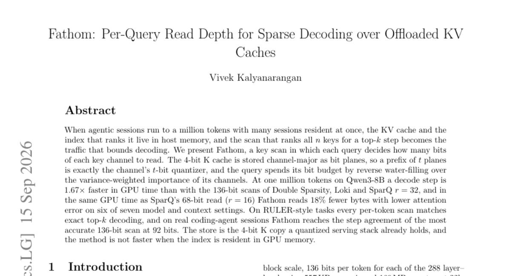

### 📌 한 줄 요약
KV 캐시 스캔 시 쿼리별로 필요한 비트만 선택적으로 읽어 대규모 컨텍스트 디코딩 속도를 높이는 기술

### 🔑 핵심 포인트
- 쿼리별 가변 비트 읽기(Per-Query Read Depth)를 통한 데이터 전송량 최적화
- 4비트 K 캐시를 채널별 비트 평면(bit planes) 구조로 저장하여 부분 읽기 구현
- 분산된 중요도에 따른 역수위조절(reverse water-filling) 방식으로 비트 예산 할당

### 🧑‍💻 개발자 관점
수백만 토큰 규모의 긴 컨텍스트를 다루는 에이전트 환경에서 GPU 메모리 대역폭 병목을 효과적으로 해결할 수 있습니다.

### 🚀 실무 적용 아이디어
- 4비트 양자화된 KV 캐시를 비트 평면 구조로 재구성하는 데이터 구조 설계 실험
- 다양한 컨텍스트 길이에서 쿼리별 비트 할당 알고리즘의 정확도-속도 트레이드오프 측정
- 기존 SparQ나 Loki 같은 Sparse Decoding 방식과의 성능 비교 벤치마크 수행

### ⚠️ 리스크/한계
- 비트 평면 구조를 위한 특수한 데이터 저장 방식이 필요함
- 인덱스가 GPU 메모리에 상주하는 상황에서는 성능 향상 폭이 제한적일 수 있음

### 📝 초록 기반 상세 설명
에이전트 세션이 길어지고 다수의 세션이 동시에 실행되면, 호스트 메모리에 저장된 KV 캐시를 스캔하는 과정이 디코딩 성능의 병목이 됩니다. 기존 방식은 모든 키를 전체 비트로 읽어야 하므로 데이터 전송량이 과도하게 발생합니다. Fathom은 각 쿼리가 채널별 중요도에 따라 읽을 비트 수를 결정하는 가변적 스캔 방식을 제안합니다. 4비트 K 캐시를 비트 평면(bit planes) 형태로 저장하여, 쿼리가 필요한 만큼의 상위 비트만 읽어 연산량을 조절합니다. 실험 결과, 기존 Sparse Decoding 방식보다 훨씬 적은 데이터 전송량으로도 높은 정확도와 빠른 디코딩 속도를 달성했습니다.

### 🖼️ 추가 자료
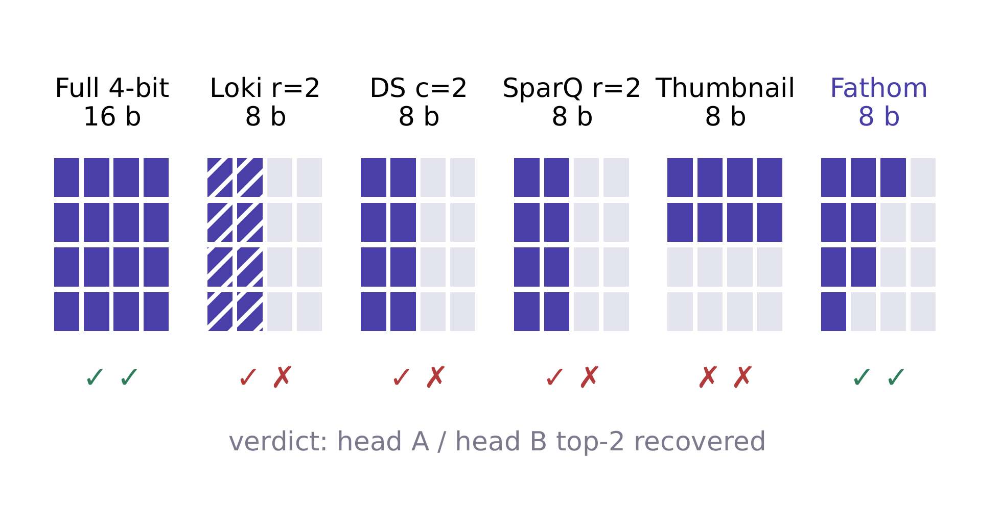

---

