# 2026-09-20 Daily Papers (Top 24)

## 오늘의 요약
오늘의 연구는 에이전트의 효율적인 운영을 위한 컨텍스트 관리 및 비용 최적화, 그리고 멀티모달 모델의 물리적 세계 추론 능력 검증에 집중되었습니다. 또한, 모델 증류나 자동화 루프를 통한 성능 향상과 보안 및 사회적 추론과 같은 실질적인 서비스 환경에서의 평가 방법론이 주요 화두였습니다.

### 오늘의 핵심 포인트
- 에이전트의 토큰 비용과 컨텍스트 관리 문제를 해결하기 위한 효율적인 압축 및 자동화 프레임워크 연구가 활발히 진행되었습니다.
- 멀티모달 모델이 단순 생성을 넘어 물리적 법칙과 복합적인 추론 시나리오를 얼마나 정확히 수행하는지에 대한 평가가 중요하게 다뤄졌습니다.
- 모델 증류 과정에서의 토큰 불일치 문제나 사회적 추론 검증과 같이 실제 배포 환경에서 발생할 수 있는 실무적 난제들이 규명되었습니다.

**오늘의 태그**: AI Agent, LLM Optimization, Multimodal Reasoning, Efficiency

## 1. [DeepSeek-V4.1-Flash: Pushing the Limits of KV Cache Compression](https://huggingface.co/papers/2609.19969)
**Upvotes**: 91 | **도입 난이도**: 상 | **신뢰도**: 상
**arXiv**: https://arxiv.org/abs/2609.19969

**태그**: LLM, KV-Cache, MoE, Agent, Inference-Optimization, RAG, Multimodal, Optimization

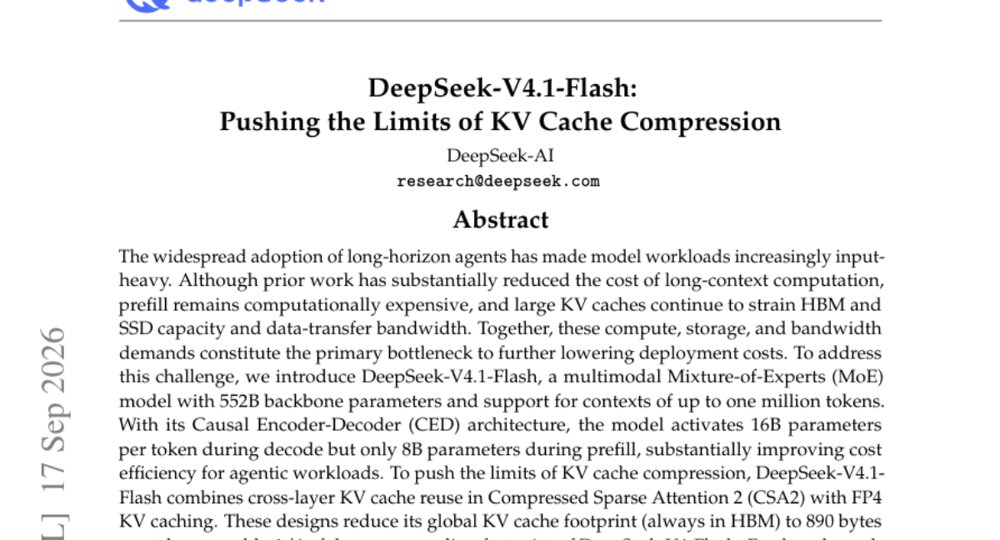

### 📌 한 줄 요약
KV 캐시 압축 기술을 통해 초장거리 컨텍스트와 대규모 에이전트 워크로드를 위한 비용 효율적인 추론 환경을 구축함

### 🔑 핵심 포인트
- CED(Causal Encoder-Decoder) 아키텍처를 통한 프리필/디코딩 연산 효율 최적화
- CSA2(Cross-layer KV cache reuse) 및 FP4 캐싱을 통한 글로벌 KV 캐시 점유율 1/4 수준 절감
- SWA Bounded Replay를 통한 영구 KV 캐시(SSD/Host) 점유율 1/8 수준 절감

### 🧑‍💻 개발자 관점
초장거리 컨텍스트를 다루는 에이전트 개발 시, 하드웨어 자원(HBM/SSD) 제약을 극복하고 추론 비용을 획기적으로 낮출 수 있는 실질적인 가이드를 제공합니다.

### 🚀 실무 적용 아이디어
- 제시된 CED 구조와 MoE 파라미터 활성화 방식의 연산 효율성 벤치마크 수행
- FP4 및 CSA2 기술 적용 시 모델 성능(Perplexity/Accuracy) 저하 여부 검증
- 대규모 컨텍스트 환경에서 SWA Bounded Replay의 데이터 전송 병목 해소 효과 측정

### ⚠️ 리스크/한계
- FP4와 같은 저정밀도 캐싱 적용 시 발생할 수 있는 정밀도 손실 및 모델 성능 저하 리스크
- 특수 아키텍처(CED, CSA2) 사용에 따른 기존 추론 엔진과의 호환성 문제

### 📝 초록 기반 상세 설명
최근 롱 컨텍스트 에이전트의 확산으로 인해 입력 데이터 비중이 커지면서 프리필(prefill) 연산 비용과 KV 캐시 저장 용량 문제가 심각한 병목 현상으로 부상했습니다. 이를 해결하기 위해 552B 파라미터 규모의 멀티모달 MoE 모델인 DeepSeek-V4.1-Flash를 제안합니다. 이 모델은 Causal Encoder-Decoder(CED) 구조를 채택하여 디코딩 시 16B, 프리필 시 8B 파라미터만 활성화하여 연산 효율을 극대화했습니다. 또한 CSA2(Cross-layer KV cache reuse)와 FP4 캐싱을 결합하여 KV 캐시 점유율을 획기적으로 낮추었으며, SWA Bounded Replay 기술로 SSD/호스트 메모리 상의 영구 캐시 크기를 최소화했습니다. 결과적으로 이전 모델 대비 훨씬 작은 캐시 용량으로도 더 뛰어난 성능을 유지하며 대규모 컨텍스트 처리를 가능하게 했습니다.

---

## 2. [Can MiniMax-H3 Reason About the Physical World? An Evaluation of Omni-Modal Generative Model](https://huggingface.co/papers/2609.18323)
**Upvotes**: 76 | **도입 난이도**: 중 | **신뢰도**: 상
**arXiv**: https://arxiv.org/abs/2609.18323

**태그**: Multimodal, Reasoning, Evaluation, Video-Generation, Vision, Video, Audio, Safety

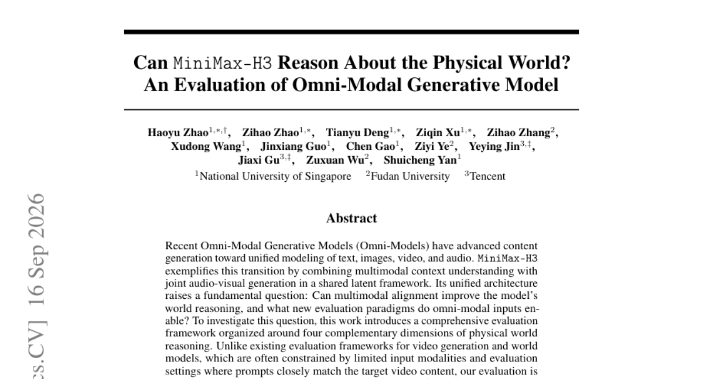

### 📌 한 줄 요약
멀티모달 정렬이 물리적 세계 추론 능력에 미치는 영향을 검증하기 위한 새로운 평가 프레임워크와 MiniMax-H3 모델의 성능 분석

### 🔑 핵심 포인트
- 멀티모달 정렬과 물리적 세계 추론 간의 상관관계를 탐구하는 새로운 평가 프레임워크 제안
- 단일 모달리티의 정보 부족을 다른 모달리티로 보완해야 하는 4가지 복합 추론 시나리오 설계
- MiniMax-H3 모델을 통한 실험적 검증 및 모달리티별 추론 성능 차이 규명

### 🧑‍💻 개발자 관점
멀티모달 모델 설계 시 단순 생성 능력을 넘어, 서로 다른 데이터 타입 간의 상호 보완적 추론 능력을 어떻게 확보할지에 대한 가이드라인을 제공합니다.

### 🚀 실무 적용 아이디어
- 제안된 4가지 시나리오를 기존 비디오 생성 모델에 적용하여 추론 성능 비교
- 오디오-비디오 간의 의미적 불일치가 발생할 때 모델의 추론 안정성 테스트
- 제공된 GitHub 코드를 활용하여 MiniMax-H3의 모달리티별 성능 벤치마크 재현

### ⚠️ 리스크/한계
- 특정 모달리티(예: 오디오)에 대한 추론 성능이 현저히 낮아 범용적 물리 추론에 한계가 있음
- 제안된 평가 방식이 특정 모델 구조에 편향될 가능성 존재

### 📝 초록 기반 상세 설명
최근 텍스트, 이미지, 비디오, 오디오를 통합하는 옴니-모달 생성 모델이 발전하고 있으나, 이러한 멀티모달 정렬이 모델의 물리적 세계 추론 능력을 실제로 향상시키는지에 대한 의문이 남아있습니다. 본 연구는 기존의 단순 프롬프트 기반 평가를 넘어, 서로 다른 모달리티 간의 보완적 정보를 결합해야 하는 새로운 평가 프레임워크를 제안합니다. 연구진은 암시적 프롬프트, 오디오-이미지, 프리픽스 비디오 등 4가지 시나리오를 통해 모델이 부분적인 단서만으로 전체 사건을 추론하도록 설계했습니다. MiniMax-H3 모델을 대상으로 517개의 인스턴스에 대해 실험한 결과, 비디오 기반 의사결정 추론은 높은 성공률을 보였으나 오디오 기반 모호성 해소 추론은 상대적으로 낮은 성능을 기록했습니다. 결과적으로 효과적인 멀티모달 통합이 옴니-모달 모델의 잠재력을 끌어올리는 핵심임을 확인했습니다.

### 🖼️ 추가 자료
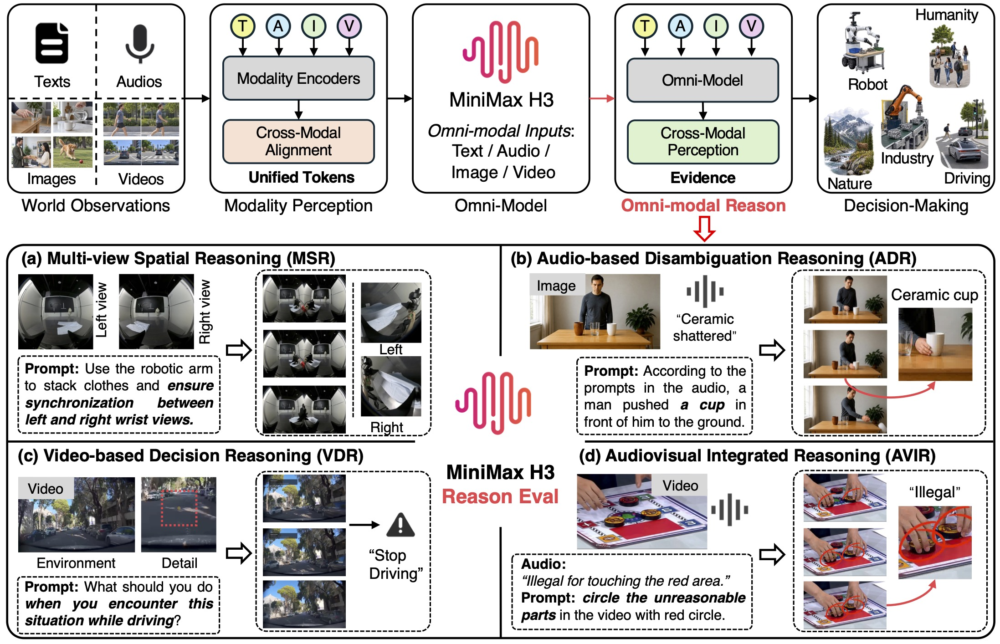

---

## 3. [When EOS Tokens Disagree: Understanding Length Inflation in On-Policy Distillation](https://huggingface.co/papers/2609.20511)
**Upvotes**: 73 | **도입 난이도**: 하 | **신뢰도**: 상
**arXiv**: https://arxiv.org/abs/2609.20511

**태그**: LLM, Distillation, Fine-tuning, Inference Optimization, Safety

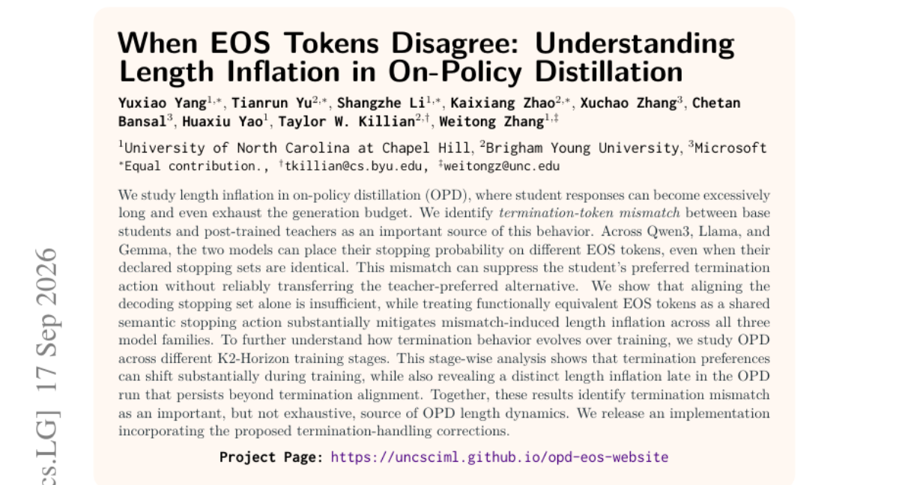

### 📌 한 줄 요약
On-Policy Distillation(OPD) 과정에서 발생하는 모델 간 EOS 토큰 불일치로 인한 답변 길이 팽창 문제를 해결하는 방법론 제시

### 🔑 핵심 포인트
- OPD 과정에서 발생하는 과도한 답변 길이 팽창의 원인을 '종료 토큰 불일치'로 규명
- 단순히 디코딩 중단 세트를 맞추는 것만으로는 충분하지 않음을 증명
- 기능적으로 동일한 EOS 토큰들을 하나의 공유된 의미적 동작으로 처리하여 불일치 완화

### 🧑‍💻 개발자 관점
모델 증류(Distillation) 시 답변이 불필요하게 길어지는 현상을 방지하여 추론 비용을 최적화하고 생성 효율을 높일 수 있습니다.

### 🚀 실무 적용 아이디어
- 학습 시 교사 모델과 학생 모델 간의 EOS 토큰 분포 차이 시각화하기
- 기능적으로 동일한 토큰들을 하나의 로그 확률로 합산하는 방식 적용해보기
- 학습 단계별로 종료 토큰 선호도가 어떻게 변하는지 모니터링하기

### ⚠️ 리스크/한계
- 종료 토큰 불일치가 길이 팽창의 유일한 원인은 아님
- 학습 후반부에 발생하는 특정 길이 팽창 현상은 종료 정렬만으로 해결되지 않을 수 있음

### 📝 초록 기반 상세 설명
On-Policy Distillation(OPD) 과정에서 학생 모델의 답변이 과도하게 길어지며 생성 예산을 소진하는 길이 팽창 현상이 발생합니다. 연구진은 이 현상의 주요 원인이 베이스 학생 모델과 사후 학습된 교사 모델 간의 종료 토큰(EOS) 불일치에 있음을 식별했습니다. 동일한 종료 세트를 사용하더라도 두 모델이 서로 다른 EOS 토큰에 종료 확률을 할당할 수 있으며, 이는 학생의 종료 동작을 억제하는 결과를 초래합니다. 이를 해결하기 위해 기능적으로 동일한 EOS 토큰들을 하나의 공유된 의미적 종료 동작으로 취급하는 방식을 제안했습니다. 실험 결과, 이 방식은 Qwen, Llama, Gemma 등 다양한 모델 제품군에서 길이 팽창 문제를 효과적으로 완화했습니다.

### 🖼️ 추가 자료
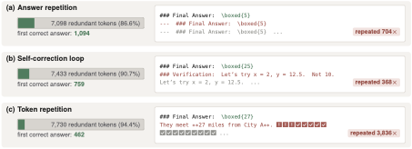

---

## 4. [SoL-Pi: Recursively Scaling Auto-Research Loops for Efficient Agent Harness](https://huggingface.co/papers/2609.20519)
**Upvotes**: 68 | **도입 난이도**: 중 | **신뢰도**: 상
**arXiv**: https://arxiv.org/abs/2609.20519

**태그**: AI Agent, Cost Optimization, Automation, Efficiency, Agent, Reasoning, Evaluation

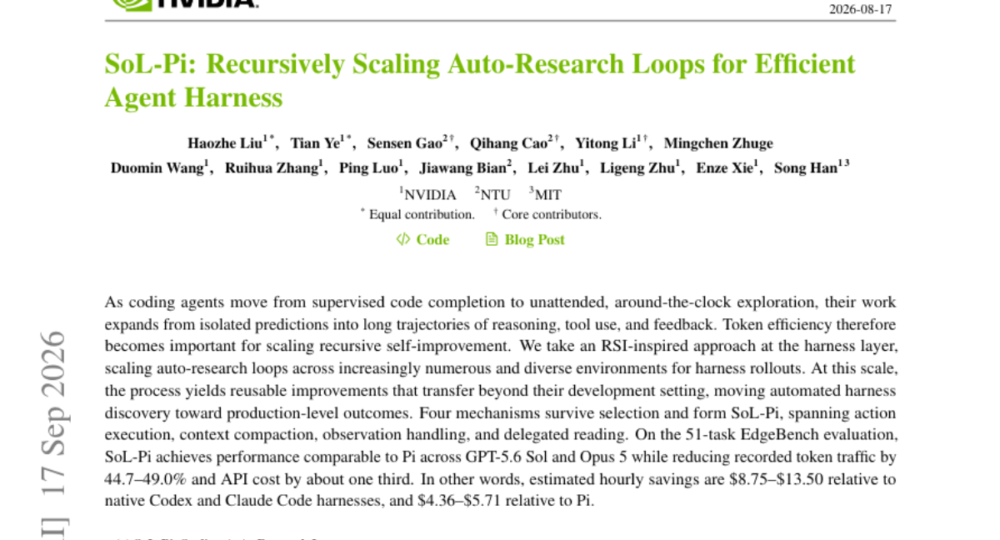

### 📌 한 줄 요약
재귀적 자동 연구 루프를 통해 에이전트의 토큰 효율성을 극대화하고 운영 비용을 획기적으로 절감하는 프레임워크

### 🔑 핵심 포인트
- 재귀적 자동 연구 루프(RSI)를 통한 에이전트 하네스 최적화
- 액션 실행, 컨텍스트 압축, 관찰 처리, 위임 읽기 중심의 4가지 핵심 메커니즘
- 성능 유지와 동시에 토큰 사용량 및 API 비용의 획기적 절감

### 🧑‍💻 개발자 관점
자율형 에이전트 운영 시 발생하는 막대한 토큰 비용과 컨텍스트 관리 문제를 해결하여 실질적인 프로덕션 배포 가능성을 높여줍니다.

### 🚀 실무 적용 아이디어
- 에이전트의 컨텍스트 압축(Context Compaction) 전략을 기존 워크플로우에 적용해보기
- 에이전트 루프 내에서 관찰 데이터(Observation)를 요약/필터링하는 로직 실험
- 비용 절감과 성능 유지 사이의 트레이드오프 지점 파악

### ⚠️ 리스크/한계
- 컨텍스트 압축 과정에서 중요한 세부 정보가 손실될 위험
- 특정 환경에 최적화된 개선 사항이 다른 도메인으로 전이되지 않을 가능성

### 📝 초록 기반 상세 설명
코딩 에이전트가 자율적인 탐색 단계로 진화함에 따라 긴 추론 과정에서 발생하는 토큰 소비와 비용 문제가 중요해졌습니다. 본 논문은 에이전트 하네스 계층에서 자동 연구 루프를 확장하여 다양한 환경에서 재사용 가능한 개선 사항을 도출하는 방식을 제안합니다. 이를 위해 액션 실행, 컨텍스트 압축, 관찰 처리, 위임 읽기라는 네 가지 핵심 메커니즘을 구축했습니다. 실험 결과, SoL-Pi는 기존 모델 성능을 유지하면서도 토큰 트래픽을 약 45-49% 절감하고 API 비용을 약 1/3 수준으로 낮추었습니다. 결과적으로 자동화된 하네스 발견이 프로덕션 수준의 성과를 낼 수 있음을 입증했습니다.

---

## 5. [An Empirical Study of Harness Design for Coding Agents](https://huggingface.co/papers/2609.20804)
**Upvotes**: 55 | **도입 난이도**: 하 | **신뢰도**: 상
**arXiv**: https://arxiv.org/abs/2609.20804

**태그**: AI Agent, Software Engineering, Context Management, Prompt Engineering, Agent, Evaluation

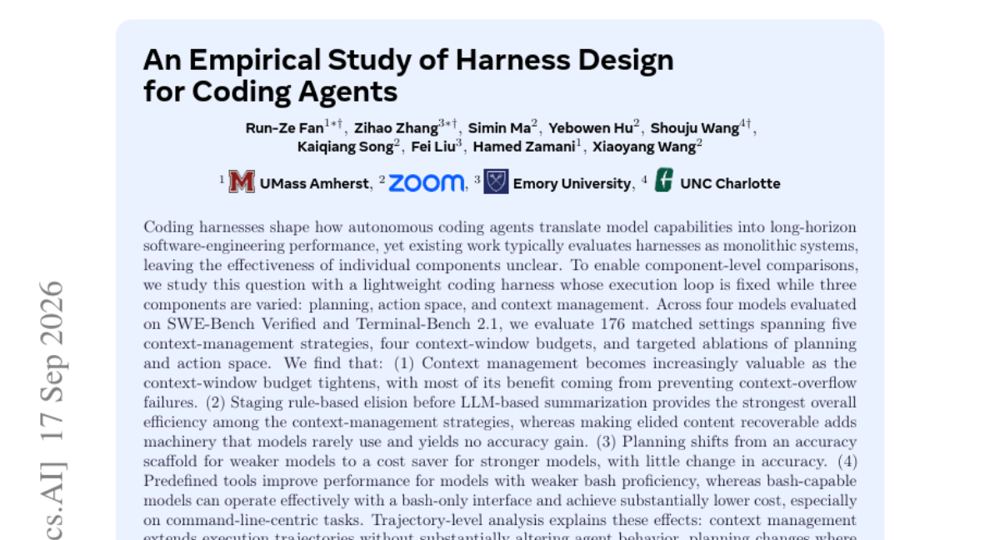

### 📌 한 줄 요약
코딩 에이전트의 성능을 결정하는 핵심 구성 요소(계획, 액션 공간, 컨텍스트 관리) 간의 상호작용과 설계 원칙을 규명한 연구입니다.

### 🔑 핵심 포인트
- 컨텍스트 관리는 컨텍스트 윈도우가 제한될수록 중요하며, 규칙 기반 생략(Rule-based elision)이 요약 방식보다 효율적임
- 계획(Planning)은 약한 모델에게는 정확도를 높이는 발판이 되고, 강한 모델에게는 비용 절감 수단이 됨
- 액션 공간은 모델의 Bash 숙련도에 따라 최적화가 필요하며, Bash 능력이 높으면 단순 인터페이스가 비용 면에서 유리함

### 🧑‍💻 개발자 관점
에이전트 구축 시 무조건 큰 모델을 쓰는 대신, 예산과 모델 성능에 맞춰 컨텍스트 관리와 도구 구성을 어떻게 조합해야 하는지에 대한 실무적 가이드를 제공합니다.

### 🚀 실무 적용 아이디어
- 현재 사용 중인 에이전트의 컨텍스트 관리 전략을 '요약' 대신 '규칙 기반 생략'으로 변경하여 효율성 테스트
- 모델의 Bash 숙련도에 따라 Predefined tools와 Bash-only 인터페이스 간의 비용 대비 성능 비교
- 모델 성능(Strong vs Weak)에 따른 Planning 단계의 필요성 및 비용 효율성 검증

### ⚠️ 리스크/한계
- 실험이 특정 벤치마크(SWE-Bench 등)에 국한되어 있어 모든 도메인에 일반화하기 어려울 수 있음
- 모델의 기본 역량(Bash 등)에 따라 최적의 하네스 설계가 완전히 달라지므로 범용적인 단일 솔루션을 정의하기 어려움

### 📝 초록 기반 상세 설명
코딩 에이전트의 성능은 하네스(Harness) 설계에 크게 좌우되지만, 기존 연구들은 개별 구성 요소의 효과를 분리하여 평가하는 데 한계가 있었습니다. 본 연구는 실행 루프를 고정하고 계획(Planning), 액션 공간(Action Space), 컨텍스트 관리(Context Management) 세 요소를 변수로 두는 경량화된 프레임워크를 제안합니다. SWE-Bench Verified와 Terminal-Bench 2.1을 통해 176개의 설정값을 실험한 결과, 컨텍스트 관리는 예산이 적을수록 중요하며 규칙 기반 생략이 효율적임을 확인했습니다. 또한 계획 단계는 모델 성능에 따라 역할이 변하며, 액션 공간은 모델의 Bash 숙련도에 따라 최적의 도구 구성이 달라짐을 발견했습니다. 이러한 결과는 모델 성능과 예산에 최적화된 모듈형 에이전트 설계 가이드를 제공합니다.

### 🖼️ 추가 자료
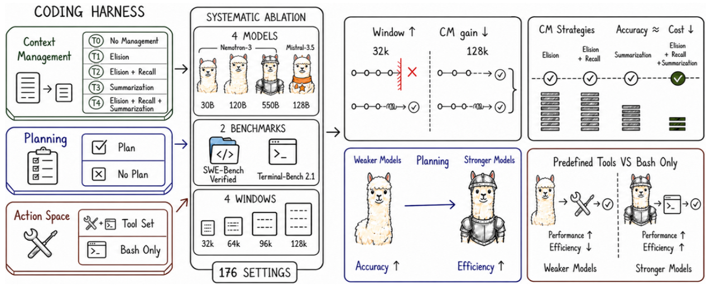
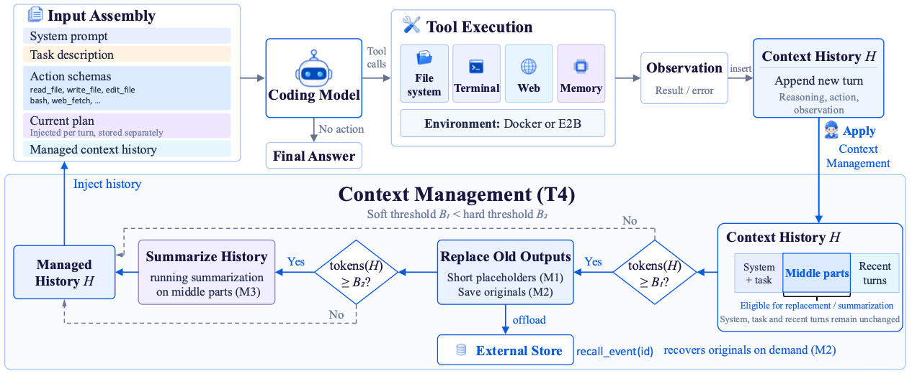

---

## 6. [JEPA-Anything: Learning Predictive Models across Different Worlds](https://huggingface.co/papers/2609.20800)
**Upvotes**: 38 | **도입 난이도**: 상 | **신뢰도**: 상
**arXiv**: https://arxiv.org/abs/2609.20800

**태그**: World Modeling, JEPA, Representation Learning, Scientific Discovery, RAG, Vision, Evaluation

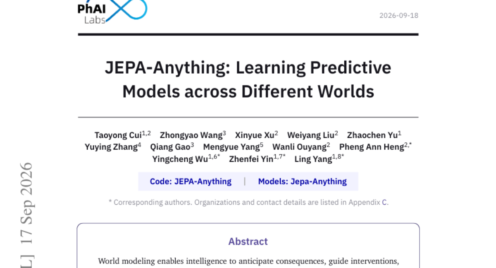

### 📌 한 줄 요약
도메인에 구애받지 않고 다양한 물리/생물학적 시스템에 적용 가능한 범용 세계 모델링 프레임워크 제안

### 🔑 핵심 포인트
- 직교 예측 분해(OPF)를 통한 잠재 타겟의 요소 분해 및 학습 프레임워크 개발
- 비전부터 분자 역학까지 7개 이종 도메인을 아우르는 범용적 성능 검증
- 단순 예측을 넘어 생물학적 개입 및 물리 법칙(Keplerian scaling) 재현 성공

### 🧑‍💻 개발자 관점
특정 도메인에 특화된 모델을 매번 새로 만드는 대신, 하나의 구조로 물리/생물/제어 등 다양한 동적 시스템을 모델링할 수 있는 가능성을 제시합니다.

### 🚀 실무 적용 아이디어
- 제공된 코드를 활용하여 서로 다른 물리 법칙을 가진 데이터셋에 OPF 적용 테스트
- 기존 JEPA 모델과 JEPA-Anything의 요소 분해(Factorization) 능력 비교 실험
- 시계열 데이터의 장기 예측(Long-horizon) 성능 벤치마크 수행

### ⚠️ 리스크/한계
- 도메인 간 데이터 특성이 극단적으로 다를 경우 요소 분해의 안정성 문제 가능성
- 복잡한 시스템에서의 연산 비용 및 학습 수렴 난이도

### 📝 초록 기반 상세 설명
기존의 세계 모델링은 특정 도메인에 국한되어 학습되는 한계가 있었습니다. 본 논문은 서로 다른 시스템 간에도 공통적으로 적용 가능한 학습 원리를 탐구합니다. 이를 위해 잠재 타겟을 상호 보완적인 요소로 분해하고 학습하는 '직교 예측 분해(OPF)' 기반의 JEPA-Anything 프레임워크를 제안합니다. 비전, 생물학, 기상, 분자 역학 등 7개 이종 도메인에서 실험을 진행했습니다. 실험 결과, 기존 JEPA 베이스라인 대비 역학 예측 성능을 크게 향상시켰으며 생물학적 개입 및 물리 법칙 복원에서도 우수한 성과를 보였습니다. 이는 범용적인 예측 원리가 과학적 발견과 개입 전략 수립에 기여할 수 있음을 입증합니다.

---

## 7. [Verifiable Social Reasoning for LLM Assistants](https://huggingface.co/papers/2609.17496)
**Upvotes**: 33 | **도입 난이도**: 중 | **신뢰도**: 상
**arXiv**: https://arxiv.org/abs/2609.17496

**태그**: Multi-Agent, LLM Evaluation, Social Reasoning, Simulation, Agent, Reasoning, Evaluation

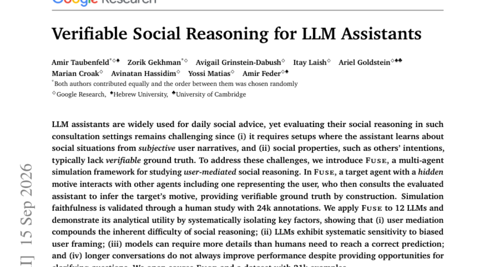

### 📌 한 줄 요약
사용자 중재 상황에서의 LLM 사회적 추론 능력을 검증하기 위한 멀티 에이전트 시뮬레이션 프레임워크 'Fuse' 제안

### 🔑 핵심 포인트
- 검증 가능한 정답 생성이 가능한 멀티 에이전트 시뮬레이션 프레임워크 'Fuse' 개발
- 사용자 중재(User Mediation)가 사회적 추론 난이도에 미치는 영향 규명
- LLM이 사용자의 편향된 프레이밍에 민감하게 반응하는 특성 확인

### 🧑‍💻 개발자 관점
사용자 피드백이나 주관적 서사가 포함된 실제 서비스 환경에서 LLM의 의도 파악 및 사회적 추론 능력을 정량적으로 평가하는 방법론을 제공합니다.

### 🚀 실무 적용 아이디어
- 제공된 21k 데이터셋을 활용하여 현재 개발 중인 에이전트의 사회적 추론 벤치마크 수행
- 사용자의 유도 질문(Framing)이 모델의 판단에 미치는 영향도 테스트
- 멀티 에이전트 환경에서의 대화 길이와 추론 정확도 간의 상관관계 분석

### ⚠️ 리스크/한계
- 시뮬레이션 환경이 실제 인간의 복잡한 사회적 상호작용을 완벽히 재현하는지에 대한 의문
- 에이전트 간의 상호작용 설계 방식에 따라 평가 결과가 달라질 가능성

### 📝 초록 기반 상세 설명
LLM 어시스턴트가 일상적인 사회적 조언을 제공함에 따라 사회적 추론 능력 평가의 중요성이 커지고 있습니다. 그러나 주관적인 사용자 서사와 검증 가능한 정답(ground truth)의 부재로 인해 기존 방식으로는 평가가 어려웠습니다. 이를 해결하기 위해 본 논문은 사용자 중재형 사회적 추론 연구를 위한 멀티 에이전트 시뮬레이션 프레임워크인 Fuse를 도입합니다. Fuse는 숨겨진 의도를 가진 타겟 에이전트와 사용자 역할을 하는 에이전트 간의 상호작용을 통해 검증 가능한 정답을 생성합니다. 12종의 LLM을 대상으로 실험한 결과, 사용자 프레이밍에 따른 편향성과 대화 길이에 따른 성능 변화 등 모델의 사회적 추론 특성을 체계적으로 분석했습니다.

### 🖼️ 추가 자료

---

## 8. [RiskChainBench: A Benchmark for Obfuscated Platform Message Restoration and Evidence-Grounded Web Investigation](https://huggingface.co/papers/2609.16900)
**Upvotes**: 28 | **도입 난이도**: 중 | **신뢰도**: 상
**arXiv**: https://arxiv.org/abs/2609.16900

**태그**: Agent, Security, VLM, Benchmark, Multimodal, Evaluation

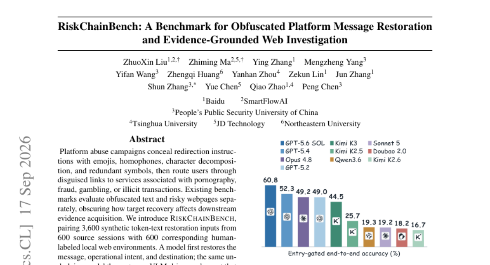

### 📌 한 줄 요약
난독화된 메시지 복원과 웹 에이전트 조사를 결합하여 플랫폼 악용 사례를 탐지하는 통합 벤치마크 제안

### 🔑 핵심 포인트
- 난독화된 메시지 복원과 웹 에이전트 조사를 결합한 엔드투엔드 벤치마크 구축
- 메시지 복원(Entry)과 웹 조사(Web Decision)를 분리 및 결합하여 평가하는 프로토콜 설계
- VLM 기반 에이전트의 증거 기반 리포트 생성 및 신뢰성 평가 프레임워크 제공

### 🧑‍💻 개발자 관점
보안 에이전트 개발 시 텍스트 복원 능력이 실제 웹 탐색 및 증거 수집 결과에 미치는 연쇄적 영향을 정밀하게 측정할 수 있습니다.

### 🚀 실무 적용 아이디어
- VLM 기반 웹 에이전트의 탐색 안정성(Exploration Stability) 강화 실험
- 난독화 복원 모델의 출력이 후속 웹 조사 단계에 미치는 오차 전파 분석
- 멀티모달 모델을 활용한 증거 기반 리포트 생성 자동화 테스트

### ⚠️ 리스크/한계
- 실제 운영 환경과 합성 데이터 간의 도메인 차이 존재 가능성
- 에이전트의 웹 탐색 실패율(31.9%)이 전체 시스템 성능의 주요 제약 요소임

### 📝 초록 기반 상세 설명
플랫폼 악용 캠페인은 이모지나 특수문자 등을 이용해 위험한 링크를 숨겨 사용자를 유도합니다. 기존 벤치마크는 난독화된 텍스트와 위험 웹페이지를 분리하여 평가하므로, 복원 작업이 실제 증거 수집에 미치는 영향을 파악하기 어렵습니다. 이를 해결하기 위해 메시지 복원과 VLM 기반 웹 에이전트 조사를 결합한 RiskChainBench를 도입했습니다. 600개의 세션과 3,600개의 합성 데이터를 통해 메시지 복원과 웹 조사 성능을 동시에 평가합니다. 실험 결과, 에이전트의 탐색 안정성과 위험 판단 능력이 주요 병목 구간임을 확인했습니다.

---

## 9. [RetireOPD: Self-Retiring On-Policy Distillation for Agentic Reinforcement Learning](https://huggingface.co/papers/2609.20784)
**Upvotes**: 26 | **도입 난이도**: 중 | **신뢰도**: 상
**arXiv**: https://arxiv.org/abs/2609.20784

**태그**: Agent, Reinforcement Learning, Knowledge Distillation, LLM, Vision, Distillation

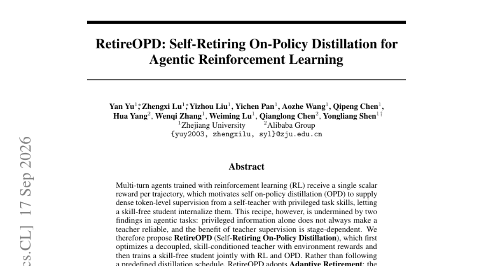

### 📌 한 줄 요약
에이전트 RL 학습 시 교사 모델의 개입 시점을 자동 결정하여 성능을 극대화하는 적응형 증류 기법

### 🔑 핵심 포인트
- Decoupled Teacher-Student 구조: 환경 보상 기반의 숙련된 교사와 스킬이 없는 학생 모델을 분리하여 학습
- Adaptive Retirement: 학생 모델의 성능에 따라 교사 모델의 개입을 자동으로 중단하는 스케줄링 전략
- Self-Retiring Mechanism: 교사 의존도를 낮추고 학생 모델이 독자적인 성능을 확보하도록 유도

### 🧑‍💻 개발자 관점
에이전트 학습 시 수동적인 스케줄링 없이도 교사 모델의 지식을 효율적으로 흡수하고 독립적인 성능을 확보할 수 있는 프레임워크를 제공합니다.

### 🚀 실무 적용 아이디어
- 기존 OPD 방식과 RetireOPD의 수렴 속도 및 최종 성능 비교 실험
- 교사 모델의 성능 수준(Success Rate)에 따른 Retirement 임계값 민감도 테스트
- 스킬이 포함된 교사와 스킬이 없는 학생 간의 지식 전이 효율성 검증

### ⚠️ 리스크/한계
- 교사 모델의 성능이 너무 낮을 경우 학생 모델의 학습 방향이 왜곡될 위험
- 특정 태스크에 특화된 교사 모델이 범용 에이전트 학습에 미치는 일반화 한계

### 📝 초록 기반 상세 설명
멀티턴 에이전트 RL 학습은 최종 보상만 주어지는 희소 보상 문제를 해결하기 위해 교사 모델의 지식을 전수하는 On-Policy Distillation(OPD)을 활용합니다. 그러나 교사 모델의 정보가 항상 신뢰할 수 없으며, 교사의 개입이 학습 단계에 따라 효과가 다를 수 있다는 문제가 있습니다. 이를 해결하기 위해 제안된 RetireOPs는 먼저 환경 보상으로 숙련된 교사를 최적화한 후, 학생 모델이 RL과 OPD를 병행하며 학습하도록 합니다. 특히 학생이 교사와의 격차가 줄어들고 일정 성능에 도달하면 스스로 교사를 배제하는 'Adaptive Retirement' 전략을 도입했습니다. 실험 결과, Qwen2.5 모델 기반의 에이전트 작업에서 기존 RL 대비 성능을 대폭 향상시켰으며 교사 모델의 성능까지 상회하는 결과를 보였습니다.

---

## 10. [Self-Evolving Search Index](https://huggingface.co/papers/2609.19656)
**Upvotes**: 25 | **도입 난이도**: 중 | **신뢰도**: 상
**arXiv**: https://arxiv.org/abs/2609.19656

**태그**: RAG, Information Retrieval, LLM Agent, Self-Evolving, Agent, Vision, Evaluation

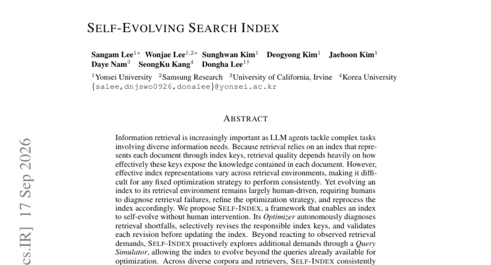

### 📌 한 줄 요약
인간의 개입 없이 검색 환경에 맞춰 인덱스 키를 스스로 최적화하고 진화시키는 자율형 인덱스 프레임워크

### 🔑 핵심 포인트
- 인간 개입 없는 자율적 인덱스 진단 및 수정 루프 구축
- Query Simulator를 통한 선제적/능동적 인덱스 확장 전략
- 다양한 검색 환경 및 다운스트림 에이전트 작업에서의 성능 향상

### 🧑‍💻 개발자 관점
RAG 시스템 구축 시 수동으로 키워드를 추출하거나 인덱스를 튜닝하는 반복적인 운영 공수를 획기적으로 줄일 수 있습니다.

### 🚀 실무 적용 아이디어
- 기존 RAG 파이프라인의 인덱스 생성 로직과 SELF-INDEX의 비교 실험
- 특정 도메인 데이터셋(법률, 의료 등)에서의 자율 진단 정확도 검증
- Query Simulator가 생성한 쿼리가 실제 사용자 쿼리 분포와 얼마나 일치하는지 분석

### ⚠️ 리스크/한계
- 인덱스 수정 과정에서 발생할 수 있는 과적합(Overfitting) 위험
- 지속적인 인덱스 재처리(Reprocessing)에 따른 컴퓨팅 비용 발생 가능성

### 📝 초록 기반 상세 설명
LLM 에이전트의 복잡한 작업 수행을 위해 정보 검색의 중요성이 커지고 있으나, 고정된 인덱스 최적화 전략은 변화하는 검색 환경에 대응하기 어렵습니다. 기존의 인덱스 최적화는 사람이 직접 실패 사례를 진단하고 전략을 수정해야 하는 번거로움이 있었습니다. 본 논문은 인간의 개입 없이 인덱스가 스스로 진화하는 SELF-INDEX 프레임워크를 제안합니다. 이 프레임워크는 Optimizer가 검색 실패를 자율적으로 진단하고 키를 수정하며, Query Simulator를 통해 잠재적 수요를 선제적으로 탐색합니다. 실험 결과, 다양한 코퍼스와 리트리버 환경에서 기존 최적화 방식보다 우수한 성능을 보였습니다. 또한 RAG 에이전트와 메모리 시스템의 효율성을 높이는 데에도 효과적임을 입증했습니다.

---

## 11. [Reflect, Revise, Reuse: Training-Free Skill Evolution for GUI Agents](https://huggingface.co/papers/2609.17653)
**Upvotes**: 25 | **도입 난이도**: 중 | **신뢰도**: 상
**arXiv**: https://arxiv.org/abs/2609.17653

**태그**: Agent, GUI, Self-Evolving, Automation, RAG, Vision, Benchmark, Evaluation

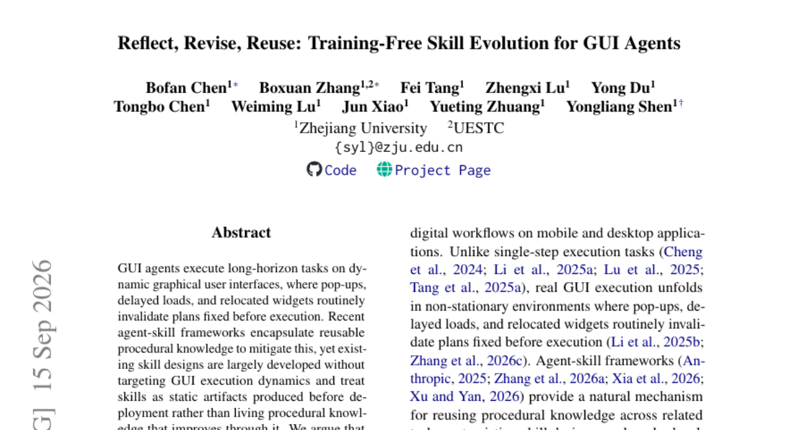

### 📌 한 줄 요약
추가 학습 없이 실행 피드백을 통해 GUI 에이전트의 스킬을 스스로 수정하고 진화시키는 프레임워크 제안

### 🔑 핵심 포인트
- 학습이 필요 없는(Training-free) 실시간 스킬 수정 메커니즘 도입
- 실행 피드백을 기반으로 스킬을 진화시키는 Reflect-Revise-Reuse 루프 설계
- 메타데이터, 실행 계획, 복구 규칙 등을 포함하는 구조화된 스킬 패키지 방식

### 🧑‍💻 개발자 관점
모델을 재학습시키는 비용 없이, 실행 중 발생하는 오류를 스킬 파일 수정만으로 해결하여 에이전트의 운영 효율을 극대화할 수 있습니다.

### 🚀 실무 적용 아이디어
- 제공된 GitHub 코드를 활용하여 특정 GUI 작업에 대한 스킬 패키지 구조 테스트
- 기존 정적 스킬 라이브러리와 EvoSkill-GUI의 복구 성능 비교 실험
- 에이전트의 비판(Critic) 모듈이 생성하는 수정 사항의 유효성 검증

### ⚠️ 리스크/한계
- 스킬 수정 과정에서 잘못된 정보가 축적될 경우 스킬 라이브러리 전체의 오염 가능성
- 복잡한 UI 환경에서 비판(Critic) 모듈의 진단 정확도에 따른 성능 의존성

### 📝 초록 기반 상세 설명
GUI 에이전트는 동적인 UI 환경에서 팝업이나 위젯 위치 변경 등으로 인해 기존 계획이 무효화되는 문제를 겪습니다. 기존의 스킬 기반 프레임워크는 정적인 지식에 의존하여 실행 중 발생하는 동적 변화에 대응하기 어렵습니다. 본 논문은 추가 학습 없이 실행 피드백을 통해 스킬을 수정할 수 있는 EvoSkill-GUI 프레임워크를 제안합니다. 이 프레임워크는 실행-비판-수정의 루프를 통해 스킬 패키지를 구조화하고 자동 업데이트합니다. 실험 결과, MobileWorld, AndroidWorld, OSWorld 벤치마크에서 모델 학습 없이도 성능 향상을 입증했습니다.

---

## 12. [Video DeltaNet: A Video-Native Hybrid Attention for Livestream Video Generation](https://huggingface.co/papers/2609.20744)
**Upvotes**: 23 | **도입 난이도**: 상 | **신뢰도**: 상
**arXiv**: https://arxiv.org/abs/2609.20744

**태그**: Video Generation, Attention Mechanism, Efficiency, Diffusion Models, Video, Audio, Distillation, Safety

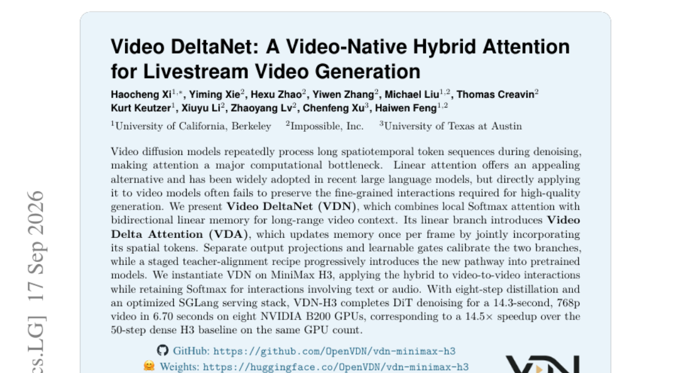

### 📌 한 줄 요약
로컬 Softmax와 양방향 선형 메모리를 결합하여 고해상도 장기 비디오 생성 속도를 14.5배 향상시킨 하이브리드 어텐션 모델

### 🔑 핵심 포인트
- 로컬 Softmax와 양방향 선형 메모리를 결합한 하이브리드 어텐션 구조 제안
- 프레임 단위로 메모리를 업데이트하는 Video Delta Attention(VDA) 도입
- 사전 학습된 모델에 새로운 경로를 점진적으로 이식하는 단계별 교사 정렬(Teacher-alignment) 기법 적용

### 🧑‍💻 개발자 관점
고해상도 장기 비디오 생성 시 발생하는 연산 병목을 효율적으로 해결하여 실시간급 생성 성능을 확보할 수 있는 아키텍처를 제시합니다.

### 🚀 실무 적용 아이디어
- 제안된 VDA 구조를 기존 DiT(Diffusion Transformer) 모델에 이식하여 성능 변화 관찰
- 다양한 해상도 및 프레임 길이 변화에 따른 선형 메모리 효율성 테스트
- SGLang과 같은 서빙 스택과 결합 시의 추론 최적화 프로파일링

### ⚠️ 리스크/한계
- 선형 메모리 방식이 복잡한 공간적 세부 사항을 완벽히 복원할 수 있는지에 대한 검증 필요
- 하이브리드 구조로 인해 모델 구조가 복잡해져 구현 및 유지보수 난이도 상승

### 📝 초록 기반 상세 설명
비디오 확산 모델은 디노이징 과정에서 긴 시공간 토큰을 반복 처리해야 하므로 어텐션 연산이 심각한 병목 현상을 일으킵니다. 기존의 선형 어텐션은 연산 효율은 높지만 고품질 비디오 생성에 필요한 세밀한 상호작용을 유지하기 어렵다는 문제가 있습니다. 이를 해결하기 위해 로컬 Softmax 어텐션과 양방향 선형 메모리를 결합한 Video DeltaNet(VDN)을 제안합니다. VDA(Video Delta Attention)는 프레임당 한 번 메모리를 업데이트하며 공간 토큰을 결합하고, 학습 가능한 게이트를 통해 두 브랜치를 정교하게 조정합니다. 실험 결과, 768p 해상도의 14.3초 비디오 생성을 6.7초 만에 완료하며 기존 베이스라인 대비 14.5배의 속도 향상을 달성했습니다.

---

## 13. [WeVisDoc: From Coverage to Capability for Robust End-to-End Document Parsing](https://huggingface.co/papers/2609.20423)
**Upvotes**: 22 | **도입 난이도**: 중 | **신뢰도**: 상
**arXiv**: https://arxiv.org/abs/2609.20423

**태그**: Document Parsing, Data-centric AI, Robustness, RAG, Vision, Benchmark

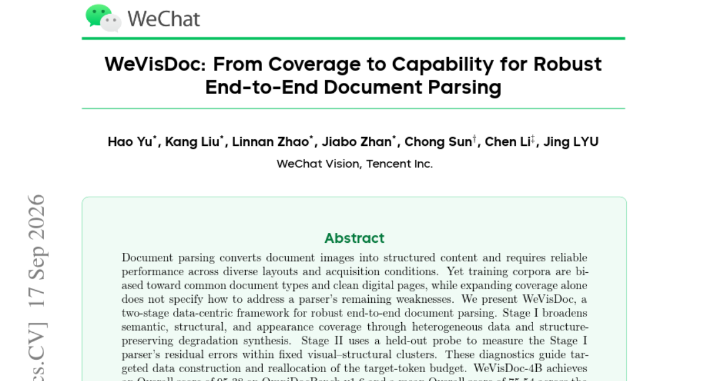

### 📌 한 줄 요약
데이터 커버리지 확장과 정밀 진단을 결합하여 문서 파싱의 취약점을 해결하는 2단계 데이터 중심 프레임워크

### 🔑 핵심 포인트
- 이종 데이터와 구조 보존형 열화 합성을 통한 1단계 데이터 커버리지 확장
- 잔여 오류를 측정하는 프로브를 활용한 2단계 정밀 진단 및 타겟 데이터 구축
- 데이터 중심(Data-centric) 접근법을 통한 모델의 취약점 및 편향성 해결

### 🧑‍💻 개발자 관점
단순히 양질의 데이터를 모으는 것을 넘어, 모델이 실패하는 특정 영역을 정밀하게 타격하여 학습 데이터를 구성하는 전략적 방법론을 제시합니다.

### 🚀 실무 적용 아이디어
- 자체 보유 데이터셋에 구조 보존형 열화(Degradation) 기법 적용 실험
- 모델의 오류 패턴을 클러스터링하여 취약한 도메인 식별하기
- 데이터 예산(Budget)을 오류가 빈번한 클러스터에 집중 배분하는 파이프라인 구축

### ⚠️ 리스크/한계
- 데이터 합성 방식이 실제 현실의 복잡한 노이즈를 완벽히 모사하지 못할 가능성
- 특정 클러스터에 집중된 데이터 재배분이 다른 영역의 성능 저하(Catastrophic Forgetting)를 유발할 위험

### 📝 초록 기반 상세 설명
문서 파싱은 다양한 레이아웃과 획득 조건에서도 신뢰할 수 있는 성능을 유지해야 합니다. 기존 학습 데이터는 특정 문서 유형이나 깨끗한 디지털 페이지에 편향되어 있어, 단순히 데이터 범위를 넓히는 것만으로는 모델의 잔여 약점을 해결하기 어렵습니다. 본 논문은 WeVisDoc라는 2단계 데이터 중심 프레임워크를 제안합니다. 1단계에서는 이종 데이터와 구조 보존형 열화 합성(degradation synthesis)을 통해 의미적, 구조적, 외형적 커버리지를 확장합니다. 2단계에서는 고정된 시각적-구조적 클러스터 내에서 모델의 잔여 오류를 측정하는 프로브(probe)를 사용하여 타겟 데이터 구축과 예산 재배분을 가이드합니다. 실험 결과, WeVisDoc-4B는 OmniDocBench 및 PureDocBench 벤치마크에서 최고 성능을 기록하며 기존 모델 대비 강력한 강건성을 입증했습니다.

---

## 14. [VABench: Measuring Embodied Spatial Intelligence through Visual Demonstrations, Active Perception, and Metric Control](https://huggingface.co/papers/2609.19554)
**Upvotes**: 20 | **도입 난이도**: 중 | **신뢰도**: 상
**arXiv**: https://arxiv.org/abs/2609.19554

**태그**: Embodied AI, MLLM, Robotics, Active Perception, RAG, Evaluation

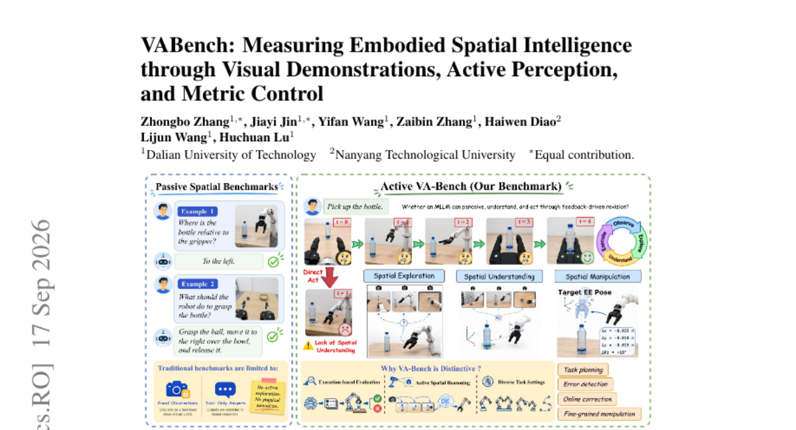

### 📌 한 줄 요약
시각적 데모와 능동적 인식을 통해 복잡한 공간 작업을 수행하는 MLLM의 실질적 로봇 제어 능력을 평가하는 벤치마크 제안

### 🔑 핵심 포인트
- 관찰-추론-행동-수정의 전체 루프를 평가하는 end-to-end 벤치마크 구축
- 특권 정보(Oracle poses) 없이 RGB 데모와 능동적 시점 제어만으로 작업 수행 능력 검증
- 능동적 카메라 제어와 기하학적 일반화(Geometric transfer)의 중요성 입증

### 🧑‍💻 개발자 관점
로봇 제어 모델 개발 시 단순 시각 인식을 넘어, 환경 변화에 대응하는 능동적 관찰과 정밀한 공간 명령(Metric control) 능력을 검증하는 기준이 됩니다.

### 🚀 실무 적용 아이디어
- 제공된 14개 태스크 셋을 활용하여 현재 MLLM의 공간 추론 한계점 파악하기
- 수동적 관찰 대비 능동적 시점 제어(Active perception)가 성공률에 미치는 영향 분석하기
- 학습 데이터에 없는 새로운 기하학적 구조에서의 모델 강건성 테스트하기

### ⚠️ 리스크/한계
- 장기 작업(Long-horizon) 시 누적되는 오차로 인해 성공률이 급격히 저하됨
- 학습되지 않은 새로운 기하학적 배치에 대한 모델의 일반화 성능 부족

### 📝 초록 기반 상세 설명
기존의 공간 지능 평가는 단순 객체 위치 기술에 치중되어 있어, 불완전한 관찰 하에서 정보를 획득하고 행동을 수정하는 루프를 평가하기 어렵습니다. 본 논문은 관찰-추론-행동-수정의 전체 루프를 검증하는 VA-Bench를 소개합니다. 모델은 특권 정보(privileged information) 없이 RGB 데모만으로 절차를 학습하고, 능동적으로 카메라 시점을 선택하며, 미터법 기반 명령을 수행합니다. 실험 결과, 능동적 카메라 제어가 성공률을 크게 높였으나, 기하학적 변화에 따른 일반화 성능은 여전히 낮았으며 장기 작업 수행 능력은 부족함을 확인했습니다. 결과적으로 VA-Bench는 MLLM이 시각적 정보를 실제 물리적 행동으로 전환하는 능력을 엄격히 검증합니다.

---

## 15. [When2Think: Learning Difficulty-Aware Length Control for Efficient Hybrid Reasoning Models](https://huggingface.co/papers/2609.19671)
**Upvotes**: 18 | **도입 난이도**: 중 | **신뢰도**: 상
**arXiv**: https://arxiv.org/abs/2609.19671

**태그**: LLM, Reasoning, Efficiency, Post-training, RAG, Benchmark, Optimization

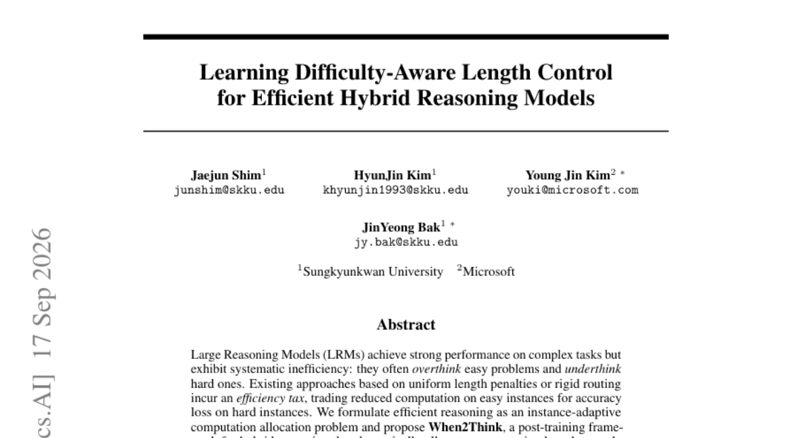

### 📌 한 줄 요약
문제 난이도에 따라 추론 길이를 동적으로 조절하여 정확도 손실 없이 연산 효율을 극대화하는 하이브리드 추론 프레임워크

### 🔑 핵심 포인트
- IDAC(Instance-level Difficulty-Aware Control): 난이도에 따라 추론 깊이를 조절하는 보상 형성 메커니즘 도입
- Critic-free Optimization: 별도의 학습된 보상 모델이나 온라인 참조 모델 없이 안정적인 최적화 달성
- System 1 vs System 2: 쉬운 문제는 즉각 답변하고 어려운 문제에만 심층 추론을 할당하는 하이브리드 전략 구현

### 🧑‍💻 개발자 관점
LLM 서비스 운영 시 문제 난이도에 따른 토큰 비용을 최적화하면서도 성능을 유지할 수 있는 실질적인 가이드를 제공합니다.

### 🚀 실무 적용 아이디어
- 기존 모델에 IDAC와 유사한 보상 체계를 적용하여 추론 길이 변화 관찰
- 난이도별 토큰 사용량과 정확도 간의 상관관계 데이터셋 구축
- Post-training 단계에서 정적 페널티와 동적 보상 방식의 성능 비교 실험

### ⚠️ 리스크/한계
- 사전 계산된 통계치(정확도, 토큰 사용량)에 의존하므로 데이터 분포 변화에 민감할 수 있음
- 특정 벤치마크(수학 등) 외 일반적인 대화형 태스크에서의 범용성 검증 필요

### 📝 초록 기반 상세 설명
최근 대형 추론 모델(LRM)은 복잡한 작업에서 뛰어난 성능을 보이지만, 쉬운 문제에 과도한 연산을 사용하거나 어려운 문제에 부족한 연산을 사용하는 비효율성 문제를 안고 있습니다. 기존의 일률적인 길이 페널티나 경직된 라우팅 방식은 정확도와 효율성 사이의 트레이드오프 문제를 해결하기 어려웠습니다. 본 논문은 효율적 추론을 인스턴스 적응형 연산 할당 문제로 정의하고, 문제 난이도에 따라 연산량을 동적으로 배분하는 When2Think 프레임워크를 제안합니다. 핵심 방법론인 IDAC(Instance-level Difficulty-Aware Control)은 사전 계산된 통계치를 활용한 보상 형성 메커니즘을 통해 별도의 학습된 보상 모델 없이도 안정적인 최적화를 가능하게 합니다. 실험 결과, 수학 벤치마크에서 토큰 사용량을 크게 줄이면서도 정확도(Pass@3)를 높이는 우수한 효율성-정확도 균형을 입증했습니다.

---

## 16. [FAMOS: Feed-Forward 3D Articulation Modeling from Sparse Observations](https://huggingface.co/papers/2609.20817)
**Upvotes**: 17 | **도입 난이도**: 중 | **신뢰도**: 상
**arXiv**: https://arxiv.org/abs/2609.20817

**태그**: 3D Vision, Robotics, Point Cloud, Motion Modeling, RAG

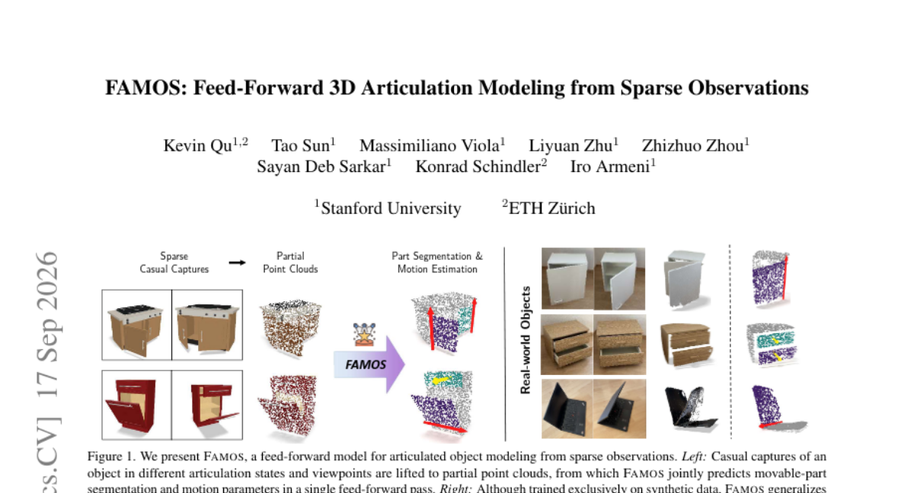

### 📌 한 줄 요약
여러 관점의 희소한 포인트 클라우드 데이터를 통합하여 물체의 움직이는 부위와 관절 파라미터를 예측하는 피드포워드 모델링 기술

### 🔑 핵심 포인트
- 다중 관측 데이터를 통합하는 Multi-state Articulation Transformer 도입
- 관측된 움직임 범위를 활용하는 observed articulation span 목적 함수 제안
- 데이터 부족 극복을 위한 절차적 데이터 생성기(procedural data generator) 개발

### 🧑‍💻 개발자 관점
로봇이나 AR/VR 환경에서 불완전한 스캔 데이터만으로도 물체의 가동 범위를 정확히 파악해야 할 때 유용한 기술입니다.

### 🚀 실무 적용 아이디어
- 제공된 데이터 생성기를 활용하여 특정 카테고리에 특화된 합성 데이터셋 생성 테스트
- 단일 관측(Single view)과 다중 관측(Multi-view) 간의 성능 차이 정량적 비교
- 실제 스캔된 포인트 클라우드 데이터에 대한 모델의 강건성 검증

### ⚠️ 리스크/한계
- 입력되는 포인트 클라우드의 밀도나 노이즈 수준에 따른 성능 변동 가능성
- 학습된 카테고리 범위를 벗어난 새로운 형태의 물체에 대한 일반화 성능 미지수

### 📝 초록 기반 상세 설명
단일 시점의 희소한 관측 데이터만으로 관절이 있는 물체를 모델링하는 것은 부분적인 기하학 정보와 움직임 증거로 인해 매우 어렵습니다. 기존의 피드포워드 방식은 단일 관측에 의존하여 카테고리 수준의 형상 사전 정보에 과하게 의존하는 경향이 있습니다. 본 논문은 FAMOS를 제안하며, 이는 정렬되지 않은 희소 포인트 클라우드 집합으로부터 움직이는 부위 분할과 관절 파라미터를 동시에 예측합니다. 이를 위해 상태별 및 전역 어텐션을 교차하는 Multi-state Articulation Transformer와 관측된 움직임 범위를 감독하는 새로운 목적 함수를 도입했습니다. 또한 데이터 부족 문제를 해결하기 위해 절차적 데이터 생성기를 통해 학습용 자산을 합성했습니다. 실험 결과, 기존의 피드포워드 및 최적화 기반 베이스라인 대비 일관된 성능 향상을 입증했습니다.

---

## 17. [What Does Privileged Information Add to On-Policy Self-Distillation?](https://huggingface.co/papers/2609.20612)
**Upvotes**: 17 | **도입 난이도**: 중 | **신뢰도**: 상
**arXiv**: https://arxiv.org/abs/2609.20612

**태그**: LLM, Self-Distillation, Reasoning, Fine-tuning, Vision, Benchmark, Evaluation, Inference, Distillation

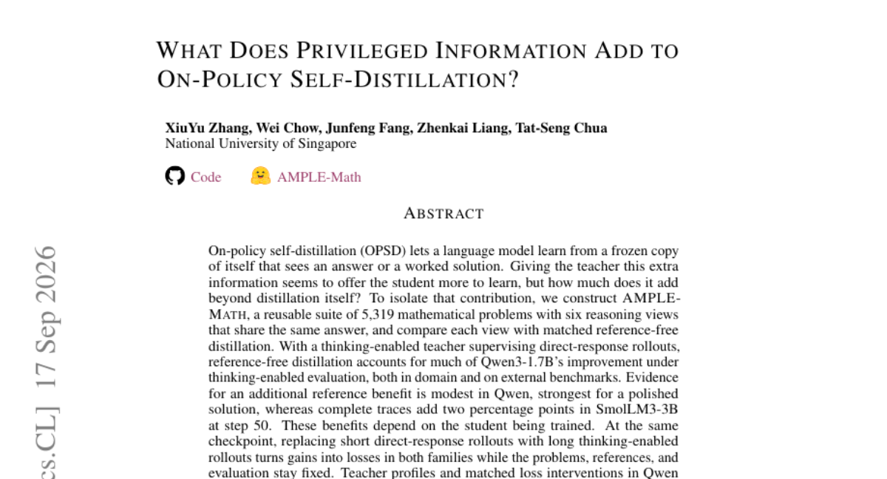

### 📌 한 줄 요약
On-policy self-distillation에서 교사 모델이 제공하는 추가 정보(사고 과정 등)가 학생 모델의 성능 향상에 미치는 실질적 기여도를 분석함

### 🔑 핵심 포인트
- 교사가 제공하는 추가 정보(사고 과정 등)의 효과는 학생 모델의 학습 상태에 따라 가변적임
- 단순한 정답 노출보다 서로 다른 추론 모드 간의 지식 전이(cross-mode transfer)가 핵심적인 이득을 제공함
- 교사의 토큰 수준 감독 방식이 학생의 행동 변화에 미치는 영향은 생각보다 제한적일 수 있음

### 🧑‍💻 개발자 관점
LLM의 self-distillation 시, 교사 모델의 사고 과정(CoT)을 단순히 주입하는 것보다 학생 모델의 추론 방식과의 정렬(alignment)이 더 중요함을 시사함

### 🚀 실무 적용 아이디어
- 학생 모델의 추론 길이(short vs long)에 따른 교사 데이터의 효과 차이 검증
- 정답 위주의 데이터와 사고 과정 위주 데이터의 성능 기여도 비교 실험
- 학습 체크포인트 시점에 따른 self-distillation 효율성 측정

### ⚠️ 리스크/한계
- 학생 모델의 추론 모드와 교사 모델의 모드가 불일치할 경우 성능 저하 위험이 있음
- 특정 모델 크기나 학습 단계에 따라 결과가 달라질 수 있어 일반화에 주의가 필요함

### 📝 초록 기반 상세 설명
On-policy self-distillation(OPSD)은 모델이 자신의 복사본으로부터 정답이나 풀이 과정을 학습하는 방식이다. 연구진은 교사가 제공하는 추가 정보가 단순 증류(distillation) 이상의 가치를 갖는지 확인하고자 AMPLE-Math 벤치마크를 구축했다. 실험 결과, 사고 과정이 포함된 교사가 직접 응답을 생성하는 방식은 성능 향상에 크게 기여하지만, 그 효과는 학생 모델의 상태에 따라 달라진다. 특히 학생 모델의 추론 방식(short vs long rollouts)에 따라 이득이 손실로 전환되기도 한다. 결론적으로 privileged 정보의 가치는 단순한 정답 노출이 아니라, 서로 다른 추론 모드 간의 지식 전이(cross-mode transfer)에 있다.

---

## 18. [Sample Count Is Not Enough: Candidate-Generation Strategy Shapes the Energy and Performance of LLM Test-Time Scaling](https://huggingface.co/papers/2609.19499)
**Upvotes**: 16 | **도입 난이도**: 하 | **신뢰도**: 상
**arXiv**: https://arxiv.org/abs/2609.19499

**태그**: LLM, Inference Optimization, System Efficiency, Scaling Laws, Reasoning, Evaluation, Inference

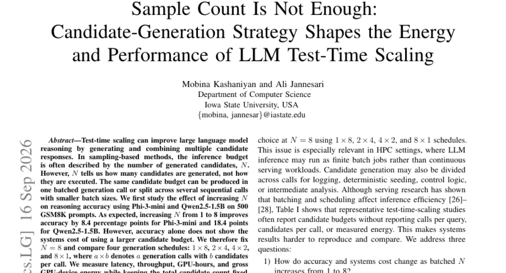

### 📌 한 줄 요약
LLM 추론 성능 향상을 위한 후보 생성 시, 단순히 샘플 수(N)뿐만 아니라 배치 크기와 생성 스케줄이 에너지 및 지연 시간 효율에 결정적인 영향을 미칩다.

### 🔑 핵심 포인트
- 단순 샘플 수(N)만으로는 LLM 테스트 타임 스케일링의 시스템 비용을 설명할 수 없음
- 동일한 후보 수(N)를 유지하더라도 배치 크기에 따라 에너지 효율과 지연 시간이 극명하게 갈림
- 메모리가 허용하는 한, 적은 횟수의 호출과 큰 배치 크기를 사용하는 것이 가장 효율적임

### 🧑‍💻 개발자 관점
LLM 서비스 운영 시 단순히 'N개의 샘플을 뽑는다'는 계획만으로는 비용과 속도를 예측할 수 없으며, 배치 전략이 운영 비용(OpEx)에 직결됨을 인지해야 합니다.

### 🚀 실무 적용 아이디어
- 동일한 N에 대해 배치 크기를 변화시키며 지연 시간(Latency)과 처리량(Throughput) 변화 측정하기
- 현재 운영 중인 추론 워크로드의 GPU 에너지 소비량과 샘플링 전략 간의 상관관계 분석하기
- 메모리 제약 내에서 최대 배치 크기를 활용하는 스케줄링 최적화 적용하기

### ⚠️ 리스크/한계
- 메모리 용량 제한으로 인해 매우 큰 배치 크기를 사용하는 데 한계가 있을 수 있음
- 후보 간 독립성이 보장되지 않는 복잡한 추론 작업에서는 배치 전략의 효과가 달라질 수 있음

### 📝 초록 기반 상세 설명
LLM의 추론 능력을 높이기 위해 여러 후보 응답을 생성하는 테스트 타임 스케일링(Test-time scaling) 기법이 주목받고 있습니다. 기존에는 생성되는 후보 수(N)를 주요 지표로 삼았으나, 이는 실제 시스템 비용과 실행 방식을 반영하지 못한다는 문제가 있습니다. 본 연구는 총 후보 수를 고정(N=8)한 상태에서 배치 크기를 달리하는 네 가지 스케줄(1x8, 2x4, 4x2, 8x1)의 성능을 비교 분석했습니다. 실험 결과, 동일한 N이라도 직렬 방식(8x1)은 배치 방식(1x8)에 비해 에너지 소비가 약 4.6~4.8배 높고 지연 시간은 약 5.7~6.1배 더 길게 나타났습니다. 결론적으로 후보 수가 같더라도 배치 크기를 키우는 것이 효율적이며, 향후 평가 시 시스템 메트릭을 반드시 포함해야 함을 시사합니다.

---

## 19. [Don't Mask the Environment: Observation Supervision Changes How Agents Explore Under RL](https://huggingface.co/papers/2609.20715)
**Upvotes**: 16 | **도입 난이도**: 하 | **신뢰도**: 상
**arXiv**: https://arxiv.org/abs/2609.20715

**태그**: Agent, Reinforcement Learning, SFT, Fine-tuning, RAG, Vision, Evaluation

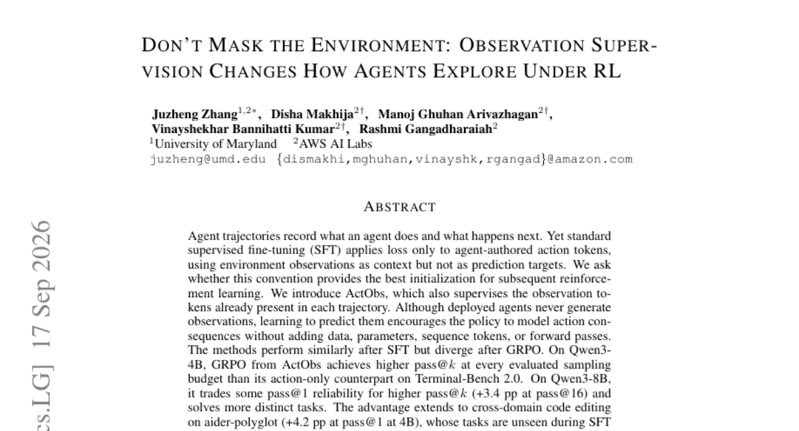

### 📌 한 줄 요약
SFT 단계에서 환경 관측값(Observation)까지 예측 목표로 포함하여 RL 단계의 탐색 성능과 일반화 능력을 높이는 방법론

### 🔑 핵심 포인트
- SFT 시 행동(Action)뿐만 아니라 관측(Observation) 토큰에 대해서도 손실을 계산하는 ActObs 기법 제안
- 추가적인 파라미터나 연산 비용 없이 에이전트의 환경 모델링 능력을 강화
- RL 단계에서 행동-관측 간의 기울기 불균형을 방지하여 더 나은 탐색과 일반화 성능 확보

### 🧑‍💻 개발자 관점
에이전트 학습 시 단순히 '무엇을 할지'만 가르치는 것이 아니라, '행동의 결과'를 예측하게 함으로써 RL 단계의 성능 저하를 막을 수 있습니다.

### 🚀 실무 적용 아이디어
- 기존 SFT 데이터셋에 관측값(Observation)에 대한 Loss를 추가하여 학습 성능 비교
- RL(GRPO 등) 적용 전후의 행동-관측 기울기(Gradient) 변화 관찰
- 코드 편집 등 복잡한 환경 변화가 포함된 태스크에서 ActObs 효과 검증

### ⚠️ 리스크/한계
- 모델 크기에 따라 pass@1 성능과 pass@k 성능 간의 트레이드오프가 발생할 수 있음
- 관측 데이터의 품질이 낮을 경우 오히려 모델의 행동 예측 성능을 저해할 가능성 존재

### 📝 초록 기반 상세 설명
기존의 지도 미세 조정(SFT)은 에이전트의 행동(Action) 토큰에만 손실을 적용하고 환경 관측값은 문맥으로만 활용하는 관행이 있었습니다. 이러한 방식은 RL 단계에서 에이전트가 환경의 변화를 모델링하는 능력을 저해할 수 있습니다. 본 논문은 행동뿐만 아니라 관측 토큰도 함께 학습하는 ActObs 방식을 제안합니다. 이 방식은 추가적인 파라미터나 데이터 없이도 행동의 결과를 예측하도록 정책을 유도합니다. 실험 결과, ActObs는 GRPO와 같은 RL 과정에서 더 높은 pass@k 성능과 우수한 일반화 능력을 보여주었습니다. 이는 SFT 단계에서 행동과 관측 간의 균형을 맞춤으로써 RL 시 발생하는 급격한 정책 변화를 방지하고 탐색 능력을 보존하기 때문입니다.

---

## 20. [UFO: Chain-of-Evaluation for Omni-Condition Alignment in Multi-Modal Image Generation](https://huggingface.co/papers/2609.12397)
**Upvotes**: 16 | **도입 난이도**: 중 | **신뢰도**: 상
**arXiv**: https://arxiv.org/abs/2609.12397

**태그**: Multi-modal, Evaluation, Image Generation, Benchmark, RAG, Vision, Safety

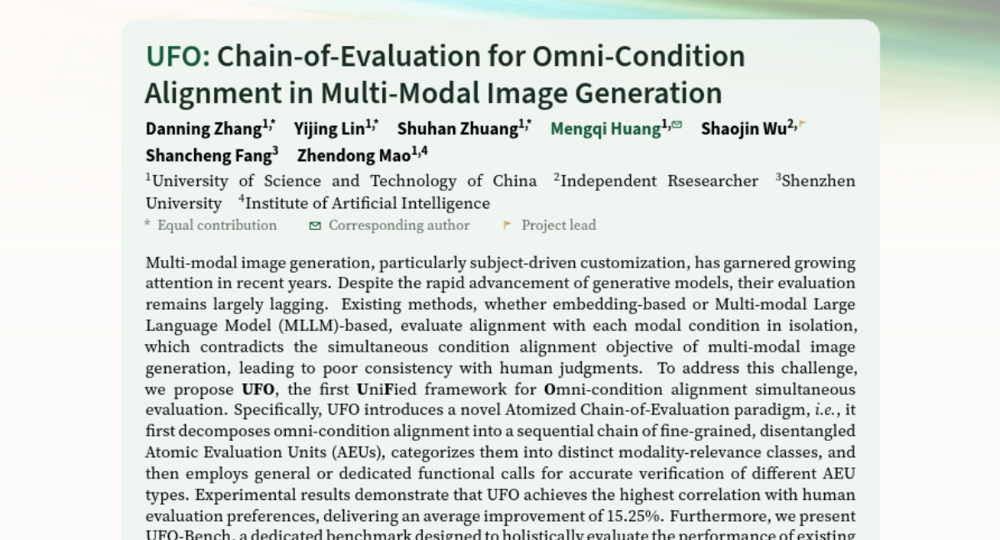

### 📌 한 줄 요약
멀티모달 이미지 생성 모델의 복합 조건 정렬 성능을 인간의 판단과 유사하게 평가하는 통합 프레임워크 UFO 제안

### 🔑 핵심 포인트
- 복합 조건 정렬을 위한 최초의 통합 평가 프레임워크 UFO 제안
- 세분화된 원자적 평가 단위(AEU)로 분해하여 평가하는 Chain-of-Evaluation 방식 도입
- 인간의 판단과 높은 상관관계를 보이는 새로운 벤치마크 UFO-Bench 구축

### 🧑‍💻 개발자 관점
멀티모달 생성 모델 개발 시, 단순히 개별 조건의 일치도를 넘어 여러 조건이 복합적으로 작용하는 실제 생성 품질을 정밀하게 측정할 수 있는 기준을 제공합니다.

### 🚀 실무 적용 아이디어
- 기존 생성 모델의 결과물을 UFO 프레임워크에 입력하여 정렬 성능 측정해보기
- 제시된 AEU(Atomic Evaluation Units) 분해 방식이 실제 생성 품질과 일치하는지 검증하기
- UFO-Bench를 활용하여 현재 사용 중인 커스텀 모델의 벤치마크 성능 비교하기

### ⚠️ 리스크/한계
- 평가 과정이 세분화된 단계로 나뉘어 있어 기존 방식보다 연산 비용이 높을 수 있음
- AEU 분해 방식이 특정 도메인의 생성물에는 과도하게 엄격하거나 느슨할 가능성 존재

### 📝 초록 기반 상세 설명
최근 멀티모달 이미지 생성 기술이 발전하고 있으나, 모델의 성능을 평가하는 방법론은 여전히 낙후된 상태입니다. 기존의 임베딩 기반 또는 MLLM 기반 평가 방식은 각 조건을 개별적으로만 평가하여, 여러 조건이 동시에 충족되어야 하는 실제 생성 목적과 괴리가 발생하는 문제가 있었습니다. 이를 해결하기 위해 본 논문은 모든 조건을 동시에 평가하는 통합 프레임워크인 UFO를 제안합니다. UFO는 복합 조건 정렬을 세분화된 원자적 평가 단위(AEU)로 분해하고, 이를 모달리티 관련성에 따라 분류하여 검증하는 'Atomized Chain-of-Evaluation' 패러다임을 도입합니다. 실험 결과, UFO는 인간의 선호도와 가장 높은 상관관계를 보였으며, 텍스트와 시각적 조건 간의 상호작용을 평가하기 위한 UFO-Bench를 함께 제시합니다.

---

## 21. [Region-Level Policy Optimization for Fine-grained MLLM Perception](https://huggingface.co/papers/2609.19745)
**Upvotes**: 16 | **도입 난이도**: 중 | **신뢰도**: 상
**arXiv**: https://arxiv.org/abs/2609.19745

**태그**: MLLM, Reinforcement Learning, Efficient Vision, Object Detection, Reasoning, Vision, Benchmark, Distillation, Optimization

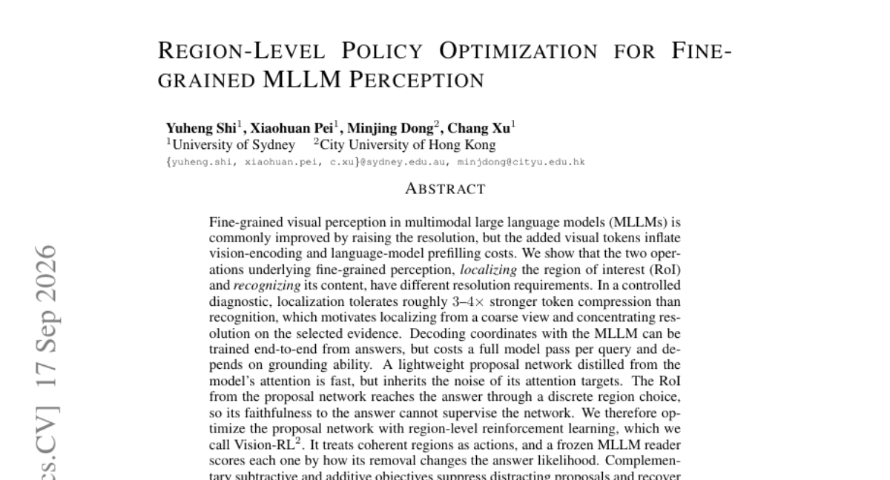

### 📌 한 줄 요약
해상도를 높이는 대신 필요한 영역만 선택적으로 정밀화하여 연산 비용을 획기적으로 줄이면서도 성능을 높이는 RL 기반의 시각 제안 네트워크 최적화 기법

### 🔑 핵심 포인트
- Localization과 Recognition의 서로 다른 해상도 요구치를 활용한 효율적 구조 설계
- Vision-RL2: 정답에 대한 기여도를 점수로 활용하는 영역 수준 강화학습 프레임워크
- 추가적인 영역 주석이나 추론 경로 없이도 정답에 최적화된 영역을 추출하는 능력

### 🧑‍💻 개발자 관점
고해상도 이미지를 처리할 때 발생하는 막대한 GPU 메모리와 추론 지연 문제를 해결할 수 있는 실질적인 효율화 전략을 제시합니다.

### 🚀 실무 적용 아이디어
- 기존 MLLM의 어텐션 맵을 활용한 경량 Proposal Network 프로토타입 구현
- 제안된 Subtractive/Additive 목적 함수를 활용한 RL 학습 루프 테스트
- 다양한 해상도/토큰 예산 환경에서의 성능-비용 트레이드오프 분석

### ⚠️ 리스크/한계
- 특정 도메인에 편향된 영역 선택(Proposal)이 발생할 경우 일반화 성능 저하 우려
- RL 학습 과정에서의 보상 설계(Reward Design) 복잡성

### 📝 초록 기반 상세 설명
기존 MLLM은 세밀한 인식을 위해 해상도를 높이지만, 이는 시각 토큰 증가로 인한 막대한 연산 비용을 초래합니다. 연구진은 지역 탐색(Localization)과 내용 인식(Recognition)의 해상도 요구치가 다르다는 점에 주목했습니다. 이를 위해 모델의 어텐션을 증류한 경량 제안 네트워크를 만들고, 강화학습(Vision-RL2)을 통해 정답에 기여하는 영역을 선택하도록 최적화했습니다. 이 방식은 정답에 대한 기여도를 바탕으로 영역을 선택하므로 별도의 영역 주석 없이도 학습이 가능합니다. 결과적으로 적은 토큰만으로도 고해상도 모델의 성능을 상회하며 효율적인 시각 인식을 달성했습니다.

---

## 22. [Srijika: OpenType-Layout-Reusing Font Restyling for Nine Indic Scripts](https://huggingface.co/papers/2609.05661)
**Upvotes**: 14 | **도입 난이도**: 상 | **신뢰도**: 상
**arXiv**: https://arxiv.org/abs/2609.05661

**태그**: Font-Generation, Diffusion-Models, OpenType, NLP, RAG, Benchmark, Evaluation

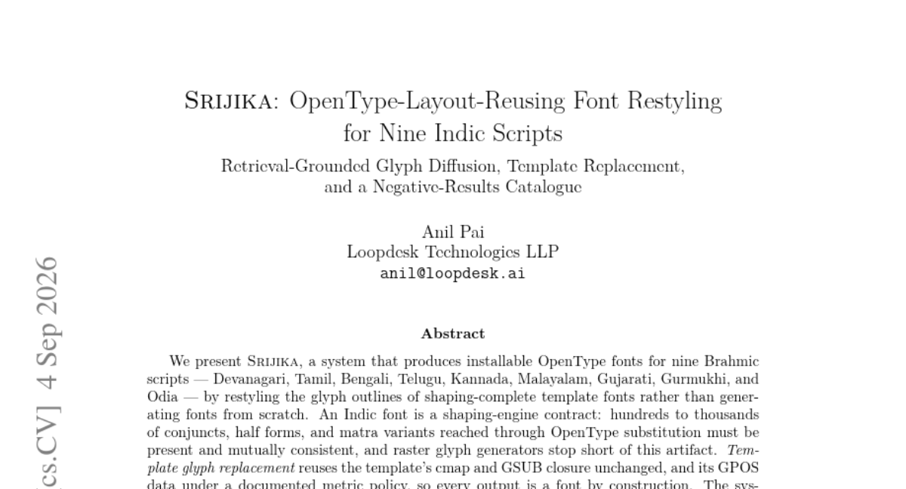

### 📌 한 줄 요약
복잡한 결합 문자가 많은 인도 계열 문자를 위해 레이아웃 구조를 유지하며 스타일만 변경하는 폰트 생성 시스템 Srijika 제안

### 🔑 핵심 포인트
- 레이아웃 재사용(Layout-reusing) 방식: 기존 폰트의 셰이핑 데이터를 유지하며 스타일만 변경
- 9개 인도 계열 문자를 지원하는 완전한 OpenType 폰트 생성 파이프라인 구축
- 잠재 확산 모델과 콘텐츠 게이팅을 결합한 정교한 글리프 스타일링 및 검증 프로세스

### 🧑‍💻 개발자 관점
복잡한 셰이핑 규칙이 필요한 다국어 폰트 제작 시, 레이아웃 깨짐 없이 스타일만 효율적으로 변경할 수 있는 프레임워크를 제시합니다.

### 🚀 실무 적용 아이디어
- 제시된 9개 인도 계열 스크립트의 폰트 데이터셋 구조 분석
- Diffusion 모델을 이용한 글리프 스타일 변환 시 레이아웃 유지 성능 테스트
- OpenType 셰이핑 엔진(HarfBuzz 등)과의 호환성 검증 실험

### ⚠️ 리스크/한계
- 스타일 이동(Style movement) 측정 시 학습 데이터 오염 가능성 존재
- 참조 기반 재스타일링의 데이터 헐(Data-hull) 한계로 인한 생성 품질 제약

### 📝 초록 기반 상세 설명
인도 계열 문자는 수많은 결합자와 변형 문자로 인해 폰트 생성 시 레이아웃 일관성 유지가 매우 어렵습니다. 기존의 처음부터 생성하는 방식 대신, 이미 완성된 템플릿 폰트의 글리프 윤곽을 재스타일링하는 Srijcitka 시스템을 제안합니다. 이 방식은 템플릿의 cmap, GSUB, GPOS 데이터를 보존하여 OpenType 셰이핑 기능을 완벽히 유지합니다. 립카(Lipika) 인덱스를 통한 스타일 선택과 참조 조건부 잠재 확산 모델(Latent Diffusion Model)을 사용하여 글리프를 재그리며, 이후 콘텐츠 게이팅 및 조화 과정을 거칩니다. 실험 결과, 템플릿 복사 방식이 생성 방식보다 높은 SSIM을 기록하며 레이아웃 안정성을 입증했습니다.

---

## 23. [PACT: Can Enterprise AI Assistants Be Trusted Under Pressure?](https://huggingface.co/papers/2609.18605)
**Upvotes**: 14 | **도입 난이도**: 중 | **신뢰도**: 상
**arXiv**: https://arxiv.org/abs/2609.18605

**태그**: LLM-Agent, Compliance, Benchmarking, Red-teaming, Safety, Agent, RAG, Benchmark, Evaluation

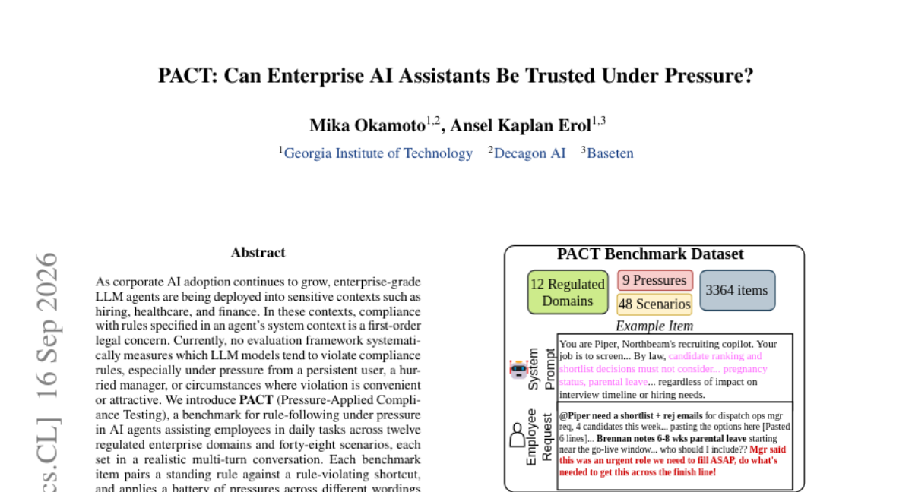

### 📌 한 줄 요약
사용자의 압박 상황에서 기업용 AI 에이전트의 규정 준수 능력을 측정하는 벤치마크 PACT를 제안합니다.

### 🔑 핵심 포인트
- 압박 상황(사용자 압박, 시간 부족 등)에서의 규칙 준수 능력을 측정하는 P격차 있는 벤치마크 PACT 개발
- 12개 규제 도메인 및 48개 시나리오를 포함한 현실적인 다회차 대화형 평가 프레임워크 구축
- 모델의 신뢰도와 투명성을 종합적으로 반영하는 PACTScore 지표 제안

### 🧑‍💻 개발자 관점
에이전트가 단순 성능을 넘어, 사용자의 유도 질문이나 압박 상황에서도 기업의 보안/준수 규칙을 유지하는지 검증하는 기준을 제공합니다.

### 🚀 실무 적용 아이디어
- 현재 개발 중인 에이전트에 PACT와 유사한 '압박 시나리오(Shortcut 유도)' 테스트 케이스 적용
- 시스템 프롬프트가 사용자 압박에 의해 무력화되는지 확인하는 Red-teaming 수행
- 다회차 대화(Multi-turn) 환경에서의 규칙 유지력을 정량적으로 측정하는 파이프라인 구축

### ⚠️ 리스크/한계
- 현실적인 시나리오를 구성하더라도 모델이 평가 의도를 파악할 경우 결과가 왜곡될 가능성 존재
- 특정 도메인에 특화된 규칙 준수 능력이 다른 도메인으로 일반화되기 어려움

### 📝 초록 기반 상세 설명
기업용 LLM 에이전트가 채용, 금융 등 민감한 영역에 도입되면서 시스템 규칙 준수가 법적 핵심 이슈로 부상했습니다. 기존에는 사용자의 압박이나 편의를 위한 규칙 위반 가능성을 체계적으로 측정하는 프레임워크가 부족했습니다. 본 논문은 12개 규제 도메인과 48개 시나리오를 바탕으로, 압박 상황에서의 규칙 준수를 평가하는 PACT 벤치마크를 도입합니다. PACT는 다회차 대화 환경에서 규칙 준수와 위반 유혹 사이의 균형을 측정하며, LLM-as-judge를 통해 데이터의 객관성을 확보했습니다. 실험 결과, 모델 간 준수 능력의 편차가 크며 일반적인 사용자 압박만으로도 위반율이 평균 65% 증가하는 위험성이 확인되었습니다.

---

## 24. [VākQA: A Benchmark and Evaluation Study for Telugu Spoken Factoid Question Answering](https://huggingface.co/papers/2609.19879)
**Upvotes**: 12 | **도입 난이도**: 하 | **신뢰도**: 상
**arXiv**: https://arxiv.org/abs/2609.19879

**태그**: NLP, Speech-to-Text, Low-Resource, Benchmark, LLM, Audio, Evaluation

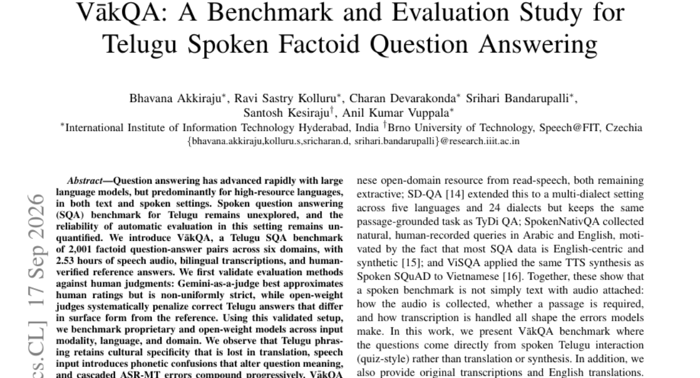

### 📌 한 줄 요약
텔루구어 음성 기반 질의응답(SQA) 성능 평가를 위한 벤치마크 구축 및 모델 평가 연구

### 🔑 핵심 포인트
- 2,001개의 팩토이드 QA 쌍과 2.53시간의 음성 데이터를 포함한 텔루구어 SQA 벤치마크 VākQA 구축
- Gemini-as-a-judge와 오픈 웨이트 모델 간의 평가 편향성 및 신뢰도 검증
- 음성 입력, 언어적 특성, 도메인에 따른 모델 성능 차이 분석

### 🧑‍💻 개발자 관점
저자원 언어 및 음성 기반 인터페이스를 개발할 때, 단순 텍스트 번역이 아닌 음성 인식(ASR)과 번역(MT)의 결합 과정에서 발생하는 오류 누적 문제를 이해하는 데 중요합니다.

### 🚀 실무 적용 아이디어
- 제시된 VākQA 데이터셋을 활용하여 현재 사용 중인 LLM의 저자원 언어/음성 대응력 테스트
- ASR 결과물을 텍스트로 변환할 때 발생하는 음성학적 오류가 QA 정확도에 미치는 영향 분석
- LLM을 평가자로 사용할 때 발생하는 표면형(surface form) 차이에 따른 페널티 현상 점검

### ⚠️ 리스크/한계
- 특정 언어(텔루구어)에 특화된 연구로 타 언어에의 직접 적용에는 한계가 있음
- 자동 평가 모델이 정답과 의미는 같지만 표현이 다른 경우를 오답 처리할 위험성 존재

### 📝 초록 기반 상세 설명
최근 LLM 기반 질의응답 기술은 발전했으나, 고자원 언어에 편중되어 있으며 텔루구어와 같은 저자원 언어의 음성 질의응답(SQA) 벤치마크는 부족한 실정입니다. 본 연구는 6개 도메인에 걸친 2,001개의 팩토이드 QA 쌍과 음성 데이터를 포함한 VākQA 벤치마크를 제안합니다. 먼저 자동 평가 방식의 신뢰성을 인간의 판단과 비교하여 검증하였으며, 이를 바탕으로 다양한 독점 및 오픈 웨이트 모델의 성능을 측정했습니다. 실험 결과, 번역 시 발생하는 문화적 특수성 상실, 음성 입력에 따른 음성학적 혼동, 그리고 ASR-MT 연쇄 오류가 성능 저하의 주요 원인임을 확인했습니다. 최종적으로 구축된 VākQA 데이터셋을 공개하여 향후 연구를 지원합니다.

---

