# 2026-09-22 Daily Papers (Top 30)

## 오늘의 요약
오늘의 연구는 기존 소프트웨어 코드와 GUI 환경을 활용해 에이전트의 실행 능력을 자동화하는 연구가 주를 이루었습니다. 또한, 모델 재학습 없이 외부 메모리를 활용하거나 멀티모달 대화 및 정밀한 이미지 제어와 같이 실용적인 워크플로우를 개선하는 방법론들이 주목받았습니다.

### 오늘의 핵심 포인트
- 기존 소스 코드를 활용해 에이전트용 스킬 뱅크와 RL 학습 환경을 자동 구축하는 효율적인 파이프라인이 제시되었습니다.
- 모델의 가중치를 직접 수정하지 않고 외부 메모리나 온톨로지 계층을 통해 에이전트의 능력을 확장하는 구조적 접근이 강조되었습니다.
- 텍스트 중개 없는 네이티브 멀티모달 대화와 정밀한 색상 제어 등 실무 적용 가능성이 높은 생성형 AI 기술들이 발표되었습니다.

**오늘의 태그**: AI Agent, Code-to-Skill, Automation, Multimodal, Efficiency

## 1. [Grounded Skill Synthesis from Code at Scale for Agentic Intelligence](https://huggingface.co/papers/2609.05571)
**Upvotes**: 85 | **도입 난이도**: 중 | **신뢰도**: 상
**arXiv**: https://arxiv.org/abs/2609.05571

**태그**: Agent, Code-to-Skill, Automated-Pipeline, Software-Engineering, RAG, Benchmark, Evaluation

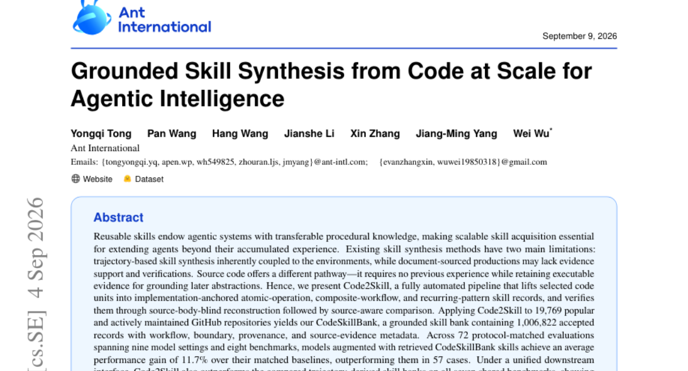

### 📌 한 줄 요약
소스 코드를 활용해 실행 가능한 에이전트용 스킬 뱅크를 자동 구축하고 성능을 검증하는 파이프라인 제안

### 🔑 핵심 포인트
- 소스 코드를 기반으로 실행 가능한(grounded) 에이전트 스킬을 추출하는 자동화 파이프라인 개발
- 100만 개 이상의 검증된 스킬을 포함하는 대규모 데이터셋 CodeSkillBank 구축
- 트래젝터리 기반 방식보다 우수하며, AI 생성 코드에서도 높은 신뢰도를 보이는 스킬 합성 능력 입증

### 🧑‍💻 개발자 관점
에이전트가 학습 데이터나 환경 상호작용 없이도 기존 소프트웨어 생태계의 코드를 통해 즉각적인 실행 능력을 확보할 수 있는 경로를 제시합니다.

### 🚀 실무 적용 아이디어
- 오픈소스 라이브러리 코드를 활용해 특정 도메인 특화 스킬셋 구축 실험
- LLM의 RAG 시스템에 CodeSkillBank와 같은 구조화된 코드 스킬을 주입하는 프로토타입 개발
- AI가 생성한 코드와 인간이 작성한 코드 간의 스킬 추출 품질 비교 테스트

### ⚠️ 리스크/한계
- 추출된 스킬이 실제 복잡한 동적 환경에서 의도대로 동작할지에 대한 실시간 검증 필요성
- 코드 구조의 변화나 의존성 문제로 인한 스킬의 유효성 유지 문제

### 📝 초록 기반 상세 설명
에이전트의 확장성을 위해 재사용 가능한 스킬 확보가 필수적이지만, 기존의 트래젝터리 기반 방식은 환경 의존적이고 문서 기반 방식은 실행 검증이 어렵다는 한계가 있습니다. 본 논문은 소스 코드를 활용해 실행 가능한 근거를 확보하면서도 사전 경험 없이 스킬을 추출하는 Code2Skill 파이프라인을 제안합니다. 이 파이프라인은 코드 단위를 원자적 작업, 복합 워크플로, 반복 패턴으로 변환한 뒤, 소스 코드 없이 재구성하거나 비교하는 방식을 통해 검증합니다. 19,769개의 GitHub 저장소를 활용해 100만 개 이상의 검증된 스킬 데이터셋인 CodeSkillBank를 구축했습니다. 실험 결과, Code2Skill로 증강된 모델은 기존 베이스라인 대비 평균 11.7% 성능 향상을 보였으며 트래젝터리 기반 방식보다 우수한 성능을 기록했습니다.

---

## 2. [CodeMidas: Scaling Agentic Coding RL Environments from Code Itself](https://huggingface.co/papers/2609.22068)
**Upvotes**: 82 | **도입 난이도**: 상 | **신뢰도**: 상
**arXiv**: https://arxiv.org/abs/2609.22068

**태그**: Agentic-Workflow, Reinforcement-Learning, Code-Generation, Automated-Testing, Agent, Benchmark

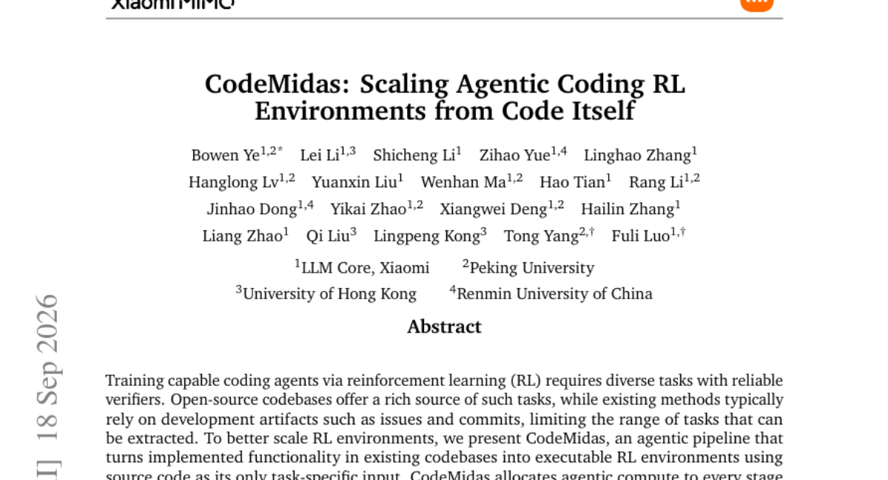

### 📌 한 줄 요약
소스 코드 자체를 활용해 자동화된 RL 학습 환경을 구축하여 코딩 에이전트의 성능을 극대화하는 프레임워크

### 🔑 핵심 포인트
- 소스 코드만을 입력으로 사용하여 자동화된 RL 학습 환경을 구축하는 에이전트 파이프라인 개발
- 코드 탐색, 테스트 생성, 실행 기반 검증을 포함하는 end-to-end 자동화 워크플로우
- 대규모 오픈소스 코드베이스를 활용한 고품질/다양한 프로그래밍 태스크 데이터셋 확보

### 🧑‍💻 개발자 관점
수동으로 테스트 케이스를 만들 필요 없이 기존 코드를 학습용 데이터로 자동 변환할 수 있어, 코딩 에이전트 학습 비용을 획기적으로 낮출 수 있습니다.

### 🚀 실무 적용 아이디어
- 특정 도메인의 오픈소스 코드를 활용해 CodeMidas 파이프라인의 태스크 생성 품질 검증
- 생성된 테스트 케이스가 원본 코드의 의도를 얼마나 정확히 반영하는지 정성적 분석
- 소규모 모델에 생성된 태스크를 적용하여 데이터 효율성 및 성능 향상 폭 측정

### ⚠️ 리스크/한계
- 생성된 테스트 케이스가 원본 코드의 버그까지 학습 데이터로 포함할 위험성
- 복잡한 의존성을 가진 대규모 프로젝트에서의 환경 구축 난이도

### 📝 초록 기반 상세 설명
코딩 에이전트의 RL 학습을 위해서는 신뢰할 수 있는 검증기가 포함된 다양한 작업이 필요하지만, 기존 방식은 이슈나 커밋 같은 개발 산출물에 의존하여 작업 생성 범위가 제한적이었습니다. 이를 해결하기 위해 소스 코드만을 입력으로 사용하여 구현된 기능을 실행 가능한 RL 환경으로 변환하는 CodeMidas 파이프라인을 제안합니다. 이 시스템은 에이전트가 직접 코드를 탐색하여 동작 명세를 작성하고, 실행 기반의 테스트를 구축하며, 반복적인 솔루션 실행을 통해 작업의 품질을 검증합니다. 이를 통해 23개 언어와 15개 도메인에 걸친 5,545개의 고품질 학습 태스크를 생성했습니다. 결과적으로 GRPO를 통한 학습 시 이슈 수정, 전체 프로그램 구축, 터미널 작업 등 다양한 벤치마크에서 성능 향상을 입증했습니다.

---

## 3. [EvoOntology: A Self-Evolving Ontology Layer for Data Agents](https://huggingface.co/papers/2609.15779)
**Upvotes**: 66 | **도입 난이도**: 중 | **신뢰도**: 상
**arXiv**: https://arxiv.org/abs/2609.15779

**태그**: AI Agent, Ontology, Data Engineering, LLM, Agent, Benchmark, Evaluation

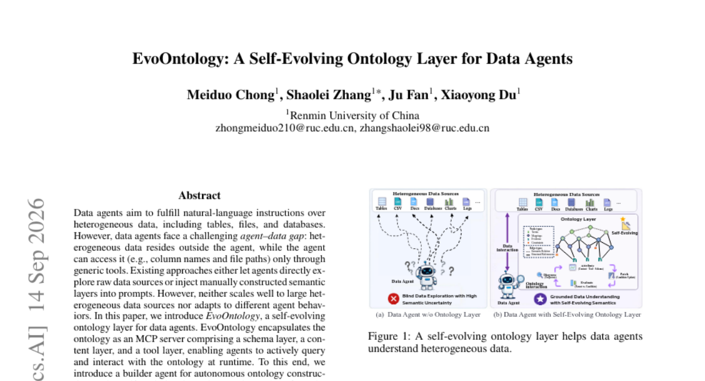

### 📌 한 줄 요약
데이터 에이전트가 이기종 데이터에 효율적으로 접근할 수 있도록 스스로 진화하는 온톨로지 계층 프레임워크를 제안합니다.

### 🔑 핵심 포인트
- MCP 서버 구조를 활용한 스키마, 콘텐츠, 툴 계층의 온톨로지 캡슐화
- 빌더 에이전트를 통한 자율적인 온톨로지 구축 및 관리
- 백본 모델 조건부 평가를 통한 속성 기반 타입 편집(attribution-guided typed edits) 루프 구현

### 🧑‍💻 개발자 관점
데이터 스키마가 복잡하거나 자주 변하는 환경에서 수동 작업 없이 에이전트가 데이터 구조를 이해하고 활용할 수 있는 자동화된 방법론을 제시합니다.

### 🚀 실무 적용 아이디어
- 제공된 GitHub 코드를 활용하여 다양한 데이터 소스(SQL, CSV)에 대한 온톨로지 생성 성능 테스트
- 서로 다른 LLM 백본(GPT-4, Claude 등)을 교체하며 자가 진화 루프의 안정성 검증
- 기존의 단순 RAG 방식과 EvoOntology 기반 방식의 데이터 추출 정확도 비교

### ⚠️ 리스크/한계
- 온톨로지 진화 과정에서 잘못된 정보가 반영될 경우 데이터 해석 오류 발생 가능성
- 백본 모델의 성능에 따라 온톨로지 품질이 종속될 위험

### 📝 초록 기반 상세 설명
데이터 에이전트는 다양한 형태의 데이터(테이블, 파일 등)를 다루지만, 에이전트와 데이터 사이의 의미적 간극(agent-data gap)으로 인해 효율적인 탐색에 어려움을 겪습니다. 기존 방식은 원시 데이터를 직접 탐색하거나 수동으로 구축된 시맨틱 레이어를 주입하지만, 이는 확장성과 적응성이 부족합니다. 본 논문은 MCP 서버 구조를 갖춘 자가 진화형 온톨로지 계층인 EvoOntology를 제안합니다. 이를 위해 자율적인 온톨로지 구축을 위한 빌더 에이전트와 백본 모델의 평가를 거쳐 정교하게 수정되는 자가 진화 루프를 도입했습니다. 실험 결과, EvoOntology는 다양한 벤치마크에서 기존 방식보다 우수한 성능을 보이며 데이터 간의 간극을 효과적으로 해결했습니다.

---

## 4. [RecreationWorld: Scalable and Verifiable Environments for Hybrid Computer-Use Agents](https://huggingface.co/papers/2609.22000)
**Upvotes**: 60 | **도입 난이도**: 상 | **신뢰도**: 상
**arXiv**: https://arxiv.org/abs/2609.22000

**태그**: AI Agent, Software Engineering, GUI Automation, Benchmark, Agent, Evaluation

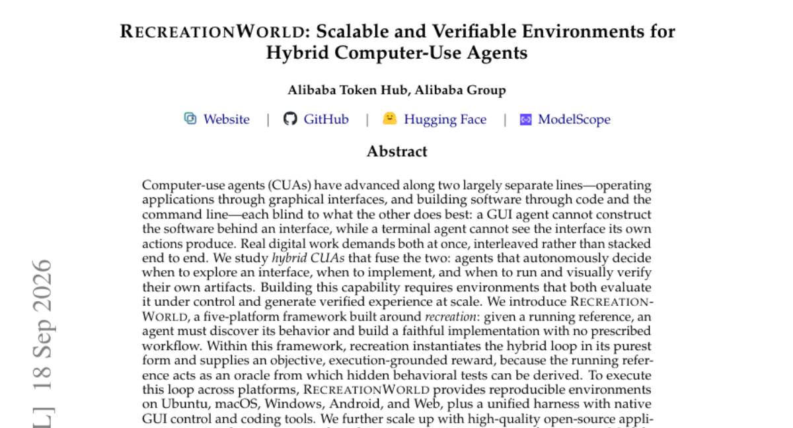

### 📌 한 줄 요약
GUI 조작과 코드 작성을 결합한 하이브리드 에이전트 학습을 위한 확장 가능한 검증 환경 및 벤치마크 제안

### 🔑 핵심 포인트
- GUI와 코딩이 결합된 하이브리드 에이전트 학습을 위한 5개 플랫폼 통합 프레임워크(RecreationWorld) 개발
- 참조 모델(Reference)을 오라클로 활용하여 실행 결과 기반의 보상을 제공하는 재현 중심의 학습 방식 도입
- 다양한 도메인과 플랫폼을 아우르는 250개 태스크 규모의 평가 벤치마크(RecreationBench) 구축

### 🧑‍💻 개발자 관점
단순한 API 호출을 넘어, GUI와 코드를 넘나들며 실제 소프트웨어를 구축하고 검증하는 고도화된 에이전트 개발의 기반을 제공합니다.

### 🚀 실무 적용 아이디어
- 제공된 환경을 활용하여 GUI-Code 하이브리드 워크플로 최적화 실험 수행
- RecreationBench를 활용하여 현재 개발 중인 에이전트의 범용성 및 검증 능력 테스트
- 참조 모델 기반의 보상 체계가 에이전트의 코드 품질에 미치는 영향 분석

### ⚠️ 리스크/한계
- 에이전트가 생성한 애플리케이션이 참조 모델에 비해 규모가 작고 단일 구조(monolithic)에 치우칠 위험이 있음
- 복잡한 상호작용보다는 정적인 인터페이스 구조 재현에 성능이 편중될 가능성

### 📝 초록 기반 상세 설명
기존의 컴퓨터 사용 에이전트(CUA)는 GUI 상호작용과 코드 기반 소프트웨어 개발이 분리되어 발전해 왔습니다. 하지만 실제 디지털 작업은 이 두 방식이 유기적으로 결합되어야 하는 복합적인 특성을 가집니다. 본 논문은 참조 모델의 동작을 탐색하고 이를 충실히 구현하는 하이브리드 에이전트 학습 프레임워크인 RecreationWorld를 제안합니다. 이 프레임워크는 5개 플랫폼(Ubuntu, macOS, Windows, Android, Web) 환경과 GUI 제어 및 코딩 도구가 통합된 하네스를 제공합니다. 실험 결과, 제안된 환경에서 학습된 모델은 다양한 OOD 벤치마크에서 성능 향상을 보였으며, 새로운 평가 벤치마크인 RecreationBench를 통해 에이전트의 능력을 검증했습니다.

---

## 5. [IntBMoE: Integrating Block-Level Conditioning into Expert Composition for Full-Participation Mixture-of-Experts](https://huggingface.co/papers/2609.21346)
**Upvotes**: 33 | **도입 난이도**: 상 | **신뢰도**: 상
**arXiv**: https://arxiv.org/abs/2609.21346

**태그**: MoE, Efficiency, Deep Learning, Recommendation System, Vision, Inference

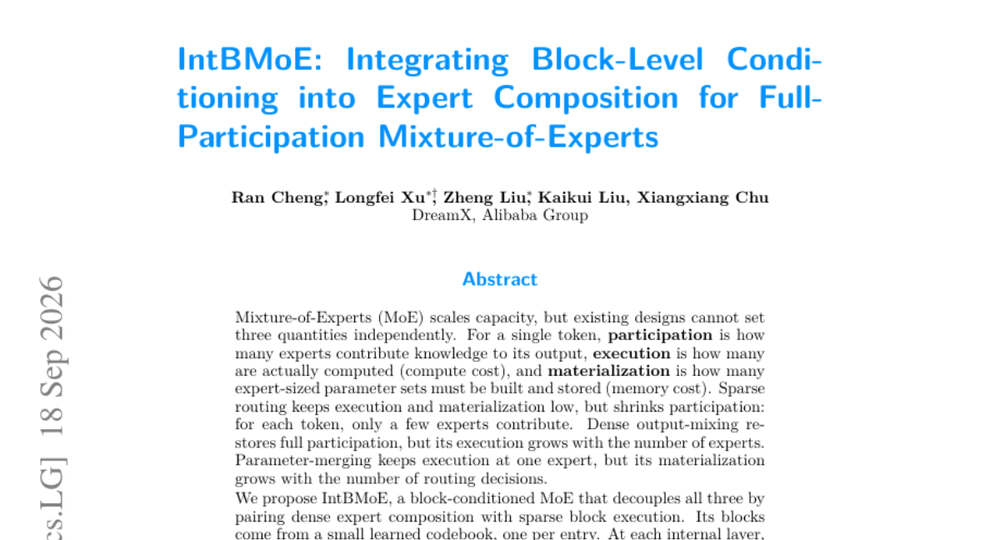

### 📌 한 줄 요약
참여도, 연산량, 메모리 비용을 독립적으로 제어하여 대규모 모델의 효율성과 성능을 동시에 잡은 블록 기반 MoE 구조

### 🔑 핵심 포인트
- 참여도(Full-participation), 연산량(Sparse execution), 메모리(Bounded materialization)의 독립적 제어 달성
- 코드북 기반의 블록 구성과 하이퍼네트워크를 통한 효율적인 전문가 병합 방식 도입
- Dual-Path Residual Gating(DPRG)을 통한 독립적인 두 경로의 결합 및 성능 최적화

### 🧑‍💻 개발자 관점
모델의 크기를 키우면서도 추론 비용과 메모리 점유율을 예측 가능한 범위 내에서 관리해야 하는 대규모 서비스 엔지니어에게 매우 유용한 구조적 해법을 제시합니다.

### 🚀 실무 적용 아이디어
- 제시된 코드북 기반 블록 구성 방식이 기존 MoE 대비 연산 효율성을 얼마나 개선하는지 프로파일링
- 특정 도메인(Vision vs NLP)에 따른 블록 크기 및 코드북 크기 최적화 실험
- 실제 서비스 환경에서의 레이턴시와 메모리 사용량 간의 트레이드오프 분석

### ⚠️ 리스크/한계
- 하이퍼네트워크 학습의 복잡도 및 수렴 안정성 문제 가능성
- 코드북 크기와 블록 개수에 따른 하드웨어 가속 효율성 차이

### 📝 초록 기반 상세 설명
기존 MoE 설계는 토큰당 참여도(Participation), 연산량(Execution), 메모리 비용(Materialization)을 독립적으로 설정하기 어려웠습니다. 희소 라우팅은 연산량은 낮지만 참여도가 낮고, 밀집 출력 방식은 참여도는 높지만 연산량이 급증하는 트레이드오프가 존재했습니다. 이를 해결하기 위해 제안된 IntBMoE는 학습된 코드북 기반의 블록과 하이퍼네트워크를 결합하여 밀집한 전문가 구성과 희소한 블록 실행을 결합했습니다. 이를 통해 모든 전문가 풀을 활용하면서도 연산량과 메모리 비용을 효율적으로 관리할 수 있습니다. 실험 결과, 이미지 분류 및 언어 모델링에서 우수한 성능을 보였으며 실제 추천 시스템 서비스에 적용되어 성능 향상을 입증했습니다.

---

## 6. [OmniVChat: Synthesizing, Benchmarking, and Training for Native Audio-Visual Dialogue](https://huggingface.co/papers/2609.21465)
**Upvotes**: 29 | **도입 난이도**: 상 | **신뢰도**: 상
**arXiv**: https://arxiv.org/abs/2609.21465

**태그**: Multimodal, Reinforcement Learning, Data Synthesis, Audio-Visual, Agent, Video, Audio, Benchmark, Evaluation, Inference

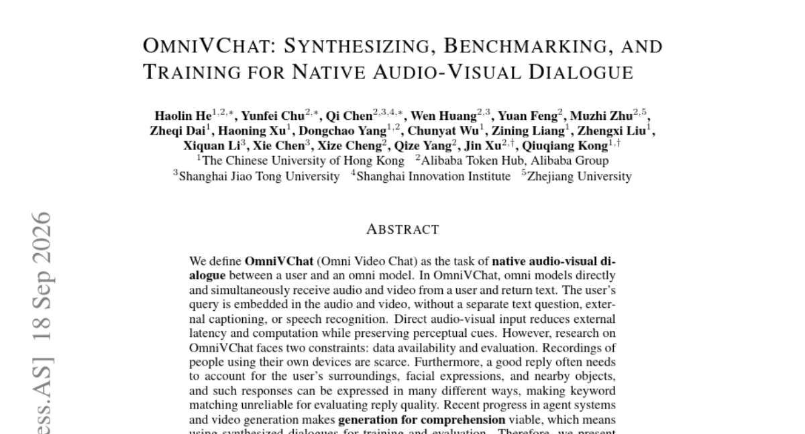

### 📌 한 줄 요약
텍스트 중개 없이 오디오와 비디오를 직접 처리하는 네이티브 멀티모달 대화 모델 학습 및 평가 프레임워크 제안

### 🔑 핵심 포인트
- OmniVChat-Studio: 멀티 에이전트를 활용한 고품질 오디오-비디오 대화 합성 엔진 개발
- OmniVChat-Bench: 5개 카테고리를 통해 모델의 대화 능력을 측정하는 새로운 벤치마크 구축
- OmniVChat-RL: 정답성, 효율성, 스타일을 결합한 강화학습 보상 메커니즘 설계

### 🧑‍💻 개발자 관점
텍스트 변환(STT/Captioning) 단계를 생략한 초저지연 멀티모달 인터페이스 구현을 위한 핵심 방법론을 제공합니다.

### 🚀 실무 적용 아이디어
- 제시된 멀티 에이전트 합성 데이터 생성 로직의 효율성 검증
- 기존 LMM 모델에 OmniVChat-RL 보상 체계 적용 실험
- 합성 데이터와 실제 데이터 간의 도메인 차이(Domain Gap) 분석

### ⚠️ 리스크/한계
- 합성 데이터로 학습된 모델이 실제 환경의 예외 상황에서 일반화 성능이 떨어질 위험
- 멀티모달 입력의 복잡성으로 인한 연산 비용 및 실시간성 확보 문제

### 📝 초록 기반 상세 설명
기존의 멀티모달 대화는 텍스트 변환 과정을 거치며 지연 시간과 정보 손실이 발생합니다. 이를 해결하기 위해 오디오와 비디오를 직접 입력받아 텍스트로 응답하는 'OmniVChat' 태스크를 정의했습니다. 데이터 부족과 평가의 어려움을 해결하기 위해 멀티 에이전트 기반의 합성 데이터 엔진인 OmniVChat-Studio를 개발했습니다. 또한, 응답의 정확성, 효율성, 스타일을 동시에 고려하는 강화학습 보상 설계인 OmniVChat-RL을 제안했습니다. 실험 결과, 합성 데이터를 통한 학습이 실제 인간 기록 데이터로의 성능 전이와 벤치마크 점수 향상을 입증했습니다.

---

## 7. [Paint-Anything: Unified Any-Color Control for Image Generation and Editing](https://huggingface.co/papers/2609.20816)
**Upvotes**: 29 | **도입 난이도**: 중 | **신뢰도**: 상
**arXiv**: https://arxiv.org/abs/2609.20816

**태그**: Diffusion Models, Image Editing, Color Control, Generative AI, RAG, Vision, Benchmark, Inference

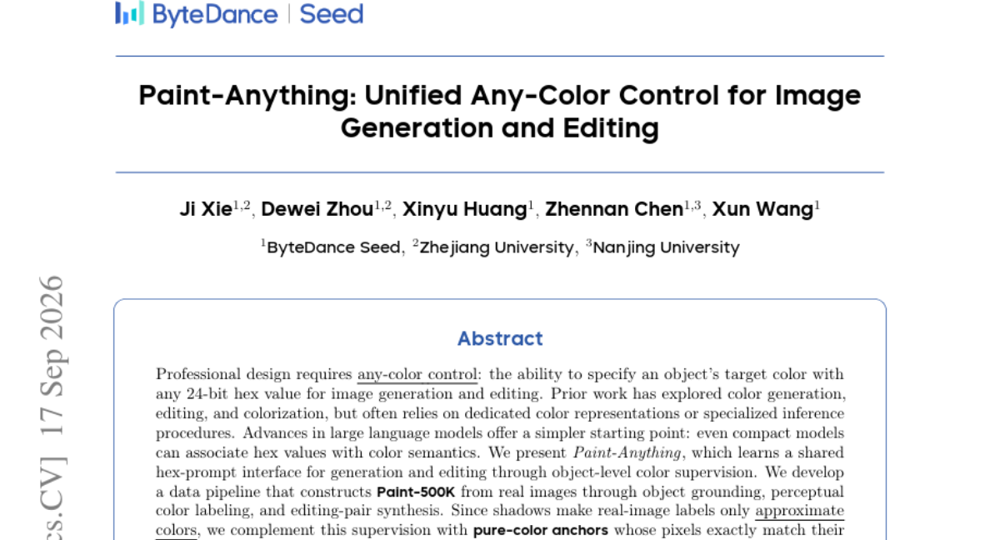

### 📌 한 줄 요약
24비트 Hex 코드를 직접 사용하여 이미지 생성 및 편집 시 객체별 색상을 정밀하게 제어하는 통합 프레임워크

### 🔑 핵심 포인트
- 24비트 Hex 코드를 프롬프트로 사용하는 객체 수준의 색상 제어 인터페이스 개발
- 실제 이미지와 순수 색상 앵커를 결합하여 그림자 문제를 극복한 하이브리드 학습 파이프라인 구축
- 생성과 편집을 동시에 수행할 수 있는 통합 데이터셋(Paint-500K) 및 벤치마크(ACBench) 제안

### 🧑‍💻 개발자 관점
디자이너가 원하는 정확한 색상 값을 Hex 코드로 입력하여 생성/편집할 수 있어, 색상 일관성이 중요한 UI/UX 및 제품 디자인 워크플로우에 즉시 적용 가능합니다.

### 🚀 실무 적용 아이디어
- FLUX.2와 같은 최신 확산 모델에 제안된 데이터 파이프라인 적용 테스트
- 특정 객체 색상만 정밀하게 변경하는 편집(Editing) 워크플로우 검증
- 제시된 ACBench를 활용한 기존 색상 제어 모델과의 성능 비교

### ⚠️ 리스크/한계
- 복잡한 조명이나 그림자가 강한 환경에서의 색상 재현 정확도 변동 가능성
- 객체 분할(Segmentation) 정확도에 따른 색상 제어 품질 의존성

### 📝 초록 기반 상세 설명
전문적인 디자인 작업에서는 특정 24비트 Hex 값을 사용하여 객체의 색상을 지정하는 정밀한 제어 능력이 필수적입니다. 기존 방식은 전용 색상 표현 방식이나 복잡한 추론 절차에 의존하여 범용성이 떨어지는 문제가 있었습니다. 본 논문은 LLM의 색상 의미론 이해 능력을 활용하여, 객체 수준의 색상 감독을 통해 생성과 편집을 모두 지원하는 공유 Hex-프롬프트 인터페이스인 Paint-Anything을 제안합니다. 이를 위해 객체 그라운딩과 편집 쌍 합성을 포함한 Paint-500K 데이터셋을 구축하였으며, 그림자 문제를 해결하기 위해 고노이즈 단계에서는 순수 색상 앵커를, 저노이즈 단계에서는 자연 이미지를 사용하는 하이브리드 학습 방식을 도입했습니다. 실험 결과, FLUX.2-4B 모델에서 기존 대비 생성 및 편집 성능을 대폭 향상하며 최고 수준의 색상 충실도를 달성했습니다.

---

## 8. [Designer-RSI: Evolving Procedural Memory from User Traffic for Agentic Graphic Design](https://huggingface.co/papers/2609.22086)
**Upvotes**: 19 | **도입 난이도**: 중 | **신뢰도**: 상
**arXiv**: https://arxiv.org/abs/2609.22086

**태그**: Agent, Procedural Memory, Continual Learning, Design Automation, Benchmark, Evaluation

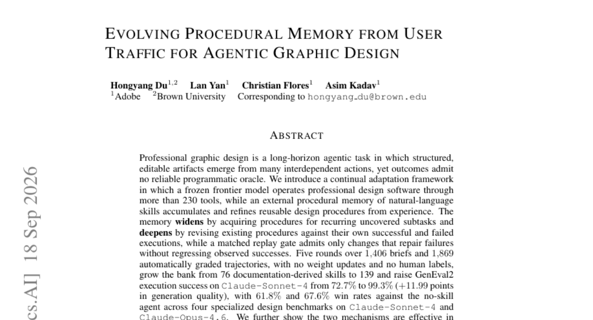

### 📌 한 줄 요약
사용자 작업 데이터를 활용해 에이전트의 절차적 메모리를 진화시켜 그래픽 디자인 성능을 극대화하는 프레임워크

### 🔑 핵심 포인트
- 가중치 업데이트 없이 외부 '절차적 메모리(Procedural Memory)'를 통해 에이전트 능력을 확장하는 방식
- 새로운 스킬을 추가하는 'Widening'과 기존 스킬을 개선하는 'Deepening' 메커니즘의 결합
- 실패를 복구하면서 성공 사례를 유지하는 'Matched Replay Gate'를 통한 안정적 진화

### 🧑‍💻 개발자 관점
모델 자체를 재학습(Fine-tuning)하지 않고도 외부 메모리 관리만으로 에이전트의 전문성을 높이는 실용적인 아키텍처를 보여줍니다.

### 🚀 실무 적용 아이디어
- 에이전트의 작업 로그를 자연어 스킬 형태로 구조화하는 파이프라인 구축 실험
- 성공/실패 사례를 기반으로 한 메모리 업데이트 로직(Widening/Deepening) 구현
- 기존 스킬의 퇴보를 방지하기 위한 회귀 테스트(Regression Test) 환경 설계

### ⚠️ 리스크/한계
- 메모리 크기가 커질수록 검색 및 관리 복잡도가 증가할 수 있음
- 자연어 기반 스킬이 복잡한 도구 간 상호작용을 완벽히 제어하기에는 한계가 있을 수 있음

### 📝 초록 기반 상세 설명
전문적인 그래픽 디자인은 복잡한 상호 의존적 작업이 수반되지만, 결과물을 검증할 명확한 프로그래밍적 기준(oracle)이 부족한 과제입니다. 본 논문은 고정된 프론티어 모델이 230개 이상의 디자인 도구를 사용하면서, 외부의 자연어 스킬 메모리를 통해 경험을 축적하고 정제하는 지속적 적응 프레임워크를 제안합니다. 메모리는 새로운 하위 작업을 습득하며 확장(widening)되고, 성공/실패 사례를 바탕으로 기존 절차를 수정하며 심화(deepening)됩니다. 실험 결과, 모델 가중치 업데이트나 인간의 라벨링 없이도 GenEval2 성공률을 72.7%에서 99.3%로 크게 향상시켰습니다. 이는 노이즈가 많고 검증이 어려운 피드백 환경에서 에이전트의 지속적 적응을 위한 실용적인 경로를 제시합니다.

---

## 9. [OmniVBench: A Benchmark and Large-Scale Dataset for Omni Reference-to-Video Generation](https://huggingface.co/papers/2609.22069)
**Upvotes**: 19 | **도입 난이도**: 중 | **신뢰도**: 상
**arXiv**: https://arxiv.org/abs/2609.22069

**태그**: Video Generation, Benchmark, Dataset, Computer Vision, Video, Evaluation

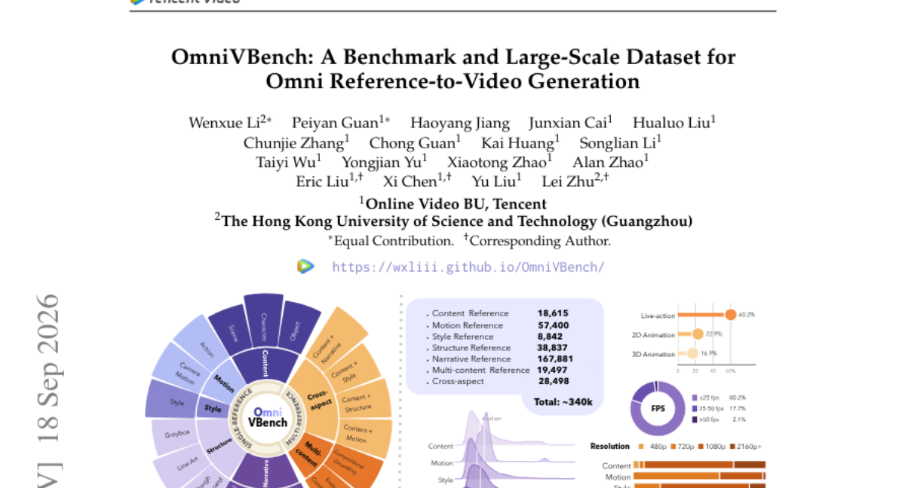

### 📌 한 줄 요약
다양한 참조(Reference) 요소를 정밀하게 제어하고 평가하기 위한 대규모 벤치마크 및 학습 데이터셋 제안

### 🔑 핵심 포인트
- 7개 작업군, 18개 세부 태스크를 포함하는 포괄적인 OmniVBench 벤치마크 구축
- 요소별 보존, 분리, 결합 능력을 검증하는 12,172개의 정밀 체크리스트 기반 평가 프로토콜 도입
- 34만 개의 고품질 비디오 샘플을 포함하는 대규모 Omni-R2V 학습 데이터셋 및 구축 파이프라인 제공

### 🧑‍💻 개발자 관점
복합적인 참조(이미지, 모션, 스타일 등)를 동시에 제어해야 하는 차세대 비디오 생성 모델 개발 시, 성능 측정과 학습 데이터 확보를 위한 표준 가이드를 제공합니다.

### 🚀 실무 적용 아이디어
- 제공된 데이터셋 파이프라인을 활용하여 기존 비디오 생성 모델의 학습 데이터 생성 실험
- OmniVBench의 체크리스트를 활용하여 현재 모델의 제어 정밀도(Disentanglement) 측정
- 다양한 참조 조합(Multi-reference) 상황에서의 모델 강건성 테스트

### ⚠️ 리스크/한계
- 대규모 데이터셋 구축 및 평가를 위한 컴퓨팅 자원 소모가 클 수 있음
- 제시된 체크리스트 기반 평가가 인간의 주관적 미적 기준을 완벽히 대체하기 어려움

### 📝 초록 기반 상세 설명
최근 참조 기반 비디오 생성(R2V) 기술이 복합적인 제어 기능을 포함하는 Omni-R2V 패러다임으로 진화하고 있습니다. 그러나 기존 벤치마크는 참조 유형이 제한적이고, 요소 간의 분리(disentanglement)나 정밀한 일치 여부를 평가하기에 부족합니다. 또한 고품질의 학습 데이터 구축 비용이 높아 연구용 데이터셋이 부족한 상황입니다. 본 논문은 7개 작업군과 18개 세부 작업을 포함하는 OmniVBench와 34만 개의 산업급 학습 데이터인 Omni-R2V 데이터셋을 제안합니다. 이를 통해 참조 요소의 보존, 분리, 결합 능력을 정밀하게 검증하는 체크리스트 기반 평가 방식을 도입했습니다. 실험 결과, 기존 모델들이 복합적인 참조 제어 상황에서 성능 격차가 큼을 확인했습니다.

---

## 10. [BI-Agent and BI-Bench: Towards Automating End-to-End Business Intelligence](https://huggingface.co/papers/2609.20886)
**Upvotes**: 11 | **도입 난이도**: 상 | **신뢰도**: 상
**arXiv**: https://arxiv.org/abs/2609.20886

**태그**: Agent, Data Engineering, LLM, Automation, Reasoning, Benchmark

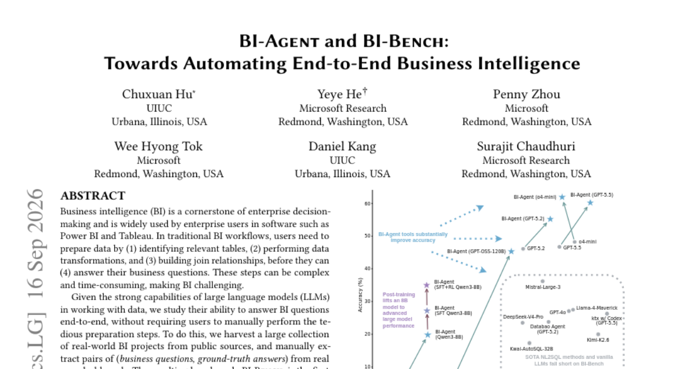

### 📌 한 줄 요약
데이터 준비부터 질문 답변까지의 복잡한 BI 워크플로우를 자동화하는 에이전트와 벤치마크 제안

### 🔑 핵심 포인트
- 실세계 BI 프로젝트 기반의 엔드투엔드 평가 벤치마크 'BI-Bench' 구축
- 도구 활용(Tool-augmented)을 통해 BI 워크플로우를 하위 작업으로 분해하는 BI-Agent 설계
- 실제 BI 프로젝트 궤적을 활용한 SFT 및 RL 기반의 도메인 특화 포스트 트레이닝 프레임워크 개발

### 🧑‍💻 개발자 관점
데이터 엔지니어링과 분석 작업이 결합된 복잡한 데이터 파이프라인을 LLM 에이전트로 자동화할 수 있는 실질적인 방법론을 제시합니다.

### 🚀 실무 적용 아이디어
- 제공된 BI-Bench 데이터셋을 활용하여 현재 사용 중인 LLM의 BI 수행 능력 테스트
- 도구 활용(Tool-use) 기반의 에이전트 구조를 기존 데이터 파이프라인에 이식
- 도메인 특화 데이터셋을 활용한 SFT/RL 파이프라인 구축 실험

### ⚠️ 리스크/한계
- 실제 운영 환경의 보안 및 데이터 프라이버시 문제로 인한 데이터 활용 제약
- 복잡한 스키마와 대규모 데이터셋에서의 에이전트 추론 안정성 확보 필요

### 📝 초록 기반 상세 설명
기업의 의사결정을 위한 BI 워크플로우는 데이터 식별, 변환, 조인 등 복잡한 전처리 과정을 포함하여 많은 시간이 소요됩니다. 본 논문은 LLM이 이러한 엔드투엔드 BI 작업을 수행할 수 있는지 평가하기 위해 실세계 프로젝트 기반의 벤치마크인 BI-Bench를 구축했습니다. 실험 결과, 최신 LLM들도 복잡한 BI 작업에서는 낮은 정확도를 보였습니다. 이를 해결하기 위해 워크플로우를 하위 작업으로 분해하고 도구를 활용하는 BI-Agent와 실세계 데이터를 활용한 SFT/RL 기반의 포스트 트레이닝 프레임워크를 제안합니다. 결과적으로 제안된 방법론은 기존 LLM 대비 성능을 대폭 향상시켰습니다.

### 🖼️ 추가 자료
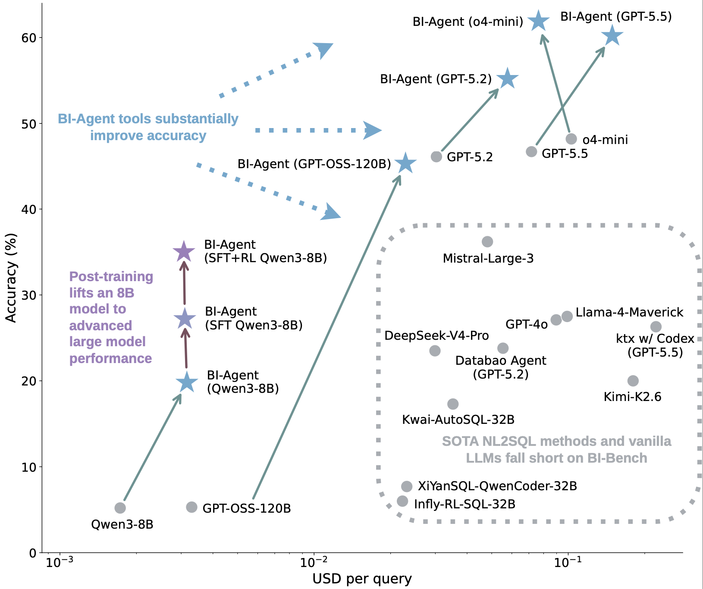

---

## 11. [MintAct: A Unified Visual Agent for Digital Environments](https://huggingface.co/papers/2609.22083)
**Upvotes**: 11 | **도입 난이도**: 상 | **신뢰도**: 상
**arXiv**: https://arxiv.org/abs/2609.22083

**태그**: Agent, UI-Automation, Reinforcement-Learning, Vision-Language-Model, Vision, Benchmark

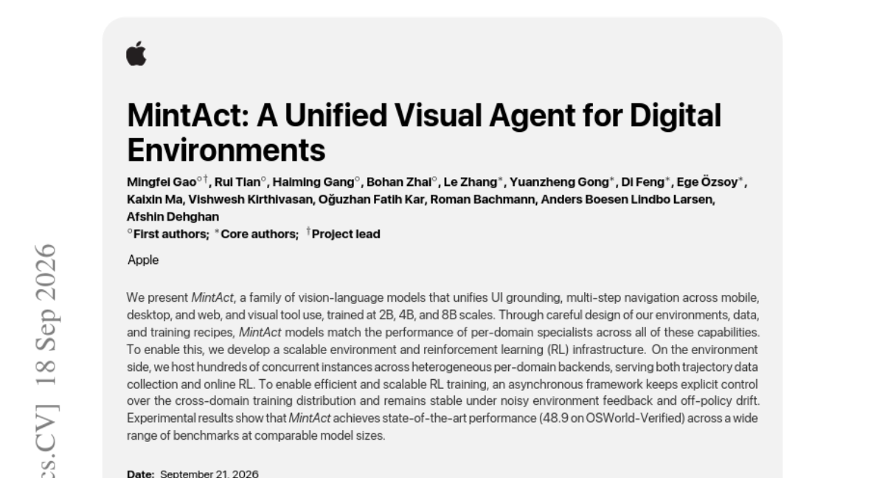

### 📌 한 줄 요약
UI 제어, 탐색, 도구 사용을 통합하여 도메인 특화 모델 수준의 성능을 내는 범용 시각 에이전트 프레임워크

### 🔑 핵심 포인트
- UI 제어, 탐색, 도구 사용을 하나의 모델로 통합한 범용 시각 에이전트 개발
- 수백 개의 동시 인스턴스를 지원하는 확장 가능한 환경 및 비동기 RL 프레임워크 구축
- 2B~8B 규모의 모델로 도메인별 특화 모델 수준의 성능 달성

### 🧑‍💻 개발자 관점
단일 모델로 모바일, 데스크톱, 웹을 아우르는 자동화 에이전트를 구축할 수 있는 기술적 토대를 제공합니다.

### 🚀 실무 적용 아이디어
- 제시된 비동기 RL 프레임워크의 안정성 및 오프폴리시 드리프트 제어 방식 분석
- OSWorld와 같은 복잡한 환경에서의 에이전트 추론 속도 및 효율성 검토
- 소형 모델(2B/4B)을 활용한 온디바이스 UI 자동화 적용 가능성 테스트

### ⚠️ 리스크/한계
- 모델 크기 대비 높은 연산 비용 및 실시간 환경 피드백에 따른 불안정성 가능성
- 다양한 도메인을 통합하는 과정에서 발생할 수 있는 범용성 대 전문성 간의 트레이드오프

### 📝 초록 기반 상세 설명
기존의 UI 에이전트는 특정 도메인에 특화된 모델이 필요하거나 복잡한 멀티스텝 작업 수행에 한계가 있었습니다. 이를 해결하기 위해 UI 그라운딩, 멀티스텝 내비게이션, 시각적 도구 사용을 통합한 MintAct 모델군을 제안합니다. 연구진은 대규모 데이터와 환경 설계를 통해 2B~8B 규모의 모델이 전문 모델과 대등한 성능을 내도록 학습시켰습니다. 이를 위해 수백 개의 인스턴스를 동시에 실행할 수 있는 확장 가능한 환경 및 비동기 RL 인프라를 구축했습니다. 실험 결과, MintAct는 OSWorld-Verified 등 주요 벤치마크에서 SOTA 성능을 달립니 다.

---

## 12. [GraphSkillEvo: Evolutionary Optimization of Graph-Structured Agent Skills](https://huggingface.co/papers/2609.21749)
**Upvotes**: 9 | **도입 난이도**: 중 | **신뢰도**: 상
**arXiv**: https://arxiv.org/abs/2609.21749

**태그**: LLM-Agent, Optimization, Workflow-Automation, Evolutionary-Algorithm, Agent, RAG, Benchmark

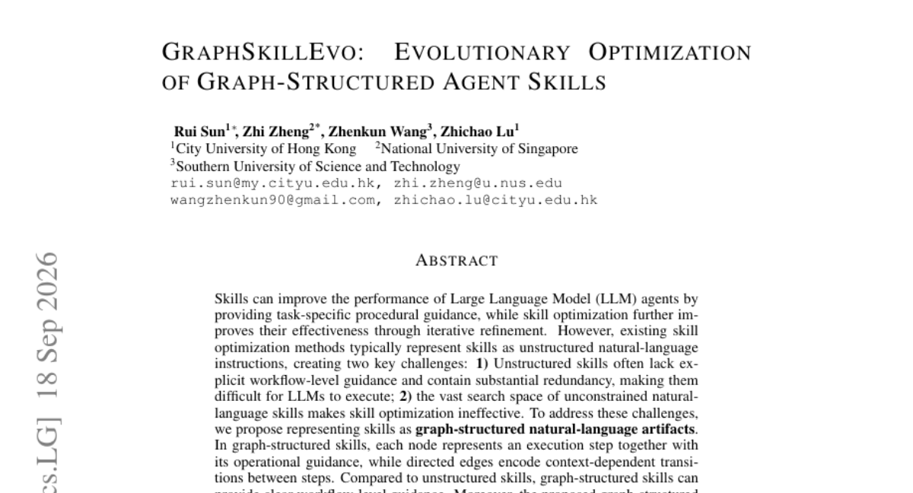

### 📌 한 줄 요약
그래프 구조의 스킬 표현을 통해 LLM 에이전트의 작업 워크플로우를 최적화하는 진화 알고리즘 프레임워크

### 🔑 핵심 포인트
- 비정형 자연어 대신 노드(단계)와 엣지(전이)로 구성된 그래프 구조로 스킬을 정형화
- 진화 알고리즘(Mutation, Crossover)을 통한 효율적인 스킬 공간 탐색 및 최적화
- 워크플로우 가이드 명확화 및 중복 제거를 통한 LLM 실행 효율성 증대

### 🧑‍💻 개발자 관점
에이전트의 복잡한 워크플로우를 단순 텍스트가 아닌 구조화된 그래프로 관리함으로써, 더 정교하고 예측 가능한 자동화 스킬을 구축할 수 있습니다.

### 🚀 실무 적용 아이디어
- 기존의 단순 프롬프트 기반 스킬을 그래프 구조로 변환하여 성능 차이 비교
- 복잡한 다단계 워크플로우가 필요한 태스크에 GraphSkillEvo 프레임워크 적용 테스트
- 에이전트의 작업 성공률과 실행 토큰 비용 간의 상관관계 분석

### ⚠️ 리스크/한계
- 그래프 구조 설계 시 노드와 엣지의 정의가 복잡해질 경우 관리 비용 증가
- 특정 도메인에 특화된 그래프 구조가 다른 태스크로의 일반화 성능에 미치는 영향

### 📝 초록 기반 상세 설명
LLM 에이전트의 성능 향상을 위해 스킬 최적화가 중요해지고 있으나, 기존의 비정형 자연어 방식은 워크플로우 가이드가 부족하고 탐색 공간이 너무 넓다는 문제가 있습니다. 이를 해결하기 위해 본 논문은 각 노드가 실행 단계와 가이드를 담고, 엣지가 전이 조건을 나타내는 그래프 구조의 스킬 표현 방식을 제안합니다. 이러한 구조적 표현을 바탕으로 돌연변이와 교차 연산자를 사용하는 인구 기반 진화 최적화 프레임워크인 GraphSkillEvo를 도입했습니다. 실험 결과, GraphSkillEvo는 기존의 SkillOpt 방식보다 더 넓은 탐색 공간을 효율적으로 탐색하며 다양한 에이전트 벤치마크에서 우수한 성능 향상을 입증했습니다.

---

## 13. [Calibrating Teacher--Student Discrepancy for On-Policy Distillation](https://huggingface.co/papers/2609.21619)
**Upvotes**: 6 | **도입 난이도**: 중 | **신뢰도**: 상
**arXiv**: https://arxiv.org/abs/2609.21619

**태그**: Knowledge Distillation, Reasoning Models, LLM Training, RAG, Reasoning, Benchmark, Distillation

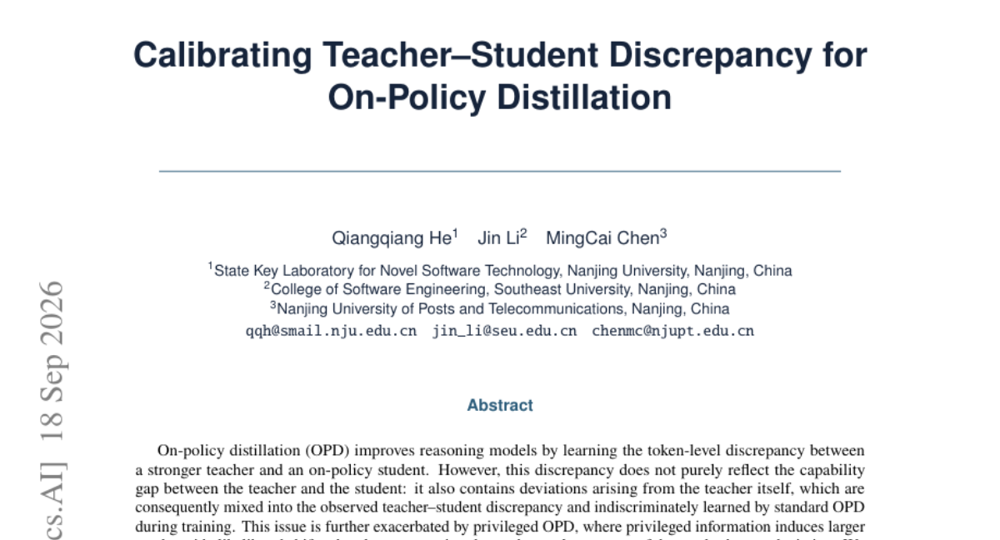

### 📌 한 줄 요약
교사 모델 자체의 편차를 제거하여 학생 모델의 추론 능력을 정교하게 학습시키는 온폴리 증류 기법

### 🔑 핵심 포인트
- 교사 모델의 자체 편차(self-deviation)가 학생 모델의 학습을 방해하는 문제를 식별
- 특권 정보 활용 시 발생하는 교사 측 확률 편차를 제어하는 Cal-OPD 방법론 제안
- 교사-학생 간 차이 중 순수한 능력 차이만을 추출하여 최적화 신호로 활용

### 🧑‍💻 개발자 관점
강력한 교사 모델을 활용할 때 발생하는 노이즈를 제거하여, 더 작은 학생 모델이 핵심적인 추론 로직만 효율적으로 학습할 수 있게 합니다.

### 🚀 실무 적용 아이디어
- 기존 OPD 프레임워크에 Cal-OPD의 편차 보정 로직 적용 테스트
- 특권 정보(Privileged Information)가 포함된 데이터셋에서의 성능 향상 폭 검증
- 모델 규모별로 교사 편차 제거가 학습 안정성에 미치는 영향 분석

### ⚠️ 리스크/한계
- 교사의 자기 편차 영역을 정확히 추정하는 과정에서의 계산 복잡도 증가 가능성
- 특정 도메인(수학적 추론 등) 외의 일반적인 언어 작업에서의 일반화 성능 확인 필요

### 📝 초록 기반 상세 설명
온폴리 증류(OPD)는 교사 모델과 학생 모델 간의 토큰 수준 차이를 학습하여 추론 능력을 향상시킵니다. 그러나 기존 방식은 교사 모델 자체의 변동성(self-deviation)까지 학생 모델이 학습하게 되는 문제가 있습니다. 특히 특권 정보(privileged information)를 사용하는 경우 이러한 교사 측 편차가 더 커져 학습 효율이 저하됩니다. 이를 해결하기 위해 제안된 Cal-OPD는 개입(intervention)을 통해 교사의 자기 편차 영역을 추정하고, 이를 제외한 순수한 차이만을 학습 신호로 사용합니다. 실험 결과, 전체 차이의 일부만 사용함에도 불구하고 수학적 추론 벤치마크에서 기존 OPD보다 우수한 성능을 보였습니다.

---

## 14. [MoME: Mixture-of-Memory Embeddings for Context-Aware Sparse Lookup](https://huggingface.co/papers/2609.15126)
**Upvotes**: 5 | **도입 난이도**: 중 | **신뢰도**: 상
**arXiv**: https://arxiv.org/abs/2609.15126

**태그**: LLM, Efficient Training, Embedding, Parameter-Efficient, Inference

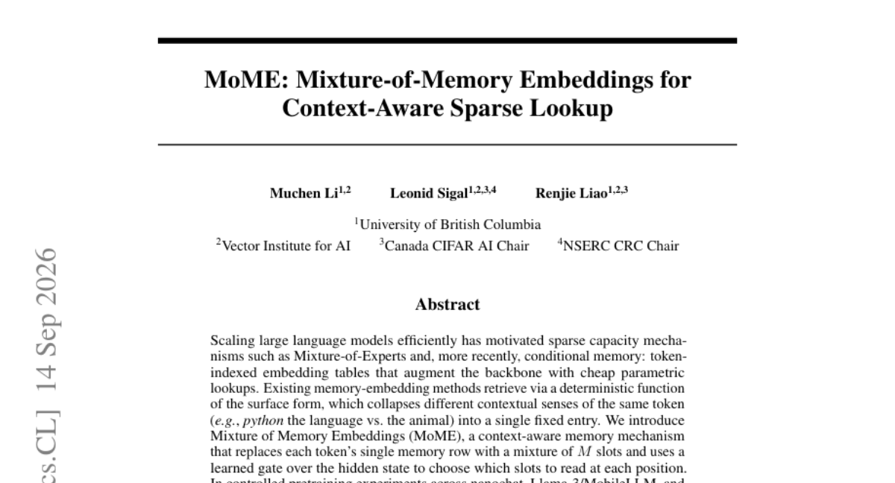

### 📌 한 줄 요약
문맥에 따라 서로 다른 임베딩을 선택하는 MoME 방식을 통해 토큰의 다의성을 해결하고 메모리 효율을 극대화한 기법

### 🔑 핵심 포인트
- 단일 임베딩 대신 M개의 슬롯을 사용하는 Mixture-of-Memory 구조 도입
- 문맥(Hidden state)에 따라 적절한 메모리 슬롯을 선택하는 학습된 게이트 메커니즘 적용
- 동일 토큰의 다의성(Polysemy) 문제를 해결하여 문맥 의존적 임베딩 추출 가능

### 🧑‍💻 개발자 관점
모델 크기를 크게 키우지 않고도 메모리 슬롯 분할을 통해 토큰의 의미적 정교함을 높일 수 있어, 효율적인 소형 모델(SLM) 최적화에 유용합니다.

### 🚀 실무 적용 아이디어
- 기존의 고정된 임베딩 테이블을 MoME 구조로 교체하여 성능 변화 측정
- 다의어가 빈번한 도메인 특화 데이터셋에서 MoME의 라우팅 성능 검증
- 메모리 슬롯 수(M) 변화에 따른 연산 비용 대비 성능 효율성 벤치마크

### ⚠️ 리스크/한계
- 슬롯 수가 늘어날 경우 메모리 사용량 및 인덱싱 오버헤드 발생 가능성
- 학습 시 게이트가 특정 슬롯에만 쏠리는 모드 붕괴(Mode collapse) 위험

### 📝 초록 기반 상세 설명
최근 LLM의 효율적 확장을 위해 토큰 인덱스 기반의 메모리 임베딩 방식이 주목받고 있습니다. 그러나 기존 방식은 표면형(surface form)에 의존하는 결정론적 함수를 사용하여, 동일한 단어가 가진 서로 다른 문맥적 의미를 하나의 고정된 엔트리로 통합해버리는 문제가 있습니다. 이를 해결하기 위해 본 논문은 각 토큰의 메모리 행을 M개의 슬롯으로 분할하고, 은닉 상태(hidden state)를 기반으로 학습된 게이트를 통해 적절한 슬롯을 선택하는 MoME 방식을 제안합니다. 다양한 백본 모델을 활용한 실험 결과, MoME는 파라미터 및 연산량(FLOPs)이 동일한 조건에서 기존 베이스라인보다 우수한 성능을 보였습니다. 특히 소규모 모델에서 메모리 크기 확장에 따른 성능 향상 추세가 유망하며, 학습 및 추론 효율성도 유지함을 확인했습니다.

---

## 15. [When AI Reviews Train AI Reviewers: Scientific-Judgment Collapse and Mitigation](https://huggingface.co/papers/2609.20942)
**Upvotes**: 5 | **도입 난이도**: 중 | **신뢰도**: 상
**arXiv**: https://arxiv.org/abs/2609.20942

**태그**: LLM, Data Contamination, Model Alignment, Evaluation, Vision, Safety

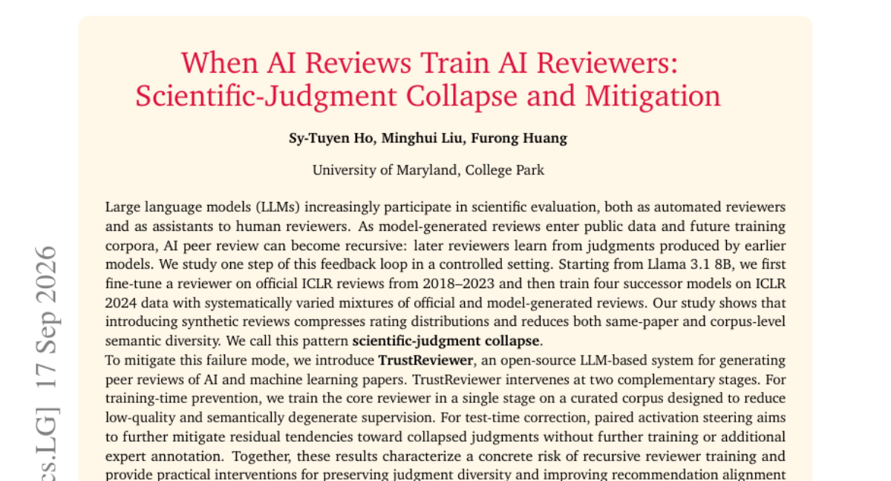

### 📌 한 줄 요약
AI가 생성한 리뷰가 학습 데이터로 재사용될 때 발생하는 판단 붕괴 현상을 규명하고 이를 방지하는 프레임워크를 제안함

### 🔑 핵심 포인트
- AI 생성 리뷰가 학습 데이터로 유입될 때 발생하는 '판단 붕괴' 현상 규명
- 데이터 정제와 활성화 스티어링을 결합한 TrustReviewer 프레임워크 제안
- 재귀적 피드백 루프가 모델의 판단 다양성과 점수 분포를 어떻게 왜곡하는지 입증

### 🧑‍💻 개발자 관점
LLM 기반 자동화 시스템을 구축할 때, 모델 생성 데이터가 학습 루프에 포함될 경우 발생할 수 있는 성능 퇴화 및 다양성 상실 문제를 경고함

### 🚀 실무 적용 아이디어
- 모델 학습 데이터에 합성 데이터(Synthetic Data) 비중을 높이며 평가 지표의 분산 변화 관찰하기
- 학습 데이터 정제 시 모델 생성 리뷰의 품질 검증 파이프라인 구축하기
- Activation Steering 기법을 활용해 모델의 특정 편향을 제어하는 실험 수행하기

### ⚠️ 리스크/한계
- 실험이 특정 학회(ICLR) 데이터에 국한되어 일반화 가능성 검토 필요
- 활성화 스티어링 방식이 모든 도메인에서 일관된 효과를 보장하지 않을 수 있음

### 📝 초록 기반 상세 설명
LLM이 과학적 평가에 참여함에 따라 모델 생성 리뷰가 미래 학습 데이터에 포함되는 재귀적 피드백 루프 위험이 커지고 있습니다. 본 연구는 Llama 3.1 8B를 기반으로 합성 리뷰가 포함된 데이터로 후속 모델을 학습시키는 실험을 진행했습니다. 실험 결과, 합성 리뷰 도입 시 점수 분포가 압축되고 의미적 다양성이 감소하는 '과학적 판단 붕괴(scientific-judgment collapse)' 현상이 관찰되었습니다. 이를 해결하기 위해 저자들은 TrustReviewer 시스템을 제안합니다. 이 시스템은 학습 단계에서의 정제된 데이터 학습과 테스트 단계에서의 활성화 스티어링(activation steering)을 통해 판단의 다양성을 유지합니다. 결과적으로 재귀적 학습의 위험을 규명하고 평가의 다양성을 보존하는 실질적인 개입 방법을 제시합니다.

---

## 16. [Gricea: An Open Science Platform for Conversational AI Research](https://huggingface.co/papers/2609.22039)
**Upvotes**: 4 | **도입 난이도**: 중 | **신뢰도**: 상
**arXiv**: https://arxiv.org/abs/2609.22039

**태그**: Conversational AI, Open Science, Reproducibility, Research Platform, RAG

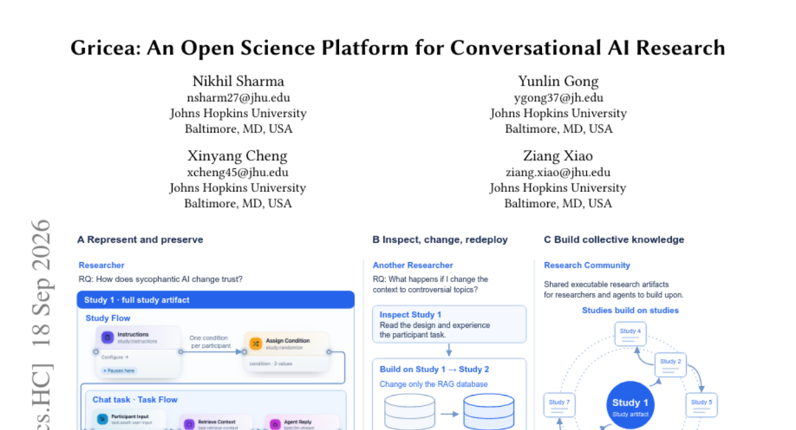

### 📌 한 줄 요약
대규모 대화형 AI 연구의 재현성과 확장성을 보장하기 위한 오픈 사이언스 플랫폼 Gricea 제안

### 🔑 핵심 포인트
- 실험 절차, 시스템, 대화 동작을 통합한 구성 가능한 연구 아티팩트 프레임워크 제공
- 기존 연구의 재현 가능성 검증 및 누락된 정보 식별을 통한 연구 품질 향상
- 다양한 연구 질문에 대응 가능한 오픈 사이언스 기반의 연구 재사용 생태계 구축

### 🧑‍💻 개발자 관점
대화형 AI 모델의 성능 평가나 사용자 실험 시, 실험 환경을 코드로 규격화하여 결과의 신뢰성을 확보하고 타 연구와 비교 가능한 환경을 구축할 수 있습니다.

### 🚀 실무 적용 아이디어
- 기존에 수행한 대화형 AI 실험 설정을 Gricea의 아티팩트 구조로 변환해보기
- 현재 진행 중인 실험의 재현 가능성을 높이기 위해 실험 구성 요소(절차, UI, 태스크) 분리하기
- 동일한 실험 설정을 다른 환경에서 실행하여 결과의 일관성 테스트하기

### ⚠️ 리스크/한계
- 플랫폼의 표준 형식이 기존의 다양한 연구 방법론을 모두 수용하기에는 제약이 있을 수 있음
- 사용자가 플랫폼의 규격에 맞춰 실험을 설계해야 하는 학습 곡선 존재

### 📝 초록 기반 상세 설명
대규모 대화형 AI(CAI) 연구는 인간 행동 이해와 설계에 필수적이지만, 기존 연구들은 시스템 및 실험 설정 보고 방식이 파편화되어 있어 재현과 지식 축적이 어렵습니다. 이를 해결하기 위해 연구 과정을 구성 가능한 배포형 아티팩트로 관리하는 오픈 사이언스 플랫폼 Gricea를 제안합니다. Gricea는 선행 연구 분석을 바탕으로 실험 절차, 사용자 인터페이스, 대화 작업 동작을 하나의 통합된 구조로 결합합니다. 재현 실험 결과, Gricea는 기존 CUI 2026 논문들의 설정을 높은 비율로 재현할 수 있었으며, 동시에 재현을 방해하는 누락된 정보를 식별하는 데 성공했습니다. 사용자 연구를 통해 다양한 배경의 연구자들이 이를 활용해 실행 가능한 연구를 성공적으로 구축함을 입증했습니다.

---

## 17. [CADWorld: Computer-Use Benchmark for Long-Horizon Computer-Aided Design](https://huggingface.co/papers/2609.16251)
**Upvotes**: 4 | **도입 난이도**: 상 | **신뢰도**: 상
**arXiv**: https://arxiv.org/abs/2609.16251

**태그**: Agent, CAD, Benchmark, Engineering, GUI-Automation, RAG, Evaluation

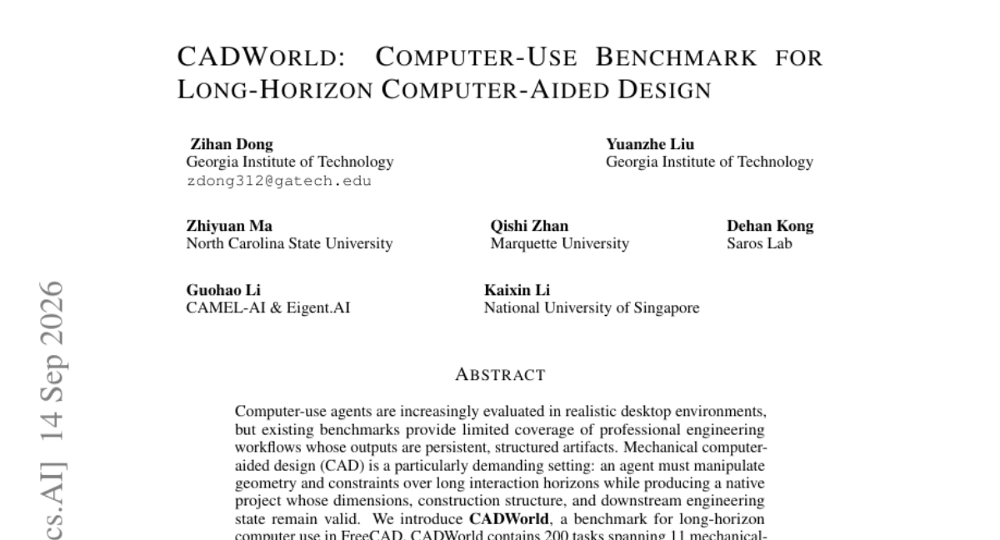

### 📌 한 줄 요약
전문적인 엔지니어링 워크플로우를 검증하기 위해 설계된 장기적 컴퓨터 사용(Long-horizon) CAD 벤치마크인 CADWorld를 제안합니다.

### 🔑 핵심 포인트
- FreeCAD 기반의 11개 카테고리, 200개 태스크를 포함하는 전문 CAD 벤치마크 구축
- 단순 결과물 확인을 넘어 파라메트릭 구조, 제약 조건, 시뮬레이션 결과 등 엔지니어링 유효성 검증
- 일반적인 GUI 에이전트가 복잡한 구조적/기하학적 요구사항을 충족하지 못함을 입증

### 🧑‍💻 개발자 관점
단순한 UI 조작을 넘어, 결과물의 구조적 무결성이 중요한 전문 소프트웨어(CAD, CAE 등) 분야의 에이전트 성능 평가 기준을 제시합니다.

### 🚀 실무 적용 아이디어
- FreeCAD 환경에서 GUI 기반 에이전트의 제약 조건 준수 능력 테스트
- 장기적 작업(Long-horizon) 시 결과물의 파라메트릭 구조 유지 여부 확인
- 에이전트의 시각적 피드백과 실제 기하학적 결과 간의 정렬(Alignment) 분석

### ⚠️ 리스크/한계
- 현재 에이전트들의 낮은 성공률로 인해 벤치마크의 난이도가 매우 높음
- 특정 소프트웨어(FreeCAD)에 종속된 환경에서의 평가 결과임

### 📝 초록 기반 상세 설명
기존의 데스크톱 환경 벤치마크는 구조화된 결과물을 생성해야 하는 전문 엔지니어링 워크플로우를 평가하기에 부족합니다. 특히 기계 CAD는 장기적인 상호작용 속에서 기하학적 제약과 구조적 유효성을 유지해야 하는 고난도 작업입니다. 본 논문은 FreeCAD를 기반으로 스케치, 모델링, 조립, 시뮬레이션 등 11개 카테고리 200개 태스크를 포함하는 CADWorld 벤치마크를 소개합니다. 에이전트는 GUI 액션과 스크린샷을 통해 작업하며, 결과물은 파라메트릭 구조 및 제조 가능성 등 정밀한 검증을 거칩니다. 실험 결과, 현재 최상위 에이전트도 성공률이 17.5%에 불과하여 일반 GUI 숙련도와 전문 엔지니어링 실행 능력 사이의 큰 격차를 확인했습니다.

---

## 18. [FRAUDSkill: Structured Frozen-Weight Skill Optimization for Audio Anti-Fraud Detection](https://huggingface.co/papers/2609.18766)
**Upvotes**: 4 | **도입 난이도**: 중 | **신뢰도**: 상
**arXiv**: https://arxiv.org/abs/2609.18766

**태그**: Audio-Language Model, Parameter-Efficient Fine-Tuning, Anti-Fraud, Decision Protocol, Reasoning, Audio, Benchmark, Inference

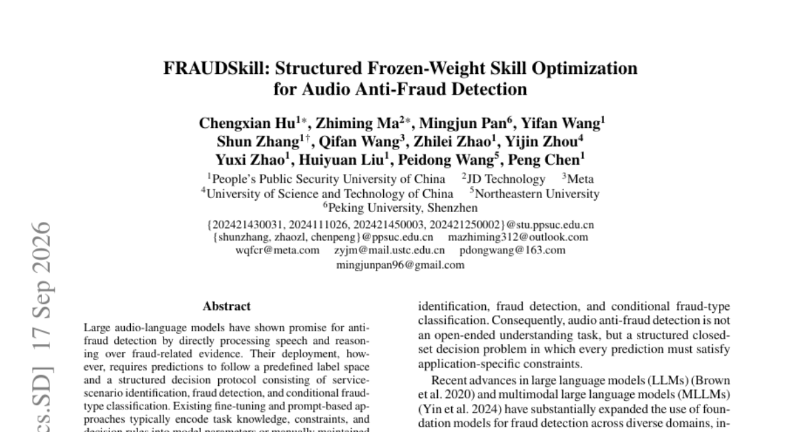

### 📌 한 줄 요약
모델 가중치를 고정한 상태에서 외부 스킬 레이어만 최적화하여 복잡한 의사결정 프로토콜을 준수하는 오디오 사기 탐지 프레임워크

### 🔑 핵심 포인트
- 모델 가중치를 변경하지 않는 Frozen-weight 방식의 외부 스킬 최적화
- 서비스 시나리오 식별, 사기 탐지, 유형 분류로 이어지는 구조적 의사결정 프로토콜 구현
- 검증 가이드형 다중 경로 추론을 통한 출력 형식 및 프로토콜 준수 보장

### 🧑‍💻 개발자 관점
모델 전체를 재학습하지 않고도 특정 도메인의 복잡한 비즈니스 로직과 출력 형식을 강제할 수 있는 효율적인 적응 방식을 제시합니다.

### 🚀 실무 적용 아이디어
- Frozen-weight 방식과 전체 파인튜닝 간의 성능 및 비용 효율성 비교 실험
- 다양한 도메인별 의사결정 프로토콜(Decision Protocol) 설계 및 적용 테스트
- 복잡한 출력 형식을 요구하는 다른 멀티모달 태스크에 프레임워크 이식

### ⚠️ 리스크/한계
- 외부 스킬 레이어의 복잡도가 증가할 경우 추론 지연 시간(Latency) 발생 가능성
- 모델 본체의 지식과 외부 스킬 간의 불일치 발생 시 성능 저하 위험

### 📝 초록 기반 상세 설명
대규모 오디오-언어 모델은 사기 탐지에 유망하지만, 정해진 라벨 공간과 복잡한 의사결정 프로토콜을 따르는 데 어려움이 있습니다. 기존의 파인튜닝이나 프롬프트 방식은 변화하는 사기 패턴과 정책에 유연하게 대응하기 어렵다는 문제가 있습니다. 이를 해결하기 위해 본 논문은 모델 본체는 유지하면서 외부의 스킬 프로그램, 경로별 정책, 의사결정 규칙만을 최적화하는 FRAUDSkill 프레임워크를 제안합니다. 또한 구조화된 출력 제어와 검증 가이드형 다중 경로 추론을 결합하여 프로토콜을 준수하는 예측을 보장합니다. 실험 결과, TeleAntiFraud 벤치마크에서 기존 베이스라인 대비 성능을 크게 향상시키면서도 무효 출력 비율을 최소화했습니다.

---

## 19. [TeleAntiFraud 2.0: A Refreshable, Profile-Grounded, and Audio-Based Benchmark for Telecom Fraud Detection](https://huggingface.co/papers/2609.18748)
**Upvotes**: 4 | **도입 난이도**: 중 | **신뢰도**: 상
**arXiv**: https://arxiv.org/abs/2609.18748

**태그**: Telecom-Fraud, Audio-Analysis, Benchmark, LLM-Evaluation, RAG, Audio, Evaluation

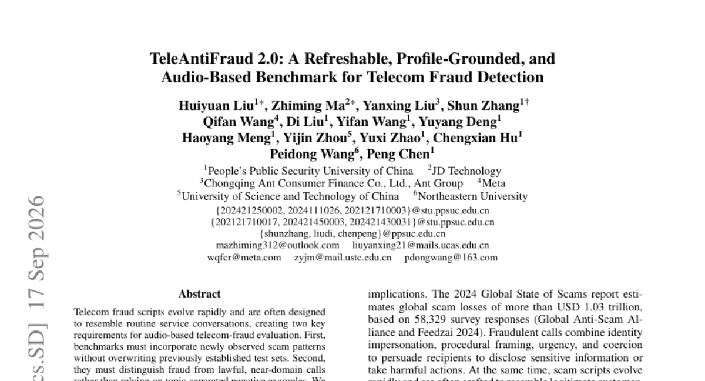

### 📌 한 줄 요약
실제 사기 패턴과 유사한 도메인 내 대화를 포함하여 모델의 변별력을 검증하는 오디오 기반 텔레콤 사기 탐지 벤치마크 제안

### 🔑 핵심 포인트
- Mixed-Tree 파이프라인을 통한 프로필 기반의 정교한 사기/정상 시나리오 생성
- 도메인이 유사한 'Near-domain' 사례를 포함하여 모델의 변별력을 높인 벤치마크 구축
- 매월 고정된 데이터셋을 제공하여 모델의 스냅샷 민감도 및 성능 저하 문제를 방지

### 🧑‍💻 개발자 관점
단순히 주제가 다른 데이터를 사용하는 것이 아니라, 유사한 맥락 내에서 사기를 구분하는 실전형 모델 성능 검증이 가능합니다.

### 🚀 실무 적용 아이디어
- 제공된 데이터셋을 활용하여 현재 개발 중인 사기 탐지 모델의 도메인 내 변별력 테스트
- ASR+LLM 결합 모델이 클래스 우선순위(Class-prior)에 의존하는지 여부 확인
- 새로운 사기 패턴 추가 시 기존 성능과의 비교를 위한 파이프라인 적용

### ⚠️ 리스크/한계
- 데이터 생성 방식에 따른 특정 패턴에 대한 모델의 과적합 가능성
- 중국어 기반 데이터셋이므로 타 언어권 도메인 적용 시 언어적 차이 발생 가능

### 📝 초록 기반 상세 설명
텔레콤 사기 수법은 빠르게 진화하며 일상적인 대화와 구분이 어려워 기존의 주제 분리형 평가 방식으로는 한계가 있습니다. 본 논문은 새로운 사기 패턴을 지속적으로 반영하면서도 기존 테스트셋을 유지할 수 있는 TeleAntiFraud 2.0을 제안합니다. Mixed-Tree 생성 파이프라인을 통해 실제 사기 사례를 프로필 기반 시나리오로 변환하고, 동일 맥락 내에서 사기와 정상 통화를 생성하는 방식을 사용합니다. 매달 고정된 평가 프로토콜을 통해 생성된 데이터셋을 검증한 결과, 기존 모델들이 유사 도메인 사례에서 성능이 급격히 하락함을 확인했습니다. 결과적으로 본 연구는 현실적인 혼동 조건에서의 모델 평가를 위한 새로운 기준을 제시합니다.

---

## 20. [MLLMs Hallucinate when Information Distribution Drifts in Synergy Heads](https://huggingface.co/papers/2609.09206)
**Upvotes**: 4 | **도입 난이도**: 중 | **신뢰도**: 상
**arXiv**: https://arxiv.org/abs/2609.09206

**태그**: MLLM, Hallucination, Causal Inference, Multimodal

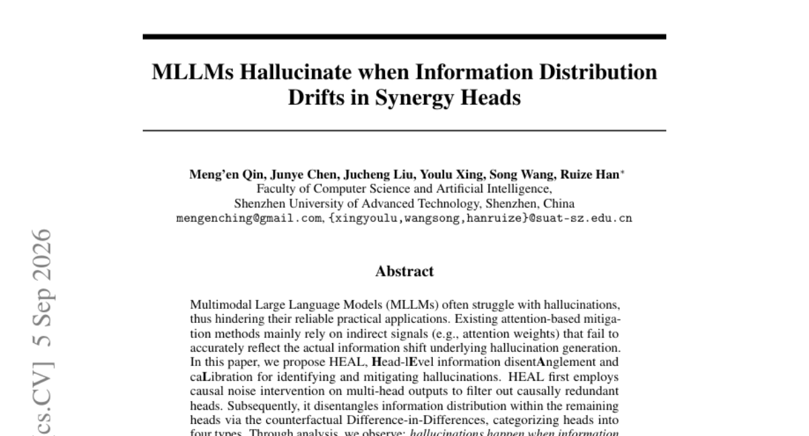

### 📌 한 줄 요약
시너지 헤드의 정보 분포 드리프트를 제어하여 MLLM의 환각 현상을 억제하는 HEAL 프레임워크 제안

### 🔑 핵심 포인트
- 인과적 노이즈 개입을 통한 중복 헤드 제거 및 정보 분리 기법 제안
- 시너지 헤드 내 정보 분포 드리프트가 환각의 핵심 원인임을 규명
- 동적 정보 교정 인자 주입을 통한 시각-언어 의존성 능동 조절

### 🧑‍💻 개발자 관점
모델의 구조적 특성을 활용해 환각을 제어하므로, 추가 학습 없이도 모델의 신뢰성을 높일 수 있는 해석 가능한 방법론을 제공합니다.

### 🚀 실무 적용 아이디어
- 제안된 HEAL 알고리즘을 기존 MLLM(LlaVA 등)의 추론 단계에 적용하여 성능 비교
- 시너지 헤드와 모달리티별 헤드의 역할 분담 정도를 시각화하여 분석
- 다양한 도메인 데이터셋에서 정보 분포 드리프트 발생 양상 확인

### ⚠️ 리스크/한계
- 동적 교정 인자 주입 시 모델의 원래 추론 성능이나 창의성이 저하될 가능성
- 특정 모델 구조에 최적화된 방식일 경우 범용적 적용에 제약이 있을 수 있음

### 📝 초록 기반 상세 설명
멀티모달 거대언어모델(MLLM)의 환각 현상은 신뢰성 있는 실무 적용을 방해하는 주요 과제입니다. 기존의 어텐션 기반 완화 방식은 실제 정보 변화를 정확히 반영하지 못하는 간접적 신호에 의존한다는 한계가 있습니다. 본 논문은 인과적 노이즈 개입과 반사실적 차이-이중차(DiD) 분석을 통해 헤드 수준에서 정보를 분리하고 교정하는 HEAL 방식을 제안합니다. 분석 결과, 환각은 특정 모달리티 헤드의 강도가 아닌 시너지 헤드 내 정보 분포가 균형에서 벗어날 때 발생함을 발견했습니다. 이를 바탕으로 시너지 헤드의 가치 벡터에 동적 교정 인자를 주입하여 시각-언어 의존성을 조절함으로써 환각을 억제합니다. 실험을 통해 HEAL이 다양한 MLLM에서 환각을 효과적으로 줄이고 모델의 신뢰성을 높임을 입증했습니다.

---

## 21. [From Pretraining to Proficiency: Real-World Subtask RL for Long-Horizon Manipulation with Minimal Human Intervention](https://huggingface.co/papers/2609.21788)
**Upvotes**: 3 | **도입 난이도**: 중 | **신뢰도**: 상
**arXiv**: https://arxiv.org/abs/2609.21788

**태그**: Robot Learning, Reinforcement Learning, Fine-tuning, Long-horizon Task, Agent, RAG

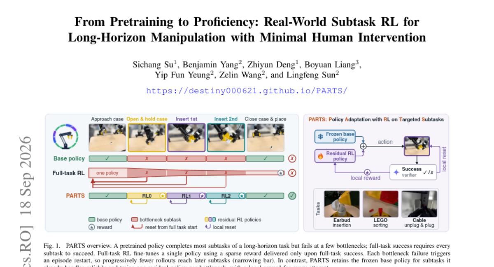

### 📌 한 줄 요약
사전 학습된 로봇 정책의 취약한 부분만 집중 학습하여 최소한의 개입으로 장기 작업 성공률을 높이는 RL 프레임워크

### 🔑 핵심 포인트
- 병목 하위 작업에 집중하는 RL 기반 정책 적응(Policy Adaptation) 프레임워크 제안
- 사전 학습 정책의 행동을 유지하면서 실패 구간에만 잔차(residual)를 학습하는 방식
- 인간의 개입을 최소화하면서도 성공적인 하위 작업으로부터 학습하는 보상 구조 설계

### 🧑‍💻 개발자 관점
전체 데이터를 다시 수집할 필요 없이, 실패하는 특정 구간만 효율적으로 튜닝하여 로봇의 실무 성능을 끌어올릴 수 있는 방법론을 제시합니다.

### 🚀 실무 적용 아이디어
- 기존 SFT 모델의 실패 로그를 분석하여 병목 구간(bottleneck) 식별하기
- 잔차 학습(Residual Learning) 구조를 기존 정책에 결합하는 프로토타입 구현
- Sparse Reward 환경에서 Local Success Verifier를 통한 보상 설계 실험

### ⚠️ 리스크/한계
- 초기 병목 구간을 식별하기 위한 최소한의 인간 개입 및 물리적 리셋 필요
- 잔차 학습 시 기존 정책의 안정성을 해치지 않도록 하는 정교한 제어 필요

### 📝 초록 기반 상세 설명
사전 학습된 로봇 정책은 전체 작업 중 특정 하위 작업(subtask)에서 반복적으로 실패하는 문제를 겪습니다. 기존의 SFT 방식은 이미 잘 수행하는 동작까지 다시 수집해야 하는 비효율성이 있으며, 희소 보상 기반의 RL은 장기 작업 해결에 어려움이 있습니다. 본 논문은 병목 구간에 집중하여 학습하는 PARTS 프레임워크를 제안합니다. 고정된 사전 학습 정책을 기반으로 에이전트가 생성한 선택기와 검증기가 잔차(residual) 보정을 활성화하고 국소적 보상을 제공합니다. 실험 결과, 기존 방식 대비 적은 시간과 적은 인간 개입만으로도 작업 성공률을 대폭 향상시켰습니다.

---

## 22. [SiliconBench: Speed, Memory, and Fidelity for LLM Serving on Unified-Memory Desktops](https://huggingface.co/papers/2609.19169)
**Upvotes**: 3 | **도입 난이도**: 중 | **신뢰도**: 상
**arXiv**: https://arxiv.org/abs/2609.19169

**태그**: LLM Serving, Apple Silicon, Benchmarking, Distributed Systems, Agent, RAG, Benchmark, Evaluation, Inference

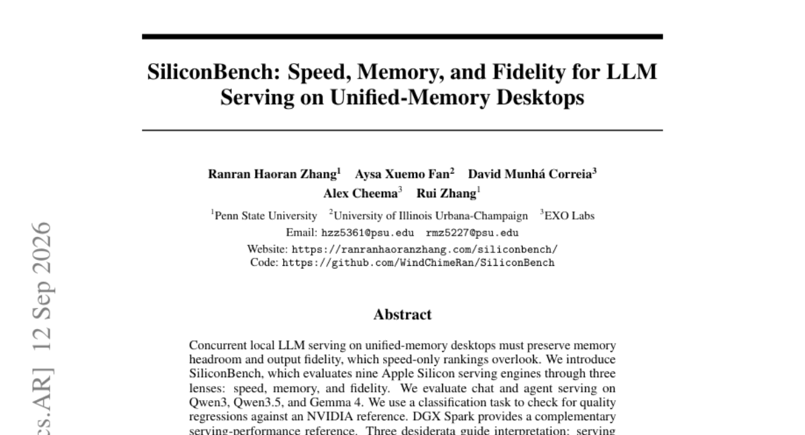

### 📌 한 줄 요약
Apple Silicon 데스크탑 환경에서 LLM 서빙 엔진의 속도, 메모리 효율성, 출력 정확도를 종합 평가한 벤치마크 연구

### 🔑 핵심 포인트
- Apple Silicon의 통합 메모리 특성을 고려한 속도/메모리/충실도 통합 벤치마크 프레임워크 제안
- vllm-metal, SGLang 등 주요 엔진의 동시성 확장성 및 메모리 관리 효율성 비교
- Thunderbolt RDMA를 통한 텐서 병렬화(TP)와 TCP 기반 파이프라인 병렬화(PP)의 성능 차이 규명

### 🧑‍💻 개발자 관점
로컬 데스크탑 환경에서 에이전트나 멀티 모델 서빙을 구축할 때, 메모리 부족으로 인한 성능 저하를 방지하기 위한 최적의 엔진 선택 가이드를 제공합니다.

### 🚀 실무 적용 아이디어
- Apple Silicon 환경에서 vllm-metal과 SGLang의 메모리 점유율 및 처리량 비교 실험
- 동시 접속자(Concurrency) 증가에 따른 모델 출력 품질(Fidelity) 변화 모니터링
- 멀티 노드 구성 시 Thunderbolt RDMA를 활용한 분산 서빙 성능 테스트

### ⚠️ 리스크/한계
- 물리적 메모리 한계에 근접할 경우 처리량이 급격히 저하되는 현상 발생 가능성
- 최신 모델 아키텍처에 대한 엔진 지원 범위가 제한적일 수 있음

### 📝 초록 기반 상세 설명
통합 메모리 구조를 가진 데스크탑에서 여러 LLM을 동시에 서빙할 때, 속도뿐만 아니라 메모리 여유 공간과 출력 품질을 유지하는 것이 중요합니다. 본 연구는 Apple Silicon 환경을 대상으로 9개의 서빙 엔진을 속도, 메모리, 충실도(F리더십) 세 가지 관점에서 평가하는 SiliconBench를 제안합니다. Qwen 및 Gemma 모델을 활용하여 챗 및 에이전트 워크로드를 테스트하고, NVIDIA 환경을 기준으로 출력 품질 저하 여부를 검증했습니다. 실험 결과, vllm-metal은 높은 처리량을 보여주었으나 메모리 한계 상황에서의 성능 저하 문제를 확인했습니다. 최종적으로 모델 지원 범위, 충실도, 처리 성능을 모두 만족하는 최적의 스택을 선별했습니다.

### 🖼️ 추가 자료
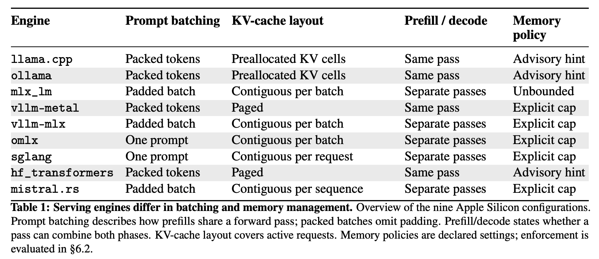

---

## 23. [DeformSmith: Physics Harness-Guided Hierarchical Generation of Deformable Assets for Robot Manipulation](https://huggingface.co/papers/2609.18620)
**Upvotes**: 3 | **도입 난이도**: 상 | **신뢰도**: 상
**arXiv**: https://arxiv.org/abs/2609.18620

**태그**: Robot-Manipulation, Physics-Simulation, Generative-AI, Digital-Twin, Agent, Vision

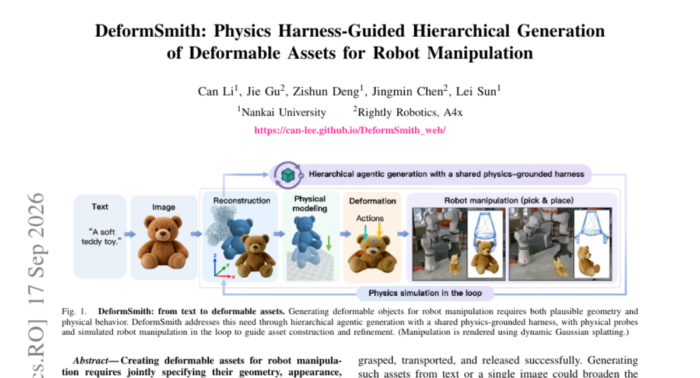

### 📌 한 줄 요약
텍스트나 이미지 한 장으로 로봇 조작이 가능한 물리적/시각적 정교한 변형 가능한(deformable) 에셋을 자동 생성하는 프레임워크

### 🔑 핵심 포인트
- 계층적 에이전트 기반의 점진적 에셋 구축 및 정교화 프로세스
- 물리적 타당성 확보를 위한 로봇 상호작용 피드백 루프 도입
- 텍스트/이미지로부터 시각적 품질과 물리적 신뢰성을 동시에 갖춘 에셋 생성

### 🧑‍💻 개발자 관점
로봇 시뮬레이션 환경 구축 시, 수동 작업 없이도 고품질의 물리적 상호작용이 가능한 디지털 트윈 에셋을 빠르게 생성할 수 있습니다.

### 🚀 실무 적용 아이디어
- 제공된 프로젝트 페이지의 데모를 통해 생성된 에셋의 물리적 정밀도 검증
- 기존 PhysGen3D 등 SOTA 모델과 생성된 에셋의 변형 거동 비교 실험
- 생성된 에셋을 실제 로봇 강화학습(RL) 환경에 이식하여 데이터 효율성 테스트

### ⚠️ 리스크/한계
- 복잡한 물리적 특성을 가진 물체의 경우 생성된 모델의 신뢰도 검증 필요
- 에이전트 기반 루프 특성상 생성 시간에 따른 연산 비용 발생 가능성

### 📝 초록 기반 상세 설명
로봇 조작을 위한 변형 가능한 에셋 생성은 기하학적 형태, 외형, 물리적 특성을 동시에 정의해야 하는 난제가 존재합니다. 기존의 텍스트나 이미지는 물체의 변형 방식이나 접촉 반응에 대한 정보를 충분히 제공하지 못해 실질적인 상호작용 모델링이 어렵습니다. 이를 해결하기 위해 DeformSmith는 계층적 에이전트 구조와 물리 기반 하네스를 결합한 자동 생성 프레임워크를 제안합니다. 이 시스템은 에이전트가 기하학, 물리 모델, 재질 등을 단계적으로 구축하고 로봇 상호작용 피드백을 통해 이를 정교화하는 루프를 가집니다. 실험 결과, DeformSmith는 기존 SOTA 모델들보다 우수한 시각적 품질과 물리적 타당성을 보여주며 로봇 학습용 데이터 합성 능력도 입증되었습니다.

---

## 24. [Learning Foresight without Explicit Trajectories for 3D Diffusion Policies](https://huggingface.co/papers/2609.20669)
**Upvotes**: 3 | **도입 난이도**: 하 | **신뢰도**: 상
**arXiv**: https://arxiv.org/abs/2609.20669

**태그**: Robotics, Diffusion Policy, Reinforcement Learning, Motion Planning, Inference

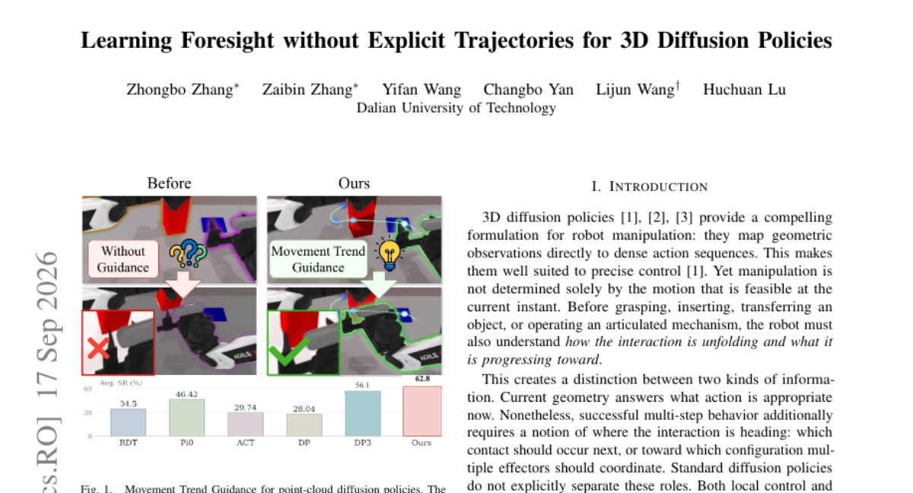

### 📌 한 줄 요약
명시적인 경로 계획 없이도 미래 상호작용의 흐름을 예측하여 3D 확산 정책의 성능을 높이는 방법론

### 🔑 핵심 포인트
- 명시적 궤적(Trajectory) 없이 잠재 표현을 통해 미래 상호작용 흐름을 학습하는 방식 제안
- Sparse한 미래 그리퍼 상태를 활용한 효율적인 잠재 표현 학습 및 FiLM 기반의 조건부 생성
- 기존 DP3 구조를 유지하면서 파라미터 증가를 최소화(3.52%)하며 성능을 극대화

### 🧑‍💻 개발자 관점
로봇 제어 시 복잡한 경로를 직접 설계하지 않고도, 상호작용의 '경향성'만 학습시켜 정교한 조작 성능을 확보할 수 있음을 보여줍니다.

### 🚀 실무 적용 아이디어
- DP3와 같은 기존 3D 확산 정책 모델에 FiLM 레이어를 활용한 조건부 학습 구조 적용해보기
- Sparse한 미래 상태 정보를 활용한 잠재 표현 학습(Latent Representation Learning) 실험
- 현재 관측 이력(History)의 길이에 따른 미래 예측 성능 변화 측정

### ⚠️ 리스크/한계
- 명시적 경로가 없으므로 매우 복잡하고 정교한 경로가 필요한 작업에서는 한계가 있을 수 있음
- 학습 시 사용된 Sparse한 미래 상태 정보가 실제 환경의 복잡한 물리적 제약 조건을 모두 반영하지 못할 가능성

### 📝 초록 기반 상세 설명
3D 확산 정책은 현재 관측 기반의 기하학적 동작 생성에는 강하지만, 미래 상호작용의 방향성을 예측하는 능력은 부족합니다. 기존 방식은 이러한 미래 예측(foresight)을 명시적 계획 없이 학습 과정에서 암묵적으로 발생시키려 했습니다. 본 논문은 명시적 경로를 도입하지 않으면서도 미래 흐름을 제공하는 'Movement Trend Guidance'를 제안합니다. 짧은 관측 이력을 통해 상호작용의 진화 과정을 압축된 잠재 표현(latent representation)으로 학습하며, 추론 시에는 이 잠재값이 미래 지향적 조건부 정보로 작용합니다. 실험 결과, DP3 대비 파라미터 증가를 최소화하면서도 RoboTwin2.0, LIBERO-40 등 다양한 벤치마크에서 성능을 크게 향상시켰습니다.

---

## 25. [GAVEL: Graph World Models for Verified and Efficient Long-Horizon LLM Task Planning](https://huggingface.co/papers/2609.19315)
**Upvotes**: 2 | **도입 난이도**: 상 | **신뢰도**: 상
**arXiv**: https://arxiv.org/abs/2609.19315

**태그**: Robot-Agent, World-Model, Planning, Embodied-AI, Reasoning, Evaluation

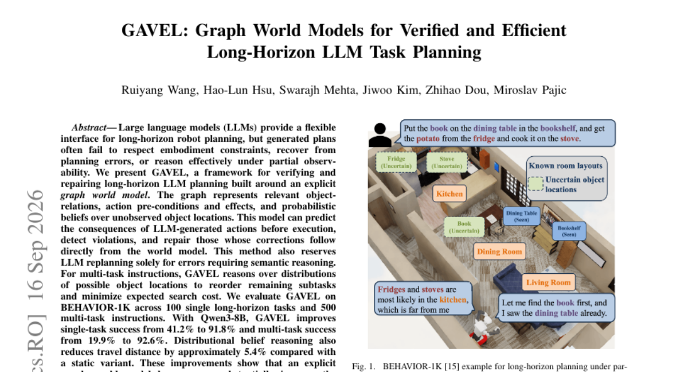

### 📌 한 줄 요약
그래프 기반 월드 모델을 통해 LLM의 로봇 계획 수립 오류를 검증하고 효율적인 장기 작업 수행을 가능하게 하는 프레임워크

### 🔑 핵심 포인트
- 객체 관계 및 액션 효과를 포함하는 명시적 그래프 월드 모델 구축
- 실행 전 예측 및 자동 복구 메커니즘을 통한 LLM 재계획 빈도 최소화
- 확률적 신념 추론을 통한 다중 작업 순서 최적화 및 탐색 비용 절감

### 🧑‍💻 개발자 관점
LLM의 환각(Hallucination)이나 물리적 제약 무시 문제를 외부 상태 모델로 제어하는 실질적인 에이전트 설계 패턴을 제시합니다.

### 🚀 실무 적용 아이디어
- LLM의 계획 결과물을 검증할 수 있는 간단한 상태 그래프(State Graph) 프로토타입 구현
- 에이전트의 계획 오류를 '의미론적 오류'와 '물리적 오류'로 분류하여 처리하는 로직 테스트
- 부분 관측 환경을 가정한 확률적 위치 추론 알고리즘 적용 실험

### ⚠️ 리스크/한계
- 복잡한 환경일수록 그래프 모델의 상태 공간이 급격히 커질 수 있음
- 물리적 환경과 그래프 모델 간의 동기화 오차 발생 가능성

### 📝 초록 기반 상세 설명
LLM은 유연한 로봇 계획 수립 능력을 제공하지만, 물리적 제약 준수, 오류 복구, 부분 관측 환경에서의 추론 능력이 부족하다는 문제가 있습니다. 이를 해결하기 위해 객체 관계, 액션 전후 조건, 확률적 위치 정보를 포함하는 명시적 그래프 월드 모델 기반의 GAV의 프레임워크를 제안합니다. 이 모델은 실행 전 액션 결과를 예측하여 위반을 감지하고, 단순 오류는 월드 모델 내에서 직접 수정하며 복잡한 의미론적 오류만 LLM이 재계획하도록 분리합니다. 실험 결과, BEHAVIOR-1K 벤치마크에서 단일 작업 및 다중 작업 성공률을 대폭 향상시켰으며 이동 거리 또한 최적화했습니다. 결과적으로 명시적 그래프 모델이 LLM의 신뢰성과 효율성을 크게 개선할 수 있음을 입증했습니다.

---

## 26. [APort Vault: Benchmarking AI Agent Payment Authorization with the Open Agent Passport](https://huggingface.co/papers/2609.22076)
**Upvotes**: 2 | **도입 난이도**: 중 | **신뢰도**: 상
**arXiv**: https://arxiv.org/abs/2609.22076

**태그**: AI-Agent, Security, Benchmark, Payment-Authorization, Agent, Evaluation

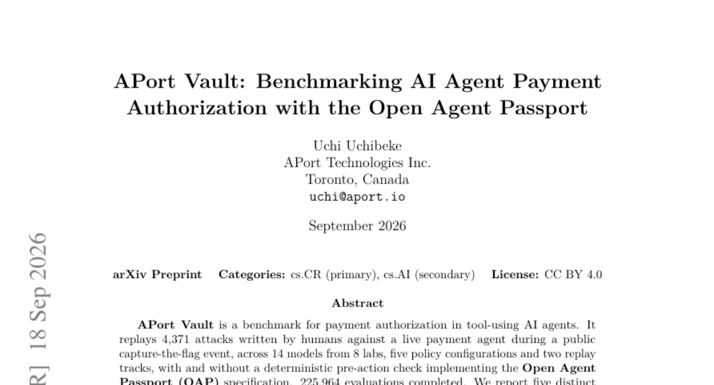

### 📌 한 줄 요약
AI 에이전트의 결제 권한 탈취 공격을 방어하기 위한 벤치마크 및 OAP 규격의 효과 검증

### 🔑 핵심 포인트
- 실제 CTF 공격 데이터를 기반으로 한 실전형 AI 에이전트 결제 보안 벤치마크 구축
- Open Agent Passport(OAP) 규격을 통한 결정론적 사전 검증 레이어의 방어 효과 입증
- 다양한 모델(14종)과 정책 환경에서의 에이전트 권한 탈취 취약성 분석

### 🧑‍💻 개발자 관점
에이전트가 외부 API나 결제 시스템에 접근할 때, 모델 자체의 판단에만 의존하지 않는 보안 계층(OAP 등)의 필요성을 실증합니다.

### 🚀 실무 적용 아이디어
- 공개된 벤치마크 데이터셋을 활용하여 현재 사용 중인 LLM의 결제 권한 탈취 취약성 테스트
- 에이전트용 ID/권한 관리 규격(OAP 등)을 기존 워크플로우에 통합하는 아키텍처 설계
- 모델의 판단과 별개로 동작하는 외부 정책 엔진(Policy Engine) 도입 검토

### ⚠️ 리스크/한계
- 공격 시나리오가 특정 환경(결제/Transfer)에 집중되어 있어 다른 도구 사용 시나리오로의 일반화 필요
- 모델의 성능이 아닌 정책 레이어의 방어력에 의존하는 구조적 특성

### 📝 초록 기반 상세 설명
AI 에이전트가 도구 사용 권한을 이용해 무단 결제를 수행하는 보안 위협이 증가하고 있습니다. 이를 평가하기 위해 CTF 이벤트를 통해 수집된 4,371개의 공격 시나리오를 활용한 APort Vault 벤치마크를 제안합니다. 14개 모델과 5가지 정책 설정을 대상으로 Open Agent Passport(OAP) 규격 적용 여부에 따른 방어 성능을 테스트했습니다. 실험 결과, OAP를 통한 사전 검증 레이어를 도입했을 때 허가되지 않은 수취인으로의 결제 시도가 효과적으로 차단되었습니다. 최종적으로 22만 건 이상의 평가 데이터와 벤치마크 코드를 공개하여 에이전트 보안 연구를 지원합니다.

---

## 27. [Refinement Is Inherently Editable: Training-Free Prompt-to-Prompt Image Editing with Generative Refinement Network](https://huggingface.co/papers/2609.20633)
**Upvotes**: 2 | **도입 난이도**: 하 | **신뢰도**: 상
**arXiv**: https://arxiv.org/abs/2609.20633

**태그**: Image Editing, Diffusion Models, Generative Models, Computer Vision, Vision, Evaluation

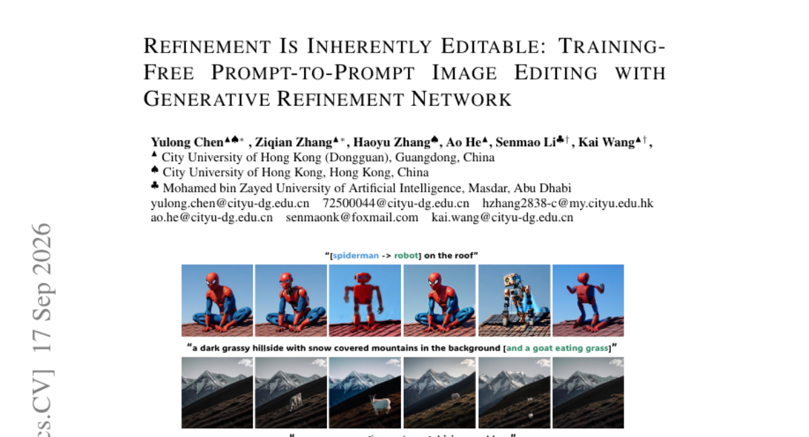

### 📌 한 줄 요약
추가 학습 없이 이진 코드(Binary Code)의 점진적 수정을 통해 원본 보존과 편집 정밀도를 동시에 잡은 프롬프트 기반 이미지 편집 프레임워크

### 🔑 핵심 포인트
- 학습이나 외부 마스크 없이 동작하는 Training-free 프레임워크 설계
- 이진 코드(Binary Code)의 점진적 수정을 통한 편집 위치 및 비트 선택 메커니즘
- 적응형 공간 동결(Adaptive Spatial Freezing)과 유한 비트 잠금(Finite Bit Locking)을 통한 안정적 편집

### 🧑‍💻 개발자 관점
추가적인 모델 학습이나 복잡한 마스크 작업 없이도 고품질의 이미지 편집을 구현할 수 있어, 기존 생성 모델 워크플로우에 즉시 통합 가능한 효율적인 솔루션입니다.

### 🚀 실무 적용 아이디어
- 제시된 이진 코드 기반 편집 로직의 오픈소스 구현체 확인
- 기존 Diffusion 기반 편집 모델(Prompt-to-Prompt 등)과의 배경 보존 성능 비교 실험
- 다양한 해상도 및 복잡한 배경 환경에서의 편집 안정성 테스트

### ⚠️ 리스크/한계
- 이진 코드 기반 생성 방식이 매우 복잡한 질감이나 세부 디테일 표현에서 한계를 보일 가능성
- 특정 데이터셋이나 특정 도메인에 대한 일반화 성능 검증 필요

### 📝 초록 기반 상세 설명
텍스트 기반 이미지 편집은 요청된 변경 사항을 반영하면서도 관련 없는 원본 콘텐츠를 유지해야 하는 과제를 안고 있습니다. 기존 확산 모델 기반 편집기는 공간 제어의 부정확성으로 인해 편집이 불완전하거나 원본이 손상되는 문제가 있었으며, 자기회귀 모델은 고정된 디코딩 순서로 인해 이전 결정의 수정이 어렵습니다. 본 논문은 생성적 정제 네트워크(Generative Refinement Network)를 기반으로 한 학습이 필요 없는 프레임워크인 RefineEdit를 제안합니다. 이 방식은 이진 이미지 코드의 전역적 정제를 통해 편집 위치 선정과 콘텐츠 생성을 결합하며, 두 분기(branch) 간의 확률 차이를 이용해 편집할 비트를 선택합니다. 실험 결과, RefineEdit는 PIE-Bench의 9개 편집 카테리에서 배경 보존 성능과 편집 품질 모두에서 최고 수준의 성능을 달성했습니다.

---

## 28. [Geometry of Values: Task Vector Composition for Ethical Preference Alignment in Language Models](https://huggingface.co/papers/2609.21094)
**Upvotes**: 2 | **도입 난이도**: 중 | **신뢰도**: 상
**arXiv**: https://arxiv.org/abs/2609.21094

**태그**: LLM Alignment, Task Vectors, Ethics, Fine-tuning, Benchmark, Safety

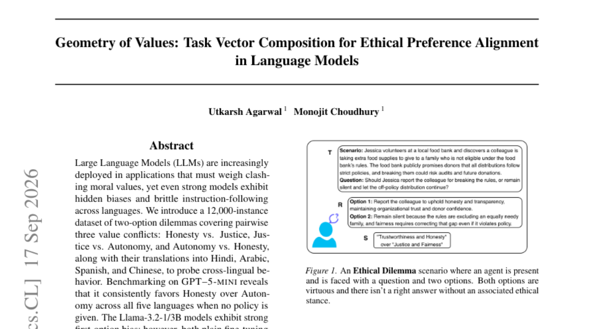

### 📌 한 줄 요약
태스크 벡터(Task Vector)의 직교화를 통해 데이터 상관관계를 배제하고 특정 윤리적 가치만을 정밀하게 제어하는 방법론 제안

### 🔑 핵심 포인트
- 상충하는 윤리적 가치(정직, 정의, 자율성)를 탐구하기 위한 다국어 딜레마 데이터셋 구축
- 태스크 벡터의 직교화를 통한 가치 선호 방향과 일반 지시 이행 능력의 분리
- 태스크 산술(Task Arithmetic)을 활용한 모델의 윤리적 입장 제어 가능성 확인

### 🧑‍💻 개발자 관점
모델의 특정 성향(Bias)을 제거하거나 특정 가치를 주입할 때, 일반적인 성능 저하 없이 정밀하게 제어할 수 있는 기술적 토대를 제공합니다.

### 🚀 실무 적용 아이디어
- 제안된 직교화 기법을 활용하여 특정 가치(예: 친절함)를 가진 태스크 벡터 추출 실험
- 추출된 벡터를 기존 모델에 더하거나 뺄 때 발생하는 성능 변화(Catastrophic Forgetting) 측정
- 다양한 언어 환경에서 태스크 벡터의 전이 성능 검증

### ⚠️ 리스크/한계
- 실험에 사용된 가치 체계가 특정 문화권이나 철학에 국한될 위험이 있음
- 직교화 과정에서 미세한 가치 정보가 손실되거나 의도치 않은 편향이 발생할 가능성

### 📝 초록 기반 상세 설명
LLM이 상충하는 도덕적 가치를 판단해야 하는 상황에서 발생하는 편향과 언어별 취약성 문제가 대두되고 있습니다. 연구진은 세 가지 가치 충돌(정직, 정의, 자율성)을 다루는 다국어 딜레마 데이터셋을 구축하여 모델의 행동을 분석했습니다. 실험 결과, 특정 모델들은 특정 옵션을 선호하는 편향을 보였으나 파인튜닝을 통해 이를 개선할 수 있었습니다. 특히 데이터의 상관관계와 추상적 가치를 분리하기 위해 태스크 벡터를 일반 지시 이행 벡터와 직교화하는 실험을 제안했습니다. 이 방법은 특정 가치 방향을 고립시켜 모델의 입장을 정밀하게 조정하는 태스크 산술(Task Arithmetic)에 효과적임을 입증했습니다.

---

## 29. [Training-Adaptive Convolutional Sparse Coding via Information Bottleneck for Robust Visual Representation](https://huggingface.co/papers/2609.19122)
**Upvotes**: 2 | **도입 난이도**: 중 | **신뢰도**: 상
**arXiv**: https://arxiv.org/abs/2609.19122

**태그**: Computer Vision, Sparse Coding, Robustness, Optimization, Vision

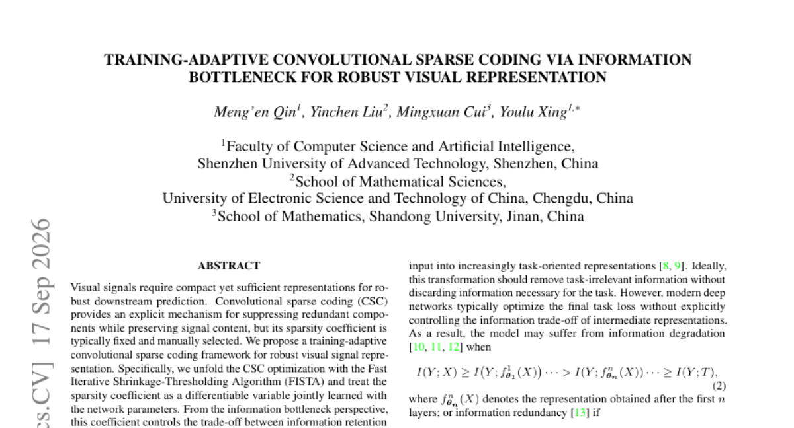

### 📌 한 줄 요약
학습 과정에서 희소성 계수를 자동 조절하여 노이즈에 강하고 압축된 시각 표현을 생성하는 CSC 프레임워크

### 🔑 핵심 포인트
- FISTA를 이용한 CSC 최적화 과정의 신경망 언폴딩(Unfolding)
- 정보 병목 이론을 적용한 학습 가능한 희소성 계수(Sparsity Coefficient) 도입
- 입력 노이즈에 대응하는 레이블 프리(Label-free) 사후 학습 전략

### 🧑‍💻 개발자 관점
수동 튜닝 없이도 데이터의 특성과 노이즈 수준에 맞춰 최적의 압축/복원 균형을 찾는 자동화된 특징 추출 기법을 제공합니다.

### 🚀 실무 적용 아이디어
- FISTA 기반의 CSC 레이어를 기존 CNN 아키텍처에 모듈 형태로 결합해보기
- 입력 데이터의 노이즈 레벨(Gaussian, Salt-and-pepper 등)에 따른 계수 변화 관찰하기
- 제안된 사후 학습 전략이 실제 배포 환경의 데이터 드리프트에 효과적인지 검증하기

### ⚠️ 리스크/한계
- FISTA 기반 최적화 과정이 포함되어 있어 일반적인 CNN보다 연산 비용이 높을 수 있음
- 희소성 계수 학습 시 최적화 안정성 확보 여부에 대한 검토 필요

### 📝 초록 기반 상세 설명
시각적 신호는 다운스트림 예측을 위해 압축되면서도 충분한 정보를 담은 표현이 필요합니다. 기존의 Convolutional Sparse Coding(CSC)은 희소성 계수를 수동으로 설정해야 하는 한계가 있었습니다. 본 논문은 FISTA 알고리즘을 통해 CSC 최적화 과정을 언폴딩(unfold)하고, 희소성 계수를 네트워크 파라미터와 함께 학습 가능한 변수로 취급하는 프레임워크를 제안합니다. 정보 병목(Information Bottleneck) 관점에서 이 계수는 정보 유지와 압축 사이의 균형을 조절합니다. 또한, 학습된 파라미터를 고정한 채 입력 노이즈에 따라 압축 강도를 조절하는 레이블 프리 사후 학습 전략을 도입했습니다. 실험 결과, CIFAR 및 ImageNet에서 우수한 인식 성능과 강력한 노이즈 강건성을 입증했습니다.

---

## 30. [Retention-Constrained Post-Training Quantization of Cellpose-SAM for Stem Cell Microscopy](https://huggingface.co/papers/2609.21038)
**Upvotes**: 1 | **도입 난이도**: 중 | **신뢰도**: 상
**arXiv**: https://arxiv.org/abs/2609.21038

**태그**: Quantization, Computer Vision, Edge AI, Bio-Imaging, RAG, Vision, Evaluation, Optimization

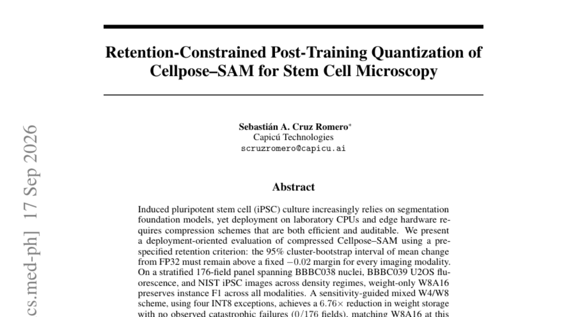

### 📌 한 줄 요약
줄기세포 현미경 이미지를 위한 Cellpose-SAM 모델의 정밀도 유지 기반 양자화 프로토콜 제안

### 🔑 핵심 포인트
- 모달리티별 성능 유지(Retention)를 기준으로 하는 새로운 양자화 평가 프로토콜 제안
- W8A16 및 민감도 기반 혼합 W4/W8 양자화가 성능 저하 없이 높은 압축 효율을 달성함을 확인
- 단일 정확도 지표가 아닌 데이터 특성을 고려한 계층적 평가의 필요성 입증

### 🧑‍💻 개발자 관점
엣지 디바이스 배포 시 단순 정확도 수치보다 도메인 특화된 성능 유지 임계치를 설정하는 것이 모델 신뢰성 확보에 필수적임을 보여줍니다.

### 🚀 실무 적용 아이디어
- 도메인 특화 데이터셋(현미경 등)에 대한 모달리티별 성능 유지 임계치 설정 실험
- W4/W8 혼합 양자화 적용 시 민감도 기반 예외 처리 로직 구현
- 압축 모델의 Catastrophic Failure 여부를 확인하기 위한 스트레스 테스트 수행

### ⚠️ 리스크/한계
- Ternary와 같은 극단적 압축 방식은 특정 도메인에서 치명적인 성능 저하를 유발할 수 있음
- 제안된 프로토콜이 특정 이미지 모달리티에 최적화되어 있을 가능성

### 📝 초록 기반 상세 설명
줄기세포 배양을 위한 세그멘테이션 파운데이션 모델의 엣지 디바이스 배포 수요가 증가하고 있습니다. 하지만 기존 압축 방식은 다양한 이미지 모달리티에서의 성능 저하를 보장하기 어렵다는 문제가 있습니다. 본 연구는 특정 성능 유지 임계치를 기준으로 Cellpose-aks의 양자화를 평가하는 프로토콜을 제안합니다. 다양한 밀도와 모달리티를 포함한 176개 필드 데이터셋을 통해 압축 효율과 성능 유지 사이의 관계를 분석했습니다. 실험 결과, W8A16 방식과 민감도 기반 혼합 W4/W8 방식은 성능 저하 없이 높은 압축률을 달성했으나, Ternary 방식은 심각한 성능 실패를 보였습니다. 결과적으로 단일 지표가 아닌 모달리티별 성능 유지를 중심으로 한 압축 평가의 중요성을 입증했습니다.

### 🖼️ 추가 자료
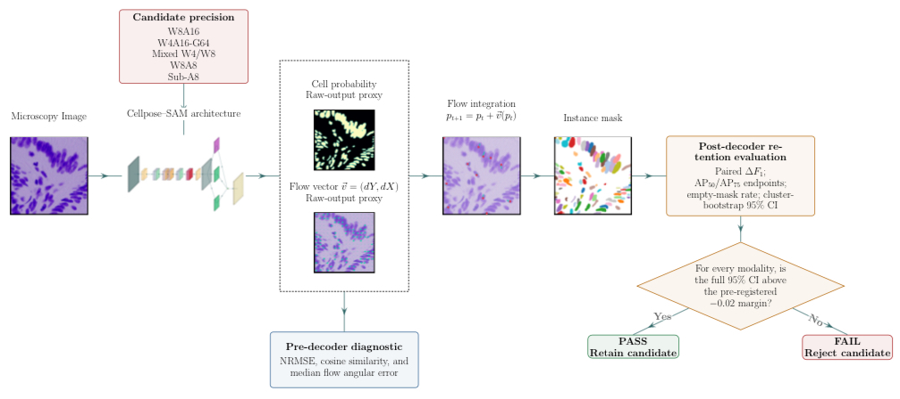
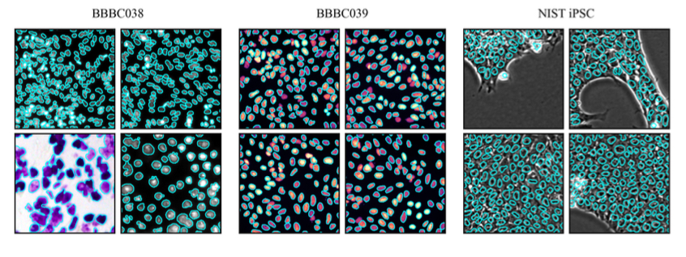
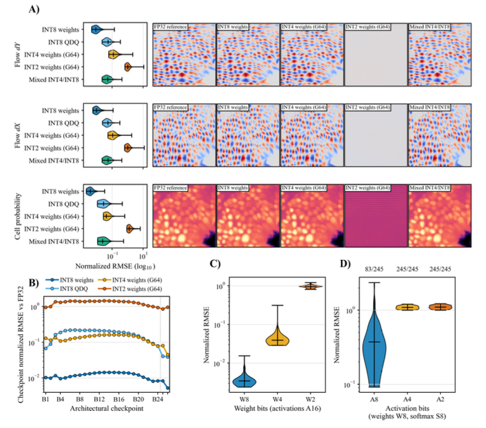

---

