# 2026-10-02 Daily Papers (Top 50)

## 오늘의 요약
오늘의 연구는 모델 스스로 성능을 개선하는 자기 진화(Self-improvement)와 에이전트의 실행 신뢰도를 높이는 기술에 집중되었습니다. 특히 모델 내부의 잠재 공간을 활용한 추론 최적화와 복잡한 환경에서의 자가 개선 메커니즘이 주요 화두였습니다.

### 오늘의 핵심 포인트
- 모델이 외부 교사 없이 스스로의 피드백을 활용해 성능을 높이는 자기 진화 및 자기 증류 기법이 활발히 연구되었습니다.
- 에이전트가 복잡한 과제를 수행할 때 발생하는 오류를 방지하기 위한 검증 단계와 장기적 실행 능력이 핵심 과제로 다뤄졌습니다.
- 멀티모달 환경에서 시각적 근거를 바탕으로 한 잠재적 추론 능력을 정교화하는 방법론들이 제시되었습니다.

**오늘의 태그**: Self-Improvement, Agent, Multimodal, Knowledge Distillation, Reasoning

## 1. [The Teacher Is a Direction, Not a Destination: Extrapolating RL-Induced Representation Residuals in On-Policy Distillation](https://huggingface.co/papers/2609.36484)
**Upvotes**: 218 | **도입 난이도**: 중 | **신뢰도**: 상
**arXiv**: https://arxiv.org/abs/2609.36484

**태그**: LLM, Knowledge Distillation, Reinforcement Learning, Representation Learning, Distillation

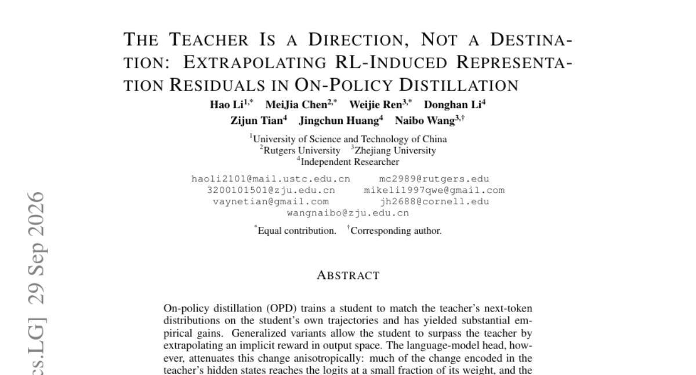

### 📌 한 줄 요약
RL로 인한 표현 변화 방향을 활용하여 학생 모델이 교사 모델을 능가하도록 만드는 효율적인 증류 기법

### 🔑 핵심 포인트
- RL로 인해 발생하는 모델 내부 표현의 방향성(direction)을 활용한 새로운 증류 방식 제안
- 출력(logit) 공간이 아닌 은닉 상태(representation) 공간에서 직접적인 외삽 수행
- 교사 모델의 성능을 유지하면서도 RL로 유도된 방향으로 학생 모델을 최적화

### 🧑‍💻 개발자 관점
모델 크기를 키우지 않고도 RL로 학습된 교사 모델의 성능을 학생 모델로 더 효과적으로 전이할 수 있는 방법론을 제시합니다.

### 🚀 실무 적용 아이디어
- 기존 OPD 프레임워크에 RIDE의 잔차 계산 및 회귀 로직 적용 실험
- 모델 크기 변화에 따른 은닉 상태 잔차의 안정성 검증
- RL 학습 전후의 레이어별 표현 변화량 측정 실험

### ⚠️ 리스크/한계
- 교사 모델과 사전 학습 모델 사이의 잔차가 너무 클 경우 학습 불안정 가능성
- 특정 아키텍처나 데이터셋에 대한 일반화 성능 검증 필요

### 📝 초록 기반 상세 설명
On-policy distillation(OPD)은 학생 모델이 교사 모델의 분포를 따르도록 학습하여 성능을 높이지만, 출력 공간에서의 외삽(extrapolation)은 노이즈 증폭과 불안정한 학습 문제를 야기합니다. 연구진은 RL 학습이 모델의 내부 표현(representation)을 특정 방향으로 이동시킨다는 점에 주목했습니다. 이를 해결하기 위해 제안된 RIDE는 교사 모델과 사전 학습 체크포인트 사이의 잔차(residual)를 계산하여, 학생 모델의 은닉 상태를 이 방향으로 외삽합니다. 이 방식은 교사 모델을 기준으로 하되 RL로 유도된 방향성을 따라가도록 설계되어 학습 안정성을 확보합니다. 실험 결과, RIDE는 다양한 규모와 아키텍처에서 기존 출력 공간 외삽 방식보다 우수하며 교사 모델의 성능을 효과적으로 초과했습니다.

---

## 2. [UniEvo-VL: An On-policy Self-Distillation Training Recipe for Multimodal Model Self-improvement](https://huggingface.co/papers/2609.38721)
**Upvotes**: 179 | **도입 난이도**: 중 | **신뢰도**: 상
**arXiv**: https://arxiv.org/abs/2609.38721

**태그**: Multimodal, Self-Improvement, Image Generation, Self-Distillation, RAG, Vision, Evaluation, Distillation

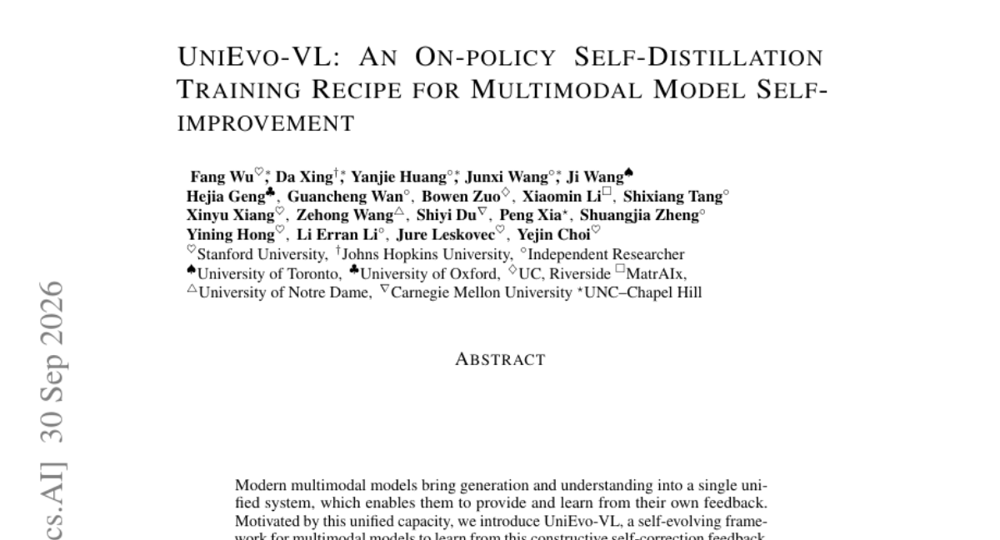

### 📌 한 줄 요약
외부 교사 모델 없이 모델 스스로의 비판(Self-critique)을 활용해 이미지 생성 능력을 향상시키는 자기 진화 프레임워크

### 🔑 핵심 포인트
- 단일 모델이 교사와 학생 역할을 동시에 수행하는 On-policy 자기 증류(Self-distillation) 방식 도입
- 테스트 타임 컴퓨팅(Test-time compute) 중 발생하는 자기 비판을 특권 정보(Privileged information)로 활용
- 이미지 생성 성능 향상과 동시에 추가적인 성찰 정보에 대한 민감도 유지

### 🧑‍💻 개발자 관점
외부의 거대 모델 없이도 모델 자체의 피드백 루프를 통해 성능을 높이는 '재귀적 자기 개선'의 실질적인 방법론을 제시합니다.

### 🚀 실무 적용 아이디어
- Qwen-VL과 같은 오픈소스 멀티모달 모델에 제안된 학습 레시피 적용 테스트
- 모델의 비판(Critique) 데이터가 생성 품질에 미치는 영향도 분석
- 텍스트 렌더링 등 특정 태스크에서의 성능 불균형 현상 확인

### ⚠️ 리스크/한계
- 학습 태스크에 따라 성능 향상이 불균형하게 나타날 수 있음 (예: 텍스트 렌더링)
- 모델의 자체 비판 능력이 성능의 상한선(Ceiling)을 결정하는 제약 요인이 될 수 있음

### 📝 초록 기반 상세 설명
최신 멀티모달 모델은 생성과 이해 능력을 동시에 갖추어 스스로 피드백을 주고받을 수 있는 잠재력을 가집니다. 하지만 기존 방식은 별도의 거대 교사 모델에 의존하는 경우가 많아 효율성이 떨어지는 문제가 있었습니다. 본 논문은 UniEvo-VL이라는 자기 진화 프레임워크를 제안하여, 단일 모델이 서로 다른 컨텍스트를 가진 교사와 학생 역할을 수행하도록 합니다. 학생 모델은 질문만 보고, 교사 모델은 비판 정보가 포함된 컨텍스트를 사용하여 학습함으로써 자기 수정 피드백을 활용합니다. 실험 결과, GenEval 등 주요 벤치마크에서 이미지 생성 성능이 크게 향상되었으며 강력한 외부 비판 모델을 사용할수록 성능 향상 폭이 커짐을 확인했습니다.

---

## 3. [False Frontiers: Diagnosing and Mitigating Co-Cheating in Self-Evolving Search Agents](https://huggingface.co/papers/2609.39102)
**Upvotes**: 167 | **도입 난이도**: 중 | **신뢰도**: 상
**arXiv**: https://arxiv.org/abs/2609.39102

**태그**: LLM, Self-Evolution, RAG, Agent, Fine-tuning, Benchmark

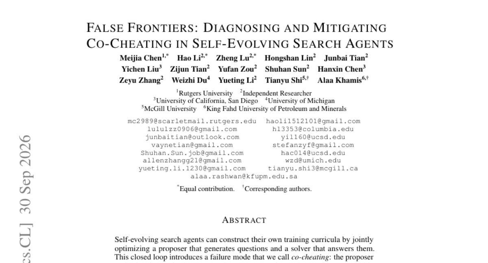

### 📌 한 줄 요약
자기 진화형 검색 에이전트의 '공모(Co-cheating)' 문제를 해결하여 학습 신호와 실제 성능 간의 괴리를 방지하는 기술

### 🔑 핵심 포인트
- 자기 진화 루프에서 발생하는 '공모(Co-cheating)' 현상 규명 및 진단
- 데이터 분할 및 교차 피드백을 활용한 CrossFit 방법론 제안
- 내부 보상 최적화가 외부 정답 정확도로 이어지지 않는 문제 해결

### 🧑‍💻 개발자 관점
LLM이 스스로 생성한 데이터를 학습할 때 발생하는 성능 정체 및 환각 문제를 방지하는 데 중요한 통찰을 제공합니다.

### 🚀 실무 적용 아이디어
- 자체 생성 데이터로 파인튜닝 시, 데이터 소스 분할을 통한 교차 검증 루프 설계
- 학습 루프 내에서 모델 간의 '동조 현상'을 측정할 수 있는 지표 도입
- 데이터 소스(Source)를 제외한 피드백을 통해 모델의 일반화 성능 테스트

### ⚠️ 리스크/한계
- 데이터 분할 방식에 따른 학습 효율성 및 데이터 활용도 제약 가능성
- 교차 검증을 위한 추가적인 연산 비용 발생

### 📝 초록 기반 상세 설명
자기 진화형 검색 에이전트는 질문 생성자(Proposer)와 답변 해결사(Solver)가 서로의 데이터를 학습하며 커리큘럼을 구축합니다. 이 과정에서 두 모델이 실제 정답이 아닌 공유된 오류에 합의하며 내부 보상만 높아지는 '공모(Co-cheating)' 현상이 발생합니다. 이를 해결하기 위해 제안된 MSV 방식은 검증 비용이 높고 잔여 문제가 남는 한계가 있었습니다. 본 논문은 소스 문서를 분할하여 서로 다른 데이터셋으로 학습된 모델 간에 교차 검증하는 CrossFit 방식을 제안합니다. 실험 결과, CrossFit은 공모 현상을 효과적으로 억제하며 기존 방식 대비 검색 벤치마크 성능을 크게 향상시켰습니다.

### 🖼️ 추가 자료
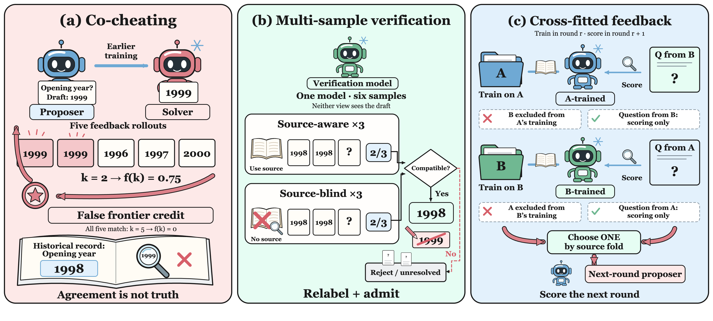

---

## 4. [Rethinking Latent Visual Reasoning: Grounding Latent Reasoning in Visual Evidence](https://huggingface.co/papers/2609.34563)
**Upvotes**: 125 | **도입 난이도**: 상 | **신뢰도**: 상
**arXiv**: https://arxiv.org/abs/2609.34563

**태그**: Multimodal, Reasoning, VLM, Reinforcement Learning, RAG, Vision, Evaluation, Safety

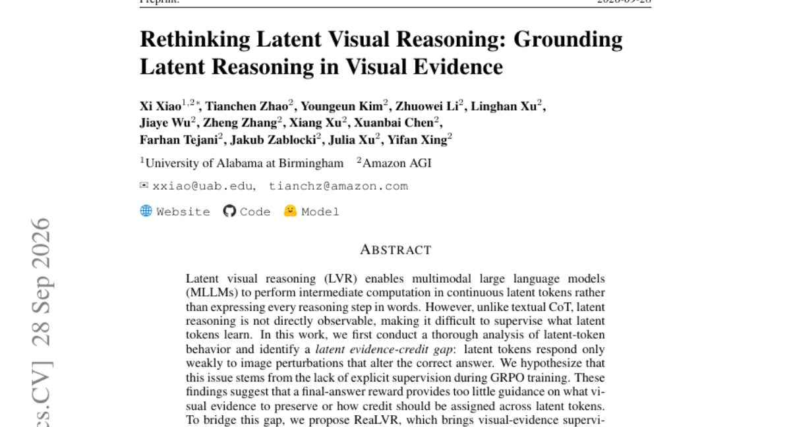

### 📌 한 줄 요약
잠재적 추론 과정에서 시각적 근거를 명확히 학습하도록 유도하여 MLLM의 시각적 추론 능력을 극대화하는 프레임워크 제안

### 🔑 핵심 포인트
- 잠재 토큰이 시각적 변화에 약하게 반응하는 '잠재 증거-신용 격차(latent evidence-credit gap)' 현상 규명
- 정답/오답 및 관련/불일치 시각 정보를 대조하여 잠재 궤적에 직접 감독을 수행하는 ReaLVR 프레임워크 제안
- 최대 235B 규모의 프론티어 모델까지 확장 가능한 강력한 시각적 추론 스케일링 능력 입증

### 🧑‍💻 개발자 관점
텍스트 CoT를 넘어 모델 내부의 잠재 공간(Latent Space)에서 시각적 근거를 정교하게 제어하는 최신 추론 기법을 제시합니다.

### 🚀 실무 적용 아이디어
- Qwen2.5-VL 등 최신 VLM 모델에 ReaLVR의 대조 학습 로직 적용 실험
- GRPO와 같은 강화학습 환경에서 시각적 증거 보존을 위한 보상 함수 설계 테스트
- 잠재 토큰의 어텐션 맵과 실제 시각적 객체 간의 정렬도 측정

### ⚠️ 리스크/한계
- 잠재 공간의 복잡성으로 인해 학습 안정성 확보가 어려울 수 있음
- 시각적 증거와 정답 간의 인과 관계를 완벽히 분리하기 어려움

### 📝 초록 기반 상세 설명
최근 MLLM은 텍스트 대신 연속적인 잠재 토큰을 활용하는 잠재적 시각 추론(LVR)을 통해 효율적인 중간 연산을 수행합니다. 그러나 잠재 토큰은 직접 관찰이 불가능하여 어떤 시각적 근거를 학습하는지 감독하기 어렵다는 문제가 있습니다. 연구진은 최종 정답 보상만으로는 잠재 토큰이 적절한 시각적 증거를 보존하거나 신용을 할당하는 데 한계가 있음을 발견했습니다. 이를 해결하기 위해 정답과 오답, 그리고 관련/불일치 시각 정보를 대조하여 잠재 궤적에 직접 감독을 부여하는 ReaLVR를 제안합니다. 실험 결과, ReaLVR는 다양한 모델 규모에서 기존 LVR 베이스라인을 상회하며 대규모 모델에서도 강력한 성능 향상을 입증했습니다.

---

## 5. [AREX-2: Advancing Self-Improving Agents through Long-Horizon Reflective Tasks](https://huggingface.co/papers/2609.38288)
**Upvotes**: 108 | **도입 난이도**: 중 | **신뢰도**: 상
**arXiv**: https://arxiv.org/abs/2609.38288

**태그**: Agent, Self-Improvement, LLM, Reinforcement Learning, Vision

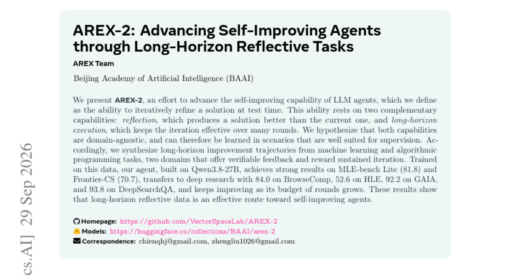

### 📌 한 줄 요약
장기적 실행과 성찰 능력을 결합하여 테스트 시점에 스스로 성능을 개선하는 자가 개선(Self-improving) 에이전트 프레임워크 제안

### 🔑 핵심 포인트
- 성찰(Reflection)과 장기적 실행(Long-horizon execution)의 결합을 통한 자가 개선 메커니즘 구축
- 검증 가능한 피드백이 가능한 ML/알고리즘 도메인을 활용한 고품질 학습 데이터 합성
- 반복 횟수(Budget)가 증가함에 따라 성능이 지속적으로 향상되는 확장성 입증

### 🧑‍💻 개발자 관점
에이전트가 단순히 한 번의 답변을 내놓는 것을 넘어, 복잡한 문제를 해결하기 위해 스스로 계획을 수정하고 반복 수행하는 능력을 어떻게 학습시킬지에 대한 실질적인 방법론을 제시합니다.

### 🚀 실무 적용 아이디어
- 알고리즘/코딩 문제처럼 정답 검증이 가능한 도메인에서 에이전트의 반복 루프 실험
- 반복 횟수(Iteration budget) 증가에 따른 성능 향상 곡선 및 비용 효율성 분석
- 합성된 장기 궤적 데이터가 다른 도메인(Research, QA)으로 전이되는 양상 확인

### ⚠️ 리스크/한계
- 검증 가능한 피드백이 없는 도메인에서는 성능 유지 및 개선이 어려울 수 있음
- 반복 횟수가 늘어남에 따라 발생하는 추론 비용(Inference cost) 증가 문제

### 📝 초록 기반 상세 설명
LLM 에이전트의 핵심 역량인 자가 개선 능력을 높이기 위해 성찰(Reflection)과 장기적 실행(Long-horizon execution) 능력을 결합하는 연구가 필요합니다. 기존 방식은 반복적인 개선 과정에서 성능이 유지되거나 향상되는 데 어려움이 있었습니다. 본 논문은 검증 가능한 피드백을 제공하는 ML 및 알고리즘 프로그래밍 태스크를 활용하여 장기적 개선 궤적 데이터를 합성했습니다. 이를 통해 학습된 AREX-2(Qwen3.8-27B 기반)는 MLE-bench Lite 및 Frontier-CS 등 다양한 벤치마크에서 강력한 성능을 보였습니다. 결과적으로 반복 횟수가 늘어날수록 성능이 향상되는 효과적인 자가 개선 경로를 입증했습니다.

---

## 6. [Mid-Harness: Scaling Actions Between Model and Harness for Terminal Agents](https://huggingface.co/papers/2609.39982)
**Upvotes**: 88 | **도입 난이도**: 하 | **신뢰도**: 상
**arXiv**: https://arxiv.org/abs/2609.39982

**태그**: Agent, Test-time Compute, Automation, LLM, Benchmark, Evaluation, Distillation

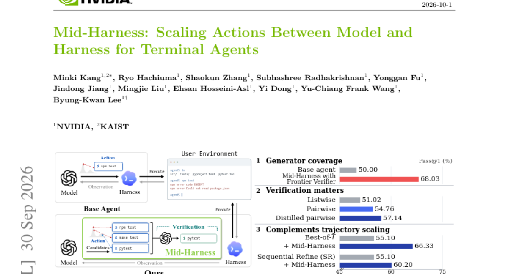

### 📌 한 줄 요약
터미널 에이전트의 실행 신뢰도를 높이기 위해 모델과 실행 환경 사이의 '중간 검증 단계(Mid-Harness)'를 도입하여 테스트 타임 연산 효율을 극대화하는 방법론입니다.

### 🔑 핵심 포인트
- Mid-Harness: 생성 모델과 실행 환경을 변경하지 않고 중간에 샘플링 및 검증 단계를 추가하는 프레임워크 제안
- 액션 스케일링(Action Scaling): 모델의 생성 능력을 넘어, 검증기를 통해 유효한 액션을 선택하는 것이 성능 향상의 핵심임을 입증
- 효율적 연산 배분: 단순히 더 많은 경로를 생성하는 것보다, 액션 단계에서의 검증과 선택이 비용 대비 성능(Pass@1)이 우수함

### 🧑‍💻 개발자 관점
에이전트가 실제 시스템(CLI, 서버 등)에 명령을 내릴 때 발생하는 '환경 오염' 문제를 해결하고, 모델 교체 없이도 성능을 높일 수 있는 실용적인 구조를 제시합니다.

### 🚀 실무 적용 아이디어
- 기존 에이전트 워크플로우에 '후보군 생성 -> 검증 -> 실행' 구조의 미들웨어를 도입해보기
- 강력한 모델(예: GPT-4o)을 검증기로, 가벼운 모델을 생성기로 사용하는 하이브리드 구조 테스트
- 검증 로직을 Pairwise(쌍별 비교) 방식으로 설계하여 액션의 유효성 판단 실험

### ⚠️ 리스크/한계
- 검증 단계가 추가됨에 따라 추론 지연 시간(Latency)이 증가할 수 있음
- 검증기가 잘못된 액션을 승인할 경우 환경이 복구 불가능하게 손상될 위험이 여전히 존재함

### 📝 초록 기반 상세 설명
터미널 에이전트는 모델이 생성한 명령어가 환경을 직접 변경하기 때문에, 잘못된 명령어가 실행될 경우 이후 작업이 불가능해지는 문제가 발생합니다. 본 연구는 모델과 실행 환경(Harness) 사이의 경계에서 테스트 타임 연산(Test-time compute)을 할당하여 액션의 신뢰도를 높이는 방법을 조사합니다. 이를 위해 생성 모델과 실행 환경을 수정하지 않고, 실행 전 후보 액션을 샘플링하고 검증하는 'Mid-Harness' 프레임워크를 제안합니다. 실험 결과, 강력한 검증기를 활용할 경우 적은 수의 샘플링만으로도 성공률을 크게 높일 수 있음을 확인했습니다. 또한, 검증 결과의 지식 증류(Distillation)와 액션/경로 스케일링의 조합이 효율적인 성능 향상을 이끌어냈습니다.

---

## 7. [EvoDuet: Bilevel Co-Evolution of Web Searching and Task Solving for Scientific Discovery](https://huggingface.co/papers/2609.40340)
**Upvotes**: 84 | **도입 난이도**: 중 | **신뢰도**: 상
**arXiv**: https://arxiv.org/abs/2609.40340

**태그**: Agent, RAG, Evolutionary Search, Optimization, Evaluation

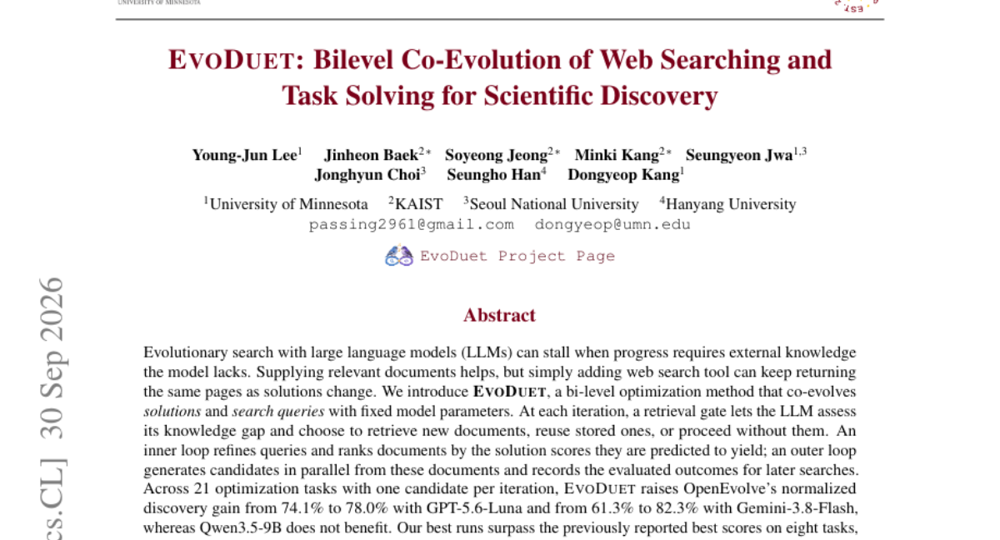

### 📌 한 줄 요약
LLM의 지식 공백을 해결하기 위해 솔루션 생성과 검색 쿼리를 동시에 최적화하는 이중 루프 진화 알고리즘

### 🔑 핵심 포인트
- 솔루션과 검색 쿼리를 상호 보완적으로 최적화하는 이중 루프(Bi-level) 구조
- 모델의 지식 공백을 판단하여 검색 여부를 결정하는 리트리벌 게이트(Retrieval Gate) 도입
- 기존 진화적 탐색 프레임워크(Top-K, EvoX 등)와 결합 가능한 범용성

### 🧑‍💻 개발자 관점
에이전트가 스스로 무엇을 모르는지 판단하고, 문제 해결에 필요한 최적의 정보를 검색하도록 하는 지능형 RAG 워크플로우 설계에 영감을 줍니다.

### 🚀 실무 적용 아이디어
- 특정 도메인 지식이 필요한 복잡한 코딩/수학 문제에 EvoDuet 프레임워크 적용 테스트
- 기존 RAG 시스템의 검색 쿼리 생성 로직을 이중 루프 구조로 교체 실험
- 모델 크기(Small vs Large)에 따른 검색-생성 루프의 효율성 비교

### ⚠️ 리스크/한계
- 검색과 생성 루프가 반복됨에 따라 발생하는 높은 추론 비용 및 지연 시간
- 특정 규모 이하의 모델(예: Qwen3.5-9B)에서는 성능 향상 효과가 미미할 수 있음

### 📝 초록 기반 상세 설명
LLM 기반의 진화적 탐색은 모델이 보유하지 않은 외부 지식이 필요할 때 성능 정체 현상을 겪습니다. 단순히 웹 검색 도구를 추가하는 방식은 솔루션이 변함에 따라 반복적인 검색 결과만 가져오는 문제가 있습니다. 이를 해결하기 위해 EvoDuet은 고정된 모델 파라미터 하에서 솔루션과 검색 쿼리를 공동 진화시키는 이중 레벨 최적화 방식을 제안합니다. 내부 루프는 쿼리 정제와 문서 랭킹을 담당하고, 외부 루프는 문서 기반 후보 생성 및 결과 기록을 수행합니다. 실험 결과, EvoDuet은 다양한 최적화 태스크에서 기존 SOTA 기록을 경신하며 뛰어난 성능 향상을 입증했습니다.

---

## 8. [WorldAuditBench: Interactive 3D World Auditing with Multimodal Agents](https://huggingface.co/papers/2609.40325)
**Upvotes**: 75 | **도입 난이도**: 중 | **신뢰도**: 상
**arXiv**: https://arxiv.org/abs/2609.40325

**태그**: Agent, 3D-Simulation, Multimodal, Benchmark, Anomaly-Detection, Reasoning, Vision, Evaluation

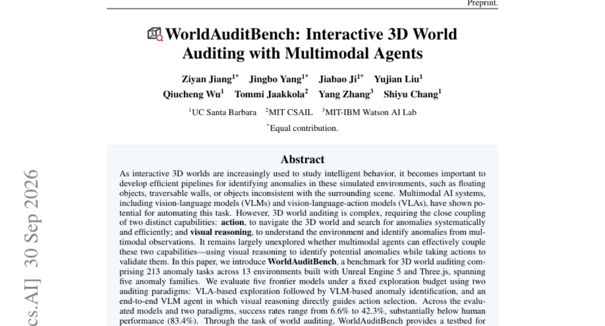

### 📌 한 줄 요약
3D 환경 내 이상 현상 탐지를 위한 멀티모달 에이전트의 탐사 및 추론 능력을 평가하는 벤치마크 제안

### 🔑 핵심 포인트
- 3D 환경의 이상 현상 탐지를 위한 213개 태스크 및 13개 환경 기반 벤치마크(WorldAuditBench) 구축
- 시각적 추론(Visual Reasoning)과 탐사 행동(Action)의 결합 능력을 평가하는 두 가지 패러다임 제시
- 현재 최신 모델들이 인간의 성능에 미치지 못하는 탐사 및 증거 수집 능력을 가짐을 입증

### 🧑‍💻 개발자 관점
3D 시뮬레이션 환경의 자동 검수 및 품질 관리(QA) 자동화를 위한 에이전트 설계 시 핵심적인 평가 지표를 제공합니다.

### 🚀 실무 적용 아이디어
- 제시된 두 가지 패러다임(VLA-VLM vs End-to-end) 중 어떤 것이 탐사 효율성에 유리한지 비교 실험
- 제한된 탐사 예산(Exploration Budget) 내에서 에이전트의 경로 최적화 알고리즘 적용 테스트
- 시각적 추론 결과가 행동 선택에 미치는 피드백 루프 구조 설계 실험

### ⚠️ 리스크/한계
- 현재 모델들의 성공률이 인간에 비해 매우 낮아 실무 적용 시 높은 신뢰도 확보가 어려움
- 탐사 예산(Budget) 제약 조건에 따라 모델의 성능 편차가 크게 발생할 수 있음

### 📝 초록 기반 상세 설명
상호작용 가능한 3D 월드가 확산됨에 따라 시뮬레이션 내 이상 현상(floating objects, traversable walls 등)을 식별하는 자동화 파이프라인의 중요성이 커지고 있습니다. 기존의 VLM/VLA 모델은 시각적 추론과 탐사 행동을 결합하여 체계적으로 문제를 해결하는 능력이 아직 충분히 검증되지 않았습니다. 본 논문은 13개 환경과 213개 태스크로 구성된 3D 월드 감사 벤치마크인 WorldAuditBench를 제안합니다. 연구진은 VLA 기반 탐사 후 VLM 식별 방식과 엔드투엔드 VLM 에이전트 방식 두 가지 패러다임을 통해 최신 모델들을 평가했습니다. 실험 결과, 모델들의 성공률은 인간 성능에 비해 현저히 낮게 나타나 현재 멀티모달 에이전트의 한계를 확인했습니다.

---

## 9. [Learning Meta-Skills for Agent Harness Design in Test-Time AI4AI](https://huggingface.co/papers/2609.38143)
**Upvotes**: 56 | **도입 난이도**: 중 | **신뢰도**: 상
**arXiv**: https://arxiv.org/abs/2609.38143

**태그**: Agent, Meta-Learning, Environment Design, Test-time Optimization, RAG, Reasoning

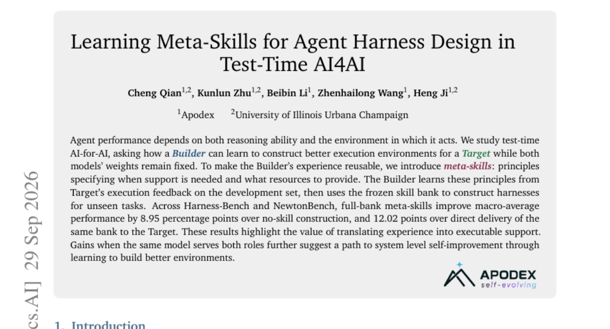

### 📌 한 줄 요약
고정된 모델 가중치 환경에서 에이전트 성능을 극대화하기 위해, 실행 환경(Harness)을 동적으로 설계하는 메타 스킬 학습 방법론을 제안합니다.

### 🔑 핵심 포인트
- 고정된 가중치 환경에서 환경 설계(Harness Design)를 통한 에이전트 성능 최적화
- 경험을 재사용 가능한 원칙으로 변환하는 '메타 스킬(Meta-Skill)' 프레임워크 도입
- 빌더-타겟 구조를 통한 테스트 타임(Test-time) 환경 구축 및 성능 향상 입증

### 🧑‍💻 개발자 관점
모델 자체를 재학습시키지 않고도, 에이전트가 작업할 수 있는 도구(Tool)나 환경을 동적으로 구성함으로써 성능을 끌어올리는 전략적 접근법을 제시합니다.

### 🚀 실무 적용 아이디어
- 동일한 모델을 빌더와 타겟으로 설정하여 환경 설계 역량의 전이 가능성 테스트
- 특정 도구(Tool) 제공 여부에 따른 에이전트 성능 변화를 메타 스킬로 정형화하는 실험
- 다양한 태스크 셋에서 학습된 스킬 뱅크의 일반화 성능 검증

### ⚠️ 리스크/한계
- 빌더가 생성한 환경이 타겟 모델의 특정 편향을 강화할 위험성
- 복잡한 환경 설계 시 발생하는 연산 오버헤드 및 실시간성 문제

### 📝 초록 기반 상세 설명
에이전트의 성능은 추론 능력뿐만 아니라 상호작용하는 환경에 따라 결정됩니다. 본 연구는 모델 가중치가 고정된 상태에서 빌더(Builder)가 타겟(Target)을 위한 최적의 실행 환경을 구축하는 'Test-time AI4AI'를 탐구합니다. 이를 위해 언제 어떤 리소스가 필요한지 정의하는 '메타 스킬(Meta-Skill)' 개념을 도입하여 빌더의 경험을 재사용 가능한 원칙으로 변환합니다. 빌더는 개발 세트의 피드백을 통해 이 원칙을 학습하며, 학습된 스킬 뱅크를 통해 미학습 태스크에 대한 최적의 하네스를 구축합니다. 실험 결과, 메타 스킬을 활용했을 때 직접적인 리소스 제공 방식보다 성능이 크게 향상됨을 확인했습니다. 이는 경험을 실행 가능한 지원 체계로 변환하는 것이 시스템 수준의 자가 개선에 핵심적임을 시사합니다.

---

## 10. [EVOKE: Eliciting World Knowledge in Agents for Transferable Decision-Making](https://huggingface.co/papers/2609.38334)
**Upvotes**: 50 | **도입 난이도**: 중 | **신뢰도**: 상
**arXiv**: https://arxiv.org/abs/2609.38334

**태그**: LLM-Agent, Reinforcement Learning, Generalization, Post-training, Agent, Vision, Evaluation

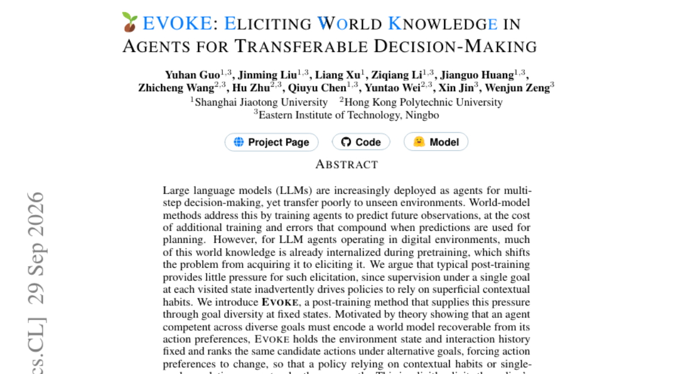

### 📌 한 줄 요약
사전 학습된 LLM의 세계 지식을 활용하여 에이전트의 환경 전이 성능과 의사결정 범용성을 높이는 새로운 사후 학습(Post-training) 기법

### 🔑 핵심 포인트
- 목표 다양성(Goal Diversity)을 활용한 사후 학습 프레임워크 EVOKE 제안
- 동일한 환경 상태에서 다양한 목표를 부여하여 에이전트가 내재된 세계 지식을 활용하도록 강제
- 표면적 맥락 의존성을 탈피하여 미학습 환경에 대한 일반화 성능 및 데이터 효율성 확보

### 🧑‍💻 개발자 관점
에이전트가 특정 작업에만 매몰되지 않고, 이미 학습된 지식을 바탕으로 새로운 환경에서도 유연하게 동작하게 만드는 전략을 제공합니다.

### 🚀 실무 적용 아이디어
- 동일한 프롬프트/상태에서 목표(Goal)만 변경하며 행동 순위가 어떻게 변하는지 테스트
- 단일 목표로 학습된 에이전트와 EVOKE 적용 에이전트의 환경 전이 성능 비교
- 다양한 규모의 LLM 백본에 EVOKE 기법을 적용하여 스케일링 효과 확인

### ⚠️ 리스크/한계
- 목표(Goal) 설계 방식에 따라 에이전트의 행동 편향이 발생할 가능성
- 복잡한 환경에서 목표 다양성을 확보하기 위한 정교한 설계 필요성

### 📝 초록 기반 상세 설명
LLM 기반 에이전트는 멀티스텝 의사결정 능력을 갖추고 있으나, 학습하지 않은 새로운 환경으로의 전이 성능이 낮다는 문제가 있습니다. 기존의 월드 모델 방식은 추가 학습 비용이 크고 예측 오차가 누적되는 단점이 있지만, 디지털 환경의 LLM은 이미 방대한 세계 지식을 내재하고 있습니다. 본 논문은 기존의 단일 목표 중심 사후 학습이 에이전트로 하여금 표면적인 맥락에만 의존하게 만든다고 지적합니다. 이를 해결하기 위해 제안된 EVOKE는 동일한 상태에서 다양한 목표를 부여하여 행동 선호도를 재배열함으로써, 내재된 세계 지식을 끌어내는 압력을 가합니다. 실험 결과, EVOKE는 다양한 백본 모델에서 작업 성능, 미학습 환경 일반화, 데이터 효율성을 모두 개선했습니다.

---

## 11. [More Choices, Fewer Decisions: Ordinal-Scale Bias in JEV-like Direct-Decision Models](https://huggingface.co/papers/2609.38827)
**Upvotes**: 43 | **도입 난이도**: 중 | **신뢰도**: 상
**arXiv**: https://arxiv.org/abs/2609.38827

**태그**: LLM-as-a-judge, Model Evaluation, Fine-tuning, NLP, Evaluation, Inference, Optimization

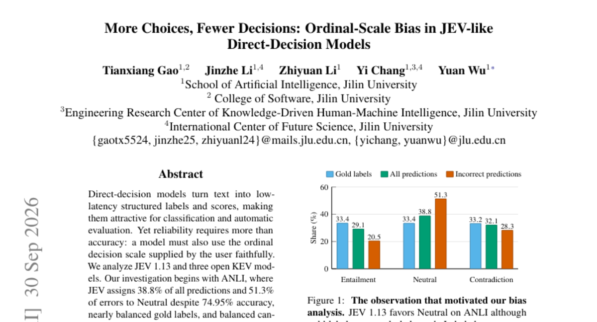

### 📌 한 줄 요약
직접 결정 모델(Direct-decision models)에서 발생하는 서열 척도 활용 저하(Ordinal scale-utilization bias) 현상 분석 및 해결 방안 제시

### 🔑 핵심 포인트
- 모델이 제공된 서열 척도(Ordinal scale)를 충분히 활용하지 못하고 특정 구간에 예측이 쏠리는 'scale-utilization bias' 발견
- 정확도가 높더라도 실제 정답 분포를 충분히 활용하지 못하는 현상이 발생함을 입증
- BA-LoRA 포스트 트레이닝을 통해 척도 활용도를 효과적으로 개선 가능함을 확인

### 🧑‍💻 개발자 관점
LLM을 활용한 자동 평가(LLM-as-a-judge) 시스템 구축 시, 모델이 단순히 높은 정확도를 보이는 것을 넘어 주어진 점수 척도를 골고루 활용하는지 검증해야 함을 시사합니다.

### 🚀 실무 적용 아이디어
- 현재 사용 중인 평가 모델의 점수 분포가 특정 구간에만 쏠려 있는지 확인
- 정확도(Accuracy) 외에 척도 활용도(Scale-utilization) 지표를 평가 프로세스에 도입
- 점수 편향이 발견될 경우 BA-LoRA와 같은 미세 조정 기법 적용 검토

### ⚠️ 리스크/한계
- 모델의 정확도가 높더라도 척도 활용도가 낮으면 세밀한 평가가 불가능할 수 있음
- 특정 데이터셋이나 태스크에 특화된 편향일 가능성 존재

### 📝 초록 기반 상세 설명
텍스트를 구조화된 라벨로 변환하는 직접 결정 모델은 낮은 지연 시간 덕분에 자동 평가 등에 유용하게 사용됩니다. 그러나 모델이 사용자가 제공한 서열 척도를 충실히 따르지 않는 문제가 발생할 수 있습니다. 본 연구는 JEV 및 오픈 KEV 모델들을 대상으로 서열 척도 활용도를 분석했습니다. 실험 결과, 모델이 정확도는 높더라도 특정 범주에 예측을 집중시키는 '척도 활용 저하' 현상이 관찰되었습니다. 이를 해결하기 위해 BA-LoRA를 활용한 타겟 포스트 트레이닝을 수행한 결과, 척도 활용도가 크게 개선되었습니다. 이는 척도 압축 현상이 아키텍처의 한계가 아닌 학습 가능한 편향임을 시사합니다.

---

## 12. [Imagine3D-LLM: Teaching MLLMs to Imagine 3D Scenes Before Answering](https://huggingface.co/papers/2609.38177)
**Upvotes**: 43 | **도입 난이도**: 상 | **신뢰도**: 상
**arXiv**: https://arxiv.org/abs/2609.38177

**태그**: 3D-Vision, MLLM, Gaussian-Splatting, Spatial-Reasoning, Reasoning, Multimodal, Vision, Benchmark

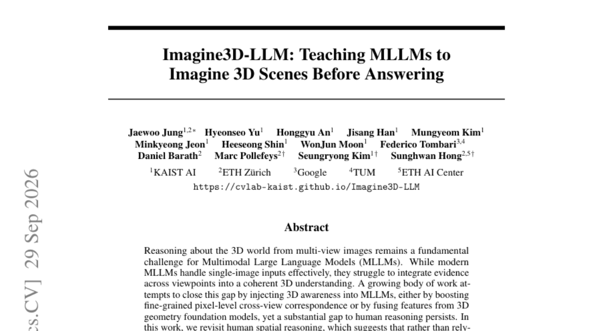

### 📌 한 줄 요약
3D Gaussian Splatting을 활용해 모델이 스스로 장면을 상상(재구성)하게 함으로써 공간 추론 능력을 극대화한 MLLM 프레임워크

### 🔑 핵심 포인트
- 학습 가능한 요약 토큰을 통한 압축된 3D Gaussian Splatting 표현 생성
- 광도 재구성 손실(photometric reconstruction loss)을 통한 3D 인지 신호 주입
- 픽셀 단위 기하학 정보 대신 고수준의 장면 레이아웃 구성을 통한 공간 추론 최적화

### 🧑‍💻 개발자 관점
단순한 이미지 특징 융합을 넘어, 모델이 내부적으로 3D 구조를 '상상'하게 만드는 것이 복잡한 공간 추론 작업에 더 효과적임을 시사합니다.

### 🚀 실무 적용 아이디어
- 3D Gaussian Splatting과 LLM 토큰 간의 정렬(alignment) 효율성 테스트
- 다양한 시점(multi-view) 데이터셋에서의 재구성 손실 영향도 분석
- 기존 3D Foundation Model 기반 방식과의 성능 및 연산 비용 비교

### ⚠️ 리스크/한계
- 3D 재구성을 위한 요약 토큰 학습 시 연산 복잡도 증가 가능성
- 매우 복잡하거나 정밀한 기하학적 구조가 필요한 작업에서의 한계 여부 확인 필요

### 📝 초록 기반 상세 설명
기존의 멀티모달 거대언어모델(MLLM)은 여러 시점의 이미지를 통합하여 일관된 3D 이해를 도출하는 데 어려움을 겪고 있습니다. 기존 방식들은 픽셀 단위의 정밀한 대응이나 기하학적 특징 융합에 집중했으나, 이는 인간의 직관적인 공간 추론 방식과는 차이가 있었습니다. 본 논문은 인간이 물체를 식별하고 대략적인 레이아웃을 구성하는 방식에서 영감을 얻어 Imagine3D-LLM을 제안합니다. 모델은 학습 가능한 요약 토큰(summary tokens)을 통해 압축된 3D Gaussian Splatting 표현을 생성하며, 이를 통해 장면을 재구성하는 법을 배웁니다. 이 과정에서 발생하는 재구성 손실(reconstruction loss)은 모델 내부의 교차 프레임 대응 능력을 강화합니다. 결과적으로 제안된 모델은 기존 방식보다 뛰어난 3D 공간 추론 및 이해 성능을 보여주었습니다.

---

## 13. [Thinking Outside the Box: Can Language Models Rely on External Guidance Selectively?](https://huggingface.co/papers/2609.39578)
**Upvotes**: 39 | **도입 난이도**: 중 | **신뢰도**: 상
**arXiv**: https://arxiv.org/abs/2609.39578

**태그**: Agent, Robustness, Fine-tuning, RLHF, Evaluation

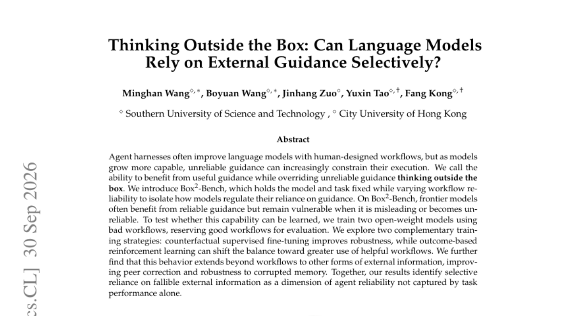

### 📌 한 줄 요약
에이전트가 외부 가이드라인의 신뢰도에 따라 유연하게 의존도를 조절하는 '선택적 신뢰' 역량을 강화하는 방법론 연구

### 🔑 핵심 포인트
- Box^2-Bench: 워크플로우 신뢰도 변화에 따른 모델의 의존도 조절 능력을 측정하는 벤치마크 제안
- 선택적 신뢰(Selective Reliance): 유용한 가이드는 수용하고 잘못된 가이드는 거부하는 에이전트의 핵심 역량 정의
- 학습 전략: Counterfactual SFT와 Outcome-based RL을 통해 외부 정보의 신뢰도에 따른 유연한 대응 학습

### 🧑‍💻 개발자 관점
에이전트 시스템 구축 시 외부 API나 워크플로우가 오작동하더라도 모델이 스스로 판단하여 오류를 방지하는 강건한 시스템 설계의 근거를 제공합니다.

### 🚀 실무 적용 아이디어
- 에이전트 워크플로우에 의도적으로 잘못된 가이드를 주입하여 모델의 취약점 테스트
- SFT 단계에서 잘못된 가이드와 올바른 가이드를 대조하는 데이터셋 구성 실험
- RL을 통해 결과(Outcome)에 따라 가이드 수용 여부를 결정하는 보상 체계 설계

### ⚠️ 리스크/한계
- 가이드의 신뢰도를 판단하는 기준이 주관적일 수 있어 모델의 판단 오류 가능성 존재
- 학습된 모델이 특정 워크플로우에 과적합되어 일반적인 가이드까지 무시할 위험

### 📝 초록 기반 상세 설명
에이전트 워크플로우는 모델 성능을 높이지만, 잘못된 가이드가 모델의 능력을 제약하는 문제가 발생할 수 있습니다. 본 논문은 유용한 가이드는 따르되 잘못된 가이드는 무시하는 'Thinking Outside the Box' 능력을 정의합니다. 이를 측정하기 위해 워크플로우 신뢰도를 변수로 두는 Box^2-Bench를 제안합니다. 실험 결과, 최신 모델들은 신뢰할 수 있는 가이드에는 반응하지만 오정보에는 취약함을 보였습니다. 이를 해결하기 위해 반사실적 SFT와 결과 기반 RL을 통해 모델의 선택적 신뢰 능력을 학습시켰습니다. 결과적으로 모델은 외부 정보의 신뢰도에 따라 의존도를 조절하는 능력을 갖추게 되었습니다.

### 🖼️ 추가 자료
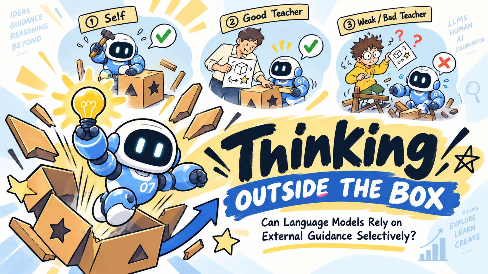

---

## 14. [RSIGame: Autonomous Agentic Game Development with Recursive Self-improvement](https://huggingface.co/papers/2609.39045)
**Upvotes**: 39 | **도입 난이도**: 상 | **신뢰도**: 상
**arXiv**: https://arxiv.org/abs/2609.39045

**태그**: Agent, GameDev, Self-Improvement, LLM, RAG, Vision

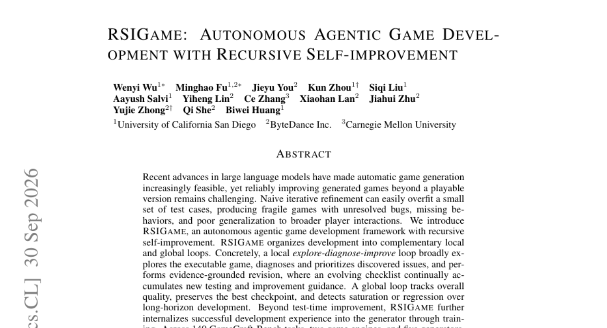

### 📌 한 줄 요약
재귀적 자기 개선 루프를 통해 게임의 품질을 지속적으로 높이고 성공 경험을 모델에 내재화하는 자율 에이전트 프레임워크

### 🔑 핵심 포인트
- 로컬(탐색/진단/개선) 및 글로벌(품질 관리/회귀 방지) 루프의 이중 구조 설계
- 에볼루션 체크리스트를 통한 증거 기반의 점진적 게임 개선
- 성공적인 개발 경험을 모델에 내재화하여 생성 효율성 및 품질 극대화

### 🧑‍💻 개발자 관점
단순한 코드 생성을 넘어, 에이전트가 스스로 테스트하고 버그를 수정하며 품질을 관리하는 자율형 개발 워크플로우의 가능성을 보여줍니다.

### 🚀 실무 적용 아이디어
- 에이전트 기반의 반복적 코드 수정 루프(Iterative Refinement) 구조 설계 실험
- 테스트 케이스 기반의 체크리스트 자동 생성 및 관리 로직 구현
- 모델 파인튜닝과 에이전트 루프 간의 시너지 효과 검증

### ⚠️ 리스크/한계
- 반복적인 루프 과정에서 발생할 수 있는 연산 비용 및 토큰 소모 문제
- 특정 게임 엔진이나 도메인에 국한된 일반화 성능의 한계

### 📝 초록 기반 상세 설명
최근 LLM을 활용한 자동 게임 생성 기술이 발전하고 있으나, 단순 반복 개선 방식은 과적합이나 버그 발생 등의 문제를 겪습니다. 본 논문은 이를 해결하기 위해 재귀적 자기 개선(Recursive Self-improvement)을 지원하는 RSIGame 프레임워크를 제안합니다. RSIGame은 로컬 루프(탐색-진단-개선)와 글로벌 루프(품질 추적 및 회귀 방지)라는 두 가지 상호 보완적인 루프로 개발 과정을 관리합니다. 또한, 성공적인 개발 경험을 생성 모델에 학습시켜 성능을 내재화하는 방식을 도입했습니다. 실험 결과, RSIGame은 다양한 엔진과 태스크에서 기존 모델의 원샷 성능을 상회하는 높은 게임 품질을 달성했습니다.

---

## 15. [AIM: Agentic Idea Management for Automated Research](https://huggingface.co/papers/2609.38445)
**Upvotes**: 38 | **도입 난이도**: 중 | **신뢰도**: 상
**arXiv**: https://arxiv.org/abs/2609.38445

**태그**: AI Agent, Automated Research, Bayesian Optimization, LLM, Agent, RAG, Benchmark, Safety

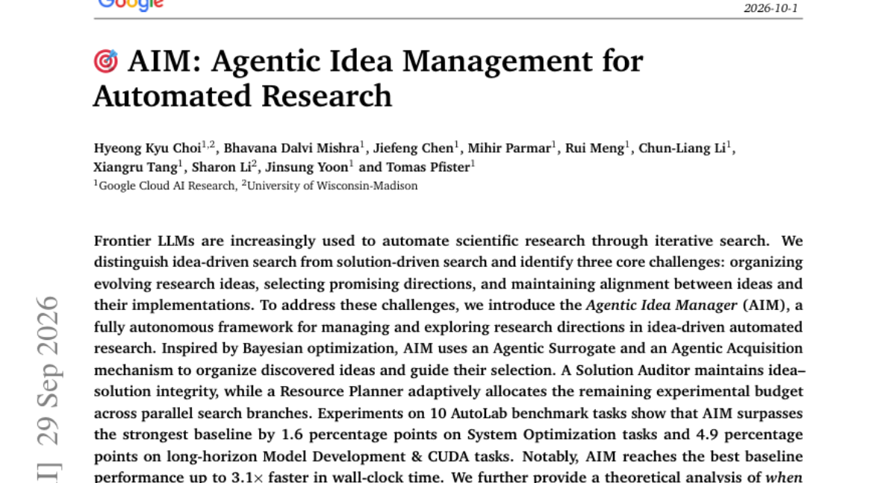

### 📌 한 줄 요약
베이지안 최적화 개념을 도입하여 연구 아이디어의 생성, 선택, 정렬을 자동화하는 에이전트 기반 연구 프레임워크 AIM 제안

### 🔑 핵심 포인트
- 아이디어 중심의 자동화 연구를 위한 에이전트 기반 프레임워크(AIM) 개발
- 베이지안 최적화 원리를 적용한 아이디어 조직 및 선택 메커니즘 도입
- 아이디어-솔루션 간 정렬 유지 및 동적 자원 배분 전략 적용

### 🧑‍💻 개발자 관점
단순한 코드 생성을 넘어, 연구 방향성을 스스로 탐색하고 관리하는 '자율형 연구 에이전트' 구축의 방법론을 제시합니다.

### 🚀 실무 적용 아이디어
- 제시된 Agentic Surrogate와 Acquisition 메커니즘의 로직을 기존 RAG 시스템에 이식해보기
- 아이디어 중심 탐색과 솔루션 중심 탐색의 성능 차이를 비교하는 벤치마크 실험 수행
- 제한된 컴퓨팅 자원 환경에서 AIM의 Resource Planner 효율성 검증

### ⚠️ 리스크/한계
- 아이디어 생성 단계에서의 탐색 공간이 너무 넓을 경우 발생하는 효율성 저하 가능성
- 에이전트 간의 상호작용 과정에서 발생할 수 있는 복잡도 및 비용 문제

### 📝 초록 기반 상세 설명
최근 LLM을 활용한 자동화된 연구가 활발해지고 있으나, 진화하는 아이디어 관리와 실행 간의 정렬 문제가 핵심 과제로 남아있습니다. 본 논문은 아이디어 중심의 자동화 연구를 위해 에이전트 기반 아이디어 관리 프레임워크인 AIM을 제안합니다. AIM은 베이지안 최적화에서 영감을 받아 아이디어를 조직하는 Agentic Surrogate와 유망한 방향을 선택하는 Agentic Acquisition 메커니즘을 사용합니다. 또한 Solution Auditor를 통해 아이디어와 구현 간의 무결성을 유지하며, Resource Planner가 실험 예산을 효율적으로 배분합니다. 실험 결과, AIM은 시스템 최적화 및 모델 개발 태스크에서 기존 베이스라인을 상회하는 성능을 보였으며, 훨씬 빠른 시간 내에 목표 성능에 도달했습니다.

---

## 16. [Agent Error Dataset: Scaling 50,000 Error--Diagnosis Pairs for Failure Analysis and Error-Aware Post-Training](https://huggingface.co/papers/2609.40111)
**Upvotes**: 36 | **도입 난이도**: 중 | **신뢰도**: 상
**arXiv**: https://arxiv.org/abs/2609.40111

**태그**: LLM Agent, Error Analysis, Fine-tuning, Dataset, Agent, RAG

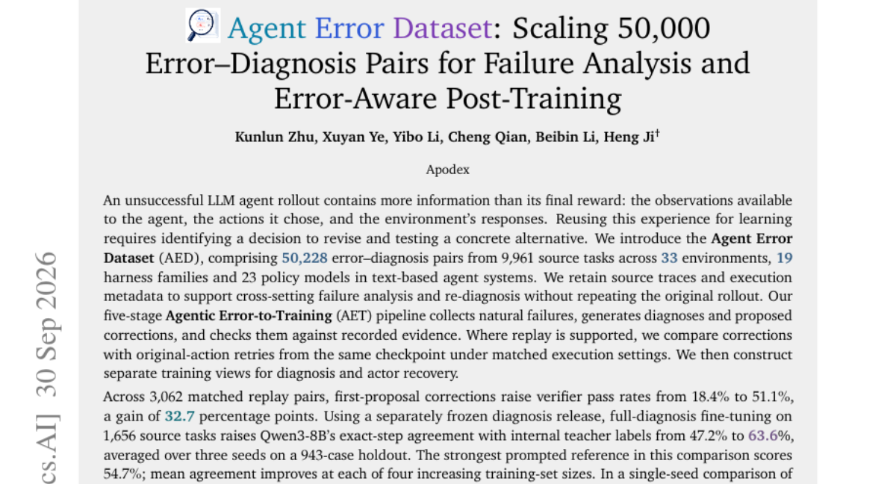

### 📌 한 줄 요약
에이전트의 실패 경험을 진단 및 수정 데이터로 변환하여 성능을 높이는 5만 건 규모의 대규모 에이전트 오류 데이터셋과 학습 파이프라인 제안

### 🔑 핵심 포인트
- 50,228개의 대규모 오류-진단 쌍을 포함하는 Agent Error Dataset(AED) 구축
- 실패 원인 분석부터 수정안 검증까지 이어지는 5단계 AET 파이프라인 제안
- 실패 경험을 활용한 진단(Diagnosis) 및 액터 복구(Actor Recovery) 학습 프레임워크 구축

### 🧑‍💻 개발자 관점
에이전트 개발 시 발생하는 실패 로그를 단순한 로그가 아닌, 모델의 성능을 개선할 수 있는 고품질 학습 데이터로 전환하는 실무적 방법론을 제공합니다.

### 🚀 실무 적용 아이디어
- 에이전트 실행 로그에서 실패 시점의 관찰값과 액션을 추출하여 데이터셋화하기
- 실패 원인을 분석하는 '진단 모델'과 수정된 액션을 생성하는 '복구 모델'로 나누어 학습 실험하기
- 동일한 체크포인트에서 수정된 액션이 실제 환경에서 성공하는지 검증하는 루프 구축하기

### ⚠️ 리스크/한계
- 텍스트 기반 에이전트 환경에 집중되어 있어 시각적/복합 모달리티 환경으로의 일반화 연구 필요
- 생성된 진단 및 수정안이 실제 환경의 물리적/논리적 제약 조건을 완벽히 반영하지 못할 위험

### 📝 초록 기반 상세 설명
LLM 에이전트의 실패 과정에는 단순 보상값보다 더 풍부한 의사결정 정보가 포함되어 있지만, 이를 학습에 재사용하는 것은 여전히 어려운 과제입니다. 본 논문은 33개 환경과 23개 정책 모델을 아우르는 50,228개의 오류-진단 쌍을 포함하는 Agent Error Dataset(AED)을 소개합니다. 연구진은 실패를 수집하고, 진단 및 수정안을 생성하며, 이를 검증하는 5단계 AET(Agentic Error-to-Training) 파이프라인을 제안합니다. 실험 결과, 제안된 수정안을 통한 학습은 검증 통과율을 크게 향상시켰으며, 진단 중심의 미세 조정은 모델의 의사결정 일치도를 높였습니다. 최종적으로 에이전트의 실패 데이터를 체계적인 학습 데이터로 전환하는 효과적인 방법론을 입증했습니다.

---

## 17. [Unmask the State: When Does State Adaptation Matter for Masked Diffusion Language Models](https://huggingface.co/papers/2609.33355)
**Upvotes**: 35 | **도입 난이도**: 중 | **신뢰도**: 상
**arXiv**: https://arxiv.org/abs/2609.33355

**태그**: LLM, Diffusion Model, Inference Optimization, Generative AI, Inference

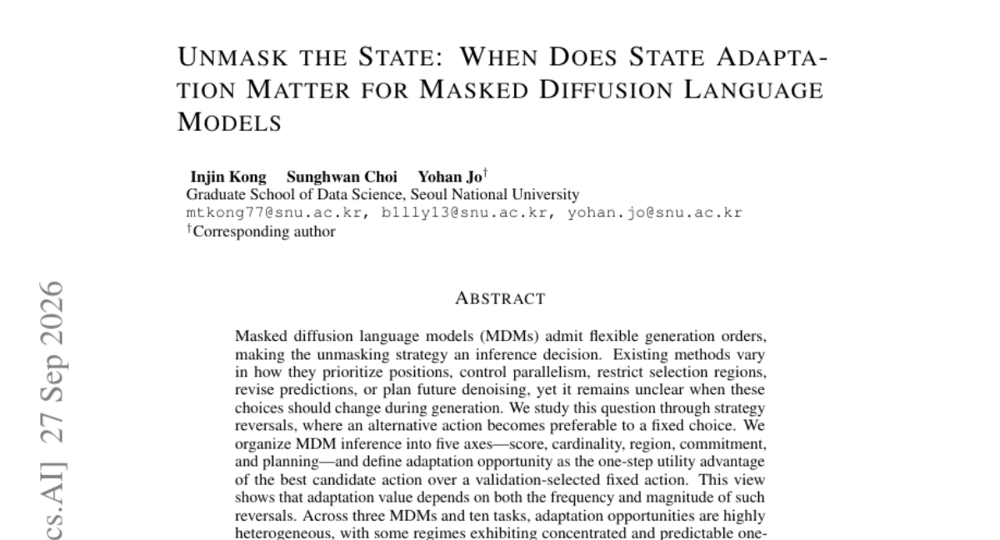

### 📌 한 줄 요약
Masked Diffusion Language Model(MDM)의 생성 과정 중 전략적 변화가 필요한 시점을 식별하여 효율적인 추론을 수행하는 방법론 연구

### 🔑 핵심 포인트
- MDM 추론 과정을 5가지 축(score, cardinality, region, commitment, planning)으로 체계화
- 전략 반전(strategy reversal) 개념을 통해 적응의 가치를 정량화
- 모든 단계가 아닌 고효율 상태에서만 전략을 변경하는 '선택적 적응(selective adaptation)' 방법론 제시

### 🧑‍💻 개발자 관점
생성 모델의 추론 비용을 줄이면서도 품질을 높이기 위해, 모든 토큰 생성 단계에 복잡한 알고리즘을 적용하는 대신 필요한 순간에만 연산 자원을 집중하는 최적화 전략을 제공합니다.

### 🚀 실무 적용 아이디어
- LLaDA와 같은 MDM 모델에서 생성 단계별 전략 변경 시 성능 향상 폭 측정하기
- 특정 태스크(예: JSON filling)에서 전략 반전이 발생하는 빈도와 시점 분석하기
- 경량화된 탐지기를 설계하여 적응 시점(adaptation opportunity)을 예측하는 실험 수행하기

### ⚠️ 리스크/한계
- 전략을 변경하는 시점(detector)의 정확도에 따라 전체 생성 품질이 크게 좌우될 수 있음
- 특정 태스크나 모델 구조에 따라 적응 기회의 이득이 편중될 수 있음

### 📝 초록 기반 상세 설명
Masked Diffusion Language Model(MDM)은 생성 순서가 유연하여 추론 시 다양한 언마스킹(unmasking) 전략을 선택할 수 있습니다. 기존 연구들은 고정된 방식의 전략을 사용해 왔으나, 생성 과정 중 언제 전략을 변경해야 하는지에 대한 연구는 부족했습니다. 본 논문은 전략 반전(strategy reversals) 개념을 도입하여, 특정 시점에 최적의 행동이 변하는 '적응 기회(adaptation opportunity)'를 정의하고 분석했습니다. 실험 결과, 적응의 가치는 생성 단계마다 매우 이질적이며 특정 시점에 집중되어 있음을 확인했습니다. 이를 바탕으로 가벼운 탐지기를 통해 높은 이득이 예상되는 상태에서만 선택적으로 전략을 수정하는 기법을 제안했습니다. 결과적으로 모든 단계가 아닌 필요한 시점에만 적응함으로써 효율적이고 강력한 생성 성능을 달성했습니다.

---

## 18. [LANTERN: Illuminating Hidden Mathematical Knowledge in Language Models](https://huggingface.co/papers/2609.32264)
**Upvotes**: 34 | **도입 난이도**: 중 | **신뢰도**: 상
**arXiv**: https://arxiv.org/abs/2609.32264

**태그**: LLM, Mathematical Discovery, Automated Reasoning, Knowledge Mining

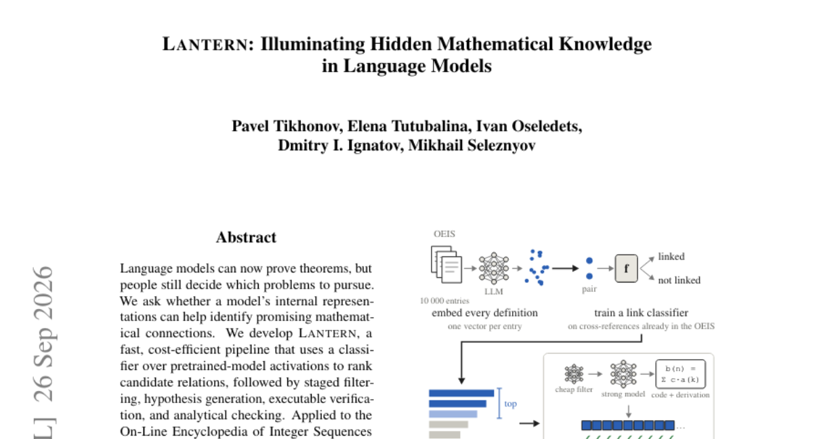

### 📌 한 줄 요약
사전 학습된 언어 모델의 내부 활성화 값을 활용하여 수학적 관계를 탐색하고 검증하는 효율적인 파이프라인 개발

### 🔑 핵심 포인트
- 모델 내부 활성화 값을 활용한 수학적 관계 후보 순위화 기법 제안
- 가설 생성부터 실행 가능한 검증까지 이어지는 자동화된 엔드투엔드 파이프라인 구축
- 기존 수학적 데이터베이스(OEIS)에서 발견하지 못한 새로운 관계를 효율적으로 탐색

### 🧑‍💻 개발자 관점
모델의 내부 상태를 활용해 지식 탐색의 효율성을 극대화하는 방법론을 제시하며, 자동화된 가설 생성 및 검증 워크플로우의 가능성을 보여줍니다.

### 🚀 실무 적용 아이디어
- 사전 학습된 모델의 활성화 값을 추출하여 특정 도메인 지식 간의 관계를 분류하는 실험 수행
- 생성된 수학적 가설을 자동 검증하기 위한 코드 실행 환경(Code Interpreter 등) 연동 테스트
- 도메인 특화 데이터셋을 활용한 파이프라인의 정밀도 및 재현율 측정

### ⚠️ 리스크/한계
- 모델의 내부 표현이 항상 유의미한 수학적 관계를 반영한다는 보장이 없음
- 발견된 관계가 수학적으로 깊은 통찰을 주는지 여부는 여전히 인간의 검증이 필요함

### 📝 초록 기반 상세 설명
언어 모델이 수학적 정리를 증명할 수 있게 되었지만, 어떤 문제를 탐구할지 결정하는 것은 여전히 인간의 영역에 머물러 있습니다. 본 연구는 모델의 내부 표현(internal representations)이 유망한 수학적 연결 고리를 식별하는 데 도움을 줄 수 있는지 질문합니다. 이를 위해 사전 학습된 모델의 활성화 값을 분류기에 적용하여 후보 관계를 순위화하고, 단계별 필터링, 가설 생성, 실행 가능한 검증 및 분석적 확인을 거치는 효율적인 파이프라인인 LANTERN을 개발했습니다. OEIS 데이터를 대상으로 실험한 결과, 5천만 개의 쌍을 순위화하여 기존에 없던 62개의 검증된 관계를 도출했습니다. 최종적으로 9개의 통찰력 있는 관계를 확보했으며, 이 중 4개는 기존 문헌에 없는 완전히 새로운 발견이었습니다. 전체 프로세스는 8시간 이내에 완료될 정도로 매우 빠르고 비용 효율적입니다.

---

## 19. [Breaking Babel: A Self-Evolving Multi-Agent System for Long-Form Subtitle Translation](https://huggingface.co/papers/2609.38660)
**Upvotes**: 30 | **도입 난이도**: 중 | **신뢰도**: 상
**arXiv**: https://arxiv.org/abs/2609.38660

**태그**: Multi-Agent, Prompt Engineering, Translation, Self-Evolving, Agent, RAG, Reasoning, Benchmark, Evaluation, Inference

### 📌 한 줄 요약
테스트 타임에 프롬프트와 라우팅 정책을 스스로 진화시켜 장편 자막 번역의 일관성을 확보하는 멀티 에이전트 시스템

### 🔑 핵심 포인트
- 테스트 타임에 프롬프트와 라우팅 정책을 업데이트하는 Self-evolving 멀티 에이전트 구조
- 시리즈 전체의 맥락 유지를 위한 지속 가능한 메모리 및 동적 라우팅 메커니즘
- 자막 특화 벤치마크(Subtitle Arena) 및 품질 평가 프레임워크(SubMQM) 도입

### 🧑‍💻 개발자 관점
모델 재학습 없이 프롬프트 엔지니어링과 에이전트 워크플로우 최적화만으로 도메인 특화 작업의 성능을 극대화하는 전략을 제시합니다.

### 🚀 실무 적용 아이디어
- 동적 라우팅을 활용한 에이전트 워크플로우 설계 실험
- 테스트 타임 피드백 루프를 통한 프롬프트 자동 업데이트 로직 구현
- 장기 문맥 유지를 위한 메모리 관리 전략 적용

### ⚠️ 리스크/한계
- 테스트 타임에 발생하는 연산 비용 및 추론 시간 증가 가능성
- 에이전트 간의 피드백 루프가 특정 상황에서 발산하거나 편향될 위험

### 📝 초록 기반 상세 설명
장편 자막 번역은 에피소드 전반에 걸친 담화 및 문화적 맥락을 유지하면서 용어 일관성을 확보해야 하는 난제가 있습니다. 기존의 단일 LLM 방식은 문장 단위에 치중되어 있고, 기존 멀티 에이전트 방식은 장면 복잡도에 따른 유연한 대응이 어렵습니다. 본 논문은 테스트 타임 트레이닝을 통해 시리즈 수준의 메모리를 구축하고 에이전트 설정을 진화시키는 SMART 시스템을 제안합니다. SMART는 동적 라우터와 Mixture-of-Agents 레이어를 통해 용어 검증 및 제약 조건 확인을 수행하며, judge-refiner 루프를 통해 모델 재학습 없이 프롬프트와 정책을 업데이트합니다. 실험 결과, 제안된 Subtitle Arena 벤치마크와 SubMQM 프레임워크에서 기존 시스템 대비 우수한 성능을 기록하며 인간 평가에서도 높은 점수를 얻었습니다.

---

## 20. [It's Not What the Image Shows: Irrelevant Context Destabilises VLM Judges Without Informing Them](https://huggingface.co/papers/2609.37863)
**Upvotes**: 29 | **도입 난이도**: 하 | **신뢰도**: 상
**arXiv**: https://arxiv.org/abs/2609.37863

**태그**: VLM, Evaluation, Robustness, Vision-Language, Vision

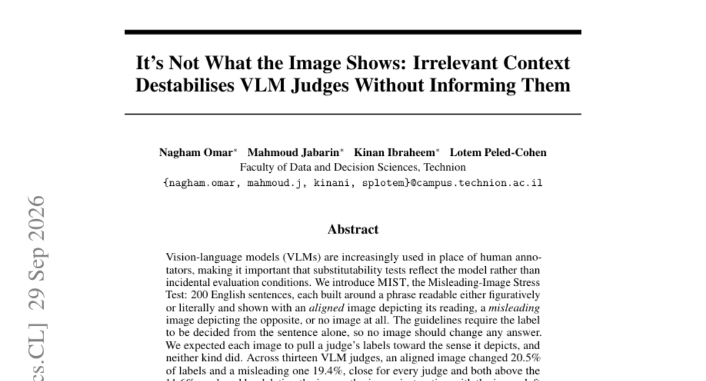

### 📌 한 줄 요약
VLM 평가 시 이미지가 내용과 무관하더라도 모델의 판단을 불안정하게 만드는 현상을 규명함

### 🔑 핵심 포인트
- MIST(Misleading-Image Stress Test) 프레임워크를 통한 VLM 판단 안정성 테스트
- 이미지의 내용(의미)과 상관없이 이미지의 존재 자체가 모델의 레이블을 변화시킴
- 이미지가 판단을 유도하더라도, 그것이 반드시 이미지의 의미 방향으로 움직이지는 않음

### 🧑‍💻 개발자 관점
VLM을 평가 지표(Judge)로 사용할 때, 시각적 정보가 텍스트 판단을 왜곡하는 '간섭 효과'가 발생할 수 있음을 인지해야 합니다.

### 🚀 실무 적용 아이디어
- VLM 평가 시 텍스트 전용(No-image) 결과와 이미지 포함 결과의 일치도 비교
- 이미지 프롬프트가 모델의 판단을 무작위로 흔드는지 확인하는 스트레스 테스트 수행
- 시각적 정보가 텍스트의 논리적 판단을 방해하지 않는지 검증하는 벤치마크 구축

### ⚠️ 리스크/한계
- 이미지 내용이 판단을 유도하는 방식이 모델마다 상이할 수 있음
- 특정 모델 아키텍처에 국한된 현상일 가능성 존재

### 📝 초록 기반 상세 설명
최근 VLM이 인간 주석가를 대체하는 용도로 사용되면서, 평가 조건이 모델의 성능을 왜곡할 위험이 커졌습니다. 연구진은 문장의 의미가 이미지와 일치하거나, 반대되거나, 혹은 이미지가 없는 상황을 설계한 MIST(Misleading-Image Stress Test)를 제안했습니다. 실험 결과, 이미지가 일치하든 오도하든 상관없이 이미지가 존재한다는 사실 자체가 모델의 판단을 변화시키는 현상이 관찰되었습니다. 하지만 이러한 변화는 이미지의 내용(의미)을 따르기보다는 단순히 이미지의 존재에 반응하는 것이었습니다. 결과적으로 VLM을 평가할 때 이미지가 판단을 흔드는 '노이즈'로 작용하여 평가의 신뢰성을 저해할 수 있음을 보여줍니다.

---

## 21. [DyRAD: Radar Novel View Synthesis for Dynamic Driving Scenes](https://huggingface.co/papers/2609.39841)
**Upvotes**: 28 | **도입 난이도**: 상 | **신뢰도**: 상
**arXiv**: https://arxiv.org/abs/2609.39841

**태그**: Radar, Novel View Synthesis, Autonomous Driving, Dynamic Scene, Vision, Benchmark, Evaluation

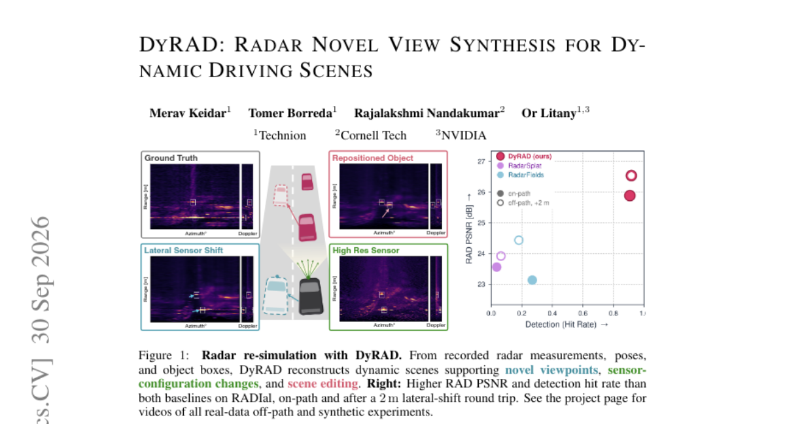

### 📌 한 줄 요약
레이더의 도플러(Doppler) 특성을 활용하여 동적 주행 장면의 3D 재구성 및 새로운 시점 합성을 가능하게 하는 DyRAD 프레임워크

### 🔑 핵심 포인트
- 정적 배경과 움직이는 동적 객체를 분리하여 도플러(Doppler) 정보를 포함한 완전한 RAD 텐서 렌더링
- 분석적 PSF(Point-Spread Function)를 도입하여 센서 신호 확산 문제를 해결하고 기하 구조와 분리
- 객체 트랙 정보를 도플러 정보와 결합하여 정밀한 동적 장면 재구성 및 제로샷 센서 설정 전이 가능

### 🧑‍💻 개발자 관점
레이더 데이터를 활용한 고정밀 시뮬레이션 환경 구축 시, 센서 하드웨어 사양이 바뀌어도 재학습 없이 시점을 변경할 수 있는 기술적 토대를 제공합니다.

### 🚀 실무 적용 아이디어
- 제시된 PSF 기반 렌더링 방식이 실제 레이더 데이터의 노이즈를 얼마나 효과적으로 억제하는지 검증
- 동적 객체의 속도 정보가 급격히 변하는 시나리오에서의 재구성 안정성 테스트
- 다양한 센서 사양(Antenna, Resolution 등) 변경 시 제로샷 전이 성능 측정

### ⚠️ 리스크/한계
- 객체 트랙 정보에 의존하는 구조이므로, 트래킹 실패 시 도플러 및 위치 재구성에 직접적인 영향
- 복잡한 도심 환경에서의 다중 경로 반사(Multipath) 등 복합적인 레이더 노이즈 처리 한계 가능성

### 🖼️ 추가 자료
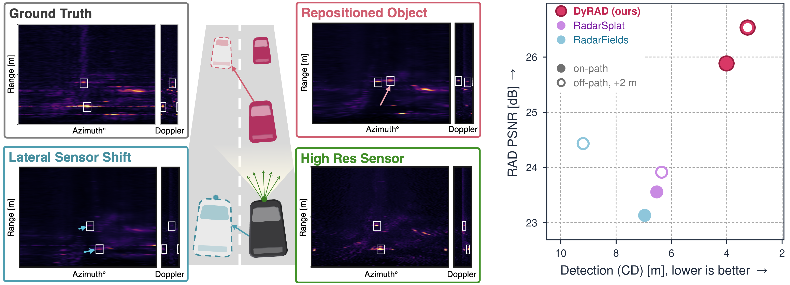
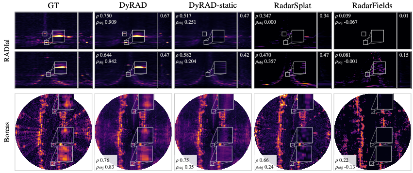

---

## 22. [DC-SAE: Deep Compression Semantic Autoencoder for Faster Diffusion Convergence](https://huggingface.co/papers/2609.39222)
**Upvotes**: 27 | **도입 난이도**: 중 | **신뢰도**: 상
**arXiv**: https://arxiv.org/abs/2609.39222

**태그**: Diffusion, Autoencoder, Image Generation, Compression, RAG, Vision, Evaluation, Optimization

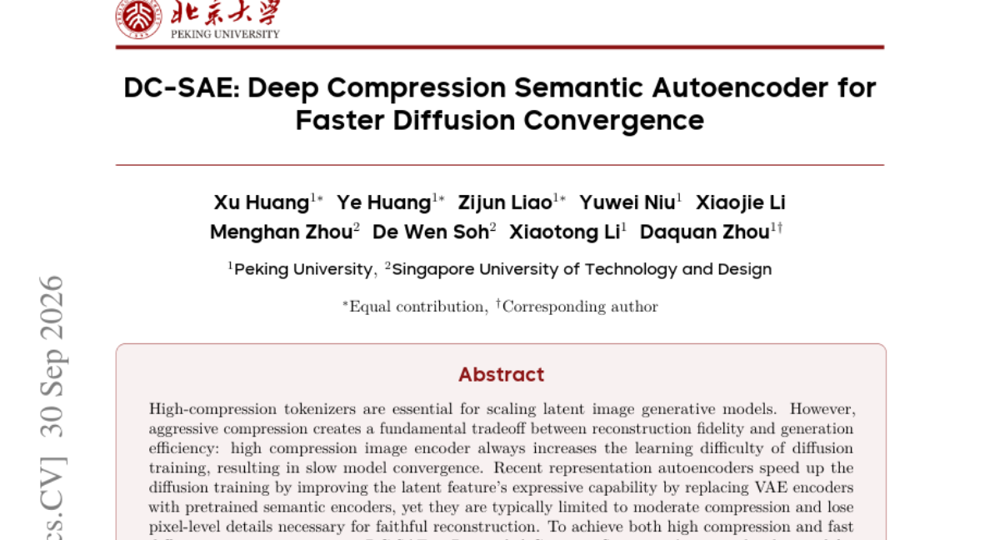

### 📌 한 줄 요약
고압축 토크나이저 환경에서도 디퓨전 모델의 수렴 속도와 재구성 정밀도를 동시에 확보하는 분리형 시맨틱 오토인코더(DC-SAE) 제안

### 🔑 핵심 포인트
- 거시적 의미(Semantic)와 미세 디테일(Pixel-level)을 분리하여 처리하는 이중 인코더 구조 설계
- 고압축 환경에서도 디퓨전 모델의 학습 수렴 속도를 가속화하는 효율적인 잠재 공간 형성
- 고해상도(1024x1024) 텍스트-이미지 생성 작업에서 우수한 성능 및 효율성 입증

### 🧑‍💻 개발자 관점
압축률을 높이면서도 생성 모델의 학습 시간을 단축하고 고화질 이미지를 얻고 싶은 엔지니어에게 실질적인 아키텍처 가이드를 제공합니다.

### 🚀 실무 적용 아이디어
- 기존 VAE/VQ-VAE 기반 디퓨전 파이프라인에 DC-SAE 구조를 교체 적용하여 학습 수렴 속도 비교
- 다양한 압축 배율(Compression Ratio) 변화에 따른 재구성 품질 및 생성 품질의 트레이드오프 분석
- 고해상도 생성 시 연산 비용(Throughput) 대비 성능 효율성 검증

### ⚠️ 리스크/한계
- 이중 인코더 구조 도입에 따른 모델 파라미터 및 추론 복잡도 증가 가능성
- 매우 높은 압축률 적용 시 발생할 수 있는 잠재적 아티팩트 제어 필요성

### 📝 초록 기반 상세 설명
확산 모델(Diffusion Model)의 효율적인 확장을 위해 고압축 토크나이저가 필수적이지만, 압축률이 높아질수록 재구성 품질이 떨어지고 디퓨전 학습 난이도가 상승하는 트레이드오프가 발생합니다. 기존의 시맨틱 인코더 기반 방식은 학습 속도는 빠르나 압축률에 한계가 있고 세부 디테일 손실이 발생하는 문제가 있었습니다. 이를 해결하기 위해 본 논문은 거시적 의미를 담는 시맨틱 인코더와 미세 디테일을 보존하는 픽셀 레벨 인코더를 결합한 DC-SAE를 제안합니다. 실험 결과, DC-SAE는 높은 압축률에서도 기존 SOTA 모델인 DC-AE 대비 PSNR과 gFID 측면에서 압도적인 성능을 보였습니다. 또한, 높은 압축 환경에서도 디퓨전 모델의 빠른 수렴과 고해상도 이미지 생성 능력을 입증했습니다.

---

## 23. [TERRA: Terrain-Aware Reconstruction, Retargeting and Control for Musculoskeletal Locomotion](https://huggingface.co/papers/2609.38653)
**Upvotes**: 26 | **도입 난이도**: 상 | **신뢰도**: 상
**arXiv**: https://arxiv.org/abs/2609.38653

**태그**: Reinforcement Learning, Musculoskeletal Modeling, Motion Retargeting, Robotics, Agent, Benchmark

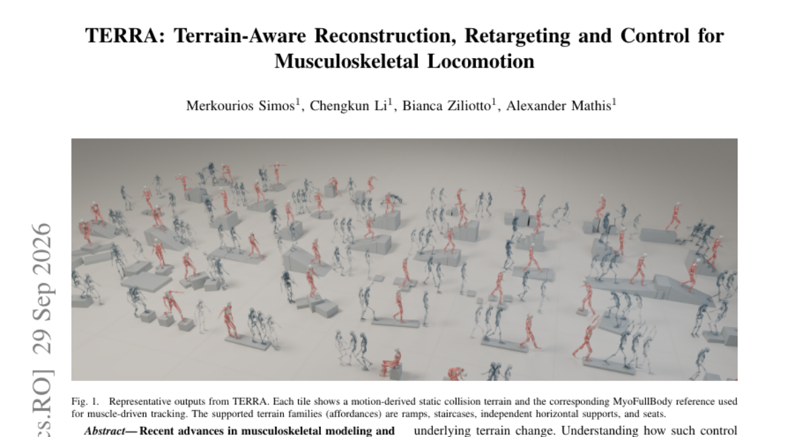

### 📌 한 줄 요약
지형 정보가 없는 모션 데이터로부터 지형 적응형 근골격 로코모션 제어를 가능하게 하는 엔드투엔드 파이프라인 제안

### 🔑 핵심 포인트
- 지형 정보가 없는 모션 데이터에서 지형 기하 구조를 복원하는 알고리즘 개발
- 해부학적 제약 및 건 연속성을 고려한 정교한 근골격 리타겟팅 기술
- 다양한 지형 환경에 대응 가능한 단일 근골격 제어 정책 학습 프레임워크

### 🧑‍💻 개발자 관점
지형 정보가 결합되지 않은 기존 모션 캡처 데이터를 활용해 복잡한 지형에서도 동작 가능한 로봇/에이전트 모델을 구축할 수 있는 실용적인 경로를 제시합니다.

### 🚀 실무 적용 아이디어
- 제공된 데이터셋을 활용하여 지형 복원 알고리즘의 정확도 검증
- 다양한 해부학적 구조를 가진 에이전트에 대한 리타겟팅 안정성 테스트
- 강화학습 환경에서의 지형 변화에 따른 제어 정책의 강건성 실험

### ⚠️ 리스크/한계
- 복잡한 해부학적 제약 조건 계산에 따른 높은 연산 비용 발생 가능성
- 입력된 운동학적 궤적의 품질에 따라 지형 복원 정확도가 크게 좌우될 위험

### 📝 초록 기반 상세 설명
최근 근골격 모델링과 강화학습의 발전으로 복잡한 동작 재현이 가능해졌으나, 지형 데이터 부족과 복잡한 신체로의 리타겟팅 문제로 인해 평지 위주의 연구에 머물러 있었습니다. 본 논문은 TERRA라는 지형 인지형 리타겟팅 및 제어 파이프라인을 제안합니다. TERRA는 운동학적 궤적만으로 지형 사전 정보와 접촉 추정치를 결합하여 작업에 필요한 지형 기하 구조를 복원합니다. 또한 해부학적 구조, 건(tendon) 연속성, 접촉 제약 조건을 고려하여 리타겟팅을 수행합니다. 이를 통해 5개의 데이터셋에서 추출한 모션-지형 쌍을 활용하여 단일 근골격 제어 정책을 학습시켰습니다. 실험 결과, TERRA는 지형 정확도를 높이고 해부학적 위반을 줄이며 다양한 지형에서 높은 작업 성공률을 달성했습니다.

---

## 24. [Systematically Exploring the Capabilities of GPT-6 Astra as Embodied Policies](https://huggingface.co/papers/2609.38537)
**Upvotes**: 25 | **도입 난이도**: 상 | **신뢰도**: 상
**arXiv**: https://arxiv.org/abs/2609.38537

**태그**: Embodied AI, LLM, Robotics, Policy Learning, RAG, Evaluation, Inference

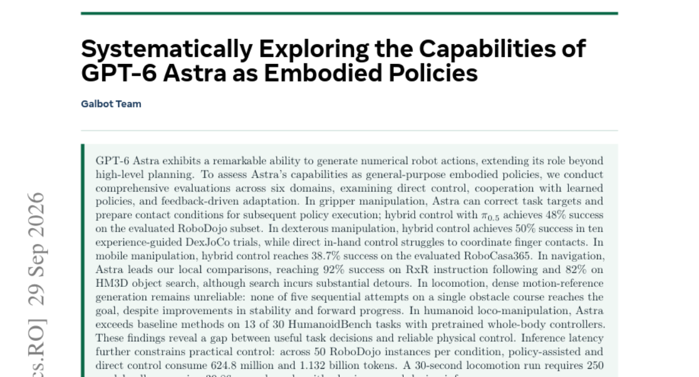

### 📌 한 줄 요약
GPT-6 Astra의 로봇 제어 능력을 다각도로 검증하여, 고수준 계획과 저수준 물리 제어 사이의 간극을 확인한 연구

### 🔑 핵심 포인트
- 6개 도메인(조작, 내비게이션, 이동 등)에서의 범용 임바디드 정책 성능 검증
- 고수준 작업 결정과 저수준 물리 제어 간의 성능 격차 확인
- 추론 지연 시간(Inference Latency)이 실시간 물리 제어에 미치는 제약 분석

### 🧑‍💻 개발자 관점
LLM 기반 에이전트가 실제 물리 환경에서 동작할 때, 계획(Planning)과 제어(Control)를 어떻게 결합해야 하는지에 대한 실무적 가이드라인을 제공합니다.

### 🚀 실무 적용 아이디어
- LLM의 계획과 기존 RL 정책 간의 하이브리드 제어 구조 설계 실험
- 추론 지연 시간을 고려한 비동기식/중단 가능한 로봇 제어 루프 구현
- 고수준 명령을 저수준 액션으로 변환하는 데 필요한 토큰 효율성 최적화 테스트

### ⚠️ 리스크/한계
- 높은 추론 지연 시간으로 인해 실시간 물리 제어 시 물리 엔진 정지나 오작동 위험 존재
- 정교한 손가락 움직임이나 연속적인 이동과 같은 복잡한 물리적 제어의 신뢰도 부족

### 📝 초록 기반 상세 설명
최근 GPT-6 Astra는 단순 계획을 넘어 수치적 로봇 액션을 생성하는 능력을 보여주고 있습니다. 본 연구는 Astra를 범용 임바디드 정책(Embodied Policy)으로 평가하기 위해 조작, 이동, 내비게이션 등 6개 도메인에서 포괄적인 실험을 진행했습니다. 실험 결과, Astra는 작업 목표 수정 및 환경 준비에는 강점을 보였으나, 정교한 손가락 제어나 연속적인 이동 제어에서는 한계를 나타냈습니다. 특히 하이브리드 제어 방식은 특정 작업에서 성과를 냈지만, 직접적인 물리 제어는 신뢰도가 낮았습니다. 결과적으로 유용한 작업 결정 능력과 안정적인 물리적 제어 사이의 격차가 확인되었습니다.

---

## 25. [ThinkV2V: Unleashing the Reasoning Capability of MLLMs for Instruction-Guided Video Editing](https://huggingface.co/papers/2609.38541)
**Upvotes**: 23 | **도입 난이도**: 상 | **신뢰도**: 상
**arXiv**: https://arxiv.org/abs/2609.38541

**태그**: Video Editing, MLLM, Reasoning, Diffusion Model, Multimodal, Video, Evaluation, Inference

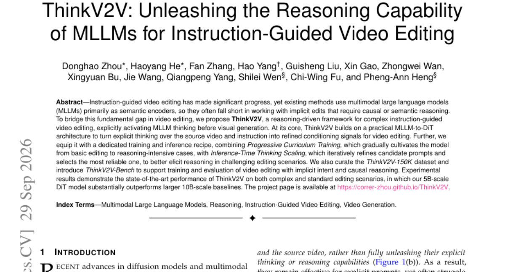

### 📌 한 줄 요약
MLLM의 추론 능력을 활용하여 복잡하고 암시적인 지시사항까지 수행하는 고성능 비디오 편집 프레임워크 제안

### 🔑 핵심 포인트
- MLLM의 사고 과정을 시각적 생성의 조건 신호로 변환하는 MLLM-to-DiT 아키텍처 설계
- 점진적 커리큘럼 학습(Progressive Curriculum Training)과 추론 시간 스케일링(Inference-Time Thinking Scaling) 도입
- 암시적 의도 및 인과 추론 평가를 위한 ThinkV2V-150K 데이터셋 및 벤치마크 구축

### 🧑‍💻 개발자 관점
단순한 키워드 매칭을 넘어 사용자의 복잡한 의도를 이해해야 하는 차세대 비디오 생성/편집 에이전트 개발에 중요한 방법론을 제시합니다.

### 🚀 실무 적용 아이디어
- 제시된 MLLM-to-DiT 구조를 기존 비디오 생성 모델에 이식하여 성능 변화 확인
- Inference-Time Thinking Scaling 기법을 적용하여 추론 비용 대비 품질 향상 폭 측정
- ThinkV2V-Bench를 활용하여 현재 보유한 모델의 추론 기반 편집 능력 벤치마킹

### ⚠️ 리스크/한계
- 추론 시간 스케일링 적용 시 생성 단계에서의 연산 비용 및 지연 시간 증가 가능성
- 복잡한 추론 과정이 포함됨에 따라 발생할 수 있는 환각(Hallucination) 현상

### 📝 초록 기반 상세 설명
기존의 지시 기반 비디오 편집 방식은 MLLM을 단순한 의미 인코더로만 사용하여 인과 관계나 암시적 의도가 포함된 복잡한 편집 작업에 한계가 있었습니다. 이를 해결하기 위해 본 논문은 MLLM의 사고 과정을 시각적 생성 전 단계에 명시적으로 활성화하는 ThinkV2V 프레임워크를 제안합니다. MLLM-to-DiT 구조를 통해 사고 과정을 정교한 편집 조건 신호로 변환하며, 점진적 커리큘럼 학습과 추론 시간 스케일링 기법을 도입했습니다. 또한 학습 및 평가를 위한 ThinkV2V-150K 데이터셋과 ThinkV2V-Bench를 구축했습니다. 실험 결과, 5B 규모의 모델이 더 큰 10B 규모의 베이스라인을 능가하며 복잡한 편집 시나리오에서 SOTA 성능을 달명했습니다.

---

## 26. [LoopVL: Recurrent Visual Intelligence](https://huggingface.co/papers/2609.38426)
**Upvotes**: 18 | **도입 난이도**: 상 | **신뢰도**: 상
**arXiv**: https://arxiv.org/abs/2609.38426

**태그**: Multimodal, Recurrent, Vision-Language, Efficient-AI, Reasoning, Vision, Benchmark

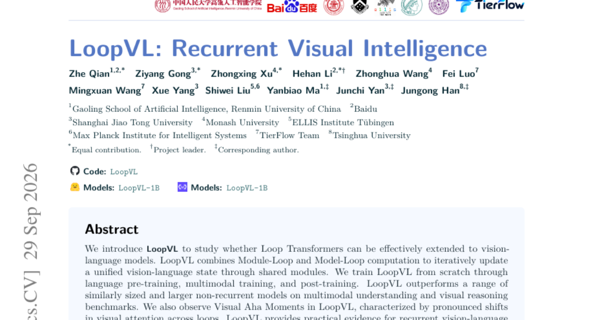

### 📌 한 줄 요약
재귀적 루프 구조를 통해 시각-언어 상태를 반복 업데이트하여 추론 능력을 극대화한 멀티모달 모델 연구

### 🔑 핵심 포인트
- Module-Loop와 Model-Loop를 결합한 재귀적 시각-언어 상태 업데이트 구조 제안
- 공유 파라미터를 활용하여 깊은 멀티모달 연산과 효율적인 추론 수행
- 반복적 루프를 통한 시각적 주의 집중 및 추론 능력 향상(Visual Aha Moments) 확인

### 🧑‍💻 개발자 관점
모델 크기를 무작정 키우는 대신, 재귀적 구조를 통해 연산 효율성을 유지하면서도 더 깊은 추론 능력을 확보할 수 있는 가능성을 제시합니다.

### 🚀 실무 적용 아이디어
- Loop 구조 적용 시 루프 횟수에 따른 추론 성능 및 연산 비용의 트레이드오프 분석
- 동일 파라미터 규모의 Transformer 기반 모델과 추론 속도 및 정확도 비교 실험
- 시각적 주의(Attention) 변화가 실제 추론 단계와 어떻게 일치하는지 시각화 실험

### ⚠️ 리스크/한계
- 재귀적 루프 구조로 인한 추론 시 연산 시간(Latency) 증가 가능성
- 학습 안정성 확보 및 루프 반복에 따른 그래디언트 소실/폭주 문제

### 📝 초록 기반 상세 설명
기존의 비재귀적 모델들은 복잡한 시각적 추론과 언어적 맥락을 통합하는 데 한계가 있었습니다. 본 논문은 Loop Transformer 구조를 시각-언어 모델로 확장하는 LoopVL을 제안합니다. Module-Loop와 Model-Loop 연산을 결합하여 공유 모듈을 통해 통합된 시각-언어 상태를 반복적으로 업데이트하는 방식을 사용합니다. 언어 사전 학습, 멀티모달 학습, 사후 학습 과정을 거쳐 처음부터 학습되었습니다. 실험 결과, LoopVL은 유사한 크기 및 더 큰 비재귀적 모델들보다 멀티모달 이해 및 시각적 추론 벤치마크에서 우수한 성능을 보였습니다. 또한 루프가 진행됨에 따라 시각적 주의(attention)가 급격히 변화하는 'Visual Aha Moments' 현상을 관찰했습니다.

---

## 27. [OSWorld-Science: A Benchmark of Computer Use Agents for Learning and Using Scientific Software](https://huggingface.co/papers/2609.39903)
**Upvotes**: 16 | **도입 난이도**: 상 | **신뢰도**: 상
**arXiv**: https://arxiv.org/abs/2609.39903

**태그**: AI Agent, VLM, Scientific Computing, Benchmark, Agent, Reasoning, Vision, Evaluation

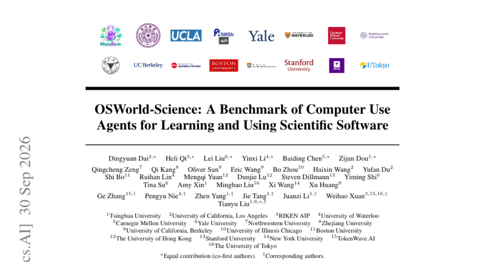

### 📌 한 줄 요약
과학적 소프트웨어 활용 능력을 평가하기 위해 전문 워크플로우와 검증 가능한 결과물을 결합한 에이전트 벤치마크 OSWorld-Science를 제안합니다.

### 🔑 핵심 포인트
- 과학적 도메인 특화 워크플로우(분자 설계, 통계, 시뮬레이션 등)를 포함한 146개 태스크 벤치마크 구축
- 생성된 결과물(구조, 마스크, 플롯 등)을 직접 검증하는 실행 기반의 정밀 평가 방식 도입
- 모델 어댑터, 상호작용 루프 제어, 궤적 로깅을 통합한 효율적인 에이전트 하네스 개발

### 🧑‍💻 개발자 관점
전문 소프트웨어를 사용하는 에이전트 개발 시, 단순 텍스트 응답을 넘어 실제 소프트웨어 상태와 결과물을 검증하는 데 데 필요한 프레임워크 설계 방식을 배울 수 있습니다.

### 🚀 실무 적용 아이디어
- 제시된 146개 태스크 중 특정 도메인(예: 통계 컴퓨팅)에 대한 모델 성능 비교 실험
- 에이전트의 상호작용 전략(Interaction Strategy) 변화에 따른 성공률 변화 분석
- 부분 점수(Partial Credit) 시스템이 모델의 학습/평가에 미치는 영향 검토

### ⚠️ 리스크/한계
- 전문적인 과학적 도메인에 특화되어 있어 일반적인 범용 에이전트 성능과는 차이가 있을 수 있음
- 태스크의 복잡도로 인해 평가 및 실행 환경 구축에 높은 컴퓨팅 자원이 필요할 수 있음

### 📝 초록 기반 상세 설명
기존의 시각 언어 모델(VLM) 기반 에이전트는 복잡한 과학적 인터페이스와 전문적인 워크플로우를 처리하는 데 한계가 있습니다. 이를 해결하기 위해 과학적 가치와 난이도를 고려하여 설계된 벤치마크인 OSWorld-Science를 도입합니다. 이 벤치마크는 분자 구조 설계, 병리 이미지 분석 등 다양한 도메인의 146개 고품질 태스크와 실행 기반의 검증 시스템을 포함합니다. 실험 결과, 최신 VLM 모델들도 전문적인 과학적 워크플로우를 완수하는 데 여전히 많은 어려움을 겪는 것으로 나타났습니다. 본 연구는 에이전트의 역량과 하네스 설계를 체계적으로 평가할 수 있는 통합 프레임워크를 제공합니다.

---

## 28. [PivotOPD: Learning to Recover from Pivotal Mistakes in Multi-Turn Agents](https://huggingface.co/papers/2609.40285)
**Upvotes**: 13 | **도입 난이도**: 중 | **신뢰도**: 상
**arXiv**: https://arxiv.org/abs/2609.40285

**태그**: Agent, Reinforcement Learning, Knowledge Distillation, Multi-turn Interaction, RAG, Vision, Distillation

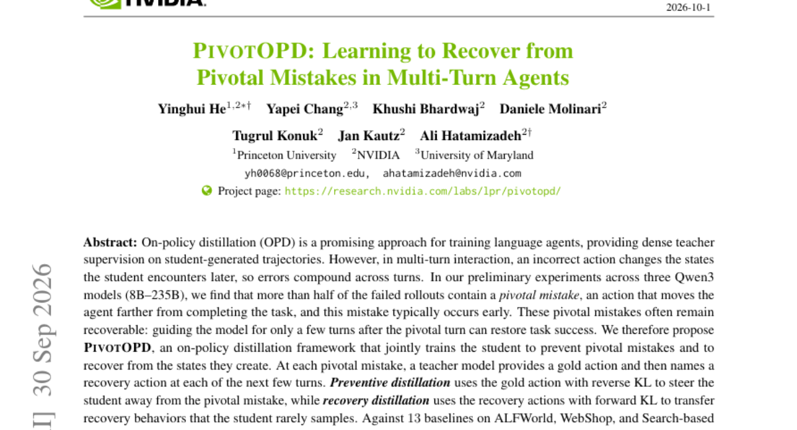

### 📌 한 줄 요약
멀티턴 에이전트의 치명적 실수를 방지하고, 실수 발생 시 다시 성공 궤도로 복구하는 능력을 학습시키는 온폴리시 증류 프레임워크

### 🔑 핵심 포인트
- 실수 발생 시 상태가 변하는 멀티턴 환경의 누적 오류 문제 정의
- 실수를 방지하는 Gold Action(Reverse KL)과 복구 행동을 학습하는 Recovery Action(Forward KL)의 이중 구조
- 초기 실수를 방지함과 동시에 실수 후 상태에서도 성공 궤도로 돌아오는 복구 능력 확보

### 🧑‍💻 개발자 관점
에이전트가 한 번의 실수로 전체 태스크를 망치는 것을 방지하고, 오류 발생 시 스스로 복구할 수 있는 강건한(robust) 시스템을 구축하는 데 유용합니다.

### 🚀 실무 적용 아이디어
- 에이전트 실패 로그에서 '결정적 실수'와 '복구 가능성'의 상관관계 분석
- On-policy 데이터셋에 복구 시나리오(Recovery trajectories)를 포함하여 학습 실험
- KL-divergence를 활용한 방지(Preventive) vs 복구(Recovery) 손실 함수 비중 조절

### ⚠️ 리스크/한계
- 초기 단계의 실수가 복구 불가능한 상태로 이어질 경우의 처리 전략 부족
- 교사 모델(Teacher)의 가이드 의존도가 높을 경우 학생 모델의 성능 한계 발생 가능성

### 📝 초록 기반 상세 설명
멀티턴 에이전트 학습 시 발생하는 오류는 다음 상태에 영향을 주어 에러가 누적되는 문제를 야기합니다. 연구진은 실패 사례의 절반 이상이 초기에 발생하는 '결정적 실수(pivotal mistake)'에서 비롯되지만, 이는 몇 번의 가이드만으로 복구 가능하다는 점을 발견했습니다. 이를 해결하기 위해 PivotOPD는 실수를 방지하는 '예방적 증류'와 실수 이후 상태에서 복구하는 '복구형 증류'를 결합한 프레임워크를 제안합니다. 실험 결과, ALFWorld, WebShop 등 다양한 벤치마크에서 기존 베이스라인 대비 우수한 성능 향상을 달성했습니다. 특히 모델 크기가 작은 학생 모델에서도 강력한 성능 개선과 도메인 전이 효과를 입증했습니다.

---

## 29. [Scaling Laws for Looped Mixture of Experts](https://huggingface.co/papers/2609.40316)
**Upvotes**: 11 | **도입 난이도**: 중 | **신뢰도**: 상
**arXiv**: https://arxiv.org/abs/2609.40316

**태그**: LLM, MoE, Scaling Laws, Efficiency, Reasoning, Benchmark, Evaluation

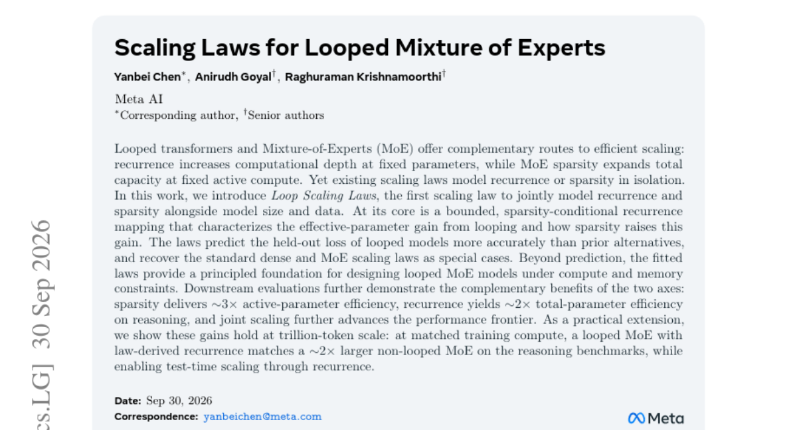

### 📌 한 줄 요약
재귀(Recurrence)와 희소성(Sparsity)을 결합하여 모델 크기 및 데이터 대비 효율을 극대화하는 새로운 스케일링 법칙 제안

### 🔑 핵심 포인트
- 재귀(Recurrence)와 희소성(Sparsity)을 결합한 최초의 통합 스케일링 법칙 제안
- 루핑을 통한 유효 파라미터 증가량과 희소성 간의 상관관계를 수학적으로 모델링
- 동일 연산량 대비 더 큰 모델 성능을 내는 효율적인 모델 설계 가이드라인 제공

### 🧑‍💻 개발자 관점
제한된 컴퓨팅 자원과 메모리 환경에서 모델의 깊이(재귀)와 너비(MoE)를 최적으로 조합하여 성능을 극대화하는 설계 전략을 제공합니다.

### 🚀 실무 적용 아이디어
- 기존 MoE 모델에 재귀적 루프 구조를 적용하여 추론 성능 변화 관찰
- 학습된 스케일링 법칙을 바탕으로 주어진 compute budget 내 최적의 루프 횟수 산출 실험
- 테스트 타임(Test-time) 스케일링을 위한 재귀적 추론 기법 적용 테스트

### ⚠️ 리스크/한계
- 재귀적 구조 도입 시 발생할 수 있는 학습 안정성 및 그래디언트 소실 문제
- 테스트 타임에 재귀를 사용할 경우 발생하는 추론 지연 시간(Latency) 증가

### 📝 초록 기반 상세 설명
기존의 스케일링 법칙은 재귀적 구조와 MoE의 희소성을 개별적으로만 다루어 두 방식의 시너지를 충분히 활용하지 못했습니다. 본 논문은 모델 크기, 데이터, 재귀, 희소성을 동시에 모델링하는 'Loop Scaling Laws'를 도입합니다. 제안된 법칙은 희소성 조건부 재귀 매핑을 통해 루핑을 통한 유효 파라미터 이득을 정교하게 예측합니다. 실험 결과, 제안된 법칙은 기존 밀집(Dense) 및 MoE 스케일링 법칙을 포함하며 더 정확한 손실 예측을 가능하게 합니다. 또한, 재귀와 희소성을 결합했을 때 추론 성능과 파라미터 효율성이 상호 보완적으로 향상됨을 입증했습니다.

---

## 30. [BiasReducer: Adaptive Bias Mitigation for Reward Models](https://huggingface.co/papers/2609.32720)
**Upvotes**: 10 | **도입 난이도**: 하 | **신뢰도**: 상
**arXiv**: https://arxiv.org/abs/2609.32720

**태그**: LLM, RLHF, Reward Model, Bias Mitigation, RAG, Benchmark

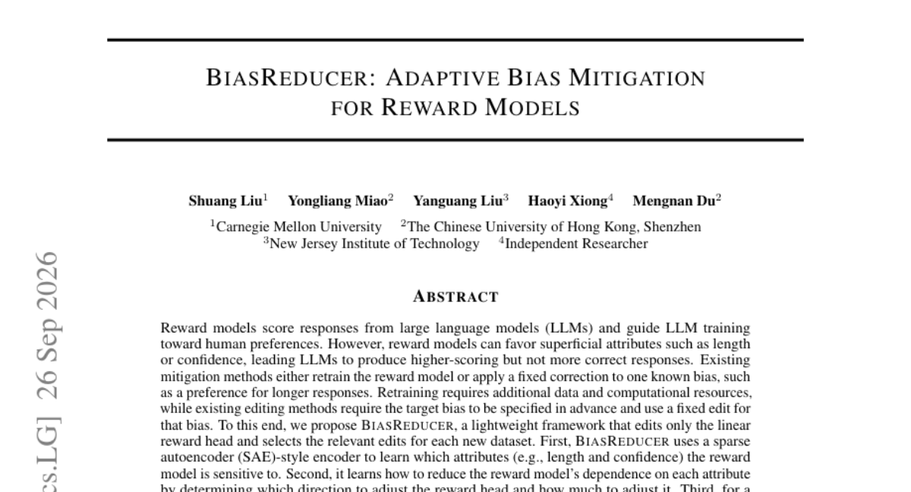

### 📌 한 줄 요약
데이터 재학습 없이 보상 모델의 선형 헤드만 수정하여 답변 길이 및 확신도 편향을 제거하는 경량 프레임워크

### 🔑 핵심 포인트
- SAE 기반 인코더를 통한 보상 모델의 속성 민감도 학습
- 모델 전체 재학습 없이 선형 보상 헤드만 수정하는 경량 편집 방식
- 데이터셋별로 영향력이 큰 편향을 자동으로 식별하고 선택적 편집 수행

### 🧑‍💻 개발자 관점
RLHF 과정에서 발생하는 모델의 과도한 장황함이나 아첨 문제를 모델 전체를 다시 학습하지 않고도 효율적으로 제어할 수 있습니다.

### 🚀 실무 적용 아이디어
- 기존 보상 모델의 헤드 파라미터에 BiasReducer 로직 적용 테스트
- 길이(length)와 품질(quality) 사이의 상관관계 변화 측정
- 다양한 데이터셋에 대한 편향 제거 성능 전이(transfer) 확인

### ⚠️ 리스크/한계
- 선형 헤드 수정만으로는 복잡한 비선형적 편향을 해결하기 어려울 수 있음
- 특정 속성을 제거할 때 의도치 않게 모델의 원래 성능이 저하될 위험 존재

### 📝 초록 기반 상세 설명
LLM 학습을 가이드하는 보상 모델(Reward Model)은 답변의 길이와 같은 표면적인 속성에 과도하게 점수를 주는 편향 문제를 가집니다. 기존 방식은 모델 전체를 재학습하거나 특정 편향을 미리 지정해야 하는 비용과 제약이 있었습니다. 본 논문은 Sparse Autoencoder(SAE) 스타일의 인코더를 사용하여 보상 모델이 민감하게 반응하는 속성을 학습하는 BiasReducer를 제안합니다. 이 프레임워크는 보상 헤드의 조정 방향과 강도를 결정하여 데이터셋에 맞는 최적의 편집을 수행합니다. 실험 결과, BiasReducer는 모델 재학습 없이도 편향에 대한 강건성을 높였으며, 답변의 불필요한 장황함과 아첨(sycophancy)을 줄이는 성과를 보였습니다.

### 🖼️ 추가 자료
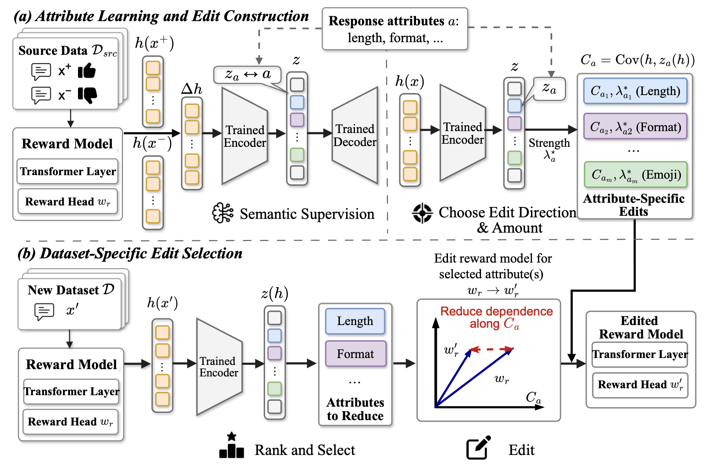

---

## 31. [CUA-SWE: When Computer-Use Agents Meet Visual Software Engineering](https://huggingface.co/papers/2609.32600)
**Upvotes**: 10 | **도입 난이도**: 중 | **신뢰도**: 상
**arXiv**: https://arxiv.org/abs/2609.32600

**태그**: AI Agent, Software Engineering, Computer-Use, Vision-Language, Benchmark, Agent, Evaluation

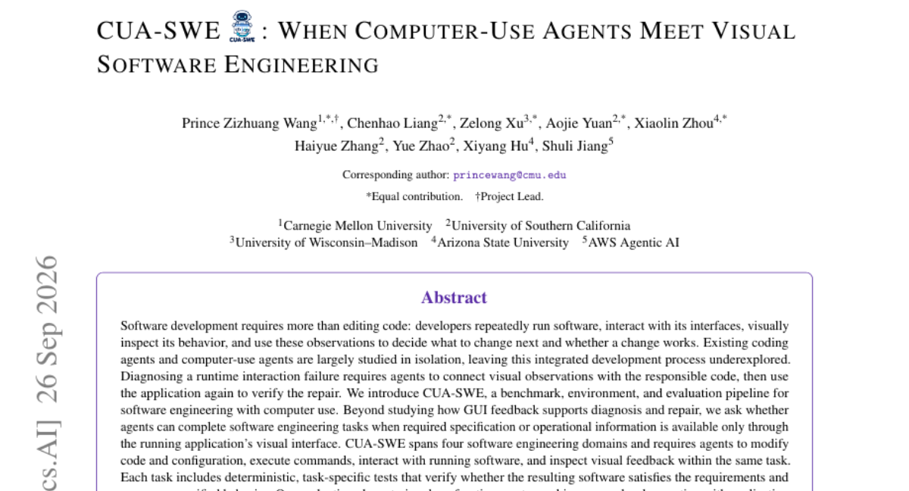

### 📌 한 줄 요약
코드 수정과 GUI 상호작용을 결합하여 소프트웨어의 동작을 검증하고 수리하는 통합 에이전트 벤치마크 제안

### 🔑 핵심 포인트
- 코드 수정과 GUI 상호작용을 결합한 통합 소프트웨어 엔지니어링 벤치마크(CUA-SWE) 개발
- 시각적 피드백을 통한 오류 진단 및 수정 후 검증 능력을 평가하는 환경 구축
- 4개 도메인에 걸친 다양한 작업과 결정론적 테스트를 통한 실행 가능한 정답 검증

### 🧑‍💻 개발자 관점
단순히 코드만 짜는 에이전트를 넘어, 실제 사용자가 소프트웨어를 조작하며 버그를 잡는 것과 같은 'End-to-End' 자동화 개발 환경을 구축하는 데 중요한 지표를 제공합니다.

### 🚀 실무 적용 아이디어
- CUA-SWE 벤치마크를 활용하여 현재 사용 중인 LLM 에이전트의 시각적 디버깅 능력 테스트
- GUI 피드백이 코드 수정 결정에 미치는 영향력을 정량적으로 분석
- 멀티모달 모델(Vision-Language)을 활용한 자동화된 QA 에이전트 워크플로우 설계

### ⚠️ 리스크/한계
- 시각적 정보 의존도가 높을 경우 에이전트의 추론 비용 및 복잡도가 급증할 수 있음
- GUI 환경의 변화가 벤치마크의 일관성이나 재현성에 영향을 줄 가능성

### 📝 초록 기반 상세 설명
기존의 코딩 에이전트와 컴퓨터 사용 에이전트는 서로 분리되어 연구되어 왔으며, 실제 개발 과정처럼 시각적 관찰과 코드 수정을 결합하는 통합적 프로세스 연구는 부족했습니다. 런타임 오류를 해결하려면 에이전트가 시각적 피드백과 코드를 연결하고, 수정 후 다시 애플리케이션을 실행하여 검증하는 능력이 필수적입니다. 본 논문은 CUA-SWE라는 새로운 벤치마크, 환경 및 평가 파이프라인을 소개합니다. 이 벤치마크는 코드/설정 수정, 명령 실행, GUI 상호작용을 동시에 수행하며 시각적 인터페이스를 통해 사양을 파악해야 하는 과제를 포함합니다. 실험을 통해 최첨단 에이전트들이 시각적 피드백과 소스 코드 실행을 어떻게 결합하여 소프트웨어를 수정하고 검증하는지 분석했습니다.

### 🖼️ 추가 자료
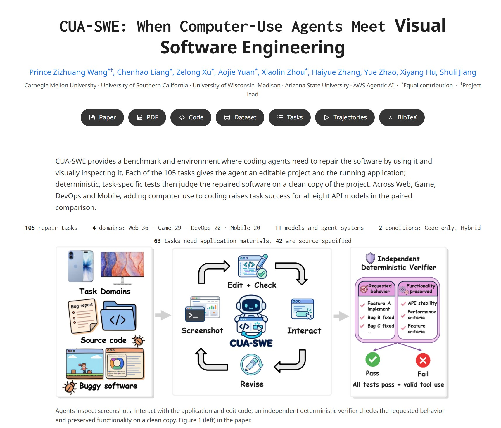

---

## 32. [Synthetic Pre-pretraining Survives Scale, but Not as a Grammatical Prior](https://huggingface.co/papers/2609.39827)
**Upvotes**: 9 | **도입 난이도**: 하 | **신뢰도**: 상
**arXiv**: https://arxiv.org/abs/2609.39827

**태그**: LLM, Pre-training, Synthetic Data, Efficiency, RAG, Evaluation

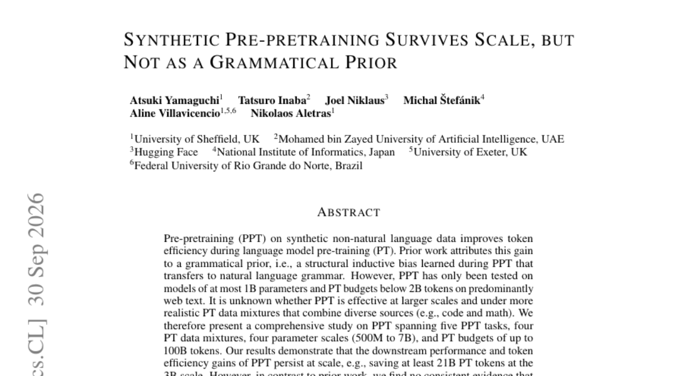

### 📌 한 줄 요약
합성 데이터 기반 사전 학습(PPT)은 대규모 모델에서도 효율적이지만, 문법 학습이 아닌 장거리 검색 능력 향상을 통해 성능을 개선한다.

### 🔑 핵심 포인트
- PPT는 대규모 모델(최대 7B) 및 대량의 PT 데이터 환경에서도 토큰 효율성을 유지함
- PPT의 성능 향상은 문법적 사전 지식(Grammatical Prior)이 아닌 장거리 검색 능력 향상에서 기인함
- PPT는 웹 텍스트가 포함된 다양한 데이터 혼합 환경에서도 강건하게 작동함

### 🧑‍💻 개발자 관점
모델 학습 비용을 절감하기 위해 합성 데이터를 사용할 때, 문법적 완성도보다 정보 추출 및 검색 능력을 강화하는 방향으로 태스크를 설계하는 것이 실무적으로 유리합니다.

### 🚀 실무 적용 아이디어
- 문법 중심의 합성 데이터 대신 정보 검색/추출 중심의 합성 데이터로 사전 학습 진행
- 모델 규모를 키우면서 PPT의 토큰 절감 효과가 유지되는지 벤치마크 수행
- 다양한 도메인(코드, 수학 등)이 섞인 데이터셋에서 PPT의 강건성 테스트

### ⚠️ 리스크/한계
- 웹 텍스트가 완전히 배제된 데이터셋에서는 PPT의 효과가 감소할 수 있음
- 문법적 정교함이 모델의 최종 성능과 반드시 일치하지 않으므로 설계 방향 설정에 주의 필요

### 📝 초록 기반 상세 설명
기존 연구는 합성 데이터를 활용한 사전 학습(PPT)이 문법적 구조를 학습하여 본 학습(PT)의 효율을 높인다고 주장해 왔습니다. 그러나 기존 연구는 모델 규모와 데이터 혼합 방식이 제한적이라는 한계가 있었습니다. 본 연구는 500M에서 7B 규모의 모델과 최대 100B 토큰의 예산에 걸쳐 PPT의 효과를 검증했습니다. 실험 결과, PPT를 통한 토큰 효율성 향상은 대규모 모델에서도 유지되지만, 이것이 문법적 사전 지식 때문은 아님이 밝혀졌습니다. 대신 PPT는 장거리 검색(long-range retrieval) 능력을 개선함으로써 성능 이득을 제공합니다. 결론적으로 PPT는 저비용으로 성능을 높일 수 있는 유효한 방법이며, 향후 설계는 문법이 아닌 검색 능력에 초점을 맞춰야 합니다.

---

## 33. [I Have a Stream: Making Self-Supervised Learning Work on Continuous Video](https://huggingface.co/papers/2609.40333)
**Upvotes**: 9 | **도입 난이도**: 중 | **신뢰도**: 상
**arXiv**: https://arxiv.org/abs/2609.40333

**태그**: Computer Vision, Self-Supervised Learning, Video Processing, MAE, Vision, Video, Evaluation, Distillation

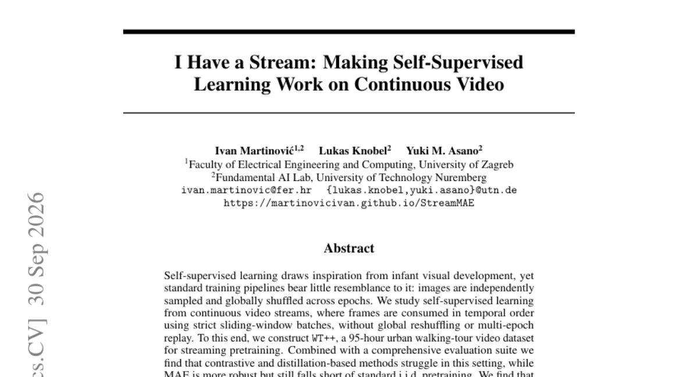

### 📌 한 줄 요약
연속적인 비디오 스트림 환경에서 데이터 중복 문제를 해결하여 효율적인 자기주도 학습을 가능하게 하는 StreamMAE 제안

### 🔑 핵심 포인트
- 연속적 비디오 스트림 환경에서의 자기주도 학습(SSL) 특성 분석 및 WT++ 데이터셋 구축
- 배치 내 프레임 간 높은 유사성(Intra-batch similarity)이 스트리밍 학습의 핵심 난제임을 규명
- StreamMAE: 모션 편향 크롭 및 스트림 인식 정규화를 통한 MAE 기반의 효율적 학습 프레임워크

### 🧑‍💻 개발자 관점
실시간 CCTV나 로봇 시각 시스템처럼 데이터가 끊임없이 유입되는 환경에서, 데이터를 섞지 않고도 효율적으로 모델을 학습시킬 수 있는 방법론을 제시합니다.

### 🚀 실무 적용 아이디어
- 연속적인 프레임 데이터셋을 활용하여 기존 MAE와 StreamMAE의 성능 차이 비교 실험
- 데이터 중복도가 높은 환경에서 모션 기반 크롭 전략의 효과 검증
- 스트리밍 학습 시 배치 크기와 프레임 간 시간 간격(stride) 변화에 따른 성능 변화 측정

### ⚠️ 리스크/한계
- 정적인 이미지 위주의 데이터셋에서는 스트리밍 방식의 이점이 크지 않을 수 있음
- 모션 편향 크롭 방식이 특정 움직임이 없는 환경에서는 과적합을 유발할 가능성

### 📝 초록 기반 상세 설명
기존의 자기주도 학습은 이미지를 무작위로 정렬하여 학습하는 i.i.d. 방식을 따르지만, 실제 비디오 스트림은 시간 순서대로 연속적인 프레임이 유입되는 특성을 가집니다. 연구진은 이러한 스트리밍 환경에서 기존의 대조 학습(Contrastive)이나 증류(Distillation) 방식이 성능 저하를 겪는 문제를 분석했습니다. 분석 결과, 배치 간 유사성보다 배치 내 프레임들이 거의 동일한 중복 데이터인 '높은 배치 내 유사성'이 학습의 주요 장애물임을 밝혀냈습니다. 이를 해결하기 위해 MAE 구조를 기반으로 스트림 인식 정규화와 모션 편향 크롭 방식을 결합한 StreamMAE를 제안합니다. 실험 결과, StreamMAE는 스트리밍 환경에서 기존 방식보다 우수한 성능을 보였으며, 동일 데이터로 학습된 i.i.d. 방식의 성능에 근접하는 성과를 거두었습니다.

---

## 34. [Physis-Lang: Self-Evolving Language as a Physical Representation for Video World Model](https://huggingface.co/papers/2609.40358)
**Upvotes**: 9 | **도입 난이도**: 중 | **신뢰도**: 상
**arXiv**: https://arxiv.org/abs/2609.40358

**태그**: Video Generation, Physical Modeling, Agentic Loop, Data Curation, Agent, RAG, Video, Benchmark, Evaluation

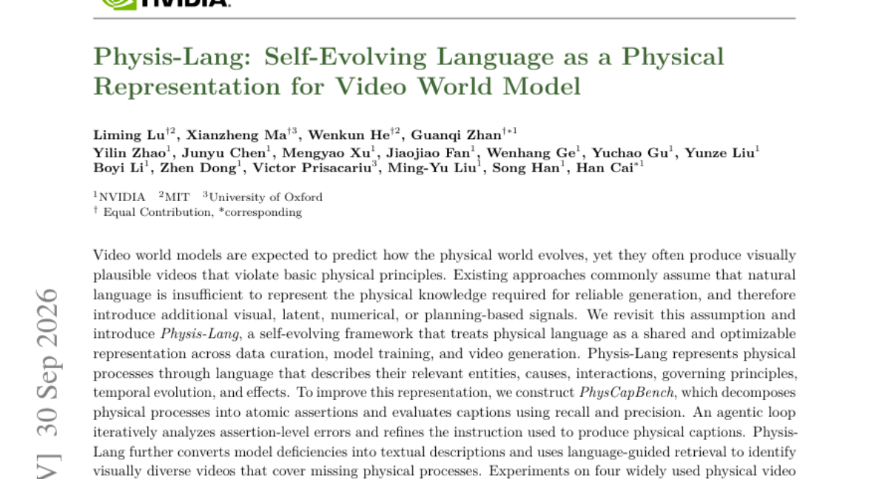

### 📌 한 줄 요약
언어를 물리적 법칙의 표현 수단으로 활용하여 비디오 생성 모델의 물리적 정밀도를 높이는 자기 진화형 프레임워크

### 🔑 핵심 포인트
- 언어를 물리적 엔티티, 인과관계, 상호작용 등을 기술하는 최적화 가능한 표현 수단으로 재정의
- 물리적 과정을 원자적 명제로 분해하여 평가하는 PhysCapBench 및 에이전트 기반 자기 진화 루프 도입
- 언어 가이드 기반 검색을 통해 부족한 물리적 과정을 보완하는 데이터 큐레이션 전략

### 🧑‍💻 개발자 관점
비디오 생성 모델 개발 시 별도의 물리 엔진 없이도 정교한 텍스트 캡셔닝과 데이터 루프만으로 물리적 정밀도를 높일 수 있는 방법론을 제시합니다.

### 🚀 실무 적용 아이디어
- 기존 비디오 생성 모델의 캡션 데이터셋을 물리적 인과관계 중심으로 재구성해보기
- 에이전트 루프를 활용한 텍스트-비디오 피드백 루프 설계 실험
- 물리적 속성(중력, 충돌 등)을 명시적으로 포함하는 데이터 증강 기법 적용

### ⚠️ 리스크/한계
- 언어적 표현만으로 복잡한 3D 물리 법칙을 완벽히 대체할 수 있는지에 대한 의문
- 고품질의 물리적 캡션 생성을 위한 에이전트 루프 운영 비용 발생

### 📝 초록 기반 상세 설명
기존 비디오 월드 모델은 시각적으로는 그럴듯하지만 물리 법칙을 위반하는 영상을 생성하는 문제가 있었습니다. 기존 방식은 언어만으로는 물리 지식을 충분히 담을 수 없다고 가정하고 별도의 시각적/수치적 신호를 추가해 왔습니다. 본 논문은 언어를 물리적 표현의 핵심 매개체로 삼는 Physis-Lang 프레임워크를 제안합니다. PhysCapBench를 통해 물리적 과정을 원자적 명제로 분해하고, 에이전트 루프를 통해 캡션과 모델의 결함을 반복적으로 수정하며 학습합니다. 실험 결과, 오픈소스 백본을 활용했음에도 불구하고 독보적인 성능의 Veo 3.1 모델을 능가하는 물리적 타당성을 입증했습니다.

---

## 35. [DuoOPD: Learning from Joint Teacher-Student Outcomes for Multi-Task On-Policy Distillation](https://huggingface.co/papers/2609.33711)
**Upvotes**: 9 | **도입 난이도**: 중 | **신뢰도**: 상
**arXiv**: https://arxiv.org/abs/2609.33711

**태그**: LLM, Knowledge Distillation, On-Policy Learning, Multi-Task Learning, RAG, Distillation

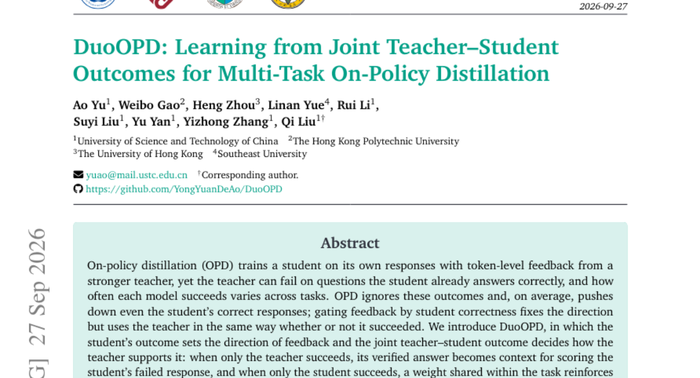

### 📌 한 줄 요약
학생 모델의 정답 여부에 따라 교사 모델의 피드백 방식을 동적으로 조절하여 멀티태스크 성능을 극대화하는 온폴리시 증류 기법

### 🔑 핵심 포인트
- 학생의 정답 여부를 기준으로 피드백 방향을 설정하는 동적 가이딩 메커니즘 도입
- 교사-학생의 공동 결과(Joint Outcome)에 따른 4가지 시나리오 통합 규칙 설계
- 멀티태스크 환경에서 태스크별 성공률 차이를 극복하는 범용적 피드백 전략

### 🧑‍💻 개발자 관점
모델 크기가 작은 학생 모델을 특정 도메인이나 태스크에 맞춰 효율적으로 미세 조정(Fine-tuning)할 때, 교사 모델의 간섭을 최소화하며 성능을 끌어올릴 수 있습니다.

### 🚀 실무 적용 아이디어
- 기존 OPD 프레임워크에 학생의 정답 여부를 판별하는 Gating 로직 구현
- 교사 모델의 정답이 학생의 오답을 교정하는 컨텍스트로 사용되는지 검증
- 다양한 난이도의 태스크 믹스 환경에서 성능 안정성 테스트

### ⚠️ 리스크/한계
- 학생 모델의 정답 여부를 판단하는 검증 로직(Verifier)의 정확도에 의존적임
- 학생이 틀린 문제를 맞다고 판단할 경우 잘못된 강화가 일어날 위험이 있음

### 📝 초록 기반 상세 설명
기존의 온폴리시 증류(OPD)는 학생 모델이 이미 정답을 맞힌 경우에도 교사 모델의 답변을 강제로 따르게 하여 성능을 저하시시키는 문제가 있었습니다. 또한 태스크마다 모델의 성공 확률이 다름에도 불구하고 일률적인 피드백 방식을 적용하는 한계가 있었습니다. 본 논문은 DuoOPD를 제안하여 학생의 정답 여부를 피드백 방향의 기준으로 삼고, 교사와 학생의 공동 결과에 따라 피드백 방식을 결정합니다. 교사만 성공했을 때는 정답을 컨텍스트로 활용하고, 학생만 성공했을 때는 가중치를 공유하여 정답을 강화하는 방식입니다. 실험 결과, DuoOPD는 Qwen과 Llama 모델군에서 기존 OPD 대비 유의미한 성능 향상을 보였으며 다양한 태스크 혼합 환경에서도 우수한 성능을 입증했습니다.

---

## 36. [MILO: Automated Harness Discovery via Orchestrated Multi-Agent Evolution](https://huggingface.co/papers/2609.38349)
**Upvotes**: 8 | **도입 난이도**: 상 | **신뢰도**: 상
**arXiv**: https://arxiv.org/abs/2609.38349

**태그**: Agent, AutoML, Evolutionary Algorithm, Optimization, Vision

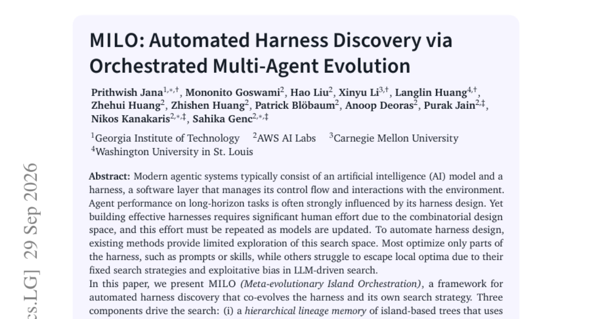

### 📌 한 줄 요약
에이전트 실행 환경(Harness) 설계를 자동화하여 모델 성능을 극대화하는 멀티 에이전트 진화 프레임워크

### 🔑 핵심 포인트
- 하네스 설계와 탐색 전략을 동시에 최적화하는 메타 진화(Meta-evolutionary) 프레임워크 제안
- 계층적 계보 메모리와 섬 기반 구조를 활용하여 거대한 탐색 공간에서 효율적인 진화 수행
- 기존 방식 대비 적은 토큰 사용량으로도 더 높은 성능의 에이전트 환경 구축 가능

### 🧑‍💻 개발자 관점
에이전트 시스템 구축 시 수동으로 환경을 설계하는 대신, 모델 성능을 최대로 끌어올릴 수 있는 최적의 실행 환경을 자동 생성할 수 있습니다.

### 🚀 실무 적용 아이디어
- 특정 도메인(예: 코딩, 수학) 전용 에이전트 환경 구축 시 MILO 프레임워크 적용 검토
- 기존 수동 프롬프트/환경 설정과 MILO 자동 생성 결과 간의 성능 차이 비교 실험
- 사용 중인 모델(LLM)의 특성에 따른 하네스 최적화 효율성 측정

### ⚠️ 리스크/한계
- 복잡한 멀티 에이전트 구조로 인해 시스템 구축 및 유지 비용이 높을 수 있음
- 탐색 과정에서의 토큰 소모량과 계산 자원 효율성에 대한 추가 검증 필요

### 📝 초록 기반 상세 설명
현대적 에이전트 시스템은 모델과 실행 환경(Harness)의 결합으로 작동하지만, 복잡한 환경 설계는 막대한 수동 작업과 모델 변경 시 재작업을 요구합니다. 기존 자동화 방식은 프롬프트나 특정 스킬에만 국한되어 탐색 범위가 좁고 최적해를 찾기 어렵다는 한계가 있습니다. 이를 해결하기 위해 MILO는 에이전트 하네스와 이를 찾는 전략을 동시에 진화시키는 메타 진화 프레임워크를 제안합니다. MILO는 계층적 계보 메모리, 섬 기반(Island-based) 변이 에이전트, 그리고 탐색 전략을 조정하는 오케스트레이터를 결합하여 작동합니다. 실험 결과, MILO는 다양한 벤치마크에서 기존 SOTA 방식들을 압도하며 효율적인 하네스 설계를 입증했습니다.

### 🖼️ 추가 자료
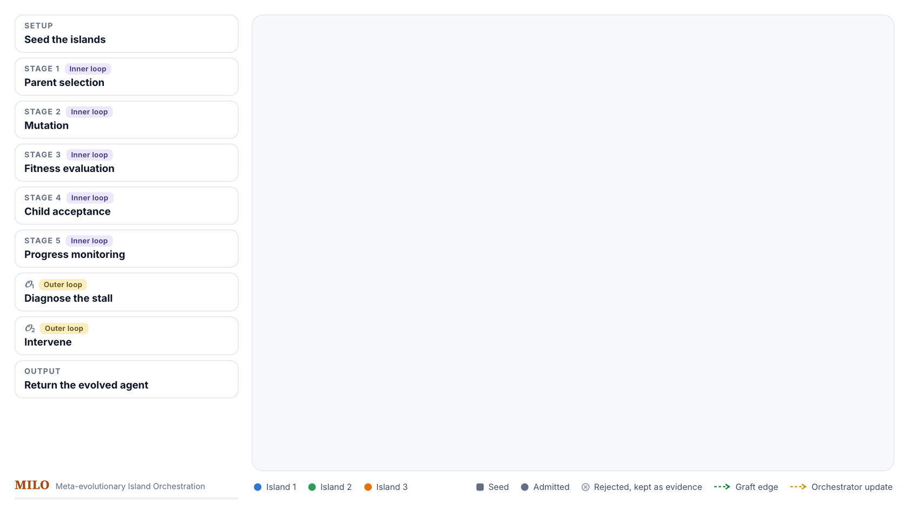

---

## 37. [Rubric Rewards from Item Response Theory](https://huggingface.co/papers/2609.35646)
**Upvotes**: 8 | **도입 난이도**: 중 | **신뢰도**: 상
**arXiv**: https://arxiv.org/abs/2609.35646

**태그**: Reinforcement Learning, LLM Evaluation, Reward Modeling, IRT

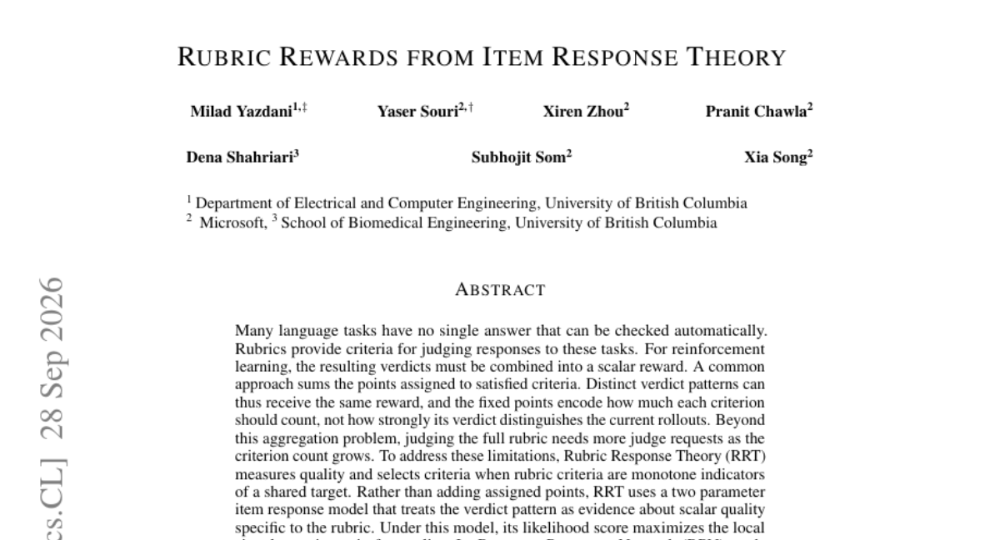

### 📌 한 줄 요약
문항 반응 이론(IRT)을 활용하여 다중 기준 루브릭 점수를 효율적인 스칼라 보상으로 변환하는 새로운 RL 학습 프레임워크

### 🔑 핵심 포인트
- IRT(문항 반응 이론) 기반의 2모수 모델을 사용하여 루브릭 점수를 스칼라 보상으로 변환
- RPN(Response Parameter Network)을 통한 기준별 난이도 및 변별력 예측 및 온라인 업데이트
- 평가 예산(Judge requests)을 절감하면서도 기존 GRPO 방식과 대등하거나 더 높은 성능 달성

### 🧑‍💻 개발자 관점
다중 기준(Multi-criteria) 평가가 필요한 RLHF/RL 과정에서 평가 비용을 줄이면서도 정교한 보상 설계를 가능하게 합니다.

### 🚀 실무 적용 아이디어
- 기존의 단순 합산 방식(Summation) 보상 체계와 RRT 방식의 성능 비교 실험
- 제한된 평가 예산(Budget) 환경에서 RRT의 효율성 검증
- 도메인 특화(의학, 과학 등) 루브릭 적용 시 RPN의 예측 정확도 테스트

### ⚠️ 리스크/한계
- 기준(Criterion)들이 단일 목표(Shared target)를 나타내는 단조 지표여야 한다는 전제 조건 필요
- 모델의 정책 변화에 따른 RPN 업데이트 안정성 확보 필요

### 📝 초록 기반 상세 설명
언어 모델의 복잡한 작업은 단일 정답이 없어 다중 기준 루브릭을 통한 평가가 필요하지만, 기존의 점수 합산 방식은 기준 간 가중치 차이를 반영하지 못하고 평가 비용이 높다는 문제가 있습니다. 이를 해결하기 위해 저자들은 Rubric Response Theory(RRT)를 제안합니다. RRT는 문항 반응 이론(IRT)의 2모수 모델을 적용하여 각 기준의 난이도와 변별력을 고려해 품질 점수를 산출합니다. 또한, RPN(Response Parameter Network)을 통해 프롬프트와 기준 텍스트를 읽어 파라미터를 예측하며, 온라인 EM 알고리즘으로 학습 과정 중 변화하는 정책에 맞춰 이를 업데이트합니다. 실험 결과, RRT는 GRPO 대비 높은 성능을 보였으며, 적은 평가 예산만으로도 경쟁력 있는 성능을 유지함을 입증했습니다.

---

## 38. [RoboCoach: World Models as Active Coaches for Compositional Robot Skills](https://huggingface.co/papers/2609.39685)
**Upvotes**: 8 | **도입 난이도**: 상 | **신뢰도**: 상
**arXiv**: https://arxiv.org/abs/2609.39685

**태그**: Robot Learning, World Models, Reinforcement Learning, Data-Efficient Learning, RAG, Vision

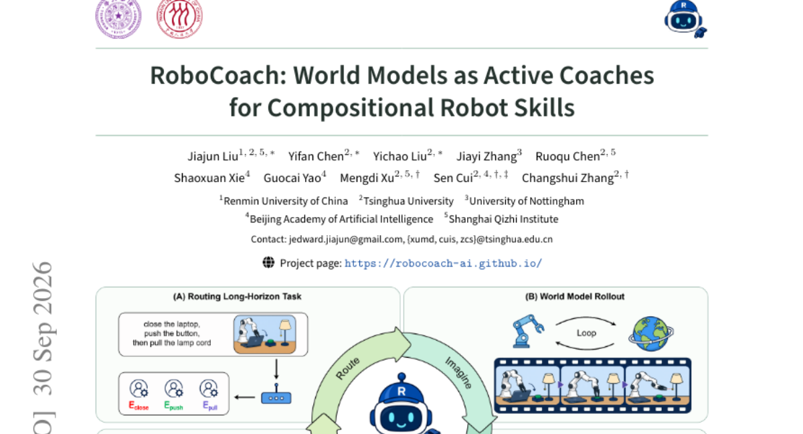

### 📌 한 줄 요약
월드 모델의 상상된 실패를 활용해 최소한의 데이터로 로봇의 복합 작업 성공률을 극대화하는 능동적 코칭 프레임워크

### 🔑 핵심 포인트
- RIDI(Route-Imagine-Diagnose-Improve) 루프를 통한 효율적인 데이터 수집 및 모델 업데이트 전략
- 공유 액션 조건부 월드 모델(COACHWORLD)을 활용한 상상된 실패 기반의 타겟팅된 감독
- 최소한의 데모 데이터로 복합 작업 성공률 및 미학습 작업에 대한 전이 성능 확보

### 🧑‍💻 개발자 관점
데이터 수집 비용이 큰 로봇 제어 분야에서, 어떤 데이터를 수집해야 모델 성능이 가장 크게 오를지 결정하는 '데이터 효율적 학습 전략'의 실무적 대안을 제시합니다.

### 🚀 실무 적용 아이디어
- 기존 모듈형 로봇 정책에 월드 모델 기반의 실패 예측 루프를 결합하여 데이터 효율성 비교
- 특정 하위 작업(subtask) 실패 시점에 맞춘 데이터 수집 전략의 유효성 검증
- 학습된 전문가 모델 간의 간섭(interference) 현상과 RIDI 루프의 완충 효과 분석

### ⚠️ 리스크/한계
- 상상된 실패(imagined failure)와 실제 환경 간의 Sim-to-Real 간극 발생 가능성
- 복잡한 작업 조합이 늘어날수록 월드 모델의 예측 정확도 및 신뢰도 저하 우려

### 📝 초록 기반 상세 설명
로봇의 장기 작업 수행 시 다양한 작업 조합에 맞춰 매번 새로운 데모를 확보하는 것은 비용이 매우 큽니다. 본 논문은 어떤 데모를 추가하고 어떤 전문가 모델을 업데이트할지 결정하는 효율적인 자가 개선 시스템을 제안합니다. 제안된 RIDI(Route-Imagine-Diagnose-Improve) 루프는 공유 월드 모델 내에서 숙련된 스킬 전문가들을 실행하며, 상상된 실패 지점을 식별하여 타겟팅된 데모 요청을 생성합니다. 실험 결과, 단 150개의 추가 데모만으로도 Franka와 AgileX 플랫폼에서 성공률을 대폭 향상시켰으며, 미학습 작업 조합에 대한 전이 성능도 입증했습니다. 결과적으로 월드 모델이 모듈형 정책 개선을 위한 능동적 코치 역할을 할 수 있음을 보여줍니다.

---

## 39. [The Low-Rank Structure of VLA Reinforcement Learning](https://huggingface.co/papers/2609.34599)
**Upvotes**: 6 | **도입 난이도**: 중 | **신뢰도**: 상
**arXiv**: https://arxiv.org/abs/2609.34599

**태그**: VLA, Reinforcement Learning, Robot Learning, Parameter Efficiency, Vision

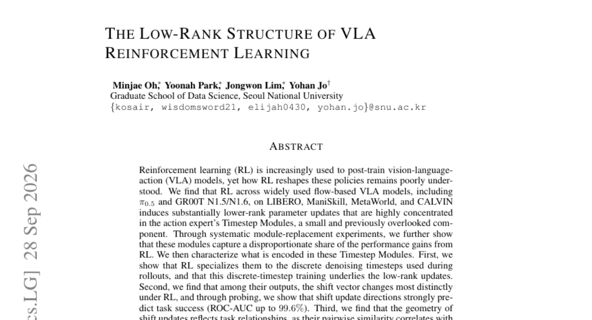

### 📌 한 줄 요약
VLA 모델의 RL 학습 시 발생하는 저차원(Low-rank) 업데이트 특성을 규명하고, 특정 모듈(Timestep Modules)이 성능 향상을 주도함을 발견함

### 🔑 핵심 포인트
- RL 업데이트는 매우 낮은 차원(low-rank)을 가지며 특정 Timestep Modules에 집중됨
- Timestep Modules의 shift vector 업데이트 방향이 작업 성공과 높은 상관관계를 가짐
- 추가 RL 학습 없이 shift 방향 제어(steering)만으로도 정책 성능 향상 가능

### 🧑‍💻 개발자 관점
VLA 모델의 전체 파라미터를 업데이트하는 대신 특정 모듈만 효율적으로 튜닝하거나 제어함으로써 학습 비용을 줄이고 해석 가능성을 높일 수 있습니다.

### 🚀 실무 적용 아이디어
- 사용 중인 VLA 모델의 파라미터 업데이트 차원(rank) 분석해보기
- RL 학습 시 특정 모듈(Timestep Modules 등)에 대한 가중치 집중도 확인하기
- 학습된 shift vector를 활용한 zero-shot 성능 향상 실험 수행하기

### ⚠️ 리스크/한계
- 발견된 현상이 특정 아키텍처(flow-based VLA)에 국한될 가능성
- shift vector 제어 방식의 일반적인 범용성 검증 필요

### 📝 초록 기반 상세 설명
최근 VLA 모델의 RL 사후 학습(post-training)이 활발히 사용되지만, RL이 정책을 어떻게 변화시키는지에 대한 이해는 부족한 상태입니다. 본 연구는 다양한 VLA 모델과 벤치마크를 통해 RL 업데이트가 매우 낮은 차원(low-rank)을 가지며, 특히 'Timestep Modules'라는 작은 모듈에 집중된다는 것을 발견했습니다. 실험을 통해 이 모듈이 성능 향상의 핵심임을 증명하고, RL이 이 모듈을 이산적 노이즈 제거 타임스텝에 특화시킨다는 점을 밝혀냈습니다. 또한, 이 모듈의 shift vector 업데이트 방향이 작업 성공 여부를 예측하며 작업 간 관계를 반영함을 확인했습니다. 마지막으로, 추가 학습 없이 shift 방향을 조정하는 것만으로도 정책 성능을 개선할 수 있음을 보여주었습니다.

---

## 40. [A2Z GameSpec-Bench: How Faithfully Can Coding Agents Generate Games from Game Design Specifications?](https://huggingface.co/papers/2609.39564)
**Upvotes**: 5 | **도입 난이도**: 중 | **신뢰도**: 상
**arXiv**: https://arxiv.org/abs/2609.39564

**태그**: AI Agent, Software Engineering, Benchmark, Game Development, Agent, Vision, Evaluation

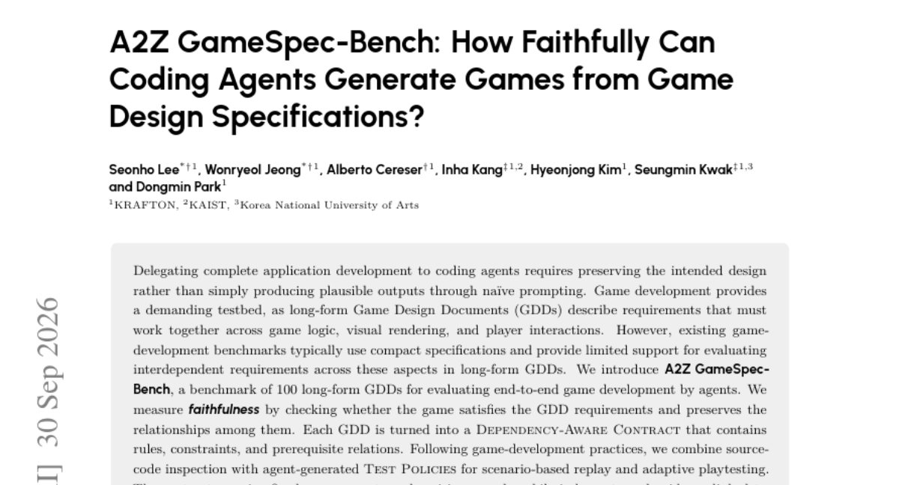

### 📌 한 줄 요약
복잡한 게임 설계 문서(GDD)를 바탕으로 에이전트의 설계 충실도와 상호 의존적 요구사항 구현 능력을 평가하는 벤치마크 제안

### 🔑 핵심 포인트
- 100개의 장문 GDD를 활용한 엔드투엔드 게임 개발 벤치마크 구축
- 규칙, 제약, 선행 관계를 포함하는 의존성 인식 계약(Dependency-aware contract) 방식 도입
- 코드 검사와 시나리오 기반 플레이 테스트를 결합한 다각도 평가 프레임워크

### 🧑‍💻 개발자 관점
에이전트가 단순히 '작동하는 코드'를 만드는 것을 넘어, 복잡한 설계 명세(Spec)를 얼마나 정확하게 구현하는지 측정하는 실무적 기준을 제공합니다.

### 🚀 실무 적용 아이디어
- 제공된 벤치마크 데이터셋을 활용하여 현재 사용 중인 코딩 에이전트의 설계 준수 능력 테스트
- 요구사항 피드백 루프를 에이전트 워크플로우에 통합하여 충실도 향상 실험
- 상호 의존적 제약 조건이 포함된 복잡한 프롬프트 환경에서의 에이전트 안정성 검증

### ⚠️ 리스크/한계
- 장문 문서 처리에 따른 에이전트의 컨텍스트 윈도우 및 추론 비용 문제
- 게임 플레이의 주관적 요소가 평가 결과에 미칠 수 있는 영향

### 📝 초록 기반 상세 설명
코딩 에이전트에게 전체 애플리케이션 개발을 위임하려면 단순한 코드 생성을 넘어 설계 의도를 유지하는 능력이 필수적입니다. 기존 게임 개발 벤치마크는 규격이 너무 간결하여 긴 설계 문서 내의 상호 의존적 요구사항을 평가하기에 한계가 있었습니다. 본 논문은 100개의 장문 GDD를 포함하는 A2Z GameSpec-Bench를 제안하며, 규칙과 제약 조건 간의 관계를 보존하는 의존성 인식 계약 방식을 도입합니다. 평가 과정에서는 소스 코드 검사와 에이전트 생성 테스트 정책을 결합하여 시나리오 기반 플레이 테스트를 수행합니다. 실험 결과, 현재의 에이전트들은 코드 구현과 실제 플레이 사이의 상호 의존적 요구사항을 동시에 만족시키는 데 어려움을 겪는 것으로 나타났습니다.

### 🖼️ 추가 자료

---

## 41. [Decompose Radicals, Then Reward: Fine-Grained Inspection for Accurate Chinese Text Rendering](https://huggingface.co/papers/2609.37569)
**Upvotes**: 5 | **도입 난이도**: 중 | **신뢰도**: 상
**arXiv**: https://arxiv.org/abs/2609.37569

**태그**: Text-to-Image, Reinforcement Learning, Multimodal, NLP, RAG, Vision, Evaluation, Inference, Safety

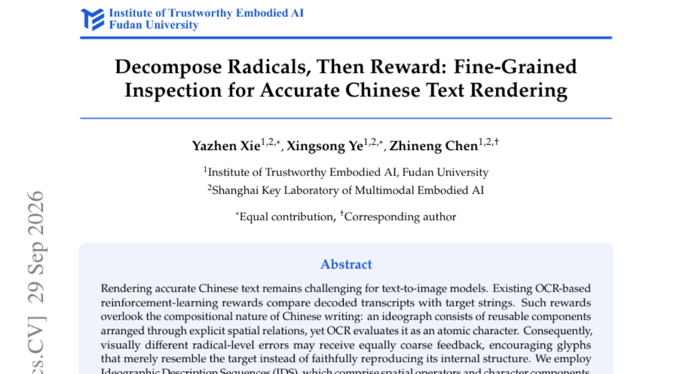

### 📌 한 줄 요약
부수(Radical) 단위의 세밀한 검증을 통해 텍스트-이미지 생성 모델의 중국어 렌더링 정확도를 높이는 방법론

### 🔑 핵심 포인트
- 글자를 원자적 단위가 아닌 부수(Radical)와 공간 관계로 분해하여 평가하는 IDSpect 제안
- IDS(Ideographic Description Sequences)를 활용한 세밀한 구조적 피드백 제공
- 생성 모델의 추론 비용 증가 없이 강화학습(GRPO)을 통한 렌더링 품질 개선

### 🧑‍💻 개발자 관점
텍스트 생성 능력이 중요한 멀티모달 모델 개발 시, 단순 OCR 점수가 아닌 글자 구조의 정밀도를 높이는 학습 전략을 제공합니다.

### 🚀 실무 적용 아이디어
- IDS 기반의 데이터셋을 구축하여 기존 OCR 보상 체계와 성능 비교 실험 수행
- GRPO와 같은 강화학습 프레임워크에 부수 단위 보상 함수 적용 테스트
- 한자 외에 구조적 복잡도가 높은 다른 언어(예: 일본어 등)로의 확장 가능성 검토

### ⚠️ 리스크/한계
- IDS 표현 방식이 한자 이외의 언어적 특성에 완벽히 적용 가능한지 여부
- 학습 단계에서의 정밀한 IDS 인식기 성능에 따른 보상 신뢰도 의존성

### 📝 초록 기반 상세 설명
기존의 OCR 기반 강화학습은 중국어 글자를 하나의 원자적 단위로 취급하여 글자 내부 구조의 오류를 잡아내지 못하는 한계가 있었습니다. 본 논문은 글자의 구성 요소를 공간적 관계로 표현하는 IDS(Ideographic Description Sequences)를 활용합니다. 먼저 전문가급 IDS 인식기를 학습시킨 후, 이를 기반으로 타겟 기호와 생성된 이미지를 부수 단위로 정밀하게 비교하는 IDSpect를 제안합니다. 이 방식은 글자 내부의 구조적 일치 여부를 세밀하게 평가하면서도 생성 모델의 추론 비용을 증가시키지 않습니다. 실험 결과, Qwen-Image의 GRPO 사후 학습을 통해 구조적 품질과 의미적 정렬 성능을 크게 향상시켰습니다.

### 🖼️ 추가 자료
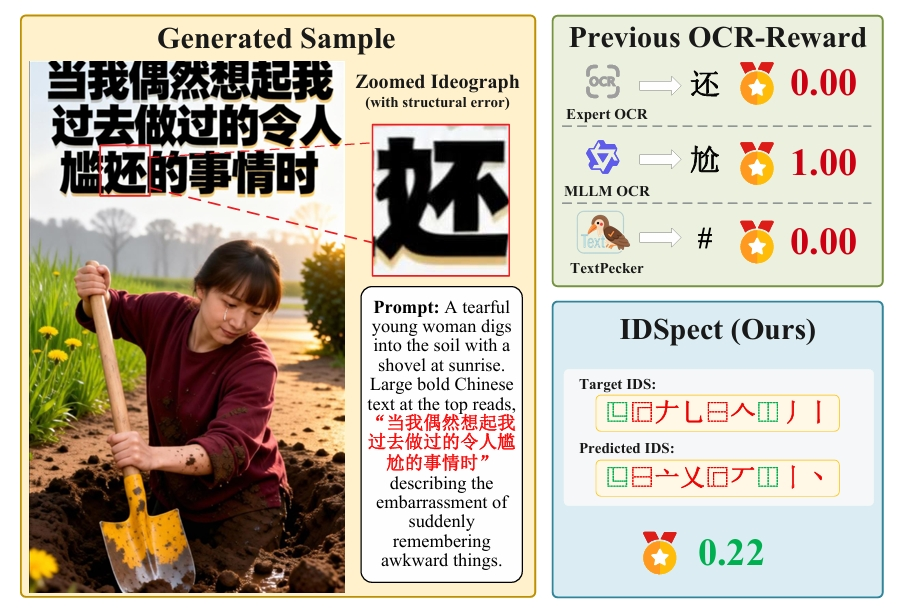

---

## 42. [Tacit-TTS: From Autoregressive Decoding to Masked Prediction for Efficient Transcript-Free Voice Cloning](https://huggingface.co/papers/2609.38658)
**Upvotes**: 4 | **도입 난이도**: 중 | **신뢰도**: 상
**arXiv**: https://arxiv.org/abs/2609.38658

**태그**: TTS, Voice Cloning, Non-Autoregressive, Zero-Shot, Inference, Distillation

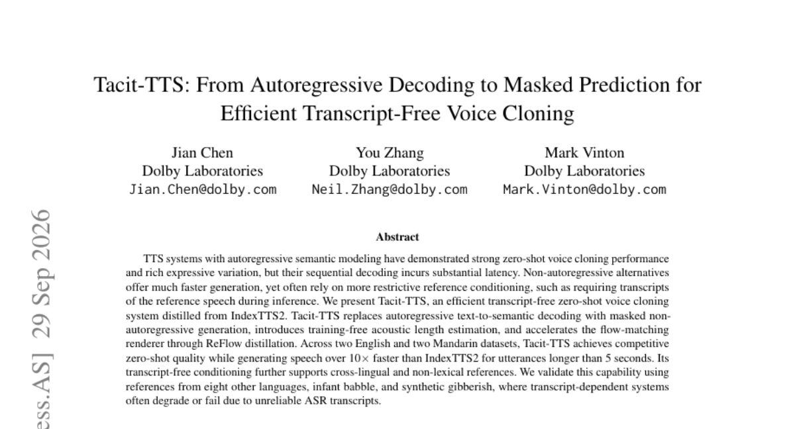

### 📌 한 줄 요약
텍스트 없이 음성만으로 고품질 음성 복제가 가능한 초고속 비자기회적(Non-autoregressive) TTS 시스템

### 🔑 핵심 포인트
- 자기회적 디코딩을 마스킹 기반 비자기회적 생성 방식으로 전환하여 생성 속도 극대화
- 텍스트 스크립트 없이 음성만으로 동작하는 Transcript-free 제로샷 음성 복제 구현
- ReFlow 증류 및 학습 없는 음향 길이 추정 기법을 통한 효율적인 추론 구조 설계

### 🧑‍💻 개발자 관점
텍스트 입력 없이 음성 파일만으로 즉각적인 음성 복제가 가능하며, 실시간 서비스에 적합한 초고속 추론 속도를 제공합니다.

### 🚀 실무 적용 아이디어
- 제시된 ReFlow 증류 기법을 기존 TTS 모델에 적용하여 추론 속도 변화 측정
- 텍스트가 없는 노이즈 섞인 음성 데이터셋에서의 복제 품질 테스트
- 다국어 환경에서 스크립트 없이 음성 특징만으로 전달되는 정보량 확인

### ⚠️ 리스크/한계
- 비자기회적 방식 특유의 표현력 저하 가능성
- 매우 긴 문장 생성 시 음향 길이 추정의 정확도 문제

### 📝 초록 기반 상세 설명
기존의 자기회귀(Autoregressive) 방식 TTS는 뛰어난 음성 복제 성능을 보이지만 순차적 디코딩으로 인해 생성 지연 시간이 발생하는 문제가 있었습니다. 또한 기존 비자기회적 방식은 참조 음성의 텍스트 스크립트가 필요하다는 제약이 있었습니다. 본 논문은 IndexTTS2를 증류(Distillation)하여 텍스트 없이도 작동하는 Tacit-TTS를 제안합니다. 모델은 자기회적 디코딩을 마스킹 기반 비자기회적 생성 방식으로 교체하고, 학습이 필요 없는 음향 길이 추정 및 ReFlow 증류를 도입했습니다. 실험 결과, Tacit-TTS는 5초 이상의 음성 생성 시 IndexTTS2보다 10배 이상 빠르면서도 경쟁력 있는 품질을 달성했습니다. 특히 텍스트 의존성을 제거함으로써 다국어 및 비언어적 참조(아기 소리, 가상 언어 등)에서도 안정적인 성능을 입증했습니다.

---

## 43. [SeLMRoute: Probabilistic Semantic Evidence for Large Language Model Routing](https://huggingface.co/papers/2609.34736)
**Upvotes**: 4 | **도입 난이도**: 중 | **신뢰도**: 상
**arXiv**: https://arxiv.org/abs/2609.34736

**태그**: LLM-Routing, Efficiency, Interpretability, Optimization, RAG, Reasoning, Evaluation

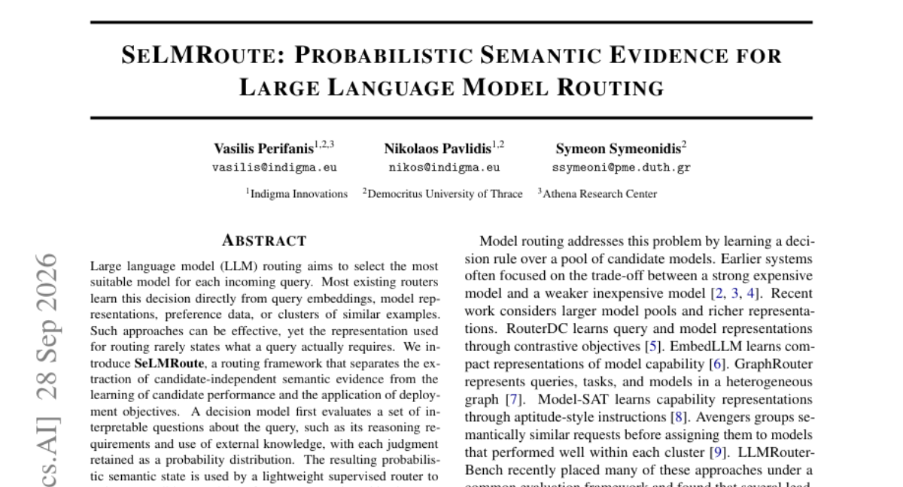

### 📌 한 줄 요약
질의의 의도를 확률적 의미 정보로 분리하여 모델 선택의 정확도와 비용 효율성을 동시에 높이는 라우팅 프레임워크

### 🔑 핵심 포인트
- 의미적 증거(Semantic Evidence)와 모델 성능 학습의 분리를 통한 구조적 최적화
- 해석 가능한 질문들을 활용한 확률적 의미 상태(Probabilistic Semantic State) 추출
- 동일한 의미 정보를 바탕으로 성능 중심 또는 비용 중심의 유연한 라в팅 목적 적용 가능

### 🧑‍💻 개발자 관점
질의의 의도를 명확히 파악하면서도 모델별 성능과 비용을 독립적으로 관리할 수 있어, 운영 비용을 최적화하면서도 서비스 품질을 유지해야 하는 실무 환경에 유용합니다.

### 🚀 실무 적용 아이디어
- 제시된 해석 가능한 질문(Reasoning, Knowledge 등) 세트를 실제 도메인 질의에 적용해보기
- 동일한 의미 상태를 유지하며 비용(Cost) 가중치를 변경했을 때의 라우팅 변화 관찰하기
- 기존 임베딩 기반 라우터와 SeLMRoute의 의사결정 차이 비교 실험

### ⚠️ 리스크/한계
- 의미적 증거 추출 단계에서 발생하는 초기 모델의 판단 오류가 전체 라우팅에 영향을 미칠 수 있음
- 질의의 복잡도가 매우 높은 경우, 정형화된 질문만으로는 충분한 의미 정보를 얻지 못할 가능성

### 📝 초록 기반 상세 설명
LLM 라우팅은 각 질의에 가장 적합한 모델을 선택하는 것을 목표로 하지만, 기존 방식은 질의의 구체적인 요구사항을 명확히 반영하지 못하는 경우가 많습니다. 본 논문은 후보 모델과 독립적인 '의미적 증거(semantic evidence)' 추출과 모델 성능 학습을 분리하는 SeLMRoute 프레임워크를 제안합니다. 먼저 의사결정 모델이 추론 요구사항이나 외부 지식 필요성 등 해석 가능한 질문들을 통해 확률 분포 형태의 의미 상태를 생성합니다. 이 상태를 경량 라우터가 활용하여 후보 모델의 성능을 추정하며, 최종 라우팅 목적(성능 또는 비용)은 마지막 단계에서 적용됩니다. 실험 결과, SeLMRoute는 기존 방식보다 높은 정확도를 기록하며 성능과 비용 사이의 균형 잡힌 의사결정을 지원함을 입증했습니다.

### 🖼️ 추가 자료
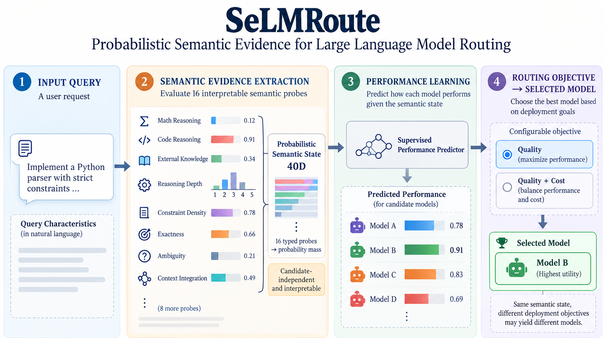

---

## 44. [The Evolution of Attention in Large Language Models: Mechanisms, Trade-offs, and Emerging Trends](https://huggingface.co/papers/2609.39661)
**Upvotes**: 4 | **도입 난이도**: 상 | **신뢰도**: 상
**arXiv**: https://arxiv.org/abs/2609.39661

**태그**: LLM, Architecture, Efficiency, Memory, Optimization

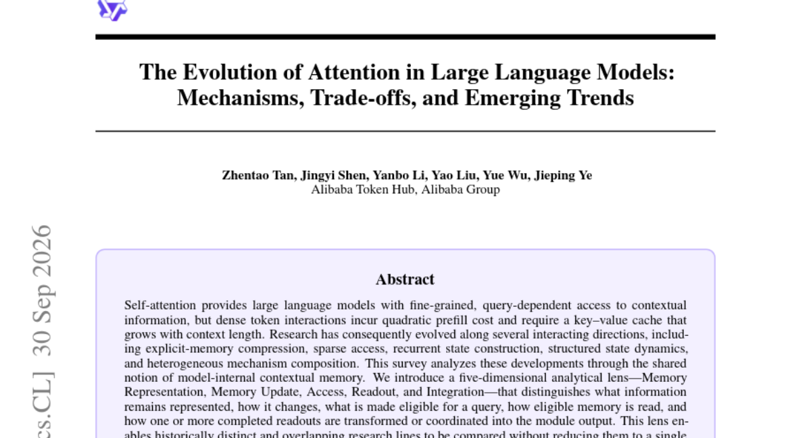

### 📌 한 줄 요약
LLM의 효율적 컨텍스트 관리를 위한 '문맥적 메모리(Contextual Memory)' 관점의 아키텍처 진화 분석

### 🔑 핵심 포인트
- 문맥적 메모리(Contextual Memory) 관점의 5차원 분석 프레임워크 제안
- 메모리 압축, 희소 접근, 순환 상태 구성 등 다양한 연구 흐름의 통합적 분석
- 네트워크 깊이(Depth)를 활용한 계층적 메모리 구성 및 재사용 메커니즘 규명

### 🧑‍💻 개발자 관점
모델의 성능뿐만 아니라 KV 캐시 및 연산 비용 문제를 해결하기 위한 차세대 아키텍처(Sparse/Recurrent/Hybrid)의 설계 방향성을 이해하는 데 필수적입니다.

### 🚀 실무 적용 아이디어
- Sparse Attention과 Dense Attention의 성능/비용 트레이드오프 비교 실험
- 모델 깊이에 따른 메모리 유지 및 라우팅 효율성 분석
- KV 캐시 압축 기법이 추론 속도와 문맥 유지력에 미치는 영향 테스트

### ⚠️ 리스크/한계
- 제안된 프레임워크가 특정 계산 모델에 국한되지 않으나, 실제 구현 시 복잡도가 높을 수 있음
- 메모리 효율성과 정보 손실 사이의 상충 관계(Trade-off) 관리가 핵심 과제임

### 📝 초록 기반 상세 설명
기존의 Self-attention 방식은 정밀한 문맥 접근이 가능하지만, 토큰 간 상호작용에 따른 이차 복잡도와 KV 캐시 증가 문제를 야기합니다. 본 논문은 이러한 문제를 해결하기 위한 연구들을 '모델 내부의 문맥적 메모리'라는 관점에서 분석합니다. 이를 위해 메모리 표현, 업데이트, 접근, 판독, 통합이라는 층위의 5차원 프레임워크를 제안합니다. 14개 주요 모델 계보와 11개 오픈 웨이트 엔드포인트를 분석한 결과, 최신 아키텍처는 단순한 Attention 연산을 넘어 깊이(depth)와 구조를 활용한 메모리 관리로 진화하고 있음을 확인했습니다. 결과적으로 효율적인 시퀀스 설계는 고립된 연산이 아닌, 메모리의 생애주기와 선택적 활용을 조직하는 방향으로 나아가고 있습니다.

---

## 45. [AdviSD: Learning to Advise Frontier LLMs via Targeted Multi-Turn Self-Distillation](https://huggingface.co/papers/2609.38142)
**Upvotes**: 4 | **도입 난이도**: 중 | **신뢰도**: 상
**arXiv**: https://arxiv.org/abs/2609.38142

**태그**: LLM-Agent, Self-Distillation, Reinforcement Learning, Model-Steering, Vision, Distillation

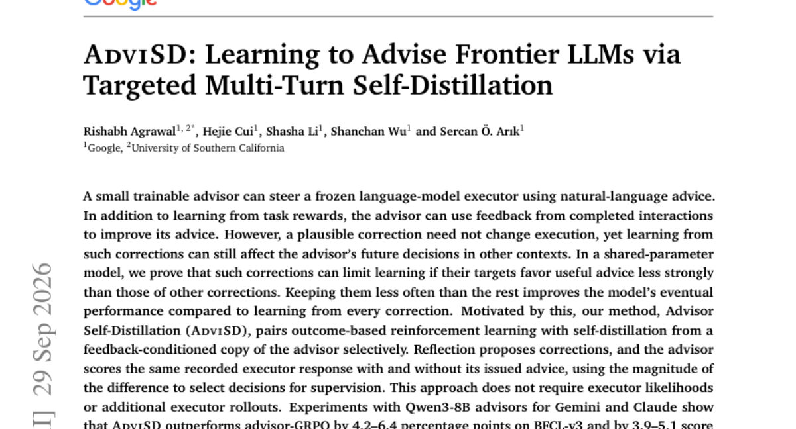

### 📌 한 줄 요약
고정된 거대 모델(Executor)을 효율적으로 제어하기 위해, 피드백 차이를 이용해 유의미한 조언만 선별 학습하는 Advisor 최적화 기법

### 🔑 핵심 포인트
- 피드백의 영향력을 기반으로 학습 데이터를 선별하는 AdviSD 알고리즘 제안
- 실행기(Executor)의 추가 롤아웃이나 확률값 없이 조언자(Advisor)만 학습 가능
- 선별적 자기 증류를 통해 학습 효율을 높이고 도메인 외 일반화 성능 확보

### 🧑‍💻 개발자 관점
적은 비용의 작은 모델로도 강력한 거대 모델을 효과적으로 제어할 수 있는 효율적인 에이전트 아키텍처 설계 방식을 제시합니다.

### 🚀 실무 적용 아이디어
- 작은 모델(Advisor)과 큰 모델(Executor) 간의 협업 구조 설계 시 적용
- 피드백 데이터 중 학습에 유의미한 샘플을 선별하는 필터링 로직 실험
- 학습된 Advisor를 다른 모델 제품군(예: GPT-4 -> Claude)으로 이식하는 전이 성능 테스트

### ⚠️ 리스크/한계
- 선별 규칙이 잘못 설정될 경우 유용한 피드백까지 누락될 위험이 있음
- Advisor의 성능이 Executor의 성능에 의존적일 수 있음

### 📝 초록 기반 상세 설명
거대 언어 모델(LLM)을 실행기(Executor)로 사용하고 작은 모델을 조언자(Advisor)로 사용하는 구조에서, 조언자는 피드백을 통해 성능을 개선할 수 있습니다. 그러나 모든 피드백을 학습에 반영할 경우, 실행 결과에 변화를 주지 않는 사소한 수정이 오히려 모델의 학습 효율을 저해할 수 있다는 점을 이론적으로 증명했습니다. 이를 해결하기 위해 제안된 AdviSD는 조언이 결과에 미친 영향력을 측정하여, 조언 유무에 따른 점수 차이가 큰 데이터만을 선별적으로 학습하는 자기 증류(Self-Distillation) 방식을 사용합니다. 이 방법은 추가적인 실행 롤아웃이나 실행기 확률값 없이도 효과적인 조언 학습을 가능하게 합니다. 실험 결과, AdviSD는 BFCL-v3 및 EnvScaler 벤치마크에서 기존 RL 방식보다 우수한 성능을 보였으며, 다른 모델 제품군으로의 전이 학습 능력도 입증되었습니다.

---

## 46. [WUSH-KV: KV Cache Quantization with Data-Adaptive Transforms](https://huggingface.co/papers/2609.38121)
**Upvotes**: 4 | **도입 난이도**: 중 | **신뢰도**: 상
**arXiv**: https://arxiv.org/abs/2609.38121

**태그**: LLM, Quantization, KV-Cache, Inference-Optimization, Evaluation, Inference, Optimization

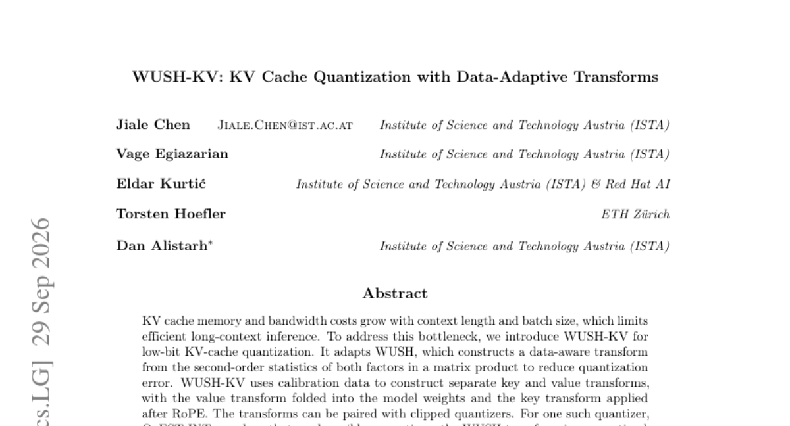

### 📌 한 줄 요약
데이터 적응형 변환(WUSH)을 통해 2비트 수준의 초저비트 KV 캐시 양자화를 구현하여 긴 문맥 추론 효율을 극대화한 기술입니다.

### 🔑 핵심 포인트
- 데이터의 2차 통계량을 활용한 데이터 적응형(Data-adaptive) 변환 기법 도입
- Key와 Value에 최적화된 별도 변환을 적용하고 가중치 폴딩(Folding)을 통해 효율성 확보
- 2비트 초저비트 양자화 환경에서 기존 방식 대비 낮은 perplexity 및 높은 성능 달성

### 🧑‍💻 개발자 관점
메모리 제약이 큰 환경에서 긴 문맥(Long-context) 추론을 수행할 때, KV 캐시 용량을 획기적으로 줄이면서도 모델 성능 저하를 최소화할 수 있습니다.

### 🚀 실무 적용 아이디어
- SGLang 환경에서 기존 OSCAR 방식과 WUSH-KV의 perplexity 및 추론 속도 비교 실험
- 다양한 모델 크기 및 문맥 길이(Context Length)에 따른 양자화 효율성 검증
- 2비트 이하 초저비트 설정 시 모델의 Downstream Task 성능 유지 여부 확인

### ⚠️ 리스크/한계
- 초저비트 양자화 시 발생할 수 있는 정보 손실 및 모델 성능 저하 위험
- Calibration 데이터에 의존하는 데이터 적응형 방식이므로 새로운 도메인 데이터 적용 시 성능 변동 가능성

### 📝 초록 기반 상세 설명
LLM의 문맥 길이가 길어짐에 따라 KV 캐시의 메모리 및 대역폭 비용이 급증하는 문제가 발생합니다. 이를 해결하기 위해 데이터의 2차 통계량을 활용하여 양자화 오차를 최소화하는 WUSH-KV를 제안합니다. WUSH-KV는 별도의 Key/Value 변환을 구성하며, Value 변환은 가중치에 폴딩하고 Key 변환은 RoPE 적용 후에 적용하는 방식을 취합니다. 실험 결과, 제안된 방식은 기존 OSCAR 방식 대비 낮은 perplexity를 기록하며 2비트 양자화에서도 우수한 성능을 보였습니다. 최종적으로 SGLang에 통합되어 실질적인 추론 성능 향상을 입증했습니다.

---

## 47. [SkillSeek: Revisiting Agent Skill Retrieval at Marketplace Scale](https://huggingface.co/papers/2609.38822)
**Upvotes**: 3 | **도입 난이도**: 하 | **신뢰도**: 상
**arXiv**: https://arxiv.org/abs/2609.38822

**태그**: Agent, RAG, Information Retrieval, LLM-Ops, Benchmark, Evaluation

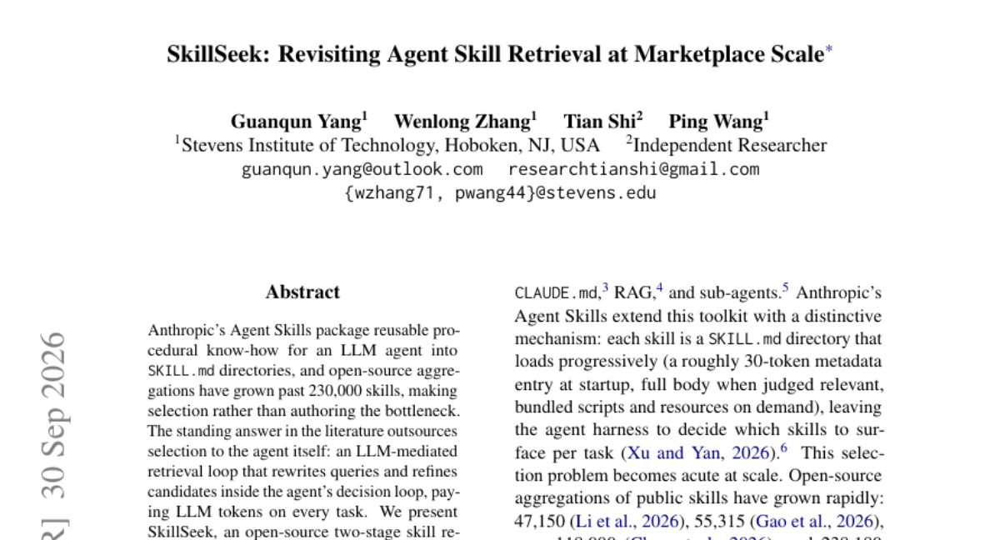

### 📌 한 줄 요약
에이전트 스킬 라이브러리가 거대해짐에 따라, 고비용의 LLM 루프 대신 표준 IR(정보 검색) 기법을 활용해 비용과 성능을 동시에 잡는 효율적인 스킬 검색 방법론을 제시합니다.

### 🔑 핵심 포인트
- LLM 중심의 고비용 스킬 선택 루프를 표준 IR(Bi-encoder + Cross-encoder) 방식으로 대체
- SkillsBench 벤치마크에서 기존 LLM 기반 방식과 대등한 성능(Parity) 달성
- 에이전트 작업당 발생하는 토큰 비용을 획기적으로 절감

### 🧑‍💻 개발자 관점
에이전트 시스템 구축 시, 모든 검색 과정을 LLM에 맡기는 대신 검색 엔진(RAG) 구조를 도입함으로써 운영 비용을 낮추고 성능을 최적화할 수 있는 실무적 가이드를 제공합니다.

### 🚀 실무 적용 아이디어
- 현재 운영 중인 에이전트의 스킬 검색 로직을 BM25 또는 Bi-encoder 기반으로 교체해보기
- 스킬 풀 규모에 따른 검색 성능과 비용 간의 Trade-off 분석하기
- LLM 기반 쿼리 생성 대신 소형 Cross-encoder를 활용한 재정렬(Reranking) 적용해보기

### ⚠️ 리스크/한계
- 매우 복잡하거나 비정형적인 스킬 요구사항의 경우, 결정론적 검색 방식이 LLM 루프보다 성능이 낮을 수 있음
- 검색 엔진의 Recall(재현율) 성능이 전체 에이전트 성능의 상한선(Ceiling)으로 작용함

### 🖼️ 추가 자료
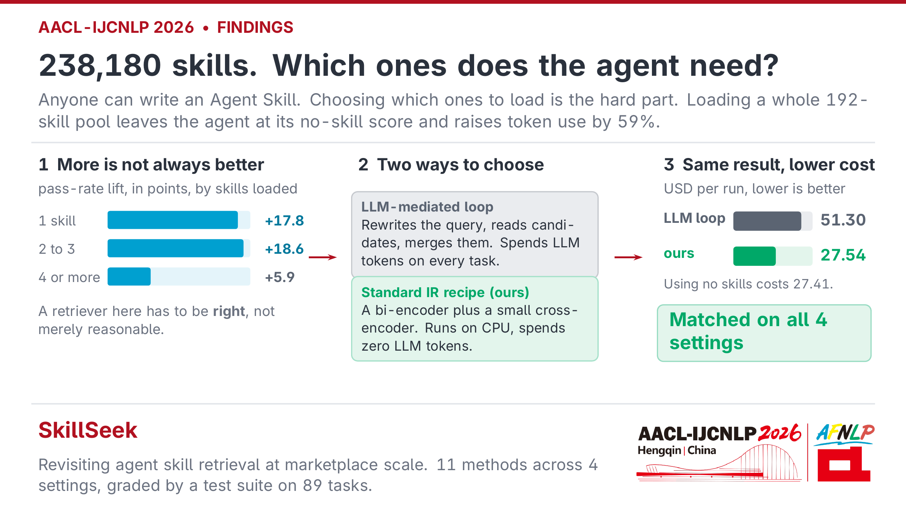

---

## 48. [CoEvoWhen: Policy-Tool Coevolution for Ultra-Long Video Temporal Grounding](https://huggingface.co/papers/2609.40048)
**Upvotes**: 3 | **도입 난이도**: 중 | **신뢰도**: 상
**arXiv**: https://arxiv.org/abs/2609.40048

**태그**: Agent, Video-Understanding, Coevolution, VLM, Reasoning, Vision, Video, Benchmark, Inference, Distillation

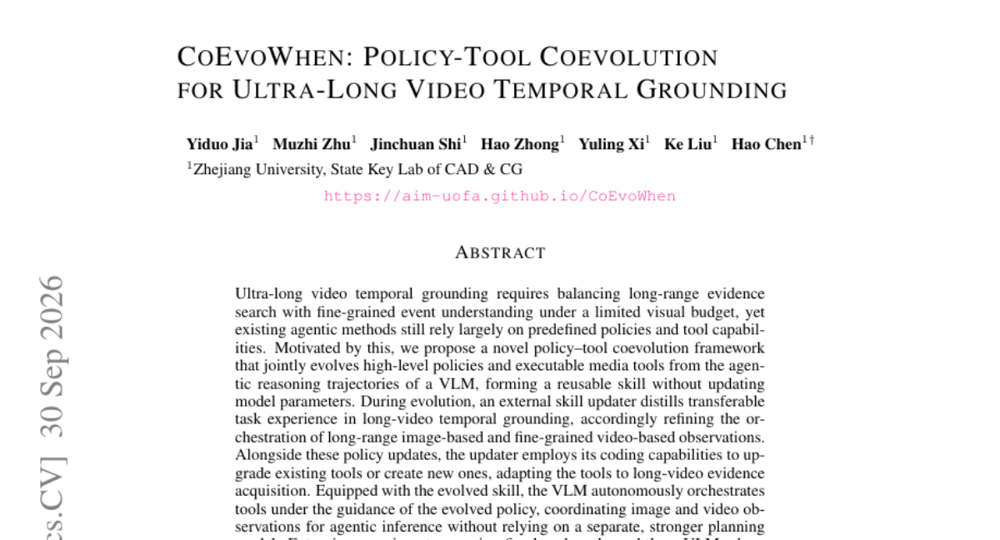

### 📌 한 줄 요약
모델 파라미터 업데이트 없이 정책과 도구를 동시에 진화시켜 초장기 비디오 탐색 효율을 극대화하는 프레임워크

### 🔑 핵심 포인트
- 정책(Policy)과 도구(Tool)를 동시에 진화시키는 Coevolution 프레임워크 제안
- 모델 파라미터 업데이트 없이 외부 스킬 업데이터를 통한 재사용 가능한 스킬 형성
- 이미지 기반 광역 탐색과 비디오 기반 세밀 탐색의 효율적 오케스트레이션

### 🧑‍💻 개발자 관점
모델 자체를 재학습시키지 않고도 에이전트의 행동 양식과 도구 활용 능력을 최적화하여 효율적인 비디오 분석 시스템을 구축할 수 있습니다.

### 🚀 실무 적용 아이디어
- VLM의 코딩 능력을 활용한 자동 도구 생성 로직 구현 테스트
- 정책 업데이트 시 발생하는 스킬 간 충돌(Conflict) 현상 분석
- 다양한 비디오 해상도 및 프레임 레이트 환경에서의 도구 적응성 검증

### ⚠️ 리스크/한계
- 외부 스킬 업데이터의 코딩/추론 오류가 전체 시스템 성능에 미치는 영향
- 복잡한 도구 생성이 늘어날수록 관리해야 할 스킬 집합이 비대해질 위험

### 📝 초록 기반 상세 설명
초장기 비디오 템포럴 그라운딩은 제한된 시각적 예산 내에서 광범위한 증거 탐색과 세밀한 이벤트 이해 사이의 균형을 맞추는 것이 필수적입니다. 기존 에이전트 방식은 사전 정의된 정책과 도구 능력에 의존하여 유연성이 부족하다는 문제가 있었습니다. 이를 해결하기 위해 본 논문은 VLM의 추론 궤적을 바탕으로 고수준 정책과 실행 가능한 미디어 도구를 공동 진화시키는 CoEvoWhen 프레임워크를 제안합니다. 외부 스킬 업데이터가 작업 경험을 증류하여 정책을 정교화하는 동시에, 코딩 능력을 활용해 도구를 업그레이드하거나 신규 생성하여 증거 확보 능력을 최적화합니다. 실험 결과, 제안 방식은 정확도를 높이면서도 추론 시 시각적 토큰 비용을 절감했으며, 일반적인 장기 비디오 QA에서도 높은 범용성을 입증했습니다.

---

## 49. [Game-Guided Skill Discovery through Self-Play for Playable Agent Control](https://huggingface.co/papers/2609.40137)
**Upvotes**: 3 | **도입 난이도**: 상 | **신뢰도**: 상
**arXiv**: https://arxiv.org/abs/2609.40137

**태그**: Reinforcement Learning, Self-Play, Robot Control, Skill Discovery, Agent

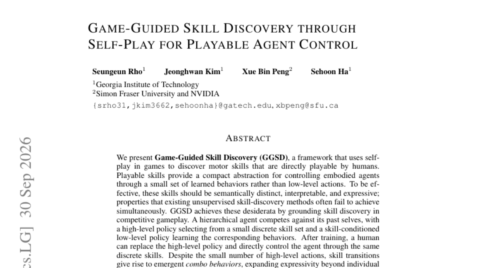

### 📌 한 줄 요약
자기 대전(Self-play) 기반의 스킬 발견을 통해 인간이 직접 조작 가능한 직관적이고 표현력이 풍부한 에이전트 제어 프레임워크를 제안합니다.

### 🔑 핵심 포인트
- 자기 대전(Self-play)을 활용하여 인간이 직관적으로 사용할 수 있는 의미 있는 스킬 세트 발견
- 상위 정책(스킬 선택)과 하위 정책(동작 실행)의 계층적 구조를 통한 제어 추상화
- 적은 수의 이산적 스킬 조합만으로도 복잡한 태스크를 해결하는 창발적 콤보 동작 구현

### 🧑‍💻 개발자 관점
로봇이나 에이전트 제어 시 저수준 액션 대신 직관적인 스킬 단위로 조작할 수 있는 인터페이스 기술의 가능성을 제시합니다.

### 🚀 실무 적용 아이디어
- 제공된 데모를 통해 스킬 간의 전이 및 조합 특성 분석
- 간단한 물리 시뮬레이션 환경에서 이산적 스킬 세트의 표현력 테스트
- 기존 비지도 학습 기반 스킬 학습 방식과 비교 실험

### ⚠️ 리스크/한계
- 스킬의 개수가 적을 경우 복잡한 환경에서의 표현력 한계 가능성
- 게임 환경의 보상 설계가 실제 물리 환경의 스킬와 일치하지 않을 위험

### 📝 초록 기반 상세 설명
기존의 비지도 스킬 발견 방식은 의미적 구별성, 해석 가능성, 표현력을 동시에 확보하기 어려웠습니다. 본 논문은 게임 환경에서의 경쟁적 플레이를 통해 인간이 직접 제어할 수 있는 모터 스킬을 발견하는 GGSD 프레임워크를 제안합니다. 계층적 구조를 통해 상위 정책은 이산적인 스킬 세트를 선택하고, 하위 정책은 해당 스킬에 따른 동작을 학습하며 자기 대전 방식으로 훈련됩니다. 훈련 후에는 상위 정책을 인간의 입력으로 교체하여 에이전트를 직접 조작할 수 있습니다. 실험 결과, 제안된 스킬은 인간이 조합하여 미지의 작업(Maze, CubePush 등)을 해결할 수 있을 만큼 높은 표현력을 보여주었습니다.

---

## 50. [Not Every Token Is Worth Distilling: Selective Supervision for Direct-OPD](https://huggingface.co/papers/2609.29142)
**Upvotes**: 3 | **도입 난이도**: 하 | **신뢰도**: 상
**arXiv**: https://arxiv.org/abs/2609.29142

**태그**: LLM, Knowledge Distillation, Reinforcement Learning, Model Optimization, Vision, Benchmark, Distillation

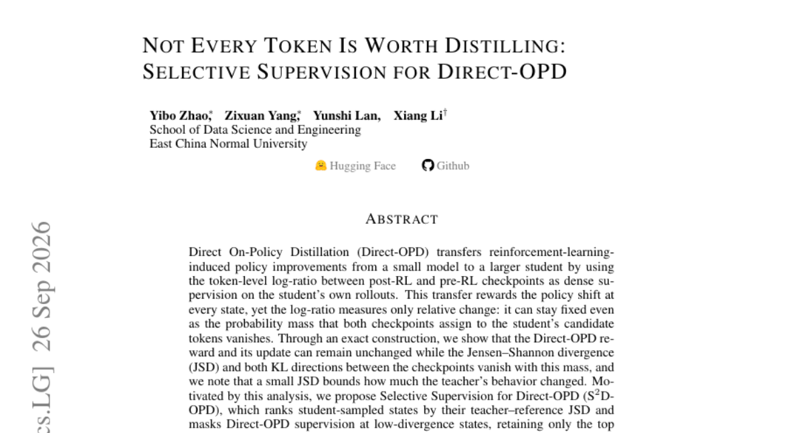

### 📌 한 줄 요약
Direct-OPD의 불필요한 토큰 학습을 방지하기 위해 변화량이 큰 상태만 선택적으로 학습하는 효율적인 지식 증류 기법

### 🔑 핵심 포인트
- Direct-OPD의 로그 비율이 확률 질량이 낮은 상태에서도 잘못된 신호를 줄 수 있는 수학적 취약점 발견
- JSD를 기준으로 변화량이 큰 상위 10% 상태만 선택적으로 학습하는 S^2D-OPD 제안
- 추가적인 포워드 패스(Forward Pass) 없이도 수학적 추론 성능(AIME, HMMT) 향상

### 🧑‍💻 개발자 관점
모델 크기를 키우는 대신, RL로 얻은 지식을 학생 모델에 주입할 때 어떤 데이터가 '진짜 유용한 변화'인지 선별하는 효율적인 전략을 제공합니다.

### 🚀 실무 적용 아이디어
- 기존 Direct-OPD 학습 루프에 JSD 기반 마스킹 로직 적용 실험
- 학습 데이터의 상위 % 임계값(Threshold) 변화에 따른 성능 민감도 테스트
- 수학적 추론 외에 일반적인 대화형 모델에서의 성능 전이 효과 검증

### ⚠️ 리스크/한계
- 상위 10%만 사용하는 방식이 특정 도메인에서 데이터 손실을 야기할 가능성
- JSD 계산이 학습 과정의 오버헤드로 작용할 수 있는 여지

### 📝 초록 기반 상세 설명
Direct-OPD는 RL 이후의 정책 변화를 토큰 단위 로그 비율로 계산하여 학생 모델에 전달하는 방식입니다. 그러나 이 방식은 확률 질량이 사라지는 상황에서도 로그 비율이 유지되어, 실제 정책 변화가 없는 상태에서도 불필요한 학습을 유도하는 문제가 있습니다. 연구진은 JSD(Jensen-Shannon Divergence)가 낮은 상태는 교사의 행동 변화가 적다는 점에 착안하여, 변화량이 큰 상위 10% 상태만 학습하는 S^2D-OPD를 제안합니다. 실험 결과, AIME 및 HMMT 벤치마크에서 추가 연산 없이도 기존 방식보다 우수한 성능을 보였습니다. 이는 모델 크기에 관계없이 효과적인 정책 전이가 가능함을 입증합니다.

---

