# 2026-10-05 Daily Papers (Top 50)

## 오늘의 요약
오늘의 연구는 에이전트의 장기적 과업 수행을 위한 메모리 관리와 신념 상태(Belief States) 구축, 그리고 RL 포스트 트레이닝 과정에서 발생하는 성능 저하 현상 규명에 집중되었습니다. 또한, 멀티모달 생성 모델의 효율적인 학습과 복잡한 워크플로우를 지원하는 데이터 합성 프레임워크 등 실질적인 에이전트 성능 최적화 방안들이 활발히 논의되었습니다.

### 오늘의 핵심 포인트
- 단순한 이력 저장을 넘어 명시적 신념 상태와 구조화된 데이터 관리가 에이전트의 장기 과업 수행 능력을 결정하는 핵심 요소임을 확인했습니다.
- RL 포스트 트레이닝이 정답 일관성은 높이지만 해결 범위를 좁히는 'Sharpening Tax' 현상을 규명하고 이를 완화할 필요성을 제시했습니다.
- 멀티모달 및 에이전트 학습 시 데이터 합성, 모달리티 간 가중치 조절, 구조적 사전 지식 활용이 모델의 일반화와 효율성을 높이는 데 중요함을 보여주었습니다.

**오늘의 태그**: AI Agent, Reinforcement Learning, LLM Fine-tuning, Multi-modal, Memory Mechanism

## 1. [On-Policy or Off-Policy Learning? A Systematic Study of Distillation Dynamics](https://huggingface.co/papers/2609.35259)
**Upvotes**: 168 | **도입 난이도**: 하 | **신뢰도**: 상
**arXiv**: https://arxiv.org/abs/2609.35259

**태그**: LLM Fine-tuning, Distillation, Reinforcement Learning, KL Divergence, RAG, Reasoning, Evaluation

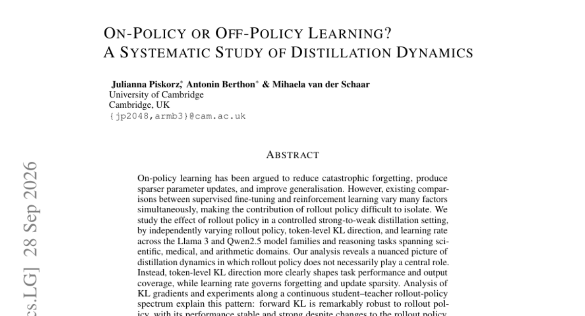

### 📌 한 줄 요약
On-policy 학습이 항상 우월하다는 통념과 달리, KL 발산 방향과 학습률이 모델 성능 및 망각 제어에 더 결정적인 역할을 함을 규명함.

### 🔑 핵심 포인트
- Rollout policy(On-policy vs Off-policy)가 성능에 미치는 영향은 KL 방향에 따라 상이함
- Forward KL는 Rollout policy 변화에 매우 강건하며 안정적인 성능을 유지함
- Learning rate는 모델의 망각(forgetting)과 파라미터 업데이트 희소성을 결정하는 핵심 변수임

### 🧑‍💻 개발자 관점
LLM 미세 조정(Fine-tuning) 시 무조건적인 On-policy 학습보다는, 사용하는 KL divergence 방향과 학습률 설정이 성능과 망각 방지에 더 중요함을 시사합니다.

### 🚀 실무 적용 아이디어
- KL 방향(Forward vs Reverse)에 따른 모델 성능 및 출력 분포 변화 비교 실험
- 학습률(Learning Rate) 변화가 기존 지식 망각(Catastrophic Forgetting)에 미치는 영향 측정
- Rollout policy를 변경하며 KL gradient의 안정성 테스트

### ⚠️ 리스크/한계
- 특정 태스크(수학, 과학 등)에 집중된 실험 결과이므로 모든 도메인에 일반화하기 어려울 수 있음
- RLVR(Reinforcement Learning from Verifiable Rewards) 이후의 장기적 성능 유지 효과는 불분명함

### 📝 초록 기반 상세 설명
기존에는 On-policy 학습이 파라미터 업데이트의 희소성을 높이고 일반화 성능을 개선한다고 알려져 왔으나, 기존 연구들은 여러 변수가 혼재되어 있어 Rollout policy의 순수 효과를 분리하기 어려웠습니다. 본 연구는 강력한 교사 모델에서 약한 학생 모델로의 증류(Distillation) 환경에서 Rollout policy, KL 방향, 학습률을 독립적으로 변화시키며 그 영향을 분석했습니다. 실험 결과, Rollout policy 자체보다는 토큰 수준의 KL 방향이 성능과 출력 범위를 결정하며, 학습률이 망각과 업데이트 희소성을 조절하는 핵심 요소임을 발견했습니다. 특히 Forward KL는 Rollout policy 변화에 강건한 반면, Reverse KL은 학생 모델의 생성 데이터(On-policy)에 더 민감하게 반응했습니다. 결론적으로 On-policy 학습의 이점은 목적 함수와 하이퍼파라미터 설정에 따라 달라질 수 있음을 보여줍니다.

---

## 2. [OneStreamer: Unifying Perception, Memory, and Proactive Response in Streaming Video Interaction](https://huggingface.co/papers/2610.01762)
**Upvotes**: 164 | **도입 난이도**: 상 | **신뢰도**: 상
**arXiv**: https://arxiv.org/abs/2610.01762

**태그**: Video-LLM, Streaming, Memory-Mechanism, Real-time, RAG, Vision, Video, Benchmark, Evaluation, Inference

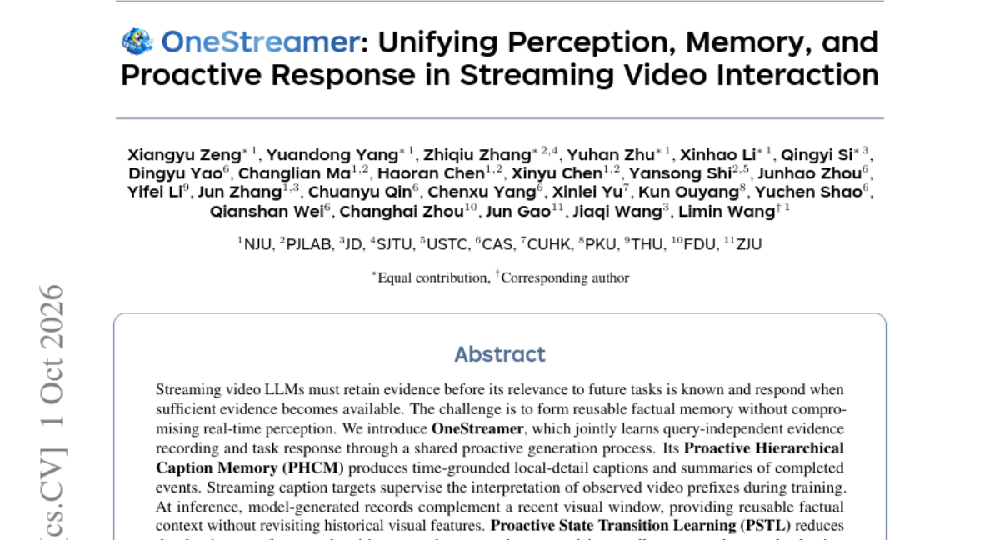

### 📌 한 줄 요약
실시간 스트리밍 비디오에서 과거 정보를 효율적으로 기억하고 적시에 응답하는 통합형 멀티모달 모델 프레임워크 제안

### 🔑 핵심 포인트
- PHCM(Proactive Hierarchical Caption Memory): 과거 비디오 피처를 재탐색하지 않고 텍스트 기반의 요약/상세 캡션을 통해 재사용 가능한 메모리 구축
- PSTL(Proactive State Transition Learning): 상태 변화와 유지 토큰을 선택적으로 학습하여 불필요한 대기 상태 학습 문제를 해결
- OneStreamer-1M: 스트리밍 비디오 상호작용을 위해 구축된 100만 개 이상의 레코드를 포함한 대규모 데이터셋

### 🧑‍💻 개발자 관점
실시간 CCTV나 라이브 스트리밍 환경에서 과거 이력을 효율적으로 관리하면서도 지연 시간을 최소화하는 에이전트 개발에 직접적인 영감을 제공합니다.

### 🚀 실무 적용 아이디어
- PHCM 방식의 텍스트 메모리가 비디오 피처 재사용 대비 얼마나 많은 정보 손실을 유발하는지 비교 실험
- PSTL의 상태 변화 토큰 선택 전략을 다른 시계열 데이터 작업에 적용해보기
- 제안된 데이터 합성 파이프라인을 활용하여 특정 도메인(예: 보안, 스포츠) 특화 데이터셋 구축 시도

### ⚠️ 리스크/한계
- 텍스트 기반 메모리 의존도가 높아질 경우, 시각적 세부 사항이 소실될 위험이 있음
- 상태 변화가 적은 정적인 영상 환경에서는 모델의 반응성이 저하될 가능성 존재

### 📝 초록 기반 상세 설명
스트리밍 비디오 LLM은 미래 작업의 관련성이 결정되기 전에도 증거를 보존해야 하며, 충분한 정보가 모였을 때 적시에 응답해야 하는 과제를 안고 있습니다. 기존 방식은 실시간 인지 성능을 유지하면서 재사용 가능한 사실적 메모리를 형성하는 데 어려움이 있었습니다. 본 논문은 쿼리 독립적인 증거 기록과 작업 응답을 하나의 공유된 능동적 생성 프로세스로 통합한 OneStreamer를 제안합니다. PHCM(Proactive Hierarchical Caption Memory)을 통해 시간 기반의 상세 캡션과 요약을 생성하여 과거 비디오 특징을 다시 읽지 않고도 재사용 가능한 문맥을 제공합니다. 또한 PSTL(Proactive State Transition Learning)을 도입하여 대기 상태의 지배력을 줄이고 상태 변화를 효과적으로 학습합니다. 실험 결과, OneStreamer-1M 데이터셋으로 학습된 4B 모델은 8개 벤치마크에서 최고 성능을 달성하며 실시간 인지와 메모리 유지 사이의 균형을 입증했습니다.

---

## 3. [GraphForge: Training Working Agents with Graph-Anchored Workspace Synthesis](https://huggingface.co/papers/2609.38923)
**Upvotes**: 144 | **도입 난이도**: 상 | **신뢰도**: 상
**arXiv**: https://arxiv.org/abs/2609.38923

**태그**: AI Agent, Data Synthesis, Fine-tuning, Workflow Automation, Agent, Vision, Benchmark

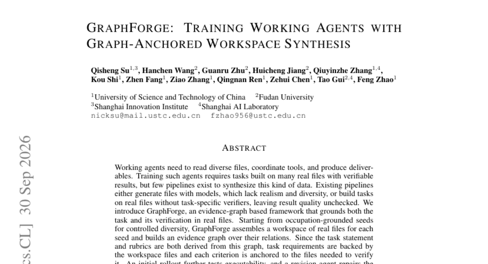

### 📌 한 줄 요약
실제 파일 기반의 증거 그래프를 활용하여 에이전트 학습용 고품질 작업 환경과 검증 루브릭을 자동 생성하는 프레임워크

### 🔑 핵심 포인트
- 실제 파일 관계를 기반으로 작업(Task)과 검증(Verification)을 연결하는 증거 그래프 프레임워크 제안
- 직업 기반 시드와 자동 수정 루프를 통한 고품질/고현실성 학습 데이터 합성
- 루브릭 기반의 거부 미세조정(Rejection Fine-tuning)을 통한 에이전트 성능 최적화

### 🧑‍💻 개발자 관점
에이전트가 단순히 텍스트를 생성하는 것을 넘어, 실제 파일 시스템과 도구를 다루는 복잡한 워크플로우를 학습할 수 있는 데이터 파이프라인을 제공합니다.

### 🚀 실무 적용 아이디어
- 제공된 데이터셋과 모델을 활용하여 특정 도메인(예: 데이터 분석, 코드 리팩토링)에 대한 에이전트 성능 테스트
- 증거 그래프 기반의 루브릭이 실제 에이전트의 추론 과정에 미치는 영향 분석
- 기존의 합성 데이터 생성 방식과 GraphForge 방식의 결과물 품질 비교 실험

### ⚠️ 리스크/한계
- 실제 파일 기반의 워크스페이스 구성 시 데이터 보안 및 개인정보 보호 문제 발생 가능성
- 복잡한 그래프 구조로 인해 데이터 생성 파이프라인의 연산 비용이 높을 수 있음

### 📝 초록 기반 상세 설명
에이전트 학습을 위해서는 실제 파일과 검증 가능한 결과가 포함된 작업 데이터가 필요하지만, 기존 방식은 현실성이 부족하거나 검증이 어렵다는 문제가 있었습니다. 이를 해결하기 위해 GraphForge는 직업 기반 시드에서 시작하여 실제 파일들로 구성된 워크스페이스와 그 관계를 나타내는 증거 그래프를 구축합니다. 이 그래프를 바탕으로 작업 요구사항과 검증 루브릭을 파일에 직접 연결(anchoring)하여 데이터의 정합성을 확보합니다. 생성된 작업은 초기 실행 테스트와 수정 에이전트를 거쳐 정교하게 다듬어진 후 학습 데이터로 사용됩니다. 실험 결과, GraphForge로 학습된 모델은 OpenHands 및 Claude Code 환경의 주요 벤치마크에서 성능 향상을 입증했습니다.

---

## 4. [Adaptive Reward Routing: Dynamic Multi-Reward Optimization for Joint Audio-Video Diffusion via Forward-Process RL](https://huggingface.co/papers/2609.37200)
**Upvotes**: 123 | **도입 난이도**: 상 | **신뢰도**: 상
**arXiv**: https://arxiv.org/abs/2609.37200

**태그**: Diffusion, Reinforcement Learning, Multi-modal, Audio-Video, Video, Audio, Safety

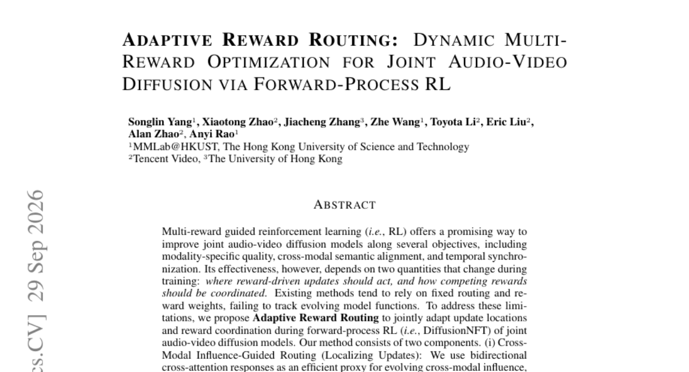

### 📌 한 줄 요약
학습 과정에서 변화하는 보상 값과 모달리티 간 상호작용을 동적으로 조절하여 오디오-비디오 생성 품질을 최적화하는 적응형 RL 프레임워크

### 🔑 핵심 포인트
- Cross-Modal Influence-Guided Routing: 교차 주의 응답을 프록시로 사용하여 모달리티 간 영향력에 따라 그래디언트와 손실 가중치를 동적으로 조정
- Preference-Preserving Modality-Aware Reweighting: 사전 설정된 가중치를 우선순위로 유지하면서, 보상 그래디언트 간 상호작용을 통해 충돌을 해결하는 잔차 보정 방식 적용
- Dynamic Optimization: 학습 과정에서 변화하는 모델 상태에 맞춰 업데이트 위치와 보상 조합을 실시간으로 최적화

### 🧑‍💻 개발자 관점
멀티모달 생성 모델 학습 시 특정 모달리티가 다른 모달리티를 압도하거나(Dominance), 정렬 성능이 저하되는 문제를 해결하는 데 유용합니다.

### 🚀 실무 적용 아이디어
- 기존 고정 가중치 RL 방식과 제안된 적응형 가중치 방식의 학습 곡선(Convergence) 비교 실험
- 특정 모달리티(예: 오디오)의 가중치를 극단적으로 높였을 때의 안정성 테스트
- Cross-attention 응답을 활용한 그래디언트 스케일링의 연산 오버헤드 측정

### ⚠️ 리스크/한계
- 동적 가중치 조절로 인해 학습 초기 단계에서 불안정성이 발생할 가능성
- 교차 주의 응답을 프록시로 사용하는 방식의 계산 복잡도 및 효율성 검증 필요

### 📝 초록 기반 상세 설명
멀티 보상 기반 강화학습은 오디오-비디오 생성 모델의 품질, 정렬, 동기화를 개선하는 유망한 방법이지만, 학습 중 변화하는 보상 위치와 가중치 조절이 어렵다는 문제가 있습니다. 기존 방식은 고정된 라우팅과 가중치를 사용하여 진화하는 모델 함수를 추적하지 못합니다. 이를 해결하기 위해 본 논문은 'Adaptive Reward Routing'을 제안하여 업데이트 위치와 보상 조합을 동시에 적응시킵니다. 구체적으로 교차 주의 집중(Cross-attention) 응답을 활용해 업데이트 위치를 동적으로 조정하고, 사전 정의된 가중치를 유지하면서 잔차 보정 방식으로 보상 간 충돌을 해결합니다. 실험 결과, 기존 RL 베이스라인 대비 모달리티 품질, 의미적 일관성, 오디오-비디오 동기화 성능이 모두 향상되었습니다.

---

## 5. [Beyond Memory: Harnessing Long-Horizon Agents with Explicit Belief States](https://huggingface.co/papers/2610.01415)
**Upvotes**: 81 | **도입 난이도**: 중 | **신뢰도**: 상
**arXiv**: https://arxiv.org/abs/2610.01415

**태그**: LLM-Agent, Memory-Management, Reasoning, Agent, Benchmark, Inference, Optimization

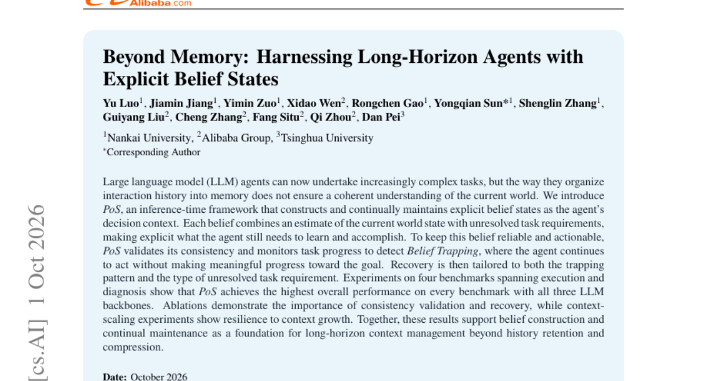

### 📌 한 줄 요약
단순한 이력 저장을 넘어, 명시적 신념 상태(Belief States)를 통해 장기 과업 수행 능력을 극대화하는 에이전트 프레임워크 PoS 제안

### 🔑 핵심 포인트
- 명시적 신념 상태(Belief States)를 통한 세계 상태와 미해결 과업의 결합 관리
- 에이전트가 목표 없이 행동을 반복하는 '신념 함정(Belief Trapping)' 감지 및 복구 메커니즘
- 단순 이력 압축을 넘어선 새로운 형태의 장기 컨텍스트 관리 전략

### 🧑‍💻 개발자 관점
에이전트 개발 시 단순히 과거 대화를 요약하는 것을 넘어, 현재 상태와 남은 과제를 구조화된 데이터로 관리하는 것이 성능 향상에 핵심임을 시사합니다.

### 🚀 실무 적용 아이디어
- 에이전트의 메모리 구조를 '이력 저장'에서 '상태/목표 관리'로 변경하여 성능 비교
- 에이전트가 루프에 빠지는 상황을 재현하고 PoS의 복구 로직 적용 테스트
- LLM의 컨텍스트 윈도우가 커질 때 신념 기반 관리가 얼마나 효율적인지 벤치마크

### ⚠️ 리스크/한계
- 신념 상태를 유지/업데이트하는 과정에서 발생하는 추가적인 추론 비용(Inference Overhead)
- 신념 상태 자체가 잘못 형성되었을 경우 발생하는 오류 전파 가능성

### 📝 초록 기반 상세 설명
LLM 에이전트가 복잡한 과업을 수행함에 있어, 단순한 대화 이력 관리는 현재 세계 상태에 대한 일관된 이해를 보장하지 못하는 문제가 있습니다. 이를 해결하기 위해 본 논문은 추론 단계에서 명시적 신념 상태를 구축하고 유지하는 PoS 프레임워크를 도입합니다. PoS는 현재 세계 상태에 대한 추정치와 미해결 과업 요구사항을 결합하여 에이전트의 의사결정 컨텍스트를 형성합니다. 또한, 에이전트가 의미 없는 행동을 반복하는 '신념 함정(Belief Trapping)'을 감지하고, 일관성 검증 및 맞춤형 복구 메커니즘을 통해 신념의 신뢰성을 유지합니다. 실험 결과, PoS는 다양한 벤치마크에서 기존 방식보다 우수한 성능을 보였으며 컨텍스트 크기 증가에도 강한 회복력을 증명했습니다.

---

## 6. [Sharpening Tax in Post-Training](https://huggingface.co/papers/2610.01509)
**Upvotes**: 80 | **도입 난이도**: 하 | **신뢰도**: 상
**arXiv**: https://arxiv.org/abs/2610.01509

**태그**: LLM, Reinforcement Learning, Agent, Sampling Strategy, RAG, Benchmark, Evaluation, Inference

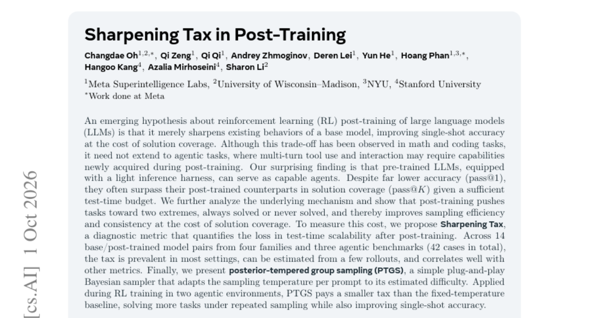

### 📌 한 줄 요약
RL 포스트 트레이닝이 모델의 해결 범위를 좁히고 특정 정답에만 집중하게 만드는 'Sharpening Tax' 현상을 규명하고 이를 완화하는 샘플링 기법을 제안함

### 🔑 핵심 포인트
- RL 포스트 트레이닝이 정답의 일관성은 높이지만 해결 가능한 솔루션 커버리지를 희생시키는 'Sharpening Tax' 현상 발견
- 에이전트 작업에서 포스트 트레인 모델이 베이스 모델보다 낮은 pass@K를 보이는 현상 분석
- 난이도에 따라 샘플링 온도를 적응적으로 조절하는 PTGS(Posterior-tempered Group Sampling) 제안

### 🧑‍💻 개발자 관점
모델의 성능 지표(pass@1)만 보고 최적화할 경우, 에이전트처럼 다양한 경로를 탐색해야 하는 작업에서 모델의 유연성이 급격히 떨어질 수 있음을 경고합니다.

### 🚀 실무 적용 아이디어
- 모델 RL 학습 전후의 pass@1과 pass@K 비율 변화를 비교하여 'Sharpening Tax' 측정하기
- 에이전트 환경에서 고정 온도(Fixed Temperature) 대신 난이도 기반 가변 온도 적용 실험하기
- 학습된 모델이 특정 정답에만 매몰되지 않는지 다양한 샘플링 예산(Test-time budget) 하에서 검증하기

### ⚠️ 리스크/한계
- 제안된 PTGS 방식이 모든 도메인에서 일관된 성능 향상을 보장하는지 추가 검증 필요
- 에이전트 작업의 복잡도에 따라 Sharpening Tax의 영향력이 다르게 나타날 수 있음

### 📝 초록 기반 상세 설명
최근 LLM의 RL 포스트 트레이닝이 기존 능력을 정교화할 뿐, 해결 가능한 문제의 범위를 좁힌다는 가설이 제기되었습니다. 연구진은 에이전트 작업에서 포스트 트레이닝된 모델이 단일 정답률(pass@1)은 높지만, 다양한 해결책을 찾는 능력(pass@K)은 오히려 저하됨을 발견했습니다. 이를 측정하기 위해 테스트 시간 확장성 손실을 정량화하는 'Sharpening Tax' 지표를 제안했습니다. 또한, 프롬프트 난이도에 따라 온도를 조절하는 Bayesian 샘플러인 PTGS를 도입했습니다. 실험 결과, PTGS는 기존 고정 온도 방식보다 낮은 세금을 지불하며 더 넓은 문제 해결 범위를 확보했습니다.

---

## 7. [Hierarchical Continuous Diffusion Language Models](https://huggingface.co/papers/2610.02193)
**Upvotes**: 79 | **도입 난이도**: 상 | **신뢰도**: 상
**arXiv**: https://arxiv.org/abs/2610.02193

**태그**: Diffusion Model, Language Modeling, Generative AI, Reasoning

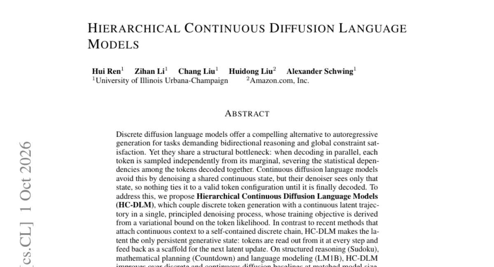

### 📌 한 줄 요약
이산적 토큰 생성과 연속적 잠재 상태를 결합하여, 생성 시 토큰 간 의존성 문제를 해결한 계층적 연속 확산 언어 모델 제안

### 🔑 핵심 포인트
- 이산적 토큰 생성과 연속적 잠재 궤적을 결합한 계층적 구조 설계
- 토큰 생성과 잠재 상태 업데이트 간의 상호 피드백 메커니즘 도입
- 변분 하한(Variational Bound) 기반의 원리적 학습 목적 함수 정의

### 🧑‍💻 개발자 관점
제약 조건 준수가 중요한 퍼즐 해결이나 복잡한 계획 수립 작업에서 기존 자기회귀(AR) 모델의 한계를 극복할 수 있는 새로운 생성 패러다임을 제시합니다.

### 🚀 실무 적용 아이디어
- 제안된 변분 하한(Variational Bound) 수식이 기존 확산 모델과 어떻게 다른지 수학적 검증
- Sudoku와 같은 구조적 추론 태스크에서 기존 LLM과 성능 비교 실험
- 잠재 상태 크기에 따른 생성 품질 및 연산 비용의 트레이드오프 분석

### ⚠️ 리스크/한계
- 이산적 토큰과 연속적 상태를 동시에 최적화하는 과정의 학습 불안정성 가능성
- 기존 자기회귀 모델 대비 대규모 데이터셋에서의 확장성(Scalability) 검증 필요

### 📝 초록 기반 상세 설명
기존의 이산적 확산 언어 모델은 병렬 디코딩 시 토큰 간 통계적 의존성이 끊어지는 구조적 병목 현상을 가집니다. 반면 연속적 확산 모델은 토큰 구성과의 연결성이 부족하여 유효한 텍스트 생성이 어렵다는 문제가 있습니다. 이를 해결하기 위해 본 논문은 이산적 토큰 생성과 연속적 잠재 궤적을 단일 노이징 과정에 결합한 HC-DLM을 제안합니다. 제안된 모델은 잠재 상태를 유일한 생성 상태로 유지하며, 토큰을 잠재 상태에서 읽어내고 이를 다시 다음 업데이트의 스캐폴드로 피드백하는 방식을 취합니다. 실험 결과, Sudoku, Countdown, LM1B 데이터셋에서 기존 이산/연속 확산 베이스라인 대비 성능 향상을 입증했습니다.

### 🖼️ 추가 자료
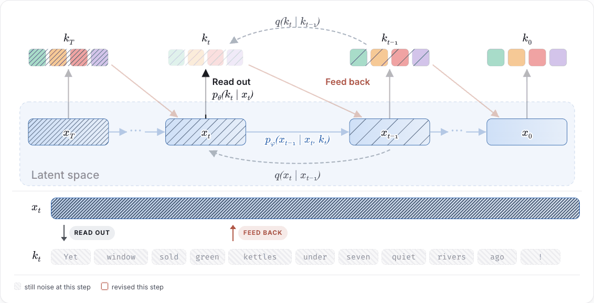

---

## 8. [Agent Priors-guided Policy Learning](https://huggingface.co/papers/2609.35690)
**Upvotes**: 74 | **도입 난이도**: 상 | **신뢰도**: 상
**arXiv**: https://arxiv.org/abs/2609.35690

**태그**: Robotics, Reinforcement Learning, Skill Composition, Generalization, Agent

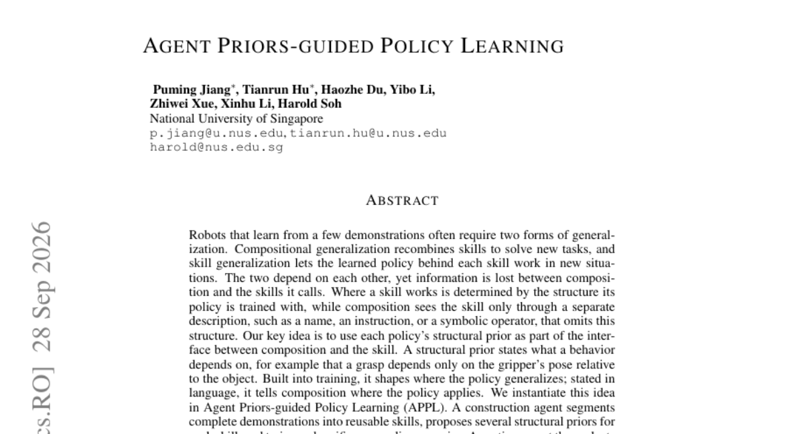

### 📌 한 줄 요약
정책의 구조적 사전 지식(Structural Prior)을 활용하여 스킬 학습과 조합 간의 간극을 메우고 새로운 작업에 대한 일반화 성능을 높인 프레임워크

### 🔑 핵심 포인트
- 스킬의 구조적 사전 지식(Structural Prior)을 활용한 스킬-조합 간 인터페이스 설계
- 데모를 재사용 가능한 스킬로 분할하고, 각 스킬에 대해 여러 구조적 가정을 적용하여 학습하는 자동화 파이프라인
- 학습 시 정의된 구조적 제약이 실행 시 스킬 선택 및 조합의 가이드 역할을 수행

### 🧑‍💻 개발자 관점
복잡한 로봇 작업을 수행할 때, 개별 스킬의 물리적 특성을 유지하면서도 새로운 작업 조합에 유연하게 대응할 수 있는 구조적 설계 방식을 제시합니다.

### 🚀 실무 적용 아이디어
- 제시된 구조적 사전 지식(예: 그리퍼 포즈와 물체 간 관계)이 실제 물리 환경에서 유효한지 검증
- 기존의 단순한 스킬 명칭 기반 조합 방식과 APPL 방식의 성능 차이 비교 실험
- 다양한 환경 변화(OOD) 상황에서 구조적 제약이 일반화에 미치는 영향 분석

### ⚠️ 리스크/한계
- 스킬의 구조적 특징을 수동으로 정의하거나 모델링하는 과정이 복잡할 수 있음
- 잘못된 구조적 사전 지식이 설정될 경우 스킬의 적용 범위가 과도하게 제한될 위험이 있음

### 📝 초록 기반 상세 설명
로봇이 소수의 데모로부터 학습할 때, 스킬의 조합(Compositional)과 스킬 자체의 일반화(Skill generalization)가 서로 의존적임에도 불구하고 정보 손실이 발생하는 문제가 있습니다. 기존 방식은 스킬을 단순한 이름이나 기호로만 취급하여 스킬의 구조적 특성을 조합 과정에 반영하지 못합니다. 본 논문은 각 정책의 구조적 사전 지식(Structural Prior)을 스킬과 조합 인터페이스 사이의 가교로 사용하는 APPL 방식을 제안합니다. 학습 시에는 스킬이 무엇에 의존하는지 정의하고, 실행 시에는 이 사전 지식을 바탕으로 적절한 정책을 선택하고 조합합니다. 실험 결과, MetaWorld 및 ManiSkill 환경에서 OOD(Out-of-distribution) 일반화와 미학습 스킬 조합 성능이 크게 향상되었습니다.

---

## 9. [World Observer: Joint Actor-Observer Generation for Persistent World Modeling](https://huggingface.co/papers/2610.02162)
**Upvotes**: 72 | **도입 난이도**: 상 | **신뢰도**: 상
**arXiv**: https://arxiv.org/abs/2610.02162

**태그**: World Model, Computer Vision, Agent Simulation, Video Generation, Agent, RAG, Video, Benchmark, Evaluation

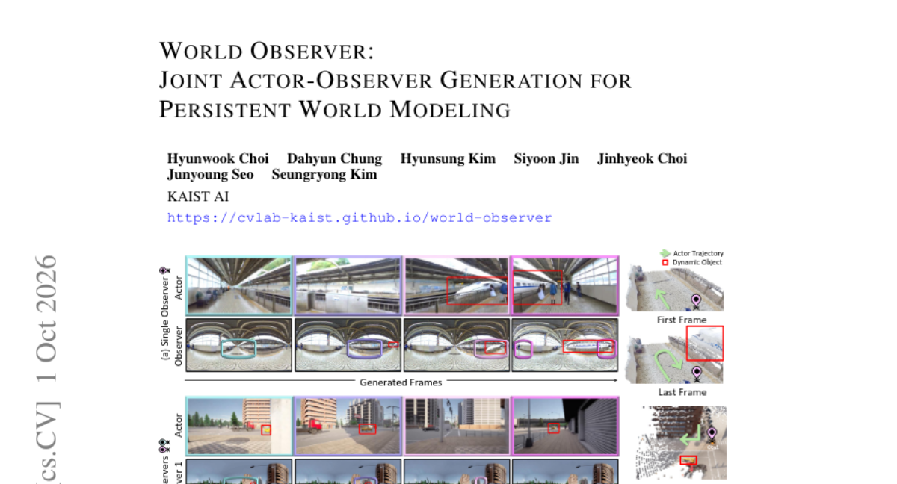

### 📌 한 줄 요약
에이전트의 시야 밖에서도 객체의 상태를 지속적으로 유지하는 탈중심적 월드 모델링 프레임워크

### 🔑 핵심 포인트
- 에이전트 시점과 관찰자 시점의 분리를 통한 탈중심적 월드 모델링 구현
- 공유 파노라마 소스와 워핑을 통한 에이전트-옵저버 간 명시적 기하학적 일관성 확보
- Observer Sink를 활용한 시야 재진입 시 고해상도 외형 복원 기능

### 🧑‍💻 개발자 관점
에이전트가 이동하며 탐사하는 가상 환경이나 로봇 시뮬레이션에서, 보이지 않는 곳의 객체 상태를 일관되게 유지해야 하는 문제에 대한 해결책을 제시합니다.

### 🚀 실무 적용 아이디어
- 에이전트 시야 밖 객체의 상태 변화(예: 움직임, 상태 변화)가 재진입 시 얼마나 정확한지 테스트
- 다중 옵저버 배치 시 연산 비용과 시각적 일관성 사이의 트레이드오프 분석
- 제공된 벤치마크를 활용하여 기존 에이전트 중심 모델과 비교 실험 수행

### ⚠️ 리스크/한계
- 다중 옵저버 운용 시 증가하는 연산 복잡도 및 메모리 요구량
- 파노라마 소스 기반 워핑 시 발생할 수 있는 기하학적 왜곡 가능성

### 📝 초록 기반 상세 설명
기존의 비디오 월드 모델은 에이전트 중심의 시야에 국한되어, 객체가 시야를 벗어나면 그 상태와 역학을 유지하지 못하는 문제가 있었습니다. 이를 해결하기 위해 에이전트의 시점과 별개로 특정 영역을 관찰하는 '옵저버(Observer)'를 결합한 World Observer를 제안합니다. 이 방식은 에이전트와 옵저버를 공유된 파노라마 소스에서 워핑(Warping)하여 기하학적 대응을 확보하고, 고해상도 참조를 위한 Observer Sink를 도입합니다. 이를 통해 시야 밖의 객체도 지속적으로 진화하며, 재진입 시 업데이트된 상태를 유지할 수 있습니다. 실험 결과, 제안 모델은 시야 밖 역학(out-of-view dynamics)을 크게 개선하면서도 시각적 충실도와 3D 정렬 성능을 유지함을 입증했습니다.

---

## 10. [A Missing Piece for Trustworthy AI Reviewers: From Benchmarking Rhetorical Robustness to SciCore Review](https://huggingface.co/papers/2609.39027)
**Upvotes**: 70 | **도입 난이도**: 중 | **신뢰도**: 상
**arXiv**: https://arxiv.org/abs/2609.39027

**태그**: LLM-Agent, Evaluation, NLP, RAG, Benchmark, Safety

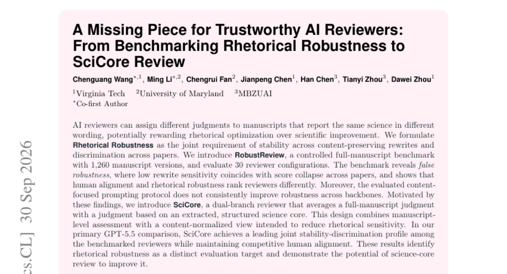

### 📌 한 줄 요약
문장 표현 방식에 따라 점수가 변하는 문제를 해결하기 위해, 핵심 과학적 내용(Science Core)을 추출하여 평가하는 새로운 AI 리뷰 방식 제안

### 🔑 핵심 포인트
- 수사적 강건성(Rhetorical Robustness)이라는 새로운 평가 지표 및 벤치마크(RobustReview) 도입
- 문장 표현 변화에 민감한 기존 AI 리뷰어의 취약점 식별
- 핵심 과학 내용(SciCore) 추출을 통한 이중 분기 평가 메커니즘 제안

### 🧑‍💻 개발자 관점
LLM 기반 에이전트가 문서의 형식이나 말투에 휘둘리지 않고 본질적인 정보(Content)를 정확히 판단하게 만드는 설계 패턴을 제공합니다.

### 🚀 실무 적용 아이디어
- 동일한 정보를 담고 있지만 말투가 다른 두 문서를 LLM에 입력하여 점수 편차 측정하기
- 문서의 핵심 정보만 추출하는 구조화된 프롬프트와 전체 문장 프롬프트의 결과 비교하기
- 핵심 내용 추출(Extraction) 단계와 전체 평가(Assessment) 단계를 분리하는 파이프라인 구축하기

### ⚠️ 리스크/한계
- 핵심 내용 추출 과정에서 중요한 맥락이나 세부 사항이 누락될 위험이 있음
- 추출된 '핵심 내용' 자체가 편향되거나 불완전할 경우 전체 평가의 신뢰도가 하락함

### 📝 초록 기반 상세 설명
AI 리뷰어가 동일한 과학적 내용을 다른 문체로 작성했을 때 서로 다른 점수를 부여하여 수사적 최적화가 과학적 개선보다 우선시되는 문제가 발생할 수 있습니다. 이를 해결하기 위해 문장 재작성 시의 안정성과 논문 간 변별력을 동시에 고려하는 '수사적 강건성(Rhetorical Robustness)' 개념을 정의했습니다. 연구진은 1,260개의 원고 버전을 포함한 RobustReview 벤치마크를 구축하여 30가지 리뷰어 설정을 평가했습니다. 실험 결과, 기존의 프롬프트 엔지니어링만으로는 수사적 강건성을 확보하기 어려움을 확인했습니다. 이에 따라 전체 원고 평가와 구조화된 핵심 과학 내용(SciCore) 평가를 결합한 이중 분기 리뷰 모델을 제안했습니다. 최종적으로 SciCore는 인간의 평가와 정렬을 유지하면서도 수사적 변화에 흔들리지 않는 우수한 성능을 입증했습니다.

---

## 11. [Transformers Stop Thinking Too Early, and a Tiny LoRA Fixes It](https://huggingface.co/papers/2609.36585)
**Upvotes**: 63 | **도입 난이도**: 하 | **신뢰도**: 상
**arXiv**: https://arxiv.org/abs/2609.36585

**태그**: LLM, LoRA, Reasoning, Fine-tuning

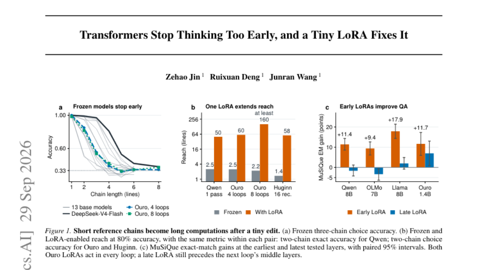

### 📌 한 줄 요약
사전 학습된 트랜스포머의 잠재력을 끌어올리기 위해 아주 작은 LoRA 레이어만 추가하여 문맥 추론 능력을 극대화하는 방법론

### 🔑 핵심 포인트
- 사전 학습된 모델의 깊이 활용 부족 문제를 해결하기 위해 특정 레이어에 작은 LoRA를 삽입
- LoRA가 레이어 간 정보 전달(Relay)을 유도하여 문맥 참조 범위를 확장
- 모델 전체를 재학습하지 않고도 복잡한 추론 작업의 정확도를 극적으로 향상

### 🧑‍💻 개발자 관점
모델 전체를 파인튜닝하는 대신, 특정 레이어에 아주 작은 LoRA만 삽입함으로써 적은 비용으로 추론 능력을 비약적으로 높일 수 있는 실용적인 전략을 제시합니다.

### 🚀 실무 적용 아이디어
- 특정 레이어에 rank가 낮은 LoRA를 삽립하여 문맥 추론 성능 변화 관찰하기
- 모델의 어느 레이어가 추론 릴레이에 가장 효과적인지 위치별 실험 수행
- 긴 문맥 추론이 필요한 태스크에 대해 LoRA 기반의 레이어 확장 실험

### ⚠️ 리스크/한계
- 특정 태스크에 특화된 LoRA이므로 일반적인 범용 성능 향상과는 차이가 있을 수 있음
- 레이어 위치 선정에 따라 성능 변화가 민감할 수 있음

### 📝 초록 기반 상세 설명
사전 학습된 트랜스포머 모델들은 모델의 깊이에 비해 문맥 내 참조를 따라가는 추론 능력을 충분히 활용하지 못하는 경향이 있습니다. 연구진은 모델의 가중치를 동결한 채 특정 초기 레이어에 아주 작은 rank-8 LoRA를 추가하는 방식을 제안했습니다. 실험 결과, Qwen3-8B 모델은 24라인의 복잡한 추론 작업에서 정확도가 15.5%에서 99%로 비약적으로 상승했습니다. 이 LoRA는 레이어 간 정보를 전달하는 '릴레이' 역할을 수행하며 모델이 더 긴 문맥을 처리할 수 있게 합니다. 결과적으로 아주 작은 파라미터 수정만으로도 모델의 기본 성능을 크게 개선할 수 있음을 입증했습니다.

---

## 12. [ActiveSaddler: Automated Curriculum Learning for Agent Harness Optimization](https://huggingface.co/papers/2610.00906)
**Upvotes**: 60 | **도입 난이도**: 상 | **신뢰도**: 상
**arXiv**: https://arxiv.org/abs/2610.00906

**태그**: LLM Agent, Curriculum Learning, Automated Optimization, Reinforcement Learning, Agent

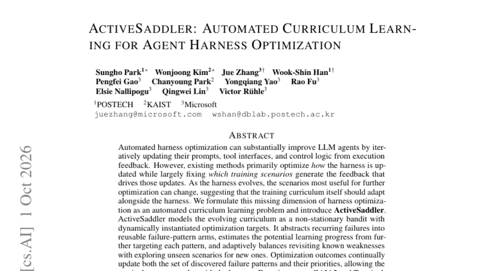

### 📌 한 줄 요약
에이전트의 프롬프트와 도구 인터페이스를 최적화할 때, 학습 시나리오를 동적으로 변화시켜 최적화 효율을 극대화하는 커리큘럼 학습 프레임워크입니다.

### 🔑 핵심 포인트
- 하네스 최적화와 시나리오 구성을 결합한 동적 커리큘럼 학습 프레임워크 제안
- 실패 패턴을 추상화하여 재사용 가능한 밴딧(Bandit) 문제로 모델링
- 학습 진척도 추정을 통한 새로운 실패 패턴 발견과 기존 약점 보완의 동적 균형

### 🧑‍💻 개발자 관점
에이전트 성능 향상을 위해 단순히 프롬프트만 고치는 것이 아니라, 어떤 테스트 케이스를 학습에 사용할지가 성능의 핵심임을 시사합니다.

### 🚀 실무 적용 아이디어
- 고정된 벤치마크 데이터셋 대신 에이전트의 실패를 기반으로 한 동적 데이터 생성 파이프라인 구축
- 실패 패턴을 클러스터링하여 학습 우선순위를 결정하는 로직 실험
- 에이전트 성능 향상과 시나리오 난이도 사이의 상관관계 분석

### ⚠️ 리스크/한계
- 실패 패턴 추상화 과정에서 발생할 수 있는 편향(Bias) 문제
- 시나리오 생성 및 최적화 루프 운영에 따른 높은 컴퓨팅 비용

### 📝 초록 기반 상세 설명
LLM 에이전트의 성능을 높이기 위해 프롬프트와 제어 로직을 업데이트하는 하네스 최적화 연구가 활발히 진행되고 있습니다. 그러나 기존 방식은 고정된 시나리오를 사용하여 에이전트가 진화함에 따라 변화하는 학습 요구사항을 반영하지 못하는 한계가 있습니다. 본 논문은 하네스 최적화 과정에서 학습 시나리오를 동적으로 구성하는 커리큘럼 학습 문제를 제안하며, 이를 위해 ActiveSaddler를 도입합니다. ActiveSaddler는 실패 패턴을 재사용 가능한 옵션으로 추상화하고, 각 패턴의 학습 잠재력을 추정하여 탐색과 활용 사이의 균형을 맞춥니다. 실험 결과, GAIA2 및 Terminal-Bench 2.0에서 고정된 시나리오 방식보다 Pass@1 성능을 유의미하게 향상시켰습니다.

---

## 13. [ROWBench: Do Video Models Render What the Program Specifies?](https://huggingface.co/papers/2610.02205)
**Upvotes**: 60 | **도입 난이도**: 중 | **신뢰도**: 상
**arXiv**: https://arxiv.org/abs/2610.02205

**태그**: World Models, Video Generation, Benchmark, VLM, Video, Evaluation, Safety

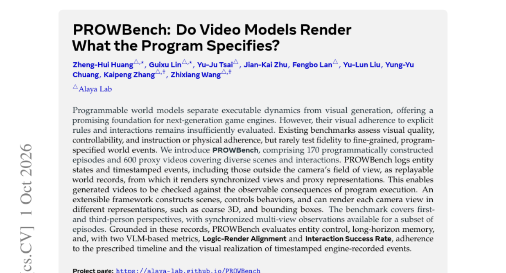

### 📌 한 줄 요약
프로그램 기반 월드 모델이 명시된 규칙과 이벤트를 시각적으로 얼마나 정확하게 구현하는지 검증하는 벤치마크 프레임워크 제안

### 🔑 핵심 포인트
- 프로그램 실행 기록과 시각적 결과 간의 정렬을 검증하는 PROWBench 프레임워크 개발
- 카메라 시야 밖의 이벤트와 엔티티 상태를 포함한 정밀한 월드 레코드 기반 평가 체계 구축
- VLM을 활용한 Logic-Render Alignment 및 Interaction Success Rate 지표 도입

### 🧑‍💻 개발자 관점
시뮬레이션 환경에서 물리 법칙이나 논리 규칙이 시각적 생성 결과물에 정확히 반영되는지 정량적으로 측정할 수 있는 기준을 제공합니다.

### 🚀 실무 적용 아이디어
- 기존 비디오 생성 모델을 PROWBench의 시나리오에 적용하여 논리적 일관성 테스트
- VLM 기반의 새로운 평가 지표(Logic-Render Alignment)를 기존 벤치마크에 적용해보기
- 프로그램 기반 월드 모델의 시각적 충실도와 물리적 정확도 간의 상관관계 분석

### ⚠️ 리스크/한계
- VLM 기반 평가 지표가 실제 물리적 정확도를 완벽히 대변하지 못할 가능성
- 프로그램 설계 방식에 따라 벤치마크 결과가 편향될 수 있는 위험

### 📝 초록 기반 상세 설명
차세대 게임 엔진의 기반이 될 프로그래밍 가능한 월드 모델은 실행 가능한 역학(dynamics)과 시각적 생성을 분리하는 데 강점이 있습니다. 그러나 기존 벤치마크는 미세한 프로그램 규칙과 상호작용에 대한 시각적 충실도를 평가하는 데 한계가 있었습니다. 본 논문은 170개의 에피소드와 6항의 프록시 비디오를 포함하는 PROWBench를 제안합니다. 이 프레임워크는 프로그램 실행 기록(entity states, timestamped events)을 기반으로 생성된 비디오가 엔진의 기록과 일치하는지 검증할 수 있는 구조를 갖추고 있습니다. 이를 통해 엔티티 제어, 장기 기억, 그리고 논리적 렌더링 정렬(Logic-Render Alignment) 등을 종합적으로 평가합니다.

---

## 14. [E-MoE: Enhanced Mixture-of-Experts for Non-Factorized Diffusion Language Models](https://huggingface.co/papers/2609.37533)
**Upvotes**: 59 | **도입 난이도**: 중 | **신뢰도**: 상
**arXiv**: https://arxiv.org/abs/2609.37533

**태그**: Diffusion Models, Mixture-of-Experts, Generative Models, NLP, Benchmark

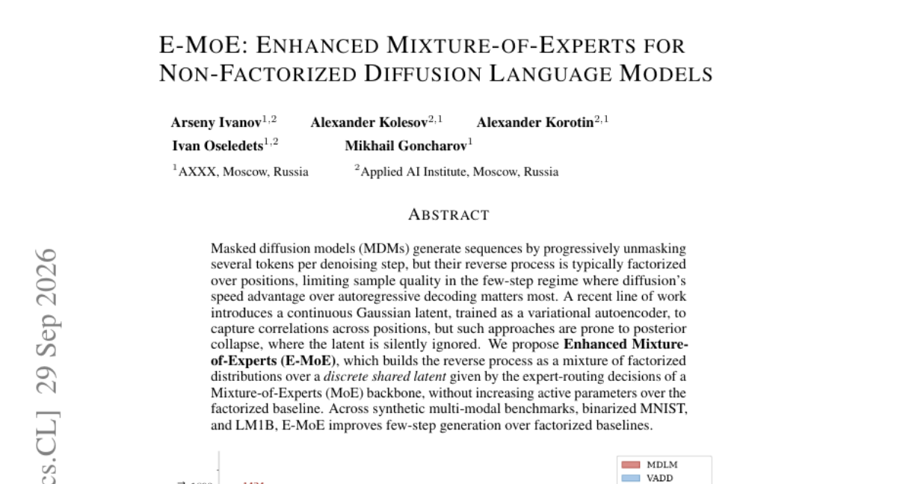

### 📌 한 줄 요약
MoE 구조를 활용하여 적은 단계의 디퓨전 생성 과정에서 발생하는 위치 간 상관관계 문제를 해결하고 생성 품질을 높인 연구

### 🔑 핵심 포인트
- MoE의 전문가 라우팅을 활용한 이산적 공유 잠재 변수 도입
- 활성 파라미터 증가 없이 위치 간 상관관계를 포착하는 비분리형(Non-factorized) 구조 구현
- 적은 단계(few-step) 생성 시 발생하는 품질 저하 및 후험 붕괴 문제 해결

### 🧑‍💻 개발자 관점
적은 연산량(few-step)으로도 고품질의 텍스트/시퀀스 생성이 필요한 실시간 생성 모델 개발에 중요한 아이디어를 제공합니다.

### 🚀 실무 적용 아이디어
- 기존 Masked Diffusion 모델에 MoE 라우팅 기반의 잠재 변수 주입 실험
- 학습 시 발생하는 후험 붕괴(posterior collapse) 현상 모니터링
- 파라미터 효율성 측면에서 기존 분리형 모델과 성능/속도 비교

### ⚠️ 리스크/한계
- MoE 라우팅 결정이 특정 전문가에 쏠릴 경우 발생할 수 있는 학습 불안정성
- 이산적 잠재 변수 구조가 복잡한 데이터 분포를 충분히 표현할 수 있는지에 대한 검증 필요

### 📝 초록 기반 상세 설명
기존의 Masked Diffusion Models(MDMs)는 역과정에서 위치별로 분리된(factorized) 방식을 사용하여 적은 단계의 생성 시 품질이 저하되는 문제가 있었습니다. 이를 해결하기 위해 연속적인 가우시안 잠재 변수를 사용하는 방식이 제안되었으나, 이는 잠재 변수가 무시되는 후험 붕괴(posterior collapse) 현상에 취약했습니다. 본 논문은 MoE 백본의 전문가 라우팅 결정을 통해 이산적 공유 잠재 변수를 생성하는 E-MoE 방식을 제안합니다. 이 방식은 활성 파라미터 수를 늘리지 않으면서도 위치 간 상관관계를 포착할 수 있는 혼합 분포를 구축합니다. 실험 결과, MNIST 및 LM1B 등 다양한 벤치마크에서 기존 분리형 모델 대비 적은 단계에서의 생성 성능을 크게 개선했습니다.

---

## 15. [Make Sparse Rewards Count: Density-Aware Reward Aggregation for Multi-Reward RL](https://huggingface.co/papers/2610.00574)
**Upvotes**: 50 | **도입 난이도**: 하 | **신뢰도**: 상
**arXiv**: https://arxiv.org/abs/2610.00574

**태그**: Reinforcement Learning, LLM, Reward Shaping, Optimization, Reasoning

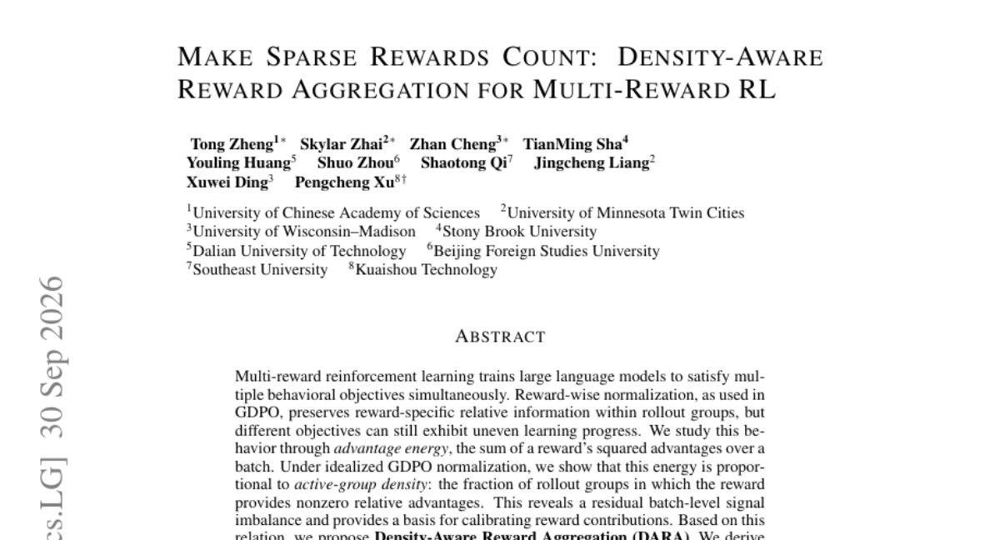

### 📌 한 줄 요약
다중 보상 RL 학습 시 발생하는 보상 간 불균형 문제를 밀도 기반 가중치 조절로 해결하여 학습 속도를 대폭 개선한 연구

### 🔑 핵심 포인트
- 보상 간 학습 불균형이 활성 그룹 밀도(Active-group density)와 관련이 있음을 이론적으로 규명
- 밀도 기반 역 제곱근 보정(Inverse-square-root density correction)을 통한 DARA 알고리즘 제안
- 정책 최적화 목적 함수를 수정하지 않고 배치 단위 가중치 조절만으로 학습 효율 극대화

### 🧑‍💻 개발자 관점
여러 가지 제약 조건(포맷 준수, 길이 제한 등)을 동시에 만족해야 하는 LLM RL 학습 시, 특정 보상이 지배하여 다른 보상이 무시되는 현상을 방지할 수 있습니다.

### 🚀 실무 적용 아이디어
- 기존 GDPO/PPO 기반 다중 보상 학습 코드에 DARA 가중치 계산 로직 적용 테스트
- 보상 간 스케일 차이가 큰 데이터셋(예: 수학 문제 + 코드 생성)에서 성능 향상 검증
- 학습 단계별 보상 밀도 변화에 따른 가중치 수렴성 모니터링

### ⚠️ 리스크/한계
- 배치 크기에 따라 밀도 계산이 민감하게 반응할 수 있음
- 최종 성능(Final performance) 측면에서는 기존 방식과 유사할 수 있어 학습 속도 개선이 주된 이점임

### 📝 초록 기반 상세 설명
LLM이 여러 행동 목표를 동시에 달형하도록 하는 다중 보상 강화학습(Multi-reward RL)에서는 각 보상 간의 학습 진척도 차이가 발생하는 문제가 있습니다. 연구진은 보상의 'Advantage Energy'가 활성 그룹 밀도(Active-group density)에 비례한다는 점을 발견하여, 보상 간 불균형이 발생하는 원인을 규명했습니다. 이를 해결하기 위해 보상 기여도를 교정하는 Density-Aware Reward Aggregation(DARA) 기법을 제안합니다. DARA는 배치 단위로 밀도를 계산하여 빈도가 낮은 보상에 더 높은 가중치를 부여하는 역 제곱근 보정 방식을 사용합니다. 실험 결과, DARA는 기존 GDPO 대비 도구 호출 및 수학적 추론 작업에서 훨씬 적은 학습 단계만으로도 목표 성능에 도달하는 효율성을 보였습니다.

---

## 16. [AutoGUIWorld: Image Generators as Visual World Models for GUI Agent](https://huggingface.co/papers/2610.01215)
**Upvotes**: 50 | **도입 난이도**: 중 | **신뢰도**: 상
**arXiv**: https://arxiv.org/abs/2610.01215

**태그**: GUI-Agent, Synthetic-Data, Image-Generation, Automation, Agent, RAG, Vision

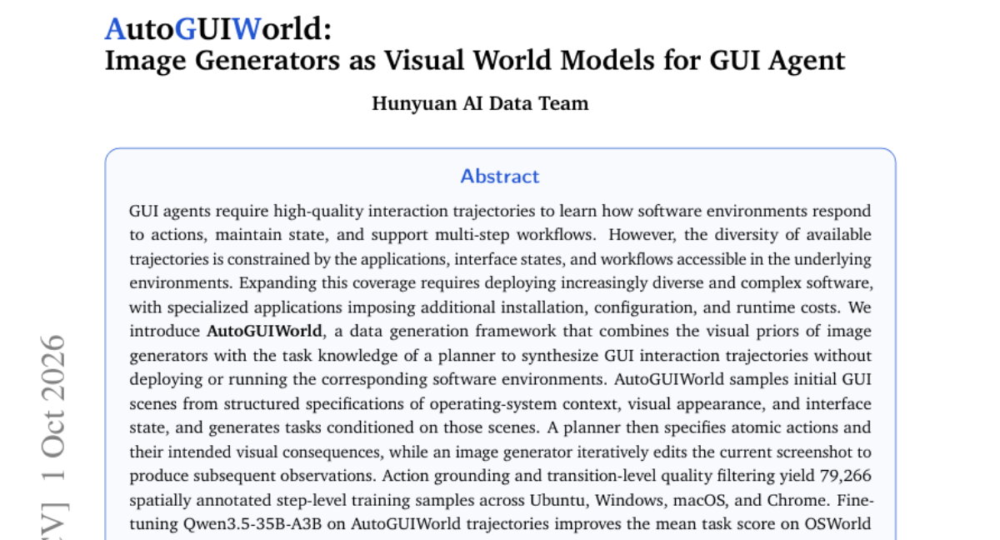

### 📌 한 줄 요약
실제 소프트웨어 설치 없이 이미지 생성 모델을 활용해 고품질 GUI 상호작용 데이터를 합성하는 프레임워크

### 🔑 핵심 포인트
- 이미지 생성 모델을 활용한 가상 GUI 환경 및 상호작용 궤적 합성 기술
- 실제 소프트웨어 설치/실행 없이도 다양한 OS(Ubuntu, Windows, macOS 등) 환경 데이터 확보 가능
- 플래너와 이미지 생성기를 결합하여 액션에 따른 시각적 변화를 정교하게 모사

### 🧑‍💻 개발자 관점
GUI 에이전트 개발 시 발생하는 데이터 수집 및 환경 구축 비용을 획기적으로 줄이면서도, 합성 데이터를 통해 모델의 일반화 성능을 높일 수 있습니다.

### 🚀 실무 적용 아이디어
- 제시된 플래너-이미지 생성 루프를 활용한 합성 데이터 품질 검증 실험
- 특정 도메인(예: 디자인 툴) 전용 GUI 데이터셋 생성 시나리오 테스트
- 합성 데이터로 학습된 모델과 실제 환경 간의 도메인 격차(Sim-to-Real) 측정

### ⚠️ 리스크/한계
- 이미지 생성 모델의 시각적 오류가 에이전트의 잘못된 행동 학습으로 이어질 위험
- 복잡한 동적 위젯이나 실시간 상호작용이 포함된 정교한 UI 재현의 한계

### 📝 초록 기반 상세 설명
GUI 에이전트 학습을 위해서는 다양한 환경에서의 상호작용 데이터가 필요하지만, 실제 소프트웨어를 설치하고 실행하는 데는 비용과 복잡성이 따릅니다. 이를 해결하기 위해 본 논문은 이미지 생성 모델의 시각적 사전 지식과 플래너의 작업 지식을 결합한 AutoGUIWorld 프레임워크를 제안합니다. 이 프레임워크는 OS 환경과 인터페이스 상태를 반영한 장면을 샘플링한 후, 플래너가 액션과 그에 따른 시각적 변화를 정의하면 이미지 생성기가 반복적으로 스크린샷을 편집하며 궤적을 생성합니다. 생성된 데이터를 통해 학습한 결과, OSWorld 및 ScienceBoard와 같은 실제 데스크톱 및 과학 작업 벤치마크에서 성능이 크게 향상되었습니다. 결과적으로 실제 환경 배포 없이도 풍부한 GUI 학습 데이터를 확보할 수 있음을 입증했습니다.

---

## 17. [EgoTools: Towards Tool-Centric Reasoning in Real-World Egocentric Videos](https://huggingface.co/papers/2609.39378)
**Upvotes**: 47 | **도입 난이도**: 중 | **신뢰도**: 상
**arXiv**: https://arxiv.org/abs/2609.39378

**태그**: Embodied AI, Egocentric Vision, VLM, Dataset, Agent, Reasoning, Multimodal, Video, Audio, Benchmark, Evaluation

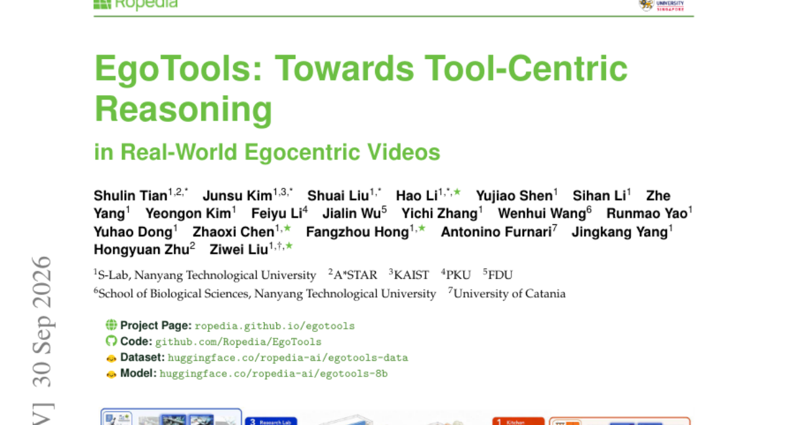

### 📌 한 줄 요약
실제 환경의 도구 사용 능력을 학습하고 평가하기 위한 대규모 1인칭 시점(Egocentric) 데이터셋 및 벤치마크 제안

### 🔑 핵심 포인트
- 100시간 규모의 1인칭 도구 사용 중심 데이터셋(EgoTools-Data) 구축
- 지각, 기하학, 절차, 인과 관계를 아우르는 4개 트랙의 진단 벤치마크(EgoTools-Bench) 개발
- 데이터셋을 활용한 SFT가 모델의 도구 중심 추론 성능을 개선함을 검증

### 🧑‍💻 개발자 관점
로봇 제어, AR/VR 에이전트, 가사 보조 AI 개발 시 필수적인 '도구 상호작용' 능력을 학습하고 평가할 수 있는 실질적 프레임워크를 제공합니다.

### 🚀 실무 적용 아이디어
- 제안된 데이터셋을 활용하여 기존 VLM 모델의 도구 사용 추론 성능 측정
- EgoTools-Data를 활용한 도구 중심 SFT(Supervised Fine-Tuning) 실험 수행
- 시각적 근거(Grounding)와 인과 추론 간의 상관관계 분석

### ⚠️ 리스크/한계
- 1인칭 시점 데이터 특성상 카메라 움직임과 손 움직임에 따른 데이터 편향 가능성
- 실제 물리적 환경의 복잡성을 완전히 반영하기에는 데이터셋의 범주가 제한적일 수 있음

### 📝 초록 기반 상세 설명
현실 세계의 로봇 및 에이전트 작업은 도구 사용을 통한 물리적 상호작용이 핵심적이지만, 기존 멀티모달 모델은 도구 중심의 추론 능력이 부족합니다. 이는 실생활 1인칭 데이터와 정밀한 진단 용 벤치마크의 부재로 인해 발생해 왔습니다. 본 논문은 이를 해결하기 위해 100시간 분량의 정교한 1인칭 데이터셋인 EgoTools-Data와 4가지 추론 트랙을 포함한 벤치마크인 EgoTools-Bench를 제안합니다. 실험 결과, 최신 모델들도 시각적 근거에 기반한 도구 사용 능력은 여전히 부족함을 확인했습니다. 또한, 제안된 데이터셋을 활용한 미세 조정(SFT)이 모델의 도구 이해 성능을 유의미하게 향상시킴을 입증했습니다.

---

## 18. [Retrieval-Augmented Skill Optimization via Cross-Harness Adaptation](https://huggingface.co/papers/2609.38024)
**Upvotes**: 46 | **도입 난이도**: 중 | **신뢰도**: 상
**arXiv**: https://arxiv.org/abs/2609.38024

**태그**: Agent, RAG, Skill-Optimization, LLM, Benchmark, Evaluation

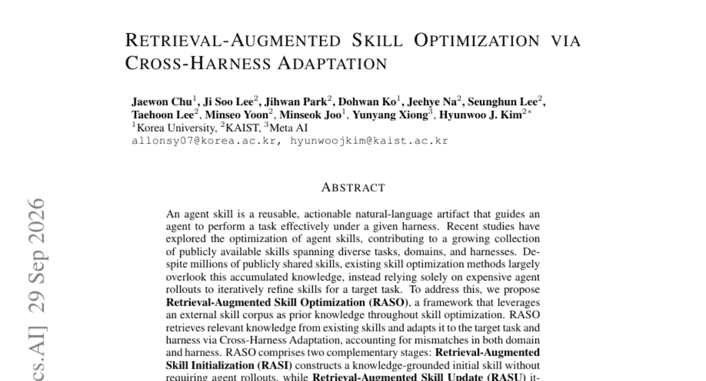

### 📌 한 줄 요약
기존의 방대한 스킬 라이브러리를 활용하여 에이전트의 작업 수행 능력을 효율적으로 최적화하는 RAG 기반 프레임워크 제안

### 🔑 핵심 포인트
- 외부 스킬 코퍼스를 활용한 Retrieval-Augmented Skill Optimization (RASO) 프레임워크 제안
- 도메인 및 환경 차이를 극복하는 Cross-Harness Adaptation 기술 적용
- 초기화(RASI)와 반복적 업데이트(RASU)를 통한 효율적인 스킬 최적화 프로세스 구축

### 🧑‍💻 개발자 관점
에이전트 학습 시 매번 처음부터 학습하는 대신, 기존에 잘 만들어진 스킬들을 검색/활용함으로써 학습 비용을 획기적으로 줄일 수 있습니다.

### 🚀 실무 적용 아이디어
- 기존에 보유한 에이전트 스킬 데이터셋을 RAG용 코퍼스로 구축해보기
- 도메인이 다른 환경에서 기존 스킬이 얼마나 잘 전이되는지 성능 테스트하기
- 실행 피드백(Execution Feedback)을 검색 쿼리로 변환하는 로직 실험하기

### ⚠️ 리스크/한계
- 검색된 스킬이 타겟 작업과 관련성이 낮을 경우 성능 저하 가능성
- 외부 코퍼스의 품질이 전체 시스템 성능의 상한선을 결정할 위험

### 📝 초록 기반 상세 설명
에이전트 스킬은 특정 환경에서 작업을 수행하기 위한 재사용 가능한 자연어 지침입니다. 기존의 스킬 최적화 방식은 이미 축적된 방대한 스킬 데이터 대신 비용이 많이 드는 에이전트 롤아웃(rollout)에만 의존하는 한계가 있었습니다. 이를 해결하기 위해 외부 스킬 코퍼스를 사전 지식으로 활용하는 RASO 프레임워크를 제안합니다. RASO는 Cross-Harness Adaptation을 통해 도메인과 환경이 다른 기존 스킬을 타겟 작업에 맞게 적응시킵니다. 초기 스킬 생성(RASI)과 피드백 기반 업데이트(RASU)의 두 단계로 구성되어 효율적인 최적화를 수행합니다. 실험 결과, RASO는 다양한 벤치마크에서 기존 방식보다 우수한 성능을 입증했습니다.

---

## 19. [X-Tree: Tokenizing Reusable Experience for Efficient Agent Generalization](https://huggingface.co/papers/2609.32993)
**Upvotes**: 45 | **도입 난이도**: 중 | **신뢰도**: 상
**arXiv**: https://arxiv.org/abs/2609.32993

**태그**: Agent, Reinforcement Learning, Hierarchical Learning, Fine-tuning, RAG, Evaluation, Distillation

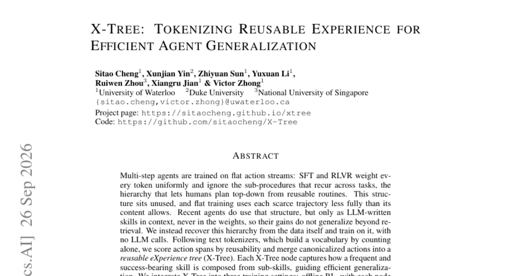

### 📌 한 줄 요약
데이터에서 재사용 가능한 스킬 계층을 추출하여 에이전트의 일반화 성능을 높이는 X-Tree 학습 프레임워크

### 🔑 핵심 포인트
- 데이터 기반의 재사용 가능한 스킬 계층(X-Tree) 자동 추출 기술 개발
- LLM 호출 없이 텍스트 토크나이저와 유사한 방식으로 스킬 구조를 학습 가중치에 반영
- 오프라인/온라인 RL 및 자기 증류 등 다양한 학습 환경에 적용 가능한 범용적 구조

### 🧑‍💻 개발자 관점
에이전트 학습 시 단순 데이터 증강을 넘어, 데이터 내에 숨겨진 '재사용 가능한 패턴'을 구조화하여 학습 효율을 극대화하는 방법을 제시합니다.

### 🚀 실무 적용 아이디어
- 기존의 평면적 SFT 데이터셋에 X-Tree와 같은 계층적 구조를 적용하여 성능 변화 관찰
- 에이전트의 특정 작업(Task) 단위가 아닌, 하위 루틴(Sub-routine) 단위의 데이터 분할 실험
- 학습된 스킬 노드를 RL 보상 함수나 컨텍스트로 활용하는 파이프라인 구축

### ⚠️ 리스크/한계
- 데이터의 품질과 빈도에 의존적인 스킬 추출 방식의 편향 가능성
- 복잡한 계층 구조 생성 시 계산 복잡도 증가 우려

### 📝 초록 기반 상세 설명
기존의 멀티스텝 에이전트 학습은 평면적인 액션 스트림을 사용하여 반복되는 하위 절차나 계층적 구조를 충분히 활용하지 못하는 문제가 있습니다. 최근에는 컨텍스트 내 스킬 활용 방식이 제안되었으나, 이는 가중치에 반영되지 않아 일반화에 한계가 있습니다. 본 논문은 데이터 자체에서 계층 구조를 복구하는 X-Tree를 제안하며, 재사용 가능한 액션 스팬을 점수화하여 트리 구조로 병합합니다. 이를 오프라인 RL, 온라인 RLVR, 온폴리시 자기 증류(Self-distillation) 세 가지 설정에 통합하여 학습합니다. 실험 결과, WebArena 등 주요 벤치마크에서 기존 방식 대비 유의미한 성공률 향상을 달성했습니다.

---

## 20. [Video Generation Models: A Survey of Post-Training and Alignment](https://huggingface.co/papers/2610.00812)
**Upvotes**: 44 | **도입 난이도**: 중 | **신뢰도**: 상
**arXiv**: https://arxiv.org/abs/2610.00812

**태그**: Video Generation, Alignment, Post-training, Deep Learning, Vision, Video, Benchmark, Evaluation, Inference, Distillation, Safety

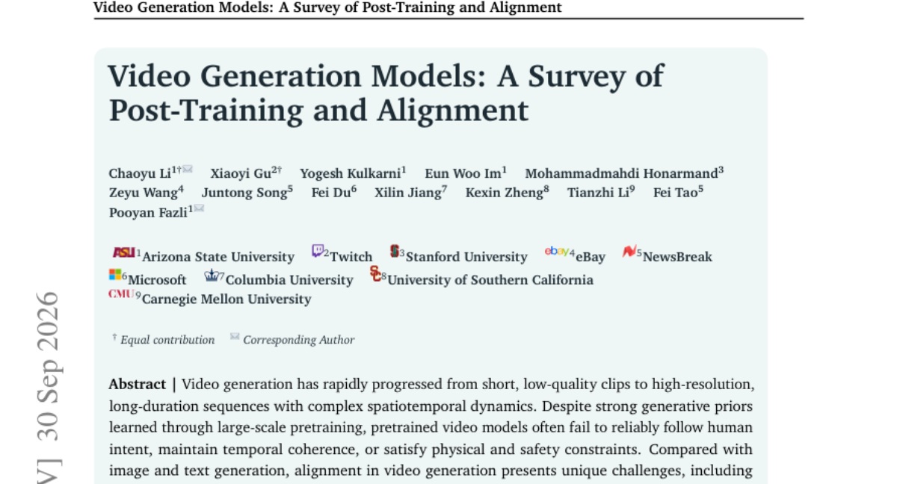

### 📌 한 줄 요약
사전 학습된 비디오 생성 모델의 제어력과 신뢰성을 높이기 위한 포스트 트레이닝 및 정렬(Alignment) 기술의 체계적 분류와 방법론을 제시하는 서베이 논문입니다.

### 🔑 핵심 포인트
- 비디오 생성 특화 정렬(Alignment) 문제(시간적 일관성, 움직임 결합 등) 정의
- 포스트 트레이닝 방법론을 4가지 범주(SFT, Self-training, Preference-based, Inference-time)로 분류
- 데이터셋, 벤치마크 및 평가 방법론에 대한 포괄적 리뷰 제공

### 🧑‍💻 개발자 관점
사전 학습된 거대 비디오 모델을 밑바닥부터 다시 학습시키지 않고도, 특정 목적에 맞게 제어력을 높이는 최신 기법들을 파악할 수 있습니다.

### 🚀 실무 적용 아이디어
- 현재 사용 중인 비디오 모델에 SFT(지도 미세 조정) 적용 시 성능 변화 관찰
- RLHF(인간 피드백 기반 강화학습)와 같은 선호도 기반 정렬 기법의 비디오 적용 사례 검토
- 추론 시간(Inference-time) 최적화 기법을 통한 생성 품질 개선 실험

### ⚠️ 리스크/한계
- 모델의 표현력(Expressiveness)과 안정성(Stability) 사이의 트레이드오프 발생 가능성
- 장기 시퀀스 생성 시 발생하는 시간적 일관성 유지의 어려움

### 📝 초록 기반 상세 설명
비디오 생성 기술이 고해상도 및 장기 시퀀스 생성으로 발전했으나, 사전 학습된 모델은 여전히 인간의 의도 준수, 시간적 일관성 유지, 물리적 제약 충족 등에서 어려움을 겪습니다. 특히 비디오는 이미지와 달리 시간적 오류 누적과 움직임-외형 결합 문제로 인해 정렬 작업이 더욱 까다롭습니다. 본 논문은 이러한 문제를 해결하기 위한 포스트 트레이닝을 통합 프레임워크로 정의하고, 신호 부여 방식에 따라 암시적/명시적 정렬로 구분합니다. 기존 방법론을 지도 미세 조정, 자기 학습 및 증류, 선호도/보상 기반, 추론 시간 방법론의 네 가지 범주로 체계화했습니다. 이를 통해 제어 가능하고 신뢰할 수 있는 비디오 생성 모델 개발을 위한 개념적 토대와 실무적 가이드를 제공합니다.

---

## 21. [Decentralized Master-Mind: Joint Action Refinement through Iterative Intent Denoising in Multi-Agent Pathfinding](https://huggingface.co/papers/2609.32019)
**Upvotes**: 44 | **도입 난이도**: 중 | **신뢰도**: 상
**arXiv**: https://arxiv.org/abs/2609.32019

**태그**: Multi-Agent, MAPF, Reinforcement Learning, Diffusion Model, Decentralized Control, Agent, RAG, Evaluation

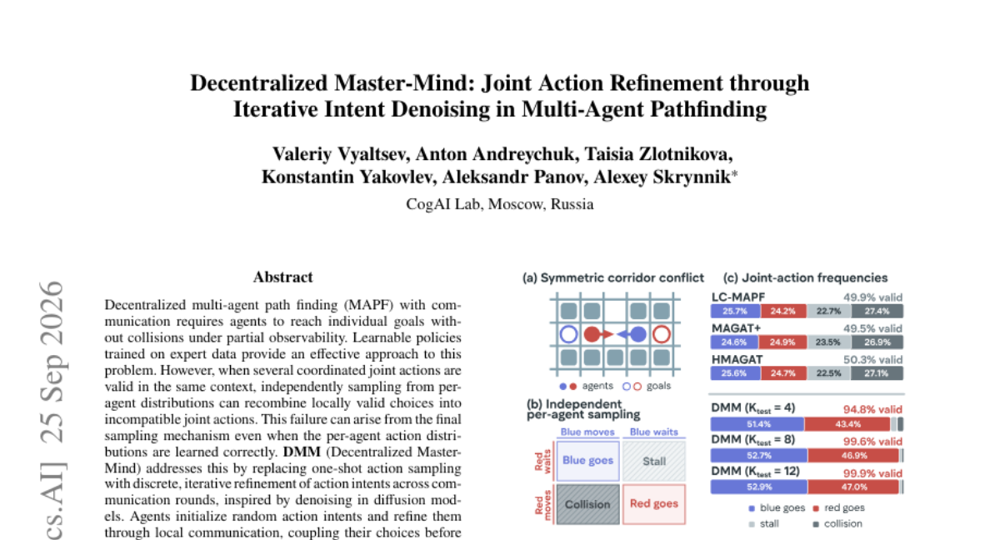

### 📌 한 줄 요약
분산형 멀티 에이전트 경로 탐색(MAPF)에서 샘플링 충돌 문제를 해결하기 위해 반복적 의도 정제(Iterative Intent Denoising) 방식을 도입한 프레임워크

### 🔑 핵심 포인트
- 분산형 환경에서 독립적 샘플링으로 인한 공동 행동 불일치 문제 해결
- 확산 모델의 데노이징에서 영감을 받은 반복적 의도 정제(Iterative Intent Denoising) 메커니즘 도입
- MICPO(Critic-free group-relative RL)를 통한 효율적인 다중 라운드 행동 최적화

### 🧑‍💻 개발자 관점
에이전트 간의 중앙 통제 없이도 통신을 통해 어떻게 정교한 협업 행동을 생성할 수 있는지에 대한 아키텍처적 해법을 제시합니다.

### 🚀 실무 적용 아이디어
- 기존의 One-shot 샘플링 방식과 DMM의 반복 정제 방식 간의 성공률 비교 실험
- 에이전트 밀도가 높아지는 환경에서의 통신 오버헤드 및 수렴 속도 측정
- MICPO 알고리즘을 다른 멀티 에이전트 강화학습 환경에 적용하여 범용성 검증

### ⚠️ 리스크/한계
- 반복적인 통신 라운드가 필수적이므로 실시간 응답성이 중요한 환경에서는 지연 시간(Latency) 문제가 발생할 수 있음
- 에이전트 수가 급격히 증가할 경우 통신 복잡도 관리가 핵심 과제가 될 수 있음

### 📝 초록 기반 상세 설명
분산형 멀티 에이전트 경로 탐색(MAPF)은 부분 관측 환경에서 충돌 없이 개별 목표에 도달하는 것이 핵심입니다. 기존의 학습된 정책은 개별 에이전트의 행동 분포를 독립적으로 샘플링할 때, 유효한 개별 행동들이 결합되어 부적절한 공동 행동을 생성하는 문제가 발생합니다. 이를 해결하기 위해 DMM(Decentralized Master-Mind)은 확산 모델(Diffusion Model)의 데노이징 개념을 차용하여, 통신 라운드 동안 행동 의도를 반복적으로 정제하는 방식을 제안합니다. 에이전트들은 초기 무작위 의도를 설정한 후, 로컬 통신을 통해 서로의 선택을 결합하며 점진적으로 최적의 공동 행동을 도출합니다. 실험 결과, DMM은 높은 성공률과 낮은 비용을 달성하며 백만 개 이상의 에이전트 규모에서도 확장성을 보여주었습니다.

### 🖼️ 추가 자료
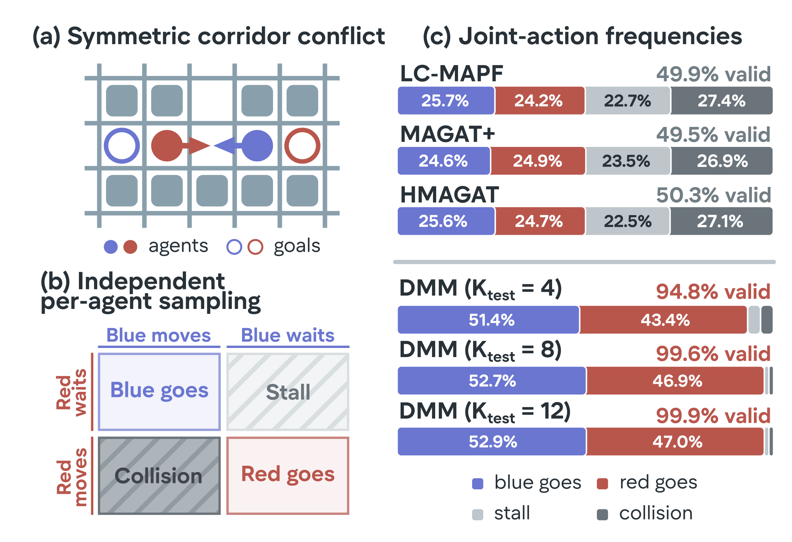

---

## 22. [InterEvolve: Test-Time Evolution of Reward Programs for Humanoid Loco-Manipulation](https://huggingface.co/papers/2610.02196)
**Upvotes**: 44 | **도입 난이도**: 상 | **신뢰도**: 상
**arXiv**: https://arxiv.org/abs/2610.02196

**태그**: Robotics, LLM, Reinforcement Learning, Sim-to-Real, Agent

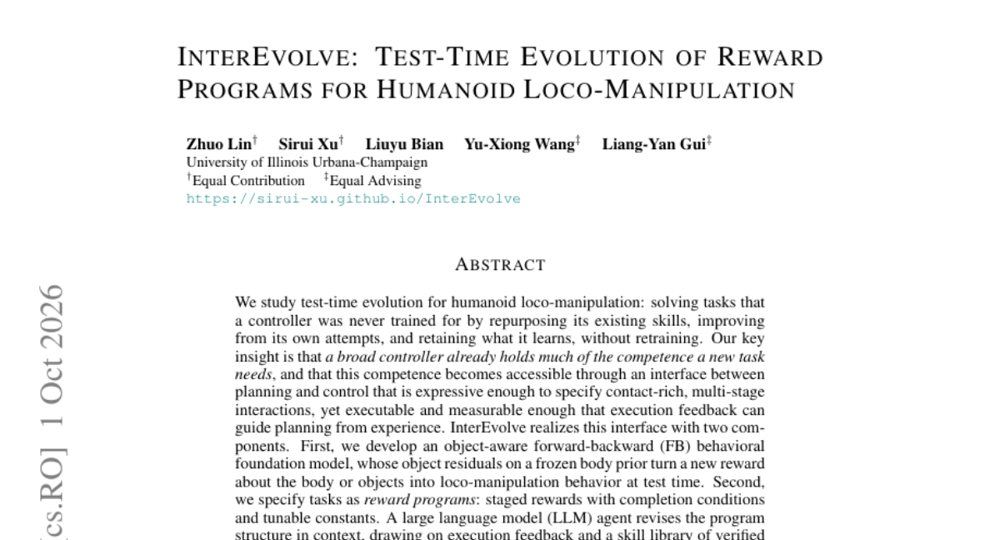

### 📌 한 줄 요약
재학습 없이 LLM과 수치 최적화를 결합하여 휴머노이드의 기존 제어 능력을 새로운 작업에 맞게 진화시키는 테스트 타임 최적화 프레임워크

### 🔑 핵심 포인트
- 재학습 없이 기존 컨트롤러의 역량을 새로운 작업에 맞게 재구성하는 테스트 타임 진화 기법
- LLM(구조 설계)과 수치 최적화(상수 튜닝)를 결합한 하이브리드 보상 프로그램 생성
- 객체 잔차(Object residuals)를 활용하여 제어 능력을 작업에 맞게 변환하는 FB 파운데이션 모델

### 🧑‍💻 개발자 관점
모델 전체를 재학습하는 막대한 비용 없이, 프롬프트와 보상 함수 수정만으로 로봇의 행동을 실시간으로 최적화하는 새로운 패러다임을 제시합니다.

### 🚀 실무 적용 아이디어
- LLM 기반 보상 함수 생성 시 수치적 안정성을 확보하기 위한 제약 조건 설계 실험
- 기존 강화학습 모델의 파라미터를 고정한 상태에서 보상 함수만 변경할 때의 성능 변화 측정
- 다양한 로봇 하드웨어(Sim-to-Real)로의 전이 가능성 검토

### ⚠️ 리스크/한계
- 테스트 타임에 발생하는 연산 비용 및 시뮬레이션 의존성
- LLM이 생성한 보상 구조가 물리적 제약 조건을 벗어날 가능성

### 📝 초록 기반 상세 설명
기존의 휴머노이드 제어 방식은 학습되지 않은 새로운 작업에 직면했을 때 재학습 없이는 대응하기 어렵다는 문제가 있습니다. 본 논문은 기존 컨트롤러가 가진 잠재적 역량을 활용하여 새로운 작업을 수행하는 '테스트 타임 진화(Test-time evolution)'를 제안합니다. 이를 위해 객체 인지 기반의 Forward-Backward(FB) 행동 파운데이션 모델과, LLM이 구조를 수정하고 수치 최적화가 상수를 조정하는 '보상 프로그램(Reward Program)' 인터페이스를 개발했습니다. 실험 결과, 제안된 방식은 사람이 설계한 보상보다 더 효율적으로 컨트롤러의 역량을 끌어내며 복잡한 작업과 장기적 과제를 성공적으로 수행했습니다. 최종적으로 시뮬레이션에서 진화된 기술은 실제 Unitree G1 로봇에서 자율적으로 구동됨을 입증했습니다.

---

## 23. [Scaling and Distilling Text Embeddings for Better Diffusibility](https://huggingface.co/papers/2610.01016)
**Upvotes**: 44 | **도입 난이도**: 중 | **신뢰도**: 상
**arXiv**: https://arxiv.org/abs/2610.01016

**태그**: Diffusion Model, NLP, Knowledge Distillation, Embedding, Distillation

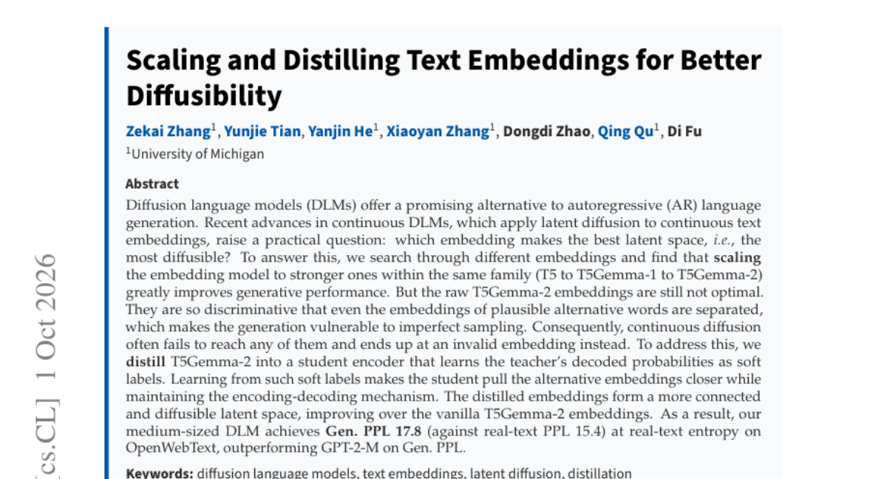

### 📌 한 줄 요약
확산 언어 모델(DLM)의 생성 성능을 높이기 위해 임베딩 모델의 변별력을 조절하는 증류(Distillation) 기법 제안

### 🔑 핵심 포인트
- 강력한 임베딩 모델이 오히려 확산 모델의 생성 성능을 저해할 수 있음을 발견
- 소프트 라벨을 활용한 지식 증류로 임베딩 공간의 연결성(Diffusibility) 확보
- 변별력과 생성 가능성 사이의 균형을 맞춘 최적의 잠재 공간 구축

### 🧑‍💻 개발자 관점
텍스트 생성 모델의 잠재 공간(Latent Space) 설계 시, 단순히 높은 변별력이 아닌 생성 모델과의 호환성이 중요함을 시사합니다.

### 🚀 실무 적용 아이디어
- 기존 임베딩 모델을 사용 중인 Diffusion 모델에 소프트 라벨 기반 증류 적용 실험
- 임베딩 공간의 밀도(Density)와 생성 성능 간의 상관관계 분석
- 다양한 규모의 LLM 임베딩을 활용한 확산 모델 성능 벤치마크 수행

### ⚠️ 리스크/한계
- 증류 과정에서 모델의 원래 변별력이 손실될 위험이 있음
- 특정 임베딩 패밀리에 국한된 결과일 가능성

### 📝 초록 기반 상세 설명
최근 연속적 확산 언어 모델(DLM)이 주목받고 있으나, 어떤 임베딩이 생성에 가장 적합한지에 대한 연구가 필요했습니다. 기존의 강력한 임베딩 모델은 변별력이 너무 높아 유사한 단어 간 거리가 멀어지며, 이는 샘플링 과정에서 생성 실패를 유발하는 문제가 있었습니다. 이를 해결하기 위해 교사 모델의 확률 분포를 소프트 라벨로 사용하는 학생 모델 증류 방식을 제안합니다. 이 과정을 통해 임베딩 공간을 더 연결성 있고 확산 가능한 형태로 재구성했습니다. 결과적으로 제안된 방식은 기존 GPT-2-M보다 우수한 생성 성능을 달성했습니다.

### 🖼️ 추가 자료
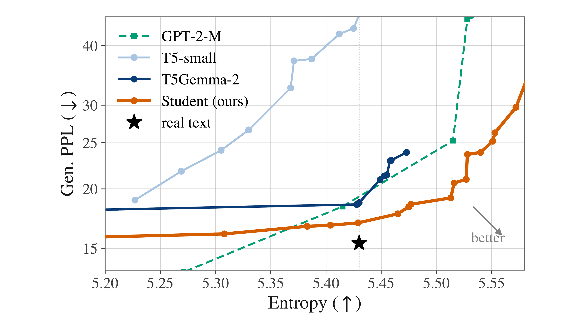
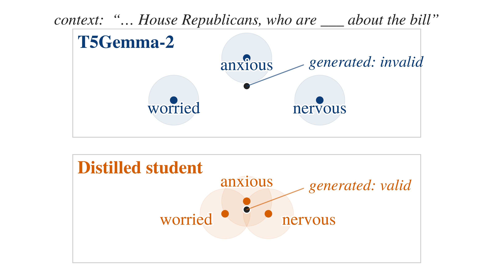

---

## 24. [Persona Dosing: Calibrated Activation Steering for Graded Trait Control](https://huggingface.co/papers/2609.36388)
**Upvotes**: 40 | **도입 난이도**: 중 | **신뢰도**: 상
**arXiv**: https://arxiv.org/abs/2609.36388

**태그**: LLM-Steering, Persona-Control, Model-Alignment

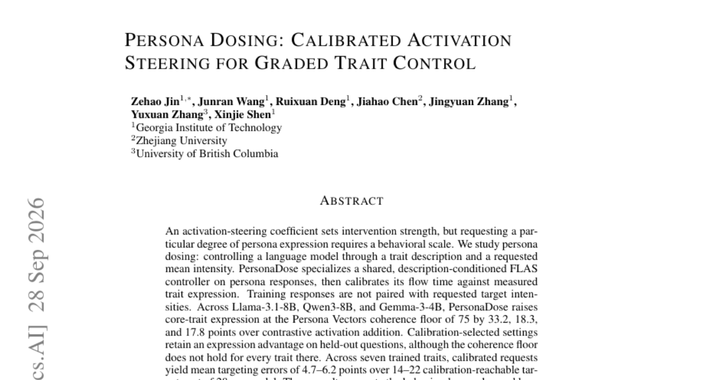

### 📌 한 줄 요약
사용자가 요청한 강도에 맞춰 모델의 페르소나를 정밀하게 조절하는 캘리브레이션 기반 활성화 스티어링 기법

### 🔑 핵심 포인트
- 트레이트 설명과 요청된 강도를 결합하여 페르소나를 제어하는 PersonaDose 프레임워크 제안
- 학습 데이터에 타겟 강도가 명시되지 않아도 캘리브레이션을 통해 정밀한 강도 조절 가능
- 기존 대조적 활성화 방식 대비 높은 트레이트 표현력 및 타겟팅 정확도 확보

### 🧑‍💻 개발자 관점
LLM의 성격이나 말투를 단순히 '강하게' 만드는 것을 넘어, 사용자 요구에 맞춰 정밀한 수치로 페르소나 강도를 조절할 수 있는 기술적 토대를 제공합니다.

### 🚀 실무 적용 아이디어
- 제시된 FLAS 컨트롤러를 활용하여 특정 페르소나(예: 친절함, 전문성)의 강도 조절 실험
- 다양한 모델 크기(8B 이하)에서 캘리브레이션 설정이 일반화 성능에 미치는 영향 분석
- 특정 트레이트가 다른 트레이트와 충돌할 때의 캘리브레이션 안정성 테스트

### ⚠️ 리스크/한계
- 모든 트레이트에서 일관된 일관성(coherence) 유지가 어려울 수 있음
- 학습된 트레이트 범위를 벗어난 극단적인 강도 요청 시 제어 성능 저하 가능성

### 📝 초록 기반 상세 설명
기존의 활성화 스티어링 방식은 개입 강도를 설정할 수 있지만, 특정 수준의 페르소나 표현을 요청하기 위한 행동 척도가 부족한 문제가 있었습니다. 본 논문은 트레이트 설명과 요청된 평균 강도를 통해 언어 모델을 제어하는 'PersonaDose'를 제안합니다. PersonaDose는 공유된 FLAS 컨트롤러를 페르소나 응답에 특화시킨 후, 측정된 트레이트 표현량에 맞춰 흐름 시간(flow time)을 캘리브레이션합니다. 실험 결과, Llama-3.1, Qwen, Gemma 모델 모두에서 기존 대조적 활성화 방식보다 높은 핵심 트레이트 표현력을 달성했습니다. 또한, 캘리브레이션된 설정은 학습되지 않은 질문에서도 우수한 표현력을 유지하며 요청된 타겟 강도에 근접하는 결과를 보였습니다.

---

## 25. [Fewer Tokens, Better Action: GPT-6 Astra Robot Agents with 14% Higher Success Rate but 65% Fewer Tokens](https://huggingface.co/papers/2610.01939)
**Upvotes**: 37 | **도입 난이도**: 중 | **신뢰도**: 상
**arXiv**: https://arxiv.org/abs/2610.01939

**태그**: Robot-Agent, LLM-Efficiency, Code-Execution, VLA, Agent, Vision

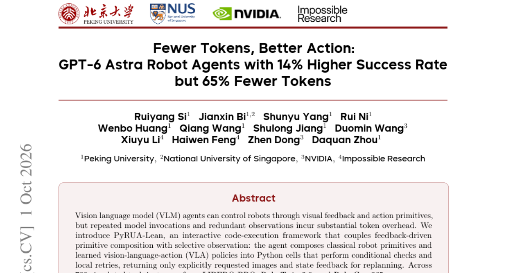

### 📌 한 줄 요약
코드 실행 프레임워크를 통해 로봇 에이전트의 토큰 소모를 65% 줄이면서도 성공률을 14% 높인 효율적 제어 기법

### 🔑 핵심 포인트
- PyRUA-Lean: 코드 실행 기반의 인터랙티브 프레임워크 도입
- 로컬 루프: Python 셀 내에서 조건부 체크 및 로컬 재시도를 수행하여 불필요한 LLM 호출 방지
- 선택적 관찰: 필요한 시점에만 이미지와 상태를 요청하여 토큰 효율성 극대화

### 🧑‍💻 개발자 관점
에이전트 설계 시 모든 동작을 LLM에 묻는 대신, 로컬 코드 실행(Code-Execution)과 상태 피드백을 결합하는 것이 비용과 성능 면에서 훨씬 유리함을 보여줍니다.

### 🚀 실무 적용 아이디어
- 에이전트의 동작 단위를 Python 함수/클래스로 모듈화하여 코드 실행 환경 구축하기
- 상태 확인(Check)과 동작(Action)을 분리하여 로컬 루프 로직 설계하기
- 시각적 피드백 주기를 조절하며 토큰 절감 대비 성공률 변화 측정하기

### ⚠️ 리스크/한계
- 로컬 코드 실행 환경의 보안 및 안정성 문제
- 복잡한 환경 변화에 대한 실시간 대응력이 LLM 호출 빈도에 의존할 가능성

### 📝 초록 기반 상세 설명
VLM 기반 로봇 에이전트는 시각적 피드백을 통한 반복적인 모델 호출로 인해 막대한 토큰 비용이 발생하는 문제가 있습니다. 이를 해결하기 위해 피드백 기반의 프리미티브 구성과 선택적 관찰을 결합한 PyRUA-Lean 프레임워크를 제안합니다. 에이전트는 로봇 동작과 VLA 정책을 Python 코드로 결합하여 로컬에서 조건부 체크 및 재시도를 수행하며, 필요한 경우에만 상태 피드백을 반환합니다. 700개의 시뮬레이션 환경 테스트 결과, 동일한 LLM 호출 예산 하에서 성공률을 63.1%에서 71.7%로 높였습니다. 또한 동일 작업 해결 시 LLM 호출 횟수는 49%, 입력 토큰은 65% 절감하는 성과를 거두었습니다.

---

## 26. [Beyond the Current Scene: Event-Referential Grasping with Active View Selection](https://huggingface.co/papers/2609.39375)
**Upvotes**: 37 | **도입 난이도**: 중 | **신뢰도**: 상
**arXiv**: https://arxiv.org/abs/2609.39375

**태그**: Robotics, Active Perception, Zero-shot Learning, Embodied AI

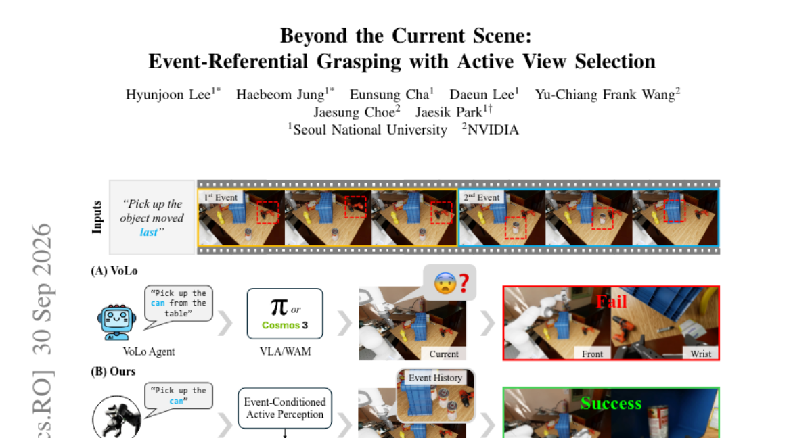

### 📌 한 줄 요약
과거 이벤트 맥락을 활용해 가려진 물체를 찾아내고 능동적으로 시점을 선택하여 잡는 제로샷 로봇 제어 시스템

### 🔑 핵심 포인트
- 이벤트 맥락(Event-referential)을 활용한 제로샷 물체 식별 및 로봇 파지 기술
- 가려진 타겟을 찾기 위해 과거 이벤트 정보와 현재 기하 구조를 결합한 능동적 시점 선택(Active View Selection)
- 추가적인 태스크별 학습 없이 사전 학습된 모델만 활용하는 효율적인 시스템 구조

### 🧑‍💻 개발자 관점
LLM/VLM 기반의 에이전트가 물리적 환경에서 '과거 맥락'을 어떻게 공간적 추론과 결합하여 실행(Action)으로 옮길 수 있는지에 대한 실전 사례를 제공합니다.

### 🚀 실무 적용 아이디어
- 사전 학습된 VLM을 활용한 이벤트 기반 물체 식별 로직 구현 테스트
- 가려진 물체 추론을 위한 3D 기하 정보와 이벤트 히스토리 결합 알고리즘 검증
- 단일 카메라 환경에서의 능동적 시점 이동(Active Perception) 제어 루프 실험

### ⚠️ 리스크/한계
- 복잡한 이벤트 맥락이 얽힌 상황에서의 식별 정확도 저하 가능성
- 실시간 시점 이동 시 발생하는 물리적 제약 및 연산 오버헤드

### 📝 초록 기반 상세 설명
사람의 상호작용을 관찰한 로봇이 과거 이벤트의 역할을 기반으로 물체를 식별하고 잡아야 하는 상황을 가정합니다. 기존 방식은 물체의 이름이나 외형에 의존하거나, 물체가 가려졌을 때 식별하기 어렵다는 문제가 있습니다. 본 논문은 이벤트 맥락과 현재 장면을 결합하여 대상을 식별하고, 가려진 경우 최적의 시점을 선택하는 BeyondSCe 시스템을 제안합니다. 이 시스템은 사전 학습된 모델만을 사용하여 추가 학습 없이 동작하며, 이벤트 기록에서 복구된 사전 정보와 현재 기하 구조를 결합해 타겟을 노출할 수 있는 카메라 시점을 결정합니다. 실험 결과, 가려진 타겟에 대해서도 기존 베이스라인보다 높은 성공률을 기록하며 효율적인 능동 인식을 입증했습니다.

### 🖼️ 추가 자료
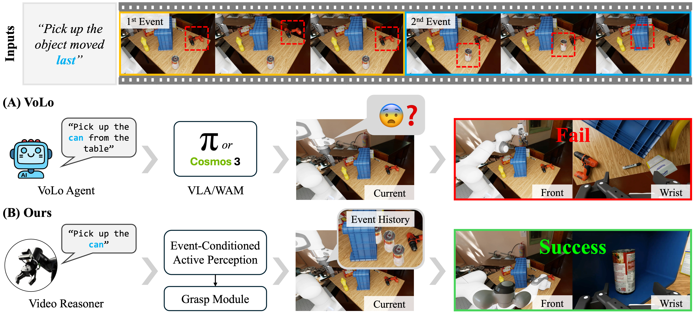
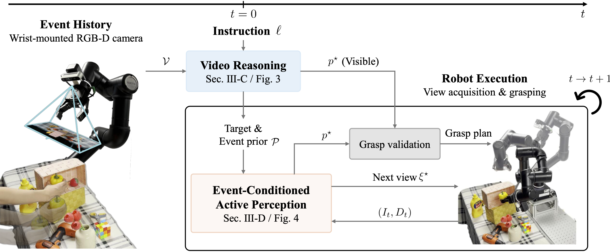
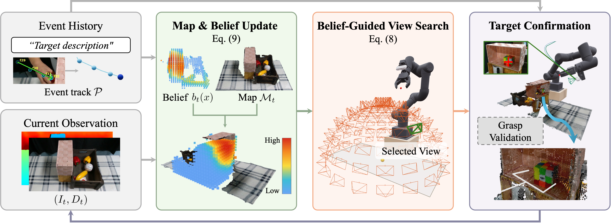

---

## 27. [Predictive Credit: Measuring What Scientific Explanations Add to Experimental Forecasts](https://huggingface.co/papers/2610.00314)
**Upvotes**: 37 | **도입 난이도**: 중 | **신뢰도**: 중
**arXiv**: https://arxiv.org/abs/2610.00314

**태그**: Agent, Forecasting, Evaluation, Scientific-AI, RAG, Benchmark, Safety

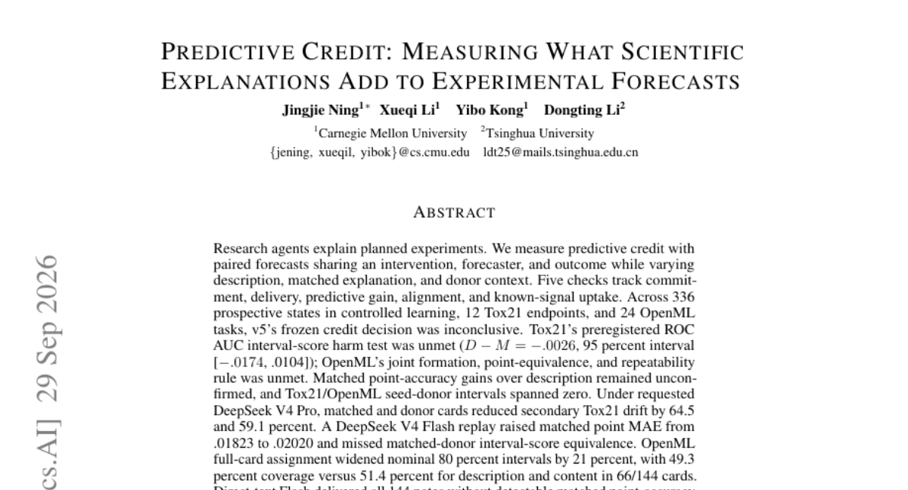

### 📌 한 줄 요약
과학적 설명(Explanation)이 실험적 예측 성능 향상에 실질적으로 기여하는지를 정밀하게 측정하는 프로토콜 연구

### 🔑 핵심 포인트
- 실험적 예측과 설명 간의 인과적 기여도를 측정하기 위한 정밀 프로토콜 설계
- Tox21 및 OpenML 등 다양한 도메인에서의 예측 성능 및 정렬(Alignment) 검증
- 설명이 예측 정확도 향상에 미치는 영향에 대한 정량적 분석 프레임워크 구축

### 🧑‍💻 개발자 관점
AI 에이전트가 단순히 결과를 내놓는 것을 넘어, 제공하는 '설명'이 실제 예측 성능 향상에 기여하는지 검증하는 방법론을 제시합니다.

### 🚀 실무 적용 아이디어
- 에이전트의 설명(Reasoning)이 포함된 데이터셋과 단순 결과 데이터셋 간의 예측 성능 차이 비교 실험
- 설명 방식(텍스처, 구조 등) 변화에 따른 예측 오차(MAE) 및 신뢰 구간 변화 측정
- LLM 기반 연구 에이전트의 벤치마크 설계 시 본 프로토콜의 통제 변수 적용

### ⚠️ 리스크/한계
- 자연어 설명이 예측 성능을 높이는지에 대한 명확한 인과관계 입증이 아직 어려움
- 실험 환경(도메인 및 데이터셋)에 따라 결과의 일관성이 확보되지 않을 수 있음

### 📝 초록 기반 상세 설명
연구 에이전트가 계획된 실험을 설명하는 과정에서 설명의 가치를 측정하는 것이 중요해졌습니다. 본 연구는 동일한 개입과 결과를 공유하되 설명 방식과 맥락을 달리하여 예측 기여도를 측정하는 프로토콜을 제안합니다. Tox21 및 OpenML 등 다양한 벤치마크를 통해 설명의 정합성, 전달력, 예측 이득 등을 검증했습니다. 실험 결과, 자연어 설명이 예측 성능을 유의미하게 높이는지에 대한 결론은 아직 불분명하게 나타났습니다. 결과적으로 본 프로토콜은 연구 에이전트의 벤치마크와 과학적 예측 성능을 평가하는 데 유용한 프레임워크를 제공합니다.

---

## 28. [Prefill-Free Cross-Family KV Cache Transfer for Heterogeneous Multi-Agent LLMs](https://huggingface.co/papers/2609.32259)
**Upvotes**: 36 | **도입 난이도**: 중 | **신뢰도**: 상
**arXiv**: https://arxiv.org/abs/2609.32259

**태그**: LLM, Multi-Agent, Inference-Optimization, KV-Cache, Agent, Benchmark

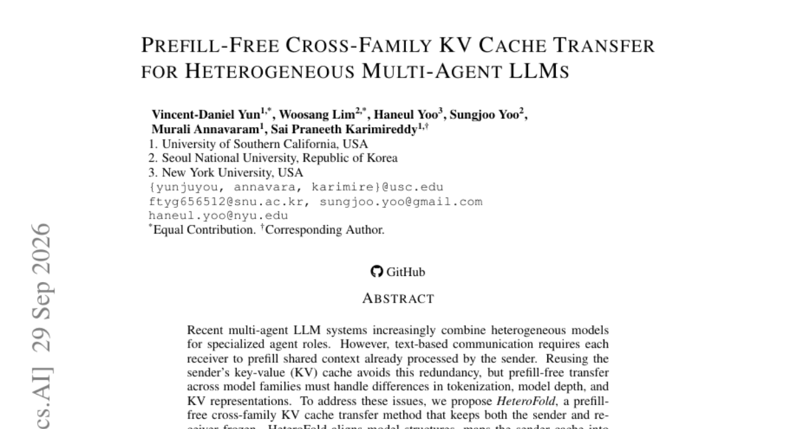

### 📌 한 줄 요약
서로 다른 모델 간 KV 캐시를 직접 전송하여 중복 프리필(Prefill) 없이 멀티 에이전트 시스템의 효율을 극대화하는 기술

### 🔑 핵심 포인트
- 이종 모델 간 KV 캐시 전송을 위한 HeteroFold 프레임워크 제안
- 모델 가중치를 동결(Frozen)한 상태에서 구조 정렬 및 캐시 매핑 수행
- 중복 프리필 제거를 통해 긴 컨텍스트 환경에서 연산 속도 및 효율성 극대화

### 🧑‍💻 개발자 관점
멀티 에이전트 환경에서 모델 간 대화 시 발생하는 중복 연산을 제거하여 추론 비용과 지연 시간을 획기적으로 줄일 수 있습니다.

### 🚀 실무 적용 아이디어
- Llama와 Mistral 등 서로 다른 아키텍처 간의 KV 전송 성능 비교 실험
- 컨텍스트 길이가 길어질수록 발생하는 정렬 오차 및 성능 저하 측정
- 멀티 에이전트 워크플로에 적용 시 전체 End-to-End 지연 시간 변화 확인

### ⚠️ 리스크/한계
- 모델 간 구조적 차이가 극심할 경우 캐시 매핑의 정확도 저하 가능성
- 매우 긴 컨텍스트에서 수신 모델의 생성 품질(Perplexity) 유지 여부 검증 필요

### 📝 초록 기반 상세 설명
최근 멀티 에이전트 시스템은 특화된 역할을 위해 서로 다른 모델들을 결합하여 사용합니다. 하지만 텍스트 기반 통신은 수신 모델이 이미 전송된 컨텍스트를 다시 프리필해야 하는 중복 연산 문제를 발생시킵니다. 이를 해결하기 위해 본 논문은 모델 구조, 토크나이저, 레이어 깊이가 다른 이종 모델 간에도 KV 캐시를 재사용할 수 있는 HeteroFold를 제안합니다. HeteroFold는 모델을 동결한 상태에서 구조 정렬, 캐시 매핑, 수신 모델 동작 보정 과정을 거쳐 캐시를 변환합니다. 실험 결과, 제안 방식은 긴 컨텍스트 벤치마크에서 우수한 성능을 보였으며 기존 방식 대비 압도적인 속도 향상을 달schap했습니다. 결과적으로 수신 모델의 프리필 없이도 효율적인 크로스 패밀리 KV 재사용이 가능함을 입증했습니다.

---

## 29. [Architect-Ant: Editable Automatic Furnishing of Architectural Floor Plans](https://huggingface.co/papers/2606.10953)
**Upvotes**: 32 | **도입 난이도**: 상 | **신뢰도**: 상
**arXiv**: https://arxiv.org/abs/2606.10953

**태그**: Generative AI, Reinforcement Learning, Architecture, Layout Generation, Agent, Reasoning, Vision, Inference

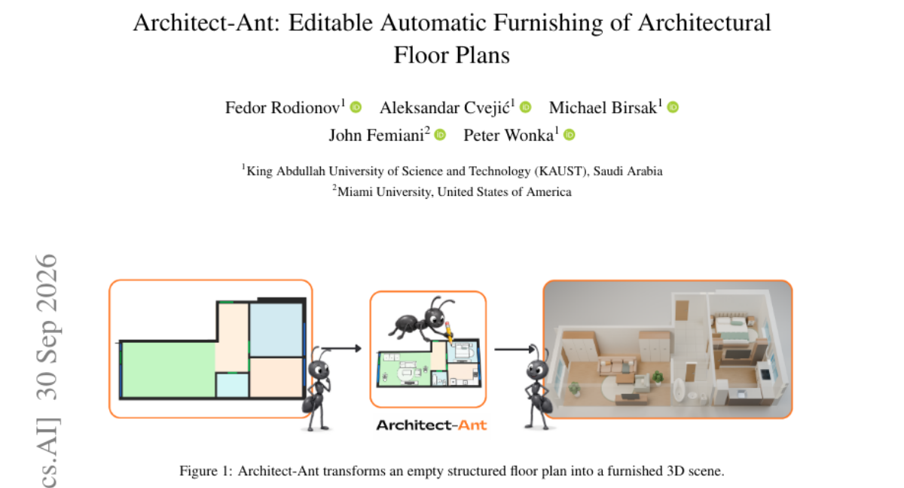

### 📌 한 줄 요약
전문적인 가구 배치 패턴을 학습하여 제약 조건을 준수하면서도 편집 가능한 레이아웃을 생성하는 프레임워크

### 🔑 핵심 포인트
- 92개 객체 클래스와 10개 방 유형을 포함한 전문 건축 도면 데이터셋 AntPlan 구축
- 편집 가능한 좌표 기반 DSL을 활용한 객체 수준의 레이아웃 표현 방식 도입
- GRPO와 Layout Rule Score(LRS)를 결합하여 추론 과정 없이 결과 중심의 제약 조건 최적화 수행

### 🧑‍💻 개발자 관점
LLM 기반의 강화학습(GRPO)을 공간 배치라는 물리적 제약 조건 최적화에 성공적으로 적용한 사례로, 2D/3D 생성 워크플로우 자동화에 영감을 줍니다.

### 🚀 실무 적용 아이디어
- 제공된 DSL 형식을 활용하여 생성된 레이아웃의 3D 변환 호환성 테스트
- GRPO의 LRS 점수 체계가 다른 공간 제약 조건(예: 상업용 공간)에 어떻게 적용될 수 있는지 검토
- 데이터셋의 객체 밀도와 배치 패턴이 특정 스타일(모던, 클래식 등)에 편향되어 있는지 분석

### ⚠️ 리스크/한계
- 학습 데이터셋의 규모가 특정 전문 영역에 국한되어 범용적인 공간 생성에는 한계가 있을 수 있음
- 복잡한 물리적 충돌이나 미세한 배치 규칙을 완벽하게 해결하기 위한 추가적인 기하학적 검증 필요

### 📝 초록 기반 상세 설명
부동산 시각화 및 인테리어 설계를 위한 자동 가구 배치 기술은 데이터 부족과 복잡한 기하학적/기능적 제약 조건으로 인해 어려움을 겪어왔습니다. 본 논문은 반복적인 에이전트 추론 없이 사전 학습된 모델을 통해 전문적인 배치 지식을 학습하는 방법을 제안합니다. 이를 위해 92개 객체 클래스를 포함한 전문 건축 도면 데이터셋인 AntPlan을 구축하고, 편집 가능한 DSL 기반의 Architect-Ant 프레임워크를 도입했습니다. 모델은 지도 미세 조정(SFT)을 통해 패턴을 학습한 후, GRPO를 사용하여 기하학적 및 기능적 제약이 통합된 Layout Rule Score(LRS)로 최적화됩니다. 실험 결과, 제안 모델은 낮은 기하학적 위반율과 높은 기능적 완결성을 동시에 달성하며 실세계 배치 패턴을 효과적으로 재현했습니다.

### 🖼️ 추가 자료

---

## 30. [SILSA: Sliding-Window Slice Latents for Topology-Preserving High-Resolution 3D Generation](https://huggingface.co/papers/2610.02201)
**Upvotes**: 30 | **도입 난이도**: 상 | **신뢰도**: 상
**arXiv**: https://arxiv.org/abs/2610.02201

**태그**: 3D Generation, Computer Vision, Topology, Efficient AI, RAG, Vision, Inference

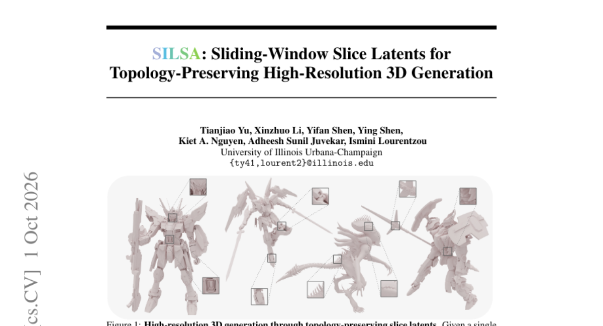

### 📌 한 줄 요약
슬라이딩 윈도우 방식의 슬라이스 잠재 변수를 활용하여 토큰 수를 획기적으로 줄이면서도 위상 구조를 유지하는 고해상도 3D 생성 프레임워크

### 🔑 핵심 포인트
- 슬라이딩 윈도우 기반의 3축 슬라이스 잠재 변수를 통한 효율적인 3D 표현
- Betti 전이 정렬을 통한 슬라이스 수준의 위상 구조 유지 기법 도입
- Sparse Volumetric Decoder와 Volumetric Anchor Lattice를 통한 정교한 3D 재구성

### 🧑‍💻 개발자 관점
3D 생성 모델의 고질적인 문제인 연산 비용과 위상적 불일치(끊김 현상)를 동시에 해결할 수 있는 효율적인 아키텍처 설계 방식을 제시합니다.

### 🚀 실무 적용 아이디어
- 제시된 Slice VAE와 Volumetric Decoder의 연산 효율성 벤치마크 테스트
- 복잡한 위상 구조(그물망, 얇은 막 등)를 가진 데이터셋에서의 재구성 성능 검증
- 기존 Voxel/Sparse 기반 모델과의 메모리 및 추론 속도 비교 실험

### ⚠️ 리스크/한계
- 슬라이스 간의 정렬 방식이 매우 복잡하여 구현 난이도가 높을 수 있음
- 특정 방향성 슬라이스에 의존하는 구조로 인해 비정형적 형태에서의 일반화 성능 확인 필요

### 📝 초록 기반 상세 설명
고해상도 3D 생성을 위해 기존에는 복잡한 복셀 토큰이나 다단계 파이프라인을 사용했으나, 이는 생성 비용을 높이고 얇거나 연결된 구조의 위상적 일관성을 해치는 문제가 있었습니다. 이를 해결하기 위해 SILSA는 세 축을 따라 겹치는 슬라이스들을 사용하는 슬라이딩 s-윈도우 슬라이스 잠재 변수 방식을 제안합니다. Slice VAE를 통해 방향성 표면 샘플을 인코딩하고, Volumetric Anchor Lattice를 통해 방향별 슬라이스 스트림을 조정하며, Betti 전이를 정렬하는 위상 감독(Topology Supervision)을 도입했습니다. 실험 결과, 기존 방식 대비 토큰 수를 대폭 절감하면서도 구조적 충실도와 위상적 정확도를 크게 향상시켰습니다. 결과적으로 학습 메모리 사용량을 40.4% 줄이고 추론 시간을 58.5% 단축하는 성과를 거두었습니다.

---

## 31. [4Director: Controlling Video World Models with Rigid 3D Geometry](https://huggingface.co/papers/2610.02160)
**Upvotes**: 30 | **도입 난이도**: 상 | **신뢰도**: 상
**arXiv**: https://arxiv.org/abs/2610.02160

**태그**: Video Generation, 3D Geometry, Motion Control, Computer Vision, Vision, Video, Evaluation

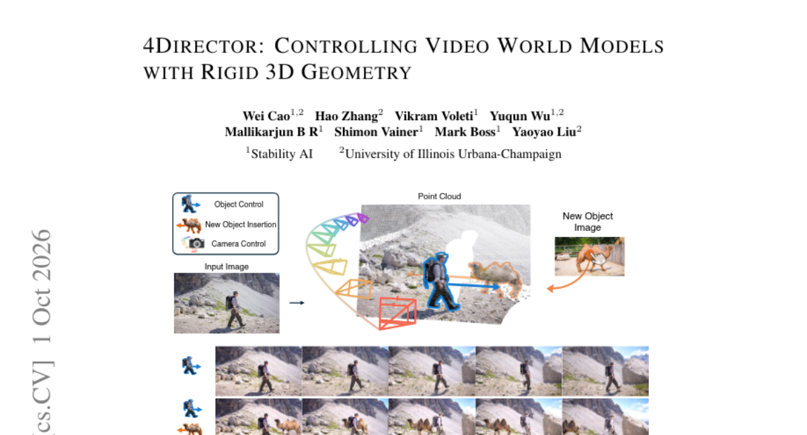

### 📌 한 줄 요약
명시적인 4D 기하 구조를 활용하여 카메라와 객체 움직임을 정밀하게 제어하는 비디오 월드 모델 제안

### 🔑 핵심 포인트
- 명시적 4D 장면 표현을 통한 정밀한 객체 및 카메라 제어 인터페이스 제공
- 강체 변형(Rigid Transformation) 기반의 메쉬 재구성을 통한 기하학적 일관성 유지
- 새로운 데이터셋(RealCOD-Rigid) 및 움직임과 정체성 보존을 동시에 평가하는 IG-IoU 지표 제안

### 🧑‍💻 개발자 관점
단순한 텍스트/이미지 기반 생성을 넘어, 물리적으로 타당하고 제어 가능한 3D 기반 비디오 생성 워크플로우를 구축할 수 있습니다.

### 🚀 실무 적용 아이디어
- 제공된 4D 기하 구조가 복잡한 비정형 움직임(예: 옷자락 흔들림)을 얼마나 잘 수용하는지 테스트
- RealCOD-Rigid 데이터셋의 스케일과 품질이 실제 프로덕션 환경에 적합한지 검토
- Motion Adapter의 렌더링 성능과 연산 비용 분석

### ⚠️ 리스크/한계
- 강체 변형(Rigid) 중심의 제어로 인해 매우 복잡한 비정형 움직임 구현에는 한계가 있을 수 있음
- 초기 메쉬 재구성 단계의 정확도에 따라 전체 비디오 품질이 결정되는 의존성 존재

### 📝 초록 기반 상세 설명
전문적인 비디오 제작을 위해서는 카메라와 객체 움직임에 대한 정밀한 제어가 필수적입니다. 기존 방식은 이미지 평면의 단편적인 정보나 불완전한 3D 트랙을 사용하여 깊이와 회전 제어가 모호하고 일관성이 떨어지는 문제가 있었습니다. 본 논문은 각 객체를 정형화된 메쉬(canonical mesh)로 재구성하고 프레임별 강체 변환을 적용하는 명시적 4D 장면 표현 방식인 4Director를 제안합니다. 제어된 장면을 깊이 비디오로 렌더링한 후, Motion Adapter를 통해 일관된 외형과 조명, 비정형 역학을 결합한 비디오를 생성합니다. 이를 위해 20,774개의 정밀한 3D 주석이 포함된 RealCOD-Rigid 데이터셋을 구축하였으며, 새로운 평가 지표인 IG-IoU를 도입했습니다. 실험 결과, 4Director는 기존 방식보다 시각적 품질과 제어 정밀도 면에서 우수한 성능을 보였습니다.

### 🖼️ 추가 자료

---

## 32. [AutoDataBench: A Data-centric Testbed for Accelerating Auto Research](https://huggingface.co/papers/2609.40097)
**Upvotes**: 30 | **도입 난이도**: 중 | **신뢰도**: 상
**arXiv**: https://arxiv.org/abs/2609.40097

**태그**: Agent, Data-centric, LLM, Benchmark, RAG, Reasoning, Evaluation

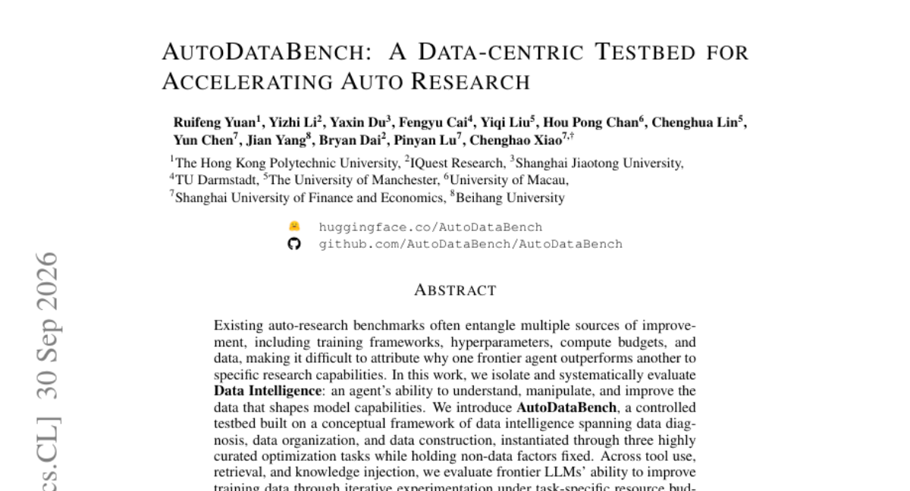

### 📌 한 줄 요약
데이터 중심(Data-centric) 연구를 위해 데이터 진단, 조직, 구축 능력을 체계적으로 평가하는 벤치마크 프레임워크 제안

### 🔑 핵심 포인트
- 데이터 지능(진단, 조직, 구축)을 독립적으로 평가할 수 있는 통제된 테스트베드 구축
- 단순 성능 측정을 넘어 LLM의 데이터 효과 추론(Data-effect reasoning) 능력 검증
- 생성된 데이터 궤적을 활용한 미세 조정이 모델 성능 향상에 기여함을 입증

### 🧑‍💻 개발자 관점
모델 성능 향상의 원인이 데이터인지 인프라인지 명확히 구분할 수 있는 평가 체계를 제공하며, 고품질 학습 데이터 생성 파이프라인 구축에 영감을 줍니다.

### 🚀 실무 적용 아이디어
- 제공된 벤치마크를 활용하여 현재 사용 중인 LLM의 데이터 조작 능력을 테스트하기
- 에이전트 기반의 데이터 정제/증강 파이프라인에 AutoDataBench 프레임워크 적용해보기
- 학습 데이터 생성 시 에이전트의 피드백 루프를 포함하는 실험 설계하기

### ⚠️ 리스크/한계
- 통제된 환경에서의 평가이므로 실제 복잡한 실무 환경과의 괴리가 있을 수 있음
- 데이터 지능 외의 요소(모델 아키텍처 등)가 성능에 미치는 영향은 배제됨

### 📝 초록 기반 상세 설명
기존의 자동화 연구 벤치마크는 프레임워크, 하이퍼파라미터, 컴퓨팅 자원 등이 복합적으로 얽혀 있어 성능 향상의 원인을 특정하기 어렵다는 문제가 있습니다. 본 논문은 데이터 지능(Data Intelligence)을 독립적으로 평가하기 위해 데이터 진단, 조직, 구축을 아우르는 AutoDataBench를 제안합니다. 이 테스트베드는 데이터 외적 요인을 고정시킨 상태에서 LLM이 도구 사용, 검색, 지식 주입을 통해 반복적인 실험으로 데이터를 개선하는 능력을 평가합니다. 연구 결과, LLM이 데이터 개입의 결과를 예측하는 추론 능력을 갖추고 있는지 확인하였으며, 반복적인 피드백이 데이터 효과에 대한 이해를 높임을 입증했습니다. 마지막으로 AutoDataBench의 궤적을 미세 조정에 재사용했을 때 다운스트림 코딩 성능이 향상됨을 보여주었습니다.

---

## 33. [Decoding Looped Transformers Better for (Almost) Free](https://huggingface.co/papers/2610.02185)
**Upvotes**: 27 | **도입 난이도**: 하 | **신뢰도**: 상
**arXiv**: https://arxiv.org/abs/2610.02185

**태그**: LLM, Inference Optimization, Efficient Deep Learning, Evaluation, Inference

_Free_img.jpg)

### 📌 한 줄 요약
Looped Transformer의 중간 연산 과정을 활용하여 추가 학습 없이 추론 성능을 높이고 연산 비용을 절감하는 대조적 디코딩 기법

### 🔑 핵심 포인트
- 학습 없이 중간 루프 상태를 활용하는 대조적 디코딩(LoopCD) 프레임워크 제안
- Logits 방식과 Hidden-state 방식 두 가지 모드를 통해 연산 효율성 확보
- 루프 횟수를 줄이면서도 기존 전체 루프 모델과 대등하거나 더 높은 성능 달성

### 🧑‍💻 개발자 관점
모델 재학습 없이 기존 Looped Transformer 구조의 추론 성능을 즉각적으로 개선하고, 연산 비용(FLOPs)을 최적화할 수 있는 실용적인 기법입니다.

### 🚀 실무 적용 아이디어
- 기존 Recurrent/Looped 모델에 LoopCD-Hidden 로직을 적용하여 추론 속도 변화 측정
- 루프 횟수를 절반으로 줄였을 때의 성능 유지 여부 검증
- Logits 방식과 Hidden-state 방식 간의 성능-비용 트레이드오프 비교

### ⚠️ 리스크/한계
- 특정 루프 구조(Looped Transformer)에 특화된 기법으로 범용성 제약 가능성
- 대조적 디코딩 과정에서 발생하는 미세한 추론 지연 시간(Latency) 발생 가능성

### 📝 초록 기반 상세 설명
Looped Transformer는 동일한 블록을 반복 실행하여 파라미터 효율성을 높이지만, 기존 방식은 이전 루프의 중간 상태를 버리고 최종 결과만 사용합니다. 이 과정에서 발생하는 루프 간의 예측 차이는 별도의 학습 없이도 유용한 가이드 신호가 될 수 있습니다. 본 논문은 최종 예측과 이전 루프의 예측을 대조하는 학습 불필요 프레임워크인 LoopCD를 제안합니다. LoopCD는 로짓 공간(Logits) 또는 은닉 상태(Hidden-state) 공간에서 동작하며, 연산 오버헤드를 최소화하면서 성능을 개선합니다. 실험 결과, LoopCD는 성능 향상과 동시에 루프 횟수를 줄여 추론 FLOPs를 대폭 절감하는 효과를 입증했습니다.

---

## 34. [CorrGRPO: Correlation-Normalized GRPO for Multi-Reward Learning](https://huggingface.co/papers/2609.36820)
**Upvotes**: 27 | **도입 난이도**: 하 | **신뢰도**: 상
**arXiv**: https://arxiv.org/abs/2609.36820

**태그**: RLHF, LLM, Multi-Reward, Optimization, Agent, Reasoning

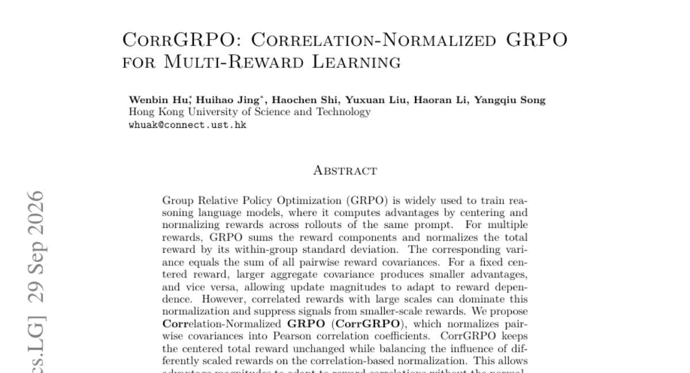

### 📌 한 줄 요약
다중 보상 학습 시 스케일 차이로 인한 특정 보상 편향 문제를 해결하여 모델 성능을 균형 있게 개선하는 CorrGRPO 기법 제안

### 🔑 핵심 포인트
- 공분산 기반 정규화에서 발생하는 스케일 불균형 문제 식별
- 공분산을 피어슨 상관계수로 변환하여 보상 간 영향력을 균형 있게 조절하는 CorrGRPO 제안
- 코드 생성, 도구 호출, 에이전트 보안 등 다중 보상 환경에서 성능 검증

### 🧑‍💻 개발자 관점
여러 개의 보상 함수(Reward Function)를 동시에 사용하는 에이전트나 코드 생성 모델 학습 시, 특정 보상이 너무 커서 학습이 망가지는 현상을 방지할 수 있습니다.

### 🚀 실무 적용 아이디어
- 기존 GRPO 기반 학습 코드에 상관계수 기반 정규화 로직 적용 테스트
- 보상 함수 간 스케일 차이가 극심한 데이터셋에서 성능 비교 실험
- 다중 목적 최적화(Multi-objective optimization) 환경에서의 수렴 속도 확인

### ⚠️ 리스크/한계
- 상관계수 기반 정규화가 특정 보상 신호를 과도하게 약화시킬 가능성 존재
- 보상 간의 독립성이 확보되지 않은 상황에서의 일반화 성능 검증 필요

### 📝 초록 기반 상세 설명
최근 추론 모델 학습에 사용되는 GRPO는 여러 보상 성분을 합산하여 정규화하는 방식을 사용합니다. 그러나 보상 간 상관관계가 높고 스케일 차이가 클 경우, 특정 보상이 전체 정규화 과정을 지배하여 다른 보상 신호를 억제하는 문제가 발생합니다. 이를 해결하기 위해 공분산을 피어슨 상관계수로 변환하여 정규화하는 CorrGRPO를 제안합니다. 이 방식은 총 보상 값은 유지하면서도 서로 다른 스케일을 가진 보상들이 균형 있게 반영되도록 합니다. 코드 생성, 도구 호출, 에이전트 보안 등 다양한 태스크에서 실험한 결과, 기존 GRPO 대비 성능 향상을 확인했습니다.

### 🖼️ 추가 자료
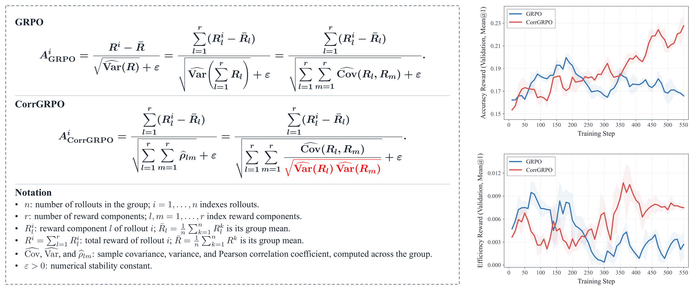

---

## 35. [RPTune: Learned Context Curation for LLM Catalog Search](https://huggingface.co/papers/2610.00964)
**Upvotes**: 27 | **도입 난이도**: 상 | **신뢰도**: 상
**arXiv**: https://arxiv.org/abs/2610.00964

**태그**: LLM, RAG, Fine-tuning, Information Retrieval, Vision, Evaluation

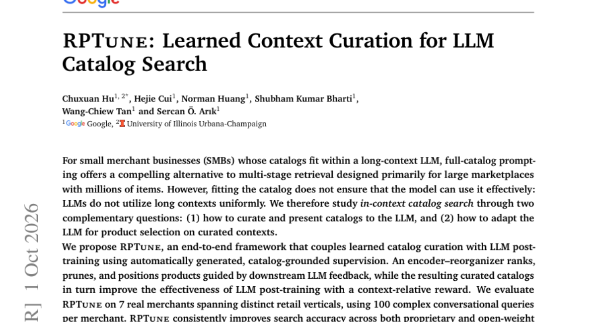

### 📌 한 줄 요약
LLM의 긴 컨텍스트 활용 능력을 극대화하기 위해 카탈로그 큐레이션과 모델 사후 학습을 결합한 엔드투엔드 프레임워크

### 🔑 핵심 포인트
- Encoder-Reorganizer를 통한 지능형 카탈로그 큐레이션(정렬 및 선별) 방식 제안
- 큐레이션된 컨텍스트를 활용한 LLM 사후 학습(Post-training)과 보상 체계 설계
- 실제 상거래 데이터셋을 통한 다양한 리테일 버티컬에서의 성능 검증

### 🧑‍💻 개발자 관점
RAG 시스템 구축 시 단순히 문서를 밀어넣는 것이 아니라, 모델이 정보를 더 잘 찾을 수 있도록 컨텍스트를 구조화하고 모델을 미세 조정하는 전략의 중요성을 보여줍니다.

### 🚀 실무 적용 아이디어
- Long-context LLM에 전체 데이터를 넣었을 때의 성능 저하(Lost-in-the-middle) 현상 재현 실험
- 데이터 선별(Pruning) 전략이 모델의 추론 성능에 미치는 영향 분석
- 도메인 특화 데이터로 큐레이션-학습 루프 구축 시뮬레이션

### ⚠️ 리스크/한계
- 카탈로그 규모가 매우 커질 경우 큐레이터의 연산 비용 증가 가능성
- 특정 도메인에 최적화된 큐레이션 방식이 다른 도메인으로의 일반화가 어려울 수 있음

### 📝 초록 기반 상세 설명
소규모 상점(SMB)의 경우 전체 카탈로그를 LLM의 긴 컨텍스트에 넣는 방식이 가능하지만, 모델이 긴 문맥을 균일하게 활용하지 못해 성능 저하가 발생합니다. 본 논문은 카탈로그를 어떻게 구성할 것인지와 구성된 컨텍스트에서 모델을 어떻게 적응시킬 것인지라는 두 가지 문제를 다룹니다. 이를 해결하기 위해 큐레이터가 제품을 정렬 및 선별하고, 선별된 데이터를 바탕으로 LLM을 사후 학습시키는 RPTune 프레임워크를 제안합니다. 실험 결과, RPTune은 다양한 리테일 분야에서 검색 정확도를 크게 향상시켰습니다.

---

## 36. [Ego2Act: Evaluating Goal-Directed Manipulation in Egocentric Video Generation](https://huggingface.co/papers/2610.01092)
**Upvotes**: 25 | **도입 난이도**: 중 | **신뢰도**: 상
**arXiv**: https://arxiv.org/abs/2610.01092

**태그**: Video Generation, Embodied AI, Benchmark, Robotics, Reasoning, Vision, Video, Evaluation, Safety

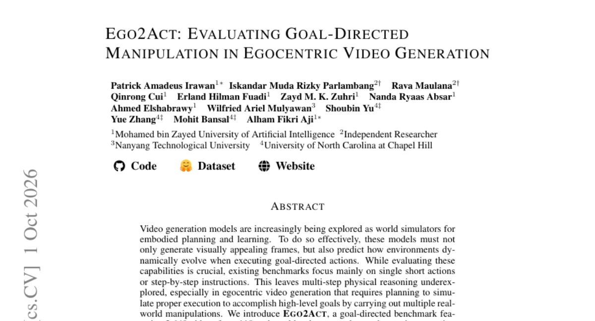

### 📌 한 줄 요약
복합적인 목표 달성을 위한 1인칭 시점 비디오 생성 모델의 물리적 추론 및 계획 능력을 평가하는 벤치마크 제안

### 🔑 핵심 포인트
- 다단계 물리적 추론을 평가하는 1인칭 시점(Egocentric) 비디오 생성 벤치마크 Ego2Act 제안
- 인간의 판단과 높은 일치도를 보이는 참조 없는 평가 파이프라인 Ego2ActJudge 개발
- 현재 비디오 생성 모델이 복합 작업 수행 시 중간 단계 누락 및 물리적 역학 실패 문제를 겪음을 규명

### 🧑‍💻 개발자 관점
로봇 제어 및 Embodied AI를 위한 월드 모델 개발 시, 단순 시각적 품질이 아닌 '목표 달성 가능성'을 검증하는 데 중요한 기준을 제공합니다.

### 🚀 실무 적용 아이디어
- 제안된 Ego2Act 데이터셋을 활용하여 현재 사용 중인 비디오 생성 모델의 계획 능력 테스트
- Ego2ActJudge를 기존 평가 지표(FID 등)와 비교하여 물리적 타당성 측정 도구로 검토
- 다단계 작업 수행 시 발생하는 상태 의존성(State-dependency) 문제를 해결하기 위한 모델 구조 실험

### ⚠️ 리스크/한계
- 실제 물리 법칙을 완벽히 모사하기에는 현재의 생성 모델 기술적 한계가 존재함
- 제시된 벤치마크가 특정 환경이나 작업 유형에 편향될 가능성 있음

### 📝 초록 기반 상세 설명
비디오 생성 모델이 로봇 학습을 위한 월드 시뮬레이터로 활용되려면 단순한 시각적 품질을 넘어 목표 지향적 행동에 따른 환경 변화를 예측할 수 있어야 합니다. 그러나 기존 벤치마크는 단일 동작이나 단순 단계에 집중하여, 복잡한 다단계 물리적 추론이 필요한 1인칭 시점 환경을 충분히 평가하지 못합니다. 이를 해결하기 위해 110개의 실생활 작업과 2,640개의 영상을 포함한 목표 지향적 벤치마크인 Ego2Act를 도입합니다. 또한, 인간의 판단과 유사하게 작업 완료 여부와 물리적 타당성을 평가하는 참조 없는 평가 파이프라인인 Ego2ActJudge를 함께 제안합니다. 실험 결과, 현재 모델들은 중간 단계를 생략하거나 물리적 역학 관계를 정확히 유지하지 못해 최종 목표 달성에 실패하는 경향을 보였습니다.

---

## 37. [Multimodal Flow: Unified Flow Modeling of Language and Vision in Embedding Spaces](https://huggingface.co/papers/2609.40362)
**Upvotes**: 24 | **도입 난이도**: 상 | **신뢰도**: 상
**arXiv**: https://arxiv.org/abs/2609.40362

**태그**: Multimodal, Generative Model, Flow Matching, Embedding Space, RAG, Vision, Evaluation, Inference, Optimization

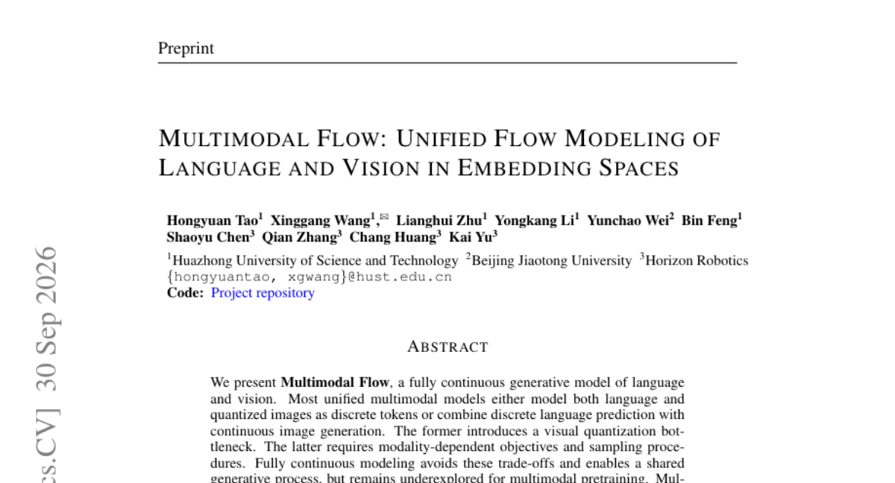

### 📌 한 줄 요약
이산적 토큰화 없이 언어와 이미지를 연속적 임베딩 공간에서 통합 모델링하는 새로운 생성 패러다임 제시

### 🔑 핵심 포인트
- 이산적 양자화 병목을 제거한 완전 연속적(Fully Continuous) 생성 모델링
- 텍스트와 이미지를 순서 있는 하이퍼청크로 관리하는 통합 Flow Matching 아키텍처
- 모달리티별 FFN과 공동 어텐션을 결합하여 상호작용과 개별 특성을 동시에 확보

### 🧑‍💻 개발자 관점
이미지 양자화 손실 없이 텍스트와 이미지를 동일한 벡터 공간에서 다룰 수 있어, 더 정교한 멀티모달 생성 및 이해 작업이 가능해집니다.

### 🚀 실무 적용 아이디어
- 제시된 하이퍼청크 기반의 연속적 임베딩 구조를 기존 VQ-VAE/Diffusion 구조와 비교 실험
- Flow Matching 기반의 생성 속도와 샘플링 품질 간의 트레이드오프 분석
- 특정 도메인 데이터셋에 대한 하이퍼청크 크기(chunk size) 최적화 실험

### ⚠️ 리스크/한계
- 연속적 공간에서의 정밀한 정렬을 위한 고도의 학습 안정성 필요
- 기존 이산 토큰 기반 모델 대비 추론 시 계산 복잡도 및 메모리 관리 이슈 가능성

### 📝 초록 기반 상세 설명
기존의 멀티모달 모델은 이미지를 이산적 토큰으로 양자화하거나, 언어는 이산적이고 이미지는 연속적인 방식으로 처리하여 성능 병목과 복잡한 샘플링 문제를 겪었습니다. 이를 해결하기 위해 본 논문은 언어와 시각 정보를 모두 연속적 표현으로 다루는 'Multimodal Flow'를 제안합니다. 이 모델은 텍al 블록과 이미지를 순서 있는 연속적 하이퍼청크(hyperchunks)로 구성하고, Flow Matching을 통해 단일 벡터 필드를 학습하는 통합 아키텍처를 사용합니다. 실험 결과, 적은 데이터(150B 토큰)로도 기존의 하이브리드 및 이산 모델보다 우수한 성능을 보이며 효율적인 멀티모달 학습 가능성을 입증했습니다.

---

## 38. [Argo-Bench: Evaluating Data Agents on Enterprise-Scale Workflows](https://huggingface.co/papers/2610.02122)
**Upvotes**: 24 | **도입 난이도**: 상 | **신뢰도**: 상
**arXiv**: https://arxiv.org/abs/2610.02122

**태그**: AI Agent, Data Science, Benchmark, Enterprise Workflow, Agent, RAG, Reasoning, Evaluation

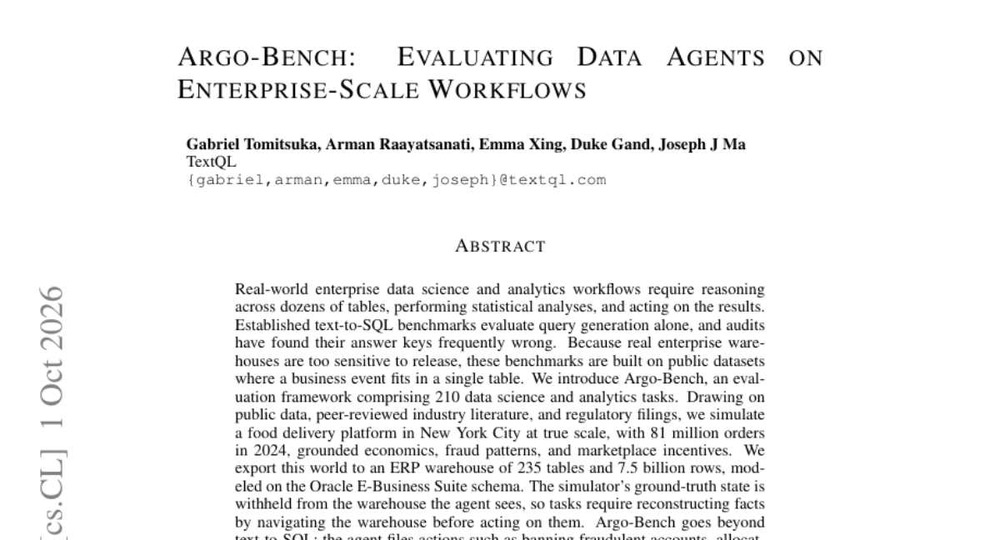

### 📌 한 줄 요약
기업급 규모의 복잡한 데이터 환경에서 에이전트의 추론 및 실행 능력을 평가하기 위한 벤치마크 프레임워크 제안

### 🔑 핵심 포인트
- 235개 테이블, 75억 행 규모의 대규모 ERP 스키마 기반 시뮬레이션 환경 구축
- 단순 쿼리 생성을 넘어 시뮬레이터 내 결과(Consequences)로 성과를 측정하는 액션 중심 평가
- 데이터 탐색, 통계 분석, 의사결정 실행이 결합된 엔터프라이즈급 워크플로우 구현

### 🧑‍💻 개발자 관점
단순 SQL 생성을 넘어, 복잡한 스키마를 탐색하고 비즈니스 로직에 따라 액션을 수행해야 하는 실무형 AI 에이전트 개발의 기준을 제시합니다.

### 🚀 실무 적용 아이디어
- 에이전트의 스키마 탐색 및 Fact Reconstruction 능력 테스트
- 복잡한 관계형 데이터베이스 환경에서의 멀티 스텝 추론 성능 비교
- 시뮬레이션 기반의 결과 중심(Outcome-based) 평가 루프 구축

### ⚠️ 리스크/한계
- 시뮬레이션 환경이 실제 기업 환경의 모든 변수를 완벽히 대변하기 어려움
- 대규모 데이터셋 기반 평가로 인한 높은 컴퓨팅 자원 요구

### 📝 초록 기반 상세 설명
기존의 Text-to-SQL 벤치마크는 단일 테이블 중심의 단순 쿼리 생성에 치중되어 있어, 복잡한 기업용 워크플로우를 평가하기에 부족합니다. 본 논문은 235개의 테이블과 75억 개의 행을 포함하는 대규모 ERP 스키마 기반의 Argo-Bench를 소개합니다. 이 프레임워크는 단순 쿼리 생성을 넘어, 시뮬레이션된 경제 환경 내에서 계정 차단이나 예산 할당과 같은 실질적인 액션을 수행하도록 설계되었습니다. 실험 결과, 최신 모델들도 복잡한 데이터 탐색과 실행이 결합된 과제에서 낮은 성능을 보였습니다. 이는 에이전트가 실제 데이터 환경을 이해하고 행동하는 능력을 높이는 데 기여할 것입니다.

### 🖼️ 추가 자료
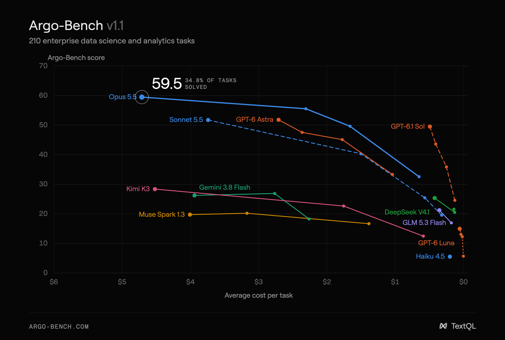

---

## 39. [PhysVista: Benchmarking Physical Intelligence in VLMs via a Perception-Reasoning-Assessment Loop](https://huggingface.co/papers/2610.00559)
**Upvotes**: 21 | **도입 난이도**: 하 | **신뢰도**: 상
**arXiv**: https://arxiv.org/abs/2610.00559

**태그**: VLM, Benchmark, Physical-Intelligence, Video-Generation, RAG, Reasoning, Multimodal, Vision, Video, Evaluation

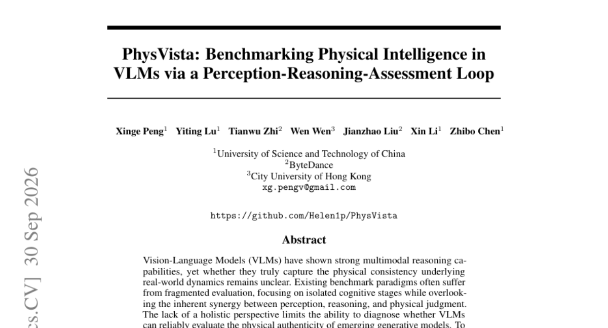

### 📌 한 줄 요약
VLM의 물리적 지능을 평가하기 위해 '인지-추론-판단'의 통합 루프를 제안하는 새로운 벤치마크 PhysVista 소개

### 🔑 핵심 포인트
- 인지-추론-판단이 통합된 폐쇄형 인지 루프(Closed Cognitive Loop) 프레임워크 도입
- 물리적 상태 인지, 역학 추론, 타당성 평가를 결합한 다각적 평가 체계 구축
- 실제 영상과 AI 생성 영상을 모두 포함하여 생성 모델의 물리적 정합성 평가 가능

### 🧑‍💻 개발자 관점
생성형 비디오 모델이나 로봇 제어용 VLM 개발 시, 모델이 물리 법칙을 얼마나 잘 준수하는지 정밀하게 진단할 수 있는 기준을 제공합니다.

### 🚀 실무 적용 아이디어
- 현재 개발 중인 VLM 모델을 PhysVista 벤치마크에 적용하여 물리적 추론 성능 측정
- AI 생성 비디오 데이터셋을 활용해 모델의 물리적 타당성 판별 능력 테스트
- 이벤트/스케일 단위의 세부 분석을 통해 모델의 취약 지점 파악

### ⚠️ 리스크/한계
- 물리적 지능 평가가 시각적 패턴 매칭에 그칠 위험성 존재
- 복잡한 물리 법칙을 완전히 정량화하기에는 여전히 도전적인 과제임

### 📝 초록 기반 상세 설명
최근 VLM의 멀티모달 추론 능력은 향상되었으나, 실제 물리적 역학을 이해하는지는 여전히 불분명합니다. 기존 벤치마크는 개별 인지 단계에만 집중하여 물리적 일관성을 종합적으로 평가하는 데 한계가 있었습니다. 이를 해결하기 위해 인간의 인지 과정을 모방한 'Perception-Reasoning-Assessment' 루프 기반의 PhysVista 벤치마크를 제안합니다. PhysVista는 물리적 상태 인지, 역학 추론, 물리적 타당성 평가를 통합적으로 수행하며, 이벤트 및 스케일 단위의 세밀한 분석을 지원합니다. 실험 결과, 현재의 VLM들은 시각적 인식 능력에 비해 물리적 추론 및 타당성 평가 능력이 현저히 낮음을 확인했습니다.

---

## 40. [Smaller Models, Better Rejects: Preference Distillation Scaling](https://huggingface.co/papers/2609.38987)
**Upvotes**: 20 | **도입 난이도**: 중 | **신뢰도**: 상
**arXiv**: https://arxiv.org/abs/2609.38987

**태그**: LLM, Fine-tuning, Distillation, RLHF, Reasoning, Inference

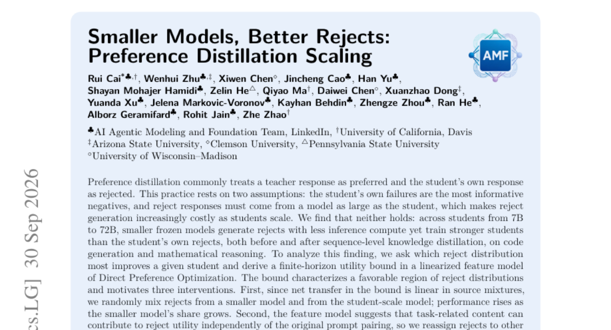

### 📌 한 줄 요약
더 작은 모델이 생성한 거절(Reject) 샘플이 학생 모델의 성능 향상에 더 효과적일 수 있음을 입증한 선호도 증류 기법 연구

### 🔑 핵심 포인트
- 학생 모델의 자기 생성 실패보다 더 작은 규모의 모델이 생성한 거절 샘플이 학습에 더 효과적임
- DPO의 유틸리티 경계 분석을 통해 유용한 거절 샘플의 특성(태스크 구조 유지 및 낮은 likelihood 선택)을 규명
- 코드 생성 및 수학적 추론 태스크에서 저비용 고효율의 선호도 증류 가능성 확인

### 🧑‍💻 개발자 관점
모델 크기를 키우는 대신, 더 작은 모델을 활용해 효율적으로 고성능 학생 모델을 학습시키는 비용 절감 전략을 제공합니다.

### 🚀 실무 적용 아이디어
- 학습 시 학생 모델의 생성물 대신 더 작은 모델의 결과물을 거절 샘플로 섞어서 실험해보기
- 거절 샘플 선택 시 참조 정책(reference policy)의 likelihood가 낮은 후보를 선택하는 전략 적용해보기
- 태스크 구조(코드/수학 등)를 유지하는 범위 내에서 거절 샘플의 변형 실험하기

### ⚠️ 리스크/한계
- 특정 태스크(코드, 수학) 외의 일반 대화형 태스크에서의 일반화 가능성 확인 필요
- 거절 샘플의 품질과 모델 크기 간의 최적 균형점(sweet spot)에 대한 추가 연구 필요

### 📝 초록 기반 상세 설명
기존의 선호도 증류(Preference Distillation)는 학생 모델이 생성한 실패 사례를 거절 샘플로 사용하는 방식에 의존해 왔습니다. 하지만 이는 거절 샘플이 반드시 학생 모델만큼 커야 하거나, 자기 생성 실패가 가장 유용하다는 잘못된 가정을 전제로 합니다. 본 연구는 7B에서 72B 규모의 모델을 대상으로 실험하여, 더 작은 고정 모델(frozen models)이 생성한 거절 샘플이 오히려 더 강력한 학생 모델을 학습시킨다는 것을 발견했습니다. 이를 설명하기 위해 DPO의 유틸리티 경계(utility bound)를 이론적으로 도출하였으며, 거절 샘플의 분포와 태스크 구조의 중요성을 규명했습니다. 결과적으로 태스크 구조를 유지하면서 참조 정책(reference policy)과의 결합을 제한하는 것이 효과적인 거절 샘플의 핵심임을 보여주었습니다.

---

## 41. [Omni-Embed-Mini: Binding Modalities Without Forgetting via Dense Distillation](https://huggingface.co/papers/2610.02148)
**Upvotes**: 19 | **도입 난이도**: 중 | **신뢰도**: 상
**arXiv**: https://arxiv.org/abs/2610.02148

**태그**: Multimodal, Embedding, RAG, Efficient Learning, Vision, Video, Audio, Evaluation, Distillation, Safety

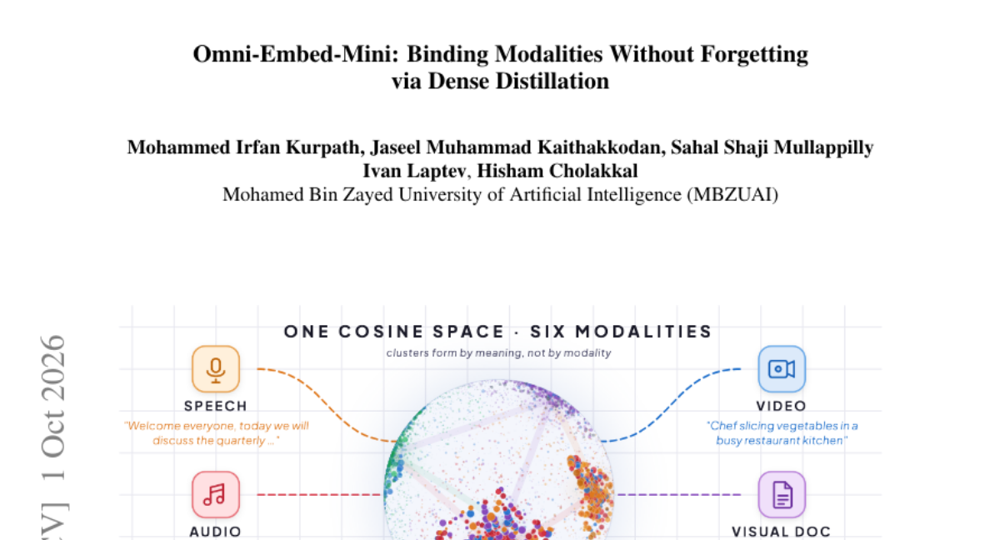

### 📌 한 줄 요약
텍스트 성능 저하 없이 6가지 모달리티를 통합하는 초경량(0.9B) 멀티모달 임베딩 모델 개발

### 🔑 핵심 포인트
- 텍스트 백본 가중치를 고정하여 기존 텍스트 검색 성능 저하(Catastrophic Forgetting)를 원천 차단
- 캡션된 미디어와 고정된 텍스트 임베딩을 매칭하는 밀집 증류(Dense Distillation) 기법 도입
- Matryoshka SigLIP 및 하이브리드 하드 네거티브 마이닝을 통한 효율적 학습

### 🧑‍💻 개발자 관점
텍스트 검색 성능을 유지하면서 이미지, 오디오, 비디오 등을 하나의 벡터 공간에 통합할 수 있어, 멀티모달 RAG 시스템 구축 시 모델 크기와 성능 사이의 트레이드오프를 획기적으로 줄여줍니다.

### 🚀 실무 적용 아이디어
- 제공된 0.9B 모델을 활용하여 기존 텍스트 검색 성능 변화 측정 실험
- 다양한 미디어(이미지, 오디오 등)를 입력했을 때의 임베딩 공간 분포 시각화
- 특정 도메인 데이터셋에 대한 하이브리드 네거티브 마이닝 효과 검증

### ⚠️ 리스크/한계
- 텍스트 백본이 고정되어 있어 텍스트 자체의 표현력을 확장하는 데는 한계가 있음
- 매우 복잡한 멀티모달 추론 작업에서는 거대 모델 대비 성능 차이가 발생할 수 있음

### 📝 초록 기반 상세 설명
기존의 멀티모달 임베딩 모델은 새로운 모달리티를 추가할 때 텍스트 검색 성능이 저하되거나 모델 크기가 지나치게 커지는 문제가 있었습니다. 이를 해결하기 위해 텍스트 백본의 가중치를 고정한 상태에서 다른 모달리티를 정렬하는 Omni-Embed-Mini를 제안합니다. 캡션된 미디어 샘플을 활용해 고정된 텍스트 백본을 교사(Teacher)로 삼는 밀집 증류(Dense Distillation) 방식을 사용합니다. 학습 시에는 Matryoshka SigLIP 손실과 하이브리드 하드 네거티브 마이닝을 결합하여 효율적인 정렬을 수행합니다. 그 결과, 텍스트 성능을 유지하면서도 기존 모델 대비 훨씬 작은 크기로 다양한 모달리티를 통합하는 데 성공했습니다.

---

## 42. [PixelDense: Dense Prediction as Representation Alignment for Pixel Diffusion](https://huggingface.co/papers/2610.00483)
**Upvotes**: 19 | **도입 난이도**: 상 | **신뢰도**: 상
**arXiv**: https://arxiv.org/abs/2610.00483

**태그**: Diffusion, Representation Alignment, Computer Vision, Generative Models, Evaluation, Inference, Safety

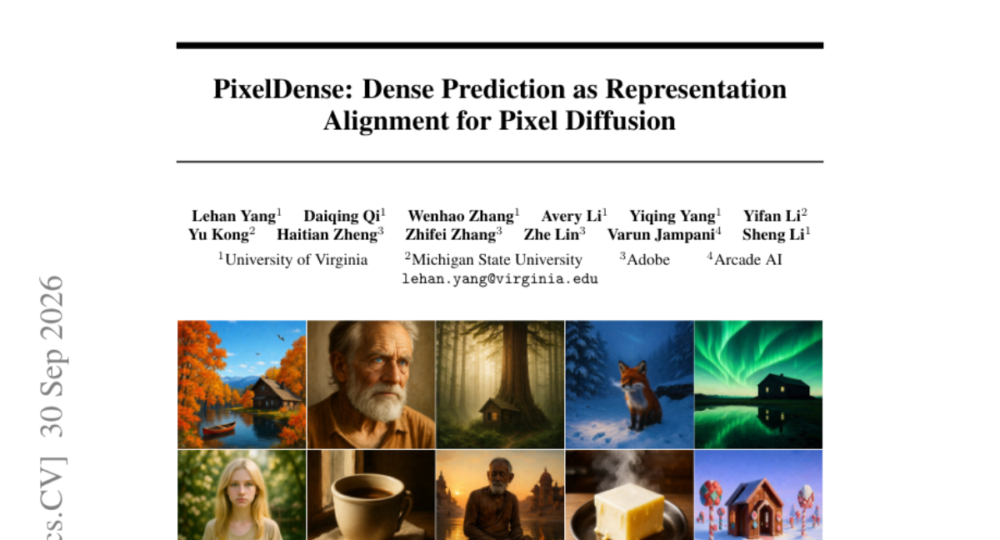

### 📌 한 줄 요약
의미론적(Semantic) 및 기하학적(Geometric) 특징을 분리된 투영 스트림으로 학습하여 픽셀 확산 모델의 생성 품질과 구조적 정밀도를 동시에 높인 기술

### 🔑 핵심 포인트
- 의미론적(Semantic) 및 기하학적(Geometric) 특징을 위한 독립적인 투영 스트림 설계
- 두 스트림 간의 간섭을 방지하기 위한 가중치 공간 직교성 페널티(Orthogonality Penalty) 도입
- 학습 시에는 다중 모델을 활용하고 추론 시에는 제거하여 효율적인 생성 성능 확보

### 🧑‍💻 개발자 관점
이미지 생성 모델 학습 시 단순한 의미론적 정렬을 넘어, 정교한 구조와 레이아웃 유지가 필요한 픽셀 기반 확산 모델의 성능을 극대화할 수 있는 방법론을 제시합니다.

### 🚀 실무 적용 아이디어
- DINOv2 외에 다른 기하학적 모델(예: Marigold)을 활용한 스트림 확장 실험
- 직교성 페널티 계수 변화에 따른 생성 품질 및 학습 안정성 분석
- 제안된 분리형 투영 구조를 기존 Diffusion Transformer 구조에 이식 테스트

### ⚠️ 리스크/한계
- 다양한 Teacher 모델을 사용하므로 학습 시 높은 컴퓨팅 자원 필요
- 스트림 간의 균형(Balance) 조절 실패 시 특정 특징에 편향된 생성 결과 발생 가능성

### 📝 초록 기반 상세 설명
기존의 표현 정렬(REPA) 방식은 주로 CLIP과 같은 의미론적 인코더에만 의존하여 공간 구조 정보를 충분히 활용하지 못했습니다. 여러 모델을 동시에 학습할 경우 의미론적 그래디언트와 기하학적 그래디언트가 충돌하여 성능이 저하되는 문제가 발생합니다. 이를 해결하기 위해 PixelDense는 의미론적 스트림(DINOv2, SAM2)과 기하학적 스트림(Depth Anything v2, Metric3D v2)을 분리하고 직교성 페널티를 적용하는 구조를 제안합니다. 결과적으로 PixelGen과 DeCo 등에서 기존 대비 향상된 생성 성능을 보였으며, 특히 구조적 정밀도와 편집 시 레이아웃 유지 능력이 크게 개선되었습니다.

---

## 43. [Align Then Reason: A Multimodal Lip-Sync Judge for Dubbing](https://huggingface.co/papers/2610.00825)
**Upvotes**: 17 | **도입 난이도**: 상 | **신뢰도**: 상
**arXiv**: https://arxiv.org/abs/2610.00825

**태그**: Multimodal, Lip-Sync, LLM, Video-Language, Video, Audio, Benchmark, Evaluation, Safety

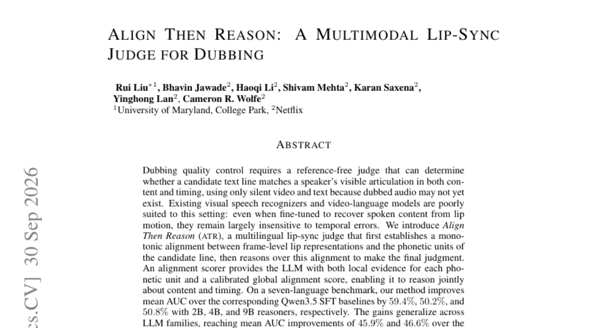

### 📌 한 줄 요약
립싱크 품질 검수를 위해 입 모양과 텍스트 간의 정렬(Alignment)과 추론(Reasoning)을 결합한 멀티모달 모델 제안

### 🔑 핵심 포인트
- 입 모양(Lip motion)과 텍스트(Phonetic units) 간의 단조 정렬(Monotonic Alignment) 메커니즘 도입
- 정렬 스코어러를 통해 LLM이 시간적/내용적 일치 여부를 판단할 수 있는 근거 제공
- 다국어 환경 및 다양한 LLM 아키텍처(LLaMA, Mistral 등)에서의 높은 범용성 및 전이 학습 성능 입증

### 🧑‍💻 개발자 관점
자동 더빙/자막 생성 파이프라인에서 사람이 개입하지 않고도 영상과 텍스트의 싱크 적합성을 자동 검증할 수 있는 기술적 토대를 제공합니다.

### 🚀 실무 적용 아이디어
- 제시된 정렬 스코어링 메커니즘을 기존 VLM(Vision-Language Model)에 이식하여 성능 변화 확인
- 특정 언어(한국어 등) 데이터셋에 대한 정렬 알고리즘의 강건성 테스트
- 실제 더빙 제작 워크플로우에 적용 가능한 실시간 추론 속도 최적화 실험

### ⚠️ 리스크/한계
- 입 모양이 가려지거나(Occlusion) 측면 얼굴인 경우 정렬 정확도 저하 가능성
- LLM의 추론 능력에 의존하므로 모델 크기에 따른 성능 편차가 클 수 있음

### 📝 초록 기반 상세 설명
더빙 품질 관리를 위해서는 오디오 없이 영상과 텍스트만으로 입 모양과 내용의 일치 여부를 판단하는 참조 없는(reference-free) 평가 모델이 필요합니다. 기존의 시각적 음성 인식 모델은 내용 복구에는 강하나 시간적 정렬 오류를 잡아내는 데 한계가 있습니다. 본 논문은 프레임 단위의 입 모양 표현과 음소 단위 간의 단조 정렬(monotonic alignment)을 먼저 수행한 후, 이를 바탕으로 최종 판단을 내리는 'Align Then Reason(ATR)' 방식을 제안합니다. 정렬 스코어러가 제공하는 국소적 증거와 전역적 정렬 점수를 LLM이 결합하여 내용과 타이밍을 동시에 추론합니다. 실험 결과, 다양한 언어 벤치마크와 다운스트림 작업(더빙 라인 재순위화 등)에서 기존 베이스라인 대비 압도적인 성능 향상을 기록했습니다.

---

## 44. [Where-OPD: Spatially Guided On-Policy Self-Distillation of MLLMs with Synthetic Scenes](https://huggingface.co/papers/2610.02117)
**Upvotes**: 15 | **도입 난이도**: 중 | **신뢰도**: 상
**arXiv**: https://arxiv.org/abs/2610.02117

**태그**: MLLM, Self-Distillation, Synthetic-to-Real, Computer Vision, RAG, Reasoning, Multimodal, Vision, Benchmark, Distillation

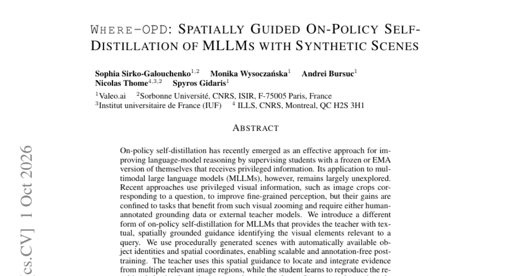

### 📌 한 줄 요약
합성 데이터 기반의 공간 가이드형 자기 증류(Self-Distillation)를 통해 MLLM의 시각적 인지 능력을 향상시키는 방법론

### 🔑 핵심 포인트
- 공간 가이드 기반의 온폴리시 자기 증류(On-policy Self-Distillation) 프레임워크 제안
- 절차적 생성(Procedural Generation)을 통한 주석 없는 대규모 합성 데이터 학습 파이프라인 구축
- 합성 데이터 학습만으로 실제 세계의 시각적 인지 성능을 높이는 강력한 전이 능력 확보

### 🧑‍💻 개발자 관점
데이터 라벨링 비용 없이 합성 데이터만으로 MLLM의 정밀한 시각적 추론 능력을 높일 수 있는 효율적인 학습 전략을 제시합니다.

### 🚀 실무 적용 아이디어
- 절차적 생성 도구를 활용하여 객체 좌표가 포함된 합성 데이터셋 구축 실험
- 기존 MLLM 모델에 공간 가이드를 포함한 교사 모델-학생 모델 구조 적용
- 학습된 모델의 실제 이미지(Real-world) 데이터에 대한 성능 전이도 측정

### ⚠️ 리스크/한계
- 합성 데이터와 실제 데이터 간의 도메인 차이(Domain Gap) 발생 가능성
- 공간 가이드가 제공하는 정보의 복잡도에 따른 학습 난이도 조절 필요

### 📝 초록 기반 상세 설명
최근 MLLM의 성능 향상을 위해 특권 정보(privileged information)를 활용한 온폴리시 자기 증류 방식이 주목받고 있으나, 기존의 이미지 크롭 방식은 특정 작업에 국한되거나 수동 주석이 필요하다는 한계가 있습니다. 본 논문은 텍스트 기반의 공간 가이드를 교사 모델에 제공하여 질문과 관련된 시각적 요소를 식만하게 식별하도록 하는 새로운 자기 증류 방식을 제안합니다. 절차적 생성(procedural generation)을 통해 자동 생성된 합성 장면을 활용함으로써 주석 작업 없이 대규모 사후 학습이 가능하도록 설계했습니다. 교사 모델은 공간 가이드를 통해 여러 영역의 증거를 통합하고, 학생 모델은 이미지와 질문만으로 이 동작을 재현하도록 학습합니다. 실험 결과, 합성 데이터로 학습했음에도 불구하고 실제 세계의 다양한 시각 벤치마크에서 성능 향상이 나타나는 강력한 합성-실제 전이(synthetic-to-real transfer) 능력을 입증했습니다.

---

## 45. [Better Supervision Is Nearby: Neighborhood On-Policy Self-Distillation](https://huggingface.co/papers/2609.39687)
**Upvotes**: 15 | **도입 난이도**: 중 | **신뢰도**: 상
**arXiv**: https://arxiv.org/abs/2609.39687

**태그**: Self-Distillation, Mathematical Reasoning, Parameter Perturbation, LLM Training, RAG, Reasoning, Vision, Benchmark, Evaluation, Inference, Distillation

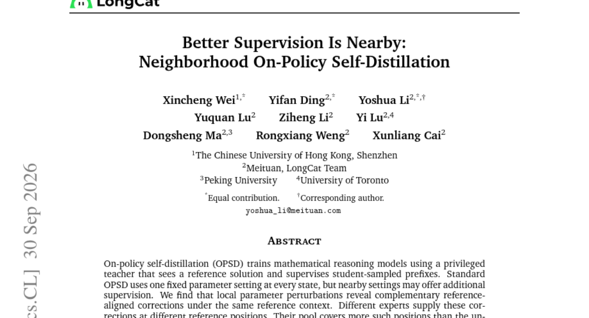

### 📌 한 줄 요약
모델 파라미터의 국소적 변형을 활용해 더 풍부한 지도 신호를 생성하는 새로운 자기 증류(Self-Distillation) 기법

### 🔑 핵심 포인트
- 파라미터 섭동을 통해 정답 맥락 내에서 보완적인 교정 신호를 생성하는 N-OPSD 제안
- 그리디 선택과 온라인 라우팅(MaxPeak 및 Quantile selection)을 결합한 효율적인 전문가 풀 관리
- AIME 등 수학적 추론 벤치마크에서 기존 OPSD 대비 성능 향상 입증

### 🧑‍💻 개발자 관점
모델의 파라미터를 미세하게 조정하는 것만으로도 학습에 유용한 새로운 '전문가'를 생성할 수 있음을 보여주어, 데이터 부족 상황에서의 효율적인 증류 전략을 제시합니다.

### 🚀 실무 적용 아이디어
- 기존 OPSD 프레임워크에 파라미터 섭동 기반의 전문가 풀 생성 로직 적용해보기
- 수학적 추론 태스크에서 파라미터 변동 폭에 따른 성능 변화 관찰하기
- 제안된 MaxPeak 및 Quantile selection 라우팅 방식의 효율성 검증하기

### ⚠️ 리스크/한계
- 전문가 풀 구축 및 라우팅 과정에서 추가적인 계산 비용 발생 가능성
- 특정 도메인(수학적 추론)에 특화된 기법이 다른 태스크에서도 동일하게 작동할지 여부

### 📝 초록 기반 상세 설명
수학적 추론 모델 학습을 위해 정답을 아는 교사 모델이 학생의 샘플링된 접두사를 지도하는 OPSD 방식이 기존에 사용되었습니다. 그러나 기존 방식은 고정된 파라미터 설정만을 사용하여 주변 파라미터가 제공할 수 있는 추가적인 지도 정보를 놓치는 문제가 있었습니다. 본 논문은 파라미터의 국소적 섭동(perturbation)을 통해 정답 맥락 내에서 서로 보완적인 교정 신호를 얻는 N-OPSD를 제안합니다. 오프라인에서 그리디 선택 방식으로 전문가 풀을 구축하고, 온라인 라우팅을 통해 학생의 상태에 가장 적합한 전문가를 선택하여 학습합니다. 실험 결과, AIME 등 고난도 수학 벤치마크에서 기존 OPSD 대비 유의미한 성능 향상을 달성했습니다.

---

## 46. [Benchmarking and Enhancing Skill-Level Memory for Partially Observable Robotic Manipulation](https://huggingface.co/papers/2609.38886)
**Upvotes**: 15 | **도입 난이도**: 중 | **신뢰도**: 상
**arXiv**: https://arxiv.org/abs/2609.38886

**태그**: Robot Learning, Memory Mechanism, Partial Observability, Benchmark, RAG, Evaluation

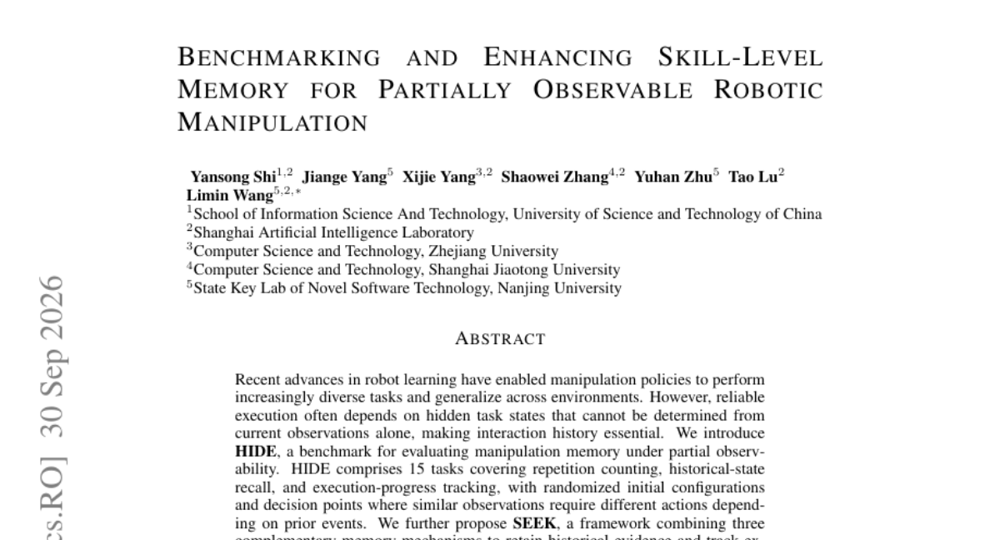

### 📌 한 줄 요약
부분 관측 환경에서 로봇의 작업 성공률을 높이기 위해 과거 이력을 관리하는 메모리 벤치마크(HIDE)와 프레임워크(SEEK)를 제안합니다.

### 🔑 핵심 포인트
- 부분 관측 환경의 메모리 능력을 평가하기 위한 15개 태스크 기반 벤치마크 HIDE 개발
- 과거 증거 유지 및 실행 상태 추적을 위한 3가지 결합형 메모리 프레임워크 SEEK 제안
- 메모리 설계가 작업의 정보 요구 사항과 일치해야 함을 실증적 실험으로 입증

### 🧑‍💻 개발자 관점
관측 데이터가 불완전한 환경에서 로봇이 과거의 맥락을 어떻게 유지하고 활용해야 하는지에 대한 설계 가이드를 제공합니다.

### 🚀 실무 적용 아이디어
- 제안된 HIDE 벤치마크를 활용하여 현재 개발 중인 로봇 정책의 메모리 의존도 테스트
- 단일 메모리 방식과 다중 메커니즘 결합 방식 간의 성능 트레이드오프 분석
- 실제 환경 배포 전 시뮬레이션에서의 메모리 유지 성능 검증

### ⚠️ 리스크/한계
- 특정 작업에 최적화된 메모리 설계가 다른 작업의 성능을 저하시킬 수 있음
- 메모리 크기 및 복잡도 증가에 따른 연산 비용 증가 가능성

### 📝 초록 기반 상세 설명
최근 로봇 학습은 다양한 작업 수행 능력을 보여주고 있으나, 현재 관측값만으로 알 수 없는 숨겨진 상태(hidden state)를 파악하는 데 어려움이 있습니다. 이를 해결하기 위해 과거 이력이 필수적인 상황을 반영한 벤치마크인 HIDE를 도입했습니다. HIDE는 반복 횟수 계산, 과거 상태 회상, 실행 진행 추적 등 15가지 복합 태스크를 포함합니다. 연구진은 세 가지 상호 보완적인 메모리 메커니즘을 결합한 SEEK 프레임워크를 제안했습니다. 실험 결과, 기존 정책들은 HIDE 환경에서 한계를 보였으나 메모리 증강을 통해 시뮬레이션과 실세계 모두에서 성공률이 향상되었습니다. 이는 숨겨진 상태를 유지하는 내부 표현과 작업별 맞춤형 메모리 설계의 중요성을 시사합니다.

---

## 47. [When Users Change Their Minds: Measuring and Repairing Intent Drift in LLM Agents](https://huggingface.co/papers/2609.32520)
**Upvotes**: 15 | **도입 난이도**: 중 | **신뢰도**: 상
**arXiv**: https://arxiv.org/abs/2609.32520

**태그**: LLM-Agent, Prompt-Engineering, Multi-turn-Dialogue, Agent, Benchmark

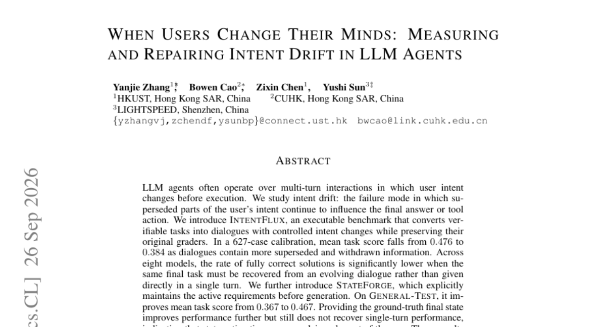

### 📌 한 줄 요약
사용자의 의도 변화가 에이전트의 수행 결과에 미치는 '의도 드리프트(Intent Drift)' 현상을 정의하고 이를 해결하는 프레임워크를 제안합니다.

### 🔑 핵심 포인트
- 사용자의 의도 변화로 인해 과거 정보가 현재 작업에 간섭하는 'Intent Drift' 현상 규명
- 의도 변화가 포함된 대화 환경을 테스트하기 위한 벤치마크 'IntentFlux' 개발
- 활성 요구사항을 명시적으로 관리하는 'StateForge'를 통한 성능 개선

### 🧑‍💻 개발자 관점
사용자의 요구사항이 수시로 바뀌는 실무형 에이전트 개발 시, 과거 대화 맥락이 현재 작업에 방해가 되는 문제를 방지하는 설계 전략을 제공합니다.

### 🚀 실무 적용 아이디어
- 에이전트 프롬프트에 '현재 유효한 요구사항'만 별도로 추출하는 단계 추가하기
- 과거 대화 내용 중 현재 작업과 무관한 정보를 필터링하는 로직 테스트하기
- 멀티턴 대화 시 의도 변화 시나리오를 포함한 벤치마크 적용해보기

### ⚠️ 리스크/한계
- 상태 유지 방식이 단일턴(Single-turn) 수준의 성능을 완전히 회복하지는 못함
- 의도 변화가 복잡해질수록 상태 추정 오류가 발생할 가능성이 존재함

### 📝 초록 기반 상세 설명
LLM 에이전트는 멀티턴 대화 중 사용자의 의도가 변하는 상황에서 과거의 정보가 현재 작업에 영향을 미치는 '의도 드리프트' 문제를 겪습니다. 연구진은 검증 가능한 태스크를 의도 변화가 포함된 대화로 변환하는 벤치마크인 IntentFlux를 도입했습니다. 실험 결과, 대화 내에 폐기된 정보가 많아질수록 모델의 정답률이 유의미하게 하락하는 현상이 관찰되었습니다. 이를 해결하기 위해 생성 전 활성 요구사항을 명시적으로 유지하는 StateForge 방식을 제안했습니다. 실험 결과 StateForge는 모델의 작업 점수를 크게 개선하며, 명시적인 상태 유지 방식이 의도 드리프트 완화에 효과적임을 입증했습니다.

---

## 48. [DataMagic: Authoring Data Videos through Declarative Multi-Agent Orchestration](https://huggingface.co/papers/2609.33403)
**Upvotes**: 14 | **도입 난이도**: 중 | **신뢰도**: 상
**arXiv**: https://arxiv.org/abs/2609.33403

**태그**: Multi-Agent, Data-Visualization, Automation, Orchestration, Agent, Video, Audio, Evaluation, Safety

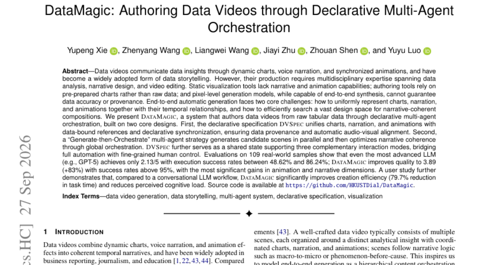

### 📌 한 줄 요약
데이터 기반의 스토리텔링 비디오를 선언적 명세와 멀티 에이전트 오케스트레이션을 통해 자동 생성하는 프레임워크

### 🔑 핵심 포인트
- DVSpec: 데이터 출처와 동기화를 보장하는 선언적 명세 방식 도입
- Generate-then-Orchestrate: 병렬적 장면 생성과 전역적 서사 최적화를 결합한 멀티 에이전트 전략
- Human-in-the-loop: 완전 자동화와 세밀한 수동 제어를 모두 지원하는 상호작용 모드 제공

### 🧑‍💻 개발자 관점
데이터 시각화와 영상 편집 기술이 결합된 복잡한 워크플로우를 선언적 프로그래밍 방식으로 자동화하여 생산성을 극대화할 수 있습니다.

### 🚀 실무 적용 아이디어
- 제공된 DVSpec 명세 형식을 활용하여 복잡한 데이터 시각화 시나리오 테스트
- LLM 기반의 단순 생성 방식과 DataMagic의 오케스트레이션 방식 간의 품질 차이 비교
- 실제 데이터셋을 활용한 자동 생성된 비디오의 데이터 정확성 검증

### ⚠️ 리스크/한계
- 선언적 명세(DVSpec)를 작성하기 위한 도메인 지식 및 학습 곡선 존재
- 복잡한 서사 구조를 가진 비디오 생성 시 에이전트 간 충돌 가능성

### 📝 초록 기반 상세 설명
데이터 시각화, 내러티브, 애니메이션이 결합된 데이터 비디오 제작은 전문적인 편집 기술을 요구하며, 기존 도구들은 데이터 정확성이나 서사적 일관성을 유지하기 어렵습니다. 본 논문은 데이터 원본으로부터 비디오를 생성하기 위해 선언적 명세(DVSpec)와 멀티 에이전트 전략을 결합한 DataMagic을 제안합니다. DVSpec은 차트, 내러티브, 애니메이션을 데이터와 연결된 참조 방식으로 통합하여 데이터 출처와 오디오-비주얼 정렬을 보장합니다. 또한 '생성 후 오케스트레이션(Generate-then-Orchestrate)' 전략을 통해 병렬적인 장면 생성과 전역적인 서사 최적화를 동시에 수행합니다. 실험 결과, DataMagic은 최신 LLM 대비 높은 품질과 성공률을 기록했으며 작업 시간을 대폭 단축시켰습니다.

### 🖼️ 추가 자료
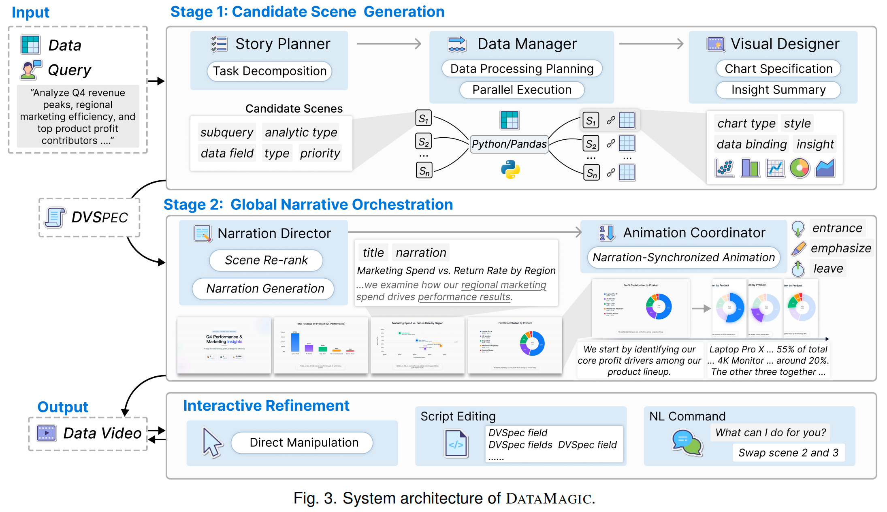
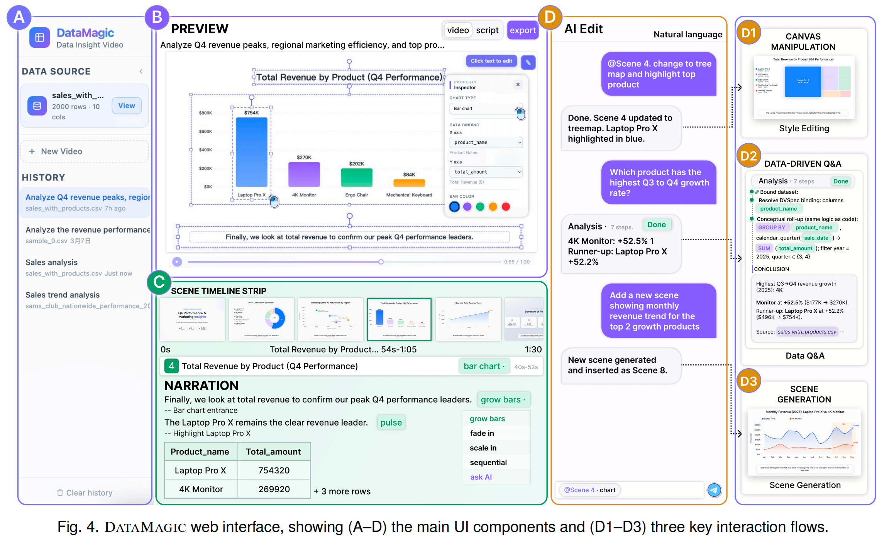

---

## 49. [Pretrain Once, Route Anywhere: Towards a Foundation Model for LLM Routing](https://huggingface.co/papers/2609.37362)
**Upvotes**: 14 | **도입 난이도**: 중 | **신뢰도**: 상
**arXiv**: https://arxiv.org/abs/2609.37362

**태그**: LLM-Routing, Foundation-Model, Efficiency, Transfer-Learning, Vision, Inference

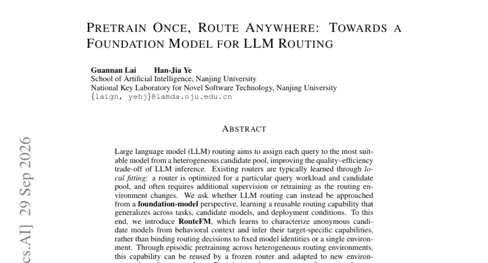

### 📌 한 줄 요약
모델의 정체성에 의존하지 않고 행동 데이터만으로 모델 능력을 파악하여 최적의 경로를 결정하는 범용 라우팅 파운데이션 모델 제안

### 🔑 핵심 포인트
- 모델 ID가 아닌 행동 맥락(Behavioral Context)을 기반으로 모델 능력을 추론하는 범용 라우팅 프레임워크 개발
- 에피소드 기반 사전 학습을 통해 새로운 환경에서도 재학습 없이 컨텍스트만으로 적응 가능한 능력 확보
- 도메인, 모달리티, 후보 모델 풀 변화에 강건한 제로샷/퓨샷 전이 성능 입증

### 🧑‍💻 개발자 관점
모델 인프라가 수시로 변하는 프로덕션 환경에서, 라우터 모델을 매번 재학습할 필요 없이 즉시 배포하고 운영할 수 있는 효율적인 운영 체계를 제공한다.

### 🚀 실무 적용 아이디어
- 제공된 코드를 활용하여 다양한 소형 모델(SLM) 풀에서의 라우팅 성능 테스트
- 데이터가 극도로 적은 상황(Few-shot)에서의 라우팅 정확도 변화 관찰
- 도메인이 완전히 다른 쿼리(예: 코딩 -> 창작)로의 전이 성능 검증

### ⚠️ 리스크/한계
- 행동 데이터(Observation)가 부족할 경우 모델 추론의 불확실성 발생 가능성
- 라우팅 결정 과정의 블랙박스 특성으로 인한 예측 불가능한 결과 리스크

### 📝 초록 기반 상세 설명
LLM 라우팅은 쿼리에 가장 적합한 모델을 선택하여 효율성을 높이는 기술이지만, 기존 방식은 특정 워크로드나 모델 풀에 종속되어 환경 변화 시 재학습이 필요하다는 문제가 있다. 본 논문은 라우팅 능력을 범용적인 파운데이션 모델로 구축하여 다양한 환경에 대응하는 것을 목표로 한다. 이를 위해 제안된 RouteFM은 모델의 고정된 정체성 대신 행동 맥락을 통해 익명 후보 모델의 능력을 추론하는 에피소드 사전 학습 방식을 사용한다. 실험 결과, RouteFM은 도메인, 모달리티, 후보 모델 풀이 바뀌는 환경에서도 높은 전이 성능을 보였다. 특히 데이터가 제한적인 상황에서도 기존 베이스라인을 상회하는 성능을 기록하며 범용 라우팅의 가능성을 입증했다.

---

## 50. [OmniSeek: Native Tool Integration for Multi-turn Audio-Visual Reasoning](https://huggingface.co/papers/2610.02181)
**Upvotes**: 14 | **도입 난이도**: 상 | **신뢰도**: 상
**arXiv**: https://arxiv.org/abs/2610.02181

**태그**: Agent, Multimodal, Reinforcement Learning, Audio-Visual, RAG, Reasoning, Audio, Benchmark

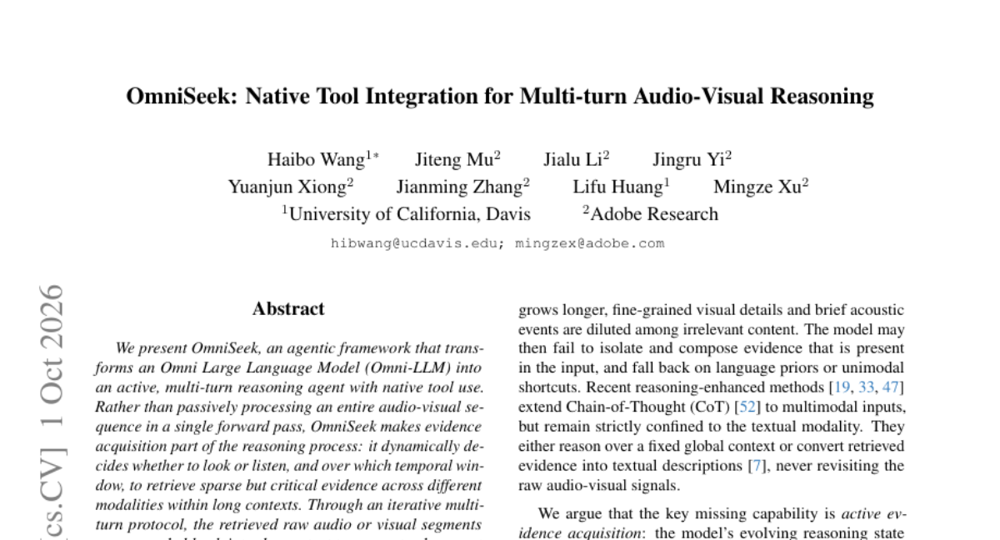

### 📌 한 줄 요약
멀티턴 도구 사용을 통해 긴 오디오-비주얼 데이터에서 필요한 증거를 능동적으로 탐색하는 에이전트 프레임워크

### 🔑 핵심 포인트
- 능동적 증거 획득: 전체 데이터를 한 번에 처리하는 대신, 필요한 시간대의 오디오/비주얼 세그먼트를 동적으로 선택하는 에이전트 방식
- OmniTraj-170K 데이터 엔진: 멀티홉 CoT 추론 경로와 인터리브된 증거가 포함된 합성 데이터셋 구축
- 이중 모달리티 최적화: 단일 모달리티로 문제를 해결하는 편법을 막기 위한 Audio-Visual Necessity 목적 함수 적용

### 🧑‍💻 개발자 관점
긴 영상이나 오디오 데이터를 다룰 때 전체를 모델에 넣는 대신, 필요한 부분만 골라 쓰는 효율적인 RAG(Retrieval-Augmented Generation) 형태의 에이전트 설계 방식을 제시합니다.

### 🚀 실무 적용 아이디어
- 긴 영상 데이터에 대해 특정 구간만 잘라 입력하는 에이전트 루프 구현 실험
- 멀티모달 데이터셋 구축 시 CoT(Chain-of-Thought)를 결합한 합성 데이터 생성 파이프라인 설계
- 단일 모달리티 편향을 막기 위한 보상 함수(Reward Function) 설계 테스트

### ⚠️ 리스크/한계
- 에이전트의 반복적인 도구 사용으로 인한 추론 비용 및 지연 시간(Latency) 증가 가능성
- 특정 시간대 선택 실패 시 전체 추론 결과가 왜곡될 위험

### 📝 초록 기반 상세 설명
기존의 멀티모달 모델은 긴 오디오-비주얼 시퀀스를 한 번의 추론으로 처리하려 하여 효율성과 정확도에 한계가 있었습니다. 이를 해결하기 위해 OmniSeek은 모델이 능동적으로 특정 시간대의 오디오나 비주얼 세그먼트를 선택하여 가져오는 에이전트 프레임워크를 제안합니다. 연구진은 멀티홉 추론 경로가 포함된 OmniTraj-170K 데이터셋을 구축하고, 두 단계의 강화학습을 통해 도구 사용 정책을 최적화했습니다. 특히 단일 모달리티에 의존하는 지름길을 방지하기 위해 오디오-비주얼 상호 의존성을 강조하는 목적 함수를 도입했습니다. 실험 결과, OmniSeek은 적응형 증거 탐색 능력을 학습하여 다양한 벤치마크에서 우수한 추론 성능을 입증했습니다.

---

