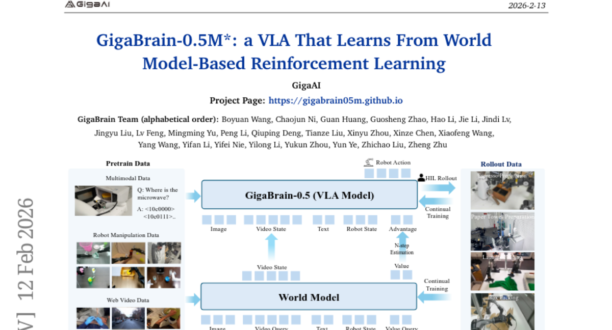

# 2026-W08 Weekly Papers (Copied from Daily 2026-02-13)

## 1. [The Devil Behind Moltbook: Anthropic Safety is Always Vanishing in Self-Evolving AI Societies](https://huggingface.co/papers/2602.09877)
**Upvotes**: 184 | **도입 난이도**: 중 | **신뢰도**: 중

**태그**: Agent, Safety

### 🧭 불확실성 메모
초록(요약) 기반 정리이므로, 세부 구현/실험 세팅은 원문 확인이 필요합니다.

---

## 2. [Composition-RL: Compose Your Verifiable Prompts for Reinforcement Learning of Large Language Models](https://huggingface.co/papers/2602.12036)
**Upvotes**: 88 | **도입 난이도**: 중 | **신뢰도**: 중

**태그**: Reinforcement Learning, LLM, Prompting, Reasoning, Evaluation

### 📌 한 줄 요약
Pass rate 1인 쉬운 프롬프트를 활용하여 LLM의 추론 능력을 향상시키는 Composition-RL 기법을 제안하며, 특히 도메인 간 조합을 통해 성능 향상을 기대할 수 있음

### 🔑 핵심 포인트
- Pass rate 1인 프롬프트를 활용하는 Composition-RL 기법 제안
- 문제 조합을 통해 효과적인 프롬프트 생성 및 데이터 활용률 향상
- 다양한 모델 크기(4B~30B)에서 추론 능력 개선 효과 입증

### 🧑‍💻 개발자 관점
LLM 기반 서비스를 개발할 때, 기존 데이터셋의 쉬운 프롬프트를 활용하여 모델 성능을 개선하고, 다양한 도메인의 데이터를 융합하여 더욱 강력한 모델을 구축하는 데 활용할 수 있습니다.

### 🚀 바로 실험할 액션
- 기존 프롬프트 데이터셋에서 pass rate 1인 프롬프트의 비율 분석
- Composition-RL을 적용하여 모델의 추론 능력 향상 실험
- 다양한 도메인의 프롬프트를 조합하여 cross-domain RL 성능 평가

### ⚠️ 리스크/한계
- 문제 조합 방식에 따라 성능 변화가 있을 수 있음
- 새로운 조합된 문제에 대한 검증 필요

### 🧭 불확실성 메모
초록만으로는 Composition-RL의 구체적인 문제 조합 방식과 그 효과에 대한 자세한 내용을 파악하기 어렵습니다.

### 📝 초록 기반 상세 설명
최근 강화 학습 기반 LLM 연구(RLVR)에서는 검증 가능한 프롬프트를 활용하지만, 데이터셋에 불필요한 예제가 많고 확장 비용이 높다는 문제가 있습니다. 기존 연구는 pass rate가 0인 어려운 프롬프트에 집중했지만, 학습이 진행될수록 pass rate가 1인 쉬운 프롬프트의 비중이 늘어 데이터 활용 효율성이 감소합니다. 이러한 문제를 해결하기 위해 Composition-RL은 여러 문제를 조합하여 새로운 검증 가능한 질문을 생성하고, 이를 강화 학습에 활용합니다. 실험 결과, Composition-RL은 기존 방식보다 추론 능력을 개선했으며, 커리큘럼 학습과 도메인 간 조합을 통해 성능을 더욱 향상시킬 수 있었습니다.

---

## 3. [DeepGen 1.0: A Lightweight Unified Multimodal Model for Advancing Image Generation and Editing](https://huggingface.co/papers/2602.12205)
**Upvotes**: 73 | **도입 난이도**: 중 | **신뢰도**: 중

**태그**: Vision, Multimodal, Generation, Editing, Lightweight, RAG, Reasoning, Benchmark, Safety

### 📌 한 줄 요약
5B 파라미터의 경량화된 통합 멀티모달 모델 DeepGen 1.0을 통해 이미지 생성 및 편집 분야에서 더 큰 모델들을 능가하는 성능을 달성, 오픈소스로 공개하여 접근성을 높임.

### 🔑 핵심 포인트
- 5B 파라미터의 경량화된 통합 멀티모달 모델 DeepGen 1.0 개발
- VLM 레이어 특징 추출 및 'think token' 융합을 위한 SCB 프레임워크 도입
- 대규모 데이터셋 기반의 3단계 학습 전략(정렬 사전 학습, 공동 지도 학습, 강화 학습) 적용

### 🧑‍💻 개발자 관점
DeepGen 1.0은 적은 리소스로도 고성능 이미지 생성 및 편집 기능을 구현할 수 있게 해주며, 오픈소스로 제공되어 연구 및 개발에 빠르게 적용할 수 있다는 점에서 실무적 가치가 높습니다.

### 🚀 바로 실험할 액션
- DeepGen 1.0 모델 다운로드 및 기본 이미지 생성/편집 기능 테스트
- 제공되는 데이터셋 및 학습 코드를 활용하여 특정 도메인에 맞게 Fine-tuning
- SCB 프레임워크를 분석하여 기존 모델에 적용 가능성 검토

### ⚠️ 리스크/한계
- 50M 샘플로 학습되었기 때문에 특정 데이터셋에 대한 편향이 존재할 수 있음
- 경량 모델이므로 매우 복잡하거나 특수한 이미지 생성/편집 작업에는 한계가 있을 수 있음

### 🧭 불확실성 메모
초록만으로는 모델의 실제 성능 및 다양한 환경에서의 안정성을 완벽하게 파악하기 어렵습니다.

### 📝 초록 기반 상세 설명
최근 이미지 생성 및 편집을 위한 통합 멀티모달 모델들은 거대한 파라미터 크기로 인해 학습 및 배포 비용이 매우 높습니다. 본 연구에서는 5B 파라미터의 경량 모델인 DeepGen 1.0을 제시하여, 더 큰 모델들과 경쟁하거나 능가하는 포괄적인 기능을 제공합니다. 컴팩트 모델의 의미 이해 및 정밀 제어 한계를 극복하기 위해, VLM 레이어에서 계층적 특징을 추출하고 학습 가능한 'think token'과 융합하는 SCB(Stacked Channel Bridging) 프레임워크를 도입했습니다. 또한, VLM 및 DiT 표현 동기화를 위한 대규모 이미지-텍스트 쌍 정렬 사전 학습, 다양한 작업에 대한 공동 지도 학습, 그리고 강화 학습을 통해 성능을 향상시켰습니다. DeepGen 1.0은 HunyuanImage 및 Qwen-Image-Edit를 능가하는 성능을 보였으며, 코드, 가중치, 데이터셋을 오픈소스로 공개합니다.

---

## 4. [Learning beyond Teacher: Generalized On-Policy Distillation with Reward Extrapolation](https://huggingface.co/papers/2602.12125)
**Upvotes**: 56 | **도입 난이도**: 중 | **신뢰도**: 중

**태그**: RL, Distillation, Knowledge Distillation, Reward Shaping, Reasoning

### 📌 한 줄 요약
Reward Extrapolation을 통해 On-Policy Distillation 성능을 개선하고, Teacher 모델의 성능을 뛰어넘는 방법론 제시

### 🔑 핵심 포인트
- OPD를 dense KL-constrained RL 관점에서 재해석 및 일반화
- Reward Extrapolation (ExOPD)을 통해 distillation 성능 향상 및 teacher 성능 초월
- Strong-to-weak distillation에서 reward correction을 통한 성능 향상

### 🧑‍💻 개발자 관점
Distillation 성능을 향상시켜 모델 압축 및 경량화를 통해 배포 비용을 줄이고 성능을 높일 수 있습니다. 특히, 여러 domain expert의 지식을 효과적으로 통합하여 단일 모델의 성능을 극대화하는 데 활용 가능합니다.

### 🚀 바로 실험할 액션
- 기존 OPD 파이프라인에 G-OPD 프레임워크 적용 및 reward scaling factor 튜닝
- Strong-to-weak distillation 환경에서 teacher의 pre-RL 모델을 활용한 reward correction 실험
- 다양한 teacher-student 사이즈 조합에서 ExOPD 효과 검증

### ⚠️ 리스크/한계
- Reward scaling factor 튜닝에 따른 추가적인 실험 비용 발생 가능성
- Teacher의 pre-RL 모델에 접근이 불가능한 경우 reward correction 적용 불가

### 🧭 불확실성 메모
초록만으로는 G-OPD의 실제 구현 복잡도 및 computational overhead를 정확히 파악하기 어렵습니다.

### 📝 초록 기반 상세 설명
On-policy distillation (OPD)은 student 모델의 성능 향상에 효과적이지만, 기존 방식은 reward와 KL regularization의 가중치가 고정되어 있었습니다. 본 연구에서는 OPD를 dense KL-constrained RL의 특수한 경우로 이론적으로 분석하고, reward scaling factor를 도입하여 reward와 KL regularization의 가중치를 유연하게 조절하는 Generalized On-Policy Distillation (G-OPD) 프레임워크를 제안합니다. 수학 추론 및 코드 생성 task에서 reward scaling factor를 1보다 크게 설정하는 ExOPD가 기존 OPD보다 성능이 우수함을 확인했습니다. 특히, 도메인 전문가의 지식을 student 모델에 통합하는 과정에서 ExOPD는 teacher 모델의 성능을 능가하는 결과를 보였습니다. Strong-to-weak distillation 환경에서는 teacher의 pre-RL 모델을 reference 모델로 사용하여 reward correction을 수행하는 것이 성능 향상에 도움이 되지만, 추가적인 계산 비용이 발생합니다.

---

## 5. [GigaBrain-0.5M*: a VLA That Learns From World Model-Based Reinforcement Learning](https://huggingface.co/papers/2602.12099)
**Upvotes**: 47 | **도입 난이도**: 중 | **신뢰도**: 중

**태그**: Robotics, Reinforcement Learning, World Model, VLA, Manipulation, Reasoning, Vision, Video, Benchmark

### 📌 한 줄 요약
웹 스케일 비디오로 사전 학습된 월드 모델 기반 강화 학습을 통해 로봇 팔의 장기 실행 능력을 획기적으로 개선한 GigaBrain-0.5M* 모델을 제시합니다.

### 🔑 핵심 포인트
- 웹 스케일 비디오로 사전 학습된 월드 모델을 VLA에 통합
- RAMP (Reinforcement leArning via world Model-conditioned Policy)를 통한 cross-task 적응력 향상
- Laundry Folding, Box Packing, Espresso Preparation 등 복잡한 조작 작업에서 30% 성능 향상

### 🧑‍💻 개발자 관점
로봇 자동화 시스템 구축 시, 사전 학습된 월드 모델을 활용하여 강화 학습 기반 로봇 제어 성능을 향상시키고, 다양한 작업 환경에 쉽게 적응할 수 있도록 하는 데 활용 가능합니다.

### 🚀 바로 실험할 액션
- GigaBrain-0.5 및 RAMP 구현 세부 사항 확인
- 자체 로봇 팔 환경에서 RAMP 적용 가능성 검토
- 월드 모델 사전 학습에 사용할 비디오 데이터셋 확장 전략 연구

### ⚠️ 리스크/한계
- 월드 모델의 성능이 전체 시스템 성능에 큰 영향
- 실제 환경에서의 일반화 성능 추가 검증 필요

### 🧭 불확실성 메모
초록 정보만으로는 GigaBrain-0.5M* 모델의 구체적인 구조 및 학습 방법, 그리고 데이터셋에 대한 상세 정보를 파악하기 어렵습니다.

### 📝 초록 기반 상세 설명
기존 Vision-Language-Action (VLA) 모델은 제한적인 장면 이해 및 미래 예측 능력으로 인해 다단계 액션 예측에 어려움을 겪습니다. 반면, 웹 스케일 비디오로 사전 학습된 월드 모델은 강력한 시공간 추론 및 미래 예측 능력을 제공합니다. 본 논문에서는 월드 모델 기반 강화 학습을 통해 학습된 VLA 모델인 GigaBrain-0.5M*을 제안합니다. GigaBrain-0.5를 기반으로 RAMP를 통합하여 다양한 작업에 대한 적응력을 향상시켰습니다. Laundry Folding, Box Packing, Espresso Preparation 등에서 RECAP baseline 대비 약 30% 향상된 성능을 보였으며, 실제 로봇 팔 작동 영상에서 장기 실행 능력을 입증했습니다.

---

