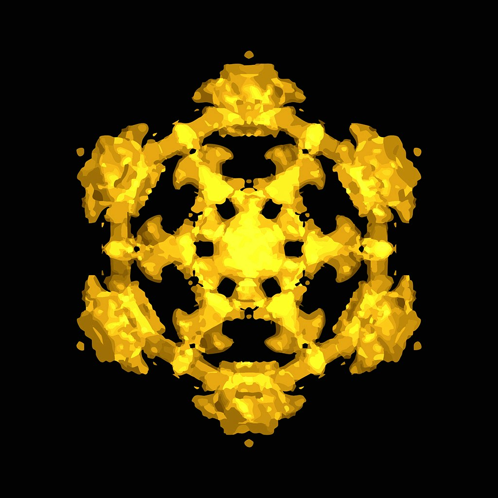
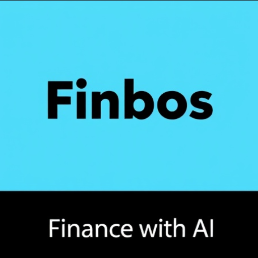

# 🚀 Product Hunt Daily Top 10 (2025-12-31)

## 1. [Creaibo](https://www.producthunt.com/products/creaibo-3?utm_campaign=producthunt-api&utm_medium=api-v2&utm_source=Application%3A+antigravity_test+%28ID%3A+258588%29)
**Votes**: 421 | **Tagline**: Create 10x better content that sounds like you, faster

### 📌 요약
크리에이터의 독특한 스타일을 유지하면서 콘텐츠 아이디어 구상부터 완성까지 전 과정을 지원하여 효율과 품질을 10배 향상시키는 AI 기반 통합 창작 공간입니다.

### 🔑 핵심 기능
- 아이디어 구상, 구조화, 완성된 콘텐츠 제작 등 전체 워크플로를 지원하는 AI 네이티브 통합 환경 제공
- 개성 없고 로봇 같은 결과물을 거부하는 오리지널 콘텐츠 창작자를 위해 고유한 창의성을 보존하고 확장하도록 설계
- 블로그, 영상(롱/숏), 시각-텍스트 게시물 등 모든 형식에서 일관된 스타일을 유지하며 창작 효율과 콘텐츠 품질을 혁신적으로 향상

---

## 2. [Foundire](https://www.producthunt.com/products/foundire-2?utm_campaign=producthunt-api&utm_medium=api-v2&utm_source=Application%3A+antigravity_test+%28ID%3A+258588%29)
**Votes**: 371 | **Tagline**: First-round interviews on autopilot

### 📌 요약
반복되는 1차 인터뷰 과정을 자동화하고 채용 팀의 효율성을 극대화하는 AI 기반 채용 관리 솔루션입니다.

### 🔑 핵심 기능
- 이력서 채점 및 적응형 AI 인터뷰를 통한 1차 인터뷰 자동화 및 평가 자료 생성
- 실시간 프롬프트, 후속 질문 제안 등을 제공하는 라이브 인터뷰 코파일럿 기능
- 글로벌 인재 검색부터 오퍼 및 백그라운드 체크까지 모든 채용 과정을 통합 관리하는 워크플로우 제공

---

## 3. [wink-cursor](https://www.producthunt.com/products/wink-cursor?utm_campaign=producthunt-api&utm_medium=api-v2&utm_source=Application%3A+antigravity_test+%28ID%3A+258588%29)
**Votes**: 255 | **Tagline**: A lightweight smiley cursor with "winks" on click

### 📌 요약
사용자가 클릭할 때마다 윙크하는 유쾌한 이모티콘 커서로 일반적인 UI에 즐거운 마이크로 인터랙션을 더하는 React 컴포넌트입니다.

### 🔑 핵심 기능
- 클릭 시 윙크 애니메이션을 보여주는 가볍고 맞춤 설정 가능한 스마일리 커서
- 앱에 즐거움을 더하여 온보딩 및 랜딩 페이지의 사용자 경험 향상
- 간편한 설치, 제로 디자인 노력, 모든 앱에서 작동하는 매끄러운 애니메이션 제공

---

## 4. [Notchie](https://www.producthunt.com/products/notchie?utm_campaign=producthunt-api&utm_medium=api-v2&utm_source=Application%3A+antigravity_test+%28ID%3A+258588%29)
**Votes**: 248 | **Tagline**: A teleprompter that lives in your Macbook's notch

### 📌 요약
맥북 노치 영역에 숨어 사용자가 스크립트를 보며 카메라를 응시하도록 돕는 인공지능 기반의 텔레프롬프터 솔루션입니다.

### 🔑 핵심 기능
- 맥북 노치 아래에 스크립트가 표시되어 렌즈를 직접 바라보며 자연스럽게 읽을 수 있습니다.
- 사용자의 음성 속도에 맞춰 스크립트가 자동 스크롤되며, 말을 멈추면 대기하고 속도를 높이면 따라잡는 기능이 있습니다.
- 화면 공유 시에는 상대방에게 보이지 않아(Zoom, Meet 등) 웨비나, 세일즈 콜, 녹화 시 유용합니다.

---

## 5. [Imajourn](https://www.producthunt.com/products/numatics?utm_campaign=producthunt-api&utm_medium=api-v2&utm_source=Application%3A+antigravity_test+%28ID%3A+258588%29)
**Votes**: 176 | **Tagline**: We are now on the Apple App Store with multiple new features

### 📌 요약
파동과 소리의 물리학을 시뮬레이션하여 시각적, 청각적으로 즐길 수 있게 만든 인터랙티브 샌드박스 앱 'Imajourn'이 Apple 앱스토어에 정식 출시되었습니다.

### 🔑 핵심 기능
- 파동(wave)과 소리(sound)의 물리학적 원리를 시각화하는 인터랙티브 시뮬레이션 기능 제공
- Chladni 패턴, Cymatics(소리 도형학), 오디오 반응성 등 몰입감 높은 시각 효과 및 3D 입자 시뮬레이션 도입
- 기존 오픈 소스 웹 앱 버전(Numatics)에서 새로운 브랜드로 전환하며, 다양한 신규 기능과 프리셋을 추가하여 앱스토어 정식 출시

---

## 6. [Vidcard](https://www.producthunt.com/products/vidcard?utm_campaign=producthunt-api&utm_medium=api-v2&utm_source=Application%3A+antigravity_test+%28ID%3A+258588%29)
**Votes**: 143 | **Tagline**: The World's First Video Business Card—Be Unforgettable

### 📌 요약
종이 명함 대신 100% 주목도를 확보하고 비디오 피치를 즉시 재생하며 NFC 트래킹까지 제공하는 세계 최초의 '비디오 명함'입니다.

### 🔑 핵심 기능
- 지루한 종이 명함의 한계를 넘어 100% 주목도를 확보하는 즉각적인 HD 비디오 피치 재생.
- 누가 프로필을 보았는지 정확히 추적하여 데이터 피드백을 제공하는 강력한 NFC 트래킹 기능.
- 5mm 미만의 초박형 디자인을 채택했으며, 무선 충전을 지원하는 첨단 사양.

---

## 7. [Trip Replay](https://www.producthunt.com/products/trip-replay?utm_campaign=producthunt-api&utm_medium=api-v2&utm_source=Application%3A+antigravity_test+%28ID%3A+258588%29)
**Votes**: 133 | **Tagline**: Turn your travels into stunning videos

---

## 8. [Inspiration by Mind Dock](https://www.producthunt.com/products/product-hunt-launch-kit-for-ai-data-map?utm_campaign=producthunt-api&utm_medium=api-v2&utm_source=Application%3A+antigravity_test+%28ID%3A+258588%29)
**Votes**: 95 | **Tagline**:  Live AI trends from HuggingFace, ArXiv, GitHub, and more

---

## 9. [Running Form Analysis App ](https://www.producthunt.com/products/running-form-analysis-web-app?utm_campaign=producthunt-api&utm_medium=api-v2&utm_source=Application%3A+antigravity_test+%28ID%3A+258588%29)
**Votes**: 83 | **Tagline**: Upload a short side-view clip, get actionable form feedback

---

## 10. [Finbos](https://www.producthunt.com/products/finbos-2?utm_campaign=producthunt-api&utm_medium=api-v2&utm_source=Application%3A+antigravity_test+%28ID%3A+258588%29)
**Votes**: 58 | **Tagline**: AI powered financial intelligence app

---

