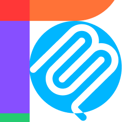
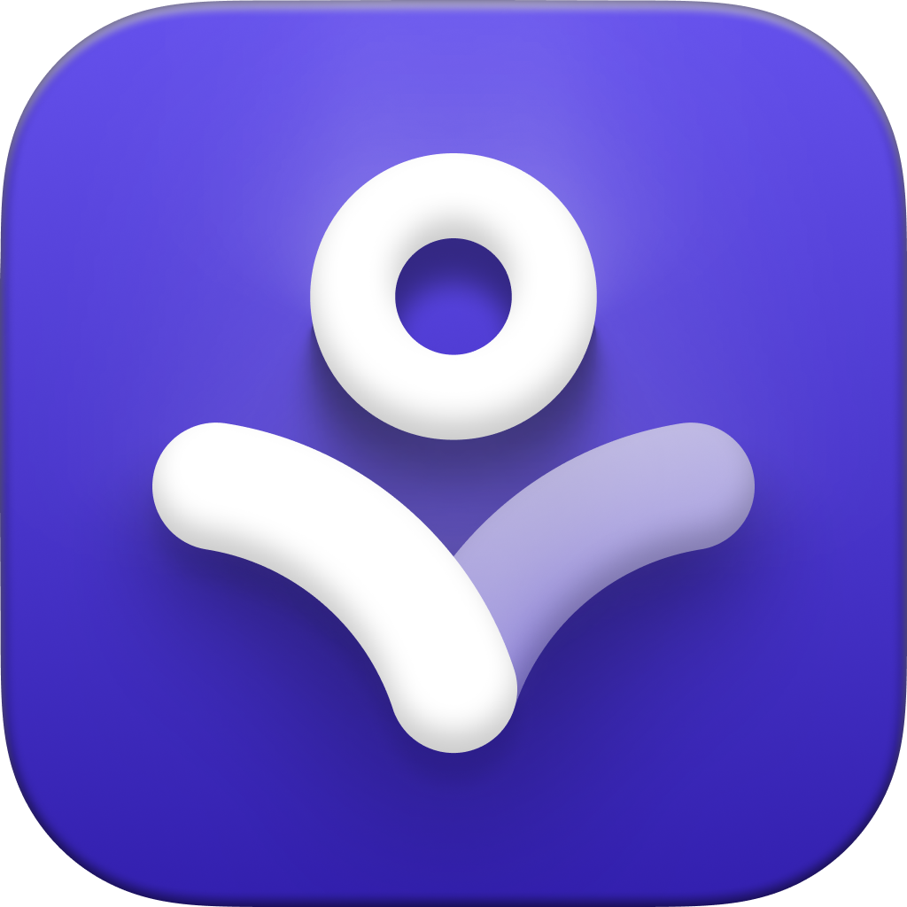
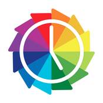

# 🚀 Product Hunt Daily Top 10 (2026-01-02)

## 1. [Clear for Slack](https://www.producthunt.com/products/clear-for-slack?utm_campaign=producthunt-api&utm_medium=api-v2&utm_source=Application%3A+antigravity_test+%28ID%3A+258588%29)
**Votes**: 254 | **Tagline**: Clear messages get answered quicker

### 📌 요약
업무용 메시지를 더욱 명확하고 직설적으로 작성하도록 돕는 프라이버시 중심의 슬랙(Slack) 앱입니다.

### 🔑 핵심 기능
- 명확하고 직접적인 직장 메시지 작성을 지원하여 답변율 및 효율성 향상
- 사용자의 메시지를 저장하지 않는 프라이버시 우선(Privacy-first) 설계
- 시간이 지남에 따라 사용자의 글쓰기 능력을 향상시키는 코칭 기능 내장

---

## 2. [Community Figma MCP server](https://www.producthunt.com/products/community-figma-mcp-server?utm_campaign=producthunt-api&utm_medium=api-v2&utm_source=Application%3A+antigravity_test+%28ID%3A+258588%29)
**Votes**: 232 | **Tagline**: Allow AI Agents to help you with Figma designs!

### 📌 요약
비공식 Figma MCP(Model Context Protocol) 서버는 AI 에이전트가 Figma 디자인 문서를 생성, 편집 및 정리할 수 있도록 돕는 연결고리 역할을 합니다.

### 🔑 핵심 기능
- AI 에이전트가 Figma 디자인을 직접 생성, 수정 및 배치할 수 있게 해줍니다.
- ChatGPT, Claude Desktop, Cursor 등 MCP를 지원하는 모든 클라이언트와 함께 사용할 수 있습니다.
- Figma와 LLM(대규모 언어 모델)을 함께 사용하는 새로운 워크플로우를 제공합니다.
- 프로젝트는 무료이며 오픈 소스로 제공되어 추가 비용이나 설정 없이 바로 사용 가능합니다.

---

## 3. [Griply 2026](https://www.producthunt.com/products/griply?utm_campaign=producthunt-api&utm_medium=api-v2&utm_source=Application%3A+antigravity_test+%28ID%3A+258588%29)
**Votes**: 165 | **Tagline**: Achieve your goals with a goal-oriented task manager

### 📌 요약
단순 할 일 관리를 넘어, 장기 목표를 일일 행동 및 습관으로 연결하여 성과를 추적하게 돕는 목표 중심의 태스크 매니저입니다.

### 🔑 핵심 기능
- 목표, 습관, 태스크, 캘린더를 통합하여 목표 달성 과정을 체계적으로 관리합니다.
- 추상적인 목표를 측정 가능한 일일 행동으로 분해하여 실행력을 높여줍니다.
- 단순 작업 목록이 아닌, 결과(Outcomes) 중심의 계획 및 진행 상황 추적 기능을 제공합니다.

---

## 4. [HappyMail](https://www.producthunt.com/products/happymail?utm_campaign=producthunt-api&utm_medium=api-v2&utm_source=Application%3A+antigravity_test+%28ID%3A+258588%29)
**Votes**: 143 | **Tagline**: We made email simple again

### 📌 요약
직업이나 정체성을 나타내는 수백 가지의 독특한 확장자(.actor, .chef 등)를 활용하여 간단하고 전문적인 개인 맞춤형 이메일 주소를 생성할 수 있는 서비스입니다.

### 🔑 핵심 기능
- 배우, 셰프 등 직업군에 특화된 수백 가지의 독특한 이메일 확장자(TLD) 제공.
- 몇 번의 클릭만으로 설정 가능한 간편하고 안전하며 프로페셔널한 이메일 주소 생성.
- 기존 사용하던 모든 이메일 앱 및 클라이언트와의 완벽한 호환성 지원.

---

## 5. [vibecoder.date](https://www.producthunt.com/products/vibecoder-date?utm_campaign=producthunt-api&utm_medium=api-v2&utm_source=Application%3A+antigravity_test+%28ID%3A+258588%29)
**Votes**: 129 | **Tagline**: Find who you vibe with, git commit to love

### 📌 요약
개발자 전용 데이팅 앱으로, VS Code나 Cursor 같은 코드 에디터 내에서 탭 전환 없이 바로 상대를 찾고 대화할 수 있는 혁신적인 서비스입니다.

### 🔑 핵심 기능
- 개발자(vibecoder) 맞춤형 데이팅 앱: 'vibecoder.date'
- VS Code, Cursor 등 개발 환경에서 바로 사용 가능하여 컨텍스트 스위칭 최소화
- 코드에 집중하면서도 'git commit to love'처럼 자연스럽게 상대를 만날 수 있는 방식

---

## 6. [Radial](https://www.producthunt.com/products/radial?utm_campaign=producthunt-api&utm_medium=api-v2&utm_source=Application%3A+antigravity_test+%28ID%3A+258588%29)
**Votes**: 90 | **Tagline**: Your shortcuts, one gesture away

---

## 7. [Blober.io](https://www.producthunt.com/products/blober-io?utm_campaign=producthunt-api&utm_medium=api-v2&utm_source=Application%3A+antigravity_test+%28ID%3A+258588%29)
**Votes**: 85 | **Tagline**: The easiest way to transfer files between cloud providers.

---

## 8. [CalPal](https://www.producthunt.com/products/calpal-3?utm_campaign=producthunt-api&utm_medium=api-v2&utm_source=Application%3A+antigravity_test+%28ID%3A+258588%29)
**Votes**: 82 | **Tagline**: The notebook calculator that thinks for you (now with AI).

---

## 9. [Supaguard ](https://www.producthunt.com/products/supaguard?utm_campaign=producthunt-api&utm_medium=api-v2&utm_source=Application%3A+antigravity_test+%28ID%3A+258588%29)
**Votes**: 80 | **Tagline**: Scan, Detect & Protect Your Supabase Data

---

## 10. [Timelines 4](https://www.producthunt.com/products/timelines?utm_campaign=producthunt-api&utm_medium=api-v2&utm_source=Application%3A+antigravity_test+%28ID%3A+258588%29)
**Votes**: 71 | **Tagline**: Track your time to achieve your New Year's resolutions.

---

