# 🚀 Product Hunt Daily Top 10 (2026-01-04)

## 1. [Joodle](https://www.producthunt.com/products/joodle-journaling-with-doodle?utm_campaign=producthunt-api&utm_medium=api-v2&utm_source=Application%3A+antigravity_test+%28ID%3A+258588%29)
**Votes**: 319 | **Tagline**: Turn years of memories into personal doodles

### 📌 요약
그림 실력 없이도 일상 속 순간들을 간단한 낙서로 기록하고 이를 시각적 타임라인 일기로 만들어주는 개인용 낙서 다이어리 앱입니다.

### 🔑 핵심 기능
- 손쉬운 일상 낙서 기록 기능 및 시각적 타임라인 자동 생성
- 기억을 홈 화면에서 바로 볼 수 있는 위젯 기능 제공
- iCloud 동기화 지원으로 모든 기기에서 안전하게 사용 가능

### 📸 스크린샷 및 갤러리
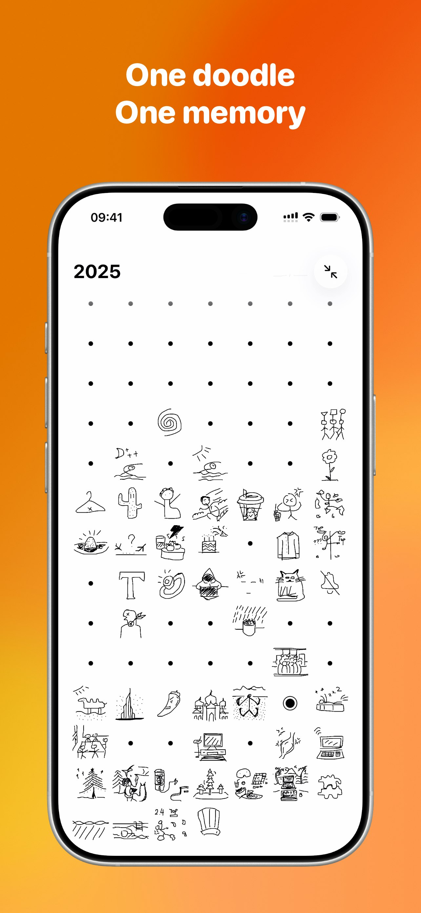
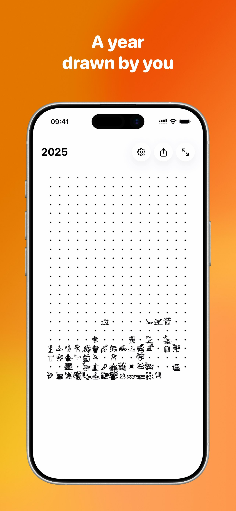
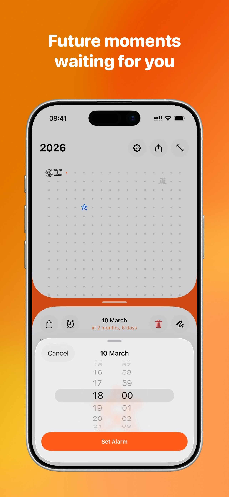

---

## 2. [Scaloom AI](https://www.producthunt.com/products/scaloom-ai?utm_campaign=producthunt-api&utm_medium=api-v2&utm_source=Application%3A+antigravity_test+%28ID%3A+258588%29)
**Votes**: 270 | **Tagline**: Reddit marketing made-easy tool

### 📌 요약
Scaloom AI는 신뢰 구축을 통해 스팸이나 차단 위험 없이 안전하고 효과적인 레딧 마케팅을 지원하는 AI 기반 솔루션입니다.

### 🔑 핵심 기능
- 자연스러운 활동으로 레딧 계정을 활성화하고 카르마 및 신뢰도를 사전에 구축합니다.
- 관련성 높은 서브레딧 탐색, 가치 중심의 게시물 생성 및 댓글 자동 응답을 지원합니다.
- 스팸 및 계정 차단(Ban) 위험 없이 마케팅 캠페인을 관리하고 성과를 극대화합니다.

### 📸 스크린샷 및 갤러리

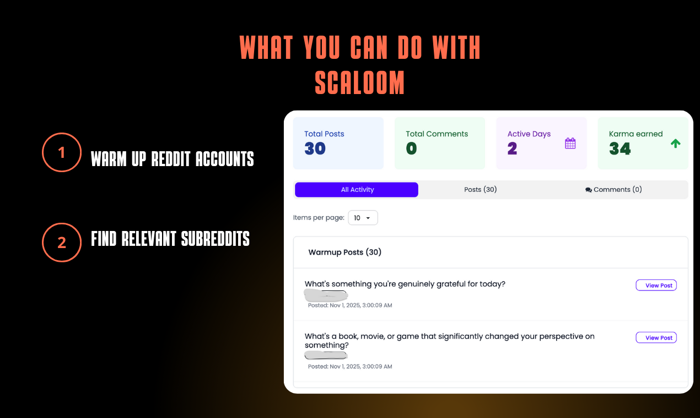
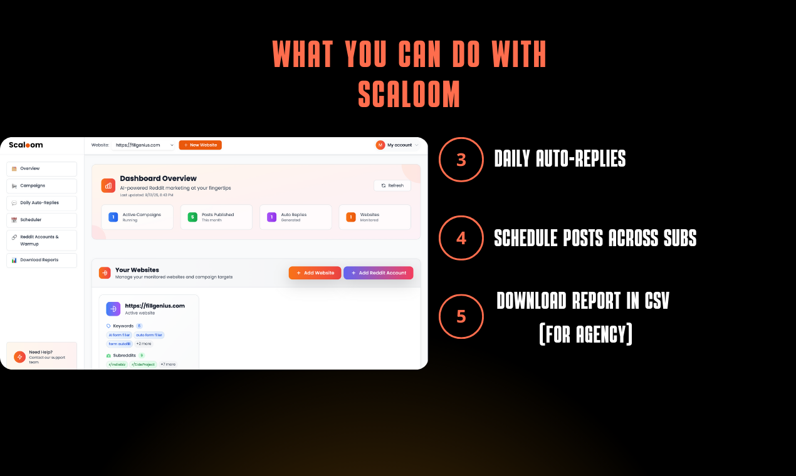

---

## 3. [Nutgrafe](https://www.producthunt.com/products/nutgrafe?utm_campaign=producthunt-api&utm_medium=api-v2&utm_source=Application%3A+antigravity_test+%28ID%3A+258588%29)
**Votes**: 217 | **Tagline**: The news, reduced to what matters.

### 📌 요약
AI가 전 세계 주요 뉴스를 분석하고, 핵심 내용(nutgraf)만을 400자 이내의 짧은 요약으로 제공하는 뉴스 피드 서비스입니다.

### 🔑 핵심 기능
- AI 기반으로 복잡한 기사를 핵심만 담은 'nutgraf' 요약으로 제공
- 400자 이내의 간결한 요약으로 빠르게 정보 파악 가능
- 핵심 포인트와 배경 정보를 제공하며, 원문 링크로 이동 지원

### 📸 스크린샷 및 갤러리
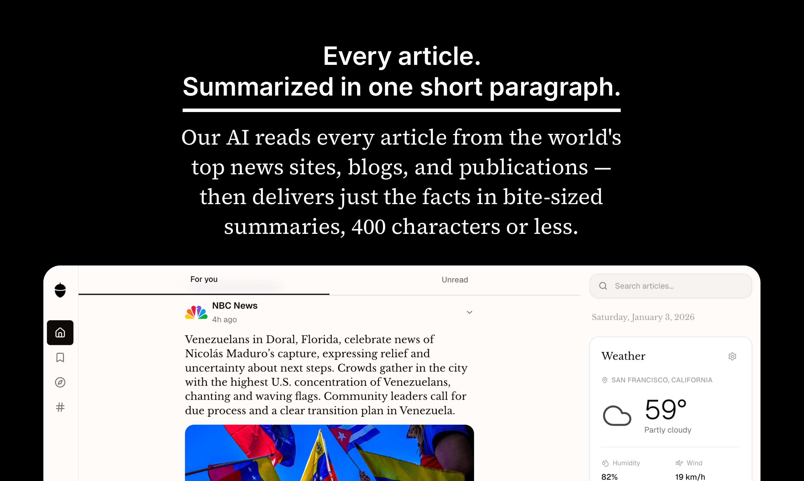
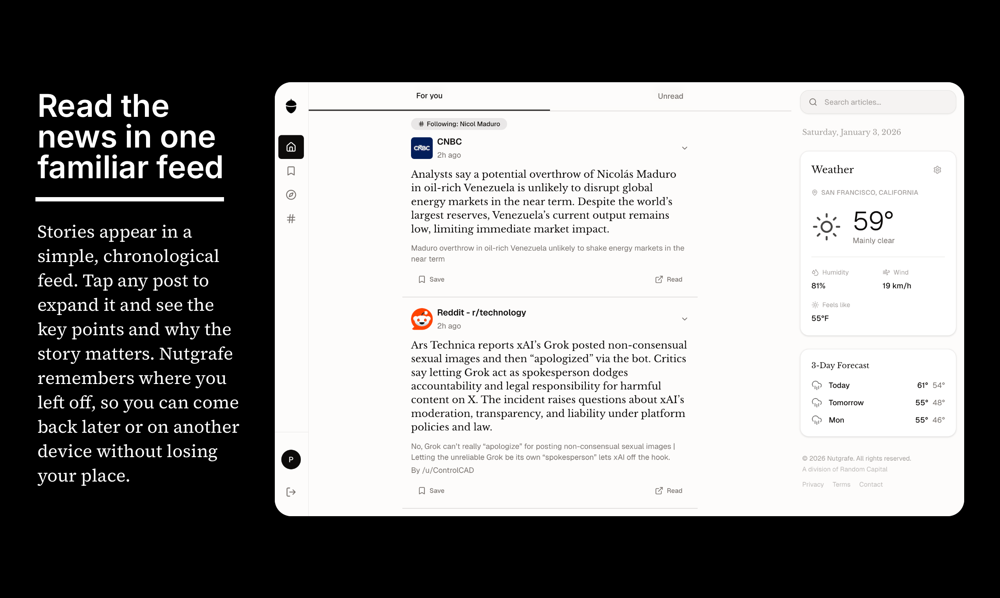
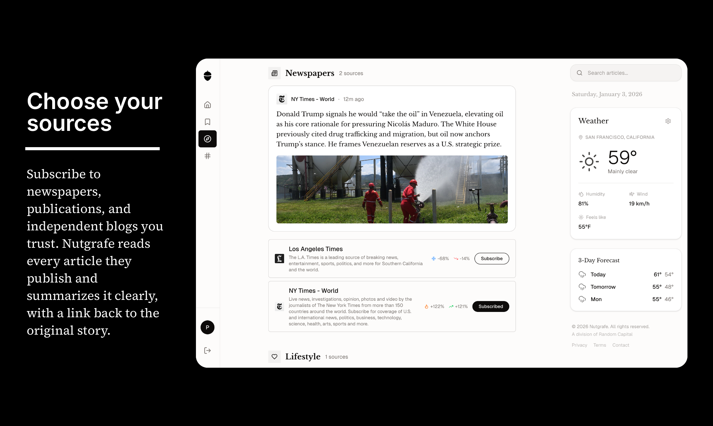

---

## 4. [Everyessay](https://www.producthunt.com/products/everyessay?utm_campaign=producthunt-api&utm_medium=api-v2&utm_source=Application%3A+antigravity_test+%28ID%3A+258588%29)
**Votes**: 181 | **Tagline**: AI essays, trained on winning human-briefs.

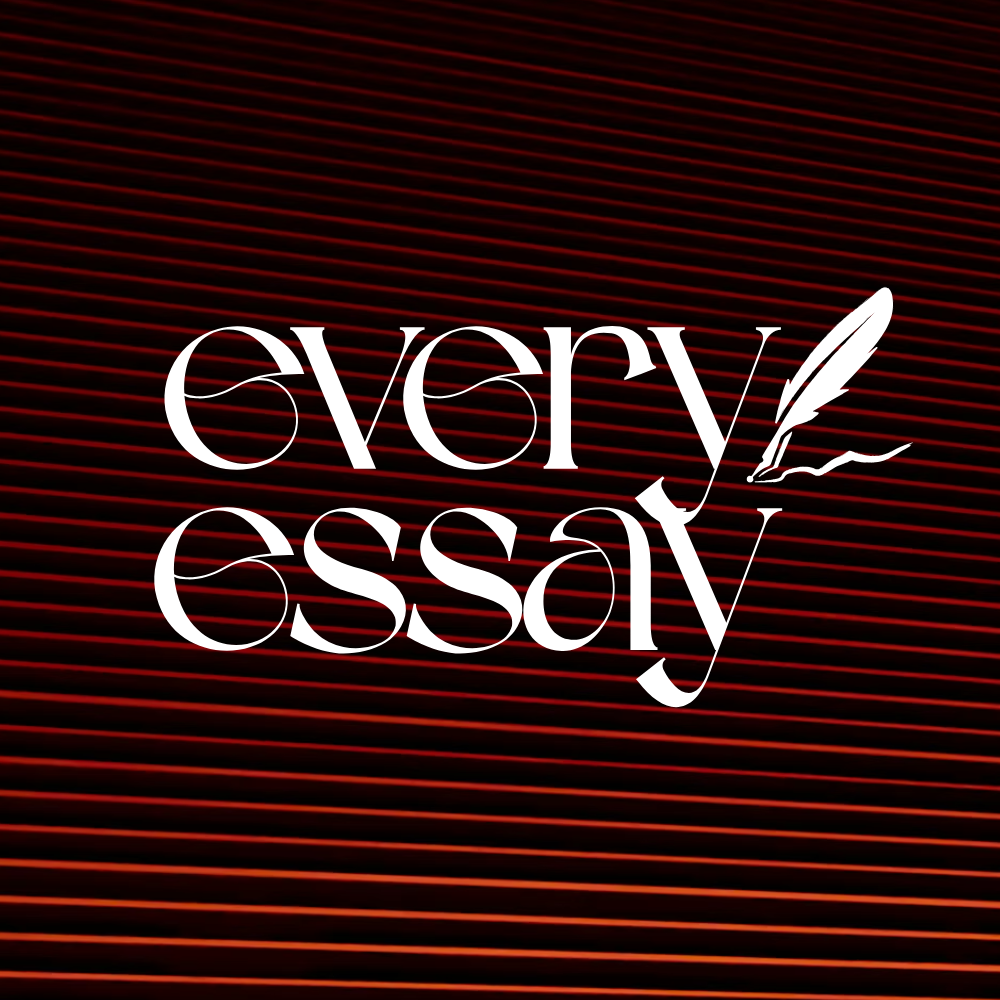

### 📌 요약
AI가 합격 사례와 입증된 평가 기준을 학습하여, 단순한 글쓰기가 아닌 합격 논리 자체를 제공하는 에세이 작성 지원 도구입니다.

### 🔑 핵심 기능
- 실제 합격 사례(알럼나이 에세이, 합격 레터 등)를 기반으로 AI를 훈련시켜 신뢰도를 높였습니다.
- 리뷰어들이 원하는 것을 추측하는 대신, 이미 승리한 사람들의 데이터에서 학습하므로 환각(hallucination) 현상을 최소화합니다.
- 충분한 인간 검증 데이터가 있어야만 AI 기능이 활성화되며, 합격한 에세이의 '정확한 논리'를 제공하는 데 초점을 맞춥니다.

### 📸 스크린샷 및 갤러리
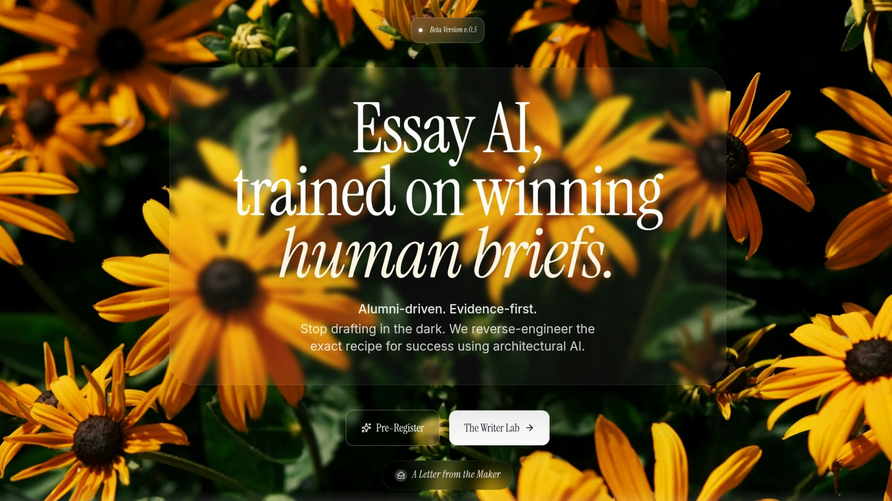
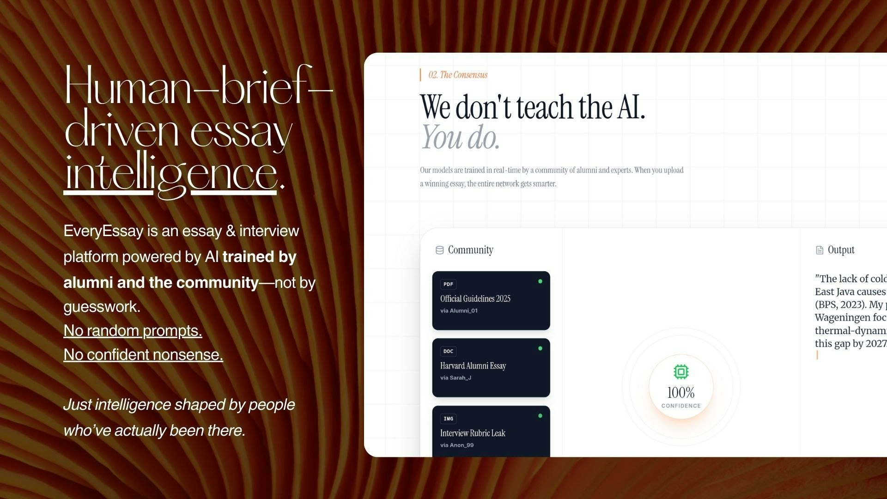
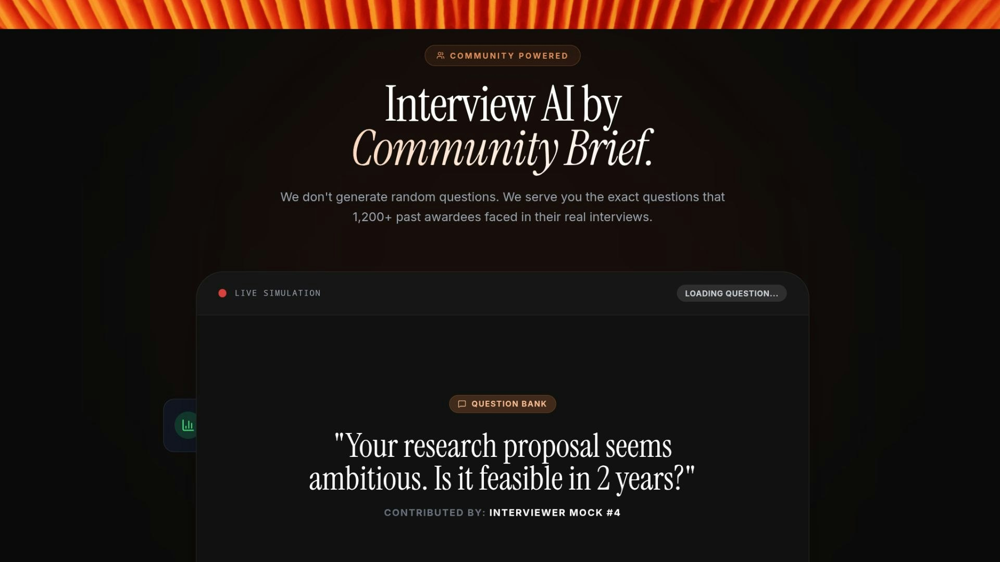

---

## 5. [Veri.im](https://www.producthunt.com/products/veri-im?utm_campaign=producthunt-api&utm_medium=api-v2&utm_source=Application%3A+antigravity_test+%28ID%3A+258588%29)
**Votes**: 34 | **Tagline**: AI-powered checks to detect phishing and unsafe websites.

### 📌 요약
AI 기반 실시간 분석으로 피싱, 가짜 쇼핑몰, 온라인 사기를 탐지하여 사용자에게 즉각적인 안전 경고를 제공하는 브라우저 확장 프로그램입니다.

### 🔑 핵심 기능
- AI 기반의 정교한 탐지 기술로 피싱 및 사기 웹사이트를 조기에 경고합니다.
- 로그인이나 결제 정보 입력 전에 위험을 알려주는 실시간 페이지 분석 기능을 제공합니다.
- 의심스러운 링크 클릭이나 사기성 페이지 접속 시 즉각적인 안전 알림을 표시합니다.
- 다국어 지원을 포함하여 다양한 환경에서 사용할 수 있습니다.

### 📸 스크린샷 및 갤러리
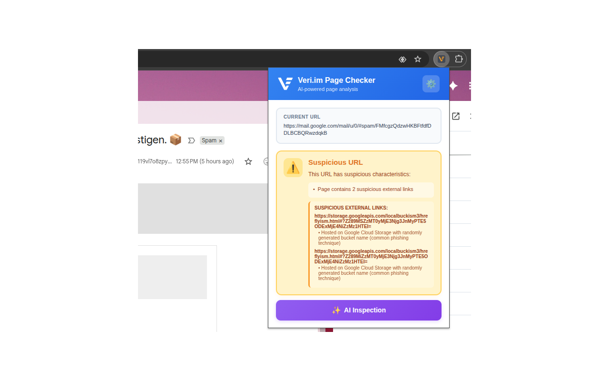
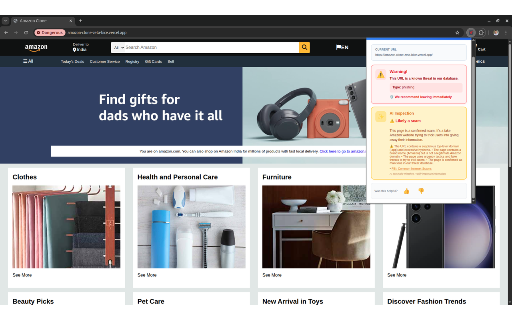
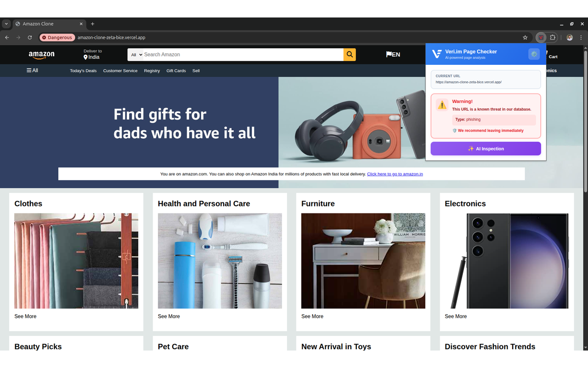

---

## 6. [Builders.to](https://www.producthunt.com/products/builders-to?utm_campaign=producthunt-api&utm_medium=api-v2&utm_source=Application%3A+antigravity_test+%28ID%3A+258588%29)
**Votes**: 32 | **Tagline**: Ship faster. Together.

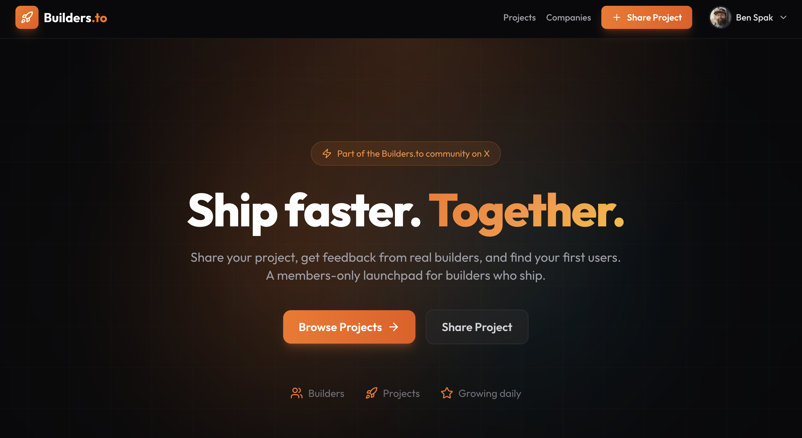

### 📌 요약
빌더(제작자)들이 미완성된 작업물(WIP)을 공유하고, 커뮤니티 피드백을 통해 첫 사용자를 확보할 수 있도록 돕는 회원 전용 런치패드 서비스입니다.

### 🔑 핵심 기능
- 빌더들을 위한 멤버십 기반의 독점적인 런치패드 커뮤니티입니다.
- 작업 진행 상황(Work in Progress, WIP)을 공유하고 커뮤니티로부터 건설적인 피드백을 받을 수 있습니다.
- 제품의 첫 번째 얼리 어답터(First Users)를 찾고 빠르게 제품을 출시(Ship faster)할 수 있도록 지원합니다.

### 📸 스크린샷 및 갤러리
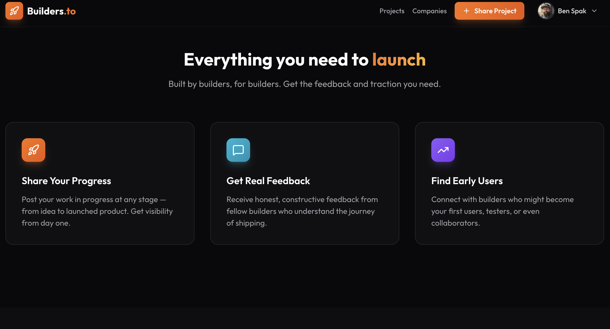
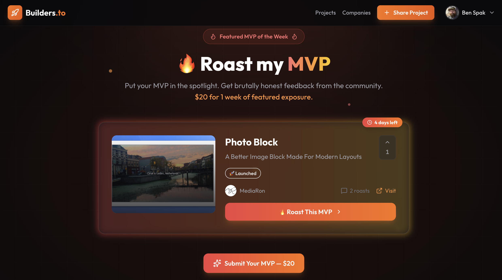
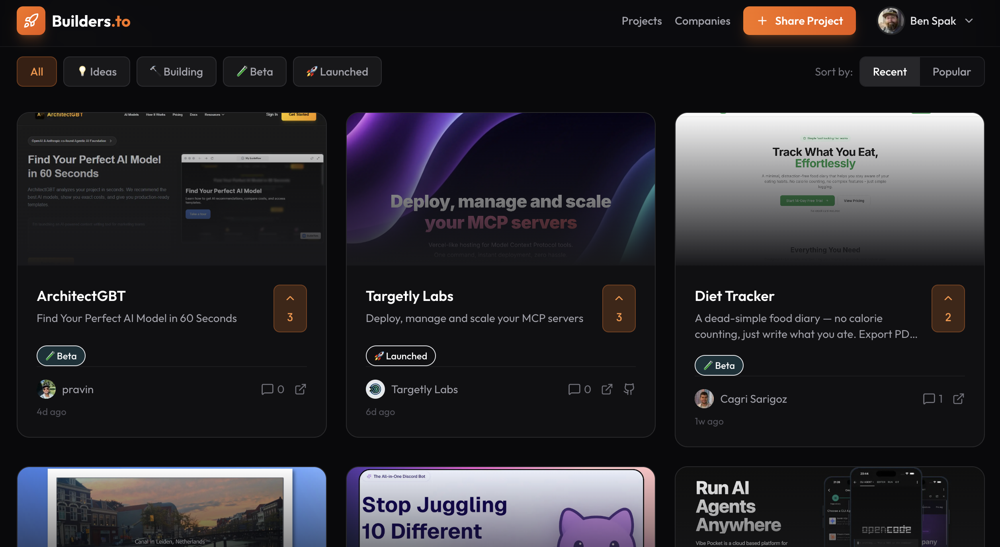

---

## 7. [Elser AI](https://www.producthunt.com/products/elser-ai-2?utm_campaign=producthunt-api&utm_medium=api-v2&utm_source=Application%3A+antigravity_test+%28ID%3A+258588%29)
**Votes**: 31 | **Tagline**: Create full anime shorts with just a prompt in minutes

### 📌 요약
하나의 프롬프트 입력만으로 일관된 캐릭터와 명확한 스토리 흐름을 가진 완성도 높은 장편 애니메이션 단편을 제작하는 AI 도구입니다.

### 🔑 핵심 기능
- 짧은 클립이 아닌, 아이디어를 완전한 스토리 영상(Long-form)으로 변환
- 180개 이상의 장면에서 다른 AI 도구 대비 30% 이상 높은 캐릭터 일관성 유지
- 스토리텔러, 애니메이터를 위해 개발되었으며 시네마틱 스타일의 영상 제작 지원

### 📸 스크린샷 및 갤러리

### 🎬 관련 영상
- [🎥 영상 보기](https://ph-files.imgix.net/cc659b2a-6de8-462a-ad1b-373aae212038.jpeg?auto=format)

---

## 8. [OneURL](https://www.producthunt.com/products/oneurl?utm_campaign=producthunt-api&utm_medium=api-v2&utm_source=Application%3A+antigravity_test+%28ID%3A+258588%29)
**Votes**: 19 | **Tagline**: OneURL for all your links, open-source alternative linktree

### 📌 요약
모든 중요한 링크를 한 곳에 모아 공유할 수 있는 아름다운 프로필 페이지를 만들어주는 오픈 소스 기반의 링크트리(Linktree) 대안 서비스입니다.

### 🔑 핵심 기능
- 모든 링크를 통합 관리하는 개인 맞춤형 프로필 페이지 제공
- 링크트리(Linktree)의 기능을 대체하는 오픈 소스 솔루션
- 링크 공유를 위한 아름답고 깔끔한 디자인 강조

### 📸 스크린샷 및 갤러리
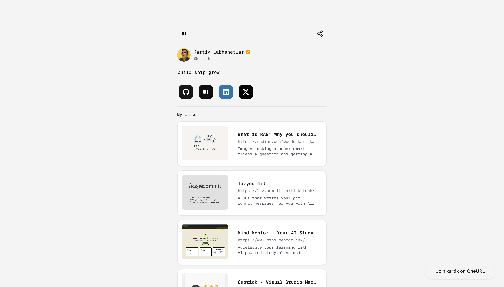
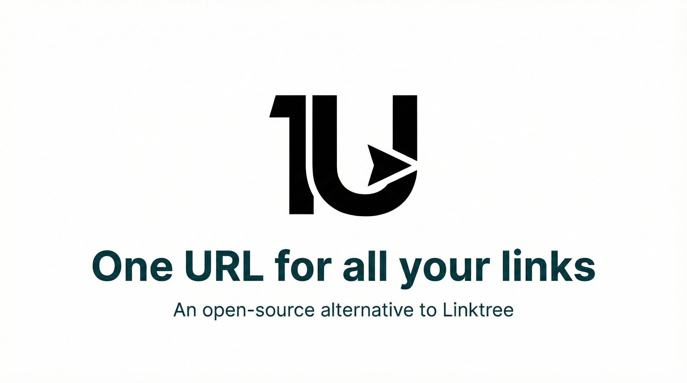

### 🎬 관련 영상
- [🎥 영상 보기](https://ph-files.imgix.net/01197a21-dfb3-41a1-b1bb-05b4570b66b2.jpeg?auto=format)

---

## 9. [AppStoreReady](https://www.producthunt.com/products/appstoreready?utm_campaign=producthunt-api&utm_medium=api-v2&utm_source=Application%3A+antigravity_test+%28ID%3A+258588%29)
**Votes**: 18 | **Tagline**: Launch Your App With Confidence.

### 📌 요약
인디 개발자가 앱스토어 출시 준비 시 필요한 스크린샷, ASO, 법률 문서, 체크리스트 등 모든 것을 몇 분 만에 완성해주는 올인원 워크플로우 솔루션입니다.

### 🔑 핵심 기능
- 스크린샷 및 디바이스 목업을 손쉽게 생성하고 다양한 규격에 맞게 자동 조정
- ASO 키워드 분석부터 개인정보 보호 정책 및 이용 약관까지 법률 문서를 자동 생성
- 수많은 툴을 오갈 필요 없이, 출시 체크리스트를 포함한 모든 준비 과정을 단일 툴에서 통합 관리

### 📸 스크린샷 및 갤러리
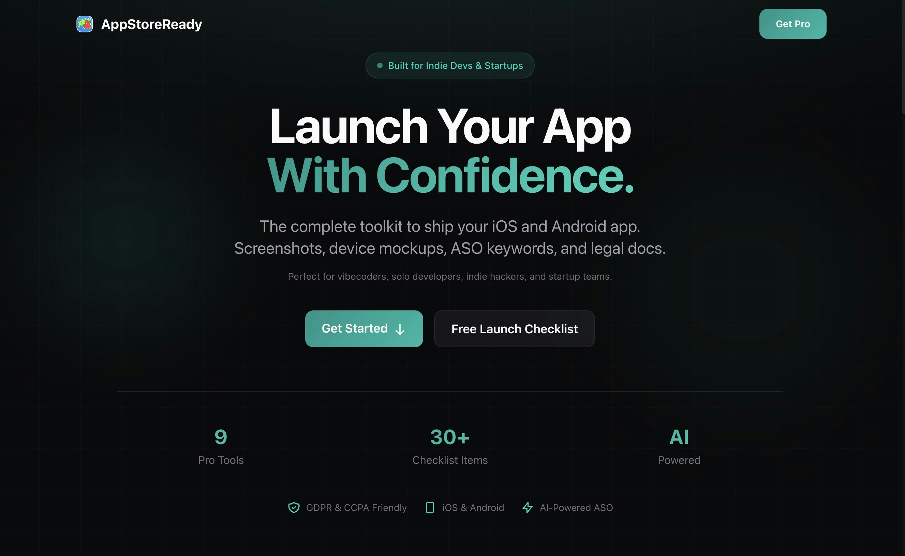
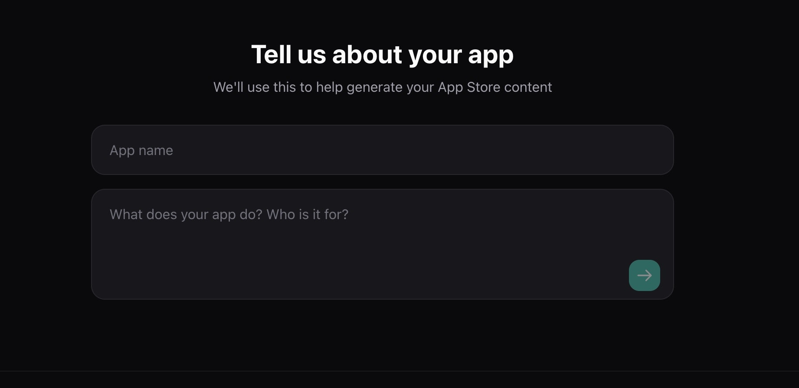
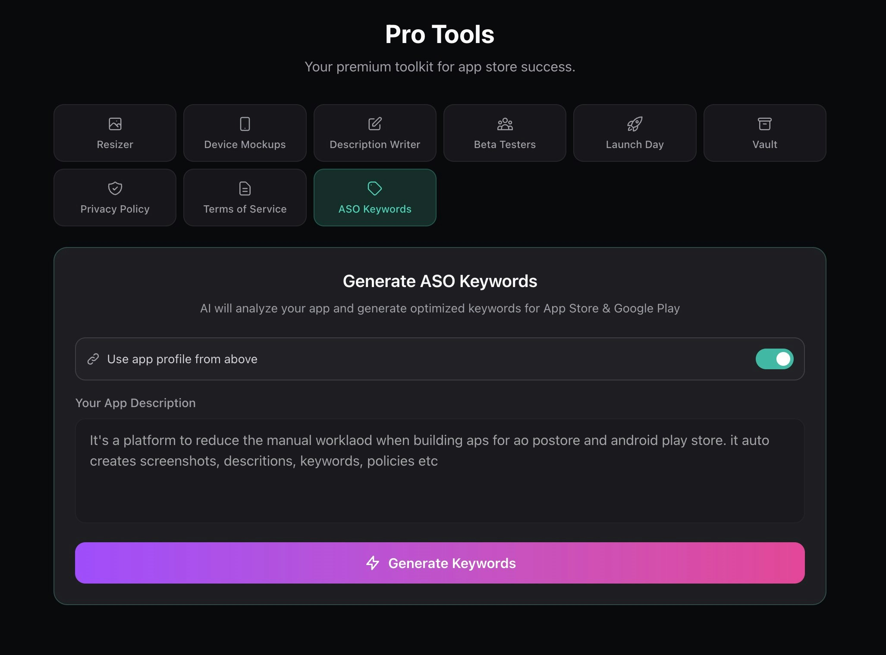

### 🎬 관련 영상
- [🎥 영상 보기](https://ph-files.imgix.net/8e6717f3-924f-4c6e-bb27-86009f502694.jpeg?auto=format)

---

## 10. [Notion Avatar Maker](https://www.producthunt.com/products/notion-avatar-maker-3?utm_campaign=producthunt-api&utm_medium=api-v2&utm_source=Application%3A+antigravity_test+%28ID%3A+258588%29)
**Votes**: 14 | **Tagline**: AI-powered online tool for making notion-style avatars.

### 📌 요약
사진이나 아이디어를 노션 스타일의 아바타 및 일러스트로 마법처럼 변환해주는 AI 기반 온라인 도구입니다.

### 🔑 핵심 기능
- AI 기술을 활용하여 노션(Notion) 스타일의 아바타 생성
- 사용자가 올린 사진이나 텍스트 아이디어를 시각적 아바타로 변환 가능
- 노션 사용자와 디자이너에게 유용한 맞춤형 일러스트레이션 제작 지원

### 📸 스크린샷 및 갤러리
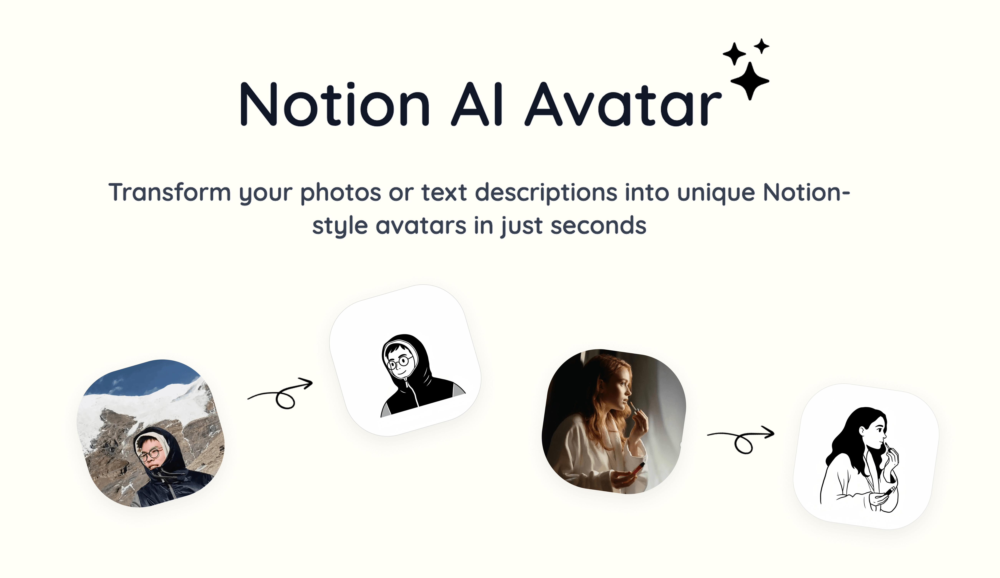
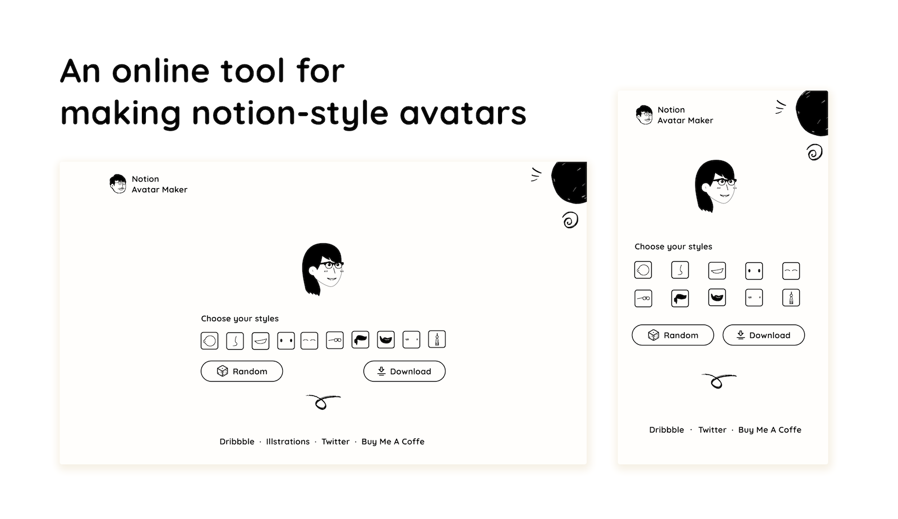
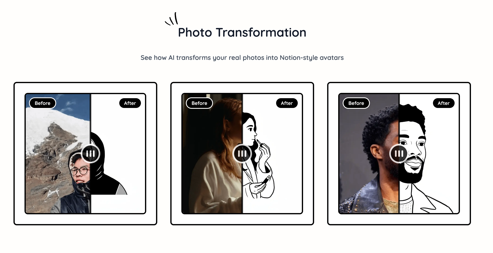

---

