# 🚀 Product Hunt Daily Top 10 (2026-01-05)

## 1. [PostSyncer](https://www.producthunt.com/products/postsyncer-2?utm_campaign=producthunt-api&utm_medium=api-v2&utm_source=Application%3A+antigravity_test+%28ID%3A+258588%29)
**Votes**: 508 | **Tagline**: AI Content Maker, for Social Media Publishing

### 📌 요약
소셜 미디어 콘텐츠 제작과 배포, 고객 관리를 대규모로 자동화하는 올인원 AI 기반 소셜 미디어 관리 솔루션입니다.

### 🔑 핵심 기능
- 10개 이상의 플랫폼에서 콘텐츠 제작, 예약, 답장을 통합 관리할 수 있는 강력한 기능 제공
- AI(Sora, Veo 등)를 활용한 미디어 생성 및 바이럴 콘텐츠 라이브러리를 통한 영감 제공
- 무제한 계정 연결과 전용 작업 공간을 통한 클라이언트/팀 관리 용이성

### 📸 스크린샷 및 갤러리
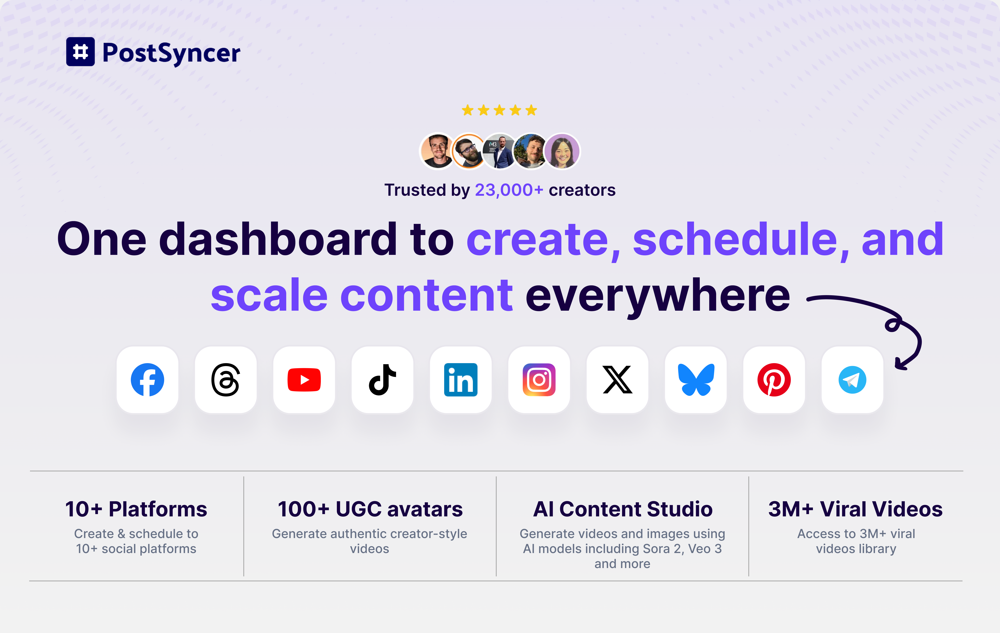
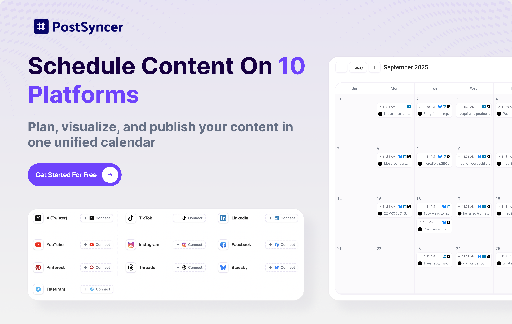

### 🎬 관련 영상
- [🎥 영상 보기](https://ph-files.imgix.net/d8672b72-788f-487d-be82-2fd966862893.jpeg?auto=format)

---

## 2. [MiroMiro](https://www.producthunt.com/products/miromiro?utm_campaign=producthunt-api&utm_medium=api-v2&utm_source=Application%3A+antigravity_test+%28ID%3A+258588%29)
**Votes**: 303 | **Tagline**: Copy any website's design & assets in one click

### 📌 요약
웹사이트 디자인 요소를 단 한 번의 클릭으로 추출하고 복사할 수 있는 디자이너 및 개발자용 초고속 디자인 검사 크롬 확장 프로그램입니다.

### 🔑 핵심 기능
- DevTools 없이 모든 웹사이트의 디자인(CSS, 색상, 폰트, 간격)을 즉시 검사하고 복사할 수 있습니다.
- 이미지, SVG, Lottie 애니메이션 등 모든 디자인 에셋을 원클릭으로 다운로드할 수 있습니다.
- 디자인 토큰을 추출하여 Tailwind Config 또는 CSS 변수로 바로 내보내 재사용성을 극대화합니다.

### 📸 스크린샷 및 갤러리
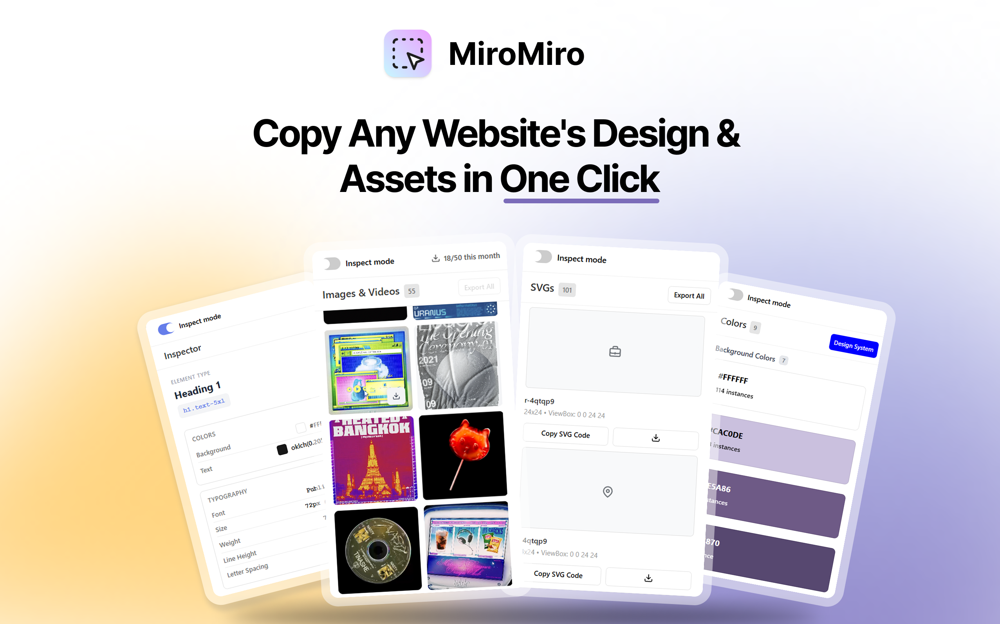
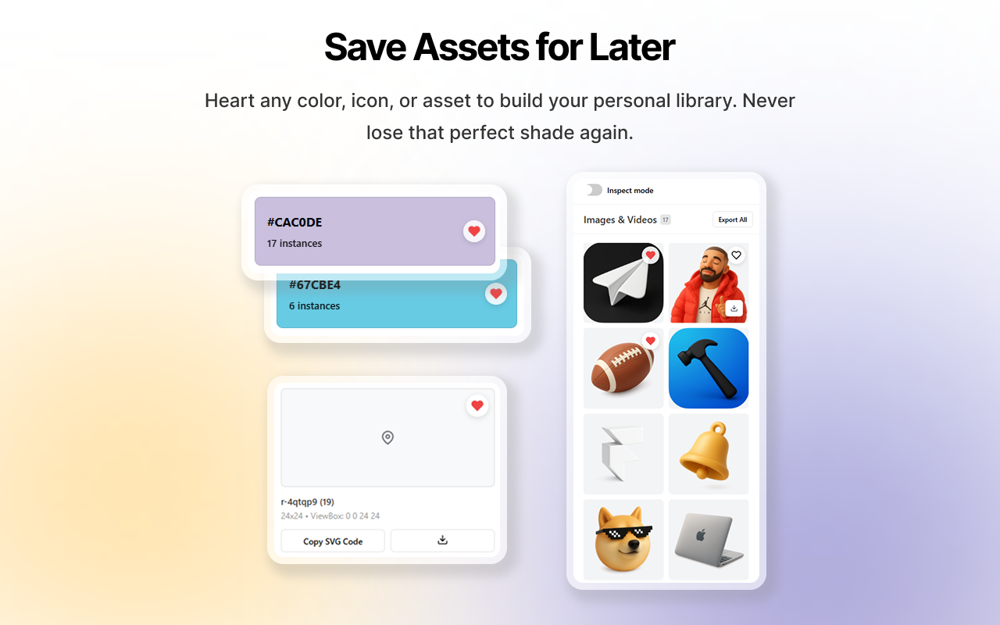
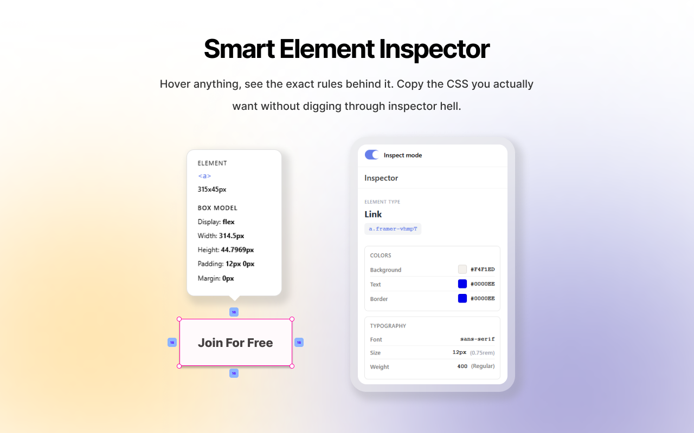

### 🎬 관련 영상
- [🎥 영상 보기](https://ph-files.imgix.net/1ed69832-a2da-4fbb-9ed1-0e248fb9fc5c.jpeg?auto=format)

---

## 3. [NativeBridge](https://www.producthunt.com/products/nativebridge-2?utm_campaign=producthunt-api&utm_medium=api-v2&utm_source=Application%3A+antigravity_test+%28ID%3A+258588%29)
**Votes**: 279 | **Tagline**: Automate mobile testing on real devices with AI

### 📌 요약
NativeBridge는 AI 기반 테스트와 Maestro를 활용하여 실제 iOS 및 Android 기기에서 모바일 테스트를 자동화하고 상세한 버그 리포트를 제공하는 서비스입니다.

### 🔑 핵심 기능
- AI를 활용하여 실제(Real) iOS 및 Android 기기에서의 모바일 테스트 자동화
- Maestro를 이용한 AI 기반 테스트 실행 및 충돌(Crash) 감지 기능 제공
- Magic Link 하나로 실제 모바일 기기에 즉시 접근 가능
- 풍부한 정보를 담은 버그 리포트 공유 기능으로 모바일 테스트 효율 극대화

### 📸 스크린샷 및 갤러리
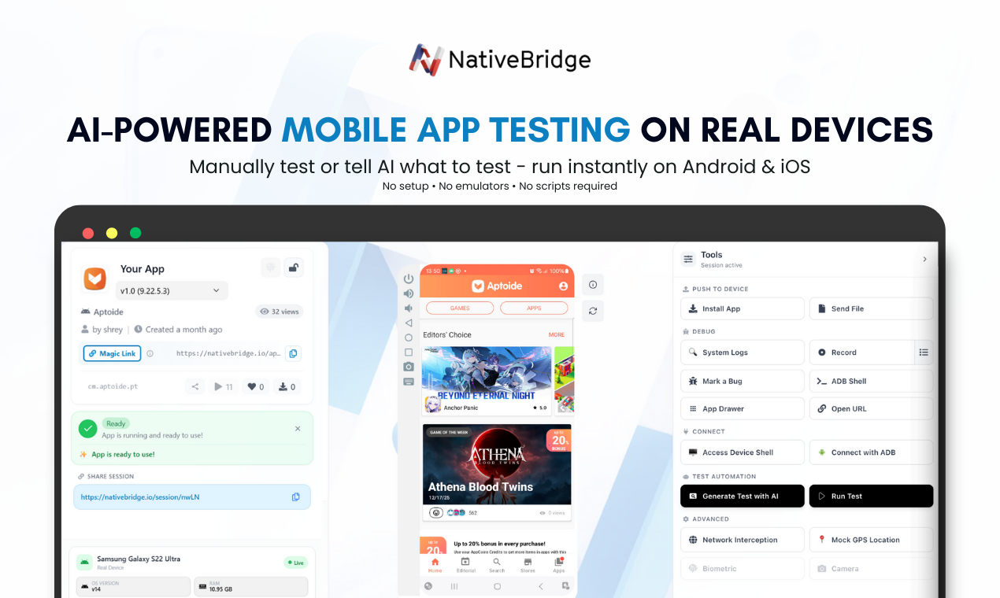
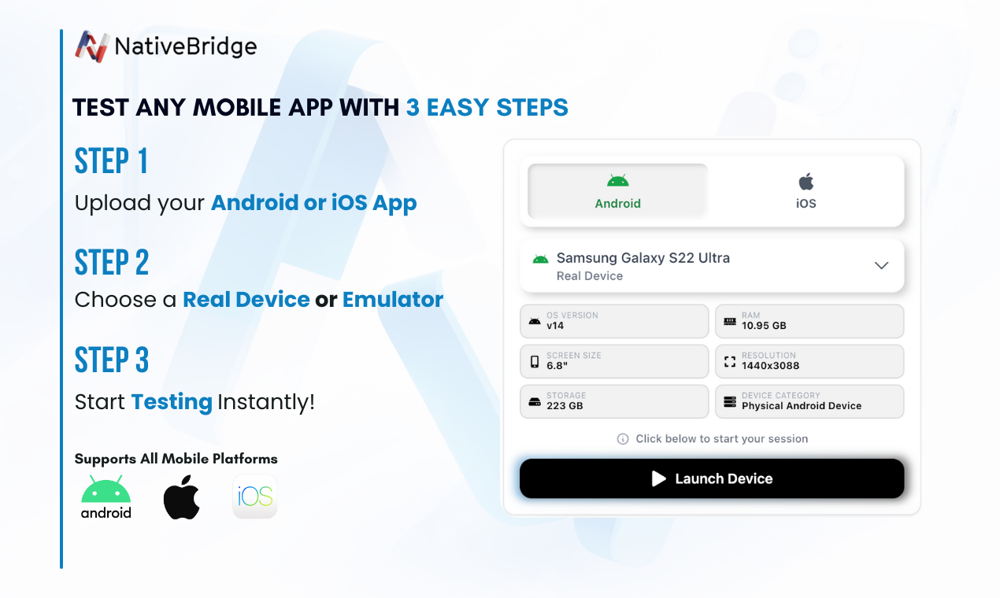
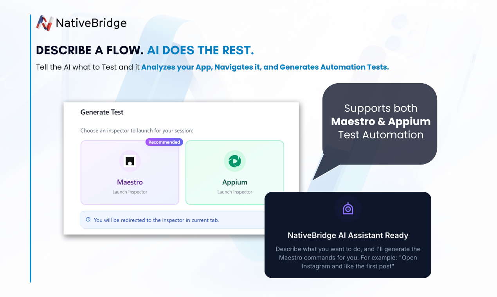

### 🎬 관련 영상
- [🎥 영상 보기](https://ph-files.imgix.net/1e8b0f6d-321d-48d7-9384-8f3a66d1046a.jpeg?auto=format)

---

## 4. [Drylendar](https://www.producthunt.com/products/drylendar-the-drinking-calendar?utm_campaign=producthunt-api&utm_medium=api-v2&utm_source=Application%3A+antigravity_test+%28ID%3A+258588%29)
**Votes**: 194 | **Tagline**: Track drinks to create a motivating calendar day after day!

### 📌 요약
음주량을 기록하고 친구들과 공유 가능한 동기 부여 달력을 만들어주는 가장 사용자 친화적인 알코올 트래커 앱입니다.

### 🔑 핵심 기능
- 사용이 매우 간편하도록 설계된 알코올(음료) 기록 앱입니다.
- 기록을 바탕으로 이해하기 쉬운 달력을 생성하고 친구들과 공유할 수 있습니다.
- 대부분의 기능은 무료이며, 프리미엄 플랜 구독 시 광고 제거, 일일 알림, 인증 배지 등의 추가 혜택을 제공합니다.

### 📸 스크린샷 및 갤러리
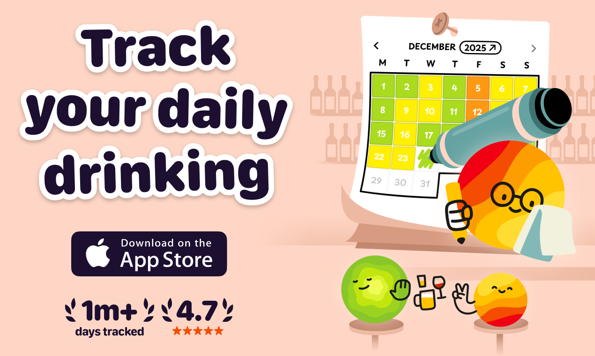
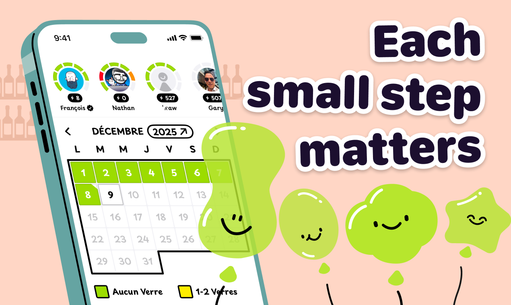
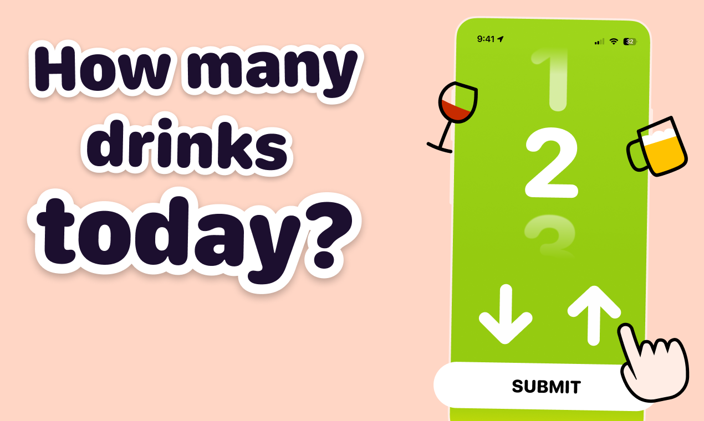

### 🎬 관련 영상
- [🎥 영상 보기](https://ph-files.imgix.net/65b62f19-7144-4cb4-9986-0a82796ae380.jpeg?auto=format)

---

## 5. [Opttab](https://www.producthunt.com/products/opttab?utm_campaign=producthunt-api&utm_medium=api-v2&utm_source=Application%3A+antigravity_test+%28ID%3A+258588%29)
**Votes**: 163 | **Tagline**: Manage your presence in AI search

### 📌 요약
Opttab은 브랜드와 개인의 콘텐츠가 ChatGPT, Gemini, Claude 등 AI 검색 엔진과 LLM에서 어떻게 인식되고 활용되는지를 측정, 제어, 성장시키는 올인원 AI 가시성(Visibility) 및 GEO(생성형 엔진 최적화) 플랫폼입니다.

### 🔑 핵심 기능
- AI 검색 및 LLM 환경에 특화된 디지털 존재감 관리 솔루션입니다.
- 기존 SEO와 달리, AI 모델이 콘텐츠를 발견, 해석, 순위 매기기, 재사용하는 방식에 초점을 맞춥니다.
- 기업과 개인이 AI 대상 디지털 발자국(Digital Footprint)에 대한 투명성과 완전한 통제권을 확보하도록 돕습니다.
- AI 검색 노출도 및 GEO(Generative Engine Optimization) 성과를 측정하고 최적화할 수 있습니다.

### 📸 스크린샷 및 갤러리
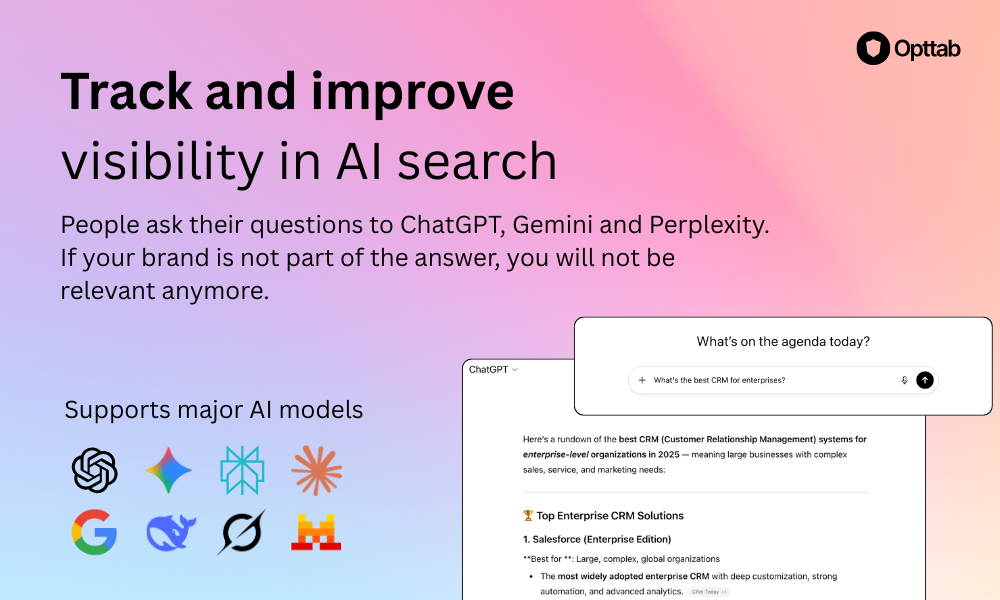
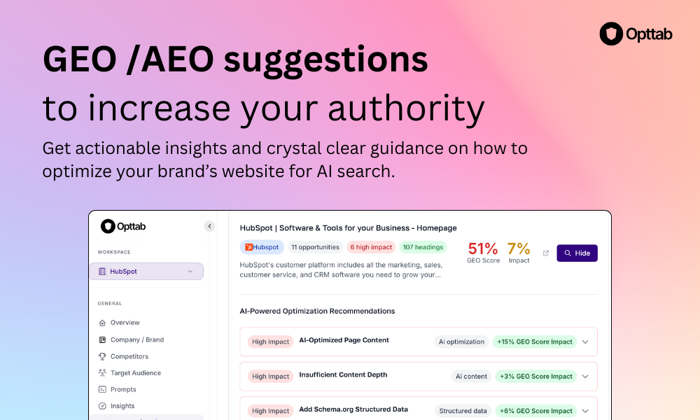
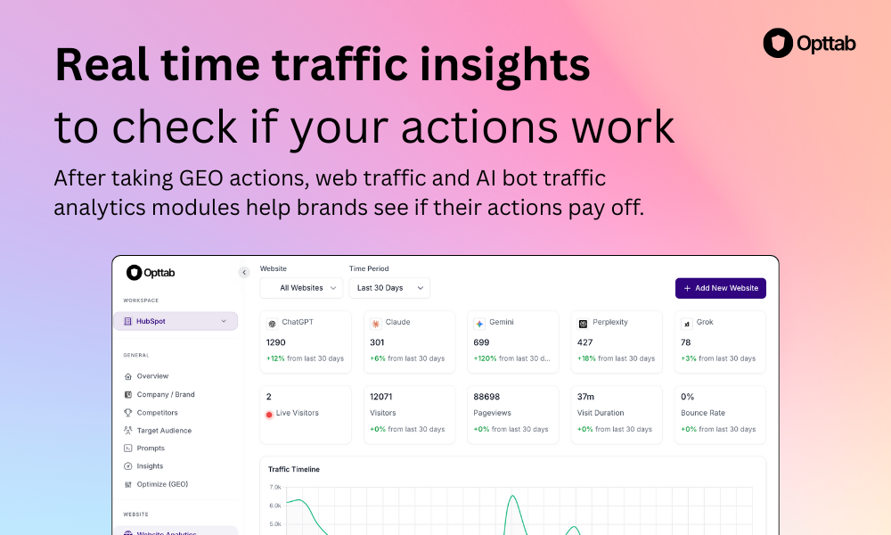

### 🎬 관련 영상
- [🎥 영상 보기](https://ph-files.imgix.net/5f799fd3-cb4a-4f7a-bd79-eed4184d8c3a.jpeg?auto=format)

---

## 6. [Invoce.ai](https://www.producthunt.com/products/invoce-ai?utm_campaign=producthunt-api&utm_medium=api-v2&utm_source=Application%3A+antigravity_test+%28ID%3A+258588%29)
**Votes**: 151 | **Tagline**: Chat with AI to create invoices in seconds

### 📌 요약
프리랜서와 소규모 사업자가 복잡한 설정 없이 AI 챗봇과 대화만으로 몇 초 만에 송장을 생성할 수 있게 해주는 간편 송장 발행 서비스입니다.

### 🔑 핵심 기능
- AI 챗봇과 대화하는 방식으로 송장 필수 정보를 입력하고 즉시 생성
- 추가적인 가입이나 복잡한 절차 없이 신속하게 업무 처리 가능
- 기존의 기능이 과도하거나 복잡한(bloated) 송장 도구를 대체하는 미니멀하고 깔끔한 사용자 경험 제공

### 📸 스크린샷 및 갤러리
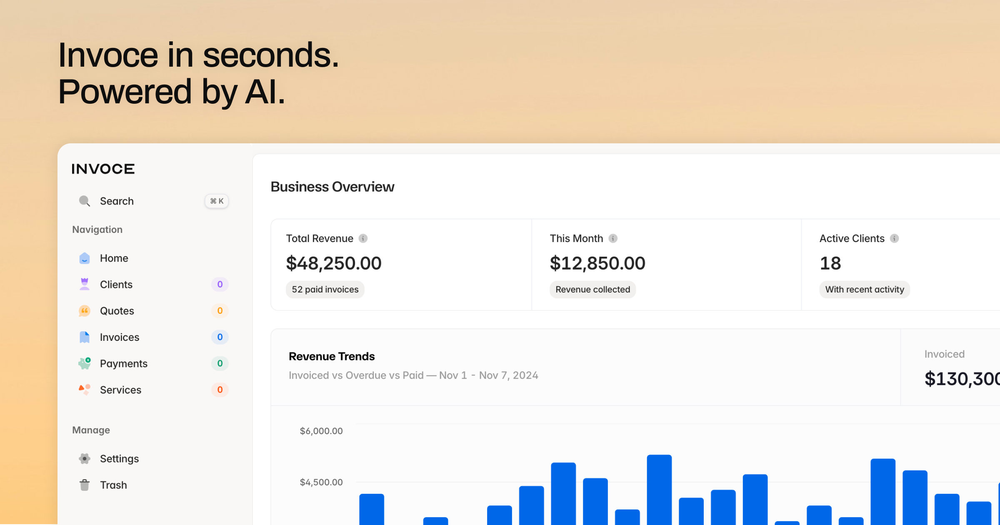

---

## 7. [Dashly](https://www.producthunt.com/products/dashly-3?utm_campaign=producthunt-api&utm_medium=api-v2&utm_source=Application%3A+antigravity_test+%28ID%3A+258588%29)
**Votes**: 138 | **Tagline**: Turn your new tab into a dashboard.

### 📌 요약
새 탭 페이지를 군더더기 없이 꼭 필요한 기능들로만 채운, 완벽하게 개인화된 올인원 생산성 대시보드입니다.

### 🔑 핵심 기능
- 할 일, 메모, 주식 차트, RSS 피드, 뽀모도로 타이머 등 모든 기능이 위젯 기반으로 자유롭게 배치 가능합니다.
- 데이터가 클라우드에 저장되지 않고 로컬로 관리되며, 암호화 기능까지 제공하여 보안과 개인 정보 보호에 강점을 가집니다.
- 복잡함 없이 필수적인 요소(북마크, 세계 시계, 맞춤형 검색 등)에 집중한 깔끔하고 미니멀한 인터페이스를 제공합니다.

### 📸 스크린샷 및 갤러리
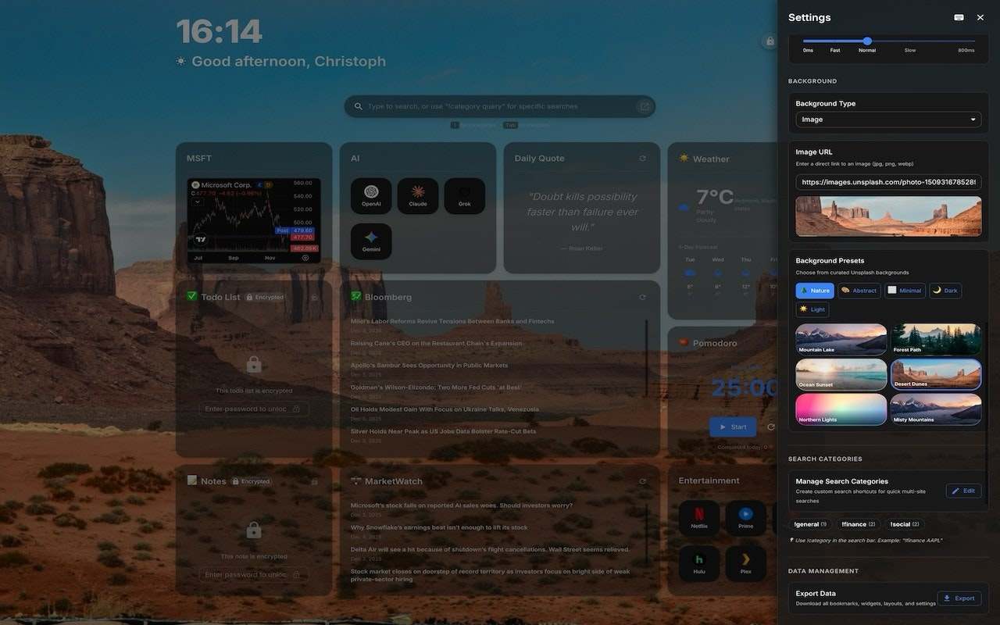
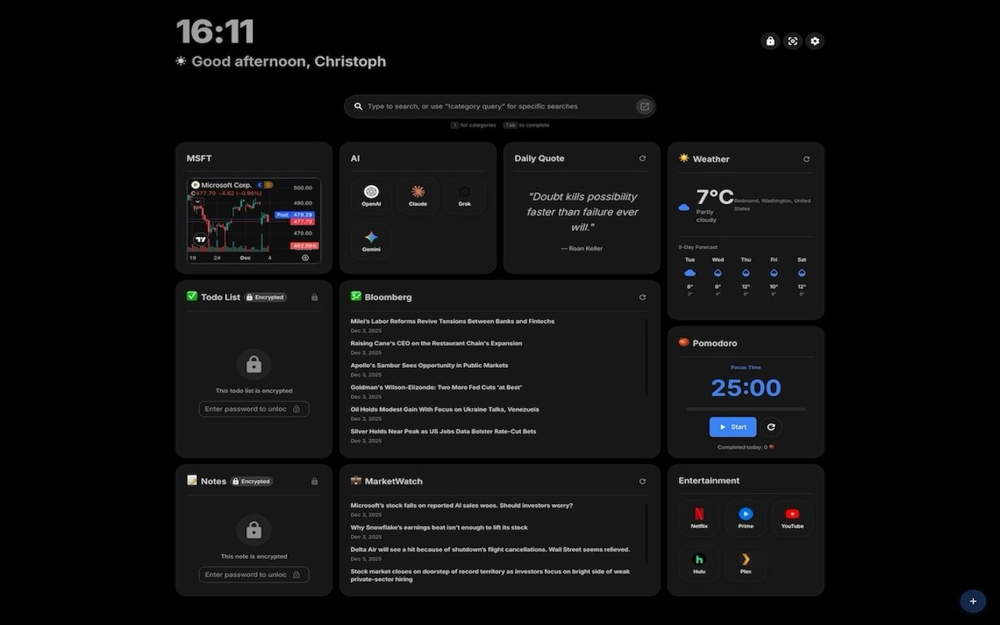
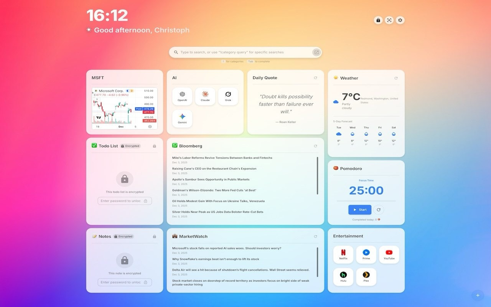

---

## 8. [Bookmark Assistant](https://www.producthunt.com/products/bookmark-assistant?utm_campaign=producthunt-api&utm_medium=api-v2&utm_source=Application%3A+antigravity_test+%28ID%3A+258588%29)
**Votes**: 122 | **Tagline**: Sync Chrome bookmarks to Notion with rich metadata.

### 📌 요약
Chrome 북마크를 풍부한 메타데이터와 함께 노션 데이터베이스로 자동 동기화 및 정리해주는 생산성 확장 프로그램입니다.

### 🔑 핵심 기능
- Chrome 북마크를 클릭 한 번으로 노션 데이터베이스로 변환합니다.
- 설명(description) 등 풍부한 메타데이터를 자동으로 추출하여 완벽하게 정리합니다.
- 북마크 변경 사항을 자동으로 감지하고 노션에 동기화하여 수동 복사 작업이 필요 없습니다.

### 📸 스크린샷 및 갤러리
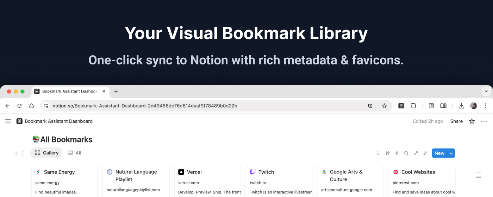
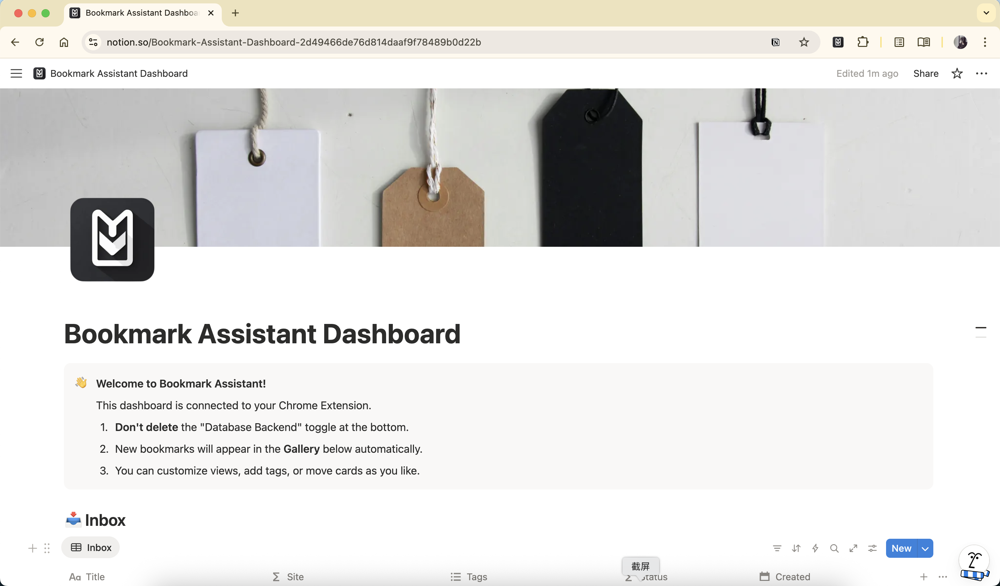
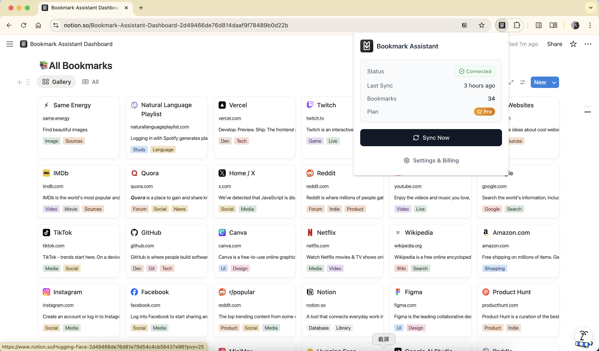

### 🎬 관련 영상
- [🎥 영상 보기](https://ph-files.imgix.net/53dc216e-4dd5-4430-ba09-fc9d43e54001.gif?auto=format)

---

## 9. [Toma](https://www.producthunt.com/products/toma-2?utm_campaign=producthunt-api&utm_medium=api-v2&utm_source=Application%3A+antigravity_test+%28ID%3A+258588%29)
**Votes**: 113 | **Tagline**: AI agents for automotive dealerships

### 📌 요약
Toma는 자동차 딜러십을 위한 음성 AI 에이전트로, 모든 고객 전화를 응대하고 서비스 예약을 자동화하며 수익을 보호하는 솔루션입니다.

### 🔑 핵심 기능
- 모든 인바운드 전화를 응대하여 놓치는 통화 없이 고객 만족도(CSI) 개선에 기여합니다.
- 음성 AI를 통해 서비스 예약 일정을 자동화하여 업무 효율성을 높입니다.
- 딜러십 맞춤형 안전장치를 통해 수익을 보호하고 고객 커뮤니케이션을 간소화합니다.

### 📸 스크린샷 및 갤러리

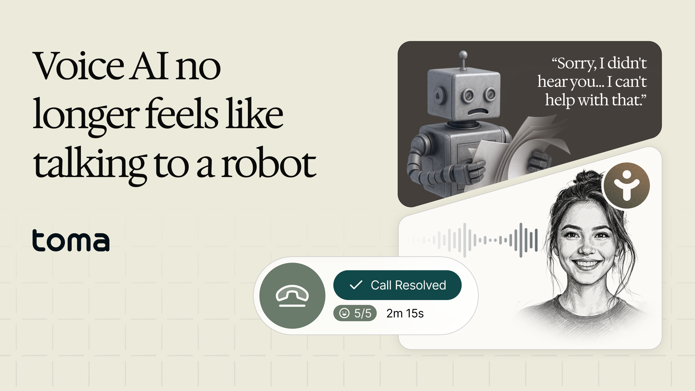
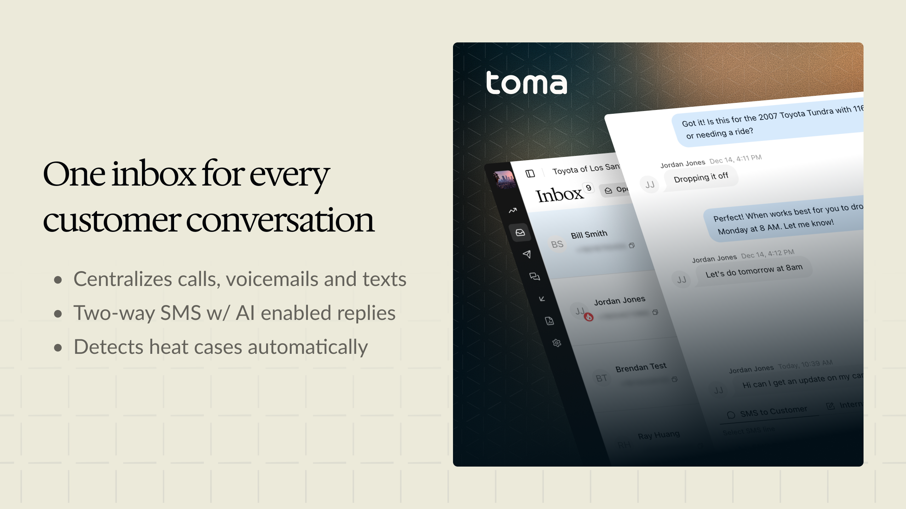

---

## 10. [CogniMemo Extension](https://www.producthunt.com/products/cognimemo-extension?utm_campaign=producthunt-api&utm_medium=api-v2&utm_source=Application%3A+antigravity_test+%28ID%3A+258588%29)
**Votes**: 106 | **Tagline**: AI memory tool that lives where you work

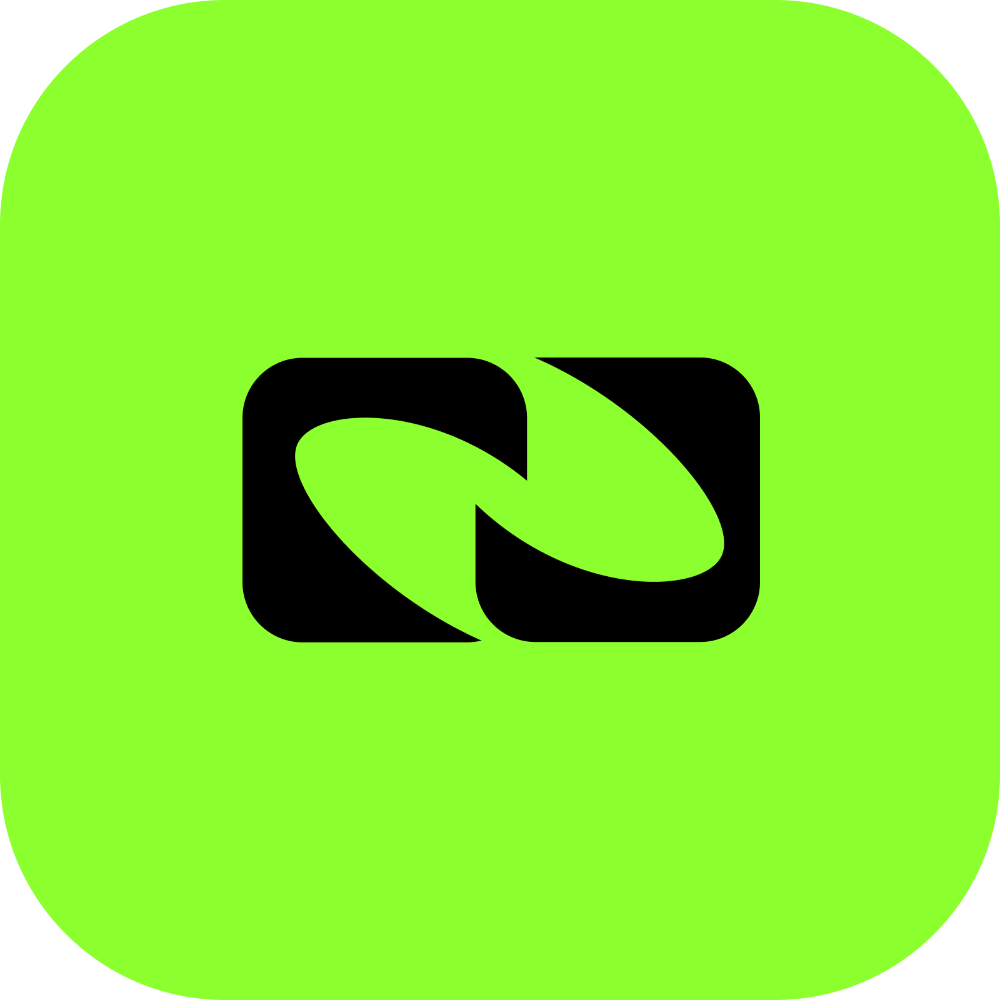

### 📌 요약
ChatGPT, Claude 등 다양한 AI 도구에 장기 기억력을 부여하여, 사용자의 모든 자료와 대화를 빠르고 검색 가능하게 통합 관리해주는 AI 메모리 확장 도구입니다.

### 🔑 핵심 기능
- AI 챗봇에 장기 기억(Long-term Memory) 기능을 추가하여 개인화된 응답을 제공합니다.
- ChatGPT, Claude, Gemini, DeepSeek 등 주요 AI 플랫폼과 폭넓게 호환됩니다.
- 어떤 채팅에서든 '@cogni'를 입력하여 저장된 노트, 과거 대화 기록, 콘텐츠를 즉시 검색할 수 있습니다.
- X/Twitter 게시물 저장, AI 대화 아카이빙, 플로팅 어시스턴트 등 다양한 저장 및 활용 기능을 제공합니다.
- 모든 데이터가 사용자 통제 하에 안전하고 빠르게 정리되며 검색 가능합니다.

### 📸 스크린샷 및 갤러리

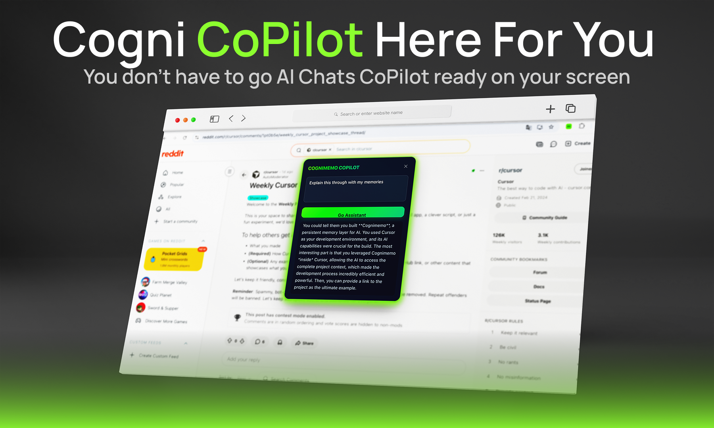

### 🎬 관련 영상
- [🎥 영상 보기](https://ph-files.imgix.net/8da6cd86-4f42-442b-84ff-8603669c5f9d.jpeg?auto=format)

---

