# 🚀 Product Hunt Daily Top 10 (2026-01-06)

## 1. [Canary](https://www.producthunt.com/products/canary-learn-language-through-music?utm_campaign=producthunt-api&utm_medium=api-v2&utm_source=Application%3A+antigravity_test+%28ID%3A+258588%29)
**Votes**: 270 | **Tagline**: Learn languages with music, practice with people

### 📌 요약
좋아하는 음악 콘텐츠를 활용해 실시간 번역, 노래방, 퀴즈 등으로 언어 학습을 재미있게 진행하고 타인과 함께 연습하는 신개념 언어 학습 플랫폼입니다.

### 🔑 핵심 기능
- 음악을 들으며 실시간 번역을 확인하고 단어를 저장하여 개인 맞춤형 어휘 리스트 구축
- 노래방(Karaoke) 모드를 통해 노래를 따라 부르며 정확한 발음과 억양을 효과적으로 연습
- 노래 기반 퀴즈로 학습 내용을 점검하고, 다른 사용자와 소셜 기능을 통해 실전 회화 연습

### 📸 스크린샷 및 갤러리

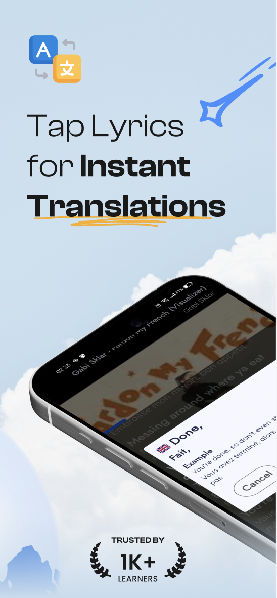

### 🎬 관련 영상
- [🎥 영상 보기](https://ph-files.imgix.net/f5117344-332d-42e4-8ffb-98f0b4b1dcf0.jpeg?auto=format)

---

## 2. [ Instruct 2.5](https://www.producthunt.com/products/instruct-2?utm_campaign=producthunt-api&utm_medium=api-v2&utm_source=Application%3A+antigravity_test+%28ID%3A+258588%29)
**Votes**: 259 | **Tagline**: Connect apps, describe the job, then automate your work

### 📌 요약
앱을 연결하고 업무를 묘사하면 복잡한 설정 없이 자율 에이전트가 실시간으로 작업을 대신 수행해주는 자동화 솔루션입니다.

### 🔑 핵심 기능
- 실행 과정 시각화: Salesforce, Slack, Gmail 등 여러 앱에서 일반 에이전트가 작업을 실시간으로 수행하는 것을 직접 볼 수 있습니다.
- 실시간 상호 작용 및 수정: 채팅이나 파일 업로드를 통해 에이전트의 실행 과정에 개입하고 발생하는 문제를 즉시 해결하며 결과를 유도할 수 있습니다.
- 원클릭 워크플로우 저장: 성공적으로 실행된 작업을 클릭 한 번으로 영구적이고 반복적인 자동화 워크플로우로 즉시 저장할 수 있습니다.

### 📸 스크린샷 및 갤러리
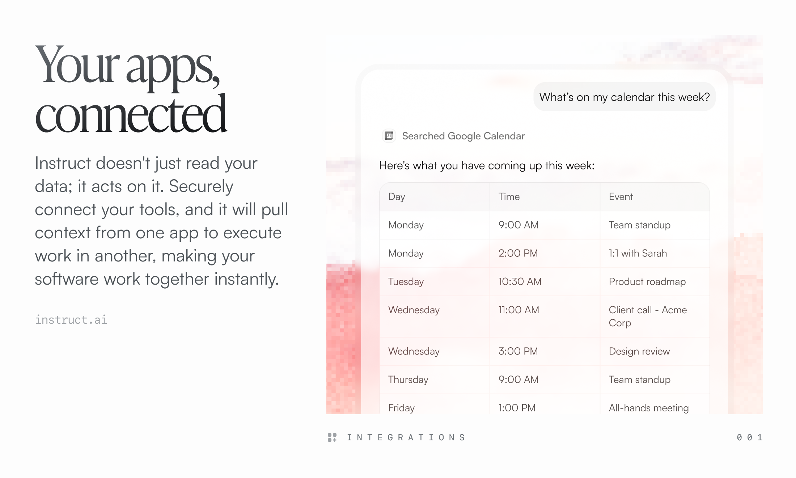
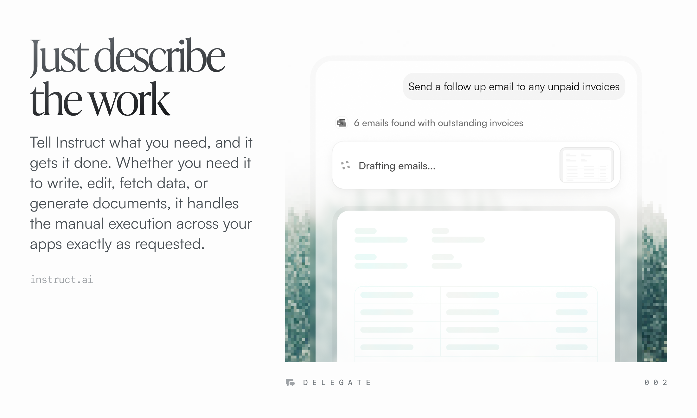
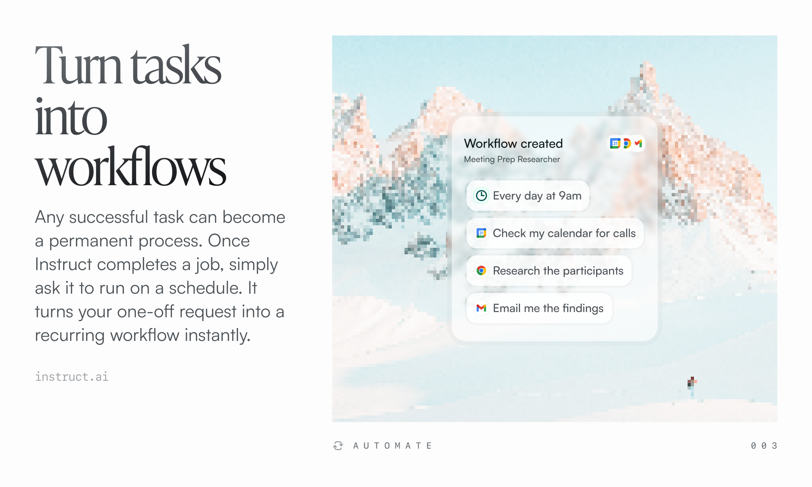

### 🎬 관련 영상
- [🎥 영상 보기](https://ph-files.imgix.net/71aeec33-db83-460e-af02-51b91de261ed.jpeg?auto=format)

---

## 3. [2-b.ai](https://www.producthunt.com/products/2-b-ai?utm_campaign=producthunt-api&utm_medium=api-v2&utm_source=Application%3A+antigravity_test+%28ID%3A+258588%29)
**Votes**: 239 | **Tagline**: Todoist meets ChatGPT inside your browser

### 📌 요약
Todoist와 ChatGPT를 브라우저 내에서 결합하여 텍스트 하이라이트부터 실행 가능한 작업 계획까지 제공하는 AI 기반 작업 관리 도구입니다.

### 🔑 핵심 기능
- 브라우저 확장 기능으로 작동하며, Todoist의 구조와 ChatGPT의 지능을 통합합니다.
- 어떤 탭에서든 텍스트를 하이라이트하면 즉시 실행 가능한 작업으로 캡처하고 전환할 수 있습니다.
- AI가 복잡한 목표를 즉시 구체적인 단계로 분해하여 실행 가능한 계획을 수립해 줍니다.
- AI와 대화하며 작업을 완료할 수 있도록 도움을 요청하거나 작업을 실행할 수 있습니다.

### 📸 스크린샷 및 갤러리
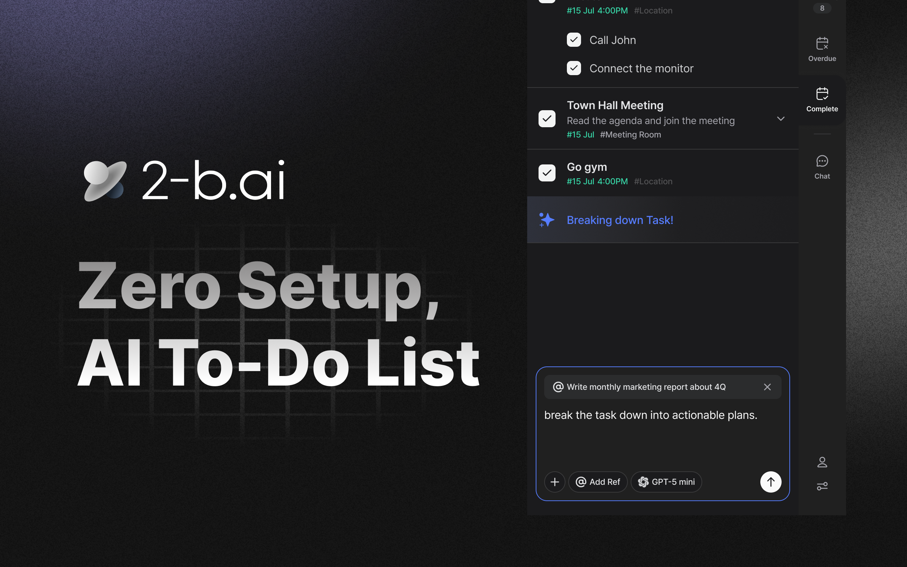

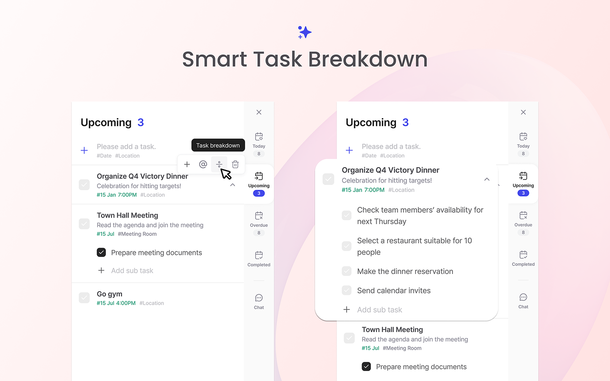

### 🎬 관련 영상
- [🎥 영상 보기](https://ph-files.imgix.net/3a48c352-63c7-41d1-a7f6-dba1eddd7751.jpeg?auto=format)

---

## 4. [Okara Reddit Agent](https://www.producthunt.com/products/okara?utm_campaign=producthunt-api&utm_medium=api-v2&utm_source=Application%3A+antigravity_test+%28ID%3A+258588%29)
**Votes**: 196 | **Tagline**: An agent that monitors, curates & writes authentic comments

### 📌 요약
스타트업의 성장에 필수적인 레딧(Reddit) 채널에서 제품 관련 키워드를 상시 모니터링하고, 솔루션을 찾는 스레드를 발견하여 진정성 있는 댓글 작성을 돕는 AI 에이전트입니다.

### 🔑 핵심 기능
- 스타트업 성장을 위한 저평가된 채널인 레딧을 효과적으로 활용하도록 지원합니다.
- 제품 관련 키워드를 24시간 모니터링하여 고객이 해결책을 필요로 하는 스레드를 정확히 찾아냅니다.
- 제품 홍보가 아닌, 사용자 질문에 대한 진정성 있고 도움이 되는 댓글 초안 작성을 지원합니다.

### 📸 스크린샷 및 갤러리

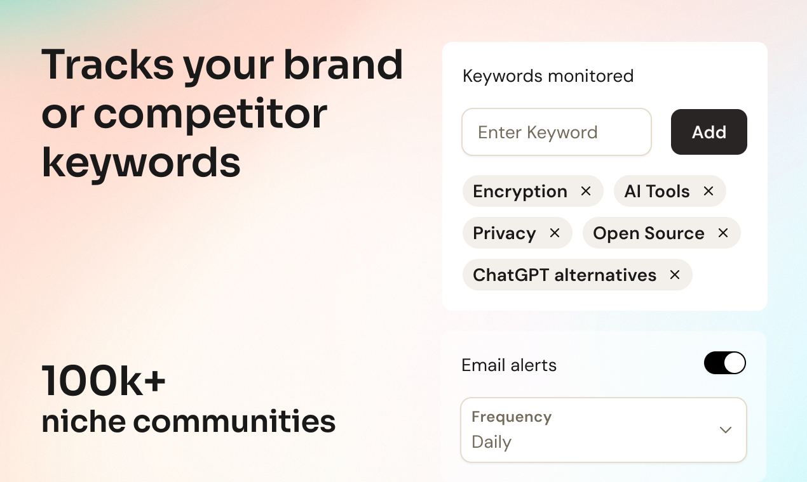
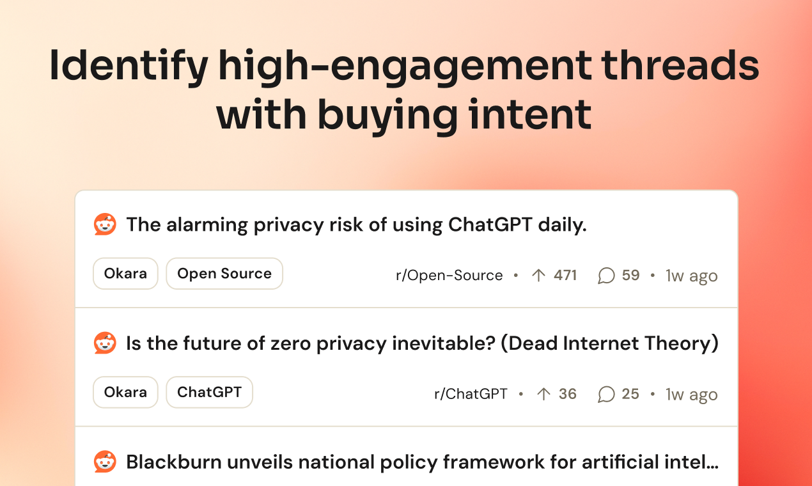

---

## 5. [FakeMRR](https://www.producthunt.com/products/fakemrr?utm_campaign=producthunt-api&utm_medium=api-v2&utm_source=Application%3A+antigravity_test+%28ID%3A+258588%29)
**Votes**: 180 | **Tagline**: The database of unverified startup revenues

### 📌 요약
실제 매출(MRR) 달성에는 시간이 걸리지만, 당장 바이럴에 필요한 '가짜' MRR 차트를 손쉽게 생성해 주는 스타트업 마케팅 보조 도구입니다.

### 🔑 핵심 기능
- 스타트업이 투자 유치나 바이럴 마케팅에 필요한 허위 월간 반복 매출(MRR) 스크린샷을 즉시 생성
- 수익 달성보다 짧은 시간에 시각적으로 매력적인 '매출 증명' 자료 확보 가능
- 재미와 풍자를 담아, 스타트업 세계의 과장된 성장 보고 문화를 꼬집는 툴

### 📸 스크린샷 및 갤러리
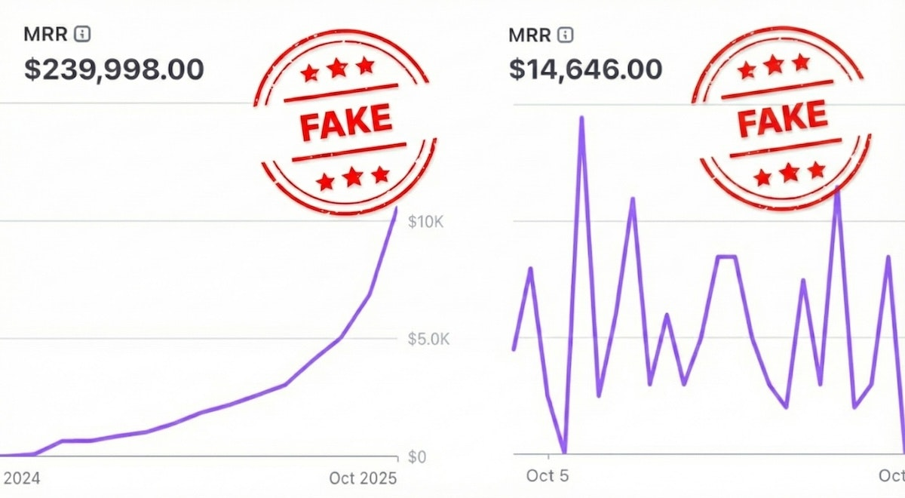
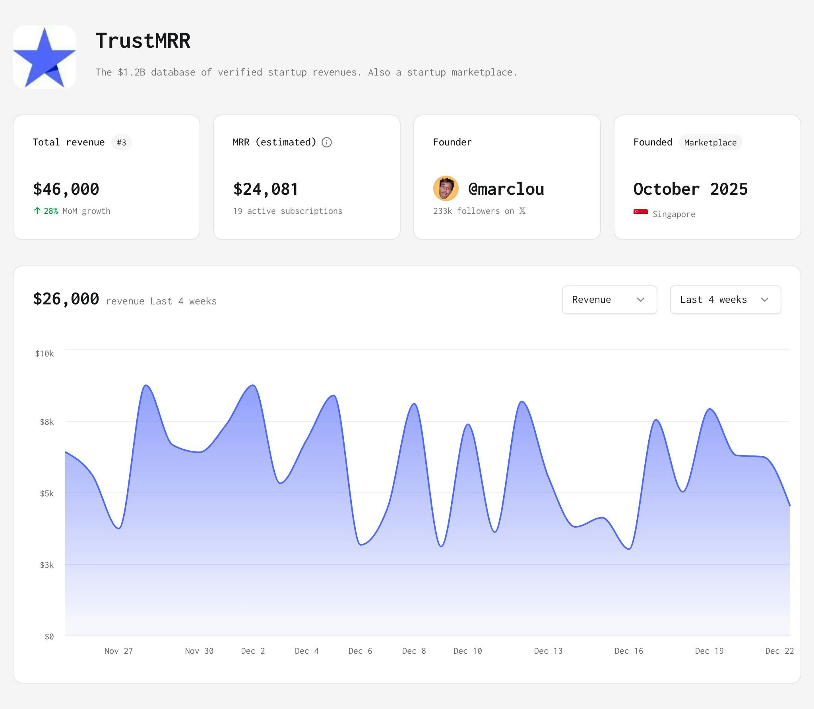
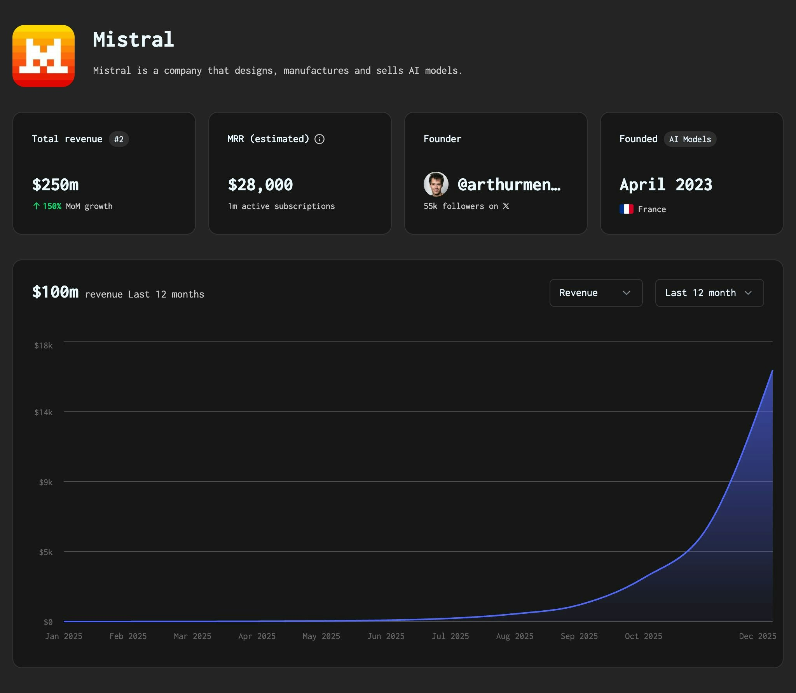

---

## 6. [LFM2.5](https://www.producthunt.com/products/lfm2?utm_campaign=producthunt-api&utm_medium=api-v2&utm_source=Application%3A+antigravity_test+%28ID%3A+258588%29)
**Votes**: 130 | **Tagline**: The next generation of on-device AI

### 📌 요약
Liquid AI가 엣지 AI 환경을 위한 차세대 온디바이스(On-device) AI 모델인 LFM2.5를 출시하며, 엣지 기기에서 신뢰할 수 있는 에이전트 구축의 성능을 크게 향상시켰습니다.

### 🔑 핵심 기능
- 차세대 온디바이스 AI 모델로, 엣지(Edge) 환경 배포에 최적화됨.
- 기존 LFM2 아키텍처를 기반으로 성능을 대폭 개선하여 가장 강력한 역량을 제공.
- 엣지 기기 상에서 신뢰성 높은 AI 에이전트(Agent) 구축을 가능하게 하는 것이 핵심 목표.

### 📸 스크린샷 및 갤러리
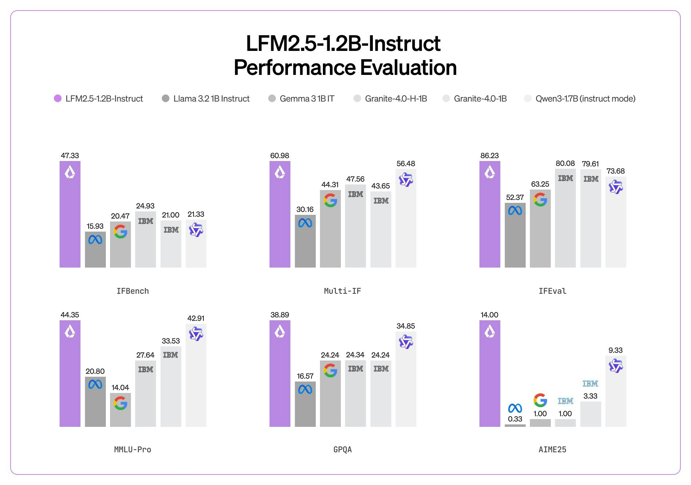
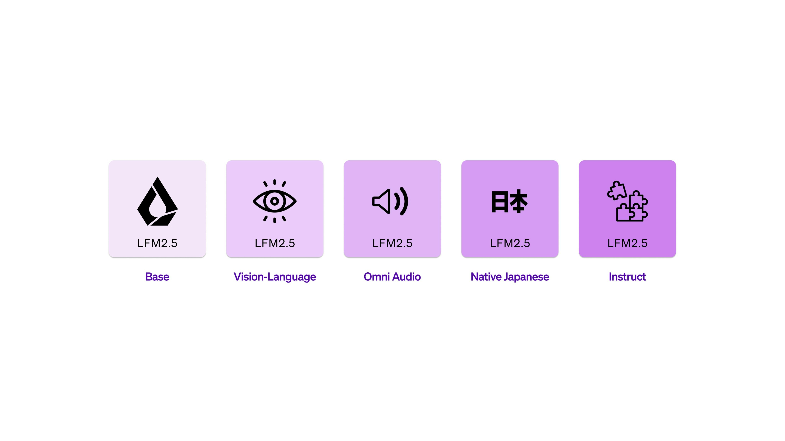
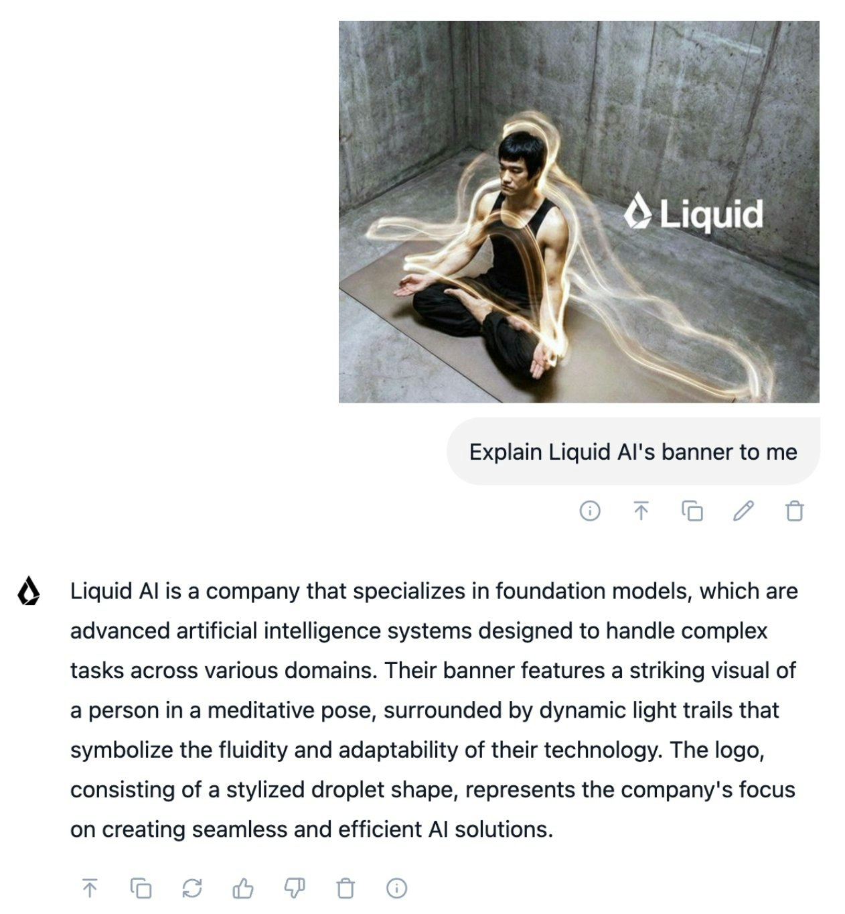

### 🎬 관련 영상
- [🎥 영상 보기](https://ph-files.imgix.net/6e839e03-6fc5-4364-ad78-7e6ef16c64b2.jpeg?auto=format)

---

## 7. [Paper](https://www.producthunt.com/products/paper-jorunaling-space?utm_campaign=producthunt-api&utm_medium=api-v2&utm_source=Application%3A+antigravity_test+%28ID%3A+258588%29)
**Votes**: 129 | **Tagline**: A 200-page digital notebook for journaling and writing

### 📌 요약
불필요한 기능과 무한 페이지를 없애고, 아날로그 감성에 집중하여 일기와 글쓰기에 최적화된 디지털 노트 앱입니다.

### 🔑 핵심 기능
- 200페이지로 분량이 제한되어 있어 아날로그 노트를 채우는 듯한 완결감을 제공합니다.
- 폴더, 생산성 시스템 등 복잡한 기능을 배제하고 오직 '글쓰기' 자체에 집중했습니다.
- 페이지를 넘기는 소리와 촉감 등 몰입감 있는 아날로그적 경험을 디지털로 구현했습니다.

### 📸 스크린샷 및 갤러리
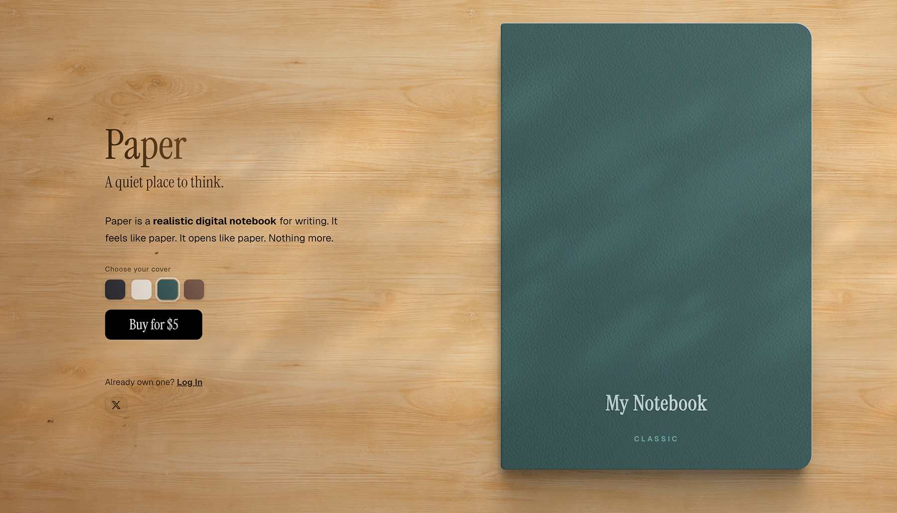
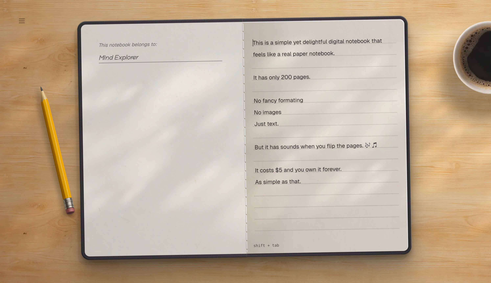

### 🎬 관련 영상
- [🎥 영상 보기](https://ph-files.imgix.net/f297d945-1437-472f-815a-0b97d395b158.jpeg?auto=format)

---

## 8. [Forge CLI](https://www.producthunt.com/products/rightnow-ai?utm_campaign=producthunt-api&utm_medium=api-v2&utm_source=Application%3A+antigravity_test+%28ID%3A+258588%29)
**Votes**: 125 | **Tagline**: Swarm agents optimize CUDA/Triton for any HF/PyTorch model

### 📌 요약
HuggingFace나 PyTorch 모델을 위한 최적의 GPU 커널을 생성하여, 기존 torch.compile보다 최대 5배 빠른 속도를 제공하는 AI 기반 최적화 툴입니다.

### 🔑 핵심 기능
- Swarm 에이전트가 CUDA/Triton 코드를 경쟁적으로 최적화하여 GPU 연산 속도를 극대화합니다.
- torch.compile(mode='max-autotune') 대비 최대 5배 빠른 성능 향상을 보장하며, 정확도는 97.6%에 달합니다.
- HuggingFace 모델 ID만 입력하면 모든 레이어에 대해 즉시 최적화된 커널을 생성해줍니다.
- 자체 최적화된 Nemotron 3 Nano 30B 모델(250k 토큰/초)을 활용하여 구동됩니다.

### 📸 스크린샷 및 갤러리
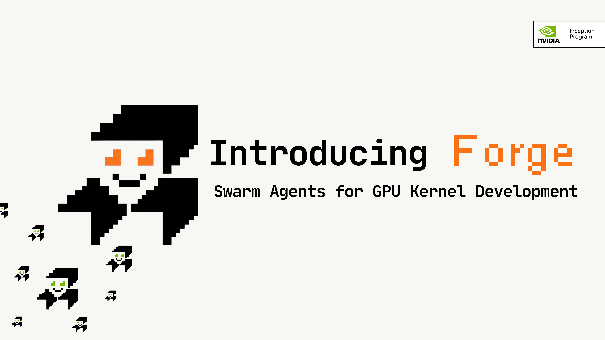
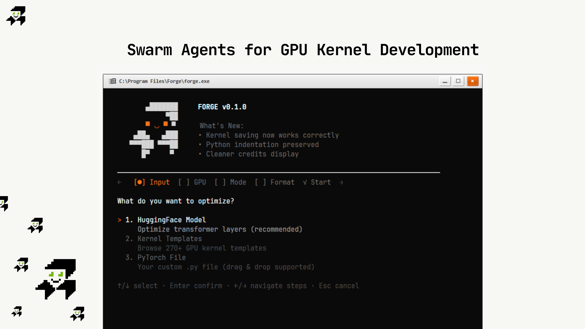
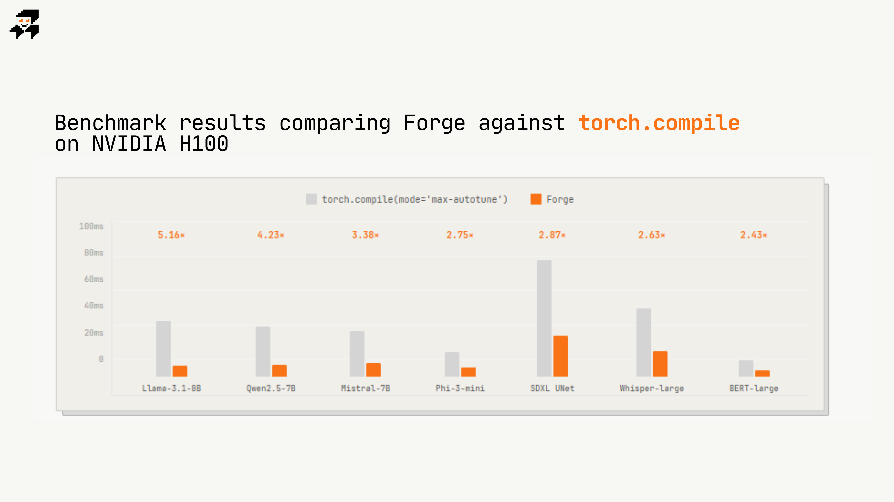

### 🎬 관련 영상
- [🎥 영상 보기](https://ph-files.imgix.net/b17ddf02-eacd-4ead-9720-cb7acde78cc4.jpeg?auto=format)

---

## 9. [Habi](https://www.producthunt.com/products/habi-vibe-coded-habit-tracker?utm_campaign=producthunt-api&utm_medium=api-v2&utm_source=Application%3A+antigravity_test+%28ID%3A+258588%29)
**Votes**: 114 | **Tagline**: Turn your calendar events into habits

### 📌 요약
캘린더 이벤트를 습관 추적 시스템과 완벽하게 통합하여 일상 활동을 반복 가능한 루틴으로 전환하도록 돕는 새로운 방식의 습관 추적 앱입니다.

### 🔑 핵심 기능
- 다른 앱과 달리 캘린더 일정과 완벽하게 연동되는 독특한 습관화 기능(Calendar-Event-to-Habit)을 제공합니다.
- 특정 이벤트(예: 헬스장 방문)에 필요한 준비물이나 해야 할 일(체크리스트)을 첨부하여 루틴을 확실히 관리할 수 있습니다.
- 기존의 클래식한 습관 추적 기능은 물론, 프로젝트 생성 및 포모도로 타이머 등 다양한 워크플로우를 지원합니다.

### 📸 스크린샷 및 갤러리
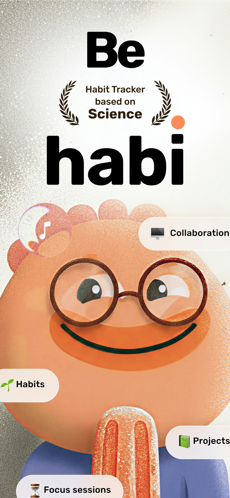
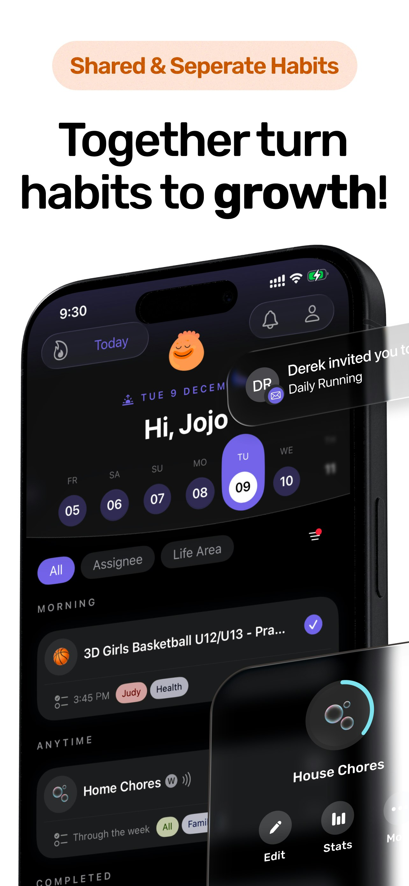
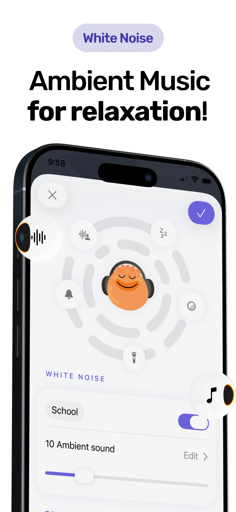

---

## 10. [Ray](https://www.producthunt.com/products/ray-5?utm_campaign=producthunt-api&utm_medium=api-v2&utm_source=Application%3A+antigravity_test+%28ID%3A+258588%29)
**Votes**: 113 | **Tagline**: An AI trainer that plans + adapts your workouts in real-time

### 📌 요약
사용자의 목표와 상황에 맞춰 운동 계획을 짜고, 실시간 음성 코칭 및 컴퓨터 비전 기술로 횟수 계산까지 해주는 AI 개인 트레이너 앱입니다.

### 🔑 핵심 기능
- 목표, 제약 조건, 부상 등을 고려하여 맞춤형 운동 계획을 수립합니다.
- 운동 중 실시간 음성 안내 코칭을 제공하며, 컴퓨터 비전으로 운동 횟수를 자동 카운트합니다.
- 시간 부족이나 장비 변경 등 돌발 상황에 맞춰 운동 계획을 즉시 유연하게 조정합니다.

### 📸 스크린샷 및 갤러리
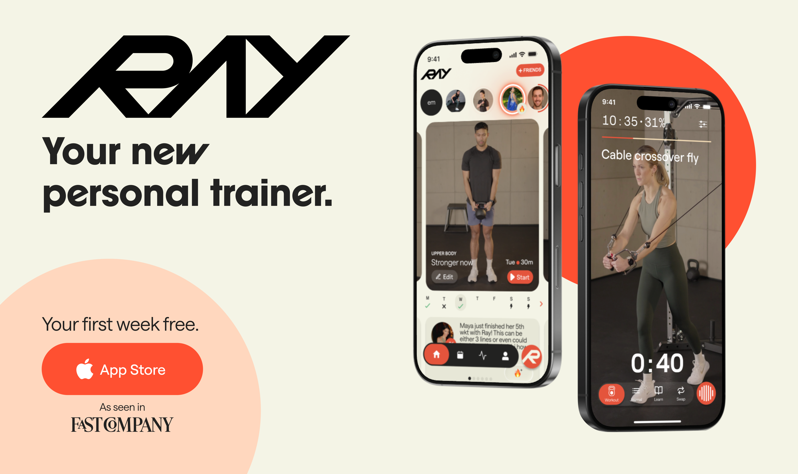
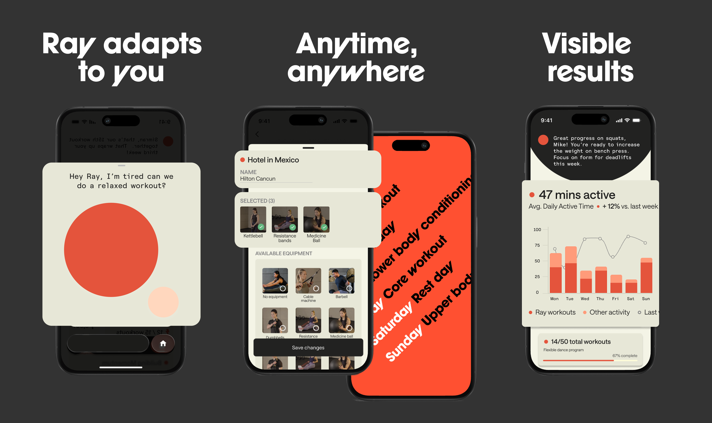

### 🎬 관련 영상
- [🎥 영상 보기](https://ph-files.imgix.net/c6d1026a-261a-455d-9520-0ab86c4a1271.jpeg?auto=format)

---

