# 🚀 Product Hunt Daily Top 10 (2026-01-07)

## 1. [LEGO SMART Play](https://www.producthunt.com/products/lego-jurassic-world?utm_campaign=producthunt-api&utm_medium=api-v2&utm_source=Application%3A+antigravity_test+%28ID%3A+258588%29)
**Votes**: 256 | **Tagline**: Bringing LEGO creations to life like never before

### 📌 요약
새로운 'SMART 브릭'을 기반으로, 센서를 통해 사용자의 움직임과 상호작용에 반응하며 레고 창작물에 생명력을 불어넣는 스크린 없는 인터랙티브 플레이 플랫폼입니다.

### 🔑 핵심 기능
- 센서를 내장한 'SMART 브릭'을 핵심 동력으로 사용합니다.
- 움직임과 플레이에 반응하여 창작물을 현실처럼 움직이게 하는 기능(Bringing creations to life)을 제공합니다.
- 기존의 레고 세트와 모두 호환되며, 디지털 스크린 없이 플레이 가능합니다.

### 📸 스크린샷 및 갤러리

### 🎬 관련 영상
- [🎥 영상 보기](https://ph-files.imgix.net/b1a732bf-3cab-4520-9ec4-fb0641deb356.jpeg?auto=format)

---

## 2. [Conversation API](https://www.producthunt.com/products/amarsia?utm_campaign=producthunt-api&utm_medium=api-v2&utm_source=Application%3A+antigravity_test+%28ID%3A+258588%29)
**Votes**: 235 | **Tagline**:  Build chatbots with memory using just an API

### 📌 요약
복잡한 백엔드 인프라 관리 없이, 오직 API 호출만으로 대화 흐름과 기억력을 유지하는 상태 저장형(stateful) AI 챗봇을 빠르게 구현할 수 있게 해주는 솔루션입니다.

### 🔑 핵심 기능
- AI 챗봇의 대화 기억(Memory) 및 상태 관리 자동화
- SDK, 데이터베이스 등 복잡한 백엔드 시스템 구축 오버헤드 제거
- 개발자는 conversation_id만 관리하며, 빠른 프롬프트 반복 작업 지원

### 📸 스크린샷 및 갤러리
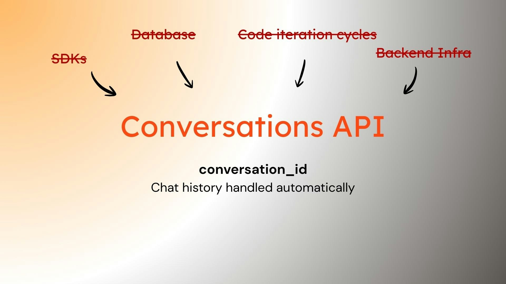
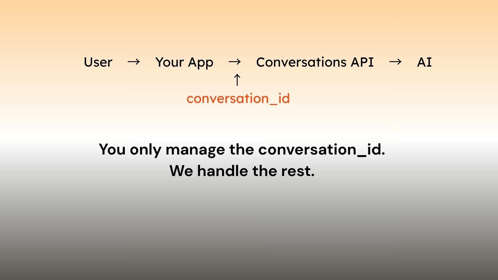
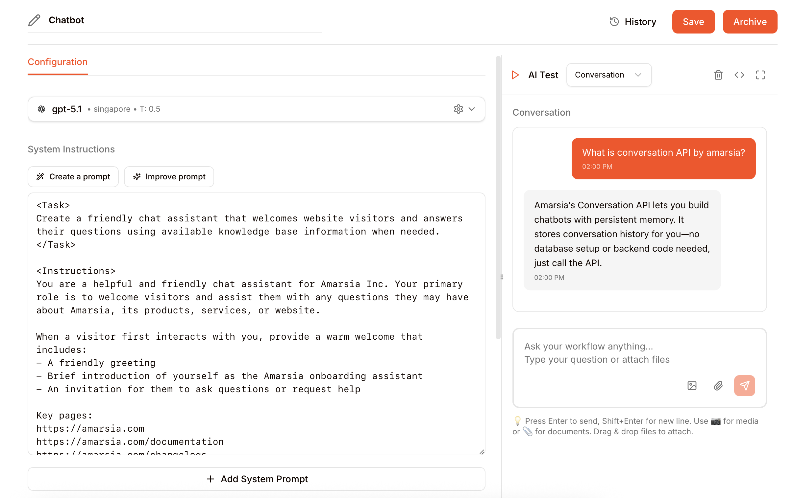

### 🎬 관련 영상
- [🎥 영상 보기](https://ph-files.imgix.net/82b89f11-e317-4034-9fb6-8e985b94a711.jpeg?auto=format)

---

## 3. [Dessix](https://www.producthunt.com/products/dessix-2?utm_campaign=producthunt-api&utm_medium=api-v2&utm_source=Application%3A+antigravity_test+%28ID%3A+258588%29)
**Votes**: 179 | **Tagline**: Visual workspace to capture, organize, and create with AI

### 📌 요약
AI를 활용해 컨텍스트를 시각적으로 구성하고 사고를 확장하며 창작 프로세스를 가속화하는 로직 중심의 비주얼 작업 공간입니다.

### 🔑 핵심 기능
- 프롬프트 씨름 대신 시각적 컨텍스트를 구축하여 AI를 사고의 확장으로 활용합니다.
- 사용자가 AI의 지식을 파악하고 AI는 사용자의 목표를 정확히 이해하는 진정한 정렬(Alignment)을 달성합니다.
- AI 블랙박스를 제거하고 창작 속도를 높이며 프로세스 제어권을 사용자에게 돌려줍니다.

### 📸 스크린샷 및 갤러리
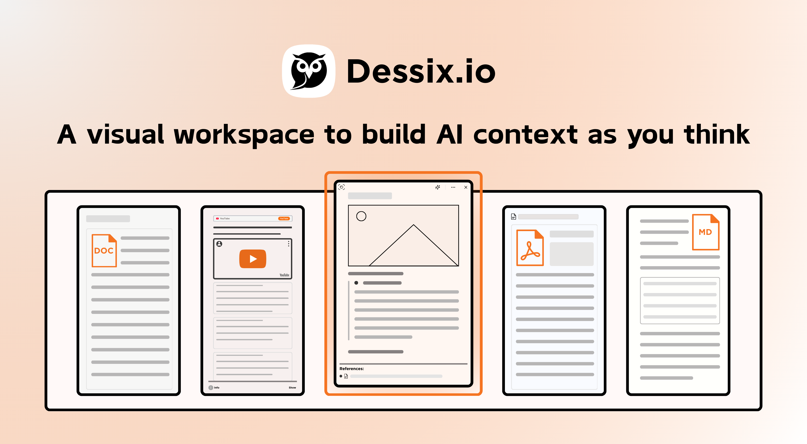
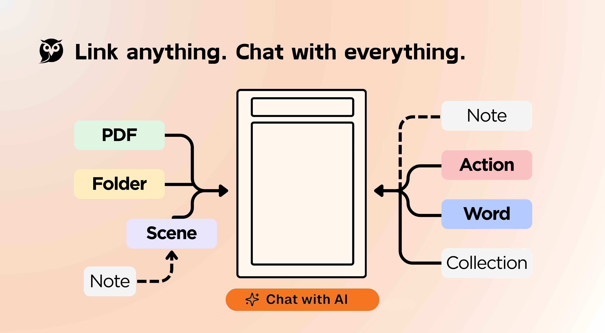
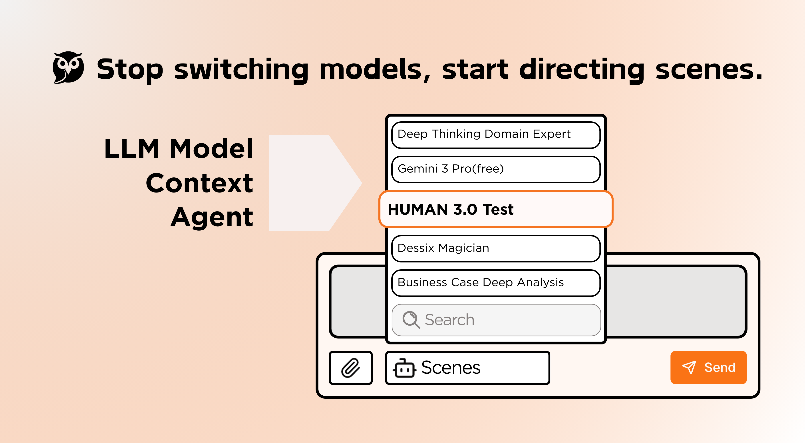

---

## 4. [Market Terminal](https://www.producthunt.com/products/market-terminal-2?utm_campaign=producthunt-api&utm_medium=api-v2&utm_source=Application%3A+antigravity_test+%28ID%3A+258588%29)
**Votes**: 155 | **Tagline**: A Wall Street Terminal For Everyone

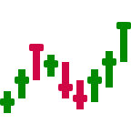

### 📌 요약
고가의 월스트리트급 데이터를 개인 투자자들도 합리적인 가격으로 접근하여 사용할 수 있게 만든 인공지능 기반 금융 분석 터미널입니다.

### 🔑 핵심 기능
- AI 기반 분석을 통해 실시간 시장 급등주(breakouts)를 정확하게 포착
- 스마트 머니 추적, 내부자 및 의회 거래 내역 등 기관 투자자급 고급 정보 제공
- 연간 수만 달러에 달하는 월스트리트 터미널 기능을 훨씬 저렴한 비용으로 이용 가능

### 📸 스크린샷 및 갤러리

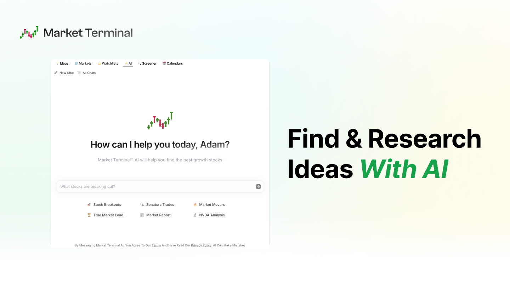
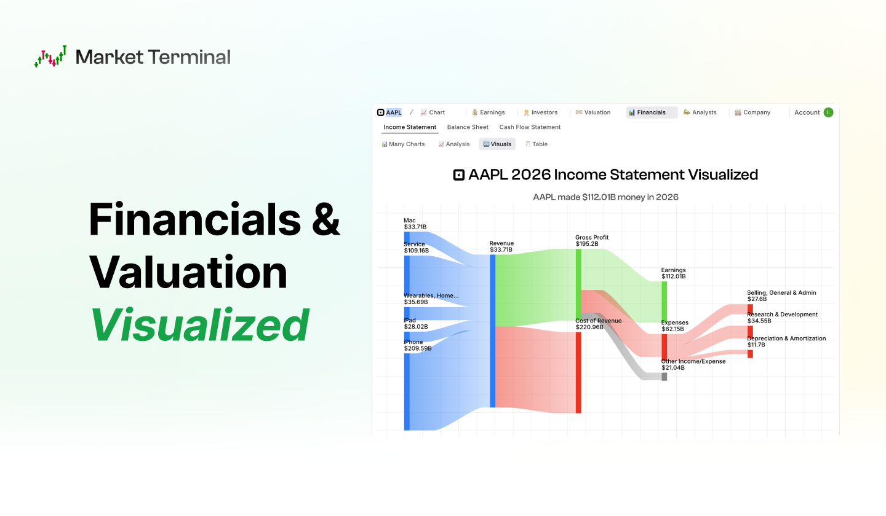

---

## 5. [Graysky 2.0](https://www.producthunt.com/products/graysky?utm_campaign=producthunt-api&utm_medium=api-v2&utm_source=Application%3A+antigravity_test+%28ID%3A+258588%29)
**Votes**: 140 | **Tagline**: A faster alternative client for Bluesky

### 📌 요약
Graysky 2.0은 인기 있는 분산형 소셜 미디어 플랫폼인 Bluesky의 공식 앱보다 더 빠르고 효율적인 대체 클라이언트로, 'Liquid Glass' 기능 지원을 추가하며 업그레이드되었습니다.

### 🔑 핵심 기능
- Bluesky 사용자들을 위한 비공식 대체 클라이언트(Alternative Client)입니다.
- 공식 앱 대비 더 빠른 속도와 향상된 성능을 제공하는 데 중점을 둡니다.
- 주요 업데이트로 새로운 'Liquid Glass' 기능을 지원하기 시작했습니다.

### 📸 스크린샷 및 갤러리
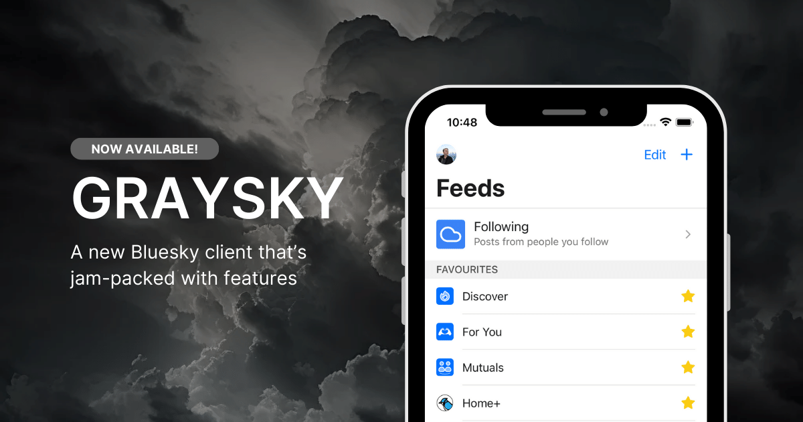
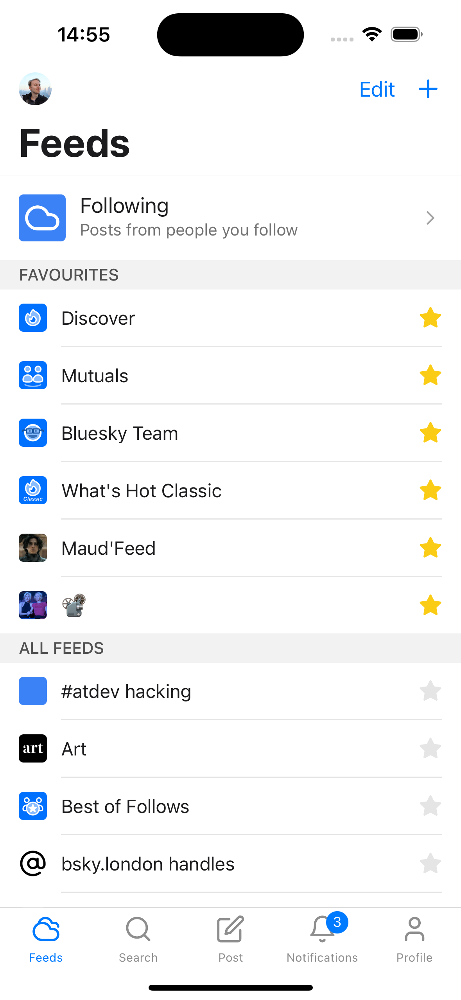

---

## 6. [Planelo](https://www.producthunt.com/products/planelo?utm_campaign=producthunt-api&utm_medium=api-v2&utm_source=Application%3A+antigravity_test+%28ID%3A+258588%29)
**Votes**: 118 | **Tagline**: The idea-first hub for developers

### 📌 요약
Planelo는 개발자를 위한 '아이디어 우선' 작업 공간으로, 잡다한 프로젝트 도구 없이 아이디어를 캡처하고 구조화하며 실행 가능한 워크플로우로 연결하도록 돕습니다.

### 🔑 핵심 기능
- 아이디어와 프로젝트에 API 엔드포인트를 부여하여 자동화 및 맞춤형 워크플로우 구축이 가능합니다.
- iPhone, iPad, macOS에서 깔끔한 인터페이스와 키보드 친화적인 탐색 환경을 제공합니다.
- 기존 프로젝트 관리 도구의 복잡함을 없애고 아이디어 구조화 및 연결에 중점을 둡니다.
- 암호화된 동기화와 API 키 기능을 통해 아이디어를 실제 액션으로 전환할 수 있습니다.

### 📸 스크린샷 및 갤러리
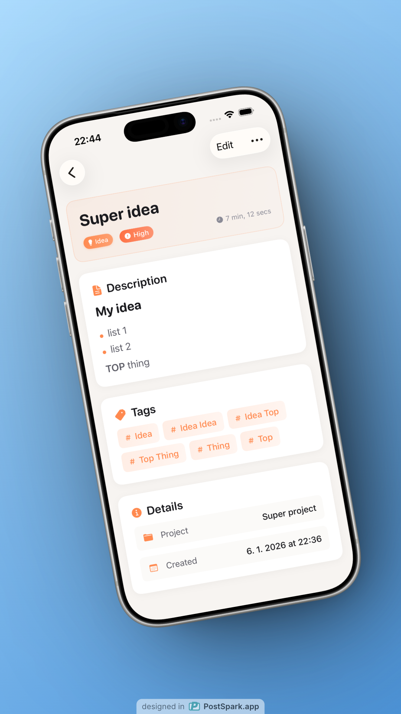
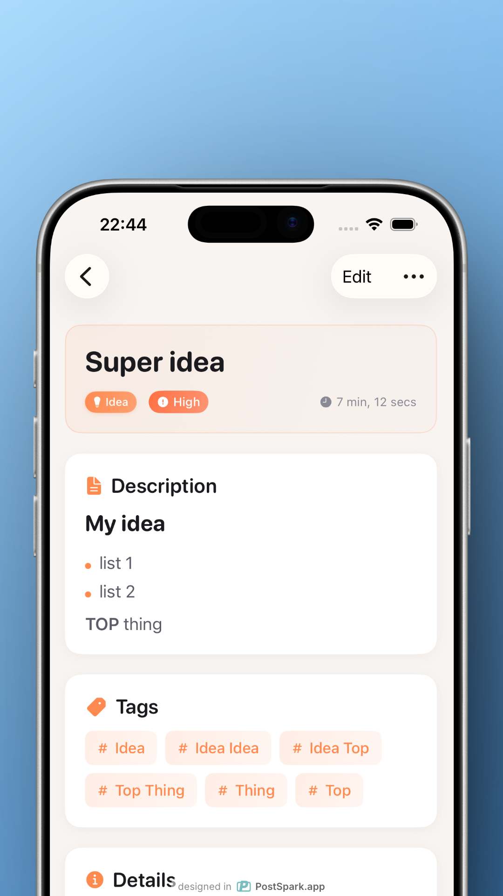
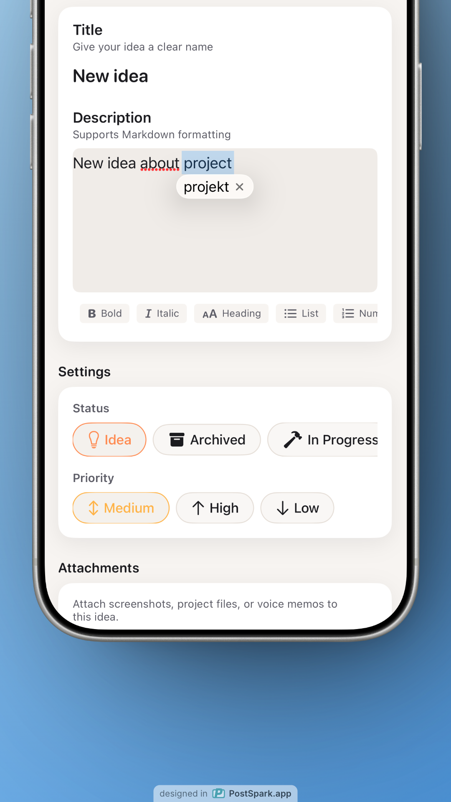

---

## 7. [AgentNotch](https://www.producthunt.com/products/agentnotch?utm_campaign=producthunt-api&utm_medium=api-v2&utm_source=Application%3A+antigravity_test+%28ID%3A+258588%29)
**Votes**: 111 | **Tagline**: Real-time AI coding assistant telemetry in your Mac's notch

### 📌 요약
맥북 노치(Notch) 공간을 활용하여, AI 코딩 도우미(Claude Code, OpenAI Codex)의 실시간 작업 상태를 비침입적으로 모니터링하는 macOS 메뉴 바 앱입니다.

### 🔑 핵심 기능
- 맥북 노치 영역에 AI 코딩 어시스턴트의 실시간 원격 측정(Telemetry) 데이터를 시각적으로 표시.
- Claude Code와 OpenAI Codex가 파일을 읽거나, 사고하거나, 도구를 실행하는 과정을 실시간으로 추적 가능.
- 사용자가 다른 작업을 하는 동안에도 AI의 백그라운드 활동을 방해 없이 확인하여 개발 생산성 증대.

### 📸 스크린샷 및 갤러리
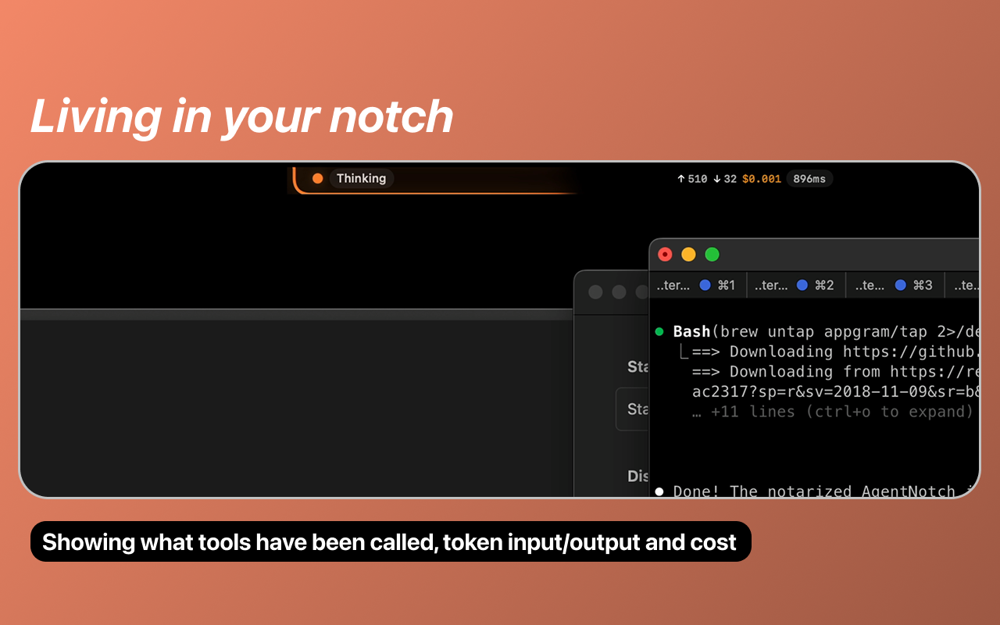
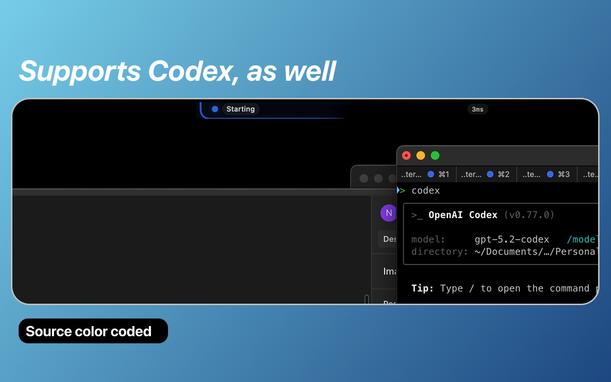
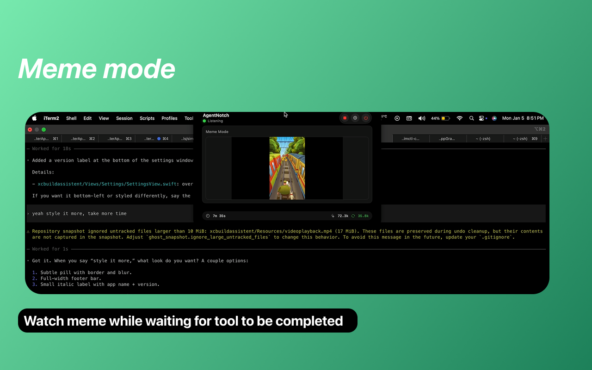

### 🎬 관련 영상
- [🎥 영상 보기](https://ph-files.imgix.net/123ffdbc-0607-4f9e-9ea1-0f8e79bd6b22.jpeg?auto=format)

---

## 8. [Gridfy.io](https://www.producthunt.com/products/gridfy-io-turn-data-into-live-widgets?utm_campaign=producthunt-api&utm_medium=api-v2&utm_source=Application%3A+antigravity_test+%28ID%3A+258588%29)
**Votes**: 105 | **Tagline**: Live interactive widgets from Airtable, Notion or Sheets

### 📌 요약
Airtable, Notion, Google Sheets 등의 데이터를 실시간으로 업데이트되는 상호작용 가능한 웹사이트 위젯으로 쉽게 변환하여 삽입하는 노코드 솔루션입니다.

### 🔑 핵심 기능
- Airtable, Notion, Sheets 데이터를 활용한 실시간 라이브 위젯 생성
- 코드 없이 커스터마이징 가능한 디자인(색상, 폰트, 레이아웃) 제공
- 검색, 필터링, 정렬 기능이 내장된 인터랙티브한 그리드 구현

### 📸 스크린샷 및 갤러리
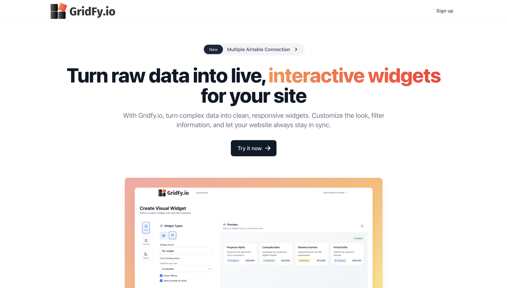
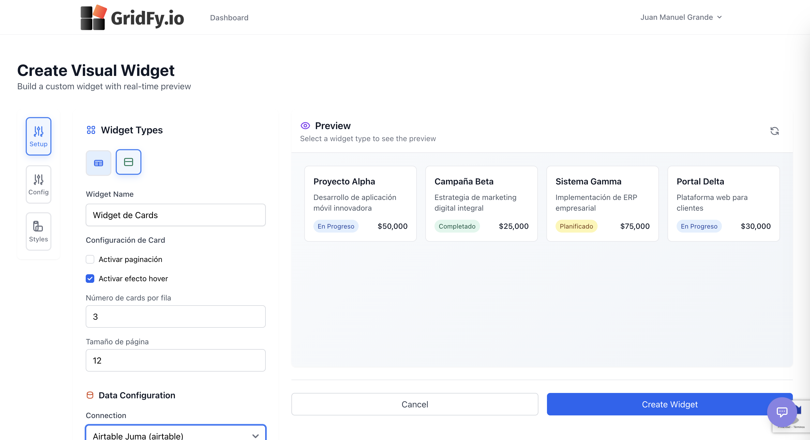
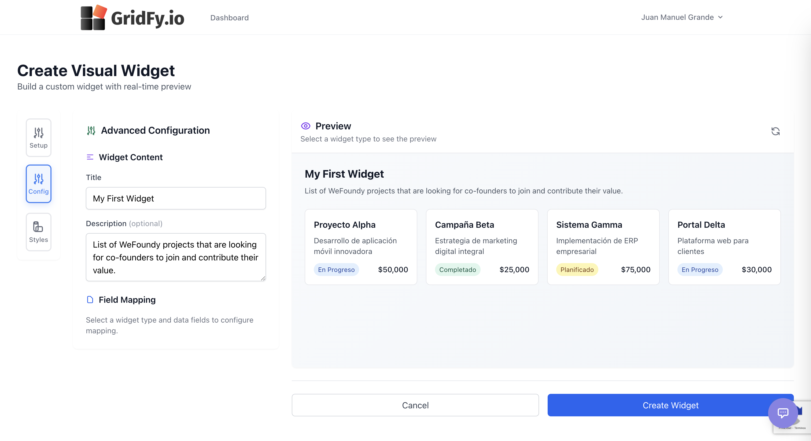

### 🎬 관련 영상
- [🎥 영상 보기](https://ph-files.imgix.net/8f36b8ff-422f-43de-8e6c-9f6d1c94feb8.jpeg?auto=format)

---

## 9. [NotifyGate](https://www.producthunt.com/products/notifygate?utm_campaign=producthunt-api&utm_medium=api-v2&utm_source=Application%3A+antigravity_test+%28ID%3A+258588%29)
**Votes**: 101 | **Tagline**: One Gate for all your Notifications

### 📌 요약
개발자나 운영팀이 코드를 수정하지 않고도 모든 알림을 중앙에서 통합 관리하고, 라우팅, 조절, 중요도 에스컬레이션 등을 설정할 수 있게 돕는 알림 게이트웨이 솔루션입니다.

### 🔑 핵심 기능
- 코드 수정 없이 웹 UI를 통해 Slack, Discord, 이메일 등 다양한 채널로 알림을 라우팅할 수 있습니다.
- 불필요한 알림을 무음(Mute) 처리하거나, 알림 빈도를 제한(Throttle)하여 '알림 피로'를 줄여줍니다.
- 실패 시 자동 재시도, 실시간 대시보드 및 AI 에이전트 연동 기능을 제공하여 중요한 이슈 관리를 자동화합니다.

### 📸 스크린샷 및 갤러리
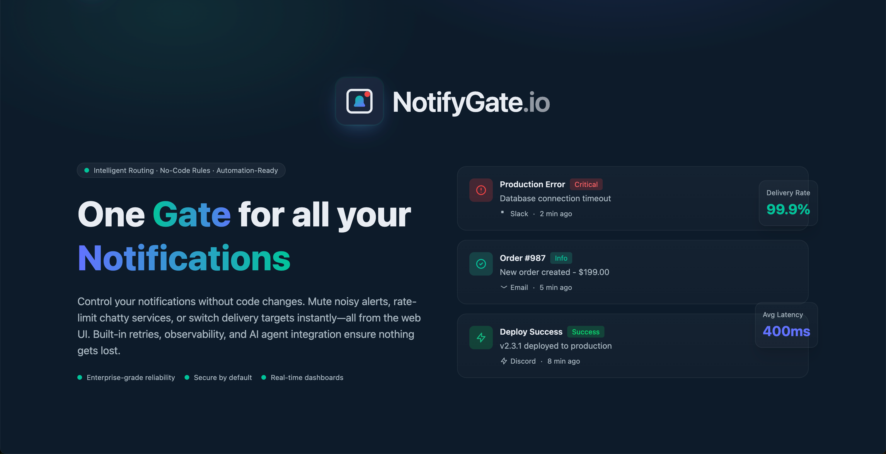
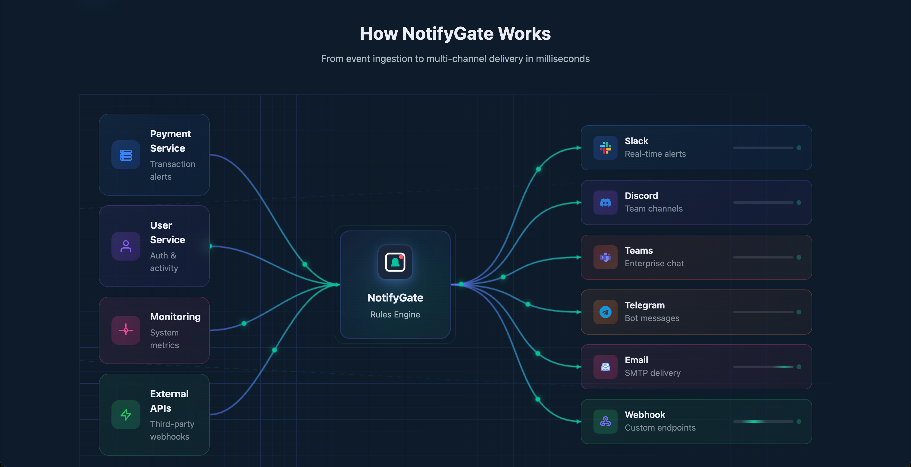
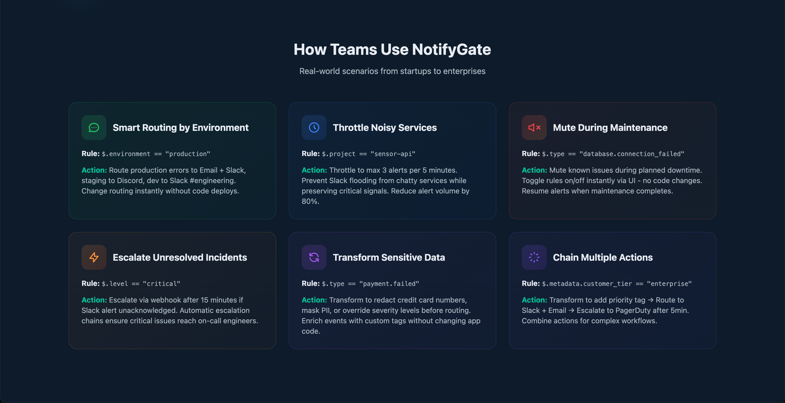

### 🎬 관련 영상
- [🎥 영상 보기](https://ph-files.imgix.net/05be3792-31b9-4374-9bee-764814f67d0f.jpeg?auto=format)

---

## 10. [Too Many Buttons](https://www.producthunt.com/products/too-many-buttons?utm_campaign=producthunt-api&utm_medium=api-v2&utm_source=Application%3A+antigravity_test+%28ID%3A+258588%29)
**Votes**: 101 | **Tagline**: Only one button works. Every other click is chaos.

### 📌 요약
수많은 버튼 중 오직 하나의 작동하는 버튼을 찾는 것이 목표인, 예측 불가능한 혼돈과 스트레스를 유발하는 레트로 스타일의 웹 브라우저 게임입니다.

### 🔑 핵심 기능
- 수많은 버튼 중 오직 하나만 작동하며, 다른 클릭은 화면 흔들림, 가짜 알림, 소음 등 무작위의 혼돈을 유발합니다.
- 자신만의 속도로 즐기는 클래식 모드와 시간과의 싸움인 스피드런 모드가 있으며, 최대 200개의 버튼을 설정 가능한 다양한 난이도가 제공됩니다.
- 레트로 픽셀 아트 스타일로 제작되었고 별도의 설명이나 가입/다운로드 없이 즉시 플레이 가능한 중독성 강한 단순함이 특징입니다.

### 📸 스크린샷 및 갤러리

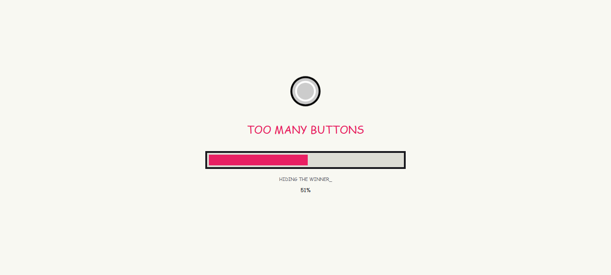
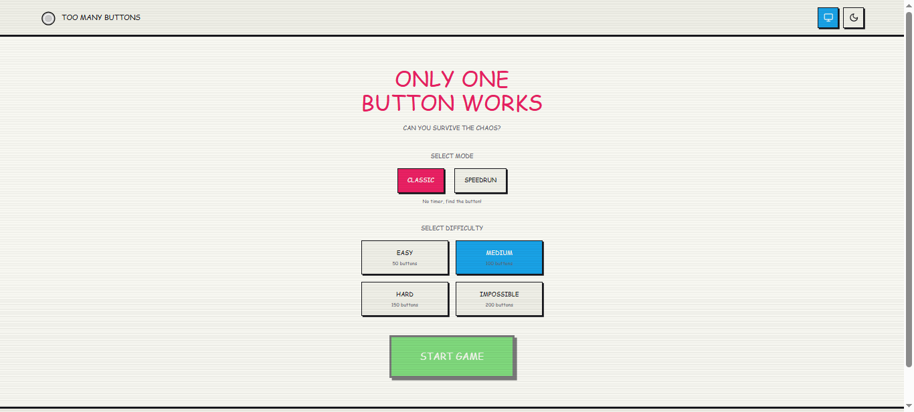

---

