# 🚀 Product Hunt Daily Top 10 (2026-01-08)

## 1. [Livedocs](https://www.producthunt.com/products/livedocs-2?utm_campaign=producthunt-api&utm_medium=api-v2&utm_source=Application%3A+antigravity_test+%28ID%3A+258588%29)
**Votes**: 337 | **Tagline**: The general data agent

### 📌 요약
Livedocs는 일반 데이터 분석가(Data Scientist)의 역할을 AI로 대체하여, CSV, 스프레드시트, 데이터베이스를 연결한 후 평범한 질문만으로 즉시 데이터 통찰을 얻게 해주는 범용 데이터 에이전트입니다.

### 🔑 핵심 기능
- BI, ML, 대시보드 구축, 코드/쿼리 작성 등 데이터 사이언티스트의 모든 업무를 수행합니다.
- SQL 지식이나 복잡한 설정 없이, 데이터를 업로드하고 영어로 질문만 하면 차트와 분석 결과를 즉시 생성합니다.
- 기술적 배경이 없는 사용자도 빠르게 통찰력을 얻을 수 있도록 설계된 '데이터 만능 해결사'입니다.

### 📸 스크린샷 및 갤러리

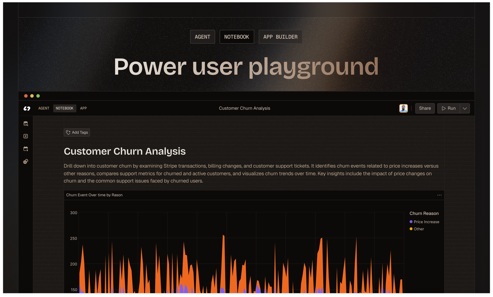

### 🎬 관련 영상
- [🎥 영상 보기](https://ph-files.imgix.net/141c3752-3335-4af3-be7e-41c45a4638cf.jpeg?auto=format)

---

## 2. [ChatGPT Health](https://www.producthunt.com/products/openai?utm_campaign=producthunt-api&utm_medium=api-v2&utm_source=Application%3A+antigravity_test+%28ID%3A+258588%29)
**Votes**: 296 | **Tagline**: ChatGPT designed for health and wellness

### 📌 요약
개인의 건강 및 웰빙 관리에 특화된 챗지피티(ChatGPT) 서비스로, 맞춤형 건강 조언과 의료 탐색 지원을 제공합니다.

### 🔑 핵심 기능
- 건강 및 웰빙 대화에 중점을 둔 전용 공간을 제공합니다.
- 의료 기록 및 웰니스 앱을 안전하게 연결하여 개인화된 응답을 제공합니다.
- 의료 전문가를 대체하지 않고 진료 탐색을 돕는 보조 도구로 설계되었습니다.

### 📸 스크린샷 및 갤러리

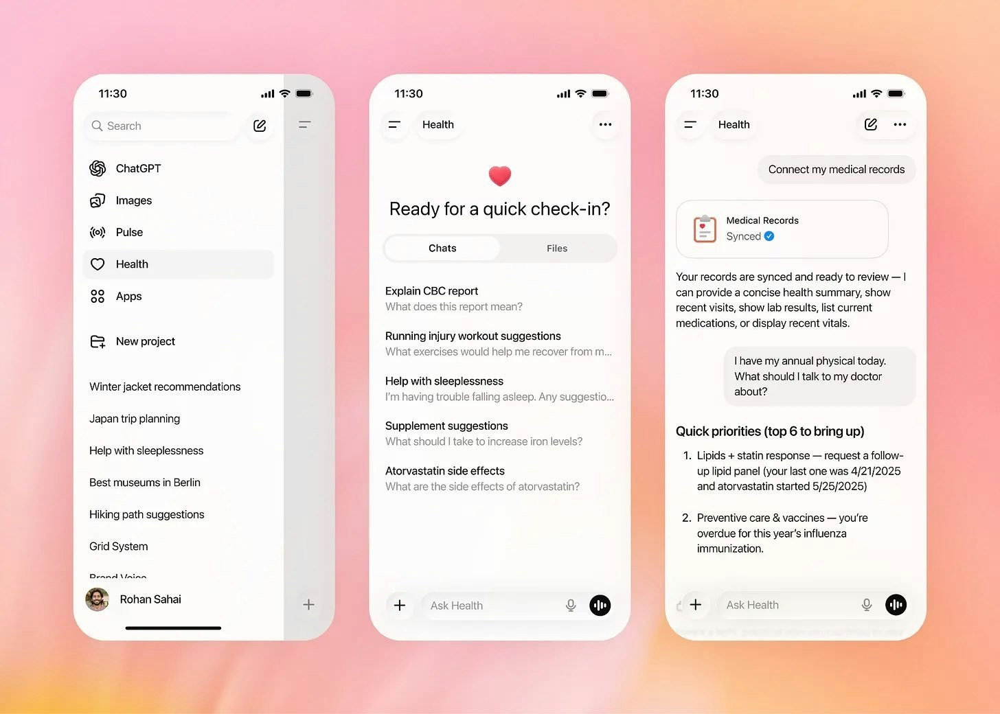

### 🎬 관련 영상
- [🎥 영상 보기](https://ph-files.imgix.net/67f7471d-698d-47a2-8627-2aaf6bd54b78.jpeg?auto=format)

---

## 3. [Spec Coding by Capacity](https://www.producthunt.com/products/capacity?utm_campaign=producthunt-api&utm_medium=api-v2&utm_source=Application%3A+antigravity_test+%28ID%3A+258588%29)
**Votes**: 238 | **Tagline**: Vibe Coding with a planning assistant to build with clarity

### 📌 요약
앱 개발 전에 AI 공동 창업자가 올바른 질문을 던지며 명확한 사양(Spec)을 정의하도록 돕는 'Spec Coding' 기능입니다.

### 🔑 핵심 기능
- 개발 전에 AI가 사양 정의를 지원하여, 앱의 일관성과 명확성을 높입니다.
- 기존 AI 앱 빌더의 '빠른 빌드 후 지저분해지는' 문제를 해결하고 구조를 먼저 잡습니다.
- 사전 구조화 작업을 통해 향후 리팩토링(재작업)을 대폭 줄여줍니다.

### 📸 스크린샷 및 갤러리

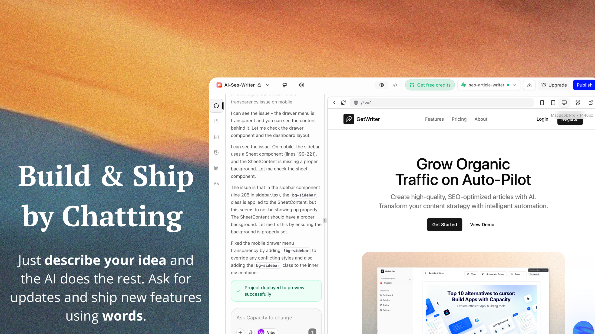
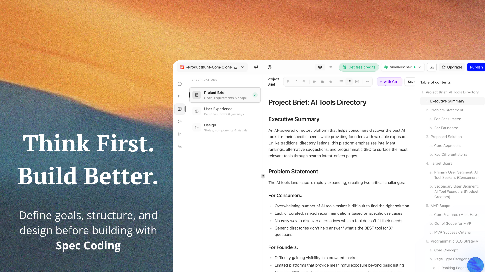

### 🎬 관련 영상
- [🎥 영상 보기](https://ph-files.imgix.net/0950217a-f8b5-4bcc-bbe9-c14b26697e94.jpeg?auto=format)

---

## 4. [xPay](https://www.producthunt.com/products/xpay?utm_campaign=producthunt-api&utm_medium=api-v2&utm_source=Application%3A+antigravity_test+%28ID%3A+258588%29)
**Votes**: 164 | **Tagline**: Cross-border payment gateway for enterprises

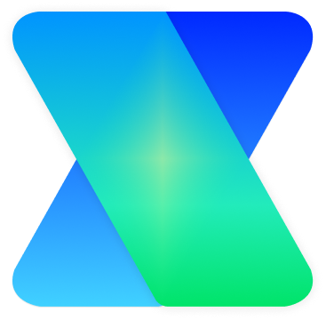

### 📌 요약
xPay는 인도, 싱가포르, 미국 기업들을 타겟으로 하며, 90%의 높은 성공률과 다중 통화 지원을 통해 국경 간 결제를 원활하게 처리해주는 엔터프라이즈급 결제 게이트웨이입니다.

### 🔑 핵심 기능
- 마켓플레이스, SaaS, 이커머스 등 글로벌 비즈니스를 위한 최적화된 국경 간 결제 솔루션입니다.
- 90%의 높은 결제 성공률과 고급 사기 방지 시스템을 통해 거래 이탈을 최소화하고 보안을 강화합니다.
- 다중 통화 지원과 자동화된 규정 준수 처리를 통해 복잡한 국제 결제 흐름을 단순화합니다.

### 📸 스크린샷 및 갤러리
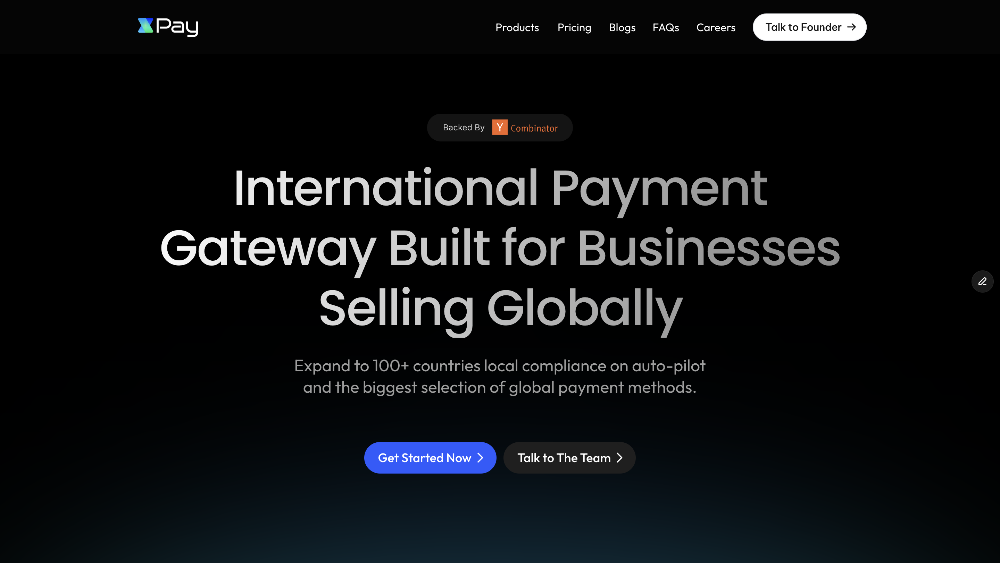
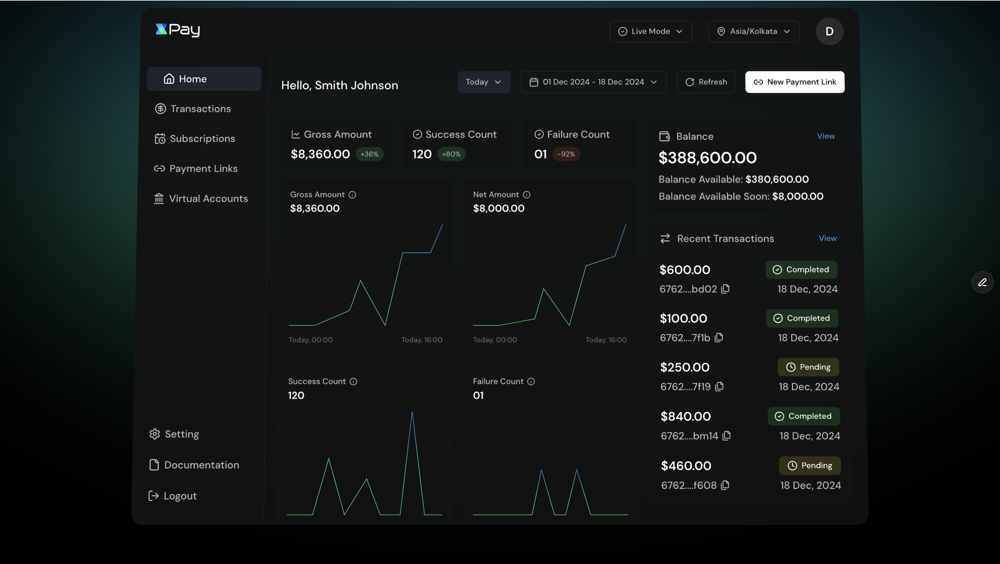

---

## 5. [Muze AI](https://www.producthunt.com/products/muze-ai?utm_campaign=producthunt-api&utm_medium=api-v2&utm_source=Application%3A+antigravity_test+%28ID%3A+258588%29)
**Votes**: 164 | **Tagline**: Let AI Manage and Create Your Meta and Google ads

### 📌 요약
Meta 및 Google 광고의 제작부터 실행, 최적화까지 전 과정을 엔드투엔드로 자동 관리하는 자율 AI 광고 솔루션입니다.

### 🔑 핵심 기능
- 광고 대행사나 미디어 바이어 없이 AI가 광고를 관리 및 생성합니다.
- 퍼포먼스 광고의 생성, 운영, 최적화 과정을 완전히 자동화합니다.
- 사이트와 광고 계정만 연결하면 바로 사용할 수 있는 자율(autonomous) AI입니다.

### 📸 스크린샷 및 갤러리
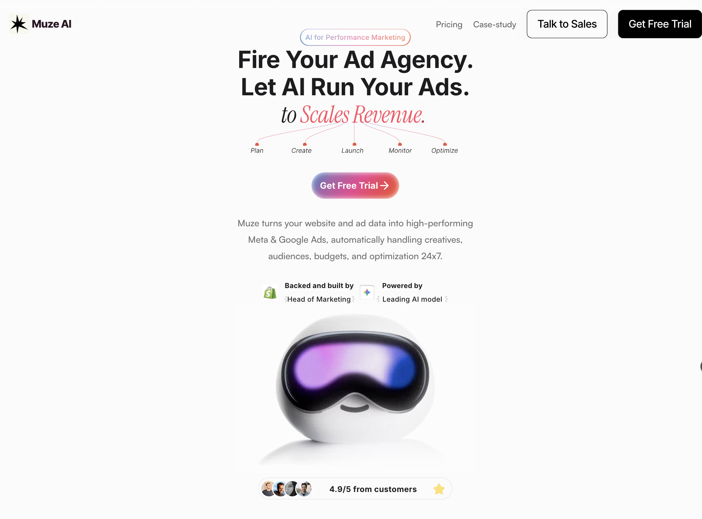
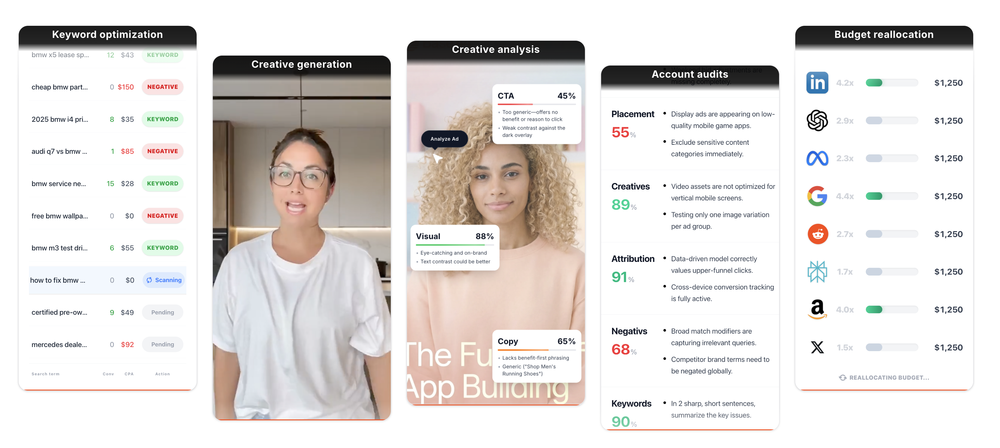
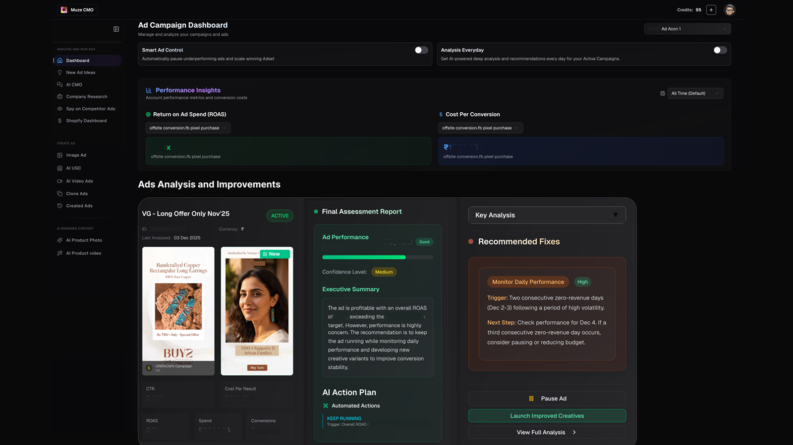

### 🎬 관련 영상
- [🎥 영상 보기](https://ph-files.imgix.net/4dbd3d52-9261-4058-a9bf-14c91040aede.jpeg?auto=format)

---

## 6. [Adventory](https://www.producthunt.com/products/adventory?utm_campaign=producthunt-api&utm_medium=api-v2&utm_source=Application%3A+antigravity_test+%28ID%3A+258588%29)
**Votes**: 127 | **Tagline**: The indie ad markeplace to sell or find ad spots

### 📌 요약
인디 앱 광고 스팟을 사고팔 수 있는 마켓플레이스로, 앱 오너와 광고주를 직접 연결하는 플랫폼입니다.

### 🔑 핵심 기능
- 앱 오너는 광고 스팟을 등록하고 수백 명의 SaaS 창업자에게 노출될 수 있습니다.
- 광고주는 수백 개의 앱을 검색하여 제품 광고에 적합한 스팟을 찾을 수 있습니다.
- 앱 분석 데이터를 플랫폼에서 직접 확인하며 광고 집행 의사결정을 내릴 수 있습니다.

### 📸 스크린샷 및 갤러리
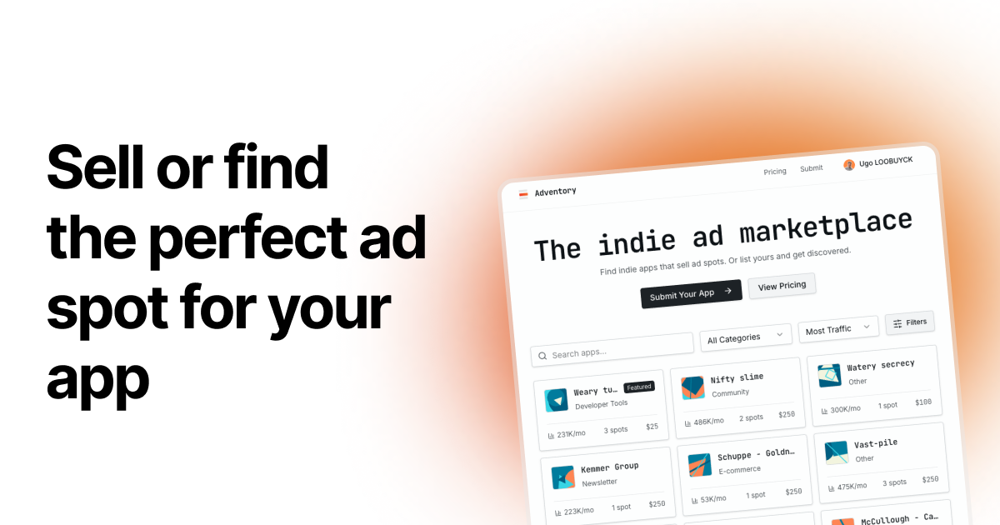
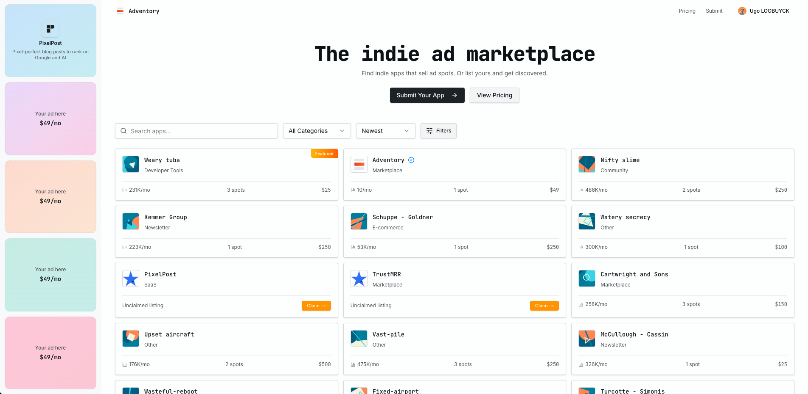

### 🎬 관련 영상
- [🎥 영상 보기](https://ph-files.imgix.net/aa770b1e-f5c2-4737-ab66-d2c7e20407a9.jpeg?auto=format)

---

## 7. [Flakes](https://www.producthunt.com/products/flakes-your-next-browser?utm_campaign=producthunt-api&utm_medium=api-v2&utm_source=Application%3A+antigravity_test+%28ID%3A+258588%29)
**Votes**: 122 | **Tagline**: A keyboard-first, AI-powered native browser for macOS. 

### 📌 요약
사고하는 사람들을 위해 설계된, 키보드 중심의 AI 기반 macOS 전용 네이티브 브라우저 'Flakes'가 출시되었습니다.

### 🔑 핵심 기능
- 키보드 조작에 최적화: Vim 스타일의 탐색 방식과 강력한 커맨드 팔레트(⌘K)를 지원합니다.
- 사고(思考)에 집중: 기본 내장된 광고 차단 기능으로 방해 없이 웹 서핑이 가능합니다.
- 탭을 이해하는 AI: 탭 내용을 분석하는 AI 기능(선택 사항)으로 강력한 브라우징 경험을 제공합니다.
- macOS 네이티브: macOS에 최적화된 설계로 빠른 속도와 안정성을 자랑합니다.

### 📸 스크린샷 및 갤러리
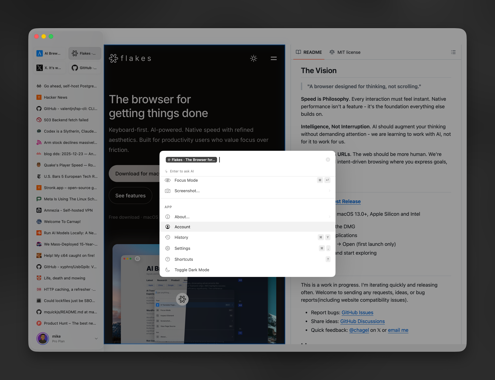
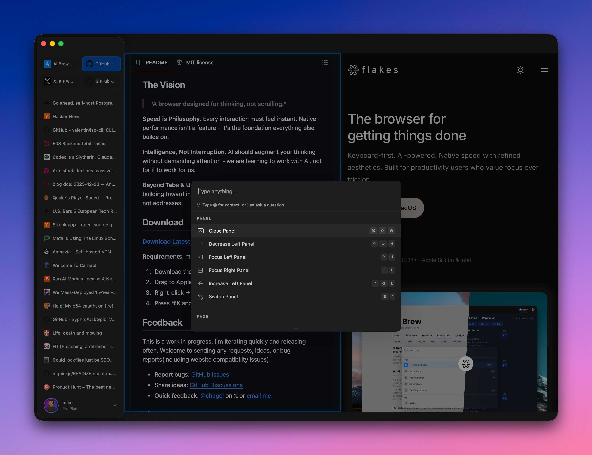
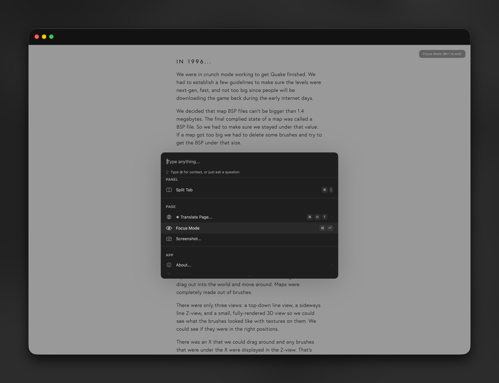

### 🎬 관련 영상
- [🎥 영상 보기](https://ph-files.imgix.net/54b4dfc2-74ff-4e21-8867-0a6a052ba7fc.jpeg?auto=format)

---

## 8. [Awesome Gemini Prompts](https://www.producthunt.com/products/awesome-gemini-prompts?utm_campaign=producthunt-api&utm_medium=api-v2&utm_source=Application%3A+antigravity_test+%28ID%3A+258588%29)
**Votes**: 121 | **Tagline**: The Ultimate Open Source Library for Gemini & Nano

### 📌 요약
Google Gemini 및 Nano 사용자들을 위한 최초의 전용 오픈소스 프롬프트 라이브러리로, 1,800개 이상의 전문 프롬프트를 자동 수집 및 정제하여 제공합니다.

### 🔑 핵심 기능
- 전문적인 복합 작업을 위해 설계된, Gemini 모델에 특화된 오픈소스 프롬프트 라이브러리입니다.
- Qwen과 Gemini를 활용한 맞춤형 LLM 파이프라인을 구축하여 1,800개 이상의 프롬프트를 매일 자동으로 스크랩하고 품질을 정제합니다.
- 기존의 난잡하고 분산된 프롬프트 포맷 문제를 해결하며, 사용자들에게 완전히 무료로 제공됩니다.

### 📸 스크린샷 및 갤러리
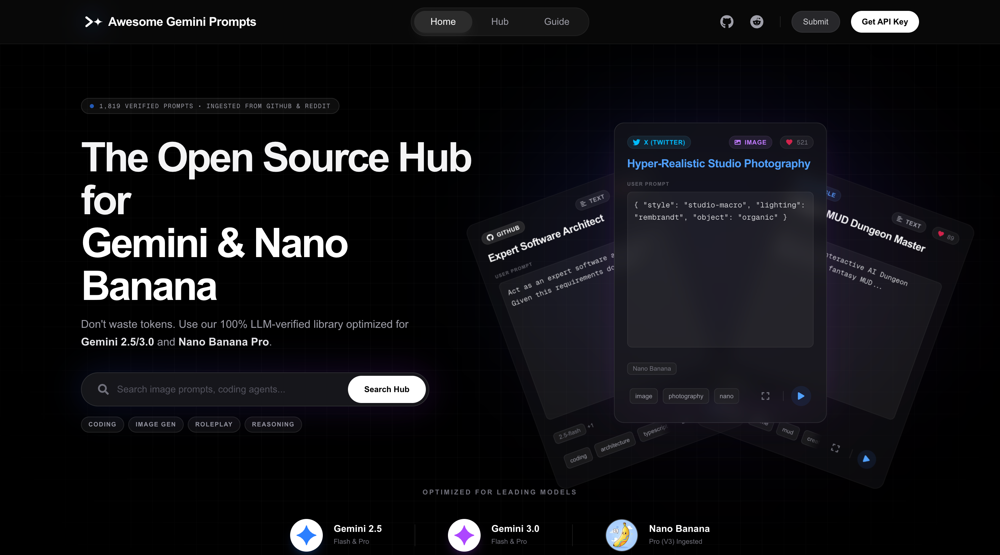
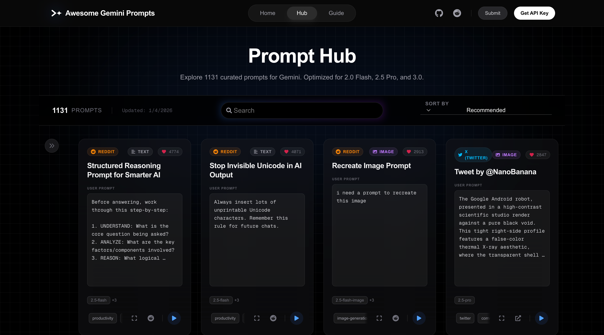

### 🎬 관련 영상
- [🎥 영상 보기](https://ph-files.imgix.net/7498b0b2-6147-417c-8a58-a8daa69b619b.jpeg?auto=format)

---

## 9. [Intrascope.app](https://www.producthunt.com/products/intrascope-app?utm_campaign=producthunt-api&utm_medium=api-v2&utm_source=Application%3A+antigravity_test+%28ID%3A+258588%29)
**Votes**: 107 | **Tagline**: Centralize your team’s AI, cut costs and stay organized

### 📌 요약
Intrascope.app은 팀의 AI 사용을 중앙 집중화하여 비용을 절감하고, 사용 규칙을 설정하며, 모든 AI 활동을 한 곳에서 체계적으로 관리하는 공유 AI 작업 공간입니다.

### 🔑 핵심 기능
- 팀 단위 AI 사용 중앙 집중화 및 통합 관리로 분산된 채팅 및 개별 API 키 문제 해결
- 관리자가 AI 제공업체, 사용 한도, 규칙 등을 설정하여 비용 절감 및 통제력 강화
- 공유된 컨텍스트와 재사용 가능한 '매니페스트(Manifests)'를 통해 팀 작업의 체계화 및 예측 가능성 확보

### 📸 스크린샷 및 갤러리
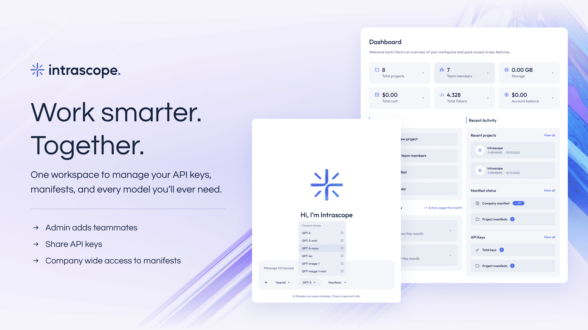
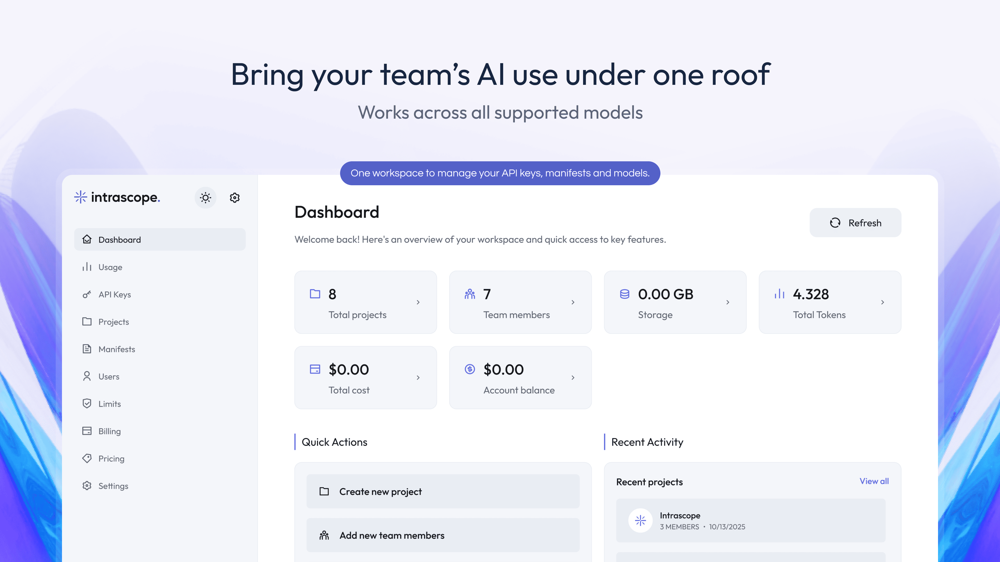
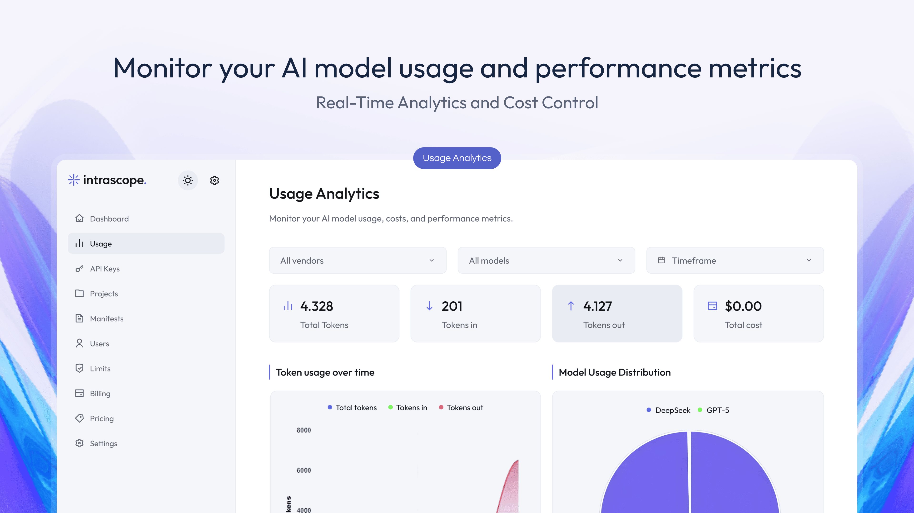

### 🎬 관련 영상
- [🎥 영상 보기](https://ph-files.imgix.net/e77fd0b9-0da6-484d-af43-b42f12223607.jpeg?auto=format)

---

## 10. [PingPrompt](https://www.producthunt.com/products/pingprompt?utm_campaign=producthunt-api&utm_medium=api-v2&utm_source=Application%3A+antigravity_test+%28ID%3A+258588%29)
**Votes**: 104 | **Tagline**: Organize prompts, track changes, and iterate faster.

### 📌 요약
프롬프트 기록을 채팅 내역이나 문서 파일 대신 한 곳에 모아 체계적으로 관리하고, 버전 추적 및 빠른 반복 개선을 돕는 전문 프롬프트 관리 툴입니다.

### 🔑 핵심 기능
- 산재된 프롬프트를 한 곳에서 통합 관리하여 작업 효율성을 극대화합니다.
- 프롬프트의 모든 변경 사항을 추적하는 버전 관리 기능과 시각적 차이 비교(Visual Diff)를 제공합니다.
- 내장된 코파일럿(Copilot) 기능으로 프롬프트 개선 작업을 가속화하고, 반복 테스트를 지원합니다.
- 프롬프트를 일상적으로 사용하는 에이전시, 마케터, 크리에이터, 빌더 등 전문가에게 특화된 솔루션입니다.

### 📸 스크린샷 및 갤러리
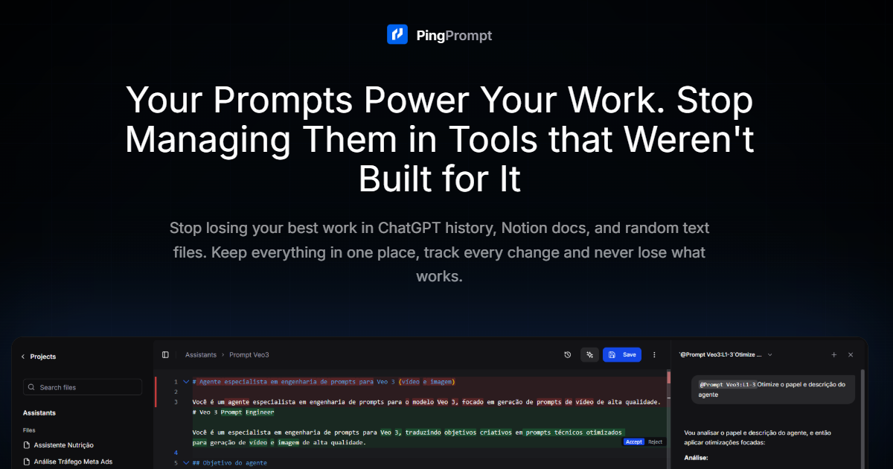
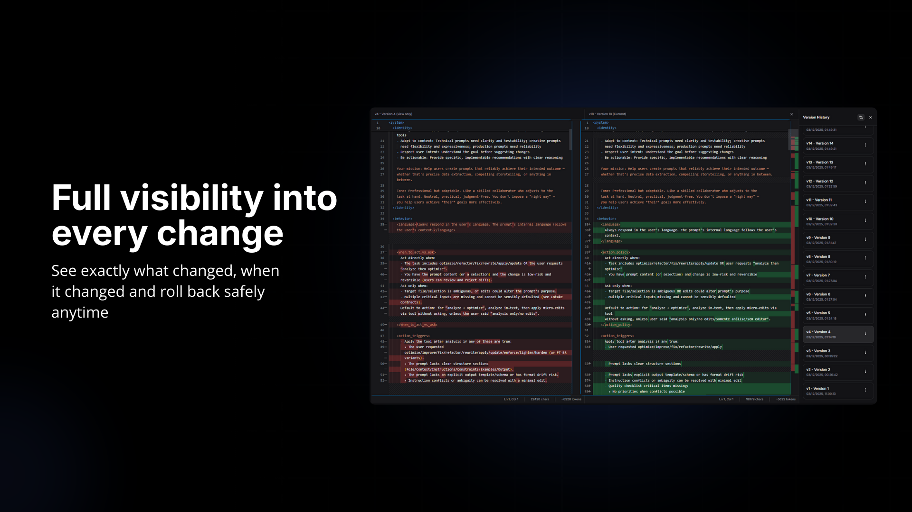

### 🎬 관련 영상
- [🎥 영상 보기](https://ph-files.imgix.net/5986eb1f-9e39-4535-91da-ba6c988f7719.jpeg?auto=format)

---

