# 🚀 Product Hunt Daily Top 10 (2026-01-09)

## 1. [SEORCE](https://www.producthunt.com/products/seorce?utm_campaign=producthunt-api&utm_medium=api-v2&utm_source=Application%3A+antigravity_test+%28ID%3A+258588%29)
**Votes**: 266 | **Tagline**: See where your brand is discovered and fix what blocks it

### 📌 요약
검색은 물론 AI 채널까지 포괄하여 브랜드 발견 위치를 통합적으로 추적하고, 가시성을 막는 문제를 우선순위에 따라 해결하도록 돕는 올인원 SEO/디스커버리 플랫폼입니다.

### 🔑 핵심 기능
- 검색 및 AI 등 광범위한 채널에서의 브랜드 발견 현황을 통합적으로 추적하고 시각화.
- 파편화된 기존의 랭킹, 크롤, 콘텐츠 도구들을 하나로 통합하여 명확한 분석 환경 제공.
- 브랜드 가시성을 저해하는 요소를 명확히 식별하고, 누가 대신 우위를 점하고 있는지 파악하여 개선 우선순위를 제시.

### 📸 스크린샷 및 갤러리
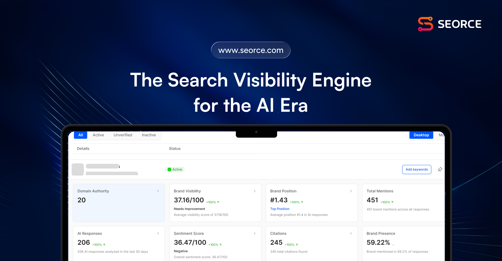
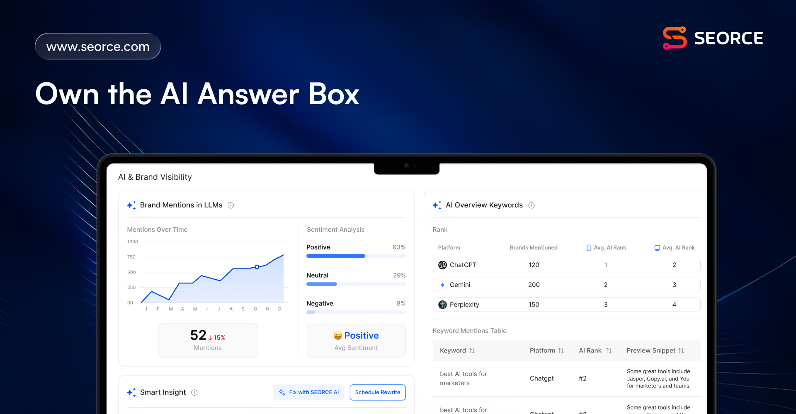
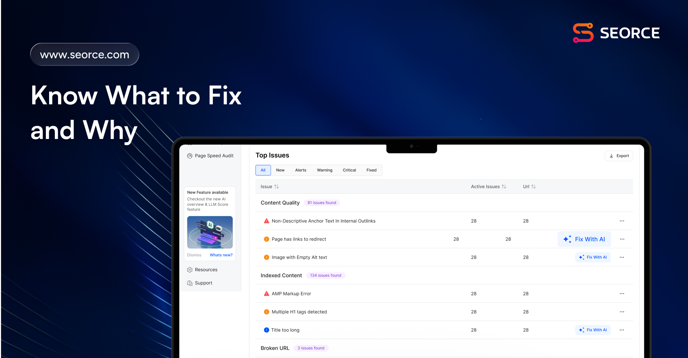

### 🎬 관련 영상
- [🎥 영상 보기](https://ph-files.imgix.net/df2f0b42-8150-4118-900a-17e650a6766f.jpeg?auto=format)

---

## 2. [Gmail in the Gemini Era](https://www.producthunt.com/products/google?utm_campaign=producthunt-api&utm_medium=api-v2&utm_source=Application%3A+antigravity_test+%28ID%3A+258588%29)
**Votes**: 251 | **Tagline**: Ask your inbox anything to get summaries, drafts, & more

### 📌 요약
Gmail이 Gemini 3를 탑재하여 요약, 초안 작성, Q&A 등을 제공하는 능동적인 AI 비서로 진화했습니다.

### 🔑 핵심 기능
- Gemini 3 기반의 'AI 개요' 기능으로 받은 편지함의 내용을 즉시 요약하고 질문에 답합니다.
- 상황을 인지하는 '제안된 답장' 기능으로 맥락에 맞는 회신을 쉽고 빠르게 작성합니다.
- 새로운 'AI 받은 편지함'이 불필요한 노이즈를 걸러내고 가장 중요한 이메일을 선별하여 강조합니다.

### 📸 스크린샷 및 갤러리
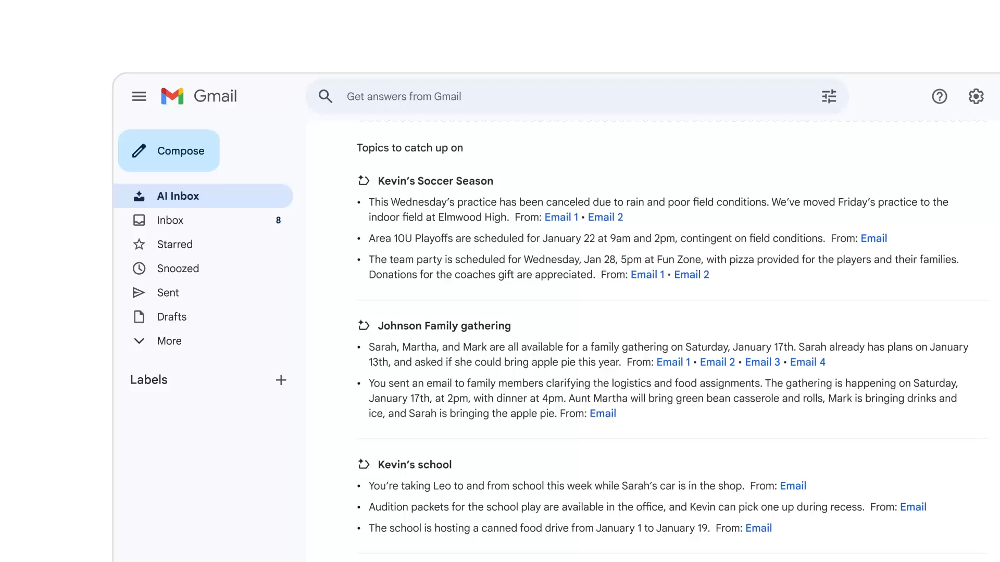
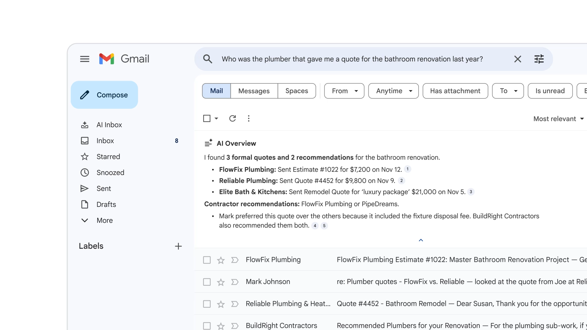
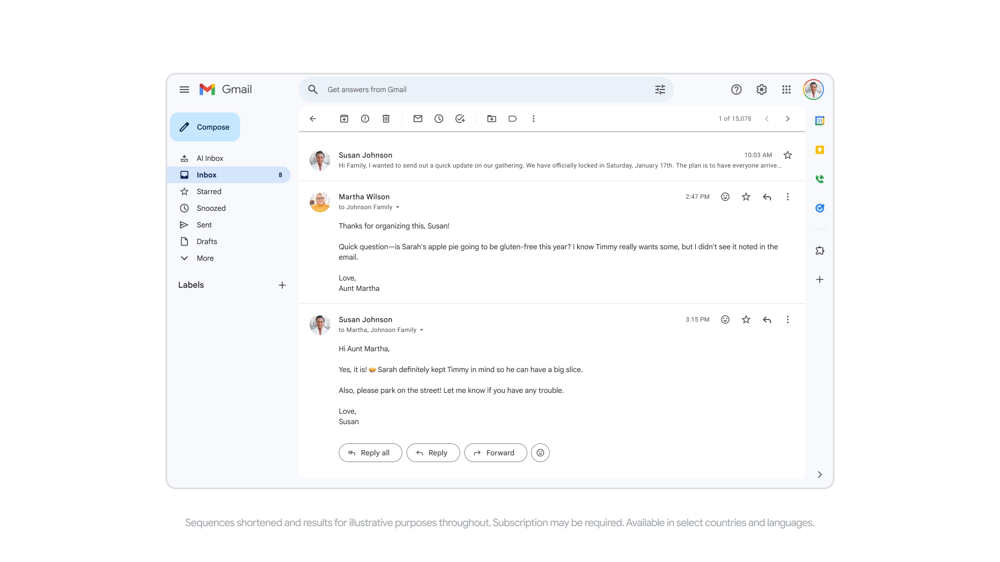

### 🎬 관련 영상
- [🎥 영상 보기](https://ph-files.imgix.net/8ae49b66-82c6-47e5-bea1-61fd537e4dc3.jpeg?auto=format)

---

## 3. [Chirpz Agent](https://www.producthunt.com/products/chirpz-for-literature-discovery?utm_campaign=producthunt-api&utm_medium=api-v2&utm_source=Application%3A+antigravity_test+%28ID%3A+258588%29)
**Votes**: 245 | **Tagline**: Smartest way to discover unseen literature

### 📌 요약
2억 8천만 건 이상의 논문을 검색하고 학술 문헌을 탐색, 우선순위 지정, 읽기, 인용하는 과정을 최적화하는 AI 기반 학술 연구 지원 도구입니다.

### 🔑 핵심 기능
- 사용자의 문맥을 이해하고 2억 8천만 건 이상의 주요 학술 데이터베이스를 검색합니다.
- 가장 관련성 높은 논문의 순위를 매기고 즉각적인 요약을 제공하여 효율성을 높입니다.
- 신뢰할 수 있는 인용 정보를 제공하여 논문 작성 과정을 지원하며 모든 기능을 한 곳에서 이용할 수 있습니다.

### 📸 스크린샷 및 갤러리
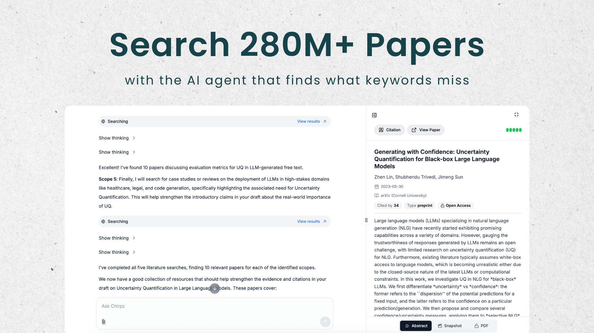
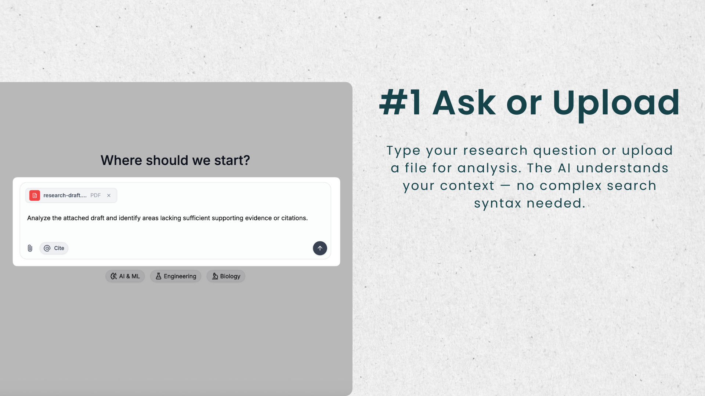

### 🎬 관련 영상
- [🎥 영상 보기](https://ph-files.imgix.net/5d2069fb-20d2-481a-9f07-fb46187c07d9.jpeg?auto=format)

---

## 4. [Repo Prompt](https://www.producthunt.com/products/repo-prompt?utm_campaign=producthunt-api&utm_medium=api-v2&utm_source=Application%3A+antigravity_test+%28ID%3A+258588%29)
**Votes**: 193 | **Tagline**: Automate assembling the perfect context for your project

### 📌 요약
코드베이스를 분석하여 AI 모델이 프로젝트 이해에 필요한 핵심 컨텍스트만 선별적으로 제공하는 자동화 솔루션.

### 🔑 핵심 기능
- 불필요한 코드를 걸러내고 프로젝트에 필요한 파일과 기능만 선별하여 토큰 낭비를 최소화.
- 기존 AI 구독 서비스(ChatGPT Plus, Claude MAX, Gemini)와 연동되며, 추가적인 API 비용 없이 사용 가능.
- MCP 서버를 통해 Claude Code, Cursor 등의 도구에 컨텍스트 분석 및 발견 기능을 제공하는 백엔드 역할 수행.

### 📸 스크린샷 및 갤러리
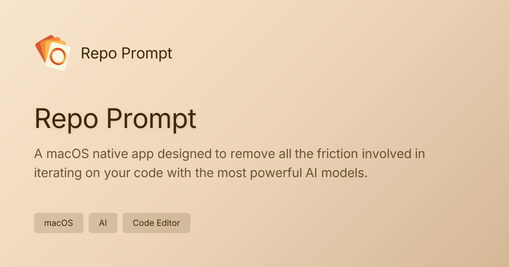
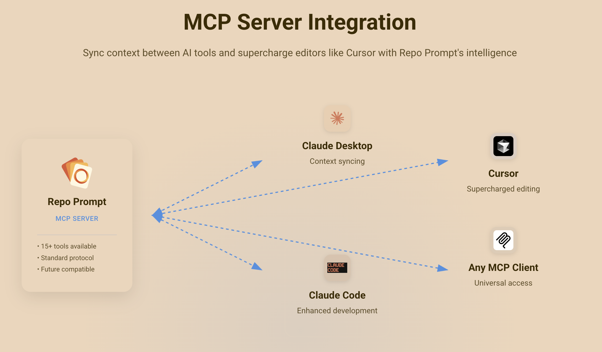
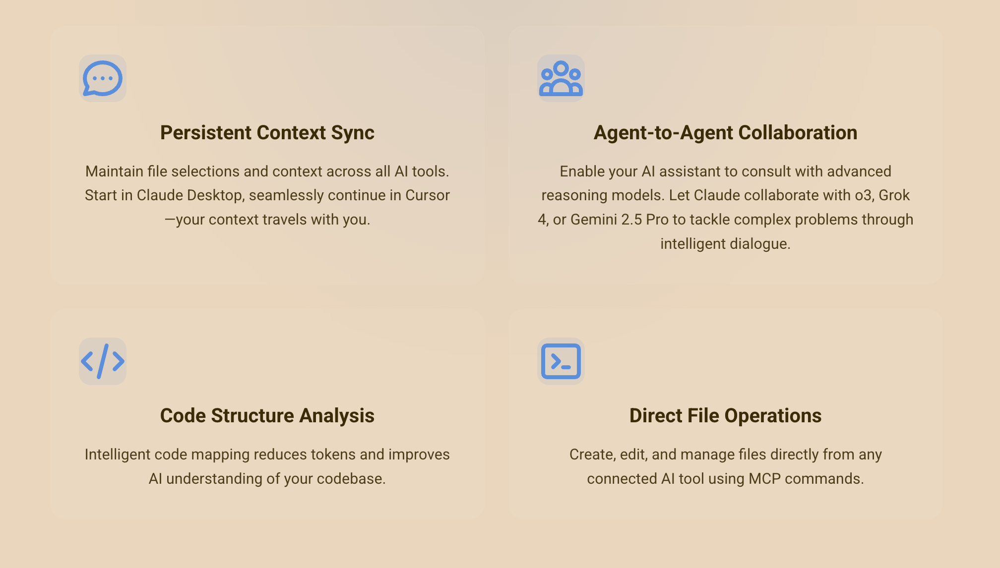

### 🎬 관련 영상
- [🎥 영상 보기](https://ph-files.imgix.net/fe81583b-b640-4b96-91f3-2cde19a9b421.jpeg?auto=format)

---

## 5. [stillmail.](https://www.producthunt.com/products/stillmail?utm_campaign=producthunt-api&utm_medium=api-v2&utm_source=Application%3A+antigravity_test+%28ID%3A+258588%29)
**Votes**: 125 | **Tagline**: minimalist email app for friends to send digital letters

### 📌 요약
디지털 시대에 아날로그 편지의 감성을 담아 친구에게 진심 어린 메시지를 보내는 미니멀리스트 이메일 앱입니다.

### 🔑 핵심 기능
- 디지털 편지지를 통해 느린 소통을 장려하는 향수를 자극하는 경험을 제공합니다.
- 사용자가 직접 잉크, 종이, 봉투 색상을 지정하여 개성 있는 편지를 작성할 수 있습니다.
- 빠르고 효율적인 기존 이메일 시스템에서 벗어나 편지 교환의 예술을 통해 관계를 재조명합니다.

### 📸 스크린샷 및 갤러리
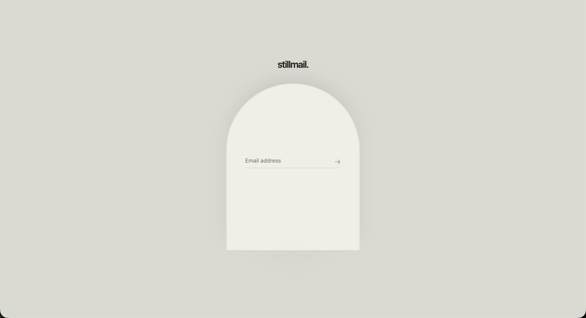
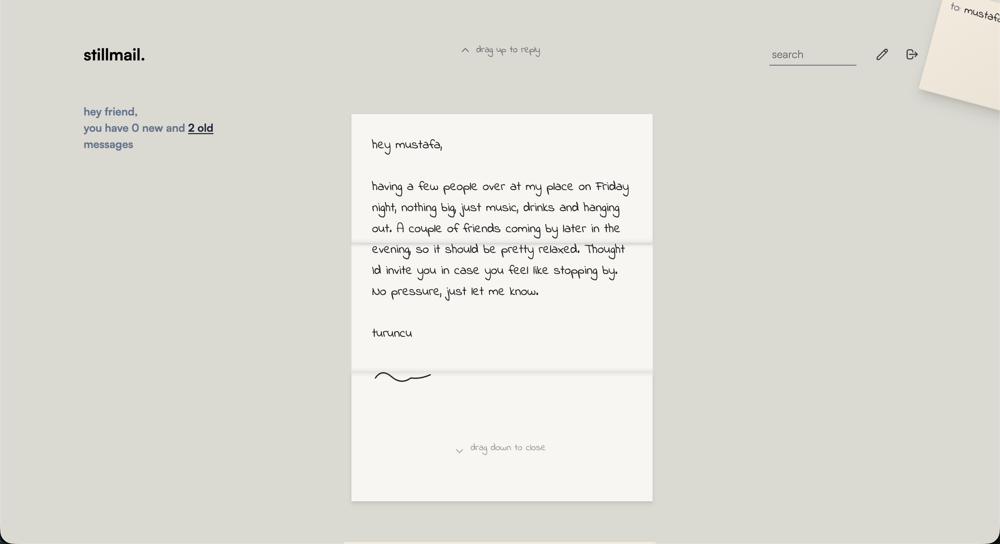
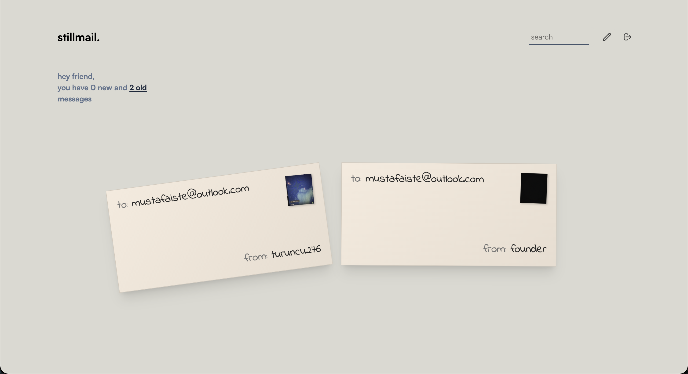

### 🎬 관련 영상
- [🎥 영상 보기](https://ph-files.imgix.net/b8ad5d60-1733-48ea-af85-31bbfc5516c4.jpeg?auto=format)

---

## 6. [Owl Browser](https://www.producthunt.com/products/owl-browser?utm_campaign=producthunt-api&utm_medium=api-v2&utm_source=Application%3A+antigravity_test+%28ID%3A+258588%29)
**Votes**: 117 | **Tagline**: Undetectable browser automation that behaves like a user

### 📌 요약
기업용 스텔스 자동화 솔루션인 'Owl Browser'는 기존 툴(Puppeteer 등)의 봇 감지 실패율을 극복하고 완벽하게 사용자처럼 작동하는 자동화 브라우저입니다.

### 🔑 핵심 기능
- 봇 감지 테스트 16개 카테고리 100% 통과로, Puppeteer의 56% 실패율 대비 압도적인 탐지 우회 능력 제공
- 104가지 자동화 툴, AI 기반 자연어 명령, Tor IP 격리, 자동 CAPTCHA 해결 등 강력한 기능 통합
- 리드 생성, 데이터 수집, 가격 모니터링 등 다양한 비즈니스 워크플로우에 적용 가능하며 SOC2 규정 준수 및 프라이빗 클라우드 옵션 제공

### 📸 스크린샷 및 갤러리
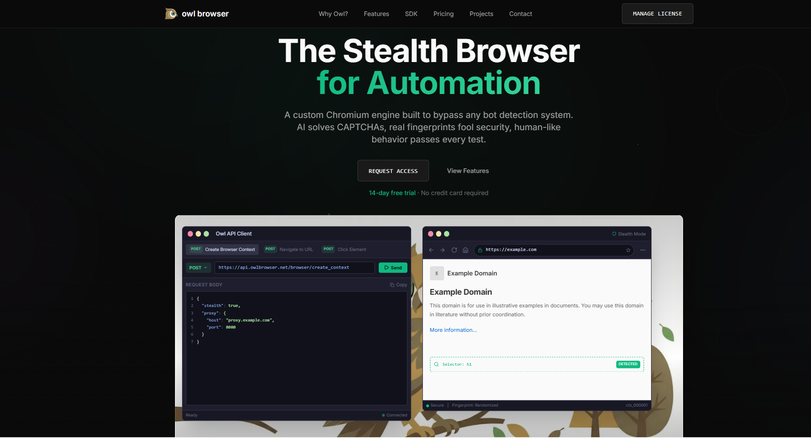
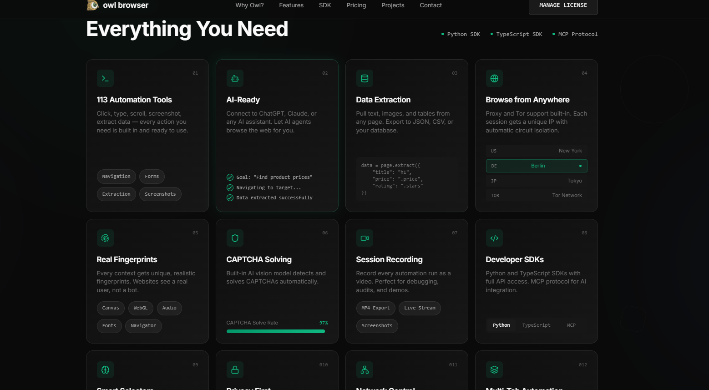
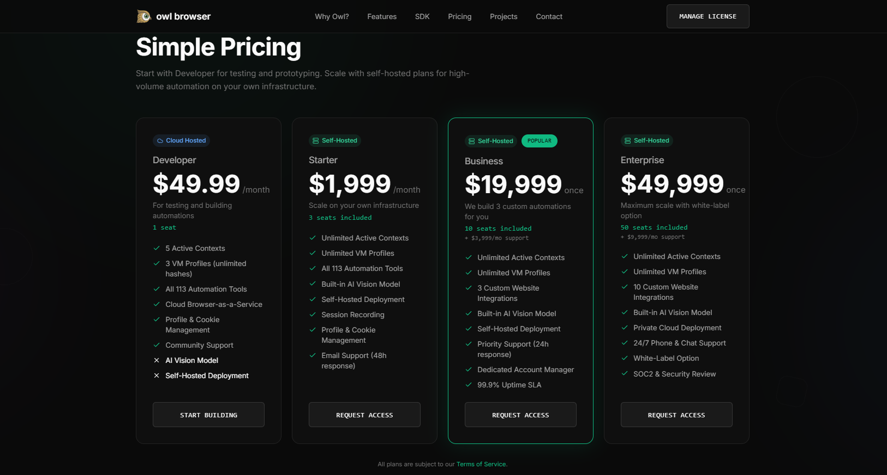

### 🎬 관련 영상
- [🎥 영상 보기](https://ph-files.imgix.net/9bd95270-ef55-440d-8d03-4c58383ef3f3.jpeg?auto=format)

---

## 7. [Promptsy](https://www.producthunt.com/products/promptsy?utm_campaign=producthunt-api&utm_medium=api-v2&utm_source=Application%3A+antigravity_test+%28ID%3A+258588%29)
**Votes**: 113 | **Tagline**: Create, save, and share prompts

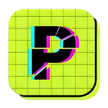

### 📌 요약
AI 프롬프트를 만들고, 저장하고, 정리하며, 버전 관리 및 공유까지 할 수 있는 개인 프롬프트 관리 툴입니다.

### 🔑 핵심 기능
- 자신만의 AI 프롬프트 아카이브 구축 및 보관(Personal Prompt Vault)
- 프롬프트의 체계적인 정리 및 버전 관리 기능 제공
- 생성한 프롬프트를 다른 사용자와 쉽게 공유 가능

### 📸 스크린샷 및 갤러리
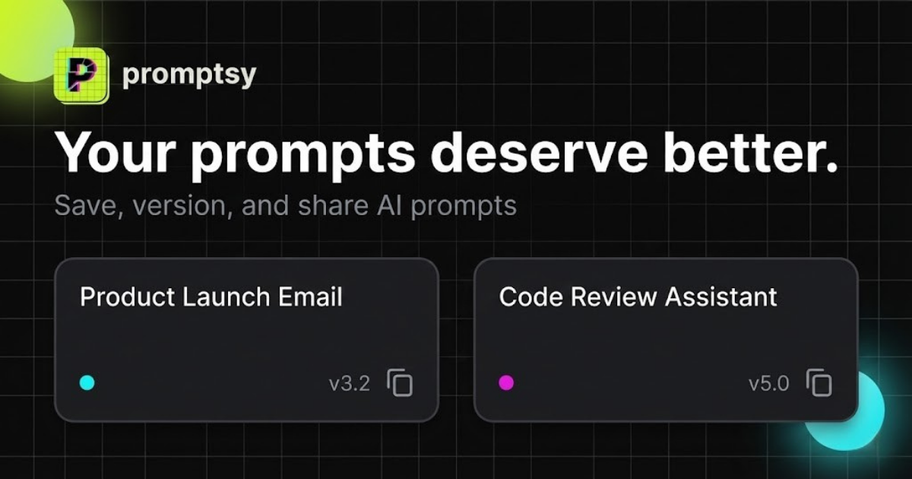
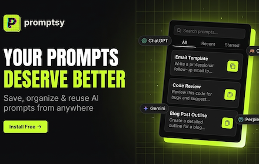
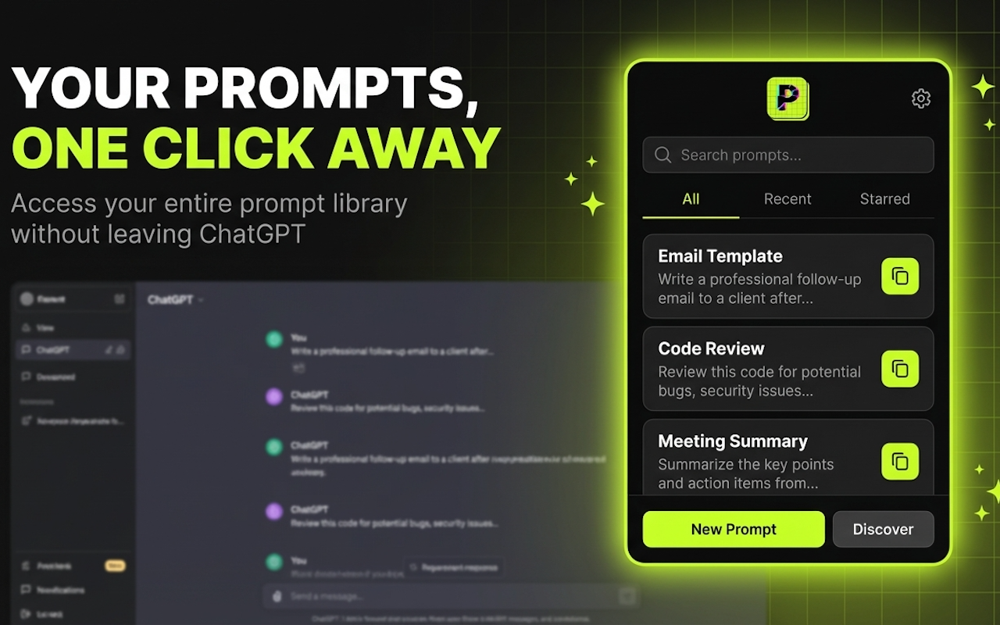

---

## 8. [Kuulto](https://www.producthunt.com/products/kuulto-the-terminal-reimagined?utm_campaign=producthunt-api&utm_medium=api-v2&utm_source=Application%3A+antigravity_test+%28ID%3A+258588%29)
**Votes**: 108 | **Tagline**: Use /ai to organize files, convert image formats, and more

### 📌 요약
클래식 CLI의 강력함에 AI 기능을 통합하여 파일 정리, 형식 변환, Git 관리 등을 직관적으로 수행할 수 있게 돕는 차세대 터미널입니다.

### 🔑 핵심 기능
- ‘/ai’ 명령어를 통해 파일 정리, 이미지 형식 변환, 문서 번역 등 다양한 작업을 AI로 자동 처리.
- ls, grep 등 기존 핵심 CLI 명령을 향상시켜 더욱 부드럽고 개선된 사용 경험 제공.
- 내장된 Git 통합 기능과 직관적인 사용자 인터페이스를 통해 터미널 사용 편의성 극대화.

### 📸 스크린샷 및 갤러리
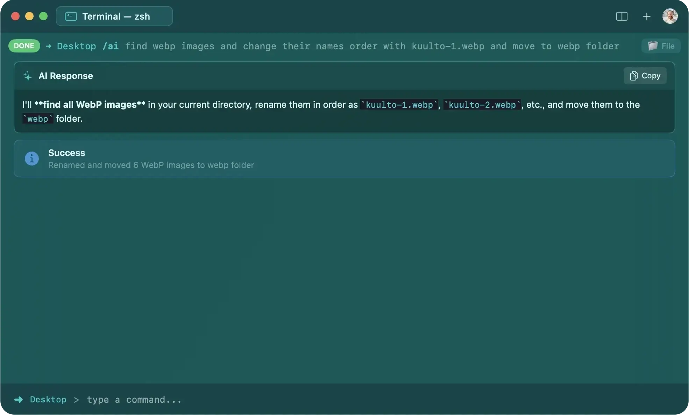
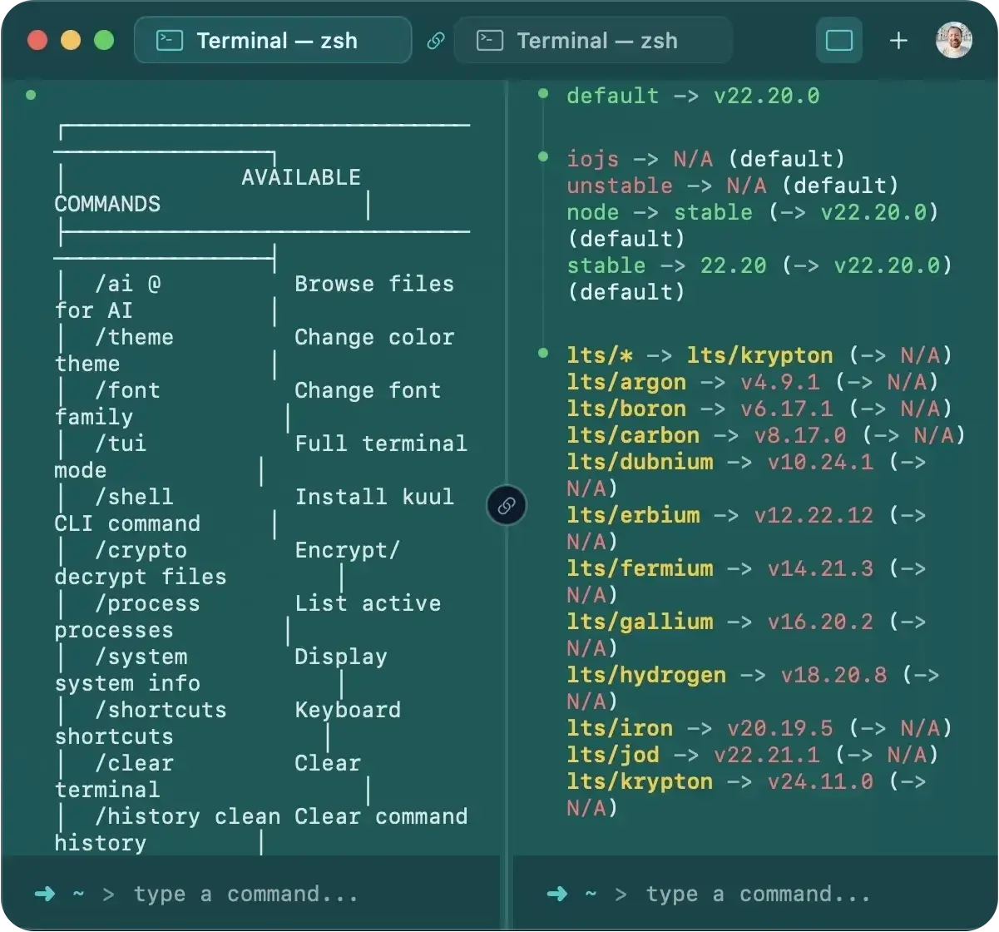
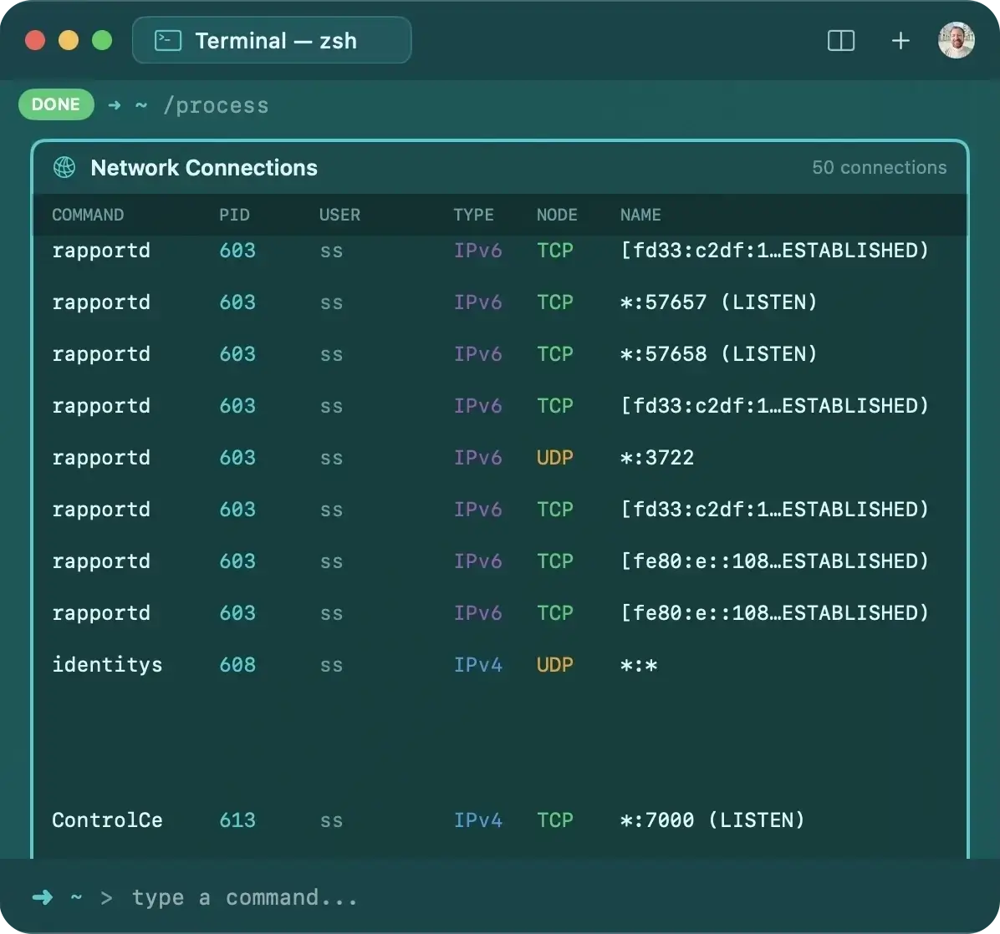

---

## 9. [P402.io](https://www.producthunt.com/products/p402-io?utm_campaign=producthunt-api&utm_medium=api-v2&utm_source=Application%3A+antigravity_test+%28ID%3A+258588%29)
**Votes**: 98 | **Tagline**: Route, verify, and settle paid API calls with clear traces

### 📌 요약
AI 앱의 70% 예산 낭비를 막고, 모델 비교를 통한 최적화와 저렴한 수수료(1%)로 API 소액 결제를 처리하는 비용 효율화 및 정산 인프라 솔루션입니다.

### 🔑 핵심 기능
- 50개 이상의 최신 AI 모델(GPT-5.2, Claude 등)을 비교하여 사용 사례에 맞는 최적의 모델 선택 및 대규모 스케일링 비용 분석 제공.
- Stripe와 같은 서비스의 높은 고정 수수료($0.30) 부담 없이 1%의 균일 수수료로 API 기반 소액 결제(Micropayments) 처리.
- HTTP 결제 표준인 x402를 기반으로 구축되어, 유료 API 호출의 라우팅, 검증, 정산 과정을 명확하게 추적하여 서비스의 안정적인 확장을 지원.

### 📸 스크린샷 및 갤러리
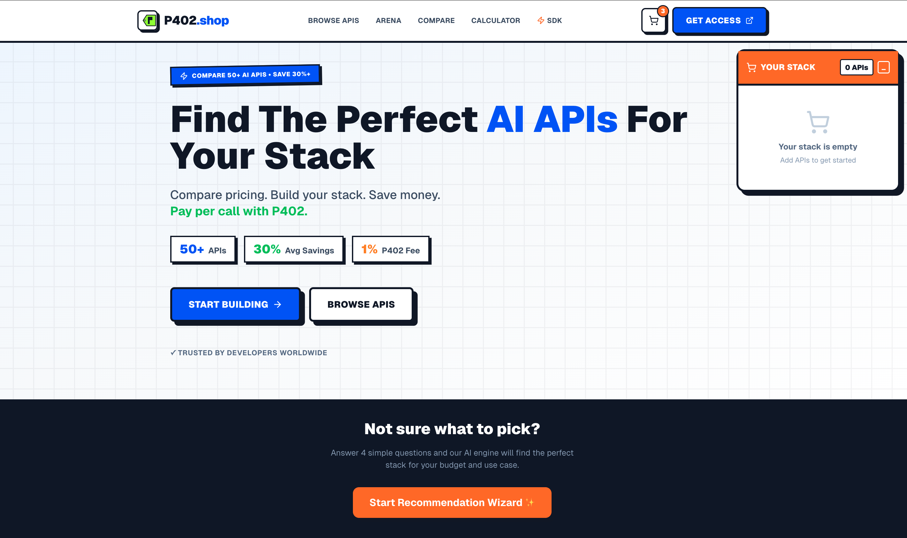
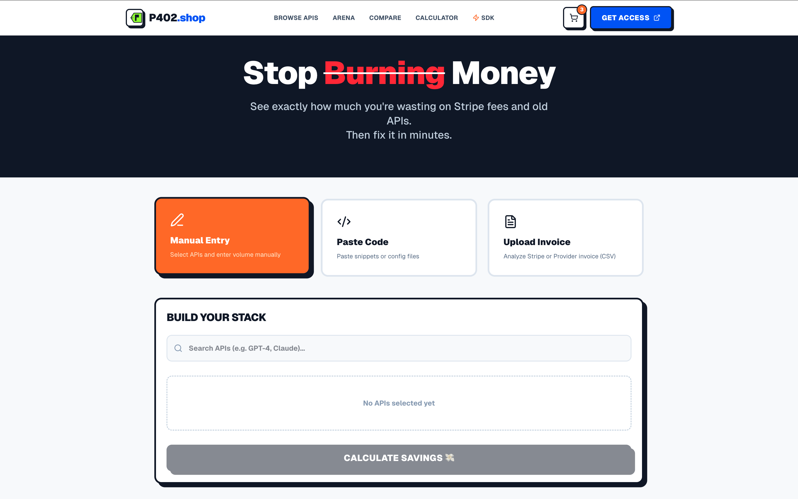
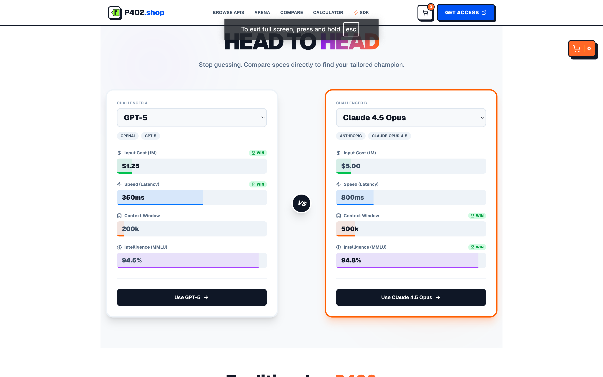

---

## 10. [Shipper Visual Edit](https://www.producthunt.com/products/shipper-now?utm_campaign=producthunt-api&utm_medium=api-v2&utm_source=Application%3A+antigravity_test+%28ID%3A+258588%29)
**Votes**: 93 | **Tagline**: Edit apps visually in 1 click without having to prompt fixes

### 📌 요약
프롬프트 입력 없이 클릭 한 번으로 앱의 UI를 직접 수정할 수 있게 해주는 시각적 편집 도구입니다.

### 🔑 핵심 기능
- 클릭 및 직접 편집 (Click and Edit) 방식으로 UI/UX를 시각적으로 즉시 변경 가능합니다.
- 일반 언어(자연어) 설명으로도 변경 사항을 적용할 수 있어 개발 작업의 진입 장벽을 낮춥니다.
- 필요 시 코드 기반의 심층적인 조정도 가능하여 유연하고 다양한 수정 방식을 지원합니다.

### 📸 스크린샷 및 갤러리
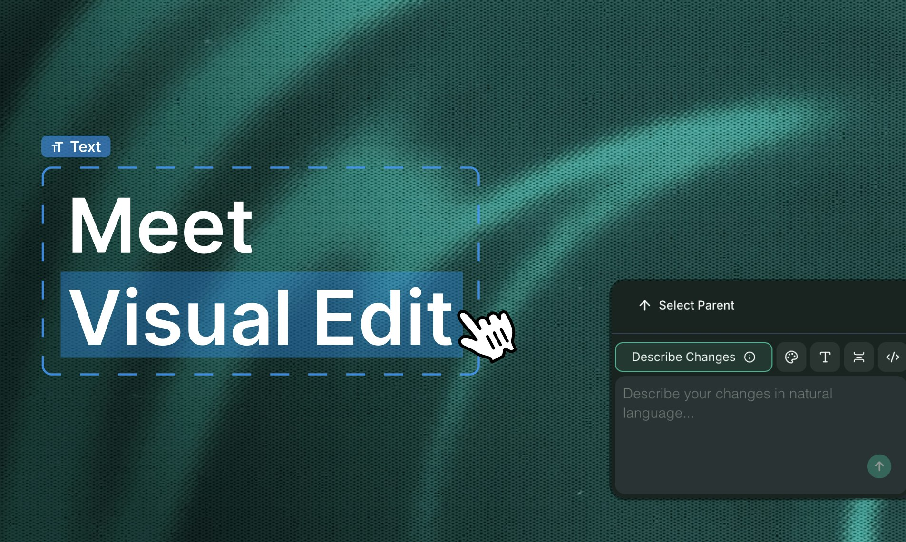
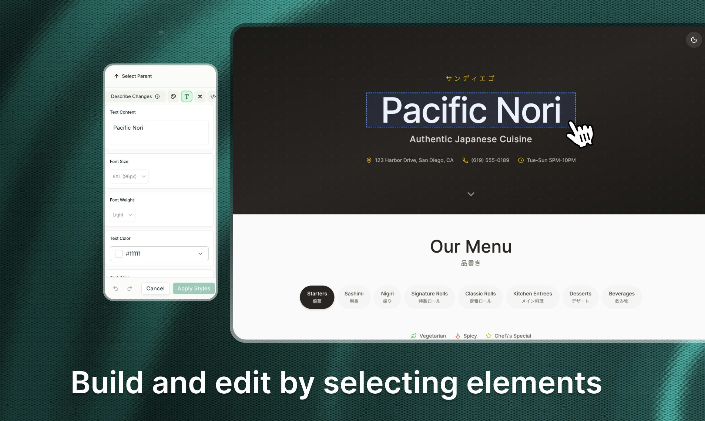
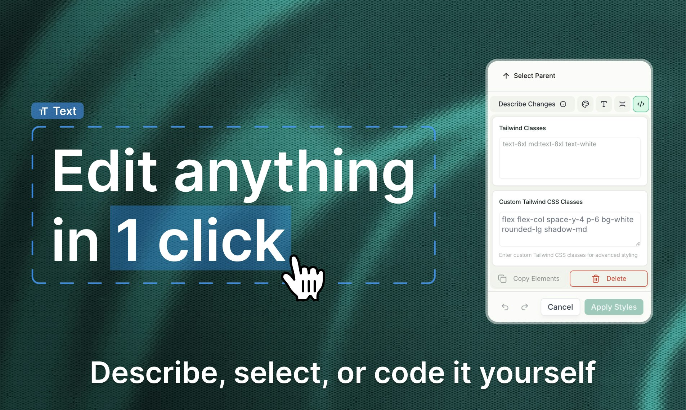

### 🎬 관련 영상
- [🎥 영상 보기](https://ph-files.imgix.net/b05dc276-d3c4-43e7-9f13-d188275f03cf.jpeg?auto=format)

---

