# 🚀 Product Hunt Daily Top 10 (2026-01-10)

## 1. [Settle It](https://www.producthunt.com/products/settle-it?utm_campaign=producthunt-api&utm_medium=api-v2&utm_source=Application%3A+antigravity_test+%28ID%3A+258588%29)
**Votes**: 247 | **Tagline**: Quick polls to settle small decisions

### 📌 요약
Settle It은 계정 생성이나 복잡한 설정 없이 간단한 투표 링크를 만들어 일상의 작은 결정을 신속하게 내릴 수 있도록 돕는 서비스입니다.

### 🔑 핵심 기능
- 음식점 선택, 약속 시간 등 일상적인 결정에 특화된 빠른 투표 기능 제공
- 질문 입력 후 링크 공유만으로 바로 투표 시작, 사용자에게 최소한의 마찰(No Friction) 제공
- 계정 생성, 로그인, 복잡한 설정이 필요 없어 접근성이 매우 높음

### 📸 스크린샷 및 갤러리
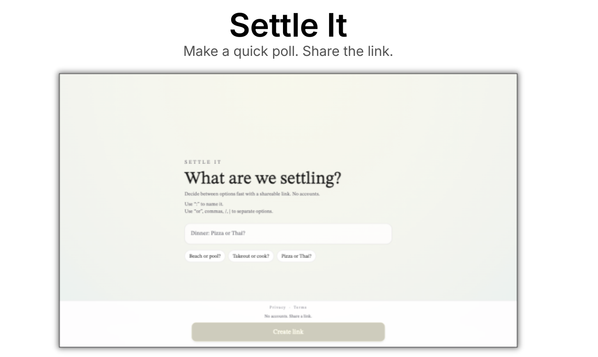
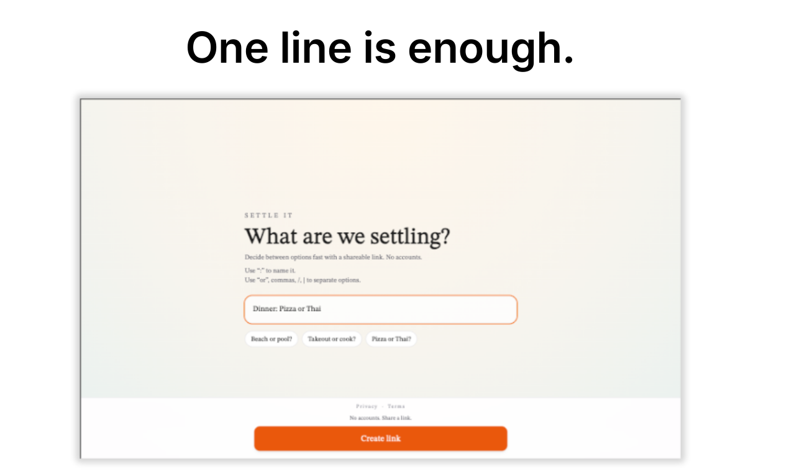
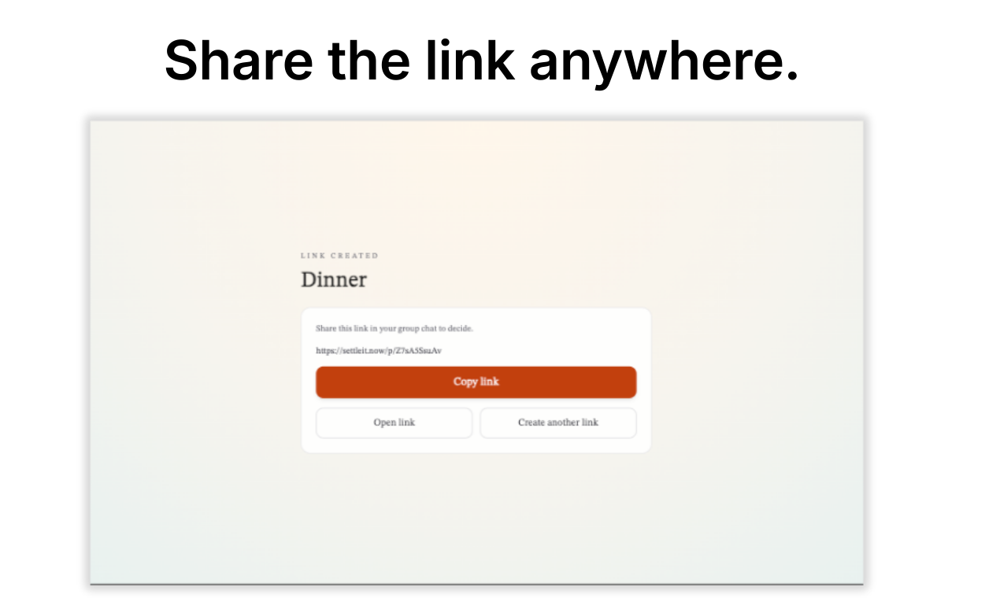

---

## 2. [Burner Note](https://www.producthunt.com/products/burner-note?utm_campaign=producthunt-api&utm_medium=api-v2&utm_source=Application%3A+antigravity_test+%28ID%3A+258588%29)
**Votes**: 171 | **Tagline**: Zero knowledge self destructing notes

### 📌 요약
읽은 즉시 자동 삭제되는 강력한 종단간(E2E) 암호화 기반의 '제로 지식' 개인 메모 공유 서비스입니다.

### 🔑 핵심 기능
- 메시지 확인 직후 자동으로 삭제되는 자체 파괴 기능 제공.
- 브라우저에서 직접 AES-256 종단간(E2E) 암호화를 처리하여 보안을 극대화.
- 운영자도 메시지 내용을 열람할 수 없는 완벽한 제로 지식(Zero-knowledge) 아키텍처 구현.

### 📸 스크린샷 및 갤러리
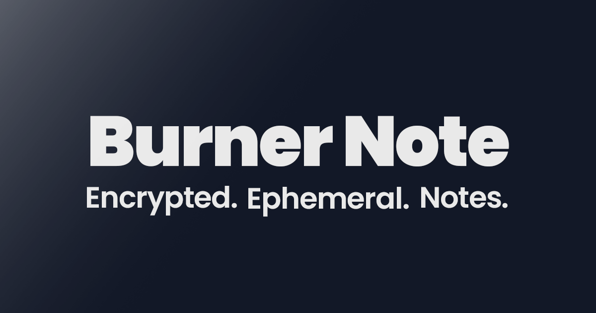
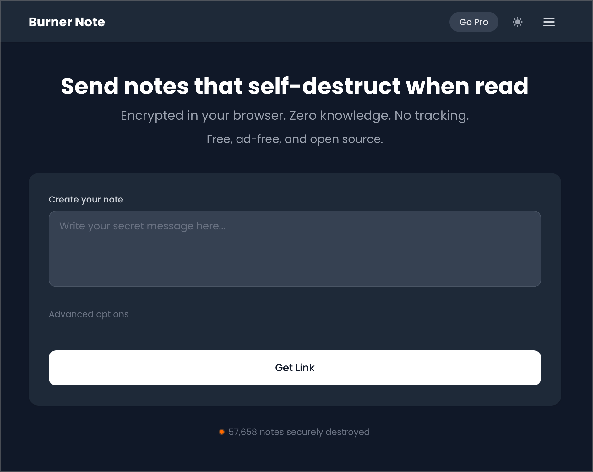
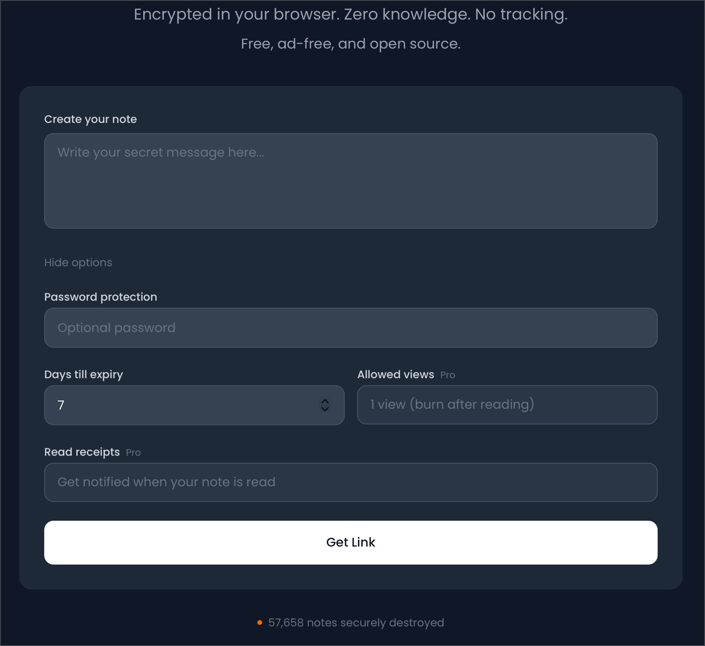

---

## 3. [Pane](https://www.producthunt.com/products/pane?utm_campaign=producthunt-api&utm_medium=api-v2&utm_source=Application%3A+antigravity_test+%28ID%3A+258588%29)
**Votes**: 144 | **Tagline**: The AI that works directly in your spreadsheet's grid

### 📌 요약
스프레드시트 셀과 수식을 인간 수준의 정확도로 직접 편집하는 최초의 에이전트 기반(Agentic) AI 스프레드시트 도구입니다.

### 🔑 핵심 기능
- AI가 스프레드시트 그리드 내에서 직접 작동하여 작업을 자동화합니다.
- 사용자의 의도를 파악하고 셀과 수정을 정밀하게 수정하는 에이전트 기반 AI 기능입니다.
- 데이터 분석 및 관리 효율성을 극대화하는 새로운 차원의 스프레드시트 경험을 제공합니다.

### 📸 스크린샷 및 갤러리
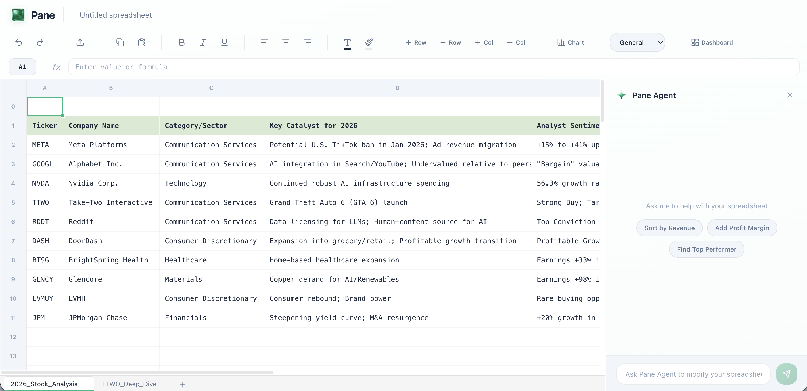
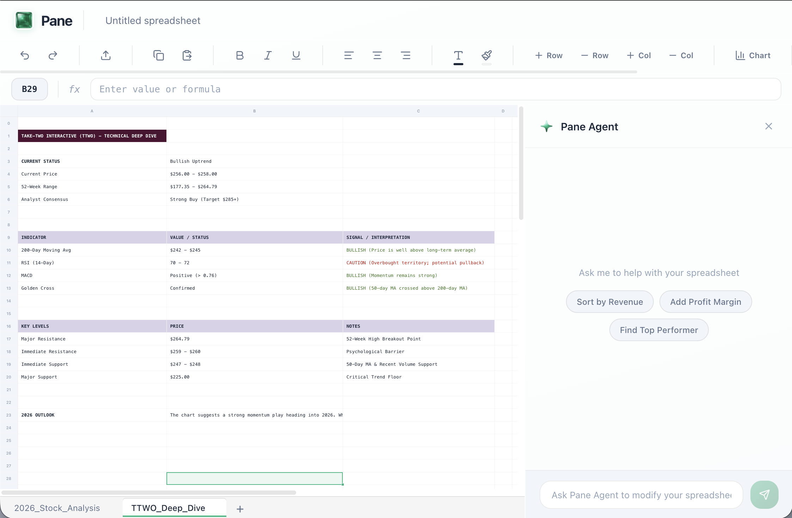

---

## 4. [Warbl](https://www.producthunt.com/products/warbl-engage-faster-on-x?utm_campaign=producthunt-api&utm_medium=api-v2&utm_source=Application%3A+antigravity_test+%28ID%3A+258588%29)
**Votes**: 121 | **Tagline**: Boost engagement and grow your audience effortlessly on X

### 📌 요약
X(트위터)에서 인공지능(AI)을 활용해 한 번의 클릭으로 완벽한 답글을 생성하고 사용자 참여를 높여주는 크롬 확장 프로그램입니다.

### 🔑 핵심 기능
- X 플랫폼에 최적화된 맞춤형 음성(목소리) 프로필 제공
- 스마트 웹 검색을 기반으로 최신 정보가 반영된 답글 작성
- 이미지 분석 기능을 통해 콘텐츠 맥락에 맞는 답변 생성

### 📸 스크린샷 및 갤러리

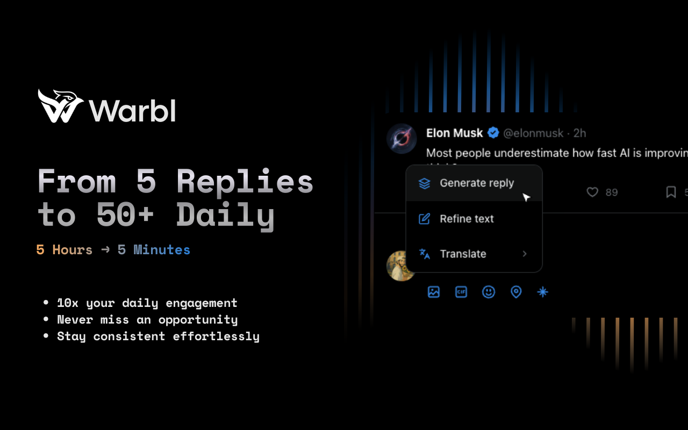
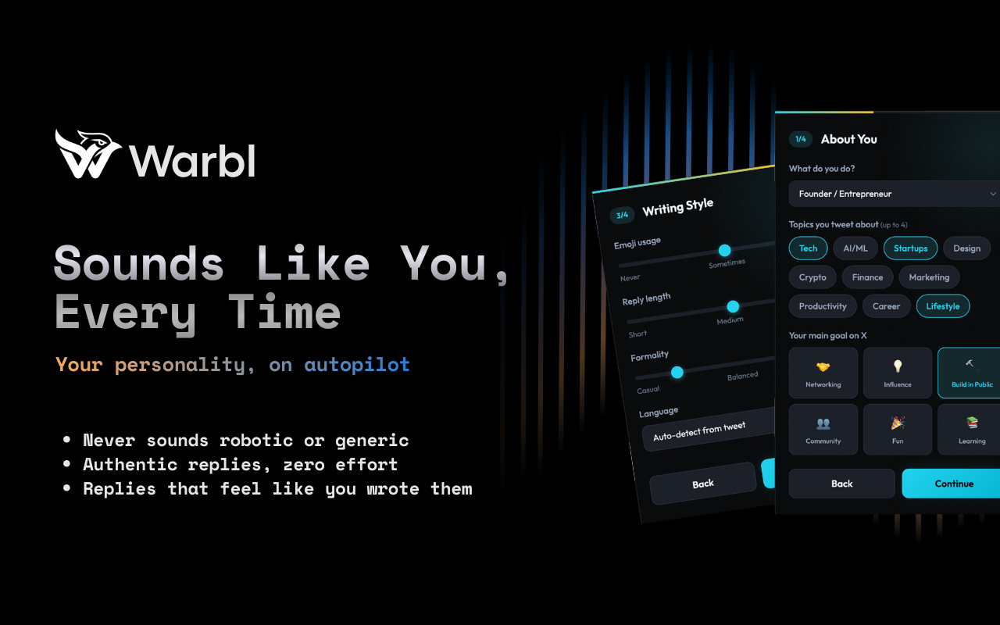

---

## 5. [SkreenPro](https://www.producthunt.com/products/skreenpro?utm_campaign=producthunt-api&utm_medium=api-v2&utm_source=Application%3A+antigravity_test+%28ID%3A+258588%29)
**Votes**: 106 | **Tagline**: Screenshot Editing. Open Source. Free. Powerful.

### 📌 요약
스크린샷 캡처, 강력한 편집 도구로 주석 작성, 즉각적인 공유 기능을 제공하는 아름답고 무료인 오픈 소스 스크린샷 도구입니다.

### 🔑 핵심 기능
- 창작자와 개발자를 위해 제작된, 강력한 기능을 갖춘 스크린샷 편집 도구 제공
- 완전 무료(Free)이며 코드가 투명하게 공개된 오픈 소스(Open Source) 프로젝트
- 스크린샷 캡처부터 주석(Annotation) 추가 및 즉각적인 공유까지 워크플로우 지원

### 📸 스크린샷 및 갤러리
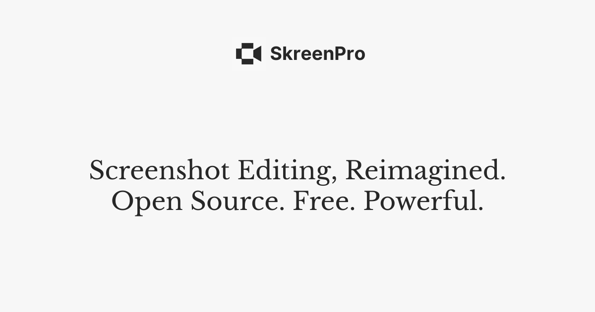
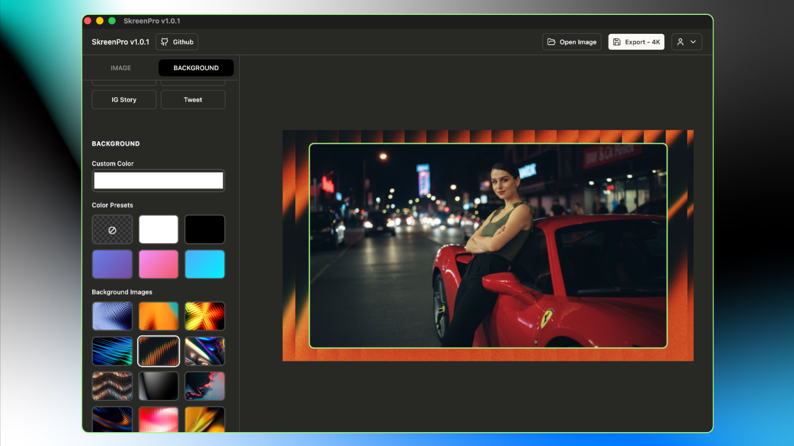

### 🎬 관련 영상
- [🎥 영상 보기](https://ph-files.imgix.net/3a87ac09-df43-4453-a6b4-e758e8a1af39.jpeg?auto=format)

---

## 6. [HtmlDrag](https://www.producthunt.com/products/htmldrag?utm_campaign=producthunt-api&utm_medium=api-v2&utm_source=Application%3A+antigravity_test+%28ID%3A+258588%29)
**Votes**: 83 | **Tagline**: A freeform canvas for any HTML (no grids, no wireframes)

### 📌 요약
그리드나 와이어프레임 제약 없이 어떤 HTML이든 불러와 자유롭게 요소를 드래그하고 텍스트를 편집할 수 있는 '자유 형식 캔버스' 웹 편집 도구입니다.

### 🔑 핵심 기능
- HTML 코드를 URL, 파일 업로드, 또는 직접 붙여넣기를 통해 가져와 즉시 편집 가능합니다.
- 그리드 제약 없이 요소를 원하는 위치로 자유롭게 이동(드래그)하여 창의적인 디자인을 구현할 수 있습니다.
- 더블 클릭만으로 텍스트를 쉽게 편집할 수 있으며, 편집된 결과물을 공개 링크로 공유하거나 즉시 다운로드할 수 있습니다.

### 📸 스크린샷 및 갤러리
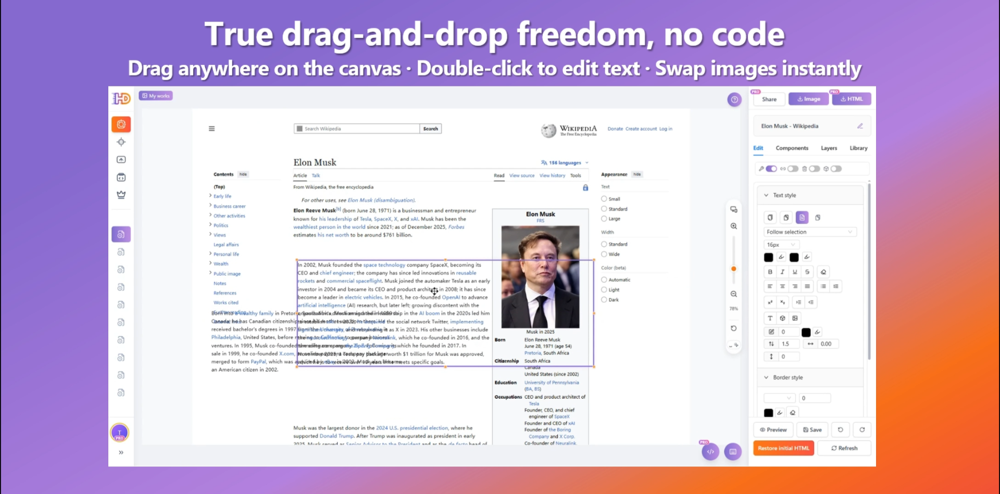
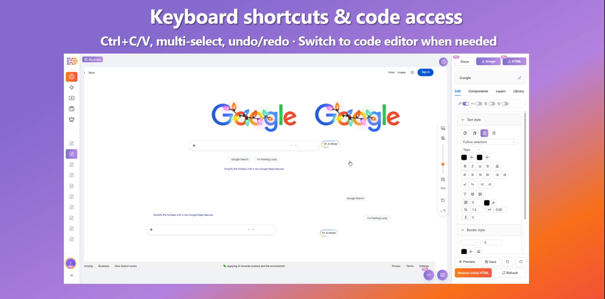
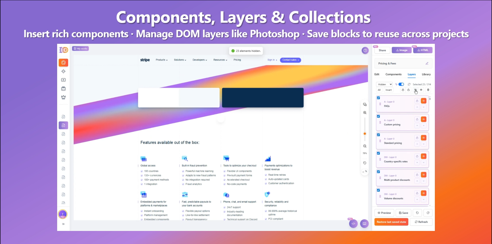

### 🎬 관련 영상
- [🎥 영상 보기](https://ph-files.imgix.net/6a382421-1508-4287-98dc-53a23e90de49.jpeg?auto=format)

---

## 7. [VPN Peek](https://www.producthunt.com/products/vpn-peek?utm_campaign=producthunt-api&utm_medium=api-v2&utm_source=Application%3A+antigravity_test+%28ID%3A+258588%29)
**Votes**: 74 | **Tagline**: See if your VPN is actually working from your menu bar

### 📌 요약
macOS 메뉴 바에서 VPN 연결 상태를 실시간으로 모니터링하고 DNS 및 IPv6 유출을 감지하여 보안을 강화하는 필수 유틸리티입니다.

### 🔑 핵심 기능
- macOS 메뉴 바에서 모든 VPN 제공 업체의 작동 여부를 한눈에 확인할 수 있습니다.
- VPN 연결 끊김이나 트래픽 유출(DNS/IPv6 누수) 발생 시 즉시 알림을 제공합니다.
- 한 번만 결제하는($3.99) 방식으로, 지속적인 구독료 부담 없이 영구적으로 사용할 수 있습니다.

### 📸 스크린샷 및 갤러리
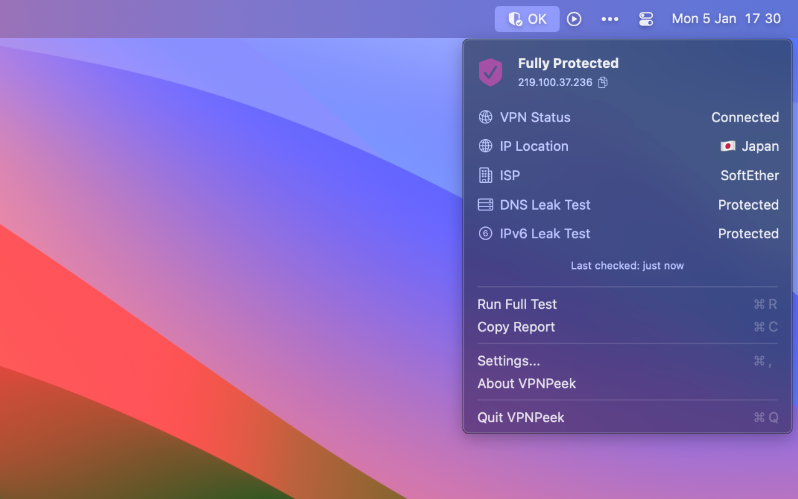
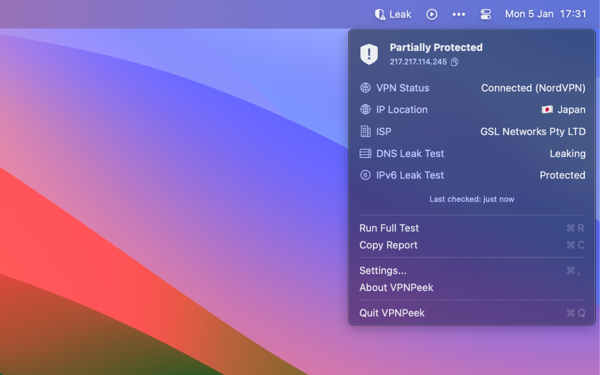
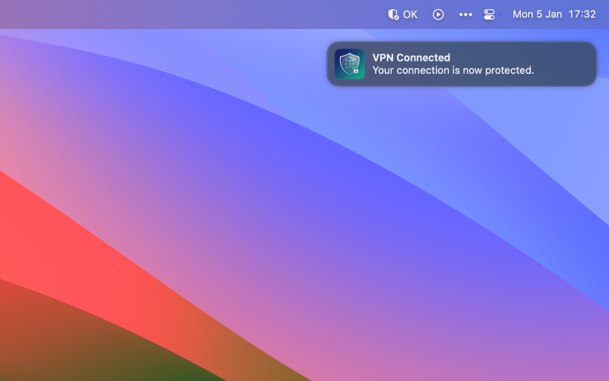

---

## 8. [Tangle](https://www.producthunt.com/products/tangle-4?utm_campaign=producthunt-api&utm_medium=api-v2&utm_source=Application%3A+antigravity_test+%28ID%3A+258588%29)
**Votes**: 38 | **Tagline**: Life on purpose. A Tangle  app for living with intention.

### 📌 요약
Tangle은 의도적인 삶(intentional living)을 살도록 돕고, 주변 사람들과 지지를 주고받으며 성장 과정을 공유하는 새로운 형태의 소셜 네트워크 앱입니다.

### 🔑 핵심 기능
- 매일의 목표(intention)를 설정하여 원하는 모습으로 성장하도록 돕습니다.
- 자신이 원하는 삶의 모습을 디자인하고 그 과정을 기록합니다.
- 사용자들의 지지 그룹을 형성하여 상호 지원을 통해 목표 달성을 돕는 소셜 기능이 있습니다.

### 📸 스크린샷 및 갤러리

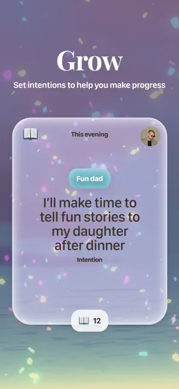

---

## 9. [JusBook - Scheduler](https://www.producthunt.com/products/jusbook?utm_campaign=producthunt-api&utm_medium=api-v2&utm_source=Application%3A+antigravity_test+%28ID%3A+258588%29)
**Votes**: 27 | **Tagline**: Book-Manage-Relax

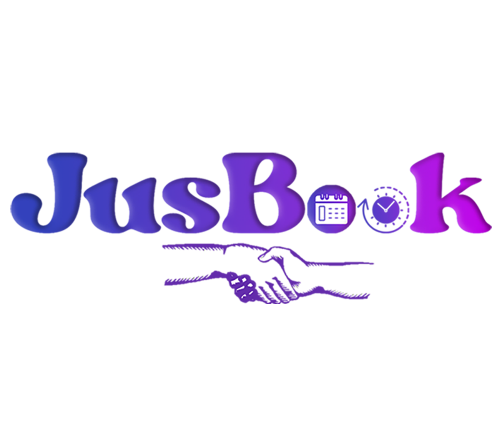

### 📌 요약
단순 예약 기능을 넘어 예약 관리 워크플로우를 통합하는 '예약 운영체제(Scheduling OS)'를 지향하는 차세대 스케줄러 서비스입니다.

### 🔑 핵심 기능
- 지능형 비서 'Tara AI'를 통해 예약 관리 워크플로우를 자동화 및 최적화합니다.
- 하나의 링크에서 여러 서비스와 일정을 정리하고 게시할 수 있는 '카탈로그' 기능을 제공합니다.
- 일대다(1-Many) 그룹 예약, 워크숍, 이벤트 호스팅 기능을 지원합니다.
- Google 및 Microsoft 캘린더와 실시간 동기화하여 중복 없는 정확한 일정 관리가 가능합니다.
- 팀 및 대규모 조직을 위한 엔터프라이즈 플랜과 전문 기능을 출시하여 확장성을 확보했습니다.

### 📸 스크린샷 및 갤러리
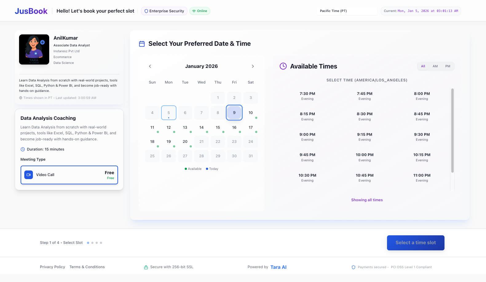
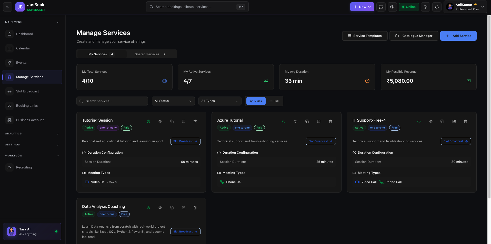
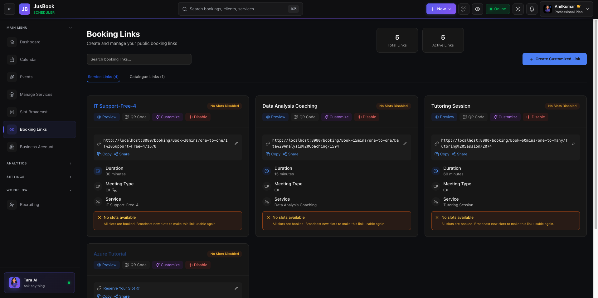

### 🎬 관련 영상
- [🎥 영상 보기](https://ph-files.imgix.net/753b43ec-a7f4-4d2a-83fe-6d14a9294e39.jpeg?auto=format)

---

## 10. [AI Thumbnail](https://www.producthunt.com/products/ai-thumbnail?utm_campaign=producthunt-api&utm_medium=api-v2&utm_source=Application%3A+antigravity_test+%28ID%3A+258588%29)
**Votes**: 23 | **Tagline**: Turn any thumbnail into your own, instantly

### 📌 요약
마음에 드는 기존 썸네일을 업로드하면 AI가 사용자의 얼굴과 텍스트를 합성하여 즉시 고대비의 클릭률(CTR) 높은 유튜브 썸네일 디자인을 생성해주는 서비스입니다.

### 🔑 핵심 기능
- 클릭률(CTR) 향상에 초점을 맞춘 바이럴 썸네일 AI 자동 생성
- 좋아하는 썸네일을 업로드 후, 자신의 얼굴과 텍스트만 넣어 맞춤형 디자인 제작
- 디자인 기술 없이도 매번 두 가지 독특한 고대비 디자인 변형을 제공

### 📸 스크린샷 및 갤러리
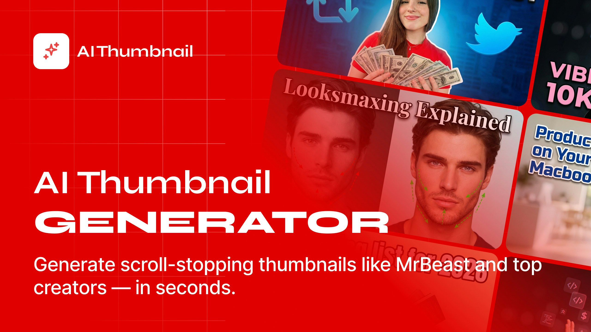

---

