# 🚀 Product Hunt Daily Top 10 (2026-01-11)

## 1. [Elser AI](https://www.producthunt.com/products/elser-ai-3?utm_campaign=producthunt-api&utm_medium=api-v2&utm_source=Application%3A+antigravity_test+%28ID%3A+258588%29)
**Votes**: 250 | **Tagline**: Create full anime shorts with just a prompt in minutes

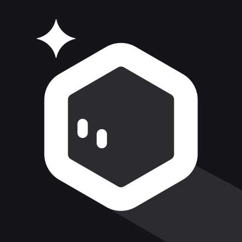

### 📌 요약
하나의 프롬프트만으로 일관된 캐릭터와 명확한 스토리 흐름을 갖춘 장편 애니메이션 영상을 몇 분 안에 제작하는 AI 도구입니다.

### 🔑 핵심 기능
- 프롬프트 하나로 완성도 높은 장편 애니메이션 영상 제작 가능
- 180개 이상의 장면에서도 30% 이상 높은 캐릭터 일관성 유지 (경쟁사 대비)
- 단순 클립을 넘어 스토리텔러를 위한 명확한 스토리와 시네마틱 스타일 구현

### 📸 스크린샷 및 갤러리
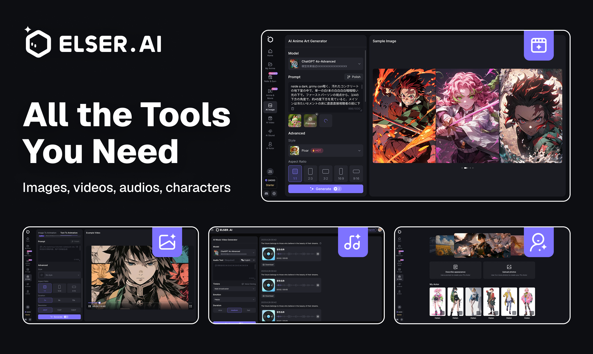

### 🎬 관련 영상
- [🎥 영상 보기](https://ph-files.imgix.net/f1786ffe-5330-4581-949c-1aafcc84cb78.jpeg?auto=format)

---

## 2. [Lexie](https://www.producthunt.com/products/lexie?utm_campaign=producthunt-api&utm_medium=api-v2&utm_source=Application%3A+antigravity_test+%28ID%3A+258588%29)
**Votes**: 221 | **Tagline**: A Tamagotchi that turns language practice into a game

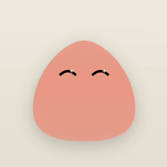

### 📌 요약
프랑스어 학습의 어려운 부분, 특히 복잡한 숫자를 타마고치 스타일의 육성 게임으로 재미있게 풀어낸 언어 학습 앱 'Lexie'가 출시되었습니다.

### 🔑 핵심 기능
- 타마고치에서 영감을 받은 게임 메커니즘으로 언어 학습 동기 부여를 높입니다.
- 학습할수록 캐릭터가 성장하고 정답을 맞히면 진화하는 방식이며, 오답이나 하루를 건너뛰어도 페널티가 없습니다.
- 프랑스어 학습은 무료이며, 추가 언어는 1회 결제로 영구 해제 가능한 오프라인 전용, 광고 없는 앱입니다.

### 📸 스크린샷 및 갤러리

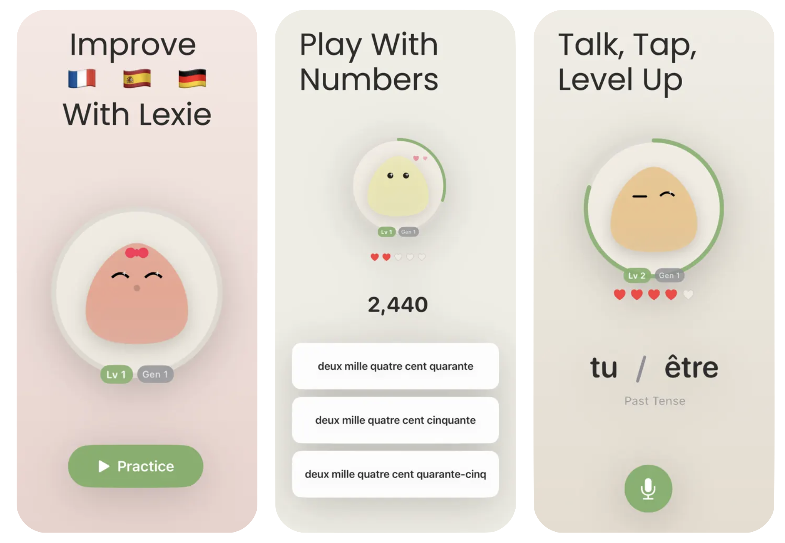
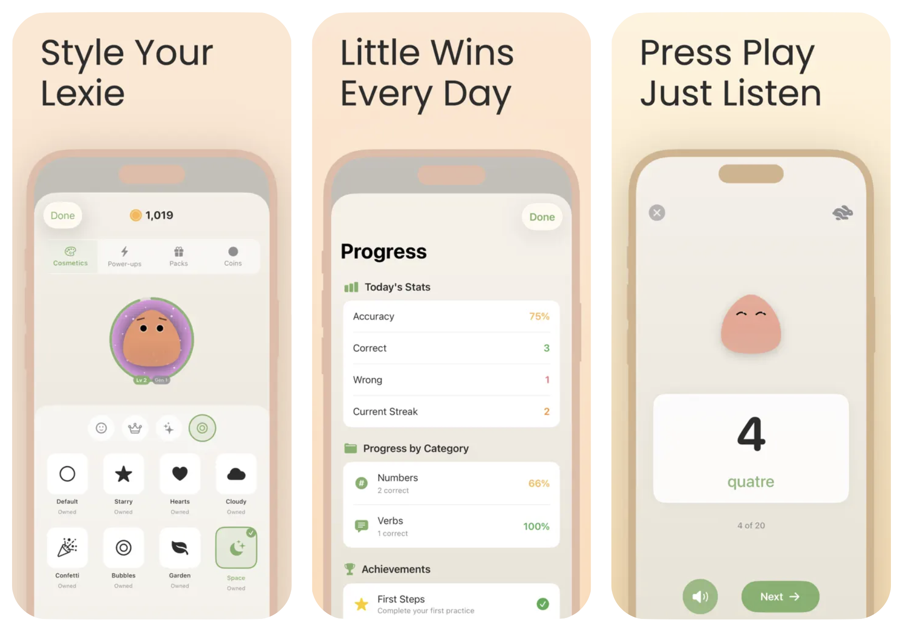

---

## 3. [Squair](https://www.producthunt.com/products/squair?utm_campaign=producthunt-api&utm_medium=api-v2&utm_source=Application%3A+antigravity_test+%28ID%3A+258588%29)
**Votes**: 189 | **Tagline**: Calm anxiety in 2 minutes with Navy SEAL breathing

### 📌 요약
스마트폰으로 유발된 불안을 2분 만에 진정시키는 네이비 씰 호흡법 기반의 멘탈 케어 앱입니다.

### 🔑 핵심 기능
- 네이비 씰(Navy SEAL)이 사용하는 박스 호흡법 등 과학적으로 검증된 호흡 프로토콜 제공
- 스트레스, 공황 발작(Zen Button), 수면 장애(4-7-8) 등 상황별로 맞춤 설계되어 2분 안에 불안 해소
- 복잡한 명상 과정이나 약물 없이 호흡 자체에 집중하며, 오프라인 환경에서도 사용 가능

### 📸 스크린샷 및 갤러리
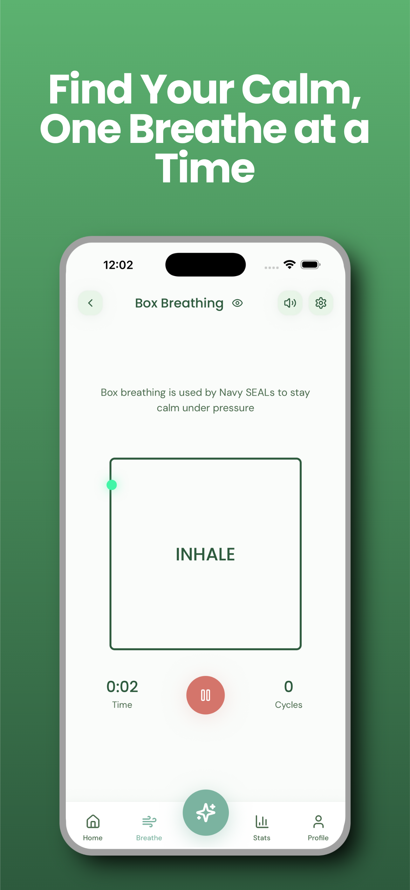

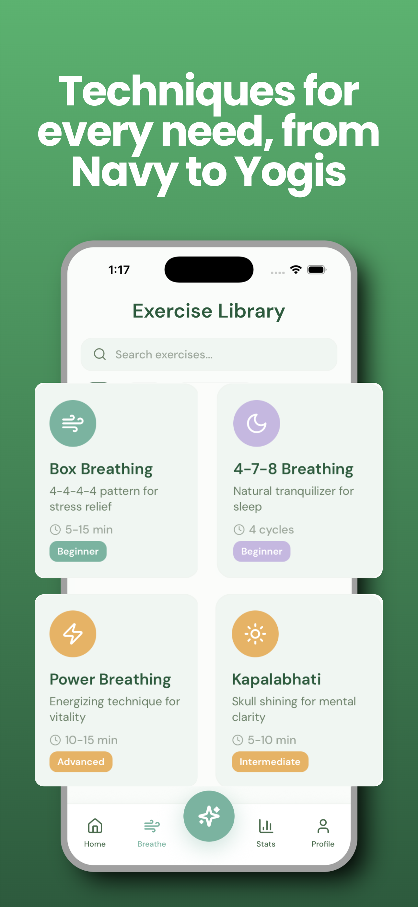

### 🎬 관련 영상
- [🎥 영상 보기](https://ph-files.imgix.net/ec5e643c-ab68-4963-b8cc-301bd89a68a5.jpeg?auto=format)

---

## 4. [Funding Goal](https://www.producthunt.com/products/funding-goal?utm_campaign=producthunt-api&utm_medium=api-v2&utm_source=Application%3A+antigravity_test+%28ID%3A+258588%29)
**Votes**: 177 | **Tagline**: Calculate how much you should raise and why

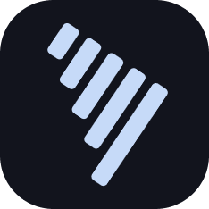

### 📌 요약
스타트업이 막연한 추측 대신 명확한 근거를 바탕으로 필요한 자금 조달 목표액과 그 이유를 계산해 주는 무료 도구입니다.

### 🔑 핵심 기능
- 막연한 추측이 아닌 명확한 근거 기반의 자금 조달 목표액 산출
- 순손실액(Burn Rate), 운영 가능 기간(Runway), 사업 계획을 고려한 정밀한 계산
- 투자자와 논의하기 전 창업자에게 명확성과 근거를 제공하는 단순하고 유용한 도구

### 📸 스크린샷 및 갤러리
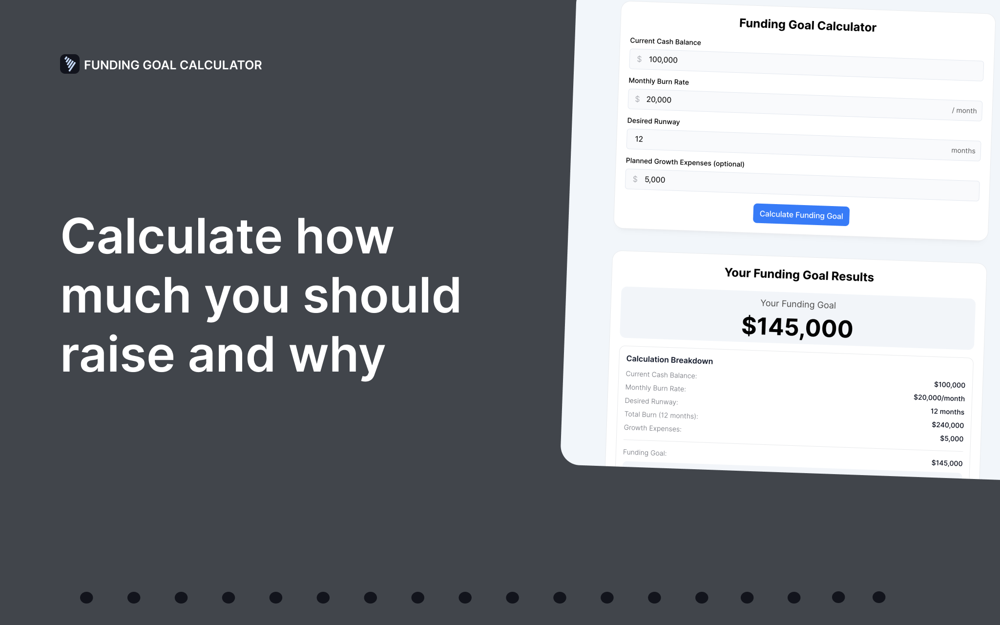
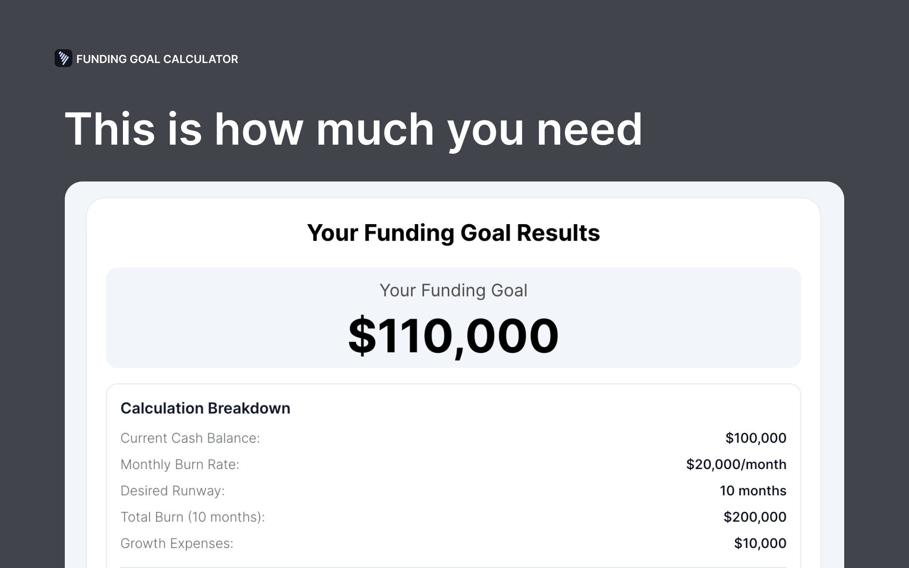
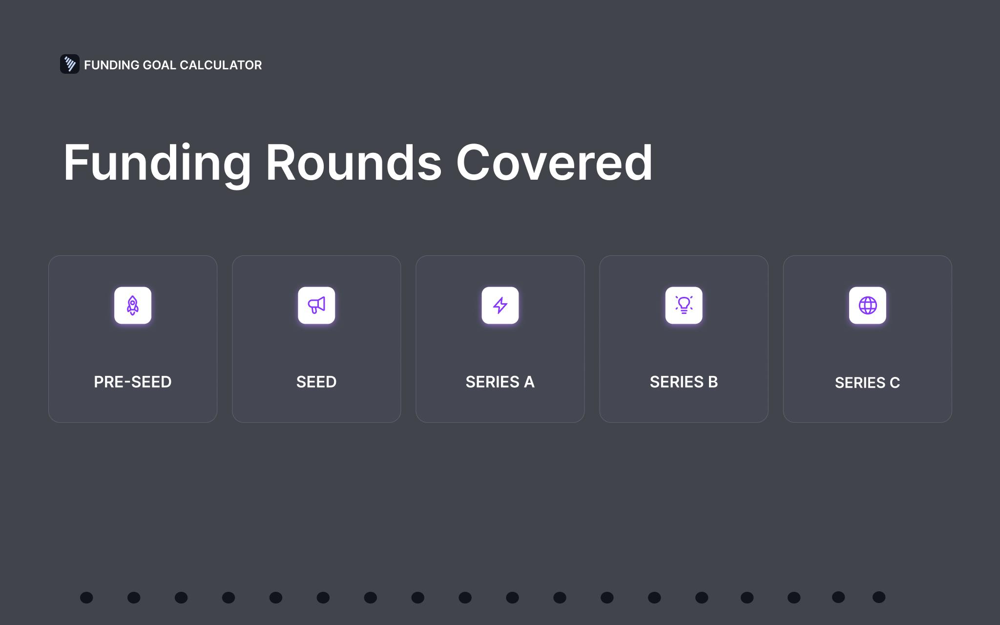

---

## 5. [MTV REWIND](https://www.producthunt.com/products/mtv-rewind-music-videos-24-7-ad-free?utm_campaign=producthunt-api&utm_medium=api-v2&utm_source=Application%3A+antigravity_test+%28ID%3A+258588%29)
**Votes**: 133 | **Tagline**: 24/7 music video streaming-MTV when it actually played music

### 📌 요약
음악을 틀어주던 시절의 MTV를 완벽하게 재현하여, 광고나 알고리즘 없이 랜덤으로 뮤직비디오를 24시간 스트리밍하는 서비스입니다.

### 🔑 핵심 기능
- 70년대부터 현재까지의 35,000개 뮤직비디오를 8개 채널에서 24시간 내내 스트리밍합니다.
- 광고, 알고리즘, 로그인 없이 'Just press play' 방식으로 작동하는 순수한 무료 서비스입니다.
- 랜덤 재생을 통해 옛날처럼 우연히 새로운 음악을 발견하는 즐거움을 선사합니다.
- 48시간 만에 열정 프로젝트로 개발된, 과거 음악 채널에 대한 향수를 자극하는 서비스입니다.

### 📸 스크린샷 및 갤러리
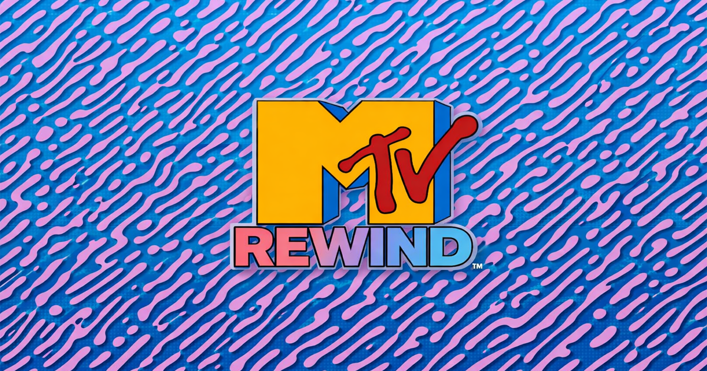
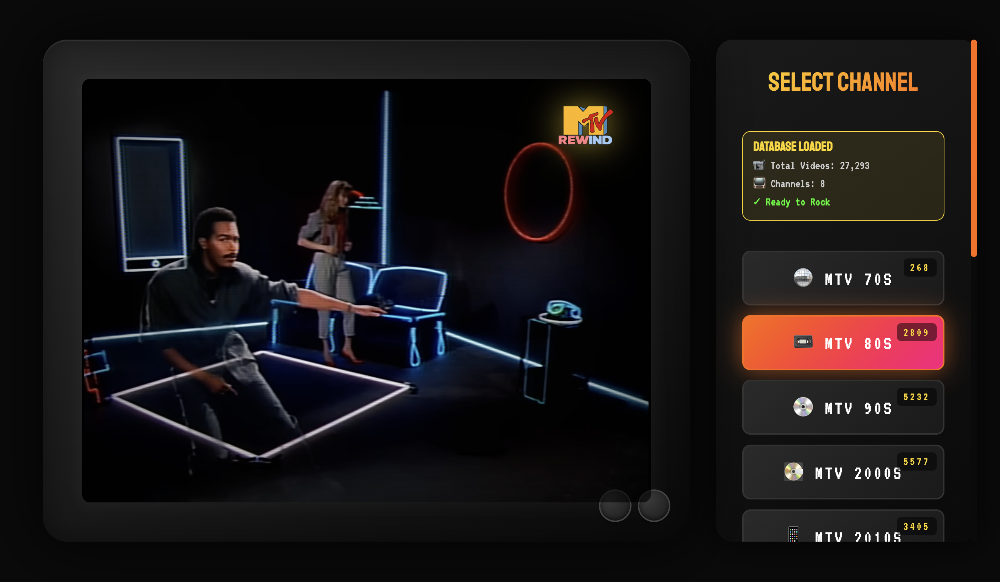

---

## 6. [Meme? Yes](https://www.producthunt.com/products/meme-yes?utm_campaign=producthunt-api&utm_medium=api-v2&utm_source=Application%3A+antigravity_test+%28ID%3A+258588%29)
**Votes**: 114 | **Tagline**: Stop Alt-Tabbing. The fastest way to find memes.

### 📌 요약
밈 검색 시간을 획기적으로 줄여주는, 크롬 툴바에서 바로 작동하는 초고속 밈 찾기 및 복사 확장 프로그램입니다.

### 🔑 핵심 기능
- Alt-Tab 전환 없이 크롬 툴바에서 밈을 즉시 검색하고 찾을 수 있습니다.
- 원클릭으로 밈을 복사하여 Discord나 Slack에 바로 붙여넣기가 가능합니다.
- 회원 가입이나 로그인 절차 없이 바로 사용할 수 있어 접근성이 높습니다.

### 📸 스크린샷 및 갤러리
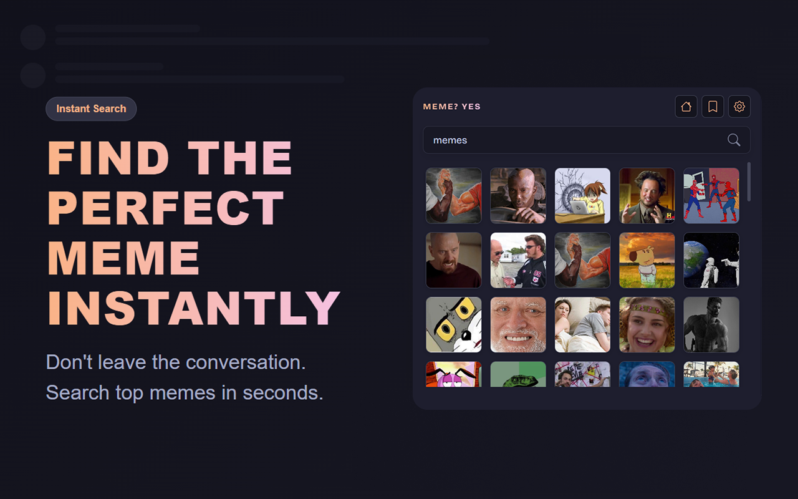
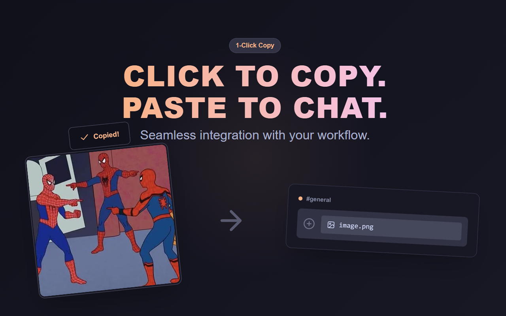
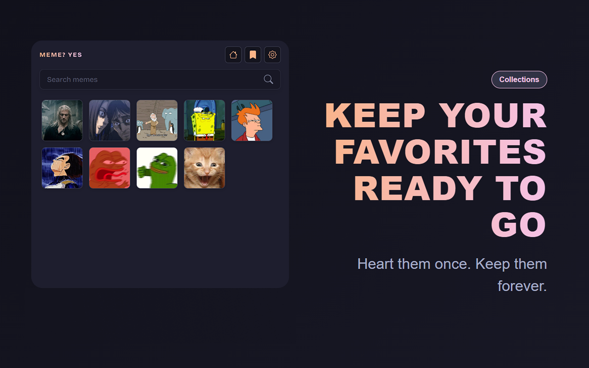

---

## 7. [Guessly](https://www.producthunt.com/products/guessly?utm_campaign=producthunt-api&utm_medium=api-v2&utm_source=Application%3A+antigravity_test+%28ID%3A+258588%29)
**Votes**: 89 | **Tagline**: A daily mini guessing game that roasts you when you fail

### 📌 요약
매일 세 개의 수수께끼를 풀고, 맞히면 똑똑함을 느끼고 틀리면 재치 있게 놀림(roast) 당하는 미니 추측 게임입니다.

### 🔑 핵심 기능
- 매일 3개의 새로운 수수께끼를 제공하는 일일 미니 게임입니다.
- 정답을 맞히면 성취감을 느끼고, 오답 시 유머러스한 놀림을 받는 것이 특징입니다.
- 시간 제한이나 압박감이 없어 사용자 '자존심(ego)'만 건드리는 가벼운 플레이가 가능합니다.

### 📸 스크린샷 및 갤러리
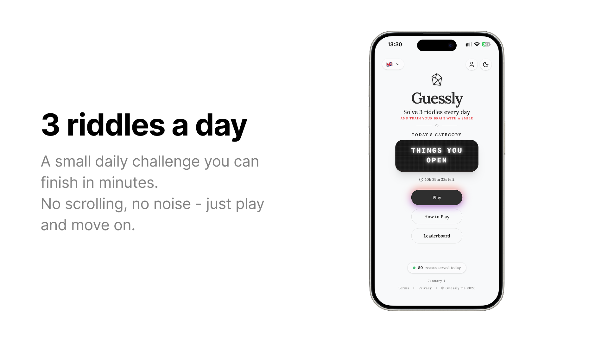
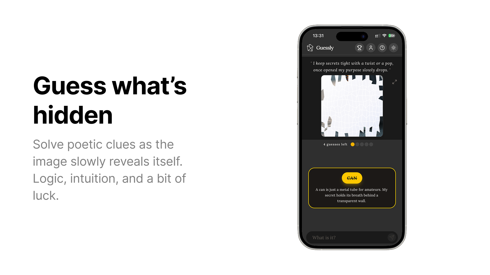
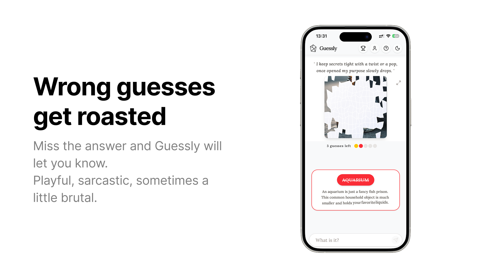

---

## 8. [FreeUpMyMac](https://www.producthunt.com/products/freeupmymac?utm_campaign=producthunt-api&utm_medium=api-v2&utm_source=Application%3A+antigravity_test+%28ID%3A+258588%29)
**Votes**: 89 | **Tagline**: A Mac Disk Cleaner. Fix Your "System Data" Storage

### 📌 요약
Mac 사용자들의 골칫거리인 '시스템 데이터' 저장 공간 문제를 해결하고, 숨겨진 캐시와 정크 파일들을 원클릭으로 정리해주는 Mac 디스크 클리너 앱입니다.

### 🔑 핵심 기능
- Mac '시스템 데이터(System Data)' 점유 공간을 효과적으로 정리 및 복구합니다.
- 저장 공간을 차지하는 캐시, 정크 파일, 로그 등을 자동으로 찾아냅니다.
- 단 한 번의 클릭으로 불필요한 파일들을 안전하게 삭제하고 저장 공간을 확보합니다.

### 📸 스크린샷 및 갤러리
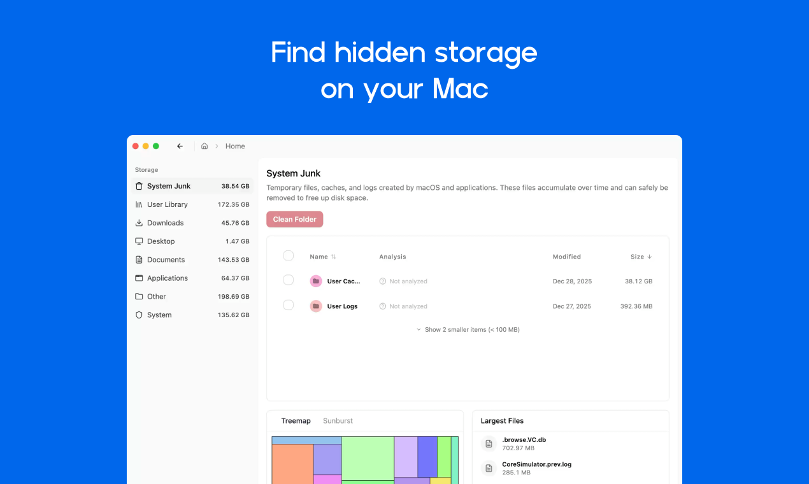
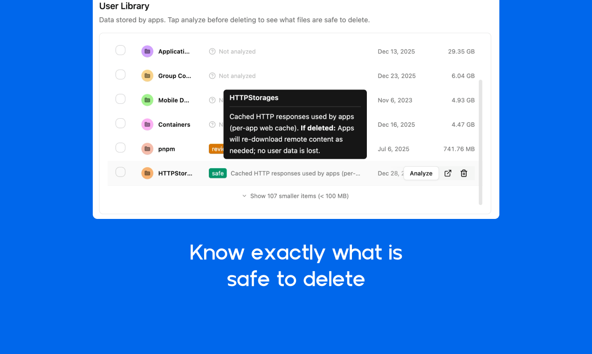
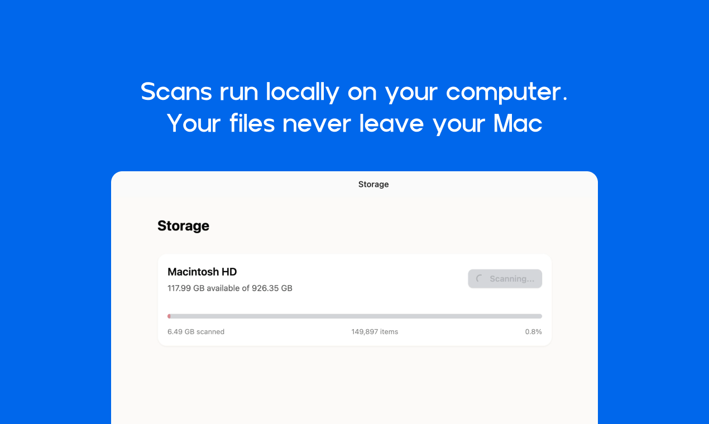

### 🎬 관련 영상
- [🎥 영상 보기](https://ph-files.imgix.net/5e316c38-e22f-4fbd-a7dd-9641fd97c54b.jpeg?auto=format)

---

## 9. [one elsewhere](https://www.producthunt.com/products/one-elsewhere?utm_campaign=producthunt-api&utm_medium=api-v2&utm_source=Application%3A+antigravity_test+%28ID%3A+258588%29)
**Votes**: 86 | **Tagline**: Don’t touch. Stay focused.

### 📌 요약
one elsewhere는 작업을 하는 동안 휴대폰 화면을 만지지 않고 집중력을 유지하는 시간을 측정하는 포커스 챌린지 앱입니다.

### 🔑 핵심 기능
- 집중 도전 시작 후 화면을 터치하는 순간 비행이 즉시 종료되는 단순하고 엄격한 규칙을 적용합니다.
- 비행 시간, 도달한 행성 등 주요 성과에 따라 도전 과제(Achievements)를 달성하고 우주선을 잠금 해제할 수 있습니다.
- 업무, 학습 등 중단 없는 집중이 필요한 모든 활동에 활용 가능하도록 미니멀하고 차분한 UI로 설계되었습니다.

### 📸 스크린샷 및 갤러리
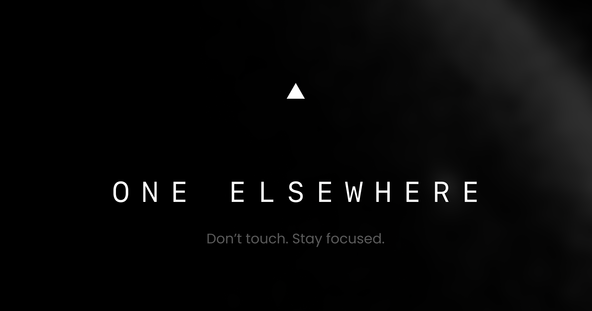
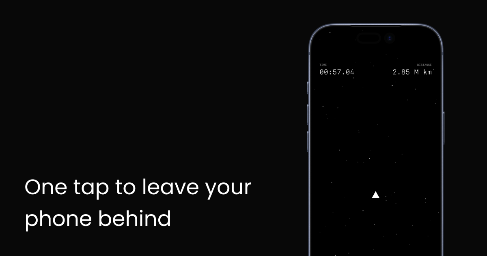
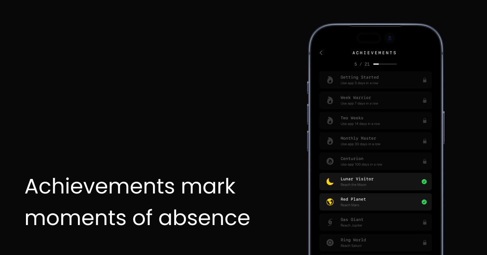

---

## 10. [Bit Sketchy!](https://www.producthunt.com/products/bit-sketchy-party-game?utm_campaign=producthunt-api&utm_medium=api-v2&utm_source=Application%3A+antigravity_test+%28ID%3A+258588%29)
**Votes**: 85 | **Tagline**: A simple drawing party game where no skill is required

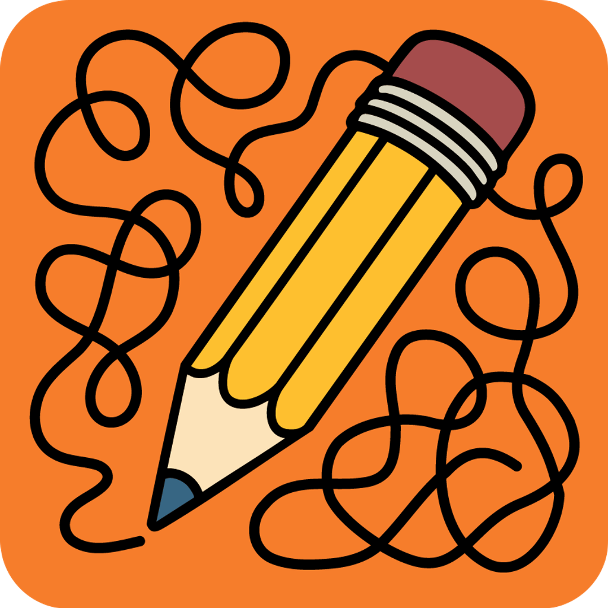

### 📌 요약
그림 실력과 무관하게 하나의 기기로 프롬프트를 공유하고 비밀 기준에 따라 승자를 가리는, 간단한 대면(오프라인) 드로잉 파티 게임입니다.

### 🔑 핵심 기능
- 그림 실력과 관계없이 누구나 쉽게 참여할 수 있도록 의도적으로 단순하게 설계됨.
- 하나의 iOS 또는 Mac 기기를 통해 프롬프트를 공유하며 현장에서 플레이하는 간편한 구조.
- 라운드 종료 후 비밀리에 공개되는 심사 기준을 통해 재미와 토론을 유도하는 소셜 요소.

### 📸 스크린샷 및 갤러리
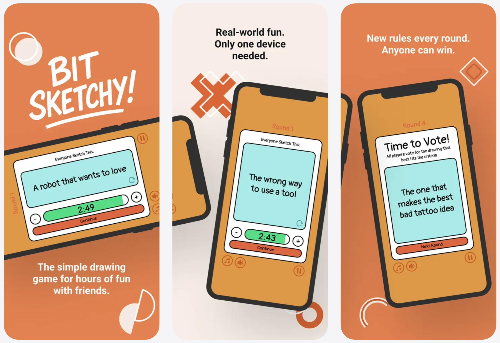

---

