# 🚀 Product Hunt Daily Top 10 (2026-01-12)

## 1. [Atlas.new](https://www.producthunt.com/products/atlas-co-2?utm_campaign=producthunt-api&utm_medium=api-v2&utm_source=Application%3A+antigravity_test+%28ID%3A+258588%29)
**Votes**: 343 | **Tagline**: The AI agent for maps and spatial data

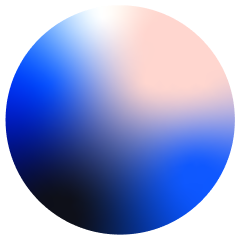

### 📌 요약
Atlas.new는 지도 및 공간 데이터를 위한 AI 에이전트로, GIS 전문가 없이도 지도 제작, 분석 및 공간 앱 개발을 가능하게 합니다.

### 🔑 핵심 기능
- 지도 제작 및 공간 데이터 분석을 위한 AI 에이전트 기능 제공
- GIS 전문가의 도움 없이 누구나 쉽게 활용 가능 (민주화된 GIS)
- 공간 데이터 기반의 애플리케이션 구축 지원

### 📸 스크린샷 및 갤러리

### 🎬 관련 영상
- [🎥 영상 보기](https://ph-files.imgix.net/66dbc594-31df-419f-bef9-a7fc0a5f3c54.jpeg?auto=format)

---

## 2. [PicKey AI](https://www.producthunt.com/products/pickey-ai?utm_campaign=producthunt-api&utm_medium=api-v2&utm_source=Application%3A+antigravity_test+%28ID%3A+258588%29)
**Votes**: 294 | **Tagline**: Secure your master password with a fun memory you love!

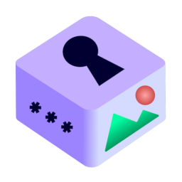

### 📌 요약
PicKey AI는 좋아하는 사진과 3D 캐릭터를 활용하여 텍스트 입력 없이도 기억하기 쉬우면서 강력한 마스터 비밀번호를 생성하는 시각적 비밀번호 관리자입니다.

### 🔑 핵심 기능
- 좋아하는 사진과 3D 캐릭터를 결합하여 강력한 마스터 비밀번호를 생성합니다.
- 텍스트 비밀번호를 입력하거나 기억할 필요가 없어 사용이 간편합니다.
- 절대적인 보안과 손쉬운 사용성을 결합한 시각적(Visual) 비밀번호 관리 솔루션입니다.

### 📸 스크린샷 및 갤러리
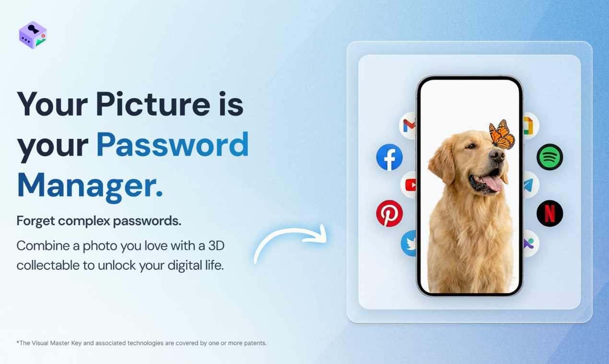
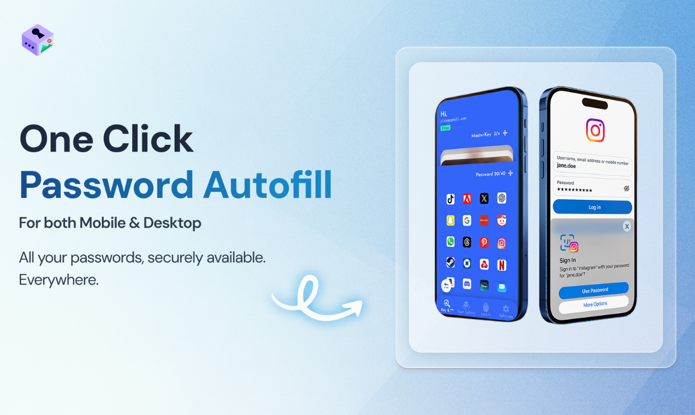
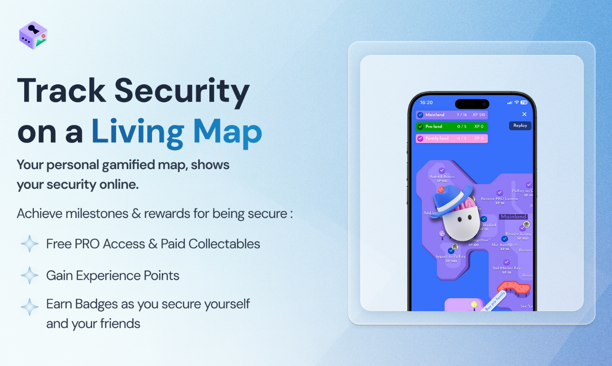

### 🎬 관련 영상
- [🎥 영상 보기](https://ph-files.imgix.net/ff60ee1f-25bf-4e43-a1e4-947740742fb8.jpeg?auto=format)

---

## 3. [Trophy 1.0](https://www.producthunt.com/products/trophy-1-0?utm_campaign=producthunt-api&utm_medium=api-v2&utm_source=Application%3A+antigravity_test+%28ID%3A+258588%29)
**Votes**: 260 | **Tagline**: Developer APIs for gamification: streaks, XP, badges, ranks

### 📌 요약
Trophy 1.0은 스트릭, 경험치, 배지 등 다양한 게이미피케이션 요소를 쉽고 빠르게 앱에 통합하고 관리할 수 있도록 돕는 개발자 API 솔루션입니다.

### 🔑 핵심 기능
- 개발자 API를 통해 스트릭, XP, 배지 등 필수 게이미피케이션 기능을 신속하게 구축할 수 있습니다.
- 코딩 없이 기능을 설정하고 관리할 수 있으며, 개인 맞춤형 이메일 및 푸시 알림을 자동화합니다.
- 전용 대시보드를 통해 게이미피케이션이 사용자의 리텐션 및 참여도에 미치는 영향을 실시간으로 모니터링할 수 있습니다.

### 📸 스크린샷 및 갤러리
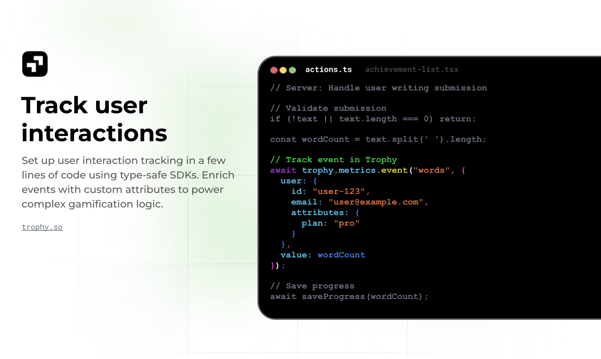
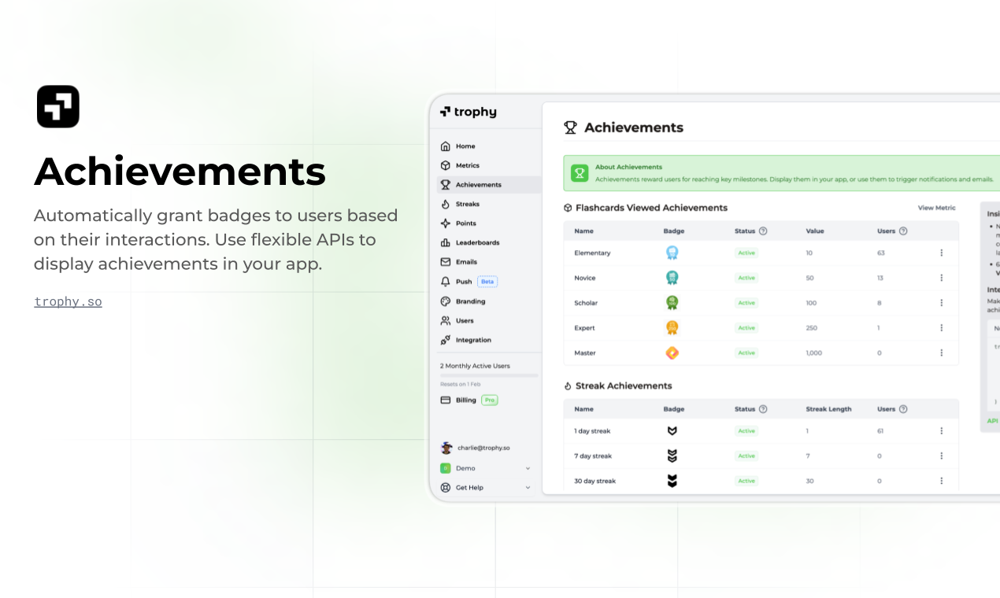
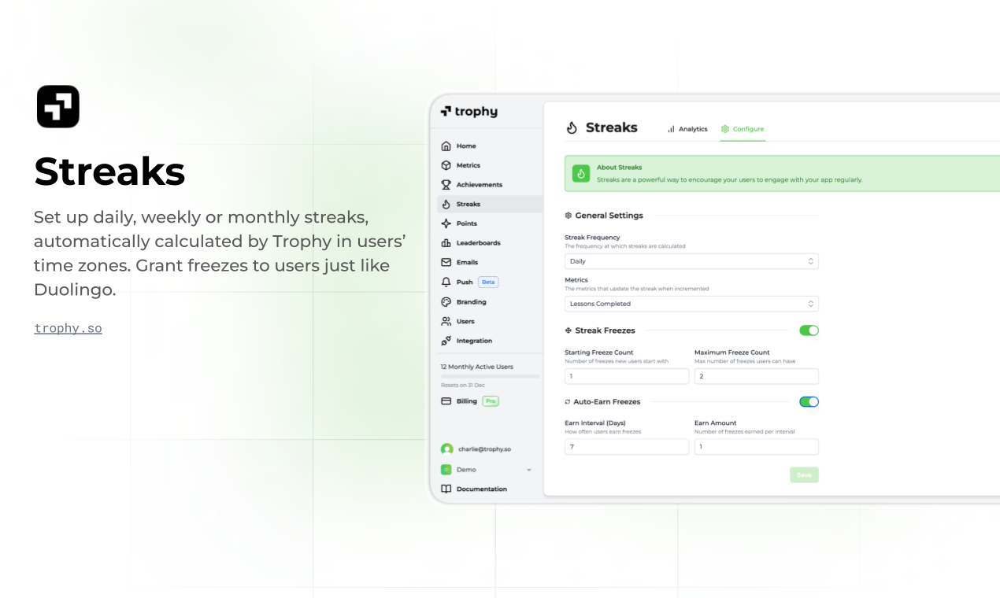

### 🎬 관련 영상
- [🎥 영상 보기](https://ph-files.imgix.net/ebce4d1e-9b22-463f-b0a7-cdf975e7345e.jpeg?auto=format)

---

## 4. [Superdesign Prompt Library](https://www.producthunt.com/products/superdesign?utm_campaign=producthunt-api&utm_medium=api-v2&utm_source=Application%3A+antigravity_test+%28ID%3A+258588%29)
**Votes**: 221 | **Tagline**: Design prompts for style, animation, components

### 📌 요약
스타일, 애니메이션, UI 컴포넌트 등 디자인 작업에 필요한 프롬프트를 공유하고 구축할 수 있는 대규모 커뮤니티 기반 디자인 프롬프트 라이브러리입니다.

### 🔑 핵심 기능
- 스타일, 애니메이션, UI 컴포넌트 등 광범위한 디자인 영역을 다루는 최대 규모의 커뮤니티 주도 라이브러리입니다.
- 팀과 비공개로 프롬프트를 구축 및 공유하거나, 커뮤니티에 공개적으로 기여할 수 있습니다.
- 모든 코딩 에이전트와 호환되므로 활용성이 매우 높습니다.

### 📸 스크린샷 및 갤러리

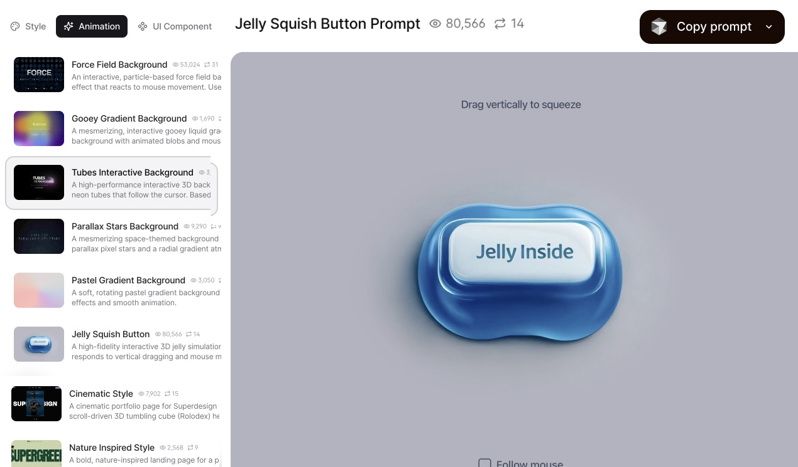
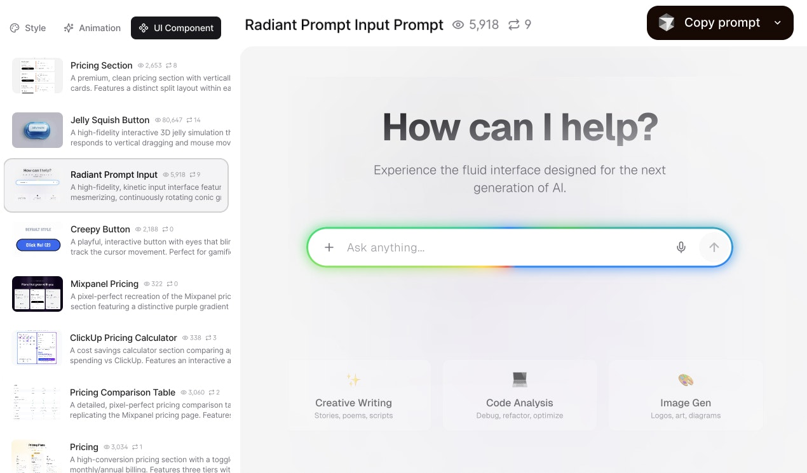

### 🎬 관련 영상
- [🎥 영상 보기](https://ph-files.imgix.net/0f70a0d4-5d5c-4722-b016-7a1a9d1f4480.jpeg?auto=format)

---

## 5. [Drift](https://www.producthunt.com/products/drift-6?utm_campaign=producthunt-api&utm_medium=api-v2&utm_source=Application%3A+antigravity_test+%28ID%3A+258588%29)
**Votes**: 161 | **Tagline**: Screen recorder desktop app with cursor zoom effect

### 📌 요약
마우스 커서 줌 효과를 포함한 시네마틱 자동 줌 기능이 특징인 전문가용 데스크톱 화면 녹화 스튜디오 앱입니다.

### 🔑 핵심 기능
- 커서 줌 효과가 적용되는 시네마틱 자동 줌(Cinematic auto-zoom) 기능 제공
- 개인 정보 보호(Privacy-first)에 중점을 둔 설계 및 구독료 없는 이용 방식
- 효과가 적용된 버전과 원본(Raw) 파일 중 선택하여 녹화 가능

### 📸 스크린샷 및 갤러리
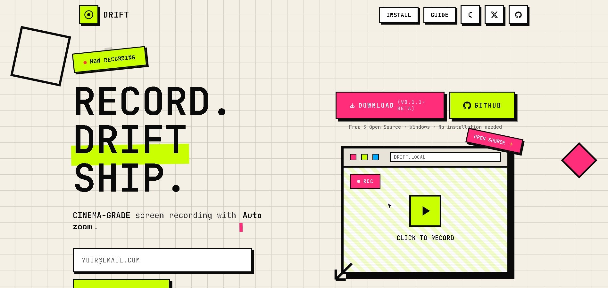
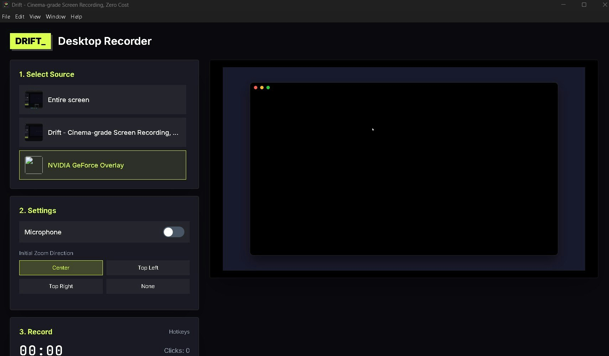
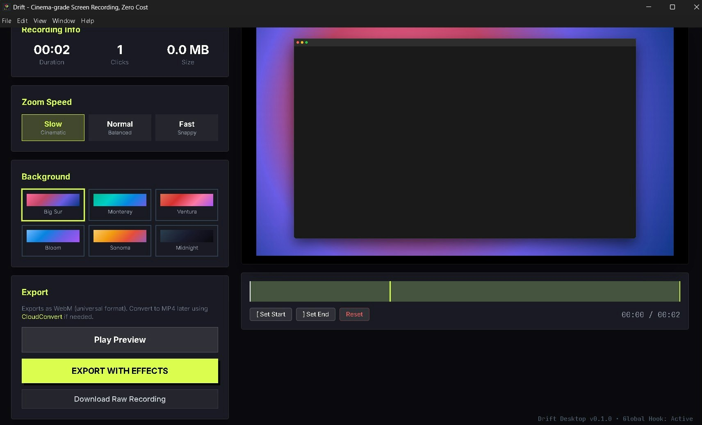

### 🎬 관련 영상
- [🎥 영상 보기](https://ph-files.imgix.net/30fa6d90-8fd3-4bde-afc4-ec7a111cf7ab.gif?auto=format)

---

## 6. [Corgi Insurance](https://www.producthunt.com/products/corgi-insurance?utm_campaign=producthunt-api&utm_medium=api-v2&utm_source=Application%3A+antigravity_test+%28ID%3A+258588%29)
**Votes**: 134 | **Tagline**: Modular coverage for startups: CGL, D&O, Tech E&O, Cyber

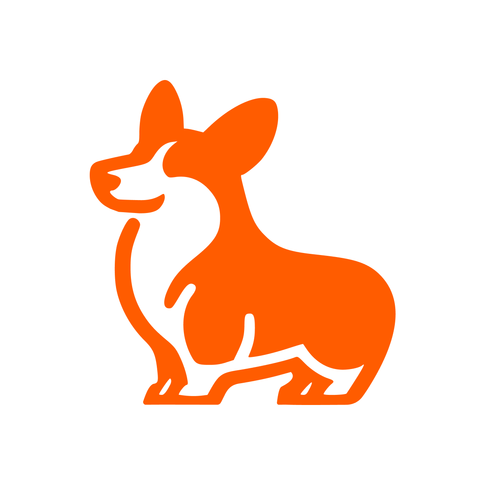

### 📌 요약
스타트업을 위한 CGL, D&O, 사이버 보험 등을 모듈식으로 제공하며, 브로커 없이 직접 보험을 인수하고 발행하는 풀스택 보험사입니다.

### 🔑 핵심 기능
- 스타트업 특화: 복잡한 보험 절차를 간소화하고, 스타트업에 최적화된 보험 상품을 설계합니다.
- 풀스택 보험사: 브로커를 거치지 않고 직접 인수 및 발행(Underwriting & Issuance)하여 마찰을 줄이고 가격 경쟁력을 확보합니다.
- 모듈식 커버리지 제공: 이사 및 임원 배상 책임(D&O), 기술 E&O, 사이버 보험 등 다양한 필수 보험을 맞춤형으로 제공합니다.

### 📸 스크린샷 및 갤러리
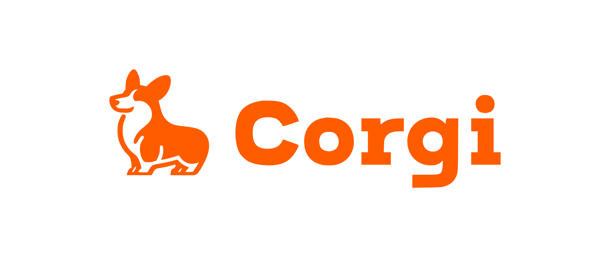
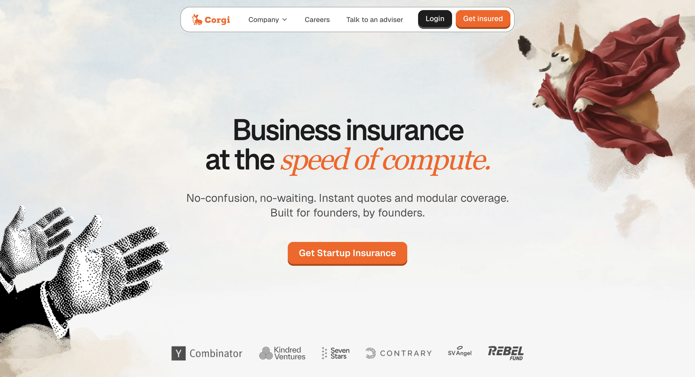
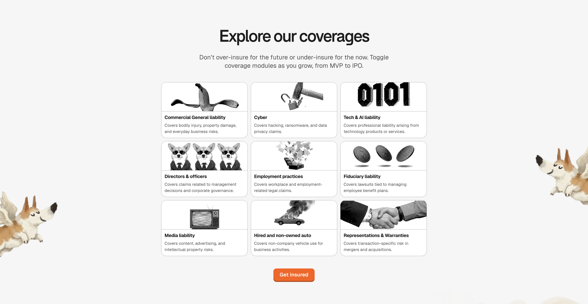

---

## 7. [Adject v1.5](https://www.producthunt.com/products/adject?utm_campaign=producthunt-api&utm_medium=api-v2&utm_source=Application%3A+antigravity_test+%28ID%3A+258588%29)
**Votes**: 126 | **Tagline**: Create hyper-realistic product images & videos instantly

### 📌 요약
Adject v1.5는 이커머스 브랜드를 위해 스튜디오급의 극사실적인 제품 이미지와 영상을 프로젝트 기반 워크플로우로 즉시 제작할 수 있게 돕는 AI 툴입니다.

### 🔑 핵심 기능
- 극사실적인(hyper-realistic) 제품 이미지 및 비디오를 AI로 손쉽게 생성합니다.
- 새로운 프로젝트 기반 워크플로우를 도입하여 이미지 및 비디오 생성을 체계적으로 관리합니다.
- 이미지-투-이미지, 레퍼런스 기반 생성, 이미지-투-비디오 등 다양한 고급 생성 모드를 제공합니다.
- 스튜디오, 포토그래퍼, 복잡한 툴 없이도 전문적인 시각 자료 제작이 가능하여 이커머스 브랜드를 타겟합니다.

### 📸 스크린샷 및 갤러리

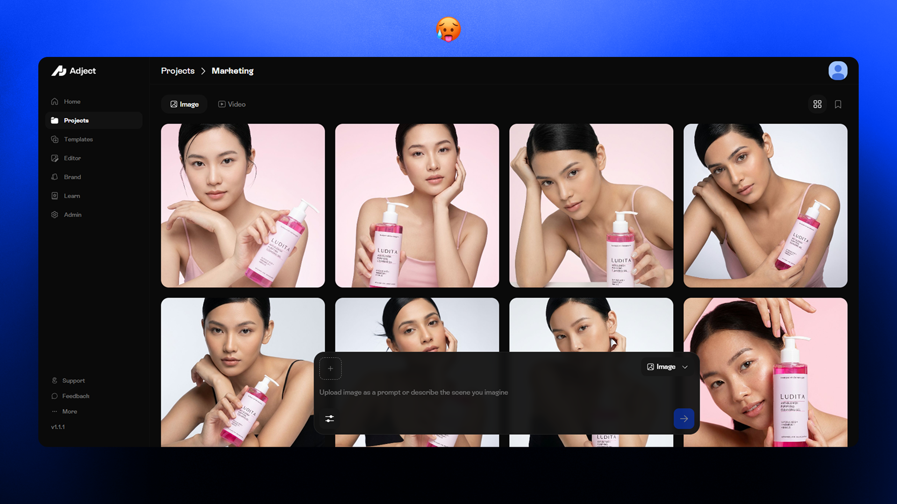
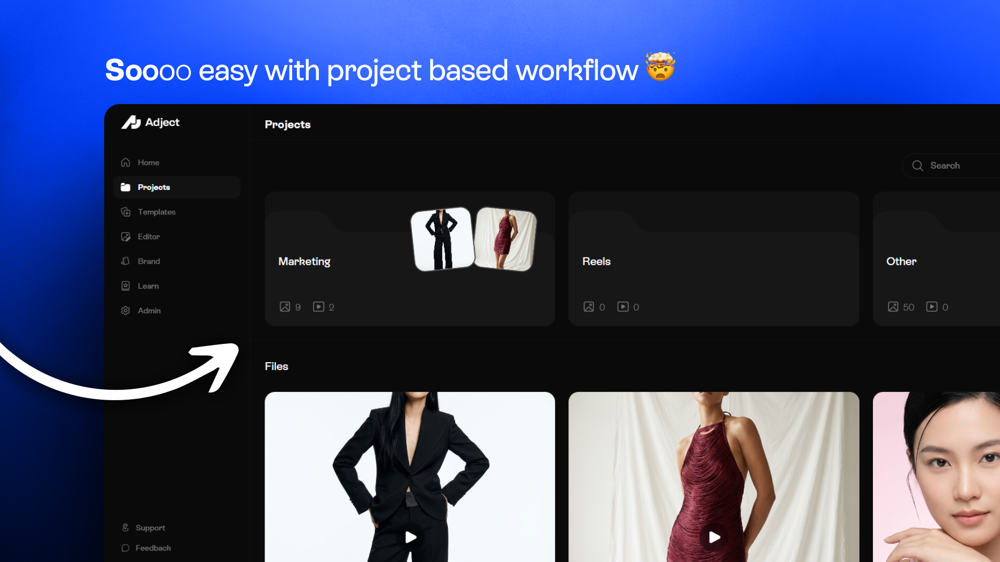

---

## 8. [ cubic 2.0](https://www.producthunt.com/products/cubic?utm_campaign=producthunt-api&utm_medium=api-v2&utm_source=Application%3A+antigravity_test+%28ID%3A+258588%29)
**Votes**: 115 | **Tagline**: Code reviews for the AI era

### 📌 요약
cubic 2.0은 AI로 생성된 코드를 팀이 신뢰하고 안전하게 병합할 수 있도록 돕는, 정확도에 중점을 둔 차세대 AI 코드 리뷰 엔진입니다.

### 🔑 핵심 기능
- 가장 정확하고 노이즈가 적도록 재구축되어, AI 코드 리뷰의 신뢰도를 극대화했습니다.
- 단순 PR 댓글을 넘어, CLI, AI 문서, PR 설명 업데이트 기능으로 개발 워크플로우에 깊이 통합됩니다.
- Cal.com, n8n, Linux Foundation 프로젝트를 포함한 100개 이상의 조직에서 이미 검증되고 사용 중입니다.

### 📸 스크린샷 및 갤러리
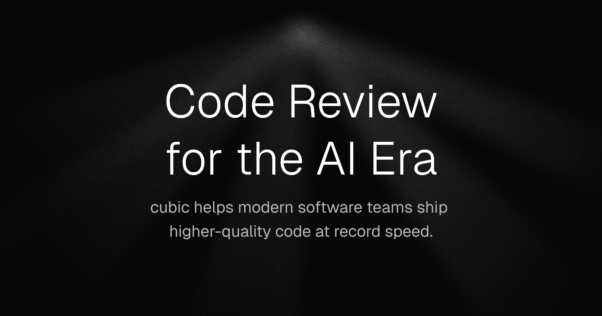
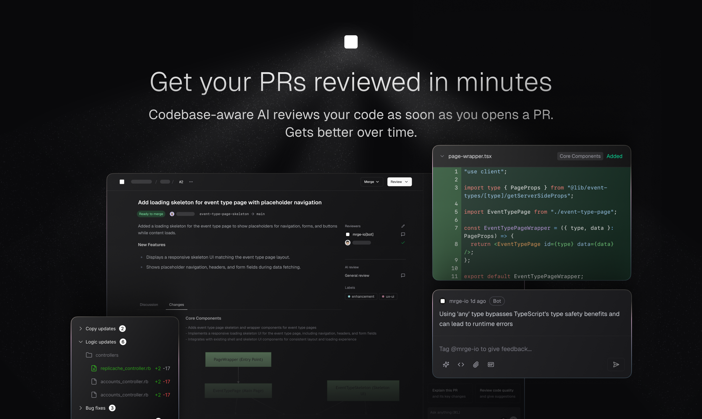
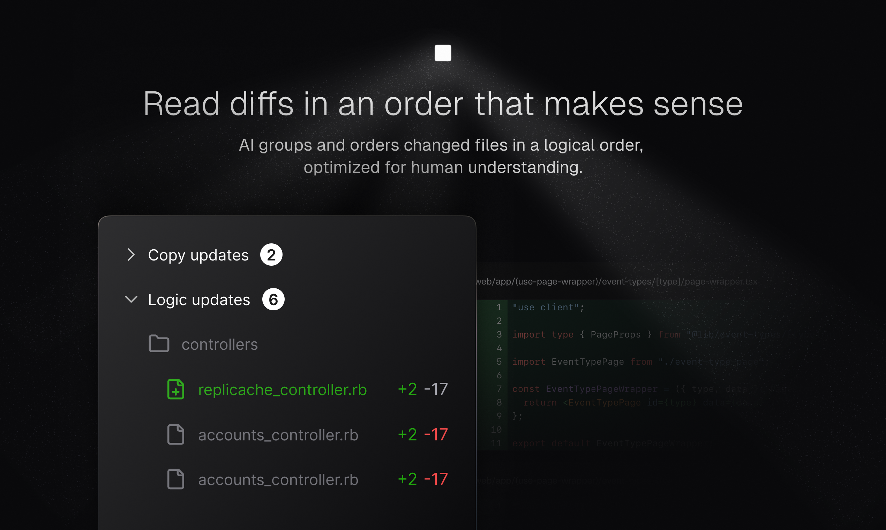

### 🎬 관련 영상
- [🎥 영상 보기](https://ph-files.imgix.net/c6d1c952-067f-4a44-818f-023e5ceacb4f.jpeg?auto=format)

---

## 9. [AirSome](https://www.producthunt.com/products/airsome?utm_campaign=producthunt-api&utm_medium=api-v2&utm_source=Application%3A+antigravity_test+%28ID%3A+258588%29)
**Votes**: 108 | **Tagline**: The 'Aha!' moment for Airbnb reviews

### 📌 요약
수많은 에어비앤비 후기를 AI로 요약하여, 숙소 예약에 결정적인 영향을 미치는 단점('Dealbreaker')을 몇 초 만에 파악하게 해주는 서비스입니다.

### 🔑 핵심 기능
- AI 기술을 활용해 장문의 에어비앤비 후기를 즉시 요약 및 분석
- 수많은 후기를 읽는 데 낭비되던 시간을 절약하여 신속한 예약 결정 지원
- 숙소의 치명적인 단점(Dealbreakers)을 강조하여 예약 실패 위험 최소화

### 📸 스크린샷 및 갤러리
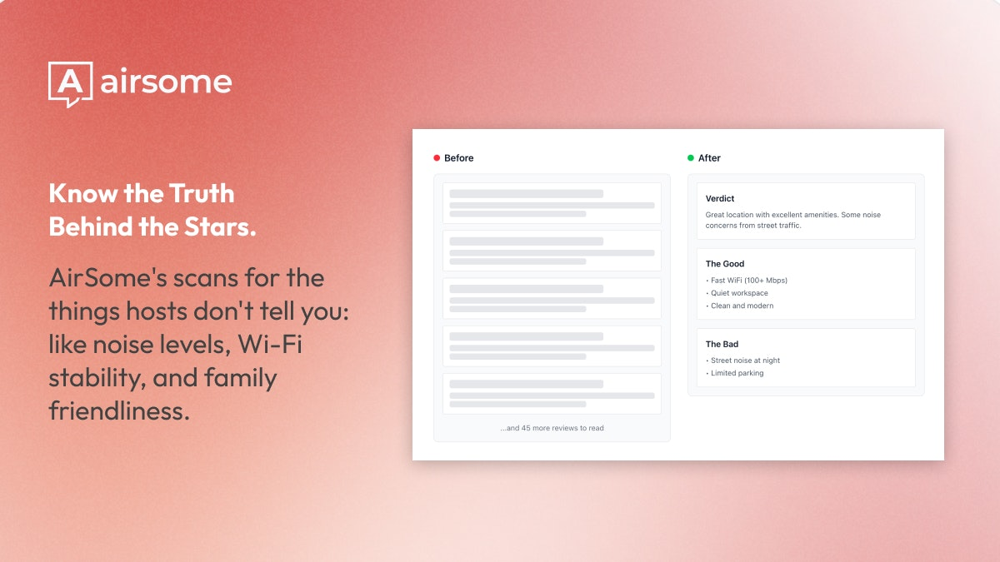
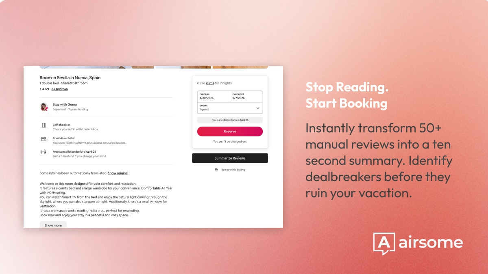

---

## 10. [KNOA](https://www.producthunt.com/products/knoa-2?utm_campaign=producthunt-api&utm_medium=api-v2&utm_source=Application%3A+antigravity_test+%28ID%3A+258588%29)
**Votes**: 99 | **Tagline**: The AI that captures your team's knowledge

### 📌 요약
팀의 지식을 체계적으로 포착하고 실행 가능한 보고서를 생성하는 AI 에이전트 'KNOA'가 출시되었습니다.

### 🔑 핵심 기능
- 구조화된 인터뷰를 진행하여 팀의 암묵지(tacit knowledge)를 포착합니다.
- 수집된 지식을 바탕으로 실행 가능한(actionable) 보고서를 자동으로 생성합니다.
- 내부 팀 지식 관리뿐만 아니라 클라이언트 대상 지식 캡처에도 활용 가능합니다.

### 📸 스크린샷 및 갤러리
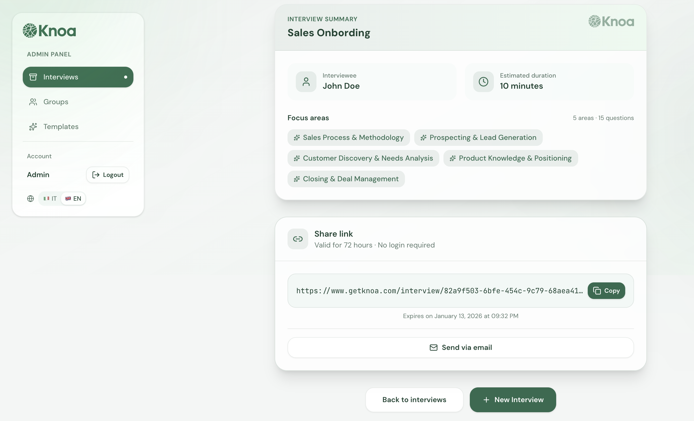

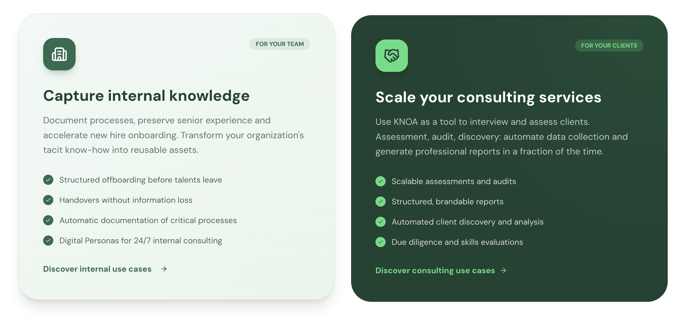

---

