# 🚀 Product Hunt Daily Top 10 (2026-01-13)

## 1. [Cowork](https://www.producthunt.com/products/claude-for-desktop?utm_campaign=producthunt-api&utm_medium=api-v2&utm_source=Application%3A+antigravity_test+%28ID%3A+258588%29)
**Votes**: 446 | **Tagline**: Turn Claude into your digital coworker

### 📌 요약
Cowork는 AI 모델인 Claude를 단순한 채팅 상대가 아닌, 실제 컴퓨터 파일에 접근하여 작업을 수행하는 '디지털 동료'로 전환시켜 주는 도구입니다.

### 🔑 핵심 기능
- Claude에게 컴퓨터 폴더 접근 권한을 부여하여 실제 업무 환경 통합
- 단순 채팅 대신 구체적인 작업 할당 가능 (파일 읽기, 편집, 생성 등)
- AI가 자체적으로 작업 계획 및 실행 (End-to-end), 사용자는 통제권을 유지
- 불필요한 대화 감소 및 실질적인 작업 효율 증대

### 📸 스크린샷 및 갤러리
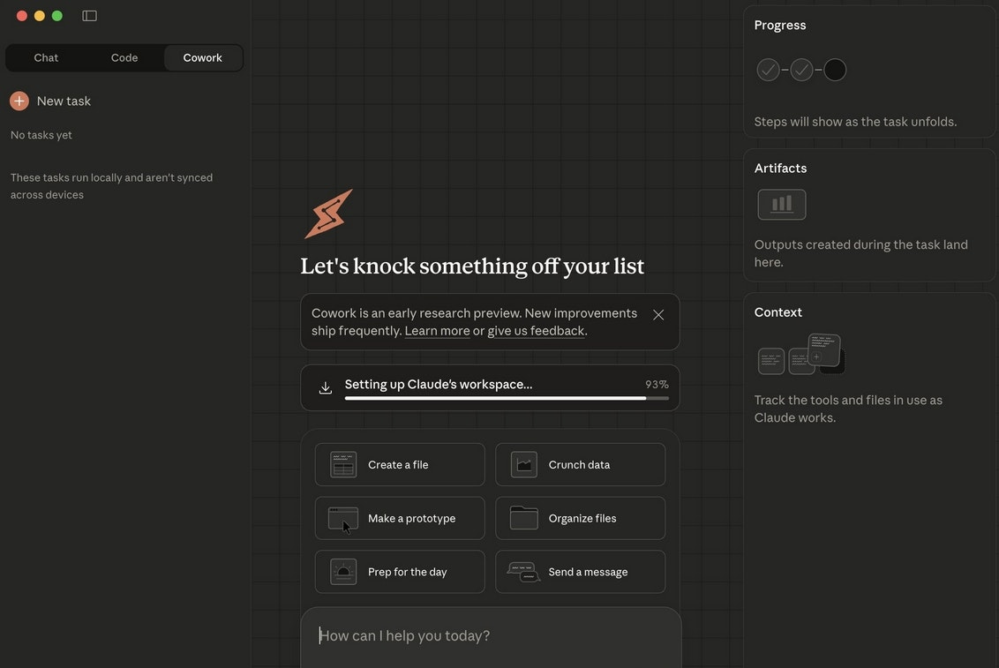
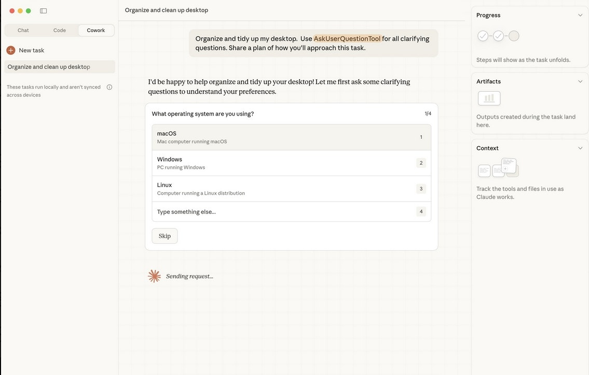
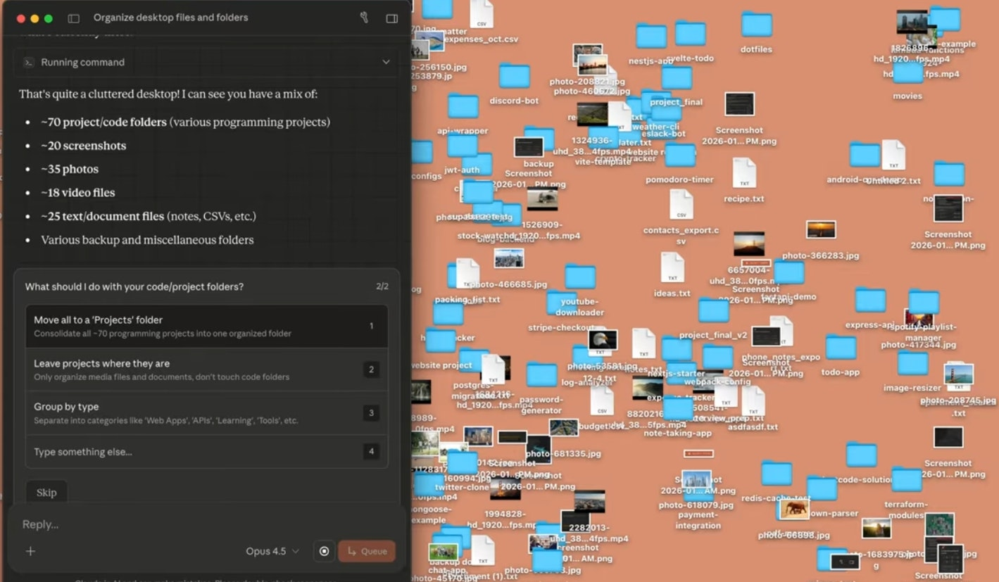

---

## 2. [Bookmarkify](https://www.producthunt.com/products/bookmarkify-2?utm_campaign=producthunt-api&utm_medium=api-v2&utm_source=Application%3A+antigravity_test+%28ID%3A+258588%29)
**Votes**: 277 | **Tagline**: Collect websites, images, and videos into visual boards

### 📌 요약
디자이너를 위해 특화된 올인원 북마크 관리 툴로, 웹사이트, 이미지, 영상을 시각적인 보드에 모으고 실시간 분석 및 팀 협업을 지원합니다.

### 🔑 핵심 기능
- 탭 전환 없이 툴 내에서 라이브 웹사이트를 직접 확인하며 영감을 수집하고 정리할 수 있습니다.
- 수집된 웹사이트의 폰트와 색상을 즉시 분석하는 '디자인 우선' 기능을 제공합니다.
- 스크린샷과 파편화된 북마크 대신 유연한 보기 모드와 공유 공간을 통한 팀 협업 워크플로우를 제공합니다.

### 📸 스크린샷 및 갤러리
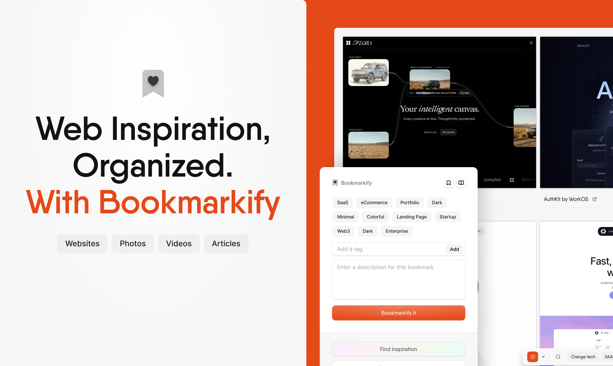
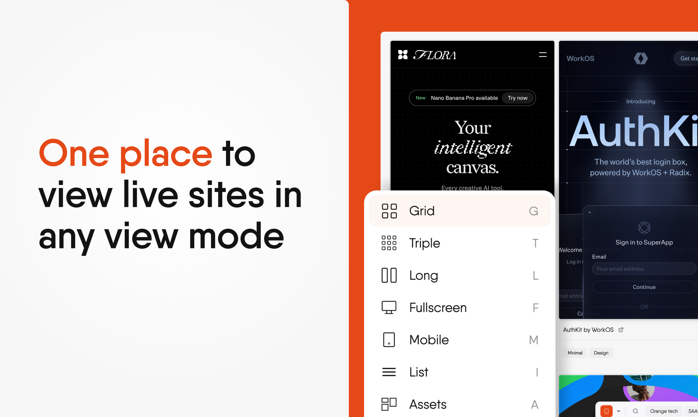
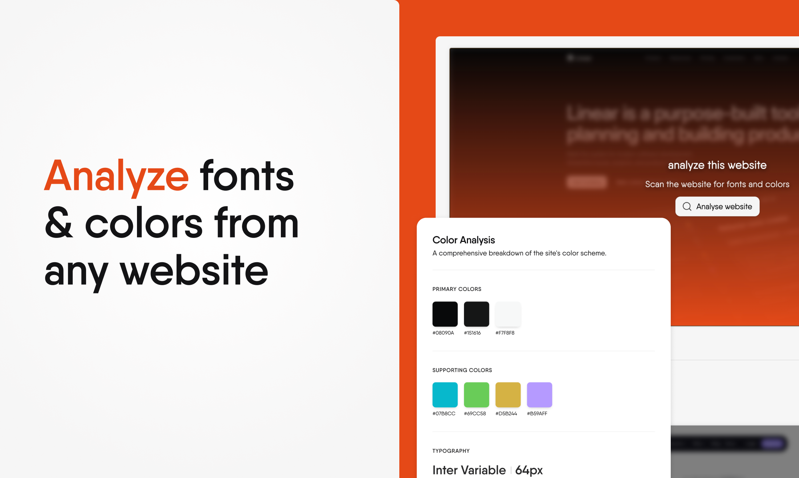

### 🎬 관련 영상
- [🎥 영상 보기](https://ph-files.imgix.net/89f4e468-94c9-4bf0-95f3-d905721c8f67.jpeg?auto=format)

---

## 3. [Atoms](https://www.producthunt.com/products/atoms-2?utm_campaign=producthunt-api&utm_medium=api-v2&utm_source=Application%3A+antigravity_test+%28ID%3A+258588%29)
**Votes**: 223 | **Tagline**: Turn Ideas Into Business. From Vibe Coding to Vibe Business

### 📌 요약
아이디어를 실제 수익 창출이 가능한 라이브 앱으로 전환시켜주는 세계 최초의 '바이브 비즈니스 팀' 서비스입니다.

### 🔑 핵심 기능
- 시장 조사부터 디자인, 프론트엔드 및 백엔드 개발까지 전 과정을 원스톱으로 처리합니다.
- 인증(Auth) 및 결제 시스템 연결을 포함하여 즉시 수익화 가능한 앱을 배포합니다.
- 단순 프로토타입이 아닌, 실제 수익 창출이 가능한 완성형 비즈니스를 구축해 줍니다.

### 📸 스크린샷 및 갤러리
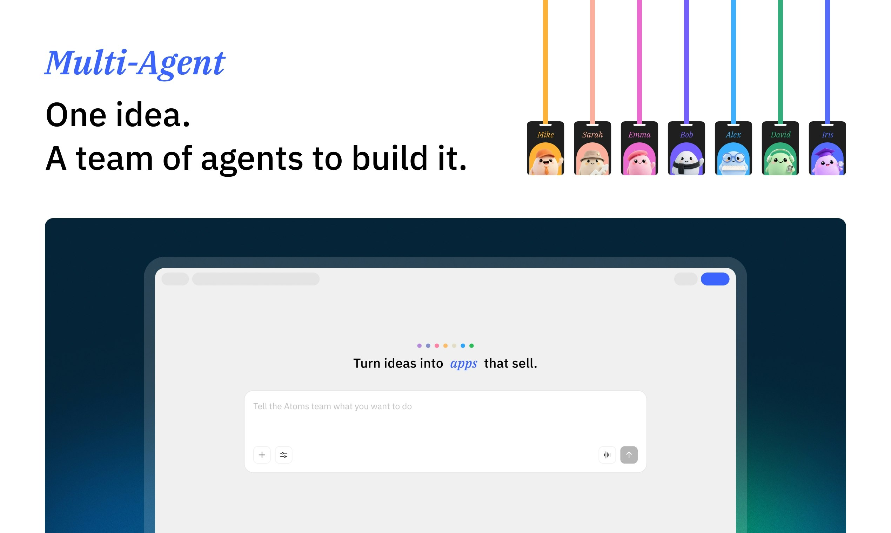
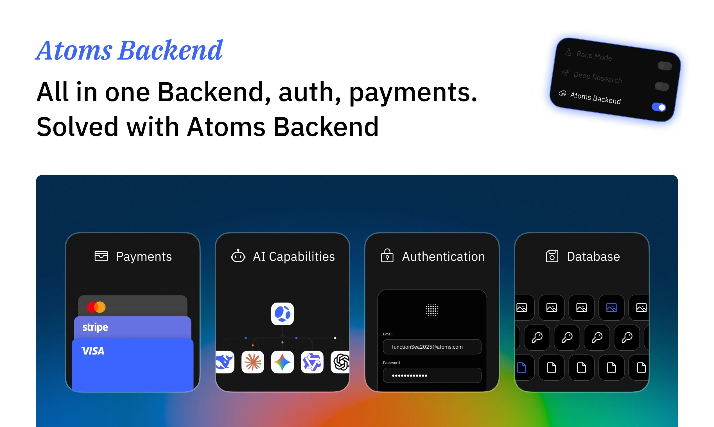
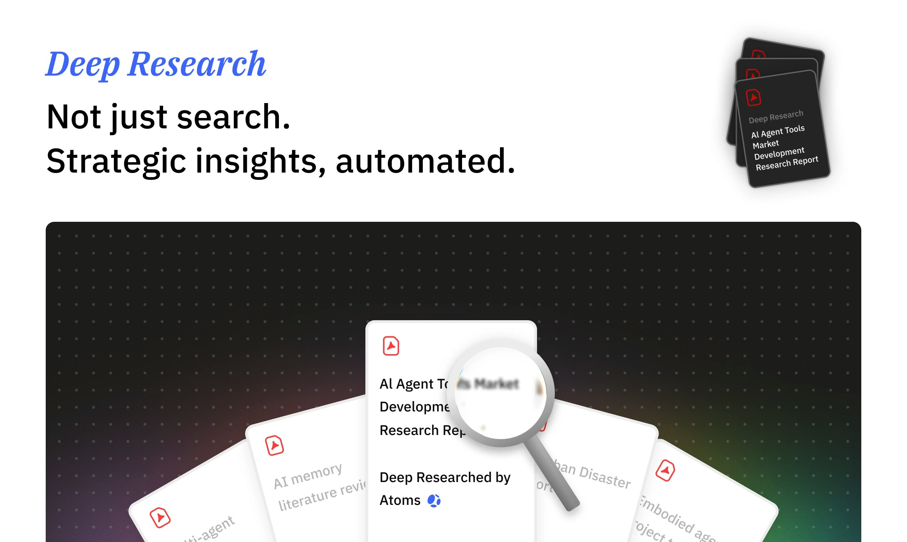

### 🎬 관련 영상
- [🎥 영상 보기](https://ph-files.imgix.net/e8e8651c-4582-4eb1-aaa4-23b4aca613a0.jpeg?auto=format)

---

## 4. [Alpine](https://www.producthunt.com/products/alpine?utm_campaign=producthunt-api&utm_medium=api-v2&utm_source=Application%3A+antigravity_test+%28ID%3A+258588%29)
**Votes**: 202 | **Tagline**: All your work in one place: docs, tasks, chat, AI and more

### 📌 요약
문서, 작업, 채팅 기능을 통합하고 AI 에이전트까지 결합하여 업무 효율을 극대화하는 올인원(All-in-one) 협업 플랫폼입니다.

### 🔑 핵심 기능
- 문서, 작업, 채팅 기능을 하나의 앱으로 통합하여 업무 파편화를 해결합니다.
- 회사 전체 업데이트를 알고리즘 기반 피드로 제공하여 중요한 정보를 놓치지 않게 합니다.
- 사용자의 모든 업무 맥락을 이해하는 AI 에이전트가 옆에서 작업을 지원합니다.
- 기존 툴과 함께 사용하거나 완전히 대체할 수 있는 유연성을 제공합니다.

### 📸 스크린샷 및 갤러리
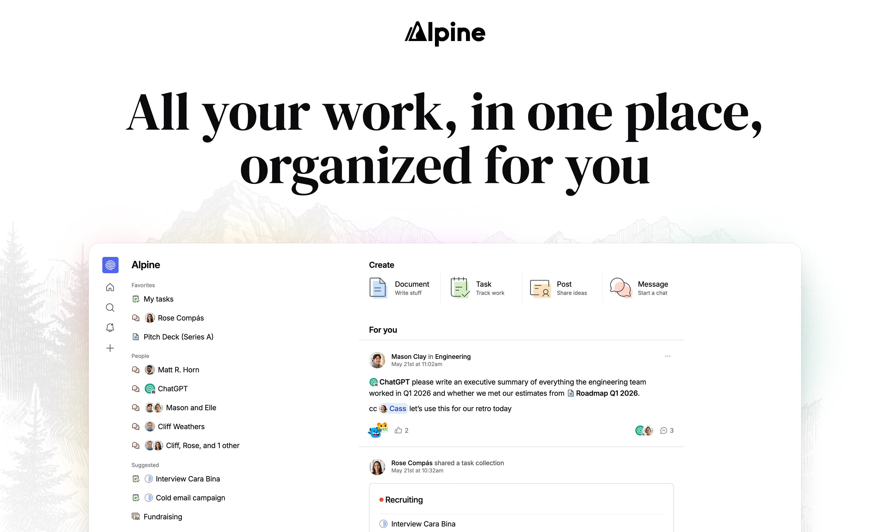
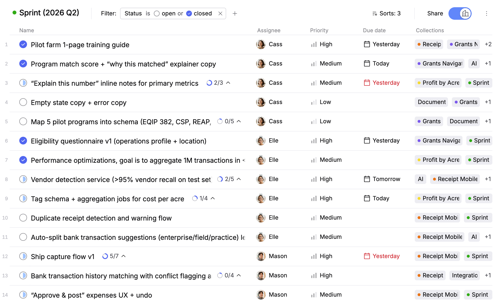
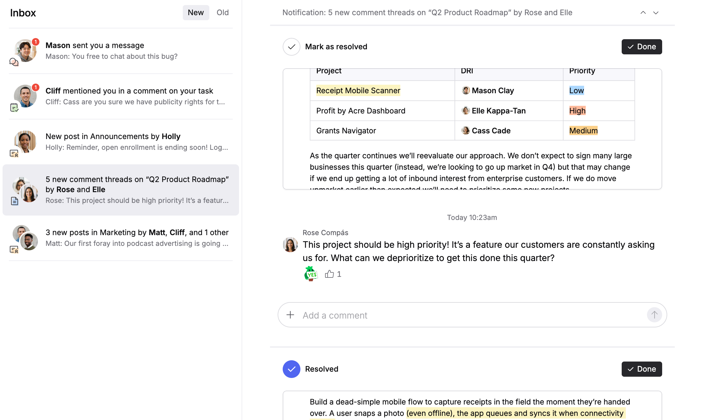

### 🎬 관련 영상
- [🎥 영상 보기](https://ph-files.imgix.net/55a66a3d-9297-4616-ab64-b9377132daa1.jpeg?auto=format)

---

## 5. [Phia](https://www.producthunt.com/products/phia?utm_campaign=producthunt-api&utm_medium=api-v2&utm_source=Application%3A+antigravity_test+%28ID%3A+258588%29)
**Votes**: 170 | **Tagline**: Create beautiful screen recordings automatically

### 📌 요약
Phia는 지능형 줌, 시네마틱 움직임 등 자동 편집 기능을 통해 전문가 수준의 화면 녹화 영상을 쉽게 만들 수 있는 macOS 전용 도구입니다.

### 🔑 핵심 기능
- 지능형 줌, 부드러운 커서 이동, 시네마틱 움직임 등 자동 영상 보정 기능 제공.
- 애니메이션 브랜드 타이틀과 슬라이드, 텍스트 등을 활용한 유연한 레이아웃 구성 지원.
- macOS 전용 네이티브 앱으로, 모든 작업이 오프라인 상태에서 로컬로 빠르게 처리됨.

### 📸 스크린샷 및 갤러리
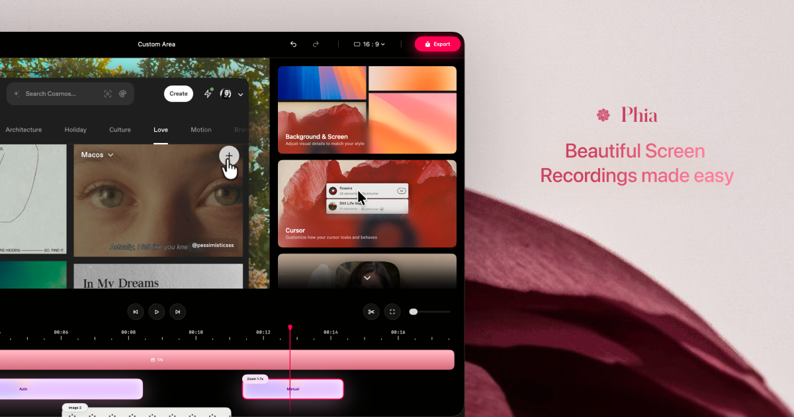

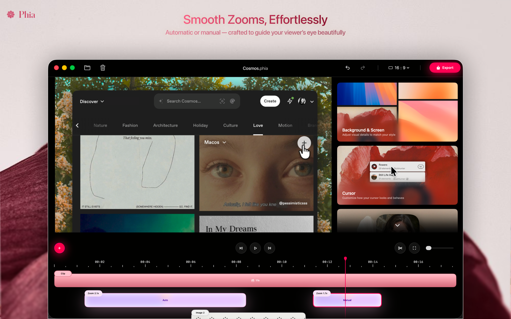

---

## 6. [Recent.dev](https://www.producthunt.com/products/recent-dev?utm_campaign=producthunt-api&utm_medium=api-v2&utm_source=Application%3A+antigravity_test+%28ID%3A+258588%29)
**Votes**: 129 | **Tagline**: Real-time changelog updates for your favorite tools

### 📌 요약
개발자들이 즐겨 사용하는 도구(Next.js, Attio 등)의 실시간 변경 로그 업데이트를 이메일로 즉시 받아볼 수 있게 해주는 서비스입니다.

### 🔑 핵심 기능
- 주요 도구의 업데이트 정보를 찾아 헤맬 필요 없이, 사용자 맞춤형 피드를 제공합니다.
- 파편화된 정보가 아닌, 사용자가 선택한 스택에 맞춰 즉각적인 이메일 알림을 제공합니다.
- 예기치 않은 중대한 변경(breaking changes)이나 새로운 기능을 누구보다 빠르게 파악하여 대응할 수 있도록 돕습니다.

### 📸 스크린샷 및 갤러리
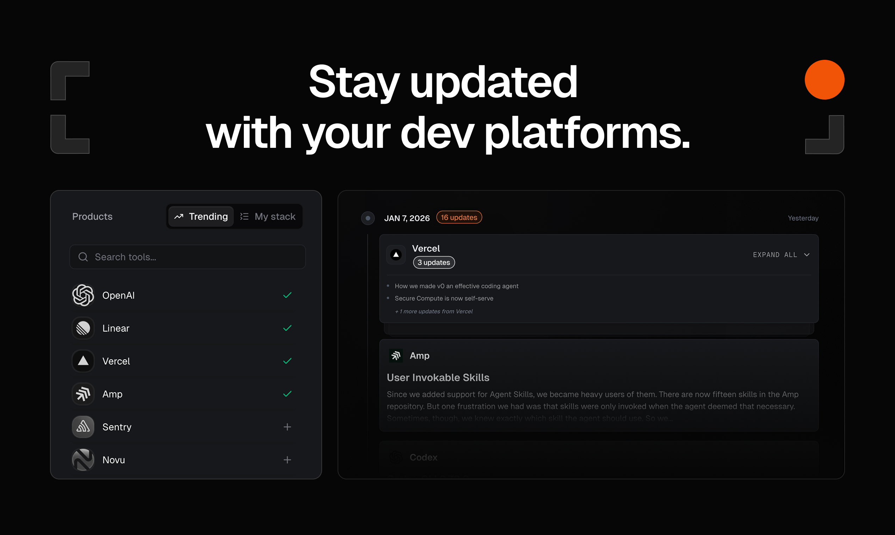

---

## 7. [Voquill](https://www.producthunt.com/products/voquill?utm_campaign=producthunt-api&utm_medium=api-v2&utm_source=Application%3A+antigravity_test+%28ID%3A+258588%29)
**Votes**: 128 | **Tagline**: The open source WisprFlow alternative

### 📌 요약
Voquill은 음성을 사용하여 기존 타이핑보다 4배 빠르게 텍스트를 입력하고 AI가 의도에 맞춰 자동으로 텍스트를 포맷해주는 오픈 소스 기반의 받아쓰기 도구입니다.

### 🔑 핵심 기능
- 음성 기반의 AI 받아쓰기 기능을 통해 타이핑 속도를 최대 4배까지 향상시킵니다.
- MacOS, Windows, Linux 등 모든 운영체제 및 모든 앱에서 네이티브로 실행됩니다.
- 사용자 의도를 파악하여 깔끔하게 포맷된 텍스트를 생성하며, 에이전트 모드를 지원합니다.

### 📸 스크린샷 및 갤러리

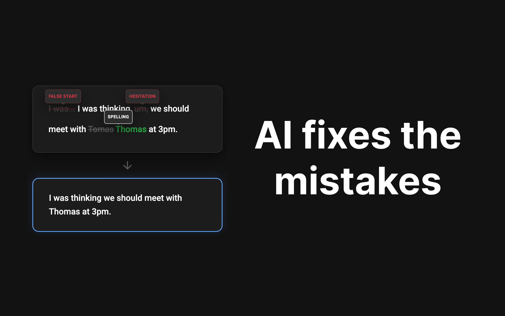

### 🎬 관련 영상
- [🎥 영상 보기](https://ph-files.imgix.net/60f6bc2d-0c05-4ba9-b297-f3ca5216d1e6.jpeg?auto=format)

---

## 8. [Meety 2.0](https://www.producthunt.com/products/meety-2?utm_campaign=producthunt-api&utm_medium=api-v2&utm_source=Application%3A+antigravity_test+%28ID%3A+258588%29)
**Votes**: 109 | **Tagline**: Google Cal in your menu bar & join meetings in one click

### 📌 요약
Meety 2.0은 macOS 메뉴 바에 구글 캘린더를 통합하여, 스케줄을 빠르고 편리하게 확인하고 클릭 한 번으로 미팅에 바로 참여할 수 있게 돕는 프라이버시 우선 생산성 도구입니다.

### 🔑 핵심 기능
- macOS 메뉴 바에서 구글 캘린더를 즉시 확인하고 원클릭으로 온라인 미팅에 빠르게 참여 가능.
- 신뢰할 수 있는 알림 시스템과 이벤트 생성/수정을 위한 완벽한 양방향 동기화 지원.
- 사용자 개인 정보 보호를 최우선으로 설계되었으며, macOS 환경에 최적화된 네이티브 앱.

### 📸 스크린샷 및 갤러리
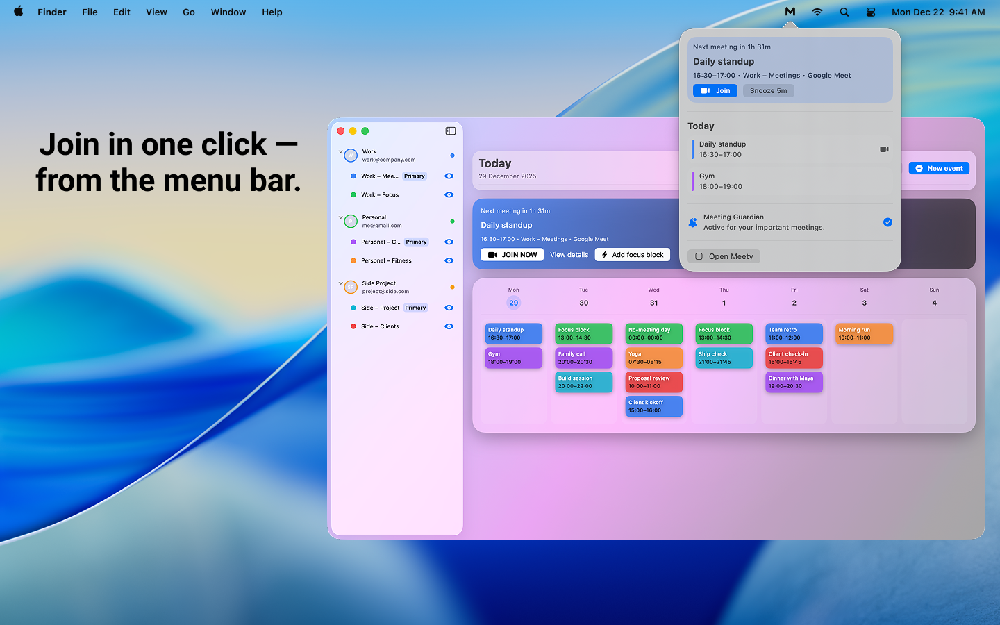

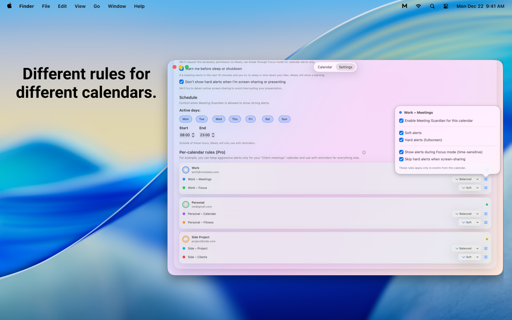

---

## 9. [anonity](https://www.producthunt.com/products/anonity-2?utm_campaign=producthunt-api&utm_medium=api-v2&utm_source=Application%3A+antigravity_test+%28ID%3A+258588%29)
**Votes**: 105 | **Tagline**: the private social media

### 📌 요약
알고리즘 기반 피드에서 벗어나 믿을 수 있는 사람들과 협력적인 '트리' 구조로 기억과 순간들을 영구 보존하는 비공개 소셜 미디어 서비스입니다.

### 🔑 핵심 기능
- 초대 전용 및 협업이 가능한 '트리' 구조로 비공개 아카이브를 구축합니다.
- 30레벨, 배지, 명예 등 RPG 방식의 게임화를 도입하여 참여를 유도합니다.
- 가지(branches)를 자유롭게 드래그 앤 드롭으로 배치하며 트리에 기여할 수 있습니다.

### 📸 스크린샷 및 갤러리

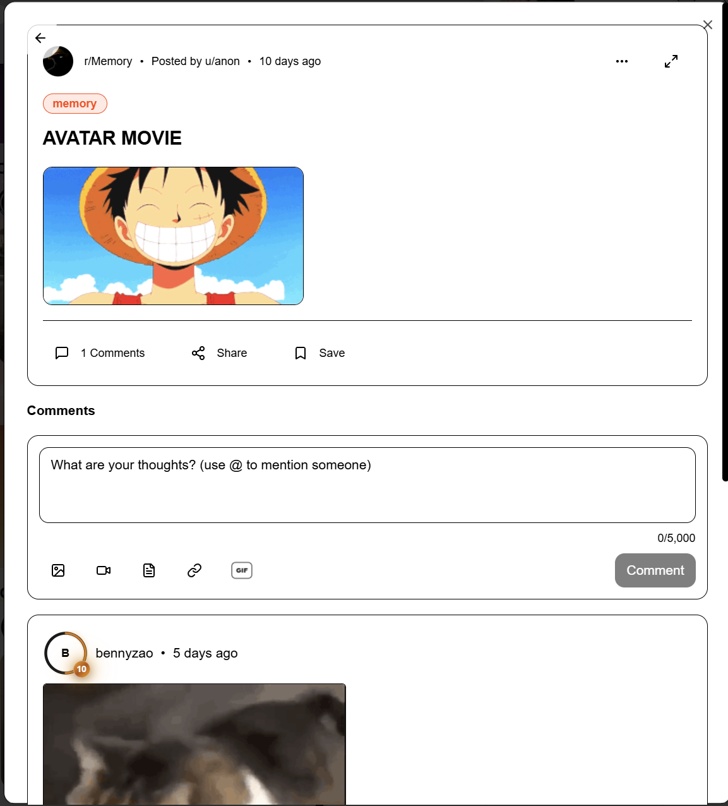

### 🎬 관련 영상
- [🎥 영상 보기](https://ph-files.imgix.net/3b0cfd58-f7ef-4e2f-bdf1-d6b0010f8f7e.jpeg?auto=format)

---

## 10. [WebTerm](https://www.producthunt.com/products/webterm?utm_campaign=producthunt-api&utm_medium=api-v2&utm_source=Application%3A+antigravity_test+%28ID%3A+258588%29)
**Votes**: 93 | **Tagline**: A browser terminal sandbox for learning CLI without fear

### 📌 요약
초보자도 두려움 없이 CLI(Command Line Interface)를 배울 수 있도록 돕는 웹 기반 터미널 샌드박스입니다.

### 🔑 핵심 기능
- 브라우저에서 즉시 접근 가능한 안전하고 일시적인(ephemeral) 터미널 환경 제공
- 계정 생성이나 복잡한 설치 없이 누구나 무료로 리눅스 및 Git 명령어를 학습 가능
- AI 시대 필수 역량인 CLI 활용 능력을 엔지니어와 비엔지니어 모두에게 안전하게 교육

### 📸 스크린샷 및 갤러리
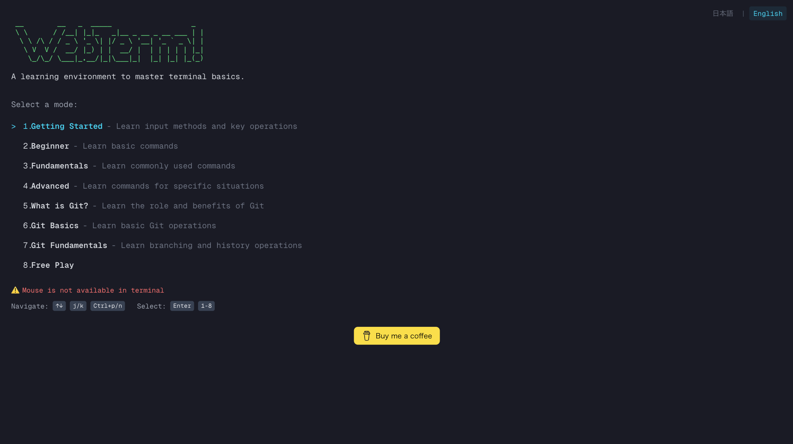
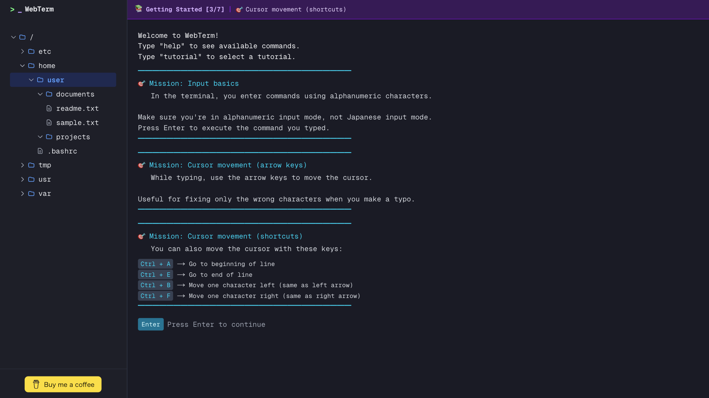
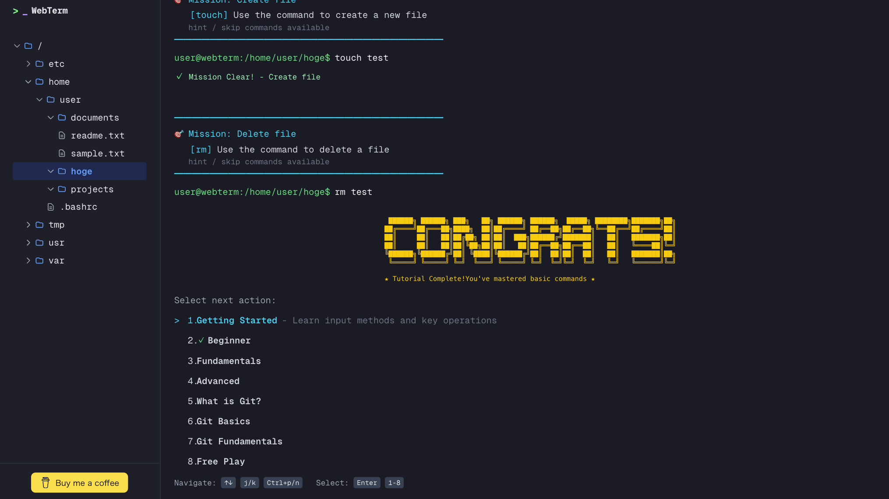

### 🎬 관련 영상
- [🎥 영상 보기](https://ph-files.imgix.net/54702173-2db0-4673-9776-6bb62296448b.jpeg?auto=format)

---

