# 🚀 Product Hunt Daily Top 10 (2026-01-14)

## 1. [remio 2.0](https://www.producthunt.com/products/remio-ai-note-taker?utm_campaign=producthunt-api&utm_medium=api-v2&utm_source=Application%3A+antigravity_test+%28ID%3A+258588%29)
**Votes**: 338 | **Tagline**: Captures your work to build a searchable knowledge base

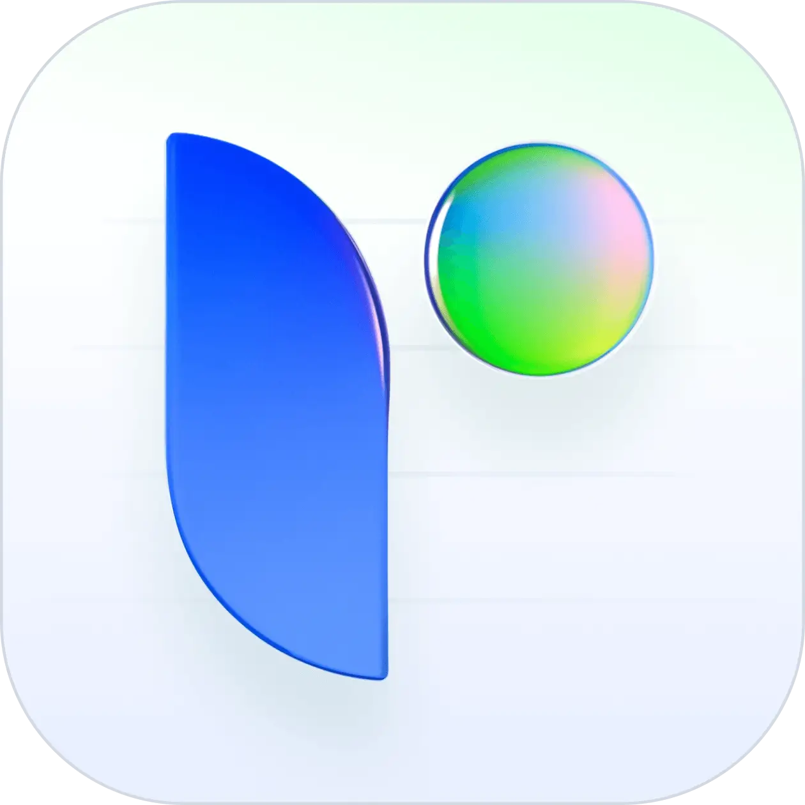

### 📌 요약
remio 2.0은 사용자의 모든 작업 컨텍스트를 동기화하여 검색 가능한 지식 기반을 자동으로 구축해주는 '노력 제로형' 세컨드 브레인(Second Brain) 구축 솔루션입니다.

### 🔑 핵심 기능
- 수동적인 데이터 입력 작업 없이 AI를 위한 지식 기반 자동 구축
- 사용자의 전체 작업 컨텍스트(Full Context)를 파악하여 높은 수준의 업무 이해도 제공
- 자연스러운 업무 흐름 속에서 검색 가능한 지식 베이스(Searchable Knowledge Base) 형성

### 📸 스크린샷 및 갤러리
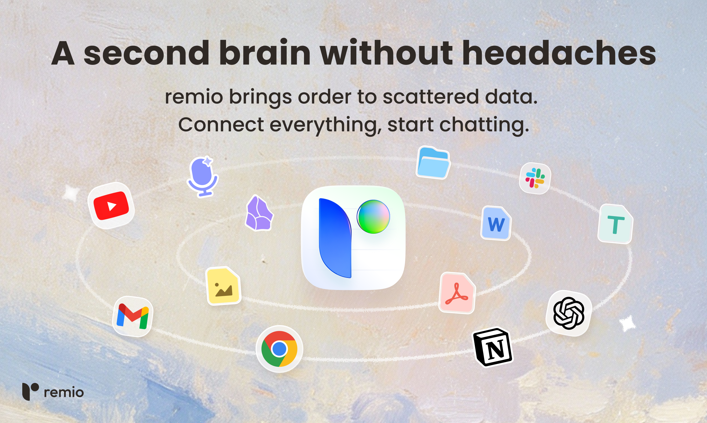
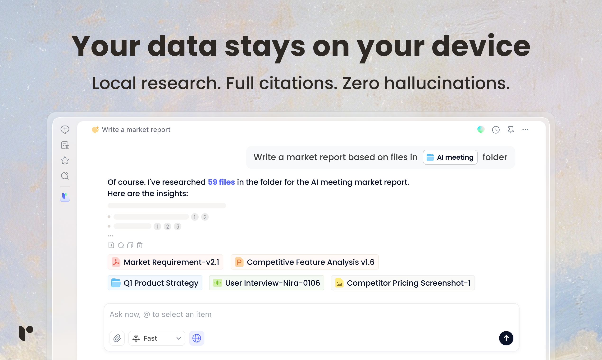
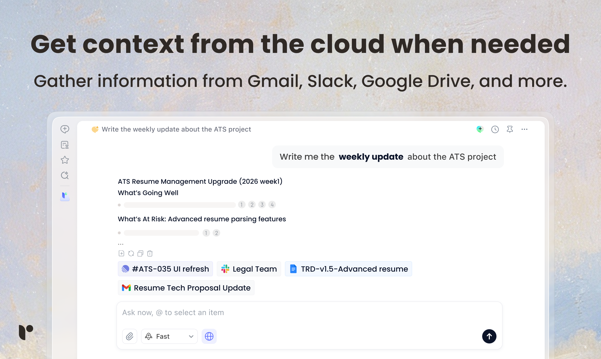

---

## 2. [Vellum](https://www.producthunt.com/products/vellum-ai?utm_campaign=producthunt-api&utm_medium=api-v2&utm_source=Application%3A+antigravity_test+%28ID%3A+258588%29)
**Votes**: 314 | **Tagline**: Build AI agents using plain English to do your boring tasks

### 📌 요약
평범한 영어 문장으로 원하는 작업을 설명하면 이를 실제 작동하는 AI 에이전트로 구축해주는 노코드 자동화 도구입니다.

### 🔑 핵심 기능
- 영어로 작업을 설명만 하면 AI 에이전트 구축 가능 (노코드, 최소 설정)
- 스케줄링, API 트리거, UI를 통해 구축된 에이전트 실행 및 활용
- 지루하고 반복적인 업무를 자동화하여 시간 절약 및 효율 증대

### 📸 스크린샷 및 갤러리
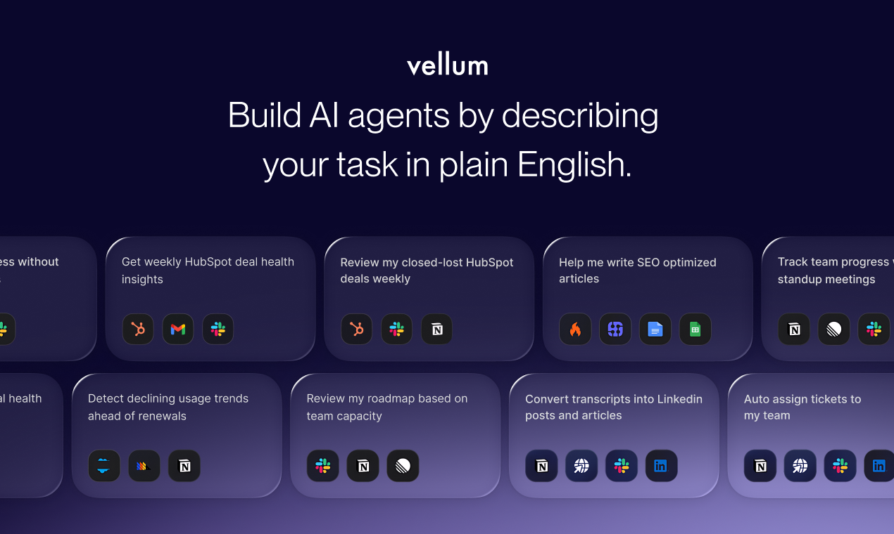
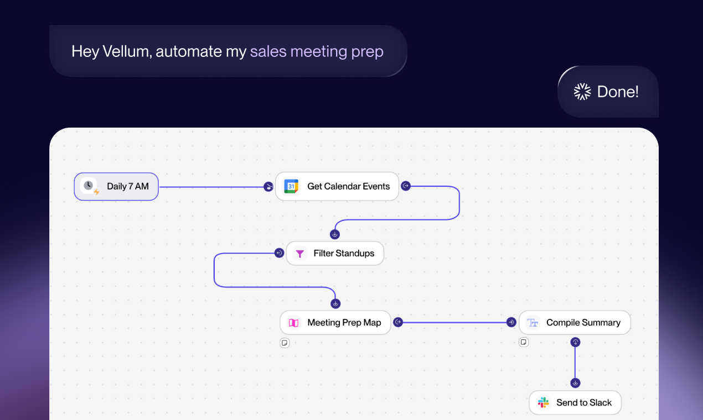
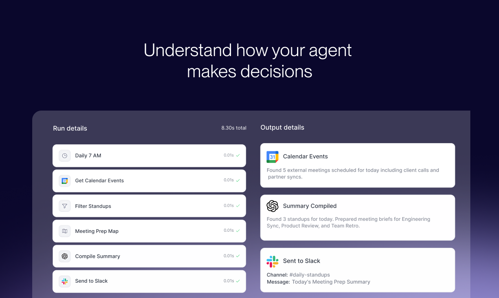

### 🎬 관련 영상
- [🎥 영상 보기](https://ph-files.imgix.net/5a8c0edb-38e7-407f-b67a-19809e1de9b1.jpeg?auto=format)

---

## 3. [Simpl.](https://www.producthunt.com/products/simpl-4?utm_campaign=producthunt-api&utm_medium=api-v2&utm_source=Application%3A+antigravity_test+%28ID%3A+258588%29)
**Votes**: 236 | **Tagline**: A pleasant Postgres browser for working with real data

### 📌 요약
Postgres 데이터베이스를 위한 직관적이고 미려한 인터페이스를 제공하여, 복잡한 엔터프라이즈 도구나 맞춤형 관리자 패널 없이도 데이터를 쉽게 탐색하고 공유할 수 있게 해주는 웹 브라우저입니다.

### 🔑 핵심 기능
- 연결 문자열만으로 즉시 사용 가능한 아름다운 브라우저 인터페이스 제공
- 지능형 필터링 및 외래 키(Foreign Key) 추적 기능으로 데이터 탐색 용이
- 솔로 개발자 및 소규모 팀을 위해 간편하고 유지보수가 필요 없도록 설계됨

### 📸 스크린샷 및 갤러리
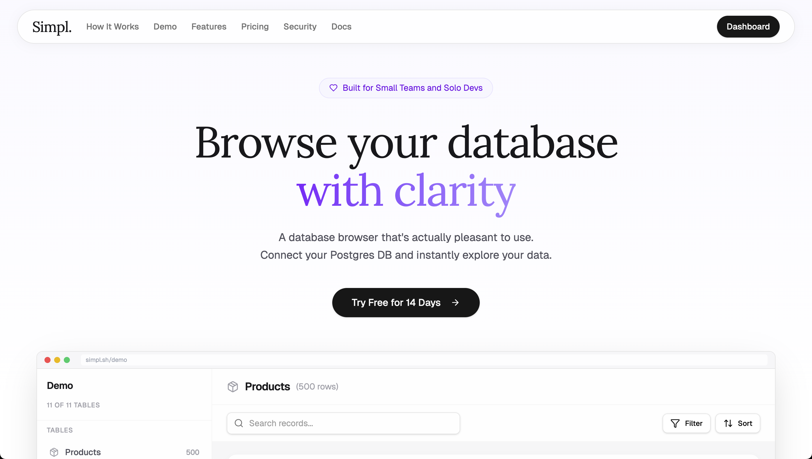
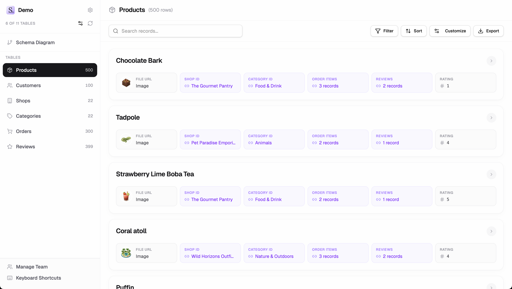
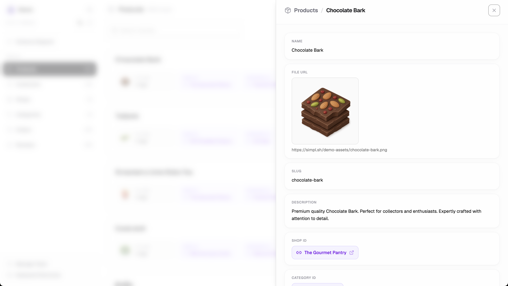

### 🎬 관련 영상
- [🎥 영상 보기](https://ph-files.imgix.net/1ef03e8f-cc11-47fb-b78b-1f6ee89e8d0a.jpeg?auto=format)

---

## 4. [0xCal](https://www.producthunt.com/products/0xcal?utm_campaign=producthunt-api&utm_medium=api-v2&utm_source=Application%3A+antigravity_test+%28ID%3A+258588%29)
**Votes**: 162 | **Tagline**: Type + capture your meals to log cals w/ Apple Health Sync

### 📌 요약
자연어 입력이나 사진 촬영만으로 칼로리를 기록하고 애플 건강 앱과 동기화하는 미니멀리즘 iOS 칼로리 트래커입니다.

### 🔑 핵심 기능
- AI를 활용하여 식사 내용을 자연어로 입력하거나 사진을 찍으면 칼로리를 자동 계산합니다.
- 복잡하고 구식인 기존 앱과 달리 다크 모드 우선의 미니멀하고 아름다운 iOS 네이티브 디자인을 제공합니다.
- 광고나 불필요한 기능 없이 깔끔하며, 사용 편의성을 극대화하여 칼로리 기록을 '귀찮은 일'이 아닌 '즐거운 일'로 만듭니다.

### 📸 스크린샷 및 갤러리
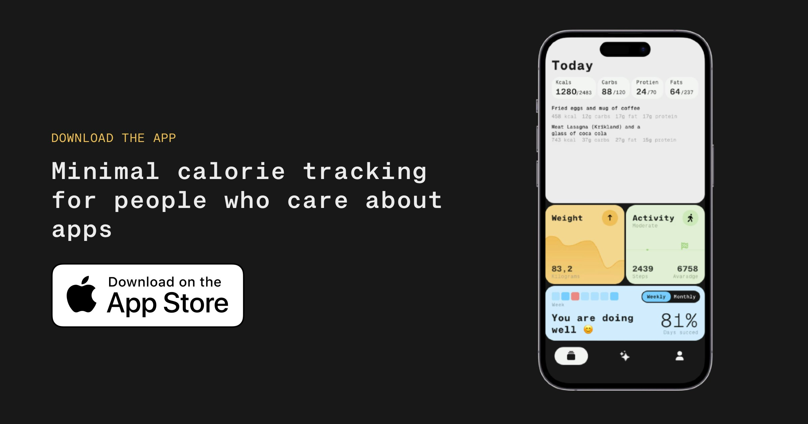
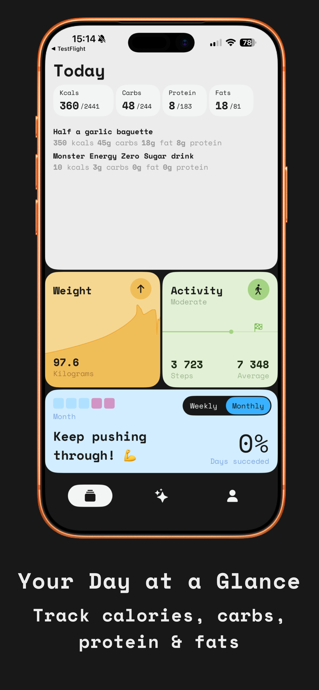
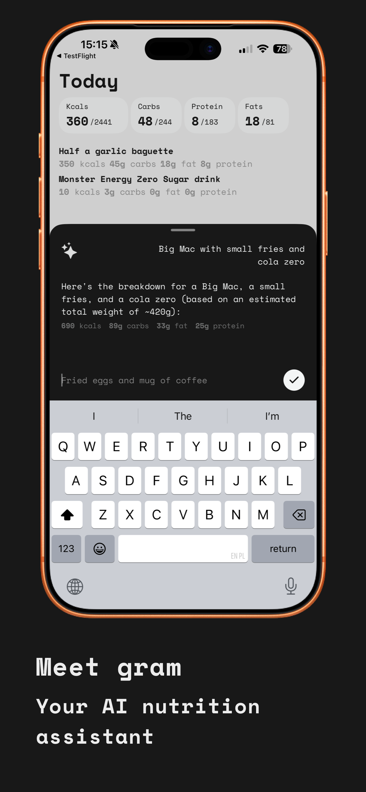

---

## 5. [Undiscord](https://www.producthunt.com/products/undiscord?utm_campaign=producthunt-api&utm_medium=api-v2&utm_source=Application%3A+antigravity_test+%28ID%3A+258588%29)
**Votes**: 145 | **Tagline**: Bulk leave discord servers

### 📌 요약
불필요한 디스코드 서버들을 한눈에 확인하고 안전하고 신속하게 대량 탈퇴할 수 있도록 돕는 서비스입니다.

### 🔑 핵심 기능
- 참여 중인 모든 디스코드 서버를 한곳에 모아 보여주는 대시보드 제공
- 더 이상 필요 없는 서버들을 간편하게 선택하여 일괄 탈퇴(Bulk Leave) 가능
- 사용자의 개인 정보와 안전을 최우선으로 보호하며 서비스 제공

### 📸 스크린샷 및 갤러리

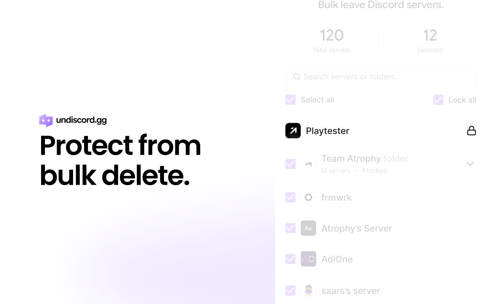

### 🎬 관련 영상
- [🎥 영상 보기](https://ph-files.imgix.net/f7f121cb-5894-4c7f-bc62-7cac119fb4ec.jpeg?auto=format)

---

## 6. [Ekamoira Google Search Console MCP](https://www.producthunt.com/products/ekamoira-gsc-mcp?utm_campaign=producthunt-api&utm_medium=api-v2&utm_source=Application%3A+antigravity_test+%28ID%3A+258588%29)
**Votes**: 129 | **Tagline**: Query Search Console in Claude & ChatGPT

### 📌 요약
번거로운 CSV 추출 과정 없이 ChatGPT, Claude를 통해 구글 서치 콘솔 데이터에 직접 질문하고 인사이트를 얻을 수 있게 해주는 SEO 데이터 분석 솔루션.

### 🔑 핵심 기능
- 수동 CSV 추출 및 업로드, LLM 데이터 환각(Hallucination) 오류 문제를 근본적으로 해결하여 정확성 확보.
- ChatGPT, Claude, Cursor 등 주요 LLM과 즉시 연동되며, 복잡한 데이터 질문을 자연어로 처리 가능.
- 구글 계정 연결만으로 설정이 완료되며, 터미널 명령어 또는 코딩 지식 불필요.

### 📸 스크린샷 및 갤러리
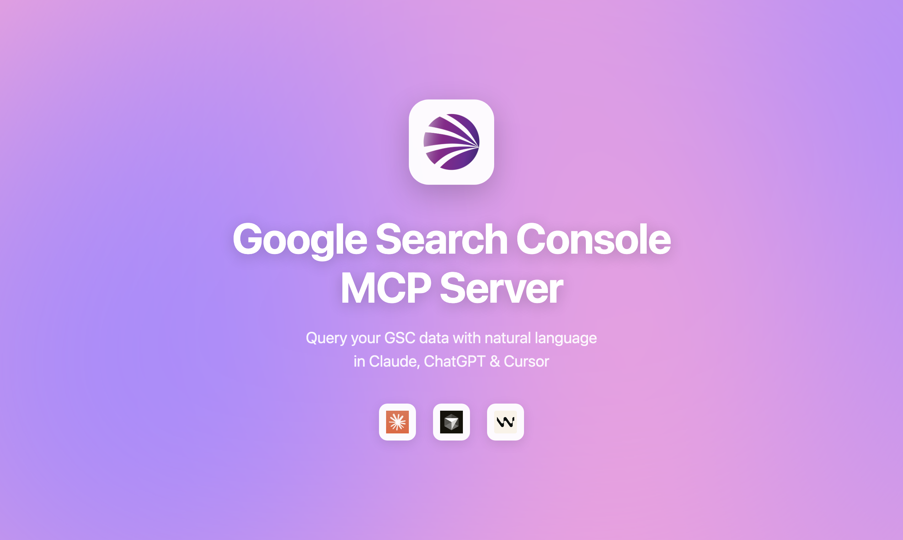
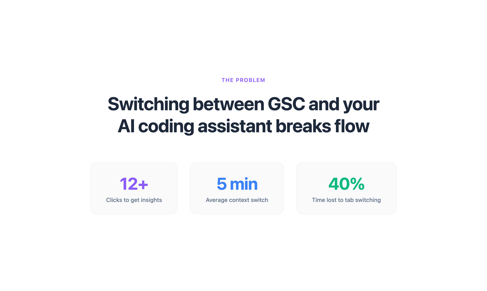
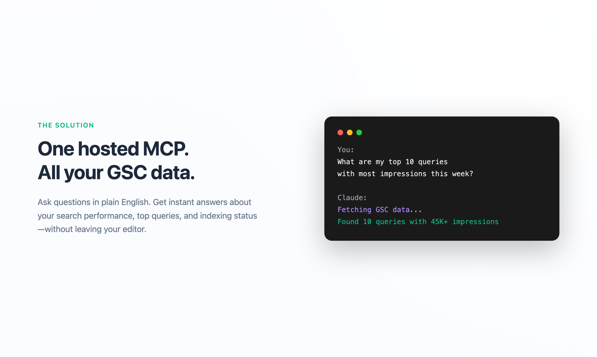

### 🎬 관련 영상
- [🎥 영상 보기](https://ph-files.imgix.net/e8042d20-46a6-4df9-9fd3-de5171b3df9a.jpeg?auto=format)

---

## 7. [Lyra Music](https://www.producthunt.com/products/lyra-music?utm_campaign=producthunt-api&utm_medium=api-v2&utm_source=Application%3A+antigravity_test+%28ID%3A+258588%29)
**Votes**: 108 | **Tagline**: Simple and free music discovery based on how you feel

### 📌 요약
사용자의 감정 기반으로 음악을 추천하며, 광고나 방해 요소 없이 플레이리스트를 자유롭게 즐길 수 있는 심플하고 무료인 음악 스트리밍 앱입니다.

### 🔑 핵심 기능
- Spotify, YouTube 플레이리스트 가져오기(Import) 기능 제공
- 광고나 숨겨진 기능 없이 완전히 무료로 제공되는 것이 특징
- 단순히 고음질을 위한 선택적 업그레이드만 존재하며, 모든 기능이 무료로 해제되어 있음

### 📸 스크린샷 및 갤러리

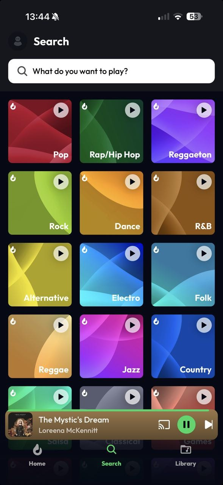

### 🎬 관련 영상
- [🎥 영상 보기](https://ph-files.imgix.net/b0f2d64a-6d9e-4d4f-b04f-a84de2f8d63a.jpeg?auto=format)

---

## 8. [Redlight Greenlight for Claude Code](https://www.producthunt.com/products/redlight-greenlight-for-claude-code?utm_campaign=producthunt-api&utm_medium=api-v2&utm_source=Application%3A+antigravity_test+%28ID%3A+258588%29)
**Votes**: 107 | **Tagline**: Accept or reject Claude Code permission from anywhere on Mac

### 📌 요약
터미널 전환 없이 macOS 메뉴바에서 바로 클로드(Claude) 코드 실행 권한 요청을 확인하고 승인/거부할 수 있게 해주는 네이티브 앱입니다.

### 🔑 핵심 기능
- Claude Code 권한 요청을 오버레이로 즉시 표시하여 놓치지 않음
- 터미널 창으로 이동할 필요 없이 Mac 어디서든 바로 권한 처리 가능
- macOS에 최적화된 네이티브 메뉴바 앱으로 사용자 경험 개선

### 📸 스크린샷 및 갤러리
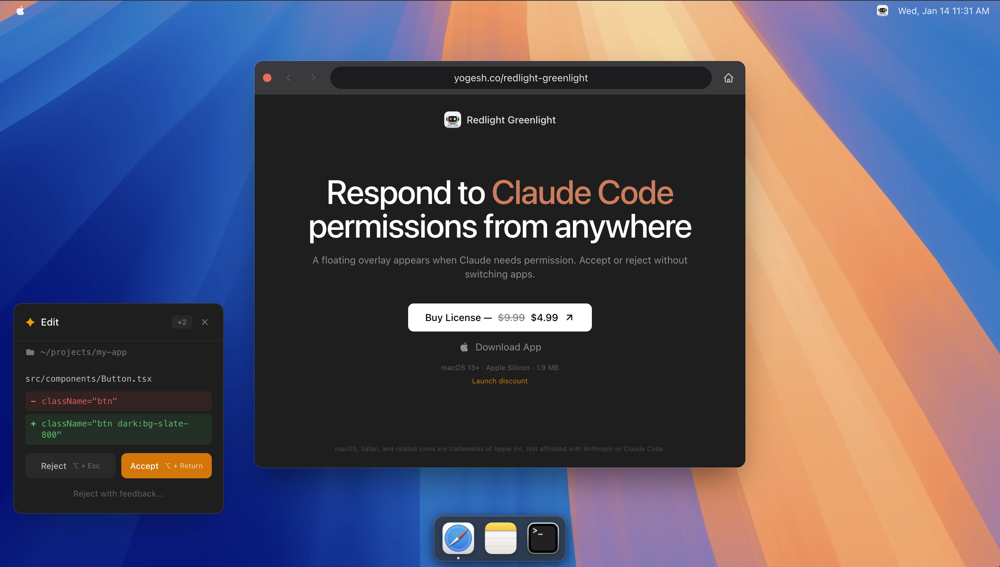
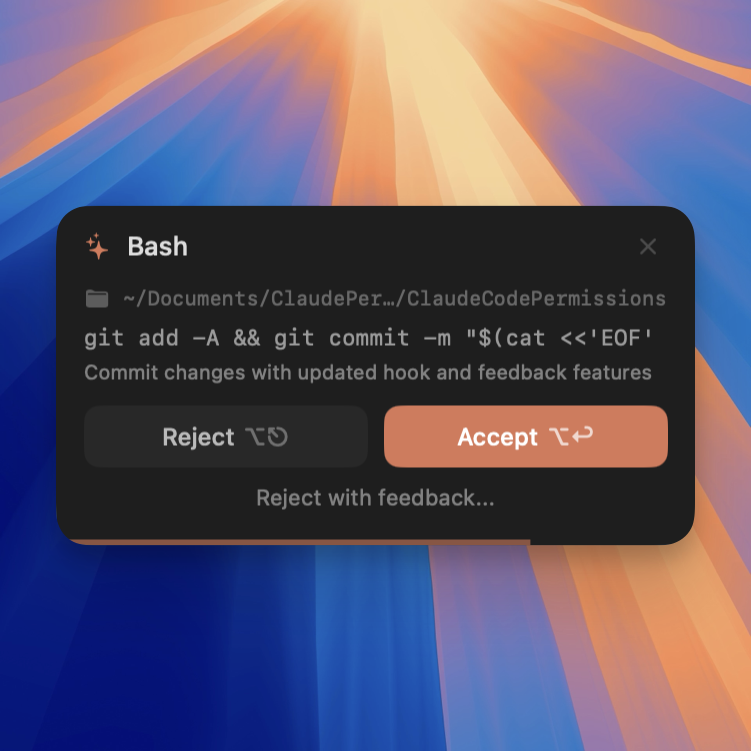

### 🎬 관련 영상
- [🎥 영상 보기](https://ph-files.imgix.net/81e8ea89-78e6-4fa4-b23d-6d3200fe428a.jpeg?auto=format)

---

## 9. [One Dot](https://www.producthunt.com/products/one-dot-a-living-timeline-wallpaper?utm_campaign=producthunt-api&utm_medium=api-v2&utm_source=Application%3A+antigravity_test+%28ID%3A+258588%29)
**Votes**: 101 | **Tagline**: Visualize your life in dots with a daily-updating wallpaper

### 📌 요약
매일 업데이트되는 배경화면을 통해 시간을 점(Dot)으로 시각화하여, 생산성 추적과 메멘토 모리(memento mori)의 영감을 주는 iOS용 자동화 도구입니다.

### 🔑 핵심 기능
- 시간의 흐름(일/주/월/분기)을 아름다운 고해상도 배경화면으로 점진적으로 시각화합니다.
- 매일 단 하나의 점이 추가되어 시간을 직관적으로 인지하고 생산성을 관리하도록 돕습니다.
- iOS 단축어(Shortcuts)를 활용하여 알림이나 별도 추적 없이 하루에 한 번 자동으로 배경화면을 업데이트합니다.
- 사용자 맞춤형 배경화면 생성 기능을 제공하여 메멘토 모리 철학을 일상에 적용할 수 있습니다.

### 📸 스크린샷 및 갤러리
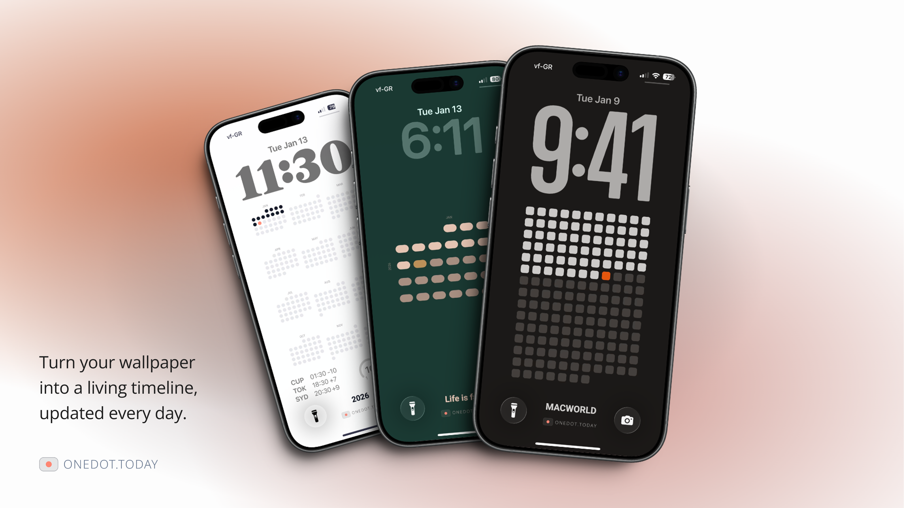
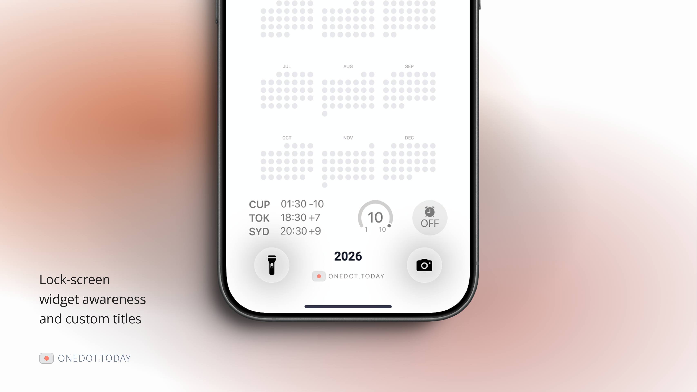
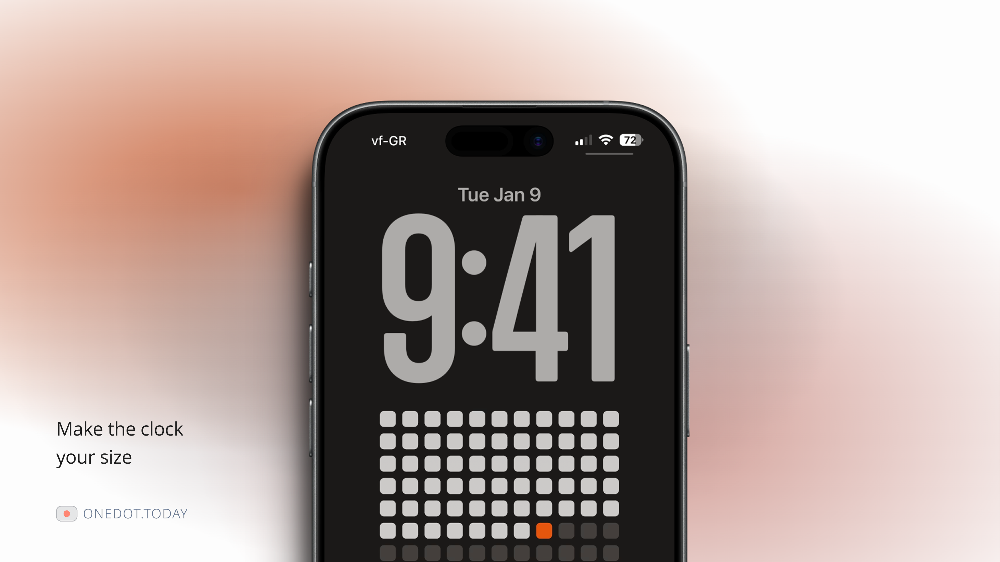

---

## 10. [Taphouse](https://www.producthunt.com/products/taphouse?utm_campaign=producthunt-api&utm_medium=api-v2&utm_source=Application%3A+antigravity_test+%28ID%3A+258588%29)
**Votes**: 94 | **Tagline**: The missing GUI for Homebrew

### 📌 요약
macOS의 필수 패키지 관리 도구인 Homebrew를 위한 완벽한 GUI를 제공하며, 보안 취약점 검사와 시스템 최적화 기능까지 통합한 올인원 솔루션입니다.

### 🔑 핵심 기능
- 모든 패키지에 대한 CVE 취약점 스캔 기능과 시스템 상태 점수를 보여주는 건강 대시보드 제공.
- 사용되지 않는 의존성(Orphaned Dependency) 정리와 잔여 파일(Leftover File) 감지를 통해 시스템을 최적화하고 공간 확보.
- 설치 전 패키지가 무엇을 설치할지 정확히 보여주는 미리보기 기능(Pre-install Inspection)과 코드 사이닝 검증 기능으로 설치 투명성 및 안전성 강화.

### 📸 스크린샷 및 갤러리
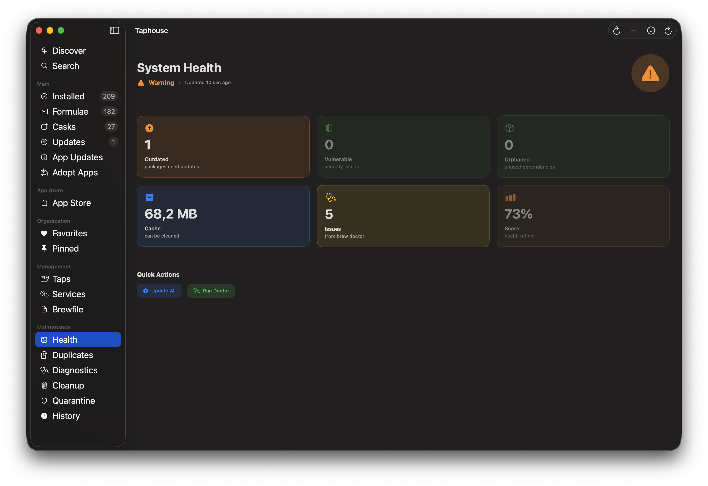
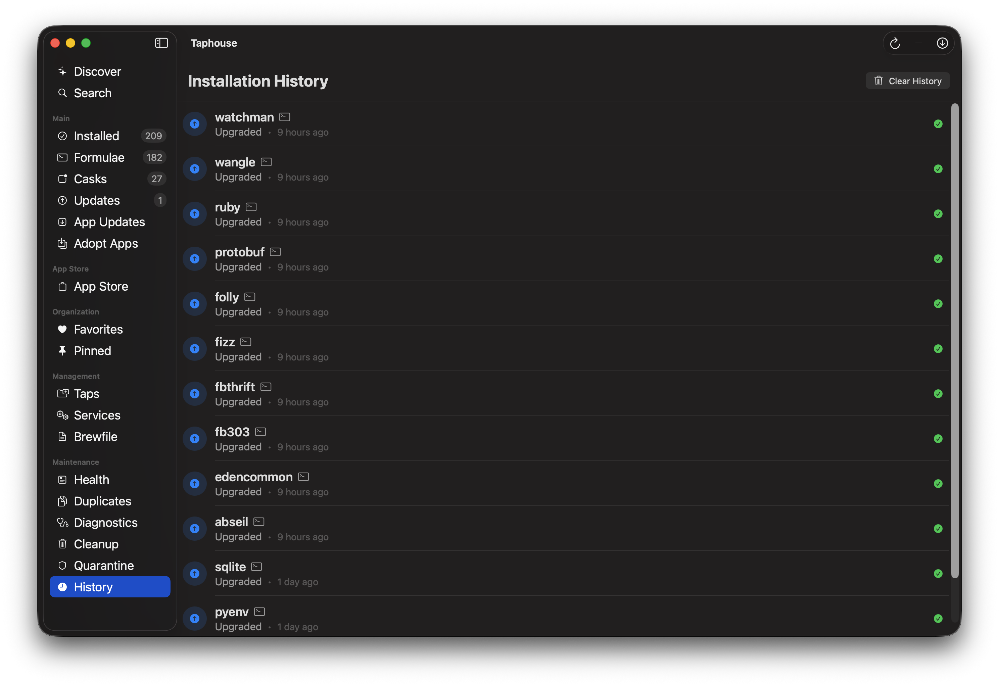
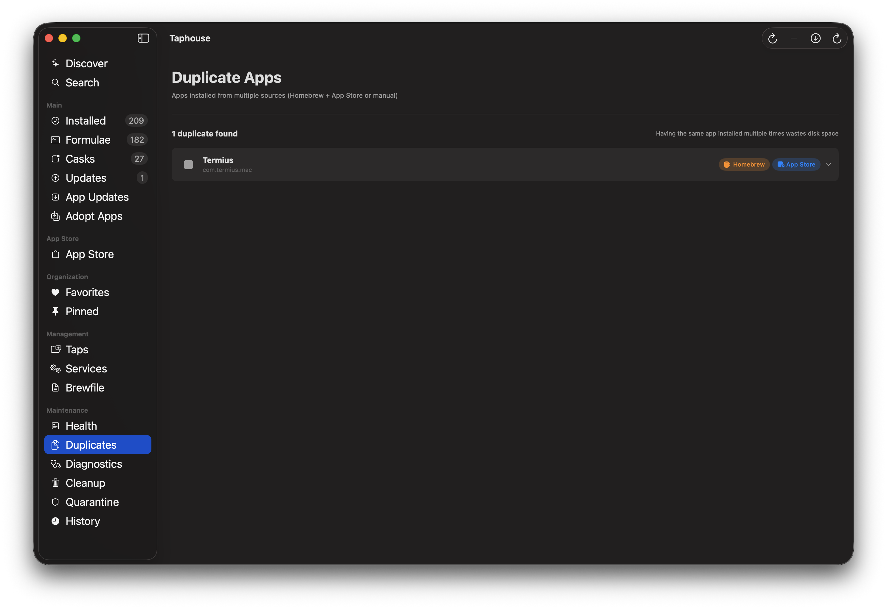

---

