# 🚀 Product Hunt Daily Top 10 (2026-01-15)

## 1. [Cal.com Companion Apps](https://www.producthunt.com/products/cal?utm_campaign=producthunt-api&utm_medium=api-v2&utm_source=Application%3A+antigravity_test+%28ID%3A+258588%29)
**Votes**: 427 | **Tagline**: Native iOS & Android App + Browser Extensions for scheduling

### 📌 요약
수많은 고객 요청 끝에 캘린더 솔루션인 Cal.com이 드디어 네이티브 iOS/안드로이드 앱과 주요 브라우저 확장 프로그램을 출시했습니다.

### 🔑 핵심 기능
- 4년 만에 출시된 공식 네이티브 iOS 및 안드로이드 컴패니언 앱을 제공합니다.
- Chrome, Firefox, Safari, Edge 등 주요 브라우저용 확장 프로그램을 지원하여 스케줄링 접근성을 높였습니다.
- 모바일 기기와 데스크톱 환경 모두에서 보다 쉽고 빠르게 일정을 관리하고 예약할 수 있습니다.

### 📸 스크린샷 및 갤러리

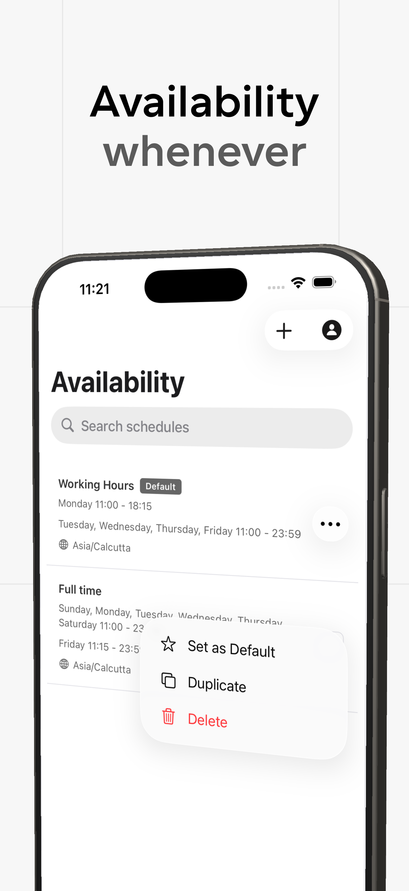
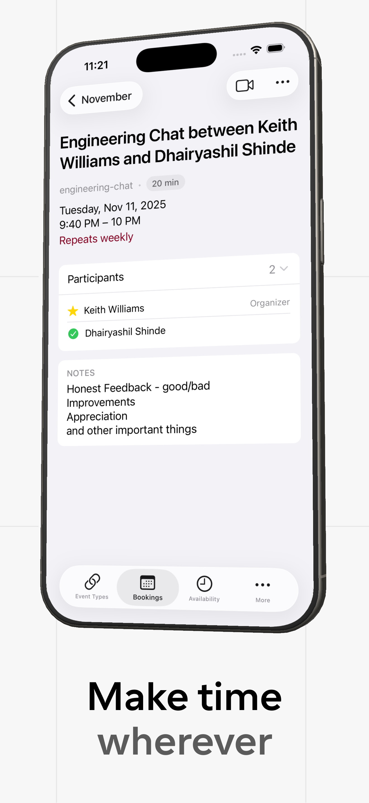

### 🎬 관련 영상
- [🎥 영상 보기](https://ph-files.imgix.net/cfcb9cb1-d55d-4e12-9ec4-b8127cc362d0.jpeg?auto=format)

---

## 2. [TeamOut AI ](https://www.producthunt.com/products/teamout?utm_campaign=producthunt-api&utm_medium=api-v2&utm_source=Application%3A+antigravity_test+%28ID%3A+258588%29)
**Votes**: 361 | **Tagline**: The AI that plans your events 

### 📌 요약
팀 오프사이트 및 기업 행사를 위한 최초의 AI 코파일럿으로, 숙소 추천부터 항공료 예상, 독점 할인까지 제공하며 이벤트 기획 과정을 자동화하고 최대 40% 비용 절감을 돕습니다.

### 🔑 핵심 기능
- 기업 행사 및 팀 오프사이트 기획을 위한 AI 코파일럿 솔루션입니다.
- 맞춤형 숙소 추천, 항공료 예상 견적, 독점 호텔 할인(최대 40% 절감)을 즉시 제공합니다.
- 기획자 없이도 아이디어 구상부터 예약 완료까지 빠르고 쉽게 진행할 수 있어 원격 팀과 스타트업에 적합합니다.

### 📸 스크린샷 및 갤러리

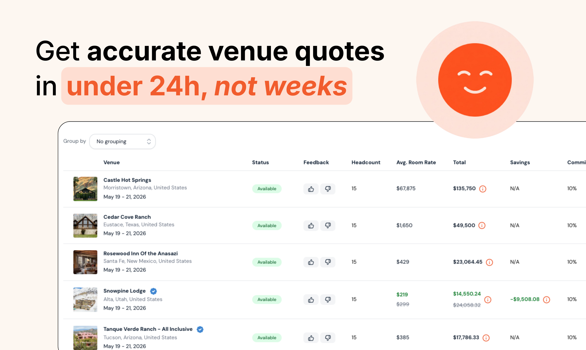

### 🎬 관련 영상
- [🎥 영상 보기](https://ph-files.imgix.net/feb695b4-ccd2-4e89-9f57-d0bc3d39f85a.jpeg?auto=format)

---

## 3. [folk Assistants](https://www.producthunt.com/products/folk-2?utm_campaign=producthunt-api&utm_medium=api-v2&utm_source=Application%3A+antigravity_test+%28ID%3A+258588%29)
**Votes**: 254 | **Tagline**: Sales Assistants working 24/7 to help you close more deals

### 📌 요약
CRM 데이터를 기반으로 회사 조사, 아웃리치 이메일 전송 등 영업 활동을 24시간 자동화하는 AI 영업 비서입니다.

### 🔑 핵심 기능
- CRM 연동을 통해 영업 데이터를 기반으로 선제적인(proactive) 조치 수행
- 회사 정보 조사 및 아웃리치 이메일 전송 등 영업 프로세스 자동화
- 진행 중인 딜 요약 및 후속 조치 대상 식별 기능 제공

### 📸 스크린샷 및 갤러리
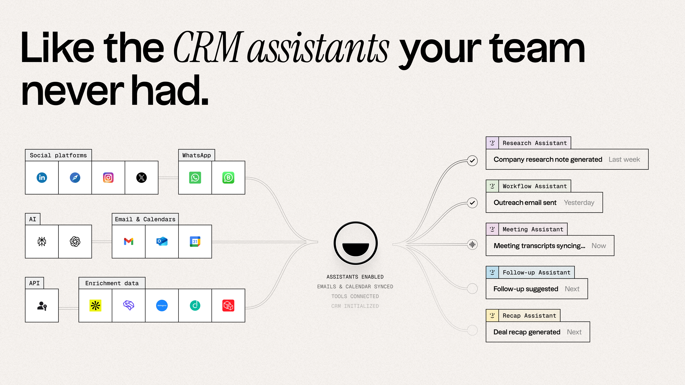
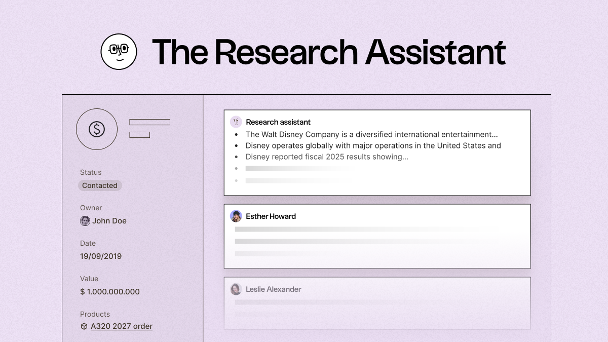
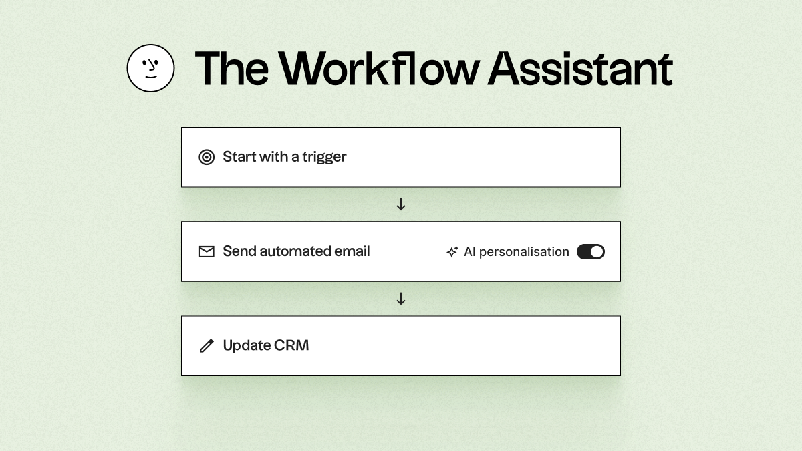

### 🎬 관련 영상
- [🎥 영상 보기](https://ph-files.imgix.net/75c0e743-4080-4bc7-9482-7ecf2b83888d.jpeg?auto=format)

---

## 4. [AI Test Engineer by BlinqIO](https://www.producthunt.com/products/ai-test-engineer-by-blinqio?utm_campaign=producthunt-api&utm_medium=api-v2&utm_source=Application%3A+antigravity_test+%28ID%3A+258588%29)
**Votes**: 218 | **Tagline**: Playwright code + self-healing tests w/ no vendor lock-in

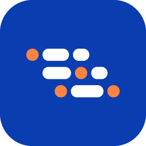

### 📌 요약
BlinqIO의 AI 테스트 엔지니어는 Playwright 기반의 테스트 코드를 자동으로 생성 및 유지보수하며, 앱 변경 시에도 자체 복구(self-healing) 기능을 제공하여 빠르고 안정적인 무접점 테스트 환경을 구축합니다.

### 🔑 핵심 기능
- Playwright 코드를 자동으로 생성하고 사용자의 저장소(repo)에 저장합니다.
- 앱 UI/UX 변경에도 자동으로 테스트를 수정(self-healing)하여 유지보수 비용을 절감합니다.
- 특정 벤더에 종속되지 않는(no vendor lock-in) 구조로 CI/CD 통합을 용이하게 합니다.

### 📸 스크린샷 및 갤러리
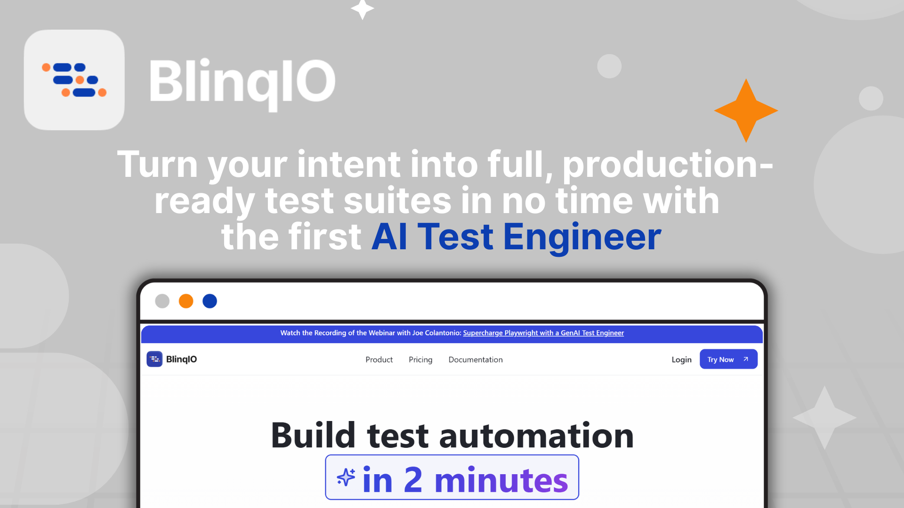
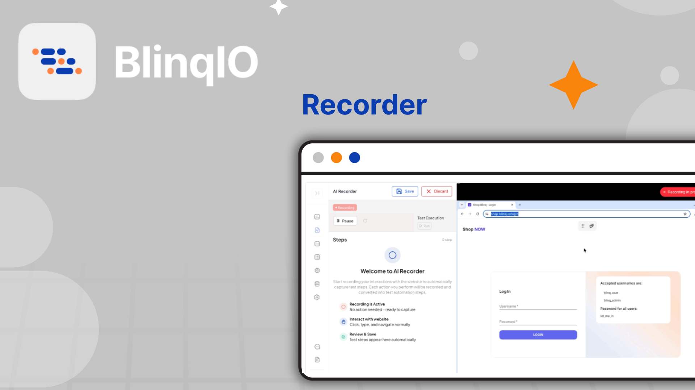
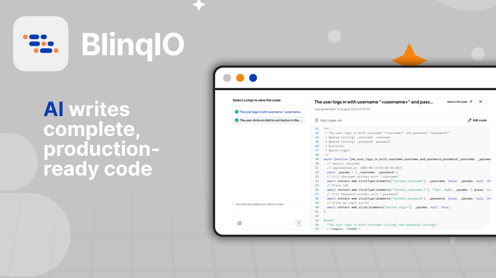

### 🎬 관련 영상
- [🎥 영상 보기](https://ph-files.imgix.net/bac83f84-7d94-4542-98a8-63d52c7c0354.jpeg?auto=format)

---

## 5. [Kiki for Mac](https://www.producthunt.com/products/kiki-for-mac?utm_campaign=producthunt-api&utm_medium=api-v2&utm_source=Application%3A+antigravity_test+%28ID%3A+258588%29)
**Votes**: 202 | **Tagline**: The accountability monster that keeps you focused on a task

### 📌 요약
주의가 산만해지면 경고를 보내고 몰입도를 유지하도록 돕는, 재미있고 강력한 맥(Mac) 전용 생산성 및 집중력 관리 도우미입니다.

### 🔑 핵심 기능
- 산만해질 때마다(예: 유튜브 시청) 불을 끄거나 불을 지르는 등 예측 불가능한 피드백을 제공하여 집중력을 강제합니다.
- 사용자가 원하는 포커스 영역과 허용 앱을 설정하면, Kiki가 사용자 옆에서 타이핑하며 함께 작업하는 듯한 느낌을 줍니다.
- 디지털 환경에서 집중력을 잃기 쉬운 현대인을 위한 '책임감 부여 괴물(accountability monster)' 역할을 수행합니다.

### 📸 스크린샷 및 갤러리
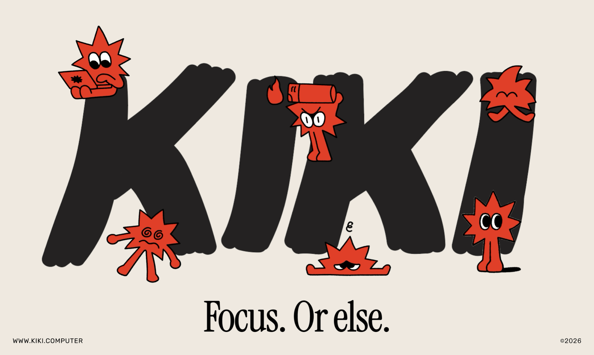
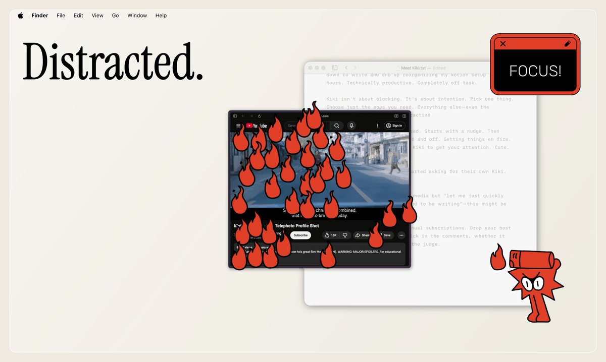
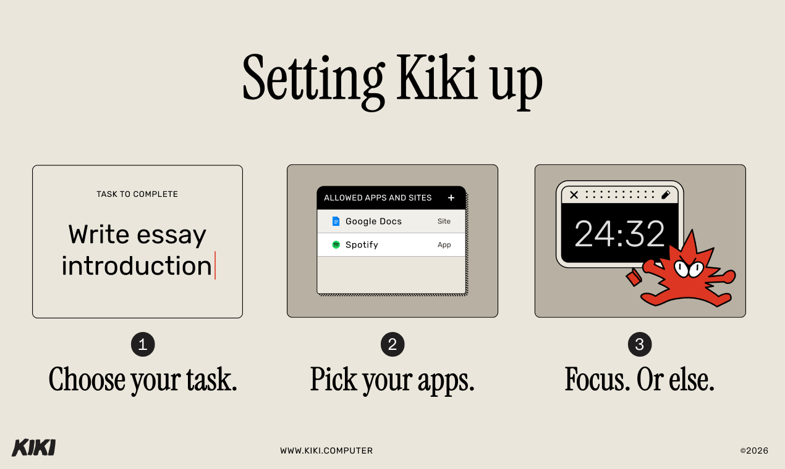

### 🎬 관련 영상
- [🎥 영상 보기](https://ph-files.imgix.net/30a7fbf3-21e3-47ab-9c75-216a0e8bd2e9.jpeg?auto=format)

---

## 6. [Indy](https://www.producthunt.com/products/indy-your-adhd-copilot?utm_campaign=producthunt-api&utm_medium=api-v2&utm_source=Application%3A+antigravity_test+%28ID%3A+258588%29)
**Votes**: 156 | **Tagline**: AI support for your ADHD, not just your to-do list

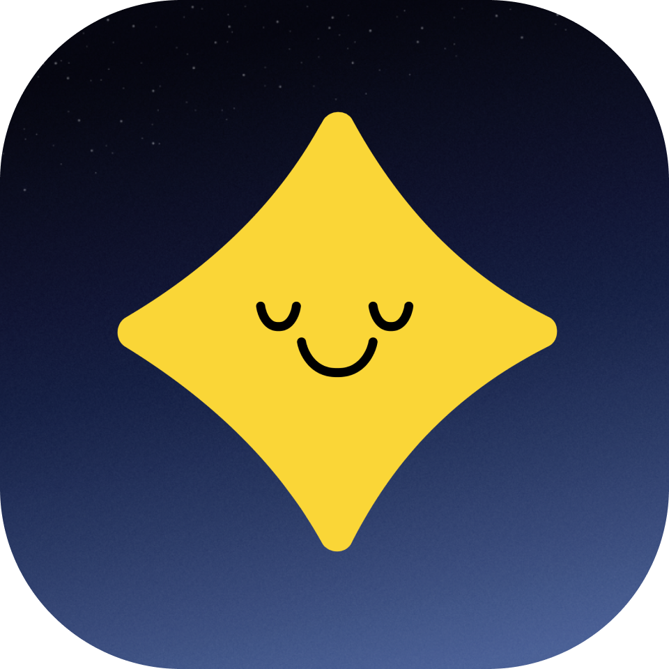

### 📌 요약
행동 과학과 8만 건 이상의 코칭 데이터를 기반으로, 단순한 할 일 관리를 넘어 ADHD 뇌가 실제로 작동하는 방식에 맞춘 무료 AI 기반 ADHD 지원 앱입니다.

### 🔑 핵심 기능
- ADHD 사용자의 일상 연결성을 유지하도록 돕는 인공지능 지원 시스템 제공.
- 미래 설계(Future-mapping)와 일상 구조화(Daily scaffolding)를 통해 동기 부여 및 실행 능력 강화 지원.
- 행동 과학적 통찰과 적응형 시스템을 활용하여 개인에게 최적화된 맞춤형 프롬프트 제공.

### 📸 스크린샷 및 갤러리
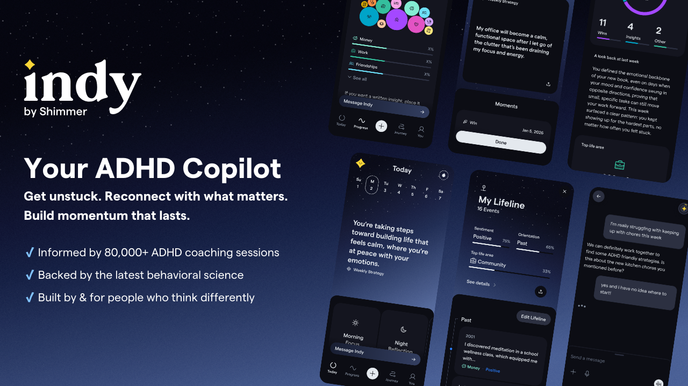
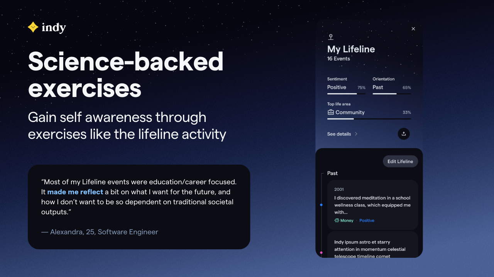
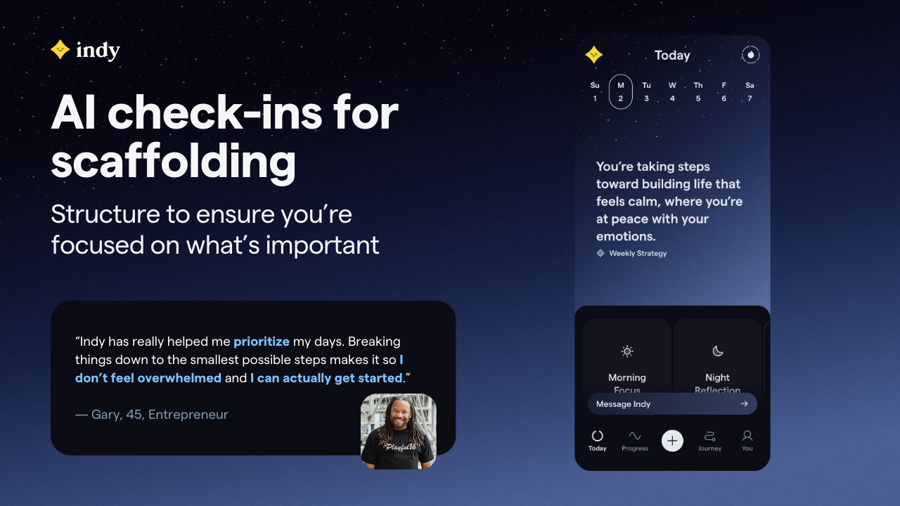

### 🎬 관련 영상
- [🎥 영상 보기](https://ph-files.imgix.net/d23556e6-8a7b-4b2c-9e83-566f78da3b83.jpeg?auto=format)

---

## 7. [Binary](https://www.producthunt.com/products/binary?utm_campaign=producthunt-api&utm_medium=api-v2&utm_source=Application%3A+antigravity_test+%28ID%3A+258588%29)
**Votes**: 152 | **Tagline**: Hiring software that is fast, simple and AI powered

### 📌 요약
AI 기반의 빠르고 간결한 채용 과정을 원하는 기업을 위한 차세대 인재 관리 시스템(ATS)입니다.

### 🔑 핵심 기능
- 속도와 단순성에 초점을 맞춘 새로운 시대의 ATS 솔루션입니다.
- AI를 활용하여 채용 과정을 간소화하고 효율성을 높입니다.
- 무제한 채용 공고와 지원자 관리가 가능한 '평생 무료(Free Forever)' 플랜을 제공합니다.

### 📸 스크린샷 및 갤러리

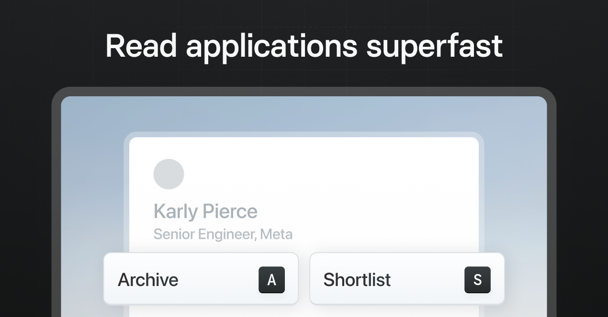
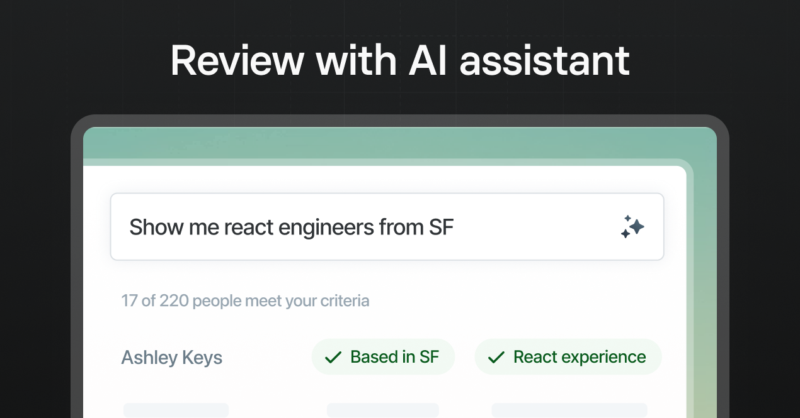

### 🎬 관련 영상
- [🎥 영상 보기](https://ph-files.imgix.net/2f2245f9-b7fb-443a-a2ae-08d3ff90791a.jpeg?auto=format)

---

## 8. [LyzrGPT](https://www.producthunt.com/products/lyzrgpt?utm_campaign=producthunt-api&utm_medium=api-v2&utm_source=Application%3A+antigravity_test+%28ID%3A+258588%29)
**Votes**: 144 | **Tagline**: Private, secure & model-agnostic AI chat for enterprises

### 📌 요약
LyzrGPT는 기업의 보안을 최우선으로 고려하여 구축된, 데이터 프라이버시를 완벽하게 보장하는 사설 엔터프라이즈급 AI 챗 플랫폼입니다.

### 🔑 핵심 기능
- 기업 자체 시스템 내에 배포되어 데이터의 완벽한 사설(Private) 보장 및 보안 확보
- OpenAI와 Anthropic 등 다양한 AI 모델을 한 대화 내에서 전환 가능하여 공급업체 종속(Vendor Lock-in) 방지
- 규제 산업 및 기업 환경에 최적화되어, 세션 간 안전한 문맥 기억(Contextual Memory) 유지

### 📸 스크린샷 및 갤러리
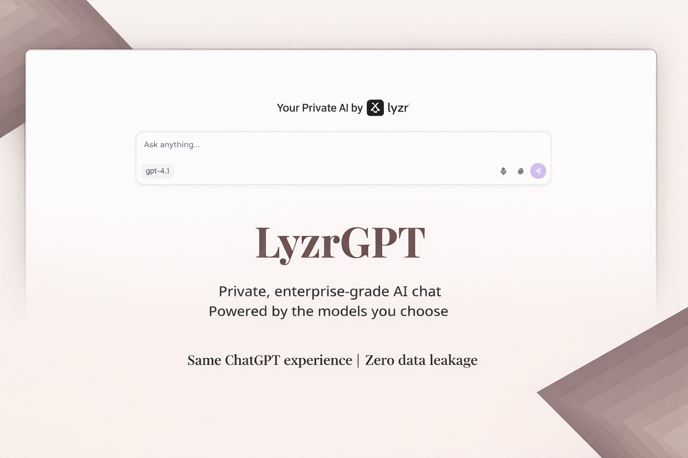
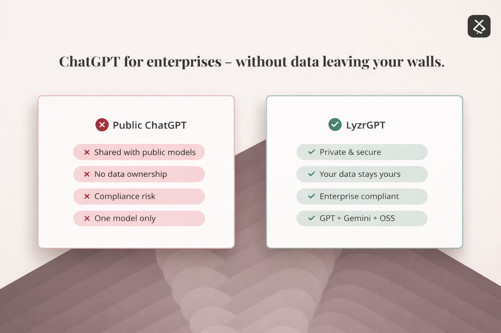
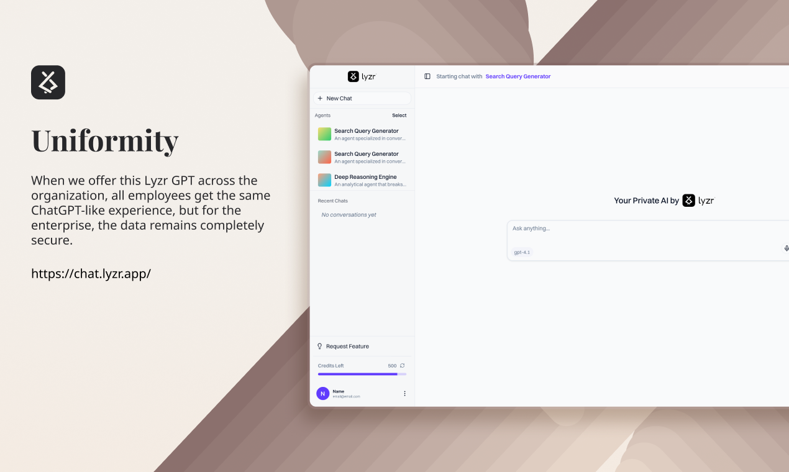

### 🎬 관련 영상
- [🎥 영상 보기](https://ph-files.imgix.net/834db07a-910a-483c-b539-2746c882bd41.jpeg?auto=format)

---

## 9. [Cursor AI Mobile](https://www.producthunt.com/products/cursor-mobile-remote-ide?utm_campaign=producthunt-api&utm_medium=api-v2&utm_source=Application%3A+antigravity_test+%28ID%3A+258588%29)
**Votes**: 125 | **Tagline**: Сontrol Cursor AI directly from your iPhone

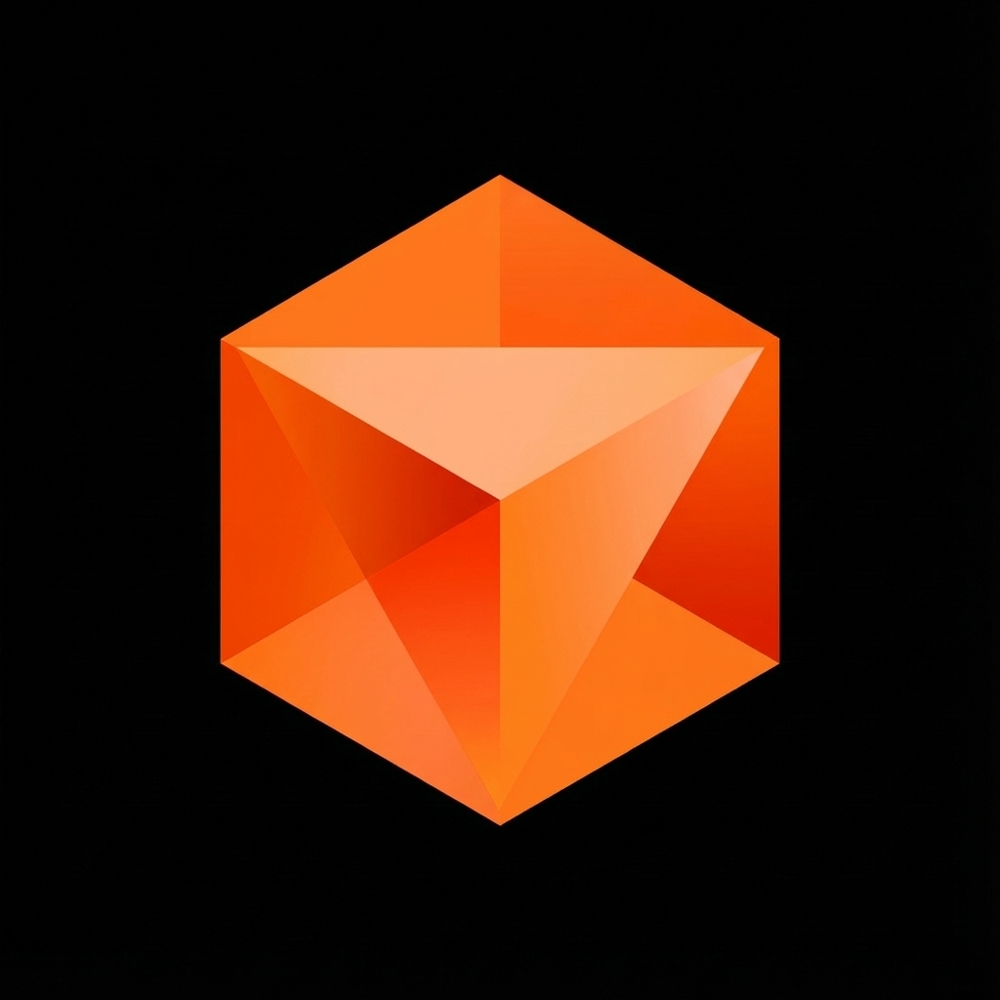

### 📌 요약
아이폰에서 직접 Cursor AI 코딩 어시스턴트를 제어하고, 맥(Mac) 환경과 실시간으로 연동하여 연속적인 개발 워크플로우를 지원하는 모바일 컴패니언 앱입니다.

### 🔑 핵심 기능
- 아이폰에서 직접 Cursor AI 제어 및 명령어 전송 가능
- 명령어는 Mac의 Cursor CLI에서 즉시 실행되며, 결과는 모바일로 실시간 동기화
- 모든 채팅 및 작업 기록이 장치 간에 동기화되어 끊김 없는 작업 흐름 제공

### 📸 스크린샷 및 갤러리
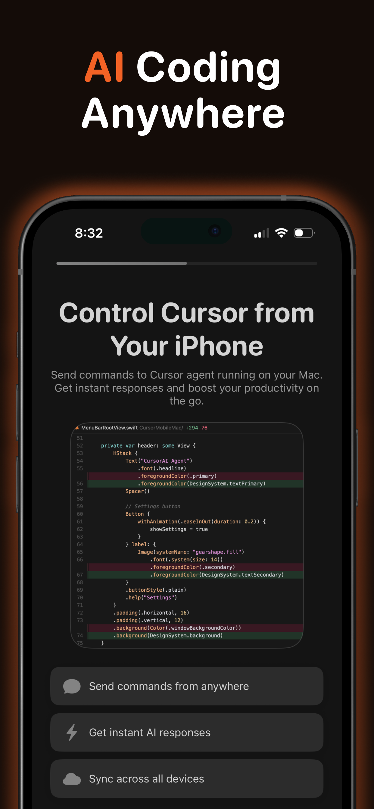
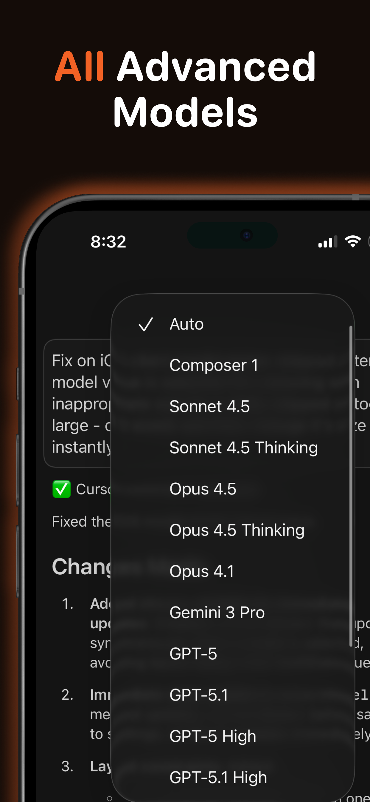
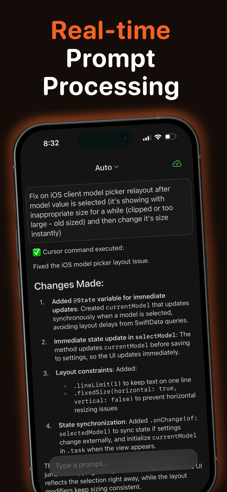

---

## 10. [GitHub Space Shooter](https://www.producthunt.com/products/github-space-shooter?utm_campaign=producthunt-api&utm_medium=api-v2&utm_source=Application%3A+antigravity_test+%28ID%3A+258588%29)
**Votes**: 123 | **Tagline**: Visualizes GitHub contribution graphs as a Space Shooter

### 📌 요약
GitHub 기여 그래프 데이터를 활용하여 우주 슈팅 게임(Space Shooter) 화면으로 시각화해주는 재미있는 토이 프로젝트입니다.

### 🔑 핵심 기능
- 자신의 GitHub 기여도를 슈팅 게임 장면으로 변환하여 시각적으로 즐거움을 제공합니다.
- 웹 앱을 통해 일회성으로 생성하거나, GitHub 액션을 사용하여 주기적으로 자동 생성할 수 있습니다.
- 실용적인 문제 해결보다는 개발자들에게 유쾌한 경험을 선사하는 것에 초점을 맞춥니다.

### 📸 스크린샷 및 갤러리
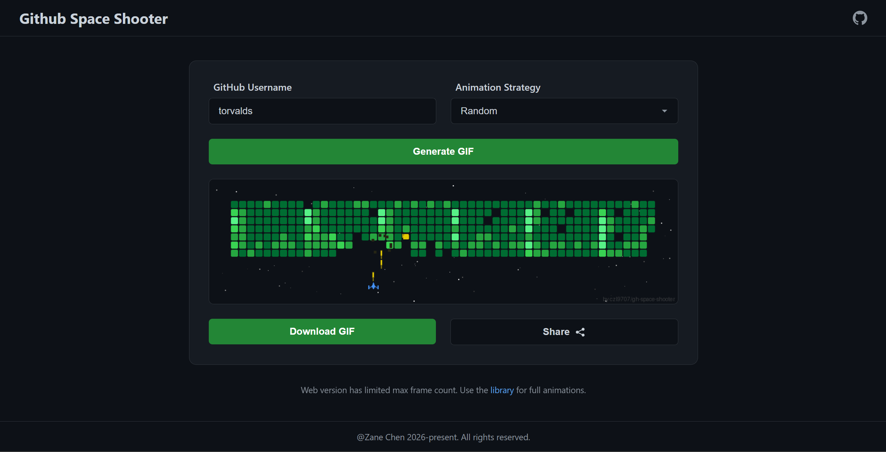
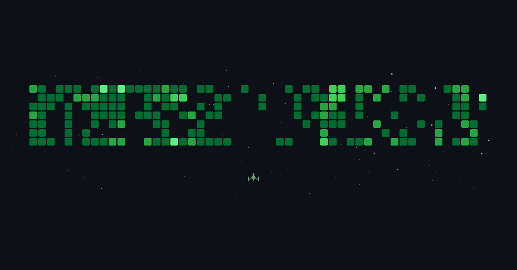

---

