# 🚀 Product Hunt Daily Top 10 (2026-01-16)

## 1. [1Code](https://www.producthunt.com/products/1code-cursor-like-ui-for-claude-code?utm_campaign=producthunt-api&utm_medium=api-v2&utm_source=Application%3A+antigravity_test+%28ID%3A+258588%29)
**Votes**: 367 | **Tagline**: Open source Cursor-like UI for Claude Code

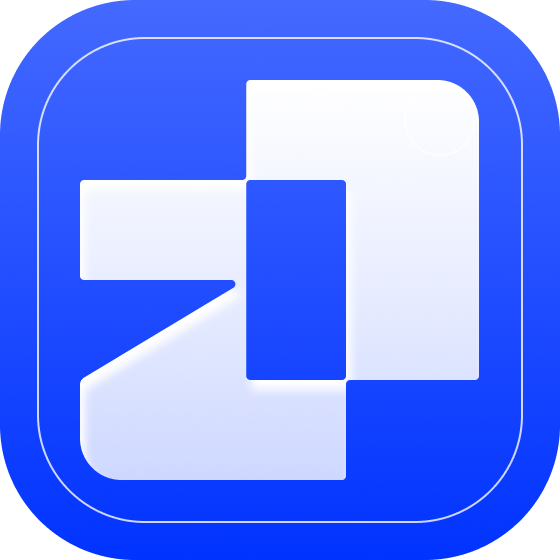

### 📌 요약
1Code는 여러 Claude Code 에이전트를 병렬로 실행하여 개발 속도를 획기적으로 높여주는 오픈 소스 Cursor 스타일 UI 애플리케이션입니다.

### 🔑 핵심 기능
- Claude Code 에이전트 다중 병렬 실행을 통해 기능 구축 속도 극대화
- macOS에서 로컬 실행 지원 (worktree 유무와 관계없이)
- 웹에서 원격 샌드박스 실행 및 앱, 모바일 포함 실시간 미리보기 제공

### 📸 스크린샷 및 갤러리
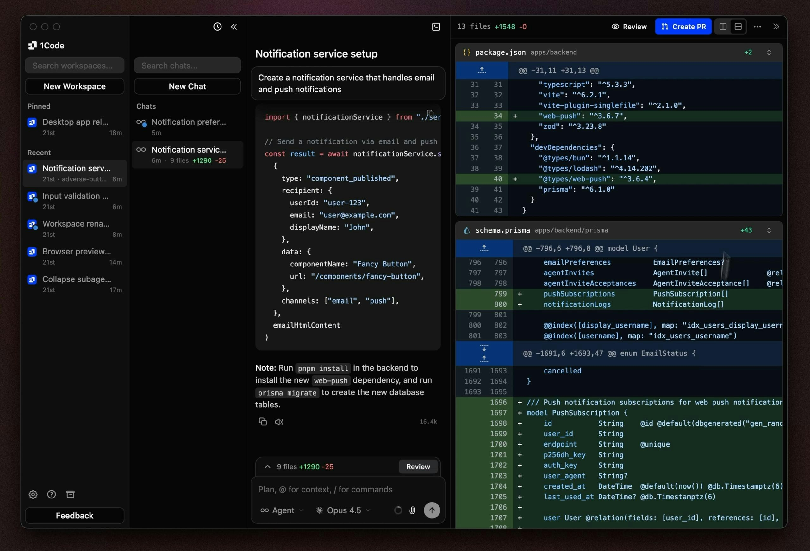
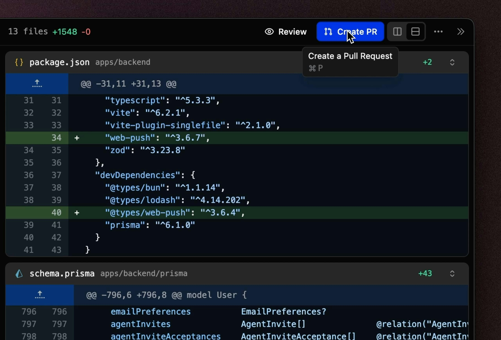
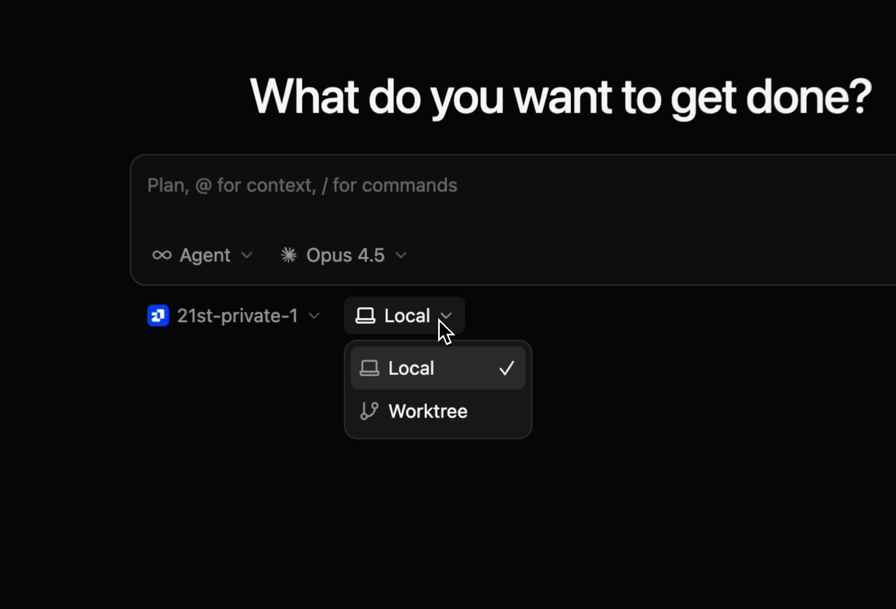

### 🎬 관련 영상
- [🎥 영상 보기](https://ph-files.imgix.net/38c39692-45a4-4859-8fc5-82d877866c27.jpeg?auto=format)

---

## 2. [Boom video for Mac](https://www.producthunt.com/products/boom-6?utm_campaign=producthunt-api&utm_medium=api-v2&utm_source=Application%3A+antigravity_test+%28ID%3A+258588%29)
**Votes**: 269 | **Tagline**: Present live, record your screen, look pro on camera

### 📌 요약
Boom은 코치, 크리에이터, 창업자를 위한 전문적인 영상 프레젠테이션 및 화면 녹화 앱으로, OBS나 Loom의 대안이 될 수 있습니다.

### 🔑 핵심 기능
- Zoom, Meet, Teams 등 라이브 발표 시 전문가 수준의 레이아웃과 시네마틱 전환 효과 제공
- 녹화 후 편집 과정(No editing, No timeline, No post-production) 없이 완성된 튜토리얼/데모/강의 즉시 제작 가능
- 가상 카메라 및 웹캠 강화 기능 내장, Stream Deck 지원으로 실시간 장면 전환 용이 (Mac 전용)

### 📸 스크린샷 및 갤러리
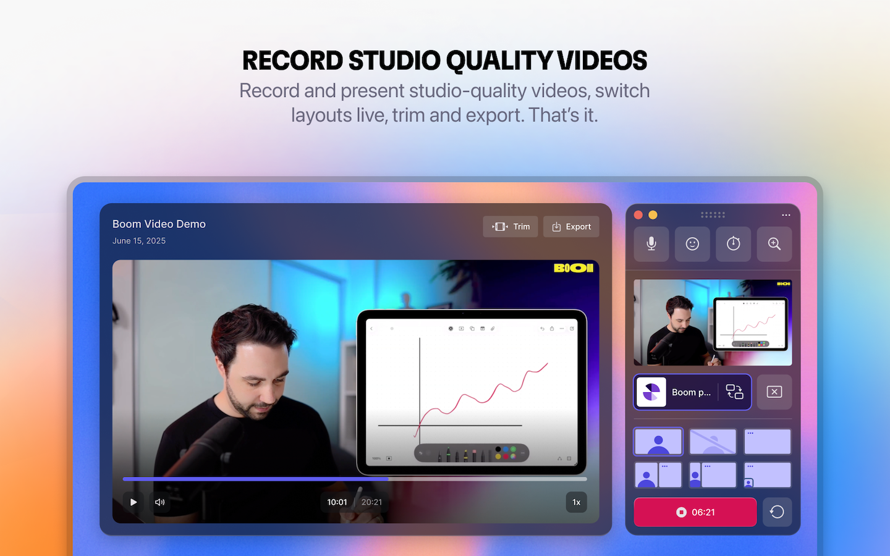
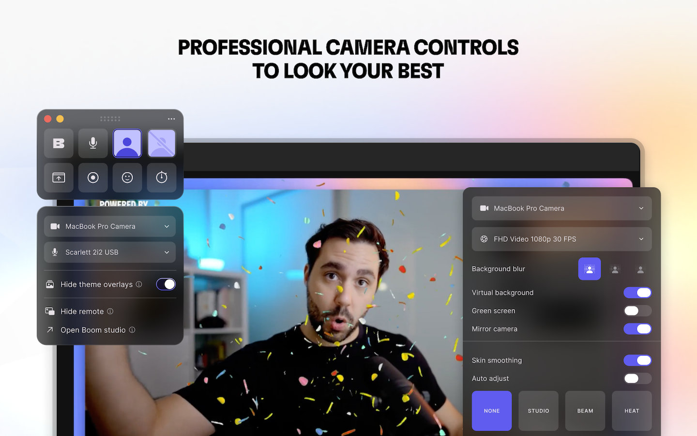

### 🎬 관련 영상
- [🎥 영상 보기](https://ph-files.imgix.net/43225745-b963-4b73-b57f-7ab8c86414b5.jpeg?auto=format)

---

## 3. [TranslateGemma ](https://www.producthunt.com/products/translategemma?utm_campaign=producthunt-api&utm_medium=api-v2&utm_source=Application%3A+antigravity_test+%28ID%3A+258588%29)
**Votes**: 215 | **Tagline**: Open translation on Google models, supporting 55 languages

### 📌 요약
구글의 제미나 3 기반으로 개발된 오픈 AI 번역 모델인 'TranslateGemma'는 55개 언어에 걸쳐 높은 정확도와 효율성을 제공합니다.

### 🔑 핵심 기능
- 구글의 최신 Gemma 3 모델을 기반으로 하는 개방형(오픈 소스) AI 번역 모델입니다.
- 총 55개 언어를 지원하며, 고품질 번역과 탁월한 효율성을 동시에 제공합니다.
- 모바일, 로컬 장치 및 클라우드 환경 등 다양한 환경에서 성능 저하 없이 구동되도록 설계되었습니다.

### 📸 스크린샷 및 갤러리
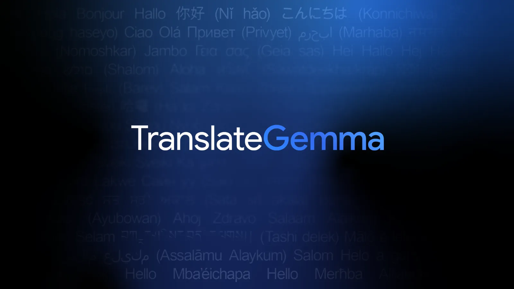
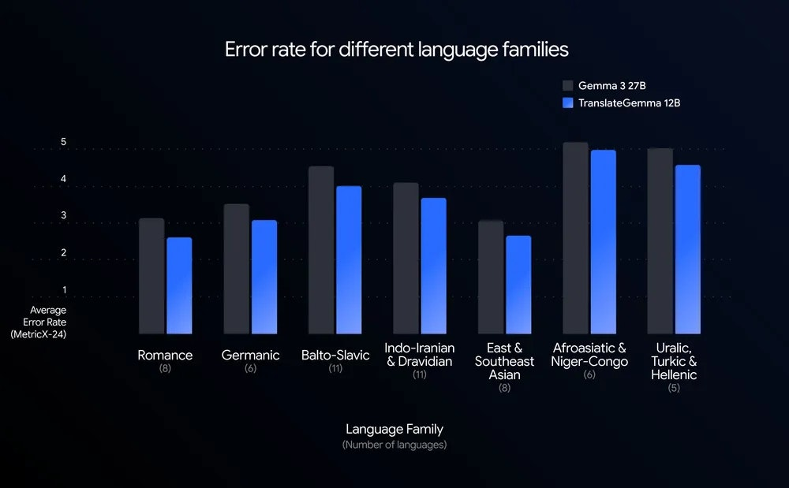

---

## 4. [Dynamic Content by beehiiv](https://www.producthunt.com/products/beehiiv?utm_campaign=producthunt-api&utm_medium=api-v2&utm_source=Application%3A+antigravity_test+%28ID%3A+258588%29)
**Votes**: 154 | **Tagline**: Now you can tailor a single newsletter for every reader

### 📌 요약
beehiiv 에디터 내에서 코딩이나 복잡한 설정 없이 독자 개개인에게 맞춤화된 콘텐츠를 제공하는 다이내믹 이메일 발송 기능입니다.

### 🔑 핵심 기능
- 단 한 번의 발송으로 독자 그룹별로 다른 콘텐츠를 노출하여 뉴스레터를 개인화할 수 있습니다.
- 복잡한 코딩, 맞춤 템플릿 제작, 추가적인 복잡성 없이 사용이 매우 간편합니다.
- 모든 개인화 설정 및 기능은 기존 beehiiv 에디터 내부에서 바로 제공됩니다.

### 📸 스크린샷 및 갤러리
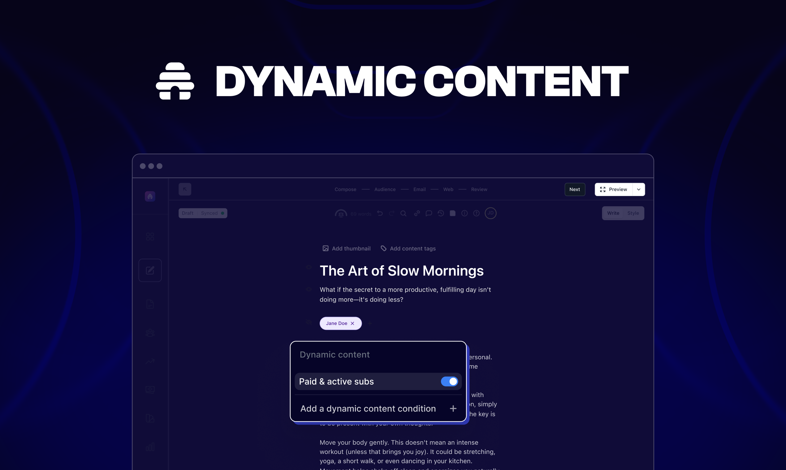

---

## 5. [Stracti](https://www.producthunt.com/products/stractiai?utm_campaign=producthunt-api&utm_medium=api-v2&utm_source=Application%3A+antigravity_test+%28ID%3A+258588%29)
**Votes**: 149 | **Tagline**: Build AI game bots with no code required

### 📌 요약
API 대신 화면 기반 AI 감지 기술을 사용하여 코딩 없이 시각적으로 AI 게임 봇을 제작하고 실행할 수 있는 노코드 자동화 플랫폼입니다.

### 🔑 핵심 기능
- 코드가 필요 없는(No-Code) 시각적 봇 구축 및 실행 환경 제공
- API 대신 스크린 기반 AI 감지 기술을 활용하여 실제 워크플로우에 최적화
- 웹, 데스크톱, 모바일에서 봇을 생성하고 데스크톱 앱을 통해 로컬에서 실행 가능
- 블랙박스 방식이 아닌 명확한 동작 기록 및 완전한 제어로 안정적인 자동화 구현

### 📸 스크린샷 및 갤러리
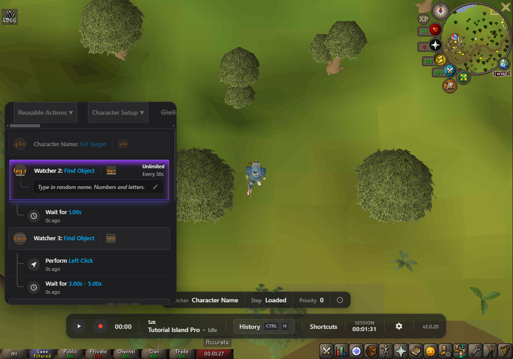
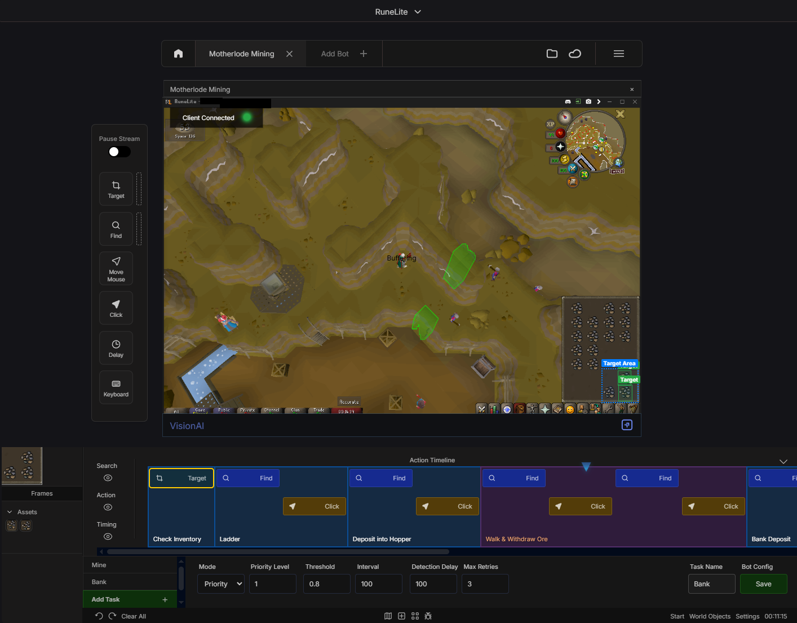
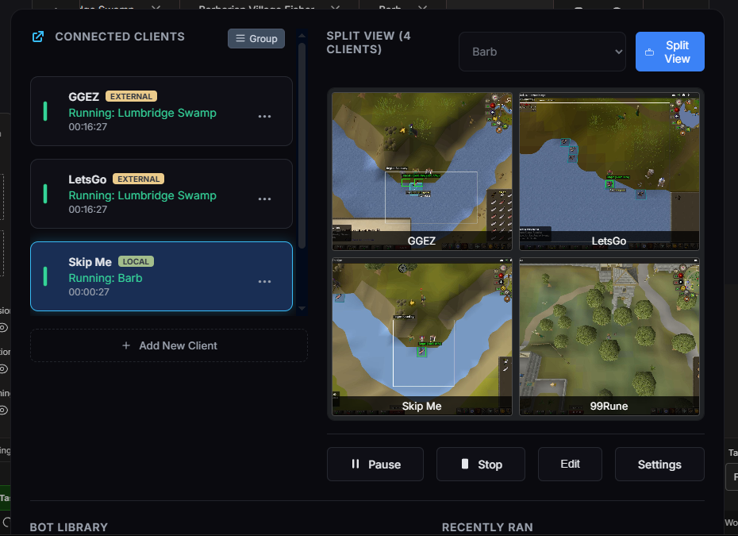

### 🎬 관련 영상
- [🎥 영상 보기](https://ph-files.imgix.net/9b34989d-c943-4381-b55d-ea1468c9341c.jpeg?auto=format)

---

## 6. [ChatGPT Translate](https://www.producthunt.com/products/chatgpt-translate?utm_campaign=producthunt-api&utm_medium=api-v2&utm_source=Application%3A+antigravity_test+%28ID%3A+258588%29)
**Votes**: 136 | **Tagline**: Translate with ChatGPT

### 📌 요약
ChatGPT의 강력한 성능을 활용하여 50개 이상의 언어를 맥락과 뉘앙스까지 살려 정확하게 번역해 주는 웹 기반 AI 번역 도구입니다.

### 🔑 핵심 기능
- 50개 이상의 언어를 지원하며, 의미, 맥락, 톤을 유지하는 섬세한 번역이 특징입니다.
- 텍스트 입력, 붙여넣기뿐만 아니라 음성 입력이나 파일 업로드를 통한 번역도 가능합니다.
- 격식체, 비격식체 등 다양한 스타일로 번역 스타일을 조정할 수 있어 일상생활, 여행, 학습, 업무 등 다방면에서 유용합니다.

### 📸 스크린샷 및 갤러리
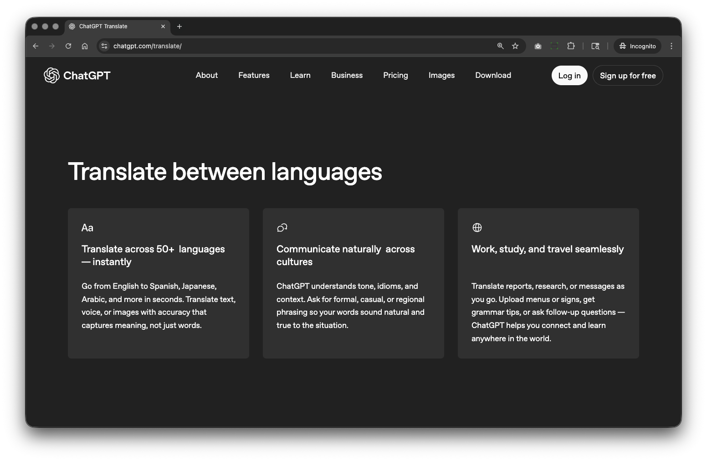
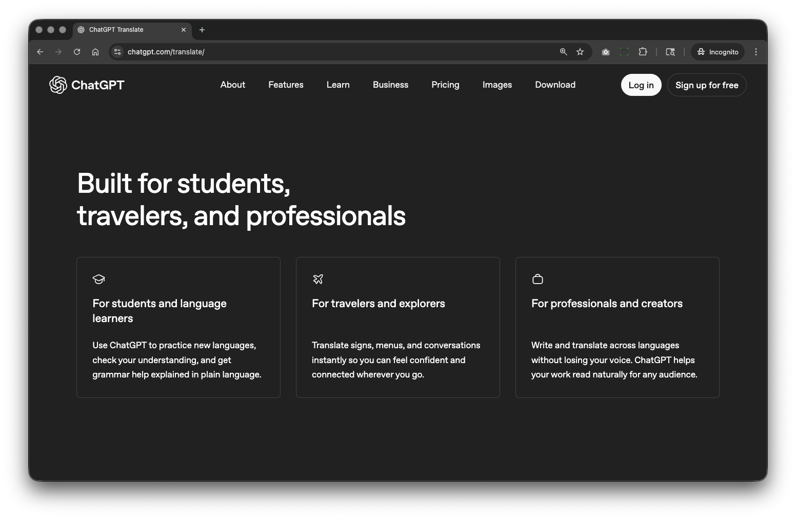
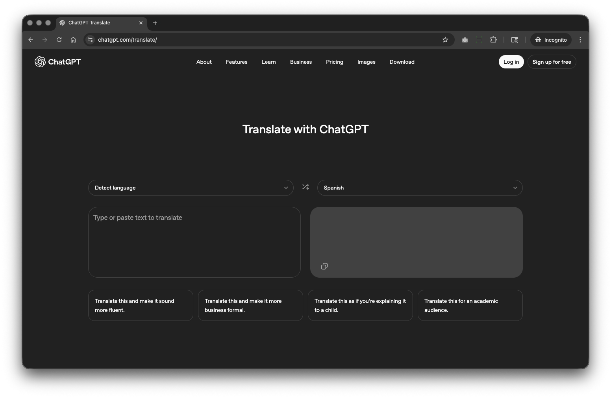

---

## 7. [Orca](https://www.producthunt.com/products/orca-4?utm_campaign=producthunt-api&utm_medium=api-v2&utm_source=Application%3A+antigravity_test+%28ID%3A+258588%29)
**Votes**: 119 | **Tagline**: The fun way to learn a new language 

### 📌 요약
Orca는 실생활 표현을 중심으로 짧은 단위로 학습하며, 발음 게임을 통해 유창성을 기르는 재미있는 언어 학습 앱입니다.

### 🔑 핵심 기능
- 실생활 기반의 짧은 학습(Bite-sized lessons)으로 실전 대화 능력 향상.
- 다음 레벨로 진행하기 위해 통과해야 하는 인터랙티브 발음 게임 제공.
- 다른 학습자와의 경쟁 및 리더보드를 통해 학습 동기 부여 및 자신감 구축.

### 📸 스크린샷 및 갤러리
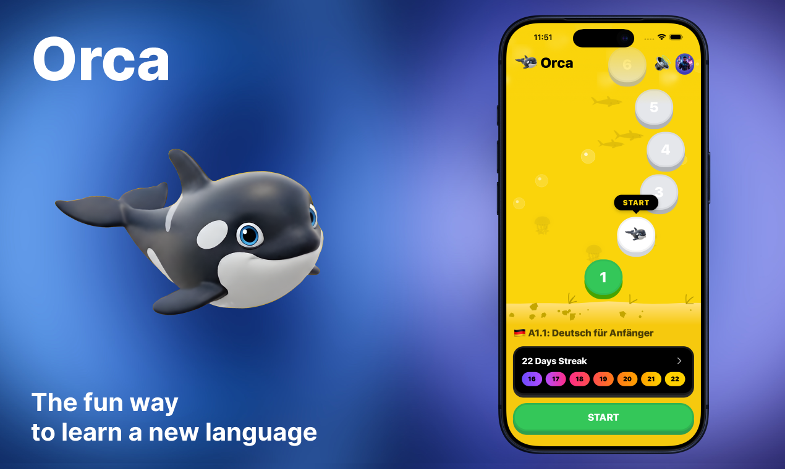
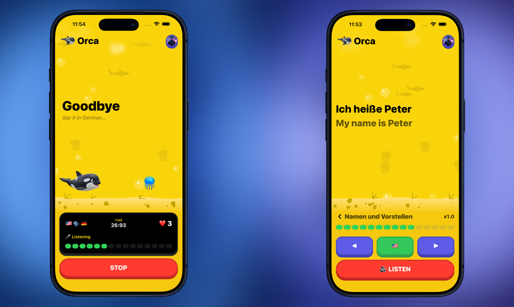
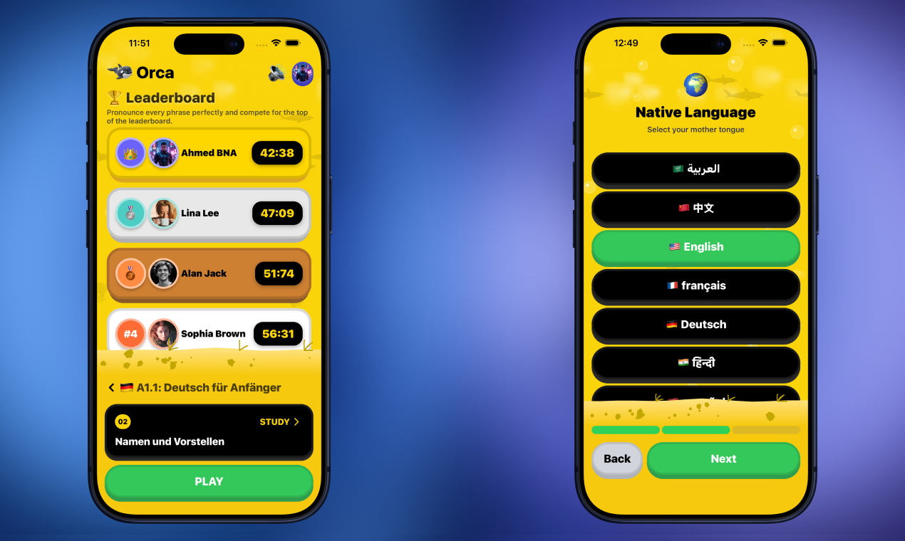

### 🎬 관련 영상
- [🎥 영상 보기](https://ph-files.imgix.net/e04a8601-48e3-4b2d-867e-8254f0e763a9.jpeg?auto=format)

---

## 8. [Flight Follower](https://www.producthunt.com/products/flight-follower?utm_campaign=producthunt-api&utm_medium=api-v2&utm_source=Application%3A+antigravity_test+%28ID%3A+258588%29)
**Votes**: 97 | **Tagline**: Ad free flight tracking for aviation enthusiasts

### 📌 요약
항공 애호가(Avgeeks)를 위해 제작된, 실시간 ADS-B 지도를 제공하고 시리를 통해 머리 위 항공기를 식별할 수 있는 광고 없는 iOS 전용 비행 추적 앱입니다.

### 🔑 핵심 기능
- 광고 없이 실시간 비행 상태 및 ADS-B 지도를 제공하는 iOS 전용 앱입니다.
- Siri를 사용하여 머리 위를 지나가는 항공기를 즉시 식별할 수 있습니다.
- 네이티브 위젯을 통해 빠르고 편리하게 항공기 추적 및 상태 확인이 가능합니다.

### 📸 스크린샷 및 갤러리
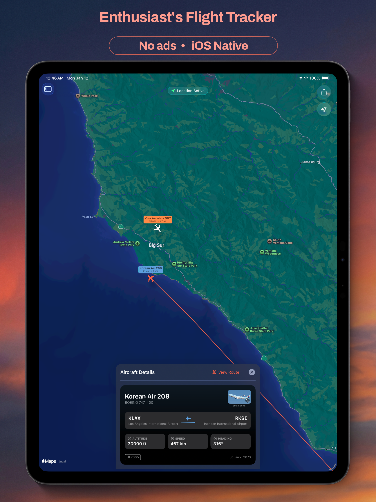
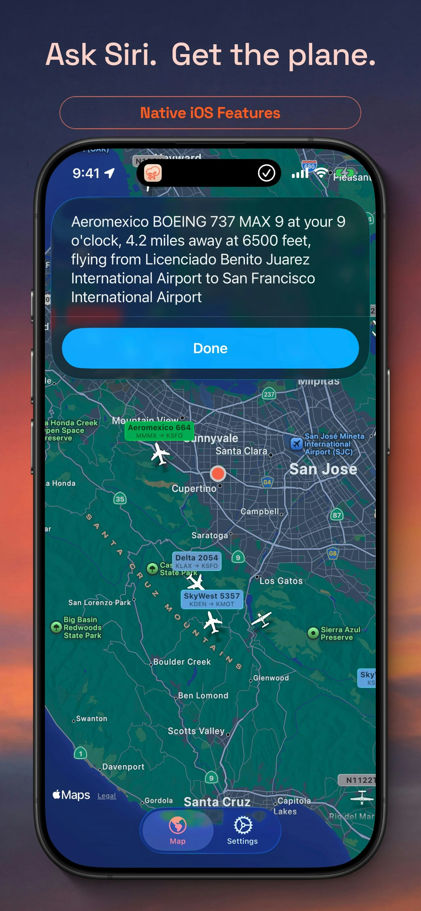
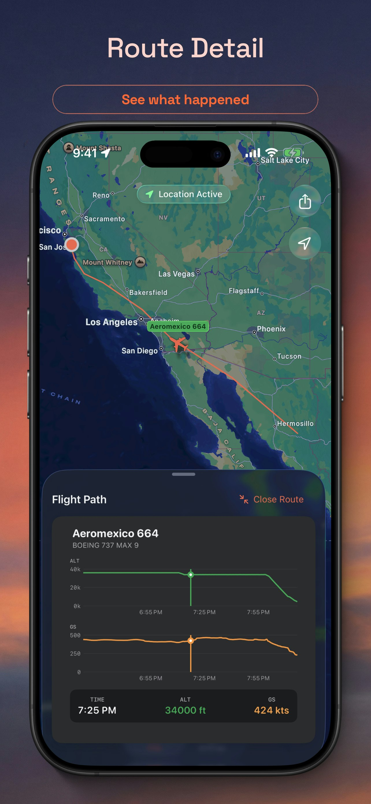

### 🎬 관련 영상
- [🎥 영상 보기](https://ph-files.imgix.net/0cc4e6fb-3ff8-483e-9b64-7f7d8288f2dc.jpeg?auto=format)

---

## 9. [Waylight for macOS](https://www.producthunt.com/products/waylight?utm_campaign=producthunt-api&utm_medium=api-v2&utm_source=Application%3A+antigravity_test+%28ID%3A+258588%29)
**Votes**: 93 | **Tagline**: ChatGPT, but with context from your tabs, meetings, and docs

### 📌 요약
Waylight는 사용자가 컴퓨터에서 진행한 모든 활동(탭, 회의, 문서)의 컨텍스트를 학습하여 질문에 즉각적으로 답변하고 일정을 자동 정리해주는 macOS용 AI 비서입니다.

### 🔑 핵심 기능
- 탭, 회의, 문서 등 사용자의 모든 컴퓨터 활동을 이해하고 개인화된 메모리 구축
- 활동 기록을 바탕으로 사용자가 봤던 모든 내용에 대해 질문하면 즉각적이고 정확한 답변 제공
- 사용자의 활동 내역을 기반으로 할 일 목록과 일지를 자동으로 생성하여 생활 정리 지원

### 📸 스크린샷 및 갤러리

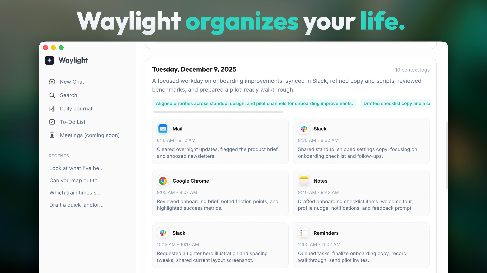

---

## 10. [dibma / Joki Strava](https://www.producthunt.com/products/dibma-2?utm_campaign=producthunt-api&utm_medium=api-v2&utm_source=Application%3A+antigravity_test+%28ID%3A+258588%29)
**Votes**: 92 | **Tagline**: Fake your runs and flex on Strava

### 📌 요약
스트라바(Strava)에서 자랑하기 위해 코스, 페이스, 심박수까지 조작 가능한 가짜 달리기 활동(FIT 파일)을 생성해주는 서비스입니다.

### 🔑 핵심 기능
- 사용자 지정 경로를 직접 그려 활동 경로 설정 가능
- 페이스, 심박수(HR) 등 상세 운동 데이터를 원하는 대로 완벽 제어
- 스트라바 업로드 호환성이 높은 표준 FIT 파일 형식으로 내보내기 지원

### 📸 스크린샷 및 갤러리
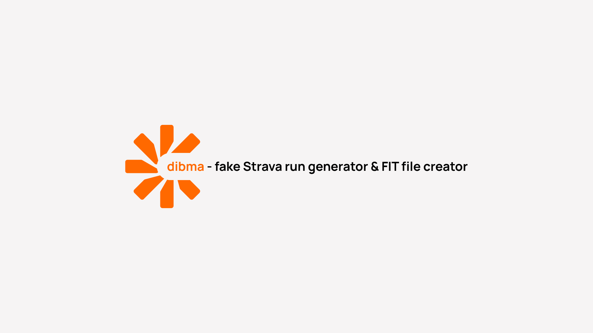
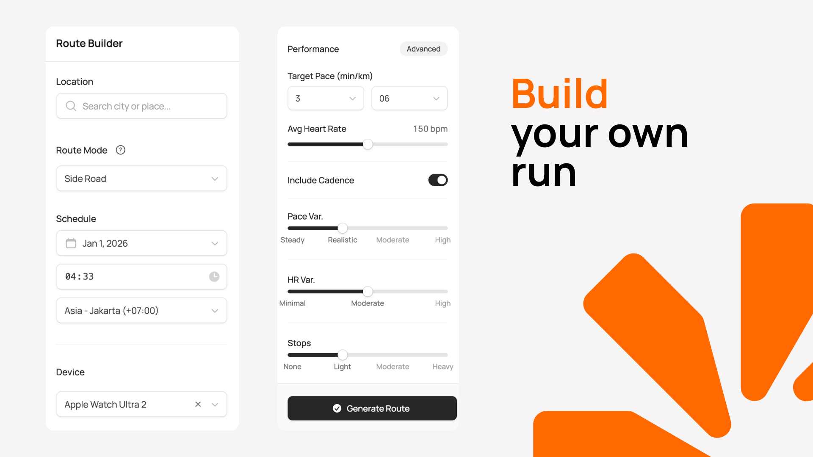
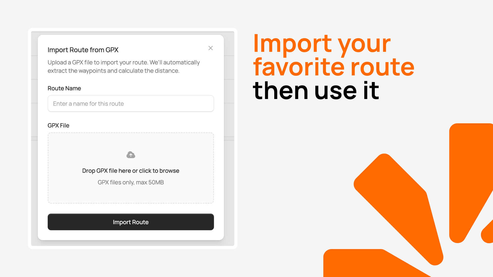

### 🎬 관련 영상
- [🎥 영상 보기](https://ph-files.imgix.net/89f56d3d-6950-4f25-9b43-784925f86270.jpeg?auto=format)

---

