# 🚀 Product Hunt Daily Top 10 (2026-01-17)

## 1. [Sled](https://www.producthunt.com/products/sled-voice-interface-for-claude-code?utm_campaign=producthunt-api&utm_medium=api-v2&utm_source=Application%3A+antigravity_test+%28ID%3A+258588%29)
**Votes**: 299 | **Tagline**: Run your coding agent from your phone, with voice

### 📌 요약
Sled은 음성 인터페이스를 통해 휴대폰에서 로컬 코딩 에이전트를 원격으로 제어할 수 있게 해주는 애플리케이션입니다.

### 🔑 핵심 기능
- 사무실을 벗어나서도 음성을 사용해 코딩 에이전트(Claude Code, Codex 등)에 지속적으로 명령을 내릴 수 있습니다.
- Tailscale을 통해 로컬 에이전트에 안전하게 연결되므로, 코드가 사용자의 장치를 벗어나지 않아 보안이 확보됩니다.
- 음성 입력으로 작업을 지시하고 결과를 음성으로 청취할 수 있어 생산성의 공백을 줄여줍니다.
- 완전히 오픈 소스로 제공됩니다.

### 📸 스크린샷 및 갤러리

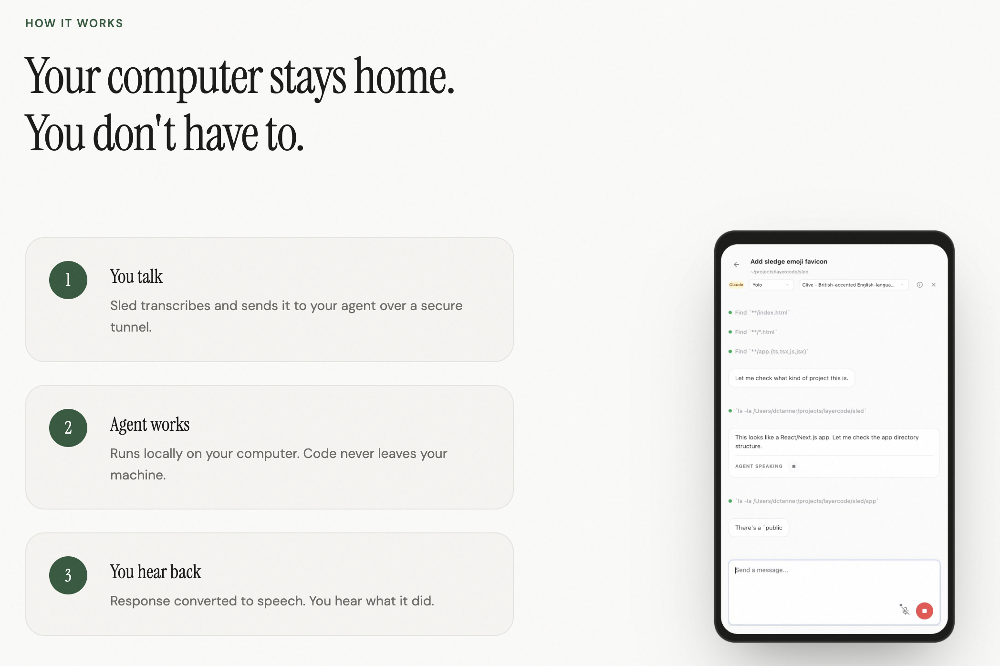
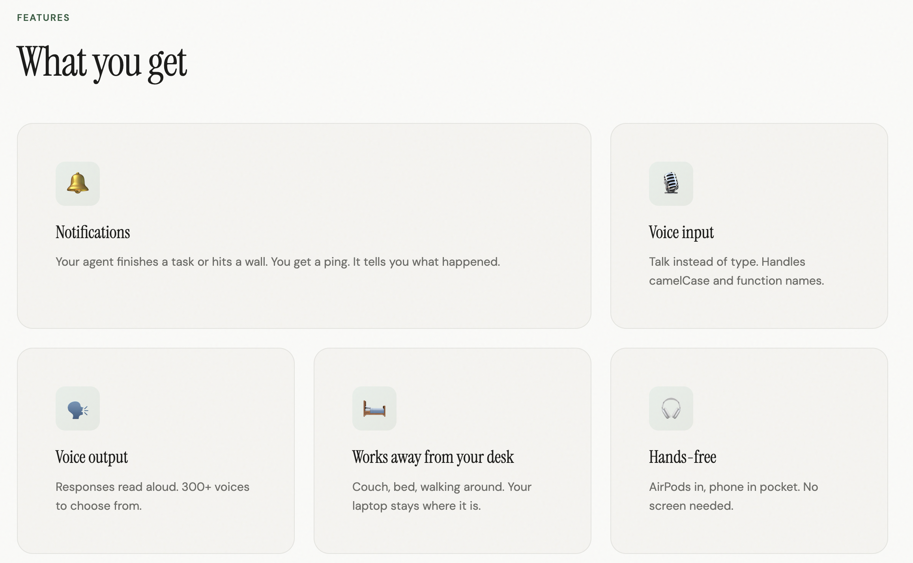

### 🎬 관련 영상
- [🎥 영상 보기](https://ph-files.imgix.net/04522b29-63a8-470d-a20f-323a337e1aac.jpeg?auto=format)

---

## 2. [Dewdrop](https://www.producthunt.com/products/dewdrop-2?utm_campaign=producthunt-api&utm_medium=api-v2&utm_source=Application%3A+antigravity_test+%28ID%3A+258588%29)
**Votes**: 206 | **Tagline**: Turn your forgotten bookmarks into daily discoveries

### 📌 요약
잊고 있던 Raindrop.io 북마크를 매일 이메일로 받아보며 과거의 발견물을 재조명하는 개인화된 콘텐츠 큐레이션 서비스입니다.

### 🔑 핵심 기능
- 과거 저장했던 북마크 중 무작위로 하나를 선정하여 요약 제공
- AI 시대에 과거 자신이 저장한 콘텐츠의 가치를 재발견하도록 돕는 콘셉트
- 별도의 설정 없이 Raindrop.io 계정 연결만으로 즉시 사용 가능 (무료 시작)

### 📸 스크린샷 및 갤러리
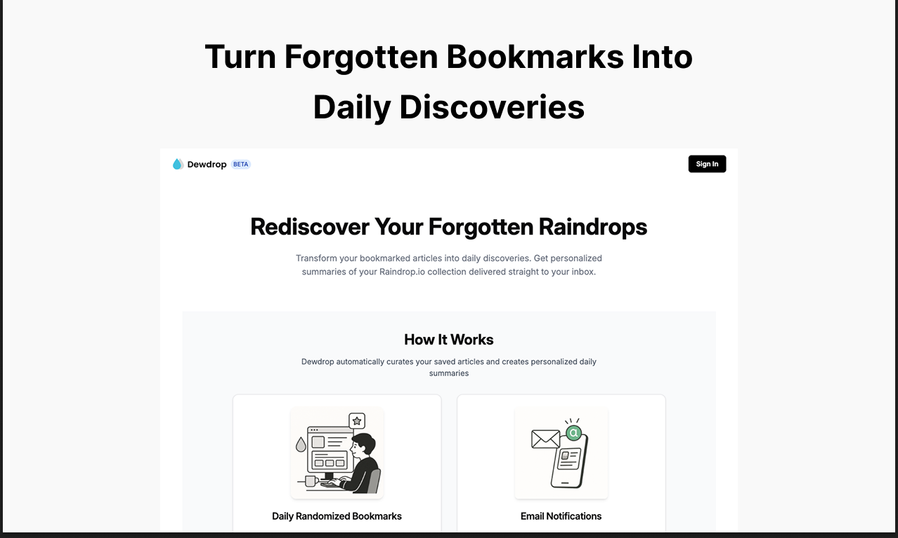
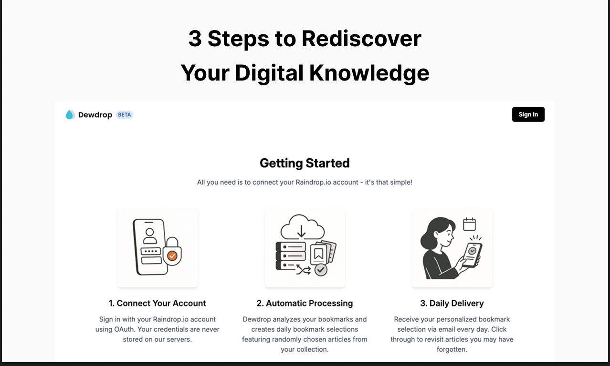
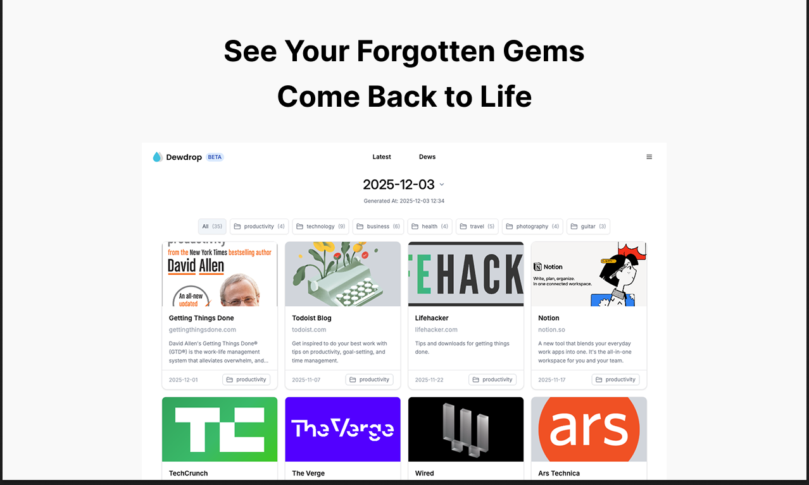

---

## 3. [Chessmaster AI](https://www.producthunt.com/products/chessmaster-ai?utm_campaign=producthunt-api&utm_medium=api-v2&utm_source=Application%3A+antigravity_test+%28ID%3A+258588%29)
**Votes**: 178 | **Tagline**: Transform Your Chess Skills with AI-Powered Training

### 📌 요약
모든 레벨의 사용자를 위한 맞춤형 AI 코칭과 대결을 제공하여 체스 실력을 혁신적으로 향상시키는 모바일 체스 아카데미 앱입니다.

### 🔑 핵심 기능
- 주머니 속 개인 체스 아카데미 역할을 하는 교육용 앱입니다.
- 70가지 단계로 구성된 AI 상대와의 대결을 통해 점진적인 실력 향상을 돕습니다.
- 경쟁적인 게임 플레이와 지능적인 개인 맞춤 코칭을 결합하여 제공합니다.

### 📸 스크린샷 및 갤러리

---

## 4. [StealthHound](https://www.producthunt.com/products/stealthhound?utm_campaign=producthunt-api&utm_medium=api-v2&utm_source=Application%3A+antigravity_test+%28ID%3A+258588%29)
**Votes**: 160 | **Tagline**: Your browser's blind spots, Exposed.

### 📌 요약
StealthHound는 쿠키나 로그인 없이도 실시간으로 숨겨진 브라우저 핑거프린팅과 무단 추적을 탐지하고 차단하는 강력한 개인정보 보호 도구입니다.

### 🔑 핵심 기능
- 캔버스 핑거프린팅, API 남용 등 침해적인 추적 기술을 실시간으로 노출 및 자동 차단합니다.
- 추적 위험도를 즉시 (낮음/중간/높음) 신호로 제공하고, 라이브 경고를 통해 사용자에게 알립니다.
- 모든 기능이 로컬에서 실행되며 데이터 수집이 전혀 없고, 브라우저 속도 저하를 유발하지 않습니다.

### 📸 스크린샷 및 갤러리

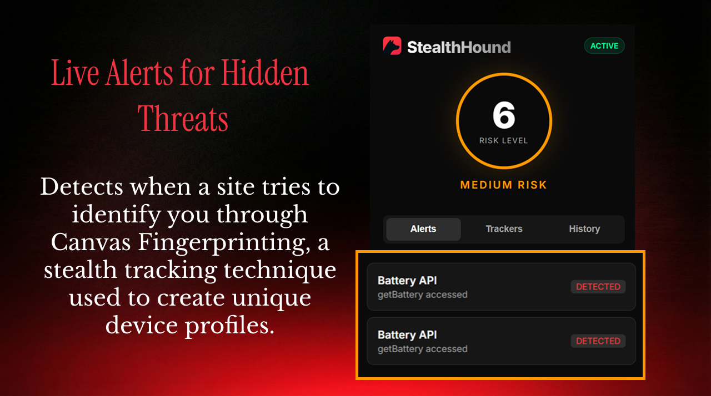

---

## 5. [LinkNotch](https://www.producthunt.com/products/linknotch-link-drawer-for-your-macbook?utm_campaign=producthunt-api&utm_medium=api-v2&utm_source=Application%3A+antigravity_test+%28ID%3A+258588%29)
**Votes**: 118 | **Tagline**: Turn your MacBook Notch into a fast access bookmark bar.

### 📌 요약
LinkNotch는 맥북의 노치(notch) 영역을 즐겨찾는 링크에 빠르게 접근할 수 있는 북마크 바로 전환하여 생산성을 높이는 유틸리티입니다.

### 🔑 핵심 기능
- 맥북 노치 영역을 활용하여 북마크 접근성을 극대화합니다.
- 마우스 오버 또는 클릭만으로 업무용 및 일반 링크에 즉시 접근할 수 있습니다.
- 브라우저 탭 속에서 링크를 찾는 시간을 줄여 작업 흐름을 개선합니다.

### 📸 스크린샷 및 갤러리
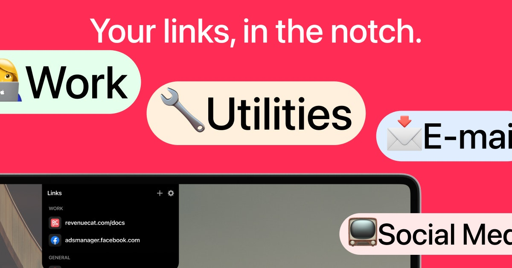
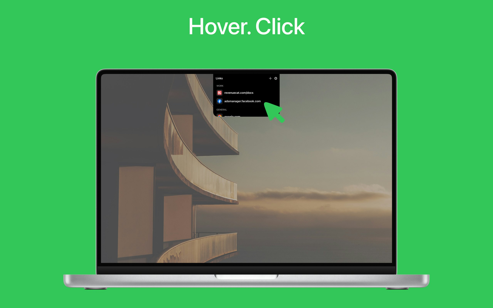
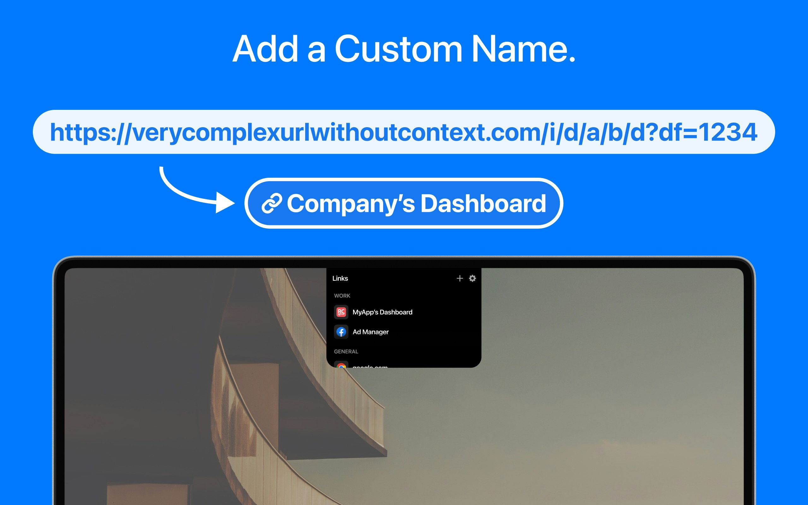

---

## 6. [Colloqio](https://www.producthunt.com/products/colloqio-offline-ai-chat-app?utm_campaign=producthunt-api&utm_medium=api-v2&utm_source=Application%3A+antigravity_test+%28ID%3A+258588%29)
**Votes**: 111 | **Tagline**: On-device AI - private, fast, always available

### 📌 요약
개인 정보 보호와 빠른 응답 속도를 극대화하기 위해 기기 내(On-device)에서 100% 작동하는 혁신적인 AI 비서, Colloqio가 곧 iOS에 출시됩니다.

### 🔑 핵심 기능
- 모든 연산이 기기 내에서 처리되어 클라우드 서버나 데이터 수집이 전혀 없는 완벽한 개인 정보 보호(Privacy)
- 인터넷 연결 없이도 작동하며, 대화 내용을 기억하는 개인 맞춤형 AI
- 빠르고 항상 사용 가능한 AI 경험을 제공하며, iOS 앱으로 곧 출시 예정

### 📸 스크린샷 및 갤러리

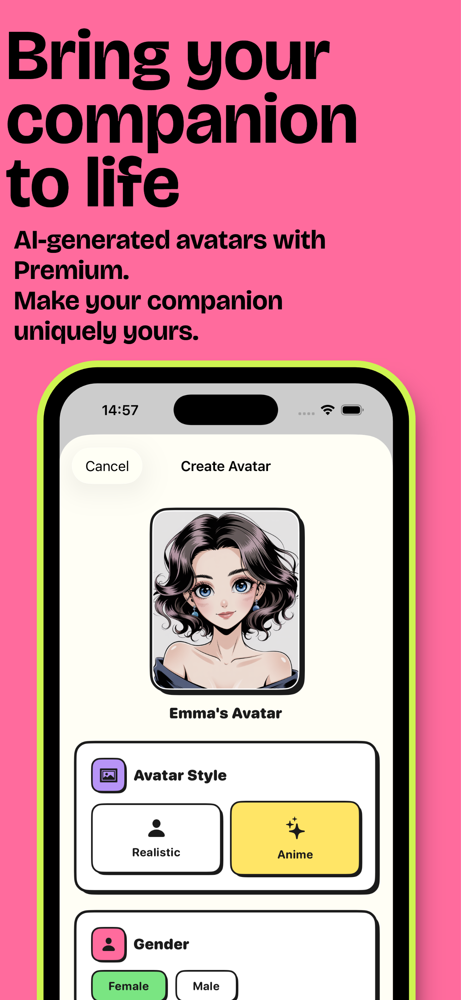
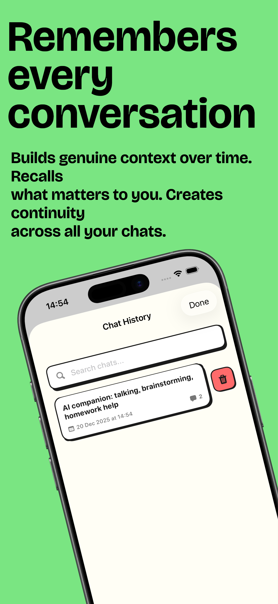

---

## 7. [KanjiLens](https://www.producthunt.com/products/kanjilens?utm_campaign=producthunt-api&utm_medium=api-v2&utm_source=Application%3A+antigravity_test+%28ID%3A+258588%29)
**Votes**: 110 | **Tagline**: Kanji Lens is a Japanese manga translator and learning tool.

### 📌 요약
좋아하는 온라인 만화를 읽는 흐름을 끊지 않고 실시간 번역 및 후리가나를 오버레이하여 일본어 학습을 돕는 몰입형 도구입니다.

### 🔑 핵심 기능
- 만화 패널을 스캔하여 번역, 읽는 법(후리가나), 의미 등 학습 정보를 즉시 화면에 오버레이 제공.
- 사전 검색 등으로 인한 학습 흐름 방해 요소(friction)를 제거하고 독서 및 학습 몰입도를 유지.
- 온라인 만화 웹사이트에 최적화되어, 좋아하는 콘텐츠를 통해 직관적인 일본어 학습이 가능.

### 📸 스크린샷 및 갤러리
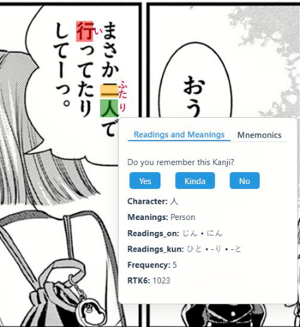

---

## 8. [Enote](https://www.producthunt.com/products/enote?utm_campaign=producthunt-api&utm_medium=api-v2&utm_source=Application%3A+antigravity_test+%28ID%3A+258588%29)
**Votes**: 94 | **Tagline**: Lightweight Desktop Notes

### 📌 요약
빠르고 간편한 메모에 최적화된 경량 데스크톱 노트 앱으로, 집중력과 생산성 향상에 도움을 줍니다.

### 🔑 핵심 기능
- 언제든 즉시 메모할 수 있는 글로벌 단축키 기능 제공
- 드래그, 드롭 또는 붙여넣기로 이미지 노트 생성 가능
- 중요 메모를 항상 화면 상단에 띄워 놓는 플로팅(Floating) 창 지원
- 메모 및 템플릿 관리를 위한 사이드바와 새로 추가된 마크다운(Markdown) 지원

### 📸 스크린샷 및 갤러리
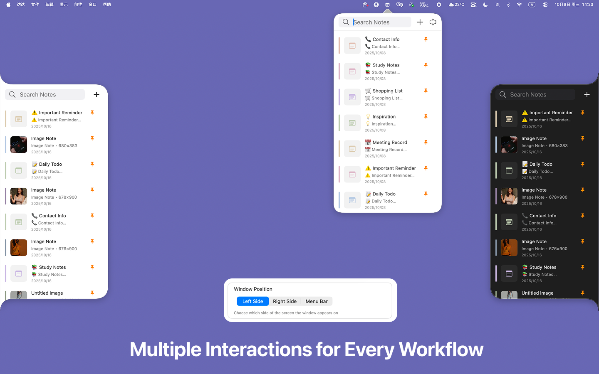
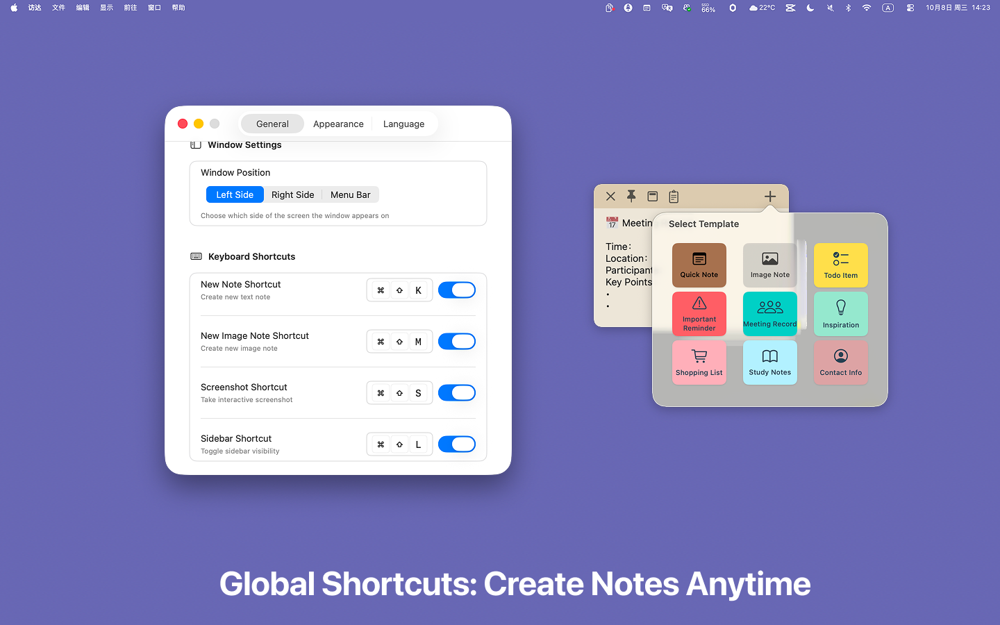

### 🎬 관련 영상
- [🎥 영상 보기](https://ph-files.imgix.net/7b261ce5-2838-4bd6-b1fa-58f66c50f39f.jpeg?auto=format)

---

## 9. [SuperFam](https://www.producthunt.com/products/superfam-2?utm_campaign=producthunt-api&utm_medium=api-v2&utm_source=Application%3A+antigravity_test+%28ID%3A+258588%29)
**Votes**: 54 | **Tagline**: One App, All Things Family (Finances, Docs, Location & more)

### 📌 요약
가족의 재정, 문서, 위치 추적 및 일상 조율을 안전하고 효율적으로 하나로 통합 관리하는 종합 가족 관리 앱입니다.

### 🔑 핵심 기능
- 문서, 메모, 비밀번호를 세밀한 접근 제어로 안전하게 공유 및 관리합니다.
- AI 금융 코파일럿이 예산 설정과 지출 관리를 위한 선제적인 안내를 제공합니다.
- 배터리 효율적인 위치 추적 및 알림, 할 일 목록 등 가족 일상 조율 기능을 제공하며 종단 간 암호화로 보안을 강화했습니다.

### 📸 스크린샷 및 갤러리
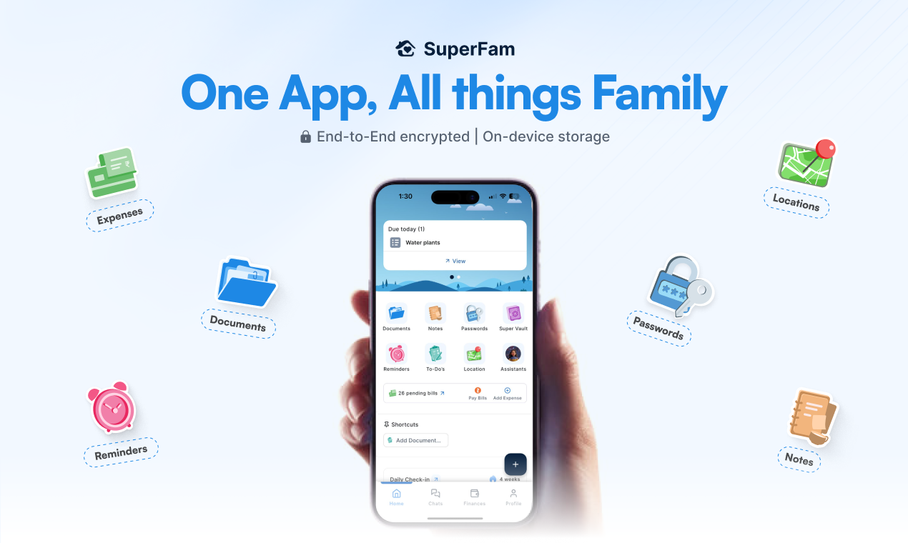
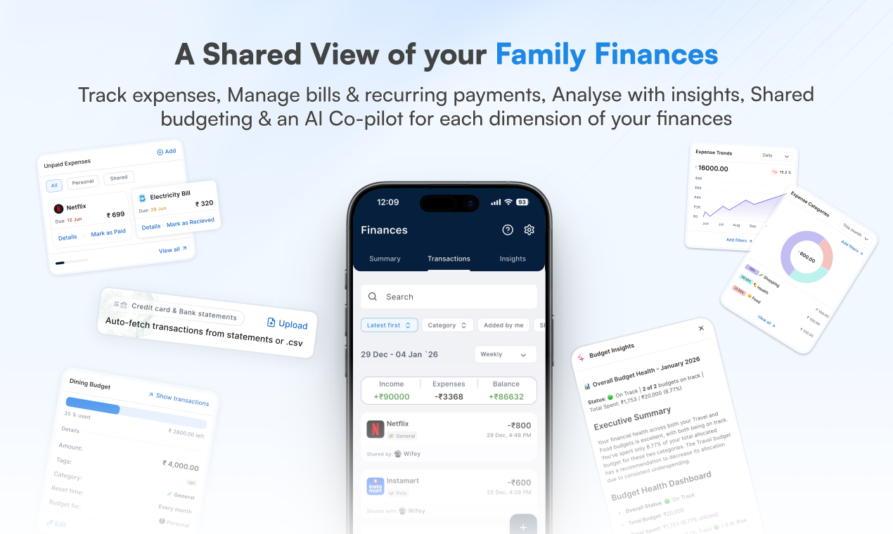
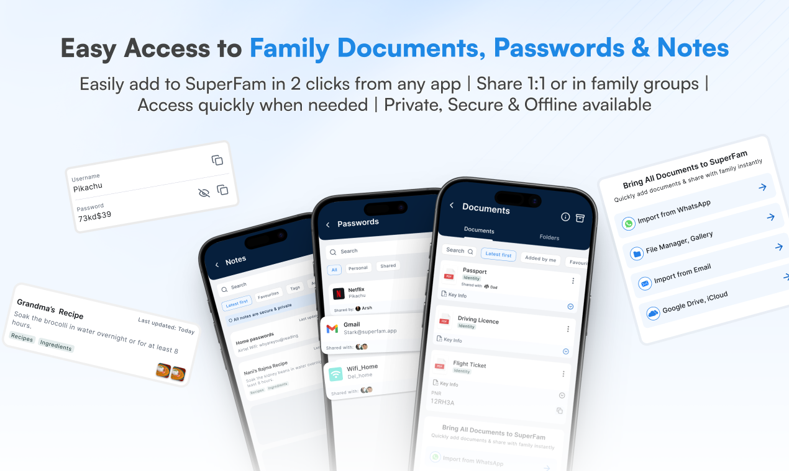

### 🎬 관련 영상
- [🎥 영상 보기](https://ph-files.imgix.net/76af85f3-a960-47ec-8628-4eaf4cf0474a.jpeg?auto=format)

---

## 10. [LiFE RPG 2.0](https://www.producthunt.com/products/life-rpg?utm_campaign=producthunt-api&utm_medium=api-v2&utm_source=Application%3A+antigravity_test+%28ID%3A+258588%29)
**Votes**: 37 | **Tagline**: Gamify your Life, Play your own story.

### 📌 요약
실제 삶을 RPG 게임처럼 만들어 목표와 습관 관리를 돕는 게이미피케이션 라이프 관리 시스템, LiFE RPG의 2.0 버전입니다.

### 🔑 핵심 기능
- 일상의 목표, 습관, 작업을 퀘스트, 도전, 보상 시스템으로 전환하여 몰입도를 높입니다.
- LiFE RPG 2.0에서는 AI 기반 가이드 'RPGenie'가 추가되어 맞춤형 퀘스트를 제안하고 목표 설정을 돕습니다.
- 단순한 규율 강요 대신, 사용자에게 맞춰 진화하는 게임처럼 느껴지게 해 개인 성장을 즐겁고 반응적으로 만듭니다.

### 📸 스크린샷 및 갤러리
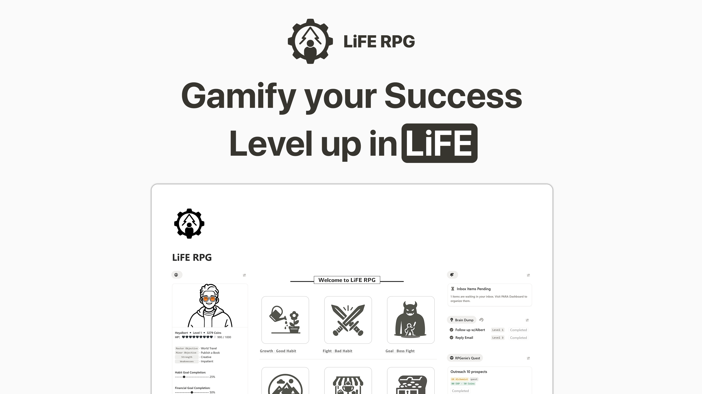
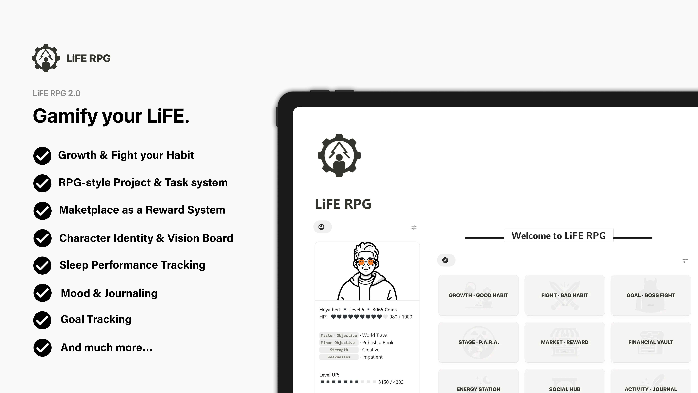
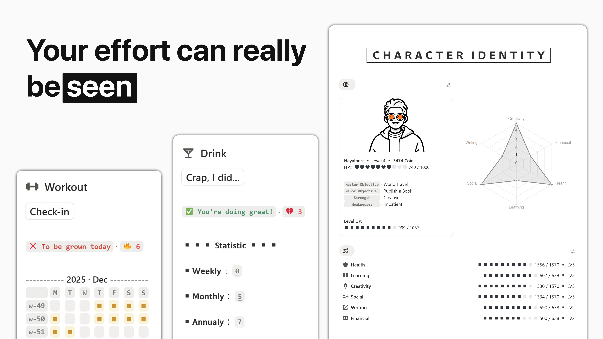

### 🎬 관련 영상
- [🎥 영상 보기](https://ph-files.imgix.net/6ceb4aa9-d94c-4cdd-89e6-194f1e0d1f81.jpeg?auto=format)

---

