# 🚀 Product Hunt Daily Top 10 (2026-01-18)

## 1. [OMEGA Ω™](https://www.producthunt.com/products/omega-fastest-lightest-browser-ever?utm_campaign=producthunt-api&utm_medium=api-v2&utm_source=Application%3A+antigravity_test+%28ID%3A+258588%29)
**Votes**: 290 | **Tagline**: 3.6MB browser that never tracks, profiles, or sells data

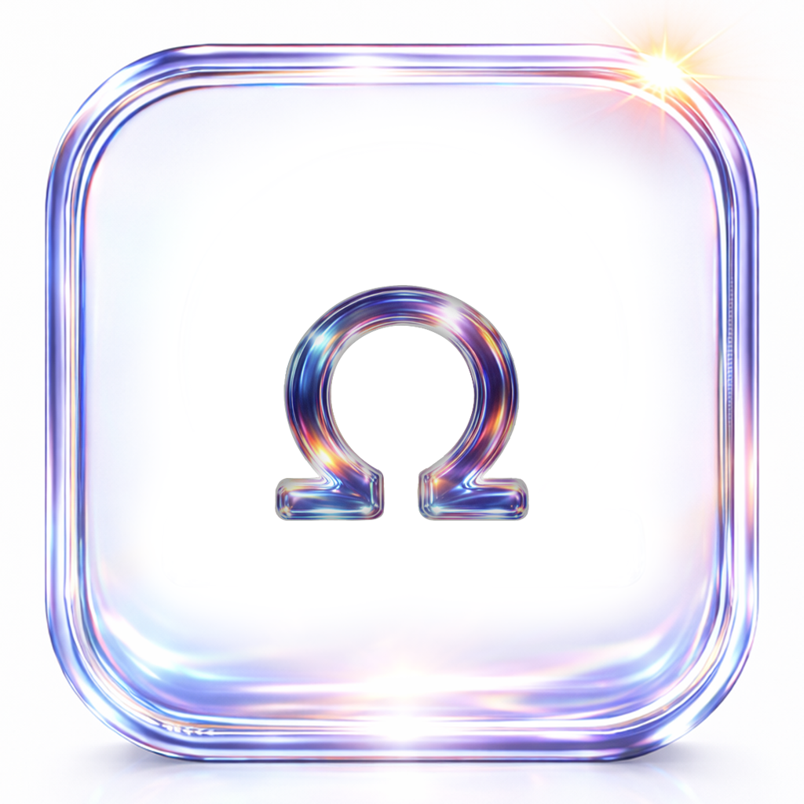

### 📌 요약
추적, 프로파일링, 데이터 판매를 거부하며 초경량(3.6MB)과 극강의 보안에 중점을 둔 macOS용 네이티브 브라우저입니다.

### 🔑 핵심 기능
- Swift와 WebKit 기반의 Apple 아키텍처로 구축된 초경량(3.6MB) 및 초고속 macOS 네이티브 브라우저입니다.
- 네트워크 레벨에서 트래커를 차단하고 핑거프린팅에 대응하며 감시 경제에 저항하는 강력한 개인 정보 보호 기능을 제공합니다.
- RAM에서 작동하며 종료 시 흔적을 남기지 않는 '아무개 모드(Amnesia Mode)'와 모든 데이터를 즉시 삭제하는 '핵 버튼(Nuke)' 기능이 포함되어 있습니다.

### 📸 스크린샷 및 갤러리
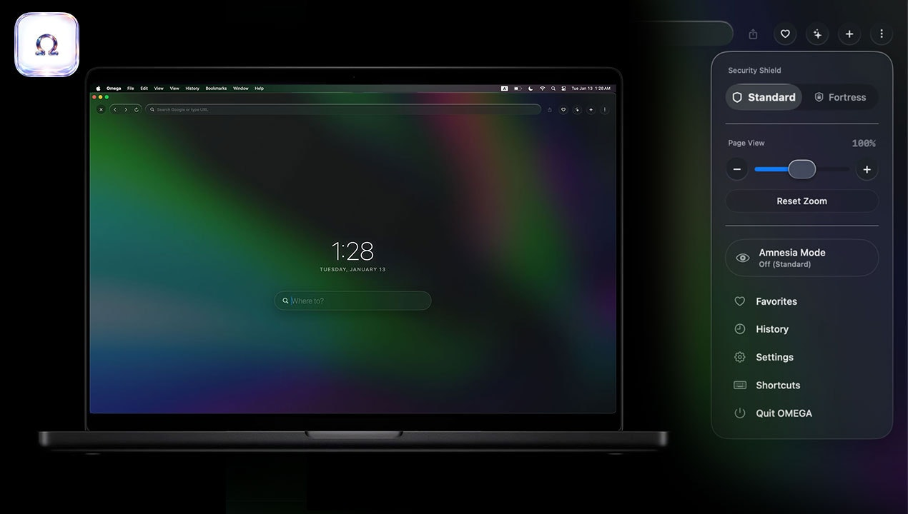

### 🎬 관련 영상
- [🎥 영상 보기](https://ph-files.imgix.net/43dac6d0-2b8d-42d2-b9f9-da2c90bf64eb.jpeg?auto=format)

---

## 2. [caricature.life](https://www.producthunt.com/products/caricature-life?utm_campaign=producthunt-api&utm_medium=api-v2&utm_source=Application%3A+antigravity_test+%28ID%3A+258588%29)
**Votes**: 242 | **Tagline**: Create a minimalist caricature. No login. No tracking.

### 📌 요약
로그인, 추적, 워터마크 없이 미니멀리스트 캐리커처 아바타를 즉시 만들 수 있는, 철저한 사생활 보호에 중점을 둔 웹 서비스입니다.

### 🔑 핵심 기능
- 번거로운 가입 및 로그인 절차가 전혀 필요 없는 ‘No Login’ 정책을 준수합니다.
- 업로드된 사진이나 개인 정보가 저장되지 않으며, 사용자를 추적하지 않는 극도의 사생활 보호를 제공합니다.
- 생성된 아바타에 워터마크가 없으며, 커뮤니티 지원 기반으로 평생 무료로 제공됩니다.

### 📸 스크린샷 및 갤러리
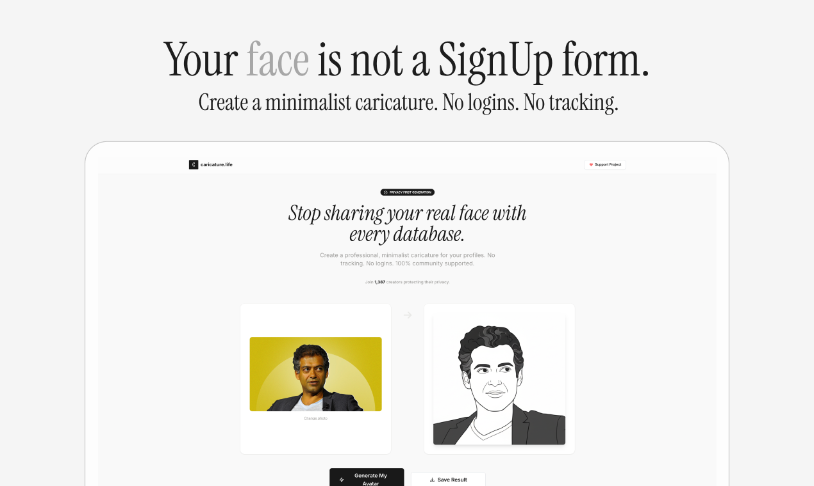
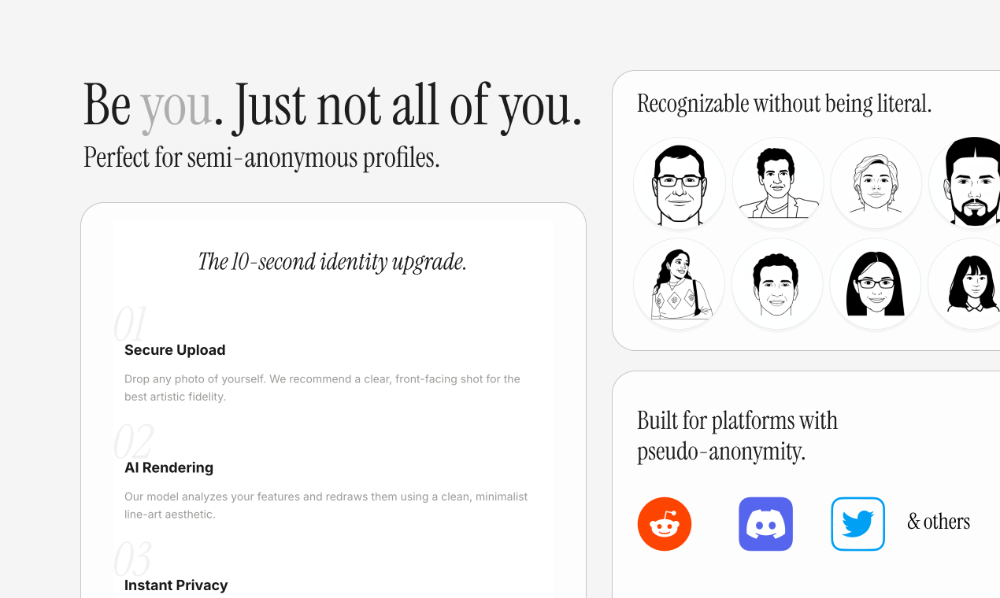
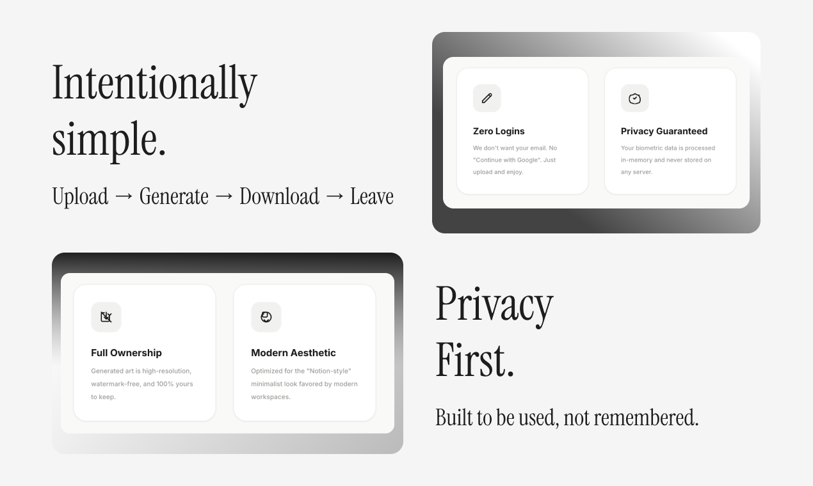

---

## 3. [Purifai](https://www.producthunt.com/products/purifai-smart-paste-for-mac?utm_campaign=producthunt-api&utm_medium=api-v2&utm_source=Application%3A+antigravity_test+%28ID%3A+258588%29)
**Votes**: 165 | **Tagline**: App-aware copy/paste that removes unsupported formatting

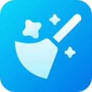

### 📌 요약
AI 도구나 웹에서 복사한 텍스트의 불필요한 서식을 제거하고, 문단과 목록 구조는 유지하며 자연스럽게 붙여넣는 '앱 인지형' 복사/붙여넣기 도구입니다.

### 🔑 핵심 기능
- 붙여넣을 앱 환경에 맞춰 불필요한 서식을 자동으로 정리하여 '복사한 티'를 없애줍니다.
- 일반 텍스트(Plain Text) 붙여넣기와 달리, 굵은 글씨, 문단, 목록, 줄 간격 등의 핵심 구조는 보존합니다.
- 용량이 11MB로 가볍고, 완전 오프라인으로 작동하며 사용자 추적이 없는 개인 정보 보호 중심의 앱입니다.

### 📸 스크린샷 및 갤러리

### 🎬 관련 영상
- [🎥 영상 보기](https://ph-files.imgix.net/04d81ca2-2f8e-43fe-b933-764dfb88ae27.jpeg?auto=format)

---

## 4. [Movens](https://www.producthunt.com/products/movens?utm_campaign=producthunt-api&utm_medium=api-v2&utm_source=Application%3A+antigravity_test+%28ID%3A+258588%29)
**Votes**: 163 | **Tagline**: Your travel organizer, live on the Lock Screen

### 📌 요약
Movens는 개인 정보를 안전하게 보호하는 오프라인 기반 여행 정리 앱으로, iOS의 라이브 액티비티 및 다이나믹 아일랜드를 활용해 필요한 여행 정보를 잠금 화면에서 즉시 제공합니다.

### 🔑 핵심 기능
- 완전히 오프라인으로 작동하며 계정 등록이 필요 없어, 항공권, 파일 등의 모든 여행 정보를 기기 내에서 안전하게 관리하는 궁극의 프라이빗 여행 지갑입니다.
- 핵심 기능인 라이브 액티비티(Live Activities)를 통해 에어비앤비 출입 코드나 항공편 좌석 번호 같은 필수 정보를 잠금 화면에서 실시간으로 확인 가능합니다.
- 다이나믹 아일랜드(Dynamic Island) 기능을 활용하여 탑승 게이트 앞에서 이메일을 뒤질 필요 없이 모든 PDF 티켓 및 예약 확인서에 즉시 접근할 수 있습니다.

### 📸 스크린샷 및 갤러리

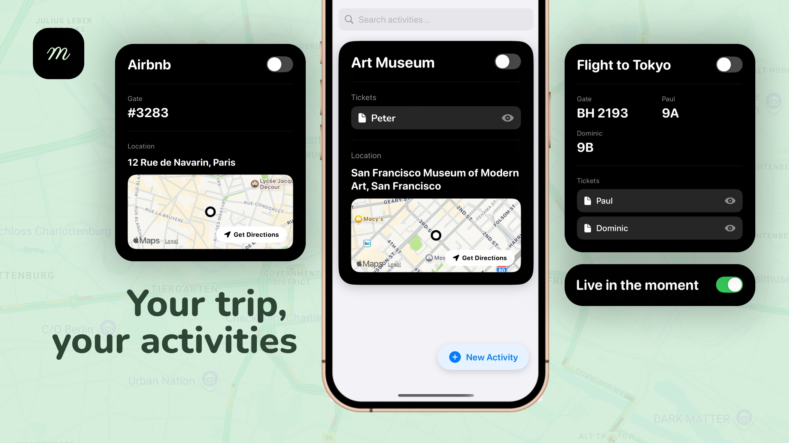
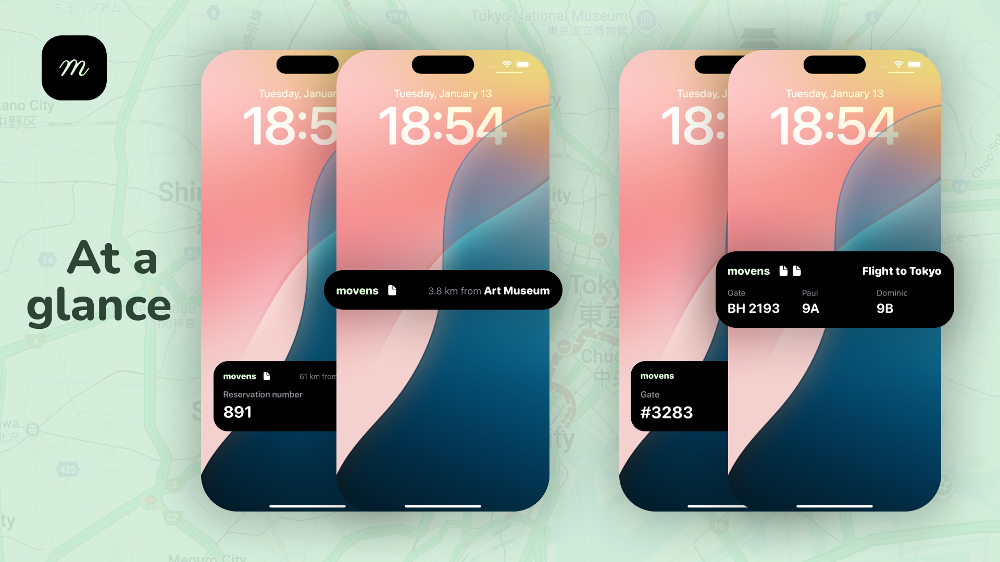

---

## 5. [Cloudchipr](https://www.producthunt.com/products/cloudchipr?utm_campaign=producthunt-api&utm_medium=api-v2&utm_source=Application%3A+antigravity_test+%28ID%3A+258588%29)
**Votes**: 118 | **Tagline**: Cloud costs observability,management and automation platform

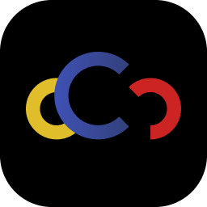

### 📌 요약
AI 에이전트를 활용하여 클라우드 비용 관찰, 관리 및 자동화를 지원하는 플랫폼입니다.

### 🔑 핵심 기능
- AI 에이전트가 클라우드 비용을 최적화하고 관련 질문에 답변합니다.
- 클라우드 환경의 이상 징후를 설명하고 보고서를 자동으로 발송합니다.
- 비용 관리 관련 작업을 할당하고 전반적인 클라우드 비용 효율성을 높입니다.

### 📸 스크린샷 및 갤러리
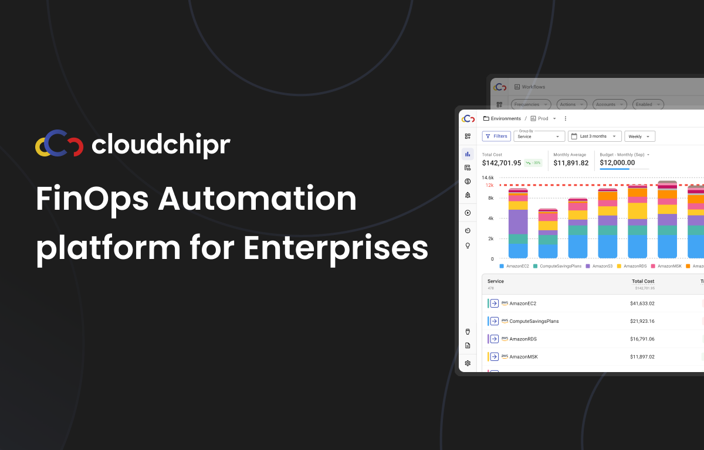
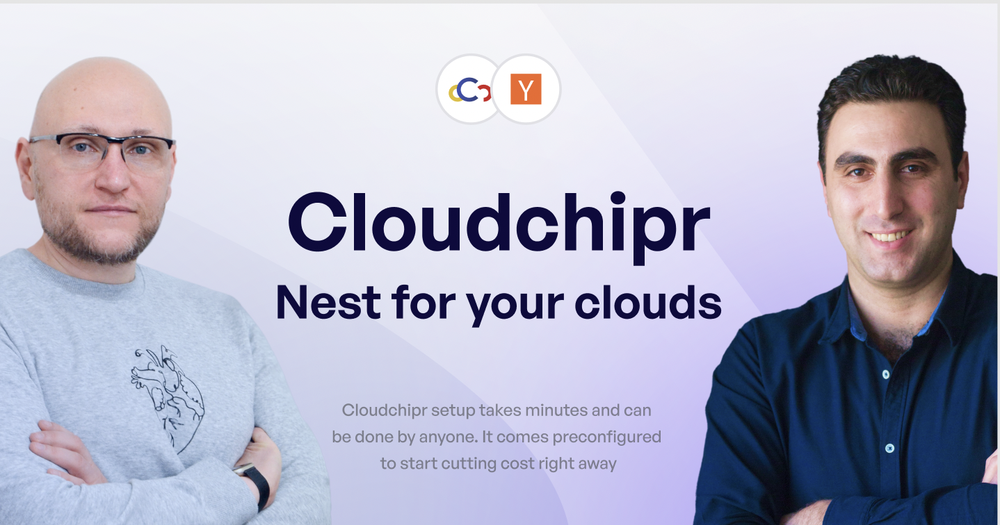

### 🎬 관련 영상
- [🎥 영상 보기](https://ph-files.imgix.net/8c075a83-1400-43f0-a316-76e45781e8c4.jpeg?auto=format)

---

## 6. [OpenWork](https://www.producthunt.com/products/openwork?utm_campaign=producthunt-api&utm_medium=api-v2&utm_source=Application%3A+antigravity_test+%28ID%3A+258588%29)
**Votes**: 54 | **Tagline**: Open-source Claude Work alternative, powered by OpenCode

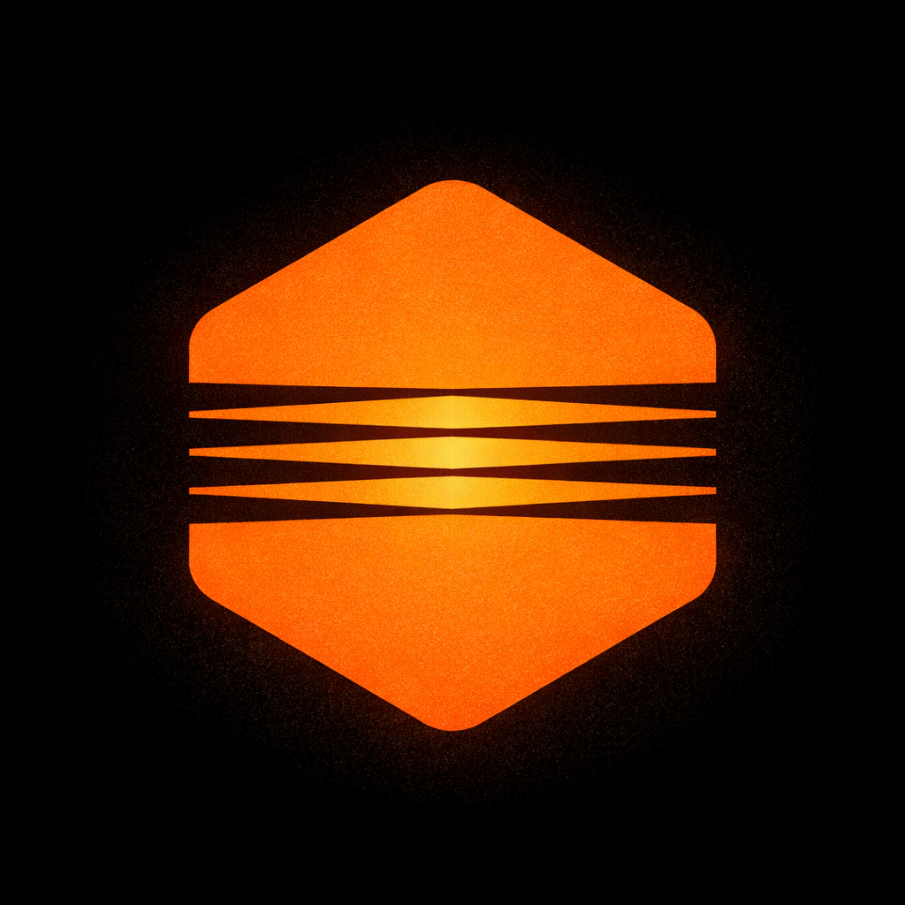

### 📌 요약
OpenWork는 확장성과 검증 용이성을 핵심으로 하며, 에이전트 기반 작업을 위한 오픈소스 데스크톱 애플리케이션이자 Claude Work의 대안입니다.

### 🔑 핵심 기능
- OpenCode 생태계를 기반으로 구축된, 에이전트 기반 작업(Agentic Work)을 위한 오픈소스 데스크톱 앱 제공.
- 출시 직후부터 확장 가능하도록 설계되었으며, 내장된 패키지 관리자를 통해 스킬과 플러그인 설치 및 관리가 용이.
- 에이전트 워크플로우를 구성 가능(Composable)하고 투명하게 검토(Inspectable)할 수 있도록 설계하여 사용자에게 높은 제어권 부여.

### 📸 스크린샷 및 갤러리
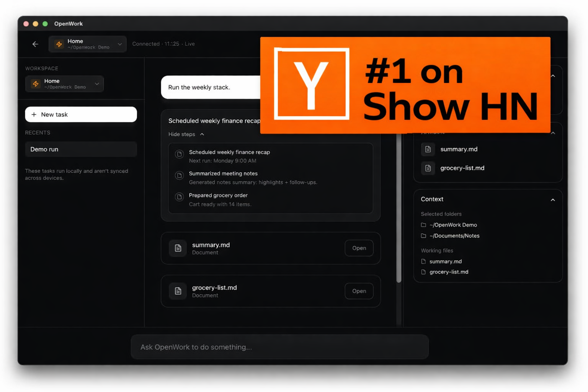
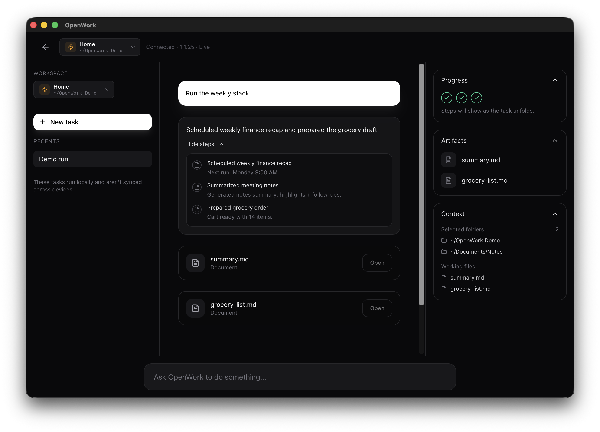
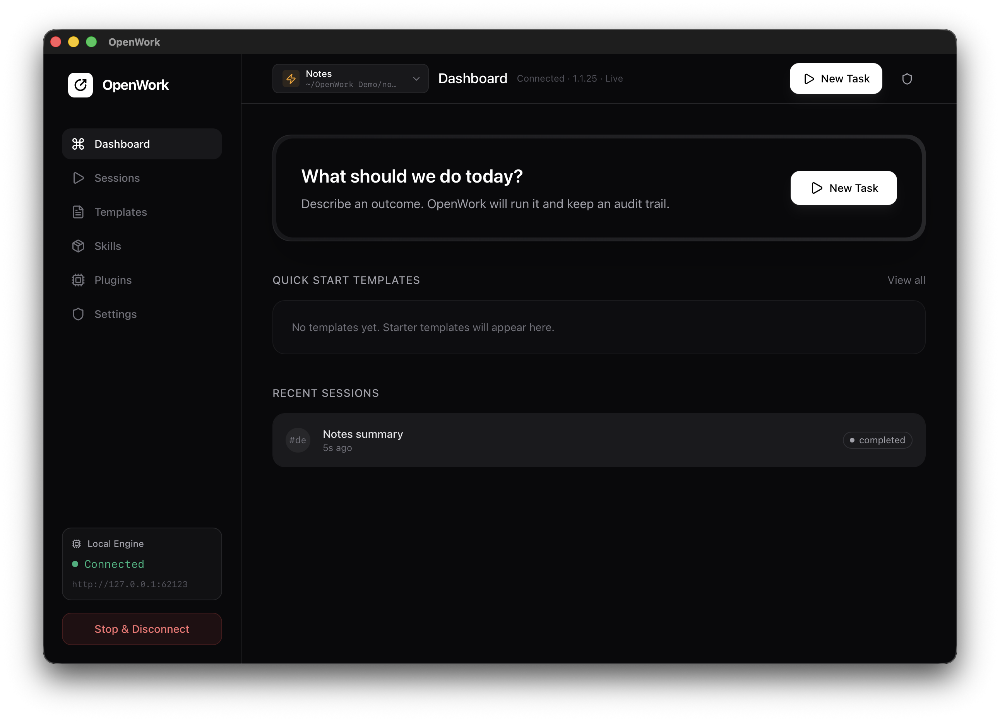

### 🎬 관련 영상
- [🎥 영상 보기](https://ph-files.imgix.net/38b1f7fb-91ab-4137-a113-c579b7d61595.jpeg?auto=format)

---

## 7. [Lifemap - Find Your Purpose](https://www.producthunt.com/products/lifemap-6?utm_campaign=producthunt-api&utm_medium=api-v2&utm_source=Application%3A+antigravity_test+%28ID%3A+258588%29)
**Votes**: 35 | **Tagline**: Beging Your New Life Journey

### 📌 요약
검증된 7단계 프레임워크를 통해 삶의 목적과 방향을 찾고 실천하도록 돕는 라이프 플래닝 및 코칭 앱입니다.

### 🔑 핵심 기능
- 삶의 명확성(Clarity)을 얻도록 돕는 검증된 라이프 플래닝 프레임워크 제공
- 명확한 방향성(Direction)을 정의하고 의도를 행동으로 전환시키는 7단계 프로세스 가이드
- 인생의 새로운 여정을 시작하려는 사용자들을 위한 코칭 및 목표 설정 지원

### 📸 스크린샷 및 갤러리

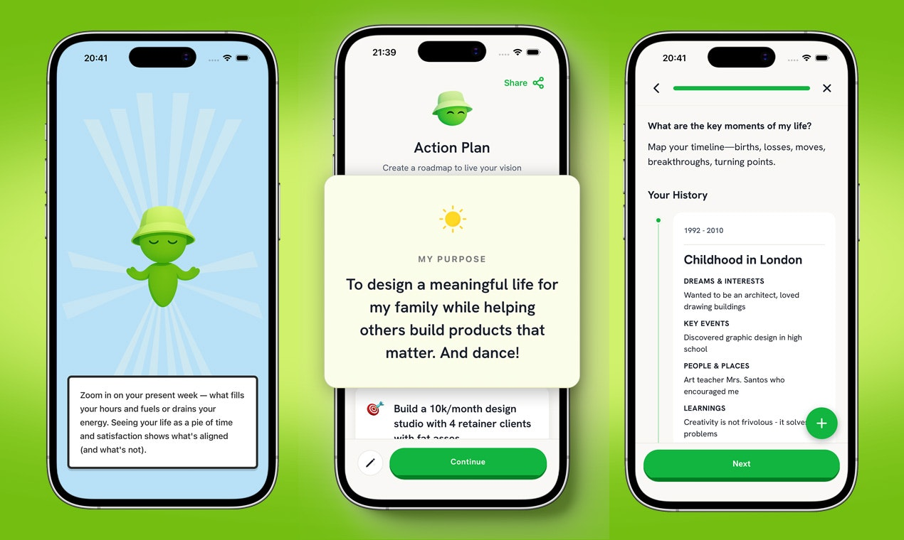

---

## 8. [ReachLLM](https://www.producthunt.com/products/reachllm?utm_campaign=producthunt-api&utm_medium=api-v2&utm_source=Application%3A+antigravity_test+%28ID%3A+258588%29)
**Votes**: 25 | **Tagline**: Dominate the AI Search Era

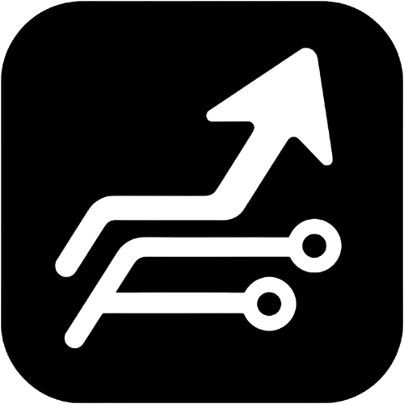

### 📌 요약
ReachLLM은 ChatGPT, Gemini 등 주요 AI 모델 전반에서 브랜드의 노출도와 가시성을 최적화하는 선도적인 AI 검색 및 LLM 가시성 플랫폼입니다.

### 🔑 핵심 기능
- 주요 AI 모델(ChatGPT, Gemini, Claude 등)에서의 브랜드 가시성 및 최적화 지원
- AI 가시성 추적 기능을 넘어, 브랜드에 적합한 콘텐츠 전략 수립을 위한 에이전트(Agentic) 기능 제공
- 노출도 향상을 위한 구체적인 실행 계획과 조치를 제시하여, AI 검색 시대의 브랜드 지배력 강화

### 📸 스크린샷 및 갤러리
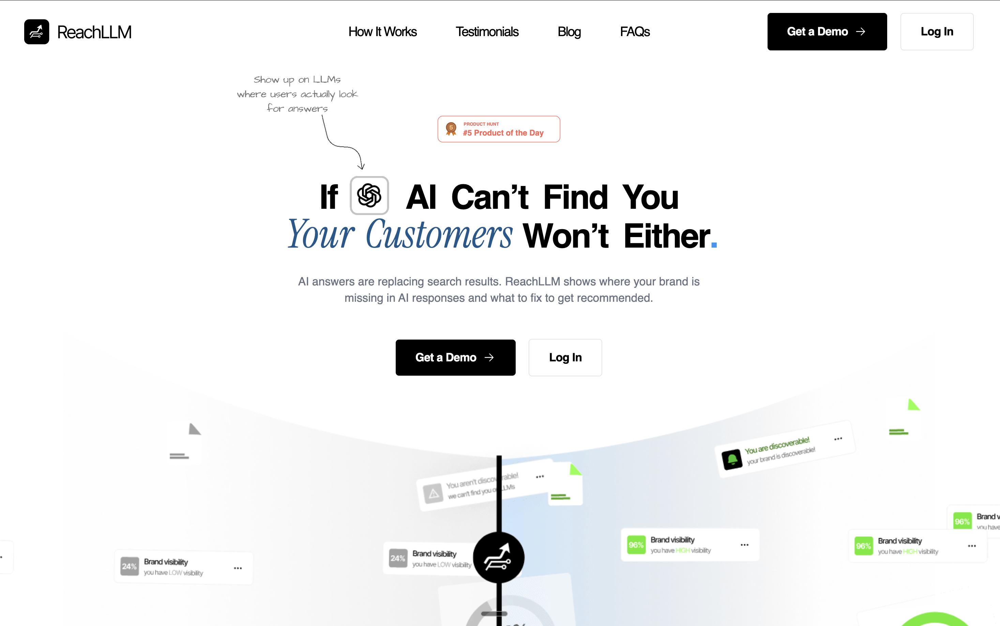
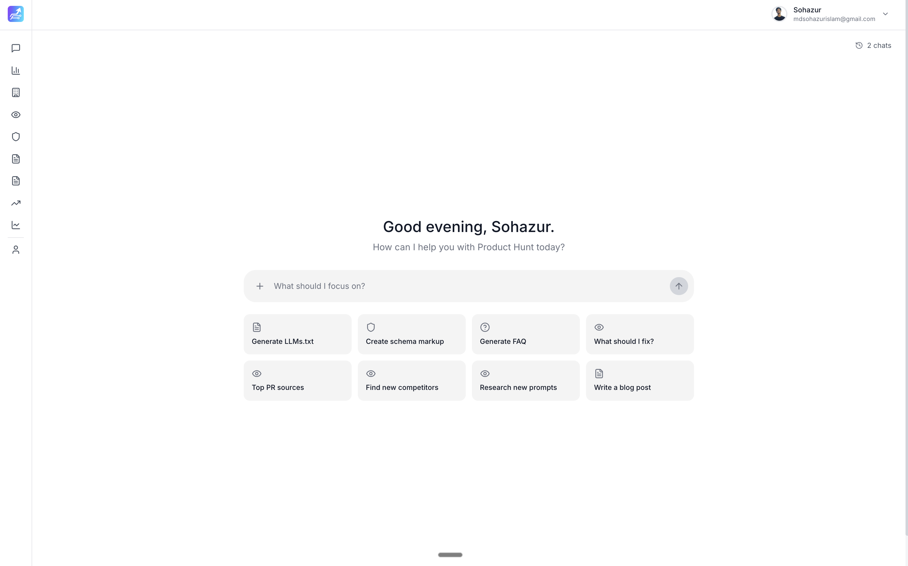
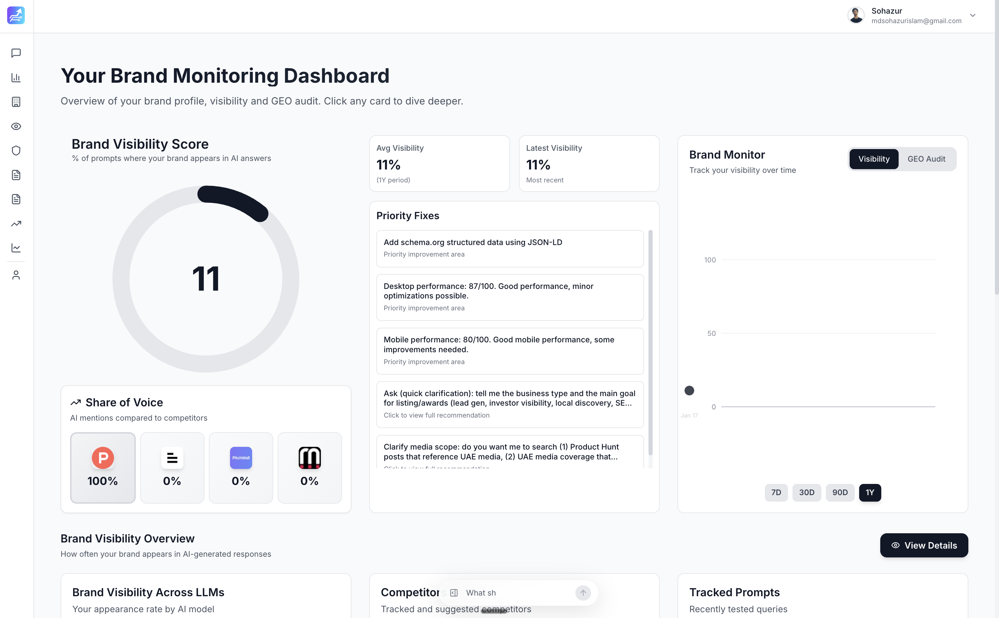

### 🎬 관련 영상
- [🎥 영상 보기](https://ph-files.imgix.net/927785e2-a4ca-489a-b7c0-7e00b40ad585.jpeg?auto=format)

---

## 9. [Qrystal Uplink](https://www.producthunt.com/products/qrystal-uplink?utm_campaign=producthunt-api&utm_medium=api-v2&utm_source=Application%3A+antigravity_test+%28ID%3A+258588%29)
**Votes**: 11 | **Tagline**: The cloud-based watchdog for IoT.

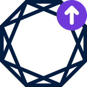

### 📌 요약
IoT 기기의 복잡한 백엔드 인프라 구축 없이, 장치 다운 및 오류 발생 시 즉시 알려주는 클라우드 기반의 ESP32/임베디드 감시 서비스입니다.

### 🔑 핵심 기능
- IoT 장치 상태 추적을 위한 맞춤형 백엔드 구축 불필요.
- 장치 침묵(crash, power loss, freeze) 시 즉시 경고하는 '페일-클로즈(fail-closed)' 로직 적용.
- 공식 SDK와 한 줄의 코드로 5분 만에 통합 가능한 초간단 설치.
- 서버 관리 부담 없이 펌웨어 개발에만 집중 가능.

### 📸 스크린샷 및 갤러리
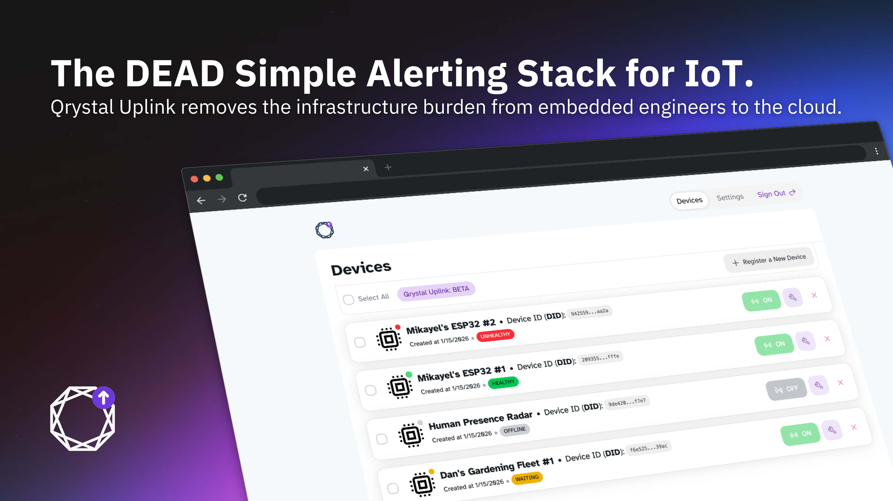
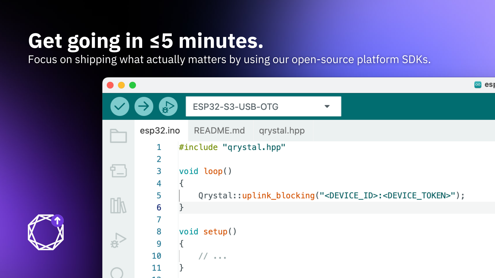
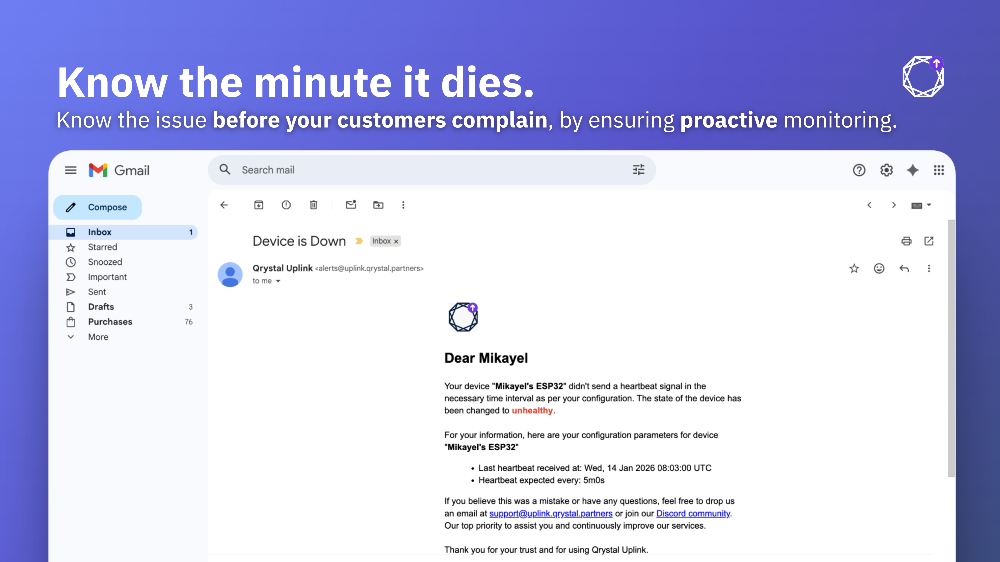

---

## 10. [Train Custom AI on Face & Style](https://www.producthunt.com/products/thumblifyai?utm_campaign=producthunt-api&utm_medium=api-v2&utm_source=Application%3A+antigravity_test+%28ID%3A+258588%29)
**Votes**: 10 | **Tagline**: Create high-quality thumbnails with your face or style

### 📌 요약
콘텐츠 제작자가 얼굴 및 스타일 기반 AI를 단 몇 초 만에 학습시켜 고품질의 일관된 썸네일을 저렴하게 제작하도록 돕는 솔루션입니다.

### 🔑 핵심 기능
- 기존에 느리고 비쌌던 썸네일 AI 학습 과정을 몇 초 만에 신속하게 완료할 수 있습니다.
- 더 선명한 출력 품질, 깔끔한 텍스트 처리, 일관된 스타일 유지를 통해 썸네일 클릭률을 높입니다.
- AI 학습 비용이 기존 20 크레딧에서 5 크레딧으로 대폭 절감되어 비용 효율성이 뛰어납니다.

### 📸 스크린샷 및 갤러리

---

