# 🚀 Product Hunt Daily Top 10 (2026-01-19)

## 1. [Noodle Seed](https://www.producthunt.com/products/noodle-seed?utm_campaign=producthunt-api&utm_medium=api-v2&utm_source=Application%3A+antigravity_test+%28ID%3A+258588%29)
**Votes**: 276 | **Tagline**: Connect your business to AI conversations in minutes

### 📌 요약
기업이 고객의 AI 검색 질문에 '응답'할 수 있도록, 노코드 방식으로 브랜딩된 AI 애플리케이션을 신속하게 구축해주는 플랫폼입니다.

### 🔑 핵심 기능
- 노코드 기반으로 몇 분 만에 브랜드 AI 앱을 구축하고, 대규모 AI 검색 플랫폼(예: ChatGPT)에 비즈니스를 연결하여 노출을 극대화합니다.
- 리드 포착, 예약 처리, 제품 판매 등 AI 대화를 통한 실질적인 비즈니스 성과 창출 기능을 제공합니다.
- 문서 업로드를 통한 AI 앱의 지능 강화 및 AI 기반 FAQ/고객 후기 자동 생성, HubSpot 자동 동기화 기능을 지원합니다.

### 📸 스크린샷 및 갤러리
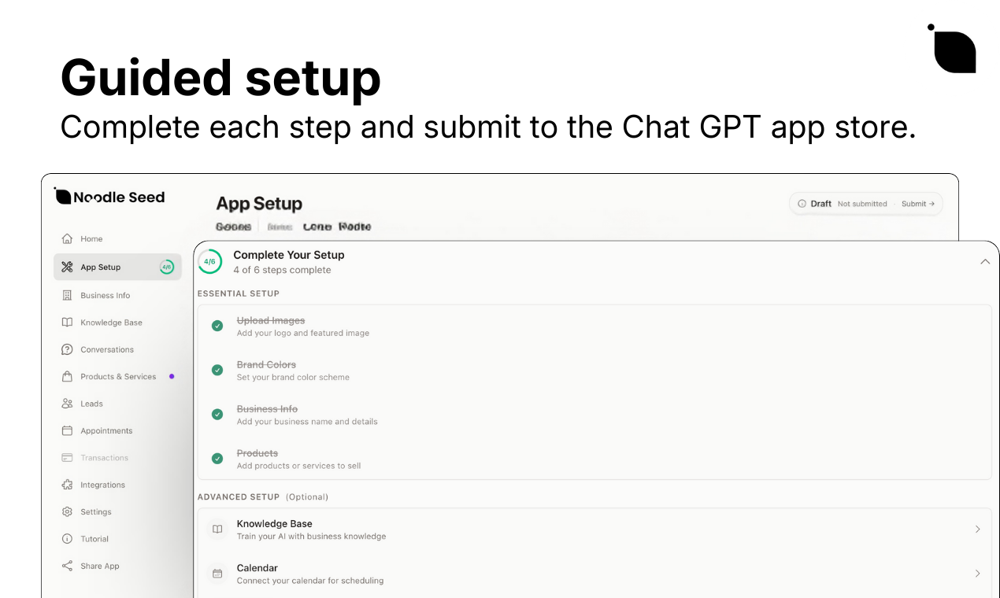
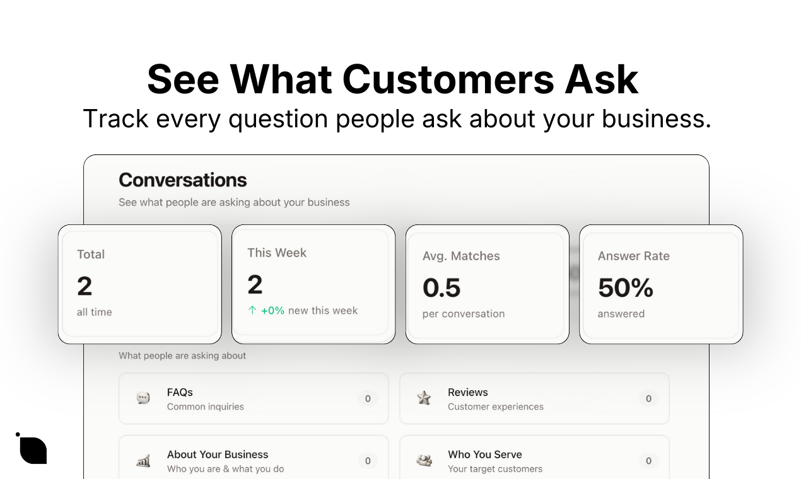
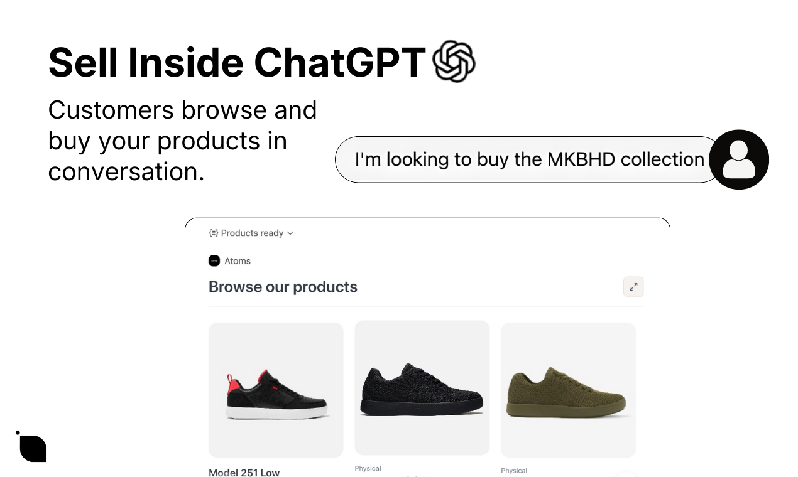

### 🎬 관련 영상
- [🎥 영상 보기](https://ph-files.imgix.net/6f84942e-0ca1-441c-b53d-912b3bbbebbc.jpeg?auto=format)

---

## 2. [OS Ninja](https://www.producthunt.com/products/os-ninja?utm_campaign=producthunt-api&utm_medium=api-v2&utm_source=Application%3A+antigravity_test+%28ID%3A+258588%29)
**Votes**: 261 | **Tagline**: Explore and learn open source using AI

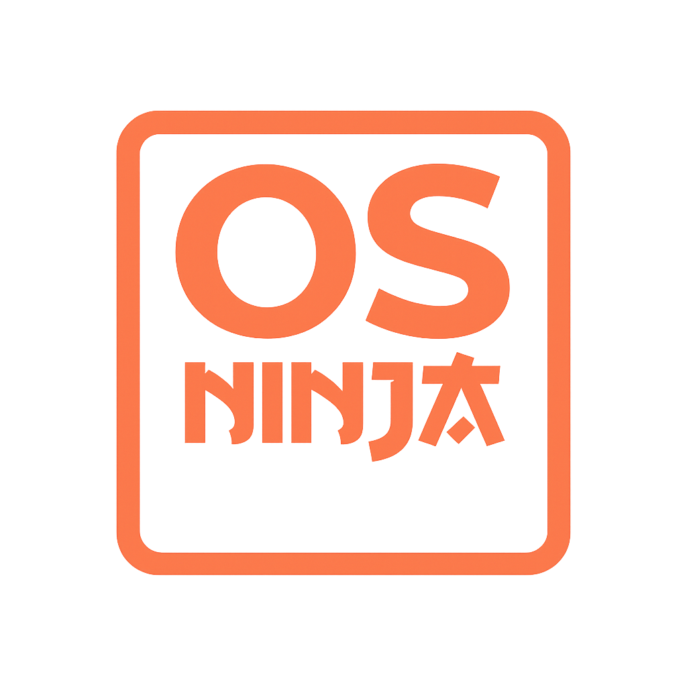

### 📌 요약
OS Ninja는 AI를 활용하여 복잡한 오픈 소스 코드를 심층적으로 탐색하고 학습할 수 있도록 돕는 인터랙티브 교육 플랫폼입니다.

### 🔑 핵심 기능
- 방대한 오픈 소스 저장소 속에서 적합한 프로젝트를 쉽게 찾고 기여할 수 있도록 지원
- 코드 레포지토리를 지루한 정보의 장벽(wall of information)이 아닌, AI가 안내하는 모험적인 학습 여정으로 전환
- 심층 학습(Deep-dive), 소크라테스식 문답, 파인만 방식 등 개인의 선호에 맞는 맞춤형 학습 포맷 제공

### 📸 스크린샷 및 갤러리
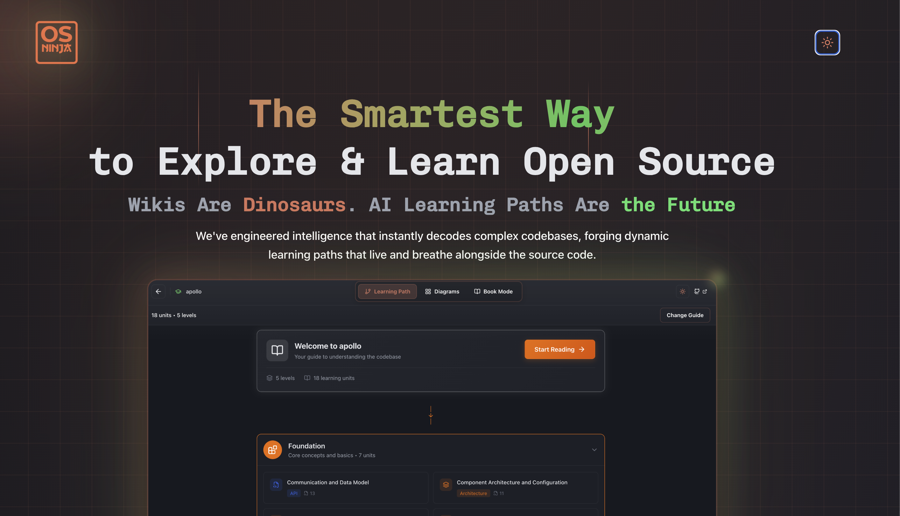
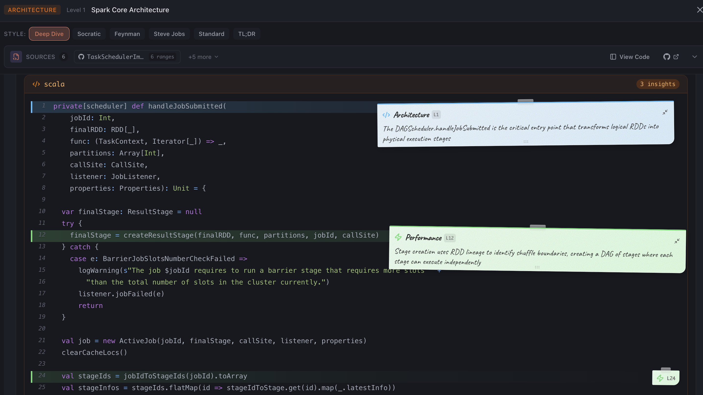
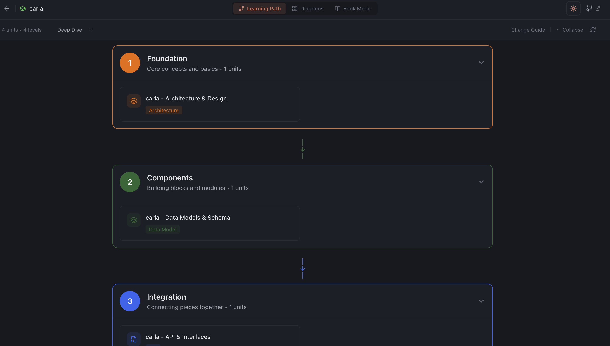

---

## 3. [Updatest](https://www.producthunt.com/products/updatest?utm_campaign=producthunt-api&utm_medium=api-v2&utm_source=Application%3A+antigravity_test+%28ID%3A+258588%29)
**Votes**: 199 | **Tagline**: Your new home for Mac updates.

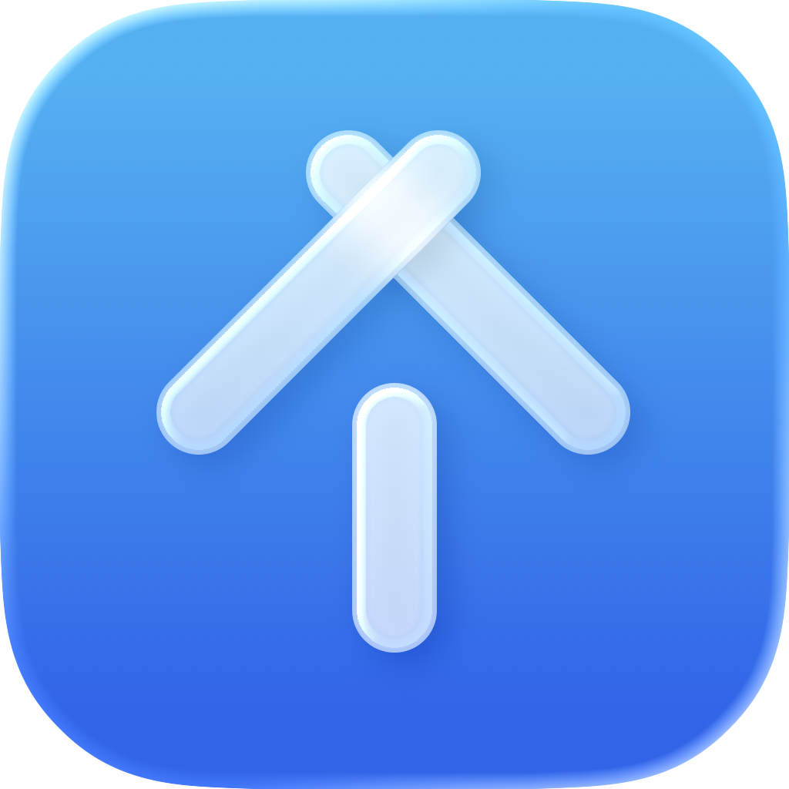

### 📌 요약
Updatest는 Homebrew, Mac App Store 등을 포함한 모든 Mac 업데이트 소스를 하나의 깔끔한 대시보드에서 통합 관리하고 일괄 업데이트하는 앱입니다.

### 🔑 핵심 기능
- Homebrew, Mac App Store, Sparkle 등 다양한 소스의 업데이트 통합 및 일괄 처리 기능 제공
- 구식 앱 탐지, 수동 설치 앱을 Homebrew로 통합하는 기능 지원
- 업데이트 보안 정보 제공 및 사용자의 데이터는 로컬에만 저장하여 개인 정보 보호 강화

### 📸 스크린샷 및 갤러리
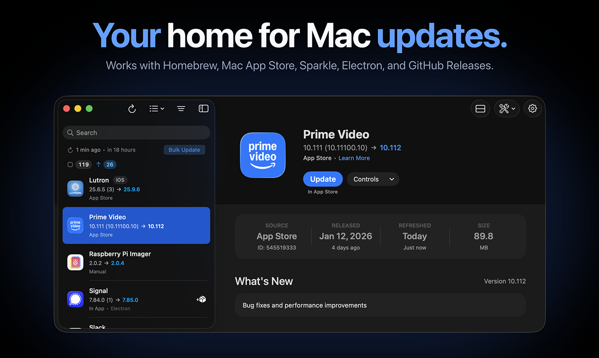
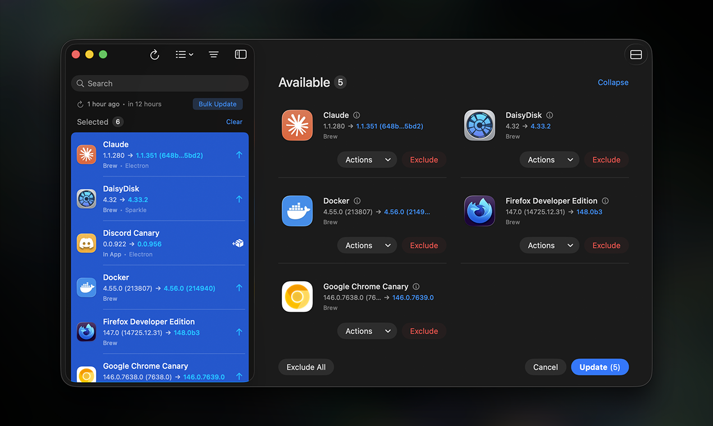
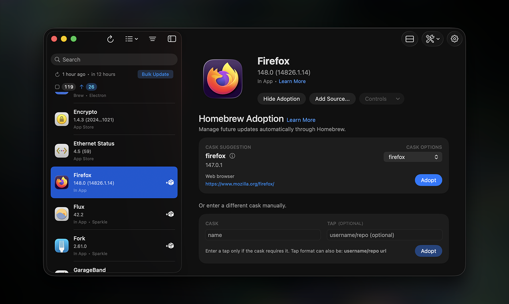

---

## 4. [FlowGenie](https://www.producthunt.com/products/flowgenie?utm_campaign=producthunt-api&utm_medium=api-v2&utm_source=Application%3A+antigravity_test+%28ID%3A+258588%29)
**Votes**: 155 | **Tagline**: Make building forms and automating workflows feel like magic

### 📌 요약
기술 팀에게 명확성과 제어력을 제공하기 위해 언리얼 엔진 블루프린트처럼 시각적인 노드 기반 편집기를 사용하는 노코드 양식 및 워크플로우 자동화 플랫폼입니다.

### 🔑 핵심 기능
- 시각적인 노드 기반 플로우 편집기를 활용하여 코딩 없이도 복잡한 양식 구축 및 워크플로우 자동화 구현.
- 언리얼 엔진 블루프린트에서 영감을 받아, 로직이 설정 패널에 숨겨지지 않고 그래프에서 투명하게 표시되어 명확성 확보.
- 예약 실행, 외부 트리거 연동, 양식 제출 결과 등 사용자가 원하는 조건에 맞춰 유연하게 워크플로우를 실행 및 자동화.

### 📸 스크린샷 및 갤러리
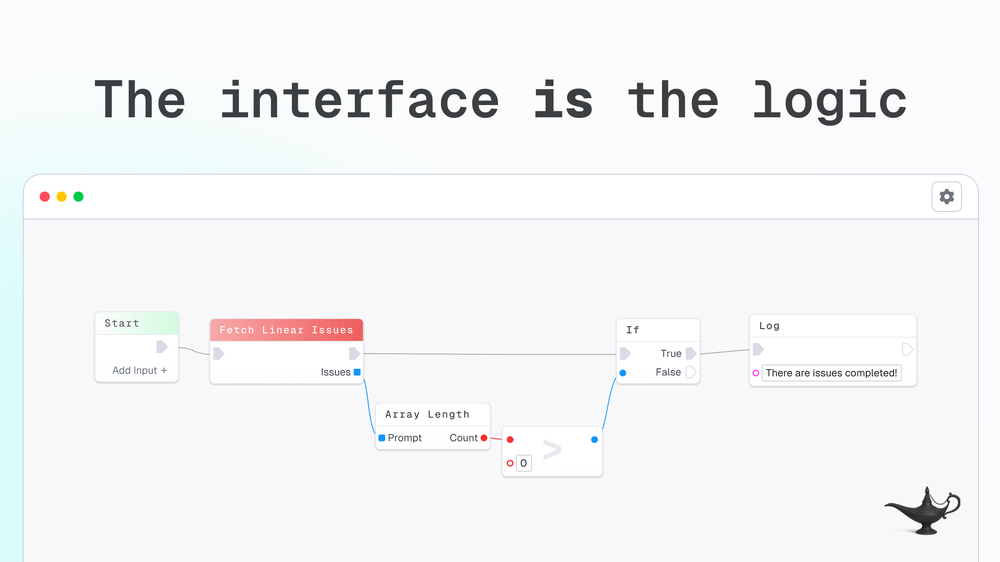
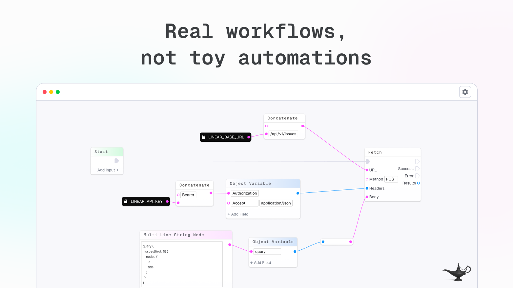
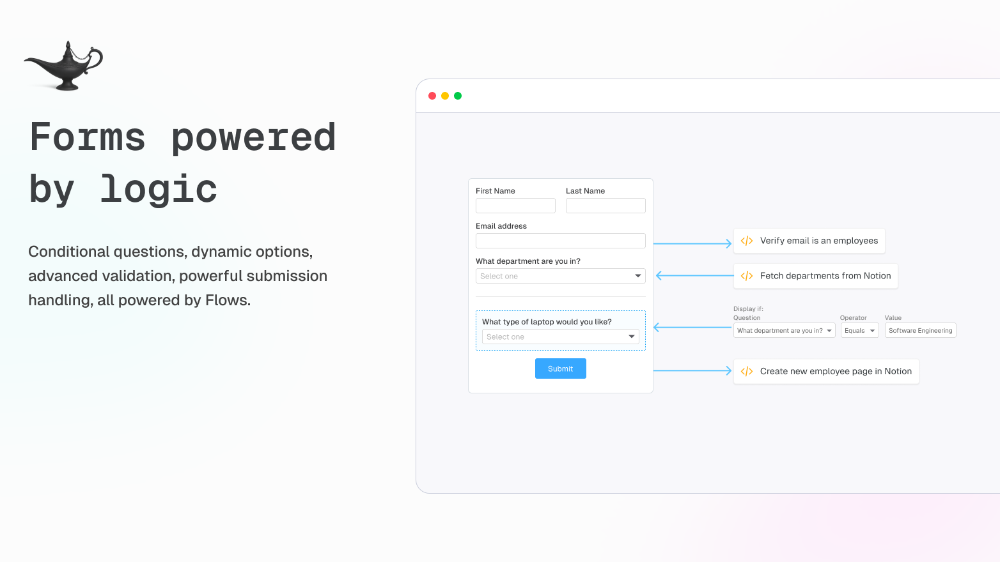

---

## 5. [Tofu Maps](https://www.producthunt.com/products/tofu-maps?utm_campaign=producthunt-api&utm_medium=api-v2&utm_source=Application%3A+antigravity_test+%28ID%3A+258588%29)
**Votes**: 152 | **Tagline**: Create personal maps you can share without accounts

### 📌 요약
로그인 없이도 나만의 장소와 경로를 저장하고 링크로 쉽게 공유할 수 있는 개인 지도 생성 서비스입니다.

### 🔑 핵심 기능
- 간편하고 빠르게 개인화된 지도(여행 계획, 촬영지 등)를 제작 가능합니다.
- 계정 생성이나 로그인 절차 없이 모든 기능을 이용할 수 있어 편리합니다.
- 프라이버시를 최우선으로 하며, 링크 공유를 통해 제작한 지도를 배포합니다.

### 📸 스크린샷 및 갤러리
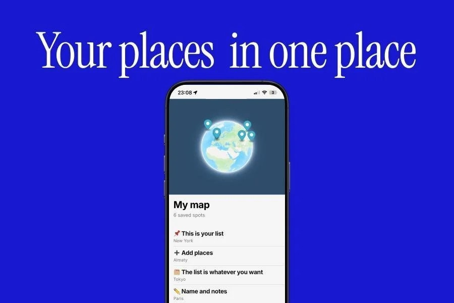
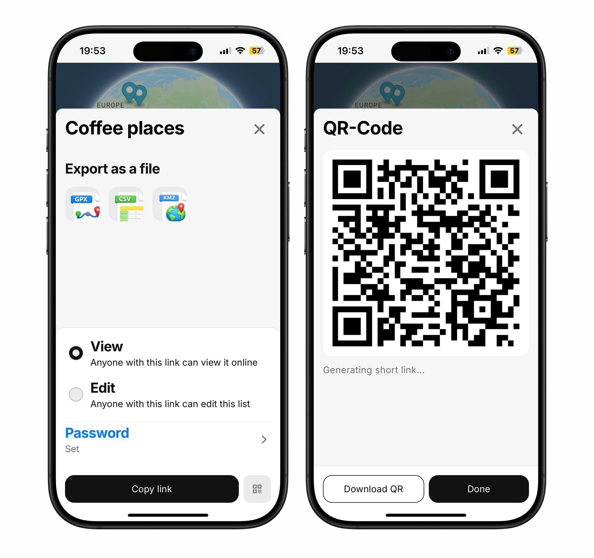
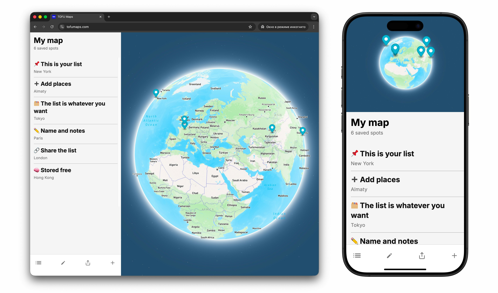

---

## 6. [21st Fund](https://www.producthunt.com/products/21st-fund?utm_campaign=producthunt-api&utm_medium=api-v2&utm_source=Application%3A+antigravity_test+%28ID%3A+258588%29)
**Votes**: 130 | **Tagline**: Agentic Grant Discovery for Founders

### 📌 요약
창업자를 위한 비희석성 자금 지원, 보조금, 크레딧 등을 AI 기반으로 발견하고 추천하는 에이전틱 보조금 탐색 서비스입니다.

### 🔑 핵심 기능
- 지분 희석 없이 받을 수 있는 비희석성(non-dilutive) 자금 지원 기회 탐색
- AI를 활용하여 보조금(grants) 및 크레딧 정보를 분석하고 맞춤형 인사이트 제공
- 창업자가 자금 조달 프로세스에서 시간을 절약하고 효율성을 극대화하도록 지원

### 📸 스크린샷 및 갤러리
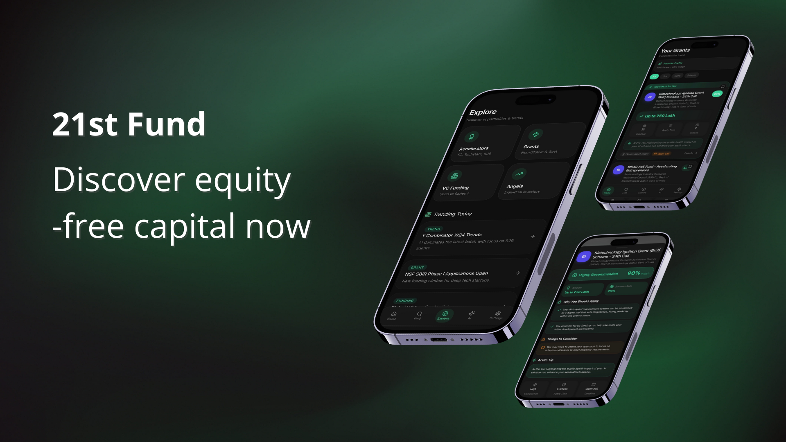
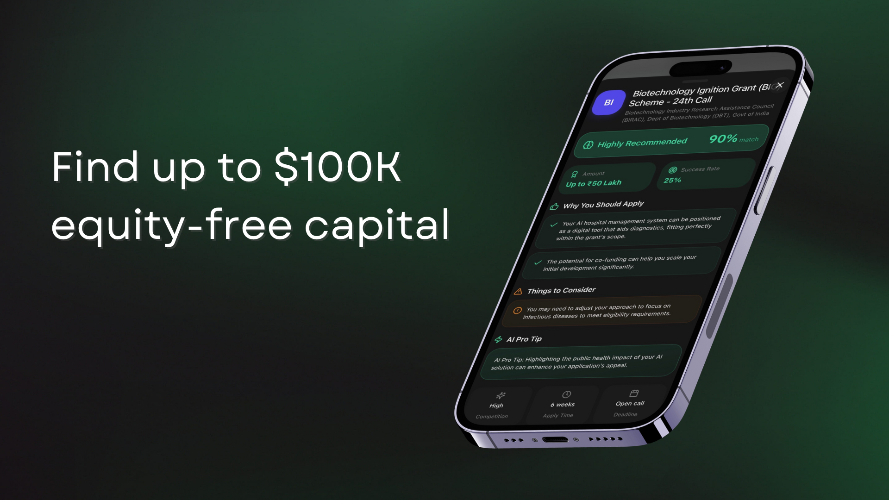
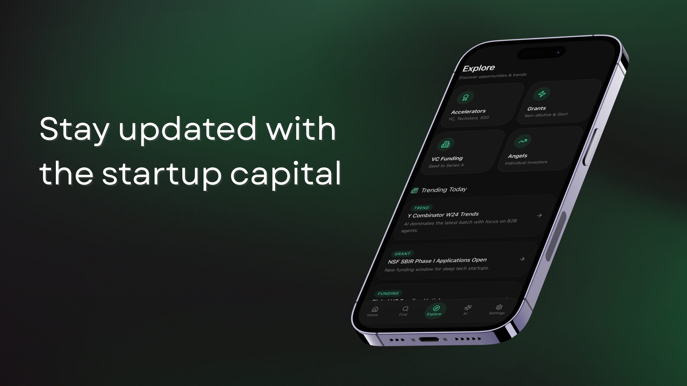

### 🎬 관련 영상
- [🎥 영상 보기](https://ph-files.imgix.net/437ead7e-0194-4921-b640-2751ba7601d7.jpeg?auto=format)

---

## 7. [Soch](https://www.producthunt.com/products/soch?utm_campaign=producthunt-api&utm_medium=api-v2&utm_source=Application%3A+antigravity_test+%28ID%3A+258588%29)
**Votes**: 127 | **Tagline**: Turn passive scrolling into active discovery

### 📌 요약
수동적인 스크롤링 시간을 능동적인 학습의 기회로 바꾸어주는 AI 기반의 리서치 아티클 큐레이션 피드 서비스입니다.

### 🔑 핵심 기능
- AI를 활용하여 연구 논문 및 기사를 선별하고 맞춤형 피드로 제공합니다.
- 복잡한 내용을 쉽게 이해할 수 있도록 간소화된 요약본을 제공합니다.
- AI가 생성한 시각 자료를 통해 콘텐츠 몰입도를 높입니다.
- 개인 맞춤형 관심사를 반영하여 자연스럽고 부담 없는 지식 발견 경험을 선사합니다.

### 📸 스크린샷 및 갤러리
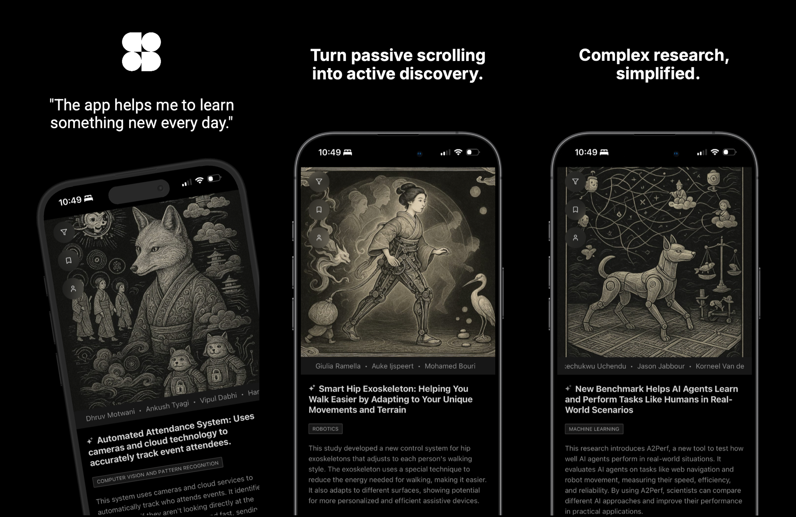
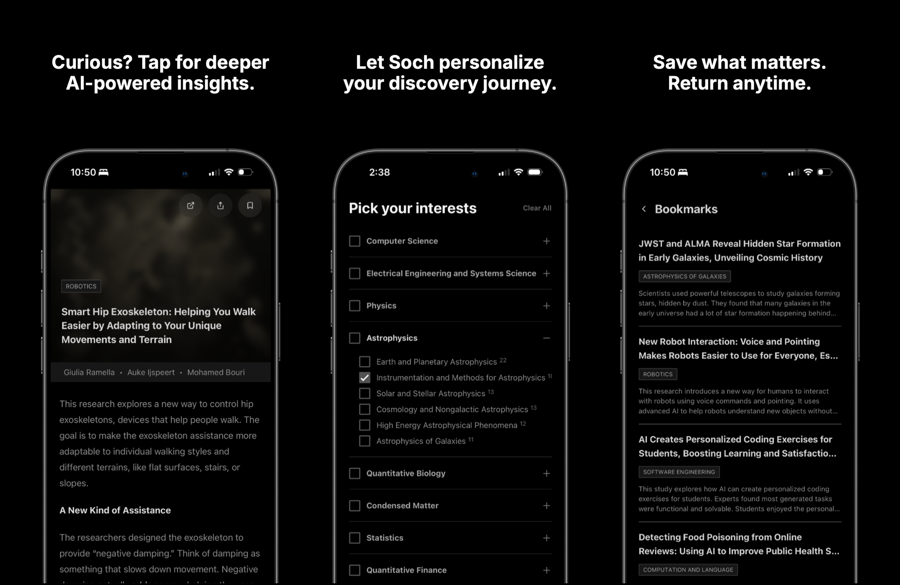

---

## 8. [Honter](https://www.producthunt.com/products/honter?utm_campaign=producthunt-api&utm_medium=api-v2&utm_source=Application%3A+antigravity_test+%28ID%3A+258588%29)
**Votes**: 110 | **Tagline**: Run design projects like a studio, even if you’re solo

### 📌 요약
솔로 디자이너도 스튜디오처럼 전문적으로 클라이언트 협업 프로젝트를 관리하게 해주는 디자인 특화 AI 작업 공간입니다.

### 🔑 핵심 기능
- 이메일, PDF, 산재된 댓글 대신 브리프, 무드보드, 버전 관리, 피드백을 한 곳에서 처리하는 통합 워크플로 제공.
- 실제 디자인 프로젝트 진행 방식에 맞춰 설계된 전문적인 구조로 클라이언트와의 협업 수준을 향상.
- 클라이언트 피드백 명료화 및 빠른 답변 초안 작성을 돕는 AI가 백그라운드에서 작동하여 관리 시간을 최소화.

### 📸 스크린샷 및 갤러리
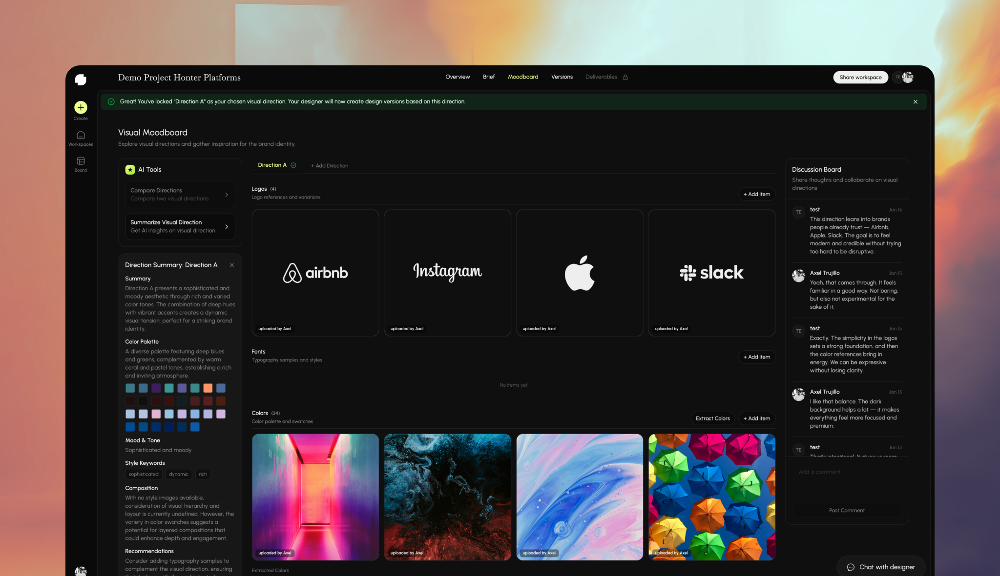
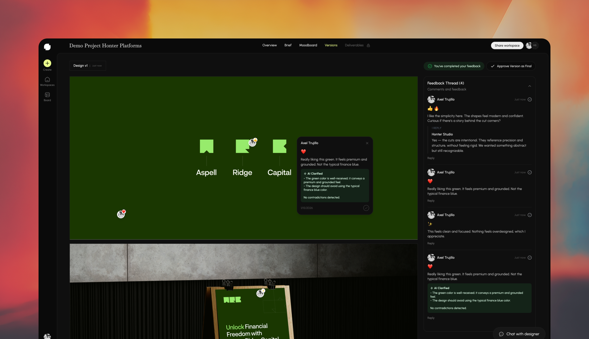
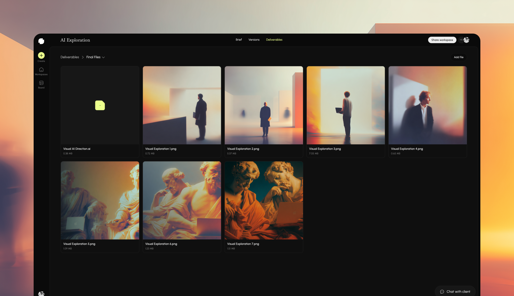

---

## 9. [Internet Makes Music](https://www.producthunt.com/products/internet-makes-music?utm_campaign=producthunt-api&utm_medium=api-v2&utm_source=Application%3A+antigravity_test+%28ID%3A+258588%29)
**Votes**: 105 | **Tagline**: A public, global music experiment. Completely free

### 📌 요약
낯선 사람들이 소리를 생성하는 픽셀을 배치하여 실시간으로 음악을 함께 만들어나가는 글로벌 공개 실험 플랫폼입니다.

### 🔑 핵심 기능
- 소리 나는 픽셀을 배치하여 누구나 음악 제작에 쉽게 참여할 수 있는 협업 시스템입니다.
- 전 세계 사용자들이 공동으로 참여하여 결과물을 완성하는 글로벌 음악 공동 실험입니다.
- 데스크톱과 모바일 등 모든 기기에서 완전히 무료로 이용 가능합니다.

### 📸 스크린샷 및 갤러리
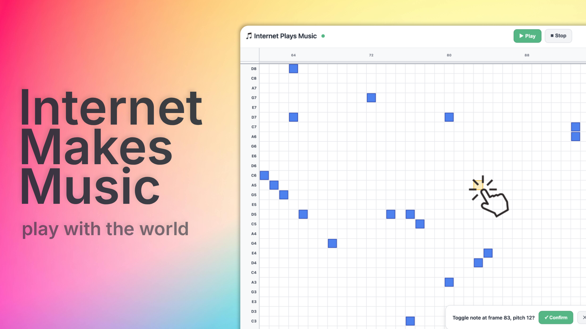
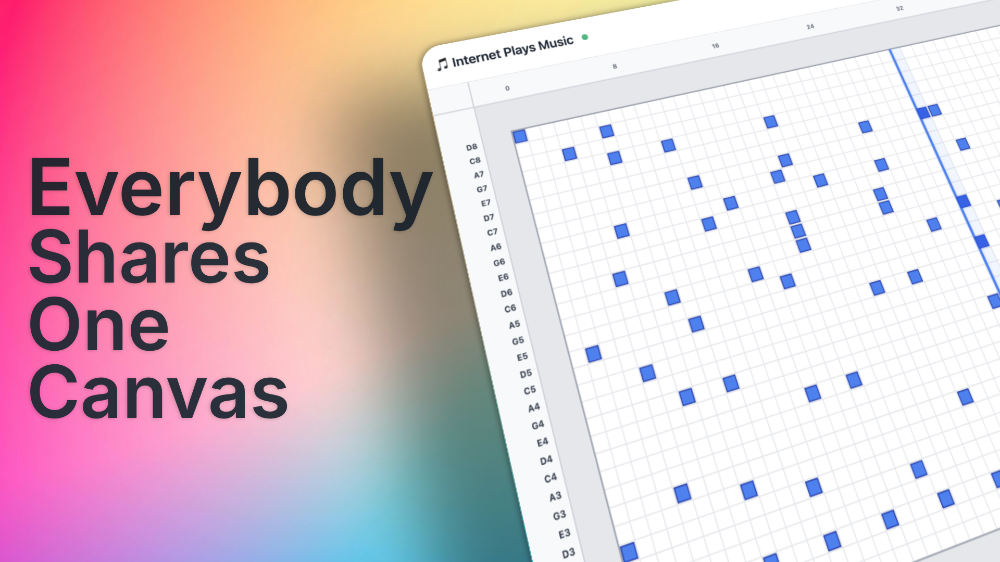
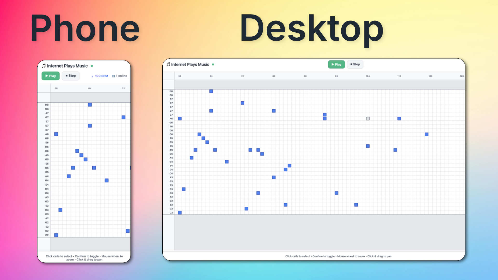

---

## 10. [NotchDrop](https://www.producthunt.com/products/notchdrop?utm_campaign=producthunt-api&utm_medium=api-v2&utm_source=Application%3A+antigravity_test+%28ID%3A+258588%29)
**Votes**: 104 | **Tagline**: A Dynamic Island experience for your Mac notch

### 📌 요약
맥북 노치 공간을 파일 공유, 클립보드 관리, 미디어 제어 등을 위한 다이내믹 아일랜드형 생산성 허브로 전환하는 네이티브 앱입니다.

### 🔑 핵심 기능
- 앱 전환 없이 노치에서 모든 작업을 처리하는 다이내믹 아일랜드형 사용자 경험 제공.
- 인터넷이나 클라우드 없이 macOS, Windows, iOS, Android 간 로컬 파일 즉시 공유 가능.
- 클립보드 기록, 화면 녹화, 스크린샷 주석 등 핵심 기능을 제공하며 일회성 구매로 사용 가능.

### 📸 스크린샷 및 갤러리
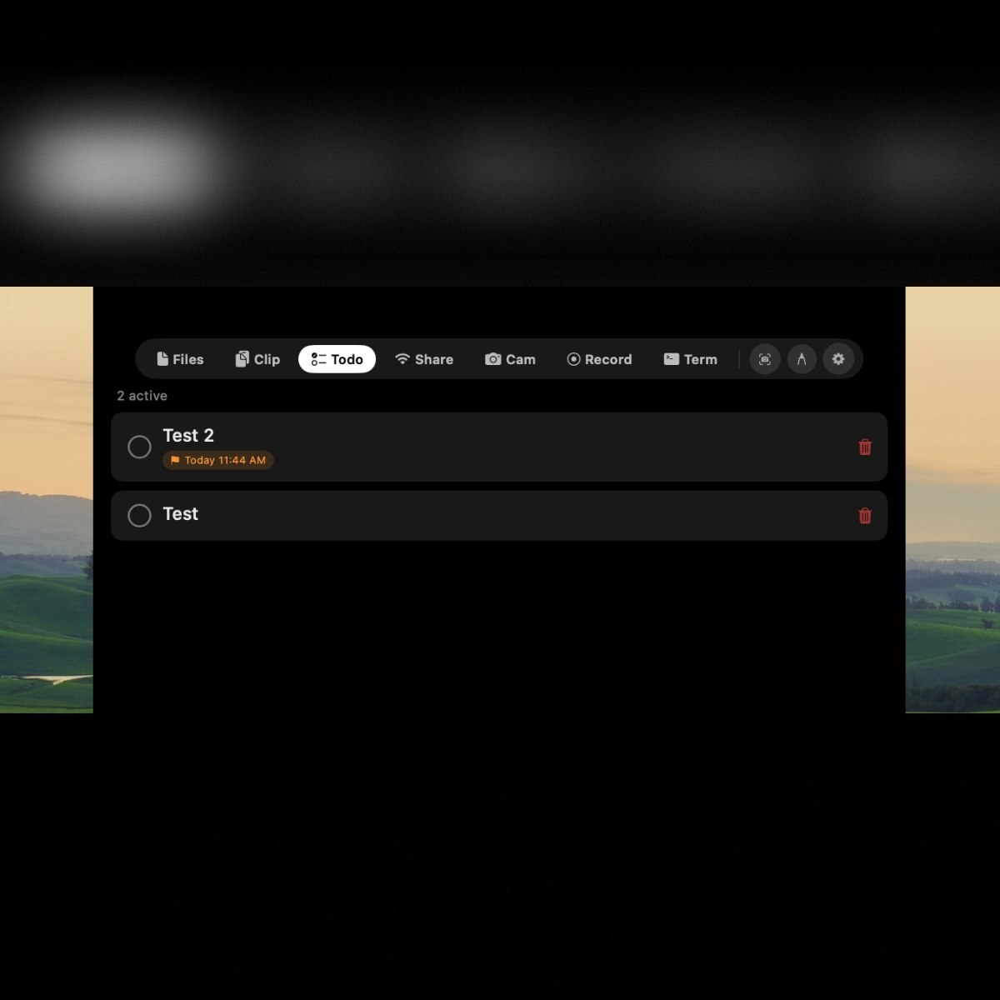
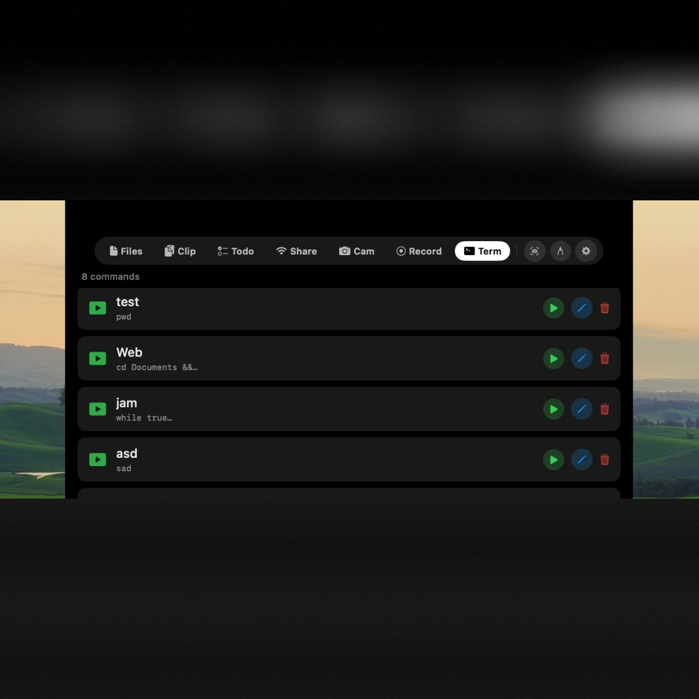

---

