# 🚀 Product Hunt Daily Top 10 (2026-01-20)

## 1. [daily.dev Recruiter](https://www.producthunt.com/products/daily-dev?utm_campaign=producthunt-api&utm_medium=api-v2&utm_source=Application%3A+antigravity_test+%28ID%3A+258588%29)
**Votes**: 304 | **Tagline**: Hire from the world's largest developer community

### 📌 요약
세계 최대 개발자 커뮤니티인 daily.dev가 개발자 채용 솔루션을 출시하여 잠재적 인재(passive talent)에게 직접 접근하고 매칭할 수 있게 합니다.

### 🔑 핵심 기능
- 세계 최대 개발자 커뮤니티를 활용하여 평소 구직 활동을 하지 않는 수동적 인재(passive talent)에게 접근 가능합니다.
- 개발자가 매일 사용하며 성장하는 플랫폼 내에서 채용 공고를 게시하고 인재와 매칭됩니다.
- daily.dev 이용자들이 실제로 대화하고 싶어 하는 엔지니어들과 만날 수 있도록 돕는 채용 네트워크입니다.

### 📸 스크린샷 및 갤러리

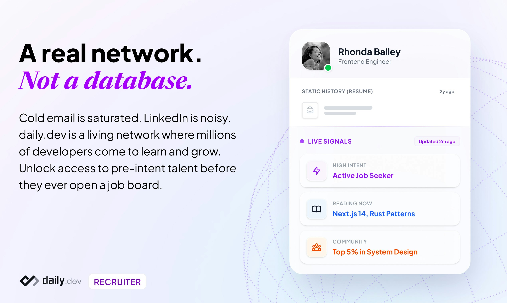
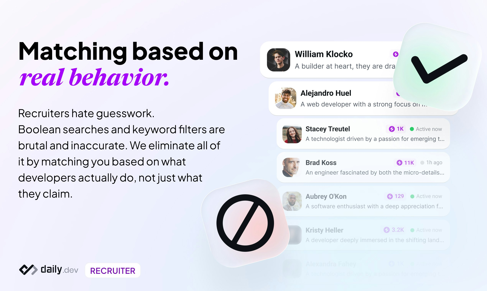

### 🎬 관련 영상
- [🎥 영상 보기](https://ph-files.imgix.net/7e0f9807-ce4d-47a7-9b7b-123dae8e9c5f.jpeg?auto=format)

---

## 2. [Interactpitch](https://www.producthunt.com/products/interactpitch-2?utm_campaign=producthunt-api&utm_medium=api-v2&utm_source=Application%3A+antigravity_test+%28ID%3A+258588%29)
**Votes**: 266 | **Tagline**: Interactive pitch decks with real-time viewer insights

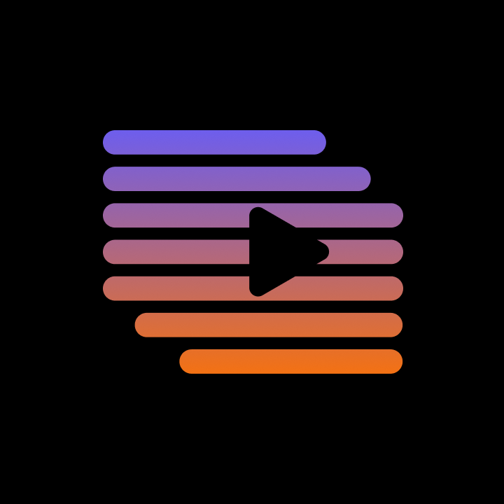

### 📌 요약
InteractPitch는 AI 아바타가 투자자에게 설명을 제공하고 실시간 분석을 통해 첫 미팅 준비도를 높여주는 인터랙티브 피치 덱 솔루션입니다.

### 🔑 핵심 기능
- 투자자가 슬라이드를 넘길 때 AI 아바타가 설명을 추가하여 컨텍스트를 제공합니다.
- 누가, 얼마나 깊이, 어떤 섹션을 보았는지 등 실시간 투자자 참여 인사이트를 제공합니다.
- 미팅 전 투자자의 관심사와 질문을 파악하여 첫 미팅을 자신감 있고 철저하게 준비할 수 있게 돕습니다.

### 📸 스크린샷 및 갤러리
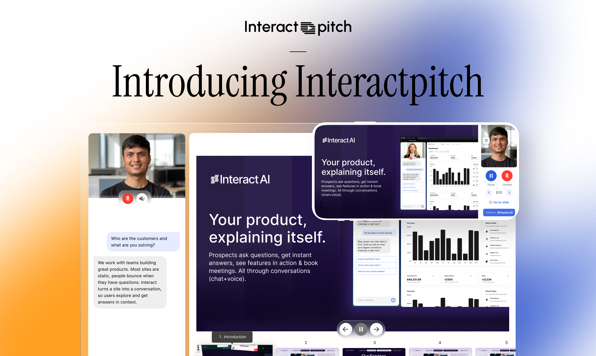
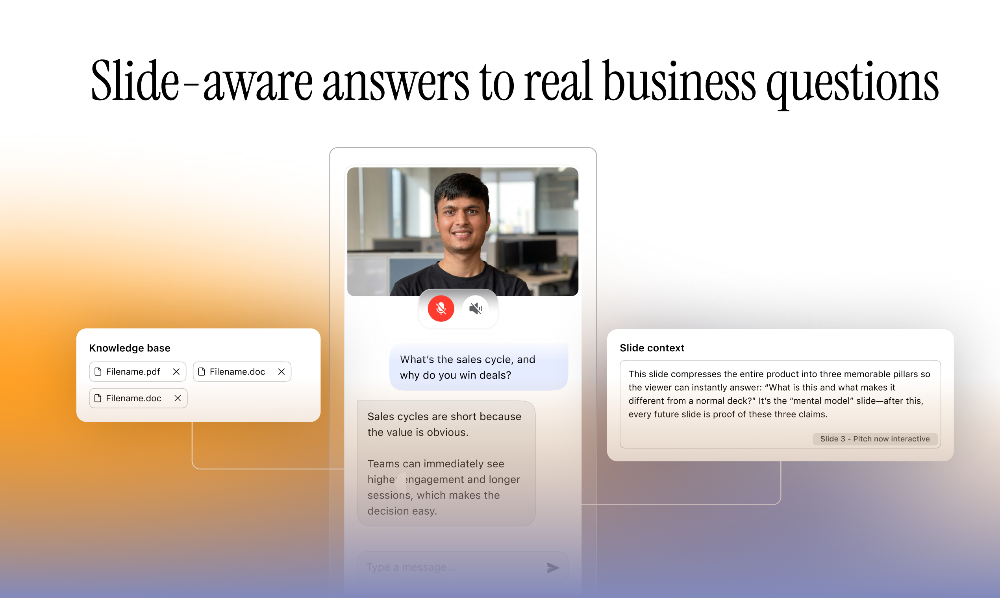
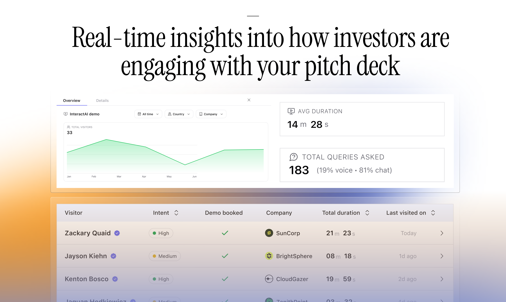

### 🎬 관련 영상
- [🎥 영상 보기](https://ph-files.imgix.net/482264f4-778a-4610-9e3f-f29cc08d9d0c.jpeg?auto=format)

---

## 3. [Typeless for Android](https://www.producthunt.com/products/typeless-2?utm_campaign=producthunt-api&utm_medium=api-v2&utm_source=Application%3A+antigravity_test+%28ID%3A+258588%29)
**Votes**: 168 | **Tagline**: First AI voice keyboard for Android

### 📌 요약
Android용 최초의 AI 음성 키보드로, 자연스러운 말하기를 세련된 메시지와 문서로 변환하여 타이핑보다 10배 빠르게 작업할 수 있도록 돕습니다.

### 🔑 핵심 기능
- Android 플랫폼용으로 출시된 최초의 '진정한' 지능형 AI 음성 키보드입니다.
- 자연스러운 구어를 다듬어진 메시지, 이메일, 문서 등으로 자동 변환해 줍니다.
- 기존 타이핑 방식보다 10배 빠른 속도로 텍스트 입력이 가능합니다.

### 📸 스크린샷 및 갤러리
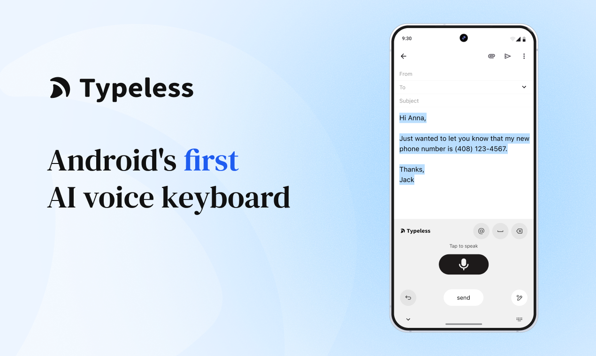

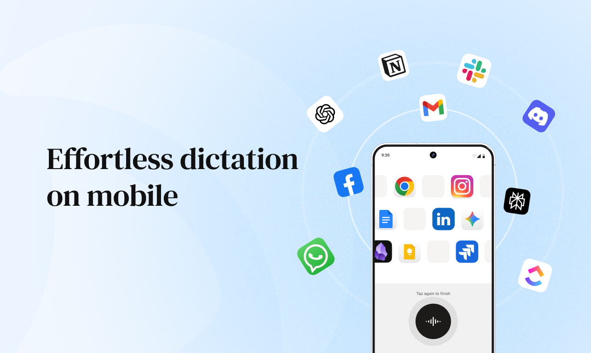

### 🎬 관련 영상
- [🎥 영상 보기](https://ph-files.imgix.net/6a9222cf-193f-4dd3-b0f2-729a31029d56.jpeg?auto=format)

---

## 4. [Evernote v11](https://www.producthunt.com/products/evernote?utm_campaign=producthunt-api&utm_medium=api-v2&utm_source=Application%3A+antigravity_test+%28ID%3A+258588%29)
**Votes**: 162 | **Tagline**: Your second brain, leveled up.

### 📌 요약
당신이 사랑하는 에버노트가 AI 기능을 탑재하여 메모와 지식 관리의 새로운 장을 여는 'Evernote v11'로 진화했습니다.

### 🔑 핵심 기능
- AI 어시스턴트: 메모와 상호작용하며 더 스마트하게 정보를 활용할 수 있도록 돕습니다.
- AI 회의록 기능: 녹음 파일의 다중 화자 자동 전사(Transcription)를 지원하여 회의 내용을 효율적으로 기록합니다.
- 강화된 검색 기능: 키워드를 넘어 문맥적 의미를 이해하여 더 정확한 검색 결과를 제공합니다.

### 📸 스크린샷 및 갤러리

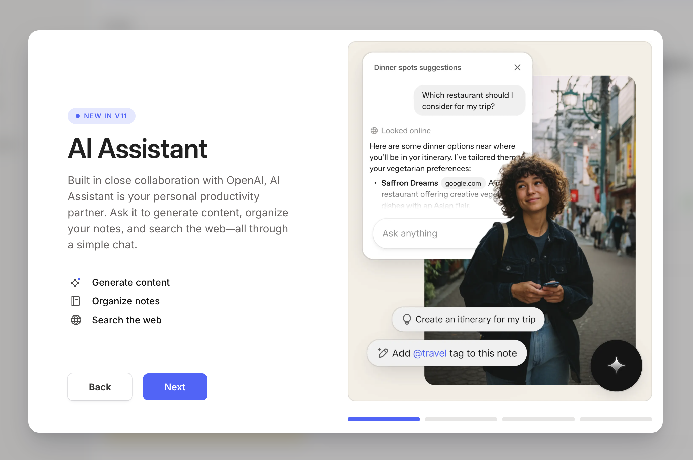
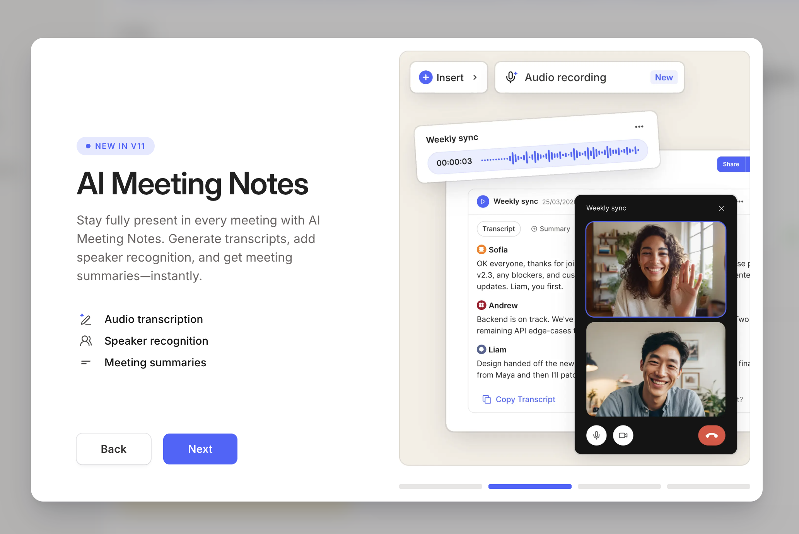

### 🎬 관련 영상
- [🎥 영상 보기](https://ph-files.imgix.net/7acc1b32-157e-4a3e-ae54-bbe76e70d9c8.jpeg?auto=format)

---

## 5. [Dopamine.chat](https://www.producthunt.com/products/dopamine-chat?utm_campaign=producthunt-api&utm_medium=api-v2&utm_source=Application%3A+antigravity_test+%28ID%3A+258588%29)
**Votes**: 147 | **Tagline**: Effortlessly build your AI team for everything you do

### 📌 요약
복잡한 설정 과정 없이 몇 분 만에 업무에 즉시 투입 가능한 유연한 AI 팀을 구축하여, 사용자가 더 빠르게 움직이고 효율적으로 정리하며 앞서나갈 수 있도록 돕는 에이전트 빌더입니다.

### 🔑 핵심 기능
- 몇 주가 아닌 몇 분 만에 유연하고 임무 수행 준비가 완료된 맞춤형 AI 팀 멤버를 생성할 수 있습니다.
- 기존 에이전트 빌더의 고질적인 문제인 복잡하고 무거운 설정 및 긴 학습 기간을 제거하여 마찰 없는(frictionless) 사용 경험을 제공합니다.
- 일상생활 정리부터 업무 가속화까지, 구축한 AI 팀을 생활 및 업무 환경 어디서든 자유롭게 활용할 수 있습니다.

### 📸 스크린샷 및 갤러리
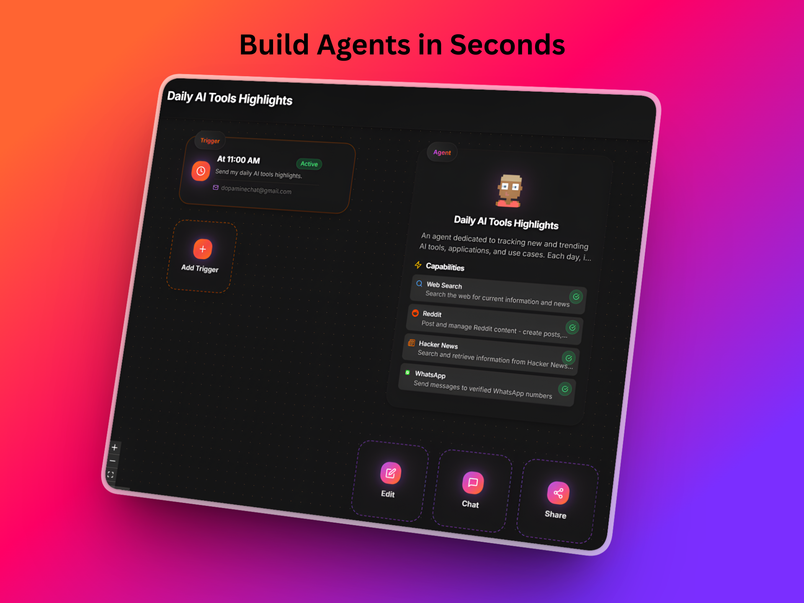
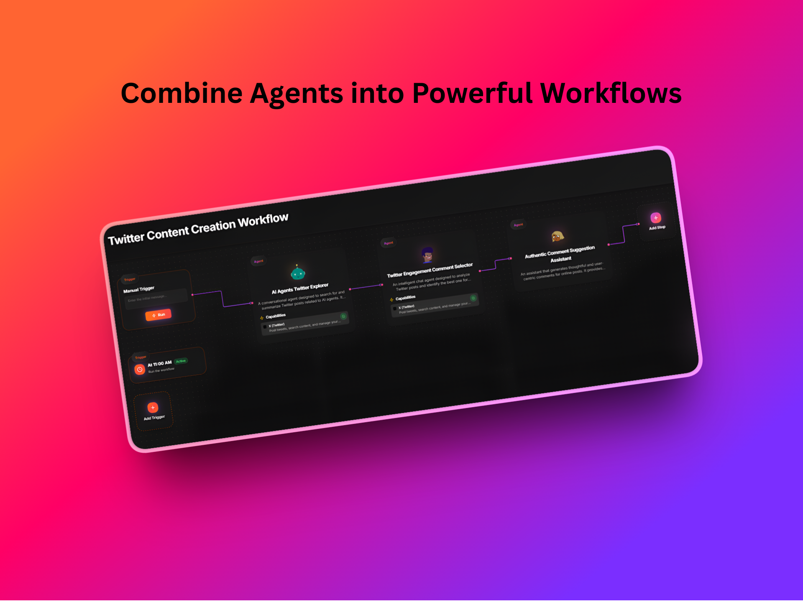

---

## 6. [Figy.ai](https://www.producthunt.com/products/figy-ai?utm_campaign=producthunt-api&utm_medium=api-v2&utm_source=Application%3A+antigravity_test+%28ID%3A+258588%29)
**Votes**: 136 | **Tagline**: AI Flashcards That Grow as You Learn

### 📌 요약
Figy.ai는 사용자가 업로드한 모든 종류의 콘텐츠를 학습 효율을 극대화하는 스마트 AI 플래시카드로 자동 변환해주는 무료 학습 도구입니다.

### 🔑 핵심 기능
- 어떤 주제나 문서(노트, 기사 등)든 몇 초 만에 정교한 AI 플래시카드로 제작 가능합니다.
- 학습 과정 중에 사용자의 이해도에 맞춰 카드가 지속적으로 업데이트 및 개선됩니다.
- 학생, 교육자, 평생 학습자 모두를 위해 더 빠르고, 더 오래 기억하며, 몰입도 높은 학습 경험을 제공합니다.

### 📸 스크린샷 및 갤러리
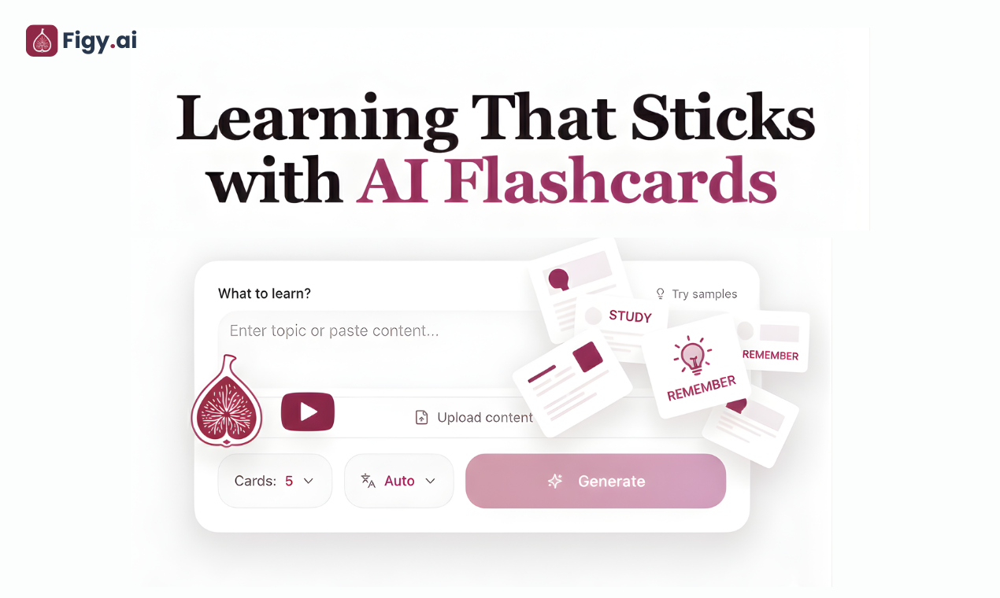
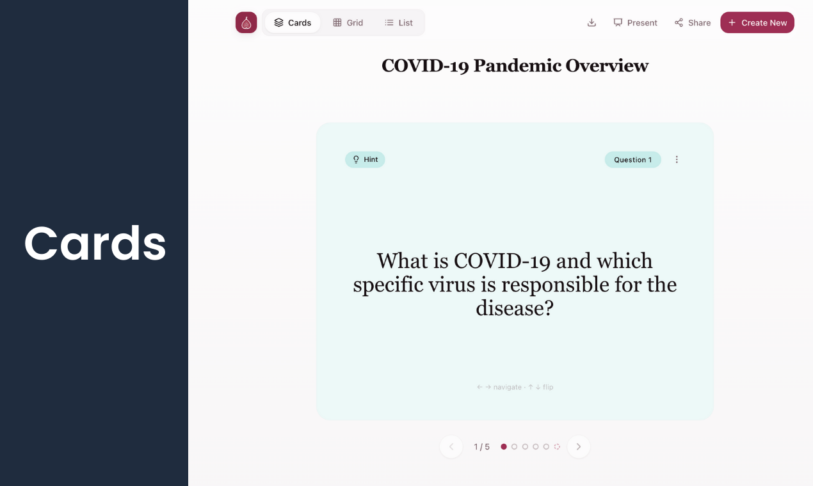

### 🎬 관련 영상
- [🎥 영상 보기](https://ph-files.imgix.net/5527a46a-9c5c-437d-9951-eac759cc553a.jpeg?auto=format)

---

## 7. [Rippletide Eval CLI](https://www.producthunt.com/products/rippletide-eval-cli?utm_campaign=producthunt-api&utm_medium=api-v2&utm_source=Application%3A+antigravity_test+%28ID%3A+258588%29)
**Votes**: 132 | **Tagline**: Rippletide CLI is an evaluation tool for AI agents

### 📌 요약
AI 에이전트 엔드포인트의 성능을 커맨드 라인에서 직접 평가하고 환각(Hallucination) 지표를 제공하는 인터랙티브 터미널 도구입니다.

### 🔑 핵심 기능
- AI 에이전트의 지식 기반으로 질문을 자동 생성하여 평가를 용이하게 합니다.
- 재현 가능한 벤치마킹을 위해 미리 정의된 질문 세트를 지원합니다.
- 실시간 진행 상황, 자동 평가, 명확한 환각 KPI를 통해 즉각적인 성능 피드백을 제공합니다.

### 📸 스크린샷 및 갤러리
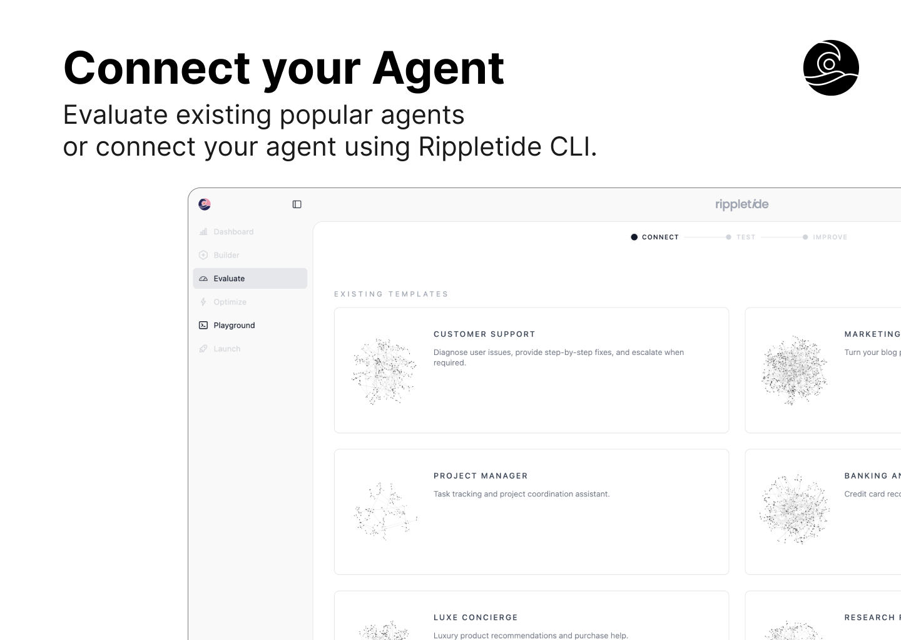
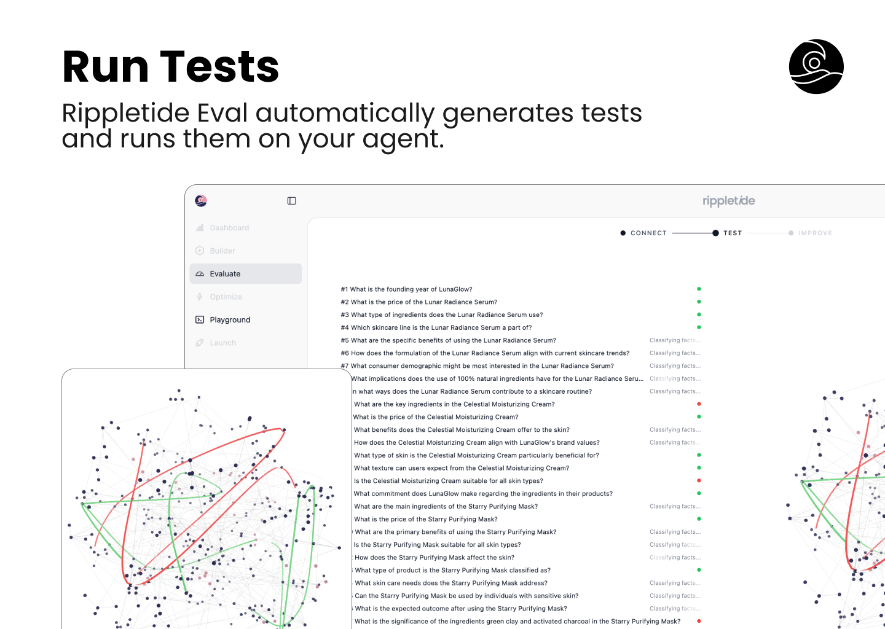

### 🎬 관련 영상
- [🎥 영상 보기](https://ph-files.imgix.net/4e0b5b28-fd8d-4dc9-ac01-2b1aa43c0ff5.jpeg?auto=format)

---

## 8. [Trace](https://www.producthunt.com/products/trace-23?utm_campaign=producthunt-api&utm_medium=api-v2&utm_source=Application%3A+antigravity_test+%28ID%3A+258588%29)
**Votes**: 124 | **Tagline**: F**k The Algorithm. Make Your Own

### 📌 요약
알고리즘에 의존하지 않고, 유튜브, 레딧, 해커 뉴스 등 다양한 웹 소스를 통합하여 사용자 맞춤형 핵심 정보를 선별해 주는 콘텐츠 큐레이션 도구입니다.

### 🔑 핵심 기능
- 다수의 웹 소스(YouTube, Reddit, X 등) 콘텐츠를 한 곳에 통합하여 효율적인 정보 습득 가능
- 사용자의 작업 및 피드백을 학습하여 개인화된 콘텐츠 신호를 제공
- 알고리즘의 의존성을 벗어나 사용자가 중요한 정보를 놓치지 않도록 도와주는 '디지털 소음 제거' 기능

### 📸 스크린샷 및 갤러리
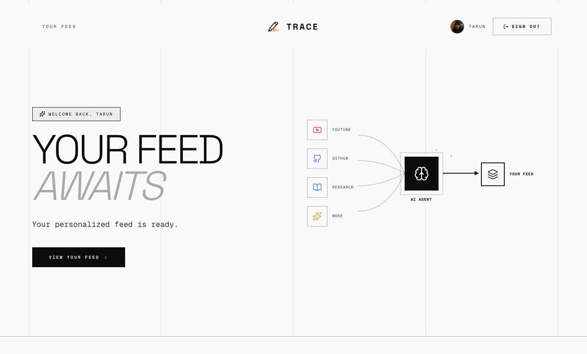
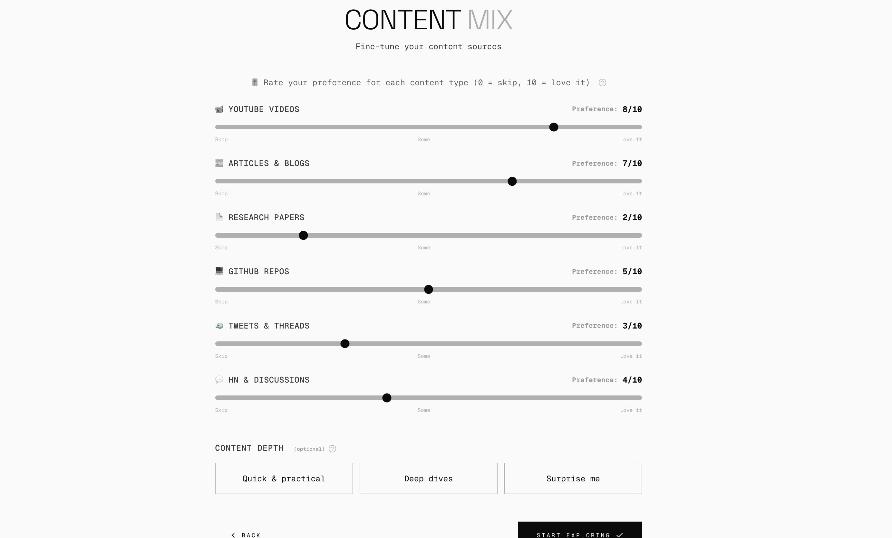
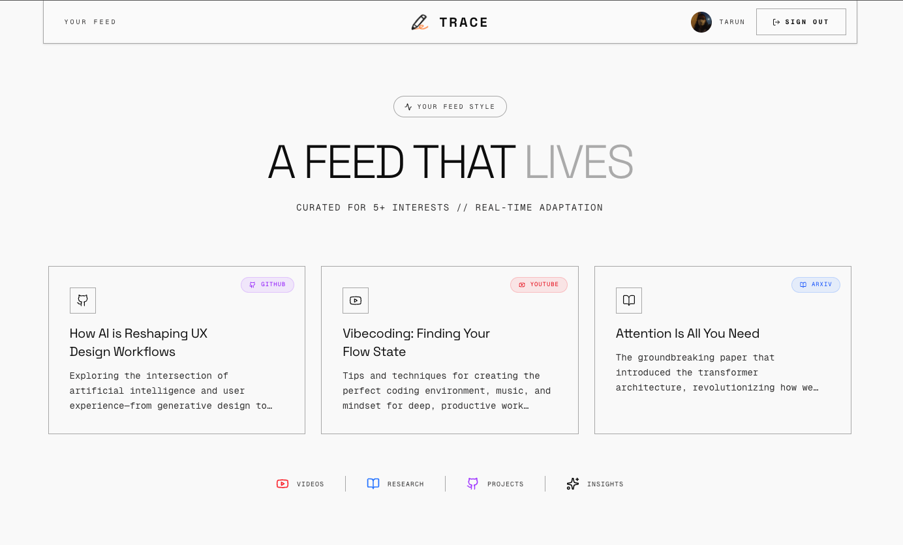

### 🎬 관련 영상
- [🎥 영상 보기](https://ph-files.imgix.net/123510e1-daad-4aa3-ba20-3b134bea3f5d.jpeg?auto=format)

---

## 9. [Sapiare New Tab](https://www.producthunt.com/products/sapiare-new-tab?utm_campaign=producthunt-api&utm_medium=api-v2&utm_source=Application%3A+antigravity_test+%28ID%3A+258588%29)
**Votes**: 117 | **Tagline**: Find inspiration every time you open a new tab.

### 📌 요약
새 탭을 열 때마다 영감을 주는 시각적 사고, 명화, 그리고 역사적 인물들의 통찰력 있는 짧은 명언을 제공하는 미니멀한 크롬 확장 프로그램입니다.

### 🔑 핵심 기능
- 영감을 불러일으키는 시각적 사고 자료를 제공하여 창의성을 자극합니다.
- 엄선된 명화 컬렉션을 큐레이션하여 예술적 경험을 선사합니다.
- 역사상 가장 뛰어난 인물들의 트윗 스타일 짧은 명언(Quote)을 보여줍니다.
- 제품 개발자 및 기업가에게 특히 유용한 사고의 깊이를 더해주는 콘텐츠에 집중합니다.

### 📸 스크린샷 및 갤러리
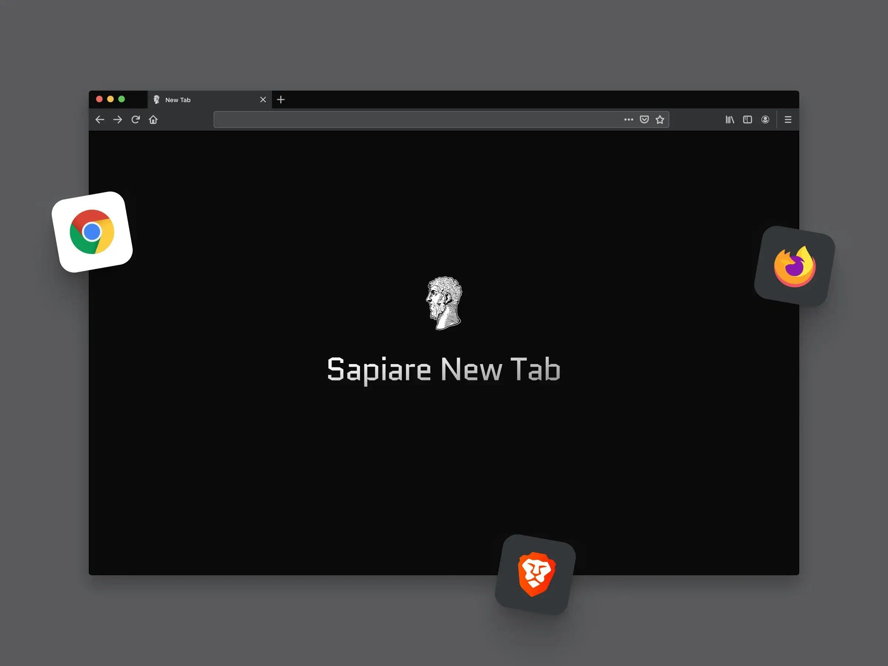
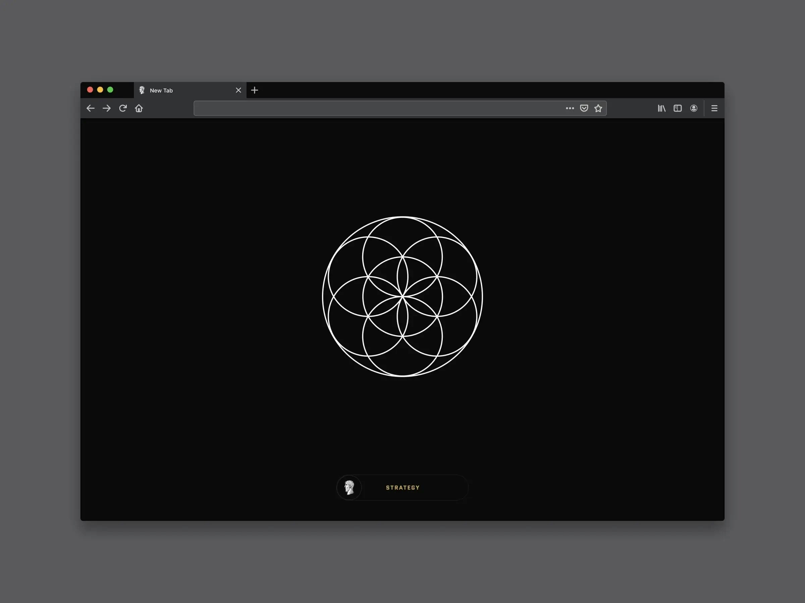
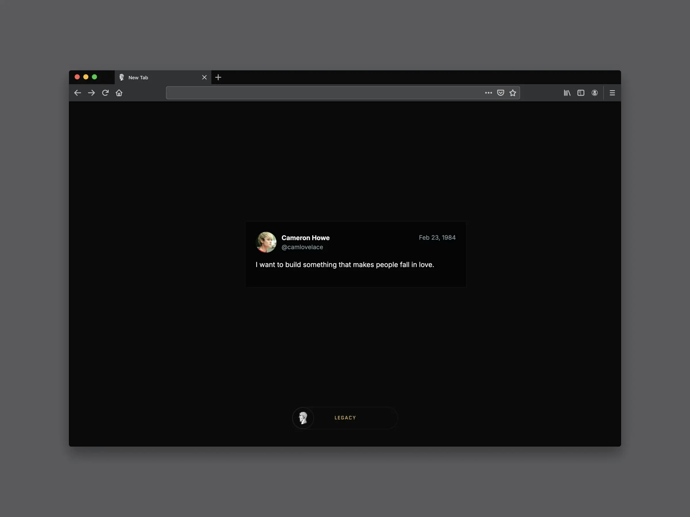

---

## 10. [MCPJam Inspector](https://www.producthunt.com/products/mcpjam-inspector?utm_campaign=producthunt-api&utm_medium=api-v2&utm_source=Application%3A+antigravity_test+%28ID%3A+258588%29)
**Votes**: 114 | **Tagline**: Test + develop ChatGPT apps and MCP apps (ext-apps) locally

### 📌 요약
ChatGPT 및 MCP(Microsoft Copilot) 앱 개발자가 로컬 환경에서 앱을 테스트하고 디버깅할 수 있도록 지원하는 개발 도구입니다.

### 🔑 핵심 기능
- ChatGPT 및 MCP 앱을 위한 로컬 테스트 및 디버깅 환경 제공
- 위젯 에뮬레이터를 통해 앱을 로컬에서 빌드하고 플레이그라운드에서 다양한 LLM으로 테스트 가능
- MCP 서버의 도구, 리소스, 프롬프트, OAuth 흐름 등을 자세히 검사할 수 있음
- ngrok이나 별도의 ChatGPT 구독 없이도 개발 및 테스트 가능 (비용 및 복잡성 절감)

### 📸 스크린샷 및 갤러리
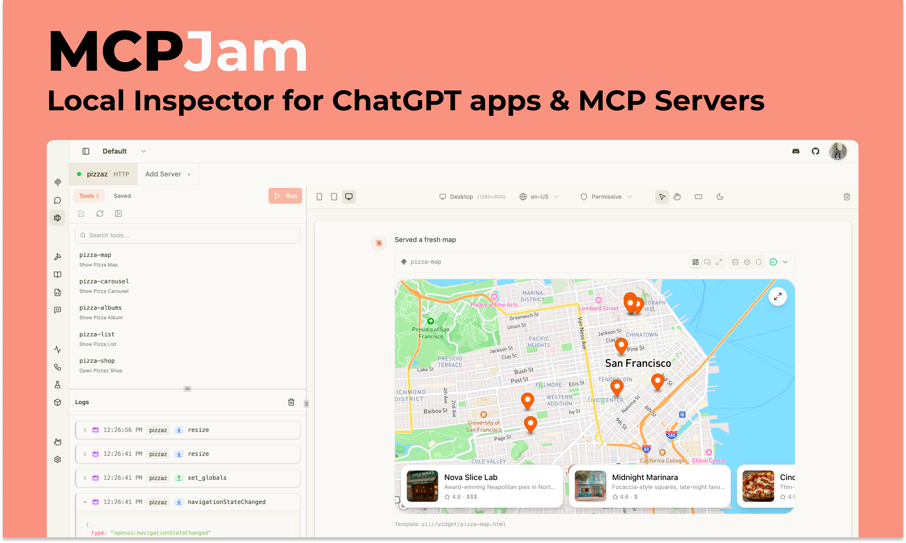
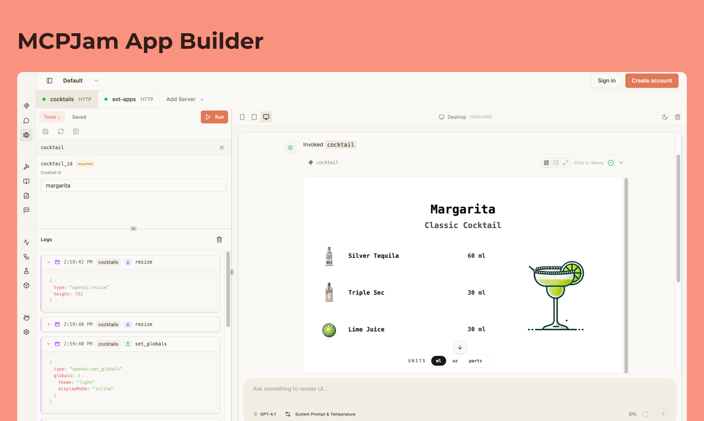
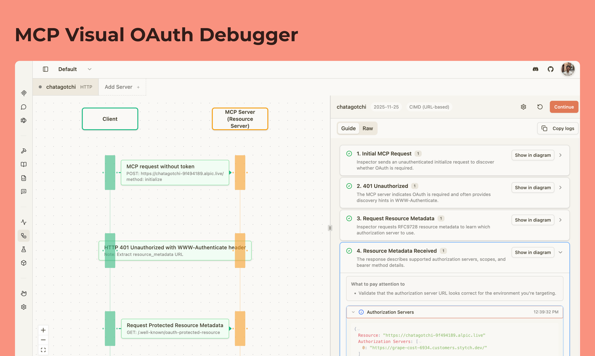

### 🎬 관련 영상
- [🎥 영상 보기](https://ph-files.imgix.net/b6427cbf-daf8-441e-8992-21eb9b90c3ce.jpeg?auto=format)

---

