# 🚀 Product Hunt Daily Top 10 (2026-01-21)

## 1. [Blink Agent Builder](https://www.producthunt.com/products/blink-21?utm_campaign=producthunt-api&utm_medium=api-v2&utm_source=Application%3A+antigravity_test+%28ID%3A+258588%29)
**Votes**: 334 | **Tagline**: You can now vibe code agentic AI apps

### 📌 요약
코딩 대신 '원하는 바(Vibe)'를 입력하면 복잡한 AI 에이전트를 즉시 구축해주는, 개발자들을 위한 차세대 '바이브 코딩' 플랫폼.

### 🔑 핵심 기능
- 🎯 Target Audience: 복잡한 AI 서비스를 빠르게 프로토타이핑하거나, 자율형 에이전트 개발에 필요한 백엔드 인프라 구축 시간을 줄이고 싶은 개발자 및 테크 메이커.
- ✨ Key Differentiator: 웹 검색, 코드 실행, 벡터 DB 등 에이전트 구축에 필요한 모든 필수 도구를 샌드박스 환경에 올인원으로 통합하여 복잡한 설정 불필요(180+ 모델 지원).
- 💡 Core Feature: 사용자가 원하는 결과만 설명하면(Vibe Code), 생각하고 도구를 사용하며 작업을 처음부터 끝까지 완료하는 완전 자율형 에이전트(Agent)를 손쉽게 생성 및 복제 가능.

### 📸 스크린샷 및 갤러리
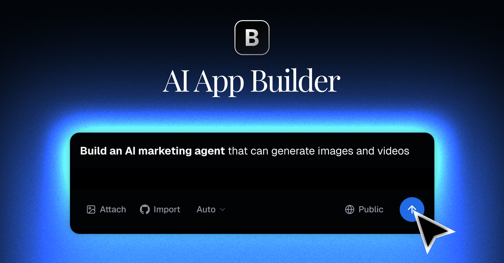
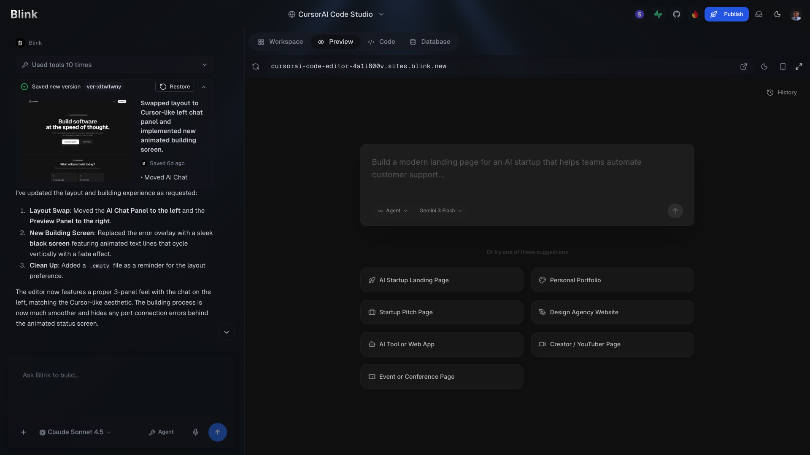
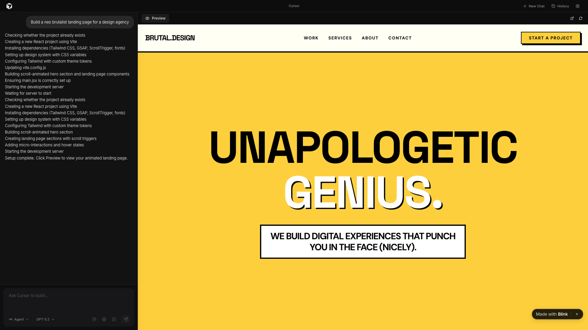

### 🎬 관련 영상
- [🎥 영상 보기](https://ph-files.imgix.net/7d20b69f-a2f2-40ac-a930-511fa58cf908.jpeg?auto=format)

---

## 2. [Fimo](https://www.producthunt.com/products/fimo-2?utm_campaign=producthunt-api&utm_medium=api-v2&utm_source=Application%3A+antigravity_test+%28ID%3A+258588%29)
**Votes**: 304 | **Tagline**: Where your website lives, collaborates, and evolves with AI.

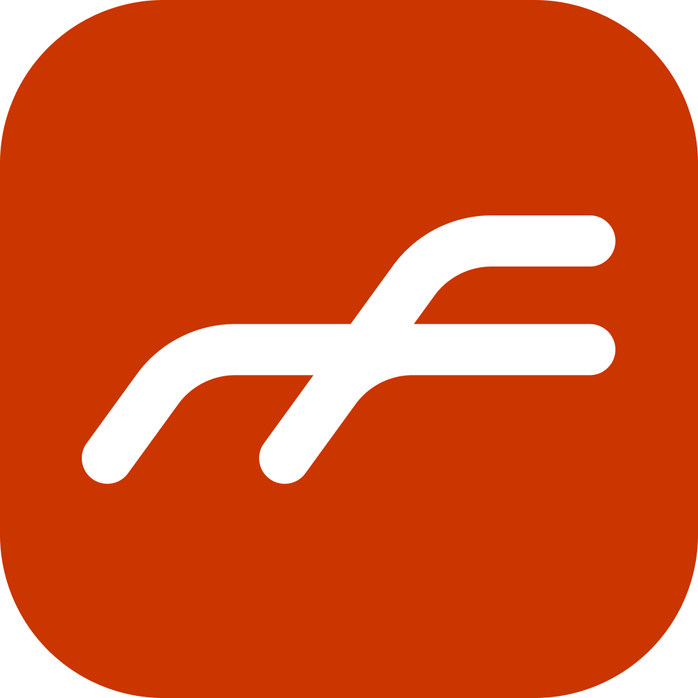

### 📌 요약
몇 달 걸리던 웹사이트 제작을 단 10초 만에 끝내는, AI 기반의 협업 및 진화형 웹사이트 빌더가 등장했습니다.

### 🔑 핵심 기능
- 🎯 Target Audience: 빠르고 효율적인 웹사이트 구축이 필요한 스타트업, 마케터, 개인 프로젝트 진행자
- ✨ Key Differentiator: AI를 활용하여 제작 시간(Months)을 극단적으로 단축(10 Seconds)시키고, 웹사이트의 지속적인 진화(evolves)를 지원하는 점
- 💡 Core Feature: AI 기반의 초고속 웹사이트 생성 및 실시간 협업 환경 제공

### 📸 스크린샷 및 갤러리
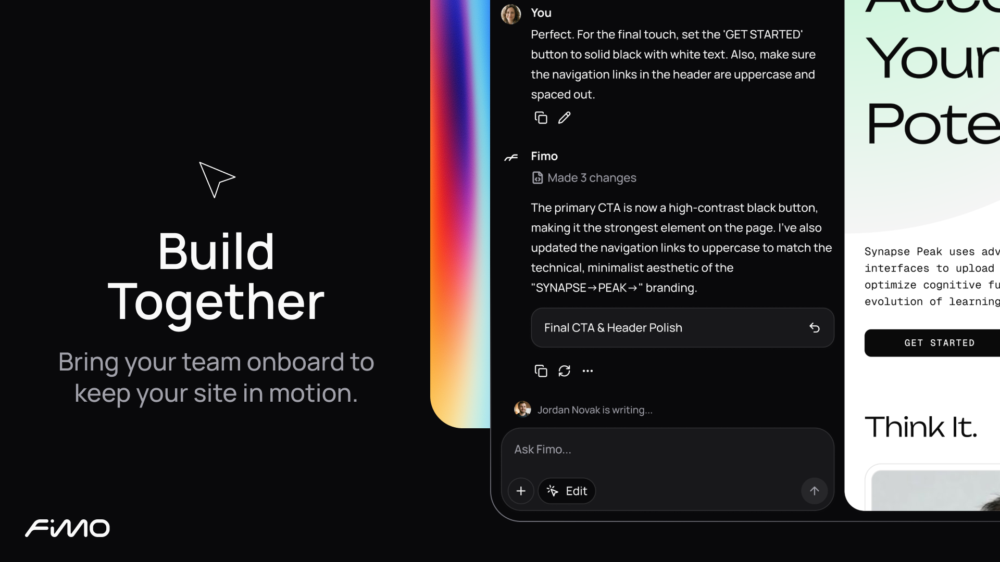
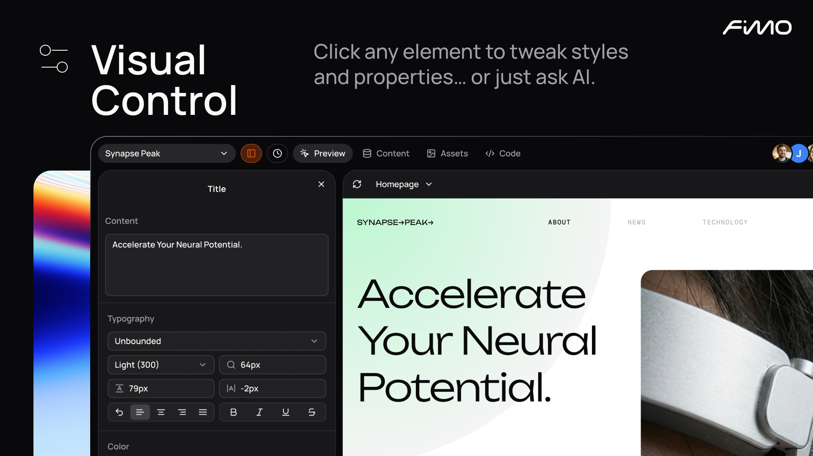
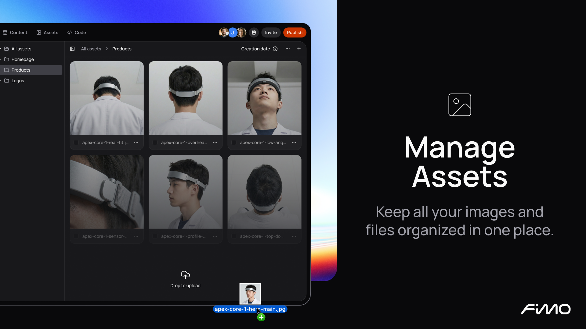

### 🎬 관련 영상
- [🎥 영상 보기](https://ph-files.imgix.net/94472a4b-a4aa-4f7d-a82c-485c7ea377a5.jpeg?auto=format)

---

## 3. [Mastra](https://www.producthunt.com/products/mastra?utm_campaign=producthunt-api&utm_medium=api-v2&utm_source=Application%3A+antigravity_test+%28ID%3A+258588%29)
**Votes**: 282 | **Tagline**: Build AI agents with a modern TypeScript stack

### 📌 요약
Next.js의 영향력을 가졌던 'Gatsby' 팀이 선보인, 모던 TypeScript 기반 AI 에이전트 구축 프레임워크로, 개발자가 AI 앱을 훨씬 체계적이고 테스트하기 쉽게 만들도록 돕는 도구입니다.

### 🔑 핵심 기능
- 🎯 Target Audience: TypeScript 환경에 익숙하며, 워크플로우(Workflows), 메모리(Memory) 관리, 디버깅이 잘 되는 고도화된 AI 에이전트 및 앱을 개발하려는 개발자 및 팀.
- ✨ Key Differentiator: 기존 Gatsby 팀의 경험을 바탕으로, AI 앱 개발에 필수적인 워크플로우, 메모리, 스트리밍, 그리고 개발/테스트 전용 UI 'Studio'를 TypeScript 스택에 통합하여 안정적이고 현대적인 개발 경험을 제공합니다.
- 💡 Core Feature: AI 에이전트의 복잡한 로직을 시각적으로 확인하고 디버깅할 수 있는 인터랙티브 개발/테스트 환경인 'Studio' 기능과, 효율적인 에이전트 성능 관리를 위한 내장된 'Evals' 및 'Tracing' 시스템.

### 📸 스크린샷 및 갤러리
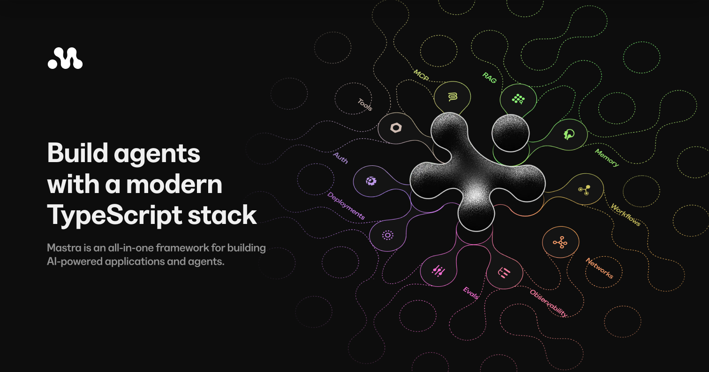
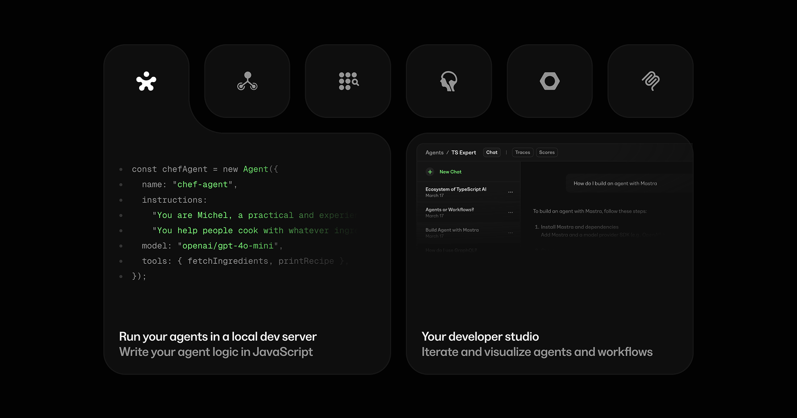
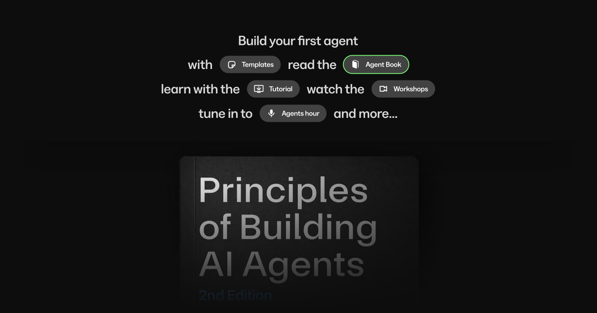

### 🎬 관련 영상
- [🎥 영상 보기](https://ph-files.imgix.net/f60b8ede-a4bc-4217-a130-343f6b645b3d.jpeg?auto=format)

---

## 4. [Citable](https://www.producthunt.com/products/citable?utm_campaign=producthunt-api&utm_medium=api-v2&utm_source=Application%3A+antigravity_test+%28ID%3A+258588%29)
**Votes**: 180 | **Tagline**: Get mentioned by AI agents

### 📌 요약
SEO는 잊으세요. 이제 AI 챗봇이 당신의 브랜드를 핵심 정보로 인용하게 만드는 신개념 '생성 엔진 최적화(GEO)' 도구, Citable입니다.

### 🔑 핵심 기능
- 🎯 타겟 고객: AI 챗봇 시대에 브랜드 인용률과 가시성을 높이고 싶은 마케터, 디지털 전략가, SEO 전문가.
- ✨ 핵심 차별점: 기존 SEO가 구글 등 검색 엔진에 집중했다면, Citable은 ChatGPT나 Gemini 같은 AI 에이전트의 생성 결과물에 브랜드가 얼마나 잘 인용되는지 측정하고 개선합니다.
- 💡 핵심 기능: AI 플랫폼이 현재 브랜드를 어떻게 인식하고 있는지 심층 분석하며, 인용 가능성을 높이기 위한 맞춤형 'GEO (Generative Engine Optimization)' 전략을 제시합니다.

### 📸 스크린샷 및 갤러리
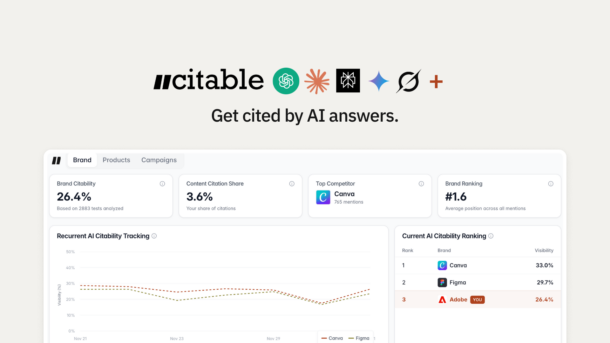
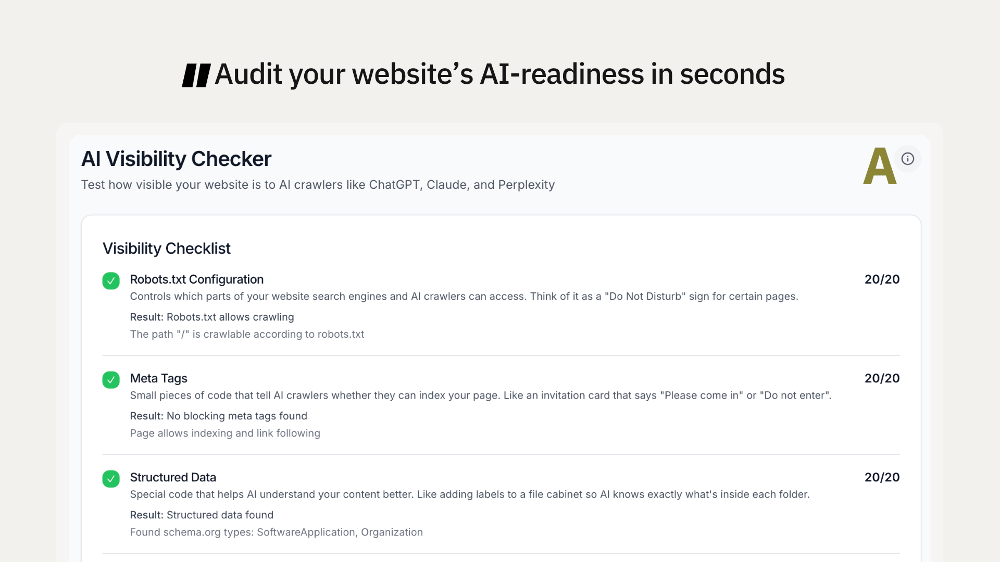
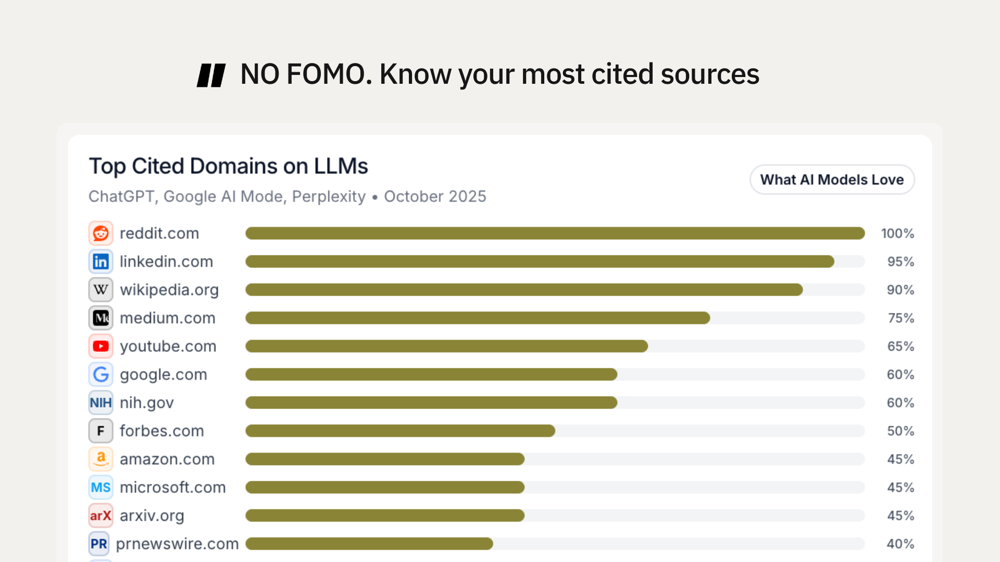

### 🎬 관련 영상
- [🎥 영상 보기](https://ph-files.imgix.net/252550db-f1b8-4aba-95de-a7bf9cc918c1.jpeg?auto=format)

---

## 5. [FastMCP 3.0](https://www.producthunt.com/products/fastmcp?utm_campaign=producthunt-api&utm_medium=api-v2&utm_source=Application%3A+antigravity_test+%28ID%3A+258588%29)
**Votes**: 166 | **Tagline**: The fast, Pythonic way to build MCP servers and clients

### 📌 요약
단순 AI 툴 서버를 넘어, 데이터 통합, 상태 관리, 장기 실행까지 지원하는 '생산성 극대화'를 위한 파이썬 기반 AI 컨텍스트 앱 구축 프레임워크 3.0 버전이 등장했습니다.

### 🔑 핵심 기능
- 🎯 Target Audience: 복잡한 AI 툴 체이닝, 데이터 통합, 그리고 안정적인 프로덕션 환경 운영(버전 관리, 관측성 등)이 필요한 AI/ML 개발자 및 엔지니어.
- ✨ Key Differentiator: 기존의 단순 툴 서버 구축 방식을 넘어, 데이터 수집/변형, 접근 제어, 상태 추적, 장기 작업 실행 등 '스마트한 AI 컨텍스트' 구축에 필요한 모든 기능을 통합적으로 제공.
- 💡 Core Feature: 핫 리로드, 버전 관리, 그리고 관측성(Observability)이 기본 탑재되어 있어, 개발 단계부터 엔터프라이즈급 프로덕션 환경에 바로 적용 가능한 안정성 확보.

### 📸 스크린샷 및 갤러리
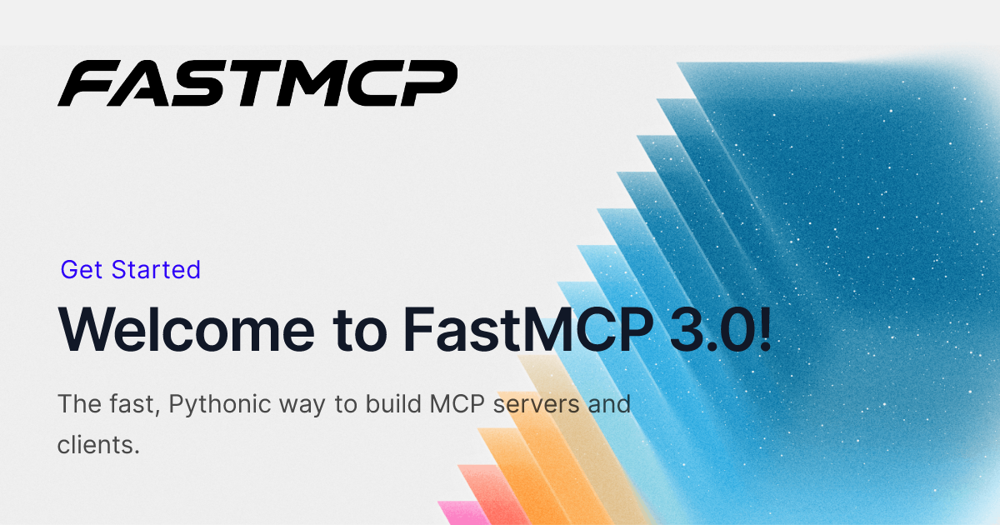

---

## 6. [Forvibe](https://www.producthunt.com/products/forvibe?utm_campaign=producthunt-api&utm_medium=api-v2&utm_source=Application%3A+antigravity_test+%28ID%3A+258588%29)
**Votes**: 142 | **Tagline**: Launch apps without the operational busywork

### 📌 요약
모바일 앱 개발자들이 골치 아픈 앱스토어/구글 플레이 출시 준비 작업(로컬라이제이션, 스크린샷, 법률 문서 등)을 모두 자동화하고, 오직 제품 개발에만 집중할 수 있게 돕는 올인원 런치 패드입니다.

### 🔑 핵심 기능
- 🎯 Target Audience: 앱 출시를 준비하는 모바일 개발팀 및 솔로 개발자 (특히 글로벌 시장 진출을 목표로 하는 경우)
- ✨ Key Differentiator: 앱 출시 및 운영 과정에서 발생하는 모든 잡무(Localization, Store Listing, Legal Docs, AI 랜딩 페이지 생성, 글로벌 구독 가격 설정 등)를 통합적으로 자동 처리하여 출시 마찰(Launch Friction)을 극단적으로 줄임.
- 💡 Core Feature: 앱스토어 및 구글 플레이에 필요한 스토어 리스팅, 스크린샷, 현지화(Localization) 작업을 AI를 통해 한 번에 생성하고 자동 배포하는 기능.

### 📸 스크린샷 및 갤러리
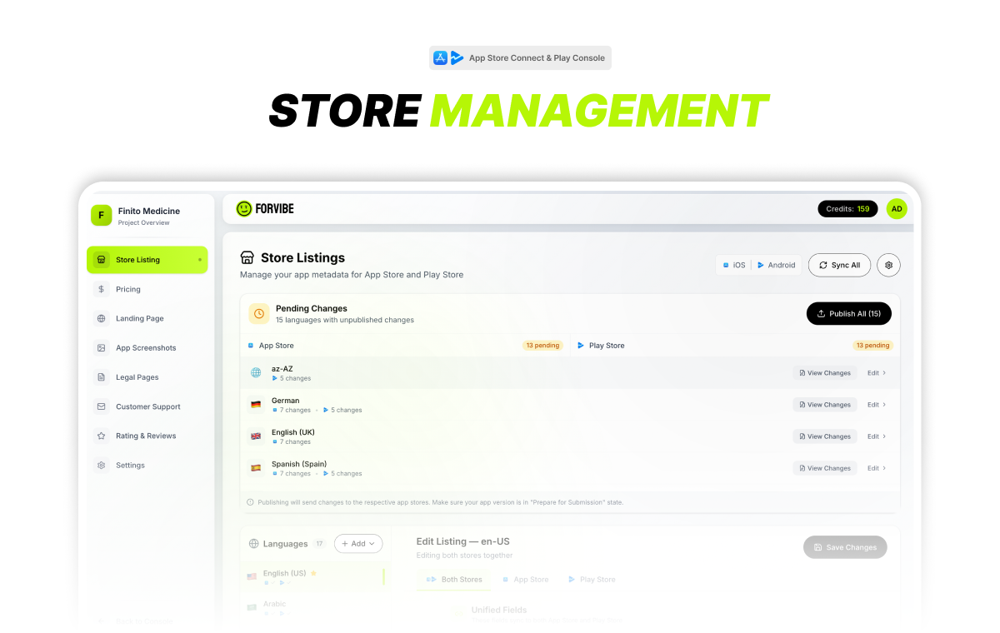
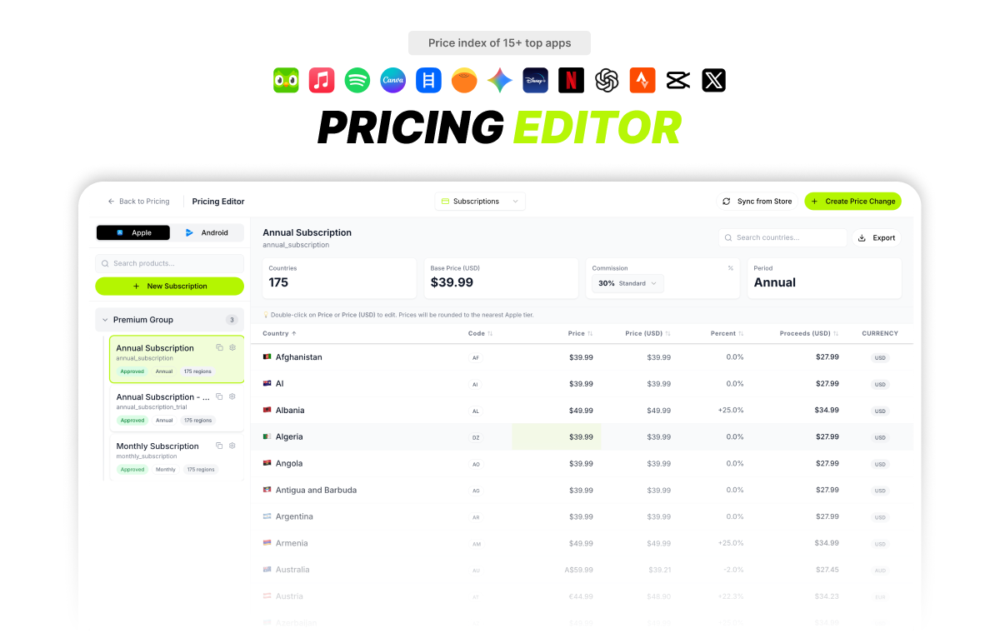
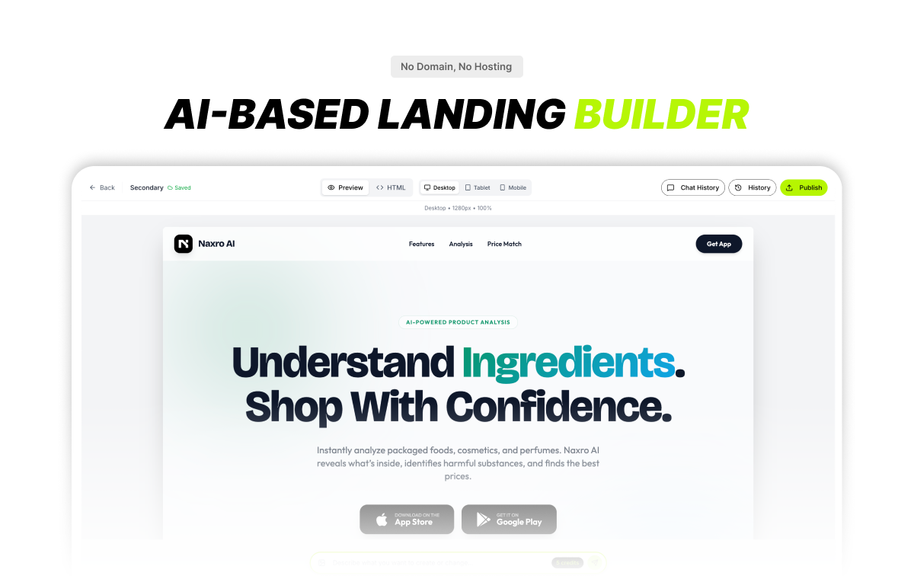

---

## 7. [FiloMail for Android](https://www.producthunt.com/products/filo-mail?utm_campaign=producthunt-api&utm_medium=api-v2&utm_source=Application%3A+antigravity_test+%28ID%3A+258588%29)
**Votes**: 127 | **Tagline**: AI Gmail client that turns emails into clear tasks

### 📌 요약
복잡한 Gmail을 안드로이드에서 효율적인 '할 일 목록(To-Do List)'으로 바꿔주는 AI 기반 이메일 클라이언트, FiloMail이 출시되었습니다.

### 🔑 핵심 기능
- 🎯 Target Audience: Gmail 사용량이 많아 인박스 관리에 지치고, 이메일을 곧바로 실행 가능한 업무(Task)로 연결하고 싶은 비즈니스 전문가 및 직장인.
- ✨ Key Differentiator: 단순히 이메일을 정리하는 것을 넘어, AI가 대화 내용을 요약하고 답변을 제안하며, 짧은 프롬프트만으로 강력한 스마트 라벨/필터 기능을 설정하여 이메일을 자동으로 업무 흐름에 통합시킵니다.
- 💡 Core Feature: 수신된 이메일을 마감일, 우선순위, 시간대 설정이 가능한 '할 일(Task)'로 즉시 변환하여 이메일 관리와 업무 처리를 통합적으로 진행할 수 있습니다.

### 📸 스크린샷 및 갤러리
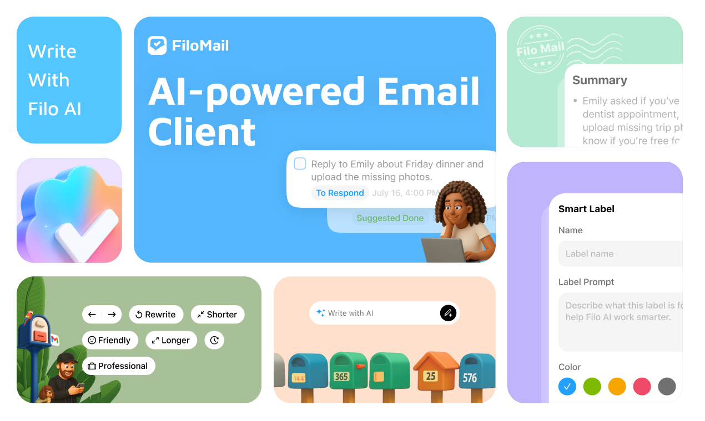
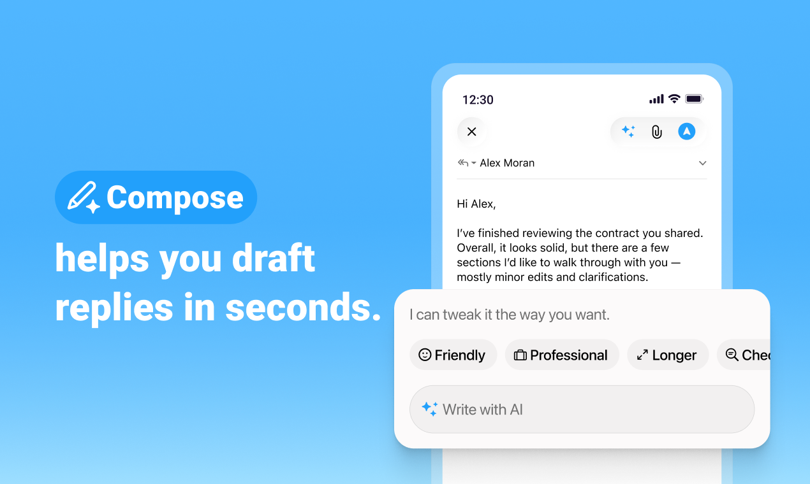
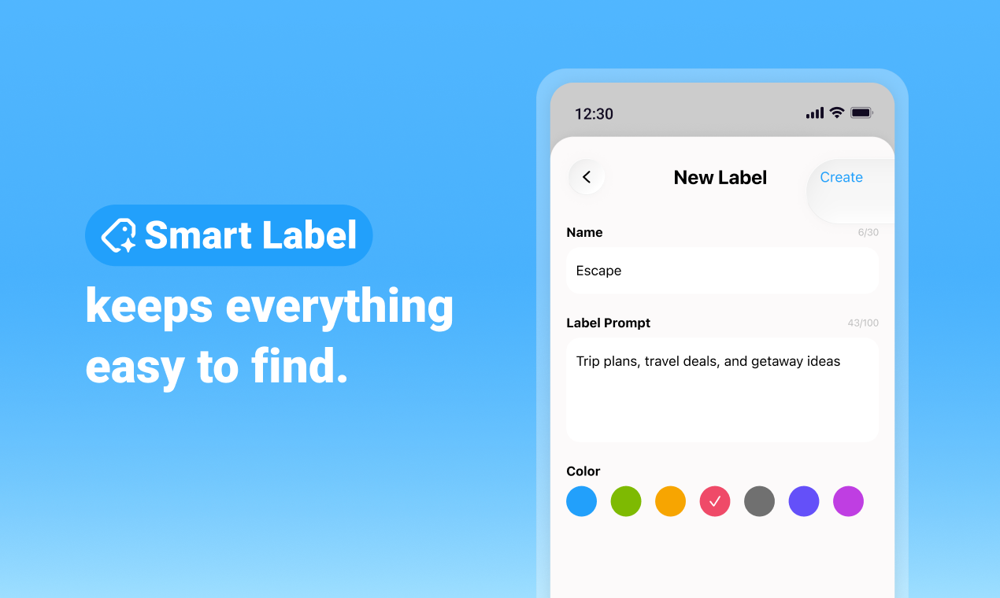

---

## 8. [Modo](https://www.producthunt.com/products/modo?utm_campaign=producthunt-api&utm_medium=api-v2&utm_source=Application%3A+antigravity_test+%28ID%3A+258588%29)
**Votes**: 119 | **Tagline**: Turn a hardware idea into a buildable prototype

### 📌 요약
말로만 하던 아이디어를 검증된 부품, 3D 프린팅 가능한 케이스, 펌웨어까지 갖춘 '실제 제작 가능한' 하드웨어 시제품으로 바꿔주는 혁신적인 AI 기반 디자인 툴입니다.

### 🔑 핵심 기능
- 🎯 Target Audience: 하드웨어 스타트업 창업자, 제품 디자이너, 복잡한 시제품 제작 과정에 지친 메이커(Maker) 및 엔지니어.
- ✨ Key Differentiator: 단순한 디자인 스케치에서 끝내지 않고, 부품 검증부터 펌웨어 코드, 단계별 조립 설명서까지 제공하여 '빌드 가능한 상태'로 완성시켜주는 통합 솔루션입니다.
- 💡 Core Feature: 텍스트 설명을 입력하면 유효성이 검증된(Validated) 부품 목록과 3D 프린팅 가능한 인클로저(외함) 디자인을 자동으로 생성해 주는 기능.

### 📸 스크린샷 및 갤러리
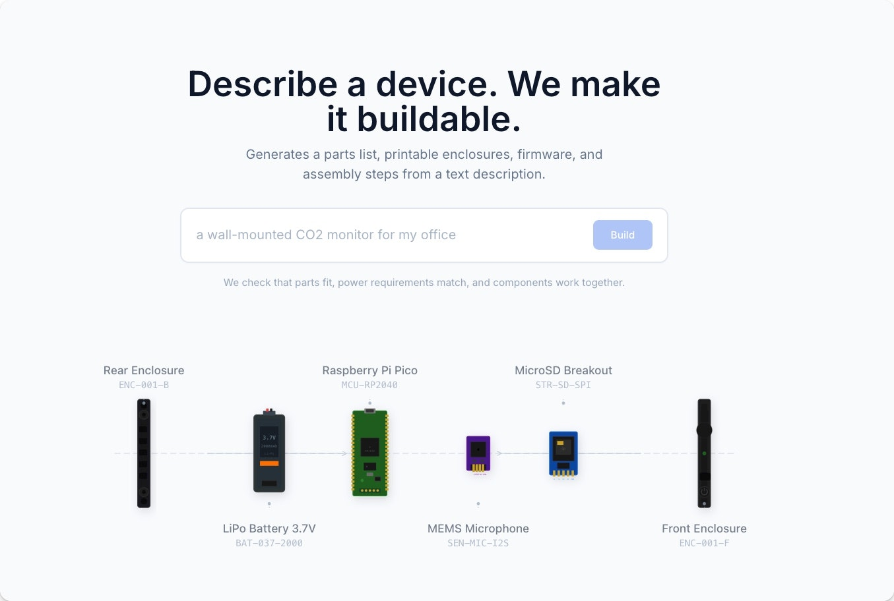
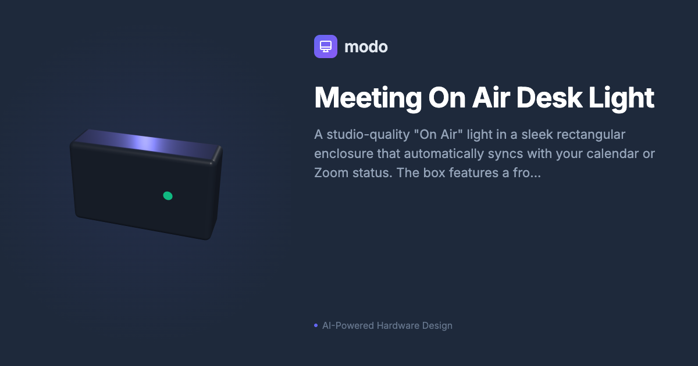
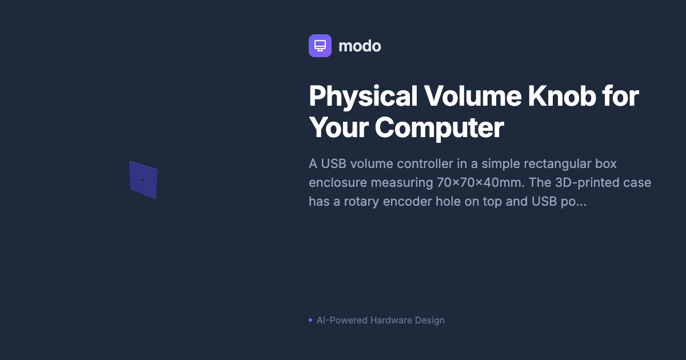

### 🎬 관련 영상
- [🎥 영상 보기](https://ph-files.imgix.net/9cf90aa3-e362-4b24-87bf-e4d93008a263.jpeg?auto=format)

---

## 9. [Templated](https://www.producthunt.com/products/templated-2?utm_campaign=producthunt-api&utm_medium=api-v2&utm_source=Application%3A+antigravity_test+%28ID%3A+258588%29)
**Votes**: 114 | **Tagline**: Video Rendering & API for Automated Dynamic Videos

### 📌 요약
이제 이미지나 PDF를 자동화하듯, API 호출 한 번으로 수천 개의 개인화된 MP4 영상을 대량 생산할 수 있게 해주는 혁신적인 영상 자동화 엔진입니다.

### 🔑 핵심 기능
- 🎯 Target Audience: 대규모 개인화 영상(제품 데모, 소셜 광고, 모션 그래픽 등)이 필요한 마케터, 개발팀, SaaS 기업.
- ✨ Key Differentiator: 복잡한 영상 인프라 구축이나 수동 편집 없이, 기존 이미지/PDF 자동화 워크플로우를 그대로 비디오 영역까지 확장 가능합니다.
- 💡 Core Feature: 동적 비디오 템플릿을 한 번 디자인하면, 원하는 데이터를 넣어 즉시 MP4 파일을 API로 대량 렌더링할 수 있습니다.

### 📸 스크린샷 및 갤러리
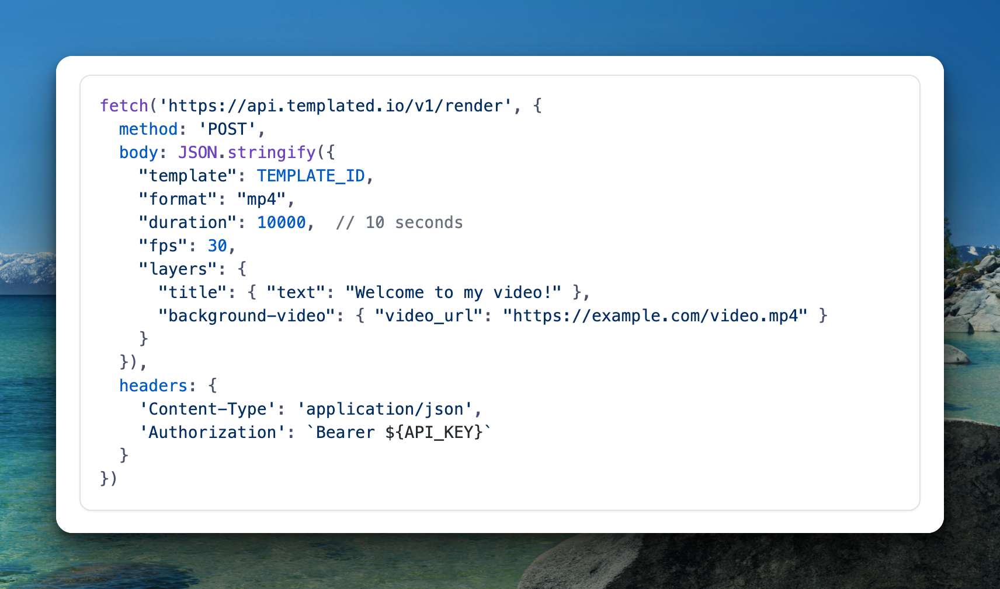

### 🎬 관련 영상
- [🎥 영상 보기](https://ph-files.imgix.net/bf624c65-b4c9-4897-acd1-9d77d23d842f.jpeg?auto=format)

---

## 10. [Portalwith](https://www.producthunt.com/products/portalwith?utm_campaign=producthunt-api&utm_medium=api-v2&utm_source=Application%3A+antigravity_test+%28ID%3A+258588%29)
**Votes**: 112 | **Tagline**: Create a secure site client portal with notion database

### 📌 요약
노션 데이터를 활용해 보안이 확실하고 브랜드 커스터마이징이 가능한 전문적인 고객용 포털(클라이언트 포털) 웹사이트를 뚝딱 만들 수 있는 솔루션입니다. 이제 노션으로 사내용 문서뿐 아니라 고객 대면용 대시보드까지 안전하게 만드세요.

### 🔑 핵심 기능
- 🎯 Target Audience: 노션을 백엔드 데이터베이스로 활용하여 전문적인 고객 포털/앱/대시보드를 구축하려는 스타트업, 프리랜서, 컨설팅 에이전시.
- ✨ Key Differentiator: 단순히 노션 페이지를 공유하는 것을 넘어, 강력한 보안(Secure Site)과 전문적인 브랜드 아이덴티티(Customizable Branding)를 적용하여 고객 경험을 극대화합니다.
- 💡 Core Feature: 여러 개의 노션 워크스페이스를 사용할 필요 없이, 기존 팀 노션 워크스페이스를 유지한 채 고객 전용 포털을 구축할 수 있는 기능.

### 📸 스크린샷 및 갤러리
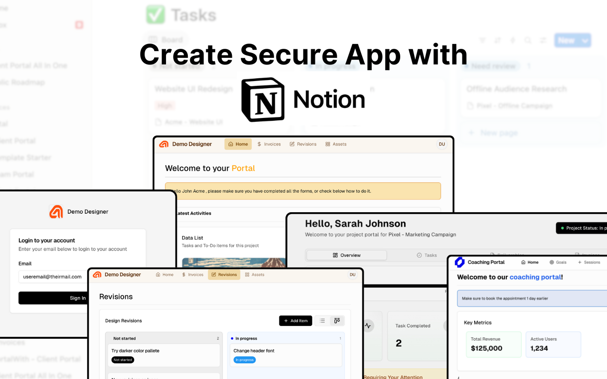
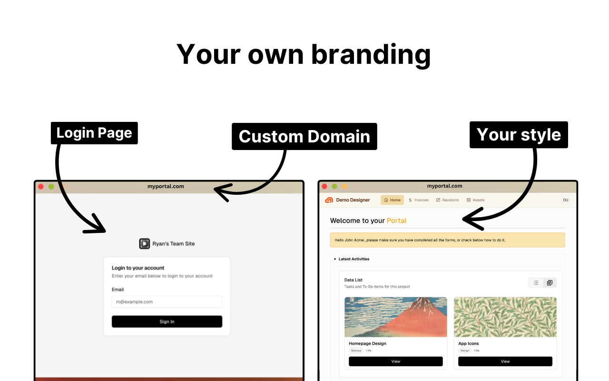
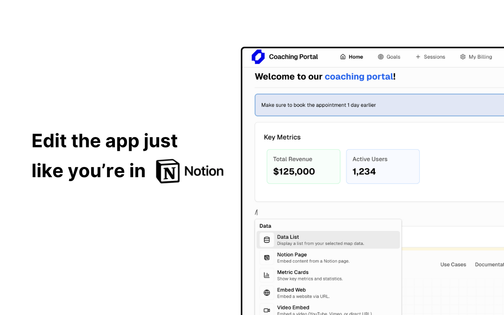

### 🎬 관련 영상
- [🎥 영상 보기](https://ph-files.imgix.net/d69ab8ca-1b84-47fe-b8cd-71eb35f10db2.jpeg?auto=format)

---

