# 🚀 Product Hunt Daily Top 10 (2026-01-22)

## 1. [ChartGen AI](https://www.producthunt.com/products/ada-2?utm_campaign=producthunt-api&utm_medium=api-v2&utm_source=Application%3A+antigravity_test+%28ID%3A+258588%29)
**Votes**: 338 | **Tagline**: Turn data into professional charts with insights in seconds

### 📌 요약
💰 온라인 마케터의 예산을 절약해주는 AI 기반 차트 생성기! 복잡한 데이터(페이스북, 틱톡 등)를 연결하여 돈 낭비 없이 예산을 최적화할 수 있는 인사이트를 즉시 시각화합니다.

### 🔑 핵심 기능
- 🎯 Target Audience: 온라인 마케터 및 여러 광고 플랫폼(Facebook, TikTok 등) 데이터를 통합 분석해야 하는 비즈니스 담당자
- ✨ Key Differentiator: 여러 소스의 원시 데이터(Raw Data)를 연결하여 '돈 절약'에 초점을 맞춘 전문적인 차트와 실행 가능한 인사이트를 즉시 제공 (기존의 단순 차트 생성 툴과 차별화)
- 💡 Core Feature: 다양한 데이터 소스 연결 및 즉각적인 시각화 차트 생성 기능 (Ad Spend 최적화 및 비즈니스 트렌드 분석에 특화)

### 📸 스크린샷 및 갤러리
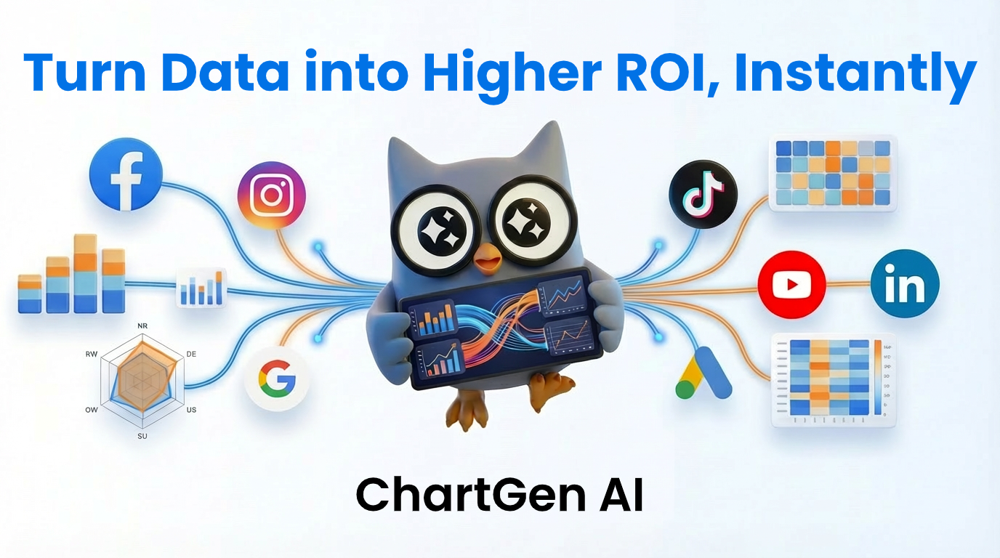
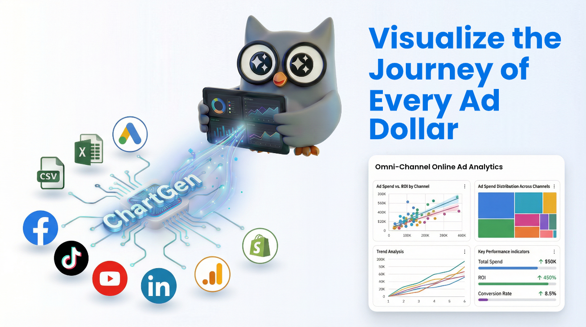
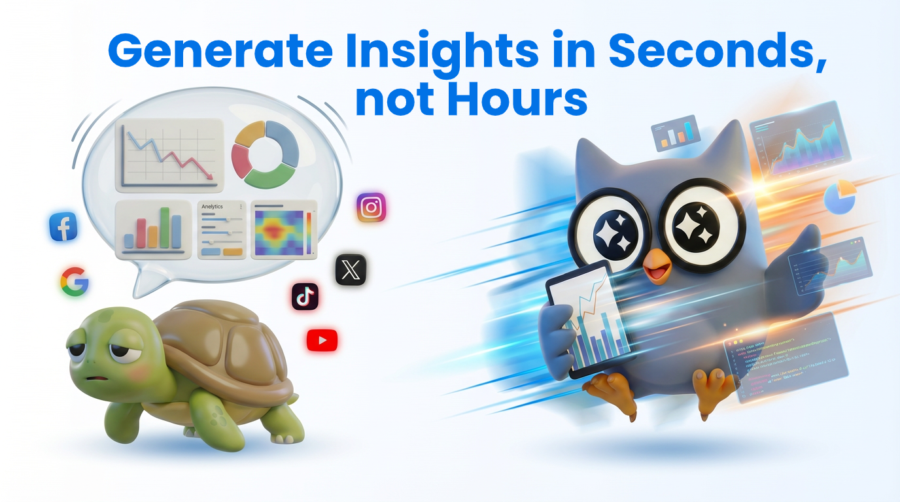

### 🎬 관련 영상
- [🎥 영상 보기](https://ph-files.imgix.net/24e9e6ae-bb60-45b5-bbab-e67c0bd5f28c.jpeg?auto=format)

---

## 2. [Web search API by Crustdata](https://www.producthunt.com/products/crustdata-2?utm_campaign=producthunt-api&utm_medium=api-v2&utm_source=Application%3A+antigravity_test+%28ID%3A+258588%29)
**Votes**: 273 | **Tagline**: Accurate and the fastest web search API for AI Agents

### 📌 요약
AI 에이전트에게 세상에서 가장 빠르고 정확한 웹 검색 능력을 부여할 수 있는, '초정밀 제어형' 웹 검색 API입니다.

### 🔑 핵심 기능
- 🎯 Target Audience: 실시간 데이터와 웹 접근성이 필수적인 AI 에이전트 개발자 및 LLM 빌더.
- ✨ Key Differentiator: 발행 1시간 이내의 최신 뉴스/소셜 데이터를 검색 가능하며, 도메인/날짜/위치 기반의 초정밀 필터링으로 검색 결과를 완벽하게 제어합니다.
- 💡 Core Feature: '심층 연구 모드(Deep Research Mode)'를 통해 복잡한 쿼리에 대해 정확한 정답을 즉시 추출하며, 연동된 Fetch API로 웹 페이지 콘텐츠 전체를 추출합니다.

### 📸 스크린샷 및 갤러리
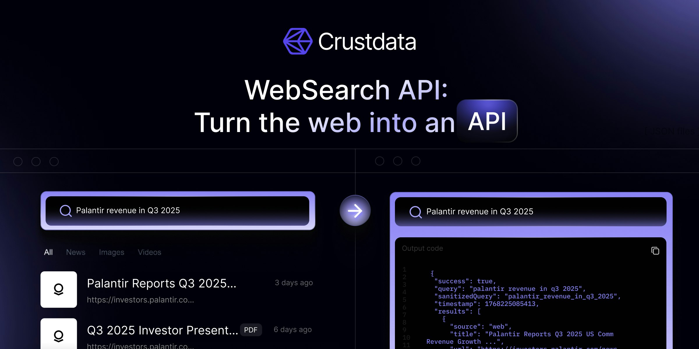
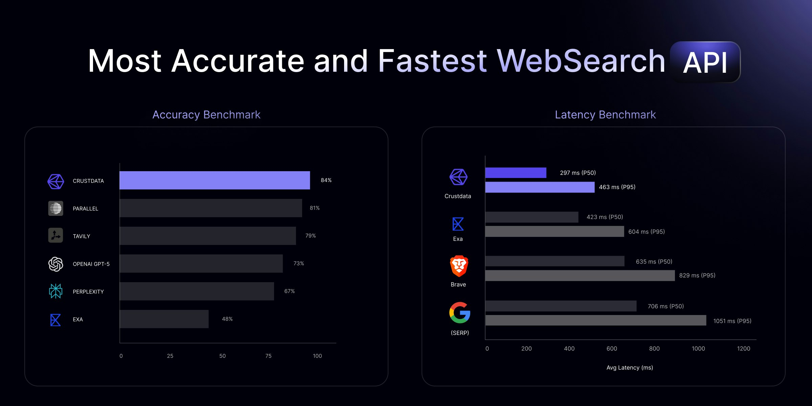
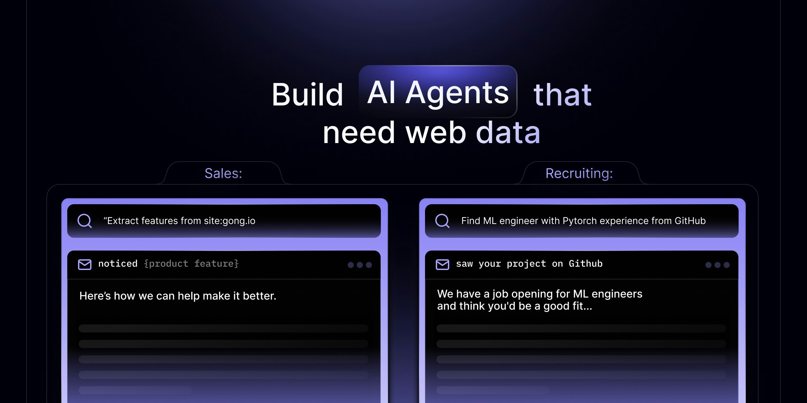

### 🎬 관련 영상
- [🎥 영상 보기](https://ph-files.imgix.net/13e921f6-f10c-42b4-8f6c-1a4ba9f709b5.jpeg?auto=format)

---

## 3. [LocateStore](https://www.producthunt.com/products/locatestore?utm_campaign=producthunt-api&utm_medium=api-v2&utm_source=Application%3A+antigravity_test+%28ID%3A+258588%29)
**Votes**: 242 | **Tagline**: Create a map of all your stores using Google Sheets

### 📌 요약
구글 시트에 우리 매장 주소만 입력하면, 검색과 필터 기능이 탑재된 빠르고 모바일 친화적인 매장 찾기 지도를 단 몇 분 만에 만들고 웹사이트에 바로 삽입할 수 있는 노코드(No-code) 솔루션입니다.

### 🔑 핵심 기능
- 🎯 Target Audience: 여러 지점을 가진 브랜드나 체인점(Multi-location brands) 등 웹사이트에 간단하고 효율적인 '매장 찾기' 기능을 구현하려는 비개발자 마케터/운영 담당자.
- ✨ Key Differentiator: 코딩, API 키, 복잡한 설정 없이 '구글 시트'만으로 모든 관리가 가능하며, 수정 사항이 즉시 반영되는 단순함과 빠른 속도.
- 💡 Core Feature: 구글 시트 데이터(주소)를 실시간으로 가져와 검색 및 필터링 기능이 완벽하게 구현된 인터랙티브한 '매장 찾기 지도'로 변환 및 임베딩.

### 📸 스크린샷 및 갤러리
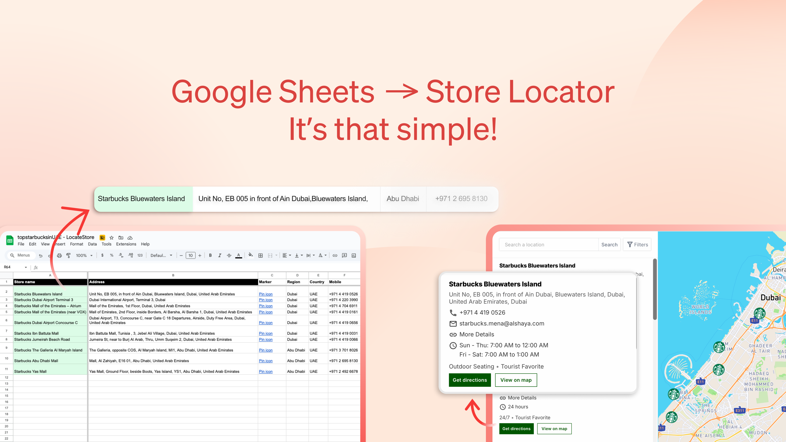
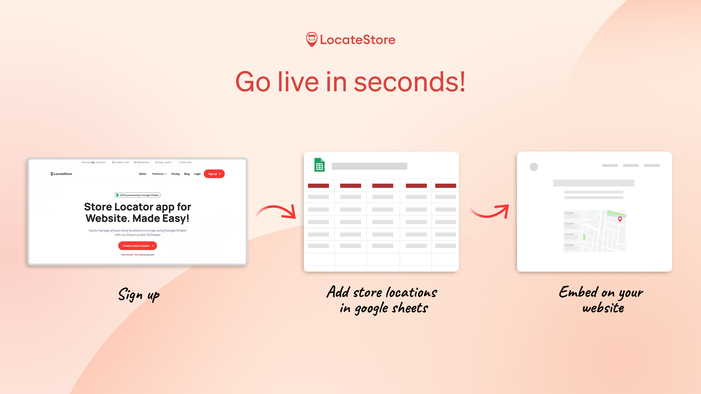
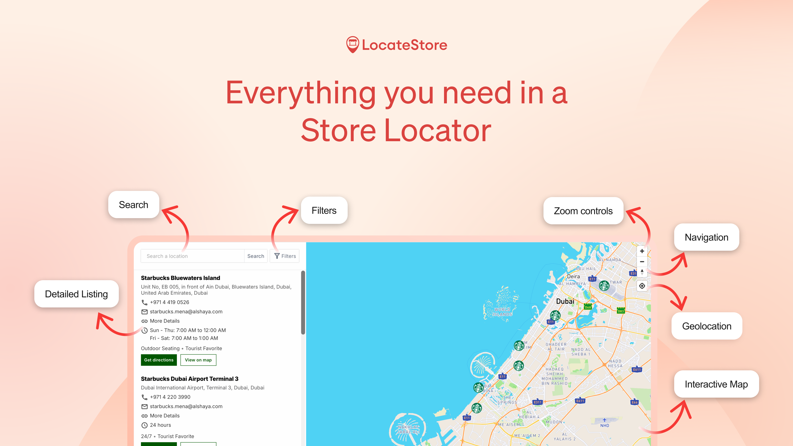

### 🎬 관련 영상
- [🎥 영상 보기](https://ph-files.imgix.net/2276fb66-959a-44b1-8471-f1c3c8cd481e.jpeg?auto=format)

---

## 4. [Demonstrate by Notte](https://www.producthunt.com/products/notte?utm_campaign=producthunt-api&utm_medium=api-v2&utm_source=Application%3A+antigravity_test+%28ID%3A+258588%29)
**Votes**: 232 | **Tagline**: Browser workflows to deployed automation in minutes

### 📌 요약
브라우저에서 반복 작업을 한 번만 녹화하면 바로 배포 가능한 자동화 코드를 생성하고, 라이브 브라우저 환경에서 편집/배포/스케줄링까지 한 번에 해결해주는 '프로토타입-배포 일체형' 자동화 플랫폼입니다.

### 🔑 핵심 기능
- 🎯 Target Audience: 웹 기반 반복 업무 자동화가 필요한 개발자, QA 엔지니어, DevOps 팀.
- ✨ Key Differentiator: 단순 녹화 기능에 그치지 않고, 녹화된 코드를 서버리스 함수로 즉시 배포하고 스케줄링까지 가능한 '원스톱 생산성'을 제공하며, 세션/프록시/인증 등 인프라 관리를 자동 처리해줍니다.
- 💡 Core Feature: 'Demonstrate Mode'를 이용해 브라우저 작업을 녹화하면 즉시 프로덕션 수준의 자동화 코드를 얻고, 이를 라이브 환경에서 디버깅 및 수정할 수 있는 'Automation Studio'.

### 📸 스크린샷 및 갤러리
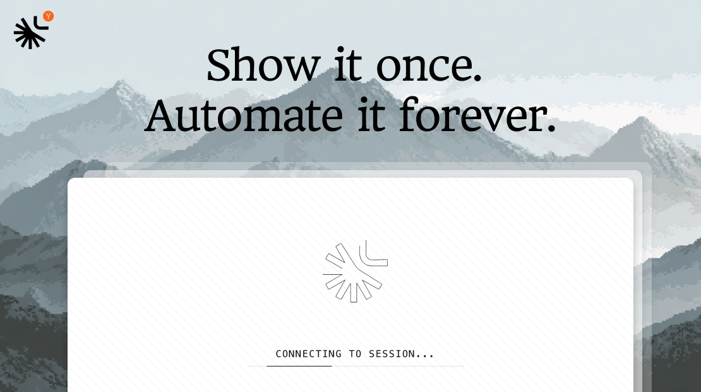
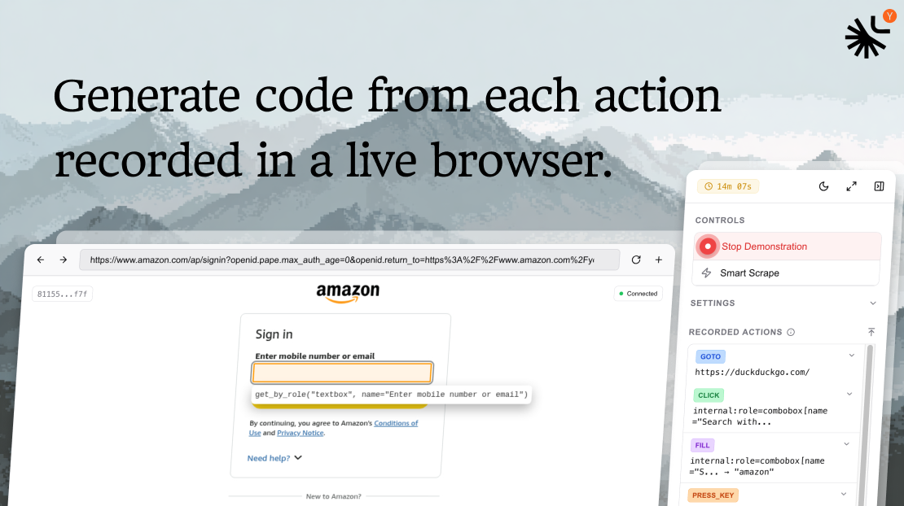
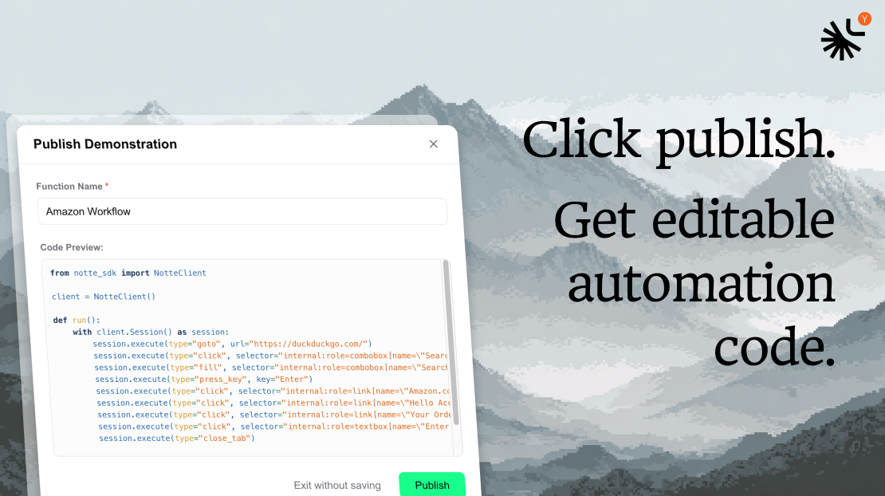

### 🎬 관련 영상
- [🎥 영상 보기](https://ph-files.imgix.net/6e9885c1-a554-4245-91ac-2f9993fb24d7.jpeg?auto=format)

---

## 5. [Callum](https://www.producthunt.com/products/callum?utm_campaign=producthunt-api&utm_medium=api-v2&utm_source=Application%3A+antigravity_test+%28ID%3A+258588%29)
**Votes**: 224 | **Tagline**: AI calendar assistant for teams – supercharge your calendar

### 📌 요약
팀 단위의 복잡한 일정 조율을 Google Calendar 기반으로 획기적으로 단순화하는 AI 캘린더 비서, 'Callum'이 론칭했습니다. 사람이 말하듯 자연어로 명령하면 캘린더 관리가 마법처럼 해결됩니다.

### 🔑 핵심 기능
- 🎯 Target Audience: Google Calendar를 사용하며 잦은 다자간 미팅 일정 조율에 시간을 낭비하는 팀 및 조직 (특히 HR, 영업, 고객 관리 등)
- ✨ Key Differentiator: 단순 AI 비서를 넘어, 다수의 참여자 가용성, 실제 스케줄링 제약 조건을 이해하고, CRM/ATS 등 외부 앱 연동을 통해 비서의 '지식'을 확장할 수 있음.
- 💡 Core Feature: 백 앤 포스 이메일 없이 자연어(Natural Language) 명령만으로 미팅 예약, 변경, 관리를 즉시 수행하여 수동적인 캘린더 관리 업무를 제로화.

### 📸 스크린샷 및 갤러리
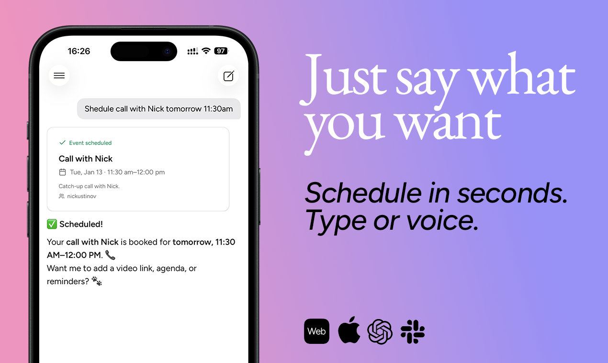
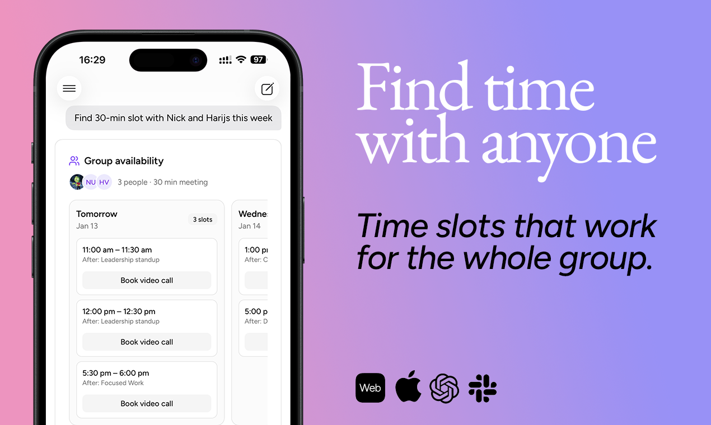
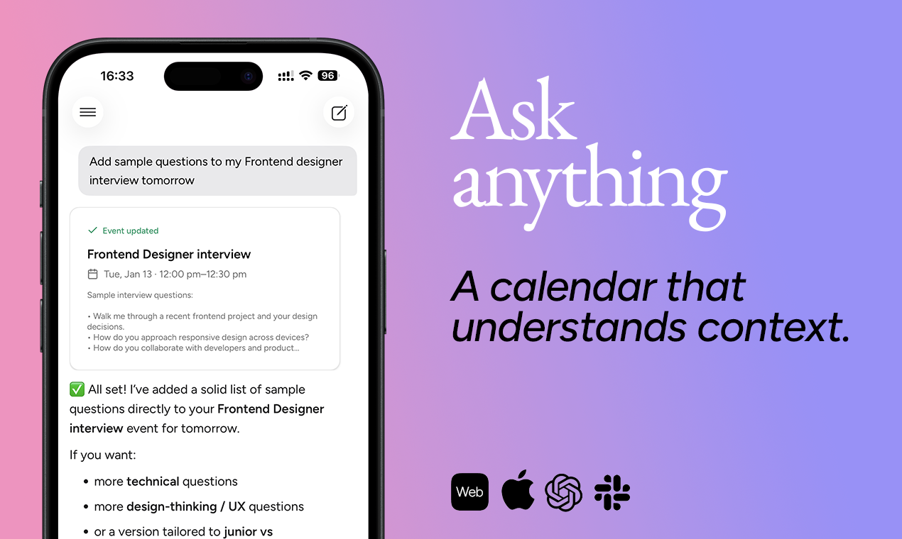

---

## 6. [Netlify Capsules](https://www.producthunt.com/products/netlify?utm_campaign=producthunt-api&utm_medium=api-v2&utm_source=Application%3A+antigravity_test+%28ID%3A+258588%29)
**Votes**: 177 | **Tagline**: Launch web projects as AR capsules others can find in orbit

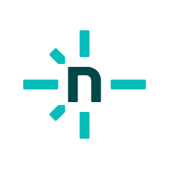

### 📌 요약
Netlify 1000만 개발자 달성을 기념해, 내가 만든 웹 프로젝트를 지구 궤도에 띄우고 위치 기반 AR로 다른 사람들이 발견하게 하는 재미있는 '우주 캡슐 헌팅' 경험입니다.

### 🔑 핵심 기능
- 🎯 Target Audience: Netlify 사용자 및 웹 개발자, 독특하고 개인적인 방식으로 자신의 프로젝트를 공유하고 싶은 사람.
- ✨ Key Differentiator: 단순히 배포를 넘어, 프로젝트(코드)에 개인적인 콘텐츠(사진/음악/메모)를 결합하여 실제 위치 기반 AR로 탐색하고 공유하게 만드는 신선한 마케팅 및 커뮤니티 경험 제공.
- 💡 Core Feature: 사용자가 선택한 Netlify 프로젝트를 기반으로 개인화된 '캡슐'을 제작, 지구 궤도에 배포하고, 실제 위치에서 웹 기반 AR을 통해 캡슐을 발견하고 상호작용할 수 있게 함.

### 📸 스크린샷 및 갤러리
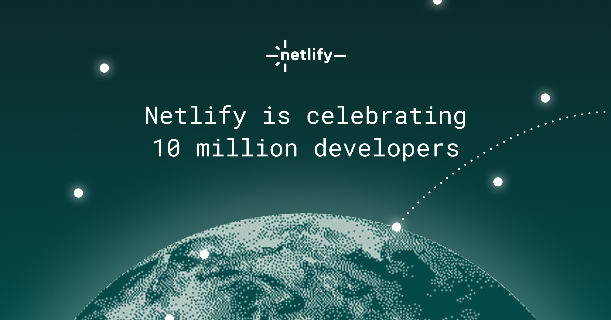
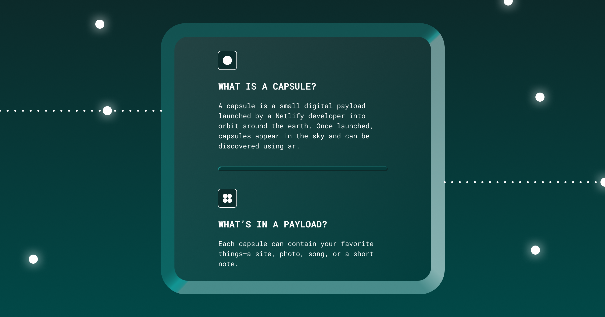
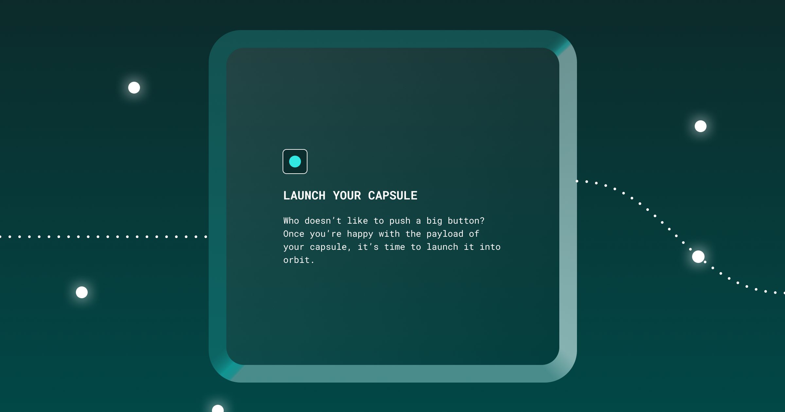

---

## 7. [Zenflow by Zencoder](https://www.producthunt.com/products/zencoder?utm_campaign=producthunt-api&utm_medium=api-v2&utm_source=Application%3A+antigravity_test+%28ID%3A+258588%29)
**Votes**: 164 | **Tagline**: Specification-driven AI development 

### 📌 요약
젠플로우(Zenflow)는 실험실 수준에 머물던 AI 개발을 '사양(Specification)' 기반 워크플로우, 병렬 처리, 내장된 검증 기능으로 묶어 믿고 배포할 수 있는 프로덕션급 AI로 만들어주는 필수 엔지니어링 툴입니다.

### 🔑 핵심 기능
- 🎯 Target Audience: AI 모델을 프로토타입에서 벗어나 실제 상용 제품(Production-grade)으로 빠르게 전환하고 싶은 AI 엔지니어링 팀 및 관리자.
- ✨ Key Differentiator: 기존 AI 개발의 주먹구구식 접근법과 달리, 명세(Specification)에 기반한 엄격한 워크플로우와 내장된 검증 기능으로 신뢰성(Reliability)과 재현성(Repeatability)을 극대화합니다.
- 💡 Core Feature: 병렬 에이전트(Parallel Agents)를 활용하여 개발 속도를 높이면서도, 명세 준수 여부를 자동으로 확인하여 배포 오류를 최소화하는 '빌트인 검증(Built-in Verification)' 기능.

### 📸 스크린샷 및 갤러리
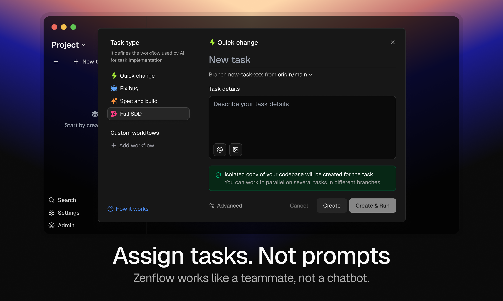
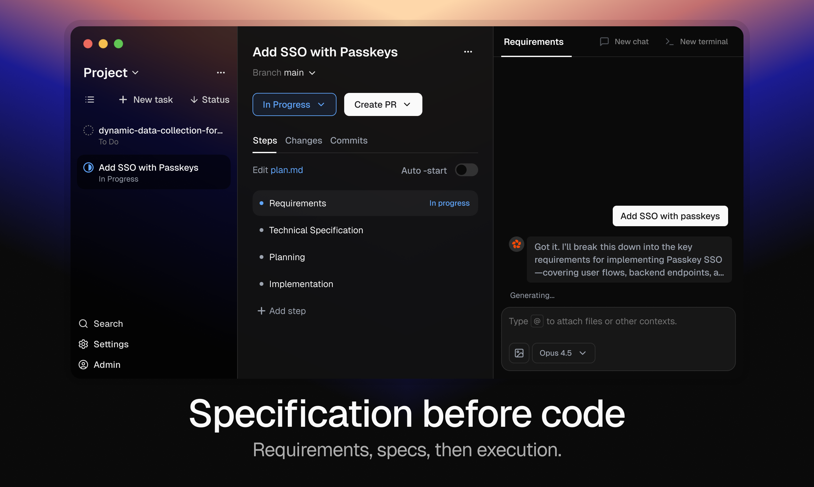
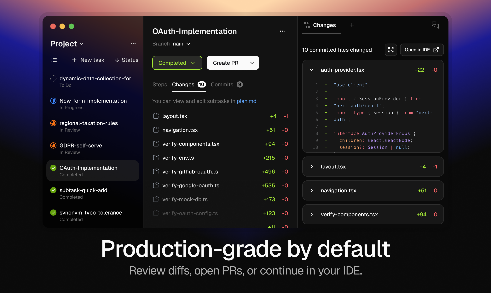

### 🎬 관련 영상
- [🎥 영상 보기](https://ph-files.imgix.net/fa0078b3-9b33-4a59-880b-a09c9b3396d3.jpeg?auto=format)

---

## 8. [Clippy, but on Steroids](https://www.producthunt.com/products/clippy-on-cocaine?utm_campaign=producthunt-api&utm_medium=api-v2&utm_source=Application%3A+antigravity_test+%28ID%3A+258588%29)
**Votes**: 161 | **Tagline**: "Hey Siri" with MCP calls and local LLM

### 📌 요약
복붙 지옥은 끝! 현재 작업 맥락을 파악하고 목소리로 리니어 티켓까지 만들어주는 '문맥 인식' 로컬 LLM 비서입니다.

### 🔑 핵심 기능
- 🎯 Target Audience: 반복적인 복붙(Copy/Paste)에 지친 프로페셔널 및 개인 정보 보호를 중시하는 사용자.
- ✨ Key Differentiator: 모든 작업이 로컬 모델에서 처리되므로 데이터가 유출될 염려가 없으며, 현재 작업 창에 응답을 바로 삽입하여 워크플로우 방해 요소를 완전히 제거합니다.
- 💡 Core Feature: 음성 명령만으로 (Hey Siri 스타일) 구글 캘린더 일정을 수정하거나 리니어(Linear) 이슈를 생성하는 '음성 기반 작업 자동화'.

### 📸 스크린샷 및 갤러리
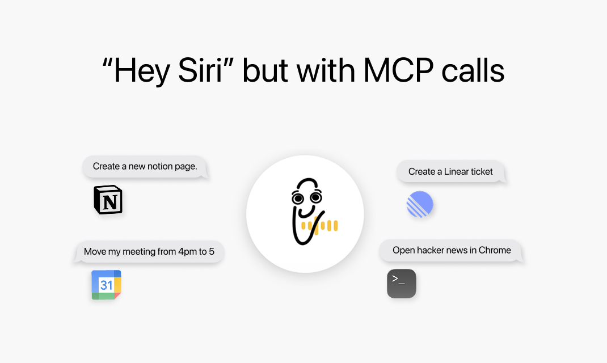
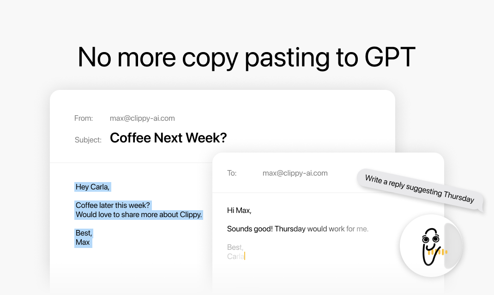

### 🎬 관련 영상
- [🎥 영상 보기](https://ph-files.imgix.net/05e886e1-0a23-4776-9152-9235ae57099d.gif?auto=format)

---

## 9. [StoryChief AI Canvas](https://www.producthunt.com/products/storychief-io?utm_campaign=producthunt-api&utm_medium=api-v2&utm_source=Application%3A+antigravity_test+%28ID%3A+258588%29)
**Votes**: 128 | **Tagline**: A canvas to create + publish full marketing campaigns w/ AI

### 📌 요약
복잡하게 흩어진 마케팅 툴 대신, AI가 전략 수립부터 콘텐츠 발행까지 한 번에 처리해주는 '올인원 비주얼 마케팅 캔버스'입니다.

### 🔑 핵심 기능
- 🎯 Target Audience: 파편화된 툴 사용으로 인해 비효율적인 워크플로우를 가진 마케터, 콘텐츠 전략가, SEO 전문가 팀
- ✨ Key Differentiator: 키워드 조사, 경쟁사 분석, 콘텐츠 생성/최적화, GSC(구글 서치 콘솔) 데이터 분석 등 모든 마케팅 단계를 하나의 명확한 '비주얼 캔버스'에서 통합 관리 가능
- 💡 Core Feature: 전략 수립 데이터(키워드/경쟁사)를 기반으로 AI가 즉시 콘텐츠를 생성하고 최적화하여 전략과 실행 사이의 간극을 없애주는 통합 워크플로우

### 📸 스크린샷 및 갤러리
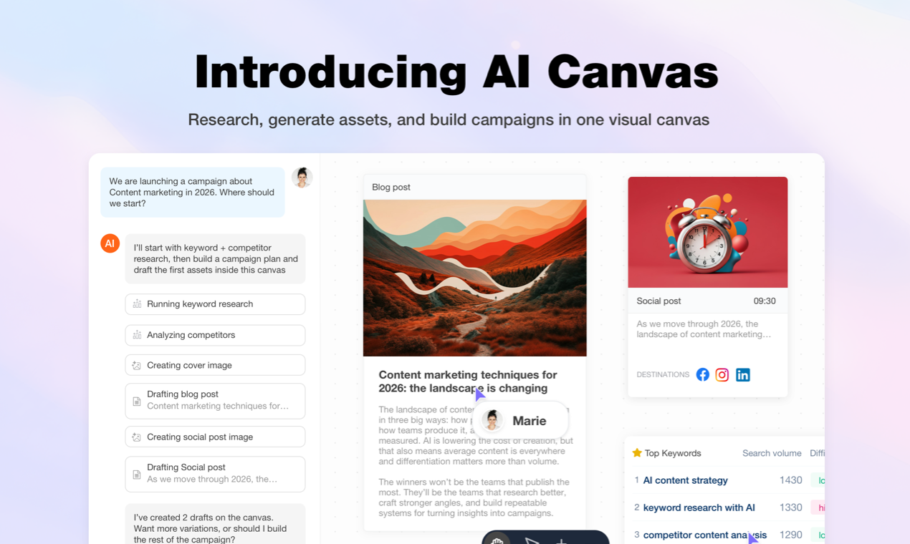
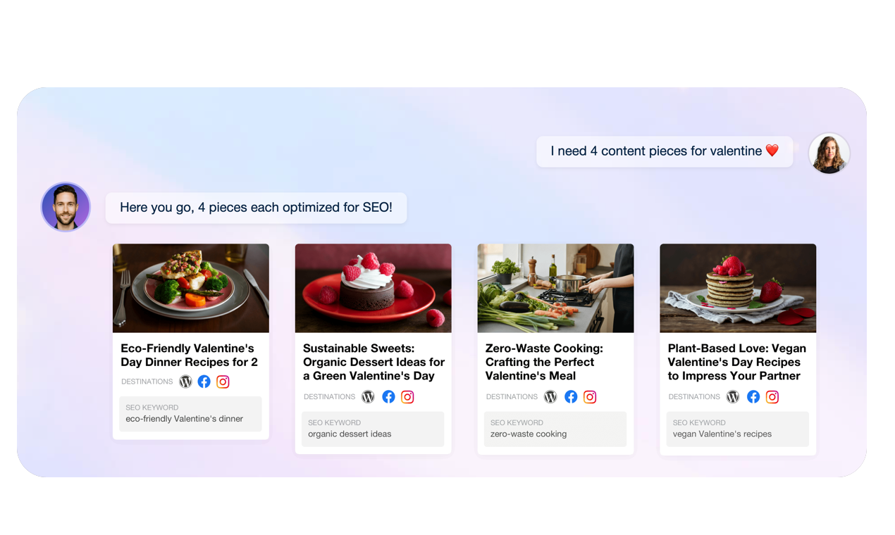
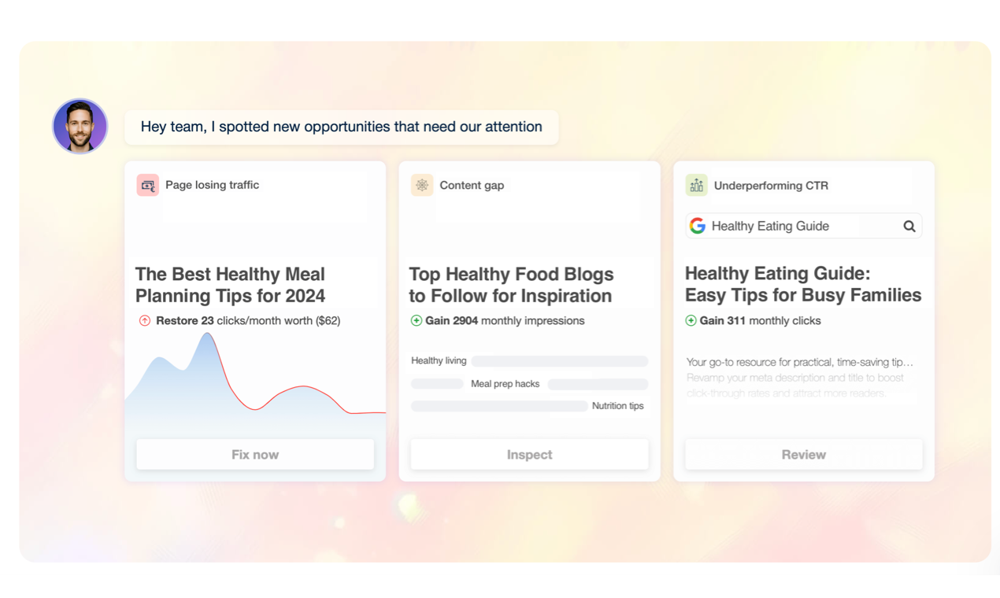

### 🎬 관련 영상
- [🎥 영상 보기](https://ph-files.imgix.net/faa3c7e6-b620-40f9-8573-cc9214bb24ae.jpeg?auto=format)

---

## 10. [Coda by Conductor Quantum](https://www.producthunt.com/products/conductor-quantum?utm_campaign=producthunt-api&utm_medium=api-v2&utm_source=Application%3A+antigravity_test+%28ID%3A+258588%29)
**Votes**: 121 | **Tagline**: Solving problems using quantum computing & natural language

### 📌 요약
양자 컴퓨팅을 활용하고 싶지만, 복잡한 회로 코딩에 막혀있던 비전공자나 전문가를 위한 '자연어 기반 양자 코드 생성 및 실행 플랫폼'입니다. Coda를 통해 일반 언어로 문제를 설명하면, 실제 양자 프로세서에서 바로 실행됩니다.

### 🔑 핵심 기능
- 🎯 Target Audience: 양자 회로 코딩 지식이 없는 초보자, 특정 도메인 전문가, 양자 엔지니어링의 생산성을 높이고 싶은 개발팀
- ✨ Key Differentiator: 기존의 양자 프로그래밍처럼 저수준(low-level) 회로 코드를 수동으로 작성할 필요 없이, 자연어(Natural Language)로 바로 양자 프로세서에 접근 및 실행 가능
- 💡 Core Feature: 사용자의 자연어 설명(문제 정의)을 해석하여 실행 가능한 양자 코드로 자동 변환하고, 이를 실제 양자 컴퓨터에서 구동시키는 '자동 양자 회로 생성 및 실행 엔진'

### 📸 스크린샷 및 갤러리

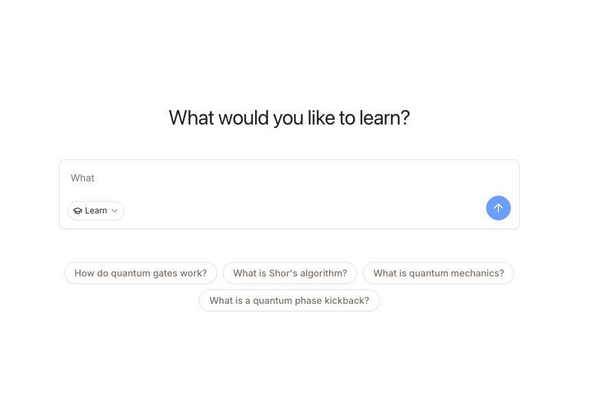
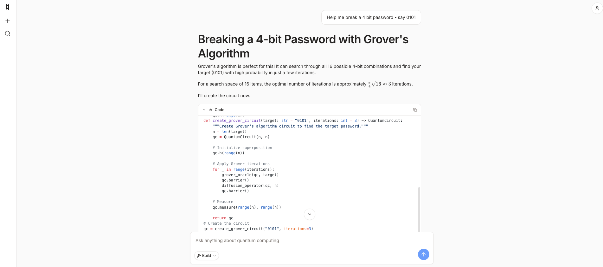

### 🎬 관련 영상
- [🎥 영상 보기](https://ph-files.imgix.net/fdc034e9-ac47-4d07-b097-188f020e3ecc.jpeg?auto=format)

---

