# 🚀 Product Hunt Daily Top 10 (2026-01-23)

## 1. [Tonkotsu](https://www.producthunt.com/products/tonkotsu?utm_campaign=producthunt-api&utm_medium=api-v2&utm_source=Application%3A+antigravity_test+%28ID%3A+258588%29)
**Votes**: 283 | **Tagline**: Manage a team of coding agents from a doc

### 📌 요약
복잡한 코딩 에이전트 팀을 익숙한 문서 환경에서 깔끔하게 지휘할 수 있게 해주는, AI 팀장님들을 위한 신박한 GUI 솔루션.

### 🔑 핵심 기능
- 🎯 Target Audience: 다수의 코딩 에이전트를 통합 관리하며 AI 개발 파이프라인 효율을 높이고 싶은 개발자 및 팀 리더.
- ✨ Key Differentiator: 에이전트 관리 시스템 특유의 복잡성 대신, 사용자가 가장 편안하게 느끼는 문서(doc) 기반 환경을 제공하여 학습 곡선을 최소화.
- 💡 Core Feature: 여러 코딩 에이전트의 역할과 업무 분담을 GUI 환경에서 명확하게 설정하고, 이들의 상호작용 및 결과를 문서화하며 통합 관리.

### 📸 스크린샷 및 갤러리
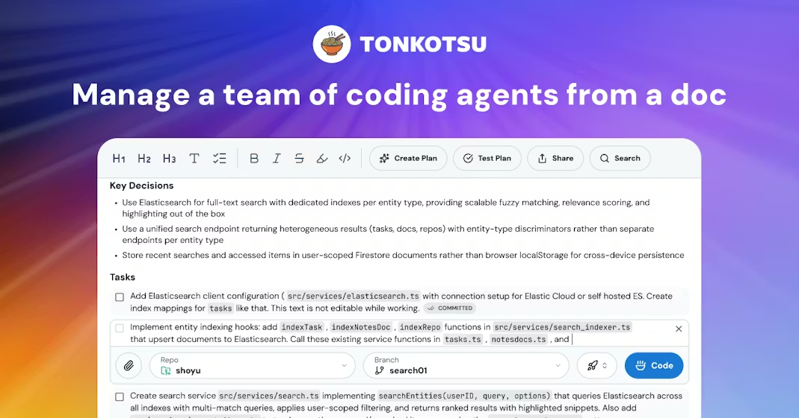
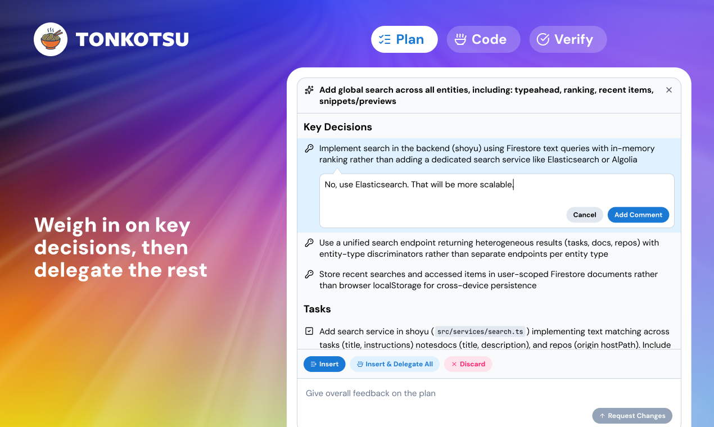
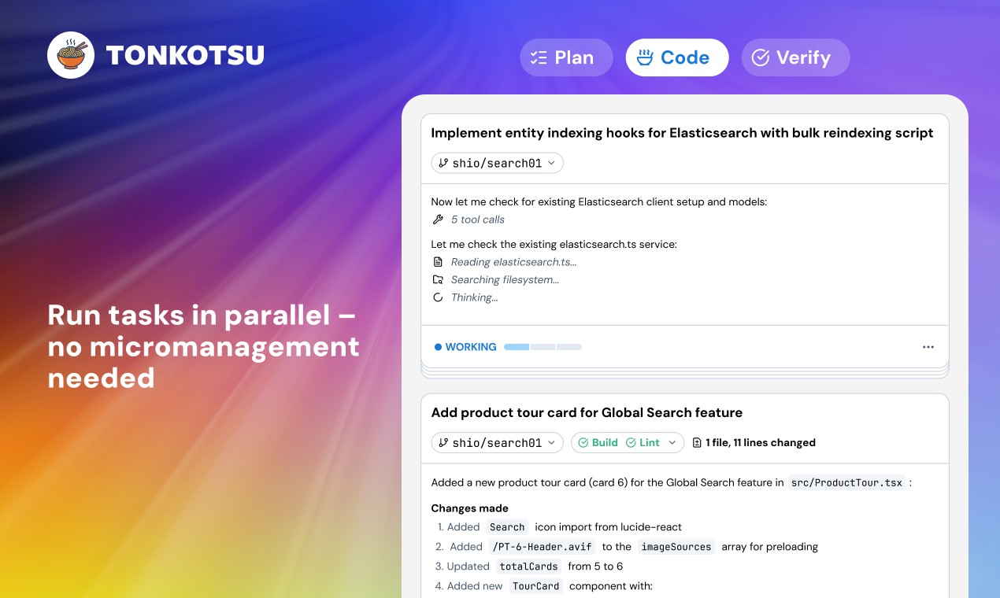

---

## 2. [Krisp Mobile Call Recorder](https://www.producthunt.com/products/krisp?utm_campaign=producthunt-api&utm_medium=api-v2&utm_source=Application%3A+antigravity_test+%28ID%3A+258588%29)
**Votes**: 231 | **Tagline**: Record outgoing calls and get transcripts + AI notes

### 📌 요약
회의록을 작성하듯, 모든 발신 통화 내용을 자동으로 녹음하고 요약, 핵심 요점, 그리고 명확한 실행 항목까지 AI가 정리해주는 스마트 통화 레코더입니다. (현재는 미국 번호 한정)

### 🔑 핵심 기능
- 🎯 Target Audience: 통화 미팅이 잦은 영업/비즈니스 전문가, 모든 대화 내용을 기록하고 구조화하고 싶은 사용자.
- ✨ Key Differentiator: 단순히 녹음만 하는 것이 아니라, 통화 직후 AI가 요약(Summary)과 실행 항목(Action Items)을 추출하여 '구조화된 회의록(Krisp Note)' 형태로 제공하고 데스크톱까지 동기화합니다.
- 💡 Core Feature: Krisp 앱에서 발신 통화 시, 녹음 및 전사(Transcription)가 자동으로 이루어지며, 통화 종료 후 AI 노트가 즉시 생성됩니다.

### 📸 스크린샷 및 갤러리

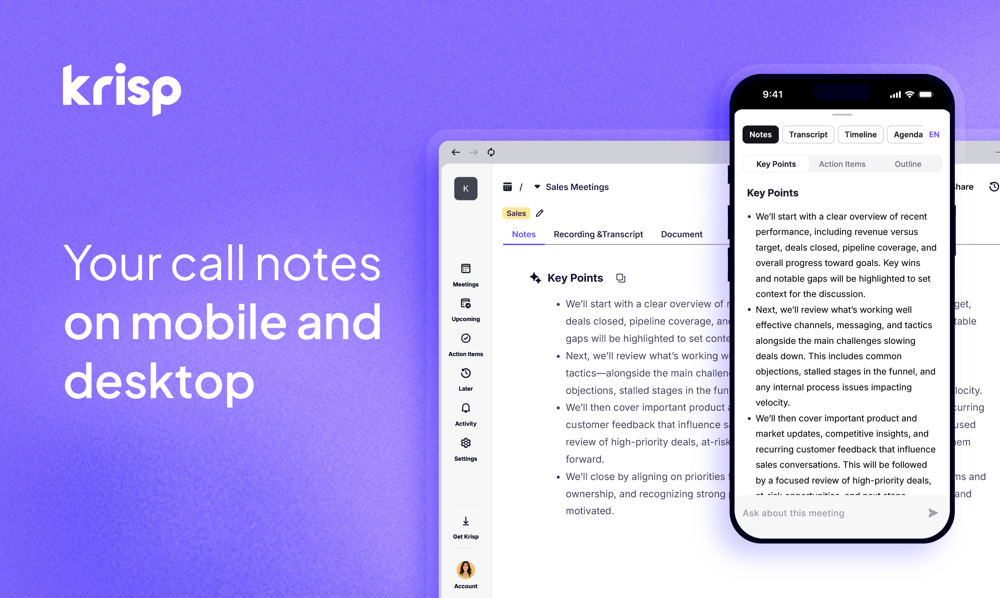

---

## 3. [PayPing](https://www.producthunt.com/products/payping?utm_campaign=producthunt-api&utm_medium=api-v2&utm_source=Application%3A+antigravity_test+%28ID%3A+258588%29)
**Votes**: 190 | **Tagline**: All your recurring payments in one place

### 📌 요약
수십 개 구독 서비스와 카드 할부까지 AI가 관리하고 최적화해주는, '잊을만 하면 나가는 돈' 통합 관리 대시보드 앱 PayPing이 런칭했습니다.

### 🔑 핵심 기능
- 🎯 Target Audience: 구독 서비스/SaaS 이용이 잦아 매달 나가는 고정 지출을 한눈에 파악하고 싶은 얼리어답터 및 개인 사용자.
- ✨ Key Differentiator: 단순 구독 관리에서 벗어나, 신용카드 대금(할부) 관리까지 통합하며 AI 기반 지출 최적화 분석을 제공하는 점.
- 💡 Core Feature: 이메일 영수증 포워딩과 연동하여 갱신 주기 알림, 미용실 예약처럼 주기적인 예약 스케줄까지 포함한 모든 '반복 지출'을 추적하는 기능.

### 📸 스크린샷 및 갤러리
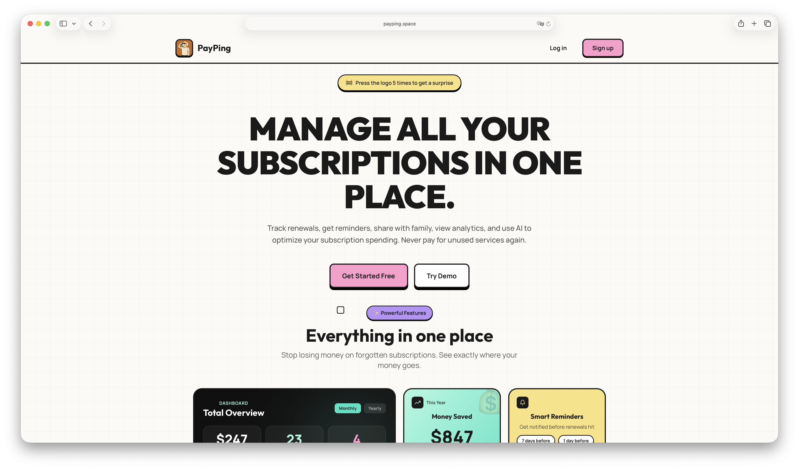
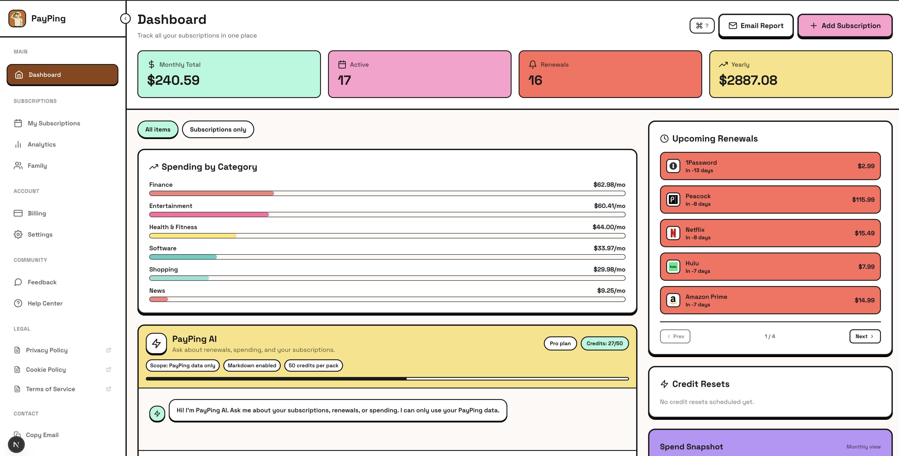
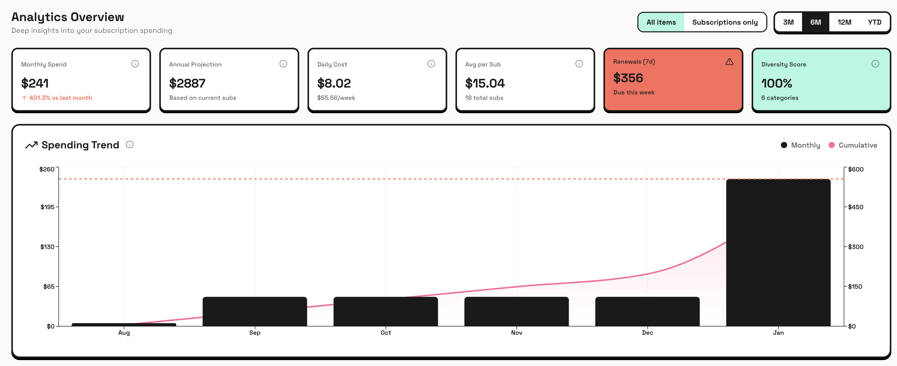

### 🎬 관련 영상
- [🎥 영상 보기](https://ph-files.imgix.net/b9aac749-6447-4354-b198-8968e24b4467.jpeg?auto=format)

---

## 4. [nlsh](https://www.producthunt.com/products/nlsh?utm_campaign=producthunt-api&utm_medium=api-v2&utm_source=Application%3A+antigravity_test+%28ID%3A+258588%29)
**Votes**: 156 | **Tagline**: talk to your terminal in natural language

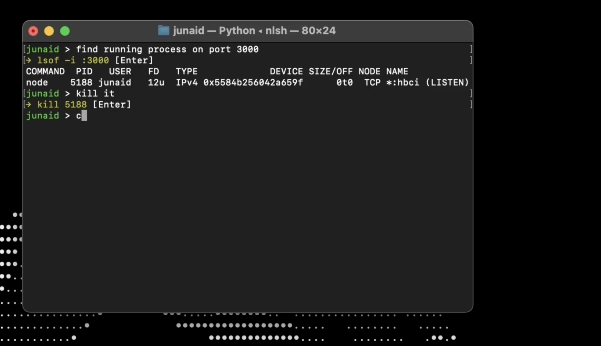

### 📌 요약
터미널 명령어를 더 이상 외울 필요 없이, 평범한 영어로 대화하듯 입력하면 쉘 명령어로 자동 변환해주는 AI 비서 'nlsh'가 등장했습니다.

### 🔑 핵심 기능
- 🎯 Target Audience: 명령어 암기에 지친 개발자, 새로운 쉘 환경에 빠르게 적응해야 하는 엔지니어, CLI(Command Line Interface)를 자주 사용하지만 복잡한 옵션(플래그) 때문에 어려움을 겪는 모든 사용자.
- ✨ Key Differentiator: 기존의 명령어 레퍼런스나 치트 시트(Cheat Sheet)를 찾아보는 행위 자체를 없앰. 자연어 이해(NLP)를 통해 사용자의 의도를 즉시 해석하고 정확한 명령어로 변환하여, 터미널 작업 속도와 편의성을 혁신적으로 개선합니다.
- 💡 Core Feature: '복잡한 플래그(옵션) 없이 자연어만으로 원하는 작업을 수행할 수 있도록 영어 입력(Plain English Input)을 즉시 실행 가능한 쉘 명령(Executable Shell Command)으로 변환해주는 기능.

### 📸 스크린샷 및 갤러리
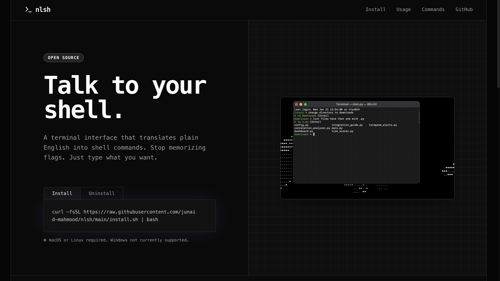
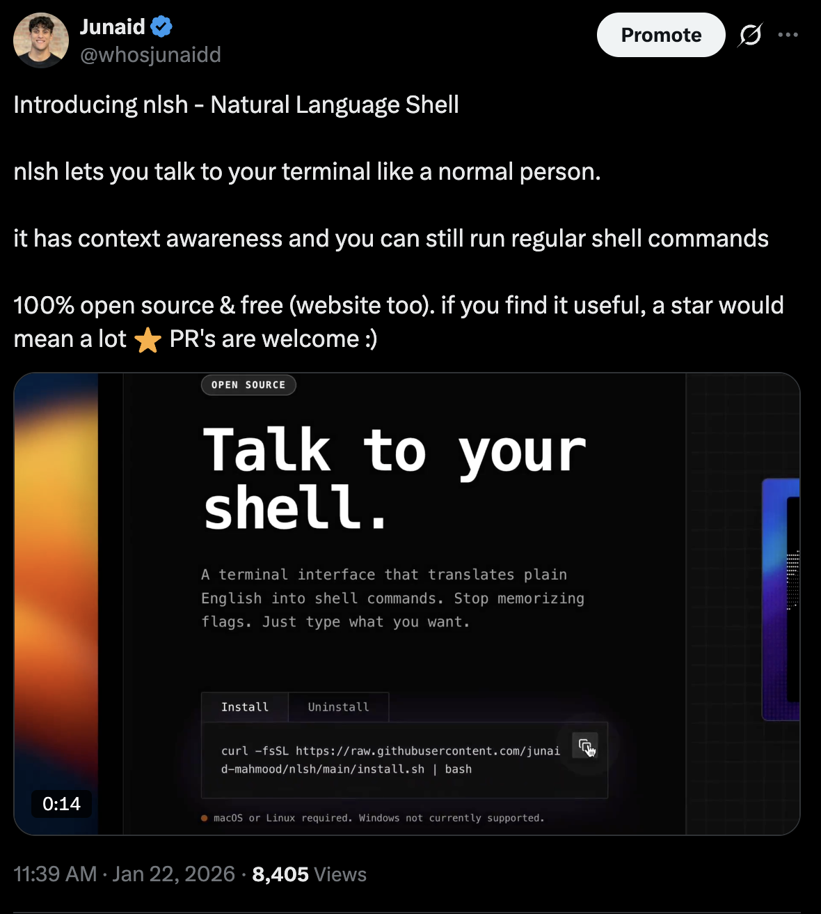

---

## 5. [Kids Cash Register](https://www.producthunt.com/products/kids-cash-register?utm_campaign=producthunt-api&utm_medium=api-v2&utm_source=Application%3A+antigravity_test+%28ID%3A+258588%29)
**Votes**: 144 | **Tagline**: A POS system for kids to play pretend restaurant/shopping. 

### 📌 요약
아이들이 좋아하는 상점 놀이를 '진짜' POS 시스템으로 즐기며 자연스럽게 수학을 배우는 신개념 교육 앱이 런칭했습니다.

### 🔑 핵심 기능
- 🎯 Target Audience: 실생활 수 감각을 키우고 싶은 초등학생 및 미취학 아동을 둔 학부모.
- ✨ Key Differentiator: 단순 계산 연습이 아닌, 10가지 다양한 상점 테마 속에서 몰입형 역할극을 통해 수학을 익힐 수 있습니다.
- 💡 Core Feature: 실제처럼 돈을 세고 거스름돈을 계산하는 등, 시뮬레이션을 통해 경제 개념과 계산 능력을 동시에 학습 가능합니다.

### 📸 스크린샷 및 갤러리
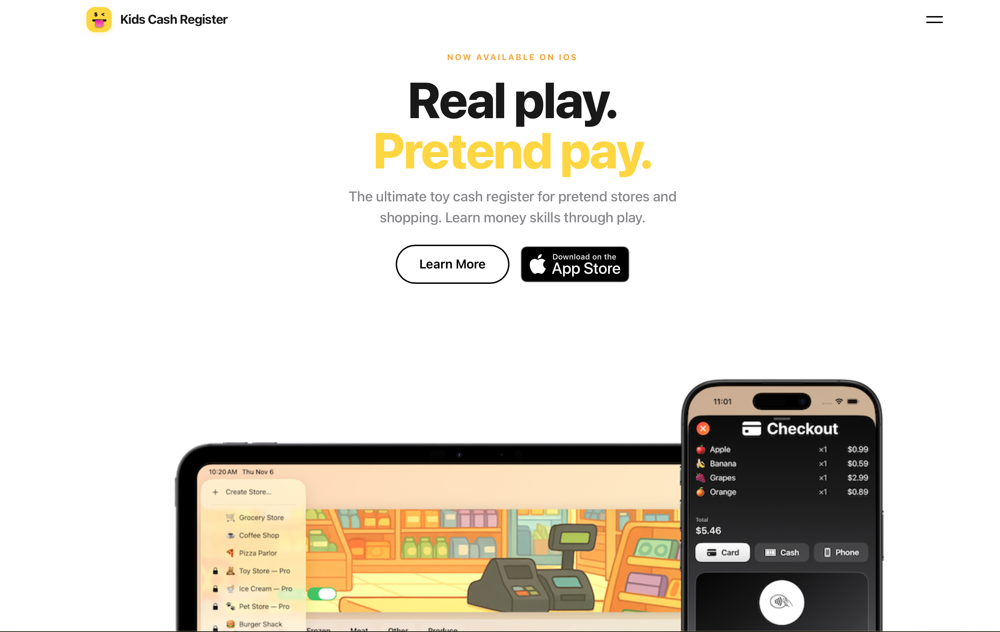
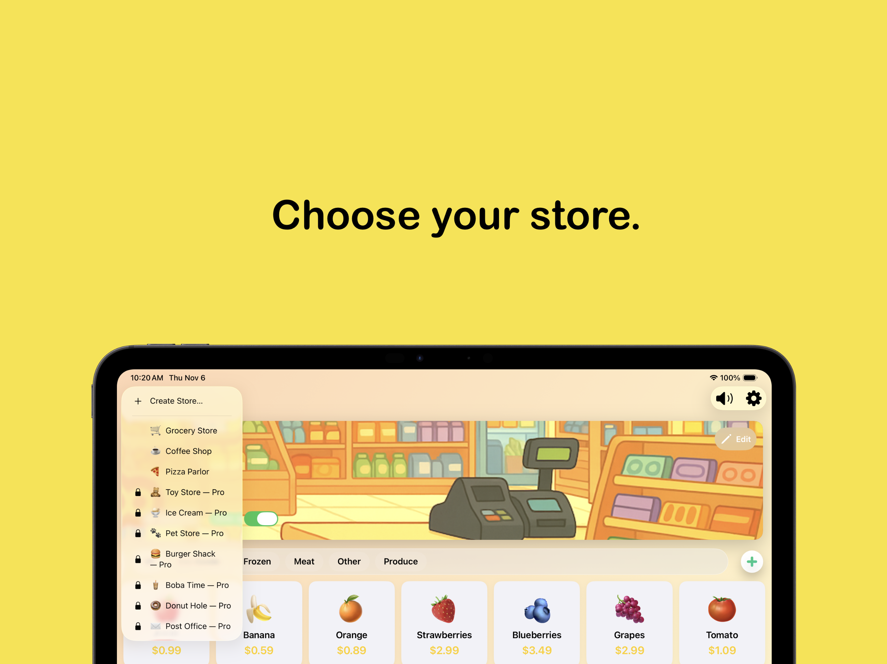

---

## 6. [Usagebar](https://www.producthunt.com/products/usagebar?utm_campaign=producthunt-api&utm_medium=api-v2&utm_source=Application%3A+antigravity_test+%28ID%3A+258588%29)
**Votes**: 137 | **Tagline**: Track Claude Code Usage from your Menu Bar

### 📌 요약
Anthropic의 Claude Code(AI 코딩) 사용량을 맥(macOS) 메뉴바에서 실시간으로 추적해주는 필수 유틸리티입니다. 갑자기 5시간 제한에 걸려 작업이 중단되는 최악의 상황을 방지해 줍니다.

### 🔑 핵심 기능
- 🎯 Target Audience: Claude Code를 코딩 작업에 자주 활용하는 개발자나 AI 리서처 (특히 사용량 제한 때문에 불편을 겪었던 사용자).
- ✨ Key Differentiator: Claude Code 사용량(5시간 및 주간)을 공식 사이트에 접속하지 않고도 macOS 메뉴바에서 한눈에 직관적으로 확인할 수 있는 유일한 솔루션입니다.
- 💡 Core Feature: 사용량 리셋 타이머 제공 및 한도 초과 임박 시 알림 기능 제공으로, '예상치 못한 사용 중단'을 사전에 방지해 줍니다.

### 📸 스크린샷 및 갤러리
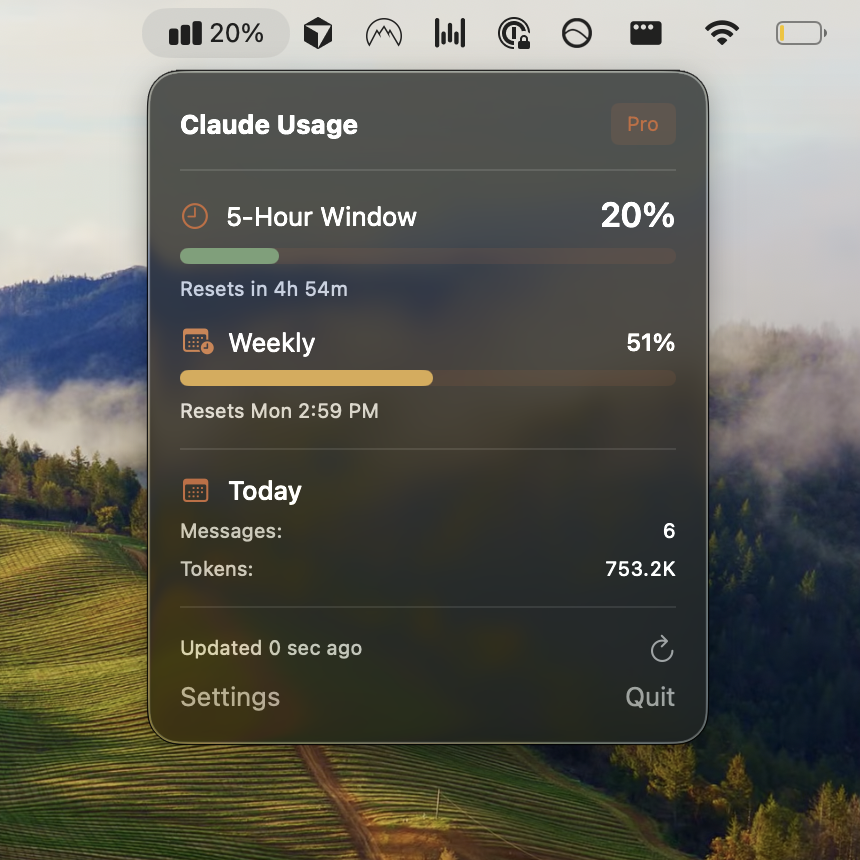
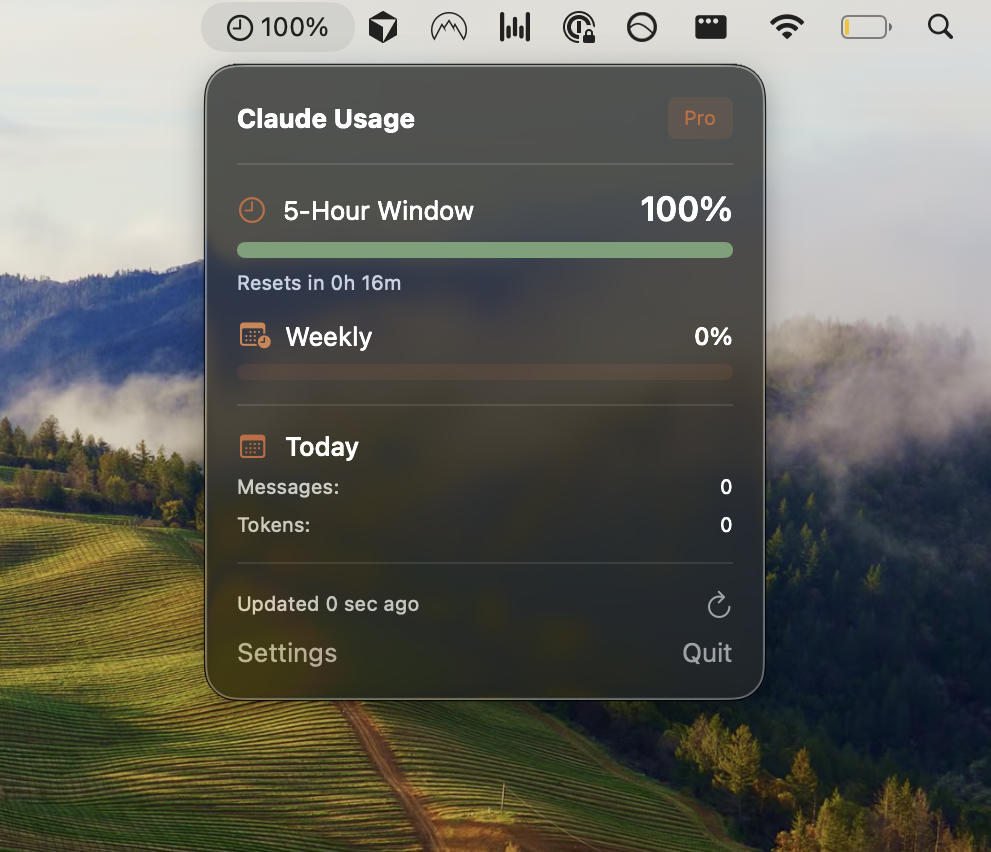

---

## 7. [Qwen3-TTS](https://www.producthunt.com/products/qwen3?utm_campaign=producthunt-api&utm_medium=api-v2&utm_source=Application%3A+antigravity_test+%28ID%3A+258588%29)
**Votes**: 129 | **Tagline**: Voice design, cloning & 97ms streaming

### 📌 요약
알리바바가 내놓은 AI 음성 모델 끝판왕! 3초 만에 목소리 복제는 기본, 97ms의 극강의 초저지연 스트리밍으로 실시간 대화도 가능해진 차세대 TTS 엔진입니다.

### 🔑 핵심 기능
- 🎯 Target Audience: AI 음성 콘텐츠 제작자, 실시간 음성 상호작용이 필요한 서비스 개발팀, 게임 및 메타버스 플랫폼.
- ✨ Key Differentiator: 97ms(0.1초 미만)에 달하는 초저지연 스트리밍 속도와 0.6B/1.7B 크기로 제공되는 SOTA(최고 수준) 음성 품질.
- 💡 Core Feature: 단 3초 음성 프롬프트만으로 복제 가능한 Zero-shot 음성 클로닝 및 프롬프트 기반 음성 디자인 기능.

### 📸 스크린샷 및 갤러리
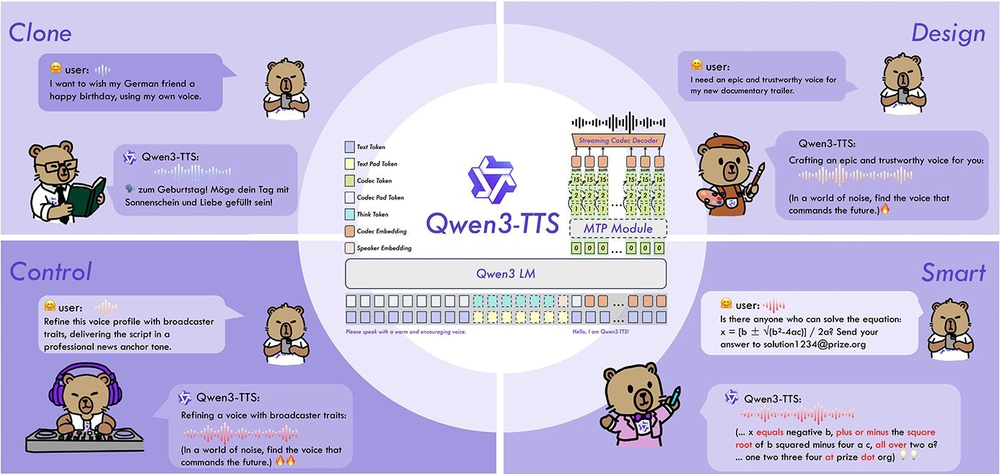
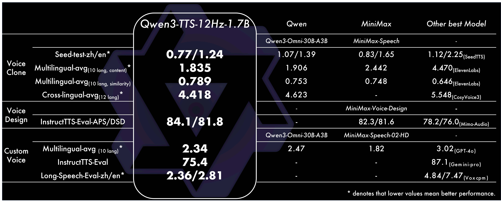
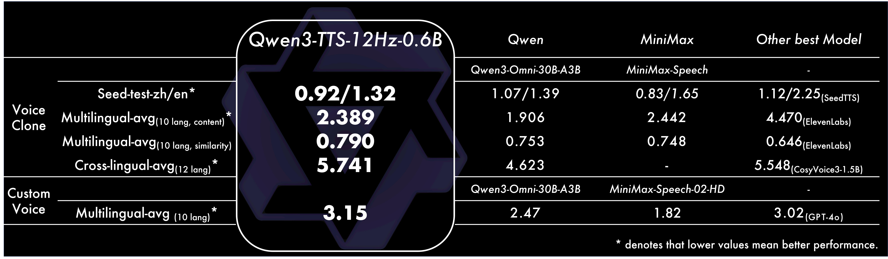

---

## 8. [Forge Agent](https://www.producthunt.com/products/rightnow-ai?utm_campaign=producthunt-api&utm_medium=api-v2&utm_source=Application%3A+antigravity_test+%28ID%3A+258588%29)
**Votes**: 109 | **Tagline**: Swarm Agents That Turn Slow PyTorch Into Fast GPU Kernels

### 📌 요약
느린 PyTorch 추론 속도를 혁신할 'Forge Agent'가 등장했습니다. 32개의 AI 에이전트가 병렬로 작동하며, 기존 `torch.compile` 대비 최대 5배 빠른 맞춤형 GPU 커널을 자동으로 최적화하고 생성해 줍니다. Llama 3.1 8B에서 5배 성능 향상을 입증한, 성능과 효율성 모두 잡고 싶은 개발자에게 필수적인 솔루션입니다.

### 🔑 핵심 기능
- 🎯 Target Audience: 대규모 PyTorch 모델의 배포 및 추론 속도 개선이 시급한 ML 엔지니어 및 고성능 컴퓨팅(HPC) 연구자.
- ✨ Key Differentiator: 기존 PyTorch 최적화 표준인 `torch.compile`을 능가하는 속도(최대 5배)를 보장하며, 32개의 AI 에이전트가 병렬로 작동하여 최적화 전략을 모색하는 독보적인 방식.
- 💡 Core Feature: 텐서 코어 및 커널 퓨전 등 전문적인 GPU 최적화 전략을 자동으로 적용하여, 검증된(Judge Validated) 초고속 CUDA/Triton 커널을 생성 및 배포.

### 📸 스크린샷 및 갤러리
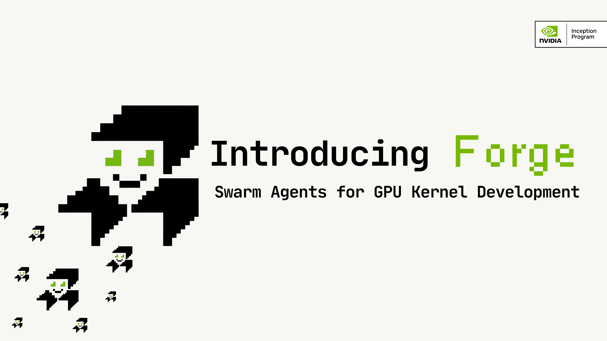

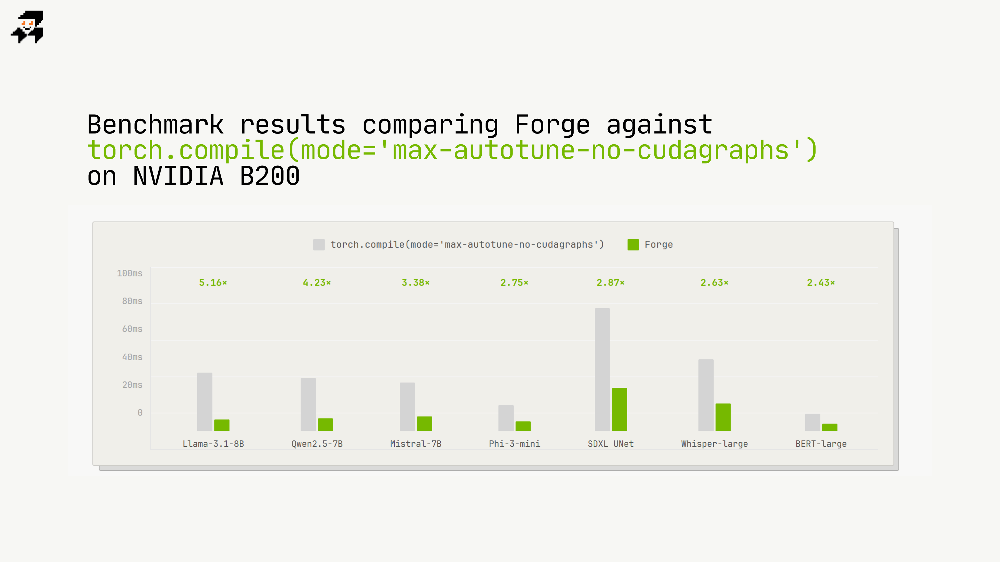

---

## 9. [Preloop](https://www.producthunt.com/products/preloop?utm_campaign=producthunt-api&utm_medium=api-v2&utm_source=Application%3A+antigravity_test+%28ID%3A+258588%29)
**Votes**: 109 | **Tagline**: The MCP Governance Layer

### 📌 요약
자율 AI 에이전트의 '폭주'를 막아주는 필수 브레이크 시스템! Preloop은 자동화 실행 전, 배포나 환불 같은 위험한 액션을 슬랙/모바일 승인으로 한 번 더 검증하는 AI 시대의 MCP 거버넌스 플랫폼입니다.

### 🔑 핵심 기능
- 🎯 Target Audience: 핵심 업무에 AI 에이전트 자동화를 도입했으나, 통제 불능 상태의 위험을 느끼는 모든 기업 (특히 DevOps, 금융, 고객 서비스 관련 팀).
- ✨ Key Differentiator: 기존 워크플로우 툴과 달리, AI 에이전트의 '리스크 레벨'에 따라 인간 승인 단계를 자동으로 삽입합니다. 자동화와 승인 게이트 기능을 유연하게 결합하여 사용할 수 있다는 것이 핵심입니다.
- 💡 Core Feature: 배포, 데이터 변경, 대규모 환불 등 '위험한' 액션을 AI가 시도할 때, 즉시 차단하고 모바일이나 슬랙/팀즈를 통한 실시간 승인 요청을 보내 실행을 통제하는 인터셉트 기능.

### 📸 스크린샷 및 갤러리
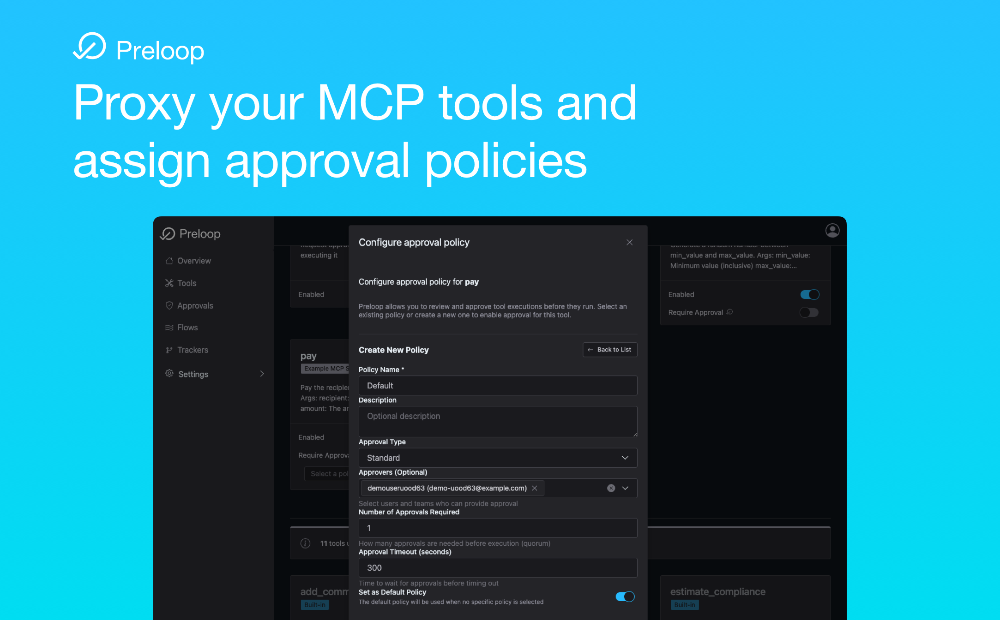
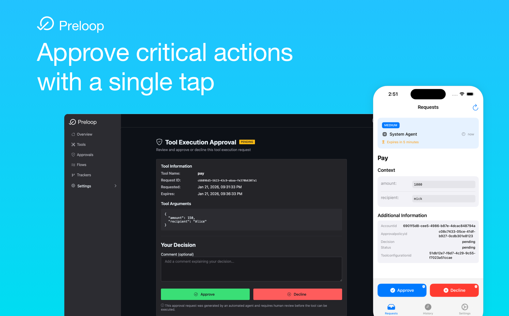
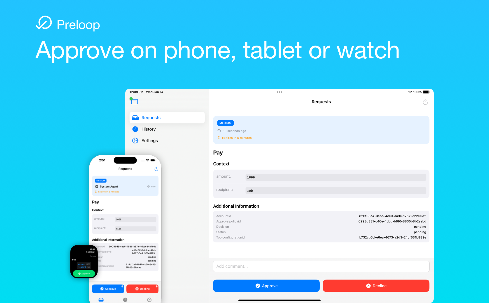

### 🎬 관련 영상
- [🎥 영상 보기](https://ph-files.imgix.net/9feb5d67-1953-400f-8a69-d19b6da10a2b.jpeg?auto=format)

---

## 10. [DropTidy](https://www.producthunt.com/products/droptidy?utm_campaign=producthunt-api&utm_medium=api-v2&utm_source=Application%3A+antigravity_test+%28ID%3A+258588%29)
**Votes**: 104 | **Tagline**: Remove sensitive photo data, 100% client-side & zero uploads

### 📌 요약
📸 사진에 숨겨진 위치 정보와 기기 지문까지 완벽하게 지워주는 'DropTidy'가 등장했습니다. 업로드 없이 브라우저에서 100% 처리하여 개인 정보 유출 걱정 없이 사진을 공유할 수 있게 해주는 혁신적인 프라이버시 툴입니다.

### 🔑 핵심 기능
- 🎯 Target Audience: 개인 정보 보호에 민감한 사용자, 사진작가, 자신의 위치나 일정을 노출하고 싶지 않은 모든 인터넷 사용자.
- ✨ Key Differentiator: 민감한 사진 데이터를 서버에 업로드할 필요 없이, 사용자의 브라우저 내에서 모든 데이터 제거 및 분석이 100% 클라이언트 측에서 처리됩니다.
- 🔍 Core Feature: 사진의 화질이나 해상도 손실 없이(Lossless), 메타데이터(위치, 기기 정보 등)를 깊이 분석하여 숨겨진 개인 정보 위험 요소를 찾아내고 제거합니다.

### 📸 스크린샷 및 갤러리
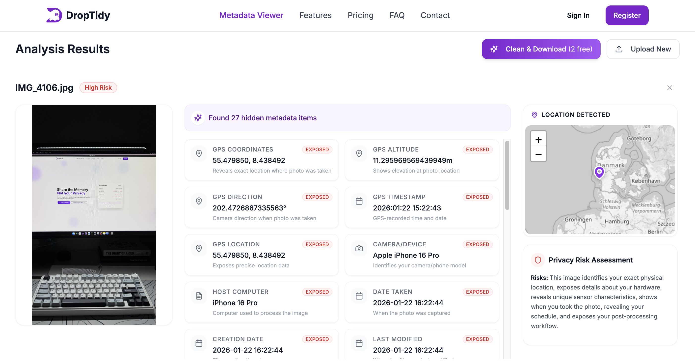
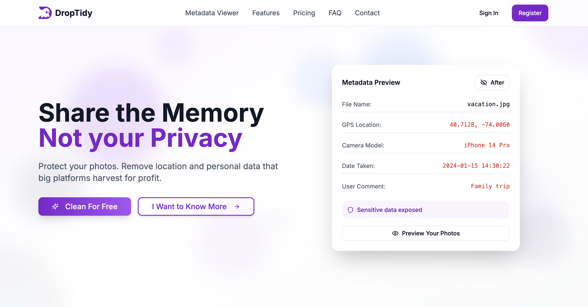
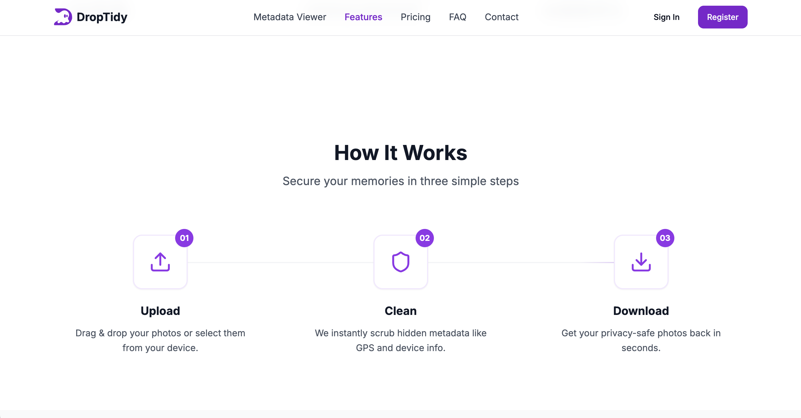

### 🎬 관련 영상
- [🎥 영상 보기](https://ph-files.imgix.net/3347da73-2846-4169-b0bb-c2bc2ba034b9.jpeg?auto=format)

---

