# 🚀 Product Hunt Daily Top 10 (2026-01-24)

## 1. [Humans in the Loop](https://www.producthunt.com/products/humans-in-the-loop?utm_campaign=producthunt-api&utm_medium=api-v2&utm_source=Application%3A+antigravity_test+%28ID%3A+258588%29)
**Votes**: 326 | **Tagline**: A free community to talk all-things-agentic-coding-AI

### 📌 요약
에이전트 코딩과 AI 활용으로 개발 속도를 '미친 듯이' 높이고 싶은 이들을 위한, 클로드 코드부터 커서까지 실전 노하우를 공유하는 무료 개발자 커뮤니티입니다.

### 🔑 핵심 기능
- 🎯 Target Audience: AI 툴(Claude Code, Cursor 등)을 이용해 개발 및 배포(Ship) 속도를 혁신적으로 높이려는 개발자와 테크 리드.
- ✨ Key Differentiator: 단순히 AI 모델을 논하는 것을 넘어, MCP 서버 운영, AI 코드 리뷰 등 '실제 제품 출시(Shipping)'에 필요한 에이전트 코딩 및 AI 활용의 구체적인 '베스트 프랙티스'를 공유하는 실용성.
- 💡 Core Feature: AI 코딩 툴(특히 Claude Code, Cursor) 사용법 및 개발 환경 최적화(MCP 서버 등)에 대한 인사이트와 모범 사례를 공유하고 토론하는 장.

### 📸 스크린샷 및 갤러리
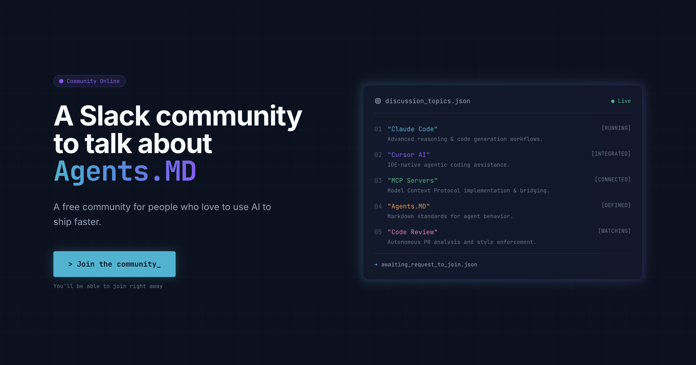

---

## 2. [BrainLoom](https://www.producthunt.com/products/brainloom?utm_campaign=producthunt-api&utm_medium=api-v2&utm_source=Application%3A+antigravity_test+%28ID%3A+258588%29)
**Votes**: 226 | **Tagline**: Turn PDFs into Flashcards. The local-first Learning OS.

### 📌 요약
PDF 하이라이트를 즉시 플래시카드로 바꿔주고, 공부에 필요한 모든 기능을 하나의 로컬 OS에서 통합해주는 '로컬 우선' 학습 관리 시스템 BrainLoom이 런칭했습니다.

### 🔑 핵심 기능
- 🎯 Target Audience: 학습 효율을 극대화하고 싶은 학생, 연구원, 지식 노동자 등 (PDF를 통해 깊이 있는 학습을 하는 모든 사람)
- ✨ Key Differentiator: 여러 앱을 오갈 필요 없이 학습 워크플로우를 하나로 통합 (로컬 우선 OS), 플래시카드와 원본 텍스트의 긴밀한 연결 유지
- 💡 Core Feature: PDF 하이라이트 기반 플래시카드 자동 생성 및 'Smart Paste' 기능을 활용한 무한 캔버스 시각화 (마우스 없이 아이디어 구조화 가능)

### 📸 스크린샷 및 갤러리
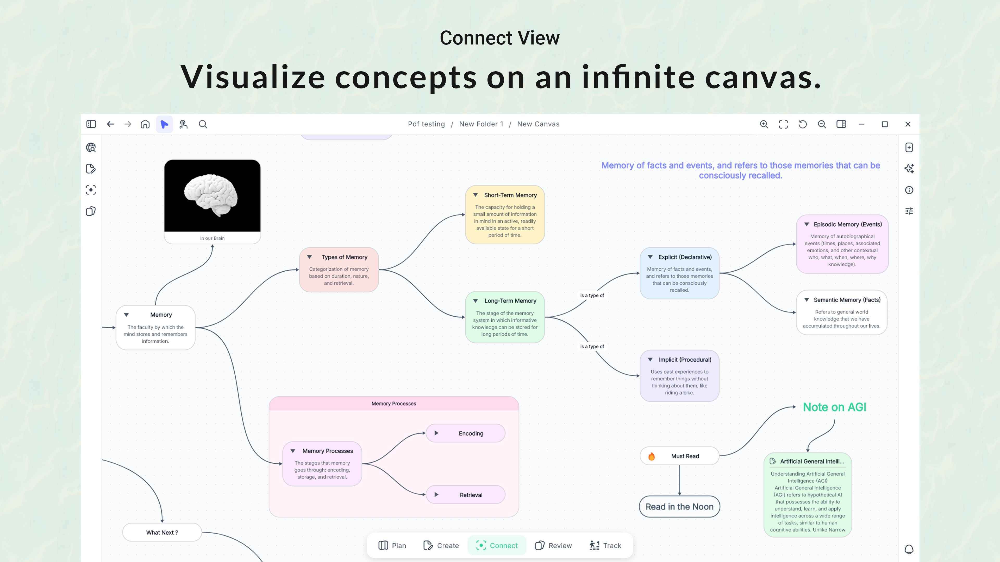
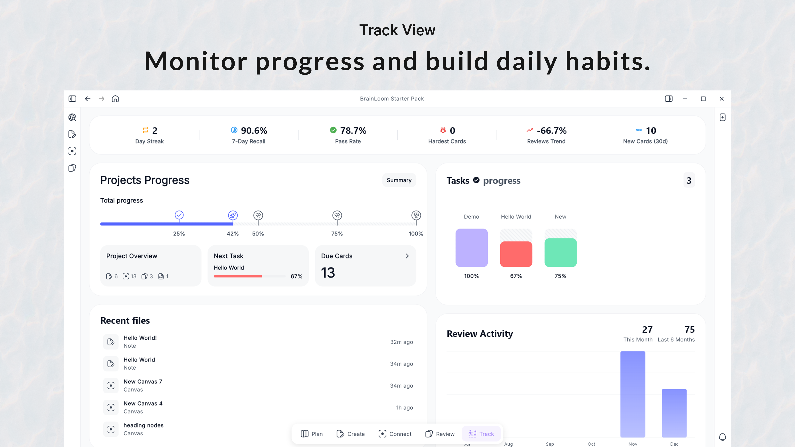
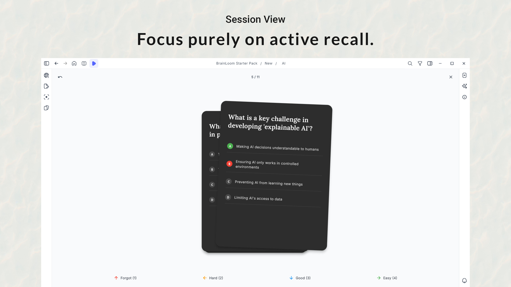

### 🎬 관련 영상
- [🎥 영상 보기](https://ph-files.imgix.net/7f3cea49-8842-432b-b95d-d617c3467b62.jpeg?auto=format)

---

## 3. [GetThis](https://www.producthunt.com/products/getthis?utm_campaign=producthunt-api&utm_medium=api-v2&utm_source=Application%3A+antigravity_test+%28ID%3A+258588%29)
**Votes**: 177 | **Tagline**: Generate tasks from voice, text, or screenshots.

### 📌 요약
말로 하거나 채팅창 스크린샷만 찍으면, AI가 알아서 할 일 목록(Tasks)을 정리해주는 인공지능 비서 앱 'GetThis'가 떴습니다.

### 🔑 핵심 기능
- 🎯 Target Audience: 생각의 흐름을 빠르게 캡처하고 싶은 사람, 아이디어를 일일이 타이핑하기 귀찮은 사람 (바쁜 전문가, 잦은 채팅 기반 협업자, 뇌 정리가 필요한 모든 사람)
- ✨ Key Differentiator: 음성이나 이미지(스크린샷) 등 비정형화된 '뇌 덤프'를 즉시 구조화된 업무/장보기/카테고리 등으로 분류해주는 AI 기반의 간편함.
- 💡 Core Feature: 음성 또는 스크린샷 캡처를 통한 태스크 자동 생성 및 분류 기능. (Stop typing, Start snapping/speaking)

### 📸 스크린샷 및 갤러리

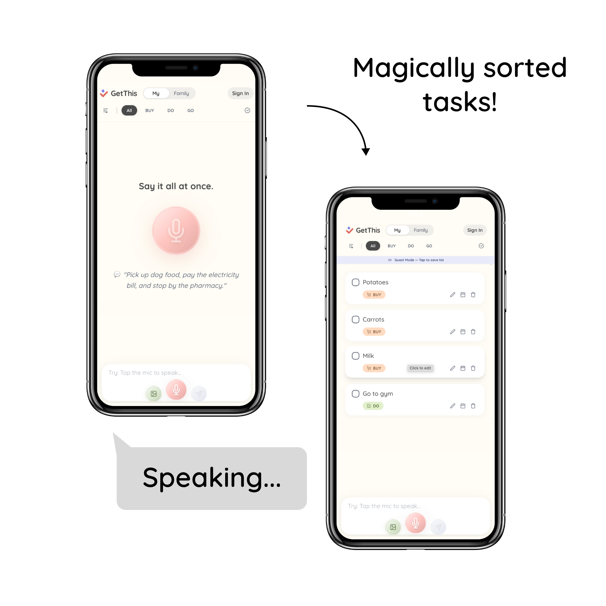
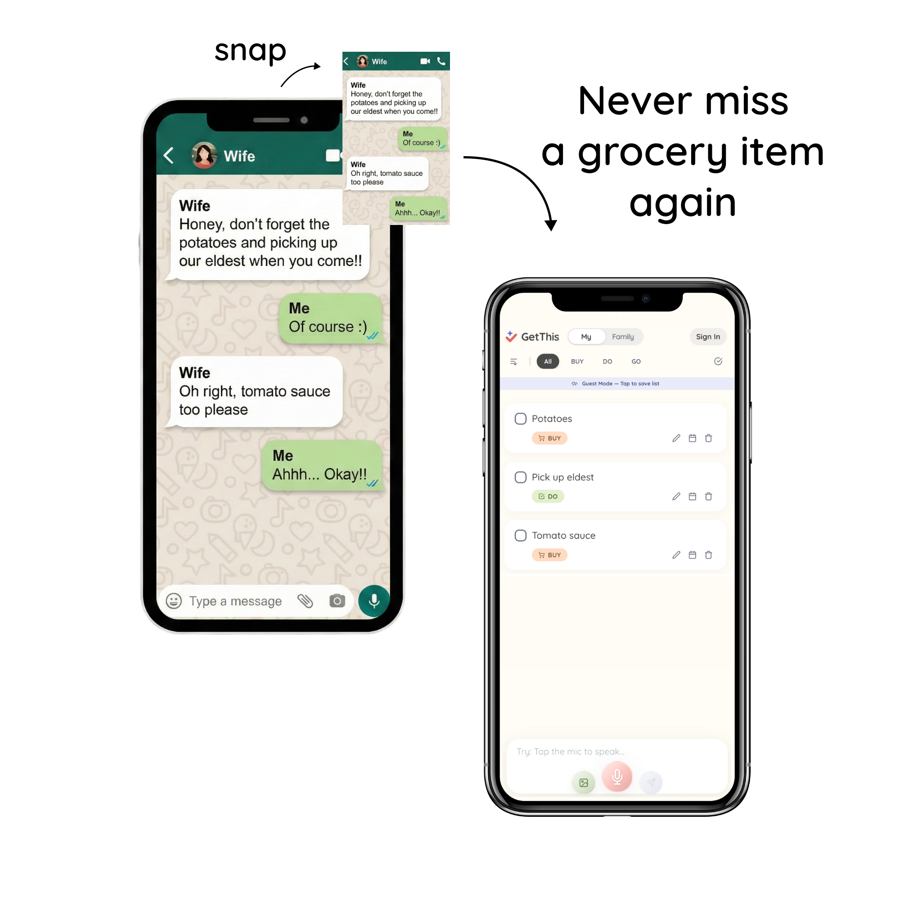

### 🎬 관련 영상
- [🎥 영상 보기](https://ph-files.imgix.net/c558bf9a-44fa-464c-a200-c9dc7a8341ac.jpeg?auto=format)

---

## 4. [Sometimes: A Poem Arrives](https://www.producthunt.com/products/sometimes-a-poem-arrives?utm_campaign=producthunt-api&utm_medium=api-v2&utm_source=Application%3A+antigravity_test+%28ID%3A+258588%29)
**Votes**: 157 | **Tagline**: Poetry at Unexpected Moments

### 📌 요약
불현듯 찾아오는 시(詩)의 순간, 날씨와 시간, 계절에 맞춰 예상치 못한 때에 감성적인 울림을 선사하는 iOS 시 추천 앱입니다.

### 🔑 핵심 기능
- 🎯 Target Audience: 일상 속 소소한 영감과 감성을 찾는 사용자, 시집을 펼칠 여유는 없지만 문학적 위로가 필요한 현대인.
- ✨ Key Differentiator: 사용자가 의도적으로 시를 검색하는 것이 아니라, 앱이 현재 환경(시간, 날씨, 계절)을 고려하여 가장 적절한 시를 '깜짝 선물'처럼 제공.
- 💡 Core Feature: 시간, 날씨, 계절 등 외부 환경 요소를 기반으로 사용자의 현재 순간과 분위기에 맞는 시를 자동으로 큐레이션하여 추천.

### 📸 스크린샷 및 갤러리
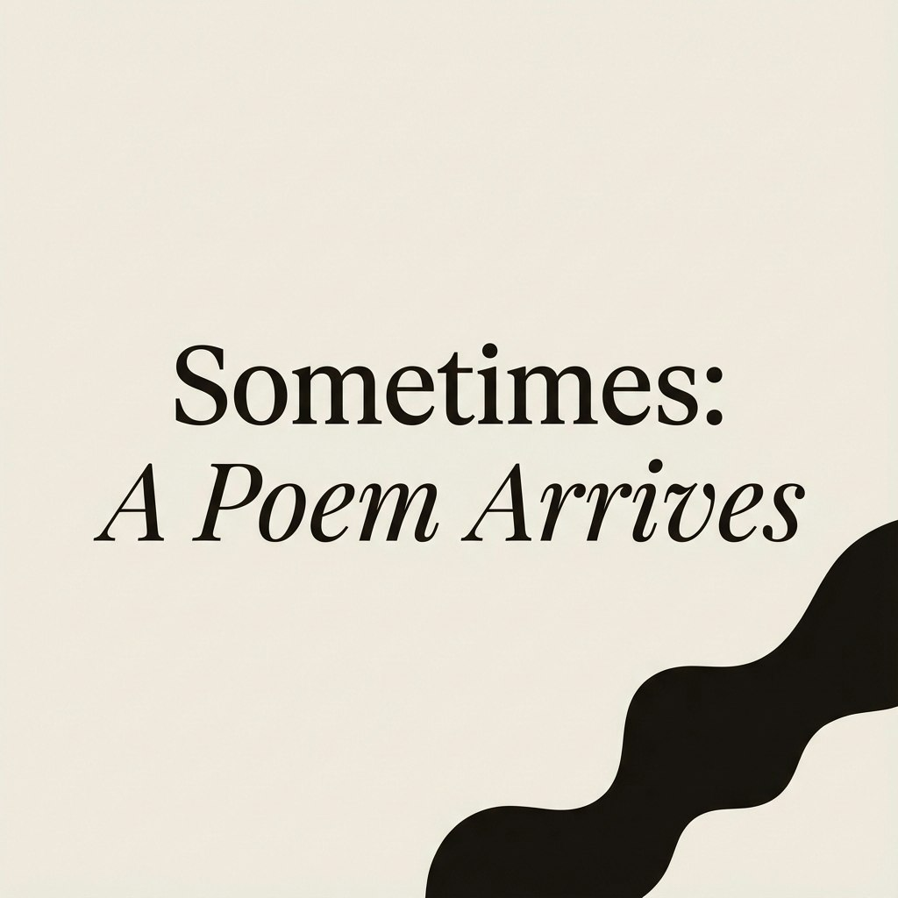

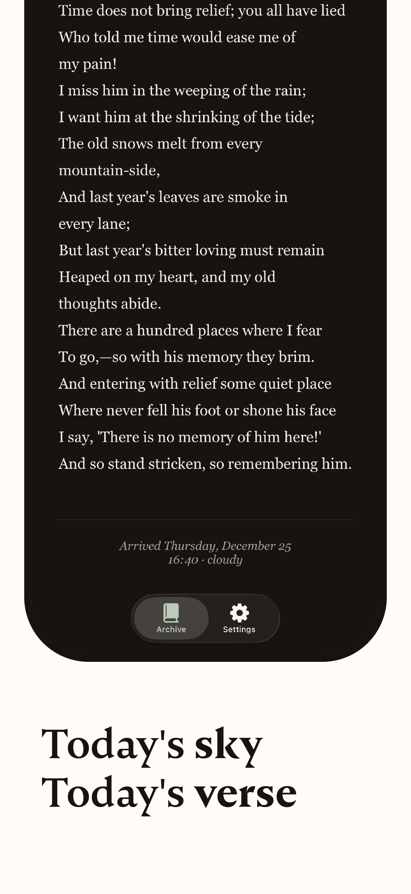

---

## 5. [Youtube Custom Playback](https://www.producthunt.com/products/youtube-custom-playback?utm_campaign=producthunt-api&utm_medium=api-v2&utm_source=Application%3A+antigravity_test+%28ID%3A+258588%29)
**Votes**: 147 | **Tagline**: Unlock up to 16x speed with native-style controls

### 📌 요약
유튜브 기본 재생 속도(2배속)의 한계를 깬 '파워유저' 전용 확장 프로그램이 등장했습니다. 최대 16배속까지, 마치 원래 기능처럼 깔끔하게 녹아든 네이티브 스타일 재생 속도 컨트롤러로 영상 시청 효율을 극대화하세요.

### 🔑 핵심 기능
- 🎯 Target Audience: 강의/교육 영상을 초압축으로 시청하려는 '파워 러너' 및 정밀한 프레임 단위 분석이 필요한 분석가.
- ✨ Key Differentiator: 기존 유튜브는 최대 2배속. 이 제품은 0.25배속부터 '최대 16배속'까지 지원하며, 설정 메뉴에 네이티브처럼 완벽히 통합되어 사용자 경험이 우수함.
- 💡 Core Feature: 기본 2배속을 훨씬 뛰어넘는 최대 16배속 재생 지원 (시간 대비 압도적 학습량 소화 가능).

### 📸 스크린샷 및 갤러리
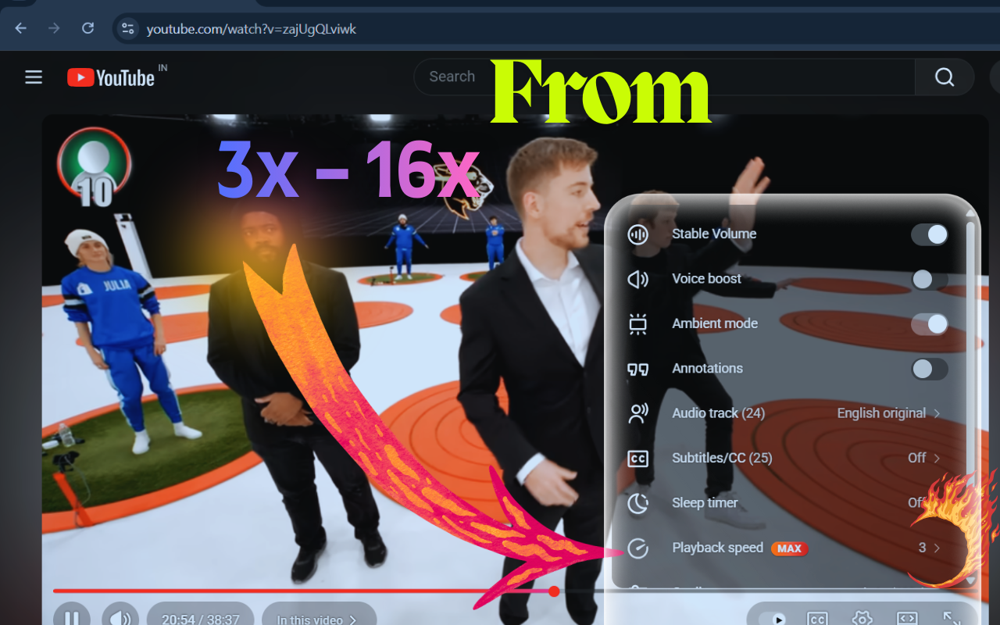
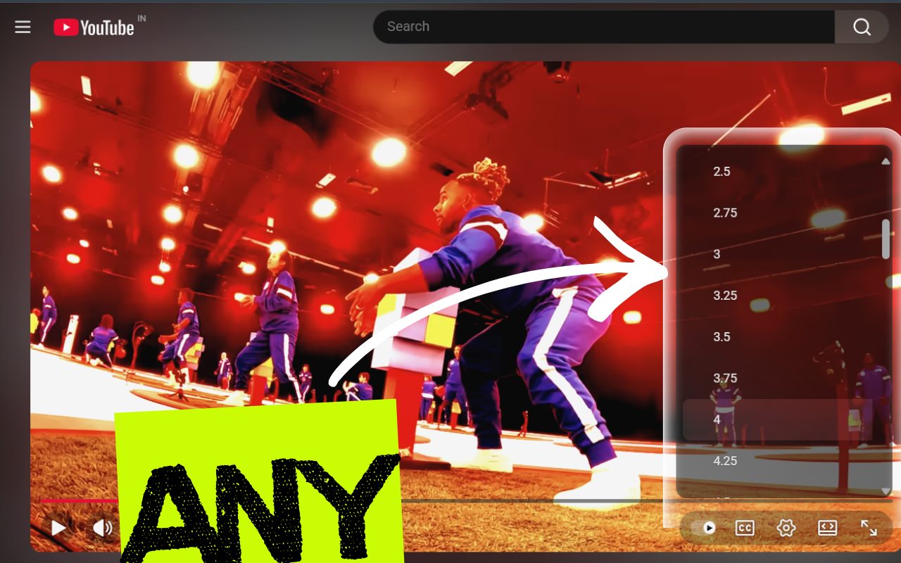
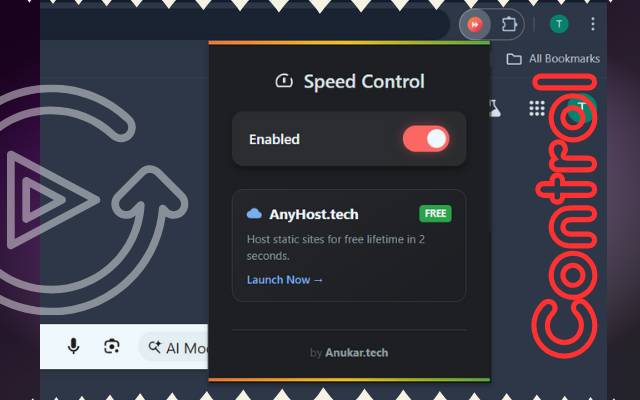

### 🎬 관련 영상
- [🎥 영상 보기](https://ph-files.imgix.net/87aaedf2-9b9b-4949-bac0-c1b48869aaae.jpeg?auto=format)

---

## 6. [Meal Planner](https://www.producthunt.com/products/meal-planner-macro-tracker?utm_campaign=producthunt-api&utm_medium=api-v2&utm_source=Application%3A+antigravity_test+%28ID%3A+258588%29)
**Votes**: 21 | **Tagline**: Embrace Healthy Lifestyle

### 📌 요약
작심삼일 식단 관리는 이제 그만! 'Meal Planner'는 칼로리 계산 스트레스 없이, 명확한 목표 설정과 체계적인 식단 기록을 돕는 심플하지만 강력한 건강 습관 빌더 템플릿입니다.

### 🔑 핵심 기능
- 🎯 Target Audience: 건강한 식습관을 시작하고 싶지만, 복잡한 칼로리 계산이나 계획 때문에 포기했던 사람(다이어터, 헬스 목표를 가진 사람, 만성적인 식단 관리 실패자).
- ✨ Key Differentiator: 단순히 칼로리를 세는 수동적 트래킹이 아니라, 혼란을 줄이고 명확한 목표 기반의 진전을 만들어내는 체계적인 '습관 형성'에 초점을 맞춘 템플릿/툴.
- 💡 Core Feature: 불확실성을 제거하고 명확하게 식단을 기록 및 추적할 수 있도록 설계되어, 장기적으로 지속 가능한 식습관 형성 과정을 지원.

### 📸 스크린샷 및 갤러리
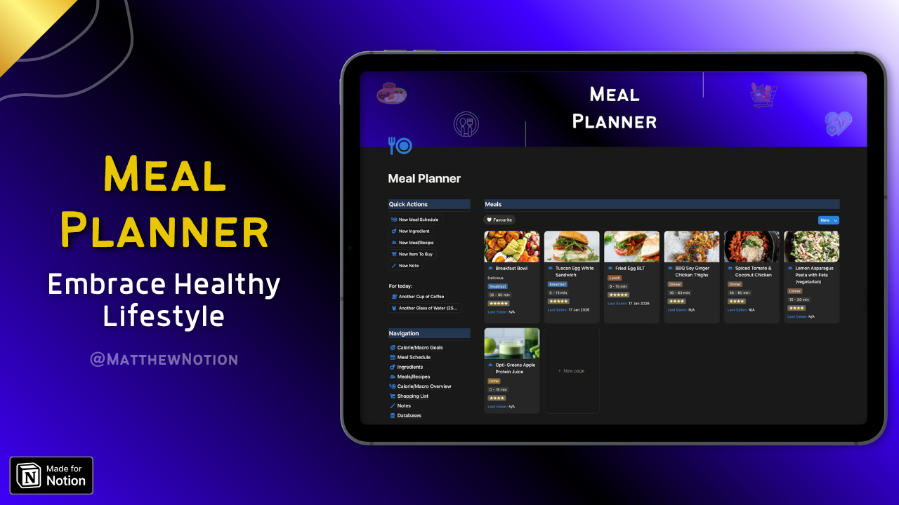
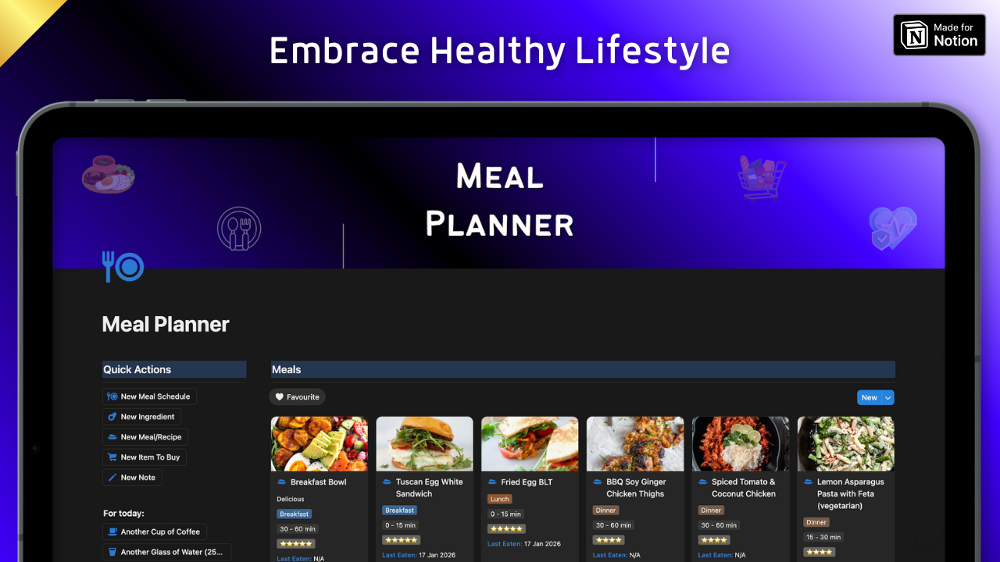

---

## 7. [TrendEdge](https://www.producthunt.com/products/trendedge?utm_campaign=producthunt-api&utm_medium=api-v2&utm_source=Application%3A+antigravity_test+%28ID%3A+258588%29)
**Votes**: 21 | **Tagline**: The Data Hedge Funds Pay Millions For - Now Yours

### 📌 요약
개미 투자자에게 기관급 퀀트 데이터와 알림을 제공하며, 엄격한 모의 트레이딩 훈련을 통해 시장의 '다음 움직임'을 미리 포착하게 해주는 개인 투자자 전용 비밀 병기입니다.

### 🔑 핵심 기능
- 🎯 Target Audience: 기관과의 정보 격차를 줄이고, 데이터 기반으로 매매 규율을 세우고 싶은 진지한 개인 투자자.
- ✨ Key Differentiator: 헤지펀드 전용이던 고가치 대체 데이터(Alt-Data) 시그널을 제공하는 것은 물론, 트레이딩 전 과정을 기록하고 분석하는 독자적인 '모의 트레이딩 및 훈련 시스템'을 결합했습니다.
- 💡 Core Feature: 규율(Discipline) 확립을 위한 '모의 트레이딩 & 자동 거래 일지'. 진입/청산 목표를 미리 설정하고 실패/성공 이유를 정확히 분석하여 감정적인 매매를 차단합니다.

### 📸 스크린샷 및 갤러리
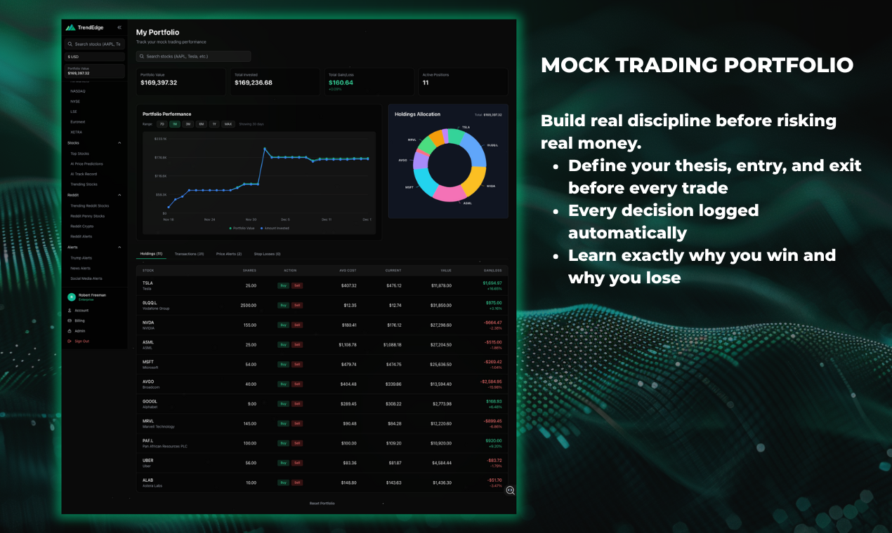
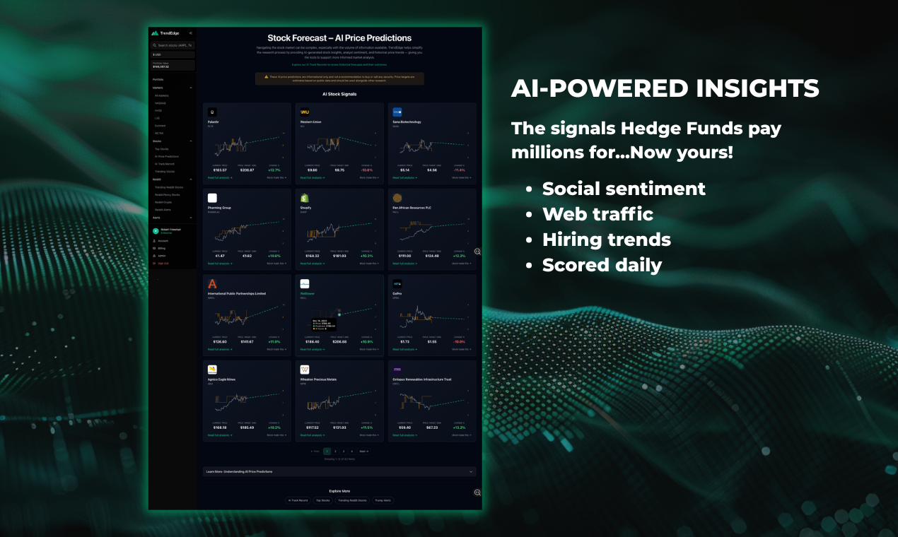
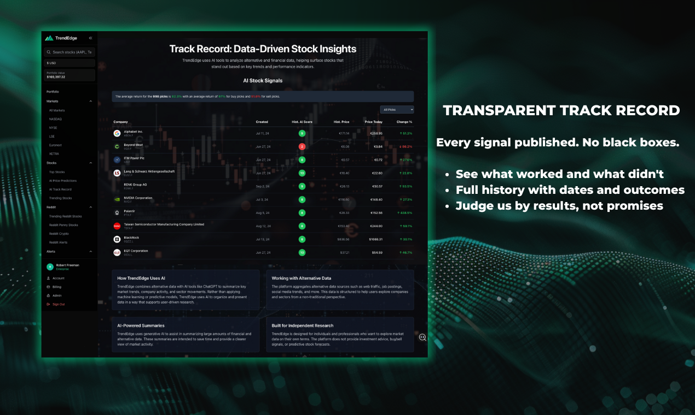

### 🎬 관련 영상
- [🎥 영상 보기](https://ph-files.imgix.net/44c6b2de-e83e-4c22-a908-831ec34db1a4.jpeg?auto=format)

---

## 8. [Whisk Automation](https://www.producthunt.com/products/whisk-automation?utm_campaign=producthunt-api&utm_medium=api-v2&utm_source=Application%3A+antigravity_test+%28ID%3A+258588%29)
**Votes**: 16 | **Tagline**:  Bulk AI image generation for Google Whisk AI

### 📌 요약
구글 Whisk AI 이미지를 대량 생산하고 싶은 크리에이터를 위한 치트키! 반복 작업을 CSV 업로드 한 방으로 끝내고, 안전하게 고속 스케일업을 지원하는 자동화 툴입니다.

### 🔑 핵심 기능
- 🎯 Target Audience: Etsy, 이커머스, 마이크로스톡 등 AI 이미지를 상업적으로 대량 생산해야 하는 크리에이터 및 셀러
- ✨ Key Differentiator: 단순한 매크로가 아닌, 계정 안전을 위한 '사람처럼 보이는' 작업 속도 조절 기능(Human-Mimic Timing) 및 끊김 없는 작업을 위한 백그라운드 복구 기능 지원
- 💡 Core Feature: CSV 파일을 통한 이미지 프롬프트 일괄 입력 및 PNG, JPG, WebP 자동 다운로드 기능

### 📸 스크린샷 및 갤러리
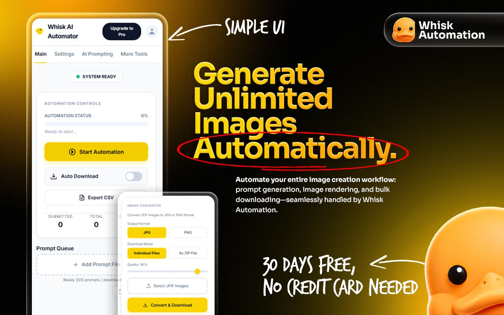
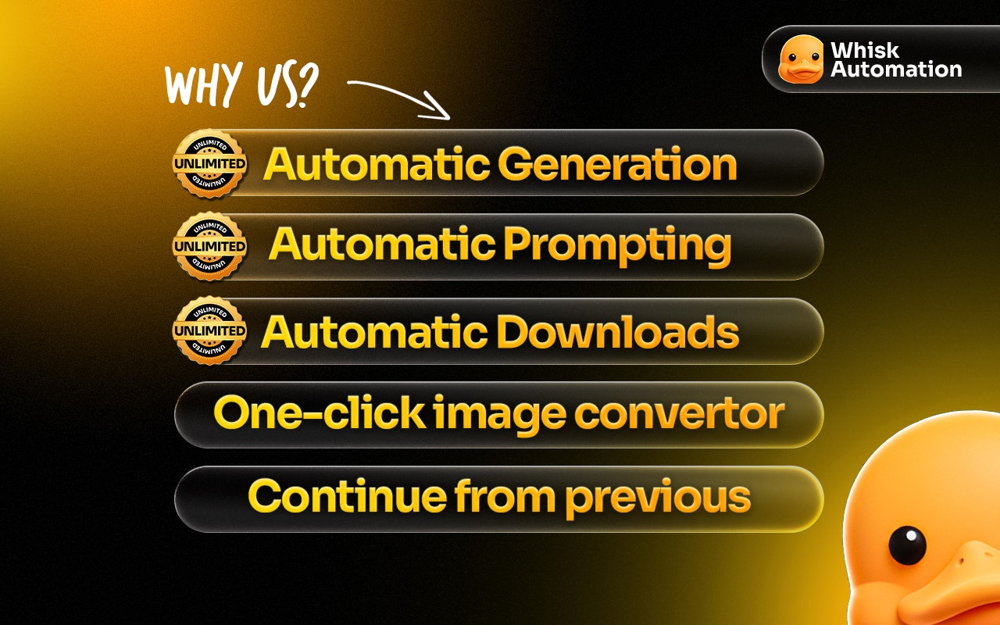
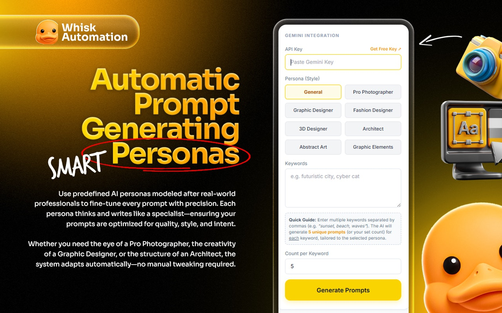

---

## 9. [Contractso ](https://www.producthunt.com/products/contractso-2?utm_campaign=producthunt-api&utm_medium=api-v2&utm_source=Application%3A+antigravity_test+%28ID%3A+258588%29)
**Votes**: 16 | **Tagline**: The Modern Standard for E-Signatures.

### 📌 요약
기존 PDF 계약서를 서명과 동시에 데이터까지 수집하는 '인터랙티브 계약서'로 변환해주는, 법적 안정성과 속도를 모두 잡은 차세대 전자서명 플랫폼입니다.

### 🔑 핵심 기능
- 🎯 Target Audience: 법적 효력이 확실한 전자서명과 동시에 데이터 수집이 필요한 기업(영업팀, 법무팀, HR 등) 및 에이전시.
- ✨ Key Differentiator: 단순히 서명만 받는 것을 넘어, 계약서에 체크박스/라디오 버튼을 넣어 서명 과정에서 데이터를 수집하고, 브랜딩 맞춤형(White-labeling) 인터페이스를 제공해 고객 신뢰도를 높일 수 있음.
- 💡 Core Feature: 은행 수준의 감사 추적(Audit Trail), SMS 2차 인증(2FA), 그리고 암호화 QR 검증 시스템을 통한 압도적인 법적 안정성 확보.

### 📸 스크린샷 및 갤러리
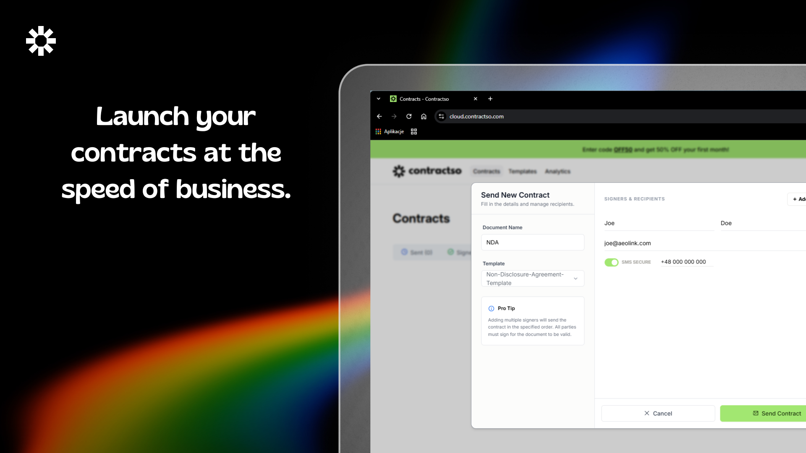
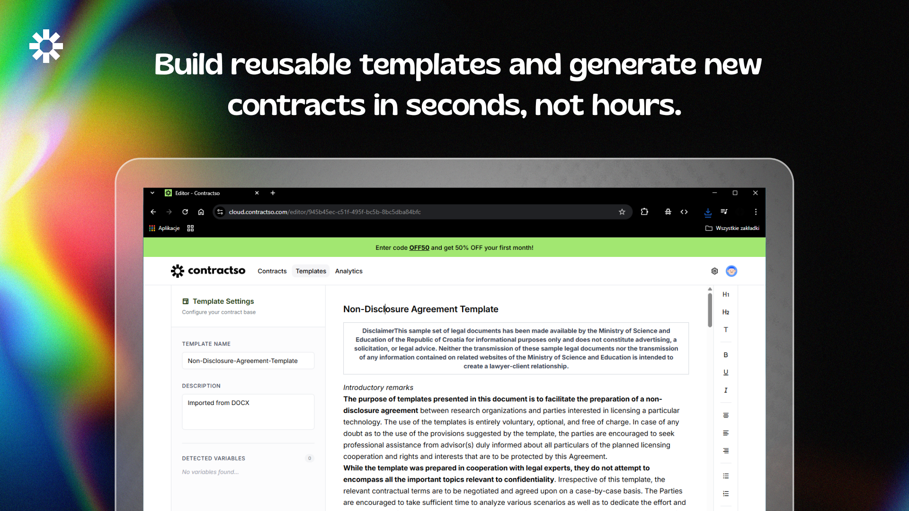
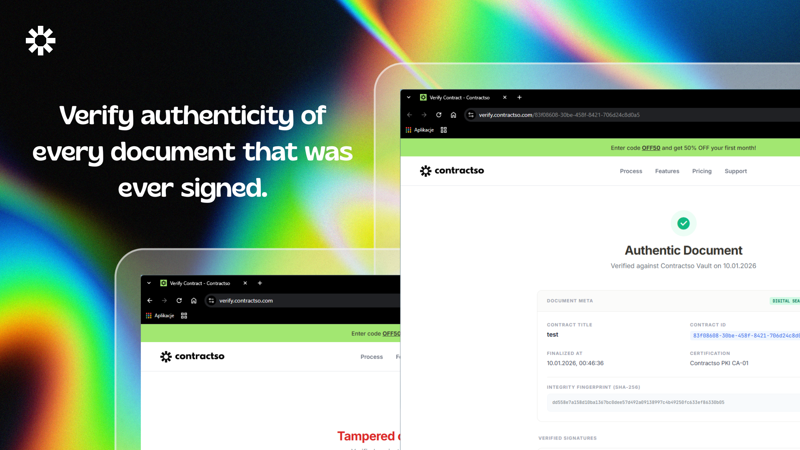

---

## 10. [PainPoints.fast](https://www.producthunt.com/products/painpoints-fast?utm_campaign=producthunt-api&utm_medium=api-v2&utm_source=Application%3A+antigravity_test+%28ID%3A+258588%29)
**Votes**: 15 | **Tagline**: Validate Your SaaS Idea with Real Pain Points

### 📌 요약
몇 달짜리 개발 삽질을 막아주는, 실제 고객의 비명(Pain Points)을 포착해 '이 아이디어, 돈이 될까?'를 데이터로 검증해주는 혁신적인 SaaS 아이디어 검증 플랫폼.

### 🔑 핵심 기능
- 🎯 Target Audience: 아이디어가 있지만 시장의 확신이 필요한 초기 단계 SaaS 창업가 및 제품 책임자.
- ✨ Key Differentiator: 개인의 편향(Bias)이나 설문 대신, Reddit/X/G2 등의 실제 대화 데이터를 분석하여 구축(Build) 또는 건너뛰기(Skip)를 명확하게 결정해주는 객관성.
- 💡 Core Feature: 아이디어에 대한 시장의 '시급성(Urgency)'과 '지불 의향(Willingness to Pay)'을 수치화하고, 실제 고객 인용구(Quote)를 포함한 상세 리포트 제공.

### 📸 스크린샷 및 갤러리
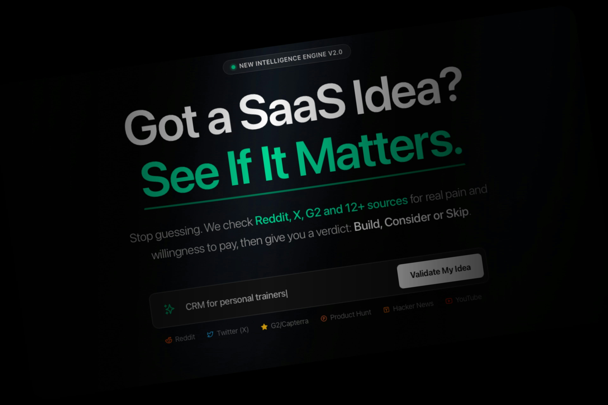
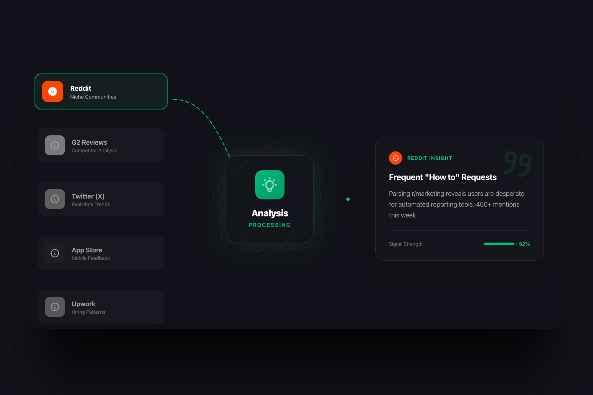
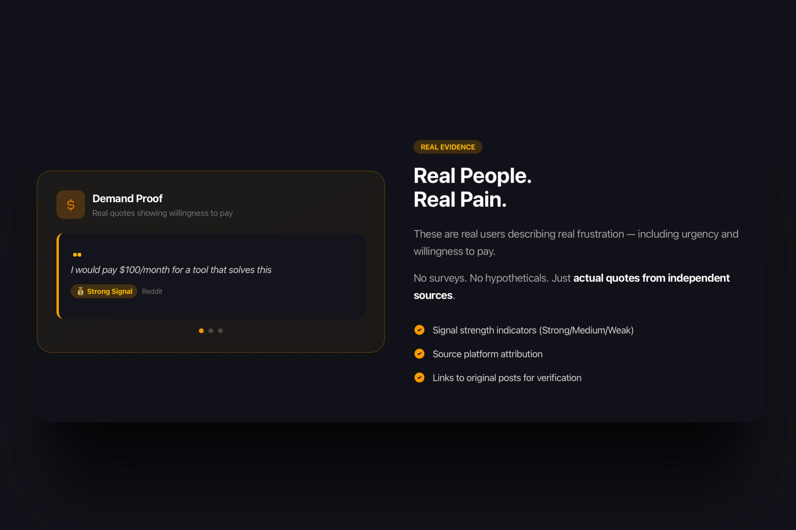

### 🎬 관련 영상
- [🎥 영상 보기](https://ph-files.imgix.net/e76cd13e-49ec-4051-817e-b8b26726e146.jpeg?auto=format)

---

