# 🚀 Product Hunt Daily Top 10 (2026-01-25)

## 1. [Thumbfa.st](https://www.producthunt.com/products/thumbfa-st?utm_campaign=producthunt-api&utm_medium=api-v2&utm_source=Application%3A+antigravity_test+%28ID%3A+258588%29)
**Votes**: 294 | **Tagline**: Midjourney for YouTube Thumbnails—your face, every time

### 📌 요약
내 얼굴은 기본, 원하는 레퍼런스 스타일을 즉시 반영하여 '미드저니급' 썸네일을 초고속으로 생성해주는 유튜브 전용 AI 툴, Thumbfa.st가 떴습니다.

### 🔑 핵심 기능
- 🎯 Target Audience: 유튜브 크리에이터, 썸네일 디자인에 시간이나 비용을 많이 쓰고 싶지 않은 1인 방송 진행자.
- ✨ Key Differentiator: 얼굴 학습 기반의 일관성 유지: 매번 새로운 썸네일을 만들 때도 사용자(크리에이터)의 얼굴을 일관성 있게 배치하며, 디자이너 대비 100배 저렴합니다.
- 💡 Core Feature: 텍스트 설명(Prompt)과 레퍼런스 썸네일만으로 미드저니급 고품질 썸네일 디자인을 즉시 무한 생성 및 반복 수정 가능.

### 📸 스크린샷 및 갤러리
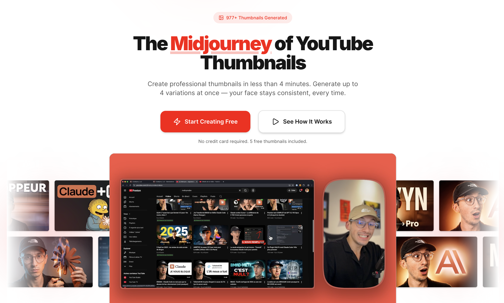
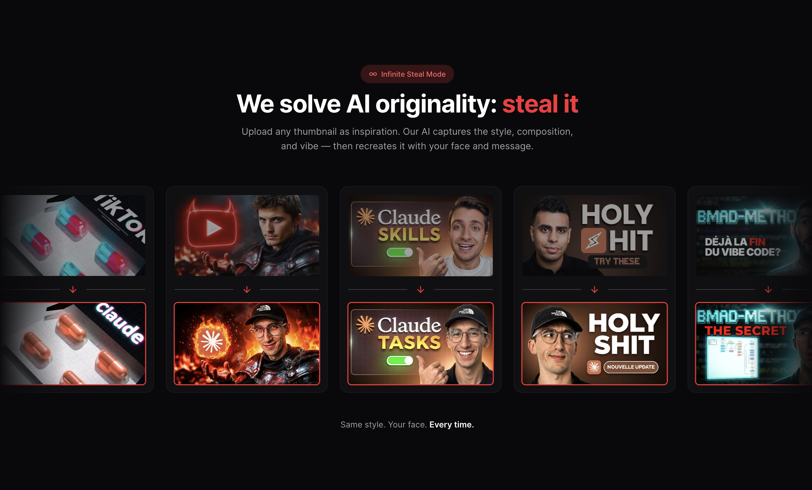
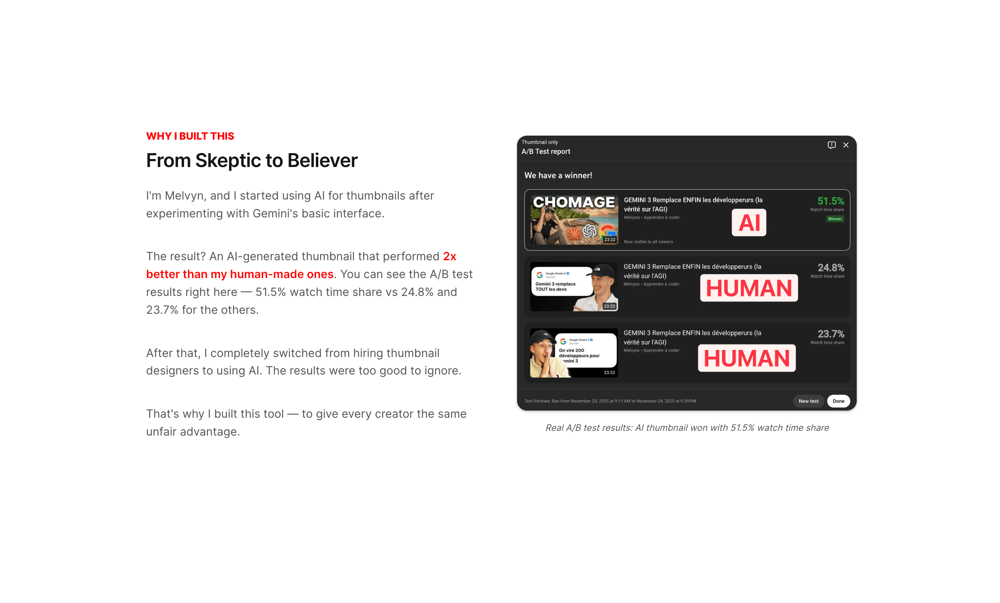

### 🎬 관련 영상
- [🎥 영상 보기](https://ph-files.imgix.net/003a2efb-6efb-48c2-b25a-066d5df16a95.jpeg?auto=format)

---

## 2. [Mochi Focus](https://www.producthunt.com/products/mochi-focus?utm_campaign=producthunt-api&utm_medium=api-v2&utm_source=Application%3A+antigravity_test+%28ID%3A+258588%29)
**Votes**: 227 | **Tagline**: Your focus timer that grows with you

### 📌 요약
귀여운 모찌 캐릭터를 레벨업 시키며 집중 습관을 기르는 신개념 게이미피케이션 뽀모도로 타이머, '모찌 포커스'가 론칭했습니다. 집중하면 모찌가 베이비에서 메가 모찌로 진화합니다.

### 🔑 핵심 기능
- 🎯 Target Audience: 집중력 유지에 어려움을 겪거나, 반복적인 목표 설정 및 귀여운 게이미피케이션 요소를 선호하는 사용자 및 학생.
- ✨ Key Differentiator: 단순히 시간을 재는 타이머를 넘어, 집중 시간에 비례하여 캐릭터(모찌)가 진화하고 레벨업하는 독특한 성장형 보상 시스템이 강력한 동기 부여를 제공합니다.
- 💡 Core Feature: 50 레벨과 4단계 진화 시스템을 통한 지속적인 목표 부여, 그리고 지정된 웹사이트를 차단하여 집중을 강제하는 방해 요소 차단 기능.

### 📸 스크린샷 및 갤러리
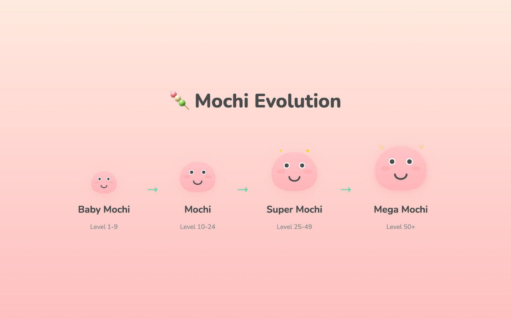
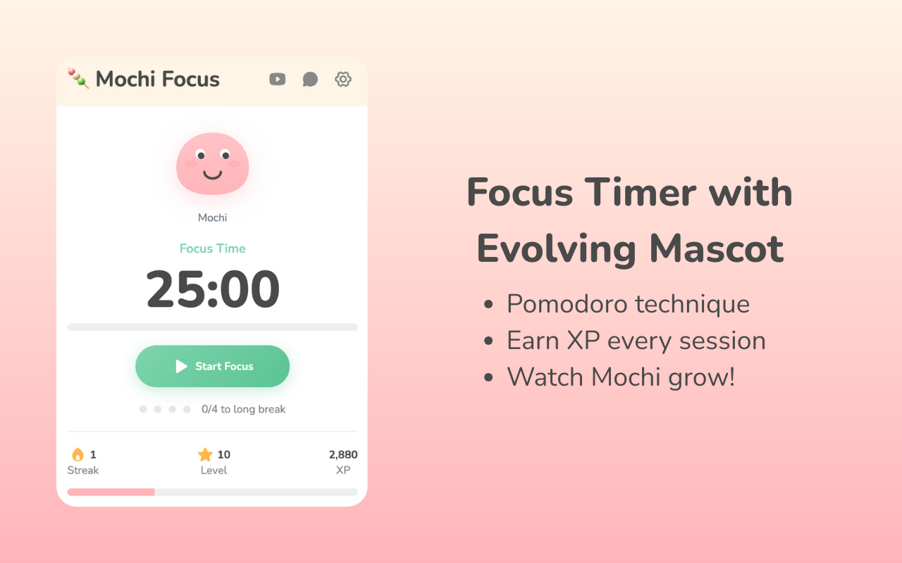
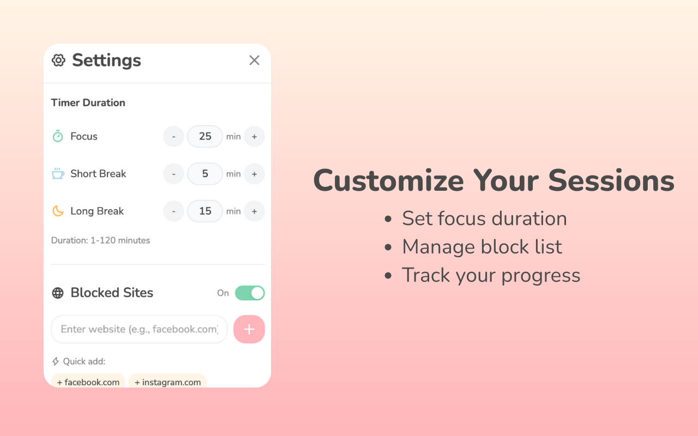

---

## 3. [Forums](https://www.producthunt.com/products/basehub?utm_campaign=producthunt-api&utm_medium=api-v2&utm_source=Application%3A+antigravity_test+%28ID%3A+258588%29)
**Votes**: 196 | **Tagline**: AI-powered Q&A for GitHub repositories.

### 📌 요약
GitHub 레포지토리에 대한 질문이 있을 때, AI가 코드를 복제(clone)하고 분석하여 소스 코드를 근거로 정확한 답변을 찾아주는, 개발자를 위한 혁신적인 Q&A 서비스입니다.

### 🔑 핵심 기능
- 🎯 Target Audience: GitHub 레포지토리를 자주 탐색하거나 새로운 프로젝트의 코드를 빠르게 이해해야 하는 개발자 및 엔지니어
- ✨ Key Differentiator: 기존 검색이나 문서화에 의존하지 않고, AI 에이전트가 실제 소스 코드를 탐색(explore)하고 grep하여 '코드 기반'의 검증된 답변을 제공합니다.
- 💡 Core Feature: AI가 사용자의 질문에 맞춰 해당 레포지토리의 소스 코드를 직접 분석하여 답변의 출처(소스 코드 위치)까지 함께 제공하는 기능

### 📸 스크린샷 및 갤러리
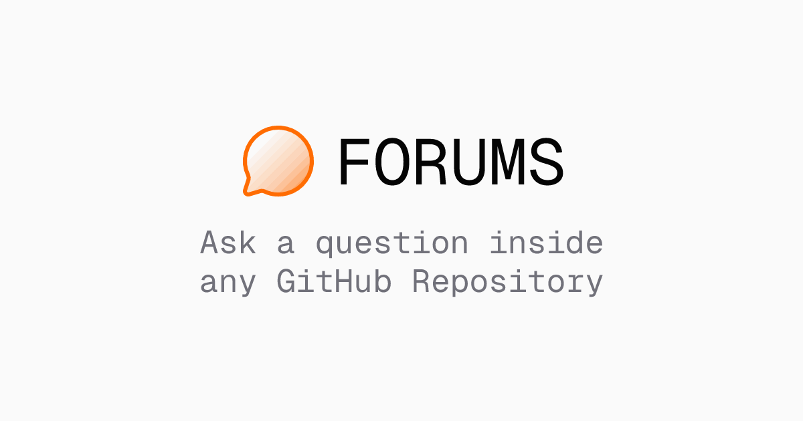
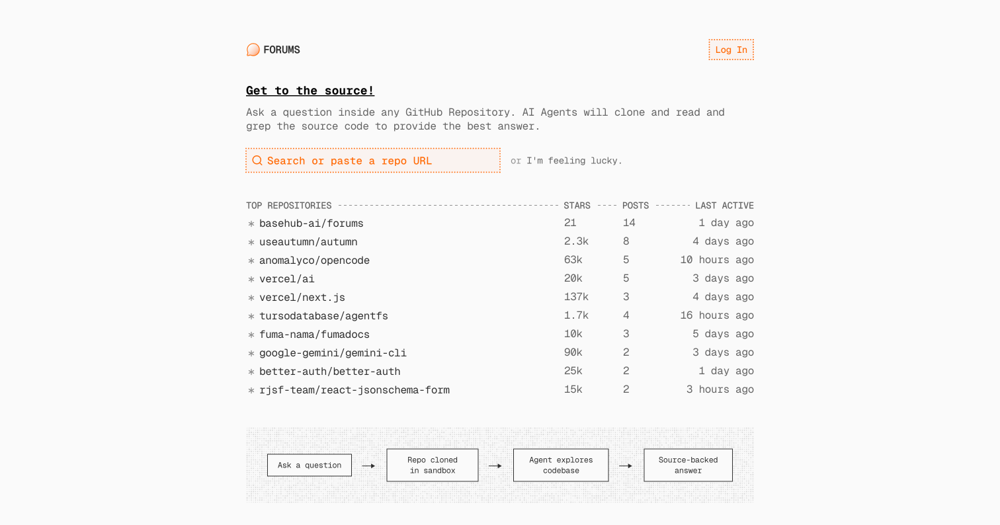
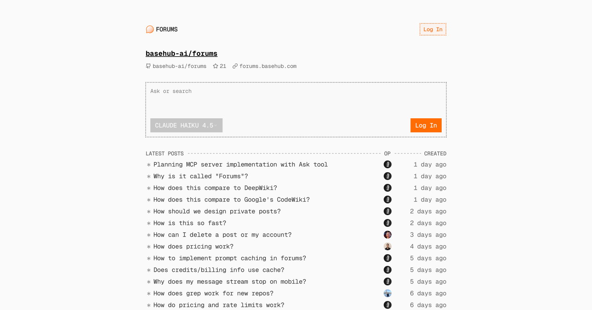

### 🎬 관련 영상
- [🎥 영상 보기](https://ph-files.imgix.net/9887cb10-6953-47bb-a7c6-f879618e65c8.jpeg?auto=format)

---

## 4. [Pola Browser](https://www.producthunt.com/products/pola-browser?utm_campaign=producthunt-api&utm_medium=api-v2&utm_source=Application%3A+antigravity_test+%28ID%3A+258588%29)
**Votes**: 182 | **Tagline**: Productivity, your way

### 📌 요약
맥 사용자들을 위한 '생산성 끝판왕' 브라우저가 떴습니다. Pola Browser는 확장 프로그램 지원은 물론, 멀티태스킹 최적화 기능들로 무장해 나만의 완벽한 작업 환경을 구축해 줍니다.

### 🔑 핵심 기능
- 🎯 Target Audience: 생산성을 중요시하며 커스터마이징된 작업 환경을 원하는 맥(Mac) 사용자들
- ✨ Key Differentiator: Bitwarden/Proton Pass 등 핵심 확장 프로그램 지원, 유려한 애니메이션과 테마를 갖춘 커스터마이징 가능한 인터페이스
- 💡 Core Feature: 몰입도를 높이고 작업 흐름을 방해하지 않는 '플로팅 탭(Floating Tabs)'과 '멀티 윈도우(Multi-Window)' 기능

### 📸 스크린샷 및 갤러리

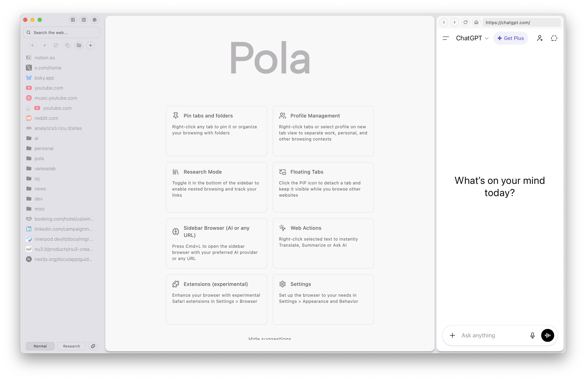
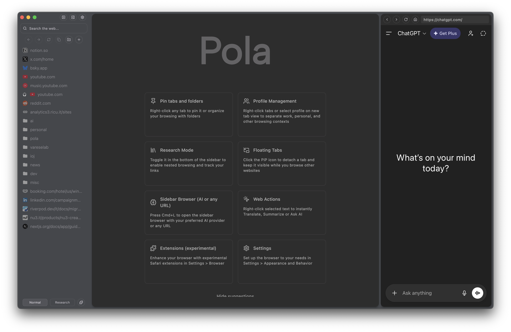

---

## 5. [Hyoi](https://www.producthunt.com/products/hyoi?utm_campaign=producthunt-api&utm_medium=api-v2&utm_source=Application%3A+antigravity_test+%28ID%3A+258588%29)
**Votes**: 141 | **Tagline**: A magical shelf that appears when you drag files on Mac

### 📌 요약
파일을 드래그하면 원하는 곳에 임시 보관함(선반)이 즉시 나타나는, 맥(Mac) 사용자를 위한 마법 같은 생산성 유틸리티, 효이(Hyoi)가 런칭했습니다. 복잡한 파일 이동 작업을 깔끔하게 처리하고 싶다면 필수입니다.

### 🔑 핵심 기능
- 🎯 Target Audience: 멀티태스킹 중 복잡한 파일/이미지/텍스트 드래그 앤 드롭 작업을 자주 하는 맥 사용자 (디자이너, 개발자, 콘텐츠 크리에이터 등)
- ✨ Key Differentiator: 데스크톱을 어지럽히지 않고, 드래그하는 순간 자동으로 나타나 파일을 임시 저장할 수 있는 유연하고 가벼운 플로팅 쉘프 제공.
- 💡 Core Feature: 파일/이미지/텍스트를 드래그하면 즉시 나타나 보관했다가, 필요할 때 다른 곳으로 쉽게 이동시킬 수 있는 '임시 보관 선반' 기능

### 📸 스크린샷 및 갤러리

---

## 6. [Liquid Timer v2](https://www.producthunt.com/products/liquidtimers?utm_campaign=producthunt-api&utm_medium=api-v2&utm_source=Application%3A+antigravity_test+%28ID%3A+258588%29)
**Votes**: 127 | **Tagline**: New styles, more customization and optimizes performance.

### 📌 요약
3천 명이 이미 쓴, 미니멀한 액체 시각화 타이머 'Liquid Timer v2'가 사용자 피드백을 반영해 성능과 디자인을 대폭 개선하고 돌아왔습니다. 집중력을 시각적으로 관리하고 싶은 분들에게 필수적인 업데이트입니다.

### 🔑 핵심 기능
- 🎯 Target Audience: 시간 관리가 필요한 학생, 개발자, 디자이너 등 집중력을 시각적으로 확인하고 싶은 모든 사용자.
- ✨ Key Differentiator: CPU 사용량을 획기적으로 줄여 시스템 부하 없이 작동하며, 전체 화면 몰입 모드 및 개별 타이머 설정(우클릭 메뉴) 기능을 추가해 사용 편의성을 극대화했습니다.
- 💡 Core Feature: 분/초 표시 선택 옵션과 새로운 '타이머 바' 스타일을 도입하여, 사용자가 원하는 방식으로 시간을 유연하게 설정하고 시각화할 수 있습니다.

### 📸 스크린샷 및 갤러리
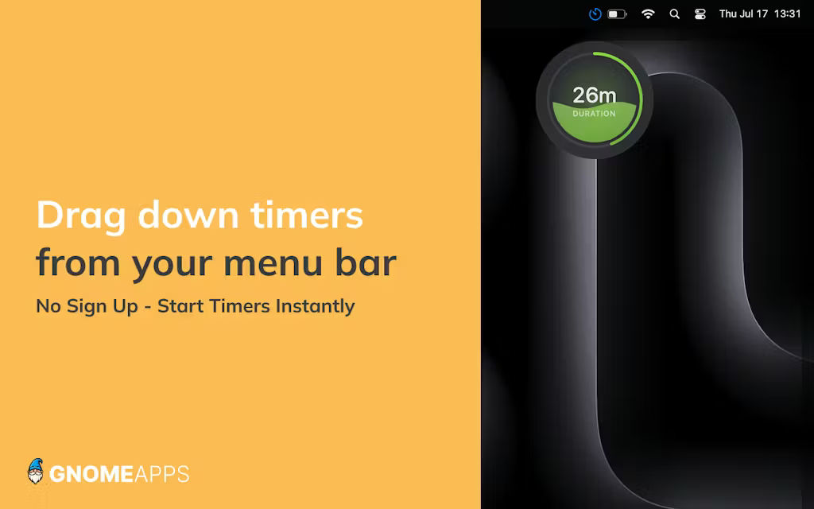
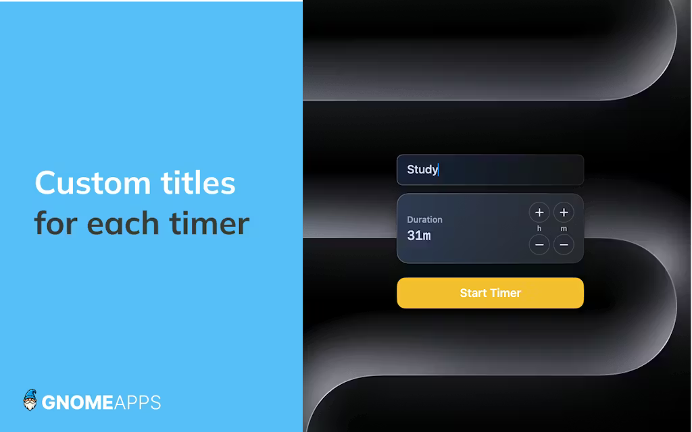
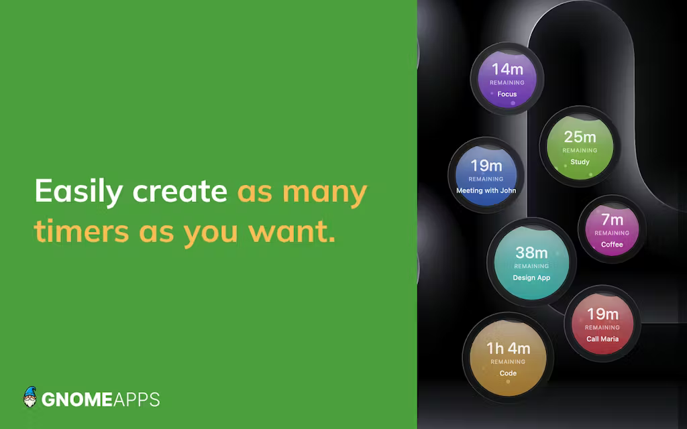

---

## 7. [Omia Studio](https://www.producthunt.com/products/omia-studio?utm_campaign=producthunt-api&utm_medium=api-v2&utm_source=Application%3A+antigravity_test+%28ID%3A+258588%29)
**Votes**: 20 | **Tagline**: Generate wireframes and real apps with AI + Python

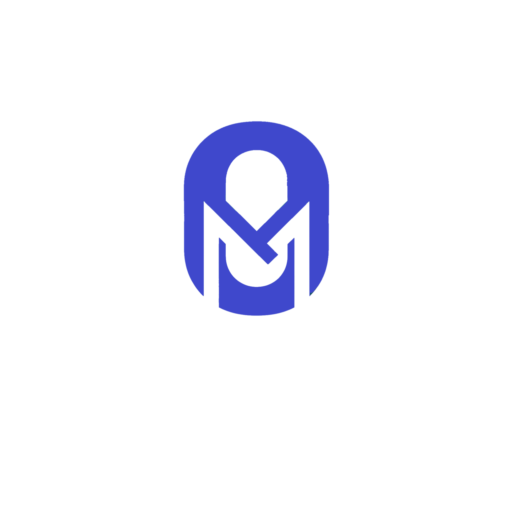

### 📌 요약
와이어프레임이나 간단한 프롬프트만 입력하면, AI가 프론트엔드를 조립해주고 개발자는 파이썬으로 백엔드만 붙여 바로 앱을 출시할 수 있는 'AI 네이티브 웹/모바일 앱 빌더'입니다.

### 🔑 핵심 기능
- 🎯 Target Audience: 빠른 프로토타이핑이 필요한 디자이너/PM, 파이썬 기반으로 앱을 빠르게 배포하고 싶은 풀스택 개발자.
- ✨ Key Differentiator: 기존 노코드/로우코드 툴과 달리, AI가 UI/UX를 자동으로 생성해주고 백엔드 코딩(Python)에 집중할 수 있도록 개발 워크플로우를 최적화했습니다.
- 💡 Core Feature: AI를 활용해 와이어프레임(또는 텍스트)을 실제 작동하는 깔끔한 프론트엔드 코드로 변환 및 생성.

### 📸 스크린샷 및 갤러리

### 🎬 관련 영상
- [🎥 영상 보기](https://ph-files.imgix.net/985275ec-6041-4c60-bfbf-4dde66ba5259.jpeg?auto=format)

---

## 8. [Hourlyo](https://www.producthunt.com/products/hourlyo?utm_campaign=producthunt-api&utm_medium=api-v2&utm_source=Application%3A+antigravity_test+%28ID%3A+258588%29)
**Votes**: 15 | **Tagline**: The all-in-one productivity workspace for solo professionals

### 📌 요약
프리랜서나 1인 기업가라면 놓친 돈이 없도록 청구 가능 시간을 실시간으로 추적하고 멋진 보고서(인보이스)까지 즉시 뽑아주는 초간편 올인원 솔루션, Hourlyo가 떴습니다.

### 🔑 핵심 기능
- 🎯 타겟 고객: 시간당 요금(Hourly Rate)으로 일하며 수익 관리에 어려움을 겪는 프리랜서, 컨설턴트 등 솔로 프로페셔널.
- ✨ 핵심 차별점: 복잡한 기능이나 불필요한 설정 없이, 시간 추적, 프로젝트 관리, 신속한 정산에 필요한 '핵심 기능'만 넣어 사용성이 극도로 심플함.
- 💡 핵심 기능: 시간을 기록하는 즉시 이를 전문적인 청구 보고서(인보이스)로 변환해주는 기능. 시간을 돈으로 바꾸는 자동화에 집중.

### 📸 스크린샷 및 갤러리

### 🎬 관련 영상
- [🎥 영상 보기](https://ph-files.imgix.net/e87e9317-ed66-417d-aae4-c31f69237016.jpeg?auto=format)

---

## 9. [PostEngageAI](https://www.producthunt.com/products/postengageai?utm_campaign=producthunt-api&utm_medium=api-v2&utm_source=Application%3A+antigravity_test+%28ID%3A+258588%29)
**Votes**: 9 | **Tagline**: Auto-reply to Instagram comments & DMs in your own voice

### 📌 요약
인스타그램 댓글과 DM을 놓쳐 잠재 고객을 잃을 일은 이제 끝입니다. PostEngageAI는 '나만의 말투'를 학습하여 24시간 대신 소통하고 판매로 연결해주는 AI 비서입니다.

### 🔑 핵심 기능
- 🎯 Target Audience: 인스타그램 참여(Engagement)를 실제 매출로 연결하고 싶은 콘텐츠 크리에이터, 코치, 비즈니스 운영자.
- ✨ Key Differentiator: 단순히 자동 응답이 아닌, 사용자(크리에이터)의 응답 방식을 학습하여 로봇처럼 들리지 않고 사람처럼 자연스럽게 대화하는 AI 기술.
- 💡 Core Feature: 24시간 실시간으로 댓글과 DM에 응답하며, '가격 문의', '링크 요청' 등 잠재 고객의 질문을 즉시 포착하고 대화로 전환하여 판매 기회 상실을 방지.

### 📸 스크린샷 및 갤러리

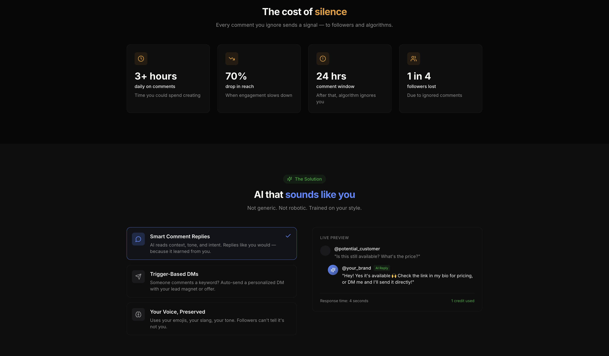

---

## 10. [ALGO - Interface for working with AI](https://www.producthunt.com/products/algo-interface-for-working-with-ai?utm_campaign=producthunt-api&utm_medium=api-v2&utm_source=Application%3A+antigravity_test+%28ID%3A+258588%29)
**Votes**: 9 | **Tagline**: Software for working with multiple AI systems and teamwork

### 📌 요약
ChatGPT, Claude, Gemini를 오가며 작업하는 시대는 끝! 300개 이상의 AI 모델을 한 곳에 모아 팀 공동 작업까지 지원하는 'AI 통합 작업 대시보드'가 등장했습니다.

### 🔑 핵심 기능
- 🎯 Target Audience: 여러 AI 모델을 동시에 활용하며 복잡한 프로젝트를 진행하는 팀 또는 기업 사용자
- ✨ Key Differentiator: 단순한 통합 뷰어를 넘어, 다양한 AI 모델의 데이터를 한 채팅창에서 융합하고, 실시간 팀 토론(Chat-in-Chat)이 가능한 협업 기능 제공
- 💡 Core Feature: DAPITA Mode (서로 다른 채팅 및 폴더의 데이터를 단일 채팅 또는 다중 모델에 한 번에 전송하여 데이터 기반 융합 작업 가능)

### 📸 스크린샷 및 갤러리
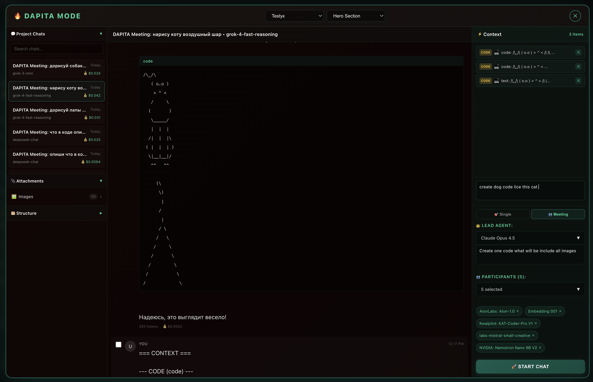

### 🎬 관련 영상
- [🎥 영상 보기](https://ph-files.imgix.net/fff229f4-e6aa-44c7-83a9-fb5f8315b9b1.gif?auto=format)

---

