# 🚀 Product Hunt Daily Top 10 (2026-01-26)

## 1. [Minara](https://www.producthunt.com/products/minara-ai?utm_campaign=producthunt-api&utm_medium=api-v2&utm_source=Application%3A+antigravity_test+%28ID%3A+258588%29)
**Votes**: 329 | **Tagline**: Research, plan, and invest in one chat

### 📌 요약
실시간 시장 분석부터 실제 온체인(On-chain) 투자 실행까지, 모든 과정을 하나의 AI 챗으로 끝내는 올인원 금융 투자 비서입니다.

### 🔑 핵심 기능
- 🎯 Target Audience: 시장 인사이트를 얻고 즉시 투자 실행까지 하고 싶은 얼리어답터 투자자와, 복잡한 리서치 및 거래를 자동화하고 싶은 헤비 트레이더.
- ✨ Key Differentiator: 단순 정보 제공에 그치지 않고, 복잡한 시장 정보를 선별(separate the wheat from the chaff)해 행동 가능한 인사이트를 주며, 대화 중 온체인 거래까지 즉시 실행 가능한 통합 솔루션 제공.
- 💡 Core Feature: 모니터링, 보고서, 규칙 기반 전략 등을 자동화하는 강력한 '워크플로우(Workflow)' 구축 기능.

### 📸 스크린샷 및 갤러리
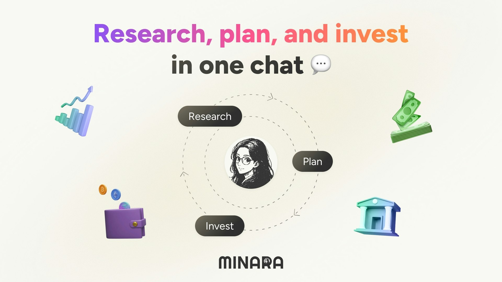
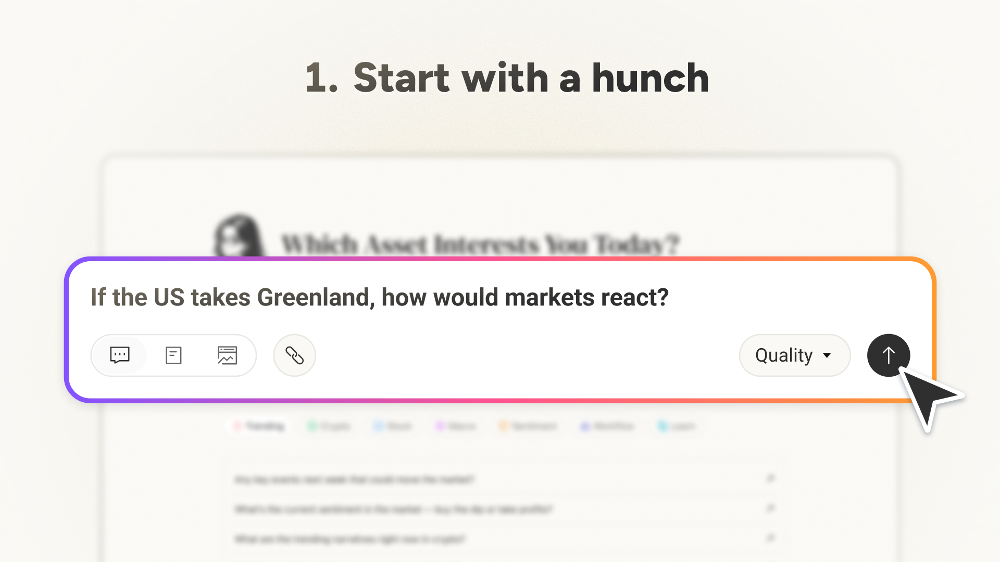

---

## 2. [Verdent](https://www.producthunt.com/products/verdent-deck?utm_campaign=producthunt-api&utm_medium=api-v2&utm_source=Application%3A+antigravity_test+%28ID%3A+258588%29)
**Votes**: 250 | **Tagline**: Your AI-native partner for the new way to build software

### 📌 요약
Verdent는 코딩에만 깊이 집중할 수 있도록 설계된 '챗봇 우선' AI 코딩 파트너로, 복잡한 코드 작업 속도를 높여 개발자가 창작에만 몰두하게 돕습니다.

### 🔑 핵심 기능
- 🎯 Target Audience: 코딩 과정에서 집중력을 높이고 싶거나, 기존 AI 어시스턴트의 복잡한 UI에 지친 소프트웨어 개발자.
- ✨ Key Differentiator: 불필요한 기능을 제거한 깔끔한 채팅 기반(chat-first) UX를 제공하며, 작업 시작 전 명확하게 질문하여 시간 낭비를 줄이고, 여러 작업을 동시에 처리할 수 있도록 설계됨.
- 💡 Core Feature: 코드에 어떤 변화가 있었는지 명확하게 시각화하여 보여줌으로써, AI가 생성하거나 수정한 코드를 개발자가 쉽게 검토하고 신뢰할 수 있도록 함.

### 📸 스크린샷 및 갤러리

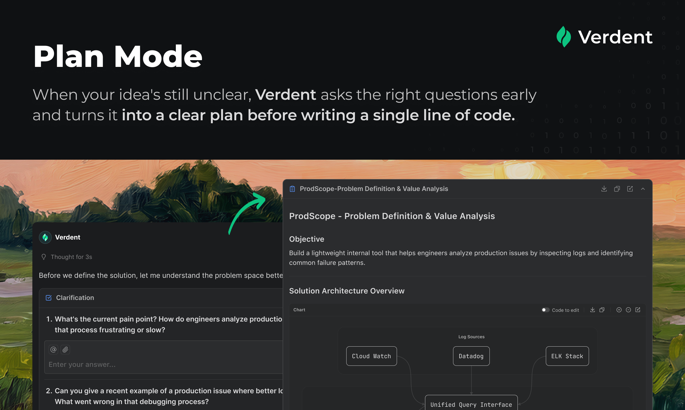
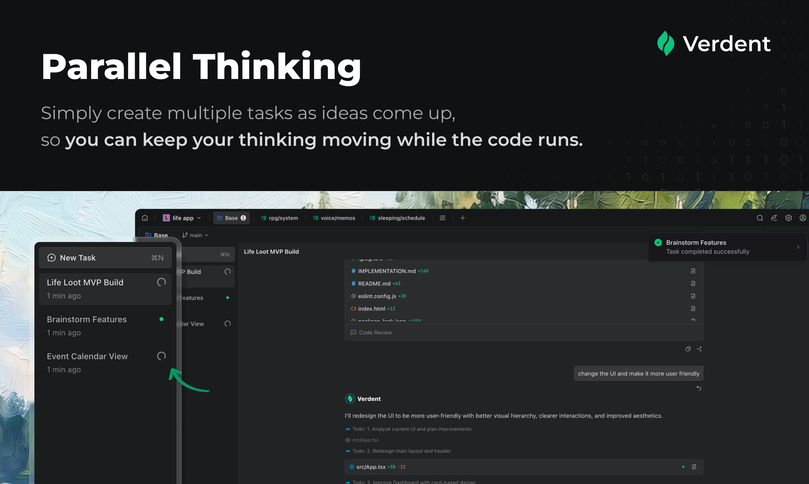

### 🎬 관련 영상
- [🎥 영상 보기](https://ph-files.imgix.net/50c9eeb5-0eae-4b6d-9149-58d01b6d262d.jpeg?auto=format)

---

## 3. [Cue](https://www.producthunt.com/products/cue-11?utm_campaign=producthunt-api&utm_medium=api-v2&utm_source=Application%3A+antigravity_test+%28ID%3A+258588%29)
**Votes**: 216 | **Tagline**: Schedule smarter. Post everywhere. Grow faster.

### 📌 요약
엑스부터 블루스카이, 스레드까지 8개 플랫폼 포스팅을 한 번에 끝내는 '소셜 미디어 통합 사령탑'입니다. AI가 최적의 시간을 찾아주고 플랫폼별 맞춤 콘텐츠까지 자동으로 생성해주는 '극강의 효율'이 핵심입니다.

### 🔑 핵심 기능
- 🎯 Target Audience: 여러 플랫폼에 걸쳐 콘텐츠를 확장해야 하지만, 엔터프라이즈급 비용과 복잡함이 부담스러운 '하이퍼-성장' 지향 크리에이터 및 스타트업.
- ✨ Key Differentiator: 최신 SNS (블루스카이, 스레드)까지 빠르게 통합 지원하는 광범위한 플랫폼 커버리지와, 플랫폼별 특성에 맞게 콘텐츠를 자동 최적화하는 기능.
- 💡 Core Feature: 사용자의 관여도(Engagement) 패턴을 분석해 플랫폼별 '황금 시간대'를 AI가 자동으로 포스팅하는 '스마트 오토 스케줄링'.

### 📸 스크린샷 및 갤러리
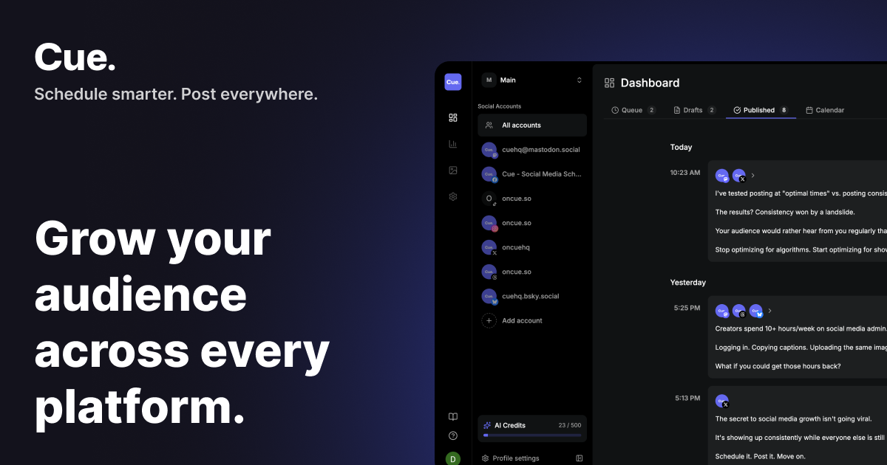
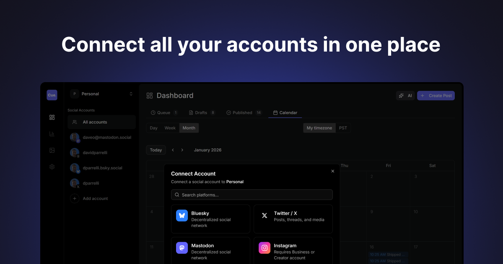

### 🎬 관련 영상
- [🎥 영상 보기](https://ph-files.imgix.net/bab61d08-92ef-4a31-99ce-759a7a90032d.jpeg?auto=format)

---

## 4. [JDoodle.ai 2.0](https://www.producthunt.com/products/jdoodle-ai?utm_campaign=producthunt-api&utm_medium=api-v2&utm_source=Application%3A+antigravity_test+%28ID%3A+258588%29)
**Votes**: 211 | **Tagline**: Clone websites and Figma designs into editable sites

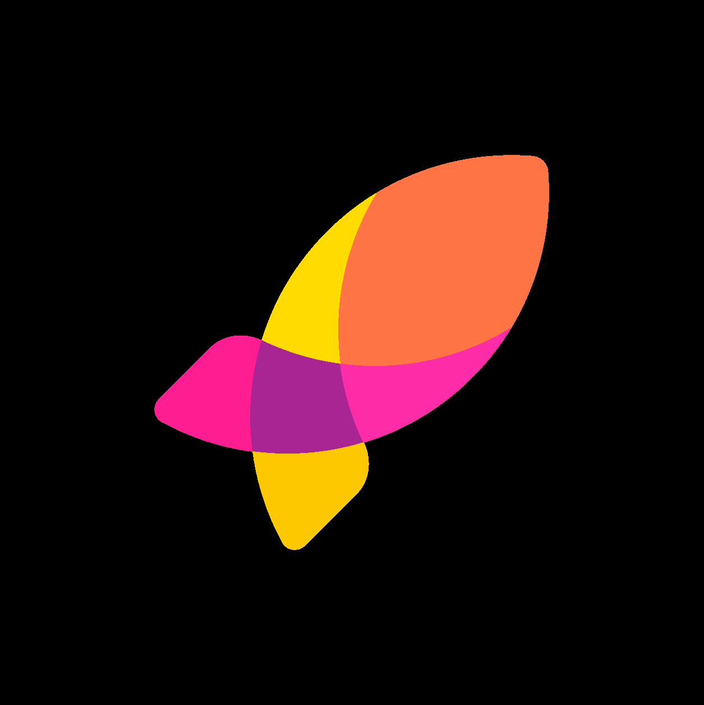

### 📌 요약
마음에 드는 웹사이트나 피그마 디자인을 붙여넣기만 하면, 즉시 수정 가능한 웹사이트 제작 템플릿으로 변환해주는 AI 기반 웹사이트 복제 툴입니다.

### 🔑 핵심 기능
- 🎯 Target Audience: 제로베이스 코딩 없이 빠르고 효율적으로 웹사이트를 구축하려는 디자이너, 마케터, 스타트업 창업가.
- ✨ Key Differentiator: 기존 사이트나 디자인 이미지를 '시작점'으로 활용하여 처음부터 만드는 시간을 획기적으로 줄여주며, 코딩 없이도 레이아웃과 스타일을 자유롭게 수정할 수 있습니다.
- 💡 Core Feature: 웹사이트 URL 또는 이미지/피그마 디자인 업로드를 통한 '편집 가능한 웹사이트 클론' 생성 기능 및 내장 DB, 자동 버그 수정 제공.

### 📸 스크린샷 및 갤러리
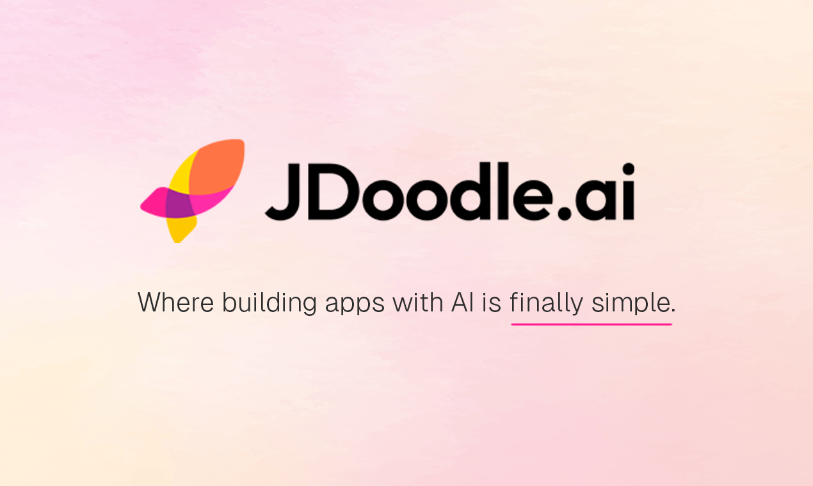
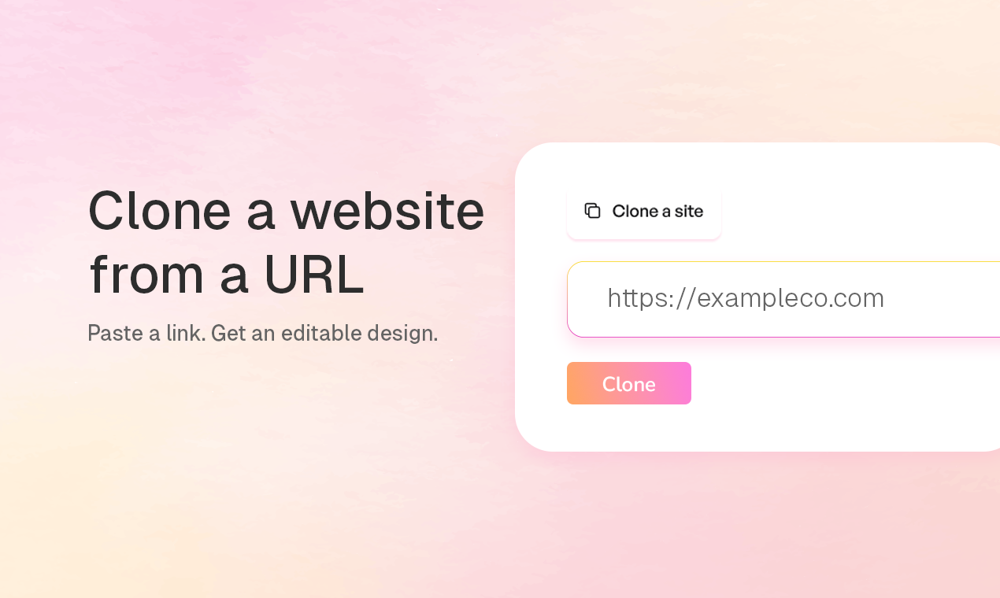
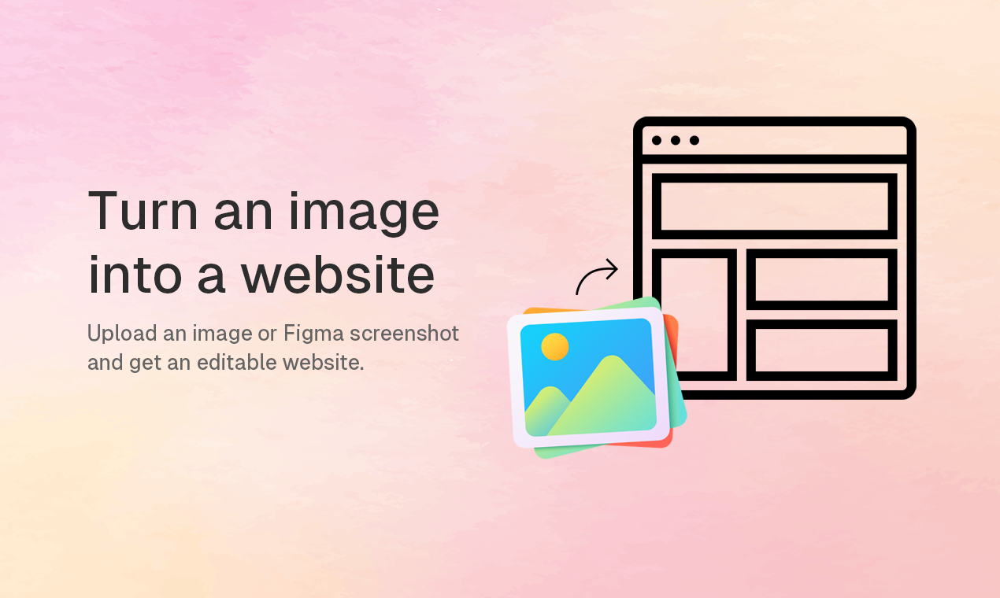

### 🎬 관련 영상
- [🎥 영상 보기](https://ph-files.imgix.net/e735b57e-a13f-4794-9577-0b12adc90635.jpeg?auto=format)

---

## 5. [PingPolls v1.0](https://www.producthunt.com/products/pingpolls?utm_campaign=producthunt-api&utm_medium=api-v2&utm_source=Application%3A+antigravity_test+%28ID%3A+258588%29)
**Votes**: 142 | **Tagline**: AI Forms that feel natural, not just conversational.

### 📌 요약
딱딱한 설문조사를 자연스러운 대화처럼 바꿔주는 AI 챗봇형 폼 빌더, 'PingPolls'가 론칭했습니다. 기존의 지루한 입력 방식 대신 AI 음성 메모와 메시징 UI를 도입해 응답률을 극적으로 높이는 데 초점을 맞췄습니다.

### 🔑 핵심 기능
- 🎯 Target Audience: 높은 응답률과 깊이 있는 고객 선호도 분석이 필요한 마케터, UX 리서처, 인사 담당자.
- ✨ Key Differentiator: 단순히 대화형을 넘어선 '자연스러운' UI와, 응답자의 깊은 선호도를 측정하는 독점 분석 지표 'Certiscore™' 제공.
- 💡 Core Feature: 복잡한 데이터 분석 대신 AI와 직접 대화하며 결과를 해석할 수 있는 'Ask AI' 기능.

### 📸 스크린샷 및 갤러리

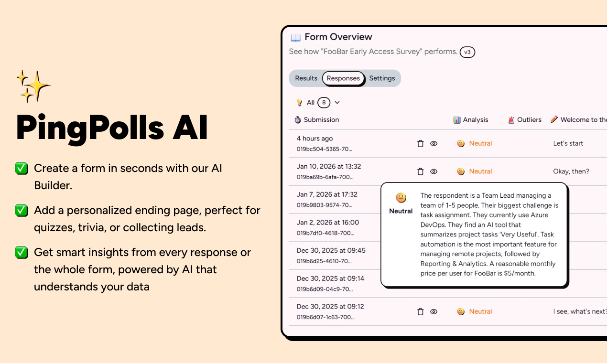

### 🎬 관련 영상
- [🎥 영상 보기](https://ph-files.imgix.net/01d826b3-7a0b-48e9-858d-2ad3d4d5bdbf.jpeg?auto=format)

---

## 6. [Screentell](https://www.producthunt.com/products/screentell?utm_campaign=producthunt-api&utm_medium=api-v2&utm_source=Application%3A+antigravity_test+%28ID%3A+258588%29)
**Votes**: 134 | **Tagline**: A in-browser screen recorder featuring cinematic 3D effects

### 📌 요약
지루한 제품 데모는 이제 그만! 무설치 브라우저 환경에서 스튜디오급 시네마틱 3D 효과를 입혀 압도적인 퀄리티의 화면 녹화 영상을 만들 수 있는 올인원 도구, '스크린텔'이 등장했습니다.

### 🔑 핵심 기능
- 🎯 Target Audience: 전문적인 퀄리티의 제품 데모나 튜토리얼 영상을 빠르고 쉽게 제작하려는 PM, 마케터, 콘텐츠 크리에이터.
- ✨ Key Differentiator: 무거운 프로그램을 설치할 필요 없이(Zero Install), 웹 브라우저만으로 시네마틱 3D 효과와 스티커 주석을 즉시 추가할 수 있음.
- 💡 Core Feature: 녹화, 편집, 내보내기까지 복잡한 과정 없이 브라우저 탭 하나에서 완성되는 초간편 올인원(All-in-One) 워크플로우.

### 📸 스크린샷 및 갤러리
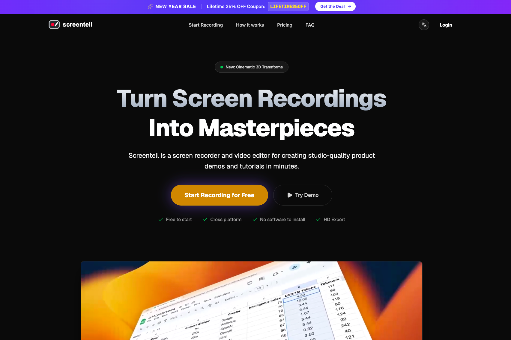
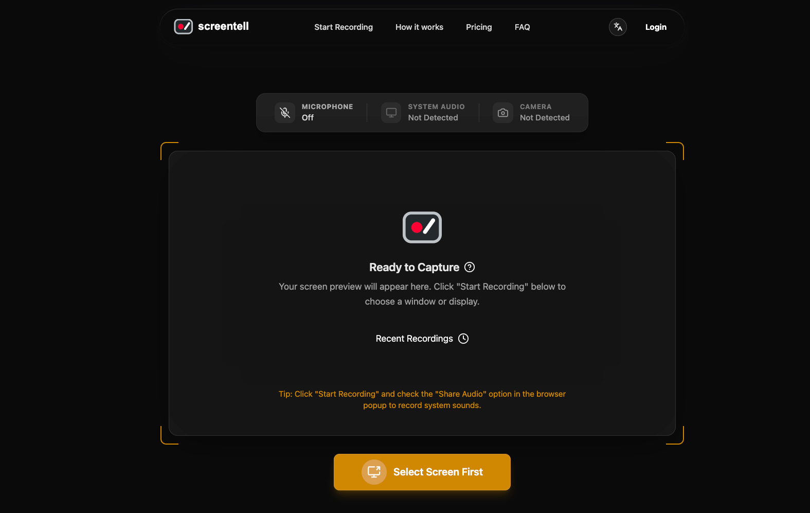
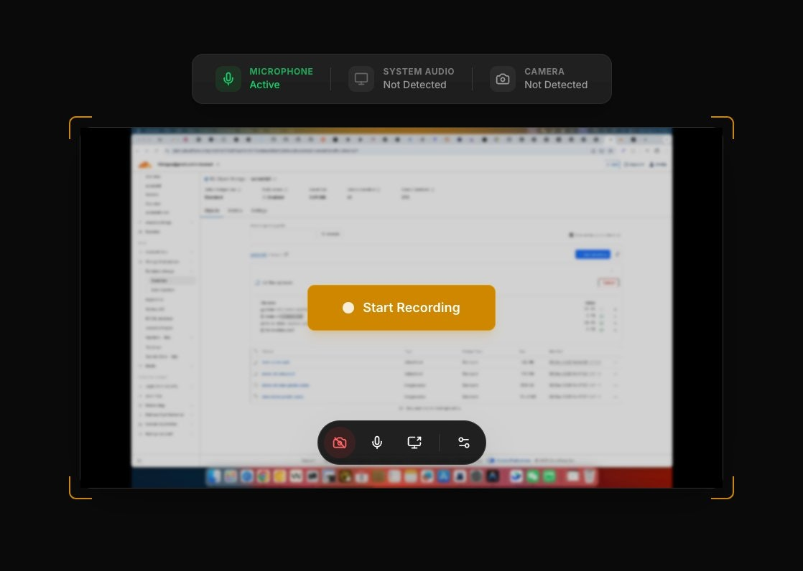

### 🎬 관련 영상
- [🎥 영상 보기](https://ph-files.imgix.net/21d2c93a-001c-4202-9b1a-b3d2b9990256.jpeg?auto=format)

---

## 7. [Reactive Resume v5](https://www.producthunt.com/products/reactive-resume?utm_campaign=producthunt-api&utm_medium=api-v2&utm_source=Application%3A+antigravity_test+%28ID%3A+258588%29)
**Votes**: 123 | **Tagline**: A free and open-source resume builder.

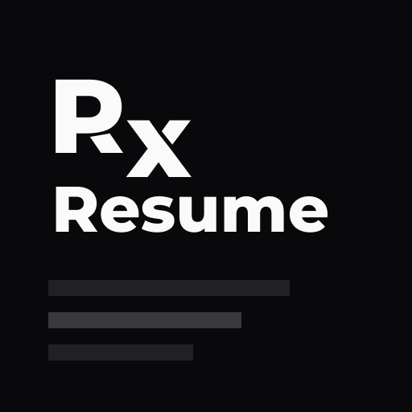

### 📌 요약
무료로 이력서를 만들고 관리할 수 있는 오픈소스 툴의 끝판왕, 'Reactive Resume'이 v5로 돌아왔습니다. 쉽고 간편하게 이력서 고민을 해결해 줄 필수 유틸리티입니다.

### 🔑 핵심 기능
- 🎯 Target Audience: 취준생, 이직을 준비하는 경력직, 그리고 디자인이나 유료 서비스에 얽매이지 않고 깔끔한 이력서를 원하는 모든 사용자.
- ✨ Key Differentiator: 완전히 '무료'이며 '오픈소스'로 제공되어 유료 서비스의 제약 없이 커뮤니티 기반으로 지속적인 개선이 이루어집니다.
- 💡 Core Feature: 생성-업데이트-공유 과정이 직관적이며, 특히 이력서 버전 관리와 간편한 공유 기능이 핵심입니다.

### 📸 스크린샷 및 갤러리
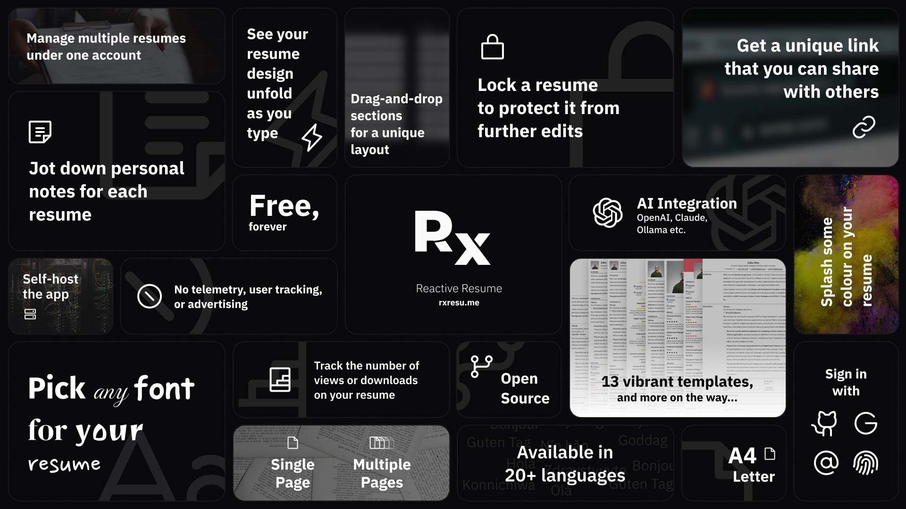
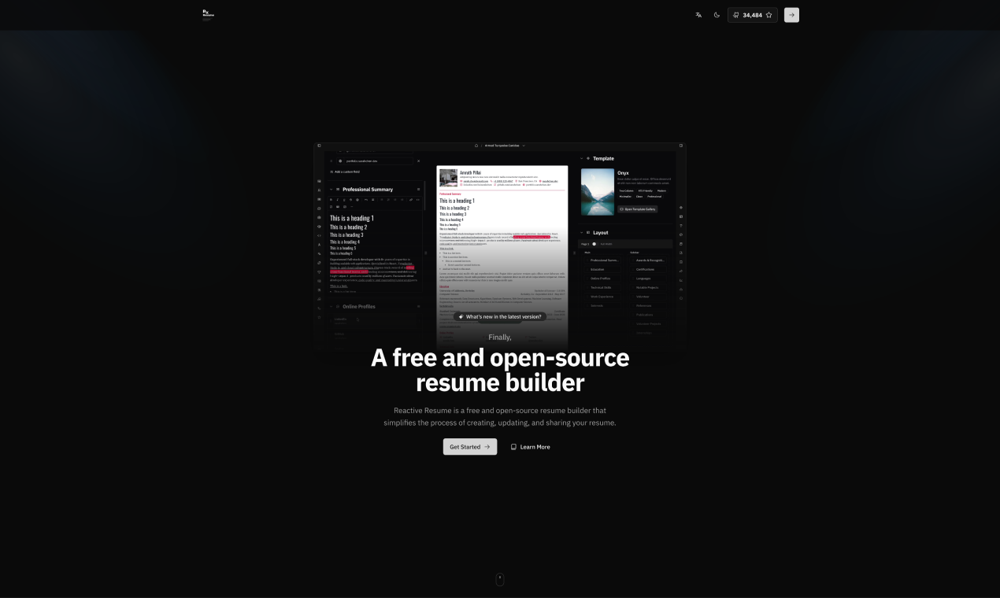
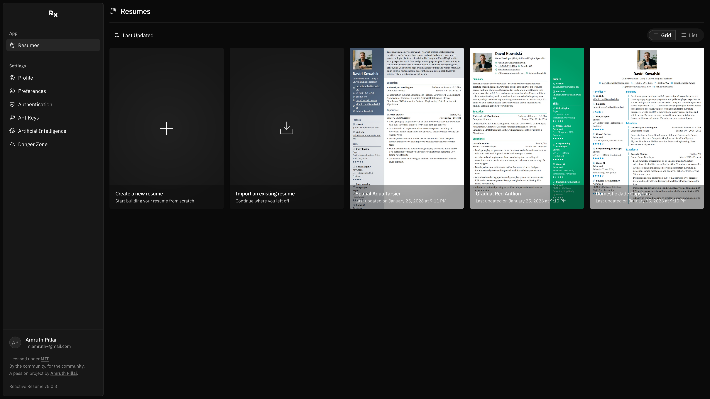

### 🎬 관련 영상
- [🎥 영상 보기](https://ph-files.imgix.net/5aff5407-6539-4c01-a778-3e6ff2383c86.jpeg?auto=format)

---

## 8. [HeyTraders](https://www.producthunt.com/products/heytraders?utm_campaign=producthunt-api&utm_medium=api-v2&utm_source=Application%3A+antigravity_test+%28ID%3A+258588%29)
**Votes**: 116 | **Tagline**: Personal AI quant research & backtest with natural language

### 📌 요약
말로만 설명하면 AI가 자동으로 암호화폐 퀀트 전략을 짜주고, 바로 백테스팅까지 해주는 '개인 맞춤형 AI 트레이딩 연구소'입니다.

### 🔑 핵심 기능
- 🎯 Target Audience: 직관적 판단 대신 데이터 기반 전략을 원하는 개인 암호화폐 트레이더 및 투자자
- ✨ Key Differentiator: 복잡한 차트나 코딩 없이, 자연어(일상 언어)만으로 전략 생성 및 즉시 검증 가능
- 💡 Core Feature: 사용자 요청을 AI가 이해하여 검증 가능한 트레이딩 전략으로 변환하고, 즉시 백테스팅 데이터 제공

### 📸 스크린샷 및 갤러리
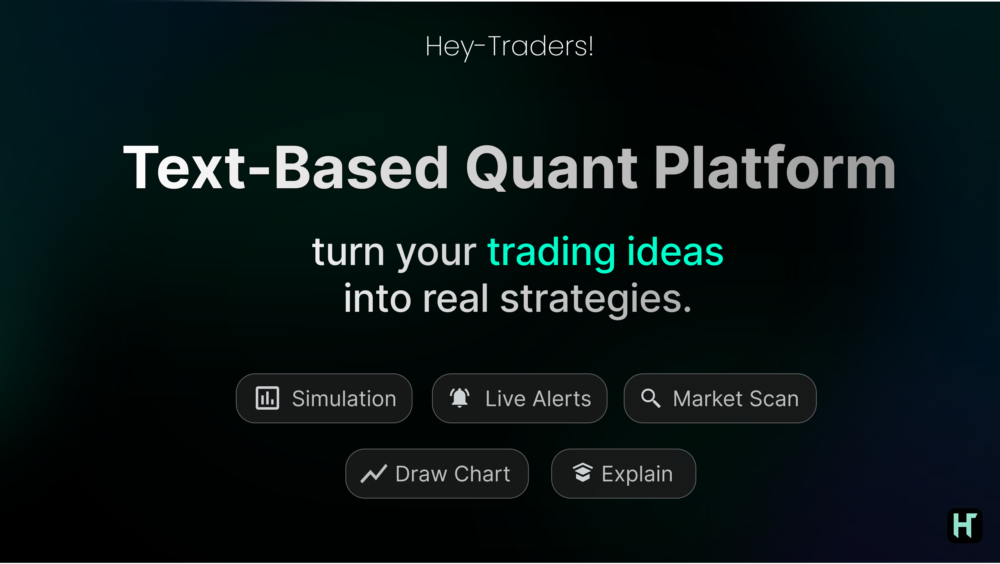
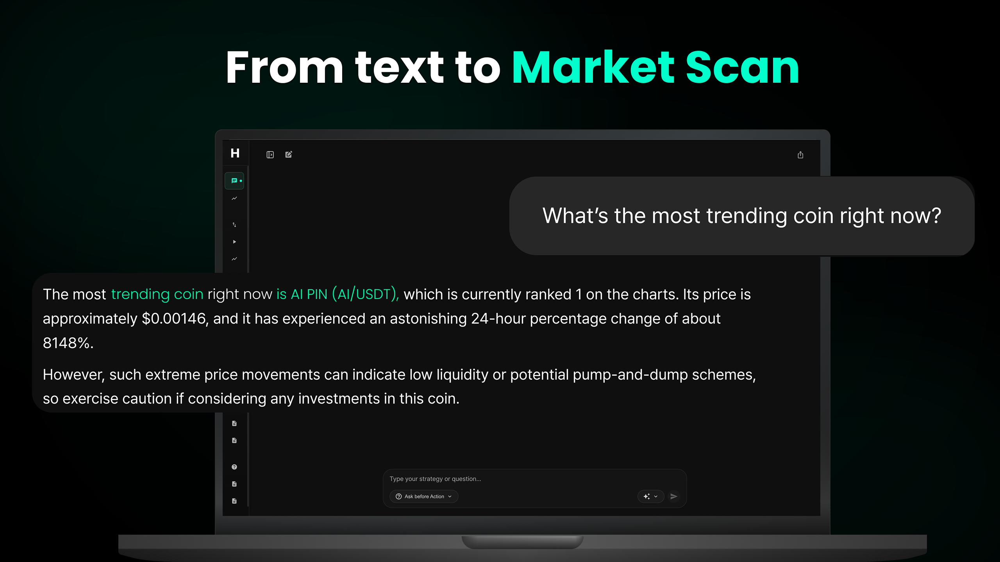
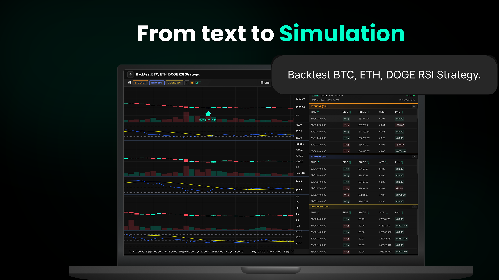

### 🎬 관련 영상
- [🎥 영상 보기](https://ph-files.imgix.net/232c16e8-2ea3-4747-8261-93baa2a1c5f4.jpeg?auto=format)

---

## 9. [Doctective](https://www.producthunt.com/products/doctective?utm_campaign=producthunt-api&utm_medium=api-v2&utm_source=Application%3A+antigravity_test+%28ID%3A+258588%29)
**Votes**: 110 | **Tagline**: Stop Updating Documentation. We Do It Accurately For You.

### 📌 요약
코드만 짜면 문서 업데이트는 평생 신경 쓸 필요 없게 만드는, 개발팀을 위한 자동 문서화 솔루션 '닥터텍티브(Doctective)'가 떴습니다.

### 🔑 핵심 기능
- 🎯 Target Audience: 오래된 문서와 씨름하는 개발자, 기술 문서 작성에 드는 리소스를 줄이고 싶은 엔지니어링 리더 및 CTO.
- ✨ Key Differentiator: 코드가 변경될 때마다 수동으로 문서를 업데이트해야 하는 기존 방식과 달리, '닥터텍티브'는 설치 한 번으로 문서가 코드와 함께 항상 최신 상태를 유지하도록 자동으로 동기화합니다.
- 💡 Core Feature: 코드베이스를 분석하여 API 설명서, 사용자 가이드 등 모든 기술 문서를 정확하게 생성하고, 코드가 변경될 경우 문서의 해당 섹션을 즉시 수정하는 '영구 자동 업데이트' 기능.

### 📸 스크린샷 및 갤러리
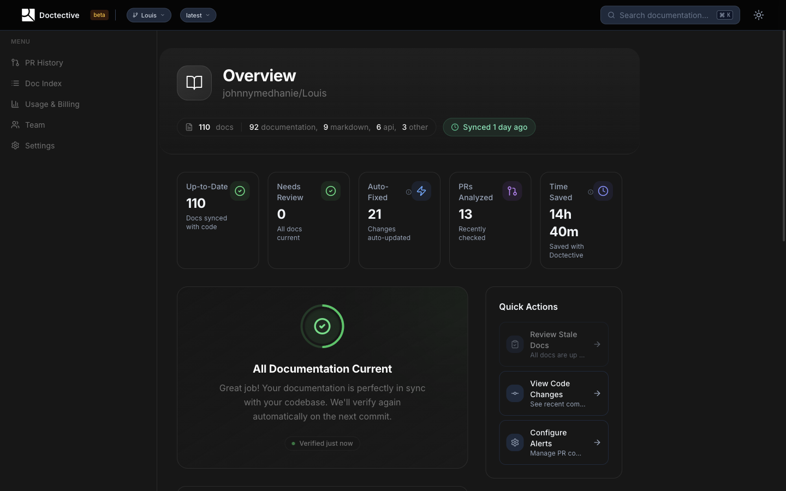
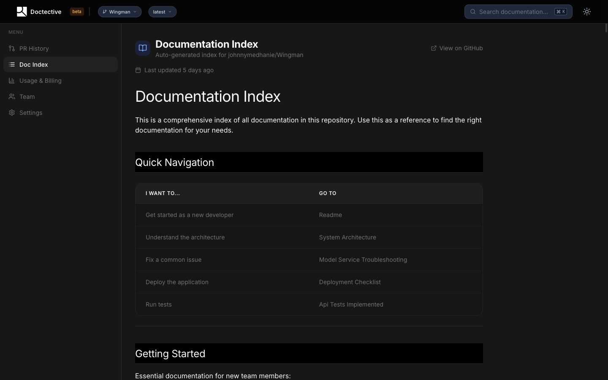

### 🎬 관련 영상
- [🎥 영상 보기](https://ph-files.imgix.net/07770c66-c78b-4b89-99a3-a115971c34c6.jpeg?auto=format)

---

## 10. [iPhotron](https://www.producthunt.com/products/iphotron?utm_campaign=producthunt-api&utm_medium=api-v2&utm_source=Application%3A+antigravity_test+%28ID%3A+258588%29)
**Votes**: 106 | **Tagline**: A macOS Photos–style photo manager for Windows 

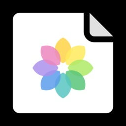

### 📌 요약
윈도우에서도 맥 '사진 앱'처럼 빠르고 비파괴적인 사진 관리가 가능합니다. HEIC/Live Photo까지 완벽 지원하는 폴더 기반 로컬 사진 앨범 매니저, iPhotron을 소개합니다.

### 🔑 핵심 기능
- 🎯 Target Audience: 윈도우 사용자 중 아이폰(HEIC/Live Photo) 또는 고화질 사진 파일(MOV)을 정리하고 싶지만, 무거운 클라우드 서비스나 복잡한 전문 앱은 싫은 사용자.
- ✨ Key Differentiator: 윈도우에서 '맥 사진 앱'의 강력한 성능과 UI를 구현했습니다. 특히 파일 원본을 건드리지 않는 비파괴 편집(non-destructive) 방식과 GPU 가속을 통한 빠른 속도가 차별점입니다.
- 💡 Core Feature: 폴더 기반으로 작동하며, HEIC 파일 및 Live Photo(MOV)를 윈도우 환경에서 네이티브하게 지원하고 지도 보기(Map View)를 제공하여 사진 정리 효율성을 극대화합니다.

### 📸 스크린샷 및 갤러리
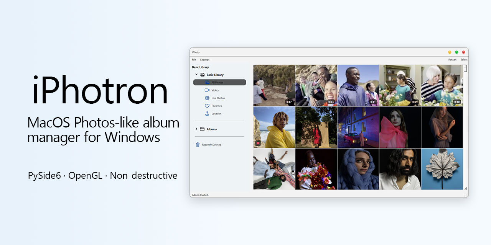
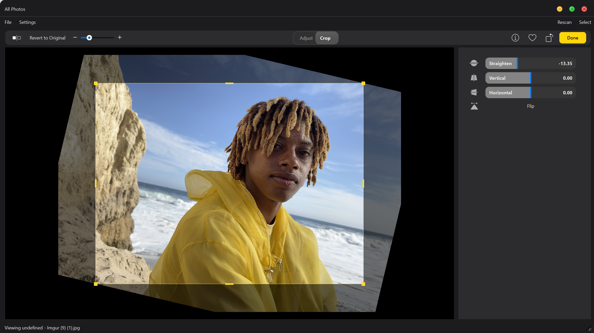
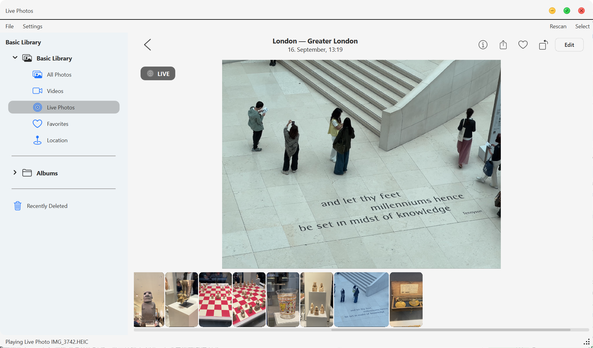

---

