# 🚀 Product Hunt Daily Top 10 (2026-01-27)

## 1. [Kilo Code Reviewer](https://www.producthunt.com/products/kilocode?utm_campaign=producthunt-api&utm_medium=api-v2&utm_source=Application%3A+antigravity_test+%28ID%3A+258588%29)
**Votes**: 463 | **Tagline**: Automatic AI-powered code reviews the moment you open a PR

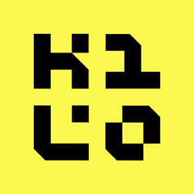

### 📌 요약
PR(Pull Request)을 열자마자 500개 이상의 다양한 AI 모델(GPT, Claude, Gemini 등)이 즉시 코드를 분석하고 개선점까지 제안해주는 초자동화 코드 리뷰 에이전트입니다.

### 🔑 핵심 기능
- 🎯 Target Audience: 코드 품질 관리가 필수적이거나, 리뷰 속도를 극대화하고 싶은 개발팀 및 솔로 개발자
- ✨ Key Differentiator: 단순히 한두 개 모델이 아닌, 500개 이상의 다양한 AI 모델(유/무료 포함) 중에서 원하는 옵션을 선택해 리뷰를 진행할 수 있다는 점
- 💡 Core Feature: 버그를 포착하고 개선 사항을 제안하여 코드 품질 표준을 자동으로 유지시켜주는 'AI 기반 자동 코드 리뷰'

### 📸 스크린샷 및 갤러리
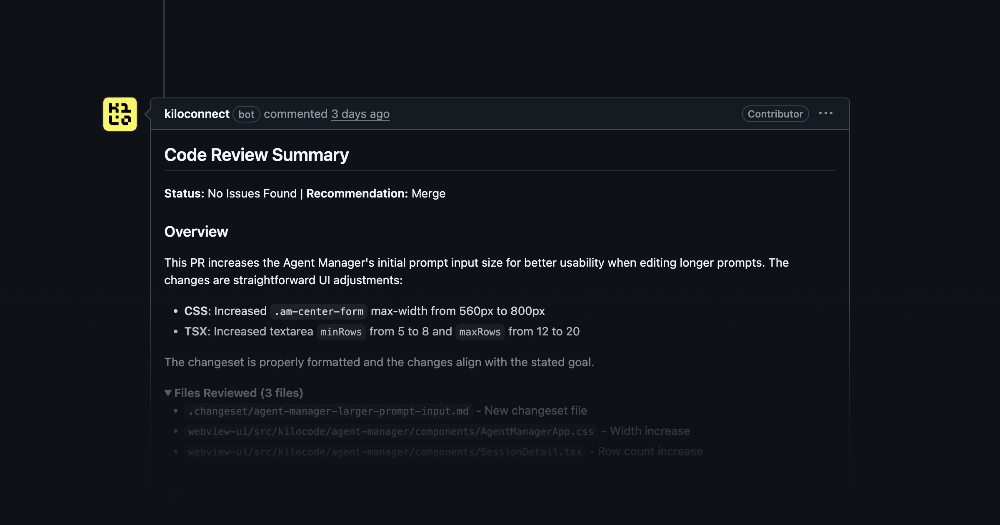
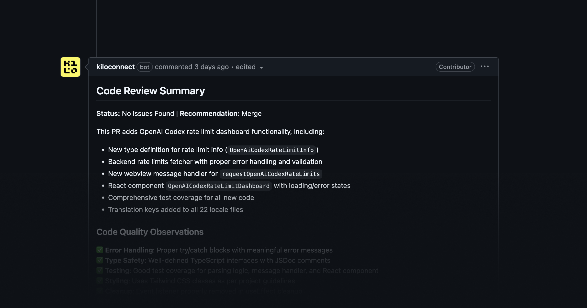
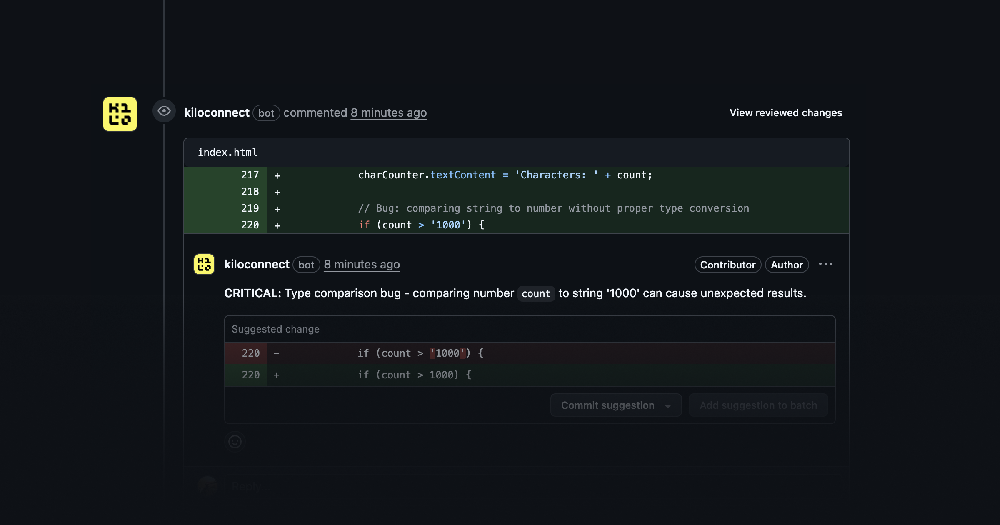

### 🎬 관련 영상
- [🎥 영상 보기](https://ph-files.imgix.net/5d53e92c-66a0-422a-aa3f-09ec84c896db.jpeg?auto=format)

---

## 2. [Clawdbot](https://www.producthunt.com/products/clawdbot-2?utm_campaign=producthunt-api&utm_medium=api-v2&utm_source=Application%3A+antigravity_test+%28ID%3A+258588%29)
**Votes**: 384 | **Tagline**: The AI that actually does things

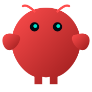

### 📌 요약
내 컴퓨터를 텔레그램이나 왓츠앱으로 24시간 원격 조종하고, 브라우징부터 쉘 명령어 실행까지 시킬 수 있는 '나만의 AI 비서'를 구축해주는 획기적인 에이전트 서비스입니다.

### 🔑 핵심 기능
- 🎯 Target Audience: 반복 업무 자동화나 24시간 시스템 접근이 필요한 개발자, 파워 유저, 혹은 개인 비서 역할의 AI를 원하는 모든 사용자.
- ✨ Key Differentiator: 단순한 챗봇이 아닌, 브라우저와 시스템(쉘 명령어) 접근 권한을 포함한 '풀 시스템 접근'을 채팅 앱을 통해 제공하며 모든 데이터는 로컬에서 처리되어 개인 정보 보호에 강점.
- 💡 Core Feature: 왓츠앱/텔레그램을 통한 시스템 제어(브라우징, 파일 관리, 쉘 명령어 실행) 및 50가지 이상의 앱을 연결하여 워크플로우를 자동화하는 기능.

### 📸 스크린샷 및 갤러리
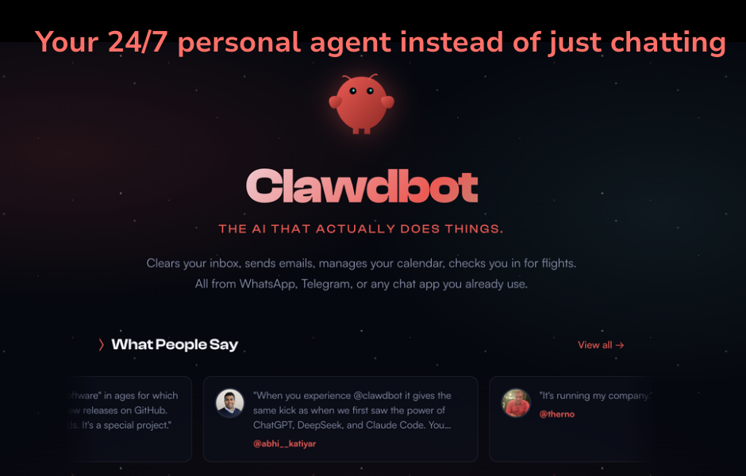
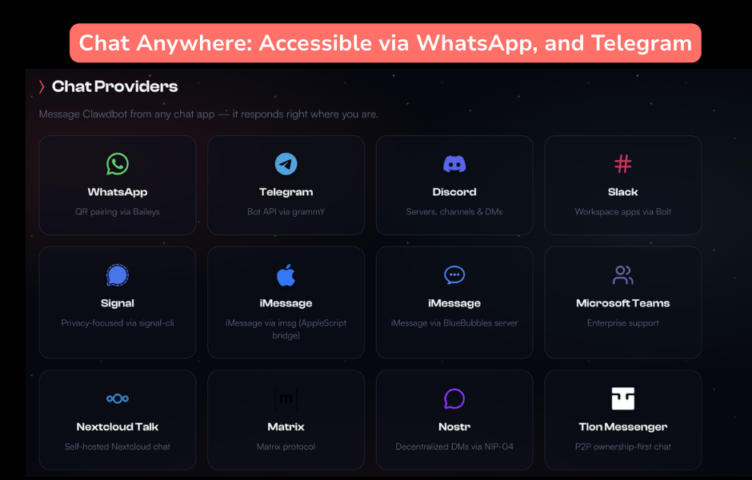
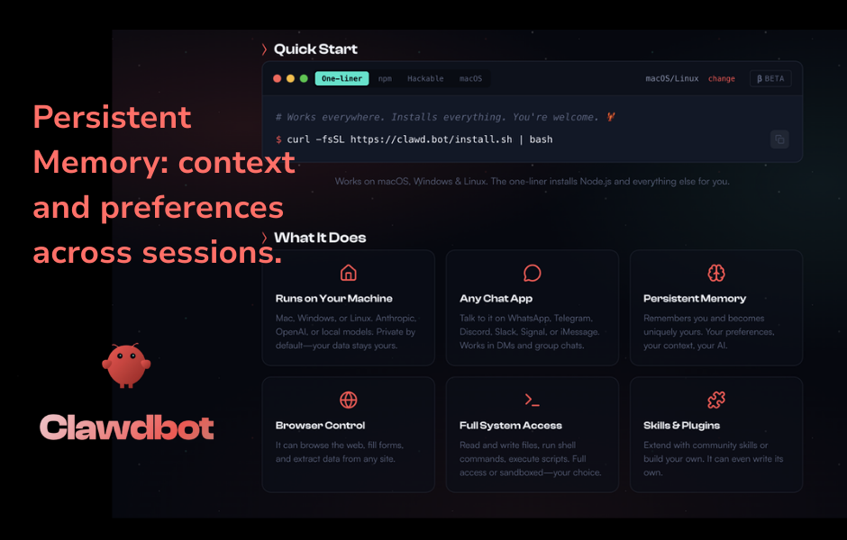

### 🎬 관련 영상
- [🎥 영상 보기](https://ph-files.imgix.net/91ccfef3-9cc7-438d-950e-fbd55ce71df3.jpeg?auto=format)

---

## 3. [LobeHub](https://www.producthunt.com/products/lobehub?utm_campaign=producthunt-api&utm_medium=api-v2&utm_source=Application%3A+antigravity_test+%28ID%3A+258588%29)
**Votes**: 271 | **Tagline**: Agent teammates that grow with you

### 📌 요약
에이전트 하나만 쓰시나요? LobeHub은 일회용 도구였던 AI를 장기적인 파트너로, 복잡한 업무를 함께 처리하는 '성장형 AI 팀'으로 업그레이드하는 멀티 에이전트 협업 플랫폼입니다.

### 🔑 핵심 기능
- 🎯 Target Audience: 복잡한 AI 워크플로우를 구축하거나, 단일 에이전트의 한계를 느끼는 개발팀 및 AI 기반 솔루션 구축 담당자.
- ✨ Key Differentiator: 단순 '태스크 수행'을 넘어, 사용자 및 업무와 함께 진화하며 복잡한 프로젝트를 처음부터 끝까지 처리하는 '장기적인 AI 팀워크' 제공.
- 💡 Core Feature: 누구나 쉽게 멀티 모델을 활용하여 복잡한 역할을 분담하는 '에이전트 팀'을 구성하고 협업할 수 있는 환경 제공.

### 📸 스크린샷 및 갤러리

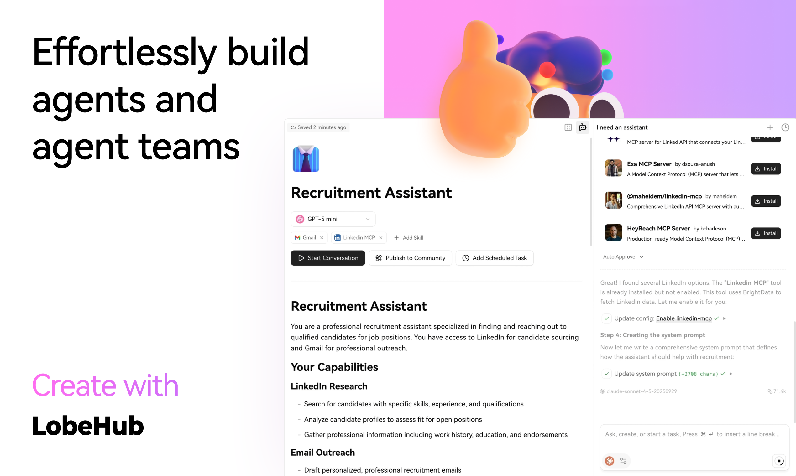
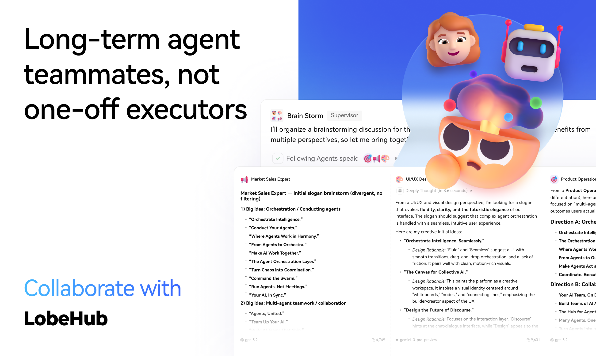

### 🎬 관련 영상
- [🎥 영상 보기](https://ph-files.imgix.net/f77cc96a-4358-4ba8-b4ba-6769c41617dc.jpeg?auto=format)

---

## 4. [Timeless](https://www.producthunt.com/products/timeos?utm_campaign=producthunt-api&utm_medium=api-v2&utm_source=Application%3A+antigravity_test+%28ID%3A+258588%29)
**Votes**: 192 | **Tagline**: The first action-taker, NOT a note-taker

### 📌 요약
회의록 정리나 메모 작성이 아니라, 대화 속에서 태스크(할 일)가 포착되면 바로 실행에 옮겨 에이전트가 완성해주는 '실행 중심' AI 플랫폼, 타임리스(Timeless)가 떴습니다.

### 🔑 핵심 기능
- 🎯 Target Audience: 반복되는 회의, 통화, 현장 미팅에서 발생하는 후속 조치(Follow-up) 누락으로 스트레스 받는 모든 비즈니스 전문가 및 팀.
- ✨ Key Differentiator: 단순 기록(Note-taker)을 넘어, 대화 속 명령(예: '후속 조치하자', '이거 초안 써줘')을 실시간으로 포착해 실제로 태스크를 생성, 일정 예약, 초안 작성까지 완료해주는 실행자(Action-taker) 역할 수행.
- 💡 Core Feature: 미팅/통화 내용을 기반으로 클라이언트 룸을 자동 업데이트하고, 즉시 공유 가능한 제안서를 생성하여 팀 커뮤니케이션의 효율성을 극대화.

### 📸 스크린샷 및 갤러리
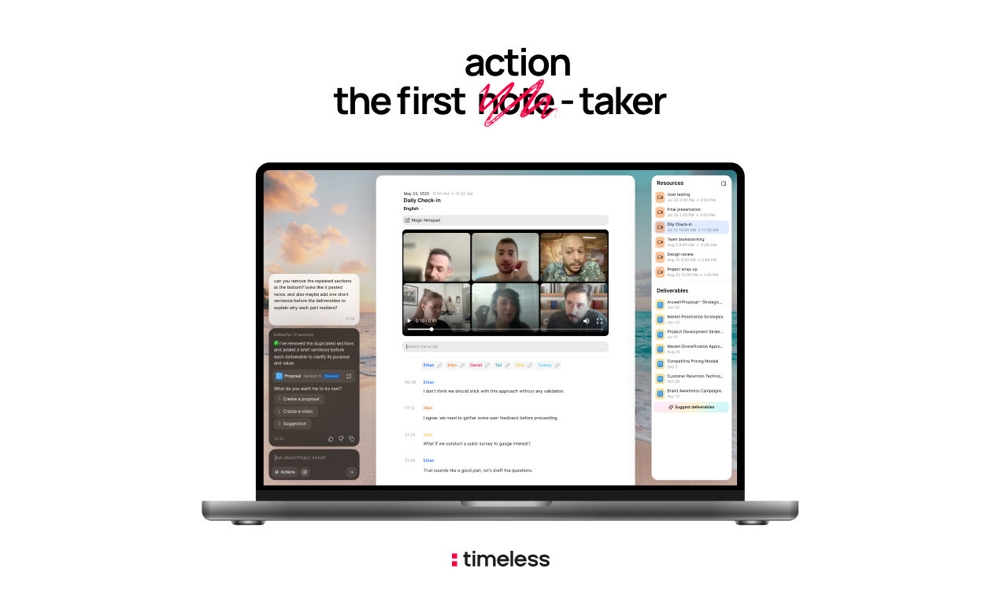
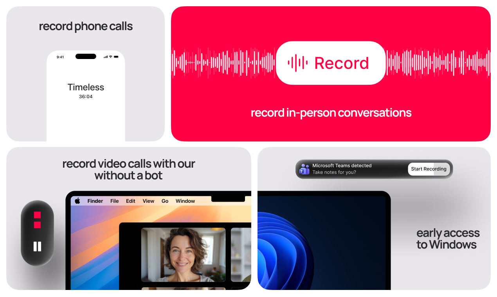
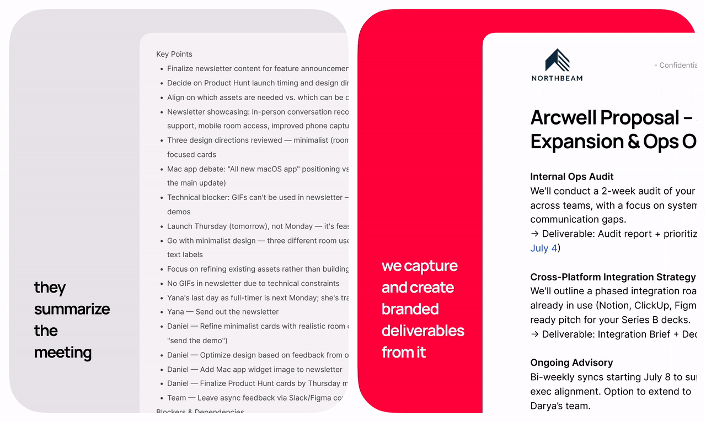

### 🎬 관련 영상
- [🎥 영상 보기](https://ph-files.imgix.net/e9c9a3eb-7898-475c-933f-1c5ec5fea7f3.jpeg?auto=format)

---

## 5. [ShapedQL](https://www.producthunt.com/products/shaped?utm_campaign=producthunt-api&utm_medium=api-v2&utm_source=Application%3A+antigravity_test+%28ID%3A+258588%29)
**Votes**: 146 | **Tagline**: The SQL engine for search, feeds, and AI agents

### 📌 요약
검색, 추천 피드, RAG 시스템 구축할 때 파인콘(Pinecone)이나 레디스(Redis) 같은 DB를 엮어 쓰느라 고생하셨죠? ShapedQL은 복잡한 인프라 대신 몇 줄의 SQL만으로 실시간 랭킹 파이프라인을 구축해주는 '검색/AI용 SQL 엔진'입니다.

### 🔑 핵심 기능
- 🎯 Target Audience: 실시간 추천 시스템("For You" feeds), 고급 검색 엔진, RAG 기반 AI 에이전트를 구축하는 개발자 및 데이터 엔지니어.
- ✨ Key Differentiator: 여러 벡터/KV DB와 파이썬 스크립트를 수동으로 연결할 필요 없이, 간단한 SQL 쿼리만으로 검색, 필터링, 스코어링, 실시간 재정렬 등 복잡한 랭킹 로직을 구현할 수 있음.
- 💡 Core Feature: 실시간 사용자 행동 기반으로 결과를 재정렬하는 '실시간 랭킹 파이프라인'을 SQL로 컴파일하여, 수천 줄의 인프라 코드를 단 30줄의 SQL로 대체 가능. (멀티모달 임베딩 및 자동화된 MLOps 지원)

### 📸 스크린샷 및 갤러리
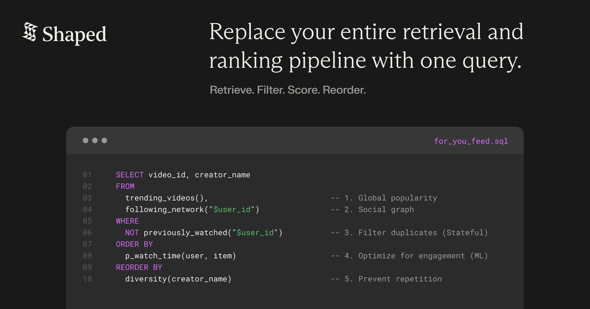
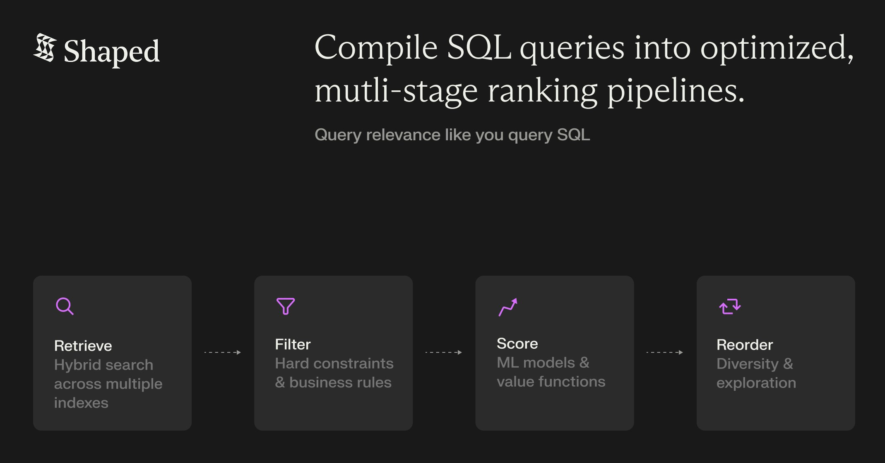
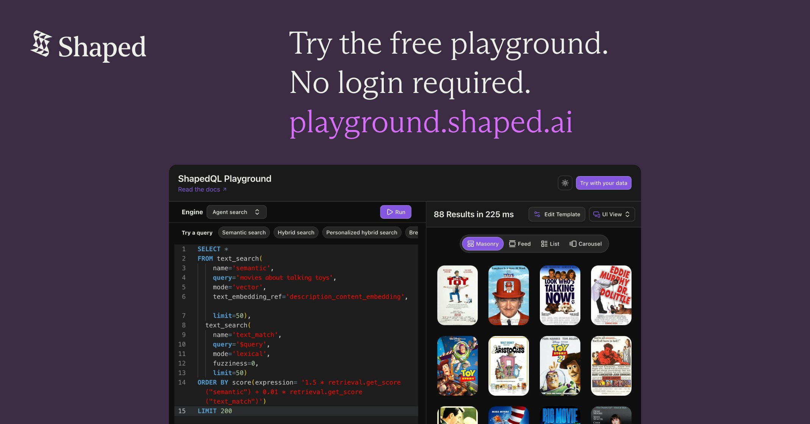

### 🎬 관련 영상
- [🎥 영상 보기](https://ph-files.imgix.net/aaa64cf5-2f68-4098-8e46-0193d01eac6c.jpeg?auto=format)

---

## 6. [Alfi](https://www.producthunt.com/products/alfi?utm_campaign=producthunt-api&utm_medium=api-v2&utm_source=Application%3A+antigravity_test+%28ID%3A+258588%29)
**Votes**: 142 | **Tagline**: Group chat app that remembers plans and helps you meet IRL

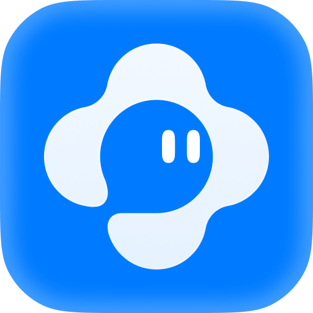

### 📌 요약
계획만 짜다 흐지부지되는 그룹 채팅은 이제 그만! 약속을 기억하고, 만남까지 책임지는 '소셜 스킬 만렙' 스마트 그룹 채팅 앱, Alfi가 런칭했습니다.

### 🔑 핵심 기능
- 🎯 Target Audience: 잦은 모임 계획이 일반 채팅창에 묻혀버리는 것에 지친 사용자 및 온라인 대화를 실제 만남(IRL)으로 전환하고 싶어하는 그룹.
- ✨ Key Differentiator: 단순한 메시징 앱을 넘어, 식당 예약, 일정 관리, 리마인더 설정 등 '실행력'을 극대화하는 소셜 어시스턴트 기능을 내장하여 약속 성사율을 높임.
- 💡 Core Feature: 채팅 내용 중 약속 관련 정보를 자동으로 포착해 캘린더에 추가하고, 대화의 핵심 내용을 정리(Group Chat Wrapped)해주는 AI 기반의 기억/요약 기능.

### 📸 스크린샷 및 갤러리
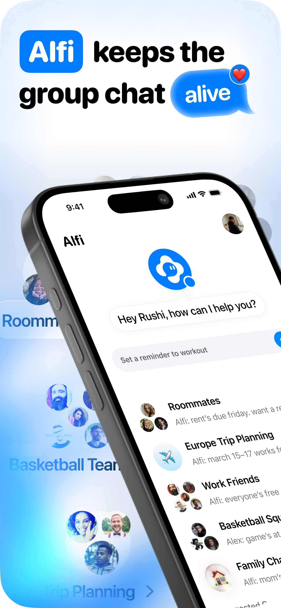
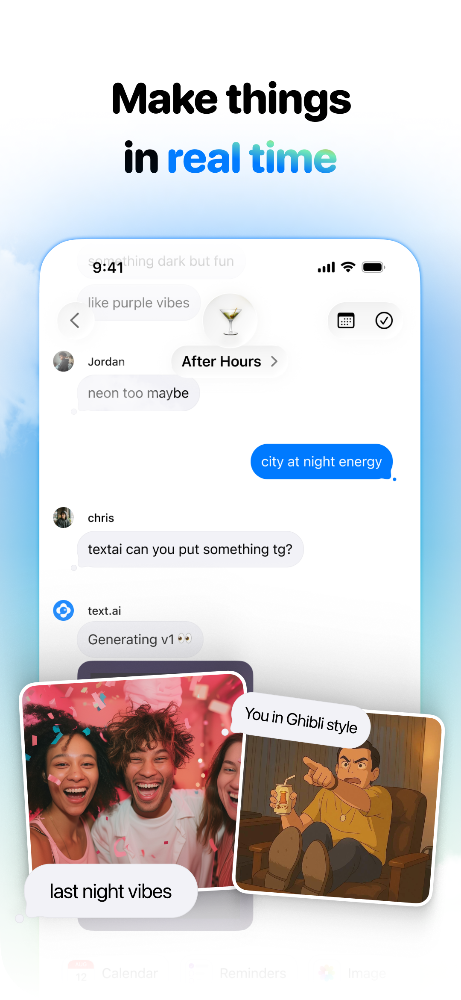

### 🎬 관련 영상
- [🎥 영상 보기](https://ph-files.imgix.net/915736f6-5d19-4c20-8cfa-2ba4023c914e.jpeg?auto=format)

---

## 7. [CapslockMute](https://www.producthunt.com/products/capslockmute?utm_campaign=producthunt-api&utm_medium=api-v2&utm_source=Application%3A+antigravity_test+%28ID%3A+258588%29)
**Votes**: 132 | **Tagline**: The fastest way to mute yourself on video calls

### 📌 요약
화상 회의(Zoom, Teams) 때 음소거 버튼 찾느라 버벅거리지 마세요. 가장 크고 접근성이 좋은 캡스록 키를 즉시 음소거/해제 단축키로 바꿔주는 맥 유틸리티입니다. 복잡한 단축키나 마우스 클릭 없이, 이제 음소거를 완벽한 '손가락 근육 기억(Muscle Memory)'으로 만드세요.

### 🔑 핵심 기능
- 🎯 Target Audience: 재택근무자, 화상 회의(Zoom, Teams)를 자주 사용하며 음소거 전환이 잦은 맥 사용자.
- ✨ Key Differentiator: 복잡한 키 조합(Combination keys)이나 마우스 클릭 대비, 가장 큰 캡스록 키를 활용하여 압도적으로 빠르고 즉각적인 반응 속도를 제공.
- 💡 Core Feature: Zoom, Teams, Tandem 등 주요 화상 회의 플랫폼의 '음소거/해제(Mute/Unmute)' 기능을 캡스록 키 하나로 통합 제어.

### 📸 스크린샷 및 갤러리
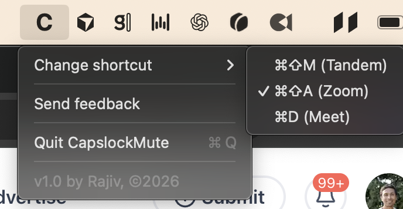

### 🎬 관련 영상
- [🎥 영상 보기](https://ph-files.imgix.net/115acad9-8d63-4dc1-8db6-ace49454b51a.gif?auto=format)

---

## 8. [Jotform AI Chatbot for Canva](https://www.producthunt.com/products/jotform?utm_campaign=producthunt-api&utm_medium=api-v2&utm_source=Application%3A+antigravity_test+%28ID%3A+258588%29)
**Votes**: 118 | **Tagline**: Bring Canva designs to life with an embedded AI chatbot 

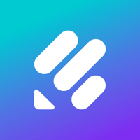

### 📌 요약
칸바 디자인에 AI 챗봇을 바로 심어, 방문자들이 페이지를 벗어나지 않고도 질문하고 즉각적인 답변을 얻을 수 있게 해주는 마법 같은 통합 솔루션입니다.

### 🔑 핵심 기능
- 🎯 Target Audience: 칸바를 이용해 랜딩 페이지, 교육 자료, 마케팅 콘텐츠 등을 제작하고, 방문자와의 실시간 상호작용 및 Q&A 자동화가 필요한 디자이너, 마케터, 교육 담당자.
- ✨ Key Differentiator: 단순한 디자인 배포를 넘어, 칸바 결과물 자체에 '인터랙티브하고 AI 기반의 경험'을 즉시 임베드할 수 있어 사용자 이탈 없이 심층적인 정보 제공 및 액션 유도가 가능합니다.
- 💡 Core Feature: 제작된 칸바 디자인 내에 AI 챗봇 에이전트를 직접 삽입(Embedded)하여, 방문자가 외부 링크 이동 없이 디자인 페이지에서 실시간 질의응답 및 필요한 행동(예: 양식 제출)을 수행할 수 있도록 지원합니다.

### 📸 스크린샷 및 갤러리
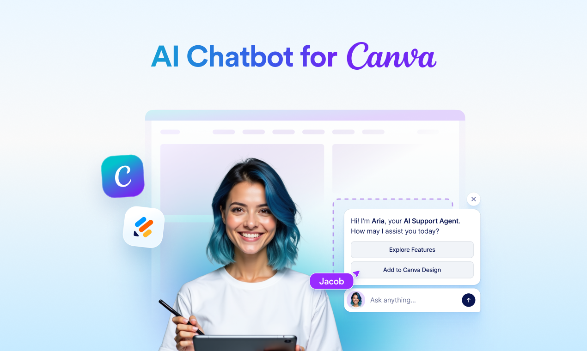
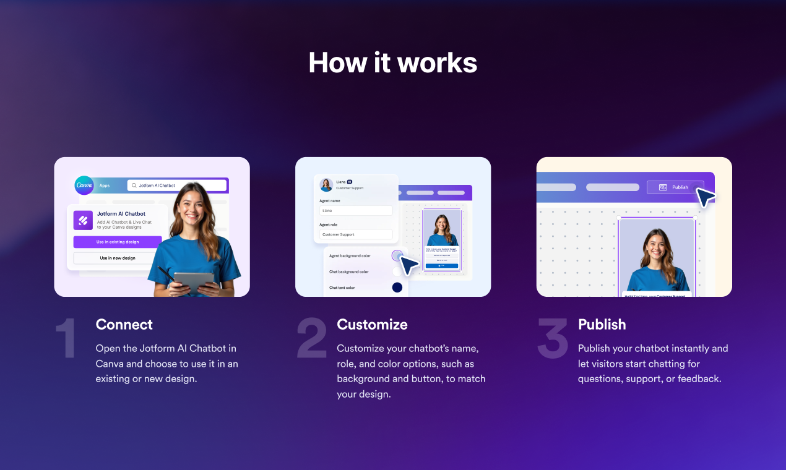
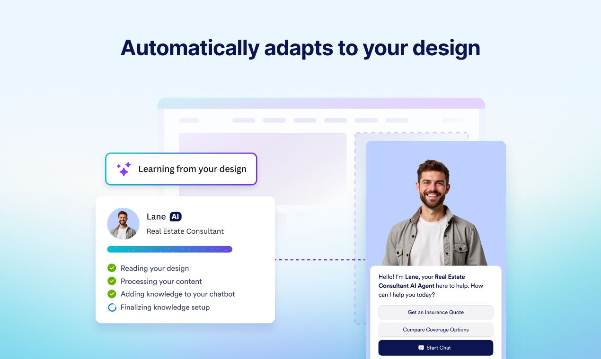

---

## 9. [Analog Reader](https://www.producthunt.com/products/analog-reader?utm_campaign=producthunt-api&utm_medium=api-v2&utm_source=Application%3A+antigravity_test+%28ID%3A+258588%29)
**Votes**: 118 | **Tagline**: turn your favorite newsletters into a printable newspaper

### 📌 요약
디지털 시대의 피로를 해소해 줄 '아날로그 리더': 좋아하는 뉴스레터를 종이 신문처럼 인쇄해서, 뇌의 부담 없이 오롯이 콘텐츠에 집중할 수 있게 해주는 프린트 기반 큐레이션 서비스입니다.

### 🔑 핵심 기능
- 🎯 Target Audience: 끝없는 디지털 콘텐츠 속에서 피로감을 느끼며, '느린 소비'를 원하는 디지털 미니멀리스트 및 뉴스레터 애독자.
- ✨ Key Differentiator: 단순히 아티클을 저장하는 것을 넘어, 디지털 미디어를 아날로그적 경험(인쇄된 신문 형태)으로 전환하여 깊은 몰입과 집중을 유도하는 방식.
- 💡 Core Feature: 선호하는 뉴스레터 및 디지털 콘텐츠를 신문 레이아웃으로 자동 변환하고 인쇄 파일(PDF 등)로 출력하는 '프린터블 신문' 생성 기능.

### 📸 스크린샷 및 갤러리
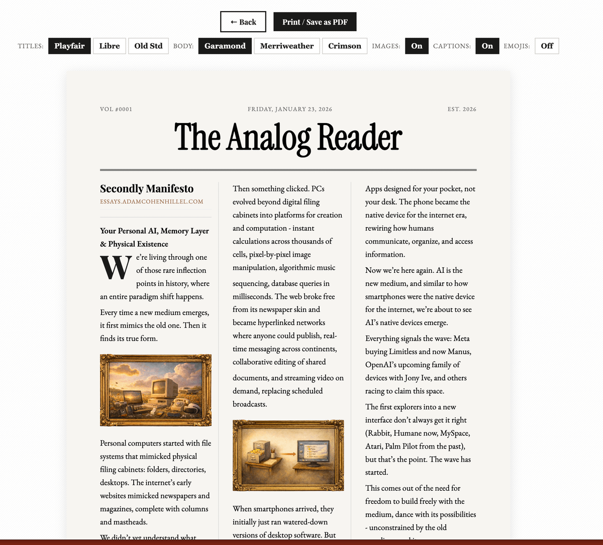
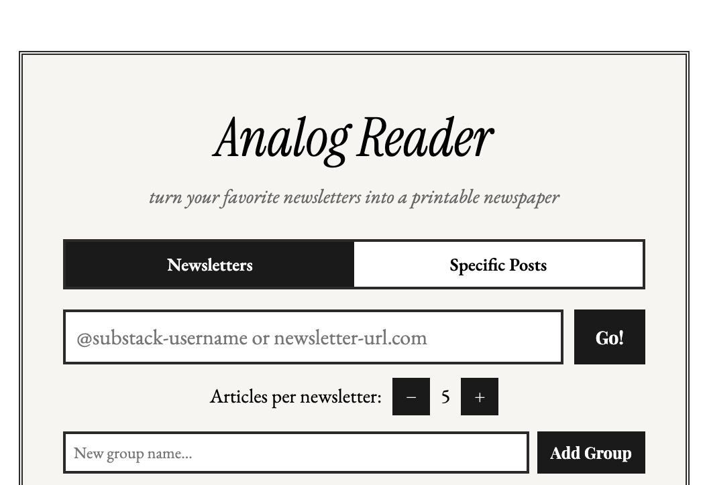

---

## 10. [Runo 2.0](https://www.producthunt.com/products/runo-the-metronome-for-runners?utm_campaign=producthunt-api&utm_medium=api-v2&utm_source=Application%3A+antigravity_test+%28ID%3A+258588%29)
**Votes**: 106 | **Tagline**: Metronome app that keeps your running cadence steady

### 📌 요약
러닝 중 페이스가 무너지는 걸 방지하는 '러닝 전용 메트로놈' 앱, Runo 2.0. 특히 애플 워치 햅틱 비트 기능이 추가되어 이어폰 없이도 완벽한 케이던스를 몸으로 느낄 수 있게 해주는 혁신적인 업데이트입니다.

### 🔑 핵심 기능
- 🎯 Target Audience: 부상 방지와 효율적인 러닝 경제(Running Economy) 개선을 목표로 하는 모든 러너 (특히 마라토너).
- ✨ Key Differentiator: 스마트워치(애플 워치)의 햅틱 피드백을 활용하여 이어폰 없이도 정확한 비트를 몸으로 느낄 수 있어, 러닝 중 몰입도를 극대화.
- 💡 Core Feature: 설정한 케이던스(120~220 SPM)에 맞춰 정밀한 박자를 제공하여 페이스 이탈을 근본적으로 차단하며, Strava 연동 및 소셜 기능을 통해 동기 부여 제공.

### 📸 스크린샷 및 갤러리
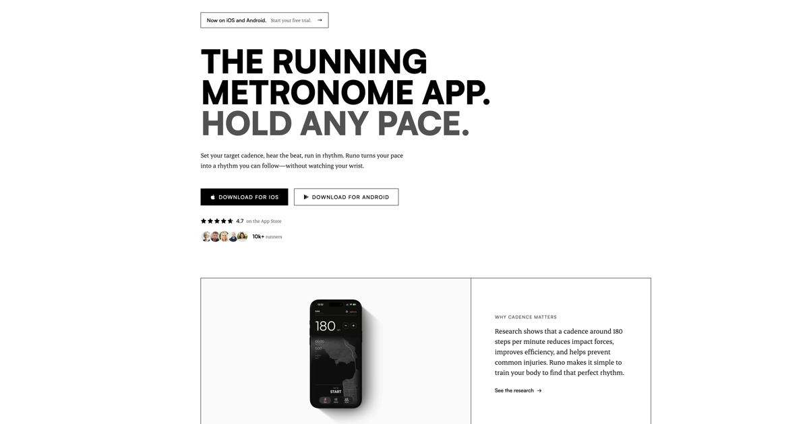

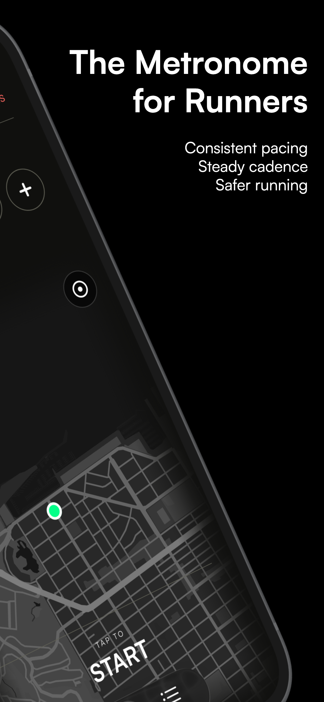

### 🎬 관련 영상
- [🎥 영상 보기](https://ph-files.imgix.net/c9424b59-1f14-469b-82a6-e7d490349469.jpeg?auto=format)

---

