# 🚀 Product Hunt Daily Top 10 (2026-01-28)

## 1. [DataFast](https://www.producthunt.com/products/datafast?utm_campaign=producthunt-api&utm_medium=api-v2&utm_source=Application%3A+antigravity_test+%28ID%3A+258588%29)
**Votes**: 396 | **Tagline**: Revenue-first analytics

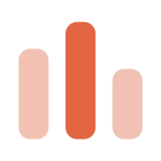

### 📌 요약
매출에 직접 기여하는 마케팅 채널만 콕 집어내어, '성장 속도'를 극단적으로 끌어올려주는 '수익 최우선' 분석 툴, 데이터패스트가 떴습니다.

### 🔑 핵심 기능
- 🎯 Target Audience: 마케팅 비용은 쓰는데 실제 고객 유입 경로 파악이 어렵거나, 광고 효율 극대화를 원하는 모든 소규모/중규모 비즈니스 오너 및 마케터.
- ✨ Key Differentiator: 단순 트래픽 측정이 아닌, '실제 수익'을 창출하는 채널에 집중하여 불필요한 마케팅 지출을 즉시 절감하고 성장을 가속화.
- 💡 Core Feature: 다양한 마케팅 채널별 고객 유입 경로와 그에 따른 매출 기여도를 실시간으로 투명하게 분석하는 '수익 중심 어트리뷰션(Revenue-first Attribution)' 기능.

### 📸 스크린샷 및 갤러리

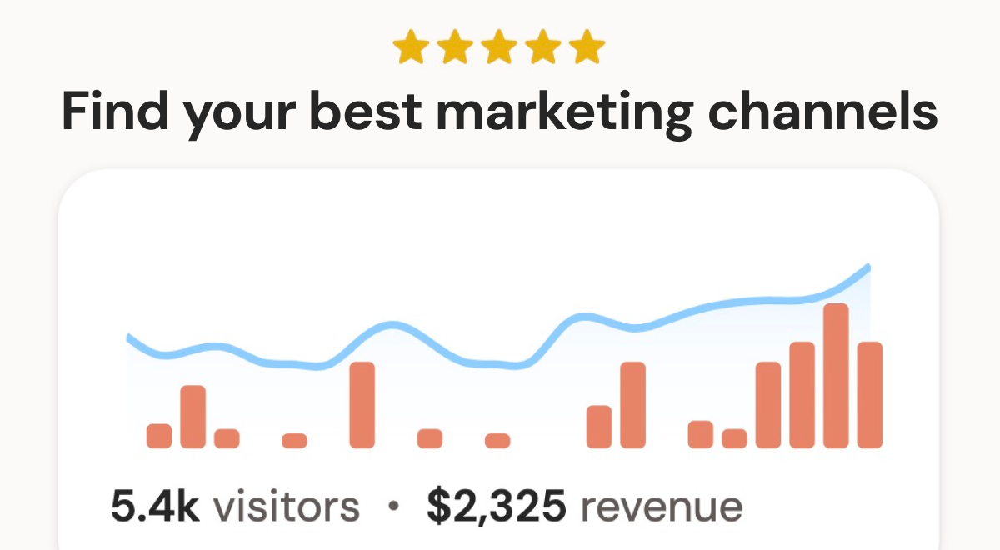

### 🎬 관련 영상
- [🎥 영상 보기](https://ph-files.imgix.net/c01eba48-a832-4999-9cfb-1216249f975d.jpeg?auto=format)

---

## 2. [Imagine](https://www.producthunt.com/products/imagine-2?utm_campaign=producthunt-api&utm_medium=api-v2&utm_source=Application%3A+antigravity_test+%28ID%3A+258588%29)
**Votes**: 358 | **Tagline**: Build something real with the most complete AI builder

### 📌 요약
아이디어만 있으면 AI와 대화하듯 채팅만으로 엔드-투-엔드(End-to-End) 구동되는 완벽한 앱을 만들어주는, 개발 올인원 AI 빌더의 등장입니다.

### 🔑 핵심 기능
- 🎯 Target Audience: MVP를 빠르게 제작하거나, 풀스택 개발에 필요한 인프라 구축 및 규제 준수(Compliance) 부담을 덜고 싶은 스타트업 창업가 및 기획자.
- ✨ Key Differentiator: 단순히 코드나 프론트엔드만 생성하는 것을 넘어, 인증, DB, 스토리지, 호스팅 등 백엔드 클라우드 인프라부터 GDPR/HIPAA 등 복잡한 규제 준수까지 전부 내장해주는 '가장 완벽한' AI 빌더라는 점.
- 💡 Core Feature: 채팅 프롬프트만 입력하면 SSR(서버 사이드 렌더링)을 지원하는 웹 앱을 만들어주며, DDoS 방어 및 완전 관리형 클라우드 인프라를 기본 제공하여 보안과 확장성 걱정을 없애는 기능.

### 📸 스크린샷 및 갤러리
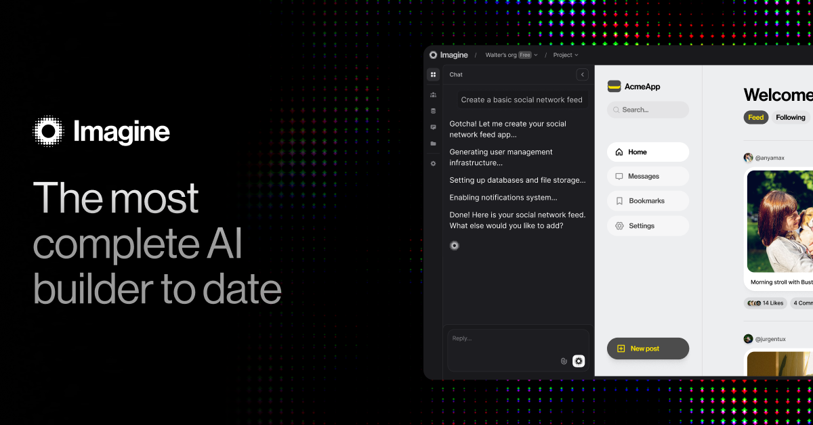
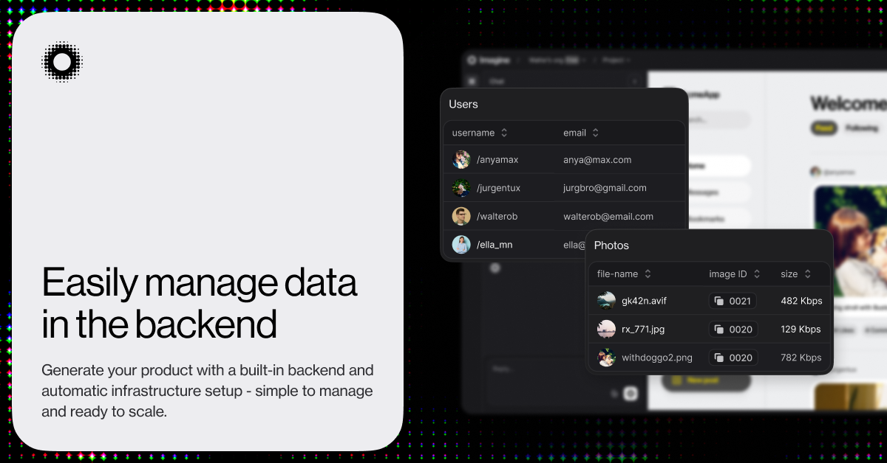

### 🎬 관련 영상
- [🎥 영상 보기](https://ph-files.imgix.net/9b402cbf-e8b0-47ab-aca1-c368ab33b5e0.jpeg?auto=format)

---

## 3. [kuku](https://www.producthunt.com/products/kuku?utm_campaign=producthunt-api&utm_medium=api-v2&utm_source=Application%3A+antigravity_test+%28ID%3A+258588%29)
**Votes**: 358 | **Tagline**: Obsidian — but a lot has changed

### 📌 요약
Obsidian의 로컬 편집력과 Cursor의 AI 기능을 합치고, '탈(脫) 일렉트론'을 선언하며 Tauri로 초경량화한 맥OS 종결자 마크다운 에디터, kuku.

### 🔑 핵심 기능
- 🎯 Target Audience: 속도와 프라이버시를 중시하는 맥OS 마니아, Obsidian 사용자 중 더 빠르고 가벼운 '네이티브' 경험을 원하는 지식 관리 전문가.
- ✨ Key Differentiator: 무거운 Electron 대신 Tauri 프레임워크를 사용하여 압도적인 속도와 네이티브 경험 제공. 클라우드 없이 파일 잠금(Lock-in) 걱정이 없음.
- 💡 Core Feature: 파일을 검색, 수정, 연결하며 작업하고 모든 AI 변경 사항을 'Cursor 스타일'의 Diff로 보여줘 안전하게 검토할 수 있는 AI 에이전트 기능.

### 📸 스크린샷 및 갤러리
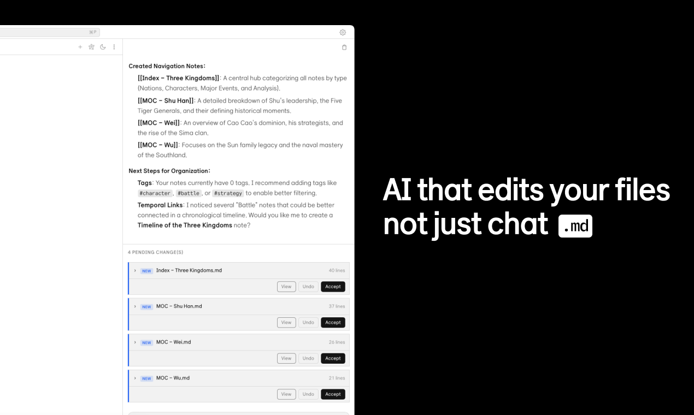
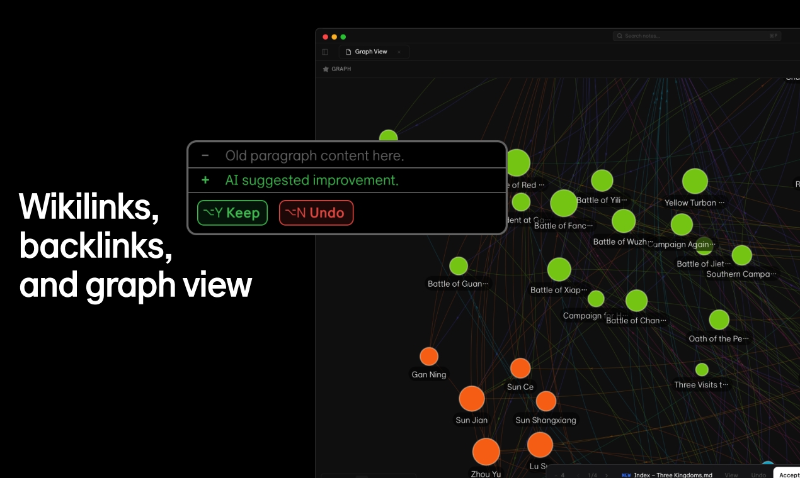
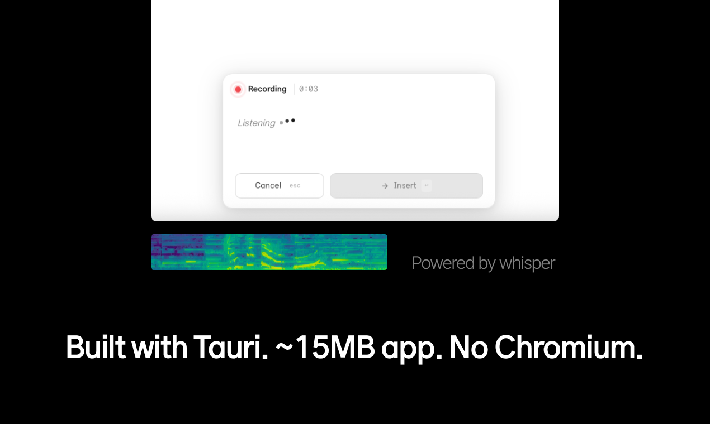

### 🎬 관련 영상
- [🎥 영상 보기](https://ph-files.imgix.net/f3199e61-9768-4b08-9a91-cc0f50d01928.jpeg?auto=format)

---

## 4. [Rumora](https://www.producthunt.com/products/rumora?utm_campaign=producthunt-api&utm_medium=api-v2&utm_source=Application%3A+antigravity_test+%28ID%3A+258588%29)
**Votes**: 290 | **Tagline**: Promote your brand in viral TikTok & YouTube videos

### 📌 요약
바이럴 영상에 내 브랜드를 자연스럽게 노출시키는 획기적인 마케팅 툴 '루모라'가 드디어 틱톡까지 지원합니다. 탑 댓글에 브랜드 이름을 꽂아 폭발적인 인지도를 확보하고, 일반 광고 대비 3배 높은 전환율을 경험하세요.

### 🔑 핵심 기능
- 🎯 Target Audience: 콘텐츠 마케팅 예산이 제한적이지만, 빠르게 인지도를 높여야 하는 스타트업 및 D2C 브랜드 마케터.
- ✨ Key Differentiator: 단순히 광고를 노출하는 것이 아니라, 바이럴 영상의 '탑 댓글'이라는 가장 자연스럽고 주목도 높은 지점에 브랜드를 심어 높은 검색 및 전환율을 유도합니다.
- 💡 Core Feature: 타겟 틈새 시장의 바이럴 비디오를 자동 감지하고, 해당 영상의 상위 댓글에 브랜드를 노출시켜 7일 만에 10만 이상의 도달(Reach)을 보장하는 서비스.

### 📸 스크린샷 및 갤러리
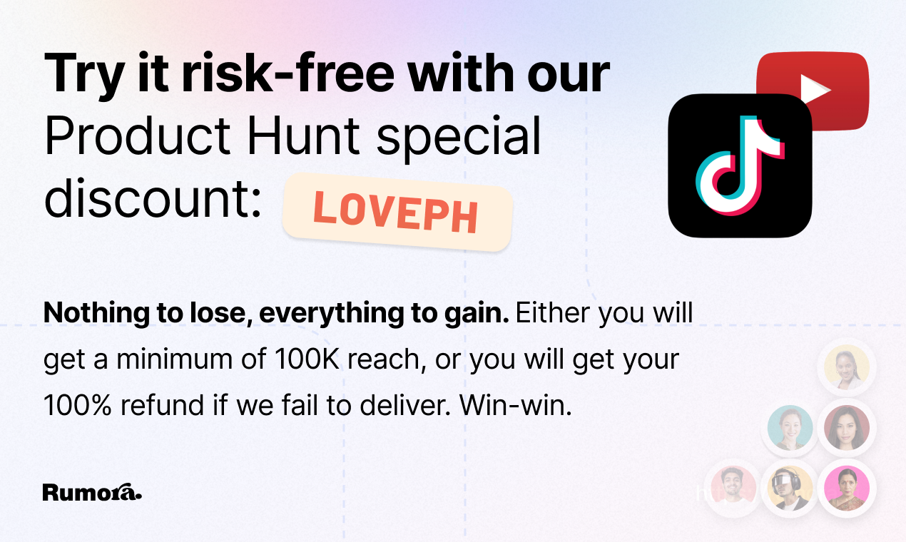

---

## 5. [AutoSend](https://www.producthunt.com/products/autosend-2?utm_campaign=producthunt-api&utm_medium=api-v2&utm_source=Application%3A+antigravity_test+%28ID%3A+258588%29)
**Votes**: 272 | **Tagline**: Email for Developers, Marketers, and AI Agents

### 📌 요약
개발자, 마케터, AI 에이전트를 위한 이메일 플랫폼 '오토샌드(AutoSend)'가 등장했습니다. 복잡한 가격 구조 없이 안정적인 대용량 이메일 발송에 집중해, 메일건(Mailgun)이나 센드그리드(SendGrid)의 비싼 요금이 부담스러웠던 팀들에게 완벽한 대안을 제시합니다.

### 🔑 핵심 기능
- 🎯 Target Audience: 안정적이고 대량의 트랜잭션 및 마케팅 이메일 발송이 필요한 개발자 팀 및 AI 에이전트.
- ✨ Key Differentiator: 복잡하고 예측하기 어려운 기존 솔루션(Mailgun, SendGrid 등)의 가격 정책 대신, 투명하고 합리적인 비용으로 고신뢰 이메일 인프라를 제공.
- 💡 Core Feature: 가격 걱정 없이 대용량 이메일을 안정적으로 처리하며, 개발 친화적인 API 환경을 제공.

### 📸 스크린샷 및 갤러리
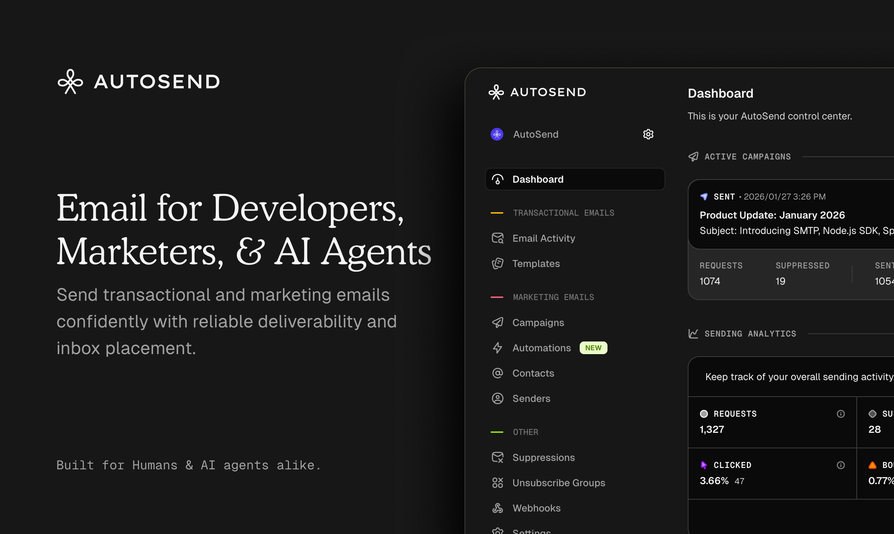
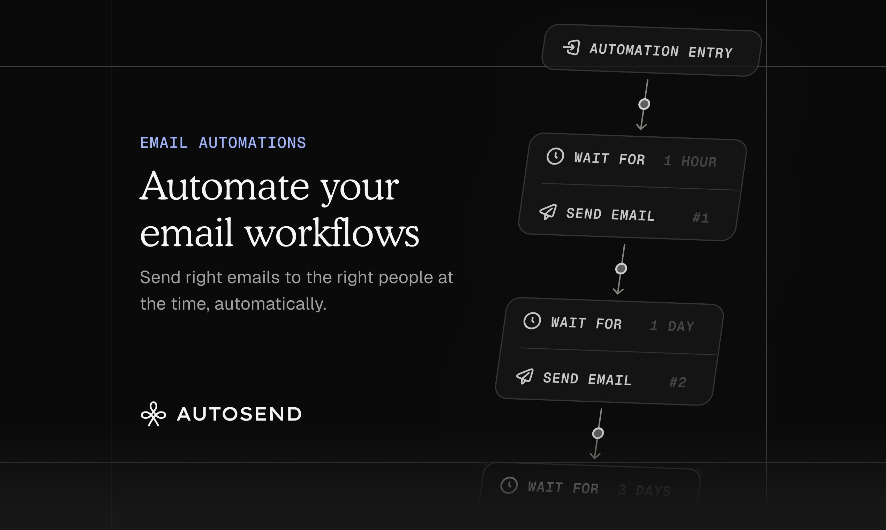
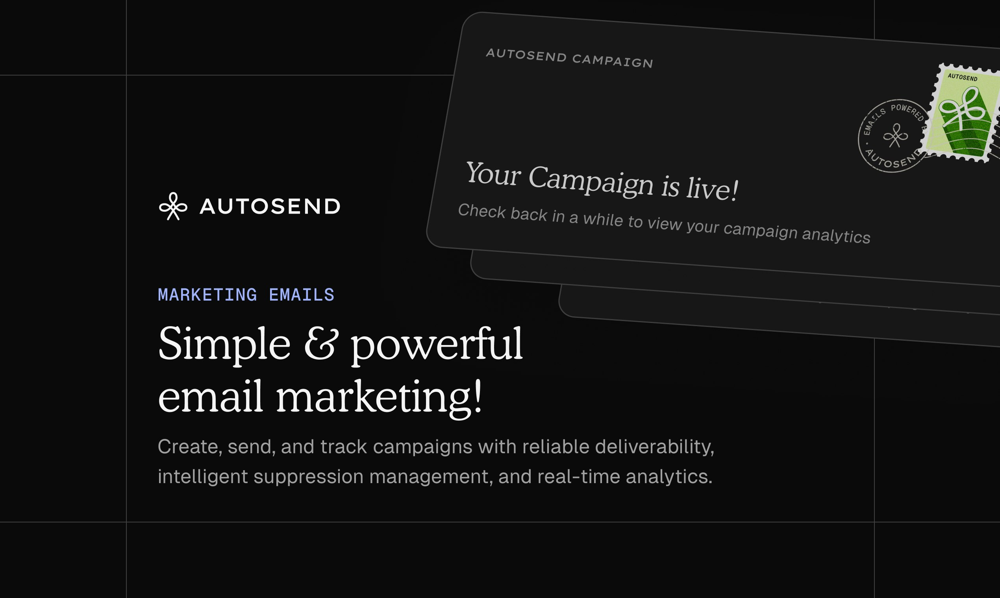

---

## 6. [minimalist phone app for iOS ](https://www.producthunt.com/products/minimalist-phone-reduce-your-screentime?utm_campaign=producthunt-api&utm_medium=api-v2&utm_source=Application%3A+antigravity_test+%28ID%3A+258588%29)
**Votes**: 261 | **Tagline**: Your calmer, digital detox experience on iPhone

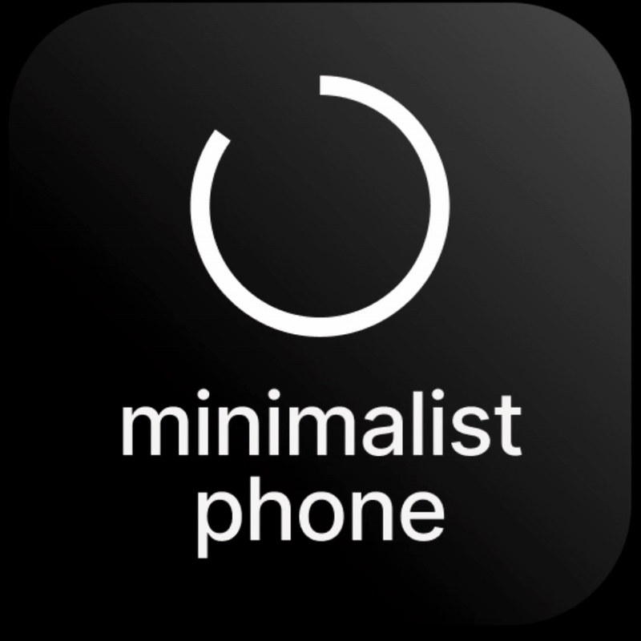

### 📌 요약
아이폰 중독 해독제 출시: 월 80시간, 300만원을 낭비하는 스크롤링 습관을 끊어주는 '미니멀리스트 폰' 앱이 드디어 iOS 상륙했습니다.

### 🔑 핵심 기능
- 🎯 Target Audience: 디지털 디톡스가 절실한 아이폰 사용자, 집중력 개선이 필요한 ADHD 사용자 및 직장인.
- ✨ Key Differentiator: 기존 설정만으로는 불가능했던 중독성 앱 차단, 컬러 아이콘 제거 등 강제적인 블랙 스크린 환경 제공.
- 💡 Core Feature: 사용 시간이 지나면 강제로 앱에서 퇴장시켜서 사용자가 스크롤링 대신 오프라인 생활을 하도록 유도.

### 📸 스크린샷 및 갤러리
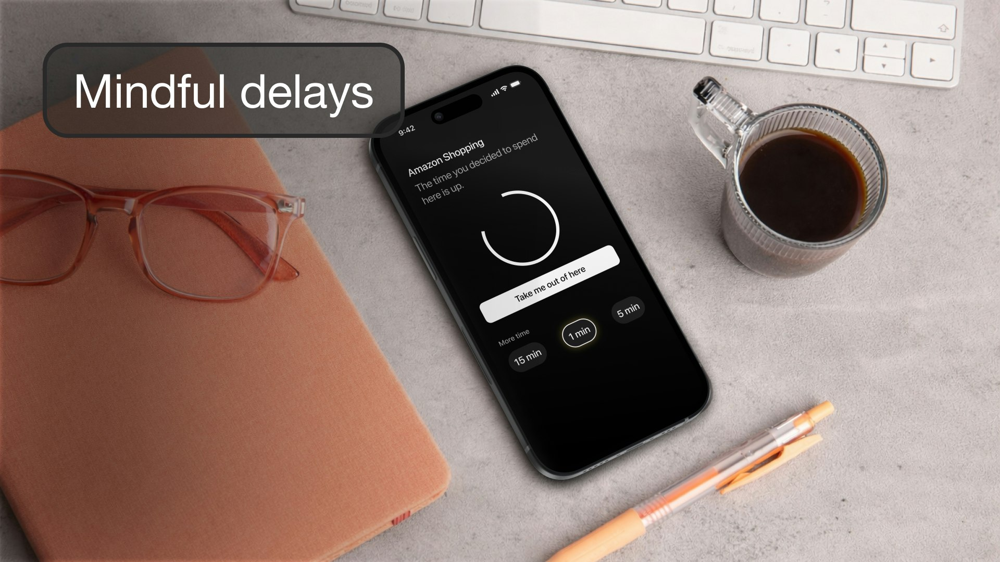
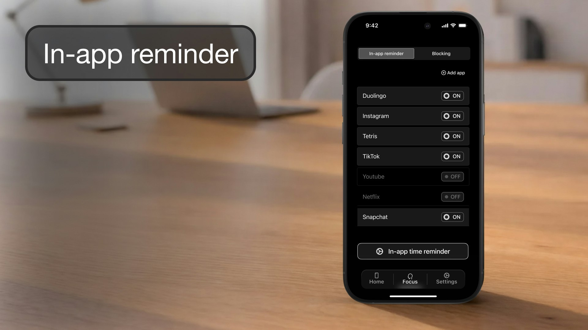
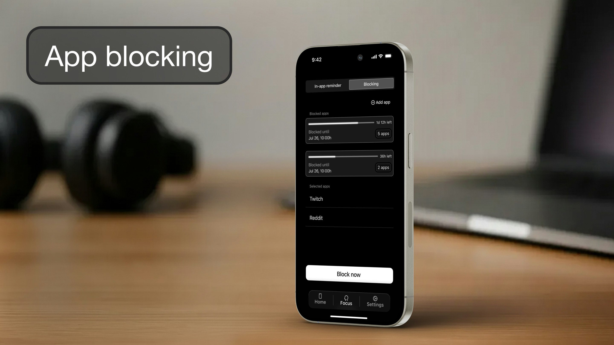

### 🎬 관련 영상
- [🎥 영상 보기](https://ph-files.imgix.net/bb669914-6a08-4295-a210-0312d1ab4c13.jpeg?auto=format)

---

## 7. [Unlimited eSign for founders by Gitlaw](https://www.producthunt.com/products/gitlaw?utm_campaign=producthunt-api&utm_medium=api-v2&utm_source=Application%3A+antigravity_test+%28ID%3A+258588%29)
**Votes**: 189 | **Tagline**: No trials. No caps. Just sign.	

### 📌 요약
창업가들을 위한 도큐사인(DocuSign) 킬러! 문서 제한, 시험판 없이 무제한으로 계약서를 서명하고, AI로 작성 및 검토까지 한 번에 끝내는 무료 전자 서명 툴이 등장했어요.

### 🔑 핵심 기능
- 🎯 Target Audience: 스타트업 창업가, 소규모 비즈니스 오너 등 빈번한 계약서 서명과 비용 절감이 필요한 사용자.
- ✨ Key Differentiator: 문서 서명 수/사용 기간에 제한이 없는 완전 무료(No caps, No trials) 정책으로, 기존 유료 서비스(DocuSign/HelloSign 등) 대비 수백~수천 달러를 절약할 수 있다는 점.
- 💡 Core Feature: AI를 활용하여 계약서를 초안 작성하고 검토하는 기능이 전자 서명 워크플로우에 통합되어 있어 효율성이 극대화됩니다.

### 📸 스크린샷 및 갤러리
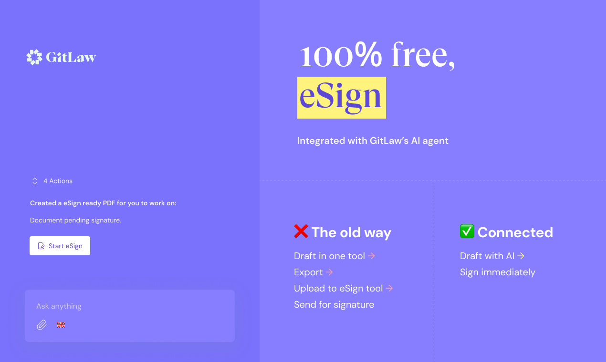
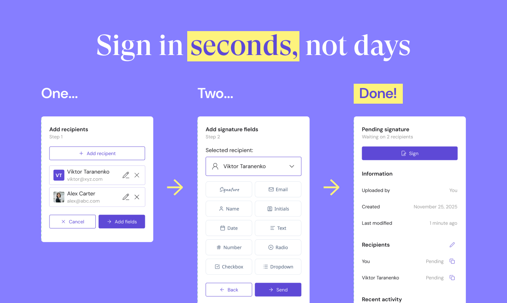
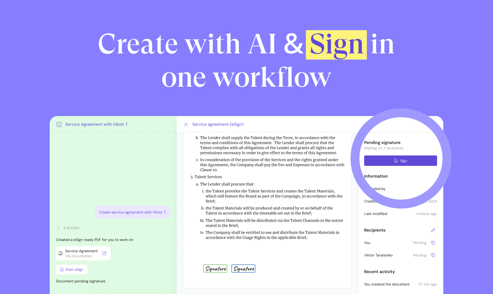

### 🎬 관련 영상
- [🎥 영상 보기](https://ph-files.imgix.net/4f46942c-bbf6-4897-bd81-5530f9c6d184.jpeg?auto=format)

---

## 8. [Kimi K2.5](https://www.producthunt.com/products/kimi-ai-assistant?utm_campaign=producthunt-api&utm_medium=api-v2&utm_source=Application%3A+antigravity_test+%28ID%3A+258588%29)
**Votes**: 159 | **Tagline**: Native multimodal model with self-directed agent swarms

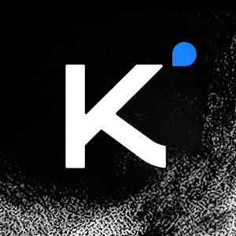

### 📌 요약
오픈 소스 모델의 새로운 왕좌를 차지할, 에이전트 작업에 특화된 네이티브 멀티모달 AI, Kimi K2.5가 드디어 출시되었습니다.

### 🔑 핵심 기능
- 🎯 Target Audience: 혁신적인 AI 에이전트 시스템을 구축하려는 개발자, 최신 멀티모달(시각+텍스트) 기능을 활용하고자 하는 연구자 및 AI 서비스 기획자.
- ✨ Key Differentiator: 자체적인 '에이전트 스웜(Agent Swarms)' 기술을 통해 복잡한 작업을 자율적으로 처리하며, 오픈 소스 모델 중 에이전트 및 코드 분야에서 독보적인 성능(SoTA)을 달성했습니다.
- 💡 Core Feature: 텍스트와 시각 정보를 모두 이해하는 네이티브 멀티모달 아키텍처를 기반으로, 대화 모드와 자율적 에이전트 모드를 자유롭게 오가며 지능적인 문제 해결이 가능합니다.

### 📸 스크린샷 및 갤러리
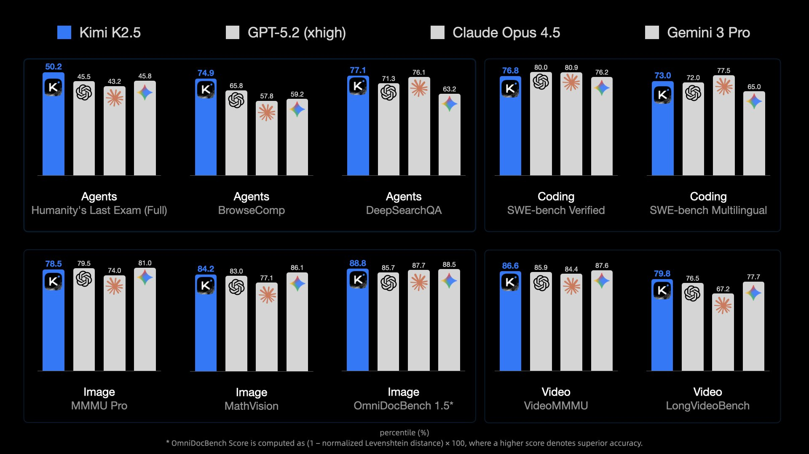
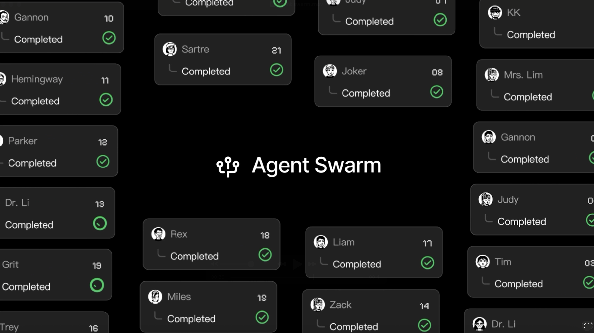
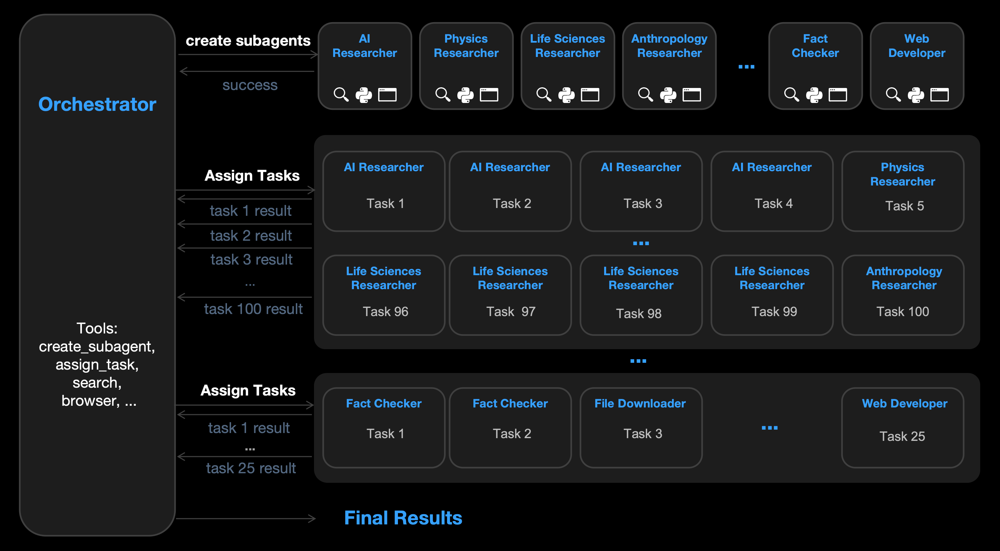

### 🎬 관련 영상
- [🎥 영상 보기](https://ph-files.imgix.net/bf6fca92-5efa-4918-ad54-abcb7a72772a.jpeg?auto=format)

---

## 9. [Prism](https://www.producthunt.com/products/openai?utm_campaign=producthunt-api&utm_medium=api-v2&utm_source=Application%3A+antigravity_test+%28ID%3A+258588%29)
**Votes**: 139 | **Tagline**: A free, LaTeX-native workspace for scientists

### 📌 요약
LaTeX 숙련 과학자들을 위한 필수품! GPT-5.2를 탑재해 연구 작성과 협업의 효율을 극대화하는 무료 올인원 워크스페이스 'Prism'이 떴습니다.

### 🔑 핵심 기능
- 🎯 타겟 독자: LaTeX 환경에서 논문 작성 및 연구 협업이 필요한 과학자 및 연구원.
- ✨ 핵심 차별점: 연구 집필에 최적화된 LaTeX 네이티브 환경과 최신 GPT-5.2 엔진을 통합한 '무료' 올인원 협업 플랫폼.
- 💡 핵심 기능: GPT-5.2를 활용하여 복잡한 수식이나 인용, 문체 교정 등 연구 논문 작성을 AI가 즉각 지원하는 기능.

### 📸 스크린샷 및 갤러리
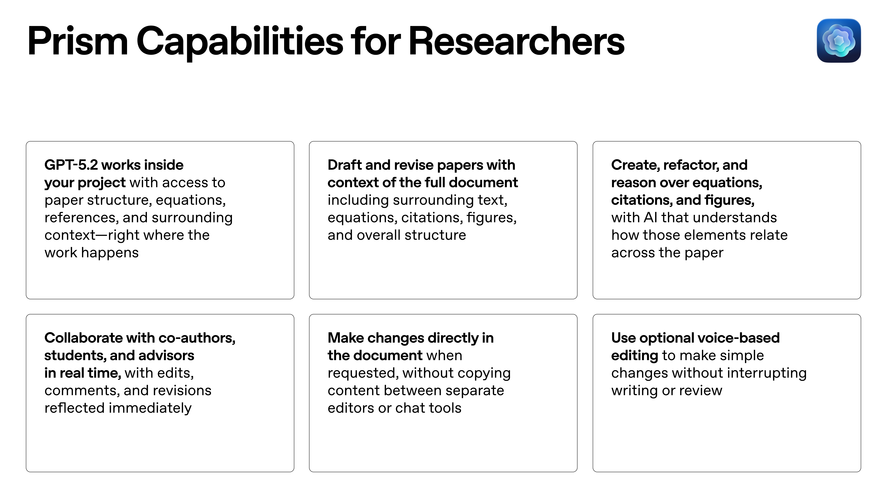
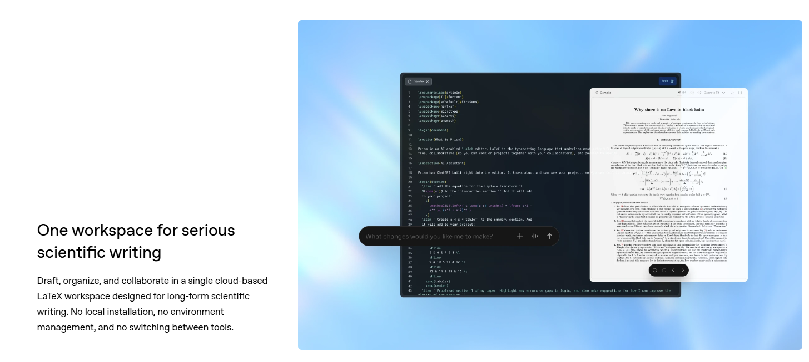
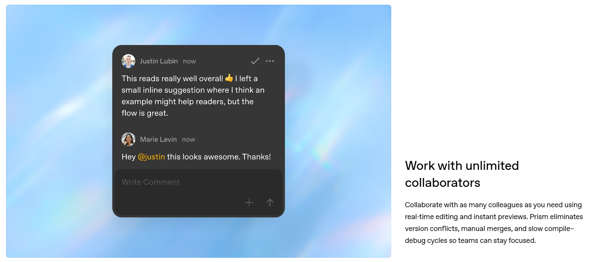

### 🎬 관련 영상
- [🎥 영상 보기](https://ph-files.imgix.net/83dc8ad4-168e-4955-bece-a56544a7d214.jpeg?auto=format)

---

## 10. [Polyglotta](https://www.producthunt.com/products/polyglotta?utm_campaign=producthunt-api&utm_medium=api-v2&utm_source=Application%3A+antigravity_test+%28ID%3A+258588%29)
**Votes**: 118 | **Tagline**: Translate and learn many languages at once

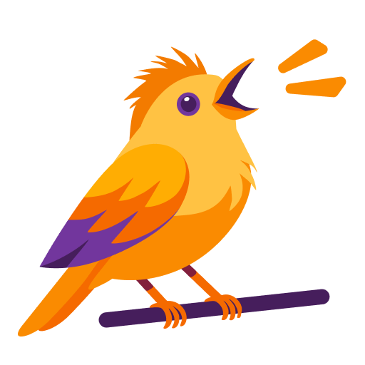

### 📌 요약
여러 언어를 동시에 사용하며 사고하고 학습하는 사람들을 위한 초다국어 번역 및 학습 AI 에이전트, 'Polyglotta'가 출시되었습니다.

### 🔑 핵심 기능
- 🎯 Target Audience: 두 개 이상의 언어로 말하고, 생각하고, 학습하는 다국어 사용자 및 언어 학습자.
- ✨ Key Differentiator: 단순히 텍스트를 옮기는 것을 넘어, 여러 언어의 교차 지점에서 학습과 사고를 돕는 AI 에이전트 역할.
- 💡 Core Feature: 다양한 언어를 한 번에 번역하고 학습하는 멀티링구얼(Multilingual) 기능.

### 📸 스크린샷 및 갤러리
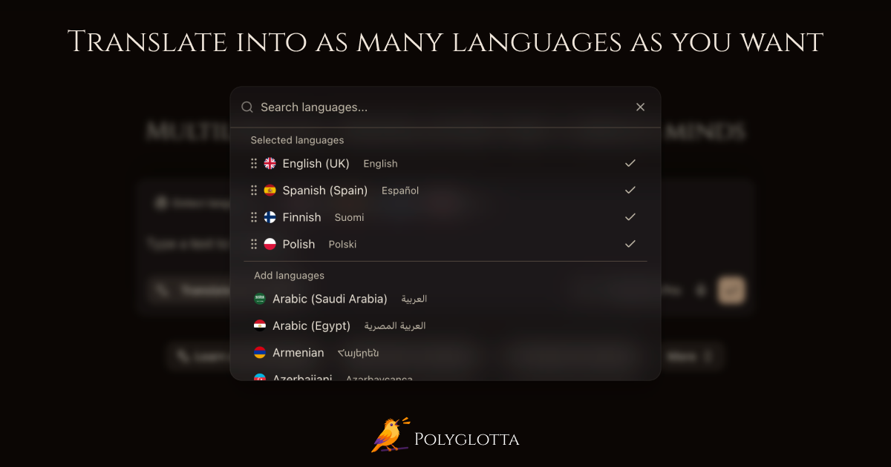
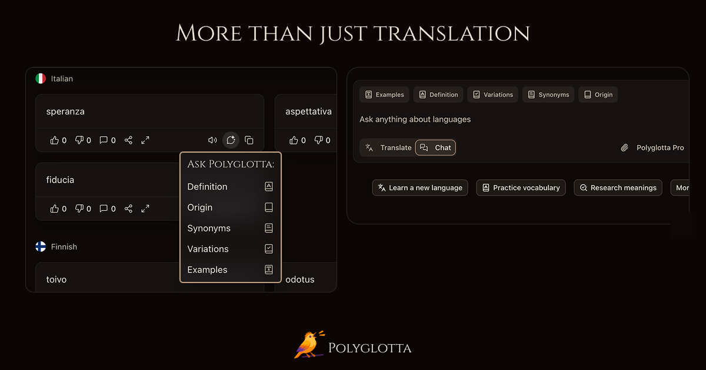

---

