# 🚀 Product Hunt Daily Top 10 (2026-01-29)

## 1. [Pandada AI](https://www.producthunt.com/products/pandada-ai?utm_campaign=producthunt-api&utm_medium=api-v2&utm_source=Application%3A+antigravity_test+%28ID%3A+258588%29)
**Votes**: 420 | **Tagline**: Build data wealth: Turns files into McKinsey-level insights

### 📌 요약
복잡하고 지저분한 파일(CSV, PDF, 사진 등)들을 단 몇 초 만에 다운로드 및 공유 가능한 '맥킨지 레벨'의 전문 보고서와 프레젠테이션으로 탈바꿈시켜주는 AI 기반 데이터 자산화 솔루션.

### 🔑 핵심 기능
- 🎯 Target Audience: 데이터 분석 능력이 부족한 현업 실무자부터 데이터 과학자까지, 데이터를 활용해야 하는 모든 의사결정자.
- ✨ Key Differentiator: 단순한 데이터 '질의응답(채팅)' 수준을 넘어, 지저분한 원본 파일에서 바로 의사결정에 필요한 전문적인 보고서 포맷(다운로드 및 공유 가능)을 완성해준다는 점.
- 💡 Core Feature: CSV, PDF, 엑셀은 물론 사진 파일까지 포함하여 다양한 형식의 비정형 데이터를 즉시 분석하고, '맥킨지급 인사이트'가 담긴 보고서 및 PT 자료로 변환해주는 기능.

### 📸 스크린샷 및 갤러리
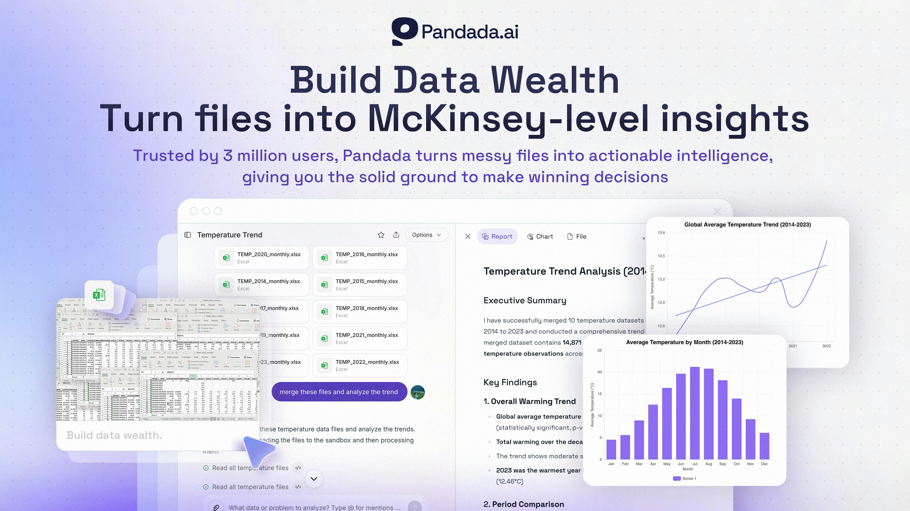
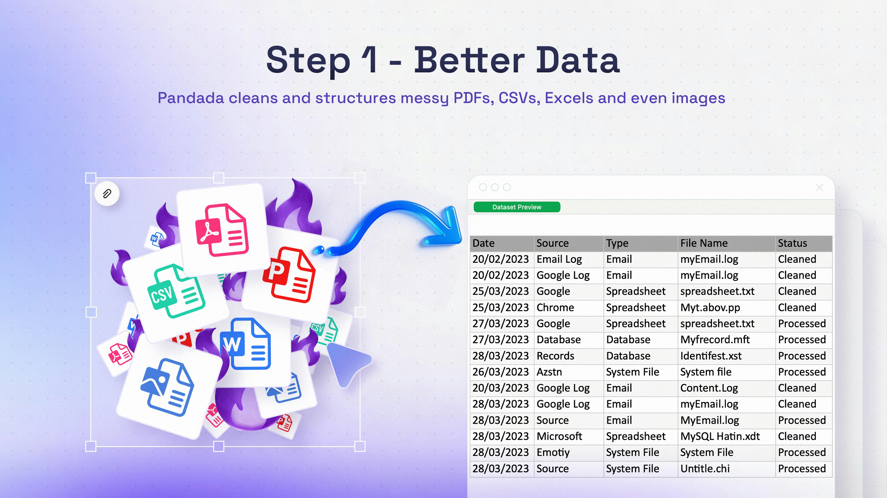
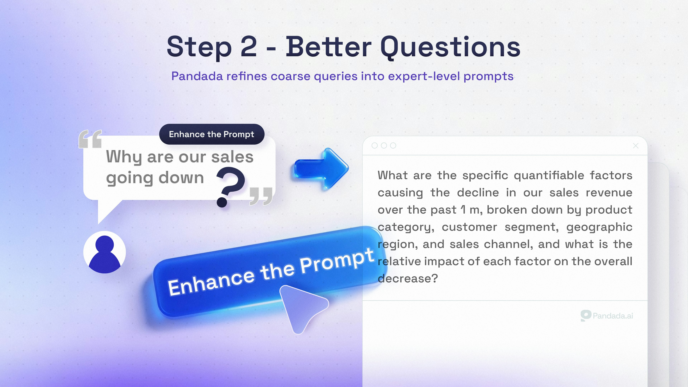

### 🎬 관련 영상
- [🎥 영상 보기](https://ph-files.imgix.net/1883aab1-044e-4971-ba69-cb9ddfa5d88a.jpeg?auto=format)

---

## 2. [TravelAnimator](https://www.producthunt.com/products/travel-animator?utm_campaign=producthunt-api&utm_medium=api-v2&utm_source=Application%3A+antigravity_test+%28ID%3A+258588%29)
**Votes**: 367 | **Tagline**: Turn Google Maps URLs into stunning map animations.

### 📌 요약
복잡한 편집 없이 구글 맵 URL만 넣으면, 영화 같은 퀄리티의 3D 여행 기록 영상을 뚝딱 만들어주는 크리에이터 필수템입니다. 여행의 경로를 시각적으로 가장 빠르고 멋지게 보여줍니다.

### 🔑 핵심 기능
- 🎯 여행 브이로그 제작자, 콘텐츠 크리에이터, 그리고 자신의 여행 경로를 하이엔드 퀄리티로 기록하고 싶은 모든 스토리텔러.
- ✨ 250개 이상의 3D 차량 모델, 30가지 지도 스타일 지원으로 디테일한 커스터마이징이 가능하며, 4K 고화질 무광고 출력을 지원합니다.
- 💡 구글 지도 URL 하나만으로 자동 완성되는 경로 영상에, 여행 중 찍은 사진을 삽입하여 더욱 입체적인 스토리텔링을 할 수 있습니다.

### 📸 스크린샷 및 갤러리

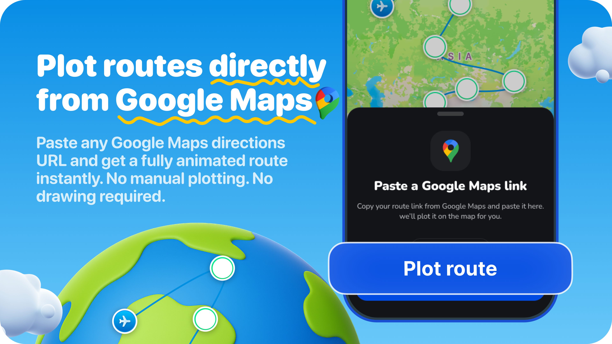
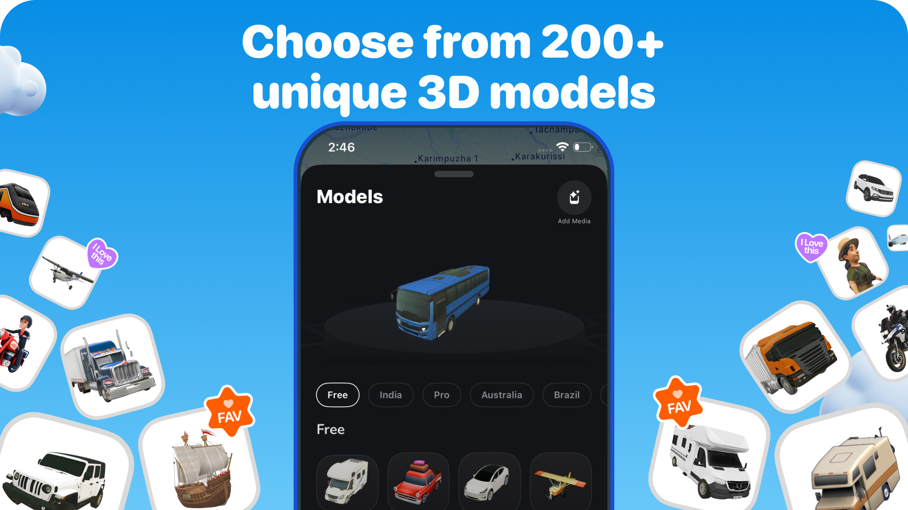

### 🎬 관련 영상
- [🎥 영상 보기](https://ph-files.imgix.net/5dc3bfd1-f35b-4788-944f-192a761e4253.jpeg?auto=format)

---

## 3. [Meet-Ting](https://www.producthunt.com/products/meet-ting?utm_campaign=producthunt-api&utm_medium=api-v2&utm_source=Application%3A+antigravity_test+%28ID%3A+258588%29)
**Votes**: 214 | **Tagline**: AI that gives your schedule a brain.

### 📌 요약
당신의 이메일과 문자를 이해하고, 설정한 목표에 따라 미팅 예약부터 변경까지 알아서 처리해 주는 '스마트 뇌'를 가진 AI 스케줄 관리 서비스입니다.

### 🔑 핵심 기능
- 🎯 Target Audience: 잦은 외부 미팅 조율로 시간을 낭비하는 전문가, 복잡한 캘린더 관리 시간을 혁신적으로 줄이고 싶은 매니저 및 임원.
- ✨ Key Differentiator: 단순히 시간만 비워주는 것이 아니라, 사용자의 목표와 패턴을 학습(AI Intuition)하여 일정 우선순위를 자율적으로 조정하며, 주간 목표와 캘린더를 능동적으로 동기화합니다.
- 💡 Core Feature: 최대 5인까지의 미팅을 이메일이나 문자 CC만으로 예약, 변경, 사전 브리핑, 노쇼 처리까지 전적으로 위임할 수 있는 '자동 위임 기능'.

### 📸 스크린샷 및 갤러리
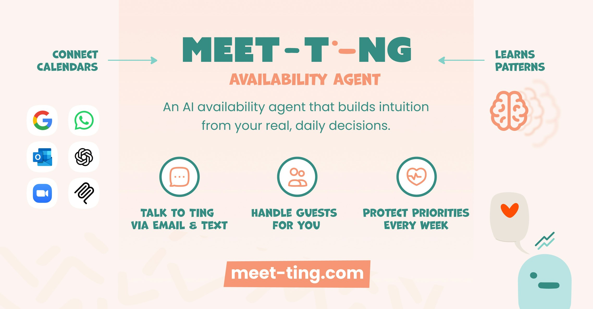
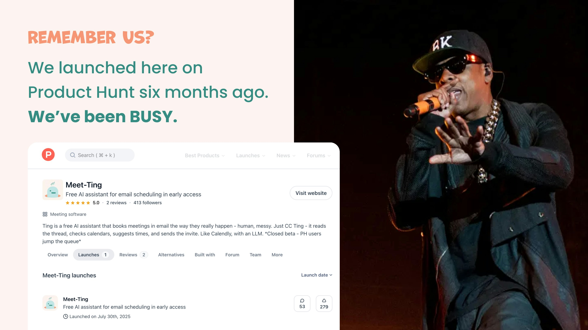
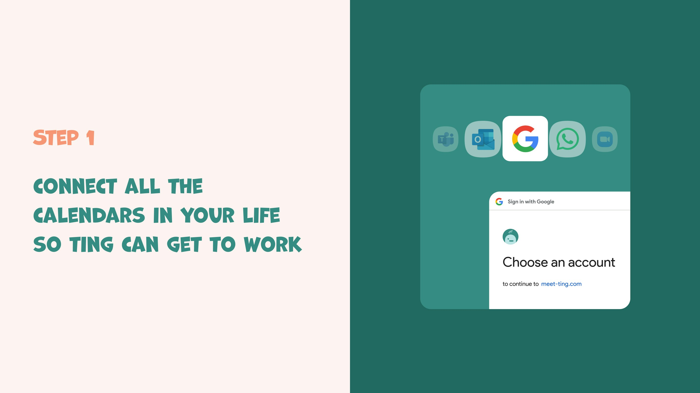

### 🎬 관련 영상
- [🎥 영상 보기](https://ph-files.imgix.net/77668ac5-cc02-4eb4-ab7a-f8cccf2920f5.jpeg?auto=format)

---

## 4. [AI Chrome Extension Builder](https://www.producthunt.com/products/shipper-now?utm_campaign=producthunt-api&utm_medium=api-v2&utm_source=Application%3A+antigravity_test+%28ID%3A+258588%29)
**Votes**: 196 | **Tagline**: Build Chrome Extensions by Talking to AI

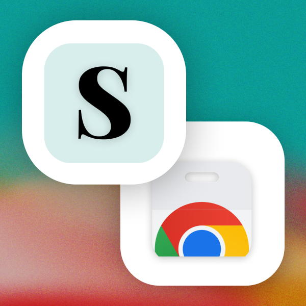

### 📌 요약
코딩 지식 없이도 '말 한마디'로 나만의 크롬 확장 프로그램을 완성해주는 혁신적인 AI 빌더가 떴습니다. 누구나 아이디어만 있다면 5분 만에 개발자가 될 수 있습니다.

### 🔑 핵심 기능
- 🎯 Target Audience: 코딩 지식 없이 확장 프로그램을 만들고 싶은 일반 사용자 및 아이디어 구현에 목마른 비개발자 (No-code creators and non-developers who are blocked by the development hurdle).
- ✨ Key Differentiator: 복잡한 개발 언어 대신, 평범한 영어 명령어(Plain English)로 빌딩, 코딩, 디자인, 심지어 스토어 등록까지 전 과정을 AI가 처리합니다.
- 💡 Core Feature: 아이디어 발상(프롬프트)부터 실제 크롬 웹 스토어 목록(Listing) 작성 및 개인정보 보호 정책(Privacy Policy) 생성까지 원클릭으로 자동화합니다.

### 📸 스크린샷 및 갤러리
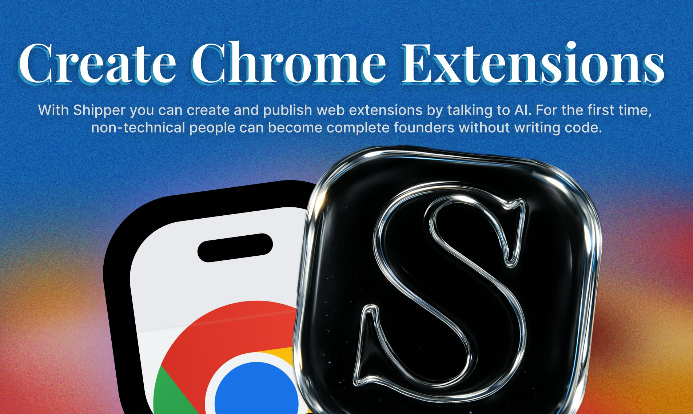
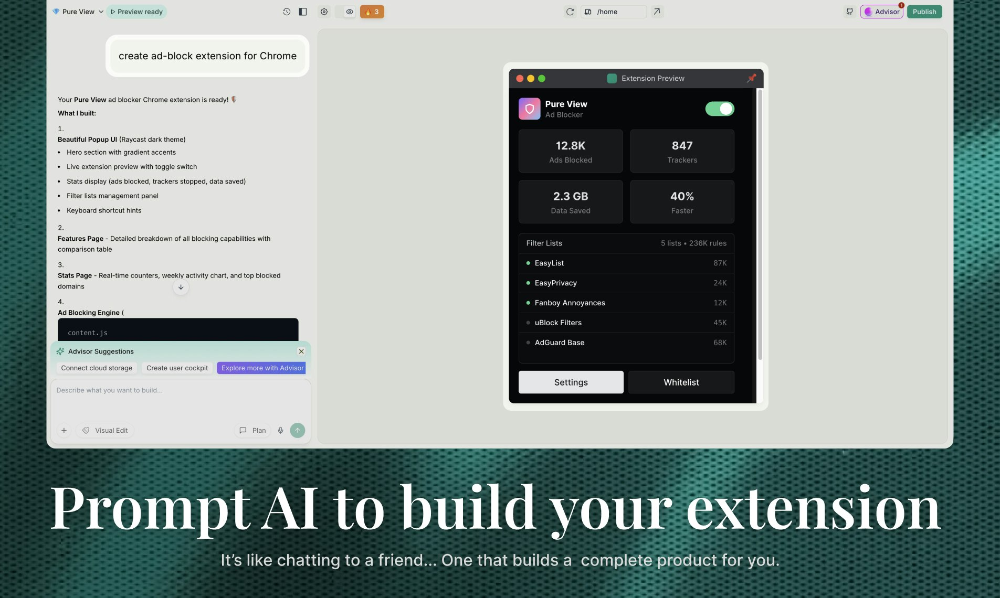
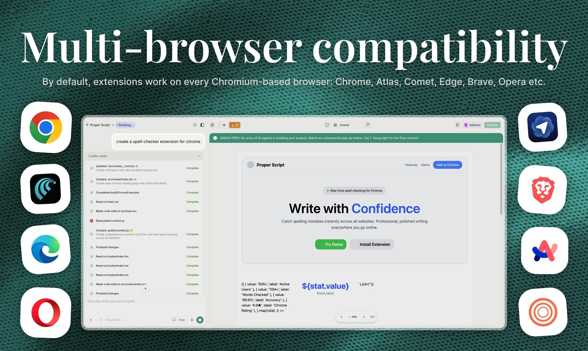

### 🎬 관련 영상
- [🎥 영상 보기](https://ph-files.imgix.net/802a7a26-e681-4dbd-bb83-930e5684e2df.jpeg?auto=format)

---

## 5. [Meteroid](https://www.producthunt.com/products/meteroid-2?utm_campaign=producthunt-api&utm_medium=api-v2&utm_source=Application%3A+antigravity_test+%28ID%3A+258588%29)
**Votes**: 195 | **Tagline**: Billing platform to launch, test, + scale business models

### 📌 요약
복잡한 과금 시스템 때문에 고민이신가요? 초기 스타트업도 마치 유니콘처럼 유연하게 BM(비즈니스 모델)을 실험하고 즉시 확장할 수 있게 해주는 오픈소스 기반의 올인원 수익화 엔진, 'Meteroid'를 소개합니다.

### 🔑 핵심 기능
- 🎯 Target Audience: 복잡한 과금 모델(구독, 종량제, 견적 기반)을 빠르게 구축하고 실험해야 하는 초기 단계의 SaaS 팀 및 스타트업.
- ✨ Key Differentiator: 구독부터 종량제, 인보이싱, BI까지 단일 엔진으로 통합 관리하며, 완전한 오픈소스(Not Open Core)로 제공되어 높은 확장성과 소유권을 보장.
- 💡 Core Feature: 모든 수익화 방식(Subscription, Usage-based)과 GTM 전략을 단일 플랫폼에서 즉시 테스트하고 지원하는 '무한 비즈니스 모델 확장성'.

### 📸 스크린샷 및 갤러리
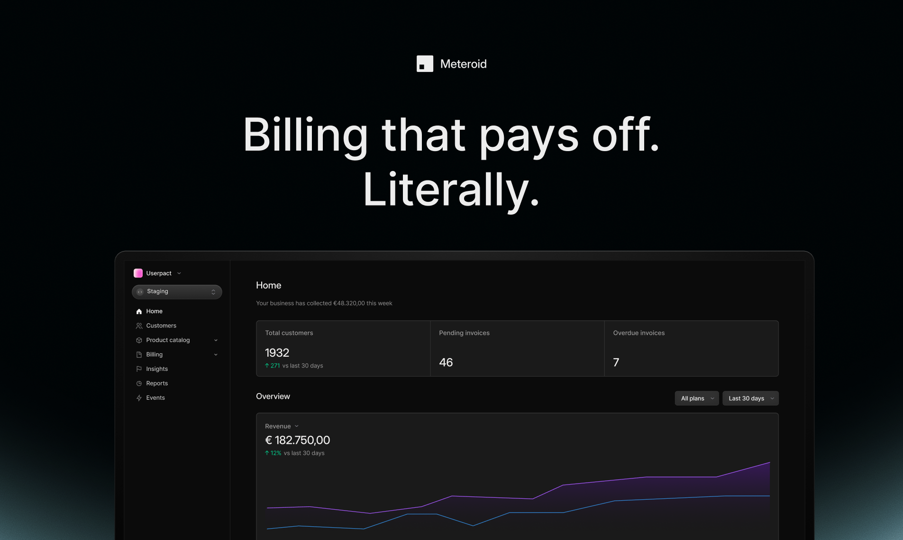
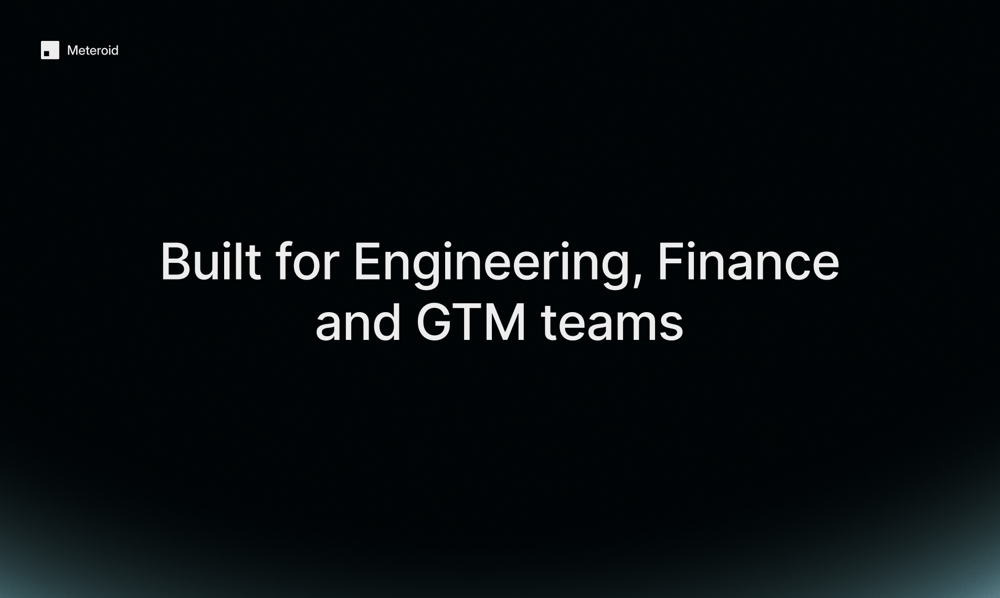
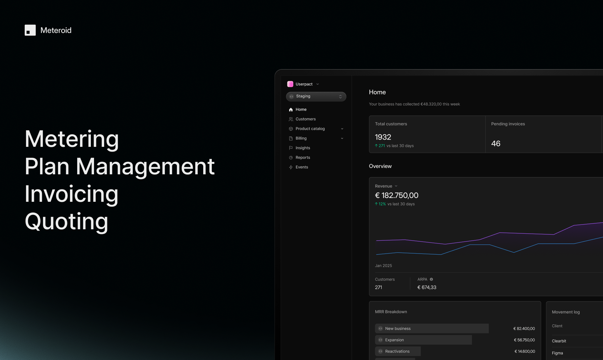

### 🎬 관련 영상
- [🎥 영상 보기](https://ph-files.imgix.net/ed453ff2-ea0b-4329-8403-ce6e7c2779d8.jpeg?auto=format)

---

## 6. [The Prompting Company](https://www.producthunt.com/products/the-prompting-company?utm_campaign=producthunt-api&utm_medium=api-v2&utm_source=Application%3A+antigravity_test+%28ID%3A+258588%29)
**Votes**: 180 | **Tagline**: SEO is dead. Be the product cited by ChatGPT.

### 📌 요약
이제 검색엔진 최적화(SEO)는 끝났습니다. 구글이 아닌 ChatGPT가 당신의 제품을 추천하게 만드는, 'AI 시대의 인용 최적화(Citation Optimization)' 솔루션입니다.

### 🔑 핵심 기능
- 🎯 Target Audience: AI 추천에 의존하는 신규 고객 유입을 원하는 콘텐츠 마케터, 스타트업, 그리고 B2B 솔루션 기업.
- ✨ Key Differentiator: 기존의 Google 검색 순위 경쟁이 아닌, AI 모델(ChatGPT 등)이 인용할 만한 '권위 있는 답변 소스'로 자리매김하도록 돕는 새로운 마케팅 패러다임 제시.
- 💡 Core Feature: AI가 선호하는 데이터 구조와 콘텐츠 스타일로 기업 정보를 재구성하여, 사용자의 프롬프트 질문에 제품이 직접적인 답변 소스로 추출될 확률을 극대화하는 컨설팅 및 도구.

### 📸 스크린샷 및 갤러리

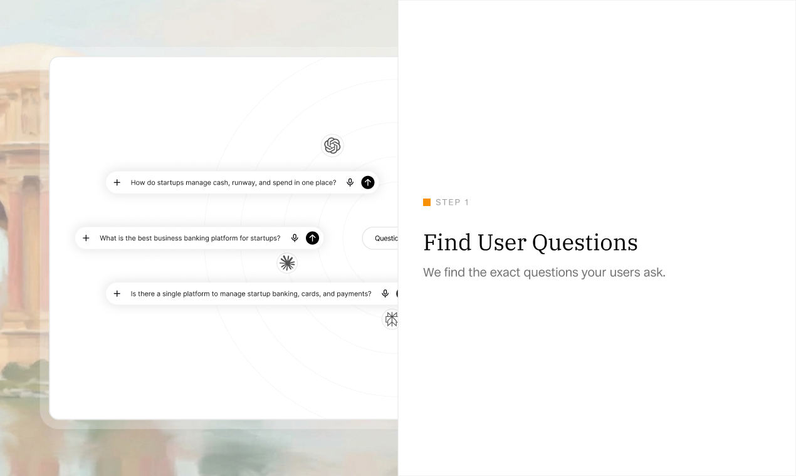
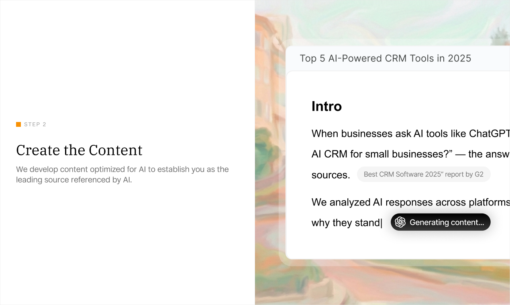

### 🎬 관련 영상
- [🎥 영상 보기](https://ph-files.imgix.net/e2ce2b9a-cdf2-465d-91f0-46d5fa54491c.jpeg?auto=format)

---

## 7. [Agentic Vision in Gemini](https://www.producthunt.com/products/gemini-6?utm_campaign=producthunt-api&utm_medium=api-v2&utm_source=Application%3A+antigravity_test+%28ID%3A+258588%29)
**Votes**: 154 | **Tagline**: Agentic visual reasoning with code execution

### 📌 요약
정지된 이미지를 에이전트처럼 '사고'하고 코드를 실행해 결과를 도출하는, 제미나이의 차세대 비전 처리 능력입니다.

### 🔑 핵심 기능
- 🎯 Target Audience: 복잡한 이미지 분석, 시각적 문제 해결, 자동화된 데이터 추출이 필요한 AI 개발자와 연구원
- ✨ Key Differentiator: 기존의 '이미지 캡션 생성' 수준을 넘어, 이미지 정보를 기반으로 추론하고 계획을 세워 코드를 실행하는 능동적인(Agentic) 비전 처리 기술
- 💡 Core Feature: 이미지를 분석하고 이해한 뒤, 파이썬 코드 실행 환경(Code Execution)을 활용하여 시각적 문제를 해결하고 최종 결과를 도출하는 '시각적 추론 및 코드 실행' 결합

### 📸 스크린샷 및 갤러리
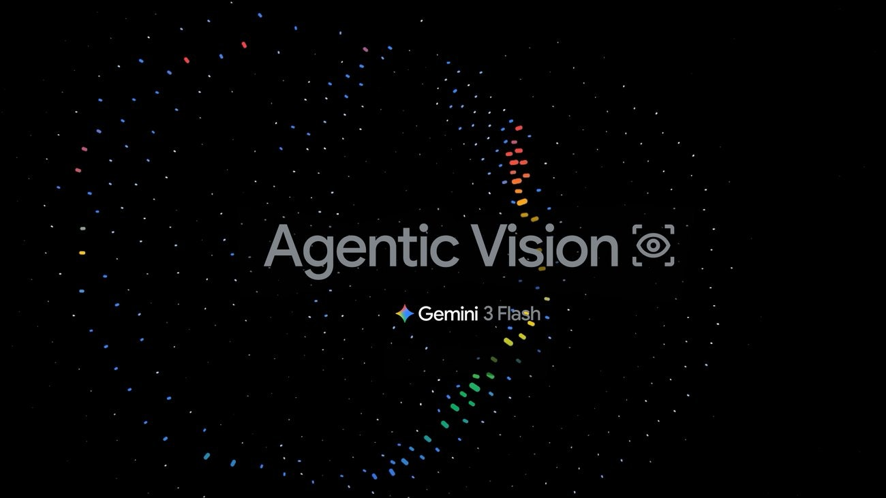
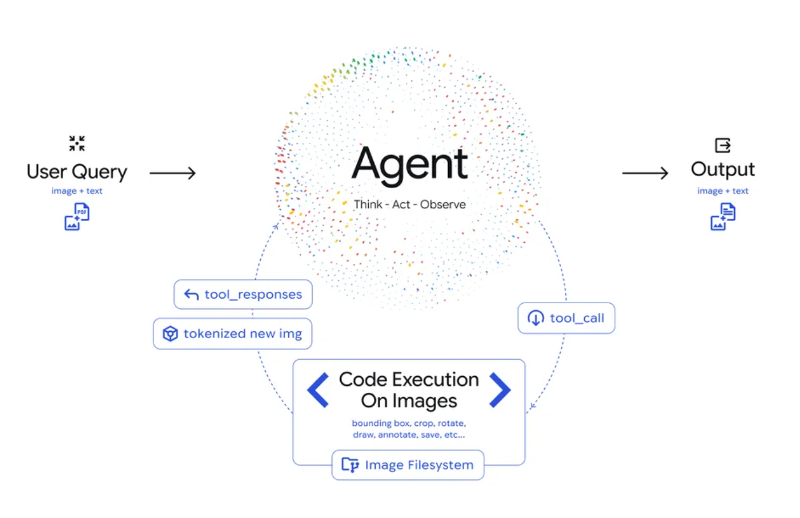
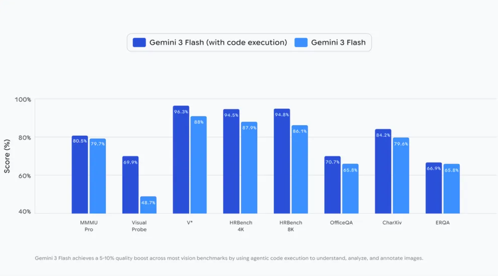

---

## 8. [StoryCV](https://www.producthunt.com/products/storycv?utm_campaign=producthunt-api&utm_medium=api-v2&utm_source=Application%3A+antigravity_test+%28ID%3A+258588%29)
**Votes**: 147 | **Tagline**: Guided AI that interviews you and writes your resume for you

### 📌 요약
이력서 작성의 고통을 끝낼 시간! AI가 구직자와 인터뷰를 진행하고 내용을 바탕으로 프로페셔널한 이력서를 대신 작성해주는 혁신적인 서비스입니다.

### 🔑 핵심 기능
- 🎯 Target Audience: 이력서 작성에 어려움을 느끼거나, 성과를 전문적인 글로 표현하는 데 서툰 모든 구직자.
- ✨ Key Differentiator: 기존 빌더처럼 내용을 먼저 채우게 하는 대신, AI가 사용자에게 질문하며 '인터뷰'를 통해 스토리를 추출하고 문장을 구성함.
- 💡 Core Feature: 사용자의 대화(인터뷰) 내용에서 핵심 맥락을 파악하고, 명확하고 전문적인 이력서 핵심 문장(bullet points)으로 자동 변환하여 제공.

### 📸 스크린샷 및 갤러리
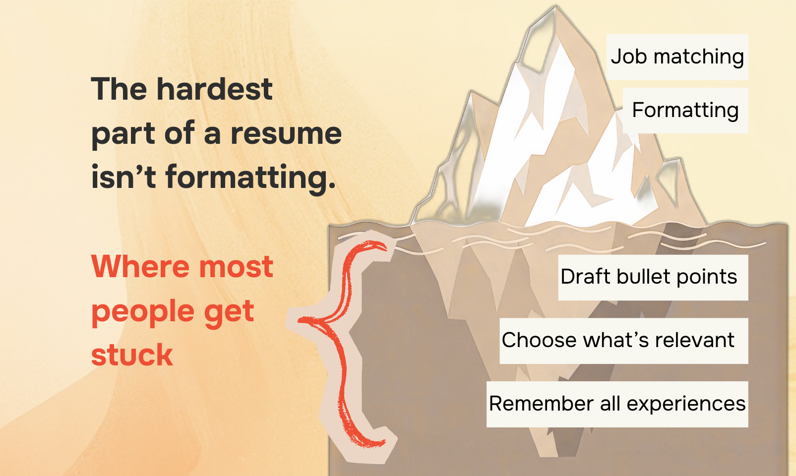
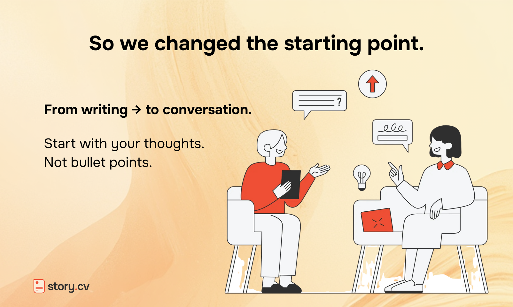
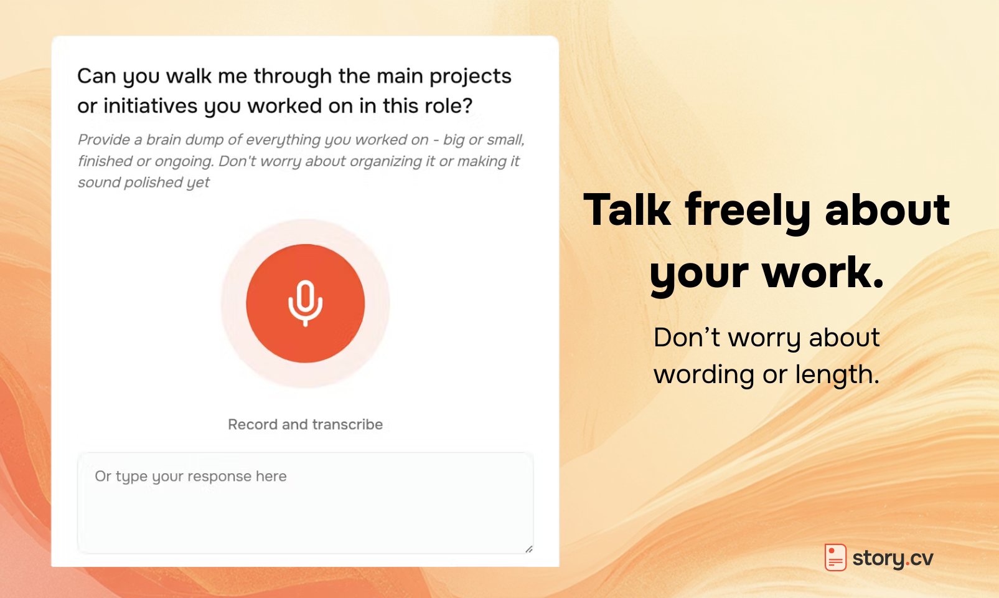

### 🎬 관련 영상
- [🎥 영상 보기](https://ph-files.imgix.net/16f54c46-0286-4027-8cde-2eeeab2cbed3.jpeg?auto=format)

---

## 9. [Kipps AI WhatsApp Agent](https://www.producthunt.com/products/kipps-ai?utm_campaign=producthunt-api&utm_medium=api-v2&utm_source=Application%3A+antigravity_test+%28ID%3A+258588%29)
**Votes**: 138 | **Tagline**:  Turn WhatsApp chats into revenue on autopilot

### 📌 요약
요즘 핫한 'Kipps AI'는 WhatsApp 비즈니스 자동화의 끝판왕입니다. 월 단돈 11달러로 AI 에이전트가 고객 문의를 처리하고, 생일 축하 및 리워드 메시지까지 알아서 보내주며, 채팅을 놓치지 않고 매출로 전환시켜주는 가성비 최강의 자동화 툴입니다.

### 🔑 핵심 기능
- 🎯 Target Audience: WhatsApp을 주요 영업 채널로 사용하며, 고객 채팅 관리 및 충성도 기반 매출 증대를 원하는 소규모 비즈니스 오너 및 마케터.
- ✨ Key Differentiator: AI가 빠르게 응대하는 동시에 중요한 이슈 발생 시 사람이 즉시 개입할 수 있는 간편하고 유연한 통합 인박스 구조.
- 💡 Core Feature: 고객 생일, 보상, 로열티 선물을 자동으로 발송하여 고객 이탈을 막고 재구매율을 높이는 선제적 자동화 마케팅 기능.

### 📸 스크린샷 및 갤러리
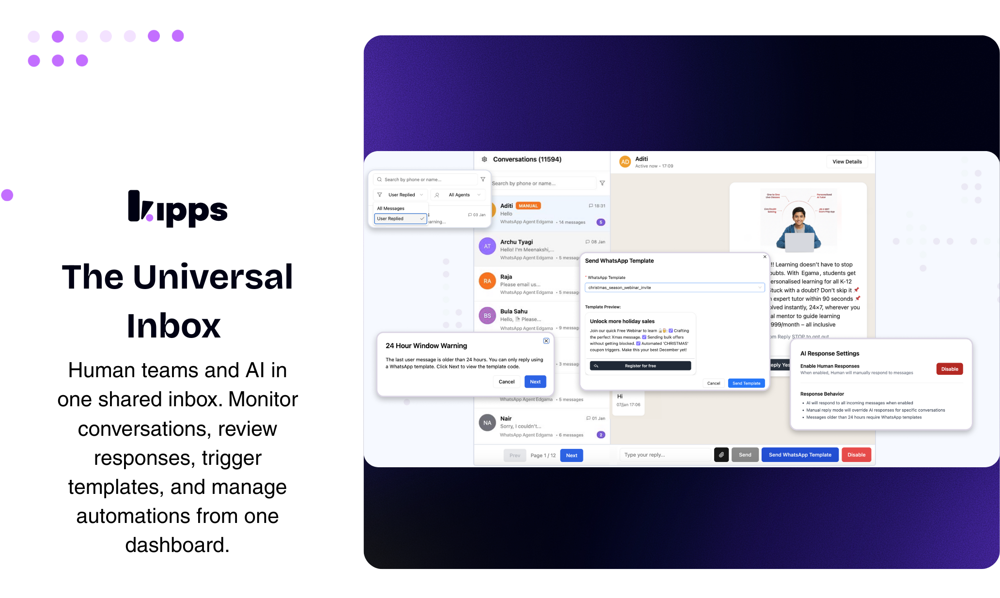
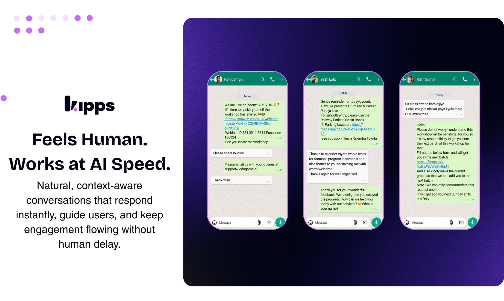
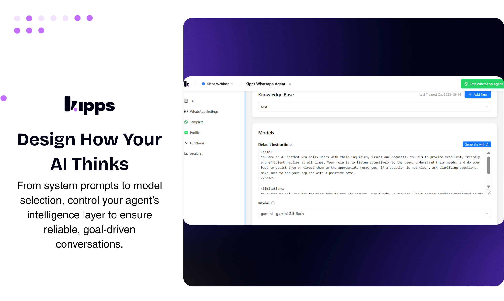

### 🎬 관련 영상
- [🎥 영상 보기](https://ph-files.imgix.net/e1025fd5-8ac1-4cfc-9b41-e48fd8d0cbe8.jpeg?auto=format)

---

## 10. [HighlightGPT](https://www.producthunt.com/products/highlightgpt?utm_campaign=producthunt-api&utm_medium=api-v2&utm_source=Application%3A+antigravity_test+%28ID%3A+258588%29)
**Votes**: 118 | **Tagline**: Highlight in ChatGPT, ask GPT in a side panel

### 📌 요약
ChatGPT를 단순히 챗봇으로만 쓰는 건 아깝죠. HighlightGPT는 ChatGPT 화면 자체를 독서 및 사고를 위한 '워크스페이스'로 탈바꿈시켜주는 작지만 강력한 크롬 확장 프로그램입니다.

### 🔑 핵심 기능
- 🎯 Target Audience: ChatGPT로 논문, 긴 문서, 코드 등을 읽고 분석하며 작업하는 사용자 (정보 소비와 사고 과정을 한 곳에서 처리하고 싶은 사람).
- ✨ Key Differentiator: ChatGPT 화면 내에서 바로 텍스트를 하이라이트하고, 별도의 사이드 패널을 열어 AI에게 질문, 설명 요청, 번역, 저장 등을 즉시 처리 가능. (창 전환 불필요)
- 💡 Core Feature: 텍스트 하이라이트 후 바로 뜨는 사이드 패널을 통해 문맥(Context)을 유지한 채 다양한 AI 작업을 수행하고, 중요한 내용은 '기억(memorizes)'으로 저장하는 기능.

### 📸 스크린샷 및 갤러리
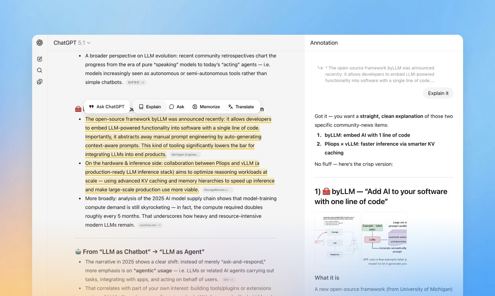
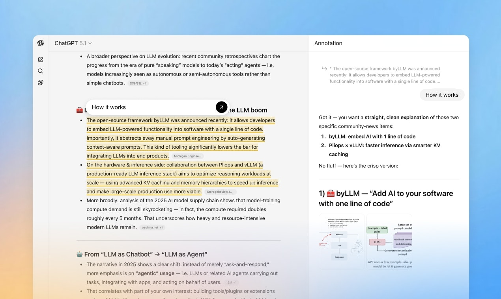

### 🎬 관련 영상
- [🎥 영상 보기](https://ph-files.imgix.net/70fc64a9-80a8-46cd-8e9a-688205d38db7.jpeg?auto=format)

---

