# 🚀 Product Hunt Daily Top 10 (2026-01-30)

## 1. [Leapility](https://www.producthunt.com/products/leapility-3?utm_campaign=producthunt-api&utm_medium=api-v2&utm_source=Application%3A+antigravity_test+%28ID%3A+258588%29)
**Votes**: 362 | **Tagline**: Turn your repetitive workflows into AI-powered playbooks

### 📌 요약
복잡한 AI 툴 저글링은 이제 그만! 내 전문 지식과 반복 업무 프로세스를 '플레이북'으로 저장하고, AI에게 맡겨 산출량을 무제한으로 확장시켜주는 워크플로우 자동화 혁신 툴입니다.

### 🔑 핵심 기능
- 🎯 Target Audience: 반복적인 전문 업무에 지쳤거나, 파편화된 AI 도구를 통합적으로 활용해 생산성을 폭발적으로 높이고 싶은 모든 지식 전문가.
- ✨ Key Differentiator: 단순히 AI 챗봇을 사용하는 것을 넘어, 복잡한 업무 프로세스(소스, 단계, 규칙) 자체를 코드 없이 '플레이북'으로 저장하여 즉시 재활용하고 규모를 확장할 수 있습니다.
- 💡 Core Feature: 한 번 정의한 전문 업무 플레이북을 버튼 하나로 즉시 구동(Hit Run)시켜, AI가 자료 검색부터 최종 결과물 도출까지 전체 작업을 자동 처리하게 만드는 '원클릭 자동 실행' 기능.

### 📸 스크린샷 및 갤러리
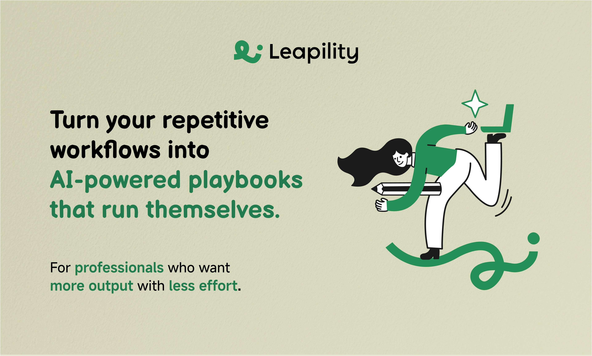
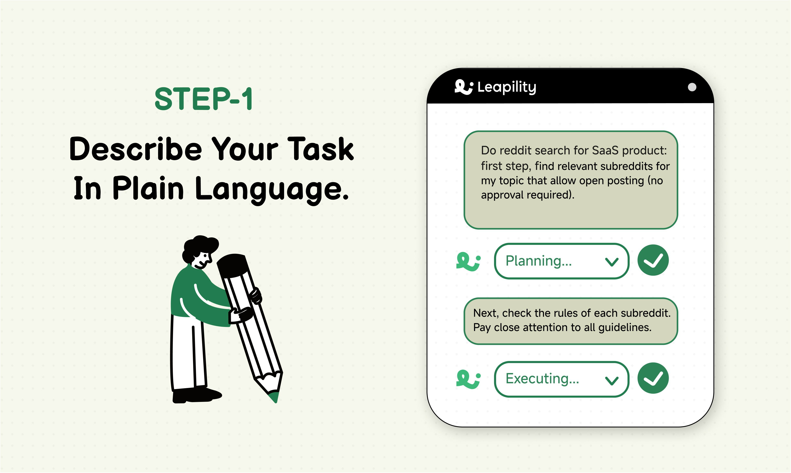
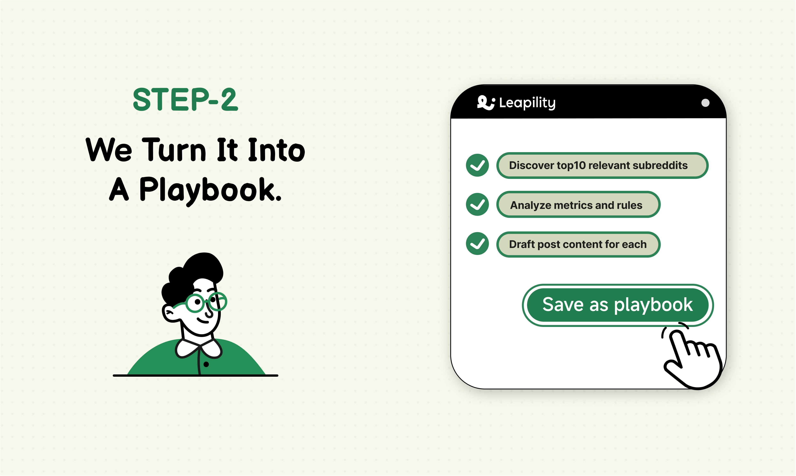

### 🎬 관련 영상
- [🎥 영상 보기](https://ph-files.imgix.net/795e20e8-0c82-47ea-aeaa-c0697939c7c3.jpeg?auto=format)

---

## 2. [Kalendar.work](https://www.producthunt.com/products/kalendar-work-the-calendly-replacement?utm_campaign=producthunt-api&utm_medium=api-v2&utm_source=Application%3A+antigravity_test+%28ID%3A+258588%29)
**Votes**: 239 | **Tagline**: A free fully featured Calendly alternative

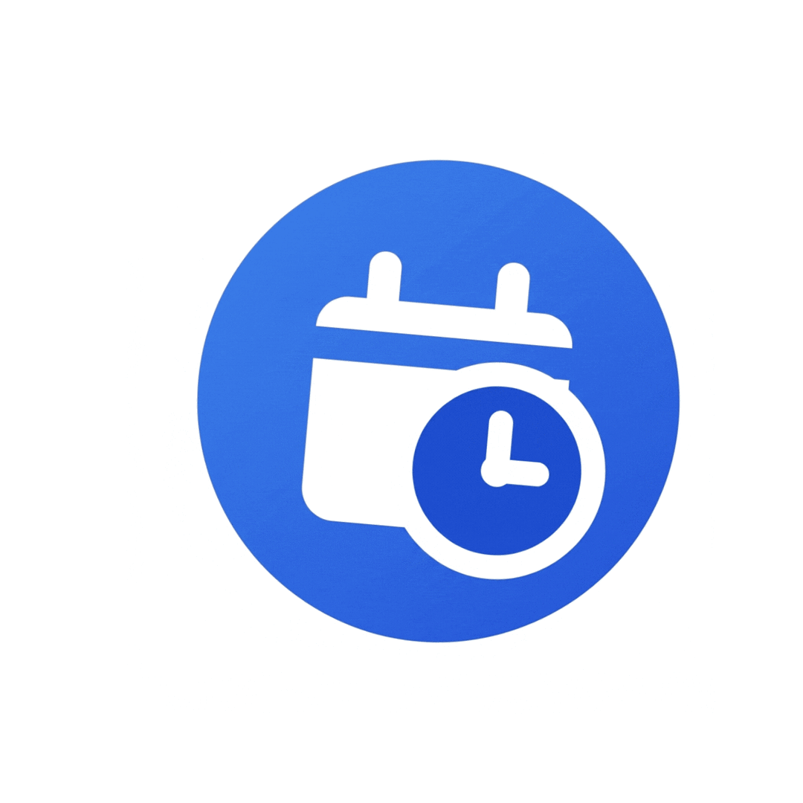

### 📌 요약
🔒 종속 없이 무제한 사용 가능한 '탈(脫) 칼렌들리' 솔루션! 강력한 기능은 유지하되, 복잡한 구독료와 좌석 제한 없이 팀이 직접 소유하고 확장할 수 있는 무료 스케줄링 툴이 등장했습니다.

### 🔑 핵심 기능
- 🎯 Target Audience: 비싼 구독료와 '좌석별 가격(Per-seat pricing)' 정책에 지쳤거나, 스케줄링 툴을 워크플로우에 완벽하게 맞춰 커스터마이징하고 싶은 스타트업 및 개발 조직.
- ✨ Key Differentiator: '무제한 무료' 모델. 단순 임대(rent) 방식이 아닌, 필요에 따라 코드를 직접 확장하고 장기적으로 '소유'할 수 있는 철학 (Founding.dev 기반).
- 💡 Core Feature: 자체 브랜드(Branding)를 완벽하게 적용할 수 있으며, 인원수나 이벤트 타입 제한 없이 무제한으로 예약 링크를 생성하고 가용성을 관리하는 기능.

### 📸 스크린샷 및 갤러리
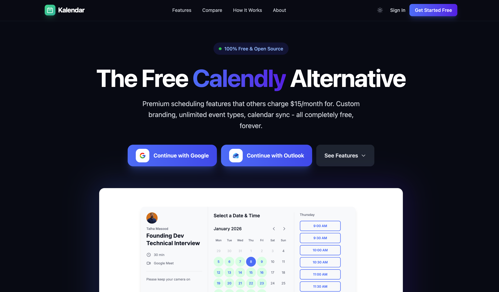
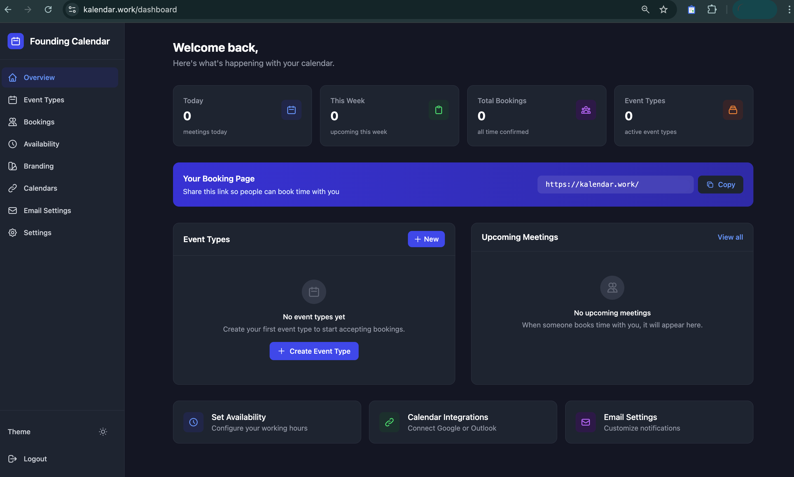
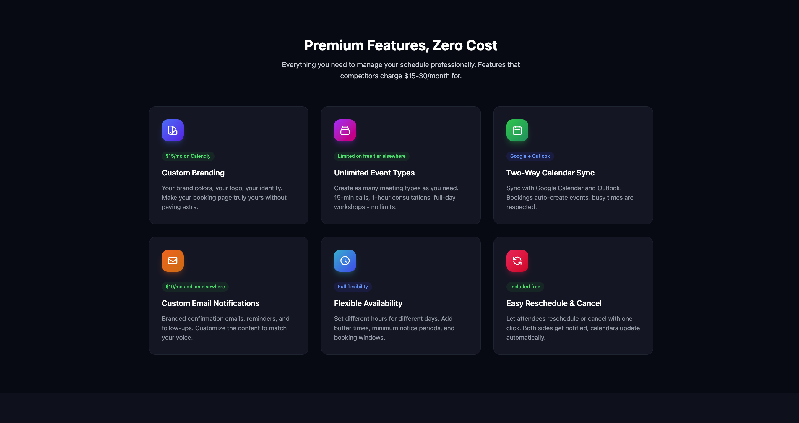

### 🎬 관련 영상
- [🎥 영상 보기](https://ph-files.imgix.net/9647c07a-8b21-4d15-8ea3-1fdeab0f9e0c.jpeg?auto=format)

---

## 3. [NMTV](https://www.producthunt.com/products/nmtv?utm_campaign=producthunt-api&utm_medium=api-v2&utm_source=Application%3A+antigravity_test+%28ID%3A+258588%29)
**Votes**: 219 | **Tagline**: I built a 24/7 MTV time machine to save my wife’s birthday

### 📌 요약
아내가 슬퍼해서 직접 만든 24시간 레트로 MTV 타임머신! 80년대부터 2000년대까지 공식 뮤직비디오와 광고로 채워진 '채널 돌리기' 감성 그대로의 헌정 서비스입니다.

### 🔑 핵심 기능
- 🎯 Target Audience: MTV의 추억이 있는 30~50대 시청자, 큐레이션된 레트로 콘텐츠를 선호하는 사용자
- ✨ Key Differentiator: 검색/건너뛰기가 없는 'TV 채널 고정' 방식의 UX, 오직 공식 뮤직비디오와 빈티지 광고로만 구성된 하이퀄리티 큐레이션
- 💡 Core Feature: 8개의 시대별/장르별 큐레이션 채널 (80s, 90s, 2000s 등) 및 유튜브 재생목록을 나만의 채널로 추가하는 커스텀 방송 기능

### 📸 스크린샷 및 갤러리

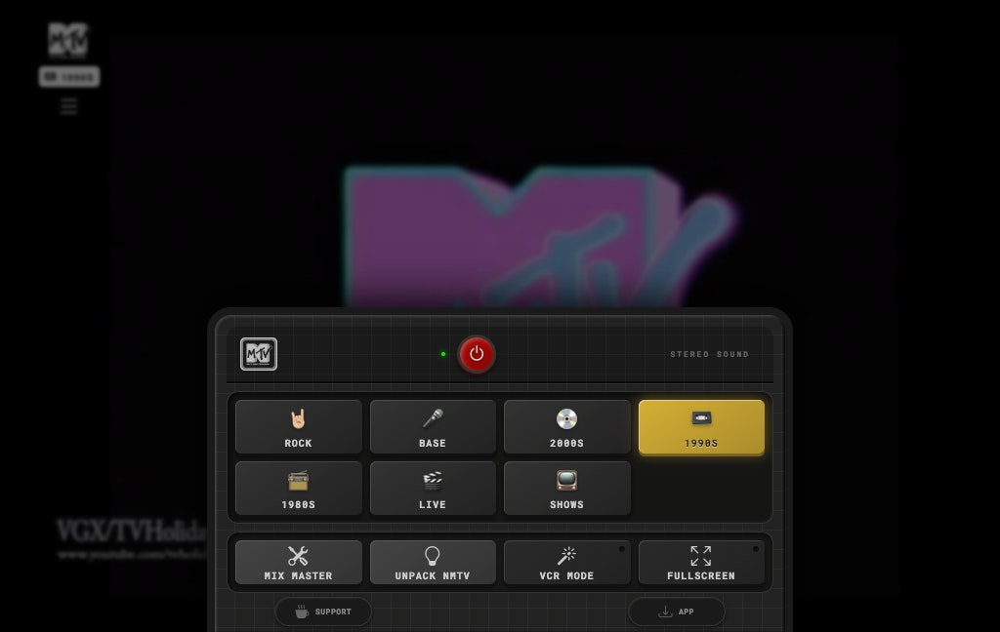

---

## 4. [Sheetsbase](https://www.producthunt.com/products/sheetsbase-stop-googling-formulas?utm_campaign=producthunt-api&utm_medium=api-v2&utm_source=Application%3A+antigravity_test+%28ID%3A+258588%29)
**Votes**: 154 | **Tagline**: AI formulas generator and shortcuts for Google Sheets

### 📌 요약
구글 시트(Google Sheets) 사용자들의 영원한 숙제였던 복잡한 수식 생성 및 이해를 인공지능(AI) 기반으로 해결하고, 작업 속도를 극대화하는 크롬 확장 프로그램입니다. 시트 옆 패널에서 모든 기능을 즉시 사용할 수 있어 탭 전환 없이 빠르고 정확하게 작업할 수 있게 도와줍니다.

### 🔑 핵심 기능
- 🎯 Target Audience: 구글 시트를 자주 사용하며, 복잡한 수식(함수) 생성에 어려움을 느끼거나 작업 효율성을 높이고 싶은 모든 사용자 (데이터 분석가, 마케터, 기획자 등)
- ✨ Key Differentiator: 크롬 브라우저 사이드 패널에 상주하여 탭 이동 없이 즉각적인 AI 수식 생성 및 이해가 가능하며, 필요한 단축키와 수식 디렉토리를 통합 검색할 수 있는 올인원 접근성
- 💡 Core Feature: 평문(Plain English)으로 원하는 결과를 설명하면 AI가 즉시 구글 시트 함수(Formula)를 생성해주고, 기존 복잡한 수식의 작동 원리를 간단하게 설명해주는 기능

### 📸 스크린샷 및 갤러리
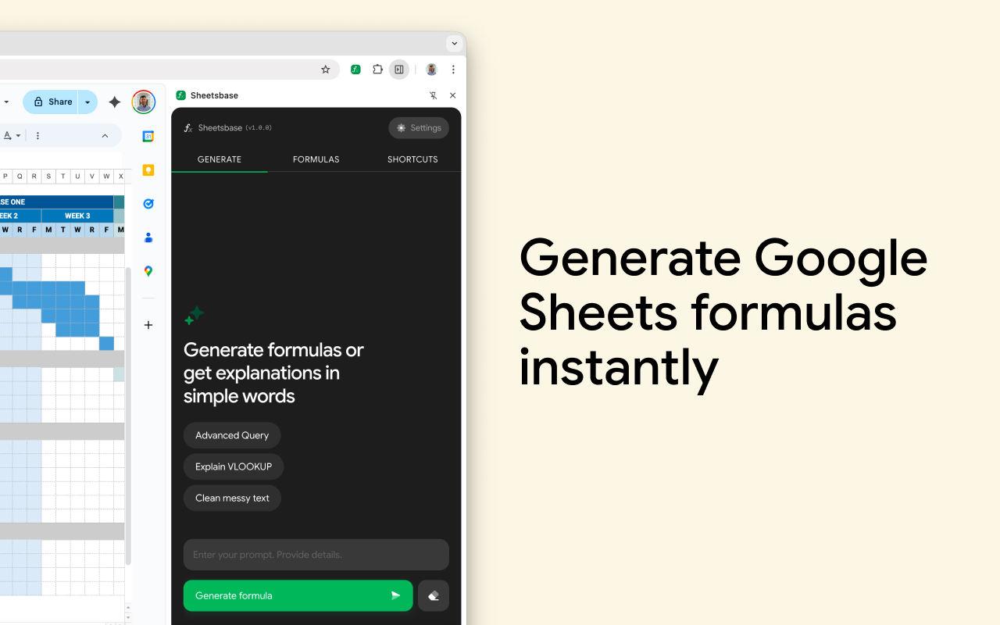
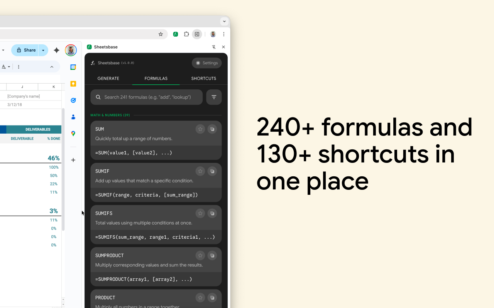
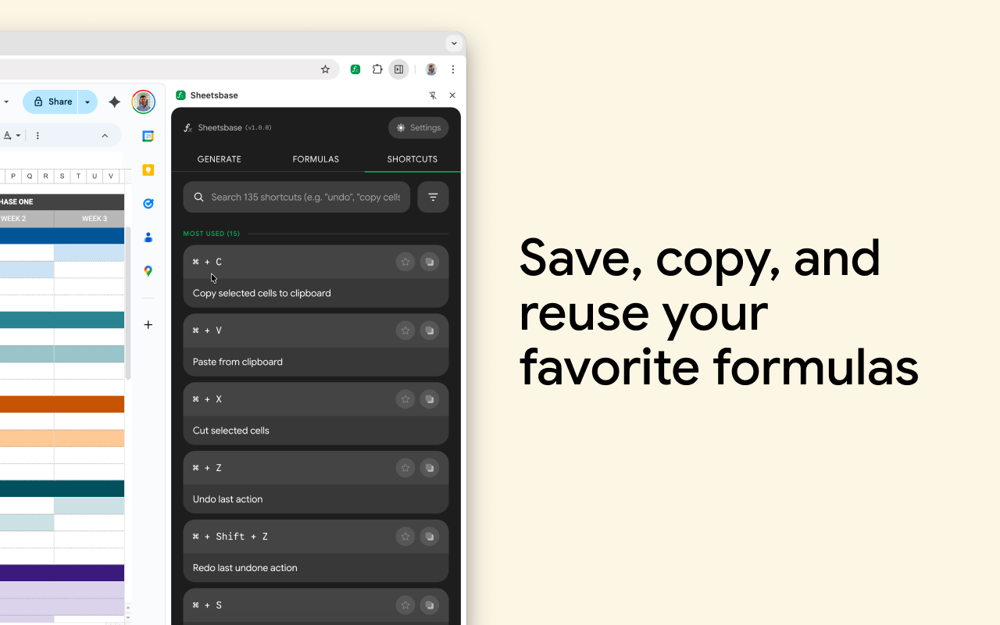

---

## 5. [Archimyst](https://www.producthunt.com/products/archimyst?utm_campaign=producthunt-api&utm_medium=api-v2&utm_source=Application%3A+antigravity_test+%28ID%3A+258588%29)
**Votes**: 134 | **Tagline**: AI-powered platform for designing system architecture

### 📌 요약
시스템 아키텍처 설계, 이제 AI가 도면을 그려주고 배포 전 성능과 비용까지 시뮬레이션 해줍니다. 엔지니어링팀을 위한 '사전 검증' 지능형 다이어그램 툴, 아키미스트(Archimyst)입니다.

### 🔑 핵심 기능
- 🎯 Target Audience: 복잡한 클라우드 인프라 설계와 관리에 어려움을 겪는 현대 엔지니어링 팀 및 시스템 아키텍트.
- ✨ Key Differentiator: 단순히 다이어그램을 그리는 것을 넘어, AI 시뮬레이션을 통해 배포 전 성능, 비용, 장애 시나리오를 스트레스 테스트하여 시행착오를 극적으로 줄입니다.
- 💡 Core Feature: 아이디어를 입력하면 AI가 몇 분 내에 운영 가능한(production-ready) 백엔드 아키텍처 다이어그램을 자동 생성하고 즉시 시뮬레이션하여 유효성을 검사합니다.

### 📸 스크린샷 및 갤러리

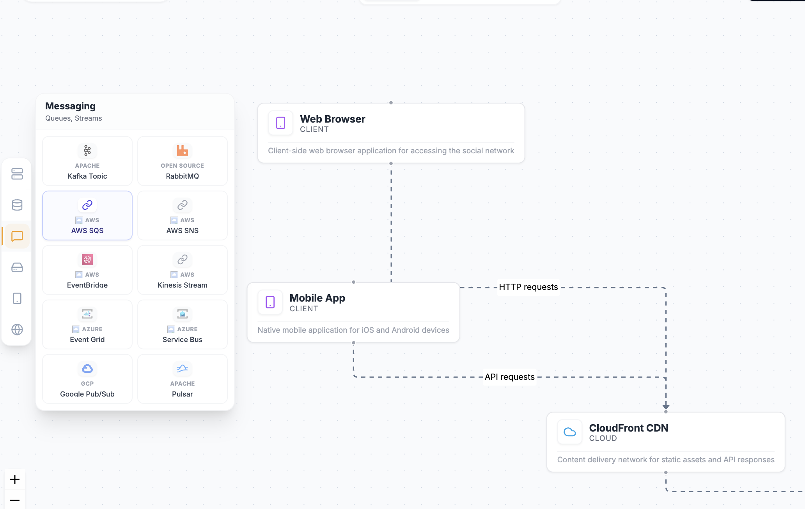
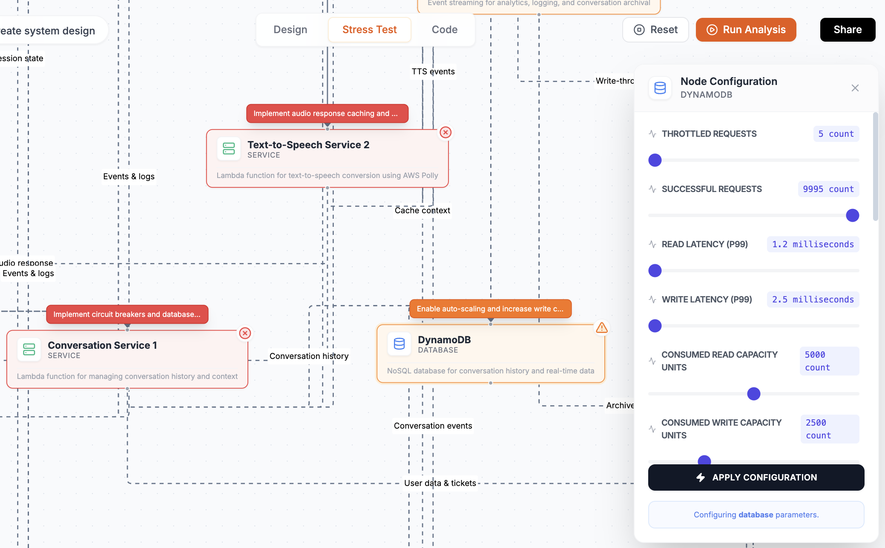

### 🎬 관련 영상
- [🎥 영상 보기](https://ph-files.imgix.net/9a1bdab8-edc7-4287-8b7c-7b253027784e.jpeg?auto=format)

---

## 6. [Superagent from Airtable](https://www.producthunt.com/products/superagent-from-airtable?utm_campaign=producthunt-api&utm_medium=api-v2&utm_source=Application%3A+antigravity_test+%28ID%3A+258588%29)
**Votes**: 122 | **Tagline**: The multi-agent system that delivers finished work

### 📌 요약
단순 검색 결과 대신 바로 업무에 투입 가능한 '완제품' 보고서를 제공하는, 에어테이블(Airtable) 출신 팀의 AI 멀티 에이전트 시스템입니다.

### 🔑 핵심 기능
- 🎯 Target Audience: 복잡한 시장/경쟁사/투자 분석을 수행하는 리서처, 기획자, 전략가, 비즈니스 리더.
- ✨ Key Differentiator: 여러 AI 봇이 팀처럼 협업하여 작업을 계획하고, 신뢰할 수 있는 데이터를 바탕으로 가공된 인터랙티브 보고서를 최종 결과물로 제공 (단일 챗봇 응답 이상의 완성도).
- 💡 Core Feature: 복잡한 질문을 던지면 자동으로 업무를 분해하고, 데이터 소스를 찾아 분석하며, 바로 활용 가능한 보고서 형태로 결과물을 도출해주는 '협업 기반 리서치 플래닝 및 보고서 자동 생성 기능'.

### 📸 스크린샷 및 갤러리
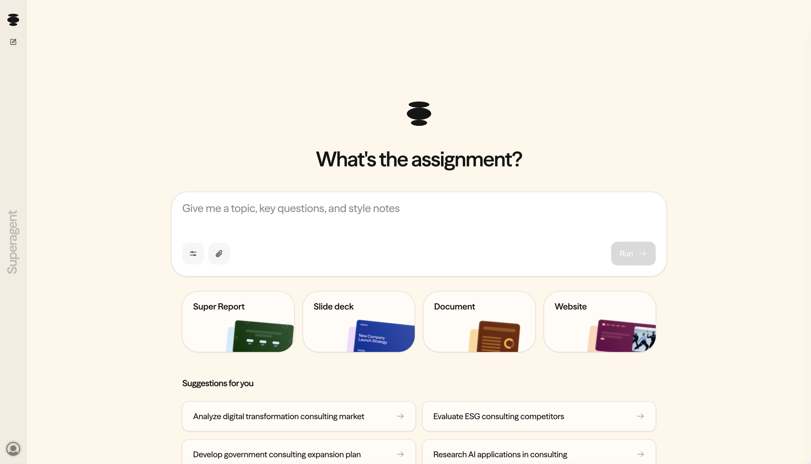
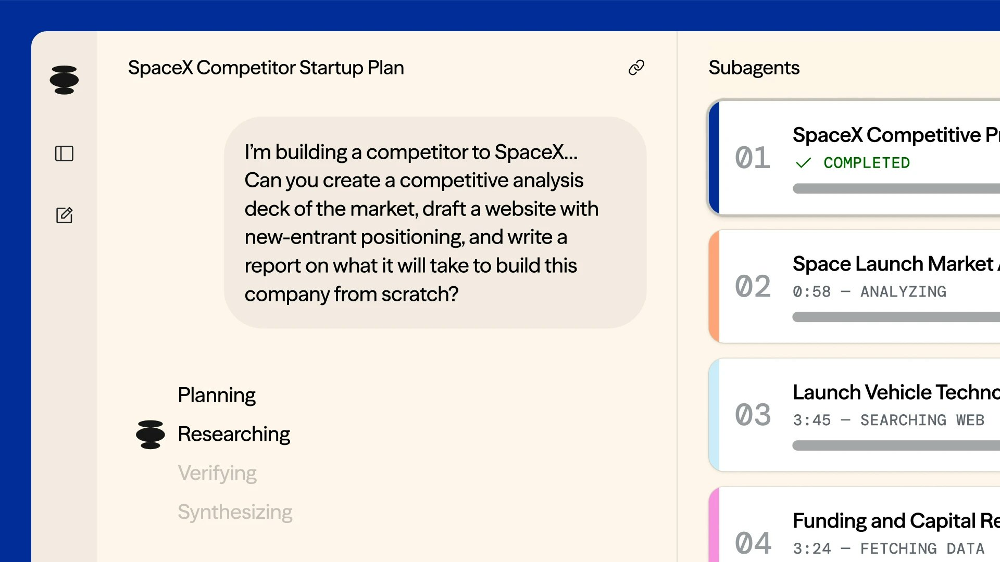
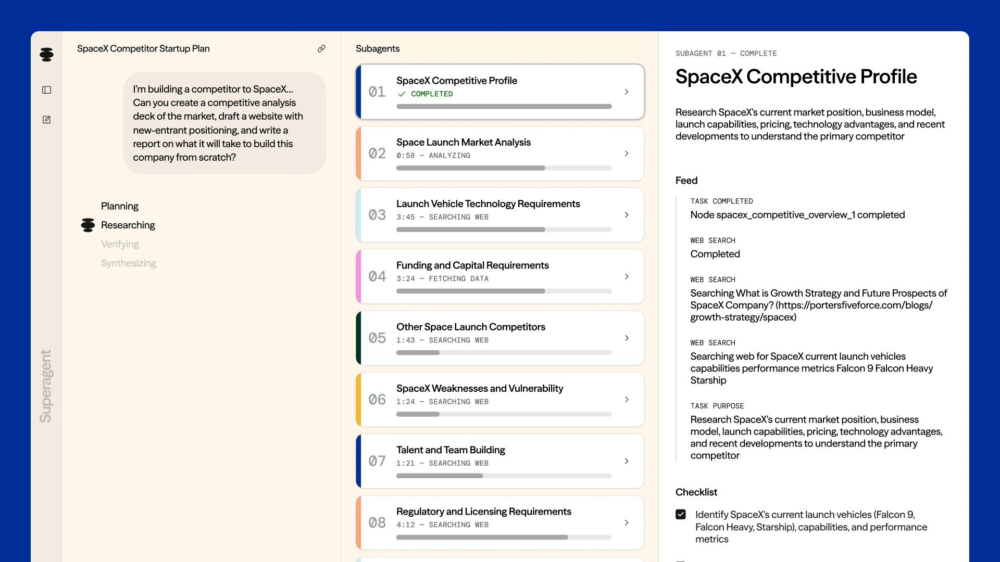

---

## 7. [Lost Post](https://www.producthunt.com/products/lost-post-worldwide-question-of-the-day?utm_campaign=producthunt-api&utm_medium=api-v2&utm_source=Application%3A+antigravity_test+%28ID%3A+258588%29)
**Votes**: 116 | **Tagline**: The whole world is asked and answers a single question

### 📌 요약
전 세계 사람들에게 하루에 하나의 질문을 던지고, 다음 날 익명의 답장을 엽서로 받아보는 감성 교류형 소셜 플랫폼 'Lost Post'가 런칭했습니다.

### 🔑 핵심 기능
- 🎯 Target Audience: 진솔한 익명 소통을 원하는 사용자, 매일 가벼운 글쓰기 습관을 들이고 싶은 사람, 타인의 일상과 생각을 엿보고 싶은 글로벌 유저.
- ✨ Key Differentiator: 단순한 좋아요나 댓글이 아닌, 전 세계인의 생각(익명 엽서)을 매일 교환하고 수집하는 독특한 감성 교류 시스템 (글로벌 펜팔 + 미니멀리즘 소셜 미디어).
- 💡 Core Feature: 매일 새로운 주제에 대해 자신의 생각을 엽서로 작성해 보내고, 다음 날 지구 반대편 누군가의 익명 엽서를 수신하여 컬렉션을 채우는 '일일 엽서 교환 및 수집' 기능.

### 📸 스크린샷 및 갤러리
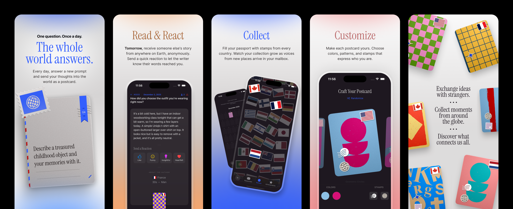

---

## 8. [Grok Imagine API](https://www.producthunt.com/products/grok-3?utm_campaign=producthunt-api&utm_medium=api-v2&utm_source=Application%3A+antigravity_test+%28ID%3A+258588%29)
**Votes**: 116 | **Tagline**: SOTA video generation across quality, cost, and latency

### 📌 요약
Grok Imagine API는 속도와 품질 모두에서 1위를 차지한 최첨단 비디오 생성 API로, 개발자들이 최고의 영상 워크플로우를 빠르고 효율적으로 구축할 수 있게 해주는 '게임 체인저'입니다.

### 🔑 핵심 기능
- 🎯 Target Audience: 자동화된 창의적 비디오 워크플로우 구축이 필요한 개발자 및 테크 팀.
- ✨ Key Differentiator: 업계 최고 수준의 품질과 API 속도(Latency) 효율성에서 1위를 기록하며 경쟁사 대비 압도적인 성능을 자랑합니다.
- 💡 Core Feature: 영상 내 객체 '추가/제거'가 가능한 고급 편집 기능 및 뛰어난 명령어 이해도 (Superior Instruction Following).

### 📸 스크린샷 및 갤러리
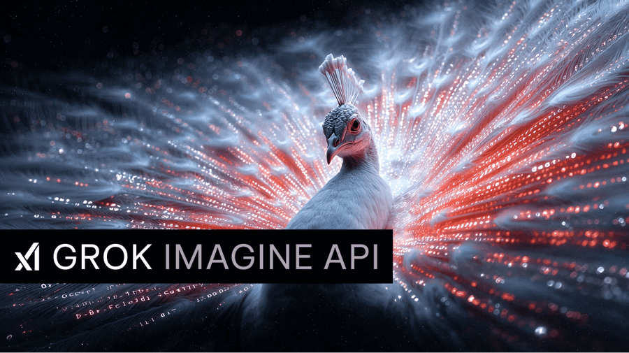

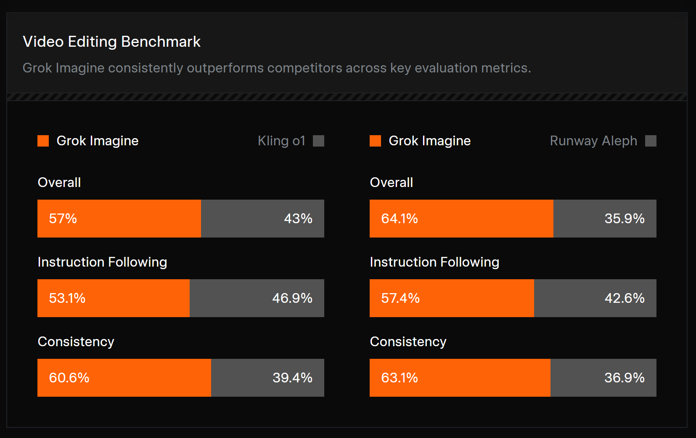

### 🎬 관련 영상
- [🎥 영상 보기](https://ph-files.imgix.net/cede7749-22ed-47e1-a14e-086d57824972.jpeg?auto=format)

---

## 9. [MacOS Desktop Declutter](https://www.producthunt.com/products/macos-desktop-declutter?utm_campaign=producthunt-api&utm_medium=api-v2&utm_source=Application%3A+antigravity_test+%28ID%3A+258588%29)
**Votes**: 114 | **Tagline**: Open-source Tinder for desktop files on MacOS. 100% Free.

### 📌 요약
당신의 맥OS 데스크톱 파일을 '좌측은 휴지통, 우측은 저장'하는 틴더 스타일의 게임으로 만들어주는 오픈소스 무료 데스크톱 정리 앱이 떴습니다.

### 🔑 핵심 기능
- 🎯 Target Audience: 맥OS를 사용하며 '스크린샷_최종_v2.png' 같은 파일로 데스크톱이 가득 찬 미니멀리즘 지향 유저 또는 바쁜 직장인.
- ✨ Key Differentiator: 데스크톱 정리를 지루한 작업이 아닌 '스와이프 게임' 형태로 바꿔 만족감을 주는 네이티브 앱.
- 💡 Core Feature: 중복 파일 자동 감지 및 유사 파일 그룹화 기능으로 빠르고 효율적인 정리 지원.

### 📸 스크린샷 및 갤러리
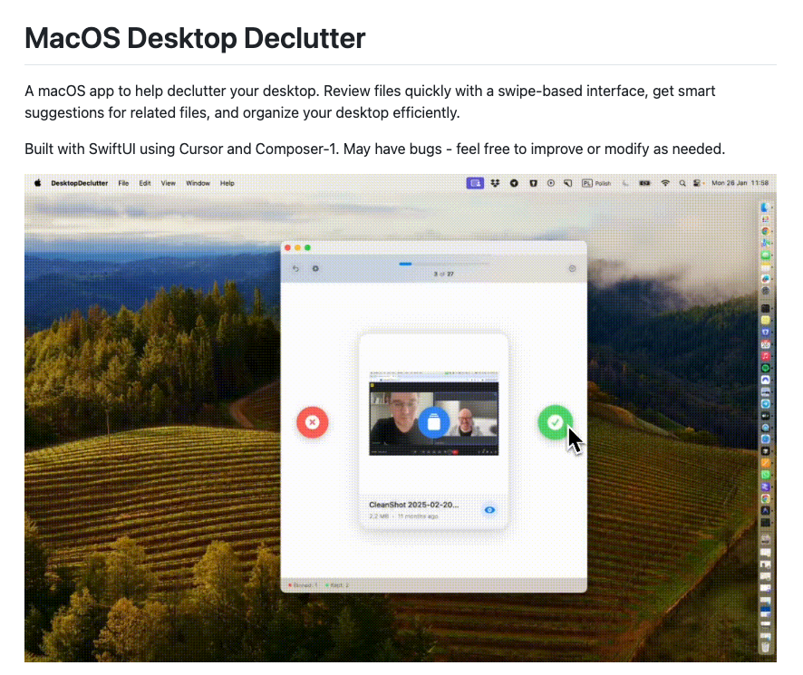
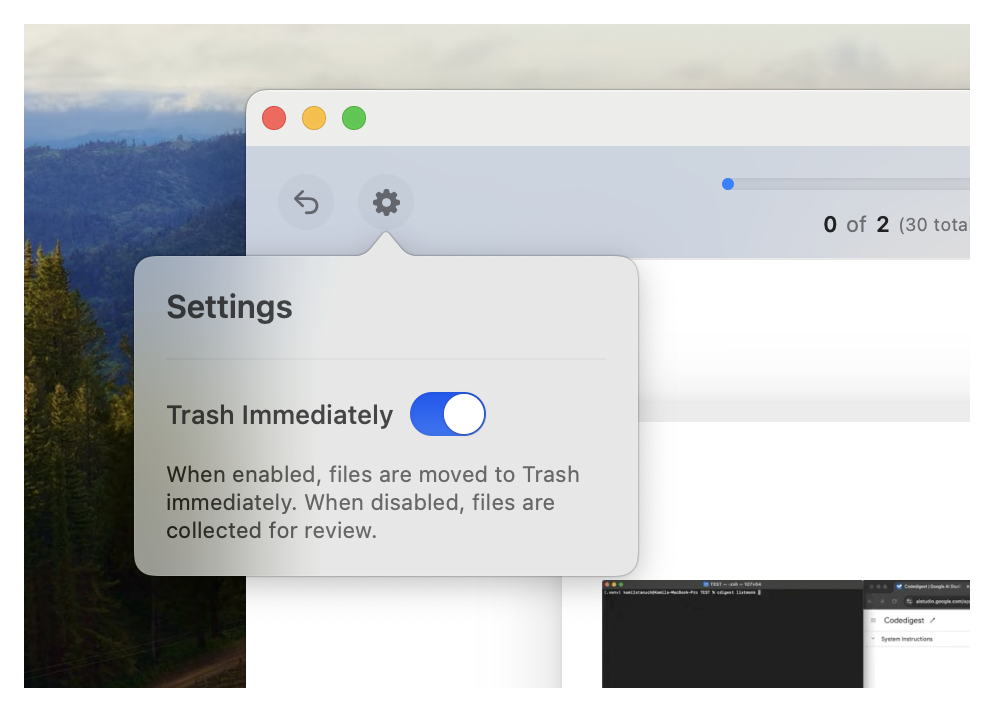
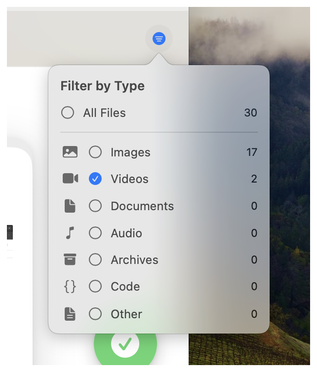

---

## 10. [YepCode](https://www.producthunt.com/products/yepcode?utm_campaign=producthunt-api&utm_medium=api-v2&utm_source=Application%3A+antigravity_test+%28ID%3A+258588%29)
**Votes**: 106 | **Tagline**: Developer-first AI integrations: build, run, scale safely

### 📌 요약
최신 AI 에이전트와 복잡한 비즈니스 로직을 연결할 때, YepCode는 개발자가 짠 JS/Python 코드를 안전하고 확장 가능하며 즉시 사용 가능한 서버리스 도구로 변환해주는 'AI 통합 전문' 개발자 플랫폼입니다.

### 🔑 핵심 기능
- 🎯 Target Audience: 커스텀 AI 에이전트 및 복잡한 워크플로우를 JS/Python 코드로 직접 구축하려는 개발자 및 엔지니어.
- ✨ Key Differentiator: 실제 JS/Python 코드(npm/PyPI 패키지 사용 가능)를 그대로 사용하면서, 보안 샌드박스, 웹훅, 스케줄링 등 복잡한 서버리스 인프라 환경을 즉시 제공하여 운영 부담이 없습니다.
- 💡 Core Feature: 작성한 코드를 AI 에이전트가 바로 사용할 수 있는 '도구(Tool)'로 전환해주는 MCP 서버 기능과, 프롬프트만으로 실행 가능한 프로세스를 생성하는 Yep Agent.

### 📸 스크린샷 및 갤러리
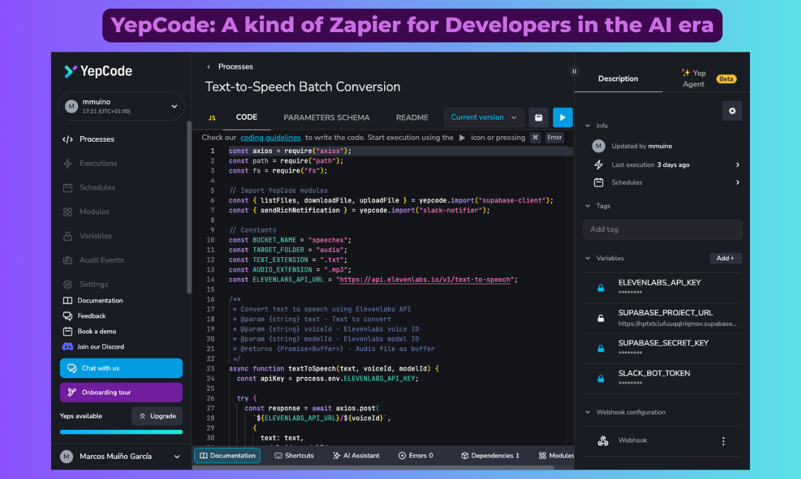

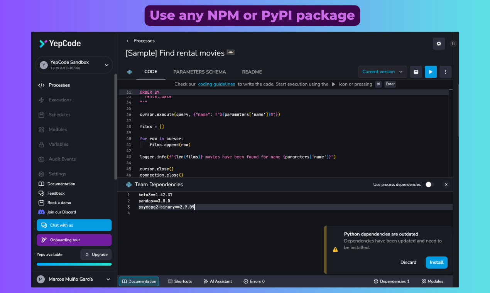

---

