# 🚀 Product Hunt Daily Top 10 (2026-01-31)

## 1. [ClaudeUsageBar](https://www.producthunt.com/products/claudeusagebar?utm_campaign=producthunt-api&utm_medium=api-v2&utm_source=Application%3A+antigravity_test+%28ID%3A+258588%29)
**Votes**: 270 | **Tagline**: Know exactly how much Claude you have left at a glance

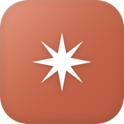

### 📌 요약
Anthropic Claude를 자주 쓰는데, 사용량 때문에 스트레스 받으셨나요? macOS 메뉴바에서 실시간으로 사용량 게이지를 띄워주는 초경량 오픈소스 앱이 나왔습니다!

### 🔑 핵심 기능
- 🎯 Target Audience: Claude AI의 유료 또는 무료 사용자 중, 사용량 제한(Rate Limit)에 민감한 헤비 유저 (특히 개발자 및 리서처).
- ✨ Key Differentiator: Claude 사용량을 추적하는 유일하고 전용된 macOS 메뉴바 앱. 가볍고, 개인 정보 보호에 강하며(Private), 제한 임박 시 알림을 제공하여 사용량 초과를 미리 방지.
- 💡 Core Feature: 메뉴바에 실시간으로 Claude AI 사용 백분율(%)을 시각화하여 표시하고, 사용량 제한에 도달하기 전에 미리 알림을 주는 기능.

### 📸 스크린샷 및 갤러리
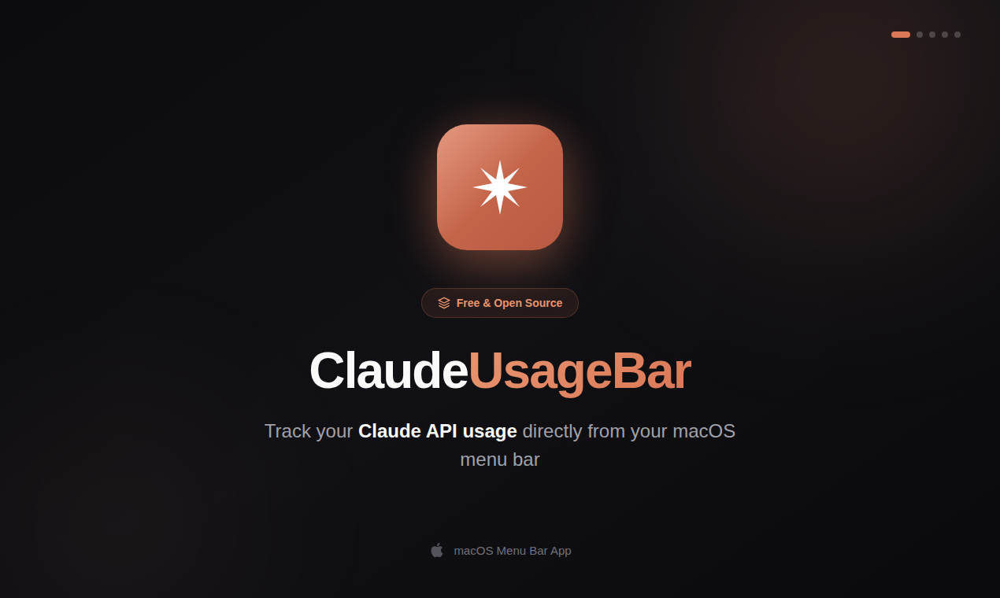
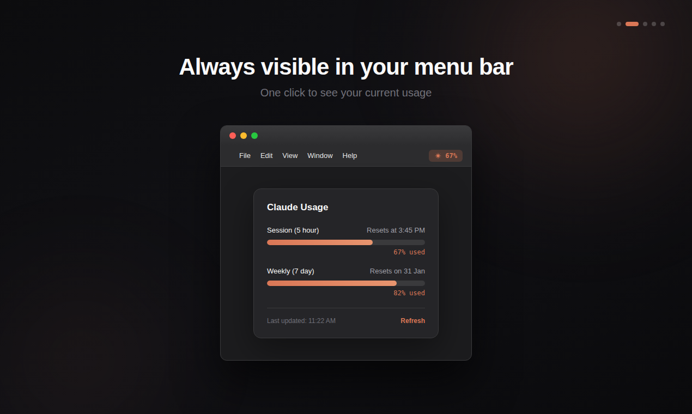
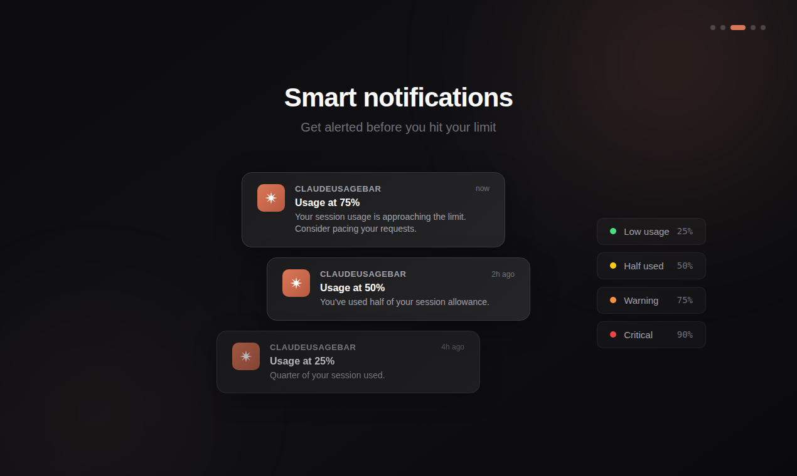

---

## 2. [skills.sh](https://www.producthunt.com/products/vercel?utm_campaign=producthunt-api&utm_medium=api-v2&utm_source=Application%3A+antigravity_test+%28ID%3A+258588%29)
**Votes**: 244 | **Tagline**: The Agent Skills Directory

### 📌 요약
AI 에이전트에게 필요한 능력을 디렉토리에서 쉽게 찾고 설치할 수 있게 해주는 '에이전트용 앱스토어'입니다. 이제 에이전트도 복잡한 지식을 명령 한 줄로 바로 탑재합니다.

### 🔑 핵심 기능
- 🎯 Target Audience: AI 에이전트 개발자, 고급 AI 워크플로우를 구축하려는 사용자, 에이전트의 기능을 확장하고 표준화하려는 이들
- ✨ Key Differentiator: 에이전트가 재사용 가능한 '기술(Skills)'을 표준화된 방식으로 발견하고 통합할 수 있는 최초의 중앙 집중식 디렉토리 및 설치 시스템
- 🔋 Core Feature: 'npx skills add [스킬 이름]' 명령어를 통해 에이전트에 특정 절차적 지식(procedural knowledge)을 즉시 추가하고 기능을 확장

### 📸 스크린샷 및 갤러리
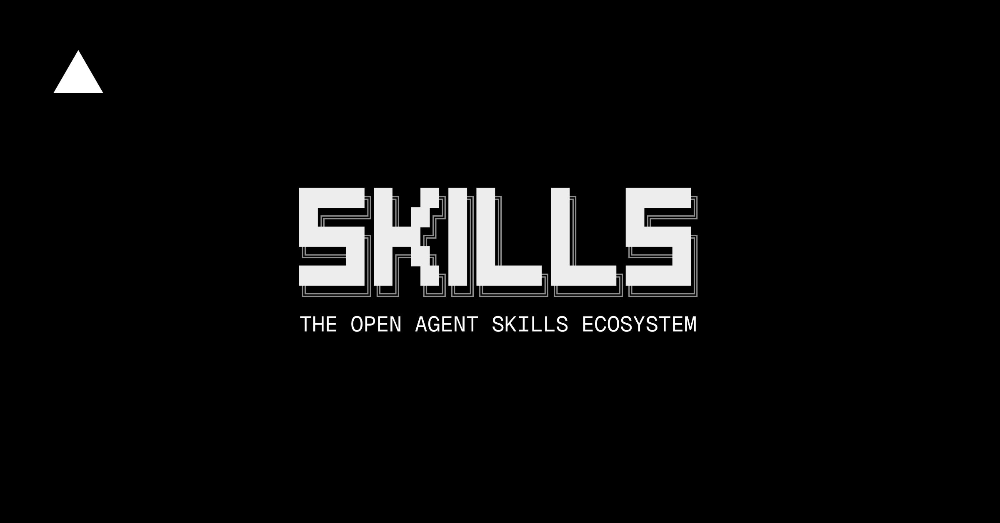
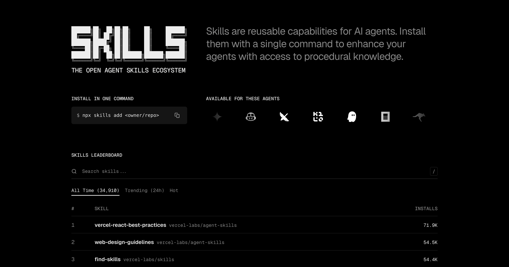
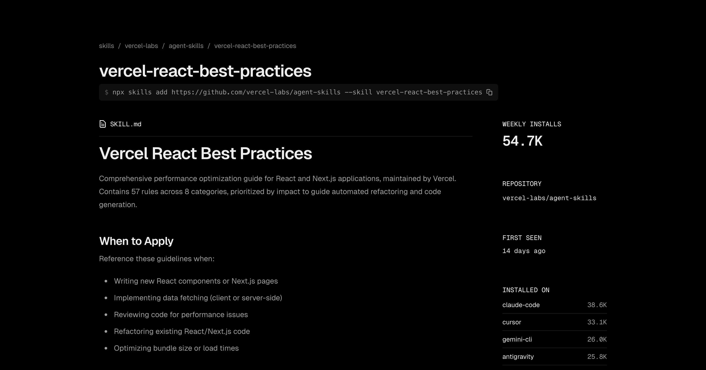

---

## 3. [Pretty Prompt 1.0 Extension and Web App](https://www.producthunt.com/products/pretty-prompt?utm_campaign=producthunt-api&utm_medium=api-v2&utm_source=Application%3A+antigravity_test+%28ID%3A+258588%29)
**Votes**: 211 | **Tagline**: Grammarly for prompting. Turn any text into perfect prompts.

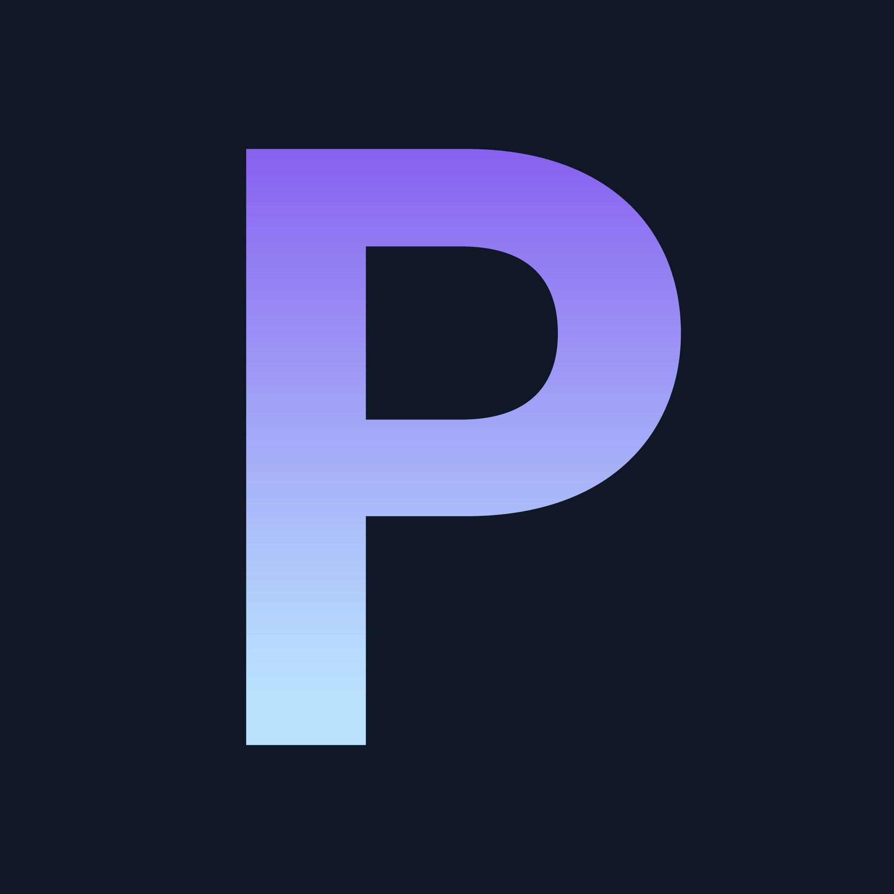

### 📌 요약
프롬프트계의 문법 검사기(Grammarly)가 등장했습니다! 단 한 번의 클릭으로 어떤 텍스트든 강력하고 완벽한 AI 프롬프트로 자동 변환해주는 브라우저 확장 프로그램 및 웹 앱입니다.

### 🔑 핵심 기능
- 🎯 Target Audience: ChatGPT, Gemini, Claude 등 다양한 AI 도구를 자주 사용하며, 더 나은 결과물을 얻기 위해 프롬프트 품질 향상을 원하는 모든 사용자.
- ✨ Key Differentiator: 브라우저를 떠날 필요 없이, 사용 중인 AI 인터페이스(ChatGPT, Gemini 등) 내부에서 즉시 작동하며, 일반 텍스트를 AI가 가장 잘 이해하는 '완벽한 프롬프트' 구조로 변환시켜주는 통합 솔루션.
- 💡 Core Feature: 원 클릭(One-Click) 프롬프트 개선 기능. 입력된 텍스트를 분석하여 명확성, 구체성, 구조를 AI 모델에 최적화된 형태로 즉각 수정해주는 자동화 기능.

### 📸 스크린샷 및 갤러리
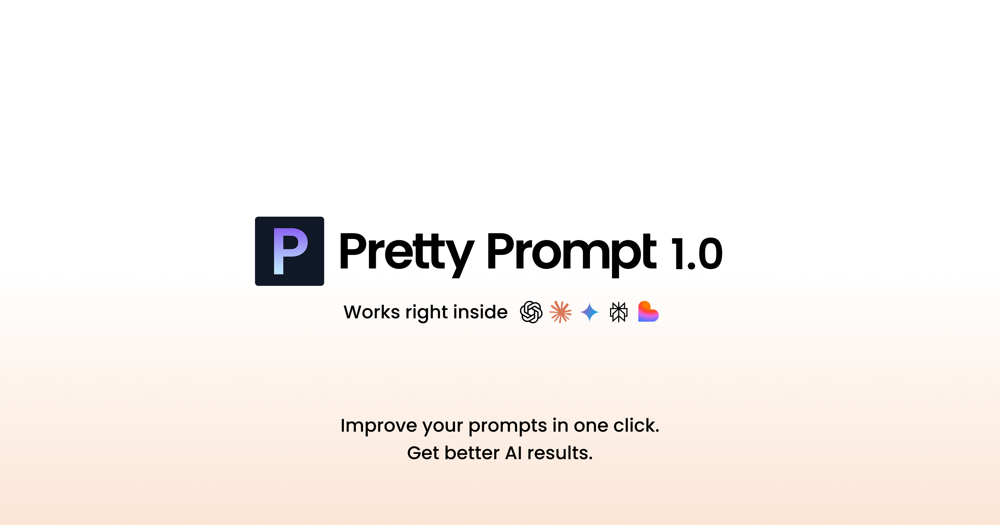
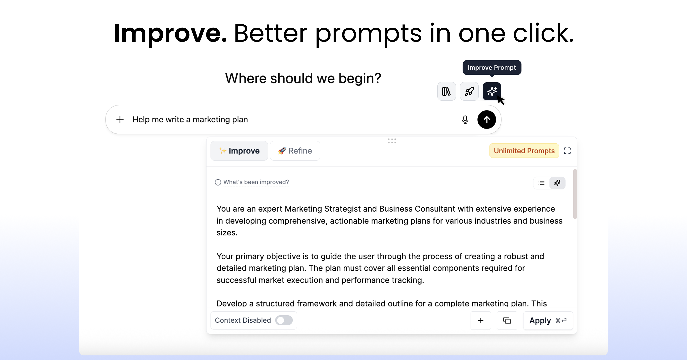
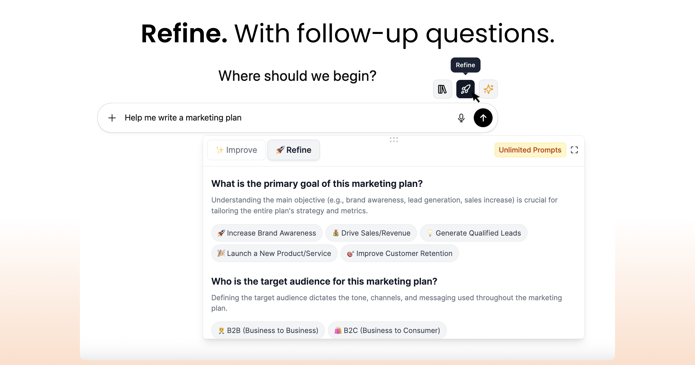

### 🎬 관련 영상
- [🎥 영상 보기](https://ph-files.imgix.net/4c211816-974a-4fb4-8a85-3b6064947287.jpeg?auto=format)

---

## 4. [Herodot AI](https://www.producthunt.com/products/herodot-ai?utm_campaign=producthunt-api&utm_medium=api-v2&utm_source=Application%3A+antigravity_test+%28ID%3A+258588%29)
**Votes**: 166 | **Tagline**: Travel at any place like with a personal local guide

### 📌 요약
지도만 보는 딱딱한 여행은 이제 그만! 2년 이상 개발된 '헤로도트 AI'는 마치 현지인 친구가 옆에서 흥미진진한 이야기를 들려주듯, 눈에 들어오는 모든 것을 설명해주는 개인 맞춤형 AI 로컬 가이드입니다.

### 🔑 핵심 기능
- 🎯 Target Audience: 획일화된 투어가 아닌, 살아있는 현지 이야기와 깊이 있는 경험을 원하는 자유 여행자 및 배낭 여행자.
- ✨ Key Differentiator: 단순히 정보를 제공하는 것을 넘어, 주변 환경과 사용자의 시선에 맞춰 '인간적인' 스토리텔링과 현지 가이드급의 풍부한 설명을 제공합니다.
- 💡 Core Feature: 사용자가 보는 것을 즉시 포착하여 주변의 역사, 문화, 흥미로운 일화를 실시간으로 들려주는 '개인 맞춤형 로컬 스토리텔링' 기능.

### 📸 스크린샷 및 갤러리
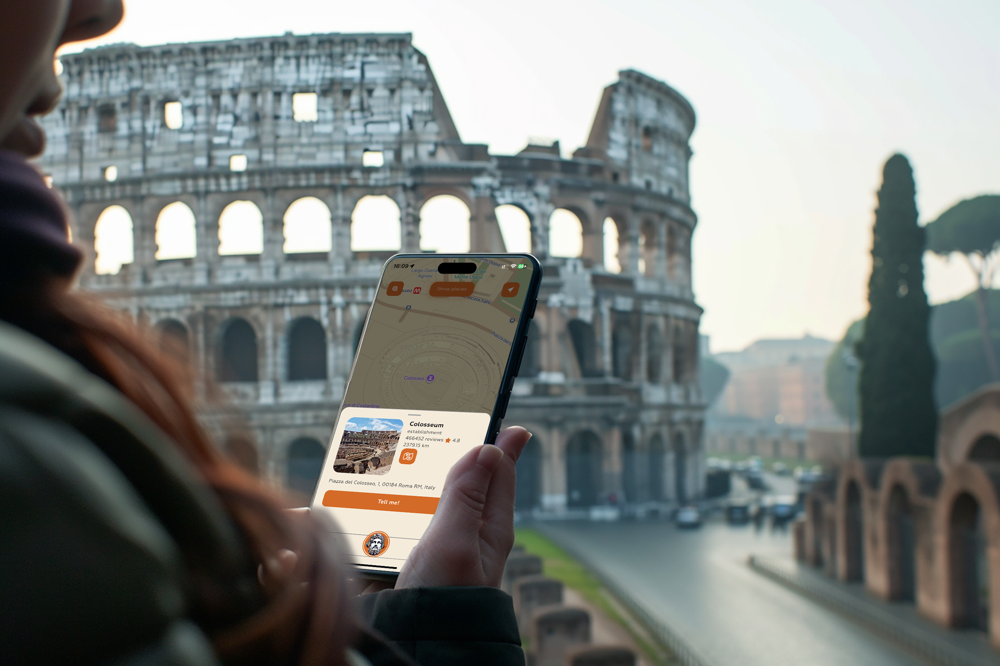

---

## 5. [DestMate](https://www.producthunt.com/products/destmate-travel-alarm?utm_campaign=producthunt-api&utm_medium=api-v2&utm_source=Application%3A+antigravity_test+%28ID%3A+258588%29)
**Votes**: 124 | **Tagline**: Alarm with location wake-up and earphone-only sound

### 📌 요약
장거리 이동이나 대중교통 이용 시 숙면하다가 내릴 역을 놓칠까 걱정하는 분들을 위한 필수 앱, 위치 기반 알람 'DestMate'가 런칭했습니다. 이어폰으로만 조용히 알림을 받을 수 있어 옆 사람 방해 없이 꿀잠을 보장합니다.

### 🔑 핵심 기능
- 🎯 Target Audience: 통근자, 장거리 여행자, 대중교통 이용 중 잠깐의 쪽잠을 즐기는 모든 사람.
- ✨ Key Differentiator: 도착 지점 근처에서 이어폰/헤드폰으로만 사적인 알람을 제공 (주변 방해 없음), 놓친 정류장 알림, ETA 추적, QR 알람 공유 기능 등 종합적인 이동 알림 솔루션 제공.
- 💡 Core Feature: 설정된 목적지에 가까워지면 정확하게 위치 기반으로 작동하는 알람 기능.

### 📸 스크린샷 및 갤러리
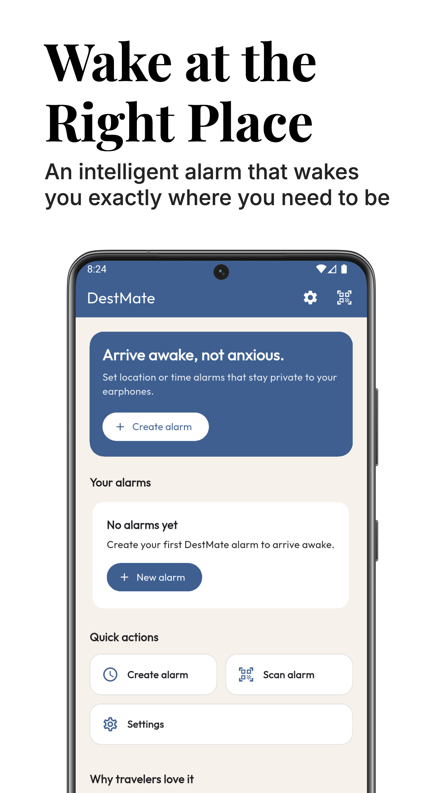
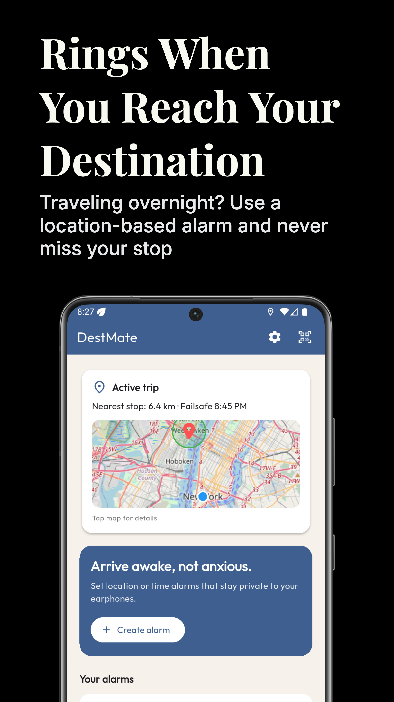
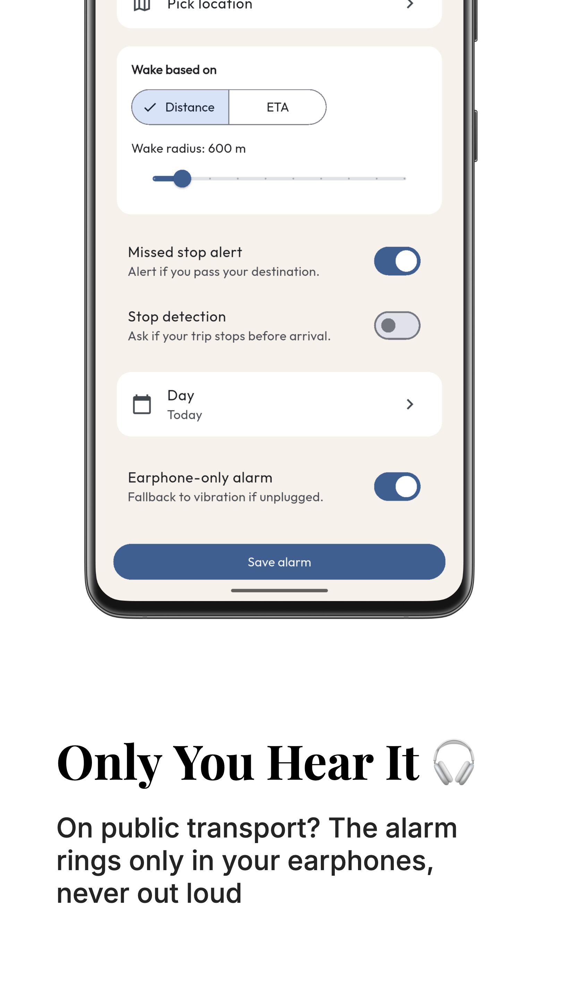

---

## 6. [AI Proctor by Qlay](https://www.producthunt.com/products/ai-proctor-by-qlay-2?utm_campaign=producthunt-api&utm_medium=api-v2&utm_source=Application%3A+antigravity_test+%28ID%3A+258588%29)
**Votes**: 55 | **Tagline**: AI Proctor: AI that protects fairness in hiring & tests

### 📌 요약
면접이나 시험 중 부정행위를 AI가 실시간으로 잡아내는 똑똑한 솔루션, AI 프록터가 떴습니다. 특히 스마트폰을 보조 카메라로 활용해 사각지대까지 감시하는 방식이 돋보입니다.

### 🔑 핵심 기능
- 🎯 Target Audience: 온라인 시험 및 채용 면접의 공정성을 확보하려는 기업, 교육기관, 그리고 AI 부정행위 적발에 어려움을 겪는 모든 조직
- ✨ Key Differentiator: 응시자의 스마트폰을 보조(두 번째) 카메라로 활용하여, 일반 웹캠이 놓치는 환경 전체를 객체 인식 AI로 감시하고 부정행위를 이중으로 포착함.
- 💡 Core Feature: 실시간 객체 인식 AI를 통해 응시 환경 내의 허가되지 않은 기기(부정행위 도구)와 신체/머리/손의 수상한 움직임을 즉각 플래그(경고)하는 기능

### 📸 스크린샷 및 갤러리

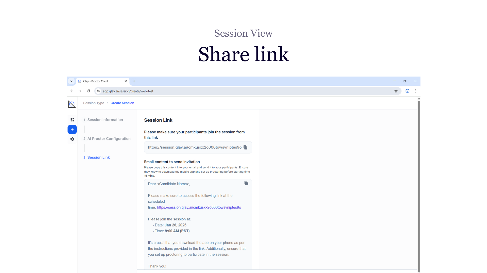
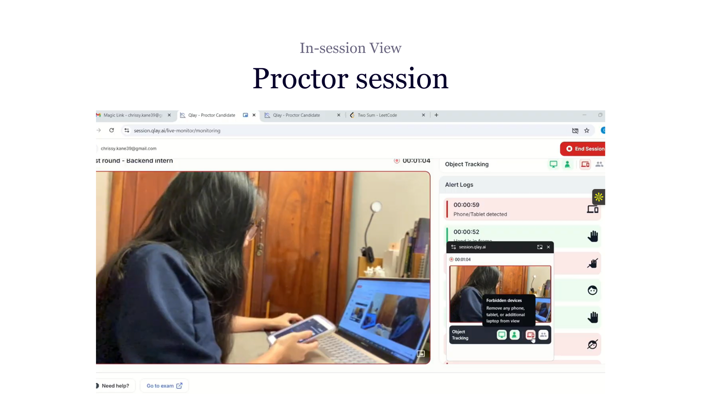

### 🎬 관련 영상
- [🎥 영상 보기](https://ph-files.imgix.net/0a60af01-a686-4a04-8923-82529470c381.jpeg?auto=format)

---

## 7. [RUSTWA](https://www.producthunt.com/products/rustwa?utm_campaign=producthunt-api&utm_medium=api-v2&utm_source=Application%3A+antigravity_test+%28ID%3A+258588%29)
**Votes**: 39 | **Tagline**: A Unofficial WhatsApp Web API built in Rust

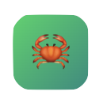

### 📌 요약
왓츠앱 자동화 봇 구축을 위한 가장 빠르고 미니멀한 비공식 API. Rust 기반으로 '무거운 시스템'이 아닌 '실속 있는' 기능을 제공하며 성능과 안정성에 초점을 맞췄습니다.

### 🔑 핵심 기능
- 🎯 Target Audience: 왓츠앱 기반 자동화 시스템, 챗봇, 사내 커뮤니케이션 툴을 개발하는 개발자 및 팀
- ✨ Key Differentiator: Rust 언어(Tokio 런타임)를 활용한 압도적인 속도와 안정성. 불필요한 기능 없이 핵심 자동화(90% 사용 사례)에만 집중한 경량화 설계.
- 💡 Core Feature: 여러 세션을 동시에 관리하는 멀티 세션 지원, 세션이 유지되는 QR 코드 로그인, 그리고 메시지 수신 즉시 반응하는 웹훅(Webhook) 연동 기능.

### 📸 스크린샷 및 갤러리
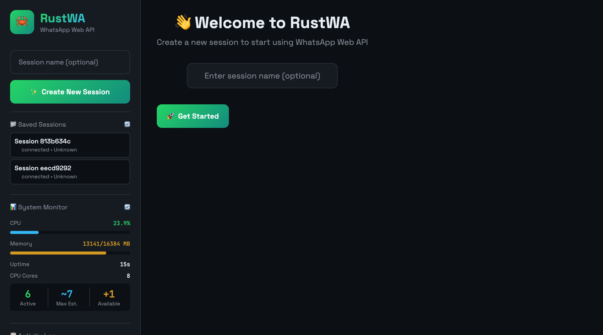
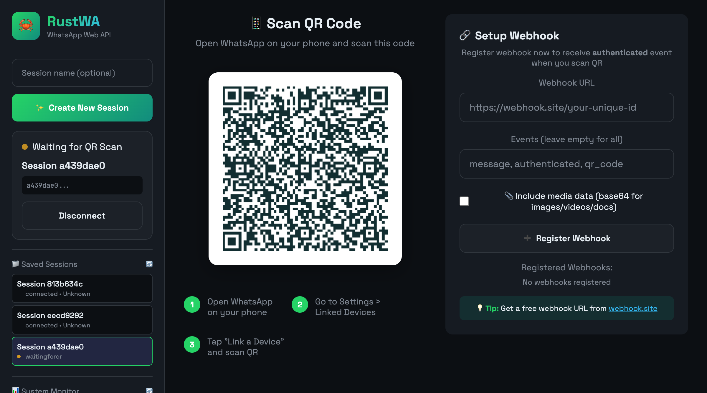
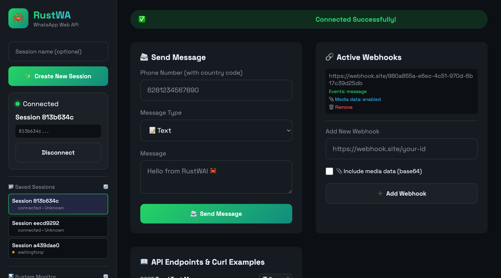

---

## 8. [PageSpeed.cloud](https://www.producthunt.com/products/pagespeed-cloud?utm_campaign=producthunt-api&utm_medium=api-v2&utm_source=Application%3A+antigravity_test+%28ID%3A+258588%29)
**Votes**: 32 | **Tagline**: AI-based PageSpeed insights with clear actions for teams!

### 📌 요약
구글 페이지스피드 리포트는 정확하지만, 뭘 고쳐야 할지 막막하셨죠? PageSpeed.cloud는 이 기술 보고서를 AI가 분석해 🔨 '바로 실행 가능한 우선순위 작업 목록'으로 변환해주는 서비스입니다.

### 🔑 핵심 기능
- 🏻 Target Audience: 웹 성능 최적화가 필요한 개발팀, 퍼포먼스 마케터, SEO 전문가 (데이터 해석 대신 실행에 집중하고 싶은 모든 팀)
- ✨ Key Differentiator: 기존의 PageSpeed Insights 데이터 위에 AI 레이어를 얹어, 복잡한 지표를 '무엇을, 왜, 어떻게' 고쳐야 하는지 설명하는 '실행 중심의 가이드'를 제공합니다.
- 💡 Core Feature: Core Web Vitals, 성능, 접근성, SEO 관련 기술적 이슈를 팀이 바로 적용할 수 있도록 '우선순위가 지정된 구현 준비 완료 액션 아이템'으로 변환 및 제공합니다.

### 📸 스크린샷 및 갤러리
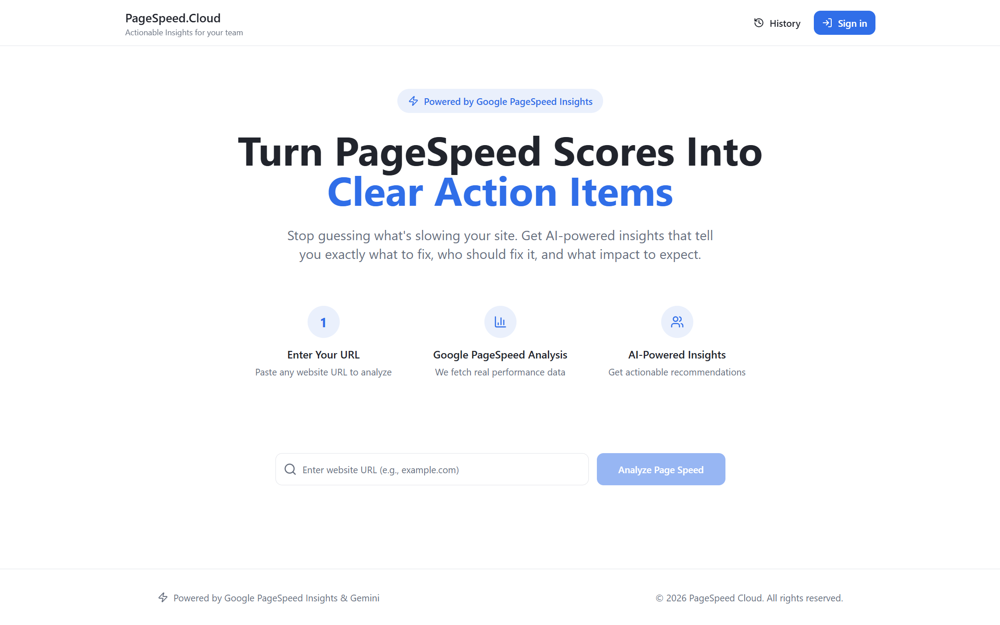
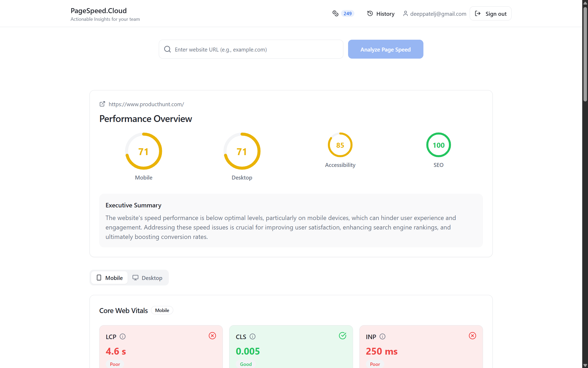
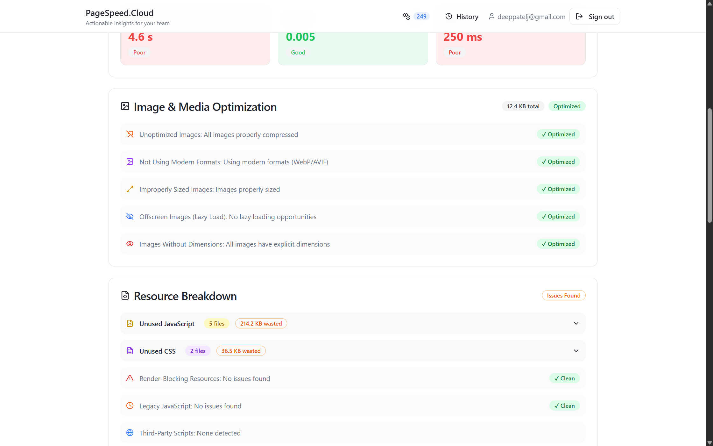

---

## 9. [DoppelIQ Atlas](https://www.producthunt.com/products/doppeliq-atlas?utm_campaign=producthunt-api&utm_medium=api-v2&utm_source=Application%3A+antigravity_test+%28ID%3A+258588%29)
**Votes**: 29 | **Tagline**: Pre-test marketing decisions with AI consumer simulations

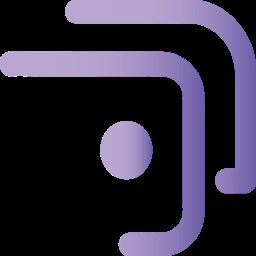

### 📌 요약
마케팅 출시 전, 소규모 설문조사 대신 10만 명 규모의 AI 가상 소비자를 만들어 메시지, 가격, 전략을 검증하는 혁신적인 'AI 소비자 시뮬레이션 엔진'입니다.

### 🔑 핵심 기능
- 🎯 Target Audience: 신제품/신규 서비스 출시를 앞두고 마케팅 전략(메시지, 가격 등)의 시장 반응을 대규모로 예측하고 검증하고 싶은 마케터, 제품 매니저, 전략가.
- ✨ Key Differentiator: 단순히 AI에게 '사용자 행세를 하라'고 요청하는 기존 페르소나 방식이 아닌, 실제 속성이 반영된 10만 개의 일관성 있고 설명 가능한 대규모 소비자 시뮬레이션을 실행하여 높은 예측 정확도 제공.
- 💡 Core Feature: 실제 시장 진출 전에 잠재 고객의 행동을 대규모(100,000명)로 시뮬레이션하여, 마케팅 결정(메시지, 가격 책정, 출시 계획)의 성공 가능성을 사전 검증.

### 📸 스크린샷 및 갤러리
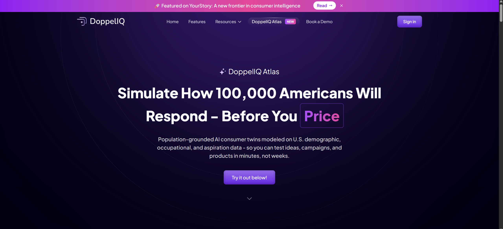
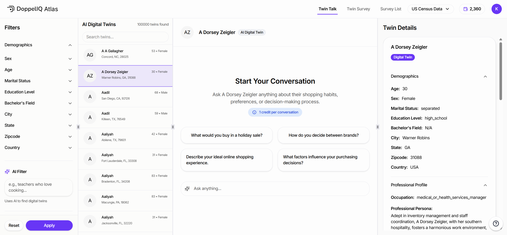
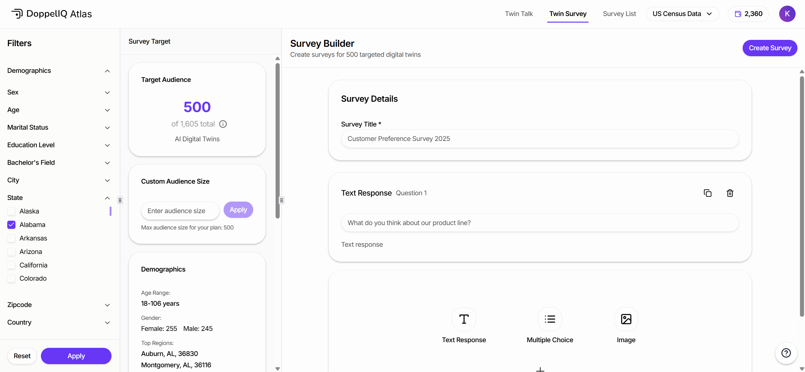

---

## 10. [Supatrack](https://www.producthunt.com/products/supatrack-2?utm_campaign=producthunt-api&utm_medium=api-v2&utm_source=Application%3A+antigravity_test+%28ID%3A+258588%29)
**Votes**: 25 | **Tagline**: Fitness & Nutrition app

### 📌 요약
혼자 칼로리 계산하며 외롭게 다이어트하지 마세요. 친구들과 팀을 이루어 챌린지하며 영양 관리를 재밌게 만들어주는 소셜 피트니스/영양 관리 앱입니다.

### 🔑 핵심 기능
- 🎯 Target Audience: 친구나 팀원과 함께 동기 부여를 받으며 건강 및 영양 관리를 하고 싶은 사용자.
- ✨ Key Differentiator: 단순 기록이 아닌, 친구들과 '팀(Squads)'을 이루어 '챌린지' 기반으로 경쟁/협력하며 상호 책임감(Accountability)을 부여하는 소셜 기능.
- 💡 Core Feature: 세계적인 영양사들의 독점 팟캐스트를 통해 전문적이고 신뢰도 높은 영양 정보를 제공하는 콘텐츠.

### 📸 스크린샷 및 갤러리
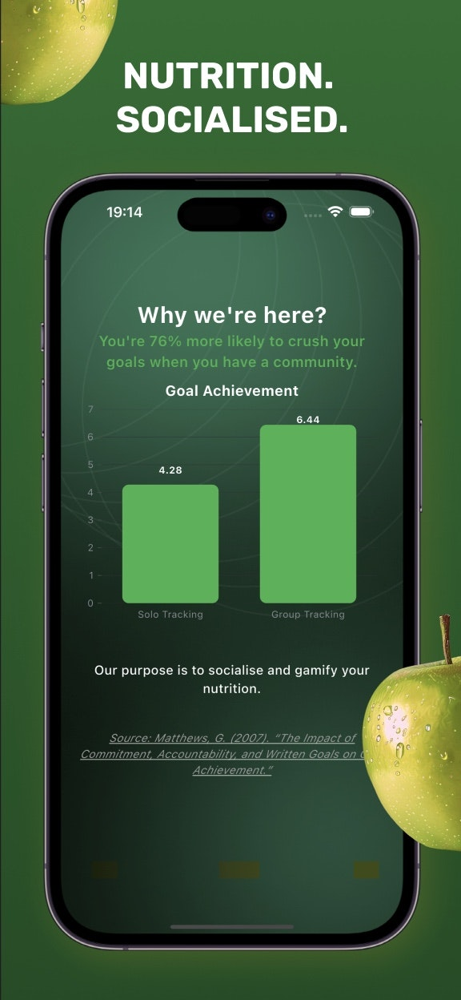
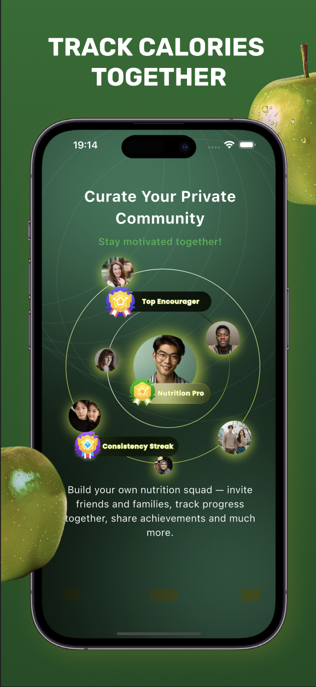
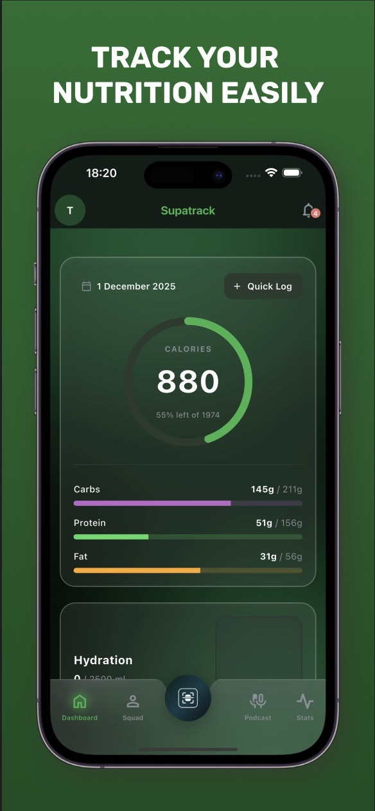

---

