# 🚀 Product Hunt Daily Top 10 (2026-02-01)

## 1. [Dottie](https://www.producthunt.com/products/dottie?utm_campaign=producthunt-api&utm_medium=api-v2&utm_source=Application%3A+antigravity_test+%28ID%3A+258588%29)
**Votes**: 282 | **Tagline**: Private AI Journal

### 📌 요약
프라이버시에 진심인 사람들을 위한 온디바이스(On-device) AI 일기장입니다. 애플 인텔리전스를 활용해 내 데이터는 내 폰에서 한 발짝도 나가지 않아요.

### 🔑 핵심 기능
- 🎯 Target Audience: 개인 정보 보호를 최우선으로 생각하며, 일상 기록과 성찰에 AI의 도움을 받고 싶은 얼리 어답터 및 사용자.
- ✨ Key Differentiator: 애플 인텔리전스 사용 시 모든 데이터가 기기 내(On-device)에만 저장되어, 데이터 유출 및 AI 학습에 대한 걱정이 전혀 없습니다.
- 💡 Core Feature: 온디바이스 AI를 활용한 일기 작성 및 성찰(Reflection) 지원 기능으로, 기록 내용을 바탕으로 심층적인 분석과 인사이트를 제공합니다.

### 📸 스크린샷 및 갤러리
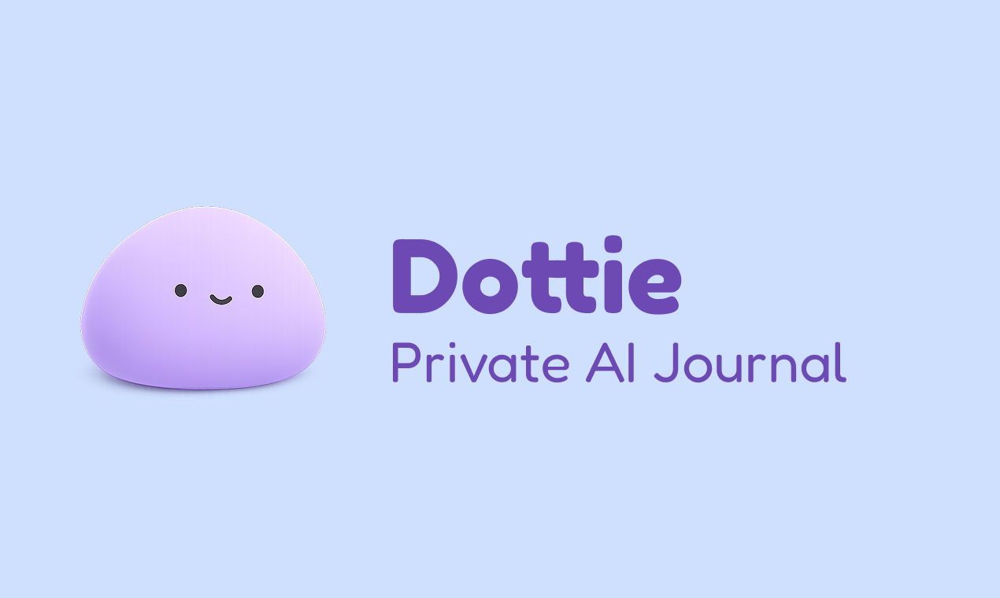
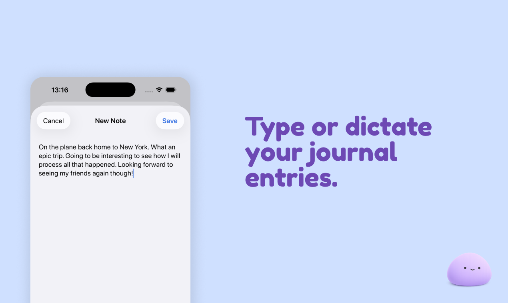
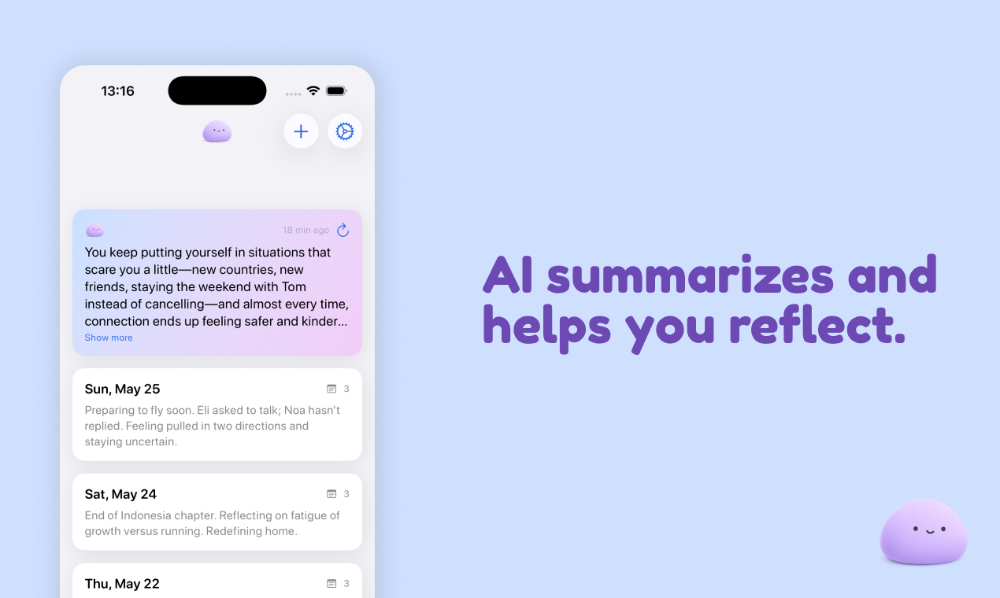

---

## 2. [Time Ledger](https://www.producthunt.com/products/time-ledger?utm_campaign=producthunt-api&utm_medium=api-v2&utm_source=Application%3A+antigravity_test+%28ID%3A+258588%29)
**Votes**: 245 | **Tagline**: Manage your time like you manage your money.

### 📌 요약
돈 관리하듯 시간을 관리하게 해주는 앱 '타임 렛저(Time Ledger)'가 출시되었습니다. 복잡한 타이핑 없이 탭 한 번으로 시간을 기록하고, 내 시간이 어디로 새고 있는지 시각적으로 파악할 수 있어요.

### 🔑 핵심 기능
- 🎯 Target Audience: 현재 시간을 비효율적으로 사용하고 있다고 느끼는 직장인, 학생, 프리랜서 등 시간 관리가 필요한 모든 사람.
- ✨ Key Differentiator: 입력이 극도로 간편합니다 (Simplicity). 복잡한 텍스트 입력 없이 버튼 탭만으로 일과를 기록하여 사용 장벽을 낮췄습니다.
- 💡 Core Feature: 시간 누수 분석 (Time Leak Analysis). 기록된 패턴을 분석하여 사용자가 의식하지 못했던 비생산적인 활동이나 불필요하게 낭비되는 시간을 정확히 찾아줍니다.

### 📸 스크린샷 및 갤러리
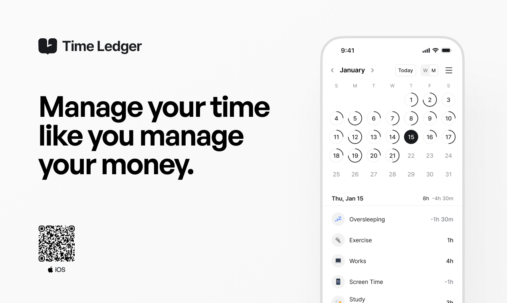
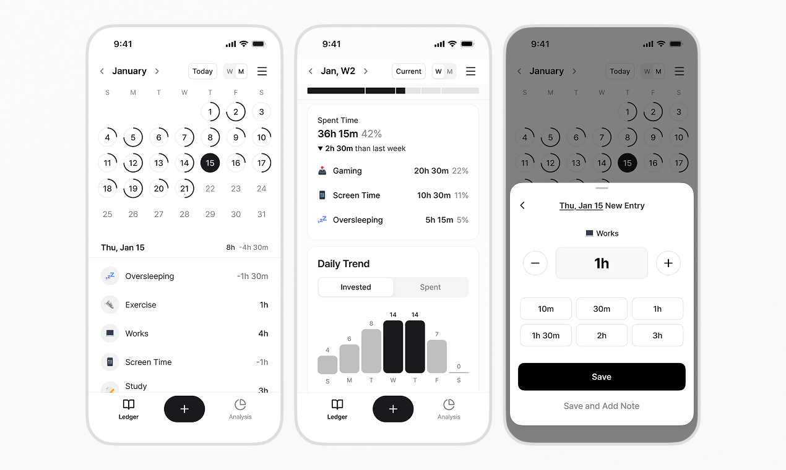
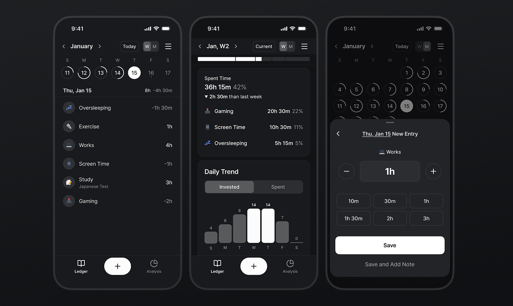

---

## 3. [Yomio](https://www.producthunt.com/products/yomio?utm_campaign=producthunt-api&utm_medium=api-v2&utm_source=Application%3A+antigravity_test+%28ID%3A+258588%29)
**Votes**: 196 | **Tagline**: Turns expenses into the spending truth your bank won’t show.

### 📌 요약
은행 내역에 숨겨진 '진짜 지출의 진실'을 알고 싶다면? 영수증만 올리면 구매 항목별로 쪼개서 보여주는 초정밀 지출 분석 툴, 요미오(Yomio)가 등장했습니다. 이제 모호한 소비 내역 대신 명확한 품목별 지출 트렌드를 확인하세요.

### 🔑 핵심 기능
- 🎯 Target Audience: 지출 관리에 민감한 개인 예산 관리자, 가계부 사용자, 그리고 투명한 비용 관리가 필요한 소규모 사업자 또는 프리랜서.
- ✨ Key Differentiator: 단순히 '어디에 얼마 썼는지'만 보여주는 기존 앱과 달리, 영수증을 분석해 '무엇을 샀는지(품목별)'까지 샅샅이 파악하여 숨겨진 소비 습관(예: 구독료, 반복 구매)을 찾아줍니다.
- 💡 Core Feature: 실물 영수증과 이메일 영수증을 업로드하면, 복잡한 지출 내역을 품목 단위로 정리해 검색 가능한 명확한 소비 이력으로 자동 변환해주는 기능.

### 📸 스크린샷 및 갤러리
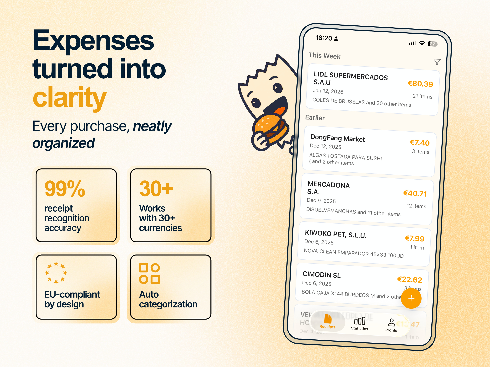
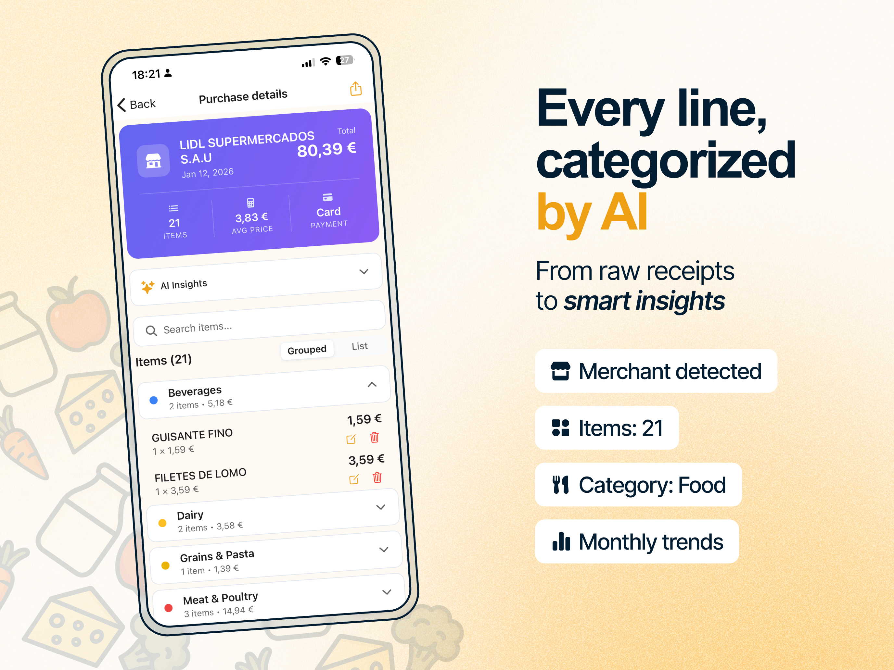
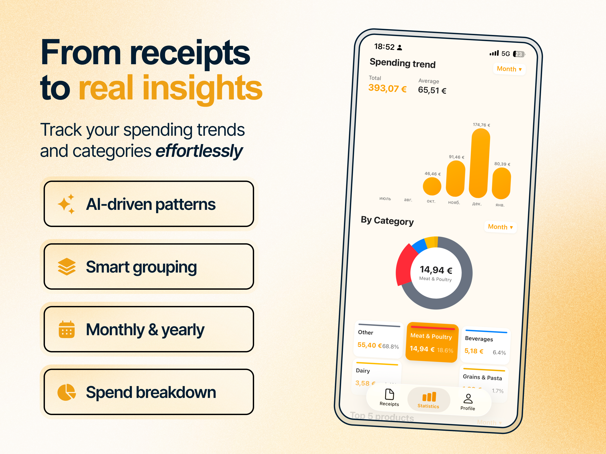

---

## 4. [Good Assistant](https://www.producthunt.com/products/good-assistant?utm_campaign=producthunt-api&utm_medium=api-v2&utm_source=Application%3A+antigravity_test+%28ID%3A+258588%29)
**Votes**: 165 | **Tagline**: Partner for goals that matter

### 📌 요약
Good Assistant는 단순한 비서가 아닌, 사용자의 가장 중요한 목표 달성을 위해 '강력한 기억력'과 '끈기 있는 능동성'으로 무장한 AI 목표 파트너입니다.

### 🔑 핵심 기능
- 🎯 Target Audience: 목표를 설정만 해놓고 달성에 실패했던 사용자, 혹은 핵심 목표에 '실질적인 임팩트'를 줄 수 있는 전담 코치가 필요한 사람.
- ✨ Key Differentiator: 단순히 할 일 관리에 그치지 않고, 목표의 맥락을 잊지 않는 '강력한 장기 기억력'과 목표 달성 시까지 포기하지 않고 돕는 '끈기 있는 능동성'.
- 💡 Core Feature: 목표와 관련된 모든 메모, 할 일, 리마인더를 통합하고, 사용자가 원하는 방향으로 갈 때까지 능동적으로 개입하여 집중력을 유지시키는 기능.

### 📸 스크린샷 및 갤러리
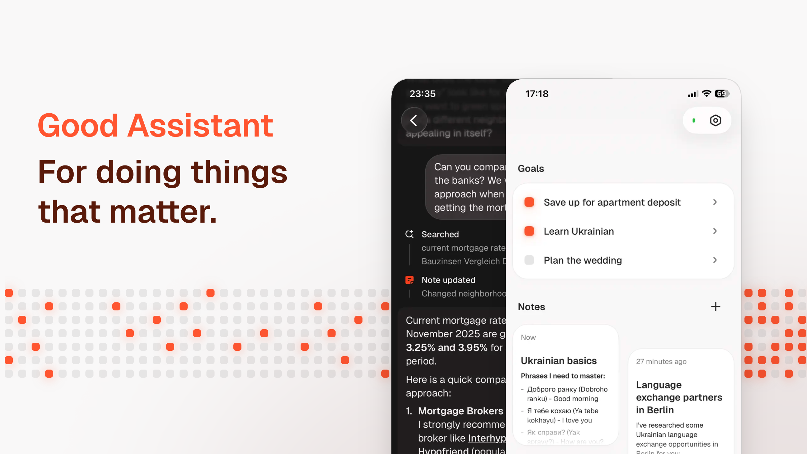
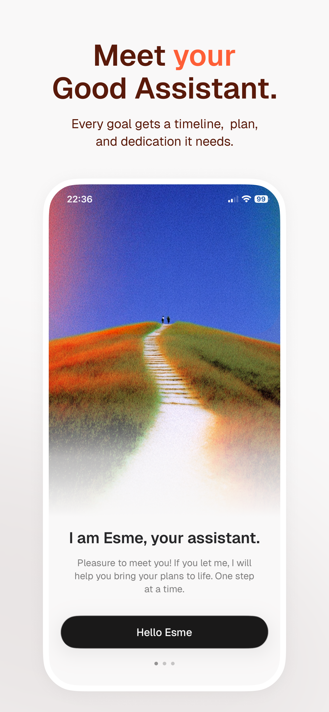
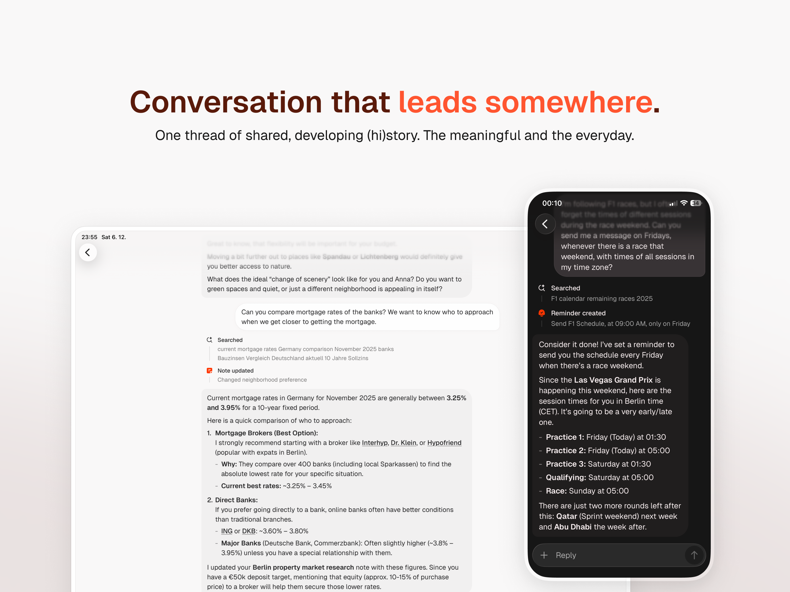

---

## 5. [Hyta](https://www.producthunt.com/products/hyta?utm_campaign=producthunt-api&utm_medium=api-v2&utm_source=Application%3A+antigravity_test+%28ID%3A+258588%29)
**Votes**: 142 | **Tagline**: The home of the AI training force

### 📌 요약
AI 모델을 '실전 투입' 단계로 끌어올리는 필수 과정, 즉 후처리(Post-training) 작업을 위한 고품질 인간 신호 관리 및 자동화 파이프라인 솔루션입니다. 믿을 수 있는 AI 정렬 작업의 대규모 실행을 보장합니다.

### 🔑 핵심 기능
- 🎯 Target Audience: AI 모델의 정렬(Alignment) 및 파인튜닝을 담당하는 전문 팀, RL(강화학습) 벤더사, AI 에이전트 빌더, 그리고 대규모 엔터프라이즈 AI 연구소.
- ✨ Key Differentiator: 단순 데이터 라벨링을 넘어, 고품질의 전문화된 인간 피드백(신호)을 워크플로우에 맞게 '항상 켜진' 파이프라인 형태로 오케스트레이션하여, 후처리 작업을 안정적이고 대규모로 수행 가능하게 합니다.
- 💡 Core Feature: 다양한 도메인에 걸쳐 검증된 후처리 기여도를 추적하고, 이를 통해 최신 AI 역량을 지속적으로 강화하고 복합화(Compounding)하는 파이프라인 관리 기능.

### 📸 스크린샷 및 갤러리

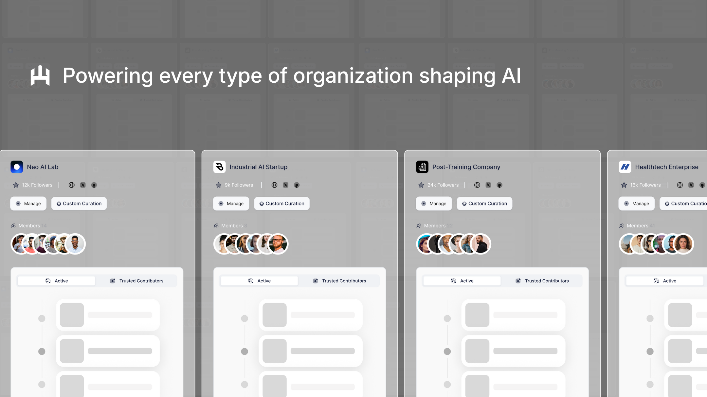
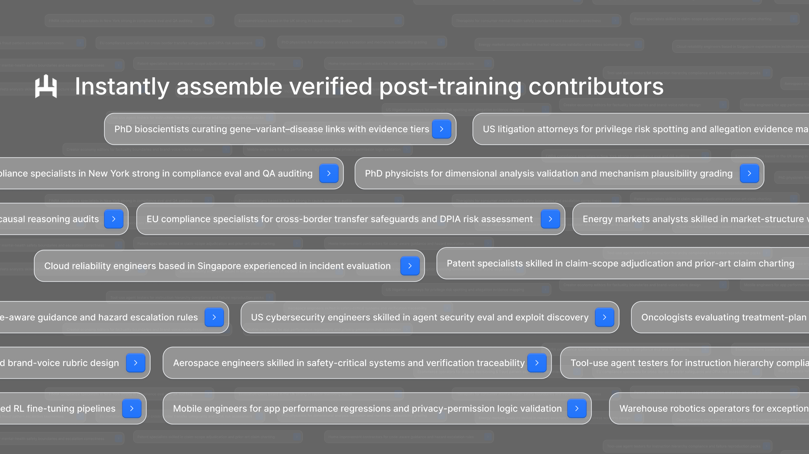

### 🎬 관련 영상
- [🎥 영상 보기](https://ph-files.imgix.net/6b5b249e-9600-4c30-9a49-04fe55152c17.jpeg?auto=format)

---

## 6. [Reavion](https://www.producthunt.com/products/reavion?utm_campaign=producthunt-api&utm_medium=api-v2&utm_source=Application%3A+antigravity_test+%28ID%3A+258588%29)
**Votes**: 124 | **Tagline**: Autonomous browser agents for outbound and GTM execution

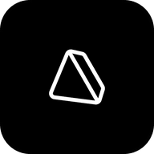

### 📌 요약
단순 반복을 넘어, 웹 서핑부터 판단, 실행까지 알아서 처리해주는 아웃바운드 및 GTM 특화 '자율주행 AI 브라우저'입니다. 이제 채용 없이도 영업 및 마케팅 업무를 무제한으로 확장할 수 있습니다.

### 🔑 핵심 기능
- 🎯 Target Audience: 반복적이고 시간이 많이 소요되는 아웃바운드 영업, 리드 발굴, GTM 전략 실행에 효율적인 자동화가 필요한 창업자, 마케터, 성장(Growth)팀.
- ✨ Key Differentiator: 단순히 매크로를 돌리는 수준이 아니라, AI가 브라우저 내에서 직접 데이터를 읽고, 상황을 판단하며, 사람처럼 행동(Action)하는 진정한 의미의 '자율 실행 에이전트'라는 점.
- 💡 Core Feature: 사람이 수기로 처리하던 복잡한 리서치, 데이터 입력, 콜드 메시지 발송 등 GTM 워크플로우를 엔드투엔드로 자동화하여 업무 효율과 성장 속도를 동시에 극대화.

### 📸 스크린샷 및 갤러리

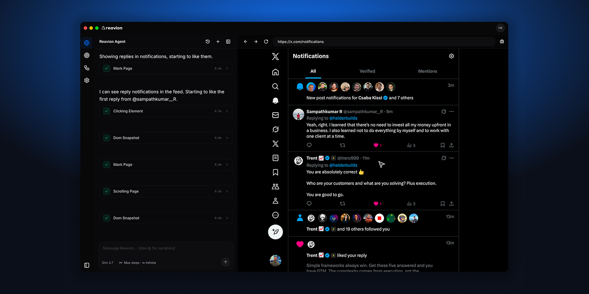
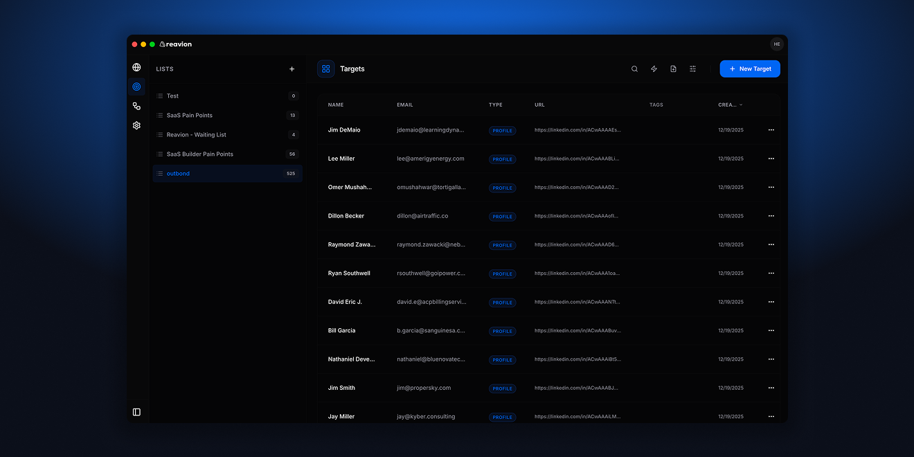

### 🎬 관련 영상
- [🎥 영상 보기](https://ph-files.imgix.net/4e551966-6994-46e0-bcbb-131050d0396f.jpeg?auto=format)

---

## 7. [Compressor](https://www.producthunt.com/products/compressor-2?utm_campaign=producthunt-api&utm_medium=api-v2&utm_source=Application%3A+antigravity_test+%28ID%3A+258588%29)
**Votes**: 109 | **Tagline**: The fastest video compressor for Android.

### 📌 요약
안드로이드에서 영상 압축에 21분이 걸렸다면 이제 11초면 충분합니다. 기존 앱 대비 최대 117배 빠른 속도를 자랑하는 '컴프레서' 앱이 런칭했습니다. 빠르고, 무료이며, 군더더기가 없습니다.

### 🔑 핵심 기능
- 🎯 Target Audience: 대용량 영상을 자주 다루는 안드로이드 사용자 (특히 공유/저장 시 빠른 압축 속도를 원하는 사용자).
- ✨ Key Differentiator: 기존 최고 앱 대비 최대 117배 압도적인 압축 속도와 광고 및 구독료가 전혀 없는 완전 무료 정책.
- 💡 Core Feature: Kotlin 및 네이티브 Media3 파이프라인을 활용하여 구현한, 필요한 프리셋/타겟 사이즈 설정만 제공하는 고성능 압축 기능.

### 📸 스크린샷 및 갤러리
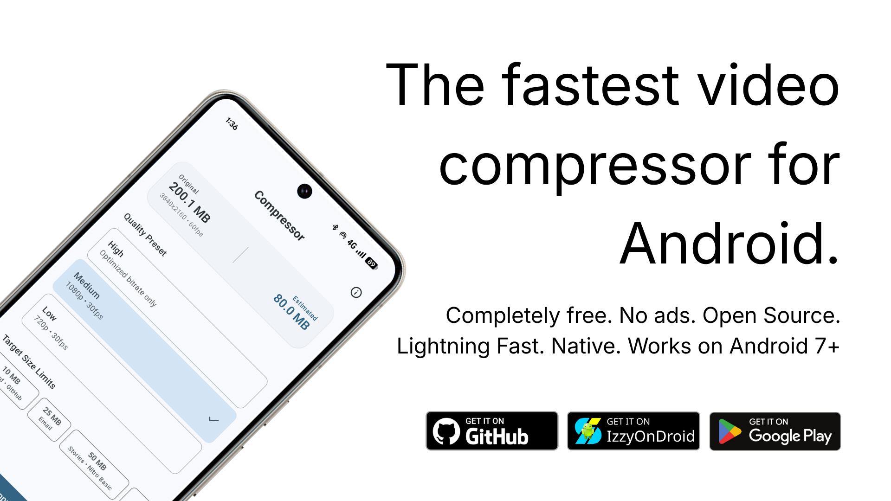
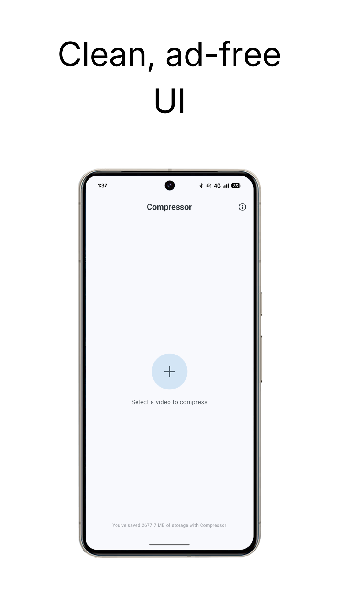
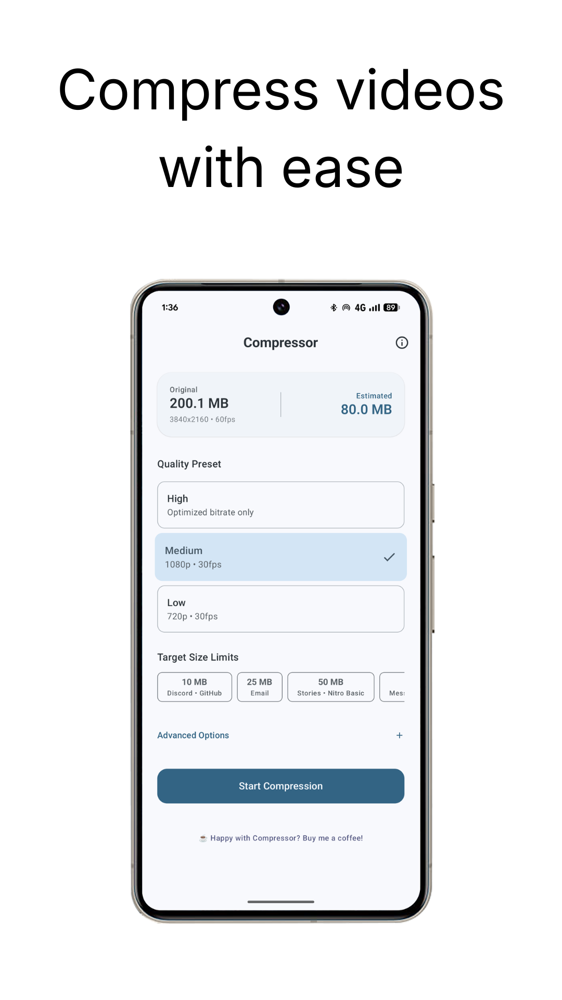

### 🎬 관련 영상
- [🎥 영상 보기](https://ph-files.imgix.net/6a454201-8fdf-4332-af6b-1d7635ad06ac.jpeg?auto=format)

---

## 8. [Projects Yard](https://www.producthunt.com/products/projects-yard?utm_campaign=producthunt-api&utm_medium=api-v2&utm_source=Application%3A+antigravity_test+%28ID%3A+258588%29)
**Votes**: 52 | **Tagline**: Display Projects, Portfolios & get Discovered by Recruiters

### 📌 요약
흩어져 있던 포트폴리오를 단 15분 만에 '기술 중심'의 검색 가능한 인재 풀로 만들어주는, 개발자와 채용 담당자를 위한 새로운 차원의 커리어 플랫폼입니다.

### 🔑 핵심 기능
- 🎯 Target Audience: 실무 경험과 프로젝트를 효과적으로 보여주고 싶은 구직자/프리랜서 및 스킬 기반의 검증된 인재를 찾고 싶은 채용 담당자.
- ✨ Key Differentiator: 단순히 키워드가 아닌, '실제 프로젝트'로 뒷받침되는 '기술 스택'을 중심으로 인재를 검색하게 하여 이력서의 얕은 정보(Shallow pointers)가 아닌 실질적 임팩트를 평가하게 합니다.
- 💡 Core Feature: AI를 활용해 기존 이력서나 포트폴리오 덱을 STAR(Situation, Task, Action, Result) 구조의 체계적인 프로젝트 쇼케이스로 즉시 변환해주는 기능.

### 📸 스크린샷 및 갤러리
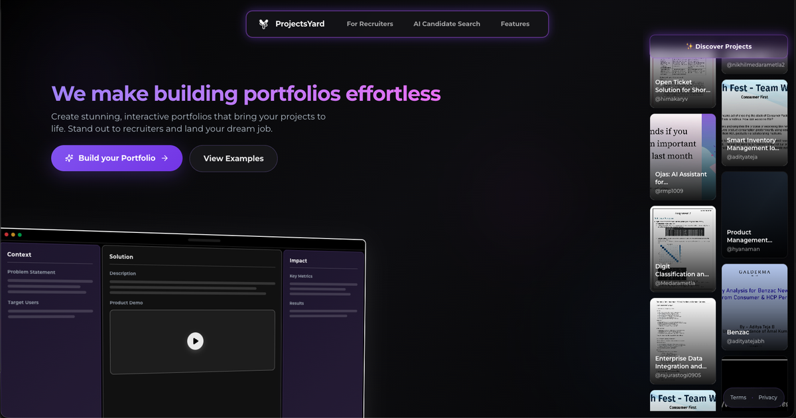
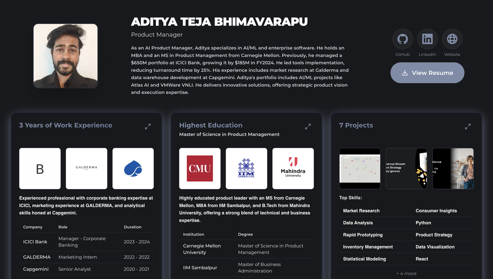
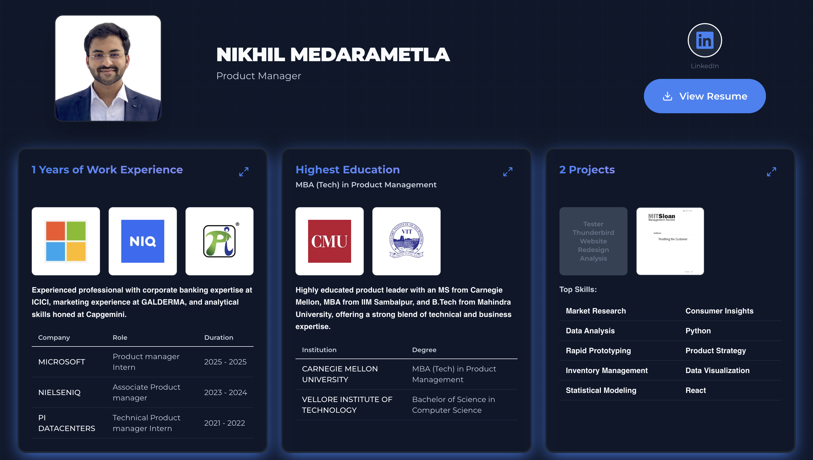

### 🎬 관련 영상
- [🎥 영상 보기](https://ph-files.imgix.net/950170cd-42d0-4a4e-9003-3af309d7e933.jpeg?auto=format)

---

## 9. [▞ nichesim v.1](https://www.producthunt.com/products/nichesim-v-1?utm_campaign=producthunt-api&utm_medium=api-v2&utm_source=Application%3A+antigravity_test+%28ID%3A+258588%29)
**Votes**: 39 | **Tagline**: Simulate communities and gather feedback through AI personas

### 📌 요약
수천 명의 AI 페르소나를 활용해 실제 커뮤니티 반응을 가상으로 시뮬레이션하고, 제품이나 콘텐츠에 대한 피드백을 빠르게 검증해 볼 수 있는 '커뮤니티 시뮬레이션' 툴입니다.

### 🔑 핵심 기능
- 🎯 Target Audience: 아이디어 검증이 필요한 창업가, 신제품 출시 전 시장 반응을 예측하려는 프로덕트 매니저(PM), 캠페인 효과를 미리 테스트하려는 마케터
- ✨ Key Differentiator: 실제 커뮤니티의 반응을 AI 페르소나를 통해 합성적으로 구현하여, 공개 전 단계에서 리스크를 줄이고 객관적인 사용자 피드백을 확보할 수 있습니다.
- 💡 Core Feature: 다양한 AI 페르소나를 설정하고 특정 커뮤니티 반응을 시뮬레이션하여 제품, 콘텐츠, 캠페인 등에 대한 즉각적인 피드백을 수집하는 기능

### 📸 스크린샷 및 갤러리
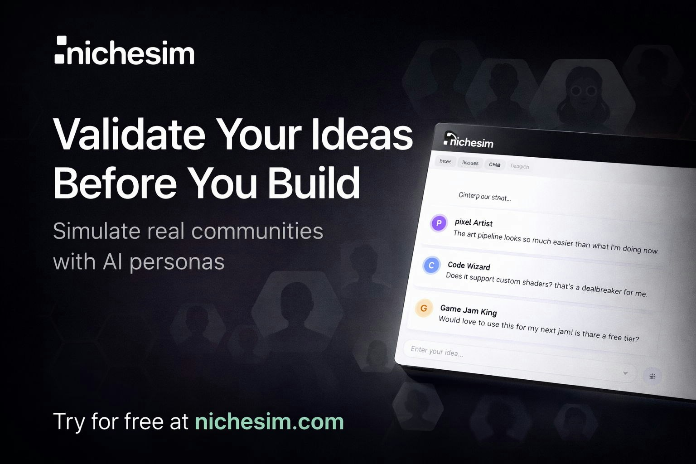
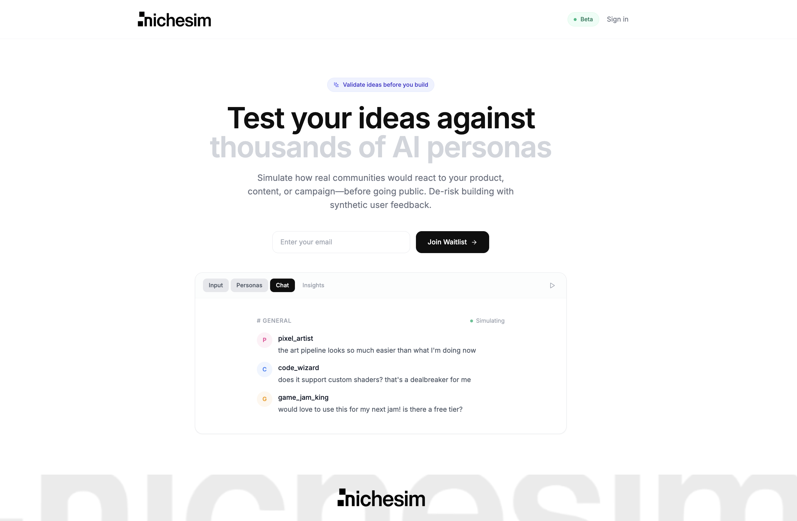
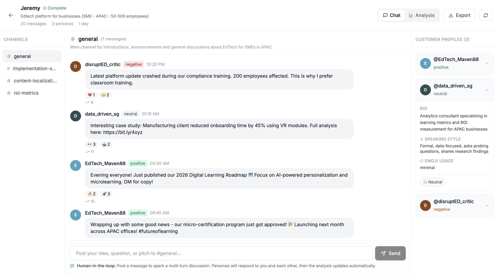

---

## 10. [Prompty Town](https://www.producthunt.com/products/prompty-town?utm_campaign=producthunt-api&utm_medium=api-v2&utm_source=Application%3A+antigravity_test+%28ID%3A+258588%29)
**Votes**: 17 | **Tagline**: Yet another link directory - but better

### 📌 요약
링크 관리가 고민인 사람들을 위한 새로운 솔루션, '프롬프티 타운'이 떴습니다. 흔한 링크 디렉토리처럼 보이지만, '더 나은(better)' 경험을 제공하며 흩어진 디지털 아지트를 깔끔하게 정리해 줄 새로운 방식의 큐레이션 툴입니다.

### 🔑 핵심 기능
- 🎯 Target Audience: 다양한 소셜 미디어나 포트폴리오 링크를 한곳에 깔끔하게 모으고 싶은 크리에이터, 디지털 노마드, 개인 브랜드 구축 희망자.
- ✨ Key Differentiator: 단순히 링크를 나열하는 기존 디렉토리와 달리, 사용자 경험(UX)과 시각적 매력을 극대화하여 '더 나은' 링크 허브를 구축할 수 있게 해줍니다.
- 💡 Core Feature: 여러 개의 외부 채널 및 중요 콘텐츠 링크를 하나의 최적화된 페이지에서 쉽게 관리하고 공유할 수 있는 통합 링크 큐레이션 보드.

### 📸 스크린샷 및 갤러리

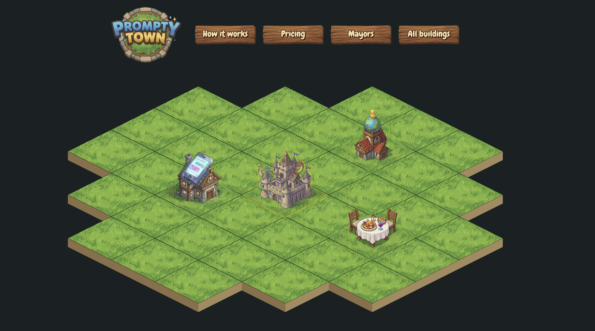

---

