# 🚀 Product Hunt Daily Top 10 (2026-02-03)

## 1. [Hugo](https://www.producthunt.com/products/crisp?utm_campaign=producthunt-api&utm_medium=api-v2&utm_source=Application%3A+antigravity_test+%28ID%3A+258588%29)
**Votes**: 383 | **Tagline**: The AI Agent that doesn't charge 1$ per support ticket

### 📌 요약
고객 지원 티켓당 1달러씩 받는 모델은 이제 그만! Crisp팀이 선보인 Hugo는 반복적인 문의를 엔드투엔드 자동 해결하며 비용 부담까지 확 낮춘 차세대 프로덕션급 AI 에이전트입니다.

### 🔑 핵심 기능
- 🎯 Target Audience: 반복적인 고객 지원 문의 처리로 고통받거나, 기존 AI 챗봇의 건당 과금 모델에 지친 모든 기업.
- ✨ Key Differentiator: 건당(per-resolution) 과금 제도를 완전히 없애, 지원 티켓이 아무리 늘어나도 비용 폭탄 걱정 없이 '생산 등급'의 AI 지원을 제공합니다.
- 💡 Core Feature: 단순 답변을 넘어, 복잡한 문의도 안전하게 대화 종결 및 관련 태스크까지 자동화하는 엔드투엔드 해결 능력.

### 📸 스크린샷 및 갤러리
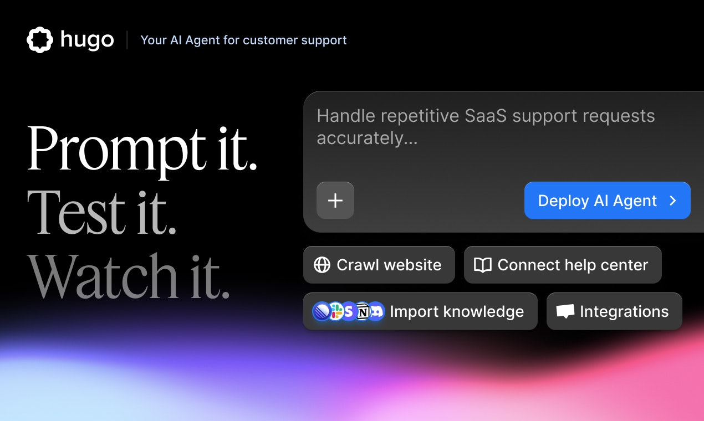

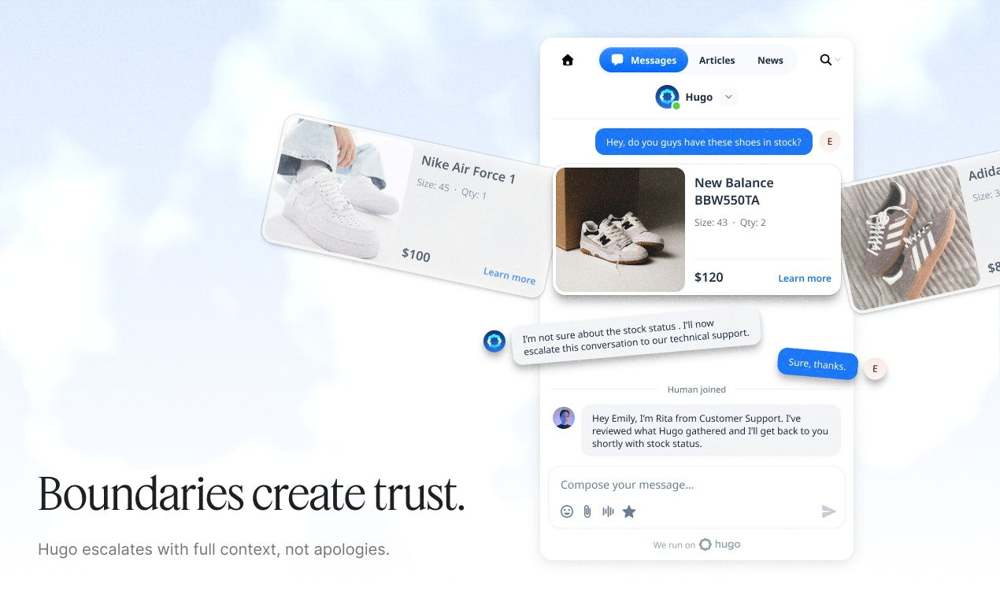

### 🎬 관련 영상
- [🎥 영상 보기](https://ph-files.imgix.net/851e1df8-76da-46b9-b4de-846fa1850992.jpeg?auto=format)

---

## 2. [Atoms](https://www.producthunt.com/products/atoms-5?utm_campaign=producthunt-api&utm_medium=api-v2&utm_source=Application%3A+antigravity_test+%28ID%3A+258588%29)
**Votes**: 296 | **Tagline**: Turn your ideas into products that sell  

### 📌 요약
아이디어는 있는데 구현이 막막할 때? 기획부터 결제 시스템 연동까지, '돈 벌리는 제품'을 A부터 Z까지 만들어주는 올인원 비즈니스 팀, Atoms가 떴습니다.

### 🔑 핵심 기능
- 🎯 Target Audience: 아이디어만 있고 개발 역량(코딩, 디자인)이나 시장 조사 능력이 부족한 예비 창업자 및 사이드 프로젝트 빌더.
- ✨ Key Differentiator: 단순 프로토타입 제작에 그치지 않고, 시장성 조사, 결제/인증 시스템 연동까지 완료하여 바로 수익 창출이 가능한 '라이브 앱'을 즉시 출고해 줍니다.
- 💡 Core Feature: 기획부터 프론트/백엔드 개발은 물론, 수익화의 핵심인 인증(Auth) 및 결제(Payments) 시스템을 완벽하게 연결해주는 풀스택 서비스 제공.

### 📸 스크린샷 및 갤러리
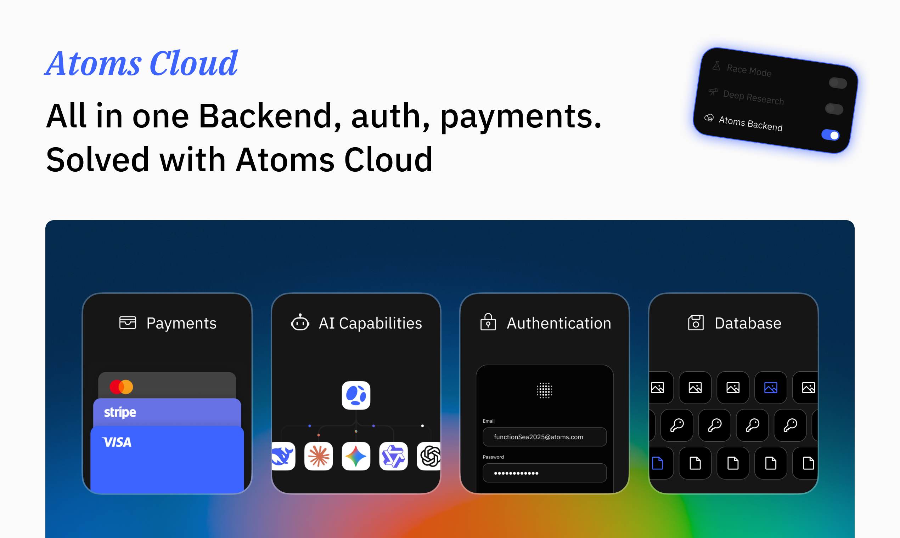
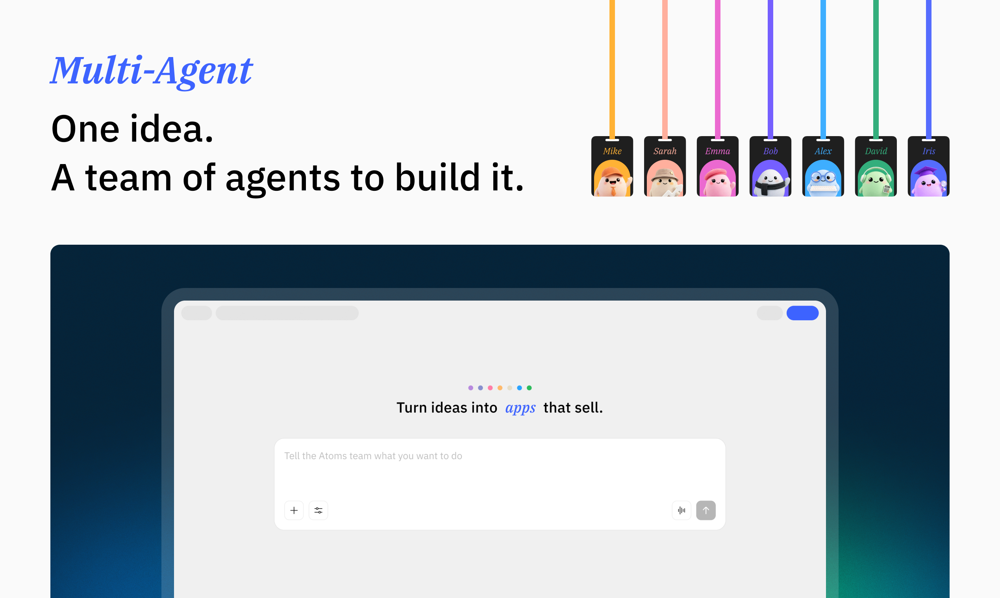
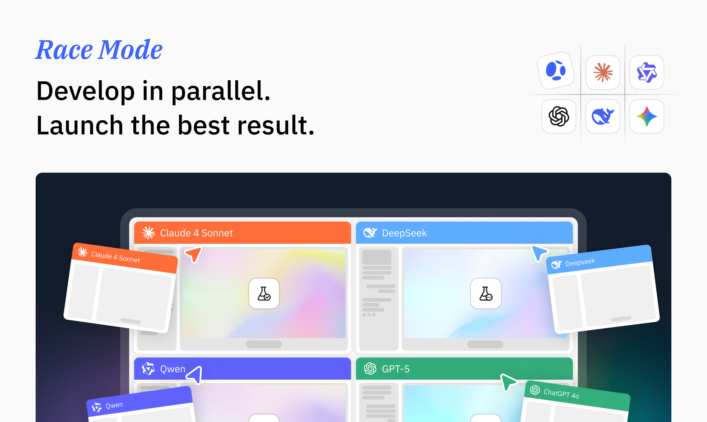

### 🎬 관련 영상
- [🎥 영상 보기](https://ph-files.imgix.net/423f37a1-a1f8-4988-a88d-a707aaf472ce.jpeg?auto=format)

---

## 3. [findable.](https://www.producthunt.com/products/findable-3?utm_campaign=producthunt-api&utm_medium=api-v2&utm_source=Application%3A+antigravity_test+%28ID%3A+258588%29)
**Votes**: 258 | **Tagline**: A full Answer Engine Optimization (AEO) platform for free

### 📌 요약
ChatGPT, Gemini 등 주요 AI 검색 엔진 최적화(AEO)를 무료로 시작하게 해주는 마케팅/세일즈 필수 플랫폼, 'findable'이 출시되었습니다.

### 🔑 핵심 기능
- 🎯 Target Audience: AI 기반 검색 엔진(ChatGPT, Gemini, Grok, Perplexity 등)에서 콘텐츠 노출을 극대화하려는 마케터, 세일즈 전문가, 콘텐츠 제작자.
- ✨ Key Differentiator: 기존 SEO(검색 엔진 최적화)를 넘어, AI 답변 엔진 시대에 맞춰 AEO(Answer Engine Optimization)에 집중하는 풀 플랫폼을 무료로 제공.
- 💡 Core Feature: AI 챗봇 및 AI 모드 검색 결과에 최적화된 콘텐츠 전략과 성과를 종합적으로 분석하고 관리하는 기능.

### 📸 스크린샷 및 갤러리
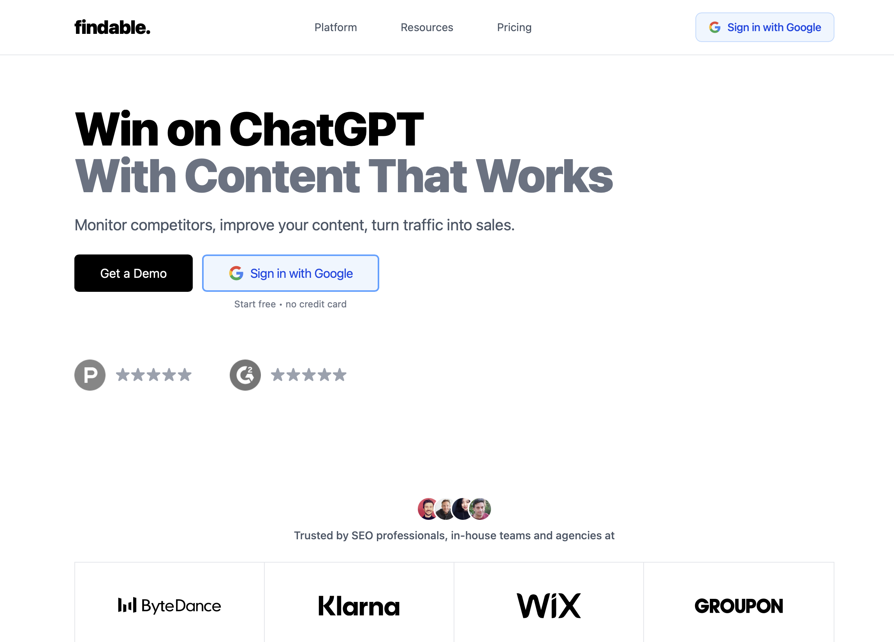

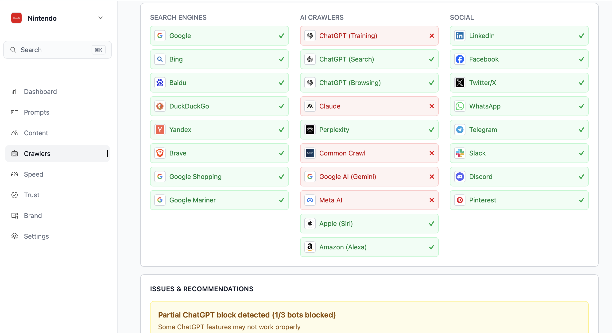

### 🎬 관련 영상
- [🎥 영상 보기](https://ph-files.imgix.net/0f2868b4-4f80-4e11-b9a3-92b46a92be1f.gif?auto=format)

---

## 4. [Codex by OpenAI](https://www.producthunt.com/products/openai?utm_campaign=producthunt-api&utm_medium=api-v2&utm_source=Application%3A+antigravity_test+%28ID%3A+258588%29)
**Votes**: 243 | **Tagline**: A command center for working with agents

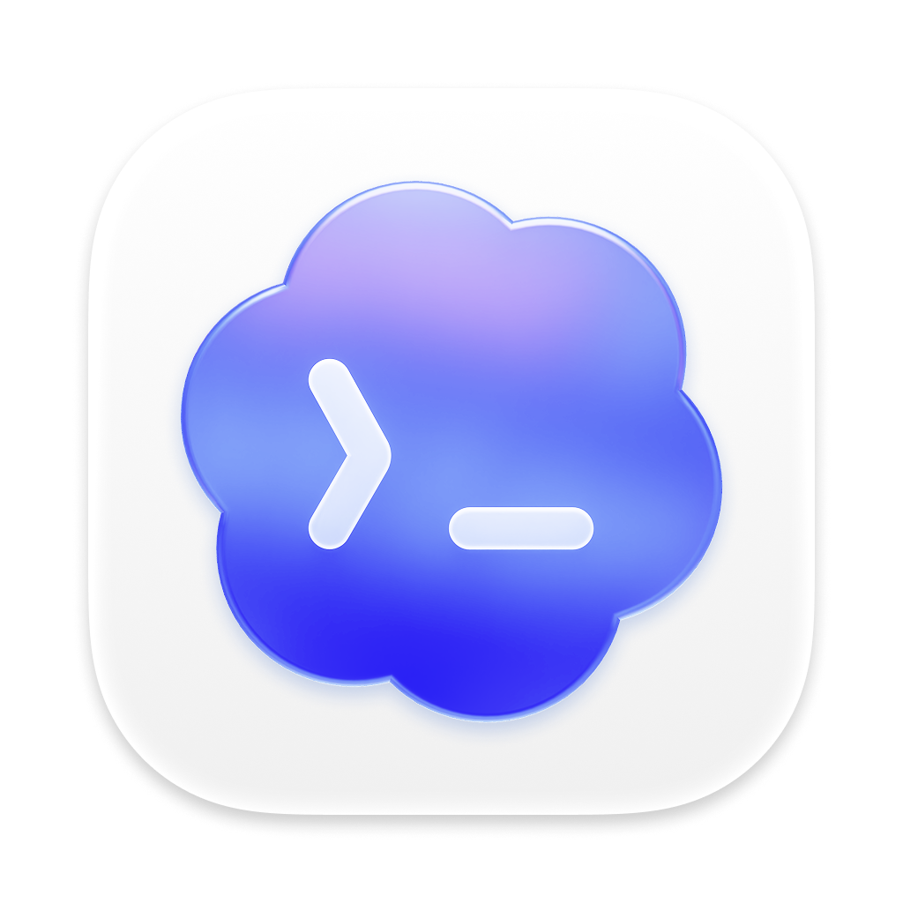

### 📌 요약
OpenAI가 드디어 개발자들을 위한 궁극의 AI 커맨드 센터, 'Codex' macOS 앱을 출시했습니다. 단순 코딩 보조를 넘어, 여러 AI 에이전트와 병렬 작업을 지휘하며 소프트웨어 개발 전체 라이프사이클을 혁신합니다.

### 🔑 핵심 기능
- 🎯 Target Audience: AI 기반 소프트웨어 설계/개발/운영의 전 과정을 감독하고 효율을 극대화하려는 개발자, 테크 리더, 그리고 전문 프로그래머.
- ✨ Key Differentiator: 단일 코딩 에이전트와의 단순 협업을 넘어, 여러 에이전트로 구성된 팀을 지휘하여 복잡하고 장기적인 개발 작업을 병렬적으로 처리하고 관리하는 최초의 통합 플랫폼.
- 💡 Core Feature: 소프트웨어 설계부터 유지보수까지 전 과정을 에이전트 팀에게 위임하고, 사용자는 핵심 의사 결정과 감독에만 집중할 수 있게 하는 '에이전트 팀 감독 및 병렬 워크플로우 관리' 기능.

### 📸 스크린샷 및 갤러리
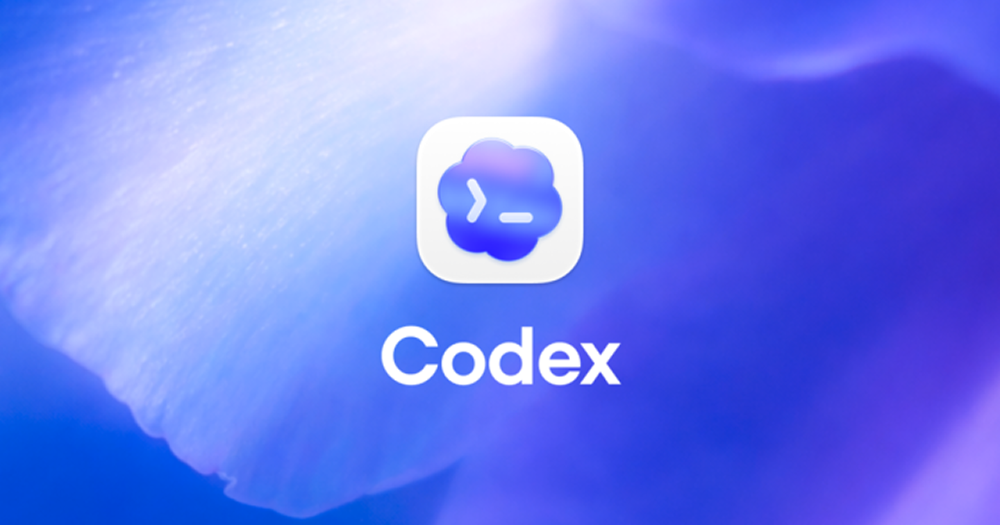
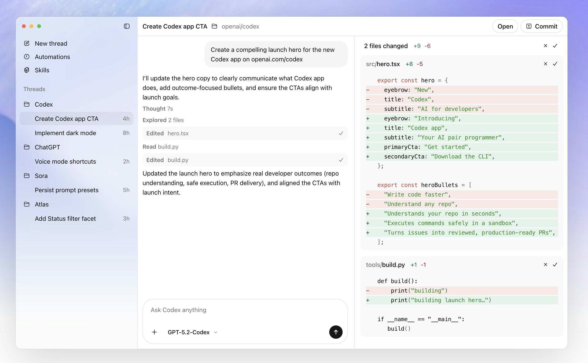

### 🎬 관련 영상
- [🎥 영상 보기](https://ph-files.imgix.net/f9a27ef5-e0bd-4bda-a29e-bc639fd36543.jpeg?auto=format)

---

## 5. [AI Doc Writer by Trupeer](https://www.producthunt.com/products/trupeer?utm_campaign=producthunt-api&utm_medium=api-v2&utm_source=Application%3A+antigravity_test+%28ID%3A+258588%29)
**Votes**: 233 | **Tagline**: Create finished, on-brand docs from simple recordings.

### 📌 요약
지긋지긋한 문서 작업은 이제 끝! 녹화 파일만 올리면 AI가 알아서 브랜딩까지 완벽한 단계별 가이드 문서를 뚝딱 만들어주는 툴이 등장했습니다.

### 🔑 핵심 기능
- 🎯 Target Audience: SOP, 튜토리얼, 제품 데모 자료를 빠르게 만들어야 하는 프로덕트 팀, 운영 팀, 기술 문서 작성자 (Technical writers).
- ✨ Key Differentiator: 단순 음성 인식이 아닌 화면 기반(Vision-based) AI 분석으로 녹화 중 중요한 액션만 추출하며, 샘플 문서를 통해 기업의 톤앤매너와 브랜딩을 유지하는 '온-브랜드' 문서 자동 생성.
- 💡 Core Feature: 불완전하거나 오래된 녹화 파일이라도 즉시 깔끔한 단계별 매뉴얼 문서로 변환 (Clear summary, structured steps, relevant screenshots 포함).

### 📸 스크린샷 및 갤러리
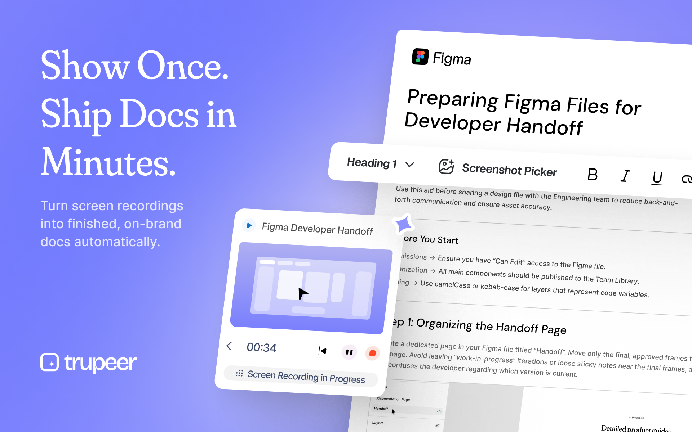
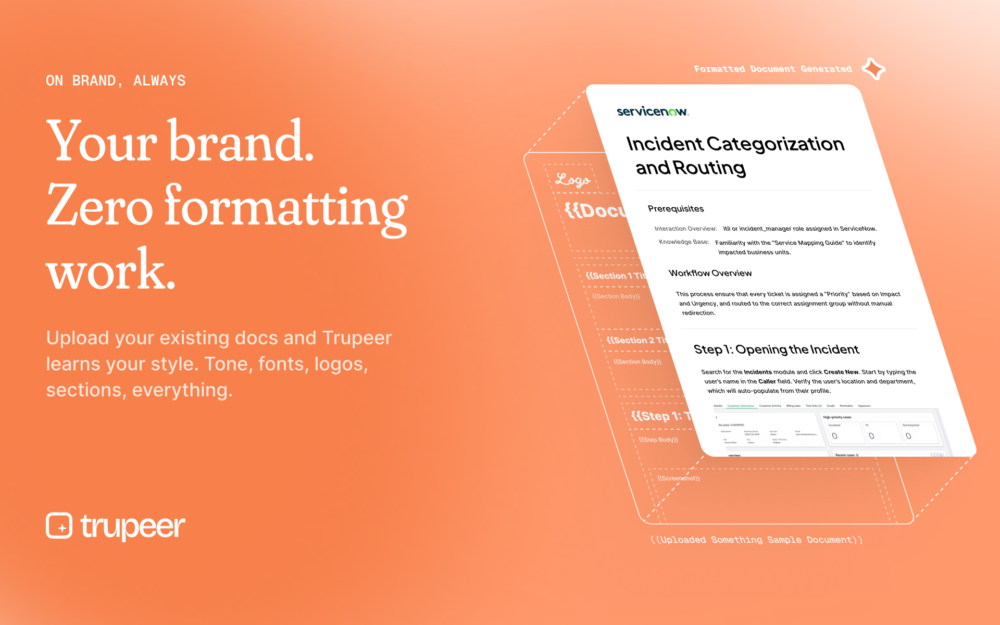
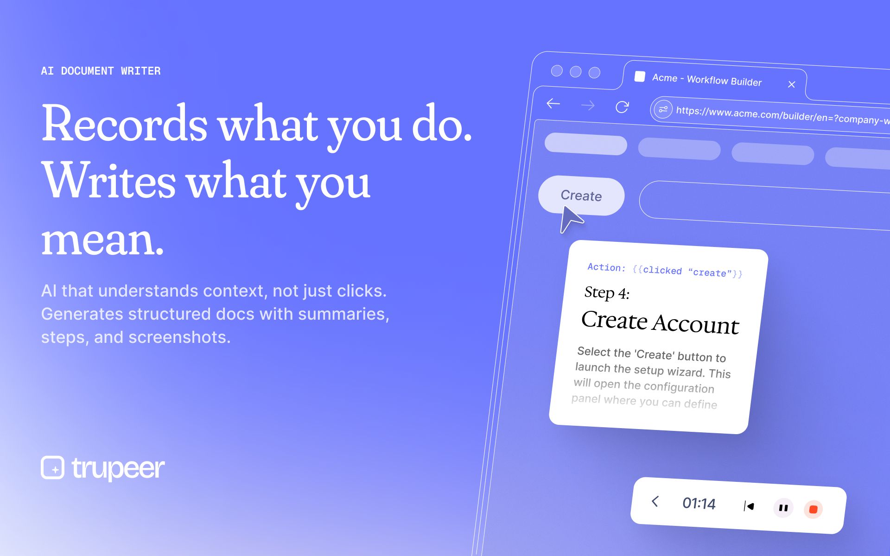

### 🎬 관련 영상
- [🎥 영상 보기](https://ph-files.imgix.net/ff51dbdf-a2cf-4cc0-a6eb-32c3c1077c12.jpeg?auto=format)

---

## 6. [Helply](https://www.producthunt.com/products/helply?utm_campaign=producthunt-api&utm_medium=api-v2&utm_source=Application%3A+antigravity_test+%28ID%3A+258588%29)
**Votes**: 199 | **Tagline**: 65% AI resolution rate in 90 days, or you pay nothing

### 📌 요약
90일 안에 고객 지원 문의의 65%를 AI가 해결해 주지 못하면 돈을 받지 않겠다는, 성과 보장형 엔드투엔드 AI 서포트 에이전트 서비스 'Helply'가 등장했습니다.

### 🔑 핵심 기능
- 🎯 Target Audience: 고객 지원 효율 극대화를 원하는 모든 기업 (특히 빠른 응답 시간과 높은 해결률이 중요한 SaaS/IT 기업).
- ✨ Key Differentiator: 90일 내 AI 해결률 65% 미달 시 전액 환불을 보장하는 '성과 기반 계약' 모델. (기존 솔루션 대비 명확한 ROI 보장).
- 💡 Core Feature: 단순히 답변만 하는 것이 아닌, 실제 액션 수행, 헬프 데스크 동기화, 그리고 전체 맥락과 출처를 인용하여 에스컬레이션하는 '완전 자동화된 엔드투엔드 고객 지원' 기능.

### 📸 스크린샷 및 갤러리

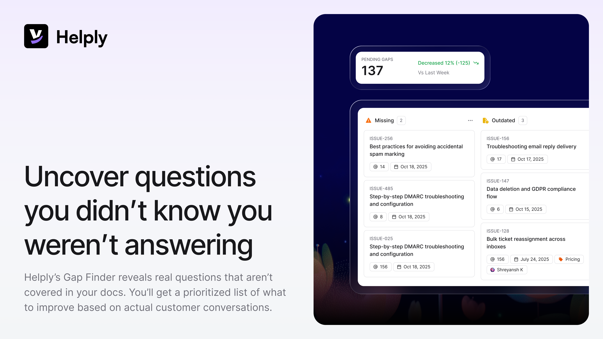

### 🎬 관련 영상
- [🎥 영상 보기](https://ph-files.imgix.net/cf26bb7f-0dd5-4852-be29-30727ddb24ba.jpeg?auto=format)

---

## 7. [Lightfern for Email](https://www.producthunt.com/products/lightfern?utm_campaign=producthunt-api&utm_medium=api-v2&utm_source=Application%3A+antigravity_test+%28ID%3A+258588%29)
**Votes**: 150 | **Tagline**: The telepathic AI writing tool

### 📌 요약
당신의 이메일 작성 스타일을 완벽히 학습하여, 손가락이 키보드에 닿기도 전에 당신의 문장을 완성해 주는 '텔레파시 AI 작가' 브라우저 확장 프로그램입니다.

### 🔑 핵심 기능
- 🎯 Target Audience: 이메일 작성에 시간을 많이 쓰거나, 개인적인 뉘앙스를 놓치지 않으면서 빠른 응답이 필요한 비즈니스 사용자 및 전문가.
- ✨ Key Differentiator: 단순 자동 완성이 아닌, 사용자의 고유한 말투(별명, 서명, 톤)와 과거 쓰레드의 맥락까지 파악해 '나다운' 문장을 완성하며, 기본적으로 데이터 보유를 하지 않아 개인 정보 보호에 강점을 가집니다.
- 💡 Core Feature: 수신함에서 직접 작동하며, 과거 대화의 문맥을 활용해 사용자가 마무리할 법한 방식으로 문장이나 생각을 즉각적으로 완성해 주는 기능.

### 📸 스크린샷 및 갤러리
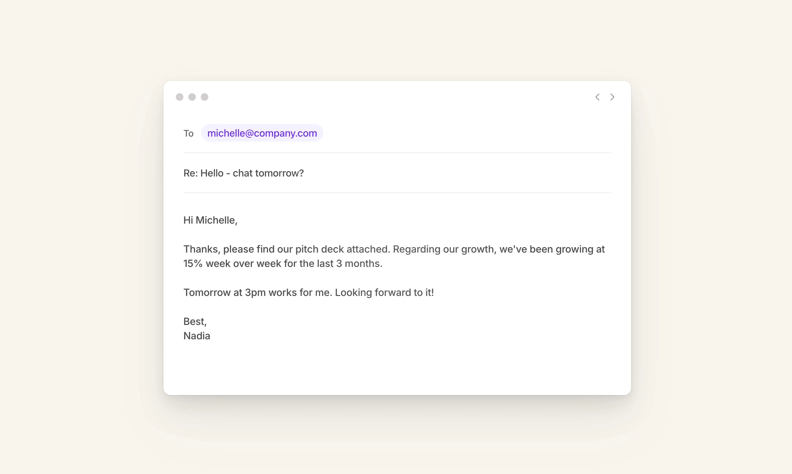
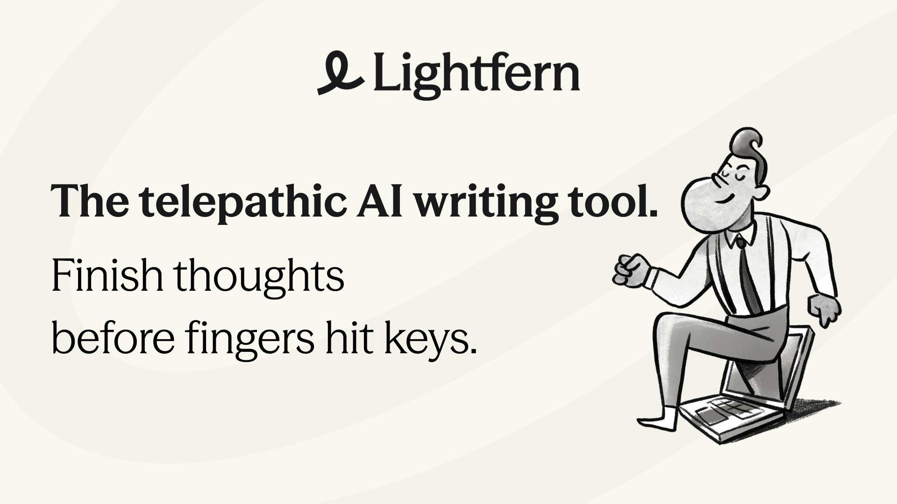
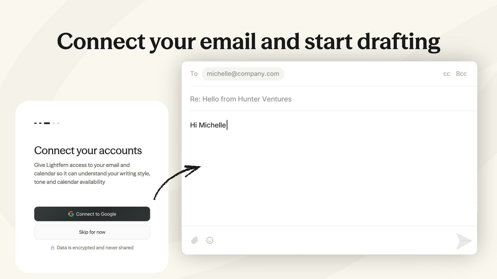

---

## 8. [Relay.app Agents](https://www.producthunt.com/products/relay-app?utm_campaign=producthunt-api&utm_medium=api-v2&utm_source=Application%3A+antigravity_test+%28ID%3A+258588%29)
**Votes**: 147 | **Tagline**: Build an AI team that works for you

### 📌 요약
복잡한 워크플로우를 알아서 처리하고 시간이 지날수록 똑똑해지는, 나만을 위한 AI 에이전트 팀을 구축하는 가장 쉬운 방법이 등장했습니다.

### 🔑 핵심 기능
- 🎯 Target Audience: 여러 앱(Gmail, Notion, HubSpot 등)을 오가며 발생하는 반복 업무에 지친 개인 사용자 및 효율적인 비즈니스 자동화 솔루션을 찾는 스몰 팀.
- ✨ Key Differentiator: 단순 트리거 기반의 자동화(Automation)를 넘어, 수백 개의 앱을 연동하여 24시간 '능동적(Proactive)'으로 업무를 수행하고 스스로 발전하는 AI 팀 개념.
- 💡 Core Feature: Gmail, Notion, HubSpot 등 핵심 업무 앱들을 연결하여 복잡한 프로세스를 정의하고, AI 에이전트가 이를 전담 처리하도록 위임하는 기능.

### 📸 스크린샷 및 갤러리
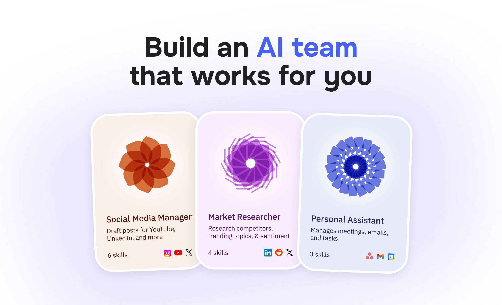
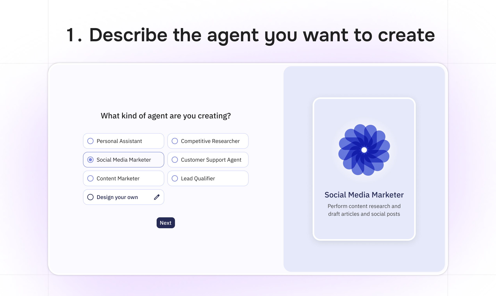
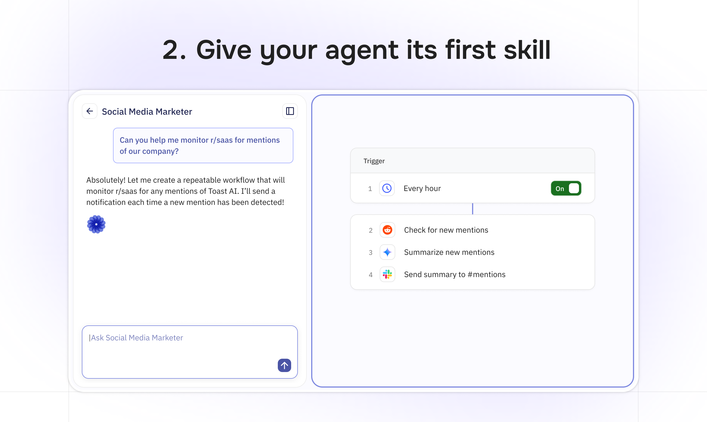

### 🎬 관련 영상
- [🎥 영상 보기](https://ph-files.imgix.net/5ac93a1d-e3f3-4c8e-87c3-5fb0e698cc4d.jpeg?auto=format)

---

## 9. [Grok Imagine 1.0](https://www.producthunt.com/products/grok-com-beta?utm_campaign=producthunt-api&utm_medium=api-v2&utm_source=Application%3A+antigravity_test+%28ID%3A+258588%29)
**Votes**: 139 | **Tagline**: It’s never been easier to bring your ideas to life.

### 📌 요약
아이디어를 실사판 영상으로 만드는 작업이 드디어 현실화되었습니다. xAI의 Grok Imagine 1.0은 퀄리티와 속도, 비용 효율까지 잡으며 10초짜리 720p 영상 생성의 진입 장벽을 대폭 낮춘 고성능 AI 비디오 생성 플랫폼입니다.

### 🔑 핵심 기능
- 🎯 Target Audience: 빠르고 고품질의 영상 콘텐츠 제작이 필요한 크리에이터, 마케터, 영상 프로토타입이 필요한 개발자.
- ✨ Key Differentiator: 기존 대비 대폭 개선된 영상 품질(720p 10초 지원)과 낮은 지연 시간 및 비용 효율. 특히 움직임과 시각적 연속성(Visual Continuity)이 크게 향상됨.
- 💡 Core Feature: 텍스트, 이미지, 기존 영상 소스를 이용해 생성부터 편집까지 전 과정을 처리할 수 있도록 지원하는 새로운 통합 API (Unified API).

### 📸 스크린샷 및 갤러리
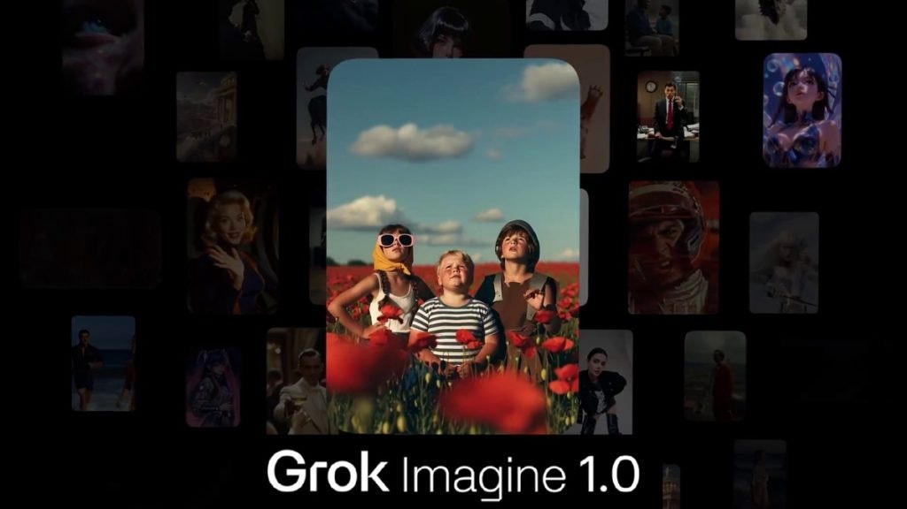
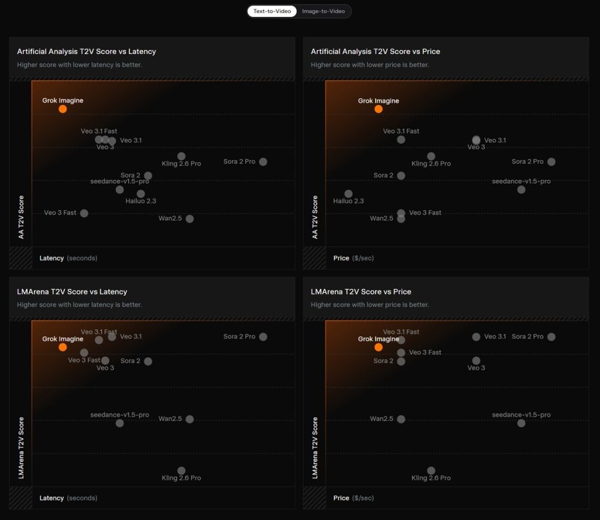

---

## 10. [Logo Link by Brand.dev](https://www.producthunt.com/products/brand-dev?utm_campaign=producthunt-api&utm_medium=api-v2&utm_source=Application%3A+antigravity_test+%28ID%3A+258588%29)
**Votes**: 122 | **Tagline**:  Display any company logo with a single URL. No API needed.

### 📌 요약
5천 개 이상 기업이 사용하는 Brand.dev가 API 호출 없이 URL 단 하나로 모든 회사 로고를 초고속으로 표시해주는 '로고 링크(Logo Link)'를 출시했습니다.

### 🔑 핵심 기능
- 🎯 Target Audience: 클라이언트향 UI를 구축하며 대량의 로고를 안정적으로 표시해야 하는 프론트엔드 개발자 및 서비스 운영팀.
- ✨ Key Differentiator: 기존 API 방식의 오버헤드(호출 비용, 지연, 관리)를 완전히 제거하고, 직관적인 URL 접근 방식으로 개발자 경험(DX)을 극대화.
- 💡 Core Feature: 전 세계 CDN으로 최적화되어 대규모 읽기 작업에 특화된 초고속 로고 제공. 이미 검증된 Brand.dev의 방대한 데이터 기반.

### 📸 스크린샷 및 갤러리
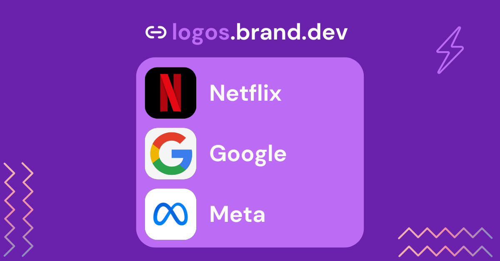
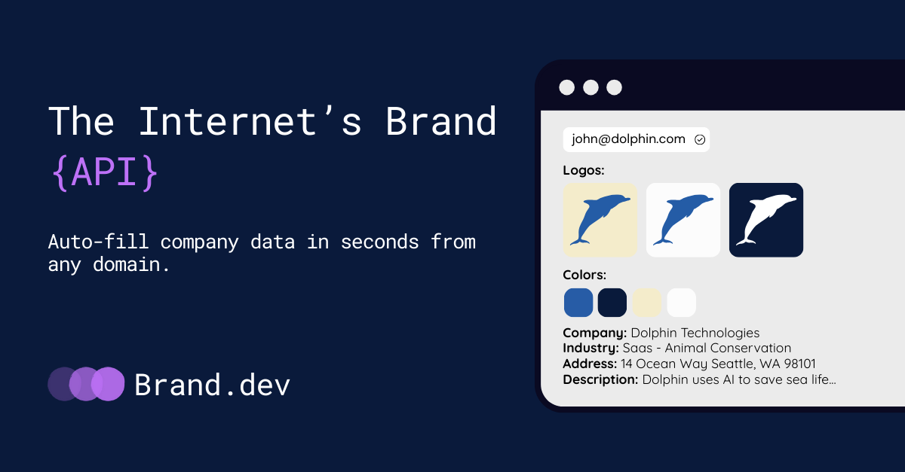

---

